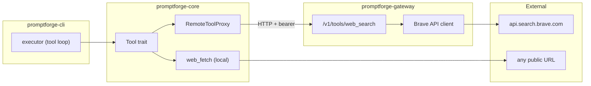

# Brave web search tools plan

*2026-07-29 09:37 - transcript 43a2c16b-04fa-4baf-a5bb-bf3bb41ce56f*


## Prompts


**[p1]** are websearch and webfetch mcp tools

**[p2]** show me the tool definition

**[p3]** show me the JSON in a fence

**[p4]** @promptforge do I make webfetch and websearch its own linkable rust crate and where does the Brave API key go, the gateway or.. something else?

**[p5]** so the gateway is the model router and also search tools provider?

**[p6]** the gateway makes sense

**[p7]** I think websearch / fetch should be its own crate. web_tools?

**[p8]** so is this mcp then?

**[p9]** so then how does the executor get the tools

**[p10]** but only web tools are going in the gateway. other tools are going in as linkable crates

**[p11]** gateway should not know about core - my gut says this

**[p12]** what is a Trait?

**[p13]** wait a sec... the gateway only needs search, not fetch

**[p14]** yeah I think, the gateway just inlines a web_search route and it has Brave as the first provider (later we can allow configuring additional ones)., gateway owns the key. and since web search is fundamental, we inline the web search and web fetch tools right into the executor core. one wrinkle is we need trafilatura or whatever to clean out the web fetch.

**[p15]** Hell no to shellout

**[p16]** what is feature-gate is that like conditional compilation?

**[p17]** hmm... maybe it should be a separate crate?

**[p18]** wait what? core has to have the tools or else how will someone who links with just core (who has their own cli) get the web tools?

**[p19]** no I never want "features". only one version of the binary. if its a problem we split the crate up later.

**[p20]** plan the brave web search feature

**[p21]** how good is the readability crate? I dont want a bunch of junk. how does it compare to trafilatura

**[p22]** documentaiton for all this? config file keys etc?

**[p23]** apply @tools-public/how-to/how-to-vibe.md

**[p24]** apply @tools-public/how-to/how-to-write-rust.md

**[p25]** Web search work?

**[p26]** I don't understand, why didn't you add a test that's man that you run manually that. Check this. That calls brave.

**[p27]** I want to see it work, add the test make it manual, then run it'


## Plans

### Brave web search tools

*Add `web_search` (via Brave API through gateway) and `web_fetch` (local, in-process) tools to promptforge, with the tool-call loop in the executor.*

# Brave Web Search and Web Fetch Tools

## Architecture



- **Gateway** owns the Brave API key, exposes `POST /v1/tools/web_search`
- **Core** owns the `Tool` trait, `web_fetch` implementation (local HTTP + readability + markdown), and `RemoteToolProxy` (calls gateway for remote tools)
- **Gateway does NOT depend on core**

## Gateway: `/v1/tools/web_search`

### Config addition to `gateway.toml`

```toml
[tools.web_search]
provider = "brave"
api_key = "${BRAVE_API_KEY}"
```

New `ToolsConfig` struct in [crates/promptforge-gateway/src/config.rs](crates/promptforge-gateway/src/config.rs) - optional section, gateway still starts without it (tools just unavailable).

### Route

- `POST /v1/tools/web_search` - bearer-authed same as `/v1/chat/completions`
- Request body: `{ "query": "...", "count": 10 }`
- Response body: `{ "results": [{ "title": "...", "url": "...", "description": "...", "age": "..." }] }`
- Internally calls `GET https://api.search.brave.com/res/v1/web/search?q=...&count=...` with `X-Subscription-Token` header
- Strips Brave response down to just the `web.results` array fields we care about

### New file: `crates/promptforge-gateway/src/tools.rs`

Inline Brave HTTP client (one function, ~40 lines). Axum handler for the route.

## Core: Tool trait and implementations

### New file: `crates/promptforge-core/src/tools.rs`

```rust
#[async_trait]
pub trait Tool: Send + Sync {
    fn name(&self) -> &str;
    fn description(&self) -> &str;
    fn parameters_schema(&self) -> serde_json::Value;
    async fn call(&self, args: serde_json::Value) -> Result<String>;
}
```

### New file: `crates/promptforge-core/src/tools/web_fetch.rs`

- `pub struct WebFetch` implements `Tool`
- Fetches URL with `reqwest`, runs through `readabilityrs` for content extraction (it has built-in markdown output), falls back to `htmd::convert` for non-article pages
- Returns markdown string

### New file: `crates/promptforge-core/src/tools/web_search.rs`

- `pub struct WebSearch` (a `RemoteToolProxy` specialized for web_search)
- Calls `POST {base_url}/tools/web_search` on the gateway
- Returns JSON string of results for the model to consume

## Core: Executor tool-call loop

Modify [crates/promptforge-core/src/execute.rs](crates/promptforge-core/src/execute.rs):

- `pub async fn run` gains a `tools: &[&dyn Tool]` parameter
- After calling `client.complete()`, check if response contains `tool_calls` (new field in `ChatResponse`)
- If yes: execute each tool call, append tool results as `tool` role messages, re-send to model
- Loop until model responds with plain text (cap at N iterations to prevent infinite loops)

Modify [crates/promptforge-core/src/client.rs](crates/promptforge-core/src/client.rs):

- `GatewayClient::complete` gains an optional `tools` parameter (the JSON schema array for the model)
- Response parsing handles both `content` (text) and `tool_calls` (array) in the choice message
- New return type or enum: `CompletionResult::Text(String)` | `CompletionResult::ToolCalls(Vec<ToolCall>)`

## Prompt frontmatter: tool declaration

The prompt file declares which tools it uses:

```yaml
---
name: research
description: Research a topic
version: 1
tools: [web_search, web_fetch]
---
```

The executor matches these names against the provided `&[&dyn Tool]` slice and passes their schemas to the model.

## New dependencies

### `promptforge-core/Cargo.toml`

- `readabilityrs = "0.1"` - HTML content extraction with markdown output
- `htmd = "0.5"` - fallback HTML-to-markdown
- `async-trait` (already in workspace)

### `workspace Cargo.toml`

- Add `readabilityrs` and `htmd` to workspace dependencies

## Testing

- Gateway: integration test hitting `/v1/tools/web_search` with a mock Brave response (same pattern as existing chat completions test)
- Core `web_fetch`: unit test with canned HTML, verify markdown output
- Core executor: test the tool-call loop with a mock tool that returns a fixed value


Todos:

- Add optional [tools.web_search] section to gateway config parsing
- Add POST /v1/tools/web_search route with inline Brave API client
- Define Tool trait in promptforge-core/src/tools.rs
- Implement WebFetch tool (reqwest + readabilityrs + htmd fallback)
- Implement WebSearch as remote proxy calling gateway
- Extend GatewayClient to send tool schemas and parse tool_calls responses
- Add tool-call loop to executor (dispatch, append results, re-send)
- Parse tools field from prompt frontmatter, wire to executor
- Integration tests for gateway route, unit tests for web_fetch and executor loop

StrReplace-edited design docs (path only): `c:\Users\Vinnie\src\cursor\promptforge\README.md`
