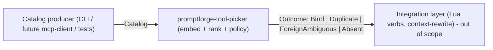

# MCP client work, evening

*2026-08-02 23:31 - transcript 1add7542-4149-4b47-82fb-5435e76cb7d4*

## Prompts

**[p1]** how does mcp client work? what does an agentic harness need to implement

**[p2]** should I put the mcp client in its own crate

**[p3]** tell me about this sampling business

**[p4]** so the mcp client just appears as a normal tool call to the model?

**[p5]** but if the mcp client needs the Tool struct and the core crate needs the mcp client isn't that a circular dep

**[p6]** lets build the mcp client crate with @tools-public/tools/architect.md and @tools-public/how-to/vibe-how-to.md

**[p7]** why is this other design so big? what are the pros and cons

**[p8]** is this the consequence of the lua having to name each tool for each h2?

**[p9]** it seems to me the thing it buys us is it saves one round of inference. because if we want to get rid of the indirection we could just look at what the mcp services are available and use those to set the tools.add list based on the prompt's needs stated in prose?

**[p10]** No. What if the prompt has a frontmatter which describes the tools it needs in  english, and then we use a classifier at launch time to map the mcp offerings to what the prompt needs?

**[p11]** there needs to be a way for the lua to say "add everything" from the mcp client. and maybe a way to ask for a tool that matches a description?

**[p12]** spawn multiple subagents and search for everything related to these ideas. classifiers. progressive reveal of tool capabilities in mcp servers. and whatever else you can think of

**[p13]** wtf does this mean "Delimiter choice matters most. Cursor's mcp_<server>_<tool> uses _ as both delimiter and legal name character, so it can't reliably reverse-split, and its documented routing bugs come from storing the bare tool name. Claude Code's mcp__<server>__<tool> (double underscore, __ banned inside names) is the only round-trip-safe convention shipping. Route on the (server_id, tool_name) pair, not the concatenated string."

**[p14]** why do I care about all of this hardening if I control all the mcp servers?

**[p15]** why LLM classifier and not a zero-shot

**[p16]** what I am thinking is we run a zero-shot NLI classifier on the CPU, once at startup - universally available.

**[p17]** I think we need to get training data and run tests to see if the classifier will actually work.

**[p18]** why do you call it a "spike" ? and is that a term of art ?

**[p19]** let's build promptforge-tool-picker crate which is this design (I am tweaking the name, adjust all docs) @promptforge-design/study-mcp-toolpicker/design-mcp-toolpicker.md the crate goes here @promptforge/crates and I have input to give. Use @tools-public/tools/architect.md

**[p20]** So this crate shouldn't depend on MCP, I don't think. I think it just needs to take And, oh, and we need to take a catalog. We have to define a tool catalog as a type somewhere, and then it takes a tool. And, I don't know, like, it builds whatever representation it needs, and then later, you, you present. And then it tells you the tool. Or it gives you a list of tools.

**[p21]** I am 1,000% certain that this crate should not have a Lua dependency

**[p22]** I don't want the model put into git. Instead, the build process should download the base model from hugging face, pinned of course, if the model is not already present. and it goes in gitignore. the library itself should have the model embedded in it, so that any .exe linked with the crate will have the model built in. no external file. Does this use rstorch or something? what creates does it need?

**[p23]** I want the study to say tool-picker yes rename it in the plan

**[p24]** @promptforge-design/study-mcp-toolpicker rename to study-tool-picker
@promptforge-design/mcp-classifier-spike rename to spike-tool-picker

**[p25]** what is a .venv?

**[p26]** make sure its untracked

**[p27]** show me the api for the tool-picker and then review the plan

**[p28]** we are keeping the eval dataset outside of the crate right?

**[p29]** yes and this repo should not refer to the design repo

**[p30]** adopt @tools-public/how-to/vibe-how-to.md and also the architect design goes in the crate's root, at promptforge-tool-picker/

**[p31]** opus 4.8 medium? fable 5 medium? or should I do max thinking?

**[p32]** how about Opus 5 medium?

**[p33]** not really, lets just leave it alone. run.

**[p34]** do a @tools-public/how-to/rust-how-to.md pass in a subagent now

## Plans

### promptforge tool picker

*Build promptforge-tool-picker: a pure, deterministic, embedding-based tool-resolution engine that takes an abstract tool catalog and resolves plain-English capability needs to a concrete tool, a shortlist, or a loud abstention - with no Lua, MCP, or protocol dependencies.*

# Build the promptforge-tool-picker crate

A pure Rust engine that ingests an abstract tool catalog, embeds each tool once with a bundled CPU sentence-transformer, and resolves a plain-English capability need to one of four outcomes. It carries no Lua, no MCP/protocol, and no network dependency. Governing design: [design-mcp-toolpicker.md](promptforge-design/study-mcp-toolpicker/design-mcp-toolpicker.md) and its evidence [RESULTS.md](promptforge-design/study-mcp-toolpicker/RESULTS.md), as narrowed by the decisions below.

## Decisions that override the design doc

- Crate name is `promptforge-tool-picker` (was `promptforge-mcp-toolpicker`); rename across all study docs.
- No Lua dependency and no `promptforge-mcp-client` dependency. The Lua verbs (`tools.add_need`, `choose_mcp_tool`) and the context-rewrite hook are NOT in this crate - they are future integration-layer work in the caller. This crate exposes a Rust API only.
- Likely no `promptforge-core` dependency: the engine returns tool descriptors, not `dyn Tool`; the caller maps a chosen descriptor to a concrete tool.
- The catalog is the sole input contract and its type lives in this crate.

## Boundary

## Public API contract (Rust-facing, normative)

- `ToolDescriptor { id, server, name, description, input_schema, annotations }` and `Catalog` (collection). Enriched text for embedding = name + description + parameter names (per design).
- `ToolPicker::build(catalog: Catalog, config: Config) -> Result<ToolPicker>` - embeds the whole catalog once; deterministic.
- `ToolPicker::resolve(need: &str) -> Outcome` - the four-outcome policy for a static binding.
- `ToolPicker::shortlist(need: &str, k: usize) -> Vec<ToolDescriptor>` - deterministic top-k retriever powering dynamic discovery in the caller.
- `Outcome = Bind(ToolDescriptor) | Duplicate(Vec<ToolDescriptor>) | ForeignAmbiguous(Vec<ToolDescriptor>) | Absent`.
- `Config { model_id (default bge-small-en-v1.5), weights_path, similarity_floor, margin, duplicate_threshold (~0.98), top_k }`.

## Engine specifics

- Matcher: local sentence embeddings via Candle + `candle-transformers` (BERT family covers bge-small-en-v1.5 and all-MiniLM-L6-v2), tokenizer via `tokenizers`, mean-pool + L2-normalize, CPU, deterministic. No LLM in-crate.
- Policy: cosine rank; clear top-1 above floor with sufficient top1-vs-top2 margin -> Bind; near-tie at/above duplicate threshold within the author's own catalog -> fail loud (Duplicate); near-tie across intentionally imported/foreign servers -> ForeignAmbiguous shortlist; nothing above floor -> Absent. MCP `readOnlyHint`/`destructiveHint`/`idempotentHint` annotations break ties only where present.
- Model weights bundled for offline/universal availability. Decide-by-use: vendor weights under the crate (git-lfs) vs a `build.rs` that downloads-and-verifies by checksum; default to whichever keeps the git repo lean while preserving offline runtime after first build. Records its own falsifier: "repo size or first-build network becomes a problem."
- Side benefit of dropping MCP: no `rmcp`, so no forced workspace MSRV bump to 1.88; verify Candle builds under edition 2024 / rust 1.85 and bump only if Candle requires it.

## Build method

Execute per the Vibe rulebook: one testable commit per step, each written in a subagent, reviewed in a fresh subagent that writes findings to `vibe-review.md` (overwritten each cycle), fixed in a third; git stays in the main context. Each step handed to its subagent by this plan's path plus the step number. Learn house rules first: workspace lints (forbid unsafe, deny unwrap/expect, warn missing_docs, clippy pedantic), edition 2024, `[lints] workspace = true`, thiserror for library errors, `///` on every public item, and update STATUS.md on commits (see [AGENTS.md](promptforge/AGENTS.md)). Use `promptforge-webfetch` as the crate-structure template.

<review>
Project-specific review checks, in addition to the general code-review block:
- No dependency on Lua, MCP/rmcp, or a network client anywhere in the crate.
- Every public item has `///` docs with `# Errors` where fallible.
- Resolution is deterministic: same catalog + need + config yields the same outcome across runs.
- The four outcomes are each exercised by a test with a crafted mini-catalog.
</review>

## Steps

Work them in order; each is one commit carrying code, test, and docs.

1. Crate skeleton: `promptforge/crates/promptforge-tool-picker/` with Cargo.toml (workspace member, `[lints] workspace = true`), lib.rs, module stubs.
2. Catalog types: `ToolDescriptor`, `Catalog`, serde derives, enriched-text derivation (name + description + parameter names), unit tests.
3. Config and Error types (thiserror), thresholds with documented defaults.
4. Model assets: acquire bge-small-en-v1.5 (safetensors + tokenizer.json + config.json), optionally all-MiniLM-L6-v2; wire bundling/loading with checksum verification.
5. Embedding backend: Candle load + tokenize + mean-pool + normalize; tests for output dimension and run-to-run determinism (golden vector).
6. Index build: embed the whole catalog in `ToolPicker::build`; store vectors; cache by catalog hash.
7. Cosine ranking + top-k ordering, with tests.
8. Four-outcome policy (floor, margin, duplicate threshold, annotation tie-break) -> `Outcome`; one test per outcome using crafted mini-catalogs.
9. Public API: `build` / `resolve` / `shortlist` tied together; integration test.
10. Evidence regression test: drive the engine with the study fixtures ([data/catalog.jsonl](promptforge-design/study-mcp-toolpicker/data/catalog.jsonl), [data/needs.jsonl](promptforge-design/study-mcp-toolpicker/data/needs.jsonl)) and assert the measured accuracy bands from RESULTS.md hold within tolerance, as a guard against regressions.
11. Register the crate in the workspace `members` list; verify `cargo build`/`clippy`/`test` clean; bump MSRV only if Candle requires it.
12. Rename `promptforge-mcp-toolpicker` -> `promptforge-tool-picker` across the study docs (design-mcp-toolpicker.md, manifest.md, rationale.md, README.md, RESULTS.md) and update STATUS.md.
13. After implementation is complete, generate the design document: spawn one subagent whose entire prompt is - read this plan file, grep for `<design-doc>`, and follow the block inside it. Set `{slug}` = `tool-picker`.

<design-doc>
OUTPUT A DESIGN DOCUMENT, NOT CODE. Write one markdown file, design-tool-picker.md,
that explains the design of what this plan describes. You run as the final step
of the plan, after the implementation is complete, so describe the design as
built, reconciling against the finished work any decision the implementation
changed from what this plan first recorded.

NO IMPLEMENTATION CODE - no function bodies, no private machinery, no
step-by-step algorithm walkthroughs. You MAY include any normative artifact the
design needs to remove ambiguity: public signatures, schemas, state or
transition tables, wire formats, configuration syntax, sequence diagrams, and
pseudocode. Each such artifact must express a design contract, not an
implementation technique; include one only where prose cannot say the same
thing as precisely, and show the artifact alone, not the surrounding machinery.

FOR EVERY DESIGN ELEMENT, STATE THREE THINGS: what is observed (by the user or
by an external consumer), how it is structured, and WHY - the motivation, the
rationale, the principle. For a costly-to-reverse element, "why" must include
what reversing it later would cost.

DESIGN-ELEMENT TEST - include something only if changing it would change ANY of:
  (a) ANYTHING THE USER SEES, READS, WRITES, TYPES, OR NAMES. For a library the
      user is the caller, so this is the PUBLIC API - its operations and their
      contracts (ownership, lifetime, thread-safety, error and complexity
      guarantees). It also includes every config file or frontmatter the user
      edits, and - critically - the NAMES of everything the user sees. A name
      is a design decision: `goto` is a good one, `clear_and_transfer_control`
      is a bad one. Naming is design.
  (b) the shape or structure of the system.
  (c) something costly or hard to reverse that the user never sees - the ABI,
      an on-disk or persisted format that outlives a version, a high-reach
      convention that touches everything, or a cross-cutting quality trade-off
      (security, failure modes, data lifecycle, performance).
If it is none of these - merely how you implement the design behind those
surfaces, such as a private helper type, an internal algorithm choice, a
dependency version pin, or a serialization used only between your own
components - it is implementation. Leave it out.

A public interface is design; a private type is implementation - the same
struct is on opposite sides of the line depending on whether the user sees it.
Describe an interface's shape and contract in prose by default; show the actual
artifact - a signature, a schema, a state table - wherever that artifact is
itself the load-bearing decision and prose would blur it. No fixed budget binds
these; each earns its place only by being load-bearing.

COMPRESS BEFORE WRITING - only if the design carries far more ditchable detail
than load-bearing decisions (roughly 10 to 1 or worse). If it is already lean,
skip this. Run the pass in order, cheapest cut first, and stop once the ratio
is healthy:
  1. Drop a default only when changing it would change no observable behavior
     and carry no meaningful risk. A consequential default - a timeout,
     ownership, a security posture, a retry policy, a resource limit, a
     compatibility choice, a failure mode - resolved a real fork and stays.
  2. Move anything decidable later at little or no extra cost to a "decide by
     use" list, or drop it. A cheaply-deferrable element is not a headline one.
  3. Replace an enumeration with the rule that generates it.
  4. Merge consequences into the decision that forces them, and sibling
     elements into their shared pattern.
  5. Name a known pattern instead of re-deriving it.
  6. Rank what remains and keep about 10 to 15 headline elements; demote the
     rest to one line.
  7. Delete anything whose removal would still let a competent builder build
     the right thing.

STRUCTURE - three fixed sections, then whatever the design earns:
  - A title stating what building this produces.
  - An executive summary that stands alone; a reader acts on it without the body.
  - A numbered list of the 10 to 15 key design choices, each a short paragraph.
Then, for a reader who stops early:
  - Write headings that state the point, not the topic ("Labels compute at
    boot, off the critical path", not "Labels").
  - Keep rationale in prose; do not bulletize an argument. Enumerate only
    parallel items (decisions, constraints, options).
  - State the evidence before the value word: never "fast" before the number.
  - Where a choice resolved a real fork, name the alternative and why it lost.
  - Order by importance; put a dependency first only where the reader needs it
    to follow what comes next, so cutting from the bottom never removes the core.
  - Add no YAML frontmatter. Close with one italic line naming the date and the
    model. Name no tool, rulebook, or source document for the document's own
    rules or structure.

CHECK BEFORE FINISHING, and fix any no: no implementation code, and every
normative artifact expresses a contract rather than a technique; every element
states what, how, and why; headings state points; no argument is bulletized;
the compression ratio is healthy; no source document is named. If the plan
carries no key design choices, write no document and return the reason.
</design-doc>

Todos:

- Create promptforge/crates/promptforge-tool-picker/ with Cargo.toml (workspace member, [lints] workspace = true), lib.rs, module stubs.
- Define ToolDescriptor and Catalog with serde; enriched-text derivation (name + description + parameter names); unit tests.
- Config type (model_id default bge-small-en-v1.5, weights_path, similarity_floor, margin, duplicate_threshold ~0.98, top_k) and thiserror Error type with documented defaults.
- Acquire bge-small-en-v1.5 (safetensors + tokenizer.json + config.json), optionally all-MiniLM-L6-v2; wire bundling/loading with checksum verification.
- Candle + candle-transformers + tokenizers: load, tokenize, mean-pool, L2-normalize; tests for output dimension and run-to-run determinism (golden vector).
- ToolPicker::build embeds the whole catalog once, stores vectors, caches by catalog hash.
- Cosine ranking + top-k ordering with tests.
- Four-outcome policy (floor, margin, duplicate threshold, annotation tie-break) -> Outcome; one test per outcome with crafted mini-catalogs.
- Public API build/resolve/shortlist tied together; integration test.
- Regression test driving the engine with study fixtures (data/catalog.jsonl, data/needs.jsonl), asserting RESULTS.md accuracy bands hold within tolerance.
- Register crate in workspace members; verify build/clippy/test clean; bump MSRV only if Candle requires it.
- Rename promptforge-mcp-toolpicker -> promptforge-tool-picker across study docs and update STATUS.md.
- Final step: spawn a subagent to read this plan, grep <design-doc>, and generate design-tool-picker.md from the finished work.

StrReplace-edited design docs (path only): `c:\Users\Vinnie\src\cursor\promptforge\STATUS.md`
