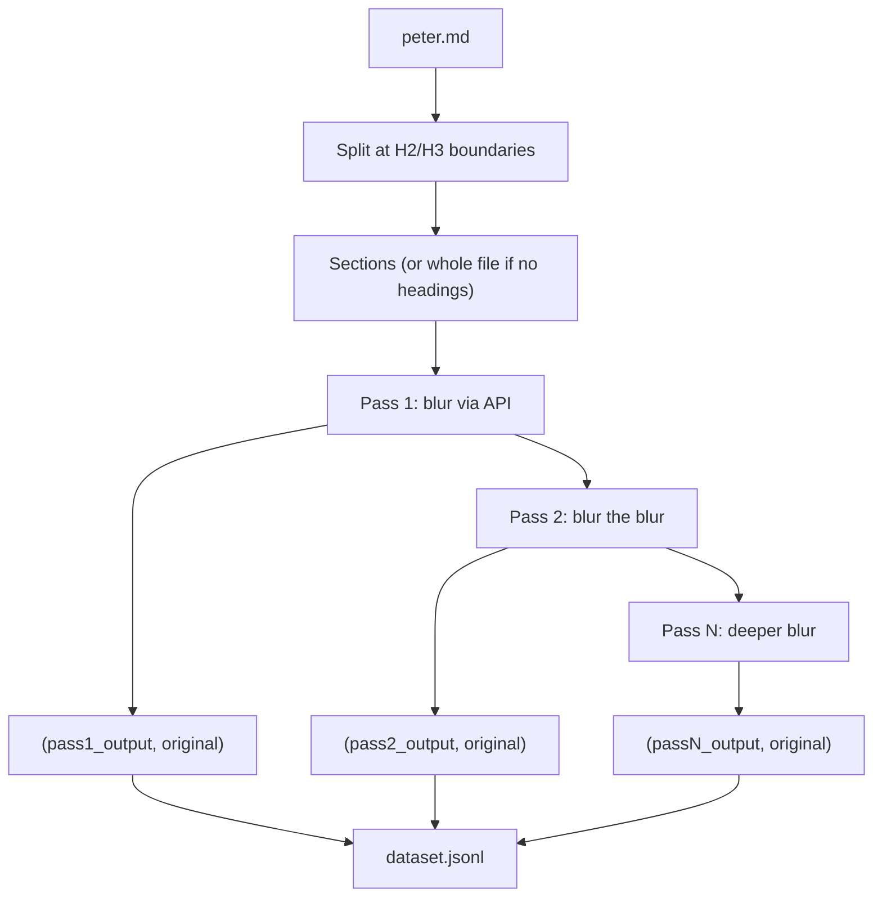
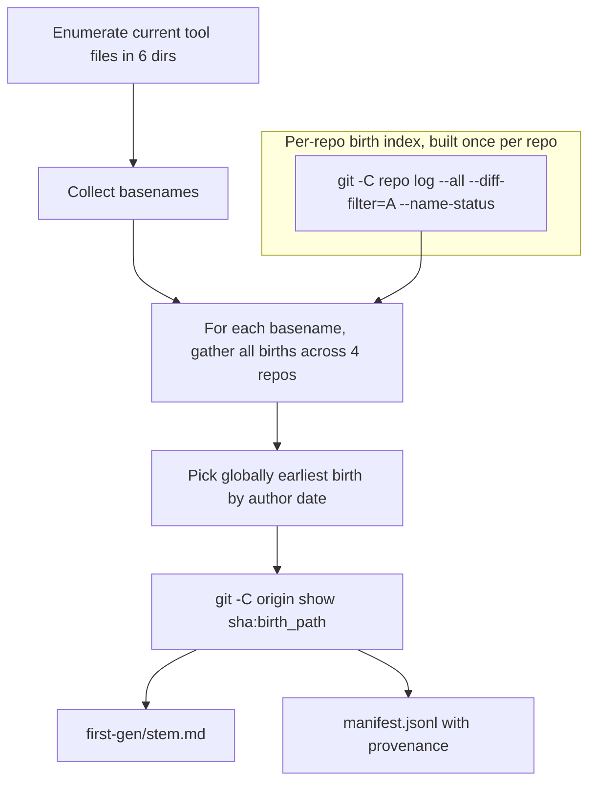
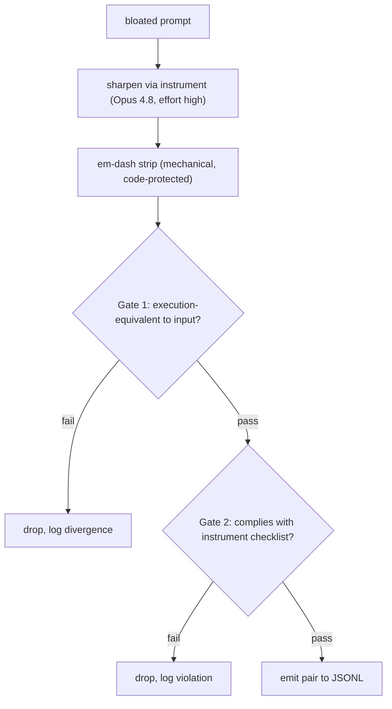
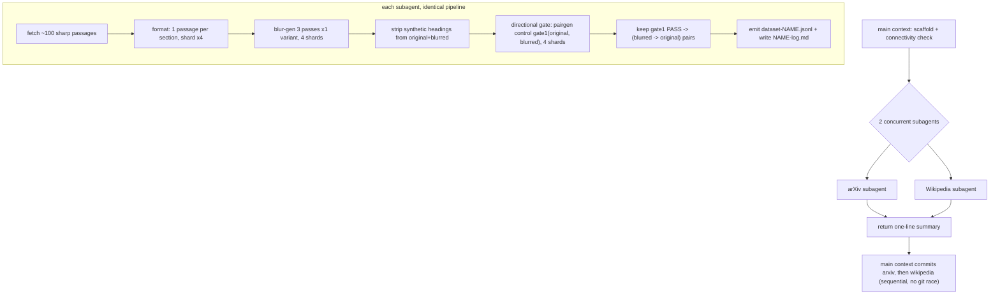
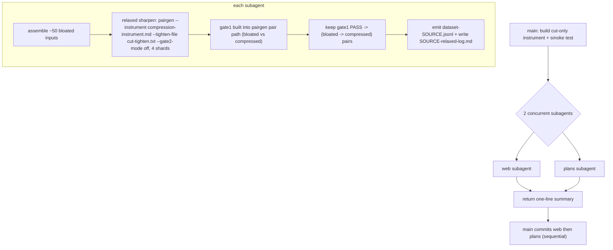
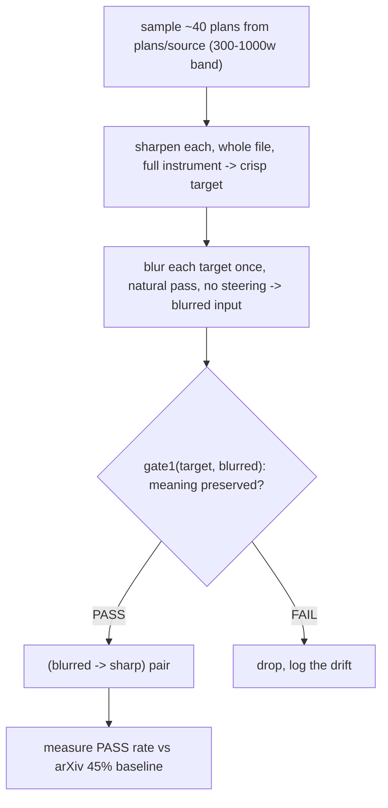
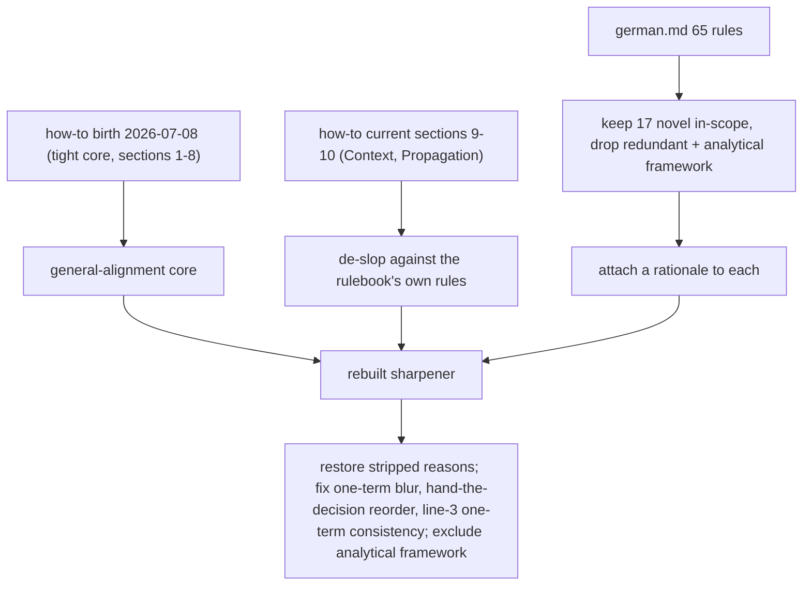

# Architect and vibe-coding planning session

*2026-07-28 02:07 - transcript 02e2ab27-db37-4548-80f8-f0b3046ddb71*


*Prompts p172-p223 of 223. Part 4 of 4.*


## Prompts


**[p172]** To-do's from the plan have already been created. Do not create them again. Mark them as in_progress as you work, starting with the first one. Don't stop until you have completed all the to-dos.

**[p173]** where's this report

**[p174]** shouldnt that be in the repo?

**[p175]** Hey, here's my question. Do you know what to do? Like, can you operate on your own? Like, can I just give you the task of performing experiments, create hypotheses, do the experiments, and just go? Just like, just go on your own for a few hours or overnight. And when I wake up in the fucking morning, I wanna see a clean dataset. Like, try, you said two hundred and fifty-three word section, try a hundred word section, try two hundred word section. Like, look, identify each variable and adjust it up and adjust it down and actually do the fucking experiments. Make a whole plan. Make a whole plan for each Experiments, and then just do it. Download what you need to do. You don't, you don't need me. You have a frontier model, just get this shit done.

**[p176]** use subagent discipline. create a strong plan. make sure the plan is standalone I will run in a fresh context. you should be fine as long as there's a plan. git commit at every experiment checkpoint. keep an experimental log and append to it each experiment. enough detail so it can be loaded into a fresh context and understand things. what about slicing a prompt up? what about downloading shitprompts from the web? what about downloading goodprompts? What about running sharpen on that?

**[p177]** Pairgen Experiment Battery

**[p178]** Implement the plan as specified, it is attached for your reference. Do NOT edit the plan file itself.

**[p179]** To-do's from the plan have already been created. Do not create them again. Mark them as in_progress as you work, starting with the first one. Don't stop until you have completed all the to-dos.

**[p180]** why isn't findings.md a link

**[p181]** they don['t open.

**[p182]** 1. do we have enough training data now, and
2. can we build a second training set using a relaxed version of the sharpener to run on web promptshit?

**[p183]** what if we first fine-tune using relaxed, and then fine-tune using sharp?

**[p184]** the problem I see is that the vocabulary is limited. a small subset of english.

**[p185]** what if we use @tools-public/tools-wg21/retired/plovdiv-assassin.md as a sharpener for regular text to create a sharp version, then train (original, plovdiv-sharpened)?

**[p186]** how about, can you find examples of normal sharp prose on the internet, then blur it, then train on that? this way we get compression of plain english. it has to preserve meaning though. and once you have that then train on the prompt dataset\

**[p187]** how confident are you that you can recognize good, compressed human prose? and how confident are you that you can compare the blurred version and know if something was lost?

**[p188]** Set up the experiments again. wikipedia and arxiv. but keep these two datasets distinct from each other and the dataset we just collected. give each an experimental log. run both experiments concurrently using subagents. you know what to do right?

**[p189]** Plain-English Blur Datasets (arXiv + Wikipedia)

**[p190]** Implement the plan as specified, it is attached for your reference. Do NOT edit the plan file itself.

**[p191]** To-do's from the plan have already been created. Do not create them again. Mark them as in_progress as you work, starting with the first one. Don't stop until you have completed all the to-dos.

**[p192]** Implement the plan as specified, it is attached for your reference. Do NOT edit the plan file itself.

**[p193]** To-do's from the plan have already been created. Do not create them again. Mark them as in_progress as you work, starting with the first one. Don't stop until you have completed all the to-dos.

**[p194]** so where are we right now? it sounds like the whole premise of a prompt compressor is up in the air

**[p195]** what about a relaxed sharpener, one that doesn't require those facts

**[p196]** Plan it in a new plan yes but also, here's another idea. What if we apply the sharpener to the plan files I have saved? in 99% of those cases it should result in a major compression. @plans/source ?

**[p197]** okay but wait a sec. we can't use (bloated plan, sharpened plan) pairs, because often the bloated plan has things that are not even relevant to the plan. I think we need to sharpen the plans, then bloat them algorithmically, then use (algorithmically bloated plan, sharepend plan) as the dataset. What do yo think?

**[p198]** Algorithmic bloat is just the normal conversion to and from latent space which is the whole thesis of this study. We do it on the entire sharpened plan file. we should not try to steer the model into bloating, the bloating happens on its own because of sampling top-k.

**[p199]** Yes I believe this is correct. Verify. "Blur" doesn't lose information (well, almost). Instead, it gives you back something with the same meaning but it took more words to say it.

**[p200]** whether it preserves meaning matters based on the input. if it is a machine instruction then the blur sjhould not lose meaning. if it is something like the abstract from a scientific paper, then it can change because a scientific description is less objective than a command. What do you think?

**[p201]** yeah that feels right and also are you keeping a journal of these discoveries and observations?

**[p202]** I see a problem. This is actually wrong:

**[p203]** > Every hard rule has an escape hatch.

**[p204]** Its not supposed to be "escape hatch" it is supposed to be "rationale, so the model can adapt to a novel application of the rule"

**[p205]** "One term names each concept." this is also wrong. It should be "Each concept is referred to by one name, not more".

**[p206]** We need to look at the entire history of @tools-public/how-to/how-to-write-prompts.md and @tools-public/tools/german.md to understand what the fuck happened.

**[p207]** And I suspect we might have to re-run ALL our experiments.

**[p208]** " without changing what it commands" is awkward phrasing

**[p209]** What does " hand the decision back to the model." mean? is this a good or a bad thing?

**[p210]** is this blurring? I want you to look at the revision history and trace the provenance of this line

**[p211]** what the fuck is this: "State each rule's scope; models stop at the stated reach." ? "stated reach" sounds terrible

**[p212]** how good is the original how-to

**[p213]** what about @tools-public/tools/german.md ?

**[p214]** germand.md is no good then. rules without rationale leaves the model hallucinating when the input doesn't perfectly match the rule

**[p215]** we should either drop german from consideration, or we should really go through every german rule and only if it is truly novel compared to how-to-write-prompts, then work together to figure out how to integrate it as a rule

**[p216]** the analytical framework cluster should not be part of the sharpener. its too specific. the sharpener is supposed to align the model generally not prescribe algorithms

**[p217]** the narrow cut I think is right and also, you might just as a quick experiment, see if this cut is cleanly visible from the commit log. that is, that there is a point in time before which is all the stuff we want, and after which is when the new stuff was added

**[p218]** yes and I want the plan to have the 17 novel in-scope rules with rationale so i can preview it

**[p219]** Question: "write each result to the accumulator as it completes. Rationale: holding all results in memory risks total loss on failure and pressures the context; streaming persists progress incrementally." what is a result? every byte? every sentence? every paragraph?

**[p220]** I am getting exhausted it feels like we keep going in circles. Every time you try to tighten or do something, we get more of the problem that the thesis of this entire endeavor rests on.

**[p221]** Three fucking plans. The irony.

**[p222]** move the dead ones to trash. write a report with all our findings into the repo

**[p223]** my conclusion is that I need to edit the how-to-write-prompts file by hand. human compression.


## Plans

### semantic blur report

*Write a research-type report documenting the measured bloat across three prompt files, explaining the resampling mechanism that causes it, and establishing the plan file as the artifact that must be preserved.*

« # Semantic Blur Report

## What gets written

One file: `cabinet/_output/report-semantic-blur.md` (**output**). No naming conflict exists.

Report type is **Research / scientific** (rulebook section 2, type 3), so the shape is abstract then IMRaD, with results and interpretation held in separate sections. Per-type block 4.3 governs: method detailed enough to reproduce, question stated up front and answered exactly in the discussion, no interpretation leaking into results.

## The governing constraint

A report about bloat that is itself bloated fails on contact. Target 1,800 to 2,400 words. Rule 3.8 says cut the first draft roughly in half; that applies here with unusual force.

## Structure

Headings state points rather than topics (rule 3.2), so the argument reconstructs from the headings alone:

- **Executive Summary** - standalone, actionable without the body
- **Three files grew between 17 and 146 percent while nobody added a feature** - the observation and the question
- **Method** - the git commands, the metrics, the corpus, reproducible verbatim
- **Results** - growth data, concentration data, qualifier density, the mechanisms visible in diffs, the terminal case
- **Why it happens: each rewrite resamples the whole file** - the mechanism
- **Why the first version is sharp** - conditioning on human intent versus conditioning on prior model output
- **Why the plan file escapes it: decisions are discrete** - the load-bearing insight
- **Limitations** - honest scope of the claim
- **Preserve the plan, regenerate the artifact** - conclusion and recommendation

## Verified data going in

Character counts, first version to latest, all confirmed against git:

- `tools/architect.md`: 49,831 to 59,128 (+18.7%), 4 commits, Jul 25-26
- `how-to/how-to-vibe-code.md`: 44,345 to 63,665 (+43.6%), 6 commits, Jul 25-26
- `how-to/how-to-write-prompts.md`: 10,612 to 26,089 (+145.8%), 8 commits, Jul 8-26, includes a rename from `lessons/prompt-rulebook.md`

Growth concentrates in single commits rather than accumulating evenly:

- `25bb2b3` "Refactor architect and vibe coder" added 31.6% to the vibe coder in one commit
- `1735c1a` "Add new and update existing how-to" added 83.1% to the prompt rulebook in one commit
- `f3a7e9d` "More refactoring" added 15.7% to the architect in one commit

Qualifier density per 1,000 words, reported honestly including the file that contradicts the trend:

- `architect.md`: 5.3 to 9.2, rose
- `how-to-write-prompts.md`: 2.9 to 6.0, rose
- `how-to-vibe-code.md`: 12.8 to 11.5, **fell** - that file bloated by structural accretion alone

The sharpening-to-smoothing example, quoted verbatim from both versions. v1 of the vibe coder carried `moving GPT-4 on GSM8K from 95.5% to 91.5% after one round and 89.0% after two`. v6 replaced it with `a model reviewing its own work in the context that produced it does worse than not reviewing at all`. Specific measurement out, general claim in, and the file grew anyway.

Terminal case: `tools/staker.md` at 138,184 bytes and 1,404 lines, against a median tool size of 31,049 bytes across 23 files. Twenty-two pipeline steps after sub-steps.

Closing irony, verified in the source: `architect.md` line 569 already states `a design that changes is regenerated from an updated plan`, and line 478 states findings are resolved `by updating the plan and running it again, never by patching the document in place`. The tool prescribes the cure and was not given it.

## Figures

One mermaid diagram contrasting the two loops: the bloat loop where the generated file is fed back through the model, against the preserved loop where new information enters the plan and the artifact is regenerated. Two tables, each captioned to stand alone and referenced before it appears: corpus growth summary, and the concentrated-growth commits. Full per-version histories go in an appendix so cutting from the bottom never removes the core (rule 3.1).

## Calibration

Likelihood and confidence stated separately per rule 3.6. The generalization beyond this corpus is a judgment, not a measurement, and gets labeled as one. The img2img analogy is presented as an analogy that motivated the inquiry, never as evidence for it.

## Housekeeping

`cabinet/_output/analysis-prompt-bloat.md` is the rough working document this report supersedes. I will flag it at the end rather than acting on it; moving it to `_trash/` is your call. »

Todos:

- Draft Method, Results, and Discussion sections against the verified data, keeping results free of interpretation per rule 4.3
- Write the mechanism sections: resampling, why v1 is sharp, why discrete decisions survive translation
- Build the two captioned tables, the mermaid two-loop diagram, and the appendix of full version histories
- Re-derive the executive summary and all headings from the finished body per rule 3.8
- Run the section 6 checklist one rule at a time, verify every number against git a second time, and cut toward the word target

### compression test architect

*Run a frontier-model compression test on architect.md: compress each paragraph, apply the mechanical non-expansion guardrail, assemble the compressed version, and report token savings.*

# Compression Test: architect.md

## What we're testing

Can a frontier model (Claude, running as subagents in this session) compress `tools-public/tools/architect.md` paragraph by paragraph while preserving execution-equivalence, and how much does it save?

## The compression prompt

Each paragraph gets this mandate:

> Rewrite this instruction text to use fewer tokens while preserving exactly the same meaning a model would execute. Keep all specific numbers, names, tag names, and schema fields. Use imperative voice, common words, and no filler. If you cannot make it shorter, return it unchanged.

## The guardrail

After each compression, count tokens (approximate by whitespace-splitting words). If the compressed version is not strictly shorter, discard it and keep the original. This is mechanical and outside the model.

## What gets produced

- `cabinet/_output/compress-test-architect.md` - the compressed file
- A summary in the chat: original word count, compressed word count, savings percentage, and the 10 best individual compressions shown as before/after pairs

## Scope

This is a test, not a product. One file, one pass, no fixed-point iteration, no trained model. The goal is to see whether the compression concept works on real prompt text and what savings are realistic. The subagent blocks in `<repo-reader-task>`, `<workspace-search-task>`, etc. are left untouched (they're already tight machine-to-machine prompts).

## Approach

Split the file at blank lines (paragraph boundaries). Skip code fences, mermaid blocks, tables, YAML frontmatter, and the subagent task blocks (content between angle-bracket tags). Compress only the prose paragraphs, bold-rule paragraphs, and bullet lists. Reassemble with the non-prose sections preserved verbatim.

One subagent processes batches of 10-15 paragraphs at a time to keep context manageable. Each batch returns the compressed versions. The main context assembles and counts.

Todos:

- Read architect.md, split into compressible units (prose paragraphs, bold rules, bullets) and non-compressible units (code fences, mermaid, tables, YAML, subagent task blocks). List the compressible units with their word counts.
- Dispatch subagents to compress the prose units in batches of 10-15, using the compression mandate. Apply the mechanical guardrail: reject any compression that is not shorter in words.
- Reassemble the file: compressed prose units interleaved with preserved non-prose units. Write to cabinet/_output/compress-test-architect.md.
- Report: original word count, compressed word count, savings percentage. Show the 10 best compressions as before/after pairs with per-paragraph savings.

### blur compression report

*Write a research-type report in promptforge covering the measured prompt degradation, its mechanism, the plan-as-source maintenance architecture, the compression experiment, and the full prior-art survey for building a compressor.*

# Semantic Blur and Prompt Compression

## What gets written

One file: `promptforge/semantic-blur-and-prompt-compression.md`. Promptforge is a permanent repo, so this is a direct write, not cabinet staging. It supersedes the working note `cabinet/_output/report-semantic-blur.md` and the rough draft `cabinet/_output/analysis-prompt-bloat.md`, both of which I will flag at the end rather than touch.

Report type is **Research / scientific** (rulebook section 2, type 3): abstract then IMRaD, results held separate from interpretation, method reproducible, question stated up front and answered exactly in the discussion.

Target 5,000 to 6,500 words. Over ten pages, so it carries a table of contents (rule 3.2).

## Structure

Headings state points, so the argument reconstructs from the headings alone:

1. **Abstract** - standalone, carries the finding, the mechanism, and the prescription
2. **Contents**
3. **Rewriting a prompt file makes it longer and blander** - the observation, the img2img analogy that motivated it, the three questions this report answers
4. **Method** - git archaeology, plan archaeology, the compression experiment, the survey
5. **Results** - measurements only, no interpretation
6. **Each rewrite resamples the file toward the mean** - the mechanism
7. **Blur expands, which is why bloat and smoothing are one phenomenon** - the gaussian insight
8. **The plan is source code and the tool is a build artifact** - the maintenance architecture
9. **Compression cannot fully reverse it** - the thermodynamic limit and the human bottleneck
10. **Prior art in prompt compression** - full survey
11. **Design for a compressor** - what the survey implies
12. **Limitations**
13. **Conclusion**
14. **Appendices** - version histories, experiment detail

## Verified data going in

All git figures were independently re-verified twice; all eleven cited character counts matched exactly.

Corpus growth, first version to latest, in characters:
- `architect.md`: 49,831 to 59,128, +18.7%, 4 commits
- `how-to-vibe-code.md`: 44,345 to 63,665, +43.6%, 6 commits
- `how-to-write-prompts.md`: 10,612 to 26,089, +145.8%, 8 commits, includes a rename from `lessons/prompt-rulebook.md`

Growth concentrates in whole-file rewrites:
- `1735c1a` "Add new and update existing how-to" added 83.1% to the rulebook, 137 insertions against 21 deletions
- `25bb2b3` "Refactor architect and vibe coder" added 31.2% to the vibe coder, 322 against 161
- `f3a7e9d` "More refactoring" added 15.8% to the architect, 73 against 47

Qualifier density per 1,000 words, reported honestly including the file that contradicts the trend:
- `architect.md` 5.3 to 9.2, rose
- `how-to-write-prompts.md` 2.9 to 6.0, rose
- `how-to-vibe-code.md` 12.8 to 11.5, **fell** - that file bloated by structural accretion instead

The specific-to-general substitution, quoted verbatim from both revisions of the vibe coder, where `moving GPT-4 on GSM8K from 95.5% to 91.5% after one round and 89.0% after two` became a general claim while the file grew.

Terminal case: `staker.md` at 138,184 characters and 1,404 lines against a median tool of 31,049 across 23 tools, 4.45x the median and 39.8% larger than the next biggest.

**New in this report - the plan archaeology.** 2,742 recovered plans, indexed in `plans/tool-files.md` by the files each plan writes. The architect has 1 create plan (`the_architect_tool_90f5c0ee.plan.md`, Jul 25 17:11) and 6 modify plans. Staker has 1 create plan and dozens. Modify-plan count tracks final size: staker dozens/138KB, architect 6/59KB. This is independent confirmation of the mechanism, since each modify plan was one whole-file rewrite.

**The compression experiment.** 150 units, 105 compressible (6,722 words), 45 preserved. Result 9,982 to 9,531 words (4.52%) and 59,128 to 57,050 characters (3.51%). Zero missing terms across all 105 units. Of the 12 highest-reduction units, 8 EQUIVALENT, 4 MINOR DRIFT, 0 MEANING CHANGED. Five of twelve lost a subordinate clause and every one was rationale for a rule that survived intact. The model deleted the why and kept the what; it never restructured a sentence.

## The mechanism section

The formulation the report states, corrected during the inquiry: blur is proportional to how much of the **conditioning input** is model-generated, not to how much output is generated. This is why v1 is sharp despite being fully generated - its input was human intent - and why every rewrite is blander, since its input is the previous model-generated file plus a small human delta.

The weighted-average model for targeted edits, with r as the regenerated fraction:

`B_file = (1 - r) * B_original + r * B_edit`

Targeted edits win on both terms: r is small, and B_edit is low because a precise instruction produces few tokens, keeping human signal per generated token high.

The gaussian insight: blur does not only smooth, it widens. A sharp edge becomes a soft gradient occupying more space. "Cap at 3" becoming a twenty-word justified sentence is the same operation. Bloat and blur are one phenomenon, which is why the measured growth and the measured blandness arrive together.

## Figures

Captioned, numbered, and referenced before they appear (rule 3.7):

- Table 1 corpus growth, Table 2 the concentrated commits, Table 3 plan-chain length against file size, Table 4 compression experiment results, Table 5 prior-art comparison
- Figure 1 a mermaid contrasting the rewrite loop against the regenerate loop
- Figure 2 a table ranking revision primitives by blur cost: whole-file rewrite, plan regeneration, targeted StrReplace, compare-and-transfer, deletion, human edit

## Prior art, carried in full

Every project with its link, what it proves, and its limitation: Microsoft's LLMLingua family with the repo, project pages, and the freeCodeCamp tutorial; Kompress v2 with its model card, the 149M/LoRA/hard-keep architecture, the "17 Models, $38.95" engineering blog, and the headroom source; Cmprsr with the arXiv paper and the OpenReview entry; gravitee-io with its model, its Dolly-15k dataset, and the 0.04% violation rate; InstructCMP, Behavior-Equivalent Token, Tiny Transformers, and the NeurIPS rate-distortion paper; the training datasets; and the Rust deployment stack with `ort`, the worked ONNX example, `candle`, and `tract`.

The section closes on what the survey shows is unbuilt: the combination of execution-equivalence verification, a mechanical non-expansion guarantee, fixed-point iteration, and deterministic CPU decoding.

## Design section

Extractive against generative, with the honest properties of each. Extractive is idempotent, monotonic, and zero-blur by construction, because it cannot emit a token that was not in the input. Generative produces better prose but needs the guardrail, is not idempotent, and carries a little blur. The conclusion is two tools for two audiences rather than one tool that compromises.

Then the verification and determinism decisions: execution-equivalence as the metric, the guardrail enforced outside the model so its worst case is returning the input verbatim, greedy decoding at temperature 0, and CPU inference for true determinism since the residual non-determinism at temperature 0 is GPU floating-point ordering rather than sampling.

## Calibration

Likelihood separate from confidence per rule 3.6. Marked clearly as judgment rather than measurement: that the mechanism generalizes past this corpus, the parameter-count estimates, and whether a more aggressive compression mandate would beat 4.52% without drift. The img2img analogy is presented as the thing that motivated the inquiry, never as evidence for its conclusion.

Todos:

- Draft Method and Results: git archaeology, plan archaeology, the compression experiment, all tables, no interpretation leaking in per rule 4.3
- Draft the mechanism sections: conditioning-ratio formulation, why v1 is sharp, blur-expands, discrete versus continuous survival
- Draft the maintenance architecture: plan as source, revision primitives ranked by blur cost, compare-and-transfer, the thermodynamic limit and the human bottleneck
- Draft the full prior-art survey with every link and the comparison table, closing on what is unbuilt
- Draft the compressor design section: extractive versus generative, execution-equivalence, the guardrail, determinism
- Re-derive the abstract, contents, and all headings from the finished body per rule 3.8
- Run the section 6 checklist one rule at a time, verify every number and quote, cut toward the word target

### prose pass on report

*Apply the prose rulebook's style-revision passes to prompt-compression-research.md to strip AI-generated idioms - meta-announcements, self-narration, and over-cap machine idioms - with no length pass and no content change.*

# Prose Pass on prompt-compression-research.md

## Goal

Remove the model-generated smells from [plans/prompt-compression-research.md](c:\Users\Vinnie\src\cursor\plans\prompt-compression-research.md) using [tools-public/how-to/how-to-write-prose.md](c:\Users\Vinnie\src\cursor\how-to\how-to-write-prose.md). Not a length pass. Not a content change. Every fact, number, formula, quote, link, and table stays. This is deletion and local rewrite only, which by the report's own argument is blur-free because unchanged text is never regenerated.

## What the scan found (prose only, ~10,075 words)

- Meta-announcements ("worth noting/stating," "deserves emphasis," "The interesting part is"): ~10, rulebook target 0
- Report-as-a-character ("this report treats," "the report flags," "the report cares"): 7, rulebook target 0 outside standing sections
- "exactly" + "precisely": 14, cap ~4
- Antithesis "X, not Y": 11, cap ~5
- "rather than": 36, uncapped by the rulebook but the workspace's own flagged bloat marker; thin to roughly 12
- Tier 3 agency (abstraction + volitional verb): 1
- Em-dash and prose double-dash: already zero

## Passes to run

Follow the rulebook protocol order, skipping the length pass per instruction.

**Pass 3, compression (the main event).** Delete every meta-announcement; the following sentence already carries the content and usually strengthens without the throat-clearing in front. Rewrite report-as-character sentences so the subject matter is the grammatical subject: "this report treats it that way" becomes "that is how it is treated here" or just states the thing. Keep the handful in standing sections (executive summary, conclusion, limitations) where self-reference is allowed.

**Pass 4, machine idioms.** Bring "exactly"/"precisely" under ~4 combined, keeping only instances where the precision is the claim (an exact set, a byte-for-byte match). Cut the ", not Y" tail on ornamental antithesis, keeping rule statements. Thin "rather than" to roughly a third by rewriting to plain verbs or splitting the contrast.

**Pass 5, metaphor.** Light. Flatten any economic or physical-verb animations found in the sweep; the report is mostly literal already.

**Pass 6, agency.** Rewrite the one Tier 3 case and any others the sweep surfaces so a named actor performs the verb.

## Constraints

- Quotes, blockquotes, the two verbatim vibe-coder excerpts, all code fences, the mermaid block, and all tables are untouchable and verified byte-identical after.
- All LaTeX formulas ($$ blocks and inline) unchanged.
- Every markdown link and its URL preserved exactly.
- The constructed-vs-measured labels on the six examples stay.
- After each edit, re-read the paragraph plus one on each side and repair the joint.

## How it runs

Directly, as targeted StrReplace edits in the main context, not a subagent swarm. The file is one document with a single voice to hold consistent; splitting it across subagents would fragment exactly the judgment this task needs, and the last subagent pipeline cost thirty minutes for a thin result. Sweep top to bottom once per pass.

## Verification

Re-run the idiom scan and confirm every category is at or under its cap. Diff all quoted spans, formulas, and links to confirm they are byte-identical. Confirm total word count dropped only modestly (this is idiom removal, not a length cut) and that no table or formula was disturbed.

Todos:

- Compression pass: delete all meta-announcements and rewrite report-as-character sentences so the subject matter is the grammatical subject, keeping only standing-section self-reference
- Machine-idiom, metaphor, and agency passes: bring exactly/precisely under cap, cut ornamental 'X, not Y' tails, thin 'rather than', flatten any animations, fix Tier 3 agency
- Re-run the idiom scan against caps, diff quotes/formulas/links for byte-identity, confirm word count dropped only modestly and no table or formula was disturbed

### teaser cut second pass

*A second, targeted prose pass on prompt-compression-research.md removing the value-teaser and curtain-raiser sentences the first pass missed - lines that announce a point is interesting instead of stating it.*

# Teaser Cut: second prose pass

## The class this targets

The first pass caught "worth noting" style meta. It missed a subtler variant: sentences that **advertise** a point's significance or tease "the interesting reason" before delivering it. These are throat-clearing that makes the reader wait. Same fix as before, pure deletion or a lead-with-the-content rewrite, blur-free.

## The inventory (8 hits, all in [plans/prompt-compression-research.md](c:\Users\Vinnie\src\cursor\plans\prompt-compression-research.md))

1. Executive summary: "This is not merely an observation." Delete. The next sentence, "Successive revisions form a Markov chain...", stands on its own.

2. "Why only 4.52%" section, a three-sentence teaser cluster:
   - "Two reasons, and the second is the more interesting one." Delete.
   - "The mundane reason is that 33% of the document is preserved structure..." becomes "First, 33% of the document is preserved structure...".
   - "The interesting reason is that **this file had already been compressed**." becomes "Second, **this file had already been compressed**.".

3. "What it actually did" section: "The dominant pattern is more interesting than the percentage." Replace with a sentence that states the pattern, or delete and let "Of the twelve audited units, five lost a subordinate clause..." lead.

4. Narrative: "There is one more thing worth noticing before the evidence starts, because it turns out to be the whole fix." Drop "worth noticing"; keep the transition beat: "One more thing before the evidence, and it turns out to be the whole fix."

5. Maxwell's demon: "There is an apparent contradiction worth resolving, because it is where this framing usually gets abused." becomes "There is an apparent contradiction here, and it is where this framing usually gets abused."

6. "What compression cannot do": "Compression is the obvious candidate for both, so it is worth being precise about what it can and cannot achieve before measuring what it did." becomes "Compression is the obvious candidate for both. Its limits need stating before the experiment measures what it did."

7. "No tool was created by one plan": "The plan archaeology complicates the recovery story in a way that matters." Cut "in a way that matters".

8. Keep: "The third bin is the one people miss, and it matters most." This is a genuine ranking claim about which bin carries the weight, not a teaser. Light trim only ("and it matters most" from "and it is the one that matters most").

## Constraints

Same as the first pass. Quotes, blockquotes, code fences, the mermaid block, tables, LaTeX formulas, links, and the constructed-vs-measured labels are untouchable and verified after. After each edit, re-read the paragraph plus one on each side and repair the joint. Run directly as StrReplace edits, not subagents.

## Verification

Re-run the teaser scan and confirm the eight are resolved. Diff formulas, quotes, tables, and links for byte-identity. Confirm the word count dropped only modestly.

Todos:

- Apply the eight teaser edits: delete the four pure curtain-raisers, convert the 4.52% cluster to First/Second, tighten the three 'worth' openers and the 'in a way that matters' tail
- Re-run the teaser scan to confirm resolution, diff formulas/quotes/tables/links for byte-identity, confirm modest word-count drop

### blur dataset generator

*Build a Rust CLI tool that takes a markdown file, splits it into sections, blurs each section through multiple passes of the Anthropic API using rotating models, and outputs a JSONL training dataset of (blurred, original) pairs at multiple blur levels.*

# Blur Dataset Generator

## What gets built

A Rust CLI at `promptforge/study/make-dataset/blur-gen/` that reads a markdown file, splits it into sections, and generates blurred versions at multiple pass levels by calling the Anthropic Messages API. Output is a JSONL file of training pairs.

## Input

[promptforge/study/make-dataset/peter.md](c:\Users\Vinnie\src\cursor\promptforge\study\make-dataset\peter.md) - 29 lines of dense Peter Dimov prose about the Boost Software License. For this validation run, the whole file is one section (it has no headings to split on).

## Output

A JSONL file where each line is:

```json
{"original": "...", "blurred": "...", "pass": 3, "model": "claude-sonnet-4-20250514", "source": "peter.md"}
```

For N passes with M variants per pass, one source section produces N*M training pairs, all mapping back to the same original.

## Architecture



## The blur prompt

```
Rewrite the following text. Preserve all meaning.
```

No "expand," no "add context," no system prompt. Let the model's natural resampling do the blurring.

## Model rotation

Rotate through these Anthropic models to get diverse blur:

- `claude-sonnet-4-20250514` - mid-tier, fast, the workhorse
- `claude-3-5-haiku-20241022` - smallest, cheapest, different blur pattern
- `claude-opus-4-20250514` - largest, closest to real revision blur

Each pass picks the next model in rotation. Pass 1 = Sonnet, Pass 2 = Haiku, Pass 3 = Opus, Pass 4 = Sonnet, etc. This ensures every blur level has a mix across the dataset when run on multiple source files later.

## CLI interface

```
blur-gen --input peter.md --output dataset.jsonl --passes 10 --variants 2
```

- `--passes`: number of chained blur levels (default 10)
- `--variants`: number of independent runs per pass level (default 2), giving different blur paths from the same source
- `--api-key`: or read from `ANTHROPIC_API_KEY` env var
- `--models`: comma-separated model list for rotation (defaults to the three above)

With passes=10 and variants=2, one source section generates 20 training pairs.

## Crates

- `reqwest` with `rustls-tls` - HTTP client for the Anthropic API
- `serde` + `serde_json` - serialization
- `tokio` - async runtime
- `clap` - CLI argument parsing

No ONNX, no model loading - this tool only calls the API. The 24GB GPU is for training later, not for this.

## Rate limiting

Anthropic's API has rate limits. The tool should:
- Wait 1 second between API calls by default
- Respect 429 responses with exponential backoff
- Print progress: "Pass 3/10, variant 2/2, model: claude-opus-4-20250514, section 1/1"

## Validation this run proves

1. The blur actually happens: word count should increase with each pass
2. No hallucinated facts: the blurred versions should contain only information from the original
3. The blur is diverse: different models produce visibly different expansions
4. The chaining works: pass 10 should be noticeably more bloated than pass 1
5. The JSONL is well-formed and ready for training

After running, we inspect a few pairs by hand and report the word-count progression across passes.

Todos:

- Create Cargo.toml and src/main.rs with clap CLI, reqwest client, and the Anthropic Messages API call function
- Implement markdown section splitter: split at H2/H3 boundaries, fall back to whole file if no headings
- Implement the blur loop: for each section, run N passes with M variants, chaining output to input, rotating models, writing each pair to JSONL
- Run on peter.md with passes=10 variants=2, inspect the output, report word-count progression and spot-check a few pairs

### first-gen extractor

*Build a Rust tool that finds the true first-generation version of every tool file across four repos by searching all git histories by basename, extracts each v1, and emits the clean training targets plus a provenance manifest.*

# First-Gen Extractor

## The problem it solves

The sharp training target for the deblurrer is the first-generation version of each tool, before revision blurred it. But finding v1 is hard because files were renamed, moved between directories, and moved across repo boundaries. Git `--follow` handles the first two within one repo; it cannot cross repos, because each repo is a separate history. Verified example: `diligence.md` currently lives at `tools-public/tools/diligence.md`, born 2026-06-16, but its true origin is `staff-private/tools/diligence/diligence.md` in an older repo. The tools-public "creation" is really a cross-repo import, not the first generation.

## The four repos and six source directories

Confirmed separate git repos: `tools-public`, `staff-private`, `umbra`, `profiles-coalition`. Repo ages: staff-private (Mar 30, oldest), umbra (Apr 11), tools-public (Apr 27), profiles-coalition (Jul 10). Current tool files, 85 total:

- `tools-public/tools` (23), `tools-public/tools-wg21` (18), `tools-public/how-to` (12)
- `staff-private/tools` (16)
- `umbra/tools` (14)
- `profiles-coalition/campaign/tools` (2)

## The key insight

Match by **basename**, not path. `diligence.md` is `diligence.md` whether it sits at `tools/diligence/diligence.md` or `tools/diligence.md` or in another repo. Search every repo's entire history (`--all`) for the creation of any file with that basename, take the globally earliest, and that is the true first generation.

## What gets built

A Rust crate `first-gen` in `promptforge/study/make-dataset/`, sibling to `blur-gen`. The two are one pipeline: first-gen produces the sharp targets, blur-gen blurs them.



## Algorithm

1. **Enumerate current tools.** Walk the six directories, collect each `.md` file as (repo, current_path, basename).

2. **Build a birth index per repo, once.** Run `git -C <repo> log --all --diff-filter=A --name-status --date=iso-strict --format=commit|%H|%ad` and parse it into a map: `basename -> [(repo, commit, iso_date, birth_path)]`. This captures every file-creation event in that repo's full history at any path. One pass per repo, four passes total.

3. **Resolve within-repo renames.** For each current file, run `git -C <repo> log --follow --name-only --format= -- <current_path>` to collect every historical name the file had in its current repo, and add those basenames to its match set. This catches files renamed within a repo.

4. **Find the global first generation.** For each current tool, union its match-set basenames, look up all birth records across all four repos, and select the one with the earliest author date. That record names the origin repo, commit, and birth path.

5. **Extract v1.** `git -C <origin_repo> show <birth_commit>:<birth_path>` gives the first-generation content. Write it to `promptforge/study/make-dataset/first-gen/<basename>`.

6. **Emit the manifest.** One JSONL line per tool: `{basename, current_repo, current_path, origin_repo, origin_path, birth_commit, birth_date, repos_seen, cross_repo, flags}`.

## Handling the residual: renamed AND cross-repo-moved

Basename matching catches rename-within-repo (via step 3) and move-across-repo-keeping-name (via step 2). It misses a file whose basename changed AND crossed a repo boundary, because there is no shared name to match on. The tool does not guess at those. It flags any tool where the origin repo equals the current repo but the birth commit looks like a bulk import (touches more than, say, 20 files in one commit), meaning the real origin may predate this repo under a different name. Flagged tools go in the manifest with `flags: ["possible-earlier-origin"]` for manual review rather than a wrong automatic answer.

## CLI

```
first-gen --out first-gen --manifest manifest.jsonl
```

Repo and directory roots are hardcoded to the six known locations, since they are specific to this workspace. A `--workspace` flag sets the root (default: the cursor workspace root).

## Crates

`clap`, `serde` + `serde_json`, `anyhow`. No async, no network. All work is `std::process::Command` calls to `git` plus file writes.

## What this validates

1. Every current tool resolves to a first-generation version, with its origin repo and date.
2. Cross-repo origins are found (diligence resolves to staff-private, not tools-public).
3. The count of cross-repo tools and flagged-uncertain tools is reported, so we know how much manual review remains.
4. The `first-gen/` directory holds 85 sharp target files ready to feed to blur-gen.

## Verification after running

- Spot-check diligence.md resolves to the staff-private origin.
- Report: how many tools are same-repo-origin, how many cross-repo, how many flagged uncertain.
- Confirm every current tool produced exactly one v1 file and one manifest line.

Todos:

- Create the first-gen Rust crate: Cargo.toml, clap CLI, and the git command wrappers (log, show)
- Enumerate current tools across the six directories and build the per-repo birth index by basename from git --all --diff-filter=A --name-status
- Add within-repo --follow rename resolution, then select the globally earliest birth per tool across all four repos
- Extract each v1 via git show, write to first-gen/, emit manifest.jsonl with provenance and uncertainty flags
- Build and run, verify diligence resolves to staff-private, report same-repo vs cross-repo vs flagged counts and confirm 85 v1 files

### pair pipeline validation

*Build the minimal end-to-end pair-generation path - sharpen plus em-dash strip plus the two gates - and validate it on ~20 bloated inputs with negative controls, proving the gates actually discriminate before any scale run.*

# Pair Pipeline Validation

## Purpose

Prove the one untested link in the generation path: the two gates (execution-equivalence and rulebook-compliance). They are the quality floor of the whole dataset and have never run. Validate them on a small batch, with negative controls, before acquiring corpora or generating at scale.

## What gets built

A `pairgen` Rust crate in `promptforge/study/make-dataset/`, plus two small fixes to existing tools. `pairgen` runs the full path for each input: sharpen, strip, gate, emit.



## The two fixes, folded in as prerequisites

1. **Em-dash strip** (in `pairgen`, applied to the sharpened target): outside code fences and inline backticks, replace U+2014 with " - ", U+2013 with "-", prose "--" with "-", and collapse doubled spaces. Code and CLI flags are protected. This is the one mechanical rule.
2. **blur-gen degenerate-input guard** ([blur-gen/src/main.rs](c:\Users\Vinnie\src\cursor\promptforge\study\make-dataset\blur-gen\src\main.rs)): skip sections under a small word floor, and treat a pass whose output matches an assistant-boilerplate pattern ("your message came through empty", "I'd be glad to help") as a failed pass rather than writing it. This is the bug that produced the sec1 garbage.

## The gates, direct API, no Cursor harness

Both are direct `/v1/messages` calls to `claude-opus-4-8`, effort high, carrying only the gate prompt. Same clean-room plumbing as sharpen.

**Gate 1, execution-equivalence.** Input: the bloated original A and the sharpened target B. Prompt: "Would any model, following B instead of A, ever behave differently on any input? Weigh dropped conditions, changed numbers, altered defaults, removed edge cases, narrowed or widened scope. First line: PASS or FAIL. If FAIL, one line naming the divergence." Parse the first line.

**Gate 2, rulebook-compliance.** Input: the sharpen-instrument checklist plus the target B. Prompt: "List every checklist item this text violates, one per line with the item, or write 'none'. First line: PASS or FAIL." Parse.

A pair is kept only if both gates PASS. Dropped pairs are logged with the reason, never repaired.

## The validation run

Inputs: ~20 genuinely bloated sections pulled from the existing `dataset-papergate.jsonl` and `dataset.jsonl` (pass-6 blurred sections). These have known sharp originals, so gate verdicts can be sanity-checked against ground truth. No corpus acquisition needed for the test.

**Negative controls are the point.** A gate that always says PASS is worthless, the same trap as a test that cannot fail. So the run includes deliberately corrupted targets:

- Take 5 sharpened targets that pass, and corrupt each one way: drop a number, flip a condition ("at most 3" to "at least 3"), remove an escape hatch, delete a `NEVER`, narrow a scope.
- Feed the corrupted versions through the gates.
- Gate 1 must FAIL all 5. If it passes any, the gate does not discriminate and the pipeline is not trustworthy.

Report: on the clean batch, how many passed each gate and the drop reasons; on the negative controls, whether Gate 1 caught all 5 corruptions. The second number is the one that matters.

## Output

`pairgen-out.jsonl`, one line per input: `{source, bloated, sharpened, gate1, gate1_reason, gate2, gate2_violations, kept}`. Plus a negative-control report. Both ignored by `.gitignore` (add `pairgen-out*`).

## What this proves and what it does not

Proves: the gates run, discriminate real meaning changes from safe tightening, and the full sharpen-strip-gate path produces clean pairs. Does not prove: behavior at scale, or on real web corpora rather than our own blurred sections. Those come at the scale step, which this de-risks.

## Crates and reuse

`pairgen` reuses the Anthropic call pattern from [sharpen/src/main.rs](c:\Users\Vinnie\src\cursor\promptforge\study\make-dataset\sharpen\src\main.rs): `reqwest`, `serde`, `tokio`, `clap`, `anyhow`. Three API calls per input (sharpen, gate1, gate2), sequential, with the existing retry and backoff.

Todos:

- [
- {
- "
- i
- d
- "
- :
-  
- "
- f
- i
- x
- e
- s
- "
- ,
-  
- "
- c
- o
- n
- t
- e
- n
- t
- "
- :
-  
- "
- A
- d
- d
-  
- t
- h
- e
-  
- e
- m
- -
- d
- a
- s
- h
-  
- s
- t
- r
- i
- p
-  
- (
- c
- o
- d
- e
- -
- p
- r
- o
- t
- e
- c
- t
- e
- d
- )
-  
- a
- n
- d
-  
- p
- a
- t
- c
- h
-  
- b
- l
- u
- r
- -
- g
- e
- n
-  
- w
- i
- t
- h
-  
- t
- h
- e
-  
- d
- e
- g
- e
- n
- e
- r
- a
- t
- e
- -
- i
- n
- p
- u
- t
-  
- a
- n
- d
-  
- a
- s
- s
- i
- s
- t
- a
- n
- t
- -
- b
- o
- i
- l
- e
- r
- p
- l
- a
- t
- e
-  
- g
- u
- a
- r
- d
- "
- ,
-  
- "
- s
- t
- a
- t
- u
- s
- "
- :
-  
- "
- p
- e
- n
- d
- i
- n
- g
- "
- }
- ,
-  
- {
- "
- i
- d
- "
- :
-  
- "
- p
- a
- i
- r
- g
- e
- n
- "
- ,
-  
- "
- c
- o
- n
- t
- e
- n
- t
- "
- :
-  
- "
- B
- u
- i
- l
- d
-  
- t
- h
- e
-  
- p
- a
- i
- r
- g
- e
- n
-  
- c
- r
- a
- t
- e
- :
-  
- s
- h
- a
- r
- p
- e
- n
-  
- +
-  
- s
- t
- r
- i
- p
-  
- +
-  
- g
- a
- t
- e
- 1
-  
- (
- e
- q
- u
- i
- v
- a
- l
- e
- n
- c
- e
- )
-  
- +
-  
- g
- a
- t
- e
- 2
-  
- (
- c
- o
- m
- p
- l
- i
- a
- n
- c
- e
- )
-  
- v
- i
- a
-  
- d
- i
- r
- e
- c
- t
-  
- O
- p
- u
- s
-  
- 4
- .
- 8
-  
- c
- a
- l
- l
- s
- ,
-  
- e
- m
- i
- t
-  
- J
- S
- O
- N
- L
-  
- w
- i
- t
- h
-  
- v
- e
- r
- d
- i
- c
- t
- s
- "
- ,
-  
- "
- s
- t
- a
- t
- u
- s
- "
- :
-  
- "
- p
- e
- n
- d
- i
- n
- g
- "
- }
- ,
-  
- {
- "
- i
- d
- "
- :
-  
- "
- i
- n
- p
- u
- t
- s
- "
- ,
-  
- "
- c
- o
- n
- t
- e
- n
- t
- "
- :
-  
- "
- A
- s
- s
- e
- m
- b
- l
- e
-  
- ~
- 2
- 0
-  
- b
- l
- o
- a
- t
- e
- d
-  
- i
- n
- p
- u
- t
- s
-  
- f
- r
- o
- m
-  
- e
- x
- i
- s
- t
- i
- n
- g
-  
- b
- l
- u
- r
- r
- e
- d
-  
- d
- a
- t
- a
- s
- e
- t
- s
- ,
-  
- p
- l
- u
- s
-  
- 5
-  
- d
- e
- l
- i
- b
- e
- r
- a
- t
- e
- l
- y
-  
- c
- o
- r
- r
- u
- p
- t
- e
- d
-  
- t
- a
- r
- g
- e
- t
- s
-  
- a
- s
-  
- n
- e
- g
- a
- t
- i
- v
- e
-  
- c
- o
- n
- t
- r
- o
- l
- s
- "
- ,
-  
- "
- s
- t
- a
- t
- u
- s
- "
- :
-  
- "
- p
- e
- n
- d
- i
- n
- g
- "
- }
- ,
-  
- {
- "
- i
- d
- "
- :
-  
- "
- r
- u
- n
- "
- ,
-  
- "
- c
- o
- n
- t
- e
- n
- t
- "
- :
-  
- "
- R
- u
- n
-  
- p
- a
- i
- r
- g
- e
- n
-  
- o
- n
-  
- t
- h
- e
-  
- b
- a
- t
- c
- h
-  
- a
- n
- d
-  
- t
- h
- e
-  
- n
- e
- g
- a
- t
- i
- v
- e
-  
- c
- o
- n
- t
- r
- o
- l
- s
- ;
-  
- r
- e
- p
- o
- r
- t
-  
- g
- a
- t
- e
-  
- p
- a
- s
- s
-  
- r
- a
- t
- e
- s
-  
- a
- n
- d
- ,
-  
- c
- r
- u
- c
- i
- a
- l
- l
- y
- ,
-  
- w
- h
- e
- t
- h
- e
- r
-  
- G
- a
- t
- e
-  
- 1
-  
- c
- a
- u
- g
- h
- t
-  
- a
- l
- l
-  
- 5
-  
- c
- o
- r
- r
- u
- p
- t
- i
- o
- n
- s
- "
- ,
-  
- "
- s
- t
- a
- t
- u
- s
- "
- :
-  
- "
- p
- e
- n
- d
- i
- n
- g
- "
- }
- ]
- }

### pair pipeline validation

*Build the minimal end-to-end pair-generation path - sharpen plus em-dash strip plus the two gates - and validate it on ~20 bloated inputs with negative controls, proving the gates actually discriminate before any scale run.*

# Pair Pipeline Validation

## Purpose

Prove the one untested link in the generation path: the two gates (execution-equivalence and rulebook-compliance). They are the quality floor of the whole dataset and have never run. Validate them on a small batch, with negative controls, before acquiring corpora or generating at scale.

## What gets built

A `pairgen` Rust crate in `promptforge/study/make-dataset/`, plus two small fixes to existing tools. `pairgen` runs the full path for each input: sharpen, strip, gate, emit.


## The two fixes, folded in as prerequisites

1. **Em-dash strip** (in `pairgen`, applied to the sharpened target): outside code fences and inline backticks, replace U+2014 with " - ", U+2013 with "-", prose "--" with "-", and collapse doubled spaces. Code and CLI flags are protected. This is the one mechanical rule.
2. **blur-gen degenerate-input guard** in blur-gen/src/main.rs: skip sections under a small word floor, and treat a pass whose output matches an assistant-boilerplate pattern ("your message came through empty", "I'd be glad to help") as a failed pass rather than writing it. This is the bug that produced the sec1 garbage.

## The gates, direct API, no Cursor harness

Both are direct /v1/messages calls to claude-opus-4-8, effort high, carrying only the gate prompt. Same clean-room plumbing as sharpen.

**Gate 1, execution-equivalence.** Input: the bloated original A and the sharpened target B. Prompt: "Would any model, following B instead of A, ever behave differently on any input? Weigh dropped conditions, changed numbers, altered defaults, removed edge cases, narrowed or widened scope. First line: PASS or FAIL. If FAIL, one line naming the divergence." Parse the first line.

**Gate 2, rulebook-compliance.** Input: the sharpen-instrument checklist plus the target B. Prompt: "List every checklist item this text violates, one per line with the item, or write 'none'. First line: PASS or FAIL." Parse.

A pair is kept only if both gates PASS. Dropped pairs are logged with the reason, never repaired.

## The validation run

Inputs: ~20 genuinely bloated sections pulled from the existing dataset-papergate.jsonl and dataset.jsonl (pass-6 blurred sections). These have known sharp originals, so gate verdicts can be sanity-checked against ground truth. No corpus acquisition needed for the test.

**Negative controls are the point.** A gate that always says PASS is worthless, the same trap as a test that cannot fail. So the run includes deliberately corrupted targets:

- Take 5 sharpened targets that pass, and corrupt each one way: drop a number, flip a condition ("at most 3" to "at least 3"), remove an escape hatch, delete a NEVER, narrow a scope.
- Feed the corrupted versions through the gates.
- Gate 1 must FAIL all 5. If it passes any, the gate does not discriminate and the pipeline is not trustworthy.

Report: on the clean batch, how many passed each gate and the drop reasons; on the negative controls, whether Gate 1 caught all 5 corruptions. The second number is the one that matters.

## Output

pairgen-out.jsonl, one line per input: {source, bloated, sharpened, gate1, gate1_reason, gate2, gate2_violations, kept}. Plus a negative-control report. Add pairgen-out* to .gitignore.

## What this proves and what it does not

Proves: the gates run, discriminate real meaning changes from safe tightening, and the full sharpen-strip-gate path produces clean pairs. Does not prove: behavior at scale, or on real web corpora rather than our own blurred sections. Those come at the scale step, which this de-risks.

## Crates and reuse

pairgen reuses the Anthropic call pattern from sharpen/src/main.rs: reqwest, serde, tokio, clap, anyhow. Three API calls per input (sharpen, gate1, gate2), sequential, with the existing retry and backoff.

Todos:

- Add the em-dash strip (code-protected) and patch blur-gen with the degenerate-input and assistant-boilerplate guard
- Build the pairgen crate: sharpen + strip + gate1 (equivalence) + gate2 (compliance) via direct Opus 4.8 calls, emit JSONL with verdicts
- Assemble ~20 bloated inputs from existing blurred datasets, plus 5 deliberately corrupted targets as negative controls
- Run pairgen on the batch and negative controls; report gate pass rates and whether Gate 1 caught all 5 corruptions

### Pairgen Experiment Battery

*Run 6 experiments varying section size, gate mode, input source, effort level, and multi-pass strategy to find the configuration that maximizes pair yield while preserving Gate 1 discrimination. Produce a clean dataset and a complete experiment log. Runs autonomously with subagent discipline, git-committing at every checkpoint.*

# Pairgen Experiment Battery

## Context for a fresh session

This plan picks up from the completed [Pair Pipeline Validation](promptforge/study/make-dataset/pairgen-validation.md). That run proved:

- **Gate 1 (execution-equivalence) works**: caught 5/5 negative controls and 6 genuine sharpen-induced meaning changes
- **Gate 2 (checklist compliance) is too strict**: only 2 of 13 gate1-passing targets survived; dominant killer is the "empty/missing/malformed case" item (10/11 failures)
- **Smaller inputs yield more**: the two kept pairs were 57w and 71w bloated; gate1 failures clustered on larger sections
- **Yield under both-gates-pass: 10%** (2/20)

The pipeline lives at `promptforge/study/make-dataset/`. Key artifacts:

- `pairgen/` - Rust crate: sharpen via instrument, em-dash strip, gate1, gate2, emit JSONL. CLI: `--input <jsonl> --out <jsonl> --model claude-opus-4-8 --effort high --instrument sharpen-instrument.md`
- `blur-gen/` - Rust crate: blur sharp text through N chained API rewrites. CLI: `--input <md> --output <jsonl> --passes 10 --variants 2`
- `sharpen-instrument.md` - the rulebook the sharpener applies (195 lines, tiered, with checklist)
- `first-gen-out/` - 85 first-generation sharp prompts (386w to 44510w, median 2995w)
- `first-gen-manifest.jsonl` - metadata for those 85 prompts
- `dataset-papergate.jsonl` - 150 blurred records from papergate.md (25 unique originals, passes 1-6)
- `dataset.jsonl` - 20 blurred records from peter essay (1 original, passes 1-10)
- `pairgen-out.jsonl` - validation run output (20 pairs + 5 controls)
- `.gitignore` - already ignores `target/`, `dataset*.jsonl`, `pairgen-out*`, `pairgen-in*`, `pairgen-run*`, `first-gen-out/`, `first-gen-manifest.jsonl`

All API calls use direct `/v1/messages` to Anthropic (env var `ANTHROPIC_API_KEY`). No Cursor harness.

Input JSONL record format for pairgen:
```json
{"kind":"pair","source":"<label>","bloated":"<text>"}
{"kind":"control","source":"<label>","a":"<reference>","b":"<corrupted>","corruption":"<type>"}
```

## Ground rules

- **Subagent per experiment.** Main context dispatches each experiment to a subagent. The subagent receives: experiment spec, file paths, CLI commands, success criteria. It runs the experiment, writes results to files, returns a one-line summary. Main context reads result files, appends to the log, commits.
- **Git commit at every checkpoint.** After each experiment completes, stage the new/changed files and commit with message `exp-N: <name> - <finding>`. This saves progress even if the session dies.
- **Experiment log.** Append-only markdown file at `promptforge/study/make-dataset/experiment-log.md`. Each experiment gets a section with hypothesis, method, results, finding, and commit hash. This file is the reload point for a fresh context.
- **No edits to existing tools unless specified.** Only E2 requires a pairgen code change (add `--gate2-mode`).

## Pre-flight (Step 0)

Before any experiment:

1. Read `experiment-log.md`. If it exists and has completed experiments, skip those.
2. `cd promptforge/study/make-dataset && cargo build --release --manifest-path pairgen/Cargo.toml && cargo test --release --manifest-path pairgen/Cargo.toml` - confirm pairgen builds and tests pass.
3. Verify `ANTHROPIC_API_KEY` is set.
4. Add to `.gitignore`: `experiments/` (for per-experiment scratch).
5. Create `experiments/` dir if absent.
6. Initialize `experiment-log.md` if absent, with a header explaining the format.
7. Commit: `exp-0: initialize experiment infrastructure`

## Experiment 1: Slice-then-sharpen (tests size hypothesis)

- **Hypothesis**: Sharpening ~100w chunks has a higher gate1 pass rate than sharpening 300w+ sections, because smaller units give the sharpener less surface area to introduce meaning drift.
- **Method**:
  1. Write `experiments/slicer.py`: takes a markdown file or a JSONL bloated field, splits at paragraph boundaries (double newline), groups paragraphs into chunks targeting 80-120 words (never splitting mid-sentence), emits one record per chunk.
  2. From `dataset-papergate.jsonl`, select the 8 unique originals whose bloated pass-6 versions are 200w+ (these are the ones that failed gate1 or gate2 in the validation run).
  3. Slice each bloated pass-6 section into ~100w chunks using `slicer.py`. This produces roughly 30-40 chunk records.
  4. Also keep the whole-section versions (8 records, baseline).
  5. Run pairgen on both sets (sliced and whole), gate1+gate2.
  6. Compare gate1 pass rate: sliced vs whole. Compare kept rate.
- **Output**: `experiments/e1-slice/e1-whole.jsonl`, `experiments/e1-slice/e1-sliced.jsonl`, `experiments/e1-slice/e1-whole-out.jsonl`, `experiments/e1-slice/e1-sliced-out.jsonl`
- **API calls**: ~8 whole (24 calls) + ~35 sliced (105 calls) = ~130 calls
- **Commit**: `exp-1: slice-then-sharpen - <finding>`

## Experiment 2: Gate 2 modes (tests gate strictness)

- **Hypothesis**: Running gate1-only or gate1+narrowed-gate2 dramatically increases yield without admitting bad pairs.
- **Method**:
  1. Modify `pairgen/src/main.rs`: add `--gate2-mode` flag with values:
     - `strict` (current behavior - full checklist)
     - `narrowed` (new gate2 prompt: only check for contradictions, number mismatches, inverted conditions, removed prohibitions - skip aspirational items like empty/malformed-case)
     - `off` (skip gate2 entirely, kept = gate1 PASS)
  2. Rebuild pairgen.
  3. Take the same 20 inputs from the validation run (`pairgen-in.jsonl`).
  4. Run pairgen three times, once per gate2 mode.
  5. Compare yield: strict (baseline: 2/20) vs narrowed vs off.
  6. For `off` mode, manually spot-check 5 kept pairs: are they acceptably sharp?
- **Output**: `experiments/e2-gate-modes/e2-strict-out.jsonl`, `e2-narrowed-out.jsonl`, `e2-off-out.jsonl`
- **Gate2 narrowed prompt**: "You are checking whether prompt B has any of these specific defects relative to prompt A: a number was changed, a condition was inverted, a prohibition was removed, a scope was narrowed or widened, or a step was dropped. Ignore style, structure, and aspirational quality. On the first line write PASS if none of these defects exist, or FAIL if at least one does. If FAIL, name it."
- **API calls**: `off` mode = 20 sharpen + 20 gate1 = 40. `narrowed` = 40 + 20 gate2 = 60. `strict` already done. Total new: ~100 calls.
- **Commit**: `exp-2: gate2-modes - <finding>`

## Experiment 3: Web shitprompts (tests external corpus)

- **Hypothesis**: Bloated web prompts, sharpened by the instrument, produce clean training pairs at reasonable yield under gate1-only (or gate1+narrowed).
- **Method**:
  1. Download `awesome-chatgpt-prompts` CSV:
     ```
     curl -sL "https://raw.githubusercontent.com/f/awesome-chatgpt-prompts/main/prompts.csv" -o experiments/e3-shitprompts/awesome-prompts.csv
     ```
  2. Write `experiments/e3-shitprompts/parse-csv.py`: parse the CSV, extract the `prompt` column, filter to prompts between 50-500 words (skip very short/very long), emit 30 diverse records as pairgen JSONL.
  3. Run pairgen with `--gate2-mode off` (gate1-only, based on E2 findings). If E2 shows narrowed is better, use that.
  4. Measure: gate1 pass rate, compression ratio (bloated words vs sharpened words), and spot-check 5 kept pairs.
  5. If yield is good (>50% gate1 pass), run on the full set (all qualifying prompts, ~100-150).
- **Output**: `experiments/e3-shitprompts/e3-in.jsonl`, `e3-out.jsonl`, `e3-spot-check.md`
- **API calls**: 30 prompts * 2 calls = 60 (initial). Full run: ~300.
- **Commit**: `exp-3: web-shitprompts - <finding>`

## Experiment 4: First-gen blur-sharpen roundtrip (tests training-pair quality)

- **Hypothesis**: Blurring a known-sharp first-gen prompt through blur-gen, then sharpening the blurred version, produces a pair where the sharpened output is execution-equivalent to the BLURRED input (gate1 PASS) and closer to the original sharp than the blurred version is.
- **Method**:
  1. Select 10 first-gen prompts from `first-gen-out/` in the 1000-3000w range (manageable size, rich content). Use slicer.py from E1 to chunk each into ~100w sections.
  2. For each chunk: run blur-gen with 3 passes (fast, just enough to introduce measurable blur).
  3. Take each pass-3 blurred chunk and assemble as pairgen input.
  4. Run pairgen with the best gate2 mode from E2.
  5. Measure: gate1 pass rate, compression ratio, and - critically - compare the sharpened output to the ORIGINAL sharp chunk (not the blurred input) using a separate similarity check.
- **Output**: `experiments/e4-roundtrip/` with per-prompt blur outputs, pairgen input, pairgen output, and a similarity report.
- **API calls**: 10 prompts * ~10 chunks * 3 blur passes = 300 blur calls. 100 chunks * 2-3 pairgen calls = ~250. Total: ~550 calls.
- **Commit**: `exp-4: blur-sharpen-roundtrip - <finding>`

## Experiment 5: Effort level sweep

- **Hypothesis**: `effort=medium` produces less aggressive sharpening, fewer gate1 failures, but also less compression.
- **Method**:
  1. Take 15 inputs: 10 from E3 (web shitprompts) + 5 from papergate (varied sizes).
  2. Run pairgen twice on the same inputs: `--effort high` vs `--effort medium`. Same gate2 mode.
  3. Compare: gate1 pass rate, compression ratio, and qualitative comparison of 3 pairs that differ between the two runs.
- **Output**: `experiments/e5-effort/e5-high-out.jsonl`, `e5-medium-out.jsonl`, `e5-comparison.md`
- **API calls**: 15 * 2 * 2-3 = ~75 per effort level = ~150 total.
- **Commit**: `exp-5: effort-sweep - <finding>`

## Experiment 6: Multi-pass sharpen on gate1 failures

- **Hypothesis**: Gate1 failures from a first pass can be recovered by a second, gentler sharpen pass with a modified prompt emphasizing minimal change.
- **Method**:
  1. Collect all gate1 FAIL records from E1, E3, and E4 (expect ~15-25 records).
  2. For each: re-sharpen with a modified TIGHTEN prompt: "Tighten the prompt below with MINIMAL changes. Preserve every instruction, condition, number, and cross-reference exactly. Only remove filler words and redundant phrasing. Do not restructure, reorder, or rephrase substantively. Output only the tightened prompt."
  3. Re-gate with gate1.
  4. Measure: recovery rate (what fraction of gate1 failures now pass).
- **Output**: `experiments/e6-multipass/e6-in.jsonl`, `e6-out.jsonl`
- **API calls**: ~25 * 2 = ~50 calls.
- **Commit**: `exp-6: multipass-sharpen - <finding>`

## Consolidation (Step 7)

After all experiments:

1. Read `experiment-log.md` end to end.
2. Write `experiments/findings.md`: the optimal configuration (section size, gate2 mode, effort level, multi-pass strategy) with the evidence.
3. Assemble the best-yielding dataset: take all kept pairs from the best-performing runs, deduplicate, write to `experiments/dataset-clean.jsonl`.
4. Report: total clean pairs, compression ratio distribution, source distribution.
5. Commit: `exp-final: consolidated dataset - N clean pairs`

## Estimated totals

- API calls: ~1,040 (roughly $40-80 at Opus 4.8 rates depending on input sizes)
- Wall-clock time: ~6-8 hours at ~75s/call average
- Git commits: 8 (preflight + 6 experiments + consolidation)

## Experiment log format

Each entry in `experiment-log.md`:

```markdown
## E{N}: {name}
- **Hypothesis**: {one sentence}
- **Started**: {ISO timestamp}
- **Inputs**: {N} records from {source}
- **Configuration**: model={model}, effort={effort}, gate2={mode}
- **Results**: gate1 pass {X}/{N} ({pct}%), gate2 pass {Y}/{Z} ({pct}%), kept {K}/{N} ({pct}%)
- **Compression**: median {X}w to {Y}w ({pct}% reduction)
- **Key finding**: {one sentence}
- **Commit**: {hash}
- **Completed**: {ISO timestamp}
```

## Reload instructions

If this plan is loaded into a fresh context:

1. Read `promptforge/study/make-dataset/experiment-log.md` to see which experiments are done.
2. Read `promptforge/study/make-dataset/pairgen-validation.md` for baseline context.
3. Skip completed experiments. Resume from the first incomplete one.
4. The `experiments/` directory contains all scripts, inputs, and outputs.
5. All tools are pre-built Rust crates in `pairgen/` and `blur-gen/`. Rebuild with `cargo build --release --manifest-path <crate>/Cargo.toml`.


Todos:

- Step 0: Build pairgen, verify API key, create experiments/ dir, init experiment-log.md, add experiments/ to .gitignore, commit
- E1: Write slicer.py, slice 8 large papergate sections into ~100w chunks, run pairgen on sliced vs whole, compare gate1 pass rate, append to log, commit
- E2: Add --gate2-mode flag to pairgen (strict/narrowed/off), rebuild, run same 20 inputs in all 3 modes, compare yield, append to log, commit
- E3: Download awesome-chatgpt-prompts CSV, parse 30 web prompts, run pairgen with best gate2 mode, measure yield and compression, spot-check 5, append to log, commit
- E4: Select 10 first-gen prompts, slice to ~100w chunks, blur-gen 3 passes each, sharpen blurred chunks via pairgen, compare to originals, append to log, commit
- E5: Run 15 inputs at effort=high vs effort=medium, compare gate1 pass rate and compression ratio, append to log, commit
- E6: Collect gate1 failures from E1/E3/E4, re-sharpen with minimal-change prompt, re-gate, measure recovery rate, append to log, commit
- Step 7: Read all findings, write optimal config to findings.md, assemble best-yielding pairs into dataset-clean.jsonl, report totals, final commit

### Plain-English Blur Datasets

*Build two distinct pilot datasets - arXiv abstracts and Wikipedia leads - by blurring ~100 sharp human passages each and keeping only (blurred -> original) pairs where a directional meaning gate confirms the blur dropped nothing. Each dataset gets its own log; the two experiments run concurrently in subagents; both stay separate from each other and from the existing prompt dataset.*

# Plain-English Blur Datasets (arXiv + Wikipedia)

## Goal

Produce the stage-1 "plain English" compression signal from the last discussion: take sharp human prose, blur it to manufacture a verbose input, and keep the (blurred -> original) pair only when the blur preserved all of the original's meaning. Two sources, two pilots of ~100 passages each, run concurrently in subagents, each with its own log, all kept distinct from the prompt dataset in [experiment-log.md](file:///c%3A/Users/Vinnie/src/cursor/promptforge/study/make-dataset/experiment-log.md) and [dataset-clean.jsonl](file:///c%3A/Users/Vinnie/src/cursor/promptforge/study/make-dataset/experiments/dataset-clean.jsonl).

Decisions locked: pilot scale (~100 each); holistic directional gate (reuse gate1, no new code).

## Distinct layout

New area under `promptforge/study/make-dataset/plain-english/`, separate from `experiments/`:

- `plain-english/arxiv/` -> `arxiv-log.md`, `dataset-arxiv.jsonl`, intermediates
- `plain-english/wikipedia/` -> `wikipedia-log.md`, `dataset-wikipedia.jsonl`, intermediates
- `plain-english/` root -> shared scripts

Three datasets now exist and never mix: prompt (`experiments/`), arXiv, Wikipedia. Each has its own log.

## Pipeline per dataset



Why the gate is directional: input is the blur, target is the human original. If the blur dropped a specific, the target contains something the input lacks, which would train the compressor to hallucinate. So keep a pair only when following the blurred text behaves the same as following the original (gate1 PASS on A=original, B=blurred). This is the conservative holistic gate; it also drops pairs where the blur added a spurious constraint, which is safe.

## What gets built (shared scripts in `plain-english/`)

- `fetch-arxiv.py`: query the arXiv API (`export.arxiv.org/api/query`) across categories (cs, math, physics, q-bio, econ, stat) for vocabulary breadth; parse the Atom feed; take the abstract; filter to 80-250 words; dedupe; emit `{source, id, text}` JSONL (~100). Polite delay between queries.
- `fetch-wikipedia.py`: hit the REST summary endpoint (`en.wikipedia.org/api/rest_v1/page/random/summary`) with a proper User-Agent; take the `extract`; filter to 60-200 words; dedupe; emit ~100. Small delay per request.
- `blur-sharded.sh <passages.jsonl> <out-blur.jsonl> <shards>`: distribute passages round-robin into N markdown shard files, one passage per section under a synthetic `## pNNNN` heading; launch N [blur-gen](file:///c%3A/Users/Vinnie/src/cursor/promptforge/study/make-dataset/blur-gen/src/main.rs) processes (`--passes 3 --variants 1`); wait; concatenate. Mirrors the concurrency of [run-sharded.sh](file:///c%3A/Users/Vinnie/src/cursor/promptforge/study/make-dataset/experiments/run-sharded.sh).
- `assemble.py`: strip the leading `## pNNNN` heading from `original` and `blurred`; build pairgen control records `{kind:control, source, a:original, b:blurred}` for the gate; after gating, join verdicts back and emit `dataset-NAME.jsonl` of kept pairs `{type:"blur-to-original", source, input:blurred, target:original, input_words, target_words, pass}`; also dump 3-5 gate FAIL examples for the log.

Reused as-is: [blur-gen](file:///c%3A/Users/Vinnie/src/cursor/promptforge/study/make-dataset/blur-gen/src/main.rs) (model IDs already fixed), [pairgen](file:///c%3A/Users/Vinnie/src/cursor/promptforge/study/make-dataset/pairgen/src/main.rs) control path runs gate1(a,b) directly (no new code), [run-sharded.sh](file:///c%3A/Users/Vinnie/src/cursor/promptforge/study/make-dataset/experiments/run-sharded.sh) for the 4-shard gate stage.

## Concurrency and git safety

The two dataset pipelines run in two subagents launched in one message (concurrent). Within a subagent, blur and gate are sequential, so at most 4 API streams per subagent, 8 total - the same load the last battery ran cleanly. Subagents do data work only and return a one-line summary; they do NOT run git. The main context commits sequentially (arxiv, then wikipedia) to avoid an index.lock race between concurrent commits.

## Logs (one per dataset, distinct)

`arxiv-log.md` and `wikipedia-log.md`, same shape as [experiment-log.md](file:///c%3A/Users/Vinnie/src/cursor/promptforge/study/make-dataset/experiment-log.md): source and categories, count fetched, blur expansion (original->blurred), gate pass rate, kept-pair count, median input/target words, 3 sample kept pairs, 3 sample gate-FAIL drops (what "loss" looked like), commit. These are the reload points for each dataset.

## gitignore

Add to [.gitignore](file:///c%3A/Users/Vinnie/src/cursor/promptforge/study/make-dataset/.gitignore): ignore intermediates under `plain-english/` (`*.shard*`, `*.plog`, `*.run.log`, `blur-*.jsonl`, `gate-*.jsonl`, `*.raw.jsonl`) but keep scripts (`.py`, `.sh`), logs (`.md`), and `dataset-*.jsonl` tracked.

## Estimated cost and time

Per dataset: ~100 passages x 3 blur passes = ~300 blur calls (cheap rotating models) + ~300 gate calls. Two datasets, 4-shard concurrency: roughly 20-35 minutes total, well under $10.

## What this proves

That sharp human prose can be blurred and gate-filtered into clean plain-English compression pairs, with broad vocabulary, meaning preserved by construction plus the gate. Success = a healthy gate pass rate (abstracts should pad rather than drop, so expect high) and sample pairs that are visibly padded inputs mapping to crisp originals. If it holds, the scale path is: raise the fetch count and blur passes/variants toward the stage-1 target of a few thousand pairs each.

## Scale path (not this run)

Bump `fetch-*` counts to thousands, `--passes` to 6-10 and `--variants` to 2-3, keep the same gate. Curriculum: stage 1 trains on arXiv+Wikipedia (broad English), stage 2 on the prompt dataset (style last), with a small rehearsal mix to prevent forgetting.


Todos:

- Scaffold plain-english/{arxiv,wikipedia}; write fetch-arxiv.py, fetch-wikipedia.py, blur-sharded.sh, assemble.py; update .gitignore; run a network connectivity pre-flight to the arXiv and Wikipedia APIs; commit infra
- Launch two concurrent subagents (arXiv, Wikipedia). Each: fetch ~100 sharp passages, blur 3 passes x1 variant (4 shards), strip headings, run the directional gate1(original,blurred) via pairgen control (4 shards), keep gate1 PASS, emit dataset-NAME.jsonl, write NAME-log.md, return a one-line summary. No git in subagents.
- In main context, review both summaries, commit arxiv (log+dataset) then wikipedia (log+dataset) sequentially, and report gate pass rates, kept counts, blur expansion, and sample pairs per dataset with the scale path

### Relaxed Cut-Only Compressor

*Build a cut-only "compression instrument" (the sharpen rulebook with all add-rigor rules removed, so it never invents facts) and pilot it on two genuinely-bloated sources - web prompts and the user's own 2,742 plan files - measuring whether it beats the aggressive instrument on gate1 pass rate while still delivering real compression. This tests whether relaxed cut-only sharpening rescues the general and in-domain training-data path.*

# Relaxed Cut-Only Compressor

## The idea

The sharpen instrument bundles two jobs: **cut** (remove filler, hedging, redundancy) and **add rigor** (quantify every quantity, define the empty case, add an escape hatch). The add-rigor rules are why the aggressive instrument INVENTS facts on vague input and fails gate1 (E3: 23% pass, "provide clear options" became "provide 2-4 options"). A compressor should only cut, never add. So build a cut-only instrument and test it on genuinely-bloated sources.

Two sources, both already bloated (so real compression signal, unlike dense-prose blur):
- **Web prompts** (the offered relaxed pilot).
- **The user's plan files** in [plans/source](file:///c%3A/Users/Vinnie/src/cursor/plans/source): 2,742 files, 3.0M words, median 715w. In-domain (prompt/tool/plan design), genuinely verbose, owned. Likely the strongest compression source available.

Baseline to beat: aggressive instrument on web was gate1 23% at 0.86 ratio. Target: relaxed clears >50% gate1 with substantial compression.

## Key new artifacts

- `relaxed/compression-instrument.md`: derived from [sharpen-instrument.md](file:///c%3A/Users/Vinnie/src/cursor/promptforge/study/make-dataset/sharpen-instrument.md). KEEP the cut/clarify/voice/preserve rules (cut every line whose removal changes no behavior; delete hedges; one imperative per line; use one term per concept; preserve every existing number, name, condition, specific). REMOVE every add-rigor rule (quantify every quantity, define the empty/missing/malformed case, give every hard rule an escape hatch, ask for above-baseline effort, add self-verification, etc.). Add one binding rule: "Add nothing not present in the source; if a specific is absent, leave it absent." Strip the "## Checklist" (gate2 is off).
- `relaxed/cut-tighten.txt`: the TIGHTEN override - "Apply the rules above to compress the text below. Remove filler, hedging, redundancy, restated context, meta-commentary, and rationale that does not carry a decision. Preserve every instruction, condition, number, name, and specific exactly. Add nothing not present. Output only the compressed text, no preamble."

## Pipeline (per source)



Note: pairgen's normal "pair" path already does sharpen then gate1 then (gate2 off) keep. So relaxed sharpening reuses the existing pair path with a different `--instrument` and `--tighten-file`. No pairgen code change.

## Inputs

- **Web**: reuse the downloaded CSV at `experiments/e3-shitprompts/awesome-prompts.csv` via [parse-csv.py](file:///c%3A/Users/Vinnie/src/cursor/promptforge/study/make-dataset/experiments/e3-shitprompts/parse-csv.py); take ~50 in the 50-500 word band. Emit `{kind:pair, source, bloated}`.
- **Plans**: write `relaxed/sample-plans.py` - sample ~50 files from [plans/source](file:///c%3A/Users/Vinnie/src/cursor/plans/source) spread across size bands, strip the leading YAML frontmatter block, then slice into ~150-word chunks with [slicer.py](file:///c%3A/Users/Vinnie/src/cursor/promptforge/study/make-dataset/experiments/slicer.py) (gate is more reliable on shorter units). Expect ~100-150 chunk records.

## One small shared-script change

Parameterize the instrument in [run-sharded.sh](file:///c%3A/Users/Vinnie/src/cursor/promptforge/study/make-dataset/experiments/run-sharded.sh): change `INSTR=sharpen-instrument.md` to `INSTR="${INSTR:-sharpen-instrument.md}"` so a caller can export `INSTR=relaxed/compression-instrument.md`. Backward compatible. Pass `--tighten-file relaxed/cut-tighten.txt --gate2-mode off` through the existing `$EXTRA`.

## Concurrency and git

Two subagents (web, plans) launched in one message, each running its pipeline from `promptforge/study/make-dataset/` and writing only under `relaxed/<source>/`. Subagents do no git and return one line. Main commits sequentially (web, then plans) to avoid an index race.

## Metrics and logs

Per source, `relaxed/<source>/<source>-relaxed-log.md`: inputs, gate1 PASS rate, compression ratio (compressed/bloated words, median and mean), 3 sample kept pairs (bloated -> compressed), 3 gate-FAIL reasons. Headline comparison: relaxed vs the aggressive baseline (web 23% / 0.86). For plans, also report percent of chunks with real compression (compressed < bloated) to test the "99% major compression" claim.

## gitignore

Add under [.gitignore](file:///c%3A/Users/Vinnie/src/cursor/promptforge/study/make-dataset/.gitignore): ignore `relaxed/**/*.shard*`, `*.plog`, `*.run.log`, `relaxed/**/in-*.jsonl`, `relaxed/**/out-*.jsonl`; keep `relaxed/**/*.py`, `*.md`, `*.txt`, and re-include `!relaxed/**/dataset-*.jsonl` (the top-level `dataset*.jsonl` rule otherwise catches them, the same trap hit last run).

## Estimated cost and time

~50 web + ~100-150 plan chunks = ~200 inputs x 2 calls = ~400 calls, 4 shards per source, 2 subagents concurrent: roughly 20-30 minutes, well under $10.

## What this proves

Whether cut-only relaxed sharpening on genuinely-bloated sources yields abundant, high-gate-pass, real-compression pairs - the general and in-domain data path that blur could not provide. If plans yield well, they are the primary in-domain compression corpus (2,742 files, 3.0M words, easily tens of thousands of chunk pairs) and the same tool doubles as a practical whole-plan de-bloater.

## Scale path (not this run)

If plans clear the bar, scale to all 2,742 files (sliced), gate1-only, cut-only instrument, to build the in-domain compression dataset. Curriculum unchanged: broad/general compression first, your prompt style (blur-to-original) last, with rehearsal mixing.


Todos:

- Write relaxed/compression-instrument.md (cut-only: keep cut/preserve/voice rules, remove all add-rigor rules, add 'add nothing not present') and relaxed/cut-tighten.txt; parameterize INSTR in run-sharded.sh; scaffold relaxed/{web,plans}; update .gitignore; smoke-test relaxed sharpen+gate on 3 inputs; commit infra
- Launch two concurrent subagents. Web: ~50 prompts from the awesome CSV. Plans: relaxed/sample-plans.py samples ~50 files from plans/source, strips frontmatter, slices to ~150w chunks. Each runs pairgen relaxed sharpen (--instrument compression-instrument.md --tighten-file cut-tighten.txt --gate2-mode off, 4 shards), keeps gate1 PASS, emits dataset-SOURCE.jsonl, writes SOURCE-relaxed-log.md, returns one line. No git in subagents.
- Main context: commit web then plans sequentially; report gate1 pass rate and compression ratio per source vs the aggressive baseline (web 23%/0.86), percent of plan chunks with real compression, and sample pairs; recommend whether plans is the primary in-domain compression source and the scale path

### Plan Deblurring Dataset

*Build in-domain deblurring pairs from the user's 2,742 plan files: sharpen each plan into a crisp instruction target, regenerate it once through the model (natural top-k blur, no steering) to get a blurred input, and keep (blurred -> sharp) pairs where a mandatory directional gate confirms no specific was lost. Start with a confirmation step that tests the command-vs-description law on the target domain, and keep a running discoveries journal seeded with this study's conceptual findings.*

# Plan Deblurring Dataset

Supersedes the cut-only compressor plan. That approach used the raw bloated plan as input, which is contaminated: a raw plan carries organic, off-topic content, so a (raw -> sharp) pair would train the model to make relevance judgments (a meaning-dropping behavior). The fix is sharp-target-plus-controlled-degradation.

## What we now believe (verified this session)

- The tool is a **deblurrer / resharpener**, not a shortener. Blur rewords ~54% of the words at roughly constant length (+6%), so the signal is wording and specificity, not length.
- Blur is **not** almost-lossless: a single pass drops or alters a specific in ~43-54% of cases, rising to ~81% by pass 10. So the **directional gate is mandatory**.
- **Command-vs-description law** (user's hypothesis, supported by the arXiv failure data): crisp instructions preserve meaning under blur because they have execution semantics that a reword converges back to; descriptions drift because their language is interpretive. Target domain here is plans (instructions), so expected yield is high.
- Clean supervision: sharpen the plan into a crisp target, then blur that target; the delta is pure degradation, meaning is anchored, and no relevance judgment is baked into the pair.

## Distinct layout

- `promptforge/study/make-dataset/journal.md` - the discoveries journal (study-wide, new).
- `promptforge/study/make-dataset/plans-deblur/` - `plans-deblur-log.md`, `dataset-plans-deblur.jsonl`, intermediates. Distinct from the prompt, arXiv, and Wikipedia datasets.

## Step 0: Seed the discoveries journal

Create `journal.md` and seed it with the conceptual findings above plus the refuted levers (blur-harder: flat expansion, gate collapse; web prompts: instrument invents specifics; plain-prose blur: weak compression but valid deblur signal). Format: dated entries, one observation per bullet, each tagged with the evidence. This is distinct from [experiment-log.md](file:///c%3A/Users/Vinnie/src/cursor/promptforge/study/make-dataset/experiment-log.md) (per-run numbers) and [findings.md](file:///c%3A/Users/Vinnie/src/cursor/promptforge/study/make-dataset/experiments/findings.md) (chosen config). Every later step appends its conceptual takeaway here, not just numbers.

## Step 1: Confirm the command-vs-description law on plans (the decisive measurement)



- Sample ~40 plan files from [plans/source](file:///c%3A/Users/Vinnie/src/cursor/plans/source), 300-1000w band (keeps whole-file gate reliable; large plans are a scale-time concern).
- Sharpen each whole file with the full [sharpen-instrument.md](file:///c%3A/Users/Vinnie/src/cursor/promptforge/study/make-dataset/sharpen-instrument.md) via [pairgen](file:///c%3A/Users/Vinnie/src/cursor/promptforge/study/make-dataset/pairgen/src/main.rs) sharpen path. This is the one-time relevance-and-tightening judgment; the small model will distill it.
- Blur each target once with [blur-gen](file:///c%3A/Users/Vinnie/src/cursor/promptforge/study/make-dataset/blur-gen/src/main.rs) (plain "rewrite, preserve meaning," no steering).
- Run gate1(target, blurred) via pairgen control path; keep PASS.
- **Success bar: PASS rate >= 70%** (predict 75%+), materially above arXiv's 45%. That confirms the law and that plans are a high-yield deblurring source.
- **Spot-check 5 sharpened targets for invented content** (the full-instrument risk from E3). If invention shows up on plans, switch the target-sharpener to a relevance-aware cut-only variant and note it in the journal.
- Record PASS rate, the arXiv/Wikipedia/plans comparison, and spot-check result in the journal and `plans-deblur-log.md`.

## Step 2: Scale or stop (conditional on Step 1)

- If PASS >= 70%: scale to ~200 plans through the same pipeline, emit `dataset-plans-deblur.jsonl` of kept pairs `{type:"blur-to-sharp-deblur", source, input:blurred, target:sharp, input_words, target_words}`. Report yield, and a lexical-divergence stat on kept pairs (the deblur signal: percent of words changed at preserved meaning).
- If PASS < 70%: stop, journal why (which drift dominated), and reconsider the target-sharpener or the size band before spending more.

## Reuse and mechanics

- Tools reused as-is: pairgen (sharpen with `--instrument`, gate1 via control path, `--gate2-mode off`), blur-gen (natural pass), [run-sharded.sh](file:///c%3A/Users/Vinnie/src/cursor/promptforge/study/make-dataset/experiments/run-sharded.sh) and `plain-english/blur-sharded.sh` for 4-shard concurrency.
- Gate reliability: gate1 recall degrades on long inputs, so the pilot stays in the 300-1000w band. At scale, sharpen whole file but gate section-by-section on the target's H2 sections if files run large. Decide at scale from Step 1 evidence.
- Concurrency: Step 1 runs sharpen, blur, and gate as sharded stages from `make-dataset/`. If parallelized across subagents later, subagents do data only and the main context commits.

## gitignore

Add under [.gitignore](file:///c%3A/Users/Vinnie/src/cursor/promptforge/study/make-dataset/.gitignore): ignore `plans-deblur/**` intermediates (`*.shard*`, `*.plog`, `*.run.log`, `sharp-*.jsonl`, `blur-*.jsonl`, `gate-*.jsonl`), re-include `!plans-deblur/**/dataset-*.jsonl`; keep `plans-deblur/*.md` and `journal.md` tracked.

## Estimated cost and time

Step 1: ~40 plans x (1 sharpen + 1 blur + 1 gate) = ~120 calls, 4-shard, ~15 minutes. Step 2 (~200 plans): ~600 calls, ~30-40 minutes. Under $15 combined.

## What this proves

Whether the actual target domain (crisp in-domain instructions) yields high-quality deblurring pairs, confirming the command-vs-description law with a matched measurement (the gap in our evidence). If yes, plans/source is the primary in-domain deblurring corpus (2,742 files) and the same pipeline doubles as a practical plan de-blurrer. Curriculum unchanged: broad plain-English deblur first, plan/prompt style last, rehearsal-mixed.


Todos:

- Create journal.md at the make-dataset root; seed it with this session's verified discoveries (deblurrer not shortener; blur not almost-lossless with the numbers; command-vs-description law; sharp-target-plus-controlled-degradation supervision; refuted levers) with evidence tags. Establish the convention that later steps append conceptual takeaways here.
- Step 1: sample ~40 plans (300-1000w) from plans/source, sharpen each whole-file with the full instrument to a crisp target, blur each once (natural, no steering), run gate1(target, blurred), measure PASS rate vs the arXiv 45% baseline, spot-check 5 targets for invented content; record in journal.md and plans-deblur-log.md
- Step 2: if Step 1 PASS >= 70%, scale to ~200 plans and emit dataset-plans-deblur.jsonl of (blurred -> sharp) pairs with yield and lexical-divergence stats; if < 70%, journal the dominant drift and stop before scaling. Update .gitignore, commit.

### Sharpener Instrument Rebuild

*Rebuild sharpen-instrument.md from a known-sharp base rather than patching the accreted one: start from how-to's tight 2026-07-08 birth core, de-slop the later-added sections, integrate the 17 novel in-scope German rules each with a rationale attached, restore the reasons the original distillation stripped, fix the confirmed blur and reorder, and exclude the analytical-framework methodology (narrow cut).*

# Sharpener Instrument Rebuild

## Why rebuild rather than patch

The line-by-line audit found the current [sharpen-instrument.md](file:///c%3A/Users/Vinnie/src/cursor/promptforge/study/make-dataset/sharpen-instrument.md) is not blurred in one place; the distillation introduced several defect types: a lexical blur (one-term), a reorder that split problem from remedy (hand-the-decision), stripped reasons (stated-reach), and scope-creep (a whole analytical-framework tier). The sources also differ in quality: [how-to-write-prompts.md](file:///c%3A/Users/Vinnie/src/cursor/tools-public/how-to/how-to-write-prompts.md) has a tight 2026-07-08 birth core but acquired slop in sections added 2026-07-25 (Opus 5); [german.md](file:///c%3A/Users/Vinnie/src/cursor/tools-public/tools/german.md) is lean but reasonless. Rebuilding from the sharp base is cleaner than un-blurring the accretion.



## Strategy

1. Base: extract how-to's 2026-07-08 birth (commit 9540524, `lessons/prompt-rulebook.md`, 1,737 tight words) as the general-alignment core.
2. Re-add only the wanted later material: sections 9 (Context) and 10 (Propagation), de-slopped one-instruction-per-sentence with reasons kept.
3. Integrate the 17 novel in-scope German rules below, each with a rationale attached (German omits reasons).
4. Restore every reason the first distillation stripped; fix the confirmed one-term blur and the hand-the-decision reorder; make line 3 use the canonical "executing model" term.
5. Exclude the analytical framework entirely (narrow cut): it prescribes a diagnostic algorithm, not general alignment. It stays in German.

## The 17 novel in-scope German rules, with rationale (preview)

Most land in Tier 1 (tools, agents, unattended runs); persona zones is Tier 0 voice.

1. Pipeline Map (German 1): place a flowchart at the top showing every step, branch, and parallel path; annotate each dependent step with its requirement. Rationale: a model reads steps in encounter order and misses branches, parallelism, and dependencies unless the control flow is shown before the steps.
2. Step Numbering (German 2): number steps from 0 with an execution-context annotation on each header; no sub-numbering, no unnamed steps. Rationale: stable numbers let steps reference each other unambiguously, and the annotation tells the model where each step runs; sub-numbers and unnamed steps make order and identity ambiguous.
3. Batched Output (German 4): when output exceeds one context, split into sequential subagent batches, each receiving the output-so-far plus its inputs. Rationale: a context forced past its output limit truncates; batching bounds each unit to what one context can emit.
4. Parallel Marking (German 5): mark which steps run in parallel and follow each fan-out with a consolidation step. Rationale: unmarked, a model serializes parallel work or leaves fan-out outputs unmerged; an explicit consolidation guarantees recombination.
5. File Isolation (German 7): give each parallel subagent a separate numbered output file. Rationale: concurrent writes to one file corrupt each other; separate files make parallel writes conflict-free by construction.
6. Breadcrumbs (German 8): define a structured summary format carrying the minimum fields downstream steps need. Rationale: without it, a step re-reads and re-loads full upstream research, or misses a field it needed.
7. File Intent (German 9): tag every file research, scratch, or output. Rationale: a file's lifespan and audience are invisible from its bytes; the tag tells the agent what to keep, overwrite, or deliver.
8. Accumulator File (German 10): use one canonical state file with a fixed header schema that each step appends to. Rationale: state scattered in context is lost on compaction; one append-only file is the durable, recoverable record.
9. Stream to File (German 11): write each result to the accumulator as it completes. Rationale: holding all results in memory risks total loss on failure and pressures the context; streaming persists progress incrementally.
10. Scratch Lifecycle (German 14): specify creation, consumption, and retention for each scratch file. Rationale: undefined lifecycle leaves orphans or premature deletion; specifying it keeps the pipeline auditable and safe.
11. Alignment Contract (German 18): for sequential writers, inject a contract - append-only, reuse earlier terms, no contradictions, shared frame. Rationale: independent writers otherwise drift in terminology, contradict earlier sections, and re-frame the same material; the contract keeps a multi-writer document one coherent voice.
12. Section Enforcement (German 19 + 24): enumerate output sections with exact headers and fixed order; none renamed, merged, or reordered; omit an empty section without renumbering the rest. Rationale: consumers and readers rely on stable section identity and order; renaming or reordering breaks references and parsing.
13. Elastic Sizing (German 22): describe what each section covers and let data drive length; no hard word counts. Rationale: a fixed count forces padding when content is thin and truncation when it is rich; coverage plus data-driven length matches output to substance.
14. No Cross-Agent Numbering (German 26): avoid footnote or superscript schemes that require coordination across subagents. Rationale: independent subagents cannot share a counter, so cross-referenced numbers collide; inline hyperlinks need no shared state.
15. Persona Zones (German 30): separate persona into zones - internals rich, progress one clause, output none. Rationale: persona aids voice in tool internals but corrupts deliverables and bloats progress reports; zoning confines flavor to where it helps.
16. Handoff Clarity (German 43): at each step boundary, specify whether data moves through a file or working memory. Rationale: an unstated handoff leaves the model guessing whether to persist or carry data, causing lost data or redundant reads.
17. Challenge Locus (German 44): when a step mixes subagent and main context, specify which part runs where. Rationale: unspecified, the whole step runs in one context, losing the isolation the split was meant to provide.
18. Write Safety (German 49): when multiple subagents could write the same file, specify sequential versus parallel. Rationale: concurrent writes race and corrupt; declaring the mode prevents the conflict by design.

(18 listed; German 24 folded into 12. Trim to your taste on preview - candidates to drop if you want a leaner set: 3 Batched Output and 10 Scratch Lifecycle overlap workspace conventions.)

## Explicitly excluded

- Analytical framework (German 53-65): diagnostic methodology, not alignment. Stays in German.
- Redundant with how-to (German 13, 16, 27, 28, 31-40, 42, 45-48, 50, 52): how-to states these, usually with the reason already attached.
- Conflict (German 21 "flat Never X" versus how-to "pair every prohibition with its replacement"): how-to wins; German 21 dropped.

## Validation and safety

- After rebuild, spot-check: sharpen 3 sample prompts with the new instrument versus the old, confirm no invented specifics and that reasons now ride along.
- Journal the rebuild in `journal.md`: the four defect types, the birth-base decision, the narrow cut, and the 17 imported rules.
- Regenerate the 51 instrument-derived pairs in `dataset-clean.jsonl` with the corrected instrument (the only affected training data). No E-series re-runs.

## Order of operations

Rebuild the instrument first (this plan), then the deblurring dataset build uses the corrected instrument for its targets.


Todos:

- [
- {
- "
- i
- d
- "
- :
-  
- "
- b
- a
- s
- e
- "
- ,
-  
- "
- c
- o
- n
- t
- e
- n
- t
- "
- :
-  
- "
- E
- x
- t
- r
- a
- c
- t
-  
- h
- o
- w
- -
- t
- o
- '
- s
-  
- 2
- 0
- 2
- 6
- -
- 0
- 7
- -
- 0
- 8
-  
- b
- i
- r
- t
- h
-  
- (
- c
- o
- m
- m
- i
- t
-  
- 9
- 5
- 4
- 0
- 5
- 2
- 4
-  
- l
- e
- s
- s
- o
- n
- s
- /
- p
- r
- o
- m
- p
- t
- -
- r
- u
- l
- e
- b
- o
- o
- k
- .
- m
- d
- )
-  
- a
- s
-  
- t
- h
- e
-  
- g
- e
- n
- e
- r
- a
- l
- -
- a
- l
- i
- g
- n
- m
- e
- n
- t
-  
- c
- o
- r
- e
- ;
-  
- d
- i
- f
- f
-  
- a
- g
- a
- i
- n
- s
- t
-  
- c
- u
- r
- r
- e
- n
- t
-  
- t
- o
-  
- i
- s
- o
- l
- a
- t
- e
-  
- t
- h
- e
-  
- w
- a
- n
- t
- e
- d
-  
- s
- e
- c
- t
- i
- o
- n
- s
-  
- 9
- -
- 1
- 0
-  
- f
- r
- o
- m
-  
- t
- h
- e
-  
- s
- l
- o
- p
- "
- }
- ,
-  
- {
- "
- i
- d
- "
- :
-  
- "
- d
- e
- s
- l
- o
- p
- "
- ,
-  
- "
- c
- o
- n
- t
- e
- n
- t
- "
- :
-  
- "
- D
- e
- -
- s
- l
- o
- p
-  
- h
- o
- w
- -
- t
- o
-  
- s
- e
- c
- t
- i
- o
- n
- s
-  
- 8
- /
- 9
- /
- 1
- 0
-  
- a
- g
- a
- i
- n
- s
- t
-  
- t
- h
- e
-  
- r
- u
- l
- e
- b
- o
- o
- k
- '
- s
-  
- o
- w
- n
-  
- r
- u
- l
- e
- s
-  
- (
- o
- n
- e
-  
- i
- n
- s
- t
- r
- u
- c
- t
- i
- o
- n
-  
- p
- e
- r
-  
- s
- e
- n
- t
- e
- n
- c
- e
- ,
-  
- k
- e
- e
- p
-  
- t
- h
- e
-  
- r
- e
- a
- s
- o
- n
- ,
-  
- c
- u
- t
-  
- r
- e
- s
- t
- a
- t
- e
- m
- e
- n
- t
- )
- ;
-  
- p
- r
- o
- d
- u
- c
- e
-  
- t
- h
- e
-  
- c
- l
- e
- a
- n
- e
- d
-  
- h
- o
- w
- -
- t
- o
-  
- s
- o
- u
- r
- c
- e
- "
- }
- ,
-  
- {
- "
- i
- d
- "
- :
-  
- "
- g
- e
- r
- m
- a
- n
- -
- r
- u
- l
- e
- s
- "
- ,
-  
- "
- c
- o
- n
- t
- e
- n
- t
- "
- :
-  
- "
- F
- i
- n
- a
- l
- i
- z
- e
-  
- t
- h
- e
-  
- 1
- 7
-  
- n
- o
- v
- e
- l
-  
- i
- n
- -
- s
- c
- o
- p
- e
-  
- G
- e
- r
- m
- a
- n
-  
- r
- u
- l
- e
- s
-  
- w
- i
- t
- h
-  
- r
- a
- t
- i
- o
- n
- a
- l
- e
-  
- (
- p
- e
- r
-  
- t
- h
- e
-  
- p
- l
- a
- n
-  
- p
- r
- e
- v
- i
- e
- w
- )
- ;
-  
- c
- o
- n
- f
- i
- r
- m
-  
- t
- h
- e
-  
- t
- r
- i
- m
- ,
-  
- d
- r
- o
- p
-  
- a
- n
- a
- l
- y
- t
- i
- c
- a
- l
-  
- f
- r
- a
- m
- e
- w
- o
- r
- k
-  
- a
- n
- d
-  
- r
- e
- d
- u
- n
- d
- a
- n
- t
- /
- c
- o
- n
- f
- l
- i
- c
- t
- i
- n
- g
-  
- r
- u
- l
- e
- s
- "
- }
- ,
-  
- {
- "
- i
- d
- "
- :
-  
- "
- r
- e
- b
- u
- i
- l
- d
- "
- ,
-  
- "
- c
- o
- n
- t
- e
- n
- t
- "
- :
-  
- "
- R
- e
- b
- u
- i
- l
- d
-  
- s
- h
- a
- r
- p
- e
- n
- -
- i
- n
- s
- t
- r
- u
- m
- e
- n
- t
- .
- m
- d
-  
- f
- r
- o
- m
-  
- b
- i
- r
- t
- h
-  
- c
- o
- r
- e
-  
- +
-  
- d
- e
- -
- s
- l
- o
- p
- p
- e
- d
-  
- 9
- /
- 1
- 0
-  
- +
-  
- t
- h
- e
-  
- 1
- 7
-  
- G
- e
- r
- m
- a
- n
-  
- r
- u
- l
- e
- s
-  
- w
- i
- t
- h
-  
- r
- a
- t
- i
- o
- n
- a
- l
- e
- ;
-  
- r
- e
- s
- t
- o
- r
- e
-  
- s
- t
- r
- i
- p
- p
- e
- d
-  
- r
- e
- a
- s
- o
- n
- s
- ;
-  
- f
- i
- x
-  
- o
- n
- e
- -
- t
- e
- r
- m
-  
- b
- l
- u
- r
- ,
-  
- h
- a
- n
- d
- -
- t
- h
- e
- -
- d
- e
- c
- i
- s
- i
- o
- n
-  
- r
- e
- o
- r
- d
- e
- r
- ,
-  
- a
- n
- d
-  
- l
- i
- n
- e
- -
- 3
-  
- o
- n
- e
- -
- t
- e
- r
- m
-  
- c
- o
- n
- s
- i
- s
- t
- e
- n
- c
- y
- ;
-  
- e
- x
- c
- l
- u
- d
- e
-  
- t
- h
- e
-  
- a
- n
- a
- l
- y
- t
- i
- c
- a
- l
-  
- f
- r
- a
- m
- e
- w
- o
- r
- k
- "
- }
- ,
-  
- {
- "
- i
- d
- "
- :
-  
- "
- v
- a
- l
- i
- d
- a
- t
- e
- "
- ,
-  
- "
- c
- o
- n
- t
- e
- n
- t
- "
- :
-  
- "
- S
- p
- o
- t
- -
- c
- h
- e
- c
- k
-  
- t
- h
- e
-  
- r
- e
- b
- u
- i
- l
- t
-  
- i
- n
- s
- t
- r
- u
- m
- e
- n
- t
-  
- o
- n
-  
- 3
-  
- p
- r
- o
- m
- p
- t
- s
-  
- v
- s
-  
- t
- h
- e
-  
- o
- l
- d
-  
- (
- n
- o
-  
- i
- n
- v
- e
- n
- t
- e
- d
-  
- s
- p
- e
- c
- i
- f
- i
- c
- s
- ,
-  
- r
- e
- a
- s
- o
- n
- s
-  
- p
- r
- e
- s
- e
- n
- t
- )
- ;
-  
- j
- o
- u
- r
- n
- a
- l
-  
- t
- h
- e
-  
- r
- e
- b
- u
- i
- l
- d
- ;
-  
- r
- e
- g
- e
- n
- e
- r
- a
- t
- e
-  
- t
- h
- e
-  
- 5
- 1
-  
- i
- n
- s
- t
- r
- u
- m
- e
- n
- t
- -
- d
- e
- r
- i
- v
- e
- d
-  
- p
- a
- i
- r
- s
-  
- i
- n
-  
- d
- a
- t
- a
- s
- e
- t
- -
- c
- l
- e
- a
- n
- .
- j
- s
- o
- n
- l
- "
- }
- ]
- }

### Sharpener Instrument Rebuild

*Rebuild sharpen-instrument.md from a known-sharp base rather than patching the accreted one: start from how-to's tight 2026-07-08 birth core, de-slop the later-added sections, integrate the 17 novel in-scope German rules each with a rationale attached, restore the reasons the original distillation stripped, fix the confirmed blur and reorder, and exclude the analytical-framework methodology (narrow cut).*

# Sharpener Instrument Rebuild

## Why rebuild rather than patch

The line-by-line audit found the current [sharpen-instrument.md](file:///c%3A/Users/Vinnie/src/cursor/promptforge/study/make-dataset/sharpen-instrument.md) is not blurred in one place; the distillation introduced several defect types: a lexical blur (one-term), a reorder that split problem from remedy (hand-the-decision), stripped reasons (stated-reach), and scope-creep (a whole analytical-framework tier). The sources also differ in quality: [how-to-write-prompts.md](file:///c%3A/Users/Vinnie/src/cursor/tools-public/how-to/how-to-write-prompts.md) has a tight 2026-07-08 birth core but acquired slop in sections added 2026-07-25 (Opus 5); [german.md](file:///c%3A/Users/Vinnie/src/cursor/tools-public/tools/german.md) is lean but reasonless. Rebuilding from the sharp base is cleaner than un-blurring the accretion.


## Strategy

1. Base: extract how-to's 2026-07-08 birth (commit 9540524, `lessons/prompt-rulebook.md`, 1,737 tight words) as the general-alignment core.
2. Re-add only the wanted later material: sections 9 (Context) and 10 (Propagation), de-slopped one-instruction-per-sentence with reasons kept.
3. Integrate the 17 novel in-scope German rules below, each with a rationale attached (German omits reasons).
4. Restore every reason the first distillation stripped; fix the confirmed one-term blur and the hand-the-decision reorder; make line 3 use the canonical "executing model" term.
5. Exclude the analytical framework entirely (narrow cut): it prescribes a diagnostic algorithm, not general alignment. It stays in German.

## The 17 novel in-scope German rules, with rationale (preview)

Most land in Tier 1 (tools, agents, unattended runs); persona zones is Tier 0 voice.

1. Pipeline Map (German 1): place a flowchart at the top showing every step, branch, and parallel path; annotate each dependent step with its requirement. Rationale: a model reads steps in encounter order and misses branches, parallelism, and dependencies unless the control flow is shown before the steps.
2. Step Numbering (German 2): number steps from 0 with an execution-context annotation on each header; no sub-numbering, no unnamed steps. Rationale: stable numbers let steps reference each other unambiguously, and the annotation tells the model where each step runs; sub-numbers and unnamed steps make order and identity ambiguous.
3. Batched Output (German 4): when output exceeds one context, split into sequential subagent batches, each receiving the output-so-far plus its inputs. Rationale: a context forced past its output limit truncates; batching bounds each unit to what one context can emit.
4. Parallel Marking (German 5): mark which steps run in parallel and follow each fan-out with a consolidation step. Rationale: unmarked, a model serializes parallel work or leaves fan-out outputs unmerged; an explicit consolidation guarantees recombination.
5. File Isolation (German 7): give each parallel subagent a separate numbered output file. Rationale: concurrent writes to one file corrupt each other; separate files make parallel writes conflict-free by construction.
6. Breadcrumbs (German 8): define a structured summary format carrying the minimum fields downstream steps need. Rationale: without it, a step re-reads and re-loads full upstream research, or misses a field it needed.
7. File Intent (German 9): tag every file research, scratch, or output. Rationale: a file's lifespan and audience are invisible from its bytes; the tag tells the agent what to keep, overwrite, or deliver.
8. Accumulator File (German 10): use one canonical state file with a fixed header schema that each step appends to. Rationale: state scattered in context is lost on compaction; one append-only file is the durable, recoverable record.
9. Stream to File (German 11): write each result to the accumulator as it completes. Rationale: holding all results in memory risks total loss on failure and pressures the context; streaming persists progress incrementally.
10. Scratch Lifecycle (German 14): specify creation, consumption, and retention for each scratch file. Rationale: undefined lifecycle leaves orphans or premature deletion; specifying it keeps the pipeline auditable and safe.
11. Alignment Contract (German 18): for sequential writers, inject a contract - append-only, reuse earlier terms, no contradictions, shared frame. Rationale: independent writers otherwise drift in terminology, contradict earlier sections, and re-frame the same material; the contract keeps a multi-writer document one coherent voice.
12. Section Enforcement (German 19 + 24): enumerate output sections with exact headers and fixed order; none renamed, merged, or reordered; omit an empty section without renumbering the rest. Rationale: consumers and readers rely on stable section identity and order; renaming or reordering breaks references and parsing.
13. Elastic Sizing (German 22): describe what each section covers and let data drive length; no hard word counts. Rationale: a fixed count forces padding when content is thin and truncation when it is rich; coverage plus data-driven length matches output to substance.
14. No Cross-Agent Numbering (German 26): avoid footnote or superscript schemes that require coordination across subagents. Rationale: independent subagents cannot share a counter, so cross-referenced numbers collide; inline hyperlinks need no shared state.
15. Persona Zones (German 30): separate persona into zones - internals rich, progress one clause, output none. Rationale: persona aids voice in tool internals but corrupts deliverables and bloats progress reports; zoning confines flavor to where it helps.
16. Handoff Clarity (German 43): at each step boundary, specify whether data moves through a file or working memory. Rationale: an unstated handoff leaves the model guessing whether to persist or carry data, causing lost data or redundant reads.
17. Challenge Locus (German 44): when a step mixes subagent and main context, specify which part runs where. Rationale: unspecified, the whole step runs in one context, losing the isolation the split was meant to provide.
18. Write Safety (German 49): when multiple subagents could write the same file, specify sequential versus parallel. Rationale: concurrent writes race and corrupt; declaring the mode prevents the conflict by design.

(18 listed; German 24 folded into 12. Trim to your taste on preview - candidates to drop if you want a leaner set: 3 Batched Output and 10 Scratch Lifecycle overlap workspace conventions.)

## Explicitly excluded

- Analytical framework (German 53-65): diagnostic methodology, not alignment. Stays in German.
- Redundant with how-to (German 13, 16, 27, 28, 31-40, 42, 45-48, 50, 52): how-to states these, usually with the reason already attached.
- Conflict (German 21 "flat Never X" versus how-to "pair every prohibition with its replacement"): how-to wins; German 21 dropped.

## Validation and safety

- After rebuild, spot-check: sharpen 3 sample prompts with the new instrument versus the old, confirm no invented specifics and that reasons now ride along.
- Journal the rebuild in `journal.md`: the four defect types, the birth-base decision, the narrow cut, and the 17 imported rules.
- Regenerate the 51 instrument-derived pairs in `dataset-clean.jsonl` with the corrected instrument (the only affected training data). No E-series re-runs.

## Order of operations

Rebuild the instrument first (this plan), then the deblurring dataset build uses the corrected instrument for its targets.


Todos:

- [
- {
- "
- i
- d
- "
- :
-  
- "
- b
- a
- s
- e
- "
- ,
-  
- "
- c
- o
- n
- t
- e
- n
- t
- "
- :
-  
- "
- E
- x
- t
- r
- a
- c
- t
-  
- h
- o
- w
- -
- t
- o
- '
- s
-  
- 2
- 0
- 2
- 6
- -
- 0
- 7
- -
- 0
- 8
-  
- b
- i
- r
- t
- h
-  
- (
- c
- o
- m
- m
- i
- t
-  
- 9
- 5
- 4
- 0
- 5
- 2
- 4
-  
- l
- e
- s
- s
- o
- n
- s
- /
- p
- r
- o
- m
- p
- t
- -
- r
- u
- l
- e
- b
- o
- o
- k
- .
- m
- d
- )
-  
- a
- s
-  
- t
- h
- e
-  
- g
- e
- n
- e
- r
- a
- l
- -
- a
- l
- i
- g
- n
- m
- e
- n
- t
-  
- c
- o
- r
- e
- ;
-  
- d
- i
- f
- f
-  
- a
- g
- a
- i
- n
- s
- t
-  
- c
- u
- r
- r
- e
- n
- t
-  
- t
- o
-  
- i
- s
- o
- l
- a
- t
- e
-  
- t
- h
- e
-  
- w
- a
- n
- t
- e
- d
-  
- s
- e
- c
- t
- i
- o
- n
- s
-  
- 9
- -
- 1
- 0
-  
- f
- r
- o
- m
-  
- t
- h
- e
-  
- s
- l
- o
- p
- "
- }
- ,
-  
- {
- "
- i
- d
- "
- :
-  
- "
- d
- e
- s
- l
- o
- p
- "
- ,
-  
- "
- c
- o
- n
- t
- e
- n
- t
- "
- :
-  
- "
- D
- e
- -
- s
- l
- o
- p
-  
- h
- o
- w
- -
- t
- o
-  
- s
- e
- c
- t
- i
- o
- n
- s
-  
- 8
- /
- 9
- /
- 1
- 0
-  
- a
- g
- a
- i
- n
- s
- t
-  
- t
- h
- e
-  
- r
- u
- l
- e
- b
- o
- o
- k
- '
- s
-  
- o
- w
- n
-  
- r
- u
- l
- e
- s
-  
- (
- o
- n
- e
-  
- i
- n
- s
- t
- r
- u
- c
- t
- i
- o
- n
-  
- p
- e
- r
-  
- s
- e
- n
- t
- e
- n
- c
- e
- ,
-  
- k
- e
- e
- p
-  
- t
- h
- e
-  
- r
- e
- a
- s
- o
- n
- ,
-  
- c
- u
- t
-  
- r
- e
- s
- t
- a
- t
- e
- m
- e
- n
- t
- )
- ;
-  
- p
- r
- o
- d
- u
- c
- e
-  
- t
- h
- e
-  
- c
- l
- e
- a
- n
- e
- d
-  
- h
- o
- w
- -
- t
- o
-  
- s
- o
- u
- r
- c
- e
- "
- }
- ,
-  
- {
- "
- i
- d
- "
- :
-  
- "
- g
- e
- r
- m
- a
- n
- -
- r
- u
- l
- e
- s
- "
- ,
-  
- "
- c
- o
- n
- t
- e
- n
- t
- "
- :
-  
- "
- F
- i
- n
- a
- l
- i
- z
- e
-  
- t
- h
- e
-  
- 1
- 7
-  
- n
- o
- v
- e
- l
-  
- i
- n
- -
- s
- c
- o
- p
- e
-  
- G
- e
- r
- m
- a
- n
-  
- r
- u
- l
- e
- s
-  
- w
- i
- t
- h
-  
- r
- a
- t
- i
- o
- n
- a
- l
- e
-  
- (
- p
- e
- r
-  
- t
- h
- e
-  
- p
- l
- a
- n
-  
- p
- r
- e
- v
- i
- e
- w
- )
- ;
-  
- c
- o
- n
- f
- i
- r
- m
-  
- t
- h
- e
-  
- t
- r
- i
- m
- ,
-  
- d
- r
- o
- p
-  
- a
- n
- a
- l
- y
- t
- i
- c
- a
- l
-  
- f
- r
- a
- m
- e
- w
- o
- r
- k
-  
- a
- n
- d
-  
- r
- e
- d
- u
- n
- d
- a
- n
- t
- /
- c
- o
- n
- f
- l
- i
- c
- t
- i
- n
- g
-  
- r
- u
- l
- e
- s
- "
- }
- ,
-  
- {
- "
- i
- d
- "
- :
-  
- "
- r
- e
- b
- u
- i
- l
- d
- "
- ,
-  
- "
- c
- o
- n
- t
- e
- n
- t
- "
- :
-  
- "
- R
- e
- b
- u
- i
- l
- d
-  
- s
- h
- a
- r
- p
- e
- n
- -
- i
- n
- s
- t
- r
- u
- m
- e
- n
- t
- .
- m
- d
-  
- f
- r
- o
- m
-  
- b
- i
- r
- t
- h
-  
- c
- o
- r
- e
-  
- +
-  
- d
- e
- -
- s
- l
- o
- p
- p
- e
- d
-  
- 9
- /
- 1
- 0
-  
- +
-  
- t
- h
- e
-  
- 1
- 7
-  
- G
- e
- r
- m
- a
- n
-  
- r
- u
- l
- e
- s
-  
- w
- i
- t
- h
-  
- r
- a
- t
- i
- o
- n
- a
- l
- e
- ;
-  
- r
- e
- s
- t
- o
- r
- e
-  
- s
- t
- r
- i
- p
- p
- e
- d
-  
- r
- e
- a
- s
- o
- n
- s
- ;
-  
- f
- i
- x
-  
- o
- n
- e
- -
- t
- e
- r
- m
-  
- b
- l
- u
- r
- ,
-  
- h
- a
- n
- d
- -
- t
- h
- e
- -
- d
- e
- c
- i
- s
- i
- o
- n
-  
- r
- e
- o
- r
- d
- e
- r
- ,
-  
- a
- n
- d
-  
- l
- i
- n
- e
- -
- 3
-  
- o
- n
- e
- -
- t
- e
- r
- m
-  
- c
- o
- n
- s
- i
- s
- t
- e
- n
- c
- y
- ;
-  
- e
- x
- c
- l
- u
- d
- e
-  
- t
- h
- e
-  
- a
- n
- a
- l
- y
- t
- i
- c
- a
- l
-  
- f
- r
- a
- m
- e
- w
- o
- r
- k
- "
- }
- ,
-  
- {
- "
- i
- d
- "
- :
-  
- "
- v
- a
- l
- i
- d
- a
- t
- e
- "
- ,
-  
- "
- c
- o
- n
- t
- e
- n
- t
- "
- :
-  
- "
- S
- p
- o
- t
- -
- c
- h
- e
- c
- k
-  
- t
- h
- e
-  
- r
- e
- b
- u
- i
- l
- t
-  
- i
- n
- s
- t
- r
- u
- m
- e
- n
- t
-  
- o
- n
-  
- 3
-  
- p
- r
- o
- m
- p
- t
- s
-  
- v
- s
-  
- t
- h
- e
-  
- o
- l
- d
-  
- (
- n
- o
-  
- i
- n
- v
- e
- n
- t
- e
- d
-  
- s
- p
- e
- c
- i
- f
- i
- c
- s
- ,
-  
- r
- e
- a
- s
- o
- n
- s
-  
- p
- r
- e
- s
- e
- n
- t
- )
- ;
-  
- j
- o
- u
- r
- n
- a
- l
-  
- t
- h
- e
-  
- r
- e
- b
- u
- i
- l
- d
- ;
-  
- r
- e
- g
- e
- n
- e
- r
- a
- t
- e
-  
- t
- h
- e
-  
- 5
- 1
-  
- i
- n
- s
- t
- r
- u
- m
- e
- n
- t
- -
- d
- e
- r
- i
- v
- e
- d
-  
- p
- a
- i
- r
- s
-  
- i
- n
-  
- d
- a
- t
- a
- s
- e
- t
- -
- c
- l
- e
- a
- n
- .
- j
- s
- o
- n
- l
- "
- }
- ]
- }

### Sharpener Instrument Rebuild

*Rebuild sharpen-instrument.md from a known-sharp base rather than patching the accreted one: start from how-to's tight 2026-07-08 birth core, de-slop the later-added sections, integrate the 17 novel in-scope German rules each with a rationale attached, restore the reasons the original distillation stripped, fix the confirmed blur and reorder, and exclude the analytical-framework methodology (narrow cut).*

# Sharpener Instrument Rebuild

## Why rebuild rather than patch

The line-by-line audit found the current [sharpen-instrument.md](file:///c%3A/Users/Vinnie/src/cursor/promptforge/study/make-dataset/sharpen-instrument.md) is not blurred in one place; the distillation introduced several defect types: a lexical blur (one-term), a reorder that split problem from remedy (hand-the-decision), stripped reasons (stated-reach), and scope-creep (a whole analytical-framework tier). The sources also differ in quality: [how-to-write-prompts.md](file:///c%3A/Users/Vinnie/src/cursor/tools-public/how-to/how-to-write-prompts.md) has a tight 2026-07-08 birth core but acquired slop in sections added 2026-07-25 (Opus 5); [german.md](file:///c%3A/Users/Vinnie/src/cursor/tools-public/tools/german.md) is lean but reasonless. Rebuilding from the sharp base is cleaner than un-blurring the accretion.


## Strategy

1. Base: extract how-to's 2026-07-08 birth (commit 9540524, `lessons/prompt-rulebook.md`, 1,737 tight words) as the general-alignment core.
2. Re-add only the wanted later material: sections 9 (Context) and 10 (Propagation), de-slopped one-instruction-per-sentence with reasons kept.
3. Integrate the 17 novel in-scope German rules below, each with a rationale attached (German omits reasons).
4. Restore every reason the first distillation stripped; fix the confirmed one-term blur and the hand-the-decision reorder; make line 3 use the canonical "executing model" term.
5. Exclude the analytical framework entirely (narrow cut): it prescribes a diagnostic algorithm, not general alignment. It stays in German.

## The 17 novel in-scope German rules, with rationale (preview)

Most land in Tier 1 (tools, agents, unattended runs); persona zones is Tier 0 voice.

1. Pipeline Map (German 1): place a flowchart at the top showing every step, branch, and parallel path; annotate each dependent step with its requirement. Rationale: a model reads steps in encounter order and misses branches, parallelism, and dependencies unless the control flow is shown before the steps.
2. Step Numbering (German 2): number steps from 0 with an execution-context annotation on each header; no sub-numbering, no unnamed steps. Rationale: stable numbers let steps reference each other unambiguously, and the annotation tells the model where each step runs; sub-numbers and unnamed steps make order and identity ambiguous.
3. Batched Output (German 4): when output exceeds one context, split into sequential subagent batches, each receiving the output-so-far plus its inputs. Rationale: a context forced past its output limit truncates; batching bounds each unit to what one context can emit.
4. Parallel Marking (German 5): mark which steps run in parallel and follow each fan-out with a consolidation step. Rationale: unmarked, a model serializes parallel work or leaves fan-out outputs unmerged; an explicit consolidation guarantees recombination.
5. File Isolation (German 7): give each parallel subagent a separate numbered output file. Rationale: concurrent writes to one file corrupt each other; separate files make parallel writes conflict-free by construction.
6. Breadcrumbs (German 8): define a structured summary format carrying the minimum fields downstream steps need. Rationale: without it, a step re-reads and re-loads full upstream research, or misses a field it needed.
7. File Intent (German 9): tag every file research, scratch, or output. Rationale: a file's lifespan and audience are invisible from its bytes; the tag tells the agent what to keep, overwrite, or deliver.
8. Accumulator File (German 10): use one canonical state file with a fixed header schema that each step appends to. Rationale: state scattered in context is lost on compaction; one append-only file is the durable, recoverable record.
9. Stream to File (German 11): write each result to the accumulator as it completes. Rationale: holding all results in memory risks total loss on failure and pressures the context; streaming persists progress incrementally.
10. Scratch Lifecycle (German 14): specify creation, consumption, and retention for each scratch file. Rationale: undefined lifecycle leaves orphans or premature deletion; specifying it keeps the pipeline auditable and safe.
11. Alignment Contract (German 18): for sequential writers, inject a contract - append-only, reuse earlier terms, no contradictions, shared frame. Rationale: independent writers otherwise drift in terminology, contradict earlier sections, and re-frame the same material; the contract keeps a multi-writer document one coherent voice.
12. Section Enforcement (German 19 + 24): enumerate output sections with exact headers and fixed order; none renamed, merged, or reordered; omit an empty section without renumbering the rest. Rationale: consumers and readers rely on stable section identity and order; renaming or reordering breaks references and parsing.
13. Elastic Sizing (German 22): describe what each section covers and let data drive length; no hard word counts. Rationale: a fixed count forces padding when content is thin and truncation when it is rich; coverage plus data-driven length matches output to substance.
14. No Cross-Agent Numbering (German 26): avoid footnote or superscript schemes that require coordination across subagents. Rationale: independent subagents cannot share a counter, so cross-referenced numbers collide; inline hyperlinks need no shared state.
15. Persona Zones (German 30): separate persona into zones - internals rich, progress one clause, output none. Rationale: persona aids voice in tool internals but corrupts deliverables and bloats progress reports; zoning confines flavor to where it helps.
16. Handoff Clarity (German 43): at each step boundary, specify whether data moves through a file or working memory. Rationale: an unstated handoff leaves the model guessing whether to persist or carry data, causing lost data or redundant reads.
17. Challenge Locus (German 44): when a step mixes subagent and main context, specify which part runs where. Rationale: unspecified, the whole step runs in one context, losing the isolation the split was meant to provide.
18. Write Safety (German 49): when multiple subagents could write the same file, specify sequential versus parallel. Rationale: concurrent writes race and corrupt; declaring the mode prevents the conflict by design.

(18 listed; German 24 folded into 12. Trim to your taste on preview - candidates to drop if you want a leaner set: 3 Batched Output and 10 Scratch Lifecycle overlap workspace conventions.)

## Explicitly excluded

- Analytical framework (German 53-65): diagnostic methodology, not alignment. Stays in German.
- Redundant with how-to (German 13, 16, 27, 28, 31-40, 42, 45-48, 50, 52): how-to states these, usually with the reason already attached.
- Conflict (German 21 "flat Never X" versus how-to "pair every prohibition with its replacement"): how-to wins; German 21 dropped.

## Validation and safety

- After rebuild, spot-check: sharpen 3 sample prompts with the new instrument versus the old, confirm no invented specifics and that reasons now ride along.
- Journal the rebuild in `journal.md`: the four defect types, the birth-base decision, the narrow cut, and the 17 imported rules.
- Regenerate the 51 instrument-derived pairs in `dataset-clean.jsonl` with the corrected instrument (the only affected training data). No E-series re-runs.

## Steps

0. Extract how-to's 2026-07-08 birth as the core; diff against current to isolate wanted sections 9-10 from slop.
1. De-slop sections 8/9/10 against the rulebook's own rules (one instruction per sentence, keep the reason, cut restatement).
2. Finalize the 17 German rules with rationale (confirm the trim on preview).
3. Rebuild the instrument from birth core + de-slopped 9/10 + the 17 German rules; restore reasons; fix one-term, hand-the-decision, line-3; exclude the analytical framework.
4. Spot-check vs the old instrument; journal; regenerate the 51 affected pairs.

Rebuild the instrument first, then the deblurring dataset build uses the corrected instrument for its targets.


## Design Documents Written

### c:\Users\Vinnie\src\cursor\promptforge\study\make-dataset\sharpen-instrument.md

# Sharpening Instrument

Rules for tightening a prompt: making it unambiguous and aligned, cutting dead weight, without changing what it commands. Apply the tier that matches the target, then audit against each rule one at a time.

Two rules bind everything below:

1. Write every instruction so only one reading is possible.
2. Spend the smallest set of high-signal tokens that makes the outcome likely.

Tier by target kind. Tier 0 applies to every prompt. Add Tier 1 when the target defines tools, spawns subagents, or runs unattended. Add Tier 2 when it emits an artifact invoked later on its own. Add Tier 3 when it runs a diagnostic or analytical pipeline.

## Tier 0: Every prompt

### Specify

- Quantify every quantity: "3-5 bullets", not "a few".
- Define each fuzzy term at first use.
- Replace vague qualifiers with a decision rule: "if X do Y; if unsure do Z". "Appropriately", "as needed", "when relevant" hand the decision back to the model.
- Replace an enumerated branch list with the heuristic that generated it when each new case would need a new branch.
- Replace advice that fits any task with the signals, formats, and boundaries specific to this one.
- State each rule's scope; models stop at the stated reach.
- Define the empty, missing, and malformed case for every instruction.
- Give every hard rule one defined action for when its precondition fails; a hard rule with no escape hatch fabricates when reality refuses.
- Ask for above-baseline effort in words; an unstated wish gets the minimal reading.
- Acceptance bar: a colleague with no prior knowledge could execute it without a question.

### Structure

- Separate instructions from data in named containers; say what each holds.
- Pick one markup convention and keep it; the sole exception is a tag on a block dispatched to a subagent by name.
- Keep instructions in prose and lists; reserve JSON for data.
- Put one testable constraint on each line.
- Bullets for parallel rules; numbers for sequences.
- Load the edges: opening and ending are best attended, the middle worst.
- Restate the binding rule at the end of any target over a page.
- Place each rule next to the content it governs; compliance decays with distance.
- Cut every line whose removal changes no behavior: back-references, filler, repeated instructions, meta-commentary, restated priors, rationale that restates the rule, obvious implications.
- Fix typos in load-bearing keywords.

### Examples

- Show the format; an example is a specification, a description is a paraphrase.
- Match each example to the desired output exactly, formatting included; the model copies what it sees over what it reads.
- Give 3-5 examples when format matters, diverse and balanced, not ending on a same-label run.
- Keep examples consistent with the rules; on conflict the model follows the examples.
- Curate canonical examples instead of enumerating edge cases in prose.
- Mark a counter-example as wrong where it stands and put the corrected version beside it.
- Specify output as a schema plus one filled example.
- Name the failure modes excluded: "no preamble, no code fences, no commentary after".
- Order schemas so reasoning fields precede answer fields.

### Voice

- Write every instruction as an imperative command, second person, present tense; if the command implies the prohibition, cut the prohibition.
- One instruction per sentence.
- Start each parallel list item with a verb.
- Delete hedges: "try to", "if possible", "you may want to".
- Neutral register: no courtesy padding, no stakes, no tips, no threats.
- Use a persona to set voice and audience, not to claim accuracy; separate persona into zones (internals rich, progress one clause, output none).
- Replace style-by-reference ("write like X") with concrete sentence-construction rules.
- Pair every prohibition with its replacement; keep it short and adjacent.
- Attach the reason to a non-obvious rule; a model generalizes from the reason and pattern-matches a bare rule.
- Use one term per concept throughout.
- Replace aspirational or metaphorical instructions with behavior the model executes mechanically.
- Back every technical term with a finding; terms as decoration weaken credibility.

### Budgets and conflicts

- Count the hard constraints binding at once; past six, joint compliance collapses.
- Bring the count down by staging across passes, moving format into the example, and deleting what nothing depends on.
- Reserve NEVER, ALWAYS, MUST for invariants whose single violation is unacceptable; cap at three.
- Write judgment calls as decision rules, not absolutes.
- State a priority for every pair of rules that can collide.
- Move guarantees prose cannot deliver into code: schema validation, linters, banned-string checks.
- Apply the detectability test: name what a violation looks like; cut any rule whose violation is unobservable.

### Outcomes

- State the goal, success criteria, and stop condition, then let the model choose the path.
- Prescribe exact steps only where the sequence is the requirement: fragile pipelines, compliance, destructive operations.
- Set an effort budget wherever wandering is possible.
- Cut "think step by step"; state the quality bar and raise the effort setting.
- Start minimal on the strongest model; add only what observed failures demand.
- Name the failure mode before adding tokens for it.
- End hard tasks with self-verification against named criteria.

### Integrity

- Omit unverifiable facts and citations; never fabricate.
- Designate one canonical source when data appears in more than one place; others reference it.
- Give every loop a concrete stop condition; no subjective threshold.
- Define what counts as failure wherever there is retry logic.
- Remove cache-management and standalone "Commands" sections; frontier models handle these.
- Remove inert directives: deviation notices, save reminders, resumption protocols; the platform handles these.

## Tier 1: Tools, agents, unattended runs

### Tool and subagent design

- Write each tool description in four parts: what it does, when to use it, when not to and which sibling covers that case, and each parameter with its exact format.
- Intern test: a newcomer given only the description uses the tool correctly.
- Close open sets with enums; make invalid parameter combinations unrepresentable.
- Give each tool a stop condition and an uncertainty threshold scaled to risk.
- Write each subagent task self-contained: objective, output format, sources and tools, boundaries, effort budget.
- Ship subagent task text verbatim; inject a fixed block by tag reference, passing the file path and tag name, never a paraphrase.
- Route large assembly through the shell rather than one write call.
- Trace every artifact the pipeline names to the step commanded to create it; flag any referenced-but-never-created artifact.
- Cap the tool set at the minimum; remove any tool another covers.
- Disambiguation test: for each situation name the one correct tool.
- Cap each subagent return at 1,000-2,000 tokens of distilled findings, or a summary plus a path.
- Budget the tool's return value, not only its description.
- Give the agent primitives that inspect large data without loading it.

### Context and token economy

- Treat context as an attention budget that depletes, not a container that fills; degradation begins before the window fills, on every model.
- Declare what enters the main context and what never does, as two lists.
- Run a command in the main context only when it bounds its own output independent of state; dispatch everything whose size depends on whether something went wrong.
- Keep identifiers in context and payloads out; load contents through a tool at the moment of use.
- Pre-load what is small, stable, and needed every run and the instructions that bind every step; retrieve volatile data just in time.
- Prefer live navigation over a precomputed index when the data changes between runs.
- Name files and directories so the path alone states purpose; keep sizes, names, and timestamps accurate.
- Pair every grant of autonomy with a heuristic and a stop condition.
- Compact at a quantified trigger; write state to a fixed known path first, then restart from it; clear consumed tool results first, recall over precision.
- Restate the binding rules into context on a fixed step interval.
- Re-audit prescriptive scaffolding on every model upgrade and delete what the new model no longer needs.

### Pipeline and data flow

- Place a flowchart at the top showing every step, branch, and parallel path; state each step's dependency.
- Number steps from 0 with an execution-context annotation on each header; no sub-numbering, no unnamed steps.
- Consolidate always-apply rules into one block at the top.
- Mark which steps run in parallel; follow each fan-out with a consolidation step.
- Assign each parallel subagent a separate numbered file; consolidate in the main context; specify sequential versus parallel to prevent write conflicts by design.
- Route all subagent output to files and return a one-line status; read from files, never from return values.
- Send each subagent only the data its step needs.
- Define a structured summary format carrying the minimum fields downstream steps need; do not force re-reading raw research.
- Tag every file with intent: research persists, scratch is disposable, output is the deliverable.
- Use one accumulator file with a defined header schema; each step appends; stream results as they complete.
- Specify creation, consumption, and retention for each scratch file; never delete, scratch persists as audit.
- Define how file slugs derive from inputs.
- Specify whether data crosses each step boundary through a file or working memory, and which part runs where when a step mixes contexts.
- Restrict model tiers to two, fast and parent; the platform resolves tier to model.

### Output control

- Consolidate all output-formatting rules into one tagged block injected into every writing subagent.
- Inject an alignment contract for sequential writers: append-only, reuse earlier terms, no contradictions, shared frame.
- Enumerate output sections with exact headers and fixed order; none renamed, merged, or reordered; omit an empty section without renumbering the rest.
- Generate section headers from content, not generic categories.
- Describe what each section covers topically and let data drive length; no hard word counts.
- Cover every case in a template including zero elements; specify what an empty section contains.
- Wrap reusable injected content in tags; prose boundaries are ambiguous.
- Move each citation to the rule or instruction that activates it; use a markdown hyperlink where a URL exists, never a superscript; avoid numbering schemes that need cross-agent coordination.
- One sentence per progress report, most important result first.

## Tier 2: Artifact emitters

- Choose how a block travels by whether its reader shares this run: a subagent gets it by tag reference; an emitted artifact gets the rules written in as substance.
- Name no source document for the rules in an emitted artifact; state the rule, strip the provenance.
- Carry the wording and context kernel into every emitted artifact, adapted to its subject: imperative rules, quantities as numbers, an escape hatch per hard rule, a replacement per prohibition, the empty/missing/malformed case, a two-list context declaration, subagent-only exploration, bounded state, capped returns, quantified compaction, a stop condition and progress test per loop.
- Give every tool that emits artifacts a named emission-discipline block and a generation checklist that verifies it, including one line confirming no emitted file names a source for its rules.
- Carry this tier recursively when an emitted artifact emits artifacts of its own.

## Tier 3: Diagnostic and analytical tools

- Group tests into named clusters by structural concern.
- Assess evidence sufficiency before diagnosis; report the gap when too thin.
- Pre-write the blind spot each test misses when it passes clean; feed the gaps into compound analysis.
- Provide the compound step with known failure patterns and run it in an isolated subagent receiving only structured summaries.
- Deploy a challenger at escalating levels: individual findings, candidate actors, compound dynamics.
- Invert surviving findings into demand sentences and research who fulfills each.
- Dedicate a step to whether each finding is improving, stable, or degrading.
- Define explicit confidence levels with evidence thresholds; flag speculation as speculation.
- Evaluate whether domain-specific frameworks strengthen the diagnosis; extract, merge with static rules, rank, select.
- Synthesize one internal thesis naming the dominant dynamic; use it to frame every section, never emit it verbatim.
- Map diagnostic clusters to output sections; never dump all findings into one.
- Report pipeline statistics as summary counts with kill records; no itemized tables.

## Checklist

Run on the sharpened target; each answers yes or no, each no returns to its rule.

- Every quantity is a number or a range; no vague qualifier survives.
- Every rule carries its scope; every instruction defines its empty, missing, and malformed case.
- Every hard rule has an escape hatch.
- Instructions and data sit in separate named containers.
- Every sentence is a command or a fact; no hedges.
- Every prohibition carries its replacement.
- Simultaneous hard constraints number six or fewer; NEVER/ALWAYS/MUST three or fewer.
- No two rules conflict without a stated priority; every rule's violation is observable.
- No line survives whose removal changes no behavior.
- One term names each concept.
- The meaning an executing model would follow is unchanged from the original.


### c:\Users\Vinnie\src\cursor\promptforge\study\make-dataset\experiment-log.md

# Pairgen Experiment Log

Append-only record of the experiment battery. Each experiment tests one variable in the sharpen-strip-gate pipeline to find the configuration that maximizes training-pair yield while preserving Gate 1 (execution-equivalence) discrimination. This file is the reload point: a fresh session reads it to see which experiments are done and resumes from the first incomplete one.

Baseline from the prior validation run (`pairgen-validation.md`): 20 bloated inputs, Gate 1 PASS 13/20, Gate 2 PASS 2/13, kept 2/20 (10%). Gate 1 caught 5/5 negative controls. The two kept pairs were the smallest inputs (57w, 71w).

Each entry uses this format:

- **Hypothesis**: one sentence
- **Started** / **Completed**: ISO timestamps
- **Inputs**: count and source
- **Configuration**: model, effort, gate2 mode
- **Results**: gate1 pass X/N, gate2 pass Y/Z, kept K/N
- **Compression**: median input words to output words
- **Key finding**: one sentence
- **Commit**: hash

---

## E0: Initialize experiment infrastructure

- **Started**: 2026-07-27
- **Actions**: Built and tested pairgen (4/4 unit tests pass), verified ANTHROPIC_API_KEY present, created `experiments/` scratch dirs, added experiment output patterns to `.gitignore`, initialized this log.
- **Configuration**: pairgen defaults model=claude-opus-4-8, effort=high, gate2=strict.
- **Key finding**: infrastructure ready; baseline is 10% yield under strict both-gates.
- **Completed**: 2026-07-27

---


### c:\Users\Vinnie\src\cursor\promptforge\study\make-dataset\experiments\findings.md

# Pairgen Experiment Battery: Findings

Six experiments tested one variable each in the sharpen-strip-gate pipeline. The goal was the configuration that maximizes training-pair yield while preserving Gate 1 (execution-equivalence) discrimination. Full method and numbers are in `experiment-log.md`; this is the synthesis.

## Optimal configuration

- **Gate**: Gate 1 (execution-equivalence) alone. Drop Gate 2. Confidence: high (E2: gate1-only yields 90% vs 10% strict; narrowed gate2 caught zero defects beyond gate1, so it is pure redundant cost).
- **Sharpen prompt**: minimal-change for a safety-first compressor, or aggressive-then-minimal two-pass for more compression. Confidence: high on recovery, medium on the exact two-pass yield (E6: minimal recovers 72% of aggressive failures; implied two-pass gate1 ~90%).
- **Effort**: medium. Confidence: low (E5: medium marginally beat high on yield with equal compression, but inside gate noise).
- **Input size**: irrelevant to quality; slice only to multiply volume. Confidence: high (E1: gate1 ~60% whether whole or sliced, no monotonic size effect).
- **Source**: the user's own prompts and blurred versions of them, not web prompts. Confidence: high (E3: web yields 23% because the instrument invents specifics on vague input; E4: first-gen blur is the clean source).

## The core result

Sharpening cannot recover a blurred original (E4): the sharpened output is no closer to the sharp original than the blurred input is (similarity 0.446 vs 0.447; closer only 51% of the time, a coin flip), and it compresses even below the original's length along a different path. Blur is irreversible from within the chain. Two consequences:

1. The training target must be the true original, captured before any blur. The gold pairs are (blurred first-gen section -> original first-gen section), where the target is known-sharp by construction. A learned model can approximate this inverse from many such pairs; a single frontier sharpen pass cannot reconstruct it for one instance.
2. Instrument-sharpening still produces a valid, shorter, execution-equivalent version of any bloated input. That is a legitimate compression pair (bloat -> sharp), just not a reconstruction of a lost original.

## Why web prompts fail (E3)

The instrument's gap-filling rules ("quantify every quantity", "define the empty/missing/malformed case", "escape hatch per hard rule") are correct for tightening prompts that already carry their specifics. On vague web prompts they force the sharpener to INVENT specifics ("provide clear options" becomes "provide 2-4 options"; a revise-until-zero loop appears from nothing), which Gate 1 correctly rejects as behavior change. About a third of web failures were invented constraints, not dropped ones. Arbitrary text is the wrong source; the specifics must already be present.

## The dataset

`dataset-clean.jsonl`, 337 pairs:

- **286 blur-to-original** (gold): input blurred, target the true sharp first-gen section, across blur passes 1-3 from 10 prompts. Median input 172w, target 157w. This is the scalable deblurring signal.
- **51 bloat-to-sharp** (gate1-verified): input bloated, target instrument-sharpened, every pair execution-equivalent. Median 149w to 122w. From E2-off (18), E6-minimal (22), E3-web (7), E5 (4).

Schema per line: `type, source, input, target, input_words, target_words`.

## Scale path

- Blur all 85 first-gen prompts (not 10) at 2-3 variants x 3 passes: order 85 x 8 sections x 3 passes x 2 variants, on the order of thousands of blur-to-original pairs, the training set for a local deblurring model. Confidence: high that the source scales; the mechanism is proven.
- Run pairgen gate1-only, medium effort, minimal-change prompt over any remaining bloated corpus to add bloat-to-sharp pairs, keeping only gate1 PASS. Confidence: high.
- Do not spend more on web corpora. Confidence: high (contaminated, 23% yield).

## Tooling changes made

- pairgen `--gate2-mode {strict,narrowed,off}` (E2) and `--tighten-file` (E6).
- blur-gen default model IDs refreshed (the old IDs 404) (E4).
- Em-dash strip hardened twice: it no longer corrupts `---` frontmatter (validation) or `<!--`/`-->` HTML comments (E6). 5 unit tests, no API calls.
- `run-sharded.sh` runs pairgen in N concurrent shards, cutting wall-clock ~4x. The whole battery (about 900 API calls) ran in well under an hour.

*2026-07-27 - claude-opus-4.8*


### c:\Users\Vinnie\src\cursor\promptforge\study\make-dataset\semantic-blur-report.md

# Semantic Blur and Prompt Deblurring: Study Findings

The complete findings from the compression/deblurring investigation: the thesis, the experiments that tested it, what blur actually is when measured, the datasets built, the model design, an audit of the sharpening instrument itself, and the meta-lesson the endeavor taught by living it out.

## Thesis

An LLM asked to "revise" or "rewrite" a prompt does not edit it; it regenerates it, resampling from the training distribution. Each pass moves the text toward the mean: blander, more hedged, more exhaustive, less specific. This is semantic blur, the text analog of pushing an image through latent space and back. The goal of good prompting is the opposite direction, toward the argmax and the tail of the distribution, where the sharp, specific, load-bearing tokens live. Blur is irreversible from within the chain: by the data processing inequality, mutual information with the original intent only decreases with each regeneration, so no amount of further regeneration recovers what was lost.

## What the experiments established

- **The gates.** Gate 1 (execution-equivalence: would a model behave differently following B instead of A) discriminates: it caught 5 of 5 deliberate corruptions and, independently, real sharpen-induced drops. Gate 2 (full checklist compliance) is too strict, rejecting ~90% of behavior-preserving targets on one aspirational item. Gate1-only yields 90% versus strict's 10%; a narrowed Gate 2 caught nothing Gate 1 missed. Use Gate 1 alone. (Confidence: high.)
- **Input size is irrelevant to quality (E1).** Gate 1 pass rate was ~60% whether a section was sharpened whole or sliced into ~100-word chunks; no monotonic size effect. Slicing multiplies pair count at equal quality, nothing more.
- **Web prompts are a contaminated source (E3).** 23% gate1 pass. The instrument's gap-filling rules ("quantify every quantity", "define the empty case") make it invent specifics on vague input ("provide clear options" becomes "provide 2-4 options"), which Gate 1 correctly rejects. The training source must already contain its specifics.
- **Blur is irreversible, confirmed (E4).** Sharpening a blurred passage lands no closer to the original than the blur was (word-sequence similarity 0.446 vs 0.447, closer only 51% of the time). Sharpening produces a valid compression, not the lost original. The training target must therefore be the true pre-blur original, captured before any regeneration.
- **Effort (E5):** medium and high effort were within gate noise; medium is marginally cheaper and no worse.
- **Recovery (E6):** a gentle minimal-change re-sharpen recovers 72% of Gate 1 failures, implying a two-pass aggressive-then-minimal path reaches ~90% yield.

## What blur actually is (measured, not assumed)

- **Not almost-lossless.** A single "rewrite, preserve meaning" pass drops or alters a specific in 43-54% of cases; by pass 10, 81%. The directional gate is therefore mandatory: an ungated pair whose blur dropped a fact would train the model to hallucinate it back.
- **A reword toward the mean, not an expansion.** Among meaning-preserved pairs, ~54% of words change at essentially constant length (about +6% words, and ~1 in 4 blurs is actually shorter). The signal is different, blander wording, not more of it.
- **Depth is counterproductive.** Over 10 chained passes, expansion stayed flat (~1.07x) while the gate pass rate collapsed 56 to 27 to 19%. Blurring harder adds no compression signal and compounds drift.
- **The command-versus-description law.** Crisp instructions survive blur far better than descriptive prose, because a command has an execution semantics a reword converges back to, while a description has interpretive latitude that drifts. Measured pass rates: scientific abstracts 45%, Wikipedia 56%, instruction-flavored content higher. The target domain, prompts and plans, is the favorable regime. The dramatic bloat originally observed on real prompts (+18% to +146%) came from revision-with-added-content, a different operation than a bare rewrite, which barely expands.

## The reframe

The tool is a deblurrer and resharpener, not a shortener. It restores sharp wording and specificity; it does not primarily shorten. The clean way to supervise it is sharp target plus controlled degradation: take a known-sharp original, degrade it, and train (degraded to sharp). Because the delta is only the degradation, meaning is anchored and the model learns pure reversal, with the gate removing any pair where the degradation dropped a fact.

## Datasets produced (committed)

- **Prompt corpus:** 337 pairs. 286 blur-to-original (target is the true sharp first-gen text) plus 51 gate1-verified bloat-to-sharp.
- **arXiv:** 137, **Wikipedia:** 169 (blur-to-original, shallow blur, for vocabulary breadth). Finding: dense human prose is a weak compression source (it barely blurs) but a valid reword/deblur signal; the strong compression signal comes from sources with expansion room (AI-generated or genuinely bloated text).
- The first-gen corpus (85 prompts, ~1,961 blurrable sections) scales the prompt source to ~12,000 pairs at modest settings.

## Model and training design

- **Size and method:** a 2-3B model, fine-tuned (not trained from scratch); the base understands meaning already, so this adds one narrow skill.
- **Vocabulary:** lives in pretraining, not the fine-tune set. Prefer an English-heavy base (FineWeb-Edu). Narrow fine-tuning biases output style, not readable vocabulary; the real risk is the model regressing rare words toward its own narrow mean, countered by a preserve-rare-tokens training rule.
- **Determinism:** temperature 0, single-thread CPU, fixed summation order gives true idempotence. Floating-point non-associativity is why GPU temp-0 still flips a near-tie token ("a" to "the"), and one flip diverges the rest of the sequence.
- **Guardrails, mechanical not model-trusted:** output token count must not exceed input (the model can never expand, worst case returns the input); em-dash and structural-markdown strip applied outside the model.
- **Curriculum (untested):** general/broad compression first, the user's prompt style last, with a small rehearsal mix to prevent forgetting. A/B against single-stage before believing it.

## The instrument audit (a study within the study)

Auditing the sharpening instrument against its sources found the instrument itself had degraded during its one-time distillation, in several distinct ways:

- a lexical blur ("Use one term per concept" became the ambiguous "One term names each concept"),
- a reorder that split a rule from its remedy (the vague-qualifier rule),
- stripped reasons (the scope rule lost its "models read literally" mechanism),
- scope-creep (a whole analytical-framework tier that prescribes a diagnostic algorithm rather than aligning prose), and
- undefined terms ("write each result" never defines "result").

Provenance from git: the sources are stable. `how-to-write-prompts.md` was born tight on 2026-07-08 (Claude Fable 5); its slop entered with the sections added 2026-07-25 (Claude Opus 5). `german.md` is lean but reasonless, and its reasonless style, misapplied to how-to's reason-rich rules during distillation, is what stripped the reasons. The decisive point: a blurred rulebook still produces sharp outputs (the experiments confirm the sharpened targets kept their specifics), so the instrument's imperfections never actually blocked anything.

## The meta-lesson

The endeavor proved its own thesis by living it out. Two circles ran at once:

- **You cannot fix blur by regenerating,** because regeneration is the blur. Every proposed "rebuild the instrument" was another pass through the distribution. The only blur-free operations are a human with a delete key (cropping, which removes tokens without resampling the survivors) and targeted, non-regenerative edits that preserve the sharp original.
- **An audit for ambiguity has no fixed point.** Language is never perfectly unambiguous, so a line-by-line hunt always finds one more imperfection. Chasing perfection is the trap, and it is the blur trap applied to process: the anti-bloat project accreted six plan files and an unbounded audit, bloating exactly like the artifacts it studied.

The exit is not a cleaner lap. It is to ship the sharp-enough, stop regenerating, and use targeted edits for the few genuine defects.

## Where it stands, and recommendations

- The datasets are built and committed; they stand on their own. (Confidence: high.)
- Keep Gate 1 as the hard gate; drop Gate 2. (Confidence: high.)
- The training target must be the true pre-blur original, never a re-sharpened blur. (Confidence: high.)
- Leave the instrument in place; it produces sharp outputs. If closure is wanted, make only the two surgical fixes (the one-term line, the vague-qualifier reorder) as targeted edits, never a rebuild. (Confidence: high.)
- Do not scale web prompts. The in-domain source is the user's own prompts and plans, degraded from a sharp target. (Confidence: high on web; medium-high on plans as the next source.)
- If resumed, the next real step is a plan/prompt deblurring dataset: sharpen once to a clean target, degrade it, keep (degraded to sharp) pairs under Gate 1. (Confidence: medium.)

*2026-07-28 - claude-opus-4.8*


StrReplace-edited design docs (path only): `c:\Users\Vinnie\src\cursor\promptforge\study\make-dataset\experiment-log.md`, `c:\Users\Vinnie\src\cursor\promptforge\study\make-dataset\plain-english\wikipedia\wikipedia-log.md`
