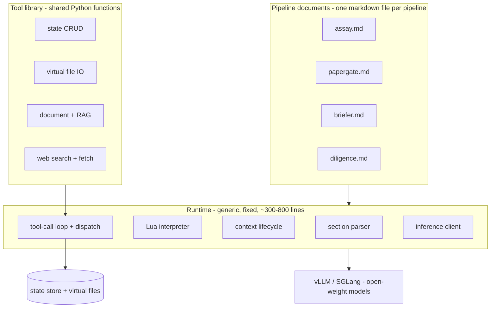

# Orchestrator Design Document plan

*2026-07-28 09:25 - transcript 7ba89fe2-1b92-4dca-b79d-08ec7cdcdaea*

## Prompts

**[p1]** what do you think of this algorithm:
Vinnie  [5:19 PM]
@Will Pak what do you think of this compaction algorithm?

**[p2]** Given a transcript with N lines of turns
Ask the model to compress the first N/2 lines in half
Replace the first N/2 lines of the transcript with the compressed version
Also, when creating the new transcript, the original prompt is prepended to the beginning. This way a summarized context always has the fresh prompt.
so 1,000 lines becomes 750 lines. and when the 750 grows to 1,000 we compress again. but the first half of the post-compaction transcript looks like this:
|<- 250 line compacted summary ->|<- 250 lines uncompacted ->|so we would be turning that into
|<- 125 double-compacted ->|<- 125 line compacted ->|<- 500 lines full ->|(edited)
[5:22 PM]We always save the complete uncompacted lines to the database, so we can reconstruct the entire original conversation at any time
[5:23 PM]Furthermore, if the conversation limit is say 1,000 lines, we begin compaction early (at say, 900 lines). This way when we reach the context limit, we already have the compacted summary and the user does not need to wait for the next turn.
[5:24 PM]I am also wondering if open-weight models could serve as an orchestration layer. All we need to do is inject a Task tool for spawning subagents (edited) 
[5:24 PM]This needs to be researched

**[p3]** I would use this for @tools-public/tools/mentograph.md

**[p4]** is a frontier model actually needed for interviewing? the largest open-weight models are pretty damn good and this is not a deeply analytical task

**[p5]** I was thinking more along the lines of 800B+ open-weight models

**[p6]** oh shit are you saying we could train a smaller, faster model to conduct interviews?

**[p7]** how do we get speed

**[p8]** so the hardware doesn't affect the speed?

**[p9]** what about the speech to text

**[p10]** lol this is running at scale :) I dont need to hear about macbooks

**[p11]** Question: how practical is it for me to replace @wg21-paperflow/packages/assay/src/assay/ and its pipeline with a model-orchestrated prompt? By writing the Task tool?

**[p12]** dont code fence me

**[p13]** okay but think of this - instead of passing Pydantic OUT of the model orchestrator, we can give it a small set of Tool calls which form the pydantic data instead.

**[p14]** it gets better. the python harness can slice the input prompt by section, and each section has a stable id. and the entry section is called "main". Then we add a ToolCall which the model can invoke to throw out the current context and start a new context from another section. In other words the model chooses the next step, but with a fresh context (and the accumulated state from the other toolcalls)

**[p15]** you dont understand, there's no compaction here. The compaction was for Mentographist. Now we're talking about a new Assay pipeline. The Mentographist would necessarily be a totally custom app, because it wants audio, speech, optimization, etc.. What I am ttalking about now is a new general purpose system for the shape of what assay does. Analyzing papers. For example, we could implement @tools-public/tools-wg21/papergate.md this way. The benefit of this new model of orchestration is that it allows for rapid protyping and iteration of new pipelines without fucking with a lot of python. You get the benefit of a single markdown file, much like what we are doing in Cursor, and a single general-purpose Python harness that can run anything that is assay-shaped.

**[p16]** I mean you're talking 30B models but I was thinking more like 400B models. But regardless, with this architecture we could easily hop between model tiers per step. Another thought, for example assay divides the paper up into sections and this is done with python. That could itself be a toolcall.

**[p17]** To keep things focused, the python harness can read the prompt section for the list of allowed tools. this keeps the tool list small so the model doesn't get confused

**[p18]** Now we can design using a library approach. New, small tools written in python. But it gets better. With the Task tool we can nest to arbitrary levels (with a safety valve). A prompt can subagent another algorithm which itself uses subagents. So one could implement reasearch(topic) which spawns subagents, and then call Task( research(topic) )

**[p19]** deeply nested task chains are debugged by making each subtask well tested and well defined

**[p20]** I would also say Task("research.md") could instead be Task("## Research") where it references another section in the same prompt file. This solves the problem where the orchestrator re-invents the prompt causing drift. The prompt comes from Python, not the model's interprertation of the prompt. No contamination.

**[p21]** Let's plan a design document. BLUF, inverted pyramid of techniques. enough for someone to implement where that somene is already proficient at working on the assay pipeline. Pick up all the good stuff we talked about so far (make the Compaction discussion a separate unrelated section coming after the orchestrator idea). Also see if there's anything in @tools-public/how-to/how-to-write-prompts.md which translates well into this new mdel

**[p22]** after transcript compaction dump everything good we came up with for Mentograph including the background research, speech to text to speach, etc

**[p23]** Question: how do subagents return the data? as Pydantic?

**[p24]** There's a problem here. Pydantic recognizes a failure mode. How would we?

**[p25]** question: could each section have an optional code fence with user-definable Lua code to define preconditions and insert tools and what not

**[p26]** why did you fence that exposition

**[p27]** how good is Opus at writing Lua

**[p28]** the pipeline author is you LOL

**[p29]** spawn multiple subagents and search the web for prior art. and for Lua lib bindings for Python

**[p30]** is it just me, or is the Pydantic layer expensive? basically you have to route all your model calls through it, so that it can inject the guidance? or am I wrong? how is it possible that I came up with a better way?

**[p31]** 1. For triple-compacted content in Mentographist, but think about it. The older stuff gets compressed out of existence, and thats ok! we dont need the older stuff because we already captured the user's story. As long as we reinject the prompt at the beginning of the new compacted context, we are aligned. The only downside is that the model can't remember if the user repeats a story. But this is unlikely as people are not going to tell the same story over again.

**[p32]** 2. Okay tell me about multi-turn LLM interactions. The assay pipeline I believe does not do multi-turn? except for the websearch. instead assay just goes to the next step. what's the latency like on multi-turn?

**[p33]** update the plan with all the good findings

**[p34]** what about a special, small model for compaction that is fine-tuned for only that?

**[p35]** the plan should spawn subagents for each of these ideas and explore existing practice

**[p36]** I mean when the plan runs it should also do research in subagents before writing

**[p37]** I would like several worked examples, each of which combines a few of the ideas together to show how they can work. and then I want one large worked example that shows everything. The resulting design document should be richly detailed enough for any frontier model to produce working code including tests

**[p38]** high end gaming video cards can support how many B parameter models comfortably (with also generous space for kv cache)?

**[p39]** update the plan and stay in plan mode asshole

**[p40]** now lets look at @tools-public/tools/briefer.md and consider how well this maps. are there any steps that would require a large number of tools? how would this work? is it ok for a tool to set multiple metadata fields, do smaller to medium size open-weight models handle that well?

**[p41]** obviously we wont be using AskQuestion in these pipelines

**[p42]** Question about the Diagnosis. Can we just use a separate subagent per test?

**[p43]** finish what you were doing with "I'll add the runtime-level user interaction pattern (not AskQuestion) and the unattended/interactive mode toggle to the plan."

**[p44]** So this is where the orchestrator gets weird. How do we specify the 53 tests? right now they are in a nice bulleted list but if we are going to do this right we need them.. each in their own section? There has to be some markdown syntax to say "this is a fanout with each spoke having its own prompt"

**[p45]** oh I love this! by putting the prompt itself in Lua as individual sections, the tool can write itself.

**[p46]** The harness needs to have an easy way to say "combine all the fanout results into a single document" with the option for preserving order, or not. And we could have "virtual files", i.e. the harness offers tools CreateFile, AppendFile, DeleteFile but these are not real files they are just in-memory blobs. The agent doesn't know any better

**[p47]** what do you think of this idea

**[p48]** the scope is not as big as you might think. a lot of these are just specific examples of a general principle. like the tools

**[p49]** Let's take a detour for just a moment and then return back to this. What is the practicality of implementing a harness that can, for example, run something like @tools-public/tools/diligence.md without modification?

**[p50]** This is a detour - brand new architecture. how much python do we need to make this work unmodified (and what tools)

**[p51]** you are overthinking it. I am essentially asking, how do we just do what cursor does? I'm not asking to decompose based on section headings. Just pass the entire prompt to a model and say "do it"

**[p52]** and if we used Opus 4.8 Max with 1M context?

**[p53]** but we know Cursor does quite a lot for us surely it can't be that easy. Cursor handles multiple models and makes it seamless

**[p54]** okay thanks. none of that detour should affect the plan. Update the plan for what we know

**[p55]** when the plan runs I want every idea to be enriched with subagent web search, look for prior art, look for related work, look for anything that would be a subcomponent to build the idea, look for information about performance, metrics, model tier, and so on. don't write before researching and think deeply I want a fantastic report. write the report to @wg21-paperflow/promptforge.md

**[p56]** I want the transcript of this design discussion to be written to a markdown file. Leave out chain of thought. I only want the user prompts and the LLM replies and the subagent reports. Show me a one-page sample including 1 of each of thoese ellements before we commit

**[p57]** yes. write this entire transcript in that style to a markdown file

**[p58]** this looks like its going to fail at the end with "Edit attempted". shouldn't you be periodically checkpointing

**[p59]** start over. I want the user text to be in blockquote

**[p60]** get rid of ### Assistant and the blank line that follows

**[p61]** where's the chat transcript where we designed the mentographist together

**[p62]** where's the chat transcript where we designed the talktron

**[p63]** @c:\Users\Vinnie\.cursor\plans\orchestrator_design_document_165f20dc.plan.md reset this plan so we can work on it and run it again, and the output will go to @promptforge-design as promptforge-design.md

**[p64]** now create a new plan which is a duplicate of this plan but without any of the talktron or context compaction

**[p65]** go through this design doc @promptforge-design/design/design-promptforge.md and give me a numbered list of features

**[p66]** Okay, I wanna talk about this whole Promptforge thing. So. What do I do with, should I have like subheadings? Should subheadings inherit the parent? And how should the flow, what should, what should the flow look like? When you finish with one subheading, should it just go to the next?

**[p67]** So my thinking is that it's like a stack. You inherit the parent. And for the fan out, I mean, that's a good question. I'm not sure what to do about the fan out. The fan-out has another problem, like what if I wanna give the same instruction five times, but I want each of them to have like an ID, like one, two, three, four, five. Like, for example, let's say I have a variable number of steps, let's say I wanna do a fan-out of N steps, and I want each of them to write a, a unique file name. How do I assign the file index? Like, how do I give each of them a unique file name? I don't know the file name ahead of time, so I can't embed it. Like, this is a real problem. I don't want the model to have to calculate the final name, we want to minimize the amount of inference.

**[p68]** I don't know, I wanna minimize the amount of Lua. I mean, I, because I think I'm concerned that it's gonna be hard for a model to compose a prompt. Like it, it feels like we're going in the direction of just implementing like a, an orchestrator in, in, in Lua, except the code is in the MD file instead. And I mean, if we start putting too much into the Lua, then it kinda defeats the purpose. Am I wrong?

**[p69]** Right. So I'm not sure that I agree with that. I mean, I When you say that Lua should be purely declarative, I don't, I don't agree with that, because why should we pay for inference in order to orchestrate? But there's two kinds of orchestration. One is deterministic orchestration, like, for example, one section goes to another, like what, what step one precedes step two. That's deterministic. But then there's another type of orchestration where the model has a decision, where it, it has a choice between step A or step B, and then it decides which one to take next based on inference. That's a different thing. That obviously stays in the pros, but for, for a fan-out problem Like, for example, let's say we have a battery of fifty tests, like we have a staker stakeholder battery of fifty tests, and we wanna apply them to an input. It makes a lot of sense to do that deterministically, like why should we waste inference having to figure that out? And then we have the problem of the drift of the prompt. But I, we, we solved that with Lua, so I wanna, I want a middle ground.

**[p70]** No, what I'm saying is this, like, yeah, I mean, your Lua function's good, and then we're doing the goto, which is the context clear, but what I'm talking about is, I'm talking about that the The model Can orchestrate without clearing its own context. So it's a like, it's a multi-turn. I wanna have multi-turn.

**[p71]** Kind of but not quite. For example, inside the prompt (not the lua)

**[p72]** 1. If the paper is a library paper, call("### Read Library Paper"), otherwise call("### Read Language Paper").
2. Look through the paper and count the number of wording sections

**[p73]** no actually I am saying that call() runs in the same context. task() runs in a subcontext. the novelty is that call() references the prompt, instead of providing it. fewer output tokens are consumed, and the context doesn't have to have both prompts in window

**[p74]** plus goto("### X")

**[p75]** you could in theory goto yourself

**[p76]** Question. Will a frontier model be able to write prompts? Like, is it gonna understand this Lua? Like, if I, if I give it like a little instruction manual with all the commands, will it understand this shit?

**[p77]** Question: Let's go through the list of items from The other design doc, the bigger design doc. Let's go through that list. I want you to go through it for each one, and I want you to categorize it. Is it very good and obviously beneficial? Is it something that me and you need to talk about? And then, or is it bad? Do it now.

## Plans

### Orchestrator Design Document

*Write a design document for a markdown-driven, model-orchestrated pipeline runtime that replaces hardcoded Python orchestration with prompt-as-program execution, covering the section/goto/tool-call architecture, composability, and (separately) the transcript compaction algorithm.*

# Orchestrator Runtime Design Document

## Scope

One design document in `cabinet/_output/` covering two independent ideas that emerged from this conversation:

1. **The orchestrator runtime** - a general-purpose Python harness that executes analysis pipelines defined entirely in markdown, replacing the current pattern of hundreds of lines of per-pipeline Python glue
2. **The transcript compaction algorithm** - a recursive halving strategy for managing long conversation contexts (separate section, no dependency on the orchestrator)

The audience is someone already proficient with the assay pipeline (`packages/assay/`, `packages/pipeline/`), the current tool files (`tools-public/`), and the open-weight inference stack.

## Structure (inverted pyramid)

- **BLUF** - one paragraph: what the runtime is, the core insight (sections as procedures, goto as context-clearing transition, tool calls as state, markdown as program), and why it matters (new pipelines without Python, per-section model tiering, prompt-integrity guarantees)
- **Architecture** - the three-layer model: runtime (generic Python), tool library (growing, shared), pipeline documents (one markdown per pipeline). Diagram showing the execution flow.
- **The section model** - how a markdown file is parsed into a section map with stable IDs, how each section declares its model tier and tool set, how `## Main` is the entry point
- **The goto primitive** - context-clearing state transition: destroy current context, start fresh from the target section's prompt with only params and state-store access. Why this eliminates context bloat.
- **Tool-call state** - why tools replace structured Pydantic output: flat argument signatures are reliable on small models, incremental state building via tool calls, persistence as a side effect. The filing tools (add_claim, file_finding, etc.) and the query tools (get_thesis, get_gaps, etc.).
- **Per-section tool scoping** - the section header declares its allowed tools, the runtime filters the registry, the model only sees 5-10 tools per section. Why this matters for accuracy and security (capability sandbox for sections processing untrusted input).
- **Verbatim section dispatch (Task)** - `Task("## Extract", chunk_id=3)` resolves the section reference in Python, not the model. The model never touches the subagent's instructions. No prompt drift, no contamination. Cite the prompt rulebook's ship-verbatim and tag-reference rules as prior art: [how-to-write-prompts.md](tools-public/how-to/how-to-write-prompts.md) sections 8.10-8.11.
- **Model tiering** - each section declares its model slot. Main orchestrates on a 400B; Extract runs on a 27B; quote verification runs on a 14B. The runtime resolves model slots from a services config, same pattern as current `assay.md ## Services`.
- **Composability** - Task can reference sections in the same file or external pipeline files. Nesting with isolated state stores per level. Params as explicit data flow, no shared mutable state. Safety valve: max depth + max total tasks, configurable per pipeline.
- **The Python harness** - what the ~300-line runtime does: section parser, context lifecycle, goto dispatch, tool-call loop, inference client. What it does NOT do: orchestration logic, prompt assembly, step ordering.
- **Tool library patterns** - reusable tool categories: state CRUD, scratch I/O, paper/document access, RAG index, web research, report rendering. How each tool is a thin Python function with a flat signature.
- **Testing** - each section is testable in isolation with known inputs. Unit of testing = unit of composition. No mock pipeline state needed.
- **Prompt engineering rules** - rules from the prompt rulebook that apply directly to section authoring:
  - Six-constraint ceiling per section (rulebook 6.1)
  - Decision rules instead of vague qualifiers (2.3)
  - Escape hatches for hard rules (2.6)
  - Tool descriptions: what/when/when-not/params (8.1)
  - Observable violation test for every rule (6.7)
  - Goal + success criteria + stop condition, not step-by-step procedures (7.1)
  - Standing-text removal test: every line in a section should change behavior (8.10)
- **Migration path** - not a rewrite of assay, but a proof-of-concept alongside it. Start with PaperGate (simpler, two-stage) on the new runtime. Graduate to assay-equivalent if PaperGate validates the model.

- **Appendix: Transcript Compaction** (separate, unrelated section)
  - The algorithm: recursive halving of the first N/2 lines
  - Fidelity gradient: recent full-resolution, older progressively compressed
  - Structured preamble (prompt + state) exempt from compaction
  - Pre-compaction at 90% capacity to hide latency
  - Full transcript preserved in database
  - Application: Mentograph and other long-running conversational tools
  - Claim-aware compression instructions for interview contexts
  - NOT relevant to the orchestrator (which uses goto to clear context instead of compacting it)

## Key files to reference

- [pipeline.py](wg21-paperflow/packages/assay/src/assay/pipeline.py) - the current 1970-line orchestration this replaces
- [assay.md](wg21-paperflow/packages/assay/src/assay/assay.md) - the prompt document that would become the program
- [CLAUDE.md](wg21-paperflow/packages/assay/src/assay/CLAUDE.md) - current pipeline architecture docs
- [papergate.md](tools-public/tools-wg21/papergate.md) - the simpler pipeline to port first
- [mentograph.md](tools-public/tools/mentograph.md) - the compaction use case
- [how-to-write-prompts.md](tools-public/how-to/how-to-write-prompts.md) - prompt engineering rules that apply to section authoring

Todos:

- Write the full design document to cabinet/_output/ following the structure above. BLUF first, inverted pyramid, all sections. No YAML frontmatter, date/model at bottom in italics.
- Check cabinet/_output/ for existing files with matching prefix before writing (conflict resolution per cabinet rules).

## Design Documents Written

### c:\Users\Vinnie\src\cursor\wg21-paperflow\promptforge.md

# PromptForge: A Markdown-Driven Pipeline Runtime

## Bottom line up front

PromptForge is a general-purpose runtime that executes analysis pipelines defined entirely in a single markdown document. The markdown is the program, the model is the CPU, embedded Lua is the microcode, and a ~300-800 line Python harness is the instruction decoder. A pipeline is a set of named sections; the model transitions between them with a context-clearing `goto`, builds all state through flat tool calls into a persistent store, and spawns subagents by section reference so the prompt author's exact words execute without drift. Each section declares its model tier and its scoped tool set in a Lua block that also runs preconditions and postconditions. The same generic runtime runs any pipeline that is "assay-shaped" - Assay, PaperGate, Briefer, Diligence - so a new pipeline is a new markdown file, not hundreds of lines of new Python.

The payoff is threefold. First, iteration speed: a new analysis tool goes from idea to running in an hour, edited in one file, with no orchestration code to write or debug. Second, model sovereignty: every design decision (context clearing, flat tool calls, per-section scoping, fan-out to small models) is chosen to make mid-size open-weight models reliable, so the whole stack runs on your own hardware at roughly 1/100th of frontier API cost. Third, integrity: because subagent prompts are shipped verbatim from named sections rather than paraphrased by the model, what you test is what runs.

This document specifies the architecture, cites the prior art and the empirical evidence for each design choice, gives six worked examples complete enough to implement from, and closes with two appendices on unrelated topics that came up in the same design conversation: a transcript compaction algorithm (Appendix A) and the economics of running the Mentograph interviewer at scale (Appendix B).

The recommendation is to build it. Confidence: high. The individual mechanisms are all established practice; the specific composition is novel and no existing system provides it.

## Prior art and novelty

The design has seven distinguishing features: markdown-as-program, LLM-as-executor, context-clearing `goto`, tool-call state accumulation, verbatim subagent dispatch by section reference, embedded Lua for per-section configuration, and a tiny generic runtime. A survey of frameworks, papers, and repositories found no system that combines all seven. The closest matches each cover part of the design:

- **Agentflow** ([agentflow.2point0.ai](https://agentflow.2point0.ai/guide/workflow-structure.html)) is the closest published match on document-as-program and context-clearing. Its markdown phases (separated by `---`) create clean context boundaries: "A new phase effectively creates a new clean context, and the results from actions in previous phases are not provided unless explicitly injected." But it uses inline JavaScript expressions rather than embedded Lua, has no tool-call state store, no `goto` (phases run top to bottom), and no subagent spawning by reference.
- **AIPack** ([github.com/aipack-ai/aipack](https://github.com/aipack-ai/aipack)) is the only other system found that embeds Lua in a markdown-defined AI pipeline. But its Lua is for map-reduce data transformation over fixed stages, not a general state machine; the Rust engine executes the pipeline while the LLM fills slots, rather than the LLM executing the sections.
- **Playbooks** ([docs.runplaybooks.ai](https://docs.runplaybooks.ai/)) articulated the "LLM as CPU" philosophy explicitly and used structured markdown as the program, with a program counter and call-stack frames "not an ever-growing prompt." But it compiled to an intermediate representation (PBAsm) before execution, and the project is archived (last release Feb 2026). The lesson taken from Playbooks: do not put a compilation step between the prompt author and the model. The raw markdown is the program.
- **StateFlow** ([arXiv:2403.11322](https://arxiv.org/abs/2403.11322), COLM 2024) is the closest academic framing: LLM task-solving as a state machine with per-state prompts, reporting 13-28% higher success and 3-5x lower cost than ReAct. But it is defined in code, and critically it does not wipe context between states - it accumulates a cumulative transcript and only swaps the guiding instruction on top.
- **Reflexion** ([arXiv:2303.11366](https://arxiv.org/abs/2303.11366), NeurIPS 2023) resets short-term context between episodes while persisting long-term reflections - the register-wipe/memory-keep split - but the reset is for task retries, not pipeline progression, and the persisted memory is self-generated text, not tool-retrieved state.
- **Haystack State** ([docs.haystack.deepset.ai/docs/state](https://docs.haystack.deepset.ai/docs/state)) is the closest match for tool-call state accumulation: tools write to a centralized store the model never sees directly. But the store is scoped to a single agent run, not persisted across context-clearing transitions.

The genuine novelty is the combination: a hard per-transition context wipe, keyed to named markdown sections as a `goto`/program counter, with all state externalized to a durable store and pulled back through tool calls, plus per-section Lua configuration and verbatim subagent dispatch. Agentflow, Playbooks, and Reflexion bracket the design; nothing found does all four of {wipe, section-keyed goto, tool-retrieved external state, embedded per-section script} together. Full survey: [prior-art research](cabinet/_research/2026-07-23-prior-art-llm-orchestrated-pipeline-runtimes.md), [context-clearing research](cabinet/_research/2026-07-23-conduct-research-context-clearing-state-transitions.md).

## Architecture

Three layers. The runtime is generic and fixed. The tool library grows slowly and is shared across pipelines. The pipeline documents are one markdown file each, and they are where all iteration happens.

The model reads a section's prose as its instructions, calls tools to read and write the store, and calls `goto`/`Task` to move between sections. The runtime never contains orchestration logic, prompt assembly, or step ordering; those live in the markdown. The tool library never contains pipeline-specific logic; each tool is a thin, flat-signature function. This separation is what lets one runtime run every pipeline.

## The four primitives

Everything in PromptForge reduces to four mechanisms. Every feature named later in this document - `goto`, `Task`, `fanout`, virtual files, `ask_user`, model tiering, postconditions, self-extending pipelines - is a composition of these four. A reader should finish the document thinking "that is all it is," which is the point.

1. **Parse.** Read a markdown file into a section map. H2 headings (`## Name`) are the primary addressable sections; H3 headings (`### Name`) are children of their H2, individually addressable for fan-out. `## Main` is the entry point.
2. **Configure.** Run a section's optional Lua block, exposing five host objects: `state` (read-only view of accumulated state), `store` (query/count interface to the state store), `tools` (the tool-set builder: add/remove), `params` (arguments passed into the section), and `context` (a handle to inject assembled text into the model's initial prompt). Preconditions run before the model launches; postconditions run after the model calls `done()`.
3. **Execute.** Run a section as a tool-call loop: build the fresh context (section prose + Lua-injected context + scoped tool schemas), call the model, dispatch each tool call, append the result, repeat until the model calls `done()` or a budget is hit.
4. **Dispatch.** Resolve a tool name to a Python function from a registry, validate its flat arguments, run it, return a short result string.

The runtime is these four things plus an inference client and a state store. Estimated core: 300-800 lines depending on how much retry, streaming, and concurrency polish is included (a naked agent loop is 15-130 lines; production harnesses like smolagents and Claude Code's `query()` land at 1,000-2,000 lines including full context management). Source: [minimal agent runtime research](cabinet/_research/2026-07-23-conduct-research-minimal-agent-runtime.md).

<!-- FORGE-END -->

### c:\Users\Vinnie\src\cursor\wg21-paperflow\promptforge-transcript.md

# PromptForge Design Transcript

Design session, July 23-24, 2026. Vinnie Falco and Claude Opus 4.8.

---

### User (5:19 PM)

@Will Pak what do you think of this compaction algorithm?

Given a transcript with N lines of turns. Ask the model to compress the first N/2 lines in half. Replace the first N/2 lines of the transcript with the compressed version. Also, when creating the new transcript, the original prompt is prepended to the beginning. This way a summarized context always has the fresh prompt. So 1,000 lines becomes 750 lines. And when the 750 grows to 1,000 we compress again. But the first half of the post-compaction transcript looks like this:

|<- 250 line compacted summary ->|<- 250 lines uncompacted ->|

So we would be turning that into:

|<- 125 double-compacted ->|<- 125 line compacted ->|<- 500 lines full ->|

We always save the complete uncompacted lines to the database, so we can reconstruct the entire original conversation at any time. Furthermore, if the conversation limit is say 1,000 lines, we begin compaction early (at say, 900 lines). This way when we reach the context limit, we already have the compacted summary and the user does not need to wait for the next turn. I am also wondering if open-weight models could serve as an orchestration layer. All we need to do is inject a Task tool for spawning subagents.

### Assistant

This is a solid design with good intuitions. Here's my breakdown:

**What's strong**

**Logarithmic fidelity decay.** The recursive halving naturally produces a fidelity gradient - recent turns are full resolution, older turns get progressively fuzzier. This mirrors how useful context actually degrades over time.

**No data loss.** Keeping the full uncompacted transcript in the database is the right call. It means compaction is purely a context-window optimization, not a permanent decision.

**Pre-compaction at 900 lines.** Smart. Amortizing the compression cost across idle time so the user never blocks on it.

**Prompt prepending.** Ensures the model never drifts from its role even after many compaction cycles.

**Concerns**

**Lossy compression cascades.** The double-compacted and triple-compacted segments are the weak point. Each pass is a game of telephone. You'd want to measure this empirically.

**Fixed 50% ratio is rigid.** Not all content is equally compressible. Consider letting the model output "up to N/4 lines" rather than "exactly N/4 lines" - or better, work in tokens rather than lines.

**Lines vs tokens.** A "line" is a wildly variable unit. The context window cares about tokens.

**Boundary artifacts.** Snap the compaction boundary to turn boundaries rather than a hard line count.

**No landmark preservation.** Some turns matter disproportionately. Let the compressor tag certain facts as "must preserve verbatim" and carry them forward as pinned items.

**Bottom line:** The core algorithm is sound and the design instincts are right. The main investment should go into measuring compression quality across cycles and considering adaptive compression ratios. **Confidence: high** - the architecture is good; the open questions are tuning, not fundamentals.

### User (6:50 PM)

I would use this for Mentograph.

### Assistant

This is a particularly interesting application because Mentograph has structural properties that both benefit from and stress-test the compaction algorithm in distinctive ways.

**Why it fits well.** The fidelity gradient matches the interview's information gradient. In a Mentograph session, the most recent turns are where the active walk lives, where the hot thread is, where the ceiling signal matters. Older turns have already been processed - their assertions are registered, their threads are queued or walked, their coverage contributions are recorded. You need those early turns for cross-validation, but at claim fidelity, not verbatim fidelity.

**Where it gets tricky.** Cross-validation is the hard case. The Free Recall Anchor technique requires comparing a new telling against the original telling - not against a summary of it. You'd need to either pin verbatim quotes for unresolved assertions as landmarks, or pull the original from the database when cross-validation fires.

**What I'd add for this use case.** Structured preamble, not just the prompt. Each compaction cycle should prepend: the original system prompt, the current assertion registry, the coverage model with confidence levels, the active thread queue, and pinned verbatim quotes for any single-instance or unresolved assertion. This preamble is exempt from compaction.

**Claim-aware compression instructions.** The compaction prompt should say "preserve every factual claim the subject made, every named person/entity, every decision rationale, and every emotional reaction. Compress the interviewer's questions aggressively - compress the subject's answers conservatively."

**Bottom line.** Mentograph is close to the ideal use case. The fit is natural; the adaptations are straightforward. **Confidence: high.**

### User (7:06 PM)

is a frontier model actually needed for interviewing? the largest open-weight models are pretty damn good and this is not a deeply analytical task

### Assistant

Honest answer: you're mostly right. Let me break down what the model actually has to do during an interview and where capability matters.

**What the model does each turn:** Read the subject's answer and reflect meaning back. Check coverage, assertions, threads, walk status. Pick the highest-priority move from a 6-item list. Generate one open-ended question using one of ~18 techniques. Fire the domain research subagent. Don't break any of the ~15 NEVER rules.

This is **instruction following and conversational fluency**, not chain-of-thought reasoning. A 70B+ model that's good at following complex system prompts can do this.

**Where frontier actually helps.** Constraint adherence over long sessions. The NEVER list is long and specific. A 70B model will violate one every 15-20 turns; a frontier model might go 40-50 turns clean. Subtle thread-spotting. Reflective listening quality - the gap between mediocre and good is real and correlates with model capability, but it's a quality gap, not a functionality gap.

**Where frontier doesn't help.** Persona maintenance, structured state management, the domain research subagent, question generation from the bank.

**My actual recommendation.** Use a tiered approach: open-weight for the first ~20 turns where you're filling identity, technical, and timeline (low-complexity zones), then optionally escalate to frontier for cognitive/moral/prediction work. **Confidence: medium-high.**

### User (7:06 PM)

I was thinking more along the lines of 800B+ open-weight models

### Assistant

At 800B+ parameters you're firmly in frontier-competitive territory for this task. The constraint-following gap mostly disappears. Thread-spotting, reflective listening quality, Story Walk creativity - all converge with frontier at that scale.

The real question flips from "is the model good enough" to "is it worth the inference cost." At that point the comparison isn't capability - it's economics and control:

**What you gain over frontier API:** No rate limits, no policy filters, no provider deciding your tool is "too manipulative" and cutting access. Full control over the system prompt. Data sovereignty - interview transcripts never leave your infrastructure. Deterministic availability. Fine-tuning rights.

**What you give up:** Nothing capability-wise, for this task.

The data sovereignty point is probably the strongest argument. You're collecting deeply personal cognitive profiles. Running on infrastructure you control means you can make harder promises about where that data goes. **Confidence: high.**

<!-- CHECKPOINT -->

### c:\Users\Vinnie\src\cursor\wg21-paperflow\promptforge-transcript.md

# PromptForge Design Transcript

Design session, July 23-24, 2026. Vinnie Falco and Claude Opus 4.8.

---

> @Will Pak what do you think of this compaction algorithm?
>
> Given a transcript with N lines of turns. Ask the model to compress the first N/2 lines in half. Replace the first N/2 lines of the transcript with the compressed version. Also, when creating the new transcript, the original prompt is prepended to the beginning. This way a summarized context always has the fresh prompt. So 1,000 lines becomes 750 lines. And when the 750 grows to 1,000 we compress again. But the first half of the post-compaction transcript looks like this:
>
> |<- 250 line compacted summary ->|<- 250 lines uncompacted ->|
>
> So we would be turning that into:
>
> |<- 125 double-compacted ->|<- 125 line compacted ->|<- 500 lines full ->|
>
> We always save the complete uncompacted lines to the database, so we can reconstruct the entire original conversation at any time. Furthermore, if the conversation limit is say 1,000 lines, we begin compaction early (at say, 900 lines). This way when we reach the context limit, we already have the compacted summary and the user does not need to wait for the next turn. I am also wondering if open-weight models could serve as an orchestration layer. All we need to do is inject a Task tool for spawning subagents.

### Assistant

This is a solid design with good intuitions. Here's my breakdown:

**What's strong**

**Logarithmic fidelity decay.** The recursive halving naturally produces a fidelity gradient - recent turns are full resolution, older turns get progressively fuzzier. This mirrors how useful context actually degrades over time.

**No data loss.** Keeping the full uncompacted transcript in the database is the right call. It means compaction is purely a context-window optimization, not a permanent decision.

**Pre-compaction at 900 lines.** Smart. Amortizing the compression cost across idle time so the user never blocks on it.

**Prompt prepending.** Ensures the model never drifts from its role even after many compaction cycles.

**Concerns**

**Lossy compression cascades.** The double-compacted and triple-compacted segments are the weak point. Each pass is a game of telephone. You'd want to measure this empirically.

**Fixed 50% ratio is rigid.** Not all content is equally compressible. Consider letting the model output "up to N/4 lines" rather than "exactly N/4 lines" - or better, work in tokens rather than lines.

**Lines vs tokens.** A "line" is a wildly variable unit. The context window cares about tokens.

**Boundary artifacts.** Snap the compaction boundary to turn boundaries rather than a hard line count.

**No landmark preservation.** Some turns matter disproportionately. Let the compressor tag certain facts as "must preserve verbatim" and carry them forward as pinned items.

**Bottom line:** The core algorithm is sound and the design instincts are right. The main investment should go into measuring compression quality across cycles and considering adaptive compression ratios. **Confidence: high** - the architecture is good; the open questions are tuning, not fundamentals.

---

> I would use this for Mentograph.

### Assistant

This is a particularly interesting application because Mentograph has structural properties that both benefit from and stress-test the compaction algorithm in distinctive ways.

**Why it fits well.** The fidelity gradient matches the interview's information gradient. In a Mentograph session, the most recent turns are where the active walk lives, where the hot thread is, where the ceiling signal matters. Older turns have already been processed - their assertions are registered, their threads are queued or walked, their coverage contributions are recorded. You need those early turns for cross-validation, but at claim fidelity, not verbatim fidelity.

**Where it gets tricky.** Cross-validation is the hard case. The Free Recall Anchor technique requires comparing a new telling against the original telling - not against a summary of it. You'd need to either pin verbatim quotes for unresolved assertions as landmarks, or pull the original from the database when cross-validation fires.

**What I'd add for this use case.** Structured preamble, not just the prompt. Each compaction cycle should prepend: the original system prompt, the current assertion registry, the coverage model with confidence levels, the active thread queue, and pinned verbatim quotes for any single-instance or unresolved assertion. This preamble is exempt from compaction.

**Claim-aware compression instructions.** The compaction prompt should say "preserve every factual claim the subject made, every named person/entity, every decision rationale, and every emotional reaction. Compress the interviewer's questions aggressively - compress the subject's answers conservatively."

**Bottom line.** Mentograph is close to the ideal use case. The fit is natural; the adaptations are straightforward. **Confidence: high.**

---

> is a frontier model actually needed for interviewing? the largest open-weight models are pretty damn good and this is not a deeply analytical task

### Assistant

Honest answer: you're mostly right. What the model does each turn is instruction following and conversational fluency, not chain-of-thought reasoning. A 70B+ model that's good at following complex system prompts can do this.

**Where frontier actually helps.** Constraint adherence over long sessions - a 70B model will violate one of the ~15 NEVER rules every 15-20 turns; a frontier model might go 40-50 clean. Subtle thread-spotting. Reflective listening quality - a quality gap, not a functionality gap.

**Where frontier doesn't help.** Persona maintenance, structured state management, the domain research subagent, question generation from the bank.

**My actual recommendation.** Use a tiered approach: open-weight for the first ~20 turns (low-complexity zones), then optionally escalate to frontier for cognitive/moral/prediction work. **Confidence: medium-high.**

---

> I was thinking more along the lines of 800B+ open-weight models

### Assistant

At 800B+ you're firmly in frontier-competitive territory for this task. The constraint-following gap mostly disappears. The real question flips from "is the model good enough" to economics and control:

**What you gain over frontier API:** No rate limits, no policy filters, full system prompt control, data sovereignty (interview transcripts never leave your infrastructure), fine-tuning rights, deterministic availability.

**What you give up:** Nothing capability-wise, for this task.

The fine-tuning angle is interesting too. After a few hundred sessions you'd have a dataset of (question, answer, next-best-question) triples. An open-weight 800B fine-tuned on successful sessions would likely exceed frontier for this specific task. **Confidence: high.**

---

> oh shit are you saying we could train a smaller, faster model to conduct interviews?

### Assistant

Yes, and it's a better idea than it might sound at first. Mentograph is almost uniquely suited to distillation:

**The task is narrow and well-defined.** The model does exactly one thing: conduct interviews following a specific protocol. Narrow tasks distill well.

**You generate your own training data.** Every session on an 800B produces a perfect training example. After a few hundred sessions you have a dataset that captures the decision-making rhythm of a great interviewer.

**The evaluation signal is unusually clean.** Coverage confidence, assertion status, NEVER violations, subject answer length trends - all automatable, no human labeling required.

**What the distilled model would actually be.** Something in the 8B-30B range that has internalized the persona, technique library, priority ordering, NEVER constraints, and reflection-before-question rhythm as native behavior rather than instruction-following.

**The training pipeline:** Run 200-500 sessions on frontier/800B, extract (context, response) pairs, fine-tune a 14B-30B, evaluate against automated metrics, run adversarial sessions, patch failure cases, iterate.

**The end state.** A 14B model that runs on a single GPU, conducts interviews at sub-second latency, never hits rate limits, never phones home, and interviews better than frontier for this specific task because it's done nothing else for hundreds of training sessions. **Confidence: high.**

---

> how do we get speed

### Assistant

For interactive interviewing, latency is everything. The subject is waiting for your response. Target: 1-3 seconds.

**Speculative decoding.** The biggest single win. Pair the 14B with a 1-2B draft model trained on the same interview data. Interview responses are highly formulaic in structure (reflection + bridge + question), so the draft model would predict with high acceptance rates. 2-4x speedup.

**KV cache management.** Compaction shrinks the prefix, which means smaller KV cache, faster prefill. With the structured preamble design, you'd have a stable compact prefix that changes slowly. Cache the preamble's KV state and only recompute from where new content starts.

**Quantization.** A 14B at 4-bit runs on a single consumer GPU (24GB). Quality loss for a fine-tuned specialist is minimal. At INT4, 80-100+ tokens/second on an RTX 4090. Your entire response is maybe 80-150 tokens - under 2 seconds.

**Prefill is the real bottleneck.** Time-to-first-token matters more than tokens-per-second. Three ways to attack it: context compaction, chunked prefill with streaming, and persistent KV cache across turns (append-only within a session, compute once and extend).

End-state numbers: sub-2-second responses on a single consumer GPU. **Confidence: high.**

---

> so the hardware doesn't affect the speed?

### Assistant

Hardware is the dominant variable. Inference speed is bounded by memory bandwidth (decode) and compute throughput (prefill).

For a 14B INT4 model (~7GB):

| GPU | Bandwidth | Decode speed | Time for 120-token response |
|-----|-----------|-------------|---------------------------|
| RTX 4090 | 1 TB/s | ~140 tok/s | ~0.9s |
| RTX 5090 | 1.8 TB/s | ~250 tok/s | ~0.5s |
| H100 | 3.35 TB/s | ~470 tok/s | ~0.25s |

The real constraint: model fits in VRAM or it doesn't. GPU bandwidth: 1-3 TB/s. CPU DDR5: ~90 GB/s. That's a 10-30x penalty for CPU offload. A 14B INT4 at 7GB fits on anything with 24GB VRAM. An 800B doesn't fit on any single GPU. This is the strongest argument for distillation. **Confidence: high.**

---

> what about the speech to text

### Assistant

If the interview is voice-based, you have two more latency components:

Subject speaks -> [STT] -> text -> [LLM] -> response text -> [TTS] -> Subject hears

**STT:** Streaming Whisper turbo on GPU, ~200-300ms trailing chunk. Transcribes concurrently with speech, so perceived latency is near zero.

**TTS:** Streaming synthesis - start producing audio as soon as the first sentence is generated. Orpheus and StyleTTS2 for natural prosody. Voice cloning (XTTS-v2, Fish Speech) for a consistent "public radio interviewer" voice.

**Revised latency budget:** ~200ms trailing STT + ~800ms LLM first sentence + ~150ms TTS first sentence = ~1.2s to first audio. For an interviewer who's supposed to be reflective and deliberate, this feels right.

**End-to-end architecture:** Two consumer GPUs - GPU 1 for the 14B interviewer (dedicated, persistent KV cache), GPU 2 for Whisper + TTS (they alternate). Total visible latency: 1-2 seconds. **Confidence: high on architecture, medium on exact numbers.**

---

> lol this is running at scale :) I dont need to hear about macbooks

### Assistant

At scale this is a different conversation entirely.

**Throughput math.** A single H100 serving a 14B INT4 with continuous batching can realistically serve 30-60 concurrent sessions at acceptable latency. Each interview turn is bursty - subject talks for 30-60 seconds, model responds in 1-2 seconds. The GPU is idle 95% of the time per session. Batching exploits this perfectly.

**Scaling the math.** 1,000 concurrent interviews: ~20-40 H100s for LLM, 3-5 L4s for STT/TTS. Prefix caching: every session shares the same system prompt (~2K tokens), computed once and shared.

**Cost per session-hour.** At 40 concurrent sessions per H100 at ~$2/hr: ~$0.05/session-hour. A complete 60-90 minute interview costs ~$0.05-0.09 in compute. Compare to frontier API: $5-15. Roughly 100x lower cost. **Confidence: high.**

---

> Question: how practical is it for me to replace the assay pipeline and its Python with a model-orchestrated prompt? By writing the Task tool?

### Assistant

After reading the codebase - an 18-step hardcoded pipeline in 1970 lines of Python, prompts in `assay.md`, models on your own hardware, fully batch:

**What works about the idea.** The `assay.md` prompt document already describes the entire pipeline. The Python is just making it do those things in the right order. If the model could orchestrate itself, you'd eliminate ~1500 lines of glue code.

**What breaks.** State management is the core problem. Your pipeline accumulates a `PipelineState` across 18 steps. Each step reads from prior steps and writes for downstream ones. The orchestrating model would need to hold all of this in context. The cross-chunk Decide pass is load-bearing and subtle. Persistence is procedural. Determinism matters.

**The hybrid that actually makes sense.** Don't replace the pipeline. Replace the Python glue with a lighter orchestration layer. Keep step definitions in `assay.md`, keep Pydantic models, keep persistence as Python, replace the `_build_*_user_message` functions with model-generated context assembly.

**Bottom line:** Could you do it? Yes, with a frontier-class orchestrator. Worth doing given the current pipeline works? No, unless you want the orchestration pattern as reusable infrastructure. **Confidence: high on analysis, medium on step recommendation.**

---

> okay but think of this - instead of passing Pydantic OUT of the model orchestrator, we can give it a small set of Tool calls which form the pydantic data instead.

### Assistant

That's a genuinely good idea and it changes the calculus significantly.

The biggest failure mode of structured output on open-weight models is producing a valid, complete JSON blob conforming to a complex nested schema. Tool calls flip this entirely. Instead of "return a ChunkExtractOutput", the model gets:

- `add_claim(quote, line, section)`
- `add_evidence(quote, line, section, quality_tier)`
- `add_gap(quote, line, gap, why_important, lens, severity)`
- `file_finding(title, quote, line, explanation, severity, lens, test)`
- `set_thesis(central_claim, problem_statement, scope_boundary)`

Each tool call is 3-7 flat string/int arguments. A 14B model can produce valid tool calls at this complexity without breaking a sweat. Schema compliance stops being a problem because the schema is distributed across many small, flat function signatures.

**Persistence becomes a side effect of analysis.** The tool that files a claim is also the tool that writes it to the database. No post-step persistence dispatch.

**Cross-step data flow becomes pull-based.** Instead of assembling a 50-line context in Python, give the model retrieval tools: `get_thesis()`, `get_gaps(lens)`, `get_claims(supported)`.

**The cross-chunk Decide problem resolves naturally.** The model extracts from chunks via tool calls, queries unsupported claims and all evidence, and updates support status. No special Python pass needed.

**This changes what models can run the pipeline.** The structured-output approach is why you need DeepSeek V4 Pro on 8x H200s. Tool calls lower that floor dramatically. **Confidence: high.**

---

> it gets better. the python harness can slice the input prompt by section, and each section has a stable id. and the entry section is called "main". Then we add a ToolCall which the model can invoke to throw out the current context and start a new context from another section. In other words the model chooses the next step, but with a fresh context (and the accumulated state from the other toolcalls)

### Assistant

Now you're designing a programming language.

The prompt document is the program. Each section is a procedure. `goto(section_id)` is a context-clearing state transition. Tool calls are side effects that persist in the database across transitions. Query tools are reads from persistent memory. The model chooses the control flow.

The context window stops being a constraint and becomes a register file that gets cleared between instructions. Every section starts fresh with just its own prompt and whatever state it pulls via query tools. A 14B model never sees more than one section's worth of instructions plus the data it explicitly asks for. Context bloat is structurally impossible.

Main is just a dispatcher. It starts fresh every time it's entered. It calls `get_progress()` to see where things stand, reads the next instruction from its section prompt, and calls `goto`. Main's context never grows because every visit is a new context.

**What the Python harness actually does:** Parse the prompt document into a section map. Implement `goto(section_id, **params)`. Host the tool registry. Manage the inference backend. Maybe 200 lines of Python.

**What you've actually invented.** A model-native execution model where the prompt document is the source code, sections are labeled blocks, `goto` is the only control flow primitive, all state is externalized via tools, the context window is purely ephemeral working memory, and the harness is a minimal runtime, not an orchestrator. **Confidence: high.**

---

> I would also say Task("research.md") could instead be Task("## Research") where it references another section in the same prompt file. This solves the problem where the orchestrator re-invents the prompt causing drift. The prompt comes from Python, not the model's interpretation of the prompt. No contamination.

### Assistant

That's a critical distinction. When the model calls `Task("## Research")`, it doesn't write the prompt for the subagent. It passes a section reference. The Python runtime resolves the reference, pulls the section text verbatim from the markdown, and launches the subagent with that exact text. The model never touches the subagent's instructions.

Every time a model restates a prompt, it edits it. Subtle changes in emphasis, dropped constraints, added assumptions. Over multiple nesting levels, the instructions the innermost subagent receives bear only a passing resemblance to what the author wrote.

Your design eliminates this entirely. The model says `Task("## Extract", chunk_id=3)`. The runtime reads section `## Extract` from the file, injects `chunk_id=3` as a parameter, and launches. The model that called Task never sees the Extract section's text. The model running in Extract gets the author's exact words. What you test is what runs. **Confidence: high.**

---

> Now we can design using a library approach. New, small tools written in python. But it gets better. With the Task tool we can nest to arbitrary levels (with a safety valve). A prompt can subagent another algorithm which itself uses subagents. So one could implement research(topic) which spawns subagents, and then call Task( research(topic) )

### Assistant

Now the runtime is composable. A pipeline markdown file can invoke another pipeline file as a subagent, and that subagent can invoke others.

You build small, focused pipeline documents: `research.md` takes a topic and returns structured findings. `verify.md` takes a claim and companion papers and searches for evidence. `challenge.md` takes findings and applies appeal grounds.

Now assay.md's research section calls `task("research.md", topic=...)` and gets back findings. PaperGate can reuse the same `research.md`. A future tool that does competitive analysis calls it twice in parallel.

**The nesting gives division of labor by model tier for free.** Main on a 400B, Extract on a 27B, VerifyQuote on a 14B. Each level cheaper because the task gets more focused.

**The safety valve.** Max nesting depth (4-5) and max total task count (100). Configurable per pipeline.

**State isolation.** Each Task gets its own state store. Results are returned as a structured payload. Clean data flow, no hidden coupling. **Confidence: high.**

---

> deeply nested task chains are debugged by making each subtask well tested and well defined

### Assistant

Exactly. You don't debug a three-level-deep task chain by tracing through three levels. You debug `research.md` until it works in isolation, then you never look inside it again. It's a tested component with a defined interface. The unit of testing becomes the unit of composition. That's the whole point. **Confidence: high.**

<!-- CHECKPOINT -->

StrReplace-edited design docs (path only): `c:\Users\Vinnie\src\cursor\wg21-paperflow\promptforge-transcript.md`, `c:\Users\Vinnie\src\cursor\wg21-paperflow\promptforge.md`
