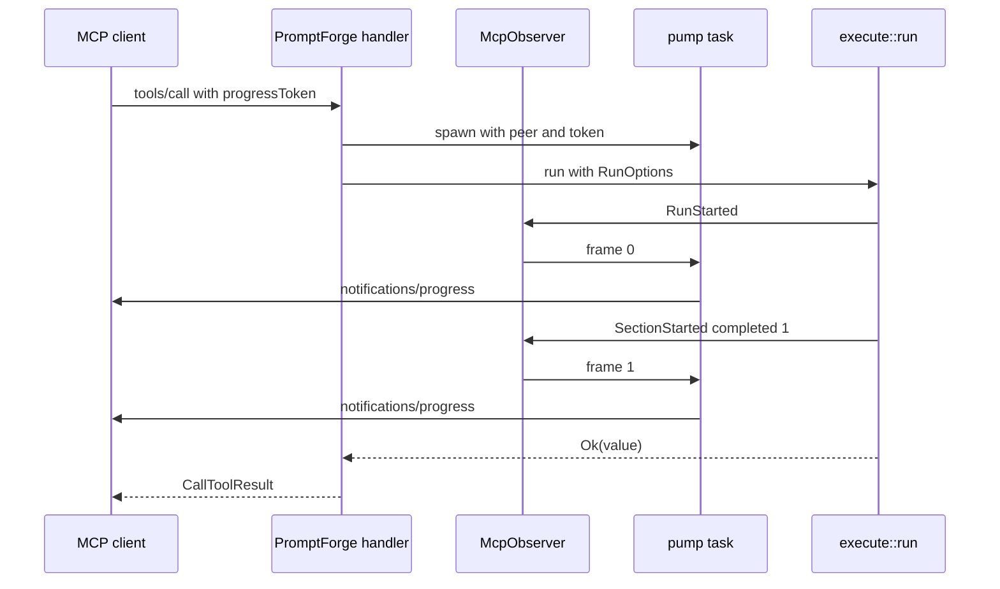
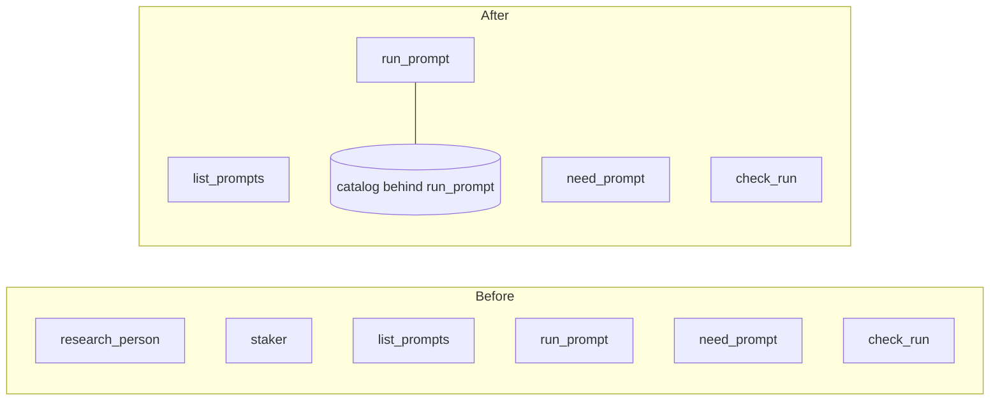
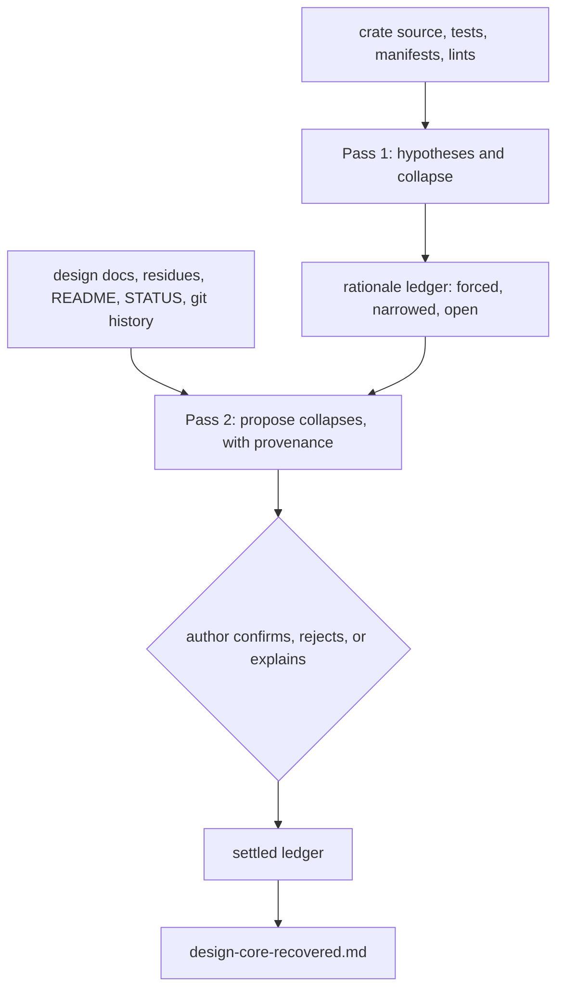

# Let's plan the MCP server

*2026-08-03 20:40 - transcript 0051b5be-9a70-4012-9dbb-376bbf3f8f21*


## Prompts


**[p1]** let's plan the mcp server @promptforge

**[p2]** Okay, the purpose of this MCP server is to serve PromptGPT prompts, and I think that's it. And so the design might be a little over-engineered. So the whole point of this is so that agentic harnesses like Cursor or Claude Code, they can call in and they can run a PromptForge prompt, and the user configures how they want to expose the, the prompts. They can have the, all the prompts just exposed at runtime, like one big list, or what they can do is there's gonna be a built-in tool. Which is gonna be like the tool picker. The chooser and choose mcp tool and it's gonna use the classifier and. It can be, it can offer advice like a frontier model can say, "Hey, do you have any tools that would like help? " And then another possibility is, is that it can just have like the listing. So progressive tool revelation.

**[p3]** apply @tools-public/tools/architect.md and @tools-public/how-to/vibe-how-to.md

**[p4]** the config needs a directory wildcard option or something

**[p5]** I'm saying both. Individual prompts, or whole directories? what do you think?

**[p6]** I want active directory watch, this needs to be useful for a developer writing a prompt. They can't be restarting the mcp service every time.

**[p7]** wait a sec, can't the developer just start a new chat? when does Cursor build the list?

**[p8]** but run_prompt wants the prompt name and this is fuzzy no?

**[p9]** what if we use the mcp-tool-picker crate and instruct the mode to pass the need string to a need_prompt tool @promptforge-design/study-mcp-toolpicker/design-mcp-toolpicker.md

**[p10]** I'm going to build the tool picker package first but I want to talk about the design of the mcp server first

**[p11]** What in the fuck does this even mean? I do not understand any of it:

**[p12]** > One number to carry into that build, because it changes what you should calibrate against. Your hard-regime figures came from near-neighbor distractors in a 9,922-tool catalog. A prompt catalog is a few dozen deliberately distinct entries, which is the random-distractor regime - top-1 0.929 blended, 0.984 for a restatement-band need. Calibrating the floor against the hard-regime numbers would set it far too conservatively for this use and abstain on needs it should bind.

**[p13]** wtf? I have to choose a number?

**[p14]** tool picker is done @promptforge/crates/promptforge-tool-picker

**[p15]** The description for need_prompt should be such that a querying model will state it in tool author register is that possible?

**[p16]** did we apply @tools-public/how-to/vibe-how-to.md and @tools-public/how-to/rust-how-to.md

**[p17]** is it possible to write the design file as we go? i.e. every time a step would change the design concretely can we update it? what do you think of this idea? so the design is accurate eper-commit

**[p18]** should we update @tools-public/tools/architect.md and/or @tools-public/how-to/vibe-how-to.md to make this handling of design/choices a new feature?

**[p19]** follow @tools-public/how-to/rust-how-to.md and run the plan

**[p20]** okay how can I try this

**[p21]** so can I try it now

**[p22]** What promptforge prompts do I have?

**[p23]** Run research person on Vinnie Falco

**[p24]** I think so? I dont really understand this. I just want my promptgate prompts to be first class citizens in Cursor. Shouldn't the research person output have gone into the chat rather than in this box?

**[p25]** I don't want hard-coding Cursor knowledge

**[p26]** I want it to behave like how other MCP tools behave. How does mcp pinecone behave? how does the mcp boost mailing list behave?

**[p27]** I restarted Cursor

**[p28]** Do a research person on David sankel

**[p29]** @c:\Users\Vinnie\.cursor\mcp.json:3-9 its there

**[p30]** I restarted

**[p31]** wtf does "deferred-collect" mean ??

**[p32]** why does there have to be a timer? why can't our mcp server use the progress protocol to keep Cursor in the loop so it see that the thing is working

**[p33]** what is a ticket?

**[p34]** check_run is a tool?

**[p35]** spawn subagents and search the web for how other projects do this. search adjacent topics as well

**[p36]** does Cursor support the new thing?

**[p37]** This is the first one:

**[p38]** Here's the research summary PromptForge produced:

**[p39]** **Sean Baxter** is an American software engineer and compiler developer best known for creating the **Circle compiler**, a next-generation C++ compiler, and for authoring the **Safe C++ proposal** (ISO paper P3390) aimed at introducing memory-safety guarantees to the C++ language.

**[p40]** ---

**[p41]** **Background**

**[p42]** Baxter holds Bachelor of Science degrees in Physics and Mathematics from Central Washington University. He began his career in scientific computing and geophysics as a Software Engineer at **NASA's Jet Propulsion Laboratory** (JPL) in Pasadena, CA (2008-2011). He then joined **NVIDIA Research** (2012-2014) as a Research Scientist, where he developed **ModernGPU**, a widely used open-source CUDA library for high-performance, data-parallel GPU algorithms. From 2014 to 2016, he worked as a Scientific Programmer at **DE Shaw Research** in New York, contributing to GPU-accelerated molecular dynamics simulations and forcefield-fitting software.

**[p43]** ---

**[p44]** **Circle Compiler**

**[p45]** After leaving full-time employment in 2016, Baxter spent approximately eight years self-funding development of the **Circle compiler** - a largely solo effort to build what he describes as the C++ toolchain of the future. Circle is built on top of Clang/LLVM and extends standard C++ with advanced metaprogramming features, Rust-style borrow-checking and memory-safety semantics, CUDA/SPIR-V GPU integration, and a versioning mechanism that allows new language features to coexist with existing code. The project attracted significant attention in the C++ community for demonstrating that Rust-like safety guarantees could be retrofitted into C++ without requiring a full rewrite of existing codebases.

**[p46]** ---

**[p47]** **Safe C++ Proposal**

**[p48]** In 2024, Baxter collaborated with the **C++ Alliance** (as a Scientist, August-November 2024) to formalize and advance the **Safe C++ Extensions proposal (P3390)** to the ISO C++ standards committee. The proposal advocates adding borrow-checking semantics, lifetime safety, and other memory-safety features to C++ - a direct response to growing pressure from U.S. government agencies (including the NSA and CISA) urging the software industry to move away from memory-unsafe languages. The proposal received broad media coverage, including in *The Register*, and generated substantial debate within the C++ community, with some welcoming it as a pragmatic alternative to migrating to Rust and others skeptical about committee readiness for such a significant language change. Baxter presented the work to C++ committee members and keynoted **CppNow 2022**.

**[p49]** ---

**[p50]** **Recent Developments**

**[p51]** In November 2024, Baxter announced on X (formerly Twitter) that he was returning to the job market after eight years of solo work on Circle, expressing a preference for in-office work in New York City. His LinkedIn and resume list NVIDIA as a recent affiliation, though the precise timing of any new role was not publicly confirmed at the time of research.

**[p52]** ---

**[p53]** **Skills and Expertise**

**[p54]** Baxter's technical profile spans C/C++, compiler construction (Clang/LLVM), CUDA, PTX, SPIR-V, parallel algorithms, and GPU computing. He is regarded as a highly productive, unconventional figure in the C++ world - someone who has single-handedly built infrastructure that typically requires large engineering teams.

**[p55]** ---

**[p56]** Note: the tool returned this in-context only and did not write a file. If you want it kept, say the word and I'll file it as research.

**[p57]** it went straight to the web, no mcp

**[p58]** Okay, I don't know about this, because no, no, no, no, no, the purpose of the MCP is to just be able to, like. We're not gonna be exposing all the tools. Like this, first of all, this report person, like this isn't, this isn't the intention of how PromptForge is supposed to work. PromptForge is very specific. It's like, it's like a command. You don't just invoke a PromptForge prompt in conversation. It's very specific. The purpose of the MCP is for a user to explicitly invoke a PromptForge tool. So I would even go so far as to say that the word PromptForge has to appear in order for the PromptForge MCP to kick in. It's not, it's, it's not like normal tools. The PromptForge is about a pipeline that usually produces a type of report. It's a special, it's not a general purpose prompting language. It's a specific thing. The purpose of the MCP is so that the developer can invoke the scripts for the purposes of usually of testing, but it's also useful locally. But PromptForge is really a system designed to go like on a server, for example, a twenty-four seven process that's constantly running reports, like running a staker report on every company in the Fortune five hundred every month. That's what it's for.

**[p59]** No, developer console undersells it. Like, there's a legitimate use case if a user wants to run a report, like, for example, the dossier system. Like, the dossier system might work better as a prompt gate prompt. Because it's so deterministic and it works, like, has the context isolation, it's got all that good stuff. However, it has to be explicit. Like, it's like a command, it's like the user says, "Run this specific prompt, " that's how it's supposed to work. I think that has to be baked into the design of the MCP. And I also, I wanna rename it to MCP Server. And I've moved the design document, so I think we need a plan, we need a top-to-bottom revision of this whole thing, and we need to look at the other crates, we need to look at the design documents, we need to look at everything top to bottom using sub-agents for cleanliness, and we need to bake a plan to fix the whole thing in one go.@promptforge/crates/promptforge-mcp rename to promptforge-mcp-server. @promptforge/crates/promptforge-mcp/design-promptforge-mcp.md rename that too and fix the contents. @promptforge-design review everything here too

**[p60]** I think there's a confusion because we're talking about the the technology to calc to calculate the tool from the need, and we're we, we still have to have that. I think we still want that feature, but the feature is in the, is in the harness, it's in the executor, it's in the PromptForge core, because a prompt speci a prompt specifies the need strings in its front matter or in the initial Lua of the H1 block, and it says, it says, "Here's the need" in a sentence or two, and then it associates that with The ID, and the ID is internal to the prompt, and what we this, this solves the indirection problem, because we don't want the prompts to have to we don't want the prompts to specify specific tools. So that we have to keep. But we can lose the need string in the MCP server. Maybe, I mean, it's still kinda nice. To have, because if someone asks explicitly like which PromptGATE tool would be best for this need, then it'd be nice to be able to get an answer, but it might, it might not be strictly necessary. For now, the only thing we really need is for the developer to be able to specific execute a specific prompt. However, we've already built out this code, like MCP server already has the packages and everything, so what are we gonna do?

**[p61]** So I think an overarching principle of the whole entire project is we should do more with less. That means if there's an established facility that can implement the new feature, we should use the established facility rather than building out more infrastructure. The fact is that Lua already works, so we should keep using it rather than inventing new front matter. So that's like, that's the litmus test. Like, can we im can something be implemented using what's already there? We want this, we want the core to be minimal. We want a small set of primitives that we could reuse over and over and over again.

**[p62]** design documents for crates belong in the root of the crate not the root of the repo

**[p63]** I want this whole thing to be, I want this plan has to proceed in steps. Like, you can't just do everything at once. I want individual steps, like one design document at a time, and even for a design document, break it down, like re-refactor the old, refactor the big one in place, then transfer over what's there, and then do the thing, right? And then just basically follow the vibe coding rules, but do it for the reorg. @tools-public/how-to/vibe-how-to.md

**[p64]** the residue, the design stuff left over i want in a "residue" sidecar design-core-residue.md for example.
For design docs with no crate, create a folder at crate level with the proper name (e.g. promptforge-mcp-client) and move the design doc from the design repo into there.

**[p65]** actually leave the residue in the design repo as well

**[p66]** non-existent stuff stay in design repo as well. design-mcp has to be renamed design-mcp-client or design-mcp-server pick one

**[p67]** does the plan use subagent isolation?

**[p68]** Seriously though, okay, this fucking design core residue, it reads like a fucking murder mystery. It reads like a "who the fuck knows what?" Like, this is so opaque language. Two of those five are refuted by the code rather than merely unbuilt, and the crate's own document says which? What the fuck kind of language is that? Jesus Christ! It's so hard to read. Look!

**[p69]** What it does not do, and cannot be made to do without a change to this document:

**[p70]** Read a file of configuration. Every value arrives through RunConfig.
Know a domain. No schema, no table, no paper, no search provider, no WG21 vocabulary.
Talk to an LLM backend. It holds a GatewayClient its caller constructed.
Persist anything. Storage is an extension's business.
Decide where an output lands. It resolves a declared output name against roots it was handed.
The test of the boundary: a project with no relation to WG21 can depend on this crate, write its own extensions, and get a working prompt runtime without deleting a line.

**[p71]** Two of those five are refuted by the code rather than merely unbuilt, and the crate's own document says which.

**[p72]** is the sentence riddling fixable in @tools-public/tools/architect.md and @tools-public/how-to/vibe-how-to.md  easily?

**[p73]** I don't know about this. This isn't, it's, this is, you're, you're making it too narrow like a counting problem. It's not just, it's not just a counting problem, it's fucking everywhere. Parsing is total and produces no side effects. A prompt isn't her data. What the fuck does this mean?

**[p74]** Parsing is total and produces no side effects. A Prompt is inert data: it can be constructed, inspected, and enumerated on an MCP surface without running any prompt code.

**[p75]** so can you fix it or not

**[p76]** but picking 3 sentences at random means what, that only 3 sentences will be legible?

**[p77]** I think, I think when, when the architect or the vibe coder, when they produce design work, I think they have to just state facts. Not, it's not a design document, they just state facts, factual statements, and then we spawn a separate sub-agent, and that's the writing agent, and that takes the facts and it composes prose, and we give it a register to write in. And the reason that that works is because there's no context pressure. It's not trying to reason, it's not trying to do anything. The, I think the problem is we're trying to do the writing in the same commit That's doing fixing and design work, am I wrong?

**[p78]** would it be possible to do this:
in a fresh subagent, review every line in the entire crate, write out facts that correspond to design
in a separate fresh subagent, take the line by line review and write the design from it

**[p79]** can you first collect all the whys as a list of bulleted statements extracted from the existing design docs, code comments, and commit log, into a "why document" and then go through a single crate source code and do the filtered extraction, and from there use that to reason about hierarchy (what breaks what) to define a design report template and then in one or more subagents write the design document from the report template + the why file + the filtered extraction file?

**[p80]** Can you reverse engineer the rationale? Like for a given feature, for example, for a public function, come up, just use the model's reasoning and come up with like three or four plausible reasons for why it was done that way. I mean, a frontier model can do that. And then as you go, you'll find eventually, s there'll be some subsets of, of reasons that, like, they'll cancel each other out in a way that leaves behind only one possible reason. Like you come across a piece of code that's written a certain way and that collapses some of the reasons for other choices. So we have like a running list of design choices and as we go through the code, we collapse them when we, as we make discoveries, and then whatever's left, we can assume that those are the actual reasons. Then we don't need the why file. This is a genuinely useful tool. Reverse engineering a design doc from an already written codebase is useful.

**[p81]** I like this. This is, we should do this. We should try this. I wanna try this. And let's do this in the core crate. I wanna try it. We're gonna put together a plan, and you're gonna do it. And when you when you collapse, you state that confidently. But then when you can't collapse, keep those design elements separate. And then what we'll do is then we'll do a combination of a human guided answers plus hypothesis collapse using the other stuff in the repo, right? So the first pass, we don't look at the existing design. We, it's a pure reverse engineer. In the second pass, we look at what's there, and then the AI will propose collapses based on what's there. It won't never do it automatically. The, it'll ask the human, and the human The human will say, "Yeah, this makes sense, " and then the human can also provide additional rationale. Just a few sentences from a human can probably collapse a huge amount. So let's do this. Let's go into plan mode. We're gonna do this right now. And when you make the plan, I want it to be ready to run in a fresh context, 'cause we're about at the limit. So make sure you inline everything.@promptforge/crates/promptforge-core


## Plans

### promptforge mcp server

*Build `promptforge-mcp`, a small MCP server that publishes PromptForge prompts to agentic harnesses (Cursor, Claude Code) as tools - some prompts exposed directly, the rest reachable through a progressive listing pair - and add a minimal Observer/Event stream to the core so a run reports live progress.*

# PromptForge MCP server

## Scope

The only job is serving prompts to a calling harness. Against [design-mcp.md](c:\Users\Vinnie\src\cursor\promptforge-design\design\design-mcp.md), this build keeps the MCP surface, progress notifications, bearer auth, run admission, and boot validation, and drops the Django fire/status/prompts/validate endpoints, the run registry, extensions and `[tools]` bindings, output roots, hot reload, and service installation. Those were written for a deployment that does not exist yet.

Two deviations from that document, both forced by what the core actually does today:

- Arguments are a single string. `execute::run` takes one raw `args` string, so every published tool has the schema `{"args": {"type": "string"}}` and no `params` schema enters frontmatter.
- The result carries the value, not a path. The core writes no output files, so the run's returned string is the product and goes in the `content` text block verbatim rather than being replaced by a "read the file" line.

## Exposure modes, both live at once

Each entry in `prompts.toml` carries `expose`, and the two modes coexist in one catalog:

- `expose = "tool"` - the prompt gets its own entry in `tools/list`, named for its frontmatter `name`, described by its frontmatter `description`.
- `expose = "list"` (default) - the prompt appears only through the progressive pair.

When any prompt is `list`, the server also publishes `list_prompts` (no arguments; returns every enabled prompt as name, description, version, and whether it also has a direct tool) and `run_prompt` (`{prompt, args}`; runs any enabled prompt). Direct prompts appear in `list_prompts` too, so a caller walking the list sees the whole catalog.

The classifier-backed chooser from [design-mcp-toolpicker.md](c:\Users\Vinnie\src\cursor\promptforge-design\study-mcp-toolpicker\design-mcp-toolpicker.md) is the third mode and is deliberately not in this build. It slots in later as a fourth built-in tool over the same catalog, with no change to what is built here.

## Core changes

Two, both in [crates/promptforge-core](c:\Users\Vinnie\src\cursor\promptforge\crates\promptforge-core).

New `promptforge_core::observe`:

```rust
pub trait Observer: Send + Sync { fn on_event(&self, ev: &Event); }

#[derive(Debug, Clone, serde::Serialize)]
#[non_exhaustive]
pub enum Event {
    RunStarted { prompt: String, sections: usize },
    SectionStarted { completed: u32, name: String },
    SectionFinished { name: String },
    ModelTurn { section: String, turn: u32 },
    ToolCalled { section: String, tool: String, ok: bool },
    RunFinished { turns: u32, elapsed_ms: u64, ok: bool },
}

pub struct NullObserver;
```

`completed` never decreases; that guarantee is what lets the MCP side latch it. Events are emitted from the section loop and from `run_tool_loop` in [execute.rs](c:\Users\Vinnie\src\cursor\promptforge\crates\promptforge-core\src\execute.rs).

`execute::run` grows one options argument rather than two positional ones, so this is a single breaking change:

```rust
pub struct RunOptions<'a> {
    pub observer: &'a dyn Observer,
    /// `None` falls back to `GatewayClient::from_env()`, which is what the CLI does.
    pub client: Option<GatewayClient>,
}

pub async fn run(prompt: &Prompt, args: &str, tools: &[&dyn Tool], store: &Store, opts: RunOptions<'_>) -> Result<String>;
```

The explicit client matters because the server configures the gateway in TOML and `std::env::set_var` is unsafe under edition 2024 while the workspace forbids unsafe. [promptforge-cli/src/main.rs](c:\Users\Vinnie\src\cursor\promptforge\crates\promptforge-cli\src\main.rs) updates its one call site and passes `&NullObserver`.

## The crate

`crates/promptforge-mcp`, binary `promptforge-mcp serve prompts.toml`, matching the gateway's shape.

- `config.rs` - `prompts.toml`, with a `Secret` newtype and `${VAR}` interpolation copied from [gateway/src/config.rs](c:\Users\Vinnie\src\cursor\promptforge\crates\promptforge-gateway\src\config.rs). A third copy of this would justify a shared crate; two does not.
- `catalog.rs` - boot validation and the `Catalog` of `CatalogEntry { prompt, tool_def, expose }`, held in an `Arc` (no `ArcSwap`, since nothing reloads).
- `server.rs` - the `rmcp` `ServerHandler`: `list_tools`, `call_tool`, `get_info`.
- `observer.rs` - `McpObserver` plus the pump task.
- `tools.rs` - resolving a prompt's frontmatter tool names to `WebFetch`/`WebSearch`, ~20 lines duplicated from [cli/src/tools.rs](c:\Users\Vinnie\src\cursor\promptforge\crates\promptforge-cli\src\tools.rs).
- `error.rs`, `lib.rs`, `main.rs`.

Dependencies: `rmcp` pinned exactly, plus `axum 0.8`, `tokio`, `serde`/`serde_json`, `toml`, `thiserror`, `tracing`, `humantime-serde`. Pin `rmcp = "=3.1.0"` (features `server`, `schemars`, `transport-streamable-http-server`): the design doc chose `=2.2.0` on 2026-07-25 because 3.x was then a one-day-old beta, but 3.0.0 went stable 2026-07-28 and 3.1.0 on 07-31, and starting greenfield code on 2.x buys a migration in a few weeks (medium confidence - 3.1.0 is only two days old, so if its `ServerHandler` surface fights us, fall back to `=2.2.0`, which the design doc verified).

## Config

```toml
[server]
bind = "127.0.0.1:9310"
token = "${PROMPTFORGE_MCP_TOKEN}"
max_concurrent_runs = 4
admission_timeout = "30s"

[paths]
prompts = 'C:\ProgramData\promptforge\prompts'

[gateway]
url = "http://127.0.0.1:8081/v1"
token = "${PROMPTFORGE_TOKEN}"
model = "claude-sonnet-4-6"        # optional; the core default otherwise

[prompts.greet]
file = "greet.md"                  # expose defaults to "list"

[prompts.research_person]
file = "research-person.md"
expose = "tool"
```

## Transport and auth

One axum router: `StreamableHttpService` nested at `/mcp` with `stateful_mode: true` and a 15s SSE keep-alive (progress rides the stream the `tools/call` POST opened), a bearer middleware over it, and `/healthz` registered after the layer so the exemption is structural. `serve --stdio` is also offered, since it costs one `rmcp` call and is how a local Claude Code install would attach; the design doc's refusal of stdio assumed a networked workstation only.

Admission is one `Semaphore` of `max_concurrent_runs`; a call that waits past `admission_timeout` returns `isError: true` naming the wait, so the model can retry.

## Progress

`McpObserver` holds a bounded `mpsc` of 64 and `try_send`s a frame per event, counting drops; the pump task awaits `peer.notify_progress`. `progress` is the latched `completed`, `total` is always `None`, `message` is the section name. `RunStarted` sends frame 0 so the client shows something immediately; `ModelTurn` and `ToolCalled` are logged only, since up to thirty per section would bury the section label. When the caller sends no `progressToken`, `frames` is `None`, no pump spawns, and the run is otherwise identical.



## The result

```rust
#[derive(Serialize, JsonSchema)]
pub struct RunResult {
    pub run_id: String,
    pub prompt: String,
    pub version: u32,
    pub status: RunStatus,   // completed | failed
    pub value: Option<String>,
    pub turns: u32,
    pub elapsed_ms: u64,
    pub error: Option<String>,
}
```

`structuredContent` carries this; the `content` text block carries the value itself, since it is the entire product of a run in this build. A failed run returns the same shape with `isError: true`.

## Boot validation

Read the config, then for each `[prompts.NAME]`: read the file, confirm it declares a `promptforge:` version, `Prompt::parse`, check the frontmatter `name` matches the table key, check the derived tool name matches `^[a-z][a-z0-9_]{0,47}$` and is unique across the catalog. Failures accumulate and are all printed before a nonzero exit; one bad prompt refuses the whole service, so a client never sees a silently missing tool.

## Tests

- Golden `tools/list` for a mixed catalog: two direct prompts plus `list_prompts` and `run_prompt`, asserting descriptions and the single-string schema.
- A catalog with no `list` prompts publishes neither built-in.
- One test per boot failure, each asserting the message names the prompt and its file; a three-fault catalog reports all three.
- Progress against an in-process `rmcp` client: exact notification sequence for a three-section prompt; the same run without a `progressToken` produces zero notifications and a byte-identical result; a never-draining pump still completes the run with a nonzero drop count.
- `run_prompt` reaches a `list`-only prompt; an unknown name returns `-32602` listing the enabled names.
- Auth: missing, wrong-scheme, wrong, and correct token on `/mcp`, plus `/healthz` reachable without one.
- Admission: `max_concurrent_runs = 1` with two concurrent calls; the second refuses after the timeout with a retryable error.
- Core: observer event ordering, and `completed` never decreasing.

## Deferred, on purpose

The classifier chooser, `notifications/tools/list_changed` and hot reload, the Django HTTP surface and run registry, elicitation, extensions and output roots, and service installation.

Todos:

- Add promptforge_core::observe with Observer, Event, NullObserver; emit events from the section loop and tool loop; change execute::run to take RunOptions { observer, client } and update the CLI call site
- Create crates/promptforge-mcp: Cargo manifest with rmcp pinned, lib/main skeleton, error types, and workspace membership
- Implement prompts.toml parsing: [server], [paths], [gateway], [prompts.NAME] with expose, Secret newtype and ${VAR} interpolation
- Implement the boot validation pass and Catalog: parse each prompt, check name match and tool-name legality/uniqueness, accumulate failures, build tool definitions
- Implement the ServerHandler: direct per-prompt tools, list_prompts and run_prompt, argument handling, RunResult, and error mapping
- Implement McpObserver, the bounded frame channel, and the pump task forwarding notifications/progress
- Wire the axum router with streamable HTTP at /mcp, bearer middleware, /healthz outside the layer, the admission semaphore, and the --stdio transport
- Write the test suite: golden tools/list, boot failures, progress sequences, run_prompt routing, auth, and admission

### promptforge mcp server correction

*Correct the MCP server from a surface that competes for a model's tool selection into one that only executes prompts a caller names explicitly, rename the crate and its design document to `promptforge-mcp-server`, and reconcile every design document in both repositories with what is actually true.*

# PromptForge MCP server: correction and coherence

## 1. What is wrong

A PromptForge prompt is a command. It is invoked because someone named it - a user asking for a report, a developer testing a pipeline, or eventually a scheduler firing a run. It is never something a model reaches for because it noticed a tool that looked relevant.

The system was built on the opposite assumption, and not only in the server. `design.md` line 147 states that "a calling model selects from names, descriptions, and typed input schemas." `design-mcp.md` lines 65 to 73 reject a `list_prompts`/`run_prompt` dispatcher *because* it would collapse forty descriptions into one and leave the model unable to choose. `design-promptforge.md` line 120 says a prompt's description "steers a calling model's tool selection." The code follows: per-prompt tools published for direct selection, an `expose` field and a promotion workflow to decide which prompts compete, `need_prompt` to help a model discover a prompt it did not know it wanted, and two decisions built entirely around clients caching the tool list.

`notes.md` line 32 records the design that was rejected - "two MCP tools: `list_prompts`, `run_prompt`". That rejected design is the correct one.

This plan is correction and coherence only. It does not add output files, and it does not build the continuously running report runner; both are named in section 6 with what they would need.

## 2. Design decisions

1. **`run_prompt` is the only way to invoke a prompt.** No prompt is published as a tool of its own, so nothing this server offers can be chosen for a task the caller did not ask for by name. A model that wants to run a prompt must name one, and naming one is what a command is.

2. **The published tool list is fixed at four entries and never changes.** `list_prompts`, `run_prompt`, `check_run`, and `need_prompt` when the `picker` feature is compiled in. This is the largest practical consequence of decision 1: because the tool list is static, the client-side caching that shaped two earlier decisions stops mattering. A prompt saved thirty seconds ago is callable immediately in every client with no reconnect and no restart, and the `notifications/tools/list_changed` machinery is deleted rather than fixed.

3. **`expose`, the promotion workflow, and the direct/listed distinction are removed, not defaulted off.** An opt-in would preserve the ambient-selection path and its caching problem while leaving the design two shapes to explain. The cost is real and accepted: a prompt can never be called under its own name as a tool, and per-prompt typed argument schemas are permanently off the table, since every call goes through one tool with one schema.

4. **`need_prompt` resolves an inexact name, it does not discover a capability.** Its purpose is the caller who says "run the promptforge prompt that builds a stakeholder report" without knowing it is called `staker`. That is still explicit invocation - the intent came from the user - so the tool survives, with its description rewritten to say what it is for. What it must never read as is an invitation to go looking for something useful.

5. **The tool text is written in the register of a command interpreter.** It says what this server executes and that a caller names what to run. It carries no trigger phrasing, no "use this when", and nothing that competes for selection against a client's own tools. A model that ignores this and never calls the server is behaving correctly.

6. **A prompt named after a built-in still fails at boot.** Nothing shadows a tool name any more, so the collision is no longer structural, but "run `check_run`" is ambiguous to a human and to a model, and a boot refusal naming the file is the only version of that a prompt author can act on.

7. **The crate is `promptforge-mcp-server` and the binary matches.** The old name described a protocol; the new one describes a process, which is what it is and what the design documents already call it in prose. The rename reaches the library name (`promptforge_mcp_server`), the binary, `serverInfo.name` (which derives from `CARGO_PKG_NAME`), the test harness's `CARGO_BIN_EXE_*` variable, and the design document's filename.

8. **Every design document in both repositories says the same true thing when this is done.** A corpus where three documents argue for model selection and the code does the opposite is worse than either position; the argument in `design-mcp.md` for rejecting the dispatcher has to be replaced by the argument for accepting it, not merely deleted.



## 3. What stays exactly as it is

Worth stating, because the reframe could be read as wider than it is. The catalog resolution and its glob-plus-exception rule, the per-prompt reload where a broken prompt stays listed carrying its error, the watcher, the deferred-collect ticket and `check_run`, admission, progress notifications, the finished-artifact sentence, boot refusing an incoherent catalog, and both transports are all unaffected. So is `Catalog::hash`, which the picker rebuild still needs.

## 4. Contracts after the change

### The tool surface

- `list_prompts` - no arguments. Every prompt this server can run, as `{name, description, version, problem}`. The `direct` field is gone with per-prompt tools.
- `run_prompt` - `{prompt, args?}`. The only invocation path. Name resolution is unchanged: normalized on case and `-`/`_`, exact after that, never a near miss, and an unresolvable name returns a result carrying the enabled names closest first.
- `check_run` - `{run_id}`. Unchanged.
- `need_prompt` - `{capability}`. Present with the `picker` feature. Rewritten as name resolution for a caller who described the prompt instead of naming it.

Each description states that this server executes named PromptForge prompts and that the caller supplies the name. The finished-artifact sentence stays on `run_prompt` and `check_run`.

### `prompts.toml`

`[catalog].default_expose` and `[prompts.NAME].expose` are removed. Every table still rejects unknown keys, so a configuration carrying either fails the load with a message naming the key - which is the right outcome, since silently ignoring it would leave an operator believing a prompt was promoted.

## 5. Steps

Each step is one commit with its code, tests, and doc comments. House rules are unchanged from the previous plan: `c:\Users\Vinnie\src\cursor\tools-public\how-to\rust-how-to.md` binds every change, `promptforge/AGENTS.md` is the repository's own, `STATUS.md` and `README.md` move with every commit, and a step whose implementation contradicts a decision here revises this plan in the same commit.

The gate for every step is `cargo fmt --all --check`, `cargo clippy --workspace --all-targets --all-features -- -D warnings`, the same clippy for `-p promptforge-mcp-server --no-default-features`, `cargo test --locked --workspace --all-features`, and `cargo test -p promptforge-mcp-server --no-default-features`. Note that a running server holds a lock on its own binary on Windows; stop it before building.

1. **Publish only the built-ins.** Remove per-prompt tool definitions from `crates/promptforge-mcp/src/tools.rs`, delete the `Expose` enum and `Entry::is_direct`, drop `direct` from the `list_prompts` payload, and rewrite every description and the session `instructions` in the command register of decisions 4 and 5. Test: the golden `tools/list` is exactly the four built-ins for a catalog of three prompts, and a separate assertion that no prompt name ever appears as a tool name for any catalog; the descriptions carry no trigger or selection language; `list_prompts` still reports `problem`.

2. **Delete the list-changed machinery.** Remove `watch/sessions.rs`, the `Sessions` type and its threading through `PromptForgeServer::new`, `serve_http`, `serve_stdio`, and `Reloader`, the `ListChanged` trait, and `Reload::published_changed`. Keep `ranking_changed`, which the picker rebuild uses. Test: a reload still swaps the catalog and rebuilds the picker; a prompt added mid-session is callable through `run_prompt` with no notification sent and no reconnect; the capability is no longer advertised.

3. **Remove `expose` from the configuration.** Delete `default_expose` and the per-prompt `expose` field, and update the shipped `prompts.toml` and its comments. Test: a config carrying either key fails the load naming it; the shipped config still resolves against the repository's `prompts/` directory through the boot rule.

4. **Rename to `promptforge-mcp-server`.** The directory, the package, the binary, the library name and every `use promptforge_mcp::`, the workspace members list, `Cargo.lock`, `CARGO_BIN_EXE_promptforge-mcp` in `tests/it/stdio.rs`, the `serverInfo.name` assertions at `tests/it/stdio.rs:155` and `:206`, the usage text in `src/main.rs`, the log lines in `src/transport.rs`, the doc comments the survey lists in `config.rs`, `progress.rs`, `retrieval.rs`, and `tools.rs`, and the `design-promptforge-mcp.md` filename. Test: the whole gate passes, the stdio test asserts the new server name, and no occurrence of the old crate name remains outside a historical note.

5. **Correct the stale doc comments the audit found.** `promptforge-core/src/client.rs` lines 3 to 4 claim "no tools, no streaming" while `complete()` sends tools; `promptforge-core/src/execute.rs` lines 25 to 28 say the tool-call loop is "still to come" when it is implemented below; `promptforge-gateway/src/lib.rs` lines 9 to 12 list `web_search` as deferred when it ships. Verified by reading rather than by a new test, with `cargo doc` clean.

6. **Reconcile `promptforge-design`.** `design.md` line 147, `design-mcp.md` lines 59 to 73 where the dispatcher is rejected, and `design-promptforge.md` line 120 all state the model-selection model and must state explicit invocation instead - replacing the argument, not deleting it, so a reader learns why one tool per prompt lost. Also `design-mcp.md` line 624, whose `positions = { extension = "paperstore" }` example contradicts `design-core.md` lines 445 to 447 removing `Root::Extension`, and `notes.md` line 32, whose dispatcher sketch is now the shipped design. Note in each document that the crate is now `promptforge-mcp-server`.

7. **Revise the crate's design document.** Rename to `design-promptforge-mcp-server.md` and rewrite it from the finished work: the eleven passages the audit lists at lines 15, 29, 35, 37, 96, 109, 151, 165, 169, 171, and 214 all assume model selection, and choices 2, 3, 12, and 13 in its numbered list are about exposure modes and steering that no longer exist. Fold in the four facts it lags - the finished-artifact sentence, run logging at info, the Windows path fix in the watcher, and the optional token - and follow the block tagged design-doc at the end of this plan. Slug: `promptforge-mcp-server`.

## 6. Deliberately not in this plan

**Somewhere to put a report.** Both repositories specify it - `outputs` in frontmatter at `design-promptforge.md` lines 161 to 165, output roots in `prompts.toml` at `design-mcp.md` lines 621 to 624, and a result carrying a path rather than a body. Nothing implements it, so a run's product exists only in the reply, and in testing a model noticed and offered to save the report itself. This is a `promptforge-core` feature before it is a server one, and it is the obvious next plan.

**The continuously running report runner.** The real deployment is a process producing reports at scale, a stakeholder report over every company in a list, monthly. Neither repository designs a scheduler: `design-mcp.md` assumes Django's Celery task is the durable queue and fan-out over subjects happens outside PromptForge entirely. What exists inside a prompt is `fanout()` over sections, which is one run doing many things, not many runs over many subjects. This needs a design conversation before it can be planned.

**The dossier system as a prompt.** A strong candidate - its phases are already gather, extract, synthesize, finalize, with fan-out at two levels and a fixed output schema at `umbra/dossiers/_SCHEMA.md`. The frictions are real: the rules live across three files and ad hoc plans rather than one executable spec, its acquisition phase is open-ended and judgment-driven, its Executive Summary is written last from everything before it which fights context clearing, and it needs private sources through several MCP servers rather than the open web. Also its own next step, once outputs exist.

## 7. How to run each step

Unchanged from the previous plan. Write the code in one subagent, review in a second with a fresh view, fix in a third, passing findings through `vibe-review.md`. Keep git in the main context. To review, apply the general checks in `c:\Users\Vinnie\src\cursor\tools-public\how-to\vibe-how-to.md` (grep it for `code-review`), the language rules in `rust-how-to.md`, and the project checks below.

<mcp-review>
Project checks, applied in addition to the general ones and to the language guide:

1. Does every public item carry a `///` with `# Errors` wherever it returns `Result`, and does `RUSTDOCFLAGS="-D warnings" cargo doc --no-deps --all-features` pass?
2. Is the change free of `unwrap`, `expect`, and `unsafe` outside test code?
3. Do public error types stay `#[non_exhaustive]`, avoid leaking a dependency's error type, and read as lowercase noun phrases with no `failed to` and no trailing period?
4. Does any published tool name, description, or instruction read as a capability offered for selection rather than a command executed on request? Any trigger phrasing, any "use this when", any claim on a situation, is a failure.
5. Can any prompt name reach `tools/list`, by any path, for any catalog?
6. Does the tool result carry the prompt's returned value and no accidental transcript, prose, or section body?
7. Is `Observer::on_event` free of anything that can block or await, and is no `std::sync` guard held across an `.await`?
8. Does every configuration field the plan names exist with the spelling and default the plan gives, and is every removed field rejected rather than ignored?
9. Are new tests in the right place - unit tests in the file under test, integration tests inside the single `tests/it` binary - and does any filesystem test use a temporary directory rather than the tree?
10. Does the change still build and pass with `--no-default-features`?
11. Where the implementation departed from a decision in section 2 or a contract in section 4, does the same commit revise that text with what forced the change?
</mcp-review>

<design-doc>
OUTPUT A DESIGN DOCUMENT, NOT CODE. Write one markdown file, design-{slug}.md,
that explains the design of what this plan describes. You run as the final step
of the plan, after the implementation is complete, so describe the design as
built, reconciling against the finished work any decision the implementation
changed from what this plan first recorded.

NO IMPLEMENTATION CODE - no function bodies, no private machinery, no
step-by-step algorithm walkthroughs. You MAY include any normative artifact the
design needs to remove ambiguity: public signatures, schemas, state or
transition tables, wire formats, configuration syntax, sequence diagrams, and
pseudocode. Each such artifact must express a design contract, not an
implementation technique; include one only where prose cannot say the same
thing as precisely, and show the artifact alone, not the surrounding machinery.

FOR EVERY DESIGN ELEMENT, STATE THREE THINGS: what is observed (by the user or
by an external consumer), how it is structured, and WHY - the motivation, the
rationale, the principle. For a costly-to-reverse element, "why" must include
what reversing it later would cost.

DESIGN-ELEMENT TEST - include something only if changing it would change ANY of:
  (a) ANYTHING THE USER SEES, READS, WRITES, TYPES, OR NAMES. For a library the
      user is the caller, so this is the PUBLIC API - its operations and their
      contracts (ownership, lifetime, thread-safety, error and complexity
      guarantees). It also includes every config file or frontmatter the user
      edits, and - critically - the NAMES of everything the user sees. A name
      is a design decision: `goto` is a good one, `clear_and_transfer_control`
      is a bad one. Naming is design.
  (b) the shape or structure of the system.
  (c) something costly or hard to reverse that the user never sees - the ABI,
      an on-disk or persisted format that outlives a version, a high-reach
      convention that touches everything, or a cross-cutting quality trade-off
      (security, failure modes, data lifecycle, performance).
If it is none of these - merely how you implement the design behind those
surfaces, such as a private helper type, an internal algorithm choice, a
dependency version pin, or a serialization used only between your own
components - it is implementation. Leave it out.

A public interface is design; a private type is implementation - the same
struct is on opposite sides of the line depending on whether the user sees it.
Describe an interface's shape and contract in prose by default; show the actual
artifact - a signature, a schema, a state table - wherever that artifact is
itself the load-bearing decision and prose would blur it. No fixed budget binds
these; each earns its place only by being load-bearing.

COMPRESS BEFORE WRITING - only if the design carries far more ditchable detail
than load-bearing decisions (roughly 10 to 1 or worse). If it is already lean,
skip this. Run the pass in order, cheapest cut first, and stop once the ratio
is healthy:
  1. Drop a default only when changing it would change no observable behavior
     and carry no meaningful risk. A consequential default - a timeout,
     ownership, a security posture, a retry policy, a resource limit, a
     compatibility choice, a failure mode - resolved a real fork and stays.
  2. Move anything decidable later at little or no extra cost to a "decide by
     use" list, or drop it. A cheaply-deferrable element is not a headline one.
  3. Replace an enumeration with the rule that generates it.
  4. Merge consequences into the decision that forces them, and sibling
     elements into their shared pattern.
  5. Name a known pattern instead of re-deriving it.
  6. Rank what remains and keep about 10 to 15 headline elements; demote the
     rest to one line.
  7. Delete anything whose removal would still let a competent builder build
     the right thing.

STRUCTURE - three fixed sections, then whatever the design earns:
  - A title stating what building this produces.
  - An executive summary that stands alone; a reader acts on it without the body.
  - A numbered list of the 10 to 15 key design choices, each a short paragraph.
Then, for a reader who stops early:
  - Write headings that state the point, not the topic ("Labels compute at
    boot, off the critical path", not "Labels").
  - Keep rationale in prose; do not bulletize an argument. Enumerate only
    parallel items (decisions, constraints, options).
  - State the evidence before the value word: never "fast" before the number.
  - Where a choice resolved a real fork, name the alternative and why it lost.
  - Order by importance; put a dependency first only where the reader needs it
    to follow what comes next, so cutting from the bottom never removes the core.
  - Add no YAML frontmatter. Close with one italic line naming the date and the
    model. Name no tool, rulebook, or source document for the document's own
    rules or structure.

CHECK BEFORE FINISHING, and fix any no: no implementation code, and every
normative artifact expresses a contract rather than a technique; every element
states what, how, and why; headings state points; no argument is bulletized;
the compression ratio is healthy; no source document is named. If the plan
carries no key design choices, write no document and return the reason.
</design-doc>


Todos:

- Step 1: publish only the four built-ins; delete Expose and is_direct; rewrite descriptions and instructions in the command register
- Step 2: delete the tools/list_changed machinery - Sessions, ListChanged, published_changed
- Step 3: remove expose and default_expose from the configuration and the shipped prompts.toml
- Step 4: rename the crate, binary, library, and design document to promptforge-mcp-server
- Step 5: correct the stale doc comments in promptforge-core and promptforge-gateway
- Step 6: reconcile the promptforge-design documents with explicit invocation
- Step 7: rewrite the crate's design document from the finished work

### recover core design rationale

*Recover the design rationale of `promptforge-core` from the code alone by generating competing explanations for each design element and killing the ones the evidence refutes, then let the repository's documents and history propose further collapses that only a human approves, and write a design document from what survives.*

# Recovering the design of promptforge-core from its code

## 1. What this is and why it might work

A design document is mostly *why*. Code contains *what*. The bet here is that a large part of the why is recoverable anyway, because most design choices are forced by constraints that are themselves visible in the code - and where nothing forces a choice, that fact is worth stating rather than papering over.

The method: for each design element, write down three or four competing explanations, then hunt the crate for evidence that kills them. What survives is the answer. How many survive is itself the finding.

An element that collapses, from this crate:

> `execute::run` takes its gateway client through `RunOptions` rather than reading the environment. Competing reasons: injection for testability; a caller configured from a file cannot set the environment; avoiding global mutable state as a matter of taste; no reason at all. Now the evidence. The workspace manifest sets `unsafe_code = "forbid"`. The crate is edition 2024, where `std::env::set_var` is unsafe. So a file-configured caller *cannot* set the environment in this workspace - the second explanation is not preference but necessity. `GatewayClient::from_env()` survives as the `None` path, which kills "no reason at all". Testability remains true but is a consequence rather than a cause, because it would not have forced the change alone.
>
> Verdict: **forced**, and the document can say so flatly.

An element that does not collapse, from the same file:

> `DEFAULT_MAX_TOOL_ITERATIONS` is 24. Competing reasons: measured, at the point where prompts stop converging; derived from a token budget; a round number chosen to be generous; inherited from somewhere else. Nothing in the crate distinguishes them. The constant appears once, relates to no other constant, and no test exercises behaviour at 24 specifically.
>
> Verdict: **open**. The honest document says the code does not determine it.

The failure mode this guards against is confident fabrication. A model asked why some code is the way it is will always produce a fluent answer, and a wrong one reads exactly like a right one. Requiring competing explanations and demanding evidence to kill them is what makes "I cannot tell" a reachable answer.

## 2. The method, precisely

**What counts as a design element.** Include it only if changing it would change one of three things: what a person sees, reads, writes, types, or names - for a library that means the public API and its contracts, and it emphatically includes the *names*; or the shape of the system; or something costly to reverse that nobody sees, such as an on-disk format, a cross-cutting convention, or a security or failure-mode trade-off. A private helper, an internal algorithm, or a dependency version is implementation. This test is stated at length in the `design-doc` block at the end of `c:\Users\Vinnie\src\cursor\tools-public\tools\architect.md`.

**What counts as evidence.** Anything structural in the permitted sources: a type, a signature, a lint setting, an edition, a test that would fail otherwise, a trait bound, a name, an absence where a presence would be expected. Also the language and its ecosystem - knowing that `set_var` is unsafe in edition 2024 is reasoning, not reading. Plausibility is *not* evidence. "This is the sort of thing people do for testability" kills nothing.

**How a hypothesis dies.** Either the evidence makes it impossible, or it makes it unnecessary - something else already forces the outcome, so this reason cannot be why. Record which, and cite the file and item.

**The three verdicts.**

- **Forced** - one explanation survives. State it as fact and name the constraint that forced it.
- **Narrowed** - two survive. Name both and say what would distinguish them.
- **Open** - three or more survive, or the choice is arbitrary within a range. Say the code does not determine it.

An element whose hypotheses were never seriously competing is a failure of the method, not a success: if all four candidates are variations of one idea, the collapse is theatre. Three genuinely different explanations, or say so.

## 3. Pass 1 is blind, and the isolation is the experiment

Pass 1 may read: everything under `crates/promptforge-core/src` and its tests; `crates/promptforge-core/Cargo.toml`; the workspace `Cargo.toml`, `clippy.toml`, and `rustfmt.toml`; and the `src` of sibling crates, but only to see how core's API is *used*, since call sites are legitimate structural evidence.

Pass 1 may not read: `crates/promptforge-core/design-core.md`; any other `design-*.md` in any crate; anything in the `promptforge-design` repository; `README.md`, `STATUS.md`, or `AGENTS.md`, all of which carry rationale; and any git history - no `log`, `show`, `blame`, or commit message.

**Comments are treated as absent.** Every `//`, `///`, and `//!` is invisible in pass 1. This is deliberately blunt: deciding which comments merely describe and which give reasons is itself a judgement call, and pass 1 is meant to have none. Identifiers survive, including test names, which are often the best evidence in the crate.

The cost is real and worth accepting. This crate's comments are unusually good, so pass 1 will report *open* on questions the file plainly answers three lines above. That is the point - it measures what the method recovers when nobody wrote it down, which is the situation the tool exists for.

## 4. Pass 2 opens the archive, and the human holds the pen

Everything forbidden above becomes available: the design documents and residues in `promptforge-design`, the crate's existing `design-core.md`, `README.md`, `STATUS.md`, `AGENTS.md`, and the full git history.

For every element that came out narrowed or open, search that material for anything bearing on it and write a **proposal**: the collapse it would justify, the evidence, and the evidence's provenance - a file and line, or a commit hash and its date.

Provenance is not decoration. This repository's own history contains reversals: the design corpus argued that a calling model should select among per-prompt tools, and later commits deleted that and made invocation explicit. A proposal citing the older document without its date would argue for a design that no longer exists. Two further cautions. The residues describe things that were never built, so rationale found there may explain an intention rather than the code. And many commit messages are self-reported by the agent that wrote the change; they may record the reason that sounded best afterward.

**No proposal is ever applied automatically.** They go to the author in batches of at most five, with the evidence quoted. The author confirms, rejects, or supplies the reason directly - and a few sentences from the person who made the decision will collapse more than any amount of searching. Author rationale is recorded like any other evidence, with provenance `author, <date>`.



## 5. The ledger, and its record format

One file, `cabinet/_research/2026-08-03-recover-rationale-promptforge-core.md`, holding one record per element in this shape:

```
### E-014  The gateway client is passed in, never read from the environment
Element:    RunOptions::client, crates/promptforge-core/src/execute.rs
Kind:       public API
Hypotheses: H1 injection for testability
            H2 a file-configured caller cannot set the environment
            H3 avoiding global mutable state, as taste
            H4 incidental, no reason
Evidence:   workspace Cargo.toml, [workspace.lints.rust] unsafe_code = "forbid"
            edition 2024: std::env::set_var is unsafe
            client.rs:163 GatewayClient::from_env retained as the None path
Survives:   H2. H1 is a consequence, not a cause. H3 is unfalsifiable here.
            H4 refuted by the retained fallback.
Verdict:    FORCED
Reach:      every caller of execute::run
Seen by:    the caller
```

`Reach` and `Seen by` are the ranking inputs for the document: how much breaks if this changes, and whether a person ever encounters it. Both are needed, because a single configuration key can have almost no reach and still be the first thing a reader must understand.

## 6. Steps

Each step is one commit. Dispatch every step to a fresh subagent by reference - hand it this plan's path and the step number and nothing else of substance; if a subagent needs to know something, write it into this plan first. Review each commit in a second subagent with a fresh view, fix in a third through `vibe-review.md`, then amend. Keep git in the main context and do not read source there.

1. **Fix the format before anything is gathered.** Create the ledger with the method from sections 2 and 3 restated at its top, and the two worked examples from section 1 written out as full records, `E-001` for the client and `E-002` for the iteration cap. Nothing else. A later step that disagrees with the format changes it here, in its own commit.

2, 3, 4, 5. **Pass 1 extraction, one commit per module group**, in this order: `parser.rs` with `lib.rs` and `error.rs`; then `execute.rs` with `execute/tests.rs` and `observe.rs`; then `lua.rs`, `subst.rs`, and `store.rs`; then `client.rs`, `tools.rs`, and `tools/web_search.rs`. Each appends records and touches no earlier record. Each reports its verdict counts, because a group returning all-forced is a signal that hypotheses were not competing.

6. **Merge and rank.** Deduplicate elements that appeared in two groups, fill `Reach` from actual call sites, and order the ledger by reach and visibility together. Report the three counts and the ten highest-ranked elements.

7. **Pass 2 proposals.** Search the archive for every narrowed and open element and append a proposal to each, with provenance and date. Change no verdict. Report how many elements found candidate evidence and how many found none.

8. **Adjudication.** Present the proposals to the author in batches of at most five and apply only what the author decides, recording author rationale with provenance. This step is a conversation, not a dispatch; it ends when every proposal is confirmed, rejected, or answered.

9. **Write `crates/promptforge-core/design-core-recovered.md`** from the settled ledger, following the `design-doc` block at the end of `c:\Users\Vinnie\src\cursor\tools-public\tools\architect.md`. Leave the existing `design-core.md` untouched so the two can be read against each other. Forced elements state their constraint. Narrowed elements name both survivors. Open elements say the code does not determine the choice - unless the author answered, in which case the reason is attributed to them.

10. **Report the comparison.** In the commit message and to the author: how many elements were forced by code alone, how many the archive settled, how many the author settled, and how many remain open. That ratio is the experiment's actual result and the thing worth knowing before pointing this at a codebase nobody here wrote.

## 7. How the prose must read

This plan exists partly because the last document produced in this repository was accurate and unreadable. Two rules bind step 9, and the review enforces them.

**State what happens, not what property a thing has.** The failing register asserts attributes in compressed abstract nouns; the working one says what occurs and why anyone cares. The pair to keep in view, both describing the same fact:

- Bad: "Parsing is total and produces no side effects. A `Prompt` is inert data: it can be constructed, inspected, and enumerated on an MCP surface without running any prompt code."
- Good: "Reading a prompt file never runs anything inside it, which is why a server can list prompts and show what each one claims to do without executing them."

**Never count what you do not name.** "Two of those five are refuted by the code" sends a reader hunting. Name the two.

<recover-review>
Checks for this work, applied with the general ones in `c:\Users\Vinnie\src\cursor\tools-public\how-to\vibe-how-to.md` (grep it for `code-review`):

1. Does every record carry at least three genuinely competing explanations, rather than one idea in four costumes?
2. Does every dead hypothesis cite evidence that exists - open the file and confirm it says what the record claims - and does that evidence make the hypothesis impossible or unnecessary, rather than merely unlikely?
3. Does any collapse rest on plausibility alone? That is the failure this method exists to prevent.
4. Does the verdict match the surviving count: one is forced, two is narrowed, three or more is open?
5. In a pass 1 commit, does any citation come from a forbidden source - a design document, a residue, a README, STATUS, AGENTS, a comment, or git history?
6. In a pass 2 commit, does every proposal carry provenance and a date, and does it leave the verdict unchanged?
7. In the document, is every claim traceable to a settled ledger record, and is every open element still described as open?
8. Prose: does any sentence assert a property where it could say what happens? Does any sentence count things it never names?
9. Prose, sampled: pick three sentences at random and say what each means in your own words. If any cannot be paraphrased, the section it came from is rewritten - not the sentence, the section.
</recover-review>

## 8. What this cannot recover, stated up front

Contingency. A number chosen inside a range, a fact measured outside the repository, an approach tried and abandoned. The clearest example lives one crate over: the MCP server waits 240 seconds before handing back a run id, and the reason is that Cursor abandons a remote tool call at about 300 seconds - something learned from forum threads and staff replies, which appears in no file and never could. Pass 2 can recover it from a commit message; pass 1 cannot recover it at all.

Worse, and unfixable: a deleted alternative leaves no trace. Nobody reading the current server could learn that prompts were once published as individual tools or why that lost, and "what lost and why" is the most valuable line a design document has. When the ledger reports a high open count, some of it is this - not a failure of effort, but the archaeology being genuinely gone.


Todos:

- Step 1: create the ledger with the method and the two worked example records
- Step 2: pass 1 extraction - parser.rs, lib.rs, error.rs
- Step 3: pass 1 extraction - execute.rs, execute/tests.rs, observe.rs
- Step 4: pass 1 extraction - lua.rs, subst.rs, store.rs
- Step 5: pass 1 extraction - client.rs, tools.rs, tools/web_search.rs
- Step 6: merge, deduplicate, fill reach from call sites, rank
- Step 7: pass 2 - propose collapses from the archive, with provenance and dates
- Step 8: adjudication with the author, in batches of five
- Step 9: write design-core-recovered.md from the settled ledger
- Step 10: report the recovery ratio - code, archive, author, still open

## Design Documents Written

### c:\Users\Vinnie\src\cursor\promptforge\prompts\_scratch-watch-check.md

---
name: watch_check
description: Return the input unchanged, to prove the watcher picked up a new file.
version: 1
promptforge: 1
---

## Echo

```lua
return "watcher saw me: " .. args
```


### c:\Users\Vinnie\src\cursor\promptforge\prompts\watch-check.md

---
name: watch_check
description: Return the input unchanged, to prove the watcher picked up a new file.
version: 1
promptforge: 1
---

## Echo

```lua
return "watcher saw me: " .. args
```


### c:\Users\Vinnie\src\cursor\promptforge\prompts\watch-check.md

---
name: watch_check
description: Return the input unchanged, to prove the watcher picked up a new file.
version: 1
promptforge: 1
---

Prose with no H2 section at all, which is a parse failure.


StrReplace-edited design docs (path only): `c:\Users\Vinnie\src\cursor\promptforge\README.md`, `c:\Users\Vinnie\src\cursor\promptforge\STATUS.md`
