# Promptforge-core session, largest

*2026-08-14 16:13 - transcript b8440861-d85a-4986-b36c-db83d1478b25*


*Prompts p376-p511 of 511. Part 5 of 5.*


## Prompts


**[p376]** hmm I see what you mean. Yes this is a big change. previously we could assume the vm was fixed after the preamble ran. but now, it can change after each completion

**[p377]** One thing I know for certain. If we are going to work on building an analytical pipeline, it is absolutely essential for development and debugging, to be able to re-run the prompt from any step. So we need those intermediate outputs as files which can be read in.

**[p378]** explain overlaystore to me in high level terms?

**[p379]** okay but what about when we want a coding agent to have access to everything

**[p380]** So for the, for the tools changing, like for first exposing search and then exposing fetch, let's just put that off to the side. Let's, let's just put that in the not to be implemented part of the plan. And then for the overlay, so I guess this is a core feature, this isn't a tool in the sense that, like, you load it separately, like this tool has to be integrated into the core because you have the mount. I mean, this isn't like a normal thing, right? I mean, it affects the Lua.

**[p381]** Yes I think so we need files. And what about ls, grep?

**[p382]** no to list and grep. we are just exploring not planning that.

**[p383]** Right now, we're registering the search as a web search, right? Because we're asking for the need, we're saying we need to be able to search the web. In the prologue. And that And when we expose the tool to the model, we're giving it the same description. But I don't know that we should be doing that, because why does the model care that it's the web? The model just cares that it's searching. Like for example, what if we connect it to a workspace search tool? Or what if we connect it to an MCP search? Or what if we connect it to a rag index? Like when the model only the, the language that the model's using only cares that it's doing some type of searching and that it has to fill in the information in the tool. So I'm thinking we need to be able to rebind the tool in the preamble or even In the H2 or H3, what, like, when you when you inject a tool, we should be able to re to rewrite the description so that we could fit it to what the model expects. This way, the prompt can be written agnostic. Like, the prompt shouldn't say "search the web," the prompt should just say "search."

**[p384]** yes exactly. do models prefer tools.add("search") or tools.add("WebSearch")? Is there a training bias?

**[p385]** What about SearchInfo, FetchInfo, ReadFile, WriteFile, AppendFile ?

**[p386]** we are already rebinding the name in the preamble. the tool.need call establishes the name, and the prompt owns it

**[p387]** oh... you are telling me when I write `tools.add("search")` that "search" is not what the model sees, and it instead sees the canonical name from the tool registration?

**[p388]** so then briefer.md should read
tools.add("search_info")
because snake_case beats single word?

**[p389]** what if I want to build a composite search tool that searches the web and mcp?

**[p390]** Okay, but option B, the Lua as tool, this is simpler than what we had before, 'cause before we were talking about reopening the closed toolset, but this isn't that, this is just a function, the toolset remains closed after the preamble, and. It's, it's easier. Or is it? How do we deal with it?

**[p391]** Okay, but now here's the problem. Okay, fine. So we, so we do the search, we search web, we search MCP, but what about, how do we return, how do we do the fetch? Like, if we get an MCP result, then how do we then tell it to fetch it? Do we have to have like a combined fetch too?

**[p392]** I don't know. This is, so I have one MCP server and it has multiple sources, like it's got the Boost mailing list, it's got the WG21 mailing list, and so this creates a problem because I want the briefer to be generic, but I wanna be able to say, you know, I wanna be able to tell it, okay, use MCP or not, because if my report is destined for the public, I'm not allowed to quote the reflector. So we're actually seeing, we're actually seeing a downside of the pipeline, which is the pipeline is, you're not, the pipeline is rigid. Right? Like when we have Cursor or Claude Code as the orchestrator, it can shape the prompt, right? Like it can reinterpret the instructions to suit them to whatever you ask for. But we can't do that here. We can't shape anything here because we're doing the tools are, are based on, they're in Lua, and the orchestrator, the prompt, the LLM, it can't touch the Lua So we would have to like have a configuration file ahead of time that says that when you run the briefer, now you're allowed to consider these sources.

**[p393]** First of all, the preamble. Okay, the preamble is the H1 code. The prologue and the epilogue are for the sections, is that correct? The plan should enforce that terminology throughout the entire repo. I want every file checked.

**[p394]** whats your opinion

**[p395]** its 180 occurrences not 180 files. there's no one to break, this is unshipped. the preamble is meaningfully different from the prologue

**[p396]** I want this to be the first step of the store plan

**[p397]** Question I'm thinking that the, that the preamble has to have inference. Because how are we gonna process the args? Like we need inference, we the model needs to be able to take control and do some tool calls. Like the model needs to be able to parse that string and figure shit out. Right? But then we need the tools to be open. Because if the model, if the model realizes, "Well, we need MCP, but now we have dynamic tool sets, how's that gonna work? "

**[p398]** I think we need first class objects in the Lua. "Tool" needs to be an object type and if you write tools["search"] it gives you the object and it has properties you can inspect and invoke. in other words its a Lua table. And Model needs to be a thing. so you can ask for a model and call infer() or turn() or whatever on it. And the preamble should be able to declare global variables. For example a list of tools. and then in any section you can write

**[p399]** tools.need( search_tools )

**[p400]** and this will work because search_tools is an array of Tool

**[p401]** You're saying full agent programming language, but all we're doing is adding one function. So if you're saying that one function turns it into a full agent programming language, then f-f-what, there's nothing this isn't a future architecture to capture. This is just a natural falling out of making these things first-class objects, and I would argue that they should have been first-class objects in the first place, because that's just good programming hygiene. You always encapsulate, you always model, because this gives us a unit test. We can, we can model, we can have an abstraction that represents a model, an abstraction that represents a tool, and we can put in the mock, and we can test it. And we can have different tool types. I mean, this is just normal. This is a This refactoring should actually help the code become more simple, if anything. And also, let me show you the other problem that it solves. Look at what we can do:

**[p402]** ```lua

**[p403]** tools.add("search");

**[p404]** -- only one tool available
model.infer("search for {{args}}")

**[p405]** tools.add("fetch")
-- fall through
```

**[p406]** Fetch information about {{args}}

**[p407]** lets defer overlay store and make the terminology rename and the first-class-objects the sole work

**[p408]** Spawn multiple sub-agents and search the codebase. I want an idea, I want an understanding of how much simplification are we gonna get, and I want you to show me what the, what the properties are gonna be on these objects. Also, what else should we turn into an object? So we have tool, we have model, what else is there?

**[p409]** Wait a minute, hold on. If you seal up on infer, then we can't adjust, we can't add the tool in the preamble. We can't add the, or the prologue, like we can't add search and then infer and then add fact. That pattern breaks.

**[p410]** what is writer:infer? why the colon?

**[p411]** do a deep and thorough evaluation of this change using strict subagent discipline. its a big change and I want to be thorough

**[p412]** it sounds to me like the only point to the phase transition is to protect the epilog

**[p413]** so then the prose in the markdown is just an internal call to model:infer() ?

**[p414]** is the epilog a fresh vm?

**[p415]** This is good. Update the plan with the findings and everything.

**[p416]** use @tools-public/rulebooks/rust-rulebook.md @tools-public/rulebooks/vibe-rulebook.md @tools-public/rulebooks/prompts-rulebook.md

**[p417]** upgrade

**[p418]** 1. what happens to this syntax: tools.calls["search"]
2. why even have an epilog why not just allow any number of alternating lua/prose?

**[p419]** your fenced answer could not be read

**[p420]** so the context just grows in a section?

**[p421]** Something about this isn't right, because we go to the epilogue only when the turn ends without a tool call. So if we do a fetch, then the turn isn't ending, so that means it has to go back. It's gonna stay in that prose.

**[p422]** But then the code that you just showed me doesn't work. This code doesn't work.

**[p423]** tools.add("search")
Search for {{ args }}

**[p424]** tools.add("fetch")
Now fetch the top result from the search.

**[p425]** store.write("result.md", reply)
return reply

**[p426]** Lua needs a way To say That We only advance, we advance on a tool call. Maybe.

**[p427]** One thing that I don't like about infer Is calling model infer. It's not you're putting prose in the code. Prose in the code is ugly. I want prose to be in the markdown section where it can be nicely formatted, where you can have bold, you can have italics, you can have bullets, you can have paragraphs, you can have block quotes, you can have URLs. It's beautiful.

**[p428]** show me example code

**[p429]** But then, how do you do How do you do the model doing its own how do you make it so that the model can decide when it wants to stop? I guess maybe so that, so that, okay, the last pros section is the loop. That's the only thing that can be a loop, right? So the last probe section has the special property that if there's no tool call, that's the final reply. And if you don't like it, then open another H2. Right? Like if you gonna wanna go back to the singles. So any, any, any prose that's not last is a single shot, it always falls through. The last prose only goes to the epilogue if the reply has no tool call.

**[p430]** So if we're doing this, then if we want, if we really want two loops in one section, we can have the Lua, we can have a function. Instead of infer, we can have execute, and it can mention two different h twos. So the Lua can invoke an H2 itself, so that's like a subroutine. That's powerful, and that's not much more work. We already, we already have that code. We already have to execute sections, so why not give it, make it a function that Lua can call? Hello!

**[p431]** Right, exactly, but wait, we didn't collapse the pipeline. The default is to run the sections in order. And we still have the context clearing go-to, didn't we? We implemented the go-to, correct? Any Lua can call goto and transfer control to another section, and it's a context clearing goto.

**[p432]** yes add execute and add goto and I want the design docs cleaned up. our conversation is preeminent.

**[p433]** local step = tasks["## Research"]
execute(step) -- equivalent to execute("## Research")
goto(step) -- equivalent to goto("## Research")

**[p434]** Do you understand?

**[p435]** yes and I want you to search through the source code in a subagent and find the remaining candidates for reification

**[p436]** fold it in

**[p437]** can you do this in a separate branch in its own working tree so I can also do this other thing

**[p438]** I want it from the current master tip commit a5432f1ea2c85dab124fe12df0745d1d940a81ed

**[p439]** I dont want a cloud agent can't you do the git thing where there's a separate tree

**[p440]** I want it from the current master tip commit a5432f1ea2c85dab124fe12df0745d1d940a81ed

**[p441]** I dont want a cloud agent can't you do the git thing where there's a separate tree

**[p442]** ugh... _G? fuck that! how about jump("## Report") ?

**[p443]** do it and fix tests and docs and everything

**[p444]** rebase it onto master

**[p445]** are you still doing replay for the preamble?

**[p446]** I thought we talked about this. We said that we can't replay, because if we replay, what if there's inference? This wasn't in the plan, and what happened?

**[p447]** apply @tools-public/rulebooks/rust-rulebook.md

**[p448]** Question Does Lua have a way of duplicating? Virtual machine. Like just make a complete duplicate of a context.

**[p449]** Spawn a sub-agent and search the internet for someone who's duplicated a, a, a context. Maybe there's a established practice we can just do that.

**[p450]** Thinking, I wanna have like a general purpose. Method. I wanna basically Given a VM Serialize the state, but it should be generic, 'cause we have the globals. I mean, it's really just the globals. And then? Maybe we need the chunk? But we could serialize bytecode. And then bring it back in a new VM. I mean, and then every time we need a new VM, we just clone the preamble. Why wouldn't that work? Like, I don't wanna write code that's, because here's the problem, then every time I add something, now we have to modify the serialization. But if we could do generic serialization and duplication of a virtual machine, then we never have to worry about it, like it'll never break, and we don't have to worry.

**[p451]** I'm gonna push back on that. Apparently, what, so what you're saying is. The Rust user data And see closures. But we can index those, like we could create a table out-s-that sits outside of the VM, and we give an unique ID to each Rust user data and each C closure, and that ID tells us how to clone it. And so any piece of code that installs a rust user data in Lua also has to give instructions for duplicating itself. There's What do you think about that?

**[p452]** A problem spawn multiple sub-agents and search the internet for people that have the same issue as me, where they wanna duplicate, where they have to clone, they have to clone the virtual machine. We need to figure this out.

**[p453]** Oh, this doesn't sit well with me. I don't think this is a good thing to do. I think This isn't right. I think we have to have a replay. Or else how can we get functions? Like we need to have shared, not having shared functions is a disaster. We have to have shared functions. So. I'm not sure how we do that, but there has to be a way. Maybe we can have a Lua section. Beyond the, after a divider? I don't know. In the H1, what do we do? How do we make this happen? So So H1 can have inference, right? So H1 can alternate just like the H2s. You can have, you have Lua inference, Lua inference, Lua inference, and the last inference terminates on when there's a lack of a tool call, and then we have a possibility of one more Lua block. So it's just like the others. The difference is in the type of environment that we have, but there has to be a way where we can specify, okay, here's a chunk that you play back.

**[p454]** Question: Should we allow leaving out the trailing LUA tag on the fence?

**[p455]** I was asking something different. Should we allow
```
code()
```

**[p456]** In addition to
```lua
code()
```

**[p457]** What is our current solution to sharing library functions?

**[p458]** and what is the solution implied by the plan

**[p459]** is there a way to copy the functions?

**[p460]** but we have the problem of side effects. if the preamble calls an expensive function like infer() then we have a problem. and we also later will want to allow a prompt to import lua libraries. this is how authors augment their prompt with code. for example calling into a C library. For example git

**[p461]** yeah this solves it. "```lua shared" is the only solution. does "lua shared" inherit the environment of the previous lua chunks in the preamble?

**[p462]** yes.. question: so "lua shared" doesn't actually execute during the preamble, it is only parsed into bytecode?

**[p463]** there's no "today's prompts"

**[p464]** I'm not sure what "runs at bind" means. Also, won't shared functions want to touch sys, var, et. al. "?

**[p465]** I still do not understand this

**[p466]** "Runs at bind" - today's lifecycle has two phases:

**[p467]** Bind - before any section executes. The system resolves tools.need("search", "...") against the live tool registry (picker finds the best match, freezes it). This happens by literally executing the H1 lua chunk in a special VM where tools.need talks to the resolver. That is "runs at bind."
Execute - the actual run. Sections fire, models infer, store gets written.

**[p468]** Walk me through this:

**[p469]** # H1
```lua
tools.need("search", "search for information from external sources");
log("test")
```
Say hello, world
```lua
store.write("hello.md", reply)
```

**[p470]** I don't think this works. The two-phase treatment of the preamble is a brittle hack. I think we should instead just bite the bullet and run the H1 lua chunks fully. Capture their state changes (for example, tool binds). Serialize specific globals like var. anything done to `store` will of course be preserved since `store` lives across all lua chunks. do you understand? analyze the consequences of this.

**[p471]** hell yes :) and when you apply this model I want you to go through every. fucking. line. of. code. and make sure there is no trace of the old way, and the new way is applied in the simplest fashion. In fact before you go at it , I want the plan to reflect the imlpementation strategy in broad stores: a subsection per-file inside the plan with a few bullets explaining the broad strokes.

**[p472]** Will the resulting "lua shared" section be bulletproof?

**[p473]** Prompt.replay is a good name, it tells you how it works so there is no confusion.

**[p474]** what if there's more than one `lua shared`? I say error. and no "lua shared" after h1 ends

**[p475]** apply @tools-public/rulebooks/vibe-rulebook.md @tools-public/rulebooks/rust-rulebook.md @tools-public/rulebooks/prompts-rulebook.md

**[p476]** you need to use the 4-tick

**[p477]** the plan still looks borked

**[p478]** each commit that changes the prompting language should also edit the @promptforge/user-guide.md . Add sections to it if you must. Or delete them. Make sure that everything in the user guide is correct for each commit. Also, this is very good, put it in the user-guide in the commit which adds the feature:

**[p479]** A section is a sequence of blocks:

**[p480]** [lua] [prose] [lua] [prose] ... [lua]

**[p481]** I like these rules too but note that we renamed it to jump() because goto() is reserved. The plan should sweep the entire repo for the word "goto" and fix it. Do that as the very first step (and run the tests and commit that change).

**[p482]** And I like these rules, the user-guide should have a "quick reference" at the end (before the big robot image) with a compact set of rules for how the prompting language works:

**[p483]** Rules:

**[p484]** Non-final prose blocks: single-shot. One model round (may include tool calls for that round). Control moves to the next lua block after the model responds. Conversation accumulates.

**[p485]** Final prose block: full tool loop. Model keeps calling tools until it produces text. That text becomes reply. Same as today.

**[p486]** Lua blocks: run sequentially. Can mutate tool scope (tools.add), write to store, inspect reply, call execute() or goto(), call model:infer() explicitly.

**[p487]** One conversation per section. Context grows across all blocks within the section. Cleared between sections.

**[p488]** Sections are subroutines. execute("## Name", input?) runs a section in a fresh VM, full tool loop, returns its reply. Like fanout but sequential and single.

**[p489]** goto("## Name") transfers control. Context clears. The current section stops. The named section runs next. No return to caller.

**[p490]** you are in the wrong fucking branch. stop everything.

**[p491]** you are supposed to be working in master. check that the master branch has everything in the first class branch (except the 2 commits you just placed). If master is up to date then cherry-pick your two new commits onto master and continue the plan from there.

**[p492]** what is this nonsense about inherited gateway credentials

**[p493]** how hard is it to fix

**[p494]** well do it. one commit. tests, one round of review, fixes, amend the commit. go.

**[p495]** add that unrelated report and amend the commit with it

**[p496]** scan the repo again, significant changes were made. update the plan. remove obsolete steps. edit steps to reflect reality. review the plan.

**[p497]** the repo has been updated significantly. scan the plan scan the repo. weed out anything in the plan that is obsolete or already done. review the plan that is left. @c:\Users\Vinnie\.cursor\plans\store_real_plus_virtual_60d3893b.plan.md

**[p498]** Question, did we implement the files overlay?

**[p499]** Where is the plan? For the overlay store.

**[p500]** Search the PromptForge repository. We got a lot of little loose files to do and design and architecture and all that shit. Find all those little loose files, determine what's inside of them, see if it's out of date, find out if we really need it. I wanna trim all that shit 'cause it's just creating a lot of noise.

**[p501]** do 1 and do we need this STATUS and DEVELOPMENT shit?

**[p502]** what contributor

**[p503]** @promptforge @tools-public/tools/architect.md

**[p504]** Okay, here's what we need. I wanna have. A store Object, which saves everything in files, and this is for like debugging, so after we do a run, we can inspect. The files, and also when we run again. The prompt can check to see if the files already exist, and then it can skip the step.

**[p505]** Yes, it's the same as the MEM store, it's just persistent. And I wanna be clear about something, this isn't a general-purpose file system, this is strictly for debugging. When we go to do the file system, when we want to do the string replacement, and we want to apply deltas, and we want to do some agentic coding, that's gonna be a different class entirely. The store is for-is a virtual file system for analytical pipeline that needs to have file-shaped intermediate values.

**[p506]** I would say the caller has to provide. The path, and there's no default, the caller has to do it. We don't wanna have def we don't wanna start having defaults because then we're spreading behavior around. The, the prompt engine shouldn't have any behaviors that it chooses on its own. It has to be told what to do every single time. The whole system is designed to make things explicit. The moment we start using defaults, now the defaults can change, yada, yada, yada.

**[p507]** no design doc

**[p508]** @promptforge/crates/promptforge-dev needs an option to create a dir in the same place as the tool with the same name as the tool minus exteions

**[p509]** apply  @cabinet/_output/vibe-coding-rust-guide.md @tools-public/rulebooks/rust-rulebook.md

**[p510]** @promptforge/cUsersVinniesrccursorcabinet_scratchfirst-class-objects why is this shit keep happening

**[p511]** @promptforge/cUsersVinniesrccursorcabinet_scratchfirst-class-objects still here


## Plans

### section-lua-lifecycle

*Refactor PromptForge sections into shared compiled Lua, preamble, prose, and epilog phases with isolated per-section VMs. Add a new authoritative `design-core.md` that explains the complete crate design, rationale, invariants, and supported features while retaining `design-core-orig.md` as history.*

# Refactor the Section Lua Lifecycle

## Settled design

- Accept one optional fenced `lua prompt` library anywhere before the first H2. Reject duplicates and any `lua prompt` fence after the first H2 so misplaced executable code cannot silently become prose.
- Give each section an optional leading `lua` preamble, middle prose, and optional trailing `lua` epilog. Other or middle code fences remain prose.
- Compile every Lua region during `Prompt::parse`, retaining source and process-local Lua 5.4 bytecode in a `LuaProgram`. A successful `Prompt` is fully syntax-validated and executable.
- Compile shared source once, but execute its bytecode independently in every section VM. Authors write helpers once while each section or future fan-out branch receives isolated functions, closures, and mutable globals.
- Keep one VM alive for the whole section: load shared library, inject section host globals, run preamble, await the model, bind final text as `reply`, run epilog, then destroy the VM.
- A scalar top-level return from either preamble or epilog ends the run. A preamble return skips prose, model, and epilog. Nil continues current sequential fall-through.
- Preserve the existing store, tool-loop, observer, child-section, and fall-off result contracts. The store remains the only intentional mutable channel across sections.


## Implementation

1. In [`lua.rs`](C:/Users/Vinnie/src/cursor/promptforge/crates/promptforge-core/src/lua.rs), replace the one-shot `run_chunk` API with:
   - A public `LuaProgram` holding diagnostic source and private shared bytecode.
   - Parse-time compilation through `Chunk::into_function` and `Function::dump`.
   - A crate-private `SectionVm` that owns one hardened VM, one section environment, its instruction counter, and scoped-tool recorder.
   - Phase methods for loading the shared library, running preamble and epilog bytecode, binding `reply`, and extracting return values and `var`.
   - Shared library execution before host globals are injected, while functions retain the same environment table and can see those bindings when later called.
   - A hard error if `tools.add` is called after preamble tool scoping has closed.
2. In the workspace [`Cargo.toml`](C:/Users/Vinnie/src/cursor/promptforge/Cargo.toml), enable mlua's `send` feature so `SectionVm` can remain alive across the model await. Replace `Rc<RefCell<Vec<String>>>` with `Arc<Mutex<Vec<String>>>` and add a compile-time assertion that the execution future remains `Send`.
3. In [`parser.rs`](C:/Users/Vinnie/src/cursor/promptforge/crates/promptforge-core/src/parser.rs):
   - Add `Prompt::library: Option<LuaProgram>`.
   - Replace `Section::lua` with `preamble: Option<LuaProgram>` and add `epilog: Option<LuaProgram>`.
   - Extract the exact `lua prompt` fence before heading collection and remove it from title or description prose.
   - Split section content only at an exact leading and exact trailing `lua` fence.
   - Compile all extracted programs before returning `Prompt`, attaching location-aware errors such as shared library or section-name epilog.
4. In [`error.rs`](C:/Users/Vinnie/src/cursor/promptforge/crates/promptforge-core/src/error.rs), add a dedicated non-exhaustive Lua compilation error carrying the source location and diagnostic. Runtime VM or chunk-loading failures remain Lua execution errors and are propagated, never ignored or unwrapped.
5. In [`execute.rs`](C:/Users/Vinnie/src/cursor/promptforge/crates/promptforge-core/src/execute.rs), replace the one-shot Lua call with the complete `SectionVm` lifecycle. Keep observer boundaries unchanged and emit `SectionFinished` before returning from either Lua phase.
6. Update [`subst.rs`](C:/Users/Vinnie/src/cursor/promptforge/crates/promptforge-core/src/subst.rs) documentation to state that substitution applies only to middle prose after preamble and before the model.

## Authoritative design document

Create [`design-core.md`](C:/Users/Vinnie/src/cursor/promptforge/crates/promptforge-core/design-core.md) as a complete current design rather than a patch note. It will explain:

- Crate boundary and public execution API.
- Markdown grammar with `lua prompt`, section preamble, prose, and epilog examples.
- Parse-time compilation and why source plus bytecode are retained.
- Per-section VM lifecycle, reserved globals, `reply`, sandboxing, and instruction budget.
- Shared helper reuse without shared Lua memory, including future fan-out safety.
- Substitution, tool scoping, store persistence, observer events, return precedence, and current fall-through control flow.
- Rationale for explicit state boundaries and why mutable run-global Lua is excluded.
- Current non-goals: fan-out execution, child execution, branching, retries, and persistent bytecode.
- Historical status of [`design-core-orig.md`](C:/Users/Vinnie/src/cursor/promptforge/crates/promptforge-core/design-core-orig.md), which remains unchanged as the first shipped shape.

Update [`README.md`](C:/Users/Vinnie/src/cursor/promptforge/README.md) and [`STATUS.md`](C:/Users/Vinnie/src/cursor/promptforge/STATUS.md) where they currently describe a single leading Lua fence, so public documentation does not contradict the authoritative design.

## Verification

- Parser tests cover library placement, duplicate or late libraries, preamble-only, epilog-only, complete three-phase sections, middle fences remaining prose, malformed Lua failing during parse, and existing prompts remaining compatible.
- Lua tests cover bytecode round trips, source diagnostics, shared helpers visible in both phases, section-local closure isolation across two VMs, delayed host binding, `reply`, tool-scope closure, instruction-budget continuity, and Send compatibility.
- Executor tests cover preamble early return, epilog return after a model response, preamble globals and functions visible in epilog, shared helpers instantiated independently across sections, empty prose with epilog, unchanged observer ordering, store persistence, and unchanged fall-off precedence.
- Run formatting, Clippy across all targets and features, the workspace test suite, doctests, and documentation with warnings denied.

## Plan review and data flow analysis

- The order is efficient: runtime primitives come first, parser produces those primitives, and executor consumes only the finalized representation. Documentation is written after behavior is verified.
- Each step receives what it needs from the previous step. No execution path reparses source or ignores a theoretically impossible syntax error.
- Parser, Lua runtime, and executor tests are developed with their owning changes; documentation updates can proceed in parallel after the public names and semantics stabilize.
- The only intentional cross-section mutable data remains `Store`. Lua functions, closures, globals, `var`, tools, and `reply` are branch-local by construction.

Confidence: high - the design resolves helper reuse, epilog semantics, parse-time validation, and future fan-out isolation with one consistent data flow.

Todos:

- Add compiled LuaProgram and persistent per-section SectionVm runtime
- Parse and compile shared library, preamble, prose, and epilog
- Execute the complete section lifecycle without changing outer contracts
- Write authoritative design-core.md and align public documentation
- Add lifecycle tests and run full Rust verification

### prompt-fixtures-logging

*Add correlated observer traces and constrained Lua logging, remove unused author prompt versions, and establish file-based prompt fixtures that complement existing inline unit tests. Execute in five reviewed commit steps, with each commit fixed and amended before continuing.*

# Prompt Fixtures and Lua Logging

## What is changing

- Observer reports gain a stable execution ID: `observe(execution, section, detail)`.
- Lua gains constrained `log(message)` routed through the observer; direct `print` is disabled.
- The unused author-facing YAML `version:` field is removed everywhere, while required `promptforge:` engine-version behavior remains unchanged.
- `promptforge-core` gains one integration-test binary over readable prompt files under `tests/valid`, `tests/invalid`, and `tests/execution`.
- Existing inline tests remain authoritative for narrow grammar, sandbox, and tool-loop edge cases. File fixtures cover complete author-shaped prompt stories.

## Settled behavior

### Observation and concurrency

- The harness creates one execution ID before parse, bind, and run, then threads it unchanged through every observation.
- MCP reuses its existing run ID. CLI generates one ID per invocation. Library callers provide an ID explicitly.
- Observer implementations own synchronization. Recording observers use `Mutex<Vec<_>>`; `log()` itself adds no global lock and never holds a lock across an await.
- Async tasks may move between OS threads, so the identifier is an execution ID, never a thread ID.

### Lua logging

- `print` is removed by the Lua hardening pass and covered by a sandbox regression test.
- `log(message)` accepts exactly one UTF-8 string, at most 256 characters, containing no newline or control characters.
- It emits `detail = "Lua: <message>"` under the current execution ID and H1 or H2 section.
- It is installed phase-locally for H1 binding, shared replay, preamble, epilog, and the compatibility `run_chunk` path. No observer reference survives a Lua phase or model await.
- Lua log text is the single explicit author-controlled exception to the observer's otherwise payload-free detail rule. Documentation forbids logging arguments, replies, tool results, credentials, paths, or store contents.
- `NullObserver` discards logs without changing execution.

### Version removal

- Remove `Frontmatter::version`, catalog and run-result version fields, version constructor arguments, MCP JSON `version` properties, and author-version documentation.
- Keep `Frontmatter::promptforge`, `promptforge_version`, `UnsupportedVersion`, CLI detection, catalog detection, and runtime engine-major gating unchanged.
- Existing YAML `version:` becomes an ignored unknown key, but all repository prompts and fixtures remove it.

### Prompt files

```text
crates/promptforge-core/tests/
  valid/
    minimal.md
    shared-library.md
    preamble-prose-epilog.md
  invalid/
    missing-h1.md
    misplaced-shared-lua.md
    malformed-epilog.md
  execution/
    log-checkpoints.md
    preamble-return.md
    store-fallthrough.md
  it/
    main.rs
    parse_files.rs
    execute_files.rs
    support.rs
```

- Rename the user-created [`tests/valid/1.md`](C:/Users/Vinnie/src/cursor/promptforge/crates/promptforge-core/tests/valid/1.md) to `minimal.md` and use it as the canonical minimum prompt after version removal.
- Register each fixture explicitly with `include_str!`; do not add directory discovery, TOML manifests, generated loaders, or build scripts.
- Valid cases assert parsed structure. Invalid cases assert the error variant and a stable message fragment. Execution cases assert result, store effects, and exact `(execution, section, detail)` checkpoints without a live network or model.
- Keep current inline tests for exact fence near-misses, individual malformed fields, instruction budgets, mock gateway wire behavior, and picker policy.

## Data flow

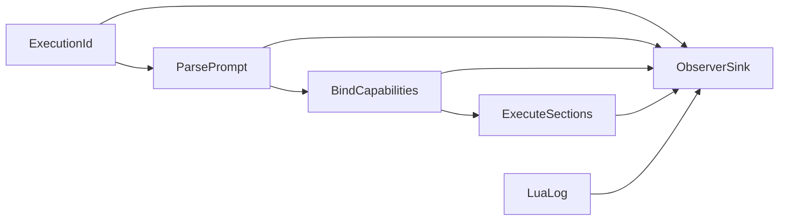

## Commit steps

Each step is implemented by a subagent, committed, reviewed in a fresh context, fixed from scratch `vibe-review.md`, re-reviewed, and amended before the next step. Do not stop to ask between steps.

1. **Correlate observer reports**
   - Change `Observer::observe` to accept execution, section, and detail.
   - Thread one ID through `Prompt::parse`, `bind_prompt`, `RunOptions`, `SectionVm`, model/tool loops, store reports, CLI, MCP, and every recorder.
   - Preserve report ordering and prove concurrent recorder safety with interleaved execution IDs.
   - Update observer, core, CLI, MCP, README, STATUS, and authoritative design documentation.

2. **Add constrained Lua logging and disable print**
   - Add `print` to `harden()` and verify it is unavailable.
   - Install `log(message)` with phase-local borrowed observer context in all executable Lua phases.
   - Validate arity, UTF-8 string type, 256-character limit, and single-line/control-free content.
   - Test H1 binding and replay, preamble, epilog, compatibility path, concurrent executions, ordering, validation failures, NullObserver equivalence, and absence of retained observer references.
   - Document the intentional payload-bearing exception and privacy rule.

3. **Remove author prompt versions**
   - Remove `Frontmatter::version`, `Entry::version`, `RunResult::version`, registry/runner plumbing, list and run JSON fields, constructor parameters, golden tool descriptions, fixtures, and shipped prompt keys.
   - Retain and regression-test every `promptforge:` detection and engine-major gate.
   - Update parser, catalog, result, registry, server, CLI, MCP, README, STATUS, and design documentation.

4. **Create the prompt-file integration harness**
   - Add one Cargo integration target at `tests/it/main.rs` with explicit `include_str!` fixture registration.
   - Rename `tests/valid/1.md` to `tests/valid/minimal.md`.
   - Add representative valid and invalid prompt documents and table-driven public-API assertions.
   - Do not duplicate narrow inline parser tests; remove an inline test only when the file fixture covers the same complete behavior and assertions.

5. **Add execution fixtures and close documentation**
   - Add offline execution fixtures for log checkpoints, preamble early return, and cross-section store fall-through.
   - Use a mutex-backed recording observer and stable test execution IDs.
   - Assert exact log checkpoint ordering and prove different concurrent execution IDs cannot be confused.
   - Run all shipped prompts through parse and bind smoke coverage.
   - Finalize `design-core.md`, README, STATUS, and test-count claims; keep `design-core-orig.md` byte-for-byte unchanged.

## Verification for every commit

- Targeted tests for the changed behavior
- `cargo fmt --all --check`
- `cargo clippy --all-targets --all-features -- -D warnings`
- `cargo test --locked --workspace --all-features`
- `cargo test --doc`
- `RUSTDOCFLAGS="-D warnings" cargo doc --no-deps --all-features`
- Fresh-context review using `vibe-how-to.md` and the repository's Rust rules

## Decision falsifiers

- **Three-string observer API:** revise if a required consumer needs typed fields for correctness rather than cosmetic reporting.
- **Observer-owned synchronization:** revise if an observer implementation cannot safely serialize its own sink without core coordination.
- **Constrained author logs:** revise if real prompt debugging requires multiline or structured values; do not loosen before examples establish the need.
- **Remove author version:** revise only if a real compatibility, cache, or negotiation mechanism begins consuming it.
- **Hybrid test layout:** revise if fixture files begin duplicating small parser edge cases rather than improving author-level readability.

Confidence: high - the current code inventory shows author `version` has no behavioral consumer, observer plumbing is the only concurrency seam, Lua phases already support scoped host callbacks, and the existing inline tests leave a clear author-document integration gap.

Todos:

- Add execution IDs to all observer reports
- Add constrained Lua log and disable print
- Remove unused prompt version metadata
- Create valid and invalid file fixture tests
- Add execution prompt fixtures and finalize docs

### promptforge-dev-loop

*Add a fast prompt-development loop to promptforge-core-tests: subcommands to run the existing fixed scenarios or dev-run any prompt file against a locally cached Qwen3.5 9B on a GPU-enabled llama-server, with verbose trace output and watch-mode reruns. Execute in five reviewed commit steps.*

# PromptForge Dev Loop Upgrade

## Resolution 1: What is being built

`cargo run -p promptforge-core-tests` gains subcommands:

```text
cargo run -p promptforge-core-tests                        # both fixed scenarios (unchanged, Qwen3 0.6B, CPU build)
cargo run -p promptforge-core-tests -- scenarios           # same, explicit
cargo run -p promptforge-core-tests -- dev prompt.md "in"  # run one prompt with real inference
cargo run -p promptforge-core-tests -- dev prompt.md "in" --watch
```

Dev mode provisions a pinned Qwen3.5 9B GGUF (Apache 2.0, 262K native context, native reasoning and tool calling, ~5.7 GB download once), starts a GPU-enabled `llama-server` under the existing process guard, then runs parse, bind, and execute exactly like the CLI. Verbose `(execution, section, detail)` observer records and Lua `log()` checkpoints stream to stderr; the final result prints to stdout. `--watch` keeps the server warm and reruns on every save. The fixed scenarios keep the small model and remain byte-for-byte deterministic.

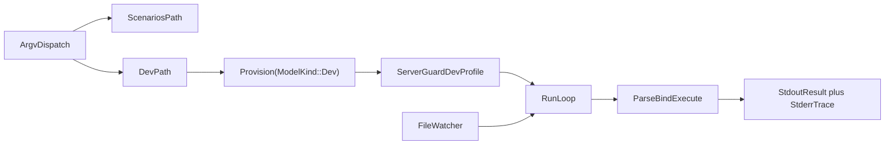

## Resolution 2: Components in dependency order

1. **Server profiles.** `server_args` hardcodes scenario flags; dev needs different context, generation limit, reasoning, KV cache, and GPU flags. Everything downstream launches through this seam.
2. **Artifact provisioning.** `provision()` hardcodes one model and CPU-only server archives. Dev needs its own model pin and GPU-enabled server assets without downloading unused artifacts.
3. **Dev runner.** Parse, bind, execute one prompt file against the guarded server with a live tool registry and a verbose observer.
4. **Argv dispatch and watch.** Subcommand routing in `main.rs`, then the warm-server rerun loop.
5. **Real-model verification and docs.** Cold and cache-only runs of both paths, provenance, README/STATUS/design updates.

## Resolution 3: Settled behavior

### Server profiles ([server.rs](C:/Users/Vinnie/src/cursor/promptforge/crates/promptforge-core-tests/src/server.rs))

- Add a `ServerProfile` threaded through `ServerGuard::start` and `server_args` (the `start_with` test seam at lines 143-205 already exists).
- The scenario profile reproduces today's exact flags; the existing `invocation_pins_deterministic_jinja_settings` test keeps pinning it.
- Dev profile: `--ctx-size` from `--context` (default 131072), `--n-predict` from `--max-tokens` (default 8192, reasoning chains are long), `--flash-attn on`, `--cache-type-k q8_0 --cache-type-v q8_0`, `-ngl 99`, `--jinja`, `--reasoning-format auto` with thinking enabled (a `--no-think` flag switches to the non-thinking preset), model-card sampling (`--temp 1.0 --top-p 0.95 --top-k 20 --presence-penalty 1.5`), `--parallel 1`.
- The 9B is a hybrid model with only 8 of 32 full-attention layers, so 128K context KV fits comfortably beside ~5.7 GB weights in 16 GB VRAM.

### Artifacts ([artifacts.rs](C:/Users/Vinnie/src/cursor/promptforge/crates/promptforge-core-tests/src/artifacts.rs))

- Parameterize provisioning: `provision(ModelKind::Scenario | ModelKind::Dev)`. `Provisioner::provision_file` is already asset-generic; only the selected `FileAsset` and server asset table change. One call never downloads the other mode's artifacts.
- Dev model pin (verified via the Hugging Face LFS metadata):
  - `unsloth/Qwen3.5-9B-GGUF`, file `Qwen3.5-9B-Q4_K_M.gguf`, 5,680,522,464 bytes, SHA-256 `03b74727a860a56338e042c4420bb3f04b2fec5734175f4cb9fa853daf52b7e8`.
  - Fallback if it misbehaves: `bartowski/Qwen_Qwen3.5-9B-GGUF` Q4_K_M, SHA-256 `d784ce9eda1a5a7b51e8f705a9e6310844bf4f173654d115823c775fdea56d43`.
- Dev server assets stay on release `b10082` (its February qwen3.5 hybrid support is confirmed in that build) but use GPU-enabled archives: Vulkan for Windows x64, Ubuntu x64, and Ubuntu arm64; the existing macOS tars are already Metal-enabled and are reused; Windows arm64 falls back to the existing CPU archive. Digests are read from the GitHub release API and committed, same as the current six entries. GPU installs get a distinct platform key (for example `windows-x86_64-vulkan`) so CPU and GPU installs coexist in `.model-cache/llama.cpp/`.
- All existing download, lock, confinement, extraction, and repair machinery is reused unchanged; offline tests extend the existing fake-HTTP harness to cover `ModelKind` selection.

### Dev runner (new `src/dev.rs`)

- Mirrors the CLI pipeline ([promptforge-cli/src/main.rs](C:/Users/Vinnie/src/cursor/promptforge/crates/promptforge-cli/src/main.rs) lines 49-117): read file, require `promptforge_version`, `Prompt::parse`, build live registry, `ToolPicker::build`, `bind_prompt`, `execute::run` - but with `client: Some(GatewayClient::new(base_url, api_key, model_alias))` pointed at the guarded server, exactly as `scenarios.rs` does. No `promptforge-gateway`.
- Registry: port the CLI's `available_tools` construction (add `promptforge-webfetch` workspace dep to this crate). `web_fetch` is always live; `web_search` joins only when `PROMPTFORGE_TOKEN`/`PROMPTFORGE_BASE_URL` name a gateway, otherwise a prompt needing search fails loudly as `Absent` at bind.
- Execution ID `dev-{nonce:016x}` per run. Verbose observer prints every `(execution, section, detail)` record - including `Lua: ...` log checkpoints - to stderr; stdout carries only the final result string. Errors print with the server's bounded diagnostics.

### Dispatch and watch ([main.rs](C:/Users/Vinnie/src/cursor/promptforge/crates/promptforge-core-tests/src/main.rs))

- Hand-rolled `std::env::args` dispatch matching workspace convention (no clap; none exists in the workspace). Empty args or `scenarios` runs today's suite unchanged; `dev <file> [input] [--watch] [--context N] [--max-tokens N] [--no-think]` runs the dev path. Unknown args fail with usage text.
- The existing Ctrl-C `tokio::select!` wrapper in `main` is preserved and wraps both paths.
- `--watch` uses the workspace `notify = "8"` dependency (already used by the MCP server) with a thin debounced watcher on the single prompt file - not the MCP `Watcher` type. The server and provisioned artifacts stay warm; each save re-reads, re-parses, re-binds, and re-executes. A failed parse prints the error and keeps watching.

## Resolution 4: Testable commit steps

Each step carries its code, its regression tests, and its documentation, is committed, fresh-context reviewed via scratch `vibe-review.md`, fixed, and amended before the next step, per the established workflow. Do not stop to ask between steps.

1. **Introduce server profiles**
   - `ServerProfile` through `start`/`start_with`/`server_args`; scenario profile identical to today; dev profile as specified.
   - Tests: scenario args byte-identical (existing test retained), dev args exact including GPU/KV/reasoning flags, context and max-tokens plumbing, `--no-think` variant.
   - Complete when scenarios still pass offline arg pinning and no caller change exists yet.
2. **Parameterize artifact provisioning**
   - `ModelKind`, dev model pin, GPU server asset entries with committed URL and SHA-256 values, distinct install platform keys.
   - Tests: extend the fake-HTTP harness for `ModelKind` selection, single-mode download isolation, GPU-key install coexistence; digest constants match the release API values recorded in the crate README.
   - Complete when offline tests cover both kinds and no real host is contacted by `cargo test`.
3. **Add the dev runner module**
   - `src/dev.rs`: registry port, verbose observer, single-shot parse-bind-execute against a `ServerGuard`, `dev-` execution IDs, stderr/stdout separation, bounded diagnostics on failure. Add `promptforge-webfetch` dependency.
   - Tests: observer formatting, registry composition with and without gateway env, argument validation, non-promptforge file refusal - all offline.
   - Complete when the module compiles and its offline tests pass without being reachable from `main`.
4. **Wire subcommands and watch mode**
   - Argv dispatch in `main.rs`, usage text, `--watch` via `notify` with debounce, warm-server rerun loop, parse-failure resilience, Ctrl-C teardown across both modes.
   - Tests: dispatch table, flag parsing, debounce/rerun trigger logic with a fake event source - offline.
   - Complete when `scenarios` remains default and byte-compatible and `dev --watch` logic is covered offline.
5. **Real-model verification and documentation closure**
   - Run `cargo run -p promptforge-core-tests` (cache-only scenarios) and `cargo run -p promptforge-core-tests -- dev <fixture> "input"` twice: first run downloads the ~5.7 GB model plus the GPU server archive, second run must be cache-only. Verify a tool-calling prompt end to end and clean teardown.
   - Docs: crate README (commands, flags, both model provenances, GPU archive provenance), root [README.md](C:/Users/Vinnie/src/cursor/promptforge/README.md), [STATUS.md](C:/Users/Vinnie/src/cursor/promptforge/STATUS.md), and the real-model item in [design-core.md](C:/Users/Vinnie/src/cursor/promptforge/crates/promptforge-core/design-core.md); `design-core-orig.md` stays byte-identical.
   - Complete when both commands succeed, the second dev run reports only cache hits, and the full offline verification suite is green.

## Verification for every commit

- Targeted tests, then `cargo fmt --all --check`, `cargo clippy --all-targets --all-features -- -D warnings`, `cargo test --locked --workspace --all-features`, `cargo test --doc`, `RUSTDOCFLAGS="-D warnings" cargo doc --no-deps --all-features`.
- Ordinary `cargo test` stays fully offline; real downloads and inference happen only in step 5's explicit commands.

## Decision log and falsifiers

1. **Vulkan/Metal GPU builds for dev, CPU build kept for scenarios.** One archive per platform, vendor-neutral, no CUDA DLL companion. Falsifier: Vulkan on the user's card is unstable or materially slower than CUDA; switch the Windows x64 dev asset to the CUDA 12.4 pair.
2. **Thinking enabled by default in dev.** The user asked for reasoning quality; `--reasoning-format auto` separates reasoning from content. Falsifier: `GatewayClient` mishandles replies with reasoning content or tool calls degrade; flip the default to `--no-think` behavior.
3. **Community GGUF pin (unsloth).** No official Qwen3.5 9B GGUF exists; the pin is by exact URL and SHA-256. Falsifier: quality or tool-call defects traced to the conversion; move to the bartowski fallback pin.
4. **Hand-rolled argv, no clap.** Matches every workspace binary. Falsifier: flag surface grows past comfortable manual parsing.
5. **Watch by `notify`, per-file debounce, warm server.** Falsifier: editor save patterns (atomic rename) evade the watcher; widen to watching the parent directory for the file name.
6. **128K default context.** The model card advises at least 128K for thinking; hybrid KV makes it cheap. Falsifier: measured VRAM overflow on 16 GB; lower the default and document `--context`.

## Project-specific review

<project-review>
1. Does the commit implement only its numbered step?
2. Scenario path byte-identical: same model, same server args, same assertions?
3. Are all new artifact URLs official-or-named-community with committed SHA-256, staged and confined under `.model-cache/`?
4. Does ordinary `cargo test` remain free of downloads, external processes, network, models, and credentials?
5. Does every spawned server terminate on success, error, panic, and Ctrl-C, including in watch mode?
6. Does dev output keep the result on stdout and all trace on stderr?
7. Are alias binding failures (`Absent`) surfaced clearly when a capability lacks a live tool?
8. Is `design-core-orig.md` byte-for-byte unchanged?
9. Does every new behavior have a regression test that fails without it?
10. Do formatting, strict Clippy, workspace tests, doctests, and warning-denied docs pass?
</project-review>

## Vibe execution protocol

Implement each step in a subagent given this plan path and the step number; commit in the main context; review in a fresh subagent writing actionable findings to scratch `vibe-review.md`; fix in another subagent; re-review until clean; amend the unpushed commit; continue immediately to the next step without asking. Commits and amendments for these steps follow the workflow already authorized in this session.

Todos:

- Introduce scenario and dev server profiles
- Parameterize provisioning with dev model and GPU builds
- Add the dev prompt runner module
- Wire subcommands and watch mode
- Verify real-model paths and close documentation

### models debug cluster

*Full cluster in dependency order: a payload DebugCapture seam so empty replies are diagnosable, payload-free observer details for empty/truncated turns, then prompt-level model bindings (`models.need` / `models.use`) with gateway catalog metadata and per-call temperature/thinking, plus user-facing docs throughout.*

# Model bindings and debug cluster

## Governing guides

- [tools-public/rulebooks/vibe-rulebook.md](C:\Users\Vinnie\src\cursor\tools-public\rulebooks\vibe-rulebook.md) - one testable commit per step; implement in subagent; review in fresh context via scratch; amend unpushed commit; never ask between steps; old bugs get their own commit.
- [tools-public/rulebooks/rust-rulebook.md](C:\Users\Vinnie\src\cursor\tools-public\rulebooks\rust-rulebook.md) - tests land with code; `Result` for expected failures; fmt + clippy clean; documented public items with `# Errors`.

Lean loop (from recent session): implementer runs targeted crate tests; parent commits; review reads the diff while full workspace suite runs in parallel; small findings fixed in parent and amended.

Scratch review file: `cabinet/_scratch/vibe-review-promptforge-models/vibe-review.md` (overwrite each cycle).

Do not touch `design-core-orig.md` (byte-frozen).

## Decision log

| Decision | Choice | Falsifier |
|---|---|---|
| Debug vs Observer | Separate `DebugCapture` on `RunOptions`; Observer stays payload-free | Any host needs payloads through Observer alone |
| H1 / H2 API | `models.need(alias, description, opts?)` and `models.use(alias)` | Authors cannot express per-section model choice |
| Constraint vs invocation | `context` and `thinking` capability filter the catalog; `temperature`, `max_tokens`, and switchable `thinking` ride per request | Backend rejects a field that was advertised as supported |
| Same weights, different params | Legal - identity is alias to binding (ModelId + invocation), not to weights | Two aliases collide incorrectly as Duplicate |
| No `models.use` | Host default client model (today's behavior) | Existing prompts break |
| Gateway role | Catalog metadata + `GET /v1/models`; request body stays passthrough via `rest` | Hosts invent model metadata out of band |
| Thinking dialect (v0) | Client emits OpenAI-shaped `chat_template_kwargs.enable_thinking` when binding requests it; backends that ignore it are catalogued `thinking = "never"` or `"always"` so bind filters them | A hybrid model cannot turn thinking off |

## Architecture

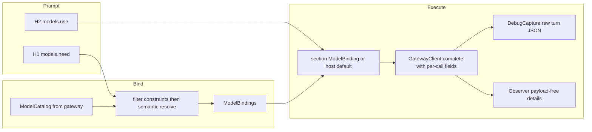

---

## Step 1 - DebugCapture seam

**Goal:** hosts can opt into raw request/response capture without widening `Observer`.

In [promptforge-core](C:\Users\Vinnie\src\cursor\promptforge\crates\promptforge-core):

- Add `DebugCapture: Send + Sync` trait with a single method that receives `(execution, section, turn_index, event)` where `event` is an owned enum carrying request body and/or response body as `serde_json::Value` (and finish_reason / reasoning_content when present). `NullDebugCapture` or `Option<&dyn DebugCapture>` on `RunOptions` - prefer `Option` so production hosts pay zero.
- Extend `RunOptions` with `debug: Option<&'a dyn DebugCapture>`.
- In [client.rs](C:\Users\Vinnie\src\cursor\promptforge\crates\promptforge-core\src\client.rs) / the tool loop in [execute.rs](C:\Users\Vinnie\src\cursor\promptforge\crates\promptforge-core\src\execute.rs): after building the request body and after parsing the response, call the capture when `Some`. Parsing must surface `finish_reason` and optional `reasoning_content` alongside today's `CompletionResult` (internal fields or a richer result type) so later steps can observe them; still do not put those payloads on the Observer.
- Dev runner in [promptforge-core-tests](C:\Users\Vinnie\src\cursor\promptforge\crates\promptforge-core-tests): implement a capture that writes `turn-N-request.json` and `turn-N-response.json` under `<prompt-stem>.store/.trace/` (same dump directory as store files; announce on stderr). Wire it in `run_once` always for dev mode.

**Tests:** offline fake HTTP - capture receives request/response when set; `None` changes nothing; dump lands beside the prompt under `.trace/`.

**Docs this step:** one short paragraph in root README "The prompt dev loop" and core-tests README that `.store/.trace/` holds raw turns.

---

## Step 2 - Empty reply and finish-reason observer details

**Goal:** payload-free signals that would have named today's empty `evidence.md`.

In [observe.rs](C:\Users\Vinnie\src\cursor\promptforge\crates\promptforge-core\src\observe.rs) `detail`:

- `MODEL_REPLY_EMPTY` = `"Model reply was empty"`
- `MODEL_TURN_TRUNCATED` = `"Model turn truncated"` (when `finish_reason == "length"`)

Emit from the tool loop when binding final text: empty `content` after a successful parse fires `MODEL_REPLY_EMPTY`; `finish_reason == "length"` fires `MODEL_TURN_TRUNCATED` (may fire with or without empty content). Keep `MODEL_TURN_COMPLETED` as today.

**Tests:** fake completion with empty content and/or `finish_reason: "length"` asserts the new details appear in a recorder.

**Docs this step:** "Watching a run" in root README names the two new details.

---

## Step 3 - Gateway model catalog

**Goal:** hosts fetch authoritative model metadata instead of inventing it.

In [promptforge-gateway](C:\Users\Vinnie\src\cursor\promptforge\crates\promptforge-gateway):

- Extend `ModelConfig` in [config.rs](C:\Users\Vinnie\src\cursor\promptforge\crates\promptforge-gateway\src\config.rs):
  - `description: String` (required for catalogued models - bind needs prose)
  - `context: u32` (context window size)
  - `thinking: ThinkingMode` enum: `never` | `always` | `switchable` (default `never` for today's Anthropic entry)
- Add `GET /v1/models` (bearer-authed like chat) returning OpenAI-shaped list plus PromptForge extensions in each object: `id` (= caller `name`), `description`, `context`, `thinking`.
- Update [gateway.toml](C:\Users\Vinnie\src\cursor\promptforge\gateway.toml) with description/context/thinking for `claude-sonnet-4-6`.
- Leave chat passthrough unchanged (`rest` already carries temperature / max_tokens / chat_template_kwargs).

**Tests:** config load rejects missing description/context; `/v1/models` returns the configured entries; unknown key still fails load.

**Docs this step:** README "Gateway configuration" documents the new `[[model]]` fields and `GET /v1/models`.

---

## Step 4 - Core language: `models.need` / `models.use`

**Goal:** prompt-local model bindings mirror tools.

### Types (promptforge-core)

- `ModelId` - stable identity (`server` + `name`, or single gateway-facing name; match ToolId shape if a server namespace helps multi-gateway later - for v0 use one namespace `"gateway"` + model name).
- `ModelDescriptor` - id, description, context, thinking mode.
- `ModelCatalog` / `ModelRegistry` - complete live set for the run (host-built).
- `ModelNeedOpts` from Lua table: optional `thinking` (bool), `context` (integer min), `temperature` (number), `max_tokens` (integer).
- `ModelBinding` - alias + resolved `ModelId` + frozen invocation (`temperature`, `max_tokens`, `thinking: Option<bool>`).
- `ModelBindings` - frozen H1 declarations; parallel to `ToolBindings`.

### Lua

- H1 binding VM: `models.need(alias, description, opts?)` - resolve as below; `models.use` forbidden.
- H1 replay: exact declaration replay like tools.
- H2: `models.use(alias)` - at most once before scope close; `models.need` forbidden. Closing records `Option<ModelBinding>` for the section (None = host default).

### Resolve

1. Filter catalog by hard constraints from opts (`context >= N`; if `thinking == false` require `switchable` or `never`; if `thinking == true` require `switchable` or `always`).
2. Semantic resolve description against filtered catalog via existing `promptforge-tool-picker` (build a `Catalog` of descriptors from model descriptions - reuse picker, do not fork a second embedding stack).
3. Outcomes: Bind / Absent / Duplicate / Ambiguous - all-but-Bind fatal at `bind_prompt`, same as tools.
4. Do **not** run tool-style near-duplicate rejection across model aliases that share weights with different invocation params.

### Bind / execute

- Extend `bind_prompt` (or a sibling that hosts call once) to accept `ModelCatalog` + picker and freeze `ModelBindings` into `BoundPrompt`.
- Section execution: after H2 close, if `models.use` selected a binding, build per-call fields for every `complete` in that section; else use `RunOptions.client`'s model with no extra sampling fields (compat).
- Extend `GatewayClient::complete` to accept optional `CompletionOptions { model override, temperature, max_tokens, thinking }` merged into the JSON body (`chat_template_kwargs` when thinking is `Some`).

### Hosts

- CLI / MCP: fetch `GET /v1/models` at boot (or first bind), build catalog; fail bind with clear Absent if catalog empty and prompt declares models.
- Dev runner: advertise the pinned Qwen3.5 as one catalog entry (`context` from server profile default 131072, `thinking: switchable`, description suited to analysis); still use llama-server for chat; gateway token still gates web_search only.

**Tests:** need resolves; constraint filters; use selects per section; no use keeps default; Absent on missing token-less search remains separate; wrong-arity / undeclared use fails loudly.

**Docs this step:** `design-core.md` new item for model bindings; root README "Prompt file anatomy" and "Prompt language" show `models.need` / `models.use`; note Lua table opts (no keyword args).

---

## Step 5 - User-facing docs pass and fixture

- Root [README.md](C:\Users\Vinnie\src\cursor\promptforge\README.md): consolidate Prompt language (tools + models), Gateway `[[model]]` + `/v1/models`, Watching a run (new details), Dev loop (`.store` + `.trace`).
- [design-core.md](C:\Users\Vinnie\src\cursor\promptforge\crates\promptforge-core\design-core.md): authoritative lifecycle paragraphs for DebugCapture, model bind/execute, observer details.
- Crate READMEs for gateway and core-tests as needed.
- Update [briefer.md](C:\Users\Vinnie\src\cursor\promptforge\briefer.md) (user prompt, keep untracked via exclude if needed) or add a tracked example under `prompts/` demonstrating:

```lua
models.need("analyst", "A model suited for careful analysis", { thinking = false, temperature = 0, context = 40000 })
```

```lua
models.use("analyst")
tools.add("search", "fetch")
```

- `STATUS.md` if it still lists gaps this closes.

---

## Project-review checks

1. Observer remains payload-free; DebugCapture is opt-in and unused by CLI/MCP by default.
2. `design-core-orig.md` untouched.
3. Ordinary `cargo test` stays offline (gateway `/v1/models` and DebugCapture tested with loopback fakes).
4. Scenario suite byte contracts unchanged (no temperature/thinking on scenario path unless already pinned).
5. Dev stdout remains result-only; traces and dump announcements on stderr.
6. Gateway still passthrough for unknown chat fields; catalog is additive.
7. Existing prompts without `models.*` behave identically.
8. User-facing docs describe grammar, gateway fields, and `.store/.trace` without staging paths.

## Data-flow note

Step 1 produces the capture seam execute needs. Step 2 consumes finish_reason/content emptiness from step 1's richer parse. Step 3 produces catalog JSON hosts need. Step 4 consumes catalog + picker + client options; DebugCapture already records the new per-call fields. Step 5 documents the shipped surface. No step waits on undocumented chat context.


Todos:

- Add DebugCapture seam, richer completion parse, wire into execute and core-tests .store/.trace dump
- Add MODEL_REPLY_EMPTY and MODEL_TURN_TRUNCATED observer details with tests
- Extend ModelConfig and add bearer-authed GET /v1/models; update gateway.toml
- Implement models.need / models.use bind+execute+client CompletionOptions; wire CLI/MCP/dev hosts
- User-facing docs (README, design-core, crate READMEs) and example prompt using models.need/use

### completion normalize layer

*Introduce a slender CompletionNormalizer API in promptforge-core (one module, drop-in trait) and make empty final content a hard error - the targeted fix for briefer - while keeping special cases out of execute and hosts.*

# Completion normalization layer

## Pros and cons (why this shape)

**Pros**
- One door for wire quirks: field synonyms (`reasoning_content` / `reasoning` / `thinking`), empty content, tool-call-with-null-content live in one module instead of execute, client, and hosts.
- PromptForge code reads as if a library owned the problem: `normalizer.normalize(body) -> NormalizedTurn`.
- Drop-in later: swap `OpenAiChatNormalizer` for a thicker adapter (or a future crate) without rewriting the tool loop.
- Matches the product: many small models, many OpenAI-compat servers; hosts stay dumb.

**Cons**
- A trait + default impl is slightly more surface than a private `parse_completion` - paid once so special cases do not multiply.
- Hard-fail on empty content will break any prompt that today "succeeds" with empty `reply` (briefer's silent empty `evidence.md`). That breakage is the point.
- A trait does not by itself fix vendors; it only concentrates where PromptForge decides what a turn means.

**Not doing:** adopting `genai` / `rig` / a separate published crate in this change. The module is the seam; a crate can graduate later if the file grows.

**Policy (locked):** never promote `reasoning_content` into the answer. Final turn with no tool calls and empty/missing `content` is an error, even when reasoning is present. Tool calls with empty `content` remain valid.

---

## Architecture

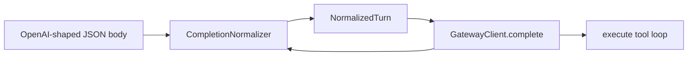

Single new module: [`crates/promptforge-core/src/normalize.rs`](C:\Users\Vinnie\src\cursor\promptforge\crates\promptforge-core\src\normalize.rs).

| Piece | Role |
|---|---|
| `NormalizedTurn` | `outcome: CompletionResult`, `finish_reason`, `reasoning_content` (side channel only) |
| `CompletionNormalizer` | `fn normalize(&self, body: &Value) -> Result<NormalizedTurn>` |
| `OpenAiChatNormalizer` | Default impl: today's parse + synonyms + empty-text error |
| `Error::EmptyModelReply` | Distinct from `MalformedResponse`; message names empty content (and that reasoning was ignored if present, without pasting it) |

[`GatewayClient::complete`](C:\Users\Vinnie\src\cursor\promptforge\crates\promptforge-core\src\client.rs) calls the normalizer instead of private `parse_completion`. For slender drop-in without threading every host: store `Arc<dyn CompletionNormalizer>` on `GatewayClient`, defaulting to `OpenAiChatNormalizer` in `new` / `from_env`. A later host can construct with another impl; execute and RunOptions stay unchanged.

Execute tool loop: on `complete` error after a successful HTTP round trip that normalized to empty text, existing `MODEL_TURN_FAILED` fires. Keep `MODEL_REPLY_EMPTY` only if somehow empty text still returned as `Ok` (it should not for the default normalizer); prefer hard error so epilogs never see `reply == ""` from this failure mode. Truncation (`finish_reason == length`) stays an observer detail when text is non-empty; empty+length still hard-fails as empty reply.

---

## Steps (lean vibe)

Governing guides: [vibe-rulebook](C:\Users\Vinnie\src\cursor\tools-public\rulebooks\vibe-rulebook.md) + [rust-rulebook](C:\Users\Vinnie\src\cursor\tools-public\rulebooks\rust-rulebook.md). Lean protocol: targeted tests in implementer; parallel full suite + diff-only review; **one amend round**; max three findings; never ask between steps. Scratch: `cabinet/_scratch/vibe-review-promptforge-normalize/vibe-review.md`.

### Step 1 - Normalize module + hard-fail empty text

- Add `normalize.rs`, export from `lib.rs`.
- Move parse logic out of `client.rs` into `OpenAiChatNormalizer::normalize`.
- Synonyms for reasoning: first non-empty among `reasoning_content`, `reasoning`, `thinking` (string fields only).
- Empty/missing `content` and no tool calls → `Error::EmptyModelReply` (include a fixed phrase if reasoning was present, e.g. "reasoning content was present but ignored", no payload).
- Non-empty tool_calls → success even when content is `""` / null.
- `GatewayClient` holds `Arc<dyn CompletionNormalizer>` defaulting to `OpenAiChatNormalizer`.
- Unit tests in `normalize.rs`: answer+reasoning; tools+empty content; empty content+reasoning → error; null content no tools → error; synonym `reasoning` field.
- Update client tests that called `parse_completion` to use the normalizer.
- Update execute tests that expected empty-text success to expect run failure / `MODEL_TURN_FAILED` instead of soft empty success.

### Step 2 - Docs

- Short `design-core.md` paragraph: normalization seam, hard-fail policy, no reasoning-as-answer.
- Root README "Watching a run" / client note: empty final content fails the run; `MODEL_REPLY_EMPTY` is not the success path for that case anymore (adjust wording to match shipped behavior).
- Do not touch `design-core-orig.md`.

---

## Project-review

1. Special cases live only in `normalize.rs` (and its tests).
2. No silent empty `reply` from empty content.
3. Reasoning never becomes answer text.
4. Tool-call turns with empty content still work.
5. Default normalizer is what every current host gets without API churn beyond `GatewayClient` construction internals.
6. `design-core-orig.md` untouched.
7. Tests would fail if empty+reasoning were accepted as `Text("")`.


Todos:

- Add CompletionNormalizer + OpenAiChatNormalizer; hard-fail empty final content; wire GatewayClient; update tests
- Document normalization seam and hard-fail policy in design-core and README

### webfetch soft errors

*Change web_fetch so recoverable target failures (HTTP non-2xx, unsupported/missing content type, timeout, size, charset, DNS) return Ok tool text the model can read, matching industry soft-error practice, while SSRF and URL-admission policy failures keep aborting the tool call.*

# Soft-return recoverable web_fetch failures

## Why

[`WebFetch::call`](promptforge/crates/promptforge-webfetch/src/lib.rs) turns non-2xx into `Err(Error::Backend { ... })`. The tool loop then does `result?` and aborts the section/fanout ([`execute.rs`](promptforge/crates/promptforge-core/src/execute.rs) ~832-842). That killed briefer on `https://cppalliance.org/about/` (404) and earlier on PDFs. Industry practice (Anthropic `web_fetch`, OpenAI Agents, LangChain) is soft tool results so the model retries another URL. Research: `2026-08-08-fetch-tool-http-error-handling`.

## Policy (locked)

| Class | Examples | Behavior |
|---|---|---|
| Recoverable target failure | HTTP 4xx/5xx, unsupported/missing content type, timeout, too large, undecodable charset, DNS failure | `Ok(model_facing_text)` - tool succeeds, loop continues, observer still sees success |
| Policy / admission | invalid URL, blocked scheme/port/userinfo/IP literal, blocked address, no allowed address, redirect refused | `Err(...)` - hard fail unchanged |

Do not put the HTTP error response body into the tool result (it is untrusted HTML and not useful for recovery). Message names status + final URL + a next-move hint.

No change to the execute loop contract: tools that still return `Err` abort; webfetch simply stops returning `Err` for the recoverable class. The existing `FailingTool` execute test stays.

## Implementation

Single commit, lean vibe (targeted webfetch tests + parallel workspace suite + one amend round). Scratch: `cabinet/_scratch/vibe-review-promptforge-webfetch-soft/vibe-review.md`.

### Step 1 - Soft recoverable results in webfetch

In [`crates/promptforge-webfetch/src/error.rs`](promptforge/crates/promptforge-webfetch/src/error.rs):

- Add `FetchError::HttpStatus { url, status }` with Display / model_facing like: `HTTP {status} from {url}; try a different URL`.
- Add `FetchError::is_soft_tool_result(&self) -> bool` true for: `HttpStatus`, `UnsupportedContentType`, `NoContentType`, `Timeout`, `TooLarge`, `Undecodable`, `Dns`. False for admission/SSRF variants.

In [`crates/promptforge-webfetch/src/lib.rs`](promptforge/crates/promptforge-webfetch/src/lib.rs) `call`:

- Non-2xx: build `FetchError::HttpStatus` from `final_url` + status; `return Ok(err.model_facing())` (drop the truncated body path used for `Error::Backend`).
- For other fallible paths that produce a soft `FetchError`, return `Ok(err.model_facing())` instead of `Err(err.into())`. Keep hard variants as `Err`.
- Prefer a tiny local helper, e.g. `fn tool_outcome(err: FetchError) -> Result<String>`, so every soft/hard site is one line.

Tests in webfetch (wiremock/axum style already in crate):

- 404 → `Ok`, text contains `404` and the URL; call does not return `Err`.
- 500 → soft Ok the same way.
- `application/pdf` → soft Ok with content-type hint (regression for the earlier briefer abort).
- Blocked / invalid URL still `Err` (SSRF path unchanged).

Docs: short update in [`design-webfetch.md`](promptforge/crates/promptforge-webfetch/design-webfetch.md) choice 14 / error section - recoverable target failures are soft tool results; policy failures remain hard. Touch README/STATUS only if they claim every fetch failure aborts the run.

## Project-review

1. 404/PDF no longer abort the tool loop; model gets actionable text.
2. SSRF and URL admission still hard-fail.
3. Error response bodies never enter tool results.
4. Execute loop and `FailingTool` hard-fail test unchanged.
5. Tests would fail if non-2xx still returned `Err`.


### extract promptforge-dev crate

*Extract the interactive prompt runner into a new `promptforge-dev` crate that talks to an already-running gateway, keep the 0.6B scenario suite self-contained in `promptforge-core-tests`, and ship friendly README + design docs for the new tool.*

# Extract `promptforge-dev` and simplify core-tests

## Decisions (locked)

- **Crate / binary name:** `promptforge-dev` (default; short and clear).
- **Dev mode never starts infrastructure.** It requires an already-running `promptforge-gateway` via `PROMPTFORGE_GATEWAY_URL` + `PROMPTFORGE_GATEWAY_KEY`. Hard-fail with a friendly message if either is missing or the gateway is unreachable.
- **Scenario suite keeps its sidecar.** `promptforge-core-tests` (default / `scenarios`) still starts a temporary gateway profile for the pinned 0.6B model so real-inference integration tests stay self-contained without Brave or a hand-started gateway.
- **Server knobs leave the CLI.** `--context`, `--max-tokens`, and `--no-think` configure a spawned local model today. After the split they belong only in the operator's `gateway.toml`. The new binary does not re-offer them.
- **Model catalog comes from the live gateway.** Replace `pinned_qwen_dev_catalog` on the dev path with `fetch_model_catalog` (same as [`promptforge-cli`](promptforge/crates/promptforge-cli/src/main.rs)), so `models.need` / `models.always` resolve against what the gateway actually advertises.

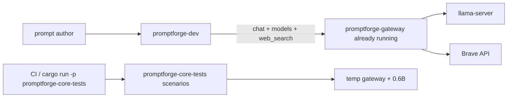

## Target layout

New crate [`crates/promptforge-dev/`](promptforge/crates/promptforge-dev/):

| Path | Role |
|---|---|
| `Cargo.toml` | `publish = false`, bin `promptforge-dev` |
| `README.md` | Friendly end-user instructions |
| `design.md` | Why this crate exists, what it owns, what it refuses to own |
| `src/main.rs` | Args: `<prompt> [input] [--watch]` |
| `src/run.rs` | One-shot run (moved from `dev.rs`) |
| `src/watch.rs` | Debounced rerun on save |
| `src/dump.rs` | Store dump + `.trace/` capture |
| `src/tools.rs` | `web_fetch` always; `web_search` when env credentials present |

Slim [`crates/promptforge-core-tests/`](promptforge/crates/promptforge-core-tests/):

- Keep: `scenarios.rs`, scenario-only parts of `gateway.rs`, offline `suite.rs`, fixture prompts under `prompts/valid|invalid|execution/`.
- Remove: `dev` subcommand, `dev.rs`, `watch.rs`, `dump.rs`, `DevServerOptions` / `GatewayProfile::Dev`, `prompts/dev/`, and all `--context` / `--max-tokens` / `--no-think` parsing.
- Binary usage becomes: `promptforge-core-tests` or `promptforge-core-tests scenarios` only.

Workspace: add `crates/promptforge-dev` to root [`Cargo.toml`](promptforge/Cargo.toml) members.

## Behavior of `promptforge-dev`

1. Parse args: prompt path, optional input, optional `--watch`.
2. Require `PROMPTFORGE_GATEWAY_URL` and `PROMPTFORGE_GATEWAY_KEY`.
3. Clear `<prompt-stem>.store/` before each run (keep current pre-clear behavior).
4. Parse / bind / execute against the gateway:
   - `fetch_model_catalog`
   - live tools: `WebFetch` + optional `WebSearch(url, key)`
   - `GatewayClient::new(url, key)` (model from catalog / section binding)
   - verbose observer on stderr; result on stdout
   - always-on `DebugCapture` flushed after store dump
5. Watch mode: keep process alive, rerun on prompt save; no gateway lifecycle.

## Documentation (crate-owned, friendly)

**[`crates/promptforge-dev/README.md`](promptforge/crates/promptforge-dev/README.md)** - written for a prompt author, not a core contributor:

- What this tool is (iterate on a prompt against your live gateway)
- Prerequisites: start `promptforge-gateway` with a working `gateway.toml` (model + optional Brave search)
- Env vars: `PROMPTFORGE_GATEWAY_URL`, `PROMPTFORGE_GATEWAY_KEY`
- Install / run: `cargo run -p promptforge-dev -- <prompt.md> [input] [--watch]`
- What appears on stdout vs stderr
- Where dumps go (`*.store/`, `.trace/`), and that each run clears the previous dump
- How `web_search` appears (only when the gateway exposes it and credentials are set)
- Short troubleshooting: missing env, unreachable gateway, Absent tool, empty model reply

**[`crates/promptforge-dev/design.md`](promptforge/crates/promptforge-dev/design.md)** - design choices:

1. Dev never starts the gateway (operator owns infra).
2. Scenario tests keep a temporary 0.6B gateway for self-contained inference coverage.
3. Catalog is fetched, not pinned, so prompts track the live deployment.
4. Dump-before-run so stale traces never masquerade as the current run.
5. Observer/debug stay out of the result stream (stderr / `.trace/` only).

Also update root [`README.md`](promptforge/README.md) and [`crates/promptforge-core-tests/README.md`](promptforge/crates/promptforge-core-tests/README.md) so they stop advertising `core-tests -- dev` and point authors at `promptforge-dev`.

## Steps (lean vibe)

Governing: vibe-rulebook + rust-rulebook. One review amend per commit. Scratch: `cabinet/_scratch/vibe-review-promptforge-dev/vibe-review.md`.

### Step 1 - Create `promptforge-dev` and move the runner

- Add crate + workspace member.
- Move `dev.rs` / `watch.rs` / `dump.rs` logic; strip all gateway-spawn / `DevServerOptions` / pinned-catalog usage.
- Wire env-required gateway client + `fetch_model_catalog`.
- Port offline unit tests that do not need a live gateway (arg parsing, dump, watch debounce, tool registry construction).
- CLI: `promptforge-dev <prompt> [input] [--watch]`.

### Step 2 - Slim `promptforge-core-tests` to scenarios + fixtures

- Delete the `dev` command path and unused modules / flags / `prompts/dev/`.
- Keep scenario gateway spawn for 0.6B only.
- Rewrite the crate README around offline fixtures + explicit scenario suite.

### Step 3 - Docs pass

- Write `promptforge-dev/README.md` and `design.md`.
- Update root README and any STATUS mentions of the old `core-tests -- dev` command.

## Project-review

1. `promptforge-dev` never launches `promptforge-gateway` or `llama-server`.
2. Missing gateway env fails before any prompt parse with a clear message.
3. Scenario suite still runs real 0.6B inference without a hand-started gateway.
4. Store dump still clears before each run and writes `.trace/` after.
5. Root and core-tests docs no longer tell authors to use `core-tests -- dev`.
6. `design-core-orig.md` untouched.


### local.toml bigger model

*Create operator gateway profile `C:\Users\Vinnie\cursor\local.toml` for the pinned Qwen3.5-9B local model, based on the repo’s local example, so `promptforge-dev` binds that model instead of Anthropic Sonnet.*

# Create `C:\Users\Vinnie\cursor\local.toml` for Qwen3.5-9B

## Decision

**Bigger model = Qwen3.5-9B Q4_K_M** (same pin as [`gateway.local.example.toml`](promptforge/gateway.local.example.toml) and gateway `DEV_MODEL_*` constants). Not Anthropic. Not the 0.6B scenario model.

## File to write

Path: `C:\Users\Vinnie\cursor\local.toml` (create `C:\Users\Vinnie\cursor\` if missing). Outside the promptforge repo; not committed.

Contents derived from [`promptforge/gateway.local.example.toml`](promptforge/gateway.local.example.toml), plus Brave search so briefer keeps working:

```toml
[server]
bind = "127.0.0.1:8081"
key = "${PROMPTFORGE_GATEWAY_KEY}"

[queue]
max_depth = 100
fair_scheduling = true

[[local_model]]
name = "qwen-local"
description = "A careful analysis model suited to structured reasoning and long-context review"
source = "https://huggingface.co/unsloth/Qwen3.5-9B-GGUF/resolve/main/Qwen3.5-9B-Q4_K_M.gguf"
sha256 = "03b74727a860a56338e042c4420bb3f04b2fec5734175f4cb9fa853daf52b7e8"
context = 65536
thinking = "never"
gpu_layers = 99
flash_attention = true
cache_type_k = "q8_0"
cache_type_v = "q4_0"
n_predict = 8192

[tools.web_search]
provider = "brave"
api_key = "${BRAVE_API_KEY}"
```

Notes:
- Description matches briefer’s `models.always` sentence so the picker binds `qwen-local`.
- `context = 65536` satisfies briefer’s `context = 65536` need.
- No `[[endpoint]]` / Claude `[[model]]` in this profile.

## After write (operator; not automated)

1. Stop the current gateway if it is still serving Anthropic `gateway.toml`.
2. Start: `cargo run -p promptforge-gateway -- serve C:\Users\Vinnie\cursor\local.toml` (from the promptforge repo), with `PROMPTFORGE_GATEWAY_KEY` and `BRAVE_API_KEY` set.
3. First boot downloads GGUF + llama-server into `~/.promptforge` (large).
4. Point `promptforge-dev` at `http://127.0.0.1:8081` with the same key.

No Rust or repo file changes in this step.


Todos:

- Create C:\Users\Vinnie\cursor\local.toml from gateway.local.example.toml + web_search

### gateway download progress

*Add an indicatif progress bar (percent, bytes, rate, ETA) to promptforge-gateway local artifact downloads so large GGUF fetches are visible on a TTY.*

# Gateway download progress bar

## Decision

Use [`indicatif`](https://crates.io/crates/indicatif) in [`crates/promptforge-gateway/src/local/artifacts.rs`](promptforge/crates/promptforge-gateway/src/local/artifacts.rs) `download`. On a TTY stderr: bar + percent + transferred/total + rate + ETA + spinner-style template. When stderr is not a TTY (CI / redirected logs): no bar; emit `tracing::info!` every ~5% or 64 MiB with percent and bytes so progress still appears in logs.

Default: progress on stderr only (keeps stdout free if anything else uses it). No multi-connection speedup in this change.

## Changes

1. **Dependency** - add `indicatif` to workspace `[workspace.dependencies]` and `promptforge-gateway` deps (`*.workspace = true`).

2. **`download` in `artifacts.rs`**
   - After a successful response, read `Content-Length` if present.
   - If `std::io::stderr().is_terminal()` (Rust 1.70+ `IsTerminal`): create `ProgressBar` with known length, or spinner+bytes if unknown. Style roughly:
     `{spinner} {msg} [{bar:40.cyan/blue}] {percent:>3}% {bytes}/{total_bytes} ({bytes_per_sec}, ETA {eta})`
     Message = basename from URL (e.g. `gemma-3-27b-it-q4_0.gguf`).
   - In the existing read loop, after each successful chunk write: `pb.inc(count as u64)` (or tick for unknown length).
   - On success: `pb.finish_and_clear()` then return digest (existing `provisioned local GGUF` log stays).
   - On error path: `pb.abandon()` / finish_and_clear so the bar does not corrupt later stderr.
   - Non-TTY: track `downloaded` + optional total; log progress at thresholds (first chunk, then every 5% or 64 MiB, and on complete) via `tracing::info!`.

3. **Tests**
   - Keep existing FakeServer download tests (non-TTY in cargo test, so bar off).
   - Add a unit test for a small helper that decides bar vs log mode from `is_terminal` + content length (pure function if extracted), or assert that a download with known length completes and updates an injectable progress callback. Prefer a thin `DownloadProgress` trait / callback injected into `download` so FakeServer tests can count ticks without depending on a real TTY.

Concrete shape:

```rust
trait DownloadProgress {
    fn set_len(&self, total: Option<u64>);
    fn inc(&self, n: u64);
    fn finish(&self);
}
```

TTY builds `IndicatifProgress`; tests use a `RecordingProgress`. Production `download` constructs the right one from `stderr().is_terminal()`.

4. **Docs** - one short note in [`crates/promptforge-gateway/design-gateway.md`](promptforge/crates/promptforge-gateway/design-gateway.md) under local models: first-time GGUF download shows a progress bar on an interactive terminal.

## Out of scope

- Parallel / resumed downloads
- Changing HF auth or cache layout
- Progress for llama-server extract (only the HTTP blob download loop)


Todos:

- Add indicatif workspace + gateway dependency
- DownloadProgress trait + TTY bar / non-TTY log / test recorder
- Wire progress into artifacts.rs download loop
- Unit tests + design-gateway note

### Tool dialect plugins

*Replace ad-hoc ContentFence hacks and prompt-side tool_code instructions with a catalog-selected ToolDialect plugin registry: gateway advertises which dialect each model uses, core applies request/response/history normalization so prompts stay dialect-agnostic.*

# Pluggable tool-call dialect layer

## Problem

PromptForge speaks OpenAI wire tools. Gemma 3 IT (and others) speak different text dialects. Today that leaks into prompts (`tool_code` instructions) and into one-off logic inside [`normalize.rs`](promptforge/crates/promptforge-core/src/normalize.rs) / [`execute.rs`](promptforge/crates/promptforge-core/src/execute.rs). That does not scale.

Industry pattern to crib: **vLLM** pins `--tool-call-parser <name>` per deployment; **llama.cpp** sniffs templates into format handlers. We take the vLLM contract (explicit dialect id on the model) and a small plugin trait for parse + history + request shaping.

## How we identify “Gemma” (and every other model)

**Not** by sniffing completion text in the prompt author surface, and **not** by hardcoding model names inside briefer.md.

1. Operator sets `tool_dialect` on the gateway model entry (same role as vLLM’s parser flag).
2. Gateway advertises it on `GET /v1/models`.
3. Core freezes it onto the bound model’s `CompletionOptions` at section scope close.
4. The tool loop selects `registry.get(dialect_id)` and never asks the author prompt what format to use.

Default when omitted: `openai` (passthrough wire `tool_calls` + OpenAI history). For local Gemma today that means [`gemma.toml`](gemma.toml) gets `tool_dialect = "gemma3_tool_code"`.

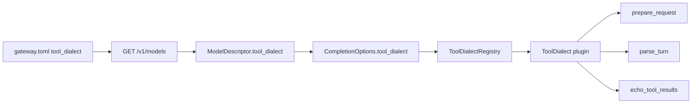

## Rust shape

New module family under core (keeps design-core rule: wire quirks live in the normalize family, not execute/hosts):

[`promptforge-core/src/tool_dialect/`](promptforge/crates/promptforge-core/src/)

- `mod.rs` - `ToolDialectId`, trait, registry
- `openai.rs` - current OpenAI behavior
- `gemma3_tool_code.rs` - move today’s ContentFence / `tool_code` logic here; emit Google-cookbook `tool_output` user turns
- (registry ready for later cribs: `hermes`, `llama3_json`, `pythonic`, `functiongemma` - not required in first landing)

```rust
pub trait ToolDialect: Send + Sync {
    fn id(&self) -> ToolDialectId;

    /// Shape the outbound chat-completions body (tools field, optional
    /// synthetic tool-preamble message built from ToolSchema, not author prose).
    fn prepare_request(&self, request: &mut DialectRequest<'_>) -> Result<()>;

    /// Response wire -> Text or ToolCalls (empty-product invariant stays here).
    fn parse_turn(&self, body: &Value) -> Result<NormalizedTurn>;

    /// Append assistant tool turn + tool results into conversation history.
    fn echo_tool_results(
        &self,
        conversation: &mut Vec<Message>,
        calls: &[ToolCall],
        results: &[(String /* call id */, String /* body */)],
    );
}
```

`ToolDialectRegistry`: `BTreeMap<ToolDialectId, Arc<dyn ToolDialect>>` with `builtin()` registering shipped plugins. Unknown catalog dialect id is a hard bind/run error naming the missing plugin (no silent fallback that invents dossiers).

### What replaces today’s types

- Fold `ToolHistoryStyle` into the dialect’s `echo_tool_results` (OpenAI vs ContentFence cease to be a free-floating enum decided inside parse).
- Evolve [`CompletionNormalizer`](promptforge/crates/promptforge-core/src/normalize.rs): either become a thin facade over `ToolDialect::parse_turn`, or delete in favor of dialect-only. Prefer **one seam**: `GatewayClient` holds the registry and selects dialect from `CompletionOptions.tool_dialect` per `complete()` call (today it holds a single `Arc<dyn CompletionNormalizer>`).
- [`execute.rs`](promptforge/crates/promptforge-core/src/execute.rs) tool loop calls `dialect.echo_tool_results(...)` instead of matching `ToolHistoryStyle`.

### Request-side (the part that keeps dialect out of prompts)

For `gemma3_tool_code.prepare_request`:

- Build a short **synthetic** developer/user prefix from the live `ToolSchema` list (name, description, JSON params -> pythonic signatures), plus the fixed fence protocol (`tool_code` / `tool_output`). This is harness text, not author Markdown.
- Author prompts only say “use search/fetch to research X” - no format recipes.
- Strip or keep OpenAI `tools[]` as the dialect decides (Gemma llama template has `supports_tools: false`; dialect may omit `tools`/`tool_choice` to avoid lying to the server).

For `openai.prepare_request`: current behavior (`tools` + `tool_choice: auto`).

## Catalog / gateway plumbing

- Add `tool_dialect: String` (default `"openai"`) to [`LocalModelConfig`](promptforge/crates/promptforge-gateway/src/config.rs) and [`ModelConfig`](promptforge/crates/promptforge-gateway/src/config.rs).
- Expose on [`ModelInfo`](promptforge/crates/promptforge-gateway/src/wire.rs).
- Extend [`ModelDescriptor`](promptforge/crates/promptforge-core/src/model.rs) + `fetch_model_catalog` parsing.
- Propagate into frozen [`CompletionOptions`](promptforge/crates/promptforge-core/src/model.rs) when the section binding is applied.
- Set `tool_dialect = "gemma3_tool_code"` in [`gemma.toml`](gemma.toml); leave Qwen/remote at default `openai` unless proven otherwise.

## Prompt cleanup

- Revert dialect-specific fence coaching from [`briefer.md`](promptforge/briefer.md) Web Search arm once `prepare_request` injects it. Keep grounding rules (fetch-backed quotes, UNKNOWN) - those are task policy, not wire dialect.

## Tests and docs

- Unit tests per plugin: parse fixtures, history echo shapes, prepare_request message injection.
- Keep existing normalize tests by moving them under the gemma3 / openai modules.
- Update [`design-core.md`](promptforge/crates/promptforge-core/design-core.md) principle 18 / “Completion normalization” section: dialects are catalog-selected plugins; prompts stay dialect-agnostic; accrete new models by adding a cribbed plugin + setting `tool_dialect` on the model entry.
- STATUS one-liner if the public surface changes.

## Out of scope for this landing

- Streaming tool-call deltas
- Dynamic `--tool-parser-plugin` .so loading (Rust registry is enough; new dialects are code + config)
- Switching serving stack to vLLM
- Auto-detect from llama `/props` (nice later; v1 is explicit config)

## First dialects to ship

| Id | Role |
|---|---|
| `openai` | Wire `tool_calls` + `role=tool` history |
| `gemma3_tool_code` | Parse sole ` ```tool_code `, echo `tool_output` / TOOL RESULT as user turn, inject schema preamble |

Next cribs (registry stubs or follow-ups, not blockers): `hermes`, `llama3_json`, `pythonic`, `functiongemma` - names aligned with vLLM/llama.cpp so ports stay recognizable.


### Commit local WIP

*Commit the six uncommitted promptforge files as two focused commits (Gemma positional tool_code fix, then execution-id/docs cleanup), leaving the tree clean before write-through trace work.*

# Commit uncommitted promptforge WIP

Working tree in [promptforge](c:\Users\Vinnie\src\cursor\promptforge): 6 modified files, nothing staged, `master` ahead of origin by 25. No push.

## Split (two commits)

### 1. Gemma dialect: positional `tool_code` + system guide
- [crates/promptforge-core/src/dialects/gemma3_tool_code.rs](crates/promptforge-core/src/dialects/gemma3_tool_code.rs) only
- Accepts `search("...")` / `fetch("...")`, injects tool guide before stripping `tools[]`, tests for positionals and guide injection
- Message focus: why Gemma was skipping tools (positional parse failure)

Suggested message:
```
Parse positional Gemma tool_code args and inject a tool guide.

Gemma often emits search("...") instead of keyword form; without mapping, the dialect treated the turn as text and tools never ran.
```

### 2. Dev/CLI execution ids + obsolete-docs cleanup
- [crates/promptforge-dev/src/run.rs](crates/promptforge-dev/src/run.rs) - 128-bit `dev-` id, `run id:` banner, uniqueness test
- [crates/promptforge-cli/src/main.rs](crates/promptforge-cli/src/main.rs) - matching 128-bit `cli-` id
- [crates/promptforge-core/design-core.md](crates/promptforge-core/design-core.md) - §17 matches gateway-mediated scenarios + `promptforge-dev` (no obsolete `--max-tokens` etc.)
- [crates/promptforge-dev/design.md](crates/promptforge-dev/design.md) - documents per-invocation id
- [crates/promptforge-core/src/model.rs](crates/promptforge-core/src/model.rs) - comment only on `pinned_qwen_dev_catalog`

Suggested message:
```
Mint 128-bit execution ids and drop obsolete core-tests dev CLI docs.

Banner each promptforge-dev run so scrollback cannot hide a new invocation; design-core §17 matches the current gateway-mediated scenario path.
```

## Steps
1. Stage + commit file set 1, then file set 2 (HEREDOC messages; no `--no-verify`, no amend, no push)
2. `git status` clean; confirm still ahead of origin (27 commits)
3. Quick smoke: `cargo test -p promptforge-core dialects::gemma3_tool_code` and `cargo test -p promptforge-dev` (already green earlier; re-run if needed after commit)

## Out of scope
- Write-through `.trace/` (next plan after clean tree)
- Concurrent fanout / gateway `--parallel`
- Pushing the 25+ local commits
- Touching the in-flight briefer process (commit is source-only)

Todos:

- Commit gemma3_tool_code positional parse + tool guide
- Commit 128-bit run ids + design-core/dev doc cleanup
- Verify clean tree and re-run focused tests

### Write-through store traces

*Make promptforge-dev write `.trace/` turn JSON and store files to `<stem>.store/` as events happen, instead of buffering until the run ends. Dev-crate only; no core API change.*

# Write-through dump for promptforge-dev

## Problem

Today [dump.rs](promptforge/crates/promptforge-dev/src/dump.rs) buffers all `DebugEvent`s and [run.rs](promptforge/crates/promptforge-dev/src/run.rs) only calls `dump_store` + `TraceCapture::flush` after `run()` returns. A long briefer leaves nothing inspectable under `briefer.store/` mid-flight.

## Approach (dev-only)

Keep clearing `<stem>.store/` once at run start. Mirror every store mutation and every debug turn to disk immediately. End-of-run becomes a reconcile that never wipes `.trace/`.

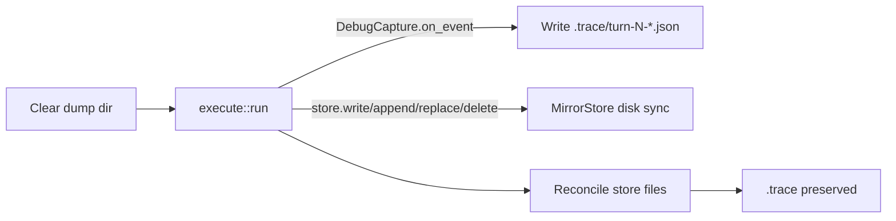

### 1. Immediate turn writes - `TraceCapture`

In [dump.rs](promptforge/crates/promptforge-dev/src/dump.rs):

- Drop the in-memory event buffer (or stop using it).
- In `on_event`, create `.trace/` if needed and write `turn-{n}-request.json` / `turn-{n}-response.json` with the same pretty JSON as today.
- Announce with `eprintln!("trace dump wrote ...")` (no `Write` sink available on the trait).
- `flush` becomes a no-op kept only if call sites still invoke it, or remove the call from `run.rs`.
- Other `DebugEvent` variants stay ignored.

### 2. Live store mirror - new `MirrorStore`

Still in `dump.rs`, implement `promptforge_core::store::Store` wrapping `MemStore`:

- Hold `dump_root: PathBuf`.
- After successful `write` / `append` / `str_replace`: read the new contents from the mem backend and write the safe relative path under `dump_root` (reuse `safe_relative_path`).
- After successful `delete`: remove the mirrored file if present.
- Reads / glob / read_lines pass through unchanged.
- Unsafe paths: skip disk mirror, `eprintln!("store dump skipped ...")` (same policy as today’s dump).
- Create parent dirs as needed; never touch `.trace/`.

Wire in [run.rs](promptforge/crates/promptforge-dev/src/run.rs):

```rust
let store = StoreRef::new(Box::new(dump::MirrorStore::new(dump_directory(prompt_path))));
```

instead of `StoreRef::memory()`.

### 3. End-of-run reconcile - change `dump_store`

Stop doing `remove_dir_all` at the end (that is what forced buffering).

New behavior:

- Enumerate in-memory store paths; overwrite each mirrored file (idempotent).
- Walk dump root (non-recursive for top-level + nested store paths): delete files that are not under `.trace/` and not present in the store (covers deleted store keys and stale names).
- If store is empty and dump has only `.trace/` (or is empty), leave `.trace/`; if dump has nothing at all, remove the dump directory (preserve today’s “empty store → no dump” for store-only cases; traces may still exist after a tool-only run with no `store.write`).
- Start-of-run clear in `run_once_with` stays as the sole full wipe.

Remove the post-run `capture.flush(...)` call once write-through is live.

### 4. Docs and tests

- Update [design.md](promptforge/crates/promptforge-dev/design.md) item on store/traces: write-through as events arrive; start clears; end reconciles without wiping `.trace/`.
- Rewrite dump tests:
  - `on_event` creates turn files before any flush.
  - Reconcile does not delete existing `.trace/` files.
  - `MirrorStore` write appears on disk immediately; delete removes the file.
  - Empty-store / second-run / partial-failure run tests in [run.rs](promptforge/crates/promptforge-dev/src/run.rs) still pass under write-through (start clear + reconcile).

## Out of scope

- Concurrent fanout / gateway `--parallel`
- Core `Observer` / `DebugCapture` API changes
- Streaming tokens inside a single turn (still one JSON file per completed request/response)
- MCP / CLI hosts (they do not own this dump path)

Todos:

- Write TraceCapture turn JSON in on_event; drop buffer/flush dependency
- Add MirrorStore and wire StoreRef in run_once_with
- Change dump_store to reconcile without wiping .trace
- Update dump/run tests and promptforge-dev design.md

### Fanout and gateway concurrency

*Wire local llama `--parallel` to gateway lane concurrency, set Gemma's lane to 2, and run fanout arms concurrently in core so briefer topics overlap under gateway admission.*

# Gateway + core concurrency

Default for Gemma: **lane concurrency = 2** (safer VRAM than 4 with 27B / 65K). Raise the lane number later without further code changes.

## Architecture

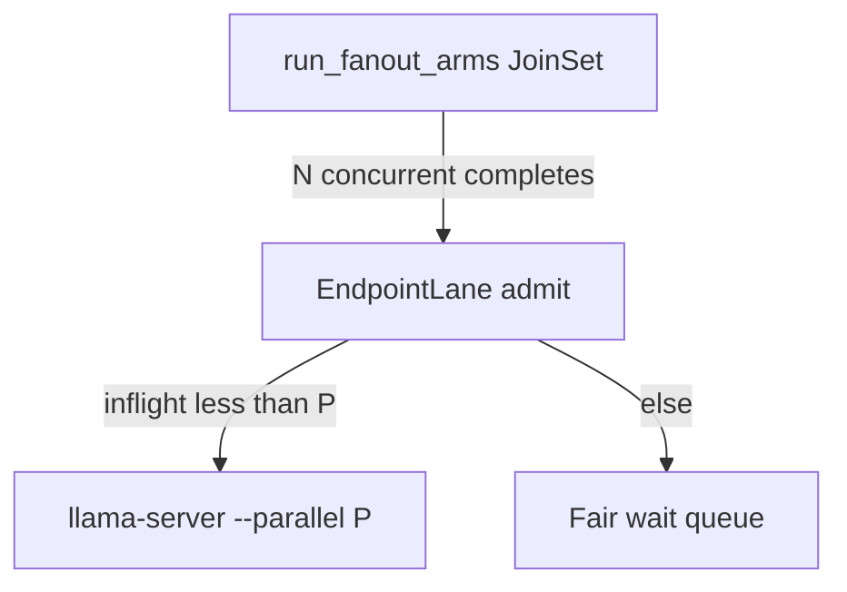

Core fires all arms at once. Gateway admits up to `P`. Llama serves `P` slots. Extra arms wait in the existing fair queue.

## 1. Gateway: sync `--parallel` with lane concurrency

Today [`local_model_concurrency`](promptforge/crates/promptforge-gateway/src/config.rs) already resolves device/lane (default 1) into `EndpointLane`, but [`server_args`](promptforge/crates/promptforge-gateway/src/local/server.rs) hardcodes `--parallel 1`.

Changes:
- Add `parallel: u32` to `LaunchOptions` (same crate file).
- In [`LocalRuntime::start`](promptforge/crates/promptforge-gateway/src/local/mod.rs) / `launch_options`, set `parallel` from the resolved `local_model_concurrency` value (cast, must be >= 1).
- Emit that value in `server_args` instead of `"1"`.
- Update `launch_args_match_local_model_defaults` to expect the configured parallel (keep a unit test that default-no-lane still emits `--parallel 1`).
- Document in [`design-gateway.md`](promptforge/crates/promptforge-gateway/design-gateway.md): local lane concurrency is both the admit limit and llama `--parallel`; one knob.

No new TOML field on `[[local_model]]`. Authors set `[[device.lane]].concurrency`.

## 2. Gemma profile: concurrency 2

Workspace files outside the crate (already used for local Gemma):

- [common.toml](c:\Users\Vinnie\src\cursor\common.toml): add

```toml
[[device]]
id = "local-gpu"
type = "local"

[[device.lane]]
device = "local-gpu"
id = "generative"
concurrency = 2
```

- [gemma.toml](c:\Users\Vinnie\src\cursor\gemma.toml): on `[[local_model]]` add `device = "local-gpu"` and `lane = "generative"`.

Requires gateway restart to respawn llama with `--parallel 2`. Note: llama splits the configured context across slots (~32K each at 65536/2).

Also bump the generative lane in [profiles/analytical.toml](promptforge/profiles/analytical.toml) only if you want the example to match; leave at 1 there so the shipped example stays the conservative default (workspace gemma is the live knob).

## 3. Core: concurrent fanout arms

[`run_fanout_arms`](promptforge/crates/promptforge-core/src/fanout.rs) is a sequential `for` loop. Replace with concurrent tasks:

- Extract one-arm body into `async fn run_one_arm(...) -> Result<String>` (same lifecycle as today).
- Spawn every arm on a `tokio::task::JoinSet` (still inside the existing `block_in_place` + `block_on` bridge from [`make_fanout_callback`](promptforge/crates/promptforge-core/src/execute.rs)).
- Clone per task: `StoreRef`, `Option<GatewayClient>`, string args, bindings/`Arc` as needed. Observer and `DebugCapture` are already `Send + Sync` behind `&dyn`.
- Replace shared `mut turns: u32` with `AtomicU32` (fetch_add) so debug turn indices stay unique under races.
- Collect replies into `Vec` indexed by arm order; return that ordered table to Lua (contract unchanged).
- Fail-fast: on first arm error, `abort_all()` remaining tasks and propagate that error (same invoker-visible behavior as sequential fail-fast).
- Store semantics: shared `StoreRef` stays mutex-safe; authors must not assume arm N sees arm N-1 writes. Briefer is fine (reduce writes in Main). Update the store-writes fixture comment if it implied ordering beyond persistence.

## 4. Design contract updates

- [design-core.md](promptforge/crates/promptforge-core/design-core.md): fanout arms run concurrently; replies stay ordered; fail-fast aborts siblings; remove “parallel … fanout” from the non-goals list; keep nested fanout as a non-goal.
- Module docs in `fanout.rs` and the fanout blurb in [README.md](promptforge/README.md) / [STATUS.md](promptforge/STATUS.md): sequential → concurrent.
- Gateway design note as above.

## 5. Tests

**Gateway**
- Unit: launch args include `--parallel` equal to resolved lane concurrency (1 without device/lane; N with lane).
- Existing queue IT at concurrency 1 stays; add or extend a case that concurrency 2 allows two in-flight admits when the fake upstream blocks (if an IT harness already covers this pattern in `tests/it/main.rs`).

**Core**
- Keep ordered-reply fixtures (`fanout-basic`, `fanout-epilog`).
- Keep fail-fast fixture (`fanout-arm-failure`); assert error still propagates (may complete fewer sibling observes).
- Add a unit/integration test that two preamble-only arms both run (e.g. each writes a distinct store path) and both files exist - proves overlap readiness without a real model.
- No live Gemma test in CI.

## Out of scope

- Nested fanout
- Cap inside fanout separate from gateway (gateway queue is the throttle)
- Streaming progress / ordered observer frames
- Changing remote endpoint concurrency behavior
- Auto-tuning P from VRAM

## Verify locally after merge

1. Restart gateway on updated `gemma.toml`.
2. Confirm llama args / logs show `--parallel 2`.
3. Run briefer; stderr should interleave multiple `Web Search: Fanout arm started` before the first arm finishes.

Todos:

- Plumb LaunchOptions.parallel from local_model_concurrency; update server_args + tests + design-gateway
- Add local-gpu generative lane concurrency=2 in common.toml/gemma.toml
- Concurrent JoinSet fanout arms, AtomicU32 turns, fail-fast abort, ordered replies
- Update design-core/README/STATUS; adjust and add fanout/gateway tests

### Briefer evidence thickening

*Prompt- and context-engineer promptforge/briefer.md for thick, clean evidence.md on local Qwen: cut Report until evidence is thick, beat the current Qwen baseline using Opus structure plus subagent web research, log every experiment in gitignored research.md, then Boost and Bloomberg with a 3-round no-improvement stop per subject.*

# Briefer evidence thickening

## Understanding (locked)

- Deliverable is thick, clean `evidence.md` from [`promptforge/briefer.md`](promptforge/briefer.md) on **local Qwen**.
- Gold shape / density reference: Opus packet [`cabinet/_scratch/2026-08-08-briefer-cpp-alliance/2026-08-08-briefer-cpp-alliance-evidence.md`](cabinet/_scratch/2026-08-08-briefer-cpp-alliance/2026-08-08-briefer-cpp-alliance-evidence.md) (Subject Profile fields, Domain Primer, Domain Landscape, Public Record, Vulnerabilities, Source Log).
- Staged beauty: (1) match best current local-Qwen evidence quality (clean, structured, no fence garbage / wrong-entity disasters); (2) surpass that baseline with more detail via prompt + context engineering informed by my own deeper web research.
- Cut **Report** (and Epilog model turn if it still burns latency) until evidence is thick; restore Report only after Stage 2 is sticky on C++ Alliance.
- Log every change and verdict in gitignored [`cabinet/_research/2026-08-08-briefer-evidence-tuning.md`](cabinet/_research/2026-08-08-briefer-evidence-tuning.md) (user-facing name: research notes; not committed).
- Subjects in order: **C++ Alliance** → **Boost C++ Library Collection** → **Bloomberg**. Per subject: iterate facets + whole until **3 consecutive rounds with no meaningful improvement**, then advance. Global stop when all three subjects are exhausted under that rule.

## Baseline and scoring

Capture once before edits (or use latest [`promptforge/briefer.store/evidence.md`](promptforge/briefer.store/evidence.md) if fresh):

Score each run 0-2 per facet against Opus shape (Alliance) or against subagent-sourced truth packs (Boost/Bloomberg):

- Structure (section headers, no nested fences, concatenable arms)
- Profile density (legal name, status, people, dates)
- Primer / landscape (peers, market structure, deps)
- Public record (filings, press, controversy)
- Vulnerabilities (sourced, on-entity)
- Source hygiene (fetch-backed quotes/URLs; UNKNOWN when thin)
- Wrong-entity / hallucination rate (hard fail if present)

**Meaningful improvement** = higher total score, or same score with clearly thicker on-entity facts and no new hard fails. Cosmetic-only diffs do not count. Rollback any change that lowers score or adds hard fails.

## Prompt engineering direction (concrete)

Edit only [`promptforge/briefer.md`](promptforge/briefer.md) unless a tiny harness bug blocks iteration.

1. **Speed cut:** Comment out or stub `## Report` (and keep Epilog as pure ` ```lua ` return). Main ends after `store.write("evidence.md", ...)`.
2. **Output contract:** Force each arm to emit a fixed heading matching Opus sections (or a mapped topic→section table). Ban wrapping the whole reply in markdown fences. Ban process commentary.
3. **Topic list:** Retarget Topics to Opus facets (profile, founder/personnel, mission, structure/scale, domain primer, sector/peers, public record/finance, disaster exposure, vulnerabilities) so concat yields one coherent packet, not ten marketing blurbs.
4. **Search/fetch depth:** Prefer 2-4 fetches on high-signal URLs (org site, ProPublica/Cause IQ, bylaws/PDF, mailing-list transparency). Seed query patterns in the arm prompt (EIN, 990-PF, fiscal sponsor, etc.) without hardcoding subject-specific answers.
5. **Anti-hallucination:** Keep fetch-only claims; require entity-name check before disaster/vulnerability claims; UNKNOWN over invention.
6. **Fanout / turns:** Increase topic fanout or `max_tool_iterations` only when research notes show missing facets; if slower/worse, roll back.

## Experiment loop (per subject)

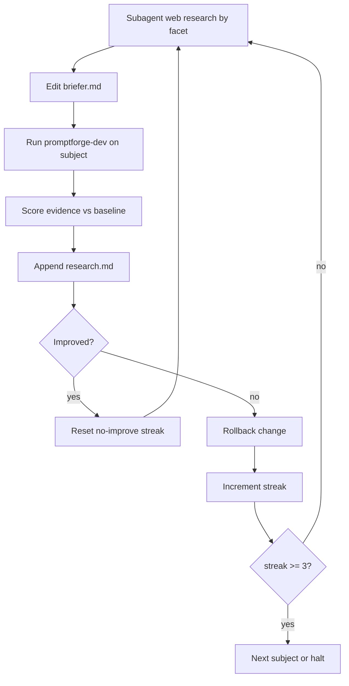

- **Subagents:** For each facet, search/fetch what is publicly knowable; write findings into the research log and into prompt query/URL hints (not into fabricated evidence).
- **Runs:** Gateway on `qwen.toml`; `cargo run -p promptforge-dev -- briefer.md "<subject>"`. Archive each round's evidence under `cabinet/_scratch/briefer-evidence-rounds/` (gitignored via cabinet).
- **C++ Alliance Stage 1:** Fix fences, wrong-entity disasters, thin profile until score ≥ current Qwen best and structure matches Opus outline.
- **C++ Alliance Stage 2:** Thicken using Opus source log as a treasure map (ProPublica EIN 82-2439331, bylaws PDF, transparency reports, fiscal sponsor vote). Stop after 3 no-improve rounds.
- **Restore Report** once Alliance evidence is thick; one smoke run that report does not invent beyond packet.
- **Boost, then Bloomberg:** Same loop; build truth packs via subagents first (no Opus gold file).

## research.md format (append-only)

For each round:

- subject, round id, timestamp, model
- prompt/context diff summary (what changed)
- score table + hard fails
- keep / rollback decision and why
- facet notes (what web research found that the run missed)

## Stop conditions

- Per subject: 3 consecutive no-improve rounds → next subject.
- Global: after Bloomberg's streak completes with no further meaningful gains available under the same rule → stop and review research.md with you.


Todos:

- Stub Report/Epilog for evidence-only speed; fix lua fence if needed
- Capture Qwen baseline evidence + scoring rubric; create research.md
- C++ Alliance: clean structure to match/exceed current Qwen baseline
- C++ Alliance: thicken via research-informed prompt until 3 no-improve rounds
- Restore Report section; smoke that it stays packet-bound
- Boost subject: truth-pack subagents + iterate to 3 no-improve
- Bloomberg subject: truth-pack subagents + iterate to 3 no-improve

### Supervise local llama-server

*Fix the zombie-gateway failure mode: when llama-server exits after readiness, the next chat request respawns it on the same port and identity instead of returning a permanent 502. Crash prevention (FA/parallel) stays operator config, not this change.*

# Supervise local llama-server after death

## Problem

[`LocalRuntime::start`](promptforge/crates/promptforge-gateway/src/local/mod.rs) spawns `llama-server`, waits for readiness, then never watches the child. After exit, gateway `/health` and `/v1/models` still look fine; chat fails with `502 upstream_transport`. Design note that "endpoint health" is unbuilt means multi-endpoint failover, not "ignore a dead local child forever."

## Approach (locked)

**Lazy ensure-alive on send**, not a background watchdog.

- Introduce a local-only upstream that owns the child lifecycle.
- On each `send`, if the child is dead (or the first POST gets a connect failure and `try_wait` shows exit), respawn **once** with the **same port, `--alias`, and `--api-key`**, then retry the request once.
- Keep catalog `Model.upstream_name` and `OpenAiUpstream`-shaped URLs stable so routing/`Arc<Model>` need not be rewritten mid-flight.
- Cap respawn storms: if respawn readiness fails, return `UpstreamTransport` (same as today). Optional short cooldown (e.g. do not respawn more than once per few seconds) to avoid spin on hard GPU faults.

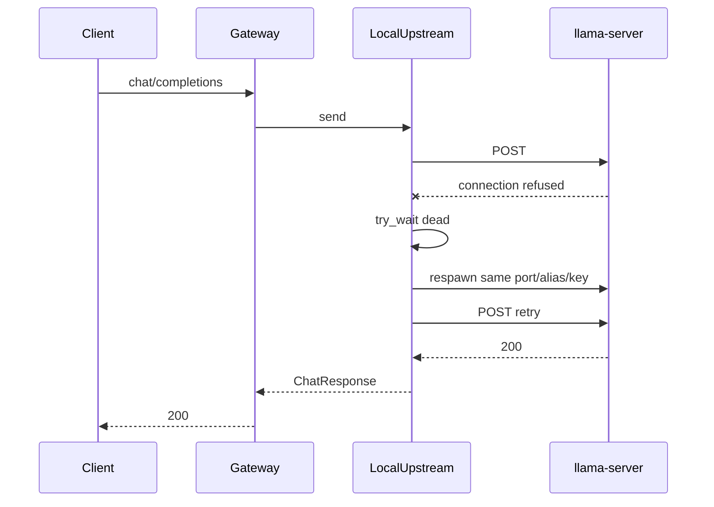

## Code changes

1. **[`server.rs`](promptforge/crates/promptforge-gateway/src/local/server.rs)**  
   - Factor a respawn entry that reuses a fixed `(port, alias, api_key)` instead of always calling `random_identity` + `free_port` (keep random free-port path for first start).  
   - Expose `try_wait` / `is_alive` on the guard (or split "recipe" from "running child" so Drop still kills the current child).

2. **New `LocalUpstream` in [`local/`](promptforge/crates/promptforge-gateway/src/local/)** (or `upstream.rs` if cleaner)  
   - Holds: executable path, model path, `LaunchOptions`, fixed identity + port, `Mutex` around the live `Child`/guard guts, shared `reqwest::Client`.  
   - Implements `Upstream::send`: ensure child alive → POST like [`OpenAiUpstream`](promptforge/crates/promptforge-gateway/src/upstream.rs) using live `base_url` + key → on transport error, if dead, respawn once and retry once.

3. **[`LocalRuntime::start`](promptforge/crates/promptforge-gateway/src/local/mod.rs)**  
   - Wire `endpoint.upstream = Arc::new(LocalUpstream::...)` instead of bare `OpenAiUpstream`.  
   - Runtime still owns whatever is needed so Drop tears down children (either keep guards, or move ownership fully into `LocalUpstream` and drop empty `guards` / replace with `Vec<Arc<LocalUpstream>>`).

4. **Docs**  
   - Update [`design-gateway.md`](promptforge/crates/promptforge-gateway/design-gateway.md): local child supervision on send is in scope; multi-endpoint health selection remains unbuilt.  
   - Log `tracing::warn!` on detected death + successful/failed respawn.

5. **Tests**  
   - Unit test with the existing spawn test seam: child exits after ready → next `send` path calls spawn again with same port/alias (assert spawn count / args).  
   - Keep existing Drop-kills-child test green.

## Out of scope

- Preventing Vulkan/OOM crashes (operator: lower `--parallel`, try `flash_attention = false`).  
- Background watchdog threads.  
- Changing public `/health` semantics (still process liveness); optional later: `admin/status` child-alive flag.  
- Gemma/Qwen profile retunes.


Todos:

- Add LocalUpstream with mutexed child + same-port respawn + one send retry
- Wire LocalRuntime::start to LocalUpstream; keep Drop cleanup
- Unit test respawn-on-death; update design-gateway.md

### Try Qwen 27B

*Add a local gateway profile for unsloth Qwen3.5-27B Q4_K_M, restart the gateway on it (first start downloads ~16.7 GB), smoke `/v1/models` + chat, then run briefer on one known subject to compare evidence quality against the 9B baseline.*

# Try local Qwen3.5-27B

## Profile

Create [`qwen27.toml`](c:\Users\Vinnie\src\cursor\qwen27.toml) next to [`qwen.toml`](c:\Users\Vinnie\src\cursor\qwen.toml) / [`gemma.toml`](c:\Users\Vinnie\src\cursor\gemma.toml). Leave the 9B profile untouched.

Pinned artifact (HF tree API, same pin style as 9B research):

- Repo: `unsloth/Qwen3.5-27B-GGUF`
- File: `Qwen3.5-27B-Q4_K_M.gguf` (~16.7 GB)
- URL: `https://huggingface.co/unsloth/Qwen3.5-27B-GGUF/resolve/main/Qwen3.5-27B-Q4_K_M.gguf`
- SHA-256 (`lfs.oid`): `84b5f7f112156d63836a01a69dc3f11a6ba63b10a23b8ca7a7efaf52d5a2d806`

Knobs (locked for first try):

- `name = "qwen-27b"`
- Same `description` as 9B / briefer `models.always` so semantic bind still hits
- `context = 32768` (matches [`briefer.md`](promptforge/briefer.md) `{ context = 32768 }`)
- `concurrency = 2` on lane `generative` (same slot budget as current 9B; ~16k tokens/slot)
- `thinking = "never"`, `gpu_layers = 99`, `flash_attention = true`, `cache_type_k/v` same as 9B
- `include = ["common.toml"]`

If VRAM OOMs or Vulkan kills the child after ready, the new on-send respawn will retry once; operator fallback is `concurrency = 1` or `flash_attention = false` (out of scope unless it fails).

## Bring-up

1. Stop any gateway still on `qwen.toml` / `gemma.toml`.
2. Start from workspace root (profiles live outside the crate):

```bash
cargo run -p promptforge-gateway -- serve ../qwen27.toml
```

(or absolute path to `qwen27.toml`). First boot provisions the GGUF into `~/.promptforge` and may take several minutes.

3. Smoke:
   - `GET /health`
   - authenticated `GET /v1/models` shows `qwen-27b` with expected context / dialect
   - one short `POST /v1/chat/completions`

## Briefer trial

With `PROMPTFORGE_GATEWAY_URL` / `PROMPTFORGE_GATEWAY_KEY` set, run briefer once on a subject already exercised on 9B (e.g. `Bloomberg L.P.` or `Boost C++ Libraries`) via `promptforge-dev`, write store under `briefer.store/`, and note evidence thickness vs the 9B archives under `cabinet/_scratch/briefer-evidence-rounds/`.

Append a short dated note to [`cabinet/_research/2026-08-08-briefer-evidence-tuning.md`](cabinet/_research/2026-08-08-briefer-evidence-tuning.md) with: profile path, digest, smoke result, and qualitative evidence delta (no prompt changes unless 27B exposes a clear bind/context failure).

## Out of scope

- Replacing or deleting `qwen.toml`
- Prompt rewrites in `briefer.md`
- Side-by-side dual-model gateway (one profile at a time)
- Pushing commits unless you ask


Todos:

- Create qwen27.toml with unsloth Qwen3.5-27B-Q4_K_M pin + concurrency 2 / 32k
- Restart gateway on qwen27.toml; smoke health, models, short chat
- Run briefer once on a known subject; note evidence vs 9B; append tuning research note

### Store real plus virtual

*Replace the memory-only / write-through-mirror store model with a layered OverlayStore so Lua can read real confined files and virtual run files through the same store API at once, without turning the CLI into a surprise disk writer.*

# Overlay store: real files + virtual files together

## Diagnosis (why today fails)

- Core only ships [`MemStore`](promptforge/crates/promptforge-core/src/store.rs). Logical paths live in one `BTreeMap`.
- [`promptforge-dev` `MirrorStore`](promptforge/crates/promptforge-dev/src/dump.rs) wraps memory and **mirrors writes to** `<stem>.store/`. **Reads always hit memory.** Disk is an author dump, not a peer namespace.
- Dev **wipes** `<stem>.store/` at run start, so leftover real files cannot seed the next run.
- CLI/MCP construct `StoreRef::memory()` and promise no unsolicited disk I/O ([`design-cli.md` §12](promptforge/crates/promptforge-cli/design-cli.md)).

So "real + virtual at the same time" is not a missing flag. Memory is sole authority; disk is a one-way side effect.

## Chosen approach: OverlayStore (single `store.*` API)

Keep one Lua surface (`store.read` / `write` / `inject` / `glob` / …). Implement a layered backend:

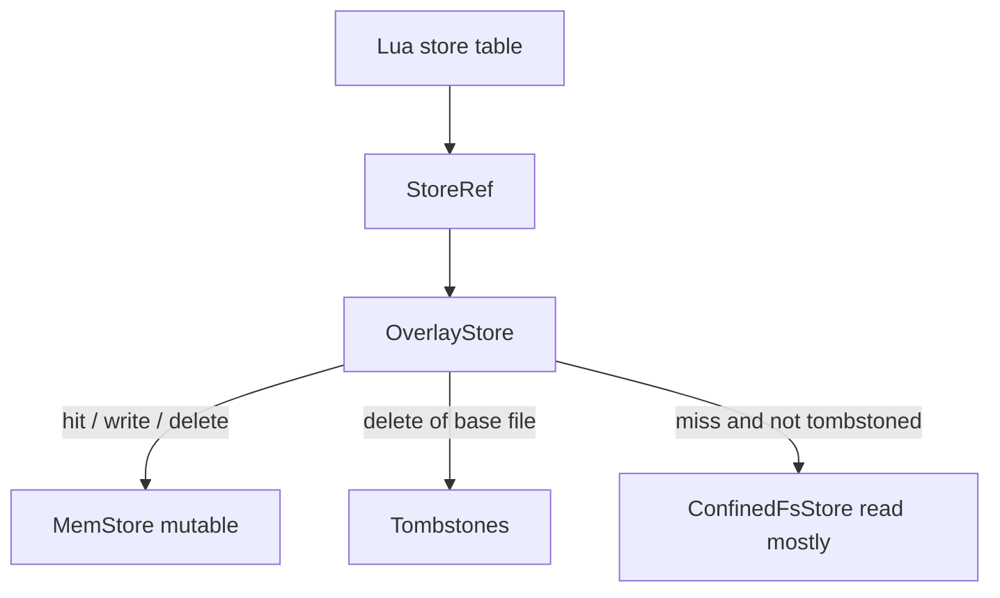

**Read path:** if path is tombstoned → `NotFound`; else if present in mem → mem; else → confined filesystem root.

**Write / append / str_replace:** always land in mem (copy-on-write if the only copy was on disk: read base, then mutate in mem).

**Delete:** remove from mem; if a base file existed, add a tombstone so later reads do not resurrect it from disk.

**Glob:** union of mem paths and confined fs paths, minus tombstones (deterministic order, same as today's `BTreeMap` feel).

**Confinement (hard):** all fs access goes through a root + `safe_relative_path` style rules already used in `dump.rs` (reject `..`, absolute, Windows-reserved). No new `url`/`psl` crate. Fail closed with a new `StoreError` variant (e.g. `PathRejected`) - trait/`StoreError` are already `#[non_exhaustive]`.

**Hosts:**

| Host | Construction |
|---|---|
| CLI / MCP (default) | Unchanged: `MemStore` only (no mount) - preserves "writes nothing to disk" |
| `promptforge-dev` | `OverlayStore { mem, mount = <stem>.store/, tombstones }` **without wiping mount contents that the author placed for input**; stop treating the dump dir as ephemeral-only. Write-through mirror of *mutations* can remain for inspection, or become end-of-run dump only - prefer keep live mirror for mutated keys so author still sees `evidence.md` appear. |
| Tests | Unit-test Overlay against a temp dir; existing MemStore tests stay green |

**Do not** seed the entire tree into memory at start (loses laziness and blows large trees). Overlay reads are lazy.

**Trust:** `store.inject` still wraps whatever `read` returns. Real file bytes are untrusted when injected into model context - same envelope as today. No silent trusted FS injection.

## What we explicitly reject

- Separate `fs.*` Lua table as the *only* solution (forces every prompt to know two worlds; can add later as sugar over the same overlay if needed).
- Making CLI mount `$PWD` by default (surprise reads/writes / path escape risk).
- Silent drop of context / dual competing authorities without tombstones (delete would not stick).

## Implementation slices (one commit each when executed)

1. **Core `OverlayStore` + `ConfinedFs` helpers + unit tests** in [`store.rs`](promptforge/crates/promptforge-core/src/store.rs) (or `store/overlay.rs` if file grows). COW on first mutate of a base-only file; tombstones; glob union.
2. **`StoreError::PathRejected`** (and docs) for confinement failures; Lua maps to existing Lua error style.
3. **`promptforge-dev`**: replace pure wipe+`MirrorStore` with overlay mount on `<stem>.store/`; redefine start policy as "clear only prior run outputs we own" or "never wipe paths that exist before run" - concrete rule: **do not delete the dump root wholesale**; only reconcile orphans for keys that were virtual-only last run if needed. Update [`dump.rs`](promptforge/crates/promptforge-dev/src/dump.rs) / [`run.rs`](promptforge/crates/promptforge-dev/src/run.rs) + design.md §5.
4. **Design/docs:** [`design-core.md`](promptforge/crates/promptforge-core/design-core.md) store bullet; README store triad; [`STATUS.md`](promptforge/STATUS.md); CLI design note that durable mount is host-supplied Overlay, not default CLI.
5. **Fixture prompt** under core-tests or dev tests: pre-seed a real file on disk, `store.read` it, `store.write` a virtual sibling, `store.inject` both shapes - proves simultaneous availability.

## Success criteria

- In one `promptforge-dev` run, Lua can `store.read("seed.md")` for a file that existed only on disk under the mount, and `store.write("virtual.md", …)` for a pure virtual file, and both appear in `store.glob("*")`.
- CLI default behavior unchanged (memory-only, no disk).
- Delete of a mounted file makes subsequent `read` fail for that run (tombstone), without necessarily unlinking the real file unless we explicitly add an opt-in `persist_delete` later (default: **tombstone only**, real file remains on disk after process exit - document that).

## Default recorded for persist_delete

**Tombstone-only deletes** for mounted files. Physical unlink is a later host opt-in. That keeps the CLI/dev safety story: a prompt cannot destroy author inputs by calling `store.delete` unless a future flag says so.


Todos:

- Add OverlayStore + confined FS helpers + unit tests in promptforge-core
- Add StoreError::PathRejected and Lua error mapping
- Wire promptforge-dev to OverlayStore mount; stop wipe-all; keep mutation mirror
- Update design-core, design-dev, README/STATUS store model
- Add real+virtual simultaneous read/write fixture test

### H1 once no replay

*Postmortem: preamble infer vs replay was discussed but never made a plan step, so execution left per-section H1 replay in place. Fix by running H1 exactly once as a live preamble (with args/store/infer) and stopping shared-bytecode re-execution in every section VM.*

# H1 preamble: run once, no per-section replay

## What happened

You are right. The contradiction was in the conversation and then dropped.

1. You asked for preamble inference ([transcript](b8440861-d85a-4986-b36c-db83d1478b25): args parsing / tool control in H1).
2. An early plan draft said both: `model:infer` **callable from preamble** and H1 **runs once; state replayed into every section VM** - incompatible if infer has side effects.
3. Lifecycle explanation still listed "Shared program replay" as step 1 of every section VM.
4. The final plan ([store_real_plus_virtual_60d3893b.plan.md](C:/Users/Vinnie/.cursor/plans/store_real_plus_virtual_60d3893b.plan.md)) never got a step for "eliminate H1 replay" or "live preamble once." Out of scope stayed OverlayStore / phase-machine removal; replay was silently kept as baseline.
5. Execution followed that plan literally. Result: [SectionVm::new_with_shared_bindings](promptforge-first-class-objects/crates/promptforge-core/src/lua.rs) still re-runs shared bytecode every section; `model:infer` is explicitly **not** available outside section execution (`lua_models.rs`).

So the insight was real; it was never written as a todo. That is the failure.

## Why replay cannot survive preamble infer

```text
bind: run H1 (declarations)     -- once
section 1: replay H1            -- again
section 2: replay H1            -- again
fanout arm: replay H1           -- again
```

If H1 calls `writer:infer(...)` or writes store based on that, replay multiplies cost and corrupts state. Replay only made sense when H1 was pure declarations.

Today H1 also runs **before** `args` / `sys` / `store` injection, so preamble infer cannot work even if you bolted the hook on - host values are intentionally absent. Live preamble must get host injection and run once.

## Target model

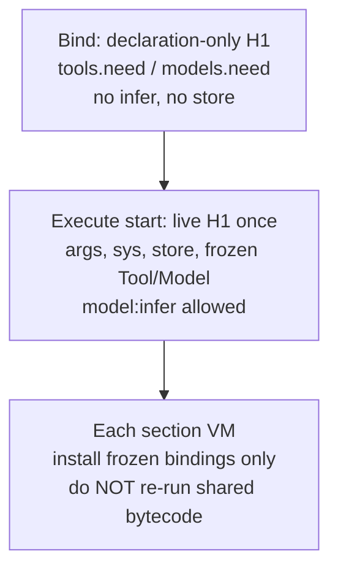

**Recorded decisions**

| Decision | Choice |
|---|---|
| Per-section shared re-execution | Removed |
| Bind pass | Stays declaration-only (picker / freeze bindings). `model:infer` hard-errors if called here |
| Live preamble | Exactly once at `execute::run` start, with host inject + infer hook |
| Section VMs | `install_replay_tools` / `install_replay_models` only; no `run_loaded_with_log(shared)` |
| H1-defined Lua functions in section VMs | Not available after this change (no replay). Shared helpers go in section Lua or later prompt-env inheritance (out of scope here). Shipped prompts do not define H1 functions |
| Fanout / execute() subroutines | Same: frozen bindings only, no shared re-run |

Worktree: [promptforge-first-class-objects](C:/Users/Vinnie/src/cursor/promptforge-first-class-objects) on `first-class-objects`.

## Steps

### step-1 - Stop per-section shared re-execution

In `SectionVm::new_with_shared_bindings` ([lua.rs](promptforge-first-class-objects/crates/promptforge-core/src/lua.rs) ~1199-1270): keep harden + `install_replay_tools` / `install_replay_models` + `finish_replay` / `finish_model_replay`; **delete** the `run_loaded_with_log(shared, ...)` path and the "must not return a value" check tied to that run.

Update observers: no `LUA_SHARED_LOAD_*` / per-section `TOOL_REPLAY_STARTED` driven by re-executing author code (keep whatever finish_* still needs for declaration index checks, or simplify finish to "bindings already complete").

**Test:** existing multi-section prompt still runs; add assertion that a counter/`store` side effect in H1 (once live exists) is not multiplied - for this step alone, a unit test that `new_with_shared_bindings` does not execute shared source (e.g. shared program that would error if run).

### step-2 - Live preamble once at execute start

In [execute.rs](promptforge-first-class-objects/crates/promptforge-core/src/execute.rs) before the section loop:

1. If `prompt.shared` is `Some`, create one preamble VM with frozen bindings.
2. `inject_host` with `args`, sealed `sys`, `store`, empty `reply`.
3. Install `ModelInferHook` (same Arc context as sections).
4. Run shared program **once**.
5. Scalar return from live H1 ends the run (same early-exit rule as a section).
6. Tear down preamble VM; proceed to sections with frozen bindings only.

Bind path unchanged for discovery. Live H1 uses replay-style `tools.need` / `models.need` that return Tool/Model objects from frozen maps (so `local w = models.always(...); w:infer(...)` works).

**Test:** `cargo test -p promptforge-core live_preamble_infer_runs_once` - two H2 sections, H1 calls `infer` (mock gateway); gateway sees exactly one completion; both sections still execute.

### step-3 - Docs + STATUS

Update [design-core.md](promptforge-first-class-objects/crates/promptforge-core/design-core.md), [user-guide.md](promptforge-first-class-objects/user-guide.md), [STATUS.md](promptforge-first-class-objects/STATUS.md):

- H1 preamble runs once (declaration bind + one live pass at execute)
- Not replayed into section VMs
- `model:infer` legal in live preamble
- H1 helpers are not copied into section VMs

Do not touch `design-core-orig.md`.

### step-4 - Verify

`cargo fmt --all --check && cargo clippy -p promptforge-core --all-targets --all-features -- -D warnings && cargo test -p promptforge-core && cargo test -p promptforge-core-tests`

## Out of scope (this plan)

- Prompt-environment inheritance so H1 functions appear in section VMs without re-execution (separate plan)
- Removing the section phase machine
- OverlayStore

## Orchestration

Same vibe loop as before: coder -> commit -> review-and-fix -> amend -> Verify after step-2 and step-4. Scratch: `cabinet/_scratch/first-class-objects/`.


Todos:

- Stop per-section shared bytecode re-execution in SectionVm::new_with_shared_bindings
- Run live H1 once at execute start with host inject + model:infer; test runs-once
- Update design-core, user-guide, STATUS for once-only preamble
- Full fmt/clippy/core/core-tests Verify

### File-backed store

*Add a FileStore backend to promptforge-core that persists the virtual store as flat files in a caller-provided directory, enabling post-run inspection and cross-run resume via store.exists.*

# File-backed store for pipeline debugging and resume

## Target

A `FileStore` that implements the existing `Store` trait, backed by a real directory. The caller provides the path explicitly - no defaults, no derivation. The prompt engine remains a pure executor.

## What exists

- `Store` trait with 8 methods: `write`, `append`, `read_lines`, `read`, `str_replace`, `delete`, `glob`, `exists`
- `StoreRef` wraps any `Box<dyn Store + Send>` behind `Arc<Mutex<...>>`
- `StoreRef::new(backend)` already accepts custom backends
- `StorePath::parse` validates logical paths (rejects traversal, control chars, device names)
- Dev runner's `dump/paths.rs` has `safe_relative_path` mapping logical paths to FS-safe relative paths
- All three callers (CLI, dev, MCP) currently use `StoreRef::memory()`

## Design

### FileStore

A new struct in `promptforge-core/src/store/`:

```rust
pub struct FileStore {
    root: PathBuf,
}
```

Implements `Store`. Each method maps the already-validated logical path to a filesystem path under `root` using the same confinement rules the dev dump already enforces (reuse or inline the `safe_relative_path` logic). Operations are synchronous filesystem I/O - acceptable because `StoreRef` is already behind a mutex and store ops are not on the hot path.

Methods map directly:
- `write` -> create parent dirs + `fs::write`
- `append` -> create parent dirs + `OpenOptions::append`
- `read` -> `fs::read_to_string`; missing file -> `StoreError`
- `read_lines` -> read + number lines (same format as MemStore)
- `str_replace` -> read + single replace + write back
- `delete` -> `fs::remove_file`; missing -> `StoreError`
- `glob` -> walk `root` with pattern matching (reuse existing glob logic from MemStore, adapted to fs)
- `exists` -> `Path::exists` (returns `Ok(false)` for missing, not error)

### Constructor

```rust
impl FileStore {
    pub fn new(root: impl Into<PathBuf>) -> std::io::Result<Self>
}
```

Creates the root directory if it does not exist (`create_dir_all`). Returns `io::Error` if creation fails. No other implicit behavior.

### StoreRef integration

Callers construct with: `StoreRef::new(Box::new(FileStore::new(path)?))`

No new constructor on `StoreRef`. No convenience method. The caller does the plumbing explicitly.

### Caller changes

Each caller decides its own policy:

- **Dev runner**: replace `StoreRef::memory()` with `FileStore::new(prompt_stem.store/)`. Remove the post-run dump reconcile (store is already on disk). The `dump/` module simplifies or dies.
- **CLI**: add a `--store <dir>` flag. Required for persistence; without it, use `StoreRef::memory()` (ephemeral, same as today). No default path.
- **MCP server**: use `StoreRef::memory()` by default (runs are independent). Add optional `[run].store_dir` config if needed later. Not in this plan.

### Path confinement

`FileStore` reuses the existing `StorePath::parse` validation (already rejects traversal, `..`, absolute paths, device names). Additionally, the FS mapping function (from dev dump's `safe_relative_path` or equivalent) ensures no escape from `root`. A logical path that fails the FS safety check returns `StoreError` rather than silently skipping.

### No new behavior in the engine

`execute::run` receives a `&StoreRef`. It does not know or care whether the backend is memory or files. The `Store` trait contract is unchanged. Resume logic (`store.exists` then skip) is prompt-author code in Lua, not engine behavior.

## Steps

1. Add `FileStore` struct and `Store` impl in `crates/promptforge-core/src/store/file.rs`. Unit tests covering all 8 methods plus confinement rejection.
2. Wire dev runner to use `FileStore` instead of memory + post-run dump. Remove or simplify the dump reconcile.
3. Add `--store <dir>` to CLI. Memory when absent.
4. Verify: fmt, clippy, all tests.

After implementation is complete, generate the design document: spawn one subagent whose entire prompt is - read this plan at its path, grep for `<design-doc>`, and follow the block inside it.

<design-doc>
OUTPUT A DESIGN DOCUMENT, NOT CODE. Write one markdown file, design-file-store.md,
that explains the design of what this plan describes. You run as the final step
of the plan, after the implementation is complete, so describe the design as
built, reconciling against the finished work any decision the implementation
changed from what this plan first recorded.

NO IMPLEMENTATION CODE - no function bodies, no private machinery, no
step-by-step algorithm walkthroughs. You MAY include any normative artifact the
design needs to remove ambiguity: public signatures, schemas, state or
transition tables, wire formats, configuration syntax, sequence diagrams, and
pseudocode. Each such artifact must express a design contract, not an
implementation technique; include one only where prose cannot say the same
thing as precisely, and show the artifact alone, not the surrounding machinery.

FOR EVERY DESIGN ELEMENT, STATE THREE THINGS: what is observed (by the user or
by an external consumer), how it is structured, and WHY - the motivation, the
rationale, the principle. For a costly-to-reverse element, "why" must include
what reversing it later would cost.

DESIGN-ELEMENT TEST - include something only if changing it would change ANY of:
  (a) ANYTHING THE USER SEES, READS, WRITES, TYPES, OR NAMES. For a library the
      user is the caller, so this is the PUBLIC API - its operations and their
      contracts (ownership, lifetime, thread-safety, error and complexity
      guarantees). It also includes every config file or frontmatter the user
      edits, and - critically - the NAMES of everything the user sees. A name
      is a design decision: `goto` is a good one, `clear_and_transfer_control`
      is a bad one. Naming is design.
  (b) the shape or structure of the system.
  (c) something costly or hard to reverse that the user never sees - the ABI,
      an on-disk or persisted format that outlives a version, a high-reach
      convention that touches everything, or a cross-cutting quality trade-off
      (security, failure modes, data lifecycle, performance).
If it is none of these - merely how you implement the design behind those
surfaces, such as a private helper type, an internal algorithm choice, a
dependency version pin, or a serialization used only between your own
components - it is implementation. Leave it out.

COMPRESS BEFORE WRITING - only if the design carries far more ditchable detail
than load-bearing decisions (roughly 10 to 1 or worse). If it is already lean,
skip this.

STRUCTURE - three fixed sections, then whatever the design earns:
  - A title stating what building this produces.
  - An executive summary that stands alone; a reader acts on it without the body.
  - A numbered list of the 10 to 15 key design choices, each a short paragraph.
Then: headings that state the point, not the topic. Keep rationale in prose.
State evidence before value words. Where a choice resolved a fork, name the
alternative and why it lost. Order by importance. Add no YAML frontmatter.
Close with one italic line naming the date and the model. Name no tool,
rulebook, or source document for the document's own rules or structure.

CHECK BEFORE FINISHING: no implementation code; every normative artifact
expresses a contract; every element states what, how, and why; headings state
points; the compression ratio is healthy; no source document is named.
</design-doc>


Todos:

- Add FileStore struct and Store impl with unit tests
- Wire dev runner to FileStore; remove post-run dump reconcile
- Add --store flag to CLI
- Final verification pass

## Design Documents Written

### c:\Users\Vinnie\src\cursor\promptforge\briefer.md

---
name: briefer
description: Generate a report on an entity analyzed through the lens of Great Founder Theory.
promptforge: 1
max_tool_iterations: 12
---

# Briefer

```lua
models.always("writer",
    "A careful analysis model suited to structured reasoning and long-context review",
    { thinking = false, temperature = 0, context = 65536 })
tools.need("search", "Search the web and return a list of results.")
tools.need("fetch", "Fetch a URL and return its main content as markdown.")
```

Evidence-only recon port of the Briefer Step 2 packet (Report restored later).

## Main

```lua
models.use("writer")

local results = fanout("### Web Search", "### Topics")

store.write("evidence.md", table.concat(results, "\n\n"))
return "Evidence complete."
```

### Web Search

```lua
models.use("writer")
tools.add("search", "fetch")
```

Subject: {{ args }}
Section: {{ item }}

You are writing ONE section of an evidence packet about the Subject for the Section named above.

Turn budget (HARD):
1. Turn 1: call `search` once with a sharp query that includes the Subject's exact name plus Section keywords. Do not write evidence yet.
2. Turn 2: call `fetch` on the 2-3 best URLs from that search (prefer official site, filings/registries, primary docs, reputable press). Prefer batching fetches in one turn when possible.
3. Turn 3: output the finished section markdown only. No more tools unless every fetch failed - then one recovery search is allowed, then write.

Rules:
- Search hits are leads, not facts. Write ONLY from fetched page bodies.
- Every factual claim needs a short verbatim quote from a fetch body and that page's URL in parentheses after the claim.
- Never invent names, titles, years, board members, legal status, EIN, addresses, CVE lists, quotes, or dates.
- If the fetch does not support a field, write `UNKNOWN` for that field. Prefer thin truth over a complete-looking dossier.
- Entity check (HARD): every claim must be about the Subject named above. If a page is about a different organization with a similar name, discard it and write UNKNOWN rather than using it.
- Output format (HARD): plain markdown only. Start with the exact heading line for this Section (given below). Do NOT wrap the section in triple-backtick fences. No preamble, no process commentary, no "here is the evidence".
- Scope: no morality, legality-as-verdict, product-quality, or "should it exist" judgments.

Section heading and fields to fill:

{{ item }}

Suggested query patterns (adapt to Subject; do not invent answers):
- official about / mission / leadership pages
- "Subject" 501(c) OR nonprofit OR EIN OR "Form 990" OR ProPublica OR Cause IQ
- "Subject" bylaws OR board OR transparency OR fiscal sponsor
- For Natural Disaster Exposure: only facilities/regions of THIS Subject; if none found, state minimal/unknown with sources that establish distributed/cloud posture, or UNKNOWN - never a different company
- For Domain Landscape: peers in the same domain, market structure class if supported

```lua
assert(tools.calls["search"] > 0)
assert(tools.calls["fetch"] > 0)
-- Strip accidental fence wrappers some models add around the whole section.
local text = reply:gsub("^%s*```[Mm][Aa][Rr][Kk][Dd][Oo][Ww][Nn]%s*\n", ""):gsub("^%s*```%s*\n", "")
text = text:gsub("\n```%s*$", ""):gsub("%s+$", "")
return text
```

### Topics

* ## Subject Profile
Fill when known: legal name, founder, founded/operational dates, legal status, EIN, headquarters, mission (verbatim quote if available), key personnel, headcount/scale, organizational structure. Use bullet or labeled fields. UNKNOWN for missing fields.

* ## Domain Primer
Three to five numbered structural facts a reader needs about this Subject's domain (not marketing slogans). Each fact sourced.

* ## Domain Landscape
Cover what applies: sector conditions; competitors/peers; ecosystem position; market structure classification (monopoly, duopoly, oligopoly, competitive, monopsony, oligopsony, government-controlled, two-sided platform, franchise/licensed; note hybrids); upstream and downstream dependencies; extralegal operating costs if any; natural disaster exposure for THIS Subject's facilities/workforce/infrastructure only.

* ## Public Record
Press, analysis, filings, controversy, reputation relevant to the Subject. Prefer primary filings and named press.

* ## Domain-Specific Vulnerabilities
Sector-specific risks for THIS Subject with sources. No generic industry filler without a Subject link.

## Epilog

```lua
return "Evidence complete."
```


### c:\Users\Vinnie\src\cursor\promptforge\briefer.md

---
name: briefer
description: Generate a report on an entity analyzed through the lens of Great Founder Theory.
promptforge: 1
max_tool_iterations: 12
---

# Briefer

```lua
models.always("writer",
    "A careful analysis model suited to structured reasoning and long-context review",
    { thinking = false, temperature = 0, context = 65536 })
tools.need("search", "Search the web and return a list of results.")
tools.need("fetch", "Fetch a URL and return its main content as markdown.")
```

Evidence-only recon port of the Briefer Step 2 packet (Report restored later).

## Main

```lua
models.use("writer")

local results = fanout("### Web Search", "### Topics")

store.write("evidence.md", table.concat(results, "\n\n"))
return "Evidence complete."
```

### Web Search

```lua
models.use("writer")
tools.add("search", "fetch")
```

Subject: {{ args }}
Section: {{ item }}

You are writing ONE section of an evidence packet about the Subject. The Section line above is both the markdown heading to emit and the facet to research.

Turn budget (HARD):
1. Turn 1: call `search` once. Query must include the Subject's exact name plus keywords for this Section. Do not write evidence yet.
2. Turn 2: `fetch` the 2-3 best URLs (prefer official site, nonprofit filings/registries, primary docs, named press). Batch fetches in one turn when possible.
3. Turn 3: output finished section markdown only. No more tools unless every fetch failed - then one recovery search, then write.

Rules:
- Search hits are leads, not facts. Write ONLY from fetched page bodies.
- Every factual claim needs a short verbatim quote from a fetch body and that page's URL in parentheses after the claim.
- Never invent names, titles, years, board members, legal status, EIN, addresses, CVE lists, quotes, or dates.
- If unsupported, write `UNKNOWN` for that field. Prefer thin truth over a complete-looking dossier.
- Entity check (HARD): claims must be about the Subject named above. Discard lookalike organizations; use UNKNOWN rather than their facts.
- Output (HARD): plain markdown only. First line must be exactly the Section heading from above (including `##`). Do NOT wrap the section in triple-backtick fences. No preamble or process commentary.
- Scope: no morality, legality-as-verdict, product-quality, or "should it exist" judgments.

What to fill by Section:
- `## Subject Profile` - legal name, founder, founded/operational dates, legal status, EIN, headquarters, mission (verbatim if available), key personnel, headcount/scale, structure. Labeled fields. UNKNOWN if missing.
- `## Domain Primer` - three to five numbered structural facts about this Subject's domain (not slogans). Each sourced.
- `## Domain Landscape` - sector conditions; peers; ecosystem position; market structure class (monopoly, duopoly, oligopoly, competitive, monopsony, oligopsony, government-controlled, two-sided platform, franchise/licensed; note hybrids); upstream/downstream dependencies; extralegal costs if any; natural disaster exposure for THIS Subject's facilities/workforce/infrastructure only (never a different company).
- `## Public Record` - press, filings, controversy, reputation. Prefer primary filings and named press.
- `## Domain-Specific Vulnerabilities` - sector risks for THIS Subject with sources. No generic filler without a Subject link.

Query hints (adapt; do not invent answers): official about/mission/leadership; Subject + 501(c) OR nonprofit OR EIN OR "Form 990" OR ProPublica; Subject + bylaws OR board OR transparency OR fiscal sponsor.

```lua
assert(tools.calls["search"] > 0)
assert(tools.calls["fetch"] > 0)
local text = reply:gsub("^%s*```[Mm][Aa][Rr][Kk][Dd][Oo][Ww][Nn]%s*\n", ""):gsub("^%s*```%s*\n", "")
text = text:gsub("\n```%s*$", ""):gsub("%s+$", "")
return text
```

### Topics

* ## Subject Profile
* ## Domain Primer
* ## Domain Landscape
* ## Public Record
* ## Domain-Specific Vulnerabilities

## Epilog

```lua
return "Evidence complete."
```


StrReplace-edited design docs (path only): `C:\Users\Vinnie\src\cursor\promptforge-first-class-objects\crates\promptforge-core\design-core.md`, `C:\Users\Vinnie\src\cursor\promptforge\README.md`, `C:\Users\Vinnie\src\cursor\promptforge\briefer.md`, `C:\Users\Vinnie\src\cursor\promptforge\crates\promptforge-core\design-core.md`, `c:\Users\Vinnie\src\cursor\promptforge\AGENTS.md`, `c:\Users\Vinnie\src\cursor\promptforge\README.md`, `c:\Users\Vinnie\src\cursor\promptforge\STATUS.md`, `c:\Users\Vinnie\src\cursor\promptforge\briefer.md`, `c:\Users\Vinnie\src\cursor\promptforge\crates\promptforge-core\design-core.md`, `c:\Users\Vinnie\src\cursor\promptforge\crates\promptforge-dev\README.md`, `c:\Users\Vinnie\src\cursor\promptforge\crates\promptforge-dev\design.md`, `c:\Users\Vinnie\src\cursor\promptforge\crates\promptforge-gateway\design-gateway.md`
