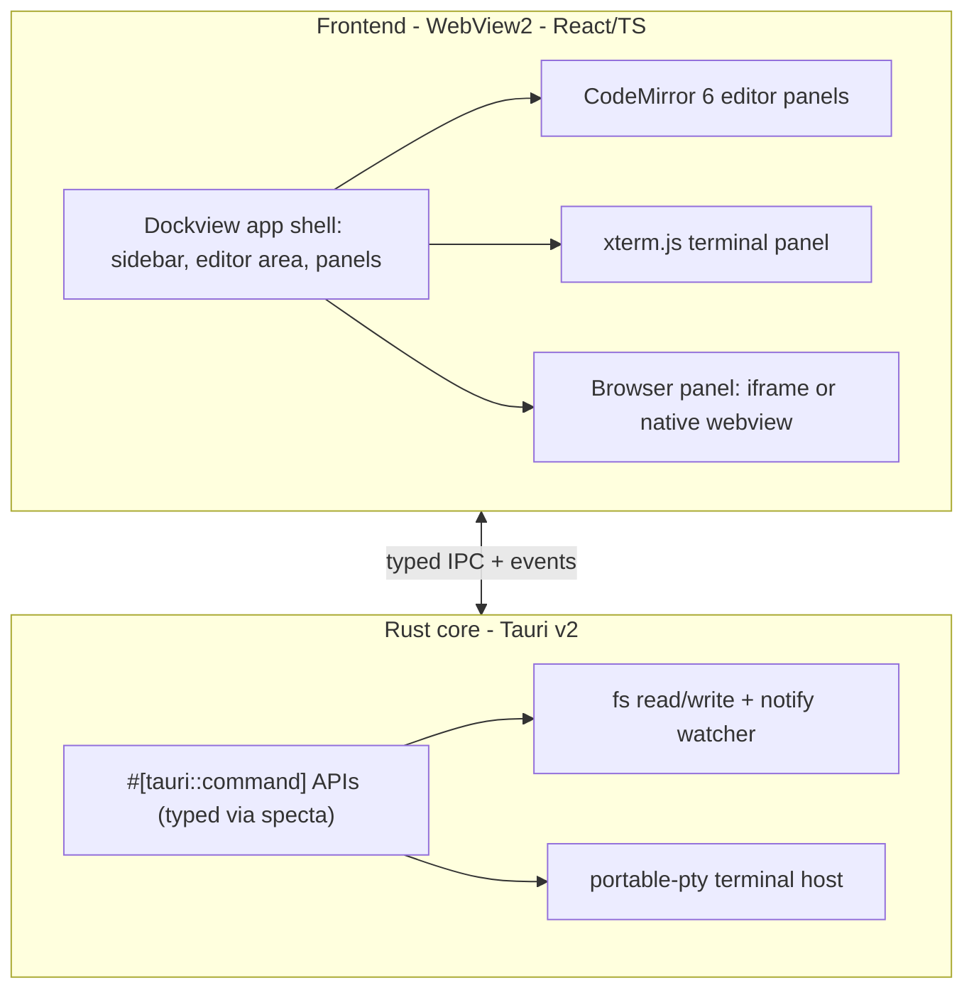
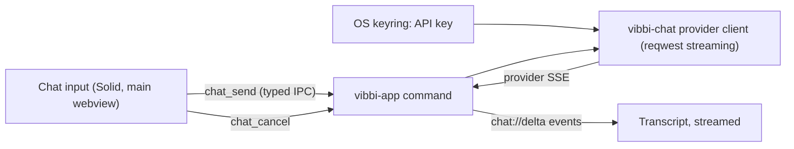
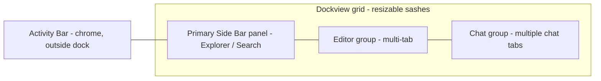

# Agentic IDE research session

*2026-07-31 15:16 - transcript 55139d32-0ef4-41d3-9429-6752b4796749*

## Prompts

if I wanted to create my own IDE for agentic workflow what are my options if I base it in Rust? is there a UI? is there a browser panel?

I am leaning Tauri but before I do that how popular is it, and what software stack does VSCode/Cursor use

@promptforge-ide this will be the project directory and it will have all the crates

apply @tools-public/tools/architect.md

give me pros and cons of each frontend

"component libraries" for react whats this

Listen up, here's the problem. Every time I hear React, I think about bloated UIs that are clumsy, they're over-engineered, they're not lean. Am I wrong?

I dont mean file size lean, I mean API-lean, call-chain-lean, etc

someone is telling me Solid is good. is dockview only available under React

Here's what I need: Menubar, project treeview, editor tabs, terminal panel, chat tabs, everything that VSCode has high level interface components (what did I miss?)

shell plus global search and is this going to be able to open and edit files? and add folders to the workspace?

I am building this in a separate repo from @promptforge but eventually I want to put all the crates together will that be a problem?

what is ui/ ?

sorry, what in the fuck? there's two executables?

so webview2 uses process isolation\

sounds good. what is left?

since we are merging later should we use promptforge- as the prefix here?

I dont understand Browser panel. Is this for the editor? or is this for a full-blown browser experience connecting to the internet and surfing?

what does "splits out a promptforge-search crate." mean in practical terms?

promptforge-core already exists in the other repo

I need the full browser and eventually the LLM will need to be able to drive it

Rename it to vibbi

does it matter that the repo dir is called promptforge-ide ?

why are there two plans @c:\Users\Vinnie\.cursor\plans\rust_tauri_editor_substrate_2f025609.plan.md @c:\Users\Vinnie\.cursor\plans\rust_tauri_editor_substrate_9cfb8626.plan.md

del,ete the dup. NO _trash. DELETE

apply @tools-public/how-to/how-to-vibe.md

why did you stop

why do I need npm? I thought the .exe was self contained

do you want me to run the exe now?

black then "can't reach this page"  its been like this from day one. and there's an extra window back there which seems tied to it.

everything works

Question, what about the chat window? What about the panel that has the window where I can talk to the agent, where it's got the little chat box at the bottom? What happened to that?

You can just use a gateway, I'll just point you at it, like you just have the URL and the API keys in the environment for Anthropic, and then, but this panel, it's gonna be Rich Text, is it gonna format Markdown? I want it to look, I want the whole app to look just like cursor. Sponsor sub-agents, sponsor sub-agents search the web for people that have configured this tawdry to, to look like cursor, to like, define the style sheet, get, find out what fonts they use, get everything.

apply @tools-public/how-to/how-to-vibe.md

no stay in plan mode

I did not say run the plan I said apply the vibe file to the plan and contextr

api key is in environment, and hardcode the url from here @wg21-paperflow/SERVICES.toml

run

rebuild it

how do I bring the chat up?

spawn subagents search the web for other projects or libraries that have the components we need. specifically displaying streaming markdown, initeracting with the model, etc

yeah lets upgrade according to best practices

can we make control+ and control- work to adjust the zoom of the entire UI?

spawn subagents search the web 1 or 2 subagents for best practices for plan items, 3 to 4 subagents searching for missing features from vscode and if there are already existing components or solutions we can use

work it all into the plan, spawn 8 subagents find more toos, libraries, guidance to make this great

run

run

run

Everything works except the browser. Theres no UI to open it except the Command and when I bring it up the window is disconnected from the tab

Okay, that's working better, but the, the browser panel isn't affected by the zoom. Like, when I zoom, the, the UI around it gets bigger and smaller, but the brows the content of the browser doesn't. I don't know if that was intended. That's number one. Number two, the panel, the, like the tree panel. It's not, you can't move the divider. Like, n Is that, there's no divider there. And then the chat, like I wanted three panels. I want three vertical panels. I want the tree on the left, like normal, and then I want, in the middle, I want a frame that can hold my documents, multi-tab, and then on the right, I wanna have the chat panel that holds my chats, but I wanna be able to have more than one chat. I want it to be like cursor. You know what I mean? I want it to be like cursor. Let me give you a screenshot. I want it to be like cursor. Spawn some agents, go on the internet, and look to see if you can find like a description of cursors ui or v s codes ui. Just, let's, let's put together like a document that explains all the UI features. I'm gonna show you, I'm gonna paste.

@c:\Users\Vinnie\.cursor\plans\rust_tauri_editor_substrate_2f025609.plan.md did this finish?

yes update that stale pending todos, and you can stay in plan mode to do that (its markdown). can you move the deliberately deferrred items to @c:\Users\Vinnie\.cursor\plans\vibbi_cursor-like_workbench_c482afa9.plan.md ?

For now, until further notice, the overriding prime directive, all caps prime directive, is copy cursor. When in doubt, look at the UI of cursor, and that's what I want. And you can look at Visual Studio Code as a secondary backup, but I want it to look and feel like cursor. I want the fonts to be like cursor. I want every little UI element to be like cursor. I want the icons to look like cursor. I want the layouts to look like cursor. Every time you're gonna do a commit, every time you're gonna do a feature Do a first look at, figure out how Cursor does it, and, and of course, Cursor's based on VS Code, so ninety-nine percent of it's gonna be looking at VS Code. But I want it to s it's gonna sub-agents, do all that research if you need to, and I want you to put together a master report, like a master document that explains The rules, like everything needs to be all dividers need to be movable, all the windows need to be dockable, right? And I want this code I want you to make sure you refactor the code at every step to be nice and organized, single concern in a file. I don't want any drift, I don't want to accumulate any technical debt.

apply @tools-public/how-to/how-to-vibe.md

review the plan

did you fix ALL the findings?

and are you going to follow @tools-public/how-to/typescript-how-to.md

does vibbi use javascript as well?

I was just wondering if I should make a javascript-how-to.md

nah. review the plan

Can we add a couple of slices which refactor particular subsets of the existing code to be compliant? including redteam/coreview

High thinking or Medium thinking?

Just use the current model throughout. run the plan.

It looks pretety good but this vertical button strip with the treee,search,debug,etc... shouldn't that be on top of the tree horizontally not a panel on the side?

oh that is nice. yes.

didn't you have a long list of steps to resume?

parity polish then phase 1 editor

1. Dragging any window tab gives me a no-can-do icon
2. There's no "New Agent" button

pretty fucking good :)

yes match the wording

When I launch there's a tab "prompt-compression-research.md" yet no file contents. I dont remember opening the file
shrinking the project panel horizontally pushes button bar buttons off the screen in a way that can't be accessed 
opening a file from the tree view put the tab in the panel holding the treeview and broke everything
File menu is missing a ton of things, there's no Close. right now my app is window-locked

Yep that all worked but I notice that there's no keyboard shotcuts for opening menus (opening, not selecting menu items) ?

reload @tools-public/how-to/prompts-how-to.md and @tools-public/how-to/vibe-how-to.md and @tools-public/how-to/rust-how-to.md and then finish the remaining items

compact now and continue

compact now and continue

yes

1. new file doesn't seem to work. I did New File in vibbi for "x.y" and nothing came out. Oh there's a message.
2. I did right click delete and the file disappered from the tree.

when the file to be deleted is at the very end of the list, and you right click, the menu pops partially offscreen and the delete button is inaccessible

I want you to keep going is what I want

how do I show the git gutter

yeah its working. nice. keep going

all my terminals fail to acquire a shell

terminal works now.

A browser tab button snuck into the toolbar above the treeview. I pressed it, and the browser replaced the treeview and now the controls are gone and I am softlocked:"

is there a menu and key for opening the browser?

ctrl+SHIFT+B works in cursor

get back yes

is markdown preview on the todo list?

I was thinking it could be a toggle on the file

question: where's the stylesheet for the markdown preview? is this using css?

fine for now. keep going with development. go go go!

Keep going and dont stop unless you actually need me, or if something turned out significantly differenet than it should have.

I have neither of those language server items. Keep going.

how do I sintall those things

I just installed them both

I just installed them both

does the context need a refresh on the vibe coder?

use the @tools-public/how-to/typescript-how-to.md

what do you need from me now?

wow I clicked on a .rs file and this ugly window popped up  and I got this error when I clicked on a file

seems to be working now. the markdown preview doesnt show images?

the image is local. also, I thought the preview was just an html? the markdown preview is just converting markdown to html or no? the image is not scaling to the width of the window, instead it is causing the horizontal scrollbar to show

What is this? ligatures? Why doesn't this render as 4 low-ascii characters?

do we want XML tags in markdown to render?

github doesn't show xml tags

actually

lets keep the xml visible

but lets hide HTML comments:

This has YAML at the top:

that was github

do we need a more robust YAML parser that handles escapes, and is proven robust/secure?

we can worry about it later. keep executing on whats left

keep going and dont stop.

The beginning of the above subagent result is already visible to the user. Perform any follow-up actions (if needed). DO NOT regurgitate or reiterate its result unless asked. If multiple subagents have now completed and none are still running, briefly summarize the findings and conclusions across all of them. Otherwise, if no follow-ups remain, end your response with a brief third-person confirmation that the subagent has completed. If you mention an agent or subagent in your response, link it with the `[label](id)` format using the agent_id or task_id from the notification instead of printing the raw ID. Don't repeat the same confirmation every time.

The beginning of the above subagent result is already visible to the user. Perform any follow-up actions (if needed). DO NOT regurgitate or reiterate its result unless asked. If multiple subagents have now completed and none are still running, briefly summarize the findings and conclusions across all of them. Otherwise, if no follow-ups remain, end your response with a brief third-person confirmation that the subagent has completed. If you mention an agent or subagent in your response, link it with the `[label](id)` format using the agent_id or task_id from the notification instead of printing the raw ID. Don't repeat the same confirmation every time.

you should not have stopped

The beginning of the above subagent result is already visible to the user. Perform any follow-up actions (if needed). DO NOT regurgitate or reiterate its result unless asked. If multiple subagents have now completed and none are still running, briefly summarize the findings and conclusions across all of them. Otherwise, if no follow-ups remain, end your response with a brief third-person confirmation that the subagent has completed. If you mention an agent or subagent in your response, link it with the `[label](id)` format using the agent_id or task_id from the notification instead of printing the raw ID. Don't repeat the same confirmation every time.

The beginning of the above subagent result is already visible to the user. Perform any follow-up actions (if needed). DO NOT regurgitate or reiterate its result unless asked. If multiple subagents have now completed and none are still running, briefly summarize the findings and conclusions across all of them. Otherwise, if no follow-ups remain, end your response with a brief third-person confirmation that the subagent has completed. If you mention an agent or subagent in your response, link it with the `[label](id)` format using the agent_id or task_id from the notification instead of printing the raw ID. Don't repeat the same confirmation every time.

The beginning of the above subagent result is already visible to the user. Perform any follow-up actions (if needed). DO NOT regurgitate or reiterate its result unless asked. If multiple subagents have now completed and none are still running, briefly summarize the findings and conclusions across all of them. Otherwise, if no follow-ups remain, end your response with a brief third-person confirmation that the subagent has completed. If you mention an agent or subagent in your response, link it with the `[label](id)` format using the agent_id or task_id from the notification instead of printing the raw ID. Don't repeat the same confirmation every time.

The beginning of the above subagent result is already visible to the user. Perform any follow-up actions (if needed). DO NOT regurgitate or reiterate its result unless asked. If multiple subagents have now completed and none are still running, briefly summarize the findings and conclusions across all of them. Otherwise, if no follow-ups remain, end your response with a brief third-person confirmation that the subagent has completed. If you mention an agent or subagent in your response, link it with the `[label](id)` format using the agent_id or task_id from the notification instead of printing the raw ID. Don't repeat the same confirmation every time.

The beginning of the above subagent result is already visible to the user. Perform any follow-up actions (if needed). DO NOT regurgitate or reiterate its result unless asked. If multiple subagents have now completed and none are still running, briefly summarize the findings and conclusions across all of them. Otherwise, if no follow-ups remain, end your response with a brief third-person confirmation that the subagent has completed. If you mention an agent or subagent in your response, link it with the `[label](id)` format using the agent_id or task_id from the notification instead of printing the raw ID. Don't repeat the same confirmation every time.

keep going

The beginning of the above subagent result is already visible to the user. Perform any follow-up actions (if needed). DO NOT regurgitate or reiterate its result unless asked. If multiple subagents have now completed and none are still running, briefly summarize the findings and conclusions across all of them. Otherwise, if no follow-ups remain, end your response with a brief third-person confirmation that the subagent has completed. If you mention an agent or subagent in your response, link it with the `[label](id)` format using the agent_id or task_id from the notification instead of printing the raw ID. Don't repeat the same confirmation every time.

The beginning of the above subagent result is already visible to the user. Perform any follow-up actions (if needed). DO NOT regurgitate or reiterate its result unless asked. If multiple subagents have now completed and none are still running, briefly summarize the findings and conclusions across all of them. Otherwise, if no follow-ups remain, end your response with a brief third-person confirmation that the subagent has completed. If you mention an agent or subagent in your response, link it with the `[label](id)` format using the agent_id or task_id from the notification instead of printing the raw ID. Don't repeat the same confirmation every time.

how does Inline AI completion work? what is inline-AI review?

keep going

The beginning of the above subagent result is already visible to the user. Perform any follow-up actions (if needed). DO NOT regurgitate or reiterate its result unless asked. If multiple subagents have now completed and none are still running, briefly summarize the findings and conclusions across all of them. Otherwise, if no follow-ups remain, end your response with a brief third-person confirmation that the subagent has completed. If you mention an agent or subagent in your response, link it with the `[label](id)` format using the agent_id or task_id from the notification instead of printing the raw ID. Don't repeat the same confirmation every time.

I want to defer all the AI/MCP related stuff and I want to finish everything needed to bring it in parity with VS Code. adjust the roadmap.

The beginning of the above subagent result is already visible to the user. Perform any follow-up actions (if needed). DO NOT regurgitate or reiterate its result unless asked. If multiple subagents have now completed and none are still running, briefly summarize the findings and conclusions across all of them. Otherwise, if no follow-ups remain, end your response with a brief third-person confirmation that the subagent has completed. If you mention an agent or subagent in your response, link it with the `[label](id)` format using the agent_id or task_id from the notification instead of printing the raw ID. Don't repeat the same confirmation every time.

The beginning of the above subagent result is already visible to the user. Perform any follow-up actions (if needed). DO NOT regurgitate or reiterate its result unless asked. If multiple subagents have now completed and none are still running, briefly summarize the findings and conclusions across all of them. Otherwise, if no follow-ups remain, end your response with a brief third-person confirmation that the subagent has completed. If you mention an agent or subagent in your response, link it with the `[label](id)` format using the agent_id or task_id from the notification instead of printing the raw ID. Don't repeat the same confirmation every time.

The beginning of the above subagent result is already visible to the user. Perform any follow-up actions (if needed). DO NOT regurgitate or reiterate its result unless asked. If multiple subagents have now completed and none are still running, briefly summarize the findings and conclusions across all of them. Otherwise, if no follow-ups remain, end your response with a brief third-person confirmation that the subagent has completed. If you mention an agent or subagent in your response, link it with the `[label](id)` format using the agent_id or task_id from the notification instead of printing the raw ID. Don't repeat the same confirmation every time.

The beginning of the above subagent result is already visible to the user. Perform any follow-up actions (if needed). DO NOT regurgitate or reiterate its result unless asked. If multiple subagents have now completed and none are still running, briefly summarize the findings and conclusions across all of them. Otherwise, if no follow-ups remain, end your response with a brief third-person confirmation that the subagent has completed. If you mention an agent or subagent in your response, link it with the `[label](id)` format using the agent_id or task_id from the notification instead of printing the raw ID. Don't repeat the same confirmation every time.

The beginning of the above subagent result is already visible to the user. Perform any follow-up actions (if needed). DO NOT regurgitate or reiterate its result unless asked. If multiple subagents have now completed and none are still running, briefly summarize the findings and conclusions across all of them. Otherwise, if no follow-ups remain, end your response with a brief third-person confirmation that the subagent has completed. If you mention an agent or subagent in your response, link it with the `[label](id)` format using the agent_id or task_id from the notification instead of printing the raw ID. Don't repeat the same confirmation every time.

The beginning of the above subagent result is already visible to the user. Perform any follow-up actions (if needed). DO NOT regurgitate or reiterate its result unless asked. If multiple subagents have now completed and none are still running, briefly summarize the findings and conclusions across all of them. Otherwise, if no follow-ups remain, end your response with a brief third-person confirmation that the subagent has completed. If you mention an agent or subagent in your response, link it with the `[label](id)` format using the agent_id or task_id from the notification instead of printing the raw ID. Don't repeat the same confirmation every time.

The beginning of the above subagent result is already visible to the user. Perform any follow-up actions (if needed). DO NOT regurgitate or reiterate its result unless asked. If multiple subagents have now completed and none are still running, briefly summarize the findings and conclusions across all of them. Otherwise, if no follow-ups remain, end your response with a brief third-person confirmation that the subagent has completed. If you mention an agent or subagent in your response, link it with the `[label](id)` format using the agent_id or task_id from the notification instead of printing the raw ID. Don't repeat the same confirmation every time.

keep going

is there a document with a comprehensive list of features that are implemented, so I can pass this to the testes?

The beginning of the above subagent result is already visible to the user. Perform any follow-up actions (if needed). DO NOT regurgitate or reiterate its result unless asked. If multiple subagents have now completed and none are still running, briefly summarize the findings and conclusions across all of them. Otherwise, if no follow-ups remain, end your response with a brief third-person confirmation that the subagent has completed. If you mention an agent or subagent in your response, link it with the `[label](id)` format using the agent_id or task_id from the notification instead of printing the raw ID. Don't repeat the same confirmation every time.

build the testing document yes

refresh the stale roadmap and commit

well yes I want that corrected and then amended into the top commit

@vibbi/vibe-review-editorcmds.md @vibbi/vibe-review-findreplace.md @vibbi/vibe-review-folding.md @vibbi/vibe-review-tabs.md what are these

## Plans

### Rust Tauri Editor Substrate

*Build a polished, Windows-first desktop editor substrate in Rust using Tauri v2, with a CodeMirror 6 code editor, a Dockview-based IDE windowing/docking shell, and an embedded browser panel. No agent layer.*

# Rust Tauri Editor Substrate (Windows-First)

Build the foundation for a polished code-editor UI: a Rust core (Tauri v2) hosting a web frontend that renders in WebView2, with an IDE-style dockable windowing system, a CodeMirror 6 editor, and an embeddable browser panel. This is a substrate to build polished UI on, not an agent product.

## Chosen stack

- Shell/core: Tauri v2 (Rust) - windowing via `tao`, rendering via WRY (WebView2 on Windows), bundler + updater.
- Frontend framework: React + TypeScript + Vite (default; swappable for Svelte/Solid/vanilla in step 1 - Dockview and CodeMirror support all). React chosen for the best-documented Dockview integration.
- Editor: CodeMirror 6 (`@codemirror/state`, `@codemirror/view`, `@codemirror/commands`, `@codemirror/language`, `@codemirror/lang-*`, `@codemirror/search`, `@codemirror/autocomplete`, `@codemirror/lint`, a theme).
- Windowing/docking: Dockview (`dockview-react`) - VS Code-style panels, tabs, splits, floating windows, layout persistence.
- Browser panel: `<iframe>` first (in-DOM, simple); then optional native WebView2 child webview via Tauri for a true browser control.
- Terminal (IDE-expected): `portable-pty` (Rust) + `@xterm/xterm` + `@xterm/addon-fit` (frontend).
- Typed IPC: `tauri-specta` + `specta` to generate TS bindings from Rust commands.

## Architecture

## Milestones

1. Scaffold and boot: `npm create tauri-app@latest` (React + TS + Vite). Confirm the window runs on Windows via WebView2. Establish the Rust `src-tauri` crate and a first `#[tauri::command]`.
2. Docking shell: add `dockview-react`; build the app shell (activity bar / sidebar / central editor area / bottom+right panel regions); implement layout save/restore (Dockview `toJSON`/`fromJSON`) persisted through a Rust command.
3. Editor panel: mount CodeMirror 6 inside a Dockview panel - syntax highlighting per language, a dark theme, search (Ctrl+F), autocomplete scaffolding, and multiple editor tabs.
4. Filesystem + project: Rust commands to open a folder, read/write files, and watch changes (`notify`); a file-tree sidebar panel wired so selecting a file opens it in a CodeMirror tab and saving round-trips to disk.
5. Browser panel: ship an `<iframe>` web panel first (docs/preview); then add an optional native browser control using a Tauri child webview (WebView2) positioned over a Dockview panel region, with navigation (URL bar, back/forward). Note: iframes are blocked by some sites (X-Frame-Options/CSP); the native webview avoids that.
6. Terminal panel: spawn a shell via `portable-pty` in Rust, stream bytes over Tauri events to `@xterm/xterm` in a Dockview panel; handle resize via `addon-fit`.
7. Typed IPC + polish + packaging: adopt `tauri-specta` for typed commands/events; add a design-token theme for polish; native menus/shortcuts; build Windows installers (NSIS `.exe` / WiX `.msi`) and wire the Tauri updater.
8. Stretch - language intelligence: add a CodeMirror LSP client talking to language servers spawned by the Rust core over stdio (e.g., `rust-analyzer`, `typescript-language-server`) for completion/diagnostics/hover.

## Cross-platform (future, optional)

- Tauri makes adding macOS/Linux mostly config + testing, not a rewrite. Defer until the Windows substrate is solid.
- macOS: needs a Mac + Apple Developer account for codesign/notarize; test on WKWebView.
- Linux: highest testing cost (WebKitGTK variance across distros); add deb/rpm/AppImage bundles.
- CodeMirror 6 degrades gracefully on WebKit/WebKitGTK, which de-risks this move.

## Key risks and decisions

- Native browser panel (step 5) requires syncing a native webview overlay to a DOM region's coordinates; the iframe path avoids this but is limited by site framing policies. Start with iframe, escalate to native webview only if needed.
- Frontend framework defaulted to React; confirm or swap in step 1 before code accretes.
- Windows-only for now by choice; the architecture keeps cross-platform additive.

Todos:

- Scaffold Tauri v2 app (React + TypeScript + Vite); verify it boots in WebView2 on Windows; add first Rust #[tauri::command].
- Integrate dockview-react app shell (sidebar/editor/panels) with layout save/restore persisted via a Rust command.
- Mount CodeMirror 6 in a Dockview panel: syntax highlighting, dark theme, search, autocomplete scaffold, multiple editor tabs.
- Add Rust file APIs (open folder, read/write, notify watcher) and a file-tree sidebar wired to open/save files in the editor.
- Add an iframe web panel; then an optional native WebView2 child-webview browser control with URL bar and back/forward.
- Add a terminal panel: portable-pty in Rust streamed over Tauri events to xterm.js with fit-addon resize.
- Adopt tauri-specta typed IPC; add design-token theming, native menus/shortcuts; build NSIS/WiX installers and wire the updater.
- Stretch: CodeMirror LSP client talking to language servers spawned by the Rust core (rust-analyzer, typescript-language-server).

### Vibbi Chat Panel

*Add the missing chat panel to vibbi: a dockable chat pane (transcript + bottom input) wired to a Rust-side LLM provider client with streaming over Tauri events, the API key held in the OS credential store, conversational now with agentic tool-use deferred.*

# Vibbi Chat Panel (Streaming LLM)

Build the chat surface that was designed but never scheduled into a milestone. A dockable chat panel (scrolling transcript + an input box pinned at the bottom, opened from a new activity-bar entry, defaulting to a right-side pane) talks to an LLM through the Rust core, which streams tokens back to the UI. This is executed as a vibe run: small reviewed commits, work in subagents, following `tools-public/how-to/how-to-write-rust.md` and the plan's existing review checks, preserving the browser-isolation invariant.

Repo is now at `c:\Users\Vinnie\src\cursor\vibbi` (renamed from promptforge-ide).

## Defaults I chose (correct any on confirm)

- Provider is abstracted over Anthropic (Claude) and OpenAI, selectable in settings; default Anthropic. Model is configurable.
- The LLM call happens in Rust, never the webview - the API key stays out of the frontend and streaming is delivered via Tauri events, matching the existing architecture.
- The API key is stored in the OS credential store (Windows Credential Manager via the `keyring` crate), not in the plaintext settings JSON; provider/model live in the existing settings store.
- Scope now is a conversational streaming chat. Agentic tool-use (the model calling vibbi's fs/terminal/browser commands) is the next milestone, not this one.
- The chat panel runs in the trusted `main` webview, so it keeps full IPC access - it is app UI, unlike the isolated `browser:*` webviews.

## Data flow

## Build slices (each a reviewed commit)

1. `vibbi-chat` crate: a `Provider` trait plus Anthropic and OpenAI clients over `reqwest` (already transitively present), with request builders and streaming-chunk (SSE) parsers. Pure request construction and stream-delta parsing are unit-tested with recorded fixtures (no network), mirroring how `vibbi-browser::cdp` isolates pure logic. Types crossing IPC derive `serde` + `specta::Type`; errors are typed.
2. `vibbi-app` wiring: `chat_send`, `chat_cancel`, and chat-config commands (get/set provider + model, set API key). Streaming deltas emit on a `chat://delta` event (per-conversation id), cancellation like the PTY pattern. API key via `keyring`; provider/model via the existing settings store in [vibbi/crates/vibbi-fs/src/settings.rs](c:\Users\Vinnie\src\cursor\vibbi\crates\vibbi-fs\src\settings.rs). Register in the specta `Builder`, add to the `AppManifest` in [vibbi/crates/vibbi-app/build.rs](c:\Users\Vinnie\src\cursor\vibbi\crates\vibbi-app\build.rs) and the `main`-only capability in [vibbi/crates/vibbi-app/capabilities/default.json](c:\Users\Vinnie\src\cursor\vibbi\crates\vibbi-app\capabilities\default.json); regenerate [vibbi/ui/src/bindings.ts](c:\Users\Vinnie\src\cursor\vibbi\ui\src\bindings.ts). Tested: config/key round-trip through a storage abstraction (test double), event payload shapes.
3. Chat panel UI: a new `chat` component in [vibbi/ui/src/shell/panels.ts](c:\Users\Vinnie\src\cursor\vibbi\ui\src\shell\panels.ts) and an activity-bar entry that opens it in the secondary (right) side bar; a transcript (assistant messages rendered as markdown, code blocks highlighted), an input box pinned at the bottom (Enter sends, Shift+Enter newline), a Stop button during streaming, a model/provider selector, and a first-run affordance to enter the API key. Streaming appends `chat://delta` events to the in-flight message; conversation history in a store. Vitest covers the pure conversation store/reducer and the streaming delta-accumulation.
4. Regenerate `design-vibbi.md` (the plan's generator) so the doc reflects the chat panel as built.

## Testing and verification

- Deterministic units (request building, SSE parsing, delta accumulation, conversation store) are tested; live network + streaming UI need an API key and a GUI, so those steps are documented for a manual `cargo tauri dev` / release-exe check, as with the browser and terminal slices.
- Every commit keeps `cargo build`/`cargo test`/`cargo clippy -D warnings` and `npm run build`/`npm test` green.

## Risks and decisions

- Two provider stream formats differ (Anthropic messages streaming vs OpenAI chat-completions SSE); the parser is per-provider and fixture-tested.
- Secret handling: `keyring` writes to Windows Credential Manager; include a clear error path if it is unavailable rather than falling back to plaintext.
- Cancellation and backpressure on the stream follow the PTY reader-thread/event model already in the codebase.

## Out of scope (next milestone)

- Agentic tool-use: letting the model call vibbi's `read_file`/`write_file`/`search_workspace`/`terminal_*`/`browser_*` commands in a tool-calling loop, with approval UI. This builds directly on slice 1-3 and on the CDP-drivable browser already in place.
- Merging the chat onto the `promptforge` agent engine (an alternative you did not choose now).

Todos:

- Create vibbi-chat crate: Provider trait + Anthropic/OpenAI clients over reqwest with streaming; unit-test pure request builders and SSE delta parsers with fixtures; serde+specta types, typed errors.
- vibbi-app: chat_send/chat_cancel/chat-config commands, chat://delta streaming events, API key via keyring, provider/model in settings; gate in AppManifest + main capability; regenerate bindings; test config/key round-trip and event shapes.
- Chat panel UI: activity-bar entry + right-sidebar dockable panel, transcript with markdown/code rendering, bottom input (Enter/Shift+Enter), Stop, model selector, API-key entry; wire streaming; Vitest for conversation store + delta accumulation.
- Regenerate design-vibbi.md so the design document reflects the chat panel as built.

### Vibbi Chat Best-Practices Upgrade

*Upgrade the vibbi chat panel to the researched best practices: Shiki (VS Code engine) code highlighting in the Anysphere theme, live incremental streaming-Markdown rendering via streaming-markdown (smd) with partial-syntax buffering, stick-to-bottom scrolling with user-scroll override, and security hardening (DOMPurify pin + a real Tauri CSP)."*

# Vibbi Chat Best-Practices Upgrade

Apply the research "adopt" list to the existing chat panel. Executed as a vibe run: small reviewed commits, work in subagents, following `tools-public/how-to/how-to-write-rust.md` (for any Rust) and the review checks below, preserving the browser-isolation invariant. Repo: `c:\Users\Vinnie\src\cursor\vibbi`. This changes only the chat frontend plus one Tauri config line; no chat-backend or reskin changes.

## Why (grounded in the current code)

- [ui/src/chat/markdown.ts](c:\Users\Vinnie\src\cursor\vibbi\ui\src\chat\markdown.ts): fenced code uses CodeMirror/Lezer (`classHighlighter`), ~8 languages, and Lezer themes do not reproduce the VS Code/Cursor look.
- [ui/src/chat/panel.ts](c:\Users\Vinnie\src\cursor\vibbi\ui\src\chat\panel.ts): the in-flight assistant turn renders as escaped plain text and only becomes Markdown on `complete` (line ~256-268); `scrollToLatest()` (line ~302) hard-pins to bottom with no user-scroll override.
- [crates/vibbi-app/tauri.conf.json](c:\Users\Vinnie\src\cursor\vibbi\crates\vibbi-app\tauri.conf.json): `security.csp` is `null`.

## Decisions (each with a falsifier)

- Use `streaming-markdown` (smd) as the incremental renderer, not `solid-streamdown` or a markdown-it+remend rewrite. The panel is imperative Dockview DOM, so smd's framework-agnostic, append-only DOM renderer fits directly and avoids the re-`innerHTML` mXSS class (it builds nodes, never re-injects HTML strings). Falsifier: we rewrite the chat panel as a Solid component (then `solid-streamdown` wins).
- Shiki for code highlighting, replacing CodeMirror/Lezer in the transcript. It uses VS Code's TextMate engine, so an Anysphere theme matches Cursor exactly; official `@shikijs/stream` exists. Falsifier: the fine-grained bundle still bloats unacceptably.
- Keep DOMPurify as a safety net even under smd's append-only DOM, and keep `html: false` semantics (raw HTML in model output stays inert text). Falsifier: smd is proven to emit only a fixed safe node set and the belt-and-suspenders cost isn't worth it.

## Build slices (each a reviewed commit; sequential - all touch the chat frontend)

1. Shiki highlighting + copy-code: replace the Lezer highlighter in [markdown.ts](c:\Users\Vinnie\src\cursor\vibbi\ui\src\chat\markdown.ts) with Shiki via the fine-grained path (`shiki/core` + `shiki/engine/javascript` + only-needed `@shikijs/langs/*` and an Anysphere `@shikijs/themes` theme - load the Cursor/Anysphere VS Code theme JSON, or build a Shiki theme from the Anysphere palette already in [ui/src/editor/theme.ts](c:\Users\Vinnie\src\cursor\vibbi\ui\src\editor\theme.ts)), bundled offline (no CDN). Add a copy-code button per block. Highlight a code block once, on fence close. Drop the `@codemirror/lang-*` imports from the chat path. Test: Shiki renders a known snippet to the expected token markup offline, and the output still passes DOMPurify unchanged.
2. Incremental streaming Markdown via smd: in [panel.ts](c:\Users\Vinnie\src\cursor\vibbi\ui\src\chat\panel.ts), replace the "plain text while streaming, Markdown on complete" path with smd: feed each `chat://delta` text chunk to `parser_write` and `parser_end` on finalize, rendering into the assistant bubble via smd's append-only DOM renderer (so partial `**`/fences/links buffer and never flash broken markup). Route fenced code through the slice-1 Shiki highlighter on close. Keep link hardening (target=_blank, rel=noopener) and a DOMPurify safety net on any non-smd HTML path. Preserve the `renderMarkdown` export for the finalized/non-streaming path and tests. Test: a fixture with unterminated bold/fence/link renders without breakage and the finalized DOM matches an atomic render; a `<script>`/`onerror=`/`javascript:` payload never yields a live element/handler (extend the existing markdown tests).
3. Stick-to-bottom scroll: replace `scrollToLatest()` with a ResizeObserver-driven stick-to-bottom behavior ported from the `use-stick-to-bottom` algorithm (follow the stream only when the user is at the bottom; a user scroll-up detaches; a floating "jump to latest" button reattaches). Keep the scroll-decision logic pure and tested. Test: the pure `shouldFollow(atBottom, userScrolled)` / `isAtBottom(scrollTop, scrollHeight, clientHeight, threshold)` logic.
4. Security hardening: pin `dompurify` to `>=3.3.2` in [ui/package.json](c:\Users\Vinnie\src\cursor\vibbi\ui\package.json) (closes mXSS CVE-2026-65914); set a real `security.csp` in [tauri.conf.json](c:\Users\Vinnie\src\cursor\vibbi\crates\vibbi-app\tauri.conf.json) (replace `null`) that blocks inline script execution while allowing the bundled assets, `style-src` for the Shiki/token styles, and `connect-src` as needed - verify the app still boots via `cargo tauri build --no-bundle`. This is defense-in-depth so a missed payload cannot execute.
5. Regenerate `design-vibbi.md`: spawn the generator that reads the original plan `c:\Users\Vinnie\.cursor\plans\rust_tauri_editor_substrate_2f025609.plan.md`, greps `<design-doc>`, and reconciles the document against the finished code (now Shiki + streaming Markdown + stick-to-bottom + CSP).

## Review checks

Read alongside the general code-review block.

<vibe-review>
1. Model output stays sanitized: smd renders only a safe node set (no raw HTML/script), links are hardened (target=_blank, rel=noopener), and any HTML-string path still goes through DOMPurify (>=3.3.2). A `<script>`/`onerror`/`javascript:` payload produces no live element or handler - asserted by tests, including mid-stream.
2. Incremental rendering never flashes broken markup: partial bold/italic/fenced-code/links buffer until disambiguated; the finalized DOM equals an atomic render of the same text.
3. Append-only DOM: no re-`innerHTML` of a growing sanitized string during streaming (avoids the mXSS re-injection class).
4. Shiki is bundled offline (fine-grained core + JS engine + only-needed langs/theme), no CDN or runtime fetch; the Anysphere theme matches the app's syntax palette; a code block is highlighted once on close, not per token.
5. Scroll: streaming follows the bottom only when the user is already there; a user scroll-up detaches and is not yanked back; the decision logic is pure and tested.
6. The Tauri CSP blocks inline scripts and the app still boots; no capability/isolation change (browser:* webviews unaffected).
7. Listeners/observers (delta subscription, ResizeObserver, smd parser) dispose race-safely on panel dispose; no leaks.
8. Reactive/DOM surface stays lean; no dead code; no secrets.
</vibe-review>

## Subagent and review mechanics

- Build each slice in a subagent, commit, review in a fresh subagent, fix in a third; the parent keeps only git (stage/commit/amend) and bounded checks. Do NOT run a git-mutating command concurrently with a file-writing subagent.
- Reviewer overwrites findings at `C:/Users/Vinnie/src/cursor/cabinet/_scratch/vibe-vibbi/vibe-review.md` (forward slashes); writes nothing into the repo.
- Stage before amend so a fix lands in its own commit; fix an old bug in its own commit.

## Testing and verification

- Deterministic units (markdown-to-safe-HTML incl. mid-stream, incremental-vs-atomic equivalence, Shiki token output, the pure scroll decision) are tested. Live streaming visuals and the CSP need a running app, documented for a manual `cargo tauri dev` / release-exe check (with `ANTHROPIC_API_KEY` set).
- Every commit keeps `npm run build`/`npm test` green, and slice 4 keeps `cargo tauri build --no-bundle` green.

## Risks

- CSP is the sharpest risk: too strict breaks the WebView2 render (Vite assets, inline styles from Shiki/tokens). Start permissive-but-safe (block inline script; allow self + the asset origin; allow inline style) and tighten later.
- Shiki bundle size: only via the fine-grained path (core + JS engine + needed langs/theme), verified in the build output.
- smd's sanitization model differs from the innerHTML path; the safety net + tests must confirm no raw HTML escapes.

## Out of scope (future)

- Message virtualization (`@tanstack/solid-virtual`) for very long transcripts; branching for edit/regenerate; tool-call/"thinking" rendering for the deferred agentic step. Borrowable patterns from assistant-ui / AI Elements, not adopted now.

Todos:

- Replace CodeMirror/Lezer highlighting in chat markdown.ts with Shiki (fine-grained offline bundle, Anysphere theme) + copy-code button; highlight once on fence close; test token output + sanitization.
- Adopt streaming-markdown (smd) in panel.ts for live incremental rendering during streaming (append-only DOM, partial-syntax buffering), integrating Shiki on code-block close, keeping link hardening + DOMPurify safety net; test partial/atomic equivalence + XSS mid-stream.
- Replace scrollToLatest with a ResizeObserver stick-to-bottom (user-scroll override + jump-to-latest); pure, tested scroll-decision logic.
- Pin dompurify >=3.3.2 and set a real Tauri CSP (replace csp:null) blocking inline scripts; verify the app still builds/boots.
- Regenerate design-vibbi.md via the existing generator, reconciled against the upgraded chat panel.

### Vibbi Roadmap

*A phased roadmap folding all research into buildable, vibe-run phases: Phase 0 = the chat best-practices upgrade + UI zoom (already detailed separately); Phases 1-3 add editor/terminal/workbench parity, language intelligence + git, and the AI-native differentiators, on cross-cutting tracks for architecture, performance, accessibility, testing/CI, distribution, and theming. Each item names the adopt-or-build library with its license."*

# Vibbi Roadmap: VS Code Parity + AI-Native Edge

Everything the research surfaced, folded into phases. Executed as vibe runs: each slice is a small reviewed commit (build subagent -> commit -> review subagent -> fix -> amend), following `tools-public/how-to/how-to-write-rust.md`, preserving the main-only capability isolation (browser webviews reach zero commands), and never running git alongside a file-writing subagent. Repo: `c:\Users\Vinnie\src\cursor\vibbi`. All named packages are MIT unless noted.

## Phase 0 - Chat upgrade + UI zoom (now)
Detailed in [vibbi_chat_best-practices_upgrade_65eb602e.plan.md](c:\Users\Vinnie\.cursor\plans\vibbi_chat_best-practices_upgrade_65eb602e.plan.md): Shiki highlighting (offline fine-grained + `@shikijs/stream`), `streaming-markdown` (smd) incremental rendering (block javascript:/data: in its attr setter; DOMPurify as detector), stick-to-bottom (CSS `overflow-anchor` primary + JS override; WebView2 >=115), CSP + DOMPurify >=3.3.2 pin, and Ctrl+/Ctrl-/Ctrl+0 zoom via `setZoom`.

## Phase 1 - Parity quick wins (adopt/wire; days each)
Performance first (gates everything): add `rollup-plugin-visualizer`; kill the ~1.5 MB chunk via per-icon/deep imports + precompute the material-icon manifest at build time (move `generateManifest` off boot); lazy-load panels (`lazy`/`Suspense`); serve large file reads via a custom protocol / `convertFileSrc` (never `Vec<u8>` over `invoke`); virtualize the tree with `@tanstack/solid-virtual`; add the Rust release profile (`lto`, `opt-level`, `strip`, `panic="abort"`).
- Editor (CodeMirror core): multi-cursor + Ctrl/Cmd+D (`selectNextOccurrence` from `@codemirror/search`) + rectangular selection; search/replace panel; whitespace/rulers/code-folding; bracket matching + rainbow (`rainbowbrackets` or a Lezer walker); indentation markers (`@replit/codemirror-indentation-markers`); minimap (`@replit/codemirror-minimap`).
- Terminal (xterm): WebGL renderer (`@xterm/addon-webgl`) + rAF write-coalescing; `@xterm/addon-search`; `@xterm/addon-web-links` + a custom file-path link provider (open at line:col); `@xterm/addon-unicode11`; a persistent multi-session pool with splits/tabs (reparent the host div, keep PTY alive); Windows shell picker (check `BASH_VERSION`/`MSYSTEM`/`WSL_DISTRO_NAME` before `PSModulePath`).
- Workbench: fuzzy quick-open/palette/symbols via `nucleo` (Rust) with Ctrl+P prefix routing (replaces the placeholder); file-tree ops (create/rename/delete/copy-path) via `std::fs` + the `trash` crate through the Workspace boundary, drag-drop via `solid-dnd`; editor split-grid commands (dockview already supports it); snippets via CodeMirror's snippet API + a VS Code-JSON converter; session restore of open editors + cursor/scroll/fold state; git gutter change indicators (original-blob vs buffer diff, viewport-scoped).

## Phase 2 - Language intelligence, git, workbench depth
- LSP client: `@codemirror/lsp-client` + a thin Rust stdio broker spawning rust-analyzer/typescript-language-server -> diagnostics, completion, hover, signature help, go-to-def, rename, references, formatting.
- Problems panel + inline diagnostics via `@codemirror/lint` (fed by Lezer error nodes now, LSP `publishDiagnostics` later, same `Diagnostic` shape).
- Outline + breadcrumbs + sticky scroll: built from the Lezer tree / tree-sitter `tags.scm` (no package exists - highest-effort, highest-differentiation editor work).
- Source Control view on `git2` behind a trait (swap `gitoxide` read-paths later): status/stage/commit/branch/log/blame; diff + merge via `@codemirror/merge` (`unifiedMergeView` + a conflict-marker layer); inline blame (`git blame --incremental`, viewport-first, cached); `similar` (Rust) for backend diffs.
- Inline AI ghost-text / next-edit: `@marimo-team/codemirror-ai` wired to the Rust backend (FIM prefix/suffix).
- Keybindings registry (`tinykeys`) + editor; schema-driven Settings UI (build; `ajv` validation).
- Accessibility baseline: adopt `Kobalte` (+ `corvu` for Resizable and `createFocusTrap`) for overlays/menus/dialogs/tabs/combobox; F6/Shift+F6 cross-panel nav + landmark roles; CodeMirror `aria-label` + `aria-hidden` gutters; file tree roving-tabindex + `tree`/`treegrid` roles; always-visible themable focus ring; `prefers-reduced-motion` + `forced-colors`/`prefers-contrast` (verify the frameless titlebar).
- Testing + CI: `@solidjs/testing-library` + Vitest with `@tauri-apps/api/mocks` `mockIPC`; Rust `insta` + `proptest` + `cargo-nextest`; coverage (`cargo-llvm-cov`, Vitest v8) informational then gated; a thin E2E layer via WDIO `@wdio/tauri-service` (embedded provider, auto MSEdgeDriver); `lefthook` gates (clippy -D warnings, fmt, eslint, prettier); GitHub Actions Windows pipeline via `tauri-action` + `swatinem/rust-cache`.

## Phase 3 - AI-native edge + distribution
- MCP as the tool/extensibility surface via `rmcp` (official Rust MCP SDK; stdio + Streamable-HTTP): wire MCP servers as chat tools; this is the extensibility strategy (with LSP), not a bespoke plugin API.
- Agentic loop: tool-calling with human-in-the-loop (`interrupt -> approve/edit/reject -> resume`), edit checkpoints/rollback, sandbox-first (the shell boundary is not checkpointable).
- Inline diff/apply for AI edits via `@codemirror/merge` `unifiedMergeView`.
- Expose the CDP browser + fs + search + terminal + LSP as agent tools; dual-LLM / untrusted-content-masking for the browser (its local visual-verification is the moat VS Code/Cursor lack locally).
- @codebase retrieval: tree-sitter AST-aware chunking + `fastembed` (Apache-2.0) local embeddings + `sqlite-vec` (then LanceDB) + hybrid ripgrep/dense/rerank; `tiktoken-rs` budgeting.
- ACP (`agent-client-protocol`) so external agents (Claude Code/Codex/Gemini) can drive vibbi with inline review.
- Distribution: Azure Trusted Signing (Public Trust) Authenticode; real updater keys + `latest.json` on GitHub Releases (`createUpdaterArtifacts`, `passive` install); NSIS per-user installer; crash reporting via `tauri-plugin-sentry` (Rust + JS + minidumps); opt-in PostHog analytics.
- Stretch: minimal DAP debugger (Rust `dscode-dap` or hand-rolled on the DAP types, 1-2 runtimes); WASM plugins (Wasmtime + WIT, Zed's model) only after MCP/LSP prove insufficient.

## Theming (folds into the reskin)
Import VS Code / TextMate color themes via Shiki + the `@cmshiki` CodeMirror bridge: map the theme's `colors` onto the design-token CSS variables ("bring your own theme" reskins the whole app) and feed `tokenColors` to Shiki; keep Lezer for interactive features (run both).

## Cross-cutting architecture principles
- One typed error seam (`thiserror` + serde-tagged) across the Rust IPC boundary; never leak a dependency's error type; per-variant `#[non_exhaustive]`.
- Pin `tauri-specta` with `=` and isolate it plus the community `smd`/`dockview`/`solid-dockview` deps behind thin modules.
- signals vs `createStore`/`reconcile` discipline; feature folders; a service/command-registry layer; keep imperative Dockview panels coherent with reactive state via shared stores + `onDidVisibilityChange`.
- Treat the IPC bridge like a network call: minimize payloads; stream or use a custom protocol for bytes.

## Decisions (key falsifiers)
- MCP + LSP are the extensibility surface, not a bespoke plugin API (Lapce and Zed converge here). Falsifier: a required UI-extension use case neither covers.
- `git2` now, behind a trait; `gitoxide` read-paths later. Falsifier: the C toolchain breaks the Windows-first build badly enough to force pure-Rust now.
- Shiki for theme fidelity + Lezer for interactivity (run both). Falsifier: the dual-highlighter cost is too high.
- WDIO `@wdio/tauri-service` for E2E (Windows-first). Falsifier: the team prefers Playwright-over-CDP.
- Azure Trusted Signing for Authenticode. Falsifier: geo-ineligibility -> an OV certificate.
- `nucleo` (Rust) for large fuzzy sets; `fuzzysort` in-UI for tiny lists. Falsifier: IPC latency makes the Rust path feel slow for the palette.

## Out of scope (honest)
VS Code extension-API compatibility; a full multi-language debugger matching VS Code's breadth; full remote/SSH dev; a general notebook platform with kernel management.

## Sequencing
Run Phase 0 first. Then Phase 1 as one vibe run, doing the perf bundle-fix + `nucleo` quick-open + terminal WebGL earliest. Phase 2 and Phase 3 as subsequent vibe runs; the AI-native items (MCP tool loop, inline diff/apply, checkpoints/HITL, browser-as-tool) are the highest-leverage differentiators and can be pulled forward if AI is the priority over parity.

Todos:

- Phase 0: run the chat best-practices upgrade + UI zoom (existing detailed plan).
- Phase 1 perf: bundle visualizer, per-icon imports + build-time icon manifest, lazy panels, custom-protocol file reads, tree virtualization (@tanstack/solid-virtual), Rust release profile.
- Phase 1 editor: multi-cursor + Ctrl/D + rectangular, search/replace panel, indentation markers, minimap, bracket/rainbow, whitespace/rulers/folding (CodeMirror + @replit/*).
- Phase 1 terminal: WebGL + rAF coalescing, search, file-path links, unicode11, multi-session splits/tabs, Windows shell picker.
- Phase 1 workbench: nucleo fuzzy quick-open, file-tree ops + trash, split-grid commands, snippets, session restore, git gutter marks.
- Phase 2: LSP client (@codemirror/lsp-client + Rust stdio broker), Problems panel (@codemirror/lint), outline/breadcrumbs/sticky-scroll from Lezer.
- Phase 2: Source Control view on git2 (behind a trait) + @codemirror/merge diff/merge + inline blame.
- Phase 2: inline AI ghost-text/next-edit via @marimo-team/codemirror-ai wired to the Rust backend.
- Phase 2: keybindings registry (tinykeys) + editor; schema-driven Settings UI (ajv).
- Phase 2: adopt Kobalte/corvu for overlays/menus/tabs/combobox; F6 cross-panel nav + landmarks; focus ring; forced-colors/reduced-motion; CodeMirror aria.
- Phase 2: testing stack (@solidjs/testing-library + mockIPC, insta/proptest/nextest, coverage) + lefthook gates + GitHub Actions Windows CI (tauri-action).
- Phase 3 AI: MCP tool loop (rmcp) + HITL/checkpoints + inline diff apply (@codemirror/merge) + browser-as-agent-tool + @codebase retrieval (fastembed/sqlite-vec/tree-sitter) + ACP.
- Phase 3 distribution: Azure Trusted Signing, real updater keys + latest.json on GitHub Releases, NSIS per-user installer, Sentry crash reporting, opt-in PostHog.
- Theming: import VS Code/TextMate themes via Shiki (@cmshiki) mapping colors -> design tokens; keep Lezer for interactivity.

### Vibbi Cursor-like workbench

*Rework vibbi's shell into a Cursor-like workbench: Explorer, editor, and chat become resizable Dockview regions (real sashes), the right pane holds multiple chat tabs, and the embedded browser page zooms with the UI.*

# Vibbi Cursor-like Workbench

Make the workbench match the model in `cabinet/_research/2026-07-30-ui-research-cursor-vscode-workbench.md`: every region is a resizable dock area, and the right AI pane is a multi-tab container.

## Root causes (confirmed)

- The Primary Side Bar is a fixed `<aside class="vibbi-sidebar">` flex child in [Shell.tsx](vibbi/ui/src/shell/Shell.tsx) (lines 189-206), rendered outside `<Dock/>` (line 208-210). No sash exists between it and the editor, so the tree cannot be resized.
- [openChatPanel()](vibbi/ui/src/services/chat.ts) (lines 105-123) always targets one panel id `"chat"`, and [chat/panel.ts](vibbi/ui/src/chat/panel.ts) sets `private readonly conversationId = DEFAULT_CONVERSATION_ID` (line 72), ignoring `params`. So only one chat is possible. The Rust chat commands already take a `conversationId`, so the backend supports many.
- The browser page lives in a child webview; `setZoom` in [zoom.ts](vibbi/ui/src/services/zoom.ts) only scales the main webview.

## Target layout

The Activity Bar stays as chrome to the left of the dock; the sidebar, editor, and chat are all Dockview panels separated by draggable sashes. The chat group holds one tab per conversation.

## Key design decisions

- Host the existing Solid `Explorer`/`Search` inside a dock panel via a new `SolidPanel` renderer that mounts a Solid component with `render()` and disposes it on panel dispose.
- The side bar panel reuses the existing `.vibbi-sidebar-body` wrapper class internally, so `Explorer`'s virtualizer (`getScrollElement` resolves `closest(".vibbi-sidebar-body")`) needs no change.
- Each chat panel derives `conversationId` from `params.api.id`, so tabs are independent conversations. The selected model stays global (shared) for now.
- Keep the Activity Bar; its buttons set `activeView` (the side bar panel reacts) and reveal/toggle the side bar dock panel. `Ctrl+B` toggles the side bar panel's presence.
- Bump a layout schema version; ignore legacy/mismatched persisted layouts and rebuild defaults once (old layouts reference the removed single `"chat"` panel and no sidebar panel).
- Browser: mirror the UI zoom onto the child webview (`webview.set_zoom`) so page content scales with the chrome; panel bounds already multiply by zoom, and zooming content does not change the webview rectangle, so the two stay consistent.

## Build slices (each a reviewed commit; the app stays working after each)

Slice A and the layout slices B-E are largely independent; A can land first as a quick, isolated win.

### Slice A - Browser page zooms with the UI
- Add a `browser_set_zoom(panel_id, factor)` app command in [browser.rs](vibbi/crates/vibbi-app/src/browser.rs) calling `webview.set_zoom(factor)`; register it and add `allow-browser-set-zoom` to the main-only capability (same pattern as the other browser commands, never granted to `browser:*`).
- `services/browser.ts`: add `setBrowserZoom(panelId, factor)`.
- `browser/panel.ts`: apply the current `zoom()` on create and re-apply inside the existing `onZoomChange` subscription (already added for bounds).
- Verify: page content scales with `Ctrl+=/-/0` and stays aligned in its tab.

### Slice B - SolidPanel + dockable Primary Side Bar
- New `SolidPanel` `IContentRenderer` in [panels.ts](vibbi/ui/src/shell/panels.ts): mount a passed Solid component into the panel element with `render()`, store the disposer, call it on `dispose()`.
- New `SideBar.tsx` Solid component: the header + a `.vibbi-sidebar-body` container + a `Switch` on `activeView()` rendering `Explorer`/`Search`, plus the side-bar context menu moved from `Shell.tsx`.
- Register a `"sidebar"` component in `createComponent`.
- Remove the `<aside>` from `Shell.tsx` (Activity Bar chrome stays).
- Verify: Explorer renders inside the dock, tree scrolls, a sash appears between it and the editor and resizes it.

### Slice C - Activity bar and Ctrl+B wired to the dockable side bar
- `workbench.ts`/`dock.ts`: `toggleSideBar` shows/hides the side bar dock panel (preferred: Dockview group visibility; fallback: remove and re-add at the remembered width). `showView(view)` sets `activeView` and ensures the side bar panel is present and focused.
- `Shell.tsx`: Activity Bar buttons call the updated `showView`/toggle; keep the click-active-to-collapse behavior.
- Verify: `Ctrl+B` and the activity-bar icons behave like VS Code; width is remembered across toggles.

### Slice D - Right-docked multi-tab chat
- `chat/panel.ts`: `conversationId` from `params.api.id` (fallback generated id); `createChatPanel` unchanged.
- `chat.ts`: `openChatPanel()` reveals or creates a right-docked chat group; add `newChatPanel()` that always adds a new chat panel (unique id, e.g. `chat-<n>`) as a tab in the chat group.
- `commands/builtins.ts`: add a `chat.new` command ("New Chat"); Activity Bar Chat button opens/reveals, plus a New Chat affordance.
- Verify: multiple chats run concurrently as tabs; deltas do not cross wires (already filtered by `conversationId`).

### Slice E - Default 3-column layout + persistence migration
- `buildDefaultLayout` in [panels.ts](vibbi/ui/src/shell/panels.ts): side bar left (initial width ~240), editor group center, one chat panel right (initial width ~360).
- [layout.ts](vibbi/ui/src/shell/layout.ts): wrap the persisted payload as `{ version, layout }`; on load, if `version` is missing or mismatched, return null so the dock rebuilds defaults. Bump the version for this redesign.
- Verify: fresh start shows three resizable columns; an old persisted layout is discarded cleanly, not crashed on.

### Slice F - Regenerate design-vibbi.md
- Reconcile [design-vibbi.md](vibbi/design-vibbi.md) with the new workbench (dockable side bar, multi-tab chat, browser page zoom).

## Data flow and persistence

- Dockview remains the single layout owner; `Dock.tsx` still persists via the debounced `onDidLayoutChange` -> `saveLayout`. The new panels serialize with it.
- Chat transcripts are still not persisted (only the panel/layout); restored chat tabs start empty. Noted as a follow-up, not in scope.
- The `activeView` signal drives the side bar panel content reactively; the panel itself is a stable Dockview node.

## Risks

- Dockview hide/show for `Ctrl+B`: confirm `dockview-core`'s group-visibility API during Slice C; fall back to remove/re-add preserving width.
- Explorer virtualizer scroll element: mitigated by reusing the `.vibbi-sidebar-body` class inside `SideBar.tsx`.
- Layout migration: the version gate must reject legacy layouts, or `fromJSON` will reference the removed single chat panel and the missing sidebar.
- SolidPanel lifecycle: the `render()` disposer must run on panel dispose to avoid leaking the Explorer's fs-watcher and virtualizer.

## Testing

- Pure/unit: multi-chat id derivation, the layout version gate (legacy -> null, current -> passes), and any new pure helpers. Keep `npm run build` + `npm test` green each slice.
- Runtime (manual, needs the release exe): resizable sashes on all three regions, `Ctrl+B` toggle, multiple chat tabs streaming independently, and browser page zoom matching the UI at 150 percent.

Todos:

- Browser page zooms with UI: add browser_set_zoom Rust command (main-only capability), setBrowserZoom in services/browser.ts, apply current zoom on create + on onZoomChange in browser/panel.ts.
- Add SolidPanel renderer (mount Solid via render(), dispose on panel dispose); new SideBar.tsx (header + .vibbi-sidebar-body + Switch Explorer/Search + context menu); register 'sidebar' component; remove the aside from Shell.tsx; add sidebar to buildDefaultLayout.
- Wire activity bar + Ctrl+B to the dockable side bar: toggleSideBar shows/hides the sidebar dock panel (group visibility or remove/re-add preserving width); showView sets activeView and reveals/focuses it.
- Right-docked multi-tab chat: conversationId from params.api.id in chat/panel.ts; openChatPanel reveals/creates the right chat group; add newChatPanel() + a chat.new 'New Chat' command and affordance.
- Default 3-column layout (sidebar ~240 | editor | chat ~360) in buildDefaultLayout; version-gate persisted layouts in layout.ts (legacy/mismatch -> rebuild defaults).
- Regenerate design-vibbi.md for the dockable side bar, multi-tab chat, and browser page zoom.
