# Promptforge-core work session, large

*2026-08-09 10:58 - transcript 8c3c647b-f072-4df7-b9a6-01d1158f1a03*

## Prompts

context: @promptforge/crates/promptforge-core

Okay, help me understand something. So In rust, do the tests go in the same file as the implementation? What's going on here?

additional context: @tools-public/how-to/rust-how-to.md

is this crate idiomatic?

Actually no, Rust. I don't know Rust. And so like what's this pound sign with the shit in the brackets?

@promptforge/crates/promptforge-core/src/parser.rs:46-59 I thought there was also a trailing lua code fence

it is supposed to be like this

## Name

```lua
preamble
```

Prose

```lua
epilog
```

## Next Section

lets plan a nice refactor.  and I want a new design-core.md (I renamed the original) with clear instructions about the design. it explains the rationale and the features. starting with this one.

but what if there's for example a function that is used by more than half of the sections, they have to duplicate it?

this sounds better. so you are saying that it is concurrency which is tricky. fan-out accessing global mutable state would be a problem

should I be concerned about string lookups for names like "counter" ?

Explain to me the mechanism where the Prompt global lua is loaded and executes and then becomes read only, help me understand that.

that does sound nice. what if a function has no variables (i.e. an empty closure) are making the copies for fanout expensive?

oh so you are saying keep the function as a string, not even bytecode?

Sure but then we have a path through the code later which calls the lua parser which in theory can fail (even though it can't actually fail) and then we will have code which appears to ignore errors

yes this sounds correct

Should we make the lua regular? Like, for example, in the-before the first H2, should we require that the lua come before the pros just for consistency so that you don't confuse the A preamble with an epilogue in the H1.

I feel like H1 should be required, and anything between the YAML and the H1 is ignored.

by the way none of this has shipped so dont worry about breakage.

now show me all the syntaxes of the tool object

To get rid of the front matter in the tools, I don't think that's a good idea. I think that it should be in the, in the H one. I think that's where you put it, and I think that the reason is because we don't wanna have two ways of doing the same thing. Like, we wanna, we wanna always, we wanna create the smallest facility that lets us do as much as we can. So we shouldn't invent a new facility when an existing one can handle it. That's design rule number one. And design rule number two is that Never have two ways of doing the same thing, unless there's a really good documented reason. I want to get rid of the front matter and the tools, the tools and the front matter.

So now in the, in the H one, we need a way to be able to say, "Here's a sentence that describes the capability. " We call that the need string, and then the Harness will use embedding and a reranker to find the tool whose description matches the sentence. We already have a crate for that. And then when it finds it, it will associate it with that ID, so it becomes like a symbol. So this way, we'd, we the prompt doesn't have a hard-coded dependence on tool names. It only describes what the tool capabilities it needs are. And if the executor can't find a tool that hits that description that's unambiguous, then it gives an error. @promptforge/crates/promptforge-tool-picker

but binding local names is a smart play. it lets you do:

tools.add_need( "FormatReport", "Create a formatted Word document." )

And then in the prose it can be precise:

Use the FormatReport tool on the temporary file

Would this be good?

what do you think about this

would a reranker help? what does the study suggest? @promptforge-design/spike-tool-picker 

Also I think that mapping the same tool to two different Ids is a mistake. it should be an error. a design principle is that ambiguity or duplication is an error

Question: would it be a good idea after running the H1 preamble for the harness to do a cosine similarity on all the bound tools, and fail if two or more are too similar?

yeah lets do that. does this motivate changing the tool-picker crate to add the API ?

apply @tools-public/how-to/vibe-how-to.md to the plan

Do we have an observer-driven trace facility as a cross-cutting concern? That is, that every harness operation reports its activity to an optional observer which the caller can install and get detailed logging?

these events seem kind of pointless why not just have two strings: Section, and Detail?

Yes that sounds better. But note, that I have the idea of a fine-tuned small open-weight model which takes a prompt and calculates a short description. I'm not sure if we should use it. What do you think? @promptforge-design/design/design-label.md

run

You fucking kidding me? Are you fucking kidding me? You weren't supposed to do the whole fucking thing and go... I never asked you to, I didn't fucking ask you to stop. I've been waiting all this time, I've been waiting three fucking hours, and I was supposed to come back and you were supposed to be finished, and you only did one step!

are you stupid? the vibe coder and the plan were explicit. break up the task into individual steps, each with its own commit, and then a code review and amended commit before continuing. never to ask the user.  so now you are doing all the steps in one commit?

reset the entire head

just reset and start over from the commit you already made

Here's what I want. I wanna plan some tests. Maybe we have them already, maybe we don't, but I want prompt tests. So here's what I want. I want. A series of files. Actually, can I put. Should I make a whole bunch of files test, test prompts, test them for me, or should we put the prompts as inline strings in the code? What would be better?

@promptforge/crates/promptforge-core/tests/valid/1.md here's an example

whats the difference between version and promptforge

should "version" be required?

is it customary for mcp tools to state their version numbers

Question, question, where is the rust code that adds the tools variable into the lua chunk?

is there a plan

is there a lua command to log?

should we disable print, or remap it?

I feel like we need a log() facility and it would be helpful in tests to know if code reached a certain point

the log needs to be protected with a Mutex, and should we give each thread of execution (concurrent async instance) its own id?

that all makes sense. make a plan

dont forget the design doc

apply @tools-public/how-to/vibe-how-to.md to the plan

Happens when we compile the prompt and then we run it under the test, like I don't understand what happens, what do we do with this?@promptforge/crates/promptforge-core/tests/valid/1.md

would it be possible to have a separate test executable that has a downloaded small language model

so it would be its own crate?

Question I wanna do the, okay, so we have a separate crate, but I wanna make it so that, like, it downloads the model and then it just keeps it locally in a git-ignored directory or something. And so once it's downloaded, then we can run it over and over again. And I think there's value here because now we can do the end-to-end test and, like, we can check tool calling. Like, there's a lot of stuff that we're not gonna be able to test if we don't have a model. So we need a model. My question is, what's the smallest model that we could download that understands English and it can understand tool calls and is fast? It doesn't have to reason very well, but it's gotta be fast, it's gotta be able to produce output and call tools.

what is a "community GGUF" ?

why do we need llama-server why can't we use @promptforge/crates/promptforge-gateway

so wait, you are saying anything I download from hugging face needs to be exported in its own API endpoint provider like llama-server?

yeah but for a crate that runs integration tests this feels a bit clumsy. My intuition is for the "Rust bindings -> your process" but maybe I'm wrong?

if llama-server is already an openai shaped endpoint why do we need promptforge-gateway

I want the new testing crate using llama-server then. no promptforge-gateway smoke test yet. move @promptforge/crates/promptforge-core/tests/valid/1.md to the new testing crate

the crate should be called promptforge-core-tests

run

how do I run the tests

@promptforge/crates/promptforge-core-tests/src/scenarios.rs:26-27 is this hard-coded to the choice of model?

@promptforge/crates/promptforge-core-tests/prompts/valid/shared-library.md:26-28 so what string does this return?

so can I write my own promptforge prompt now?

I want to build my own prompt that uses inference. could I use the model used in the tests? how big is it?

No I want an executable that I can run with a command line argument and it will pick up what it needs from the directory containing the prompt or something. I want a fast way to run my prompts and build them up. How big is the context window of the test model

Okay, listen up, here's what i need. I need a development loop where I can edit a Promptforge prompt, and I can run it from the command line, it does real inference, and then I can see the result. Maybe, maybe there's debug logging, and I can see what it's doing, and then when it produces an answer, I can see it get output. And then I need to be able to iterate quickly. I don't wanna have to create a whole bunch of infrastructure. I just, I, I need, first of all, I need a model with like a hundred and twenty-eight thousand token context. So what's the smallest open-weight model that has like a hundred and twenty-eight thousand context? That's not too big, maybe seven billion parameters, maybe thirteen billion, something that'll fit on my video card, sixteen gigs of VRAM, and it's got some decent reasoning. I need some decent reasoning. So how do I get this going? Do I, do I install it in the gateway? What do I do?

What are you telling me? You're telling me PromptForge Core tests currently uses two fixed real model scenarios, or that you wanna upgrade it to do that? And then how do I switch between the two? Is there a command line?

Lets plan the upgrade

use @tools-public/how-to/vibe-how-to.md, @tools-public/how-to/rust-how-to.md, in the plan and during execution,

run

What do you mean 76s? wtf? over a minute per prompt?

README.md in the root of the repo should have short instructions with the dev loop.

what directory should I be in for the cargo command

Vinnie@VF-HOME MINGW64 ~/src/cursor/promptforge (master)  
./target/release/promptforge-core-tests dev briefer.md "C++ Alliance" --watch
bash: cd: C:UsersVinniesrccursorpromptforge: No such file or directory   

why the error what the fuck happened

This is kind of a trap, I used the wrong function and got no warning

I don't want this "```lua prompt" why do we need the word prompt? This makes no sense

@promptforge/briefer.md:10-12 is there still a footgun if the user does
tools.add("search", "Search the web for pages matching a query.")
?

1. show me this tools.add failure case that you think needs fixing, and 
2. I re-ran it and it is not failing hard it is doing this:
@c:\Users\Vinnie\.cursor\projects\c-Users-Vinnie-src-cursor\terminals\2.txt:403-406

my gut tells me there should only be one version of tools.add what was the thinking there?

yes but the turnaround time on these changes is fucking slow. can we do something to speed it up?

Briefly inform the user about the task result and perform any follow-up actions (if needed).

@c:\Users\Vinnie\.cursor\projects\c-Users-Vinnie-src-cursor\terminals\2.txt:479-482 failed

gateway is running but this errors:

@c:\Users\Vinnie\.cursor\projects\c-Users-Vinnie-src-cursor\terminals\2.txt:560-563

a failed tool.need should fail the prompt immediately with an error.

it worked?

@promptforge/briefer.md:42-45 the logs are kind of useless for debugging. I can't see what went into evidence.md

evidence.md is empty...

if I am missing the promptforge gateway token or whatever, I dont get a good message it just fails the tool bind?

what's the right value of PROMPTFORGE_TOKEN

can I set it in my windows environment once and for all?

I deleted and recreated the terminal but it doesnt have the variable?

how big is the context on this qwen the test is using

evidence.md is empty again

temperature is supposed to be zero for analytical pipelines. let me ask you this, should we improve the Observer api so it can have a side channel for verbose debug logging traces?

I am so confused. how can turning off all thinking possibly be a good thing? turn thinking off? then what does the model do? doesn't analysis require thinking?

then it sounds like the prompt should control if thinking is on or off, not at the gateway

it should not be in the frontmatter. it should be like how tools are added in the introduction:

```lua
models.add( "analyst", "A model suited for analysis", thinking=off, context=40000 )
models.add( "fast", "A fast model for doing web search", thinking=off, context=8192 )
```

and then in the H2:

## Research

```lua
model("fast")
```

Here's my question though. My question is, can the gateway support setting the temperature on can it support setting the temperature on an individual call? Can it support adjusting the context, or is that something that's decided when the model is loaded? Can all models support this dynamic choosing of the values?

plan the changes and I think it will include the gateway?

1. C. Full cluster and 2. use your idea. Make sure there are user-facing docs.

apply @tools-public/rulebooks/vibe-rulebook.md but lighten it up so its not so slow

only one round of amend otherwise it finds too many things

run

@promptforge/briefer.store/.trace

this has to work for all models. does openai do this work for us?

but this seems like a foolish duplication of effort. everyone who writes an app has to repeat this ceremony?

okay but is there a rust crate that already solves this? spawn subagents search the web.

The beginning of the above subagent result is already visible to the user. Perform any follow-up actions (if needed). DO NOT regurgitate or reiterate its result unless asked. If multiple subagents have now completed and none are still running, briefly summarize the findings and conclusions across all of them. Otherwise, if no follow-ups remain, end your response with a brief third-person confirmation that the subagent has completed. If you mention an agent or subagent in your response, link it with the `[label](id)` format using the agent_id or task_id from the notification instead of printing the raw ID. Don't repeat the same confirmation every time.

The beginning of the above subagent result is already visible to the user. Perform any follow-up actions (if needed). DO NOT regurgitate or reiterate its result unless asked. If multiple subagents have now completed and none are still running, briefly summarize the findings and conclusions across all of them. Otherwise, if no follow-ups remain, end your response with a brief third-person confirmation that the subagent has completed. If you mention an agent or subagent in your response, link it with the `[label](id)` format using the agent_id or task_id from the notification instead of printing the raw ID. Don't repeat the same confirmation every time.

Hey, listen up. I wanna build, no, no, keep going. I wanna build a normalization layer. I wanna write my program as if it was using a normalization library. We're not actually using one, but I want you to structure the API so we can drop in solutions. In other words, I want to normalize. I wanna have a normalizing API. Do you understand what I'm saying? Give me the pros and cons of this design, because it's ridiculous. There needed to be one crate or one source file that, that deals with all these little special cases so that we can talk universally. Because think about it, PromptForge is all about using multiple little models, and you're gonna get this on Hugging Face, and you're gonna get this that on this API, and so it's gotta be flexible. We can't be burdening, we can't be putting a whole bunch of special cases everywhere. I hear what you're saying about this one targeted fix, and we should do that. Plan the targeted fix, but I want architecture, and I want it lean, and I want it, I want it slender, and I want it good.

evaluate my idea

First of all, the trait cosplay is not a big deal. if it happens its by definition easily removed.
Second the scope creep. A second genai. Well, yes thats exactly what we might need and if it happens it means we needed it. That's what normalizing means.
Third, I am having a hard time imagining when an empty model response is ever ok. It sounds like it should be an invariant. Empty response = hard fail always.
I'm not sure what request vs response means

First of all, the trait cosplay is not a big deal. if it happens its by definition easily removed.
Second the scope creep. A second genai. Well, yes thats exactly what we might need and if it happens it means we needed it. That's what normalizing means.
Third, I am having a hard time imagining when an empty model response is ever ok. It sounds like it should be an invariant. Empty response = hard fail always.
I'm not sure what request vs response means

Tool calls count as a repsonse, that is correct

lean vibe right?

Okay, Christian, I have a question about this. So you made a JSON file for every turn, is that the right thing to do? Is the trace, when we run, does the trace delete itself every time? Or does it just add? I feel like if we run, it should delete the trace, and if the developer wants it, he can back it up himself. What do you think?

run

evidence.md is empty again

empty again

show me

model binding failed

this makes no sense. the models need to be way looser than the tools. Shouldn't this use the tool-picker?

@c:\Users\Vinnie\.cursor\projects\c-Users-Vinnie-src-cursor\terminals\92.txt:793-795 pdf hiccup

we got evidence.md but this is hallucinated:

Industry Advocacy: The organization actively lobbies for C++ inclusion in government procurement policies, defense contracts, and critical infrastructure projects where performance and memory safety are paramount.

its working now that I butchered the prompt

how do you force a model to do web search?

wouldn't the gateway have to support 3 ?

if we need the gateway anyway for web search why did we do this business with the core-tests? we should have just wired the 9B model through the gatewway

what happened? got an error

I feel like H3 should inherit the H2's model unless it specifies otherwise

now it dies with a 404

how do fetch tools usually handle this? search the web in a subagent and find out.

plan the change

Soft-return recoverable web_fetch failures

Implement the plan as specified, it is attached for your reference. Do NOT edit the plan file itself.

To-do's from the plan have already been created. Do not create them again. Mark them as in_progress as you work, starting with the first one. Don't stop until you have completed all the to-dos.

Implement the plan as specified, it is attached for your reference. Do NOT edit the plan file itself.

To-do's from the plan have already been created. Do not create them again. Mark them as in_progress as you work, starting with the first one. Don't stop until you have completed all the to-dos.

fix the commit log, do it right

should we add a gitignore pattern for all *.store directories?

@c:\Users\Vinnie\.cursor\projects\c-Users-Vinnie-src-cursor\terminals\92.txt:735-740 what's this about now

First commit the gitignore change. Then let's plan an improvement. the H1 lua needs controls to set the caps. it should not go in the frontmatter

you mean raise the cap I think

do we already have a config object?

for now lets just set 200 max in @promptforge/briefer.md YAML and I will run it again.

commit the gitignore change

here how do I inject "reply" into the context but treat it as untrusted input @promptforge/briefer.md:57-58

is var persisted between H2s?

this is a problem. in this particular case `reply` is definitely untrusted. it is the joining of web fetches

here's my problem, if `store` is an actual file system then we would get evidence.md as a useless file

would this be the first time that the lua injects context?

@c:\Users\Vinnie\.cursor\projects\c-Users-Vinnie-src-cursor\terminals\92.txt:1010-1012 it should show the line number

@promptforge/briefer.store/.trace it should be deleting all the trace files on launch

yes make that change. leave the files alone for now

@c:\Users\Vinnie\.cursor\projects\c-Users-Vinnie-src-cursor\terminals\92.txt:298-301 wtf happened??

but it worked in the previous run, what changed?

no thnat's not correct. we just produced @cabinet/_scratch/research.md in the previous run

I feel like maybe we need to bake the limit into the tools.add call

The question is what do we do when this budget is exhausted

oh... the tools are passed in a sidechannel to the gateway, and injected at the beginnin?

and what if "all the fetched content" is a bunch of 404s?

aborting the whole run is preferable. a hallucinated evidence packet taints the entire downstream result. see @tools-public/tools/briefer.md

it sounds like max_turns is not really on the tools its on the subagent itself so we would want something like config.max_turns(8) ?

this means we take ALL the tools away on exhaustion

is "converge" a term of art

look at the trace again and explain what actually happened @promptforge/briefer.store/.trace

what about adding some temperature?

so the search did not actually 404?

@promptforge/briefer.store much better

I phrased it this way:

> Search the web up to 3 times...

it doesn't feel like all 10 arms are launched concurrently though

how many can llama serve

How long, just a quick rough estimate dont get all precise on me, would it take to load a 1T parameter model on a blackwell B300 rack

would the gateway handle 10 concurrent web search?

why is the prompts output @cabinet/_scratch/research.md so thin compared to @cabinet/_scratch/2026-08-08-briefer-cpp-alliance/2026-08-08-briefer-cpp-alliance-evidence.md

@promptforge/briefer.store/evidence.md but it got a lot of data

this is a problem, how do I close the gap with this model?

@c:\Users\Vinnie\.cursor\projects\c-Users-Vinnie-src-cursor\terminals\92.txt:432-435 did I not compile?

@c:\Users\Vinnie\.cursor\projects\c-Users-Vinnie-src-cursor\terminals\92.txt:1004-1007 fail

Away, I don't wanna match the tool description verbatim. This thing has to work. We have a whole crate that's dedicated to semantic matching, and you're telling me that it's not gonna work? No, no, no, no, no. We gotta figure this out!

yes 3

just do it in a single commit with one review pass

Understand, the test is starting a Promphor gate way, but I already have it running. Does that mean I'm myself? But wait, that's huh? Okay, what if it's already running?

its stuck

Oh right, it has to redownload. Did we get rid of the test Qwen?

@c:\Users\Vinnie\.cursor\projects\c-Users-Vinnie-src-cursor\terminals\92.txt:1004-1008 fail

its been renamed to PROMPTFORGE_GATEWAY_KEY

I think this is all wrong. the test should not be lanching the gateway. it should require the gateway already exists, and that the gateway already has the configuration it needs. the gateway, the test, and promptforge-core crates are all in the same repo what do you think?

Yes I like having the 0.6B model on hand without the gateway. Its a simple setup, and it allows for integration tests where inference actually takes place, which expands our potential testing surface without the bulk of spawning the gateway. What do you think?

yes. question: should this program which puts a prompt in "dev mode" be its own crate?

that sounds quite good actually. Yes I want a beautiful refactoring and to simplify the test crate. I want the dev crate to have nice documentation for the user. its own README.md in the crate root, design.md to explain the design choices. the readme should have full, friendly instructions.

Okay, but wait a minute. Context_max_tokens and no_think, those should be properties of the prompt, not the command line. Why are we putting that in the command line? The prompt has to specify what the minimum context size is. Like, that's how it's supposed to work. Model dot need.

Okay, but wait a minute. Context_max_tokens and no_think, those should be properties of the prompt, not the command line. Why are we putting that in the command line? The prompt has to specify what the minimum context size is. Like, that's how it's supposed to work. Model dot need.

update @promptforge/briefer.md for me too, and make it put the date and model on its own paragraph at the bottom of the report, in italics

review the plan, apply @tools-public/rulebooks/rust-rulebook.md as needded, and incorporate @tools-public/rulebooks/vibe-rulebook.md

where is the word grain coming from

run @c:\Users\Vinnie\.cursor\plans\extract_promptforge-dev_crate_87789848.plan.md

@c:\Users\Vinnie\.cursor\projects\c-Users-Vinnie-src-cursor\terminals\4.txt:445-449 this has been running for a while

it finished but it says
2026-08-08T21:14:31.7825435Z - claude-sonnet-4-6
why ?

Why Sonnet? I thought we got rid of that.

create a new configuration C:\Users\Vinnie\cursor\local.toml with the bigger model

I thought we had the idea for gemma or smething. a 31b moe or 27b dense at fp4?

that's it. gemma-27b

what does license-gated mean

how do I set the hugging face token

I cleared it with Google use the official version

dont pressure me to run the plan. I want a hierarchy of files:

common.toml 
gemma.toml
qwen.toml

common.toml is inherited

the plan should clean up all the cache files if they are stale. same for the repo

run

what is this  crates/promptforge-gateway/src/local/artifacts.rs

well is it committed?

yes obviously

where is gemma.toml

That's the wrong place. it was supposed to be C:\Users\Vinnie\src\cursor\gemma.toml. move all 3 files there now.

how do I know when the download is done

what does it mean to "provision" ?

still 0kb

why is it so slow

loading a 70gb model will be terrrible. can we show graphical progress maybe a bar and a spinner and a percentage?

lets do it

Gateway download progress bar

Implement the plan as specified, it is attached for your reference. Do NOT edit the plan file itself.

To-do's from the plan have already been created. Do not create them again. Mark them as in_progress as you work, starting with the first one. Don't stop until you have completed all the to-dos.

Implement the plan as specified, it is attached for your reference. Do NOT edit the plan file itself.

To-do's from the plan have already been created. Do not create them again. Mark them as in_progress as you work, starting with the first one. Don't stop until you have completed all the to-dos.

should we do the HTTP get in chunks of 1MB?

how do I run the dev

wow @promptforge/briefer.store/report.md is filled with hallucinations and incorrect information

the smaller model performed better

Okay, here's what I don't understand. It's a twenty-seven billion parameter model. How can they put out a model that hallucinates like this? What fucking good is it? What's the use of the model if it can't be trusted? I don't understand. I must be using it wrong.

where did the hallucination happen? check the evidence packet @promptforge/briefer.store/evidence.md

can you submit a turn to the Gemma instance running in the gateway?

play with it and figure out how to make it tell the truth when assembling @promptforge/briefer.store/evidence.md

play with it and figure out how to make it tell the truth when assembling @promptforge/briefer.store/evidence.md

this makes no sense. spawn subagents and search the web for more about gemma and this toolcall stuff. because you are saying the model is unreliable and can't call tools? that's likes its one fucking job. and why does it have a non-standard invocation pattern/

The beginning of the above subagent result is already visible to the user. Perform any follow-up actions (if needed). DO NOT regurgitate or reiterate its result unless asked. If multiple subagents have now completed and none are still running, briefly summarize the findings and conclusions across all of them. Otherwise, if no follow-ups remain, end your response with a brief third-person confirmation that the subagent has completed. If you mention an agent or subagent in your response, link it with the `[label](id)` format using the agent_id or task_id from the notification instead of printing the raw ID. Don't repeat the same confirmation every time.

The beginning of the above subagent result is already visible to the user. Perform any follow-up actions (if needed). DO NOT regurgitate or reiterate its result unless asked. If multiple subagents have now completed and none are still running, briefly summarize the findings and conclusions across all of them. Otherwise, if no follow-ups remain, end your response with a brief third-person confirmation that the subagent has completed. If you mention an agent or subagent in your response, link it with the `[label](id)` format using the agent_id or task_id from the notification instead of printing the raw ID. Don't repeat the same confirmation every time.

Okay, this is what I'm talking about. I'm talking about we need a normalization layer because we can't be putting that shit in the prompt itself. Like, we need to, when, when, when a prompt forge prompt wants to call a tool, we have to know what to do for the model. So my question is, is this, how do we identify Gemma? How do we know, given the model, what shape of the tool call that it needs? And what's the API, what, what, how do we structure our Rust code so that we can abstract the normalization so we can have like little plugins? So if we, we look at the, at the model, we figure out how it needs to be normalized and then we apply a normalization layer. And I wanna have it all clean, and so that we can go on the internet, and we can, we can crib other people's code and make this shit work, 'cause I don't wanna be putting hardcoded crap in there. This has to work for all models.

The beginning of the above subagent result is already visible to the user. Perform any follow-up actions (if needed). DO NOT regurgitate or reiterate its result unless asked. If multiple subagents have now completed and none are still running, briefly summarize the findings and conclusions across all of them. Otherwise, if no follow-ups remain, end your response with a brief third-person confirmation that the subagent has completed. If you mention an agent or subagent in your response, link it with the `[label](id)` format using the agent_id or task_id from the notification instead of printing the raw ID. Don't repeat the same confirmation every time.

what the fuck is "ContentFence" ???

Question, so then the prompt forge core is gonna inject the tool call the right way? No. It's gonna receive the reply and then it's gonna parse the tool call out of the reply, is that how it works? And then. And then on the next turn, the model sees its own tool call, and with the, with our response, how does that work? Explain that to me. So who's in control of the prompt? Does the gateway shape the prompt? Or is all the prompt engineering happening in the core?

This sounds good. Review the plan. How clean is this? I wanna clean this code up. I wanna have abstract interfaces wherever they need to be. I wanna make sure that we're not hardcoding anything. I want all this to be super clean. And my next question is, how does the operator set the dialect? I don't wanna have to set the dialect when you add a model like it should know. Like how do we find out what dialect the model uses? Is it in the GGUF? Is it in the Hugging Face card? Can we download the Hugging Face card and do a little bit of inference and figure it out? How do we what do we do? Maybe when we cache a model, we should download the card as well, and then the frontier model like Cursor, Opus can look at the card and it can make a choice about, it can go on the internet and figure out what the protocol is, and it can code up the the dialect if it needs to.

Can we put all the Rust code for the dialects? Can we put one, can we have one source file for each dialect and we put them in a folder called dialects? What do you think about that?

Spawn a subagent asynchronously and search the web for these elements of our plan, make sure that we're doing established practice, but I want it asynchronous. Don't cancel, I wanna be able to continue prompting. So spawn that task asynchronously, keep it going, and I wanna keep prompting. Are we clear?

Sing one, two, three! Testing one two three.

My question is, how does it know? Like, how does the tech work? Does it use the point six billion parameter model that the tests use? Or does it search for hardcoded strings? What you just said it doesn't do that. What are we talking about here?

The beginning of the above subagent result is already visible to the user. Perform any follow-up actions (if needed). DO NOT regurgitate or reiterate its result unless asked. If multiple subagents have now completed and none are still running, briefly summarize the findings and conclusions across all of them. Otherwise, if no follow-ups remain, end your response with a brief third-person confirmation that the subagent has completed. If you mention an agent or subagent in your response, link it with the `[label](id)` format using the agent_id or task_id from the notification instead of printing the raw ID. Don't repeat the same confirmation every time.

review the plan, use @tools-public/rulebooks/vibe-rulebook.md and @tools-public/rulebooks/rust-rulebook.md

we have some modified files in the working set. the plan should look at the changes and commit them first, adding tests after and amending the commit if needed

do we already have the sidecars or do we have to redownload them?

can we make the sidecar a single markdown file with the same stem name?

show me the sidecar for the smallest model right now

hmm jinja? we are going to read that? how do we read the context length?

review the plan

Question: We have a problem. The prompt needs to have a way to say that the, a tool has to be called, like for example, the web search. If it doesn't perform at least one web search, that's a problem. So, I don't know, maybe we should have, let me show you some syntax, in the epilogue:

```lua
assert(tools.calls["search"] > 0)
```

no to require_called, it violates the design principle of "do more with less".

and that count would be per-vm

update the plan

update the plan

failed tool call counts as a call, we are measuring if the model is performing not if the tool is performing. unknown aliases are hard errors with clear diagnostics.

"registered" is wrong - it has to be scoped

naming an unscoped yet global tool should hard-error

review the plan and run
'

@c:\Users\Vinnie\.cursor\projects\c-Users-Vinnie-src-cursor\terminals\3.txt:750-753 error

@c:\Users\Vinnie\.cursor\projects\c-Users-Vinnie-src-cursor\terminals\2.txt:131-138 but it is running

8 minutes? but the model is already downloaded

still broken

assertion failed and we aren't getting the file and line numbers again

happened again and again no line number

@c:\Users\Vinnie\.cursor\projects\c-Users-Vinnie-src-cursor\terminals\3.txt:1008-1012 failed. also, have you been committing?

figure it out

figure it out

--max-tokens and all that shit is gone, search the whole repo for obsolete switches

also the run id seems to not change

why it look stuck?

I thought we implemented the concurrent gateway

why is this so slow...

are we going to get a good report this time?

This is stupid how it waits to write all the json turn files.

well first we have to deal with the uncommitted local files

Commit uncommitted promptforge WIP

Implement the plan as specified, it is attached for your reference. Do NOT edit the plan file itself.

To-do's from the plan have already been created. Do not create them again. Mark them as in_progress as you work, starting with the first one. Don't stop until you have completed all the to-dos.

Implement the plan as specified, it is attached for your reference. Do NOT edit the plan file itself.

To-do's from the plan have already been created. Do not create them again. Mark them as in_progress as you work, starting with the first one. Don't stop until you have completed all the to-dos.

so... its still going?

lets plan the dev change to write the turns as we go and the files as they come in

Write-through dump for promptforge-dev

Implement the plan as specified, it is attached for your reference. Do NOT edit the plan file itself.

To-do's from the plan have already been created. Do not create them again. Mark them as in_progress as you work, starting with the first one. Don't stop until you have completed all the to-dos.

Briefly inform the user about the task result and perform any follow-up actions (if needed). If there's no follow-ups needed, don't explicitly say that.

@promptforge/briefer.store finally

I'm honestly not impressed with gemma

commit the working set

I want the concurrency now, plan it in both the gateway and the core.

why not concurrency 5

set gemma concurrency to 3 and set the qwen.toml concurrency to 10

use @tools-public/rulebooks/vibe-rulebook.md and @tools-public/rulebooks/rust-rulebook.md and @tools-public/rulebooks/prompts-rulebook.md

I'm confused why does common mention qwen or gemma? shouldn't those be in the qwen.toml and gemma.toml files?

I'm confused why does common mention qwen or gemma? shouldn't those be in the qwen.toml and gemma.toml files?

and fanout in core will work?

I mean the plan does parallel fanout

run

@c:\Users\Vinnie\.cursor\projects\c-Users-Vinnie-src-cursor\terminals\2.txt:153-155 again missing line number

Briefly inform the user about the task result and perform any follow-up actions (if needed). If there's no follow-ups needed, don't explicitly say that.

oh shit its hauling ass now

yep, plus I downgraded to Qwen

@c:\Users\Vinnie\.cursor\projects\c-Users-Vinnie-src-cursor\terminals\3.txt:993-1017 what in the fuck is this shit?

ctrl+C doesn't work well with the concurrency change

fix it

Here is what I need. Prompt-engineer @promptforge/briefer.md to produce the cleanest evidence.md. For reference here is what the original briefer prompt produces using Opus: @cabinet/_scratch/2026-08-08-briefer-cpp-alliance/2026-08-08-briefer-cpp-alliance-evidence.md .. Make it work for "C++ Alliance" and the subject. Then experiment with "Boost C++ Library Collection" and then "Bloomberg" Since you dont have the evidence packet for Boost and Bloomberg, use subagents and do the web search yourself, aspect by aspect, and keep fine tuning the promptforge prompt until you get beautiful results, and get them quickly. Fast convergence. Tell me your understanding of this task.

cut Report out for speed at first and put it back after you have *thick* evidence. The target for "beautiful" is staged:
1. First, get equal to local qwen
2. Second, surpass qwen. more details. spawn subagents and search the web yourself, more broadly and more deeply to find out what is out there, and then prompt-engineer and context-engineer briefer.md to reach out. fan out more if you have to. go deeper with model turns if you think it helps. if something makes it worse, roll that back.
3. keep track of what works and what doesn't in a file, research.md not added to github, and we will go through it together when you are done
4. focus on individual facets and also the whole, keep improving
5. once you get past qwen then keep iterating until you go through 3 rounds of no improvement.
6. at this point, switch to the next subject. Boost. then Bloomberg
when you cannot make a meaningful improvement in any of the subjects, stop

also try to optimize for as few turns as possible in the web search agents

@tools-public/tools/briefer.md this is the real briefer, give me a short list of the items from there that you think should be goals for this

Source Log will be difficult, you would need to use append to a separate store file e.g. log.md. We can leave that out for now. At the end, you can try adding it. place a git commit every time you make a good step up in quality. later we can fold them together.

run

use qwen

@promptforge/briefer.md:45 dont cheat! dont make the prompt biased to favor non-profits.

you could have said "corporate filings"

Briefly inform the user about the task result and perform any follow-up actions (if needed). If there's no follow-ups needed, don't explicitly say that.

seems sstuck?

Briefly inform the user about the task result and perform any follow-up actions (if needed). If there's no follow-ups needed, don't explicitly say that.

Briefly inform the user about the task result and perform any follow-up actions (if needed). If there's no follow-ups needed, don't explicitly say that.

Briefly inform the user about the task result and perform any follow-up actions (if needed). If there's no follow-ups needed, don't explicitly say that.

Briefly inform the user about the task result and perform any follow-up actions (if needed). If there's no follow-ups needed, don't explicitly say that.

Briefly inform the user about the task result and perform any follow-up actions (if needed). If there's no follow-ups needed, don't explicitly say that.

Briefly inform the user about the task result and perform any follow-up actions (if needed). If there's no follow-ups needed, don't explicitly say that.

Briefly inform the user about the task result and perform any follow-up actions (if needed). If there's no follow-ups needed, don't explicitly say that.

Briefly inform the user about the task result and perform any follow-up actions (if needed). If there's no follow-ups needed, don't explicitly say that.

Briefly inform the user about the task result and perform any follow-up actions (if needed). If there's no follow-ups needed, don't explicitly say that.

Briefly inform the user about the task result and perform any follow-up actions (if needed). If there's no follow-ups needed, don't explicitly say that.

Briefly inform the user about the task result and perform any follow-up actions (if needed). If there's no follow-ups needed, don't explicitly say that.

Briefly inform the user about the task result and perform any follow-up actions (if needed). If there's no follow-ups needed, don't explicitly say that.

Briefly inform the user about the task result and perform any follow-up actions (if needed). If there's no follow-ups needed, don't explicitly say that.

Briefly inform the user about the task result and perform any follow-up actions (if needed). If there's no follow-ups needed, don't explicitly say that.

Briefly inform the user about the task result and perform any follow-up actions (if needed). If there's no follow-ups needed, don't explicitly say that.

Briefly inform the user about the task result and perform any follow-up actions (if needed). If there's no follow-ups needed, don't explicitly say that.

Briefly inform the user about the task result and perform any follow-up actions (if needed). If there's no follow-ups needed, don't explicitly say that.

Briefly inform the user about the task result and perform any follow-up actions (if needed). If there's no follow-ups needed, don't explicitly say that.

Briefly inform the user about the task result and perform any follow-up actions (if needed). If there's no follow-ups needed, don't explicitly say that.

Briefly inform the user about the task result and perform any follow-up actions (if needed). If there's no follow-ups needed, don't explicitly say that.

Briefly inform the user about the task result and perform any follow-up actions (if needed). If there's no follow-ups needed, don't explicitly say that.

Briefly inform the user about the task result and perform any follow-up actions (if needed). If there's no follow-ups needed, don't explicitly say that.

Briefly inform the user about the task result and perform any follow-up actions (if needed). If there's no follow-ups needed, don't explicitly say that.

Briefly inform the user about the task result and perform any follow-up actions (if needed). If there's no follow-ups needed, don't explicitly say that.

Briefly inform the user about the task result and perform any follow-up actions (if needed). If there's no follow-ups needed, don't explicitly say that.

Briefly inform the user about the task result and perform any follow-up actions (if needed). If there's no follow-ups needed, don't explicitly say that.

Briefly inform the user about the task result and perform any follow-up actions (if needed). If there's no follow-ups needed, don't explicitly say that.

Briefly inform the user about the task result and perform any follow-up actions (if needed). If there's no follow-ups needed, don't explicitly say that.

Briefly inform the user about the task result and perform any follow-up actions (if needed). If there's no follow-ups needed, don't explicitly say that.

Briefly inform the user about the task result and perform any follow-up actions (if needed). If there's no follow-ups needed, don't explicitly say that.

Briefly inform the user about the task result and perform any follow-up actions (if needed). If there's no follow-ups needed, don't explicitly say that.

Briefly inform the user about the task result and perform any follow-up actions (if needed). If there's no follow-ups needed, don't explicitly say that.

Briefly inform the user about the task result and perform any follow-up actions (if needed). If there's no follow-ups needed, don't explicitly say that.

Briefly inform the user about the task result and perform any follow-up actions (if needed). If there's no follow-ups needed, don't explicitly say that.

Briefly inform the user about the task result and perform any follow-up actions (if needed). If there's no follow-ups needed, don't explicitly say that.

Briefly inform the user about the task result and perform any follow-up actions (if needed). If there's no follow-ups needed, don't explicitly say that.

its done?

what did we learn

how tf can llama-server die? spawn subagents search the web

should we try Gemma again

do you want to try fixing the llama crash

Supervise local llama-server after death

Implement the plan as specified, it is attached for your reference. Do NOT edit the plan file itself.

To-do's from the plan have already been created. Do not create them again. Mark them as in_progress as you work, starting with the first one. Don't stop until you have completed all the to-dos.

Supervise local llama-server after death

Implement the plan as specified, it is attached for your reference. Do NOT edit the plan file itself.

To-do's from the plan have already been created. Do not create them again. Mark them as in_progress as you work, starting with the first one. Don't stop until you have completed all the to-dos.

Implement the plan as specified, it is attached for your reference. Do NOT edit the plan file itself.

To-do's from the plan have already been created. Do not create them again. Mark them as in_progress as you work, starting with the first one. Don't stop until you have completed all the to-dos.

did you commit?

Yes, obviously

okay lets try the qwen 27B?

rename qwen.toml to qwen9.toml

could thinking help us

well, we are on the way to parallel locked to 2 or 1 so, if we go down to 1 we might as well do A/B test of thinking on and off. We might discover that thinking transforms the output and makes it beautiful. You should test it again with Qwen 9. And Qwen 27. I want you to do that same long-running experiment where you adjust things until there are no more improvemnets. Use the same subjects:
1. "The C++ Alliance"
2. "Boost C++ Library Collection"
3. "Bloomberg"

after all that then try gemma.

I want you to run the plan and DO NOT STOP until you cannot make any progress on any axis reliably. Or if you get an unrecoverable error. Keep the code clean, do a review every 3 commits and fix one round

Briefly inform the user about the task result and perform any follow-up actions (if needed). If there's no follow-ups needed, don't explicitly say that.

Briefly inform the user about the task result and perform any follow-up actions (if needed). If there's no follow-ups needed, don't explicitly say that.

Briefly inform the user about the task result and perform any follow-up actions (if needed). If there's no follow-ups needed, don't explicitly say that.

Briefly inform the user about the task result and perform any follow-up actions (if needed). If there's no follow-ups needed, don't explicitly say that.

Briefly inform the user about the task result and perform any follow-up actions (if needed). If there's no follow-ups needed, don't explicitly say that.

whats the conclusion

what does "upstream 422" mean

so Qwen doesn't really fit in my VRAM then?

could we make the slot bigger for 27B?

what is n_predict

could fine tuning help

are there other models to try

okay. try Mistral.

okay. try Mistral.

Briefly inform the user about the task result and perform any follow-up actions (if needed). If there's no follow-ups needed, don't explicitly say that.

Briefly inform the user about the task result and perform any follow-up actions (if needed). If there's no follow-ups needed, don't explicitly say that.

take down the gateway, delete the cached mistral,

Briefly inform the user about the task result and perform any follow-up actions (if needed). If there's no follow-ups needed, don't explicitly say that.

@c:\Users\Vinnie\.cursor\plans\gateway_web_search_upgrade_59d2ae56.plan.md add to the plan: after the search upgrade, lets try qwen 3.6 at Q4/Q5. parallel=1, context at least 64kb

what does "unsloth" mean

what do you mean "no thicken" ?

git add commit

run @c:\Users\Vinnie\.cursor\plans\gateway_web_search_upgrade_59d2ae56.plan.md

seems to be stuck

Briefly inform the user about the task result and perform any follow-up actions (if needed). If there's no follow-ups needed, don't explicitly say that.

Briefly inform the user about the task result and perform any follow-up actions (if needed). If there's no follow-ups needed, don't explicitly say that.

how long did the qwen 27B run take

3-4 min ain't bad

Hey, listen up, here's the deal: we have to work on the store. We need to be able to read actual files, but we also wanna have the virtual files, and they both need to be available at the same time, but the current model doesn't support that. So my question is, what do we do?

Oh, here's what I think happened. This is what I think happened. I think... In our effort to protect The machine From the prompt, we confused two things. One is the tool that lets you access files, right? Like read file, write file, replace, append, those are the tools, those are exposed to the LLM. Then you have the Lua API, and the problem is we confused the two. We assumed that, that the Lua should be sandboxed and that the Lua shouldn't be allowed to write files. That doesn't make sense. We need the Lua to be able to read and write actual files and read and write the memory files. And then For the prompt, there we need to tightly control it, like we need to every Every H2 section, when we inject the tools, we should inject what files it can have access to. We, we should inject the file system and what the memory files are or something. Like, there's, there's something here, we need to figure this out.

I wanna talk about this. We're not, you were very quick to edit the plan and we're not talking about it. Review the plan and then give me a good discussion. Explain the idea, give me the pros and cons, get it from the angles. I'm gonna show you some of my structured prompts and then you tell me how they play out. @tools-public/tools/briefer.md @tools-public/tools/diligence.md @tools-public/tools/staker.md

Oh, I'm thinking like, what if I wanna do like a tool that does coding? Like, what if I want a tool that refactors a source file? In that case, you need to be able to have like multi-turn access.

a general principle is: no parallel mechanisms. a single, small, well-designed set of primitives services all the needs. the tool scoping mechanism exists so we should lean on it as much as possible.

I think so but we have another design wrinkle. go back to web search. during testing, a model chose web_fetch before doing web_search, on its first turn. what if we had a way to express in the H2 (or H3): only web_search is available in the first turn, and then web_fetch and web_search are available from turns onwards? this locks the model to calling just one tool

One of my ideas is to be able to have a Lua function as a tool. Right? Because, like, for example, there's gonna be cases where we want the model to, like, set some data, but we don't wanna have to write a Rust function just for setting a variable. Right? We wanna be able to just inline the code. So you can set a function, a Lua function as a tool, and it can mirror an existing tool, but it can be like a front end. And so we can make a search tool out of Lua, which is a front end to the real search tool, and then we make it so that when the tool is called, that it does a tools dot add for fetch.

My thinking is that the user is opting in to the behavior, so that makes it ok. My question is, have a look at the source code. How much churn would it actually cause?

what does "require Closed" mean?

hmm I see what you mean. Yes this is a big change. previously we could assume the vm was fixed after the preamble ran. but now, it can change after each completion

One thing I know for certain. If we are going to work on building an analytical pipeline, it is absolutely essential for development and debugging, to be able to re-run the prompt from any step. So we need those intermediate outputs as files which can be read in.

explain overlaystore to me in high level terms?

okay but what about when we want a coding agent to have access to everything

So for the, for the tools changing, like for first exposing search and then exposing fetch, let's just put that off to the side. Let's, let's just put that in the not to be implemented part of the plan. And then for the overlay, so I guess this is a core feature, this isn't a tool in the sense that, like, you load it separately, like this tool has to be integrated into the core because you have the mount. I mean, this isn't like a normal thing, right? I mean, it affects the Lua.

Yes I think so we need files. And what about ls, grep?

no to list and grep. we are just exploring not planning that.

Right now, we're registering the search as a web search, right? Because we're asking for the need, we're saying we need to be able to search the web. In the prologue. And that And when we expose the tool to the model, we're giving it the same description. But I don't know that we should be doing that, because why does the model care that it's the web? The model just cares that it's searching. Like for example, what if we connect it to a workspace search tool? Or what if we connect it to an MCP search? Or what if we connect it to a rag index? Like when the model only the, the language that the model's using only cares that it's doing some type of searching and that it has to fill in the information in the tool. So I'm thinking we need to be able to rebind the tool in the preamble or even In the H2 or H3, what, like, when you when you inject a tool, we should be able to re to rewrite the description so that we could fit it to what the model expects. This way, the prompt can be written agnostic. Like, the prompt shouldn't say "search the web," the prompt should just say "search."

yes exactly. do models prefer tools.add("search") or tools.add("WebSearch")? Is there a training bias?

What about SearchInfo, FetchInfo, ReadFile, WriteFile, AppendFile ?

we are already rebinding the name in the preamble. the tool.need call establishes the name, and the prompt owns it

oh... you are telling me when I write `tools.add("search")` that "search" is not what the model sees, and it instead sees the canonical name from the tool registration?

so then briefer.md should read
tools.add("search_info")
because snake_case beats single word?

what if I want to build a composite search tool that searches the web and mcp?

Okay, but option B, the Lua as tool, this is simpler than what we had before, 'cause before we were talking about reopening the closed toolset, but this isn't that, this is just a function, the toolset remains closed after the preamble, and. It's, it's easier. Or is it? How do we deal with it?

Okay, but now here's the problem. Okay, fine. So we, so we do the search, we search web, we search MCP, but what about, how do we return, how do we do the fetch? Like, if we get an MCP result, then how do we then tell it to fetch it? Do we have to have like a combined fetch too?

I don't know. This is, so I have one MCP server and it has multiple sources, like it's got the Boost mailing list, it's got the WG21 mailing list, and so this creates a problem because I want the briefer to be generic, but I wanna be able to say, you know, I wanna be able to tell it, okay, use MCP or not, because if my report is destined for the public, I'm not allowed to quote the reflector. So we're actually seeing, we're actually seeing a downside of the pipeline, which is the pipeline is, you're not, the pipeline is rigid. Right? Like when we have Cursor or Claude Code as the orchestrator, it can shape the prompt, right? Like it can reinterpret the instructions to suit them to whatever you ask for. But we can't do that here. We can't shape anything here because we're doing the tools are, are based on, they're in Lua, and the orchestrator, the prompt, the LLM, it can't touch the Lua So we would have to like have a configuration file ahead of time that says that when you run the briefer, now you're allowed to consider these sources.

First of all, the preamble. Okay, the preamble is the H1 code. The prologue and the epilogue are for the sections, is that correct? The plan should enforce that terminology throughout the entire repo. I want every file checked.

whats your opinion

its 180 occurrences not 180 files. there's no one to break, this is unshipped. the preamble is meaningfully different from the prologue

I want this to be the first step of the store plan

Question I'm thinking that the, that the preamble has to have inference. Because how are we gonna process the args? Like we need inference, we the model needs to be able to take control and do some tool calls. Like the model needs to be able to parse that string and figure shit out. Right? But then we need the tools to be open. Because if the model, if the model realizes, "Well, we need MCP, but now we have dynamic tool sets, how's that gonna work? "

I think we need first class objects in the Lua. "Tool" needs to be an object type and if you write tools["search"] it gives you the object and it has properties you can inspect and invoke. in other words its a Lua table. And Model needs to be a thing. so you can ask for a model and call infer() or turn() or whatever on it. And the preamble should be able to declare global variables. For example a list of tools. and then in any section you can write

tools.need( search_tools )

and this will work because search_tools is an array of Tool

You're saying full agent programming language, but all we're doing is adding one function. So if you're saying that one function turns it into a full agent programming language, then f-f-what, there's nothing this isn't a future architecture to capture. This is just a natural falling out of making these things first-class objects, and I would argue that they should have been first-class objects in the first place, because that's just good programming hygiene. You always encapsulate, you always model, because this gives us a unit test. We can, we can model, we can have an abstraction that represents a model, an abstraction that represents a tool, and we can put in the mock, and we can test it. And we can have different tool types. I mean, this is just normal. This is a This refactoring should actually help the code become more simple, if anything. And also, let me show you the other problem that it solves. Look at what we can do:

```lua

tools.add("search");

-- only one tool available
model.infer("search for {{args}}")

tools.add("fetch")
-- fall through
```

Fetch information about {{args}}

lets defer overlay store and make the terminology rename and the first-class-objects the sole work

Spawn multiple sub-agents and search the codebase. I want an idea, I want an understanding of how much simplification are we gonna get, and I want you to show me what the, what the properties are gonna be on these objects. Also, what else should we turn into an object? So we have tool, we have model, what else is there?

The beginning of the above subagent result is already visible to the user. Perform any follow-up actions (if needed). DO NOT regurgitate or reiterate its result unless asked. If multiple subagents have now completed and none are still running, briefly summarize the findings and conclusions across all of them. Otherwise, if no follow-ups remain, end your response with a brief third-person confirmation that the subagent has completed. If you mention an agent or subagent in your response, link it with the `[label](id)` format using the agent_id or task_id from the notification instead of printing the raw ID. Don't repeat the same confirmation every time.

The beginning of the above subagent result is already visible to the user. Perform any follow-up actions (if needed). DO NOT regurgitate or reiterate its result unless asked. If multiple subagents have now completed and none are still running, briefly summarize the findings and conclusions across all of them. Otherwise, if no follow-ups remain, end your response with a brief third-person confirmation that the subagent has completed. If you mention an agent or subagent in your response, link it with the `[label](id)` format using the agent_id or task_id from the notification instead of printing the raw ID. Don't repeat the same confirmation every time.

The beginning of the above subagent result is already visible to the user. Perform any follow-up actions (if needed). DO NOT regurgitate or reiterate its result unless asked. If multiple subagents have now completed and none are still running, briefly summarize the findings and conclusions across all of them. Otherwise, if no follow-ups remain, end your response with a brief third-person confirmation that the subagent has completed. If you mention an agent or subagent in your response, link it with the `[label](id)` format using the agent_id or task_id from the notification instead of printing the raw ID. Don't repeat the same confirmation every time.

The beginning of the above subagent result is already visible to the user. Perform any follow-up actions (if needed). DO NOT regurgitate or reiterate its result unless asked. If multiple subagents have now completed and none are still running, briefly summarize the findings and conclusions across all of them. Otherwise, if no follow-ups remain, end your response with a brief third-person confirmation that the subagent has completed. If you mention an agent or subagent in your response, link it with the `[label](id)` format using the agent_id or task_id from the notification instead of printing the raw ID. Don't repeat the same confirmation every time.

Wait a minute, hold on. If you seal up on infer, then we can't adjust, we can't add the tool in the preamble. We can't add the, or the prologue, like we can't add search and then infer and then add fact. That pattern breaks.

what is writer:infer? why the colon?

do a deep and thorough evaluation of this change using strict subagent discipline. its a big change and I want to be thorough

The beginning of the above subagent result is already visible to the user. Perform any follow-up actions (if needed). DO NOT regurgitate or reiterate its result unless asked. If multiple subagents have now completed and none are still running, briefly summarize the findings and conclusions across all of them. Otherwise, if no follow-ups remain, end your response with a brief third-person confirmation that the subagent has completed. If you mention an agent or subagent in your response, link it with the `[label](id)` format using the agent_id or task_id from the notification instead of printing the raw ID. Don't repeat the same confirmation every time.

The beginning of the above subagent result is already visible to the user. Perform any follow-up actions (if needed). DO NOT regurgitate or reiterate its result unless asked. If multiple subagents have now completed and none are still running, briefly summarize the findings and conclusions across all of them. Otherwise, if no follow-ups remain, end your response with a brief third-person confirmation that the subagent has completed. If you mention an agent or subagent in your response, link it with the `[label](id)` format using the agent_id or task_id from the notification instead of printing the raw ID. Don't repeat the same confirmation every time.

The beginning of the above subagent result is already visible to the user. Perform any follow-up actions (if needed). DO NOT regurgitate or reiterate its result unless asked. If multiple subagents have now completed and none are still running, briefly summarize the findings and conclusions across all of them. Otherwise, if no follow-ups remain, end your response with a brief third-person confirmation that the subagent has completed. If you mention an agent or subagent in your response, link it with the `[label](id)` format using the agent_id or task_id from the notification instead of printing the raw ID. Don't repeat the same confirmation every time.

The beginning of the above subagent result is already visible to the user. Perform any follow-up actions (if needed). DO NOT regurgitate or reiterate its result unless asked. If multiple subagents have now completed and none are still running, briefly summarize the findings and conclusions across all of them. Otherwise, if no follow-ups remain, end your response with a brief third-person confirmation that the subagent has completed. If you mention an agent or subagent in your response, link it with the `[label](id)` format using the agent_id or task_id from the notification instead of printing the raw ID. Don't repeat the same confirmation every time.

it sounds to me like the only point to the phase transition is to protect the epilog

so then the prose in the markdown is just an internal call to model:infer() ?

is the epilog a fresh vm?

This is good. Update the plan with the findings and everything.

use @tools-public/rulebooks/rust-rulebook.md @tools-public/rulebooks/vibe-rulebook.md @tools-public/rulebooks/prompts-rulebook.md

upgrade

1. what happens to this syntax: tools.calls["search"]
2. why even have an epilog why not just allow any number of alternating lua/prose?

your fenced answer could not be read

so the context just grows in a section?

Something about this isn't right, because we go to the epilogue only when the turn ends without a tool call. So if we do a fetch, then the turn isn't ending, so that means it has to go back. It's gonna stay in that prose.

But then the code that you just showed me doesn't work. This code doesn't work.

tools.add("search")
Search for {{ args }}

tools.add("fetch")
Now fetch the top result from the search.

store.write("result.md", reply)
return reply

Lua needs a way To say That We only advance, we advance on a tool call. Maybe.

One thing that I don't like about infer Is calling model infer. It's not you're putting prose in the code. Prose in the code is ugly. I want prose to be in the markdown section where it can be nicely formatted, where you can have bold, you can have italics, you can have bullets, you can have paragraphs, you can have block quotes, you can have URLs. It's beautiful.

show me example code

But then, how do you do How do you do the model doing its own how do you make it so that the model can decide when it wants to stop? I guess maybe so that, so that, okay, the last pros section is the loop. That's the only thing that can be a loop, right? So the last probe section has the special property that if there's no tool call, that's the final reply. And if you don't like it, then open another H2. Right? Like if you gonna wanna go back to the singles. So any, any, any prose that's not last is a single shot, it always falls through. The last prose only goes to the epilogue if the reply has no tool call.

So if we're doing this, then if we want, if we really want two loops in one section, we can have the Lua, we can have a function. Instead of infer, we can have execute, and it can mention two different h twos. So the Lua can invoke an H2 itself, so that's like a subroutine. That's powerful, and that's not much more work. We already, we already have that code. We already have to execute sections, so why not give it, make it a function that Lua can call? Hello!

Right, exactly, but wait, we didn't collapse the pipeline. The default is to run the sections in order. And we still have the context clearing go-to, didn't we? We implemented the go-to, correct? Any Lua can call goto and transfer control to another section, and it's a context clearing goto.

yes add execute and add goto and I want the design docs cleaned up. our conversation is preeminent.

local step = tasks["## Research"]
execute(step) -- equivalent to execute("## Research")
goto(step) -- equivalent to goto("## Research")

Do you understand?

yes and I want you to search through the source code in a subagent and find the remaining candidates for reification

The beginning of the above subagent result is already visible to the user. Perform any follow-up actions (if needed). DO NOT regurgitate or reiterate its result unless asked. If multiple subagents have now completed and none are still running, briefly summarize the findings and conclusions across all of them. Otherwise, if no follow-ups remain, end your response with a brief third-person confirmation that the subagent has completed. If you mention an agent or subagent in your response, link it with the `[label](id)` format using the agent_id or task_id from the notification instead of printing the raw ID. Don't repeat the same confirmation every time.

Here's what I want you to do. I want you to create a new plan. I want you to create a plan to write the PromptForge user guide, and this is a guide for how to write prompts. And I want this to be a beautiful tutorial. In the plan, I want you to have a bunch of steps, maybe twenty steps, and each step corresponds to a section of the user guide. For example, we're gonna start progressive. We're gonna say, "Here's what a prompt looks like," and we're gonna show them the skeleton. We're gonna show the H1, the YAML at the top, the H2, and it's gonna be very simple. We're gonna basically do like the Hello World, and then each section is gonna add something. Like we're gonna show how to do multiple pros, we're gonna show how to do Epilogue. So we can each thing adds something and then it explains it, and then we start the new section. And then, and then by the end, we show a one prompt that has all the capabilities built into it. And then we have a reference where, where we show each Lua function or each Lua object and we have the shape of what it is.

do we need more than 20?

the file goes in@promptforge as user_guide.md

run

the fences are fucked. you have to use quad-ticks on the outer blocks

Listen up, here's what I want. Now I want you to change the README itself, the README for the repo. Keep the image, keep the title, and but I want a beautiful README that's crisp and clear. It doesn't look cool, it says what it is. It says, you know, PromptForge is a prompting system that uses Lua and it's deterministic and, you know, all that good stuff. Really market it really well. And I want this to be a Basically, I want the README to be a report, but it's more technical, so it looks like a README, but it also is bottom line up front and inverted pyramid, and it has both. It has little code snippets, it has instructions. Instructions on how to build it, it has instructions on how to run it. The current README is a mess, it's a big pile of glop. I want you to go through it and figure out what do we really need and put it in a different file, and then make the README this beautiful document with a couple of emojis here and there, and maybe some badges to CI, where we're gonna like check CI, can we, can we do like a GitHub CI and have it like GitHub Actions build it? Can we do all that? I want all that good shit, man. I want badges, I want it to look good, you know what I'm talking about? Badges go above the image. So the, there's, the structure is H1, s-short paragraph, sizzle paragraph explaining what it is, and then, well, actually, badges, no, H1, badges. No, not even. Badges first, then the h1, then the sizzle paragraph, then the image, and then the readme. Look at a couple of READMEs from other projects to get an idea, or do you even need that? You know what to do. You know what to do, right?

1. yes
2. create the workflow I want it built and tested
3. use a subagent, yes copy whatever is there to another file I dont care what you call it but verify each item and make sure it is not stale because we changed a lot. do the subagent async so you can proceed with the other work items
4. Boost Software License and put the license file in the repo

Question. Question: Do you think you can create an image? A portrait image that consists of horizontal strips, like one inch or two inches high, and then you dissect it into multiple images, horizontal strips like a banner, and you give each section of the readme its own little banner, like a cool robotic, you know, themed, but it's just a strip. And then, like, can you do that? Do you, can you make a quick Python tool to slice a PNG? Do you think you can generate an image in Do you think that you can generate an image in strips? Like, will the image generator do that?

So I wanna use the robot theme. I'll, I'll, I'll, the pr the existing prompt for the image, I want you to use that theme, but I don't want the co I don't wanna have everything be the same color. Actually, I want like a grungy dystopian cyberpunk with neon. I'll give you another image as a reference. But there's humanoid robots, there's electronics, there's cyber, there's you know, neurological interfaces, there's like, it's that theme, that dystopian William Gibson theme, you know what I'm talking about, right? @tools-public/how-to/images/how-to-falco.png

yes put it in the plan and 6 sounds good

run

run

The beginning of the above subagent result is already visible to the user. Perform any follow-up actions (if needed). DO NOT regurgitate or reiterate its result unless asked. If multiple subagents have now completed and none are still running, briefly summarize the findings and conclusions across all of them. Otherwise, if no follow-ups remain, end your response with a brief third-person confirmation that the subagent has completed. If you mention an agent or subagent in your response, link it with the `[label](id)` format using the agent_id or task_id from the notification instead of printing the raw ID. Don't repeat the same confirmation every time.

the GHA should abort the run if the branch is updated

git add commit

CI failed

yes

@promptforge/user-guide.md:414-418 how can this work? the preamble has its own vm. "search" and "fetch" are locals and they disappear when Main runs

what? no. the shared H1 program is NOT "replayed" - or is it?

that's not right it should not execute the preamble again. instead, it needs to serialize the objects out of one vm and then back into the other. think about it - if the preamble calls infer() then are we going to replay that for every H2?

go through the user guide and for each section, research the code and make sure it sync up. fix the guide if it does not match.

## Plans

### section-lua-lifecycle

*Refactor PromptForge sections into shared compiled Lua, preamble, prose, and epilog phases with isolated per-section VMs. Add a new authoritative `design-core.md` that explains the complete crate design, rationale, invariants, and supported features while retaining `design-core-orig.md` as history.*

# Refactor the Section Lua Lifecycle

## Settled design

- Accept one optional fenced `lua prompt` library anywhere before the first H2. Reject duplicates and any `lua prompt` fence after the first H2 so misplaced executable code cannot silently become prose.
- Give each section an optional leading `lua` preamble, middle prose, and optional trailing `lua` epilog. Other or middle code fences remain prose.
- Compile every Lua region during `Prompt::parse`, retaining source and process-local Lua 5.4 bytecode in a `LuaProgram`. A successful `Prompt` is fully syntax-validated and executable.
- Compile shared source once, but execute its bytecode independently in every section VM. Authors write helpers once while each section or future fan-out branch receives isolated functions, closures, and mutable globals.
- Keep one VM alive for the whole section: load shared library, inject section host globals, run preamble, await the model, bind final text as `reply`, run epilog, then destroy the VM.
- A scalar top-level return from either preamble or epilog ends the run. A preamble return skips prose, model, and epilog. Nil continues current sequential fall-through.
- Preserve the existing store, tool-loop, observer, child-section, and fall-off result contracts. The store remains the only intentional mutable channel across sections.


## Implementation

1. In [`lua.rs`](C:/Users/Vinnie/src/cursor/promptforge/crates/promptforge-core/src/lua.rs), replace the one-shot `run_chunk` API with:
   - A public `LuaProgram` holding diagnostic source and private shared bytecode.
   - Parse-time compilation through `Chunk::into_function` and `Function::dump`.
   - A crate-private `SectionVm` that owns one hardened VM, one section environment, its instruction counter, and scoped-tool recorder.
   - Phase methods for loading the shared library, running preamble and epilog bytecode, binding `reply`, and extracting return values and `var`.
   - Shared library execution before host globals are injected, while functions retain the same environment table and can see those bindings when later called.
   - A hard error if `tools.add` is called after preamble tool scoping has closed.
2. In the workspace [`Cargo.toml`](C:/Users/Vinnie/src/cursor/promptforge/Cargo.toml), enable mlua's `send` feature so `SectionVm` can remain alive across the model await. Replace `Rc<RefCell<Vec<String>>>` with `Arc<Mutex<Vec<String>>>` and add a compile-time assertion that the execution future remains `Send`.
3. In [`parser.rs`](C:/Users/Vinnie/src/cursor/promptforge/crates/promptforge-core/src/parser.rs):
   - Add `Prompt::library: Option<LuaProgram>`.
   - Replace `Section::lua` with `preamble: Option<LuaProgram>` and add `epilog: Option<LuaProgram>`.
   - Extract the exact `lua prompt` fence before heading collection and remove it from title or description prose.
   - Split section content only at an exact leading and exact trailing `lua` fence.
   - Compile all extracted programs before returning `Prompt`, attaching location-aware errors such as shared library or section-name epilog.
4. In [`error.rs`](C:/Users/Vinnie/src/cursor/promptforge/crates/promptforge-core/src/error.rs), add a dedicated non-exhaustive Lua compilation error carrying the source location and diagnostic. Runtime VM or chunk-loading failures remain Lua execution errors and are propagated, never ignored or unwrapped.
5. In [`execute.rs`](C:/Users/Vinnie/src/cursor/promptforge/crates/promptforge-core/src/execute.rs), replace the one-shot Lua call with the complete `SectionVm` lifecycle. Keep observer boundaries unchanged and emit `SectionFinished` before returning from either Lua phase.
6. Update [`subst.rs`](C:/Users/Vinnie/src/cursor/promptforge/crates/promptforge-core/src/subst.rs) documentation to state that substitution applies only to middle prose after preamble and before the model.

## Authoritative design document

Create [`design-core.md`](C:/Users/Vinnie/src/cursor/promptforge/crates/promptforge-core/design-core.md) as a complete current design rather than a patch note. It will explain:

- Crate boundary and public execution API.
- Markdown grammar with `lua prompt`, section preamble, prose, and epilog examples.
- Parse-time compilation and why source plus bytecode are retained.
- Per-section VM lifecycle, reserved globals, `reply`, sandboxing, and instruction budget.
- Shared helper reuse without shared Lua memory, including future fan-out safety.
- Substitution, tool scoping, store persistence, observer events, return precedence, and current fall-through control flow.
- Rationale for explicit state boundaries and why mutable run-global Lua is excluded.
- Current non-goals: fan-out execution, child execution, branching, retries, and persistent bytecode.
- Historical status of [`design-core-orig.md`](C:/Users/Vinnie/src/cursor/promptforge/crates/promptforge-core/design-core-orig.md), which remains unchanged as the first shipped shape.

Update [`README.md`](C:/Users/Vinnie/src/cursor/promptforge/README.md) and [`STATUS.md`](C:/Users/Vinnie/src/cursor/promptforge/STATUS.md) where they currently describe a single leading Lua fence, so public documentation does not contradict the authoritative design.

## Verification

- Parser tests cover library placement, duplicate or late libraries, preamble-only, epilog-only, complete three-phase sections, middle fences remaining prose, malformed Lua failing during parse, and existing prompts remaining compatible.
- Lua tests cover bytecode round trips, source diagnostics, shared helpers visible in both phases, section-local closure isolation across two VMs, delayed host binding, `reply`, tool-scope closure, instruction-budget continuity, and Send compatibility.
- Executor tests cover preamble early return, epilog return after a model response, preamble globals and functions visible in epilog, shared helpers instantiated independently across sections, empty prose with epilog, unchanged observer ordering, store persistence, and unchanged fall-off precedence.
- Run formatting, Clippy across all targets and features, the workspace test suite, doctests, and documentation with warnings denied.

## Plan review and data flow analysis

- The order is efficient: runtime primitives come first, parser produces those primitives, and executor consumes only the finalized representation. Documentation is written after behavior is verified.
- Each step receives what it needs from the previous step. No execution path reparses source or ignores a theoretically impossible syntax error.
- Parser, Lua runtime, and executor tests are developed with their owning changes; documentation updates can proceed in parallel after the public names and semantics stabilize.
- The only intentional cross-section mutable data remains `Store`. Lua functions, closures, globals, `var`, tools, and `reply` are branch-local by construction.

Confidence: high - the design resolves helper reuse, epilog semantics, parse-time validation, and future fan-out isolation with one consistent data flow.

Todos:

- Add compiled LuaProgram and persistent per-section SectionVm runtime
- Parse and compile shared library, preamble, prose, and epilog
- Execute the complete section lifecycle without changing outer contracts
- Write authoritative design-core.md and align public documentation
- Add lifecycle tests and run full Rust verification

### prompt-fixtures-logging

*Add correlated observer traces and constrained Lua logging, remove unused author prompt versions, and establish file-based prompt fixtures that complement existing inline unit tests. Execute in five reviewed commit steps, with each commit fixed and amended before continuing.*

# Prompt Fixtures and Lua Logging

## What is changing

- Observer reports gain a stable execution ID: `observe(execution, section, detail)`.
- Lua gains constrained `log(message)` routed through the observer; direct `print` is disabled.
- The unused author-facing YAML `version:` field is removed everywhere, while required `promptforge:` engine-version behavior remains unchanged.
- `promptforge-core` gains one integration-test binary over readable prompt files under `tests/valid`, `tests/invalid`, and `tests/execution`.
- Existing inline tests remain authoritative for narrow grammar, sandbox, and tool-loop edge cases. File fixtures cover complete author-shaped prompt stories.

## Settled behavior

### Observation and concurrency

- The harness creates one execution ID before parse, bind, and run, then threads it unchanged through every observation.
- MCP reuses its existing run ID. CLI generates one ID per invocation. Library callers provide an ID explicitly.
- Observer implementations own synchronization. Recording observers use `Mutex<Vec<_>>`; `log()` itself adds no global lock and never holds a lock across an await.
- Async tasks may move between OS threads, so the identifier is an execution ID, never a thread ID.

### Lua logging

- `print` is removed by the Lua hardening pass and covered by a sandbox regression test.
- `log(message)` accepts exactly one UTF-8 string, at most 256 characters, containing no newline or control characters.
- It emits `detail = "Lua: <message>"` under the current execution ID and H1 or H2 section.
- It is installed phase-locally for H1 binding, shared replay, preamble, epilog, and the compatibility `run_chunk` path. No observer reference survives a Lua phase or model await.
- Lua log text is the single explicit author-controlled exception to the observer's otherwise payload-free detail rule. Documentation forbids logging arguments, replies, tool results, credentials, paths, or store contents.
- `NullObserver` discards logs without changing execution.

### Version removal

- Remove `Frontmatter::version`, catalog and run-result version fields, version constructor arguments, MCP JSON `version` properties, and author-version documentation.
- Keep `Frontmatter::promptforge`, `promptforge_version`, `UnsupportedVersion`, CLI detection, catalog detection, and runtime engine-major gating unchanged.
- Existing YAML `version:` becomes an ignored unknown key, but all repository prompts and fixtures remove it.

### Prompt files

```text
crates/promptforge-core/tests/
  valid/
    minimal.md
    shared-library.md
    preamble-prose-epilog.md
  invalid/
    missing-h1.md
    misplaced-shared-lua.md
    malformed-epilog.md
  execution/
    log-checkpoints.md
    preamble-return.md
    store-fallthrough.md
  it/
    main.rs
    parse_files.rs
    execute_files.rs
    support.rs
```

- Rename the user-created [`tests/valid/1.md`](C:/Users/Vinnie/src/cursor/promptforge/crates/promptforge-core/tests/valid/1.md) to `minimal.md` and use it as the canonical minimum prompt after version removal.
- Register each fixture explicitly with `include_str!`; do not add directory discovery, TOML manifests, generated loaders, or build scripts.
- Valid cases assert parsed structure. Invalid cases assert the error variant and a stable message fragment. Execution cases assert result, store effects, and exact `(execution, section, detail)` checkpoints without a live network or model.
- Keep current inline tests for exact fence near-misses, individual malformed fields, instruction budgets, mock gateway wire behavior, and picker policy.

## Data flow

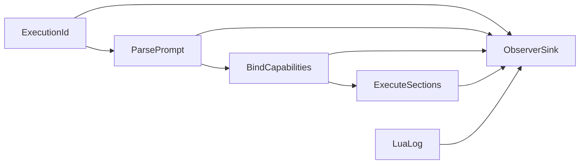

## Commit steps

Each step is implemented by a subagent, committed, reviewed in a fresh context, fixed from scratch `vibe-review.md`, re-reviewed, and amended before the next step. Do not stop to ask between steps.

1. **Correlate observer reports**
   - Change `Observer::observe` to accept execution, section, and detail.
   - Thread one ID through `Prompt::parse`, `bind_prompt`, `RunOptions`, `SectionVm`, model/tool loops, store reports, CLI, MCP, and every recorder.
   - Preserve report ordering and prove concurrent recorder safety with interleaved execution IDs.
   - Update observer, core, CLI, MCP, README, STATUS, and authoritative design documentation.

2. **Add constrained Lua logging and disable print**
   - Add `print` to `harden()` and verify it is unavailable.
   - Install `log(message)` with phase-local borrowed observer context in all executable Lua phases.
   - Validate arity, UTF-8 string type, 256-character limit, and single-line/control-free content.
   - Test H1 binding and replay, preamble, epilog, compatibility path, concurrent executions, ordering, validation failures, NullObserver equivalence, and absence of retained observer references.
   - Document the intentional payload-bearing exception and privacy rule.

3. **Remove author prompt versions**
   - Remove `Frontmatter::version`, `Entry::version`, `RunResult::version`, registry/runner plumbing, list and run JSON fields, constructor parameters, golden tool descriptions, fixtures, and shipped prompt keys.
   - Retain and regression-test every `promptforge:` detection and engine-major gate.
   - Update parser, catalog, result, registry, server, CLI, MCP, README, STATUS, and design documentation.

4. **Create the prompt-file integration harness**
   - Add one Cargo integration target at `tests/it/main.rs` with explicit `include_str!` fixture registration.
   - Rename `tests/valid/1.md` to `tests/valid/minimal.md`.
   - Add representative valid and invalid prompt documents and table-driven public-API assertions.
   - Do not duplicate narrow inline parser tests; remove an inline test only when the file fixture covers the same complete behavior and assertions.

5. **Add execution fixtures and close documentation**
   - Add offline execution fixtures for log checkpoints, preamble early return, and cross-section store fall-through.
   - Use a mutex-backed recording observer and stable test execution IDs.
   - Assert exact log checkpoint ordering and prove different concurrent execution IDs cannot be confused.
   - Run all shipped prompts through parse and bind smoke coverage.
   - Finalize `design-core.md`, README, STATUS, and test-count claims; keep `design-core-orig.md` byte-for-byte unchanged.

## Verification for every commit

- Targeted tests for the changed behavior
- `cargo fmt --all --check`
- `cargo clippy --all-targets --all-features -- -D warnings`
- `cargo test --locked --workspace --all-features`
- `cargo test --doc`
- `RUSTDOCFLAGS="-D warnings" cargo doc --no-deps --all-features`
- Fresh-context review using `vibe-how-to.md` and the repository's Rust rules

## Decision falsifiers

- **Three-string observer API:** revise if a required consumer needs typed fields for correctness rather than cosmetic reporting.
- **Observer-owned synchronization:** revise if an observer implementation cannot safely serialize its own sink without core coordination.
- **Constrained author logs:** revise if real prompt debugging requires multiline or structured values; do not loosen before examples establish the need.
- **Remove author version:** revise only if a real compatibility, cache, or negotiation mechanism begins consuming it.
- **Hybrid test layout:** revise if fixture files begin duplicating small parser edge cases rather than improving author-level readability.

Confidence: high - the current code inventory shows author `version` has no behavioral consumer, observer plumbing is the only concurrency seam, Lua phases already support scoped host callbacks, and the existing inline tests leave a clear author-document integration gap.

Todos:

- Add execution IDs to all observer reports
- Add constrained Lua log and disable print
- Remove unused prompt version metadata
- Create valid and invalid file fixture tests
- Add execution prompt fixtures and finalize docs

### promptforge-dev-loop

*Add a fast prompt-development loop to promptforge-core-tests: subcommands to run the existing fixed scenarios or dev-run any prompt file against a locally cached Qwen3.5 9B on a GPU-enabled llama-server, with verbose trace output and watch-mode reruns. Execute in five reviewed commit steps.*

# PromptForge Dev Loop Upgrade

## Resolution 1: What is being built

`cargo run -p promptforge-core-tests` gains subcommands:

```text
cargo run -p promptforge-core-tests                        # both fixed scenarios (unchanged, Qwen3 0.6B, CPU build)
cargo run -p promptforge-core-tests -- scenarios           # same, explicit
cargo run -p promptforge-core-tests -- dev prompt.md "in"  # run one prompt with real inference
cargo run -p promptforge-core-tests -- dev prompt.md "in" --watch
```

Dev mode provisions a pinned Qwen3.5 9B GGUF (Apache 2.0, 262K native context, native reasoning and tool calling, ~5.7 GB download once), starts a GPU-enabled `llama-server` under the existing process guard, then runs parse, bind, and execute exactly like the CLI. Verbose `(execution, section, detail)` observer records and Lua `log()` checkpoints stream to stderr; the final result prints to stdout. `--watch` keeps the server warm and reruns on every save. The fixed scenarios keep the small model and remain byte-for-byte deterministic.

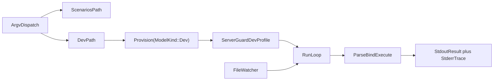

## Resolution 2: Components in dependency order

1. **Server profiles.** `server_args` hardcodes scenario flags; dev needs different context, generation limit, reasoning, KV cache, and GPU flags. Everything downstream launches through this seam.
2. **Artifact provisioning.** `provision()` hardcodes one model and CPU-only server archives. Dev needs its own model pin and GPU-enabled server assets without downloading unused artifacts.
3. **Dev runner.** Parse, bind, execute one prompt file against the guarded server with a live tool registry and a verbose observer.
4. **Argv dispatch and watch.** Subcommand routing in `main.rs`, then the warm-server rerun loop.
5. **Real-model verification and docs.** Cold and cache-only runs of both paths, provenance, README/STATUS/design updates.

## Resolution 3: Settled behavior

### Server profiles ([server.rs](C:/Users/Vinnie/src/cursor/promptforge/crates/promptforge-core-tests/src/server.rs))

- Add a `ServerProfile` threaded through `ServerGuard::start` and `server_args` (the `start_with` test seam at lines 143-205 already exists).
- The scenario profile reproduces today's exact flags; the existing `invocation_pins_deterministic_jinja_settings` test keeps pinning it.
- Dev profile: `--ctx-size` from `--context` (default 131072), `--n-predict` from `--max-tokens` (default 8192, reasoning chains are long), `--flash-attn on`, `--cache-type-k q8_0 --cache-type-v q8_0`, `-ngl 99`, `--jinja`, `--reasoning-format auto` with thinking enabled (a `--no-think` flag switches to the non-thinking preset), model-card sampling (`--temp 1.0 --top-p 0.95 --top-k 20 --presence-penalty 1.5`), `--parallel 1`.
- The 9B is a hybrid model with only 8 of 32 full-attention layers, so 128K context KV fits comfortably beside ~5.7 GB weights in 16 GB VRAM.

### Artifacts ([artifacts.rs](C:/Users/Vinnie/src/cursor/promptforge/crates/promptforge-core-tests/src/artifacts.rs))

- Parameterize provisioning: `provision(ModelKind::Scenario | ModelKind::Dev)`. `Provisioner::provision_file` is already asset-generic; only the selected `FileAsset` and server asset table change. One call never downloads the other mode's artifacts.
- Dev model pin (verified via the Hugging Face LFS metadata):
  - `unsloth/Qwen3.5-9B-GGUF`, file `Qwen3.5-9B-Q4_K_M.gguf`, 5,680,522,464 bytes, SHA-256 `03b74727a860a56338e042c4420bb3f04b2fec5734175f4cb9fa853daf52b7e8`.
  - Fallback if it misbehaves: `bartowski/Qwen_Qwen3.5-9B-GGUF` Q4_K_M, SHA-256 `d784ce9eda1a5a7b51e8f705a9e6310844bf4f173654d115823c775fdea56d43`.
- Dev server assets stay on release `b10082` (its February qwen3.5 hybrid support is confirmed in that build) but use GPU-enabled archives: Vulkan for Windows x64, Ubuntu x64, and Ubuntu arm64; the existing macOS tars are already Metal-enabled and are reused; Windows arm64 falls back to the existing CPU archive. Digests are read from the GitHub release API and committed, same as the current six entries. GPU installs get a distinct platform key (for example `windows-x86_64-vulkan`) so CPU and GPU installs coexist in `.model-cache/llama.cpp/`.
- All existing download, lock, confinement, extraction, and repair machinery is reused unchanged; offline tests extend the existing fake-HTTP harness to cover `ModelKind` selection.

### Dev runner (new `src/dev.rs`)

- Mirrors the CLI pipeline ([promptforge-cli/src/main.rs](C:/Users/Vinnie/src/cursor/promptforge/crates/promptforge-cli/src/main.rs) lines 49-117): read file, require `promptforge_version`, `Prompt::parse`, build live registry, `ToolPicker::build`, `bind_prompt`, `execute::run` - but with `client: Some(GatewayClient::new(base_url, api_key, model_alias))` pointed at the guarded server, exactly as `scenarios.rs` does. No `promptforge-gateway`.
- Registry: port the CLI's `available_tools` construction (add `promptforge-webfetch` workspace dep to this crate). `web_fetch` is always live; `web_search` joins only when `PROMPTFORGE_TOKEN`/`PROMPTFORGE_BASE_URL` name a gateway, otherwise a prompt needing search fails loudly as `Absent` at bind.
- Execution ID `dev-{nonce:016x}` per run. Verbose observer prints every `(execution, section, detail)` record - including `Lua: ...` log checkpoints - to stderr; stdout carries only the final result string. Errors print with the server's bounded diagnostics.

### Dispatch and watch ([main.rs](C:/Users/Vinnie/src/cursor/promptforge/crates/promptforge-core-tests/src/main.rs))

- Hand-rolled `std::env::args` dispatch matching workspace convention (no clap; none exists in the workspace). Empty args or `scenarios` runs today's suite unchanged; `dev <file> [input] [--watch] [--context N] [--max-tokens N] [--no-think]` runs the dev path. Unknown args fail with usage text.
- The existing Ctrl-C `tokio::select!` wrapper in `main` is preserved and wraps both paths.
- `--watch` uses the workspace `notify = "8"` dependency (already used by the MCP server) with a thin debounced watcher on the single prompt file - not the MCP `Watcher` type. The server and provisioned artifacts stay warm; each save re-reads, re-parses, re-binds, and re-executes. A failed parse prints the error and keeps watching.

## Resolution 4: Testable commit steps

Each step carries its code, its regression tests, and its documentation, is committed, fresh-context reviewed via scratch `vibe-review.md`, fixed, and amended before the next step, per the established workflow. Do not stop to ask between steps.

1. **Introduce server profiles**
   - `ServerProfile` through `start`/`start_with`/`server_args`; scenario profile identical to today; dev profile as specified.
   - Tests: scenario args byte-identical (existing test retained), dev args exact including GPU/KV/reasoning flags, context and max-tokens plumbing, `--no-think` variant.
   - Complete when scenarios still pass offline arg pinning and no caller change exists yet.
2. **Parameterize artifact provisioning**
   - `ModelKind`, dev model pin, GPU server asset entries with committed URL and SHA-256 values, distinct install platform keys.
   - Tests: extend the fake-HTTP harness for `ModelKind` selection, single-mode download isolation, GPU-key install coexistence; digest constants match the release API values recorded in the crate README.
   - Complete when offline tests cover both kinds and no real host is contacted by `cargo test`.
3. **Add the dev runner module**
   - `src/dev.rs`: registry port, verbose observer, single-shot parse-bind-execute against a `ServerGuard`, `dev-` execution IDs, stderr/stdout separation, bounded diagnostics on failure. Add `promptforge-webfetch` dependency.
   - Tests: observer formatting, registry composition with and without gateway env, argument validation, non-promptforge file refusal - all offline.
   - Complete when the module compiles and its offline tests pass without being reachable from `main`.
4. **Wire subcommands and watch mode**
   - Argv dispatch in `main.rs`, usage text, `--watch` via `notify` with debounce, warm-server rerun loop, parse-failure resilience, Ctrl-C teardown across both modes.
   - Tests: dispatch table, flag parsing, debounce/rerun trigger logic with a fake event source - offline.
   - Complete when `scenarios` remains default and byte-compatible and `dev --watch` logic is covered offline.
5. **Real-model verification and documentation closure**
   - Run `cargo run -p promptforge-core-tests` (cache-only scenarios) and `cargo run -p promptforge-core-tests -- dev <fixture> "input"` twice: first run downloads the ~5.7 GB model plus the GPU server archive, second run must be cache-only. Verify a tool-calling prompt end to end and clean teardown.
   - Docs: crate README (commands, flags, both model provenances, GPU archive provenance), root [README.md](C:/Users/Vinnie/src/cursor/promptforge/README.md), [STATUS.md](C:/Users/Vinnie/src/cursor/promptforge/STATUS.md), and the real-model item in [design-core.md](C:/Users/Vinnie/src/cursor/promptforge/crates/promptforge-core/design-core.md); `design-core-orig.md` stays byte-identical.
   - Complete when both commands succeed, the second dev run reports only cache hits, and the full offline verification suite is green.

## Verification for every commit

- Targeted tests, then `cargo fmt --all --check`, `cargo clippy --all-targets --all-features -- -D warnings`, `cargo test --locked --workspace --all-features`, `cargo test --doc`, `RUSTDOCFLAGS="-D warnings" cargo doc --no-deps --all-features`.
- Ordinary `cargo test` stays fully offline; real downloads and inference happen only in step 5's explicit commands.

## Decision log and falsifiers

1. **Vulkan/Metal GPU builds for dev, CPU build kept for scenarios.** One archive per platform, vendor-neutral, no CUDA DLL companion. Falsifier: Vulkan on the user's card is unstable or materially slower than CUDA; switch the Windows x64 dev asset to the CUDA 12.4 pair.
2. **Thinking enabled by default in dev.** The user asked for reasoning quality; `--reasoning-format auto` separates reasoning from content. Falsifier: `GatewayClient` mishandles replies with reasoning content or tool calls degrade; flip the default to `--no-think` behavior.
3. **Community GGUF pin (unsloth).** No official Qwen3.5 9B GGUF exists; the pin is by exact URL and SHA-256. Falsifier: quality or tool-call defects traced to the conversion; move to the bartowski fallback pin.
4. **Hand-rolled argv, no clap.** Matches every workspace binary. Falsifier: flag surface grows past comfortable manual parsing.
5. **Watch by `notify`, per-file debounce, warm server.** Falsifier: editor save patterns (atomic rename) evade the watcher; widen to watching the parent directory for the file name.
6. **128K default context.** The model card advises at least 128K for thinking; hybrid KV makes it cheap. Falsifier: measured VRAM overflow on 16 GB; lower the default and document `--context`.

## Project-specific review

<project-review>
1. Does the commit implement only its numbered step?
2. Scenario path byte-identical: same model, same server args, same assertions?
3. Are all new artifact URLs official-or-named-community with committed SHA-256, staged and confined under `.model-cache/`?
4. Does ordinary `cargo test` remain free of downloads, external processes, network, models, and credentials?
5. Does every spawned server terminate on success, error, panic, and Ctrl-C, including in watch mode?
6. Does dev output keep the result on stdout and all trace on stderr?
7. Are alias binding failures (`Absent`) surfaced clearly when a capability lacks a live tool?
8. Is `design-core-orig.md` byte-for-byte unchanged?
9. Does every new behavior have a regression test that fails without it?
10. Do formatting, strict Clippy, workspace tests, doctests, and warning-denied docs pass?
</project-review>

## Vibe execution protocol

Implement each step in a subagent given this plan path and the step number; commit in the main context; review in a fresh subagent writing actionable findings to scratch `vibe-review.md`; fix in another subagent; re-review until clean; amend the unpushed commit; continue immediately to the next step without asking. Commits and amendments for these steps follow the workflow already authorized in this session.

Todos:

- Introduce scenario and dev server profiles
- Parameterize provisioning with dev model and GPU builds
- Add the dev prompt runner module
- Wire subcommands and watch mode
- Verify real-model paths and close documentation

### models debug cluster

*Full cluster in dependency order: a payload DebugCapture seam so empty replies are diagnosable, payload-free observer details for empty/truncated turns, then prompt-level model bindings (`models.need` / `models.use`) with gateway catalog metadata and per-call temperature/thinking, plus user-facing docs throughout.*

# Model bindings and debug cluster

## Governing guides

- [tools-public/rulebooks/vibe-rulebook.md](C:\Users\Vinnie\src\cursor\tools-public\rulebooks\vibe-rulebook.md) - one testable commit per step; implement in subagent; review in fresh context via scratch; amend unpushed commit; never ask between steps; old bugs get their own commit.
- [tools-public/rulebooks/rust-rulebook.md](C:\Users\Vinnie\src\cursor\tools-public\rulebooks\rust-rulebook.md) - tests land with code; `Result` for expected failures; fmt + clippy clean; documented public items with `# Errors`.

Lean loop (from recent session): implementer runs targeted crate tests; parent commits; review reads the diff while full workspace suite runs in parallel; small findings fixed in parent and amended.

Scratch review file: `cabinet/_scratch/vibe-review-promptforge-models/vibe-review.md` (overwrite each cycle).

Do not touch `design-core-orig.md` (byte-frozen).

## Decision log

| Decision | Choice | Falsifier |
|---|---|---|
| Debug vs Observer | Separate `DebugCapture` on `RunOptions`; Observer stays payload-free | Any host needs payloads through Observer alone |
| H1 / H2 API | `models.need(alias, description, opts?)` and `models.use(alias)` | Authors cannot express per-section model choice |
| Constraint vs invocation | `context` and `thinking` capability filter the catalog; `temperature`, `max_tokens`, and switchable `thinking` ride per request | Backend rejects a field that was advertised as supported |
| Same weights, different params | Legal - identity is alias to binding (ModelId + invocation), not to weights | Two aliases collide incorrectly as Duplicate |
| No `models.use` | Host default client model (today's behavior) | Existing prompts break |
| Gateway role | Catalog metadata + `GET /v1/models`; request body stays passthrough via `rest` | Hosts invent model metadata out of band |
| Thinking dialect (v0) | Client emits OpenAI-shaped `chat_template_kwargs.enable_thinking` when binding requests it; backends that ignore it are catalogued `thinking = "never"` or `"always"` so bind filters them | A hybrid model cannot turn thinking off |

## Architecture

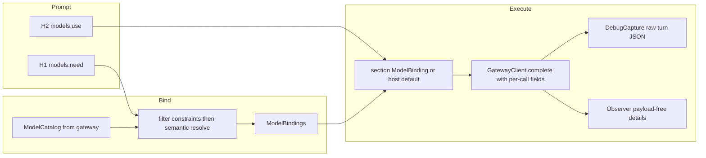

---

## Step 1 - DebugCapture seam

**Goal:** hosts can opt into raw request/response capture without widening `Observer`.

In [promptforge-core](C:\Users\Vinnie\src\cursor\promptforge\crates\promptforge-core):

- Add `DebugCapture: Send + Sync` trait with a single method that receives `(execution, section, turn_index, event)` where `event` is an owned enum carrying request body and/or response body as `serde_json::Value` (and finish_reason / reasoning_content when present). `NullDebugCapture` or `Option<&dyn DebugCapture>` on `RunOptions` - prefer `Option` so production hosts pay zero.
- Extend `RunOptions` with `debug: Option<&'a dyn DebugCapture>`.
- In [client.rs](C:\Users\Vinnie\src\cursor\promptforge\crates\promptforge-core\src\client.rs) / the tool loop in [execute.rs](C:\Users\Vinnie\src\cursor\promptforge\crates\promptforge-core\src\execute.rs): after building the request body and after parsing the response, call the capture when `Some`. Parsing must surface `finish_reason` and optional `reasoning_content` alongside today's `CompletionResult` (internal fields or a richer result type) so later steps can observe them; still do not put those payloads on the Observer.
- Dev runner in [promptforge-core-tests](C:\Users\Vinnie\src\cursor\promptforge\crates\promptforge-core-tests): implement a capture that writes `turn-N-request.json` and `turn-N-response.json` under `<prompt-stem>.store/.trace/` (same dump directory as store files; announce on stderr). Wire it in `run_once` always for dev mode.

**Tests:** offline fake HTTP - capture receives request/response when set; `None` changes nothing; dump lands beside the prompt under `.trace/`.

**Docs this step:** one short paragraph in root README "The prompt dev loop" and core-tests README that `.store/.trace/` holds raw turns.

---

## Step 2 - Empty reply and finish-reason observer details

**Goal:** payload-free signals that would have named today's empty `evidence.md`.

In [observe.rs](C:\Users\Vinnie\src\cursor\promptforge\crates\promptforge-core\src\observe.rs) `detail`:

- `MODEL_REPLY_EMPTY` = `"Model reply was empty"`
- `MODEL_TURN_TRUNCATED` = `"Model turn truncated"` (when `finish_reason == "length"`)

Emit from the tool loop when binding final text: empty `content` after a successful parse fires `MODEL_REPLY_EMPTY`; `finish_reason == "length"` fires `MODEL_TURN_TRUNCATED` (may fire with or without empty content). Keep `MODEL_TURN_COMPLETED` as today.

**Tests:** fake completion with empty content and/or `finish_reason: "length"` asserts the new details appear in a recorder.

**Docs this step:** "Watching a run" in root README names the two new details.

---

## Step 3 - Gateway model catalog

**Goal:** hosts fetch authoritative model metadata instead of inventing it.

In [promptforge-gateway](C:\Users\Vinnie\src\cursor\promptforge\crates\promptforge-gateway):

- Extend `ModelConfig` in [config.rs](C:\Users\Vinnie\src\cursor\promptforge\crates\promptforge-gateway\src\config.rs):
  - `description: String` (required for catalogued models - bind needs prose)
  - `context: u32` (context window size)
  - `thinking: ThinkingMode` enum: `never` | `always` | `switchable` (default `never` for today's Anthropic entry)
- Add `GET /v1/models` (bearer-authed like chat) returning OpenAI-shaped list plus PromptForge extensions in each object: `id` (= caller `name`), `description`, `context`, `thinking`.
- Update [gateway.toml](C:\Users\Vinnie\src\cursor\promptforge\gateway.toml) with description/context/thinking for `claude-sonnet-4-6`.
- Leave chat passthrough unchanged (`rest` already carries temperature / max_tokens / chat_template_kwargs).

**Tests:** config load rejects missing description/context; `/v1/models` returns the configured entries; unknown key still fails load.

**Docs this step:** README "Gateway configuration" documents the new `[[model]]` fields and `GET /v1/models`.

---

## Step 4 - Core language: `models.need` / `models.use`

**Goal:** prompt-local model bindings mirror tools.

### Types (promptforge-core)

- `ModelId` - stable identity (`server` + `name`, or single gateway-facing name; match ToolId shape if a server namespace helps multi-gateway later - for v0 use one namespace `"gateway"` + model name).
- `ModelDescriptor` - id, description, context, thinking mode.
- `ModelCatalog` / `ModelRegistry` - complete live set for the run (host-built).
- `ModelNeedOpts` from Lua table: optional `thinking` (bool), `context` (integer min), `temperature` (number), `max_tokens` (integer).
- `ModelBinding` - alias + resolved `ModelId` + frozen invocation (`temperature`, `max_tokens`, `thinking: Option<bool>`).
- `ModelBindings` - frozen H1 declarations; parallel to `ToolBindings`.

### Lua

- H1 binding VM: `models.need(alias, description, opts?)` - resolve as below; `models.use` forbidden.
- H1 replay: exact declaration replay like tools.
- H2: `models.use(alias)` - at most once before scope close; `models.need` forbidden. Closing records `Option<ModelBinding>` for the section (None = host default).

### Resolve

1. Filter catalog by hard constraints from opts (`context >= N`; if `thinking == false` require `switchable` or `never`; if `thinking == true` require `switchable` or `always`).
2. Semantic resolve description against filtered catalog via existing `promptforge-tool-picker` (build a `Catalog` of descriptors from model descriptions - reuse picker, do not fork a second embedding stack).
3. Outcomes: Bind / Absent / Duplicate / Ambiguous - all-but-Bind fatal at `bind_prompt`, same as tools.
4. Do **not** run tool-style near-duplicate rejection across model aliases that share weights with different invocation params.

### Bind / execute

- Extend `bind_prompt` (or a sibling that hosts call once) to accept `ModelCatalog` + picker and freeze `ModelBindings` into `BoundPrompt`.
- Section execution: after H2 close, if `models.use` selected a binding, build per-call fields for every `complete` in that section; else use `RunOptions.client`'s model with no extra sampling fields (compat).
- Extend `GatewayClient::complete` to accept optional `CompletionOptions { model override, temperature, max_tokens, thinking }` merged into the JSON body (`chat_template_kwargs` when thinking is `Some`).

### Hosts

- CLI / MCP: fetch `GET /v1/models` at boot (or first bind), build catalog; fail bind with clear Absent if catalog empty and prompt declares models.
- Dev runner: advertise the pinned Qwen3.5 as one catalog entry (`context` from server profile default 131072, `thinking: switchable`, description suited to analysis); still use llama-server for chat; gateway token still gates web_search only.

**Tests:** need resolves; constraint filters; use selects per section; no use keeps default; Absent on missing token-less search remains separate; wrong-arity / undeclared use fails loudly.

**Docs this step:** `design-core.md` new item for model bindings; root README "Prompt file anatomy" and "Prompt language" show `models.need` / `models.use`; note Lua table opts (no keyword args).

---

## Step 5 - User-facing docs pass and fixture

- Root [README.md](C:\Users\Vinnie\src\cursor\promptforge\README.md): consolidate Prompt language (tools + models), Gateway `[[model]]` + `/v1/models`, Watching a run (new details), Dev loop (`.store` + `.trace`).
- [design-core.md](C:\Users\Vinnie\src\cursor\promptforge\crates\promptforge-core\design-core.md): authoritative lifecycle paragraphs for DebugCapture, model bind/execute, observer details.
- Crate READMEs for gateway and core-tests as needed.
- Update [briefer.md](C:\Users\Vinnie\src\cursor\promptforge\briefer.md) (user prompt, keep untracked via exclude if needed) or add a tracked example under `prompts/` demonstrating:

```lua
models.need("analyst", "A model suited for careful analysis", { thinking = false, temperature = 0, context = 40000 })
```

```lua
models.use("analyst")
tools.add("search", "fetch")
```

- `STATUS.md` if it still lists gaps this closes.

---

## Project-review checks

1. Observer remains payload-free; DebugCapture is opt-in and unused by CLI/MCP by default.
2. `design-core-orig.md` untouched.
3. Ordinary `cargo test` stays offline (gateway `/v1/models` and DebugCapture tested with loopback fakes).
4. Scenario suite byte contracts unchanged (no temperature/thinking on scenario path unless already pinned).
5. Dev stdout remains result-only; traces and dump announcements on stderr.
6. Gateway still passthrough for unknown chat fields; catalog is additive.
7. Existing prompts without `models.*` behave identically.
8. User-facing docs describe grammar, gateway fields, and `.store/.trace` without staging paths.

## Data-flow note

Step 1 produces the capture seam execute needs. Step 2 consumes finish_reason/content emptiness from step 1's richer parse. Step 3 produces catalog JSON hosts need. Step 4 consumes catalog + picker + client options; DebugCapture already records the new per-call fields. Step 5 documents the shipped surface. No step waits on undocumented chat context.


Todos:

- Add DebugCapture seam, richer completion parse, wire into execute and core-tests .store/.trace dump
- Add MODEL_REPLY_EMPTY and MODEL_TURN_TRUNCATED observer details with tests
- Extend ModelConfig and add bearer-authed GET /v1/models; update gateway.toml
- Implement models.need / models.use bind+execute+client CompletionOptions; wire CLI/MCP/dev hosts
- User-facing docs (README, design-core, crate READMEs) and example prompt using models.need/use

### completion normalize layer

*Introduce a slender CompletionNormalizer API in promptforge-core (one module, drop-in trait) and make empty final content a hard error - the targeted fix for briefer - while keeping special cases out of execute and hosts.*

# Completion normalization layer

## Pros and cons (why this shape)

**Pros**
- One door for wire quirks: field synonyms (`reasoning_content` / `reasoning` / `thinking`), empty content, tool-call-with-null-content live in one module instead of execute, client, and hosts.
- PromptForge code reads as if a library owned the problem: `normalizer.normalize(body) -> NormalizedTurn`.
- Drop-in later: swap `OpenAiChatNormalizer` for a thicker adapter (or a future crate) without rewriting the tool loop.
- Matches the product: many small models, many OpenAI-compat servers; hosts stay dumb.

**Cons**
- A trait + default impl is slightly more surface than a private `parse_completion` - paid once so special cases do not multiply.
- Hard-fail on empty content will break any prompt that today "succeeds" with empty `reply` (briefer's silent empty `evidence.md`). That breakage is the point.
- A trait does not by itself fix vendors; it only concentrates where PromptForge decides what a turn means.

**Not doing:** adopting `genai` / `rig` / a separate published crate in this change. The module is the seam; a crate can graduate later if the file grows.

**Policy (locked):** never promote `reasoning_content` into the answer. Final turn with no tool calls and empty/missing `content` is an error, even when reasoning is present. Tool calls with empty `content` remain valid.

---

## Architecture

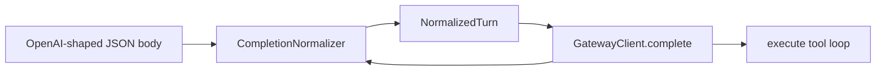

Single new module: [`crates/promptforge-core/src/normalize.rs`](C:\Users\Vinnie\src\cursor\promptforge\crates\promptforge-core\src\normalize.rs).

| Piece | Role |
|---|---|
| `NormalizedTurn` | `outcome: CompletionResult`, `finish_reason`, `reasoning_content` (side channel only) |
| `CompletionNormalizer` | `fn normalize(&self, body: &Value) -> Result<NormalizedTurn>` |
| `OpenAiChatNormalizer` | Default impl: today's parse + synonyms + empty-text error |
| `Error::EmptyModelReply` | Distinct from `MalformedResponse`; message names empty content (and that reasoning was ignored if present, without pasting it) |

[`GatewayClient::complete`](C:\Users\Vinnie\src\cursor\promptforge\crates\promptforge-core\src\client.rs) calls the normalizer instead of private `parse_completion`. For slender drop-in without threading every host: store `Arc<dyn CompletionNormalizer>` on `GatewayClient`, defaulting to `OpenAiChatNormalizer` in `new` / `from_env`. A later host can construct with another impl; execute and RunOptions stay unchanged.

Execute tool loop: on `complete` error after a successful HTTP round trip that normalized to empty text, existing `MODEL_TURN_FAILED` fires. Keep `MODEL_REPLY_EMPTY` only if somehow empty text still returned as `Ok` (it should not for the default normalizer); prefer hard error so epilogs never see `reply == ""` from this failure mode. Truncation (`finish_reason == length`) stays an observer detail when text is non-empty; empty+length still hard-fails as empty reply.

---

## Steps (lean vibe)

Governing guides: [vibe-rulebook](C:\Users\Vinnie\src\cursor\tools-public\rulebooks\vibe-rulebook.md) + [rust-rulebook](C:\Users\Vinnie\src\cursor\tools-public\rulebooks\rust-rulebook.md). Lean protocol: targeted tests in implementer; parallel full suite + diff-only review; **one amend round**; max three findings; never ask between steps. Scratch: `cabinet/_scratch/vibe-review-promptforge-normalize/vibe-review.md`.

### Step 1 - Normalize module + hard-fail empty text

- Add `normalize.rs`, export from `lib.rs`.
- Move parse logic out of `client.rs` into `OpenAiChatNormalizer::normalize`.
- Synonyms for reasoning: first non-empty among `reasoning_content`, `reasoning`, `thinking` (string fields only).
- Empty/missing `content` and no tool calls → `Error::EmptyModelReply` (include a fixed phrase if reasoning was present, e.g. "reasoning content was present but ignored", no payload).
- Non-empty tool_calls → success even when content is `""` / null.
- `GatewayClient` holds `Arc<dyn CompletionNormalizer>` defaulting to `OpenAiChatNormalizer`.
- Unit tests in `normalize.rs`: answer+reasoning; tools+empty content; empty content+reasoning → error; null content no tools → error; synonym `reasoning` field.
- Update client tests that called `parse_completion` to use the normalizer.
- Update execute tests that expected empty-text success to expect run failure / `MODEL_TURN_FAILED` instead of soft empty success.

### Step 2 - Docs

- Short `design-core.md` paragraph: normalization seam, hard-fail policy, no reasoning-as-answer.
- Root README "Watching a run" / client note: empty final content fails the run; `MODEL_REPLY_EMPTY` is not the success path for that case anymore (adjust wording to match shipped behavior).
- Do not touch `design-core-orig.md`.

---

## Project-review

1. Special cases live only in `normalize.rs` (and its tests).
2. No silent empty `reply` from empty content.
3. Reasoning never becomes answer text.
4. Tool-call turns with empty content still work.
5. Default normalizer is what every current host gets without API churn beyond `GatewayClient` construction internals.
6. `design-core-orig.md` untouched.
7. Tests would fail if empty+reasoning were accepted as `Text("")`.


Todos:

- Add CompletionNormalizer + OpenAiChatNormalizer; hard-fail empty final content; wire GatewayClient; update tests
- Document normalization seam and hard-fail policy in design-core and README

### webfetch soft errors

*Change web_fetch so recoverable target failures (HTTP non-2xx, unsupported/missing content type, timeout, size, charset, DNS) return Ok tool text the model can read, matching industry soft-error practice, while SSRF and URL-admission policy failures keep aborting the tool call.*

# Soft-return recoverable web_fetch failures

## Why

[`WebFetch::call`](promptforge/crates/promptforge-webfetch/src/lib.rs) turns non-2xx into `Err(Error::Backend { ... })`. The tool loop then does `result?` and aborts the section/fanout ([`execute.rs`](promptforge/crates/promptforge-core/src/execute.rs) ~832-842). That killed briefer on `https://cppalliance.org/about/` (404) and earlier on PDFs. Industry practice (Anthropic `web_fetch`, OpenAI Agents, LangChain) is soft tool results so the model retries another URL. Research: `2026-08-08-fetch-tool-http-error-handling`.

## Policy (locked)

| Class | Examples | Behavior |
|---|---|---|
| Recoverable target failure | HTTP 4xx/5xx, unsupported/missing content type, timeout, too large, undecodable charset, DNS failure | `Ok(model_facing_text)` - tool succeeds, loop continues, observer still sees success |
| Policy / admission | invalid URL, blocked scheme/port/userinfo/IP literal, blocked address, no allowed address, redirect refused | `Err(...)` - hard fail unchanged |

Do not put the HTTP error response body into the tool result (it is untrusted HTML and not useful for recovery). Message names status + final URL + a next-move hint.

No change to the execute loop contract: tools that still return `Err` abort; webfetch simply stops returning `Err` for the recoverable class. The existing `FailingTool` execute test stays.

## Implementation

Single commit, lean vibe (targeted webfetch tests + parallel workspace suite + one amend round). Scratch: `cabinet/_scratch/vibe-review-promptforge-webfetch-soft/vibe-review.md`.

### Step 1 - Soft recoverable results in webfetch

In [`crates/promptforge-webfetch/src/error.rs`](promptforge/crates/promptforge-webfetch/src/error.rs):

- Add `FetchError::HttpStatus { url, status }` with Display / model_facing like: `HTTP {status} from {url}; try a different URL`.
- Add `FetchError::is_soft_tool_result(&self) -> bool` true for: `HttpStatus`, `UnsupportedContentType`, `NoContentType`, `Timeout`, `TooLarge`, `Undecodable`, `Dns`. False for admission/SSRF variants.

In [`crates/promptforge-webfetch/src/lib.rs`](promptforge/crates/promptforge-webfetch/src/lib.rs) `call`:

- Non-2xx: build `FetchError::HttpStatus` from `final_url` + status; `return Ok(err.model_facing())` (drop the truncated body path used for `Error::Backend`).
- For other fallible paths that produce a soft `FetchError`, return `Ok(err.model_facing())` instead of `Err(err.into())`. Keep hard variants as `Err`.
- Prefer a tiny local helper, e.g. `fn tool_outcome(err: FetchError) -> Result<String>`, so every soft/hard site is one line.

Tests in webfetch (wiremock/axum style already in crate):

- 404 → `Ok`, text contains `404` and the URL; call does not return `Err`.
- 500 → soft Ok the same way.
- `application/pdf` → soft Ok with content-type hint (regression for the earlier briefer abort).
- Blocked / invalid URL still `Err` (SSRF path unchanged).

Docs: short update in [`design-webfetch.md`](promptforge/crates/promptforge-webfetch/design-webfetch.md) choice 14 / error section - recoverable target failures are soft tool results; policy failures remain hard. Touch README/STATUS only if they claim every fetch failure aborts the run.

## Project-review

1. 404/PDF no longer abort the tool loop; model gets actionable text.
2. SSRF and URL admission still hard-fail.
3. Error response bodies never enter tool results.
4. Execute loop and `FailingTool` hard-fail test unchanged.
5. Tests would fail if non-2xx still returned `Err`.


### extract promptforge-dev crate

*Extract the interactive prompt runner into a new `promptforge-dev` crate that talks to an already-running gateway, keep the 0.6B scenario suite self-contained in `promptforge-core-tests`, and ship friendly README + design docs for the new tool.*

# Extract `promptforge-dev` and simplify core-tests

## Decisions (locked)

- **Crate / binary name:** `promptforge-dev` (default; short and clear).
- **Dev mode never starts infrastructure.** It requires an already-running `promptforge-gateway` via `PROMPTFORGE_GATEWAY_URL` + `PROMPTFORGE_GATEWAY_KEY`. Hard-fail with a friendly message if either is missing or the gateway is unreachable.
- **Scenario suite keeps its sidecar.** `promptforge-core-tests` (default / `scenarios`) still starts a temporary gateway profile for the pinned 0.6B model so real-inference integration tests stay self-contained without Brave or a hand-started gateway.
- **Server knobs leave the CLI.** `--context`, `--max-tokens`, and `--no-think` configure a spawned local model today. After the split they belong only in the operator's `gateway.toml`. The new binary does not re-offer them.
- **Model catalog comes from the live gateway.** Replace `pinned_qwen_dev_catalog` on the dev path with `fetch_model_catalog` (same as [`promptforge-cli`](promptforge/crates/promptforge-cli/src/main.rs)), so `models.need` / `models.always` resolve against what the gateway actually advertises.

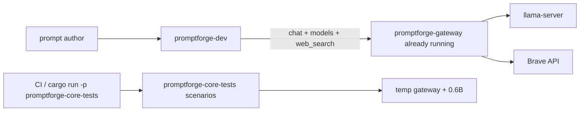

## Target layout

New crate [`crates/promptforge-dev/`](promptforge/crates/promptforge-dev/):

| Path | Role |
|---|---|
| `Cargo.toml` | `publish = false`, bin `promptforge-dev` |
| `README.md` | Friendly end-user instructions |
| `design.md` | Why this crate exists, what it owns, what it refuses to own |
| `src/main.rs` | Args: `<prompt> [input] [--watch]` |
| `src/run.rs` | One-shot run (moved from `dev.rs`) |
| `src/watch.rs` | Debounced rerun on save |
| `src/dump.rs` | Store dump + `.trace/` capture |
| `src/tools.rs` | `web_fetch` always; `web_search` when env credentials present |

Slim [`crates/promptforge-core-tests/`](promptforge/crates/promptforge-core-tests/):

- Keep: `scenarios.rs`, scenario-only parts of `gateway.rs`, offline `suite.rs`, fixture prompts under `prompts/valid|invalid|execution/`.
- Remove: `dev` subcommand, `dev.rs`, `watch.rs`, `dump.rs`, `DevServerOptions` / `GatewayProfile::Dev`, `prompts/dev/`, and all `--context` / `--max-tokens` / `--no-think` parsing.
- Binary usage becomes: `promptforge-core-tests` or `promptforge-core-tests scenarios` only.

Workspace: add `crates/promptforge-dev` to root [`Cargo.toml`](promptforge/Cargo.toml) members.

## Behavior of `promptforge-dev`

1. Parse args: prompt path, optional input, optional `--watch`.
2. Require `PROMPTFORGE_GATEWAY_URL` and `PROMPTFORGE_GATEWAY_KEY`.
3. Clear `<prompt-stem>.store/` before each run (keep current pre-clear behavior).
4. Parse / bind / execute against the gateway:
   - `fetch_model_catalog`
   - live tools: `WebFetch` + optional `WebSearch(url, key)`
   - `GatewayClient::new(url, key)` (model from catalog / section binding)
   - verbose observer on stderr; result on stdout
   - always-on `DebugCapture` flushed after store dump
5. Watch mode: keep process alive, rerun on prompt save; no gateway lifecycle.

## Documentation (crate-owned, friendly)

**[`crates/promptforge-dev/README.md`](promptforge/crates/promptforge-dev/README.md)** - written for a prompt author, not a core contributor:

- What this tool is (iterate on a prompt against your live gateway)
- Prerequisites: start `promptforge-gateway` with a working `gateway.toml` (model + optional Brave search)
- Env vars: `PROMPTFORGE_GATEWAY_URL`, `PROMPTFORGE_GATEWAY_KEY`
- Install / run: `cargo run -p promptforge-dev -- <prompt.md> [input] [--watch]`
- What appears on stdout vs stderr
- Where dumps go (`*.store/`, `.trace/`), and that each run clears the previous dump
- How `web_search` appears (only when the gateway exposes it and credentials are set)
- Short troubleshooting: missing env, unreachable gateway, Absent tool, empty model reply

**[`crates/promptforge-dev/design.md`](promptforge/crates/promptforge-dev/design.md)** - design choices:

1. Dev never starts the gateway (operator owns infra).
2. Scenario tests keep a temporary 0.6B gateway for self-contained inference coverage.
3. Catalog is fetched, not pinned, so prompts track the live deployment.
4. Dump-before-run so stale traces never masquerade as the current run.
5. Observer/debug stay out of the result stream (stderr / `.trace/` only).

Also update root [`README.md`](promptforge/README.md) and [`crates/promptforge-core-tests/README.md`](promptforge/crates/promptforge-core-tests/README.md) so they stop advertising `core-tests -- dev` and point authors at `promptforge-dev`.

## Steps (lean vibe)

Governing: vibe-rulebook + rust-rulebook. One review amend per commit. Scratch: `cabinet/_scratch/vibe-review-promptforge-dev/vibe-review.md`.

### Step 1 - Create `promptforge-dev` and move the runner

- Add crate + workspace member.
- Move `dev.rs` / `watch.rs` / `dump.rs` logic; strip all gateway-spawn / `DevServerOptions` / pinned-catalog usage.
- Wire env-required gateway client + `fetch_model_catalog`.
- Port offline unit tests that do not need a live gateway (arg parsing, dump, watch debounce, tool registry construction).
- CLI: `promptforge-dev <prompt> [input] [--watch]`.

### Step 2 - Slim `promptforge-core-tests` to scenarios + fixtures

- Delete the `dev` command path and unused modules / flags / `prompts/dev/`.
- Keep scenario gateway spawn for 0.6B only.
- Rewrite the crate README around offline fixtures + explicit scenario suite.

### Step 3 - Docs pass

- Write `promptforge-dev/README.md` and `design.md`.
- Update root README and any STATUS mentions of the old `core-tests -- dev` command.

## Project-review

1. `promptforge-dev` never launches `promptforge-gateway` or `llama-server`.
2. Missing gateway env fails before any prompt parse with a clear message.
3. Scenario suite still runs real 0.6B inference without a hand-started gateway.
4. Store dump still clears before each run and writes `.trace/` after.
5. Root and core-tests docs no longer tell authors to use `core-tests -- dev`.
6. `design-core-orig.md` untouched.


### local.toml bigger model

*Create operator gateway profile `C:\Users\Vinnie\cursor\local.toml` for the pinned Qwen3.5-9B local model, based on the repo’s local example, so `promptforge-dev` binds that model instead of Anthropic Sonnet.*

# Create `C:\Users\Vinnie\cursor\local.toml` for Qwen3.5-9B

## Decision

**Bigger model = Qwen3.5-9B Q4_K_M** (same pin as [`gateway.local.example.toml`](promptforge/gateway.local.example.toml) and gateway `DEV_MODEL_*` constants). Not Anthropic. Not the 0.6B scenario model.

## File to write

Path: `C:\Users\Vinnie\cursor\local.toml` (create `C:\Users\Vinnie\cursor\` if missing). Outside the promptforge repo; not committed.

Contents derived from [`promptforge/gateway.local.example.toml`](promptforge/gateway.local.example.toml), plus Brave search so briefer keeps working:

```toml
[server]
bind = "127.0.0.1:8081"
key = "${PROMPTFORGE_GATEWAY_KEY}"

[queue]
max_depth = 100
fair_scheduling = true

[[local_model]]
name = "qwen-local"
description = "A careful analysis model suited to structured reasoning and long-context review"
source = "https://huggingface.co/unsloth/Qwen3.5-9B-GGUF/resolve/main/Qwen3.5-9B-Q4_K_M.gguf"
sha256 = "03b74727a860a56338e042c4420bb3f04b2fec5734175f4cb9fa853daf52b7e8"
context = 65536
thinking = "never"
gpu_layers = 99
flash_attention = true
cache_type_k = "q8_0"
cache_type_v = "q4_0"
n_predict = 8192

[tools.web_search]
provider = "brave"
api_key = "${BRAVE_API_KEY}"
```

Notes:
- Description matches briefer’s `models.always` sentence so the picker binds `qwen-local`.
- `context = 65536` satisfies briefer’s `context = 65536` need.
- No `[[endpoint]]` / Claude `[[model]]` in this profile.

## After write (operator; not automated)

1. Stop the current gateway if it is still serving Anthropic `gateway.toml`.
2. Start: `cargo run -p promptforge-gateway -- serve C:\Users\Vinnie\cursor\local.toml` (from the promptforge repo), with `PROMPTFORGE_GATEWAY_KEY` and `BRAVE_API_KEY` set.
3. First boot downloads GGUF + llama-server into `~/.promptforge` (large).
4. Point `promptforge-dev` at `http://127.0.0.1:8081` with the same key.

No Rust or repo file changes in this step.


Todos:

- Create C:\Users\Vinnie\cursor\local.toml from gateway.local.example.toml + web_search

### gateway download progress

*Add an indicatif progress bar (percent, bytes, rate, ETA) to promptforge-gateway local artifact downloads so large GGUF fetches are visible on a TTY.*

# Gateway download progress bar

## Decision

Use [`indicatif`](https://crates.io/crates/indicatif) in [`crates/promptforge-gateway/src/local/artifacts.rs`](promptforge/crates/promptforge-gateway/src/local/artifacts.rs) `download`. On a TTY stderr: bar + percent + transferred/total + rate + ETA + spinner-style template. When stderr is not a TTY (CI / redirected logs): no bar; emit `tracing::info!` every ~5% or 64 MiB with percent and bytes so progress still appears in logs.

Default: progress on stderr only (keeps stdout free if anything else uses it). No multi-connection speedup in this change.

## Changes

1. **Dependency** - add `indicatif` to workspace `[workspace.dependencies]` and `promptforge-gateway` deps (`*.workspace = true`).

2. **`download` in `artifacts.rs`**
   - After a successful response, read `Content-Length` if present.
   - If `std::io::stderr().is_terminal()` (Rust 1.70+ `IsTerminal`): create `ProgressBar` with known length, or spinner+bytes if unknown. Style roughly:
     `{spinner} {msg} [{bar:40.cyan/blue}] {percent:>3}% {bytes}/{total_bytes} ({bytes_per_sec}, ETA {eta})`
     Message = basename from URL (e.g. `gemma-3-27b-it-q4_0.gguf`).
   - In the existing read loop, after each successful chunk write: `pb.inc(count as u64)` (or tick for unknown length).
   - On success: `pb.finish_and_clear()` then return digest (existing `provisioned local GGUF` log stays).
   - On error path: `pb.abandon()` / finish_and_clear so the bar does not corrupt later stderr.
   - Non-TTY: track `downloaded` + optional total; log progress at thresholds (first chunk, then every 5% or 64 MiB, and on complete) via `tracing::info!`.

3. **Tests**
   - Keep existing FakeServer download tests (non-TTY in cargo test, so bar off).
   - Add a unit test for a small helper that decides bar vs log mode from `is_terminal` + content length (pure function if extracted), or assert that a download with known length completes and updates an injectable progress callback. Prefer a thin `DownloadProgress` trait / callback injected into `download` so FakeServer tests can count ticks without depending on a real TTY.

Concrete shape:

```rust
trait DownloadProgress {
    fn set_len(&self, total: Option<u64>);
    fn inc(&self, n: u64);
    fn finish(&self);
}
```

TTY builds `IndicatifProgress`; tests use a `RecordingProgress`. Production `download` constructs the right one from `stderr().is_terminal()`.

4. **Docs** - one short note in [`crates/promptforge-gateway/design-gateway.md`](promptforge/crates/promptforge-gateway/design-gateway.md) under local models: first-time GGUF download shows a progress bar on an interactive terminal.

## Out of scope

- Parallel / resumed downloads
- Changing HF auth or cache layout
- Progress for llama-server extract (only the HTTP blob download loop)


Todos:

- Add indicatif workspace + gateway dependency
- DownloadProgress trait + TTY bar / non-TTY log / test recorder
- Wire progress into artifacts.rs download loop
- Unit tests + design-gateway note

### Tool dialect plugins

*Replace ad-hoc ContentFence hacks and prompt-side tool_code instructions with a catalog-selected ToolDialect plugin registry: gateway advertises which dialect each model uses, core applies request/response/history normalization so prompts stay dialect-agnostic.*

# Pluggable tool-call dialect layer

## Problem

PromptForge speaks OpenAI wire tools. Gemma 3 IT (and others) speak different text dialects. Today that leaks into prompts (`tool_code` instructions) and into one-off logic inside [`normalize.rs`](promptforge/crates/promptforge-core/src/normalize.rs) / [`execute.rs`](promptforge/crates/promptforge-core/src/execute.rs). That does not scale.

Industry pattern to crib: **vLLM** pins `--tool-call-parser <name>` per deployment; **llama.cpp** sniffs templates into format handlers. We take the vLLM contract (explicit dialect id on the model) and a small plugin trait for parse + history + request shaping.

## How we identify “Gemma” (and every other model)

**Not** by sniffing completion text in the prompt author surface, and **not** by hardcoding model names inside briefer.md.

1. Operator sets `tool_dialect` on the gateway model entry (same role as vLLM’s parser flag).
2. Gateway advertises it on `GET /v1/models`.
3. Core freezes it onto the bound model’s `CompletionOptions` at section scope close.
4. The tool loop selects `registry.get(dialect_id)` and never asks the author prompt what format to use.

Default when omitted: `openai` (passthrough wire `tool_calls` + OpenAI history). For local Gemma today that means [`gemma.toml`](gemma.toml) gets `tool_dialect = "gemma3_tool_code"`.

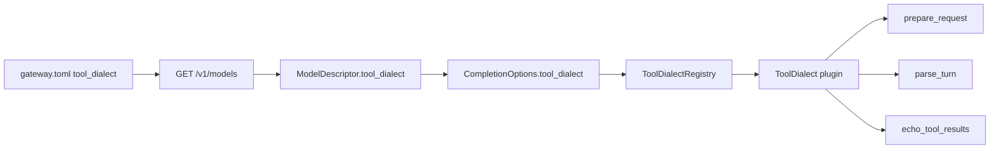

## Rust shape

New module family under core (keeps design-core rule: wire quirks live in the normalize family, not execute/hosts):

[`promptforge-core/src/tool_dialect/`](promptforge/crates/promptforge-core/src/)

- `mod.rs` - `ToolDialectId`, trait, registry
- `openai.rs` - current OpenAI behavior
- `gemma3_tool_code.rs` - move today’s ContentFence / `tool_code` logic here; emit Google-cookbook `tool_output` user turns
- (registry ready for later cribs: `hermes`, `llama3_json`, `pythonic`, `functiongemma` - not required in first landing)

```rust
pub trait ToolDialect: Send + Sync {
    fn id(&self) -> ToolDialectId;

    /// Shape the outbound chat-completions body (tools field, optional
    /// synthetic tool-preamble message built from ToolSchema, not author prose).
    fn prepare_request(&self, request: &mut DialectRequest<'_>) -> Result<()>;

    /// Response wire -> Text or ToolCalls (empty-product invariant stays here).
    fn parse_turn(&self, body: &Value) -> Result<NormalizedTurn>;

    /// Append assistant tool turn + tool results into conversation history.
    fn echo_tool_results(
        &self,
        conversation: &mut Vec<Message>,
        calls: &[ToolCall],
        results: &[(String /* call id */, String /* body */)],
    );
}
```

`ToolDialectRegistry`: `BTreeMap<ToolDialectId, Arc<dyn ToolDialect>>` with `builtin()` registering shipped plugins. Unknown catalog dialect id is a hard bind/run error naming the missing plugin (no silent fallback that invents dossiers).

### What replaces today’s types

- Fold `ToolHistoryStyle` into the dialect’s `echo_tool_results` (OpenAI vs ContentFence cease to be a free-floating enum decided inside parse).
- Evolve [`CompletionNormalizer`](promptforge/crates/promptforge-core/src/normalize.rs): either become a thin facade over `ToolDialect::parse_turn`, or delete in favor of dialect-only. Prefer **one seam**: `GatewayClient` holds the registry and selects dialect from `CompletionOptions.tool_dialect` per `complete()` call (today it holds a single `Arc<dyn CompletionNormalizer>`).
- [`execute.rs`](promptforge/crates/promptforge-core/src/execute.rs) tool loop calls `dialect.echo_tool_results(...)` instead of matching `ToolHistoryStyle`.

### Request-side (the part that keeps dialect out of prompts)

For `gemma3_tool_code.prepare_request`:

- Build a short **synthetic** developer/user prefix from the live `ToolSchema` list (name, description, JSON params -> pythonic signatures), plus the fixed fence protocol (`tool_code` / `tool_output`). This is harness text, not author Markdown.
- Author prompts only say “use search/fetch to research X” - no format recipes.
- Strip or keep OpenAI `tools[]` as the dialect decides (Gemma llama template has `supports_tools: false`; dialect may omit `tools`/`tool_choice` to avoid lying to the server).

For `openai.prepare_request`: current behavior (`tools` + `tool_choice: auto`).

## Catalog / gateway plumbing

- Add `tool_dialect: String` (default `"openai"`) to [`LocalModelConfig`](promptforge/crates/promptforge-gateway/src/config.rs) and [`ModelConfig`](promptforge/crates/promptforge-gateway/src/config.rs).
- Expose on [`ModelInfo`](promptforge/crates/promptforge-gateway/src/wire.rs).
- Extend [`ModelDescriptor`](promptforge/crates/promptforge-core/src/model.rs) + `fetch_model_catalog` parsing.
- Propagate into frozen [`CompletionOptions`](promptforge/crates/promptforge-core/src/model.rs) when the section binding is applied.
- Set `tool_dialect = "gemma3_tool_code"` in [`gemma.toml`](gemma.toml); leave Qwen/remote at default `openai` unless proven otherwise.

## Prompt cleanup

- Revert dialect-specific fence coaching from [`briefer.md`](promptforge/briefer.md) Web Search arm once `prepare_request` injects it. Keep grounding rules (fetch-backed quotes, UNKNOWN) - those are task policy, not wire dialect.

## Tests and docs

- Unit tests per plugin: parse fixtures, history echo shapes, prepare_request message injection.
- Keep existing normalize tests by moving them under the gemma3 / openai modules.
- Update [`design-core.md`](promptforge/crates/promptforge-core/design-core.md) principle 18 / “Completion normalization” section: dialects are catalog-selected plugins; prompts stay dialect-agnostic; accrete new models by adding a cribbed plugin + setting `tool_dialect` on the model entry.
- STATUS one-liner if the public surface changes.

## Out of scope for this landing

- Streaming tool-call deltas
- Dynamic `--tool-parser-plugin` .so loading (Rust registry is enough; new dialects are code + config)
- Switching serving stack to vLLM
- Auto-detect from llama `/props` (nice later; v1 is explicit config)

## First dialects to ship

| Id | Role |
|---|---|
| `openai` | Wire `tool_calls` + `role=tool` history |
| `gemma3_tool_code` | Parse sole ` ```tool_code `, echo `tool_output` / TOOL RESULT as user turn, inject schema preamble |

Next cribs (registry stubs or follow-ups, not blockers): `hermes`, `llama3_json`, `pythonic`, `functiongemma` - names aligned with vLLM/llama.cpp so ports stay recognizable.


### Commit local WIP

*Commit the six uncommitted promptforge files as two focused commits (Gemma positional tool_code fix, then execution-id/docs cleanup), leaving the tree clean before write-through trace work.*

# Commit uncommitted promptforge WIP

Working tree in [promptforge](c:\Users\Vinnie\src\cursor\promptforge): 6 modified files, nothing staged, `master` ahead of origin by 25. No push.

## Split (two commits)

### 1. Gemma dialect: positional `tool_code` + system guide
- [crates/promptforge-core/src/dialects/gemma3_tool_code.rs](crates/promptforge-core/src/dialects/gemma3_tool_code.rs) only
- Accepts `search("...")` / `fetch("...")`, injects tool guide before stripping `tools[]`, tests for positionals and guide injection
- Message focus: why Gemma was skipping tools (positional parse failure)

Suggested message:
```
Parse positional Gemma tool_code args and inject a tool guide.

Gemma often emits search("...") instead of keyword form; without mapping, the dialect treated the turn as text and tools never ran.
```

### 2. Dev/CLI execution ids + obsolete-docs cleanup
- [crates/promptforge-dev/src/run.rs](crates/promptforge-dev/src/run.rs) - 128-bit `dev-` id, `run id:` banner, uniqueness test
- [crates/promptforge-cli/src/main.rs](crates/promptforge-cli/src/main.rs) - matching 128-bit `cli-` id
- [crates/promptforge-core/design-core.md](crates/promptforge-core/design-core.md) - §17 matches gateway-mediated scenarios + `promptforge-dev` (no obsolete `--max-tokens` etc.)
- [crates/promptforge-dev/design.md](crates/promptforge-dev/design.md) - documents per-invocation id
- [crates/promptforge-core/src/model.rs](crates/promptforge-core/src/model.rs) - comment only on `pinned_qwen_dev_catalog`

Suggested message:
```
Mint 128-bit execution ids and drop obsolete core-tests dev CLI docs.

Banner each promptforge-dev run so scrollback cannot hide a new invocation; design-core §17 matches the current gateway-mediated scenario path.
```

## Steps
1. Stage + commit file set 1, then file set 2 (HEREDOC messages; no `--no-verify`, no amend, no push)
2. `git status` clean; confirm still ahead of origin (27 commits)
3. Quick smoke: `cargo test -p promptforge-core dialects::gemma3_tool_code` and `cargo test -p promptforge-dev` (already green earlier; re-run if needed after commit)

## Out of scope
- Write-through `.trace/` (next plan after clean tree)
- Concurrent fanout / gateway `--parallel`
- Pushing the 25+ local commits
- Touching the in-flight briefer process (commit is source-only)

Todos:

- Commit gemma3_tool_code positional parse + tool guide
- Commit 128-bit run ids + design-core/dev doc cleanup
- Verify clean tree and re-run focused tests

### Write-through store traces

*Make promptforge-dev write `.trace/` turn JSON and store files to `<stem>.store/` as events happen, instead of buffering until the run ends. Dev-crate only; no core API change.*

# Write-through dump for promptforge-dev

## Problem

Today [dump.rs](promptforge/crates/promptforge-dev/src/dump.rs) buffers all `DebugEvent`s and [run.rs](promptforge/crates/promptforge-dev/src/run.rs) only calls `dump_store` + `TraceCapture::flush` after `run()` returns. A long briefer leaves nothing inspectable under `briefer.store/` mid-flight.

## Approach (dev-only)

Keep clearing `<stem>.store/` once at run start. Mirror every store mutation and every debug turn to disk immediately. End-of-run becomes a reconcile that never wipes `.trace/`.

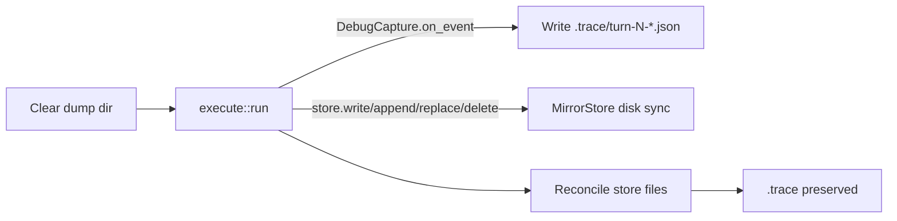

### 1. Immediate turn writes - `TraceCapture`

In [dump.rs](promptforge/crates/promptforge-dev/src/dump.rs):

- Drop the in-memory event buffer (or stop using it).
- In `on_event`, create `.trace/` if needed and write `turn-{n}-request.json` / `turn-{n}-response.json` with the same pretty JSON as today.
- Announce with `eprintln!("trace dump wrote ...")` (no `Write` sink available on the trait).
- `flush` becomes a no-op kept only if call sites still invoke it, or remove the call from `run.rs`.
- Other `DebugEvent` variants stay ignored.

### 2. Live store mirror - new `MirrorStore`

Still in `dump.rs`, implement `promptforge_core::store::Store` wrapping `MemStore`:

- Hold `dump_root: PathBuf`.
- After successful `write` / `append` / `str_replace`: read the new contents from the mem backend and write the safe relative path under `dump_root` (reuse `safe_relative_path`).
- After successful `delete`: remove the mirrored file if present.
- Reads / glob / read_lines pass through unchanged.
- Unsafe paths: skip disk mirror, `eprintln!("store dump skipped ...")` (same policy as today’s dump).
- Create parent dirs as needed; never touch `.trace/`.

Wire in [run.rs](promptforge/crates/promptforge-dev/src/run.rs):

```rust
let store = StoreRef::new(Box::new(dump::MirrorStore::new(dump_directory(prompt_path))));
```

instead of `StoreRef::memory()`.

### 3. End-of-run reconcile - change `dump_store`

Stop doing `remove_dir_all` at the end (that is what forced buffering).

New behavior:

- Enumerate in-memory store paths; overwrite each mirrored file (idempotent).
- Walk dump root (non-recursive for top-level + nested store paths): delete files that are not under `.trace/` and not present in the store (covers deleted store keys and stale names).
- If store is empty and dump has only `.trace/` (or is empty), leave `.trace/`; if dump has nothing at all, remove the dump directory (preserve today’s “empty store → no dump” for store-only cases; traces may still exist after a tool-only run with no `store.write`).
- Start-of-run clear in `run_once_with` stays as the sole full wipe.

Remove the post-run `capture.flush(...)` call once write-through is live.

### 4. Docs and tests

- Update [design.md](promptforge/crates/promptforge-dev/design.md) item on store/traces: write-through as events arrive; start clears; end reconciles without wiping `.trace/`.
- Rewrite dump tests:
  - `on_event` creates turn files before any flush.
  - Reconcile does not delete existing `.trace/` files.
  - `MirrorStore` write appears on disk immediately; delete removes the file.
  - Empty-store / second-run / partial-failure run tests in [run.rs](promptforge/crates/promptforge-dev/src/run.rs) still pass under write-through (start clear + reconcile).

## Out of scope

- Concurrent fanout / gateway `--parallel`
- Core `Observer` / `DebugCapture` API changes
- Streaming tokens inside a single turn (still one JSON file per completed request/response)
- MCP / CLI hosts (they do not own this dump path)

Todos:

- Write TraceCapture turn JSON in on_event; drop buffer/flush dependency
- Add MirrorStore and wire StoreRef in run_once_with
- Change dump_store to reconcile without wiping .trace
- Update dump/run tests and promptforge-dev design.md

### Fanout and gateway concurrency

*Wire local llama `--parallel` to gateway lane concurrency, set Gemma's lane to 2, and run fanout arms concurrently in core so briefer topics overlap under gateway admission.*

# Gateway + core concurrency

Default for Gemma: **lane concurrency = 2** (safer VRAM than 4 with 27B / 65K). Raise the lane number later without further code changes.

## Architecture

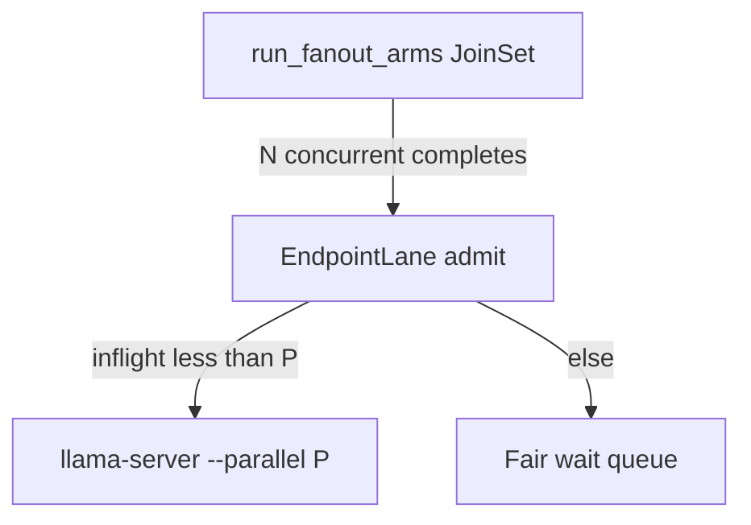

Core fires all arms at once. Gateway admits up to `P`. Llama serves `P` slots. Extra arms wait in the existing fair queue.

## 1. Gateway: sync `--parallel` with lane concurrency

Today [`local_model_concurrency`](promptforge/crates/promptforge-gateway/src/config.rs) already resolves device/lane (default 1) into `EndpointLane`, but [`server_args`](promptforge/crates/promptforge-gateway/src/local/server.rs) hardcodes `--parallel 1`.

Changes:
- Add `parallel: u32` to `LaunchOptions` (same crate file).
- In [`LocalRuntime::start`](promptforge/crates/promptforge-gateway/src/local/mod.rs) / `launch_options`, set `parallel` from the resolved `local_model_concurrency` value (cast, must be >= 1).
- Emit that value in `server_args` instead of `"1"`.
- Update `launch_args_match_local_model_defaults` to expect the configured parallel (keep a unit test that default-no-lane still emits `--parallel 1`).
- Document in [`design-gateway.md`](promptforge/crates/promptforge-gateway/design-gateway.md): local lane concurrency is both the admit limit and llama `--parallel`; one knob.

No new TOML field on `[[local_model]]`. Authors set `[[device.lane]].concurrency`.

## 2. Gemma profile: concurrency 2

Workspace files outside the crate (already used for local Gemma):

- [common.toml](c:\Users\Vinnie\src\cursor\common.toml): add

```toml
[[device]]
id = "local-gpu"
type = "local"

[[device.lane]]
device = "local-gpu"
id = "generative"
concurrency = 2
```

- [gemma.toml](c:\Users\Vinnie\src\cursor\gemma.toml): on `[[local_model]]` add `device = "local-gpu"` and `lane = "generative"`.

Requires gateway restart to respawn llama with `--parallel 2`. Note: llama splits the configured context across slots (~32K each at 65536/2).

Also bump the generative lane in [profiles/analytical.toml](promptforge/profiles/analytical.toml) only if you want the example to match; leave at 1 there so the shipped example stays the conservative default (workspace gemma is the live knob).

## 3. Core: concurrent fanout arms

[`run_fanout_arms`](promptforge/crates/promptforge-core/src/fanout.rs) is a sequential `for` loop. Replace with concurrent tasks:

- Extract one-arm body into `async fn run_one_arm(...) -> Result<String>` (same lifecycle as today).
- Spawn every arm on a `tokio::task::JoinSet` (still inside the existing `block_in_place` + `block_on` bridge from [`make_fanout_callback`](promptforge/crates/promptforge-core/src/execute.rs)).
- Clone per task: `StoreRef`, `Option<GatewayClient>`, string args, bindings/`Arc` as needed. Observer and `DebugCapture` are already `Send + Sync` behind `&dyn`.
- Replace shared `mut turns: u32` with `AtomicU32` (fetch_add) so debug turn indices stay unique under races.
- Collect replies into `Vec` indexed by arm order; return that ordered table to Lua (contract unchanged).
- Fail-fast: on first arm error, `abort_all()` remaining tasks and propagate that error (same invoker-visible behavior as sequential fail-fast).
- Store semantics: shared `StoreRef` stays mutex-safe; authors must not assume arm N sees arm N-1 writes. Briefer is fine (reduce writes in Main). Update the store-writes fixture comment if it implied ordering beyond persistence.

## 4. Design contract updates

- [design-core.md](promptforge/crates/promptforge-core/design-core.md): fanout arms run concurrently; replies stay ordered; fail-fast aborts siblings; remove “parallel … fanout” from the non-goals list; keep nested fanout as a non-goal.
- Module docs in `fanout.rs` and the fanout blurb in [README.md](promptforge/README.md) / [STATUS.md](promptforge/STATUS.md): sequential → concurrent.
- Gateway design note as above.

## 5. Tests

**Gateway**
- Unit: launch args include `--parallel` equal to resolved lane concurrency (1 without device/lane; N with lane).
- Existing queue IT at concurrency 1 stays; add or extend a case that concurrency 2 allows two in-flight admits when the fake upstream blocks (if an IT harness already covers this pattern in `tests/it/main.rs`).

**Core**
- Keep ordered-reply fixtures (`fanout-basic`, `fanout-epilog`).
- Keep fail-fast fixture (`fanout-arm-failure`); assert error still propagates (may complete fewer sibling observes).
- Add a unit/integration test that two preamble-only arms both run (e.g. each writes a distinct store path) and both files exist - proves overlap readiness without a real model.
- No live Gemma test in CI.

## Out of scope

- Nested fanout
- Cap inside fanout separate from gateway (gateway queue is the throttle)
- Streaming progress / ordered observer frames
- Changing remote endpoint concurrency behavior
- Auto-tuning P from VRAM

## Verify locally after merge

1. Restart gateway on updated `gemma.toml`.
2. Confirm llama args / logs show `--parallel 2`.
3. Run briefer; stderr should interleave multiple `Web Search: Fanout arm started` before the first arm finishes.

Todos:

- Plumb LaunchOptions.parallel from local_model_concurrency; update server_args + tests + design-gateway
- Add local-gpu generative lane concurrency=2 in common.toml/gemma.toml
- Concurrent JoinSet fanout arms, AtomicU32 turns, fail-fast abort, ordered replies
- Update design-core/README/STATUS; adjust and add fanout/gateway tests

### Briefer evidence thickening

*Prompt- and context-engineer promptforge/briefer.md for thick, clean evidence.md on local Qwen: cut Report until evidence is thick, beat the current Qwen baseline using Opus structure plus subagent web research, log every experiment in gitignored research.md, then Boost and Bloomberg with a 3-round no-improvement stop per subject.*

# Briefer evidence thickening

## Understanding (locked)

- Deliverable is thick, clean `evidence.md` from [`promptforge/briefer.md`](promptforge/briefer.md) on **local Qwen**.
- Gold shape / density reference: Opus packet [`cabinet/_scratch/2026-08-08-briefer-cpp-alliance/2026-08-08-briefer-cpp-alliance-evidence.md`](cabinet/_scratch/2026-08-08-briefer-cpp-alliance/2026-08-08-briefer-cpp-alliance-evidence.md) (Subject Profile fields, Domain Primer, Domain Landscape, Public Record, Vulnerabilities, Source Log).
- Staged beauty: (1) match best current local-Qwen evidence quality (clean, structured, no fence garbage / wrong-entity disasters); (2) surpass that baseline with more detail via prompt + context engineering informed by my own deeper web research.
- Cut **Report** (and Epilog model turn if it still burns latency) until evidence is thick; restore Report only after Stage 2 is sticky on C++ Alliance.
- Log every change and verdict in gitignored [`cabinet/_research/2026-08-08-briefer-evidence-tuning.md`](cabinet/_research/2026-08-08-briefer-evidence-tuning.md) (user-facing name: research notes; not committed).
- Subjects in order: **C++ Alliance** → **Boost C++ Library Collection** → **Bloomberg**. Per subject: iterate facets + whole until **3 consecutive rounds with no meaningful improvement**, then advance. Global stop when all three subjects are exhausted under that rule.

## Baseline and scoring

Capture once before edits (or use latest [`promptforge/briefer.store/evidence.md`](promptforge/briefer.store/evidence.md) if fresh):

Score each run 0-2 per facet against Opus shape (Alliance) or against subagent-sourced truth packs (Boost/Bloomberg):

- Structure (section headers, no nested fences, concatenable arms)
- Profile density (legal name, status, people, dates)
- Primer / landscape (peers, market structure, deps)
- Public record (filings, press, controversy)
- Vulnerabilities (sourced, on-entity)
- Source hygiene (fetch-backed quotes/URLs; UNKNOWN when thin)
- Wrong-entity / hallucination rate (hard fail if present)

**Meaningful improvement** = higher total score, or same score with clearly thicker on-entity facts and no new hard fails. Cosmetic-only diffs do not count. Rollback any change that lowers score or adds hard fails.

## Prompt engineering direction (concrete)

Edit only [`promptforge/briefer.md`](promptforge/briefer.md) unless a tiny harness bug blocks iteration.

1. **Speed cut:** Comment out or stub `## Report` (and keep Epilog as pure ` ```lua ` return). Main ends after `store.write("evidence.md", ...)`.
2. **Output contract:** Force each arm to emit a fixed heading matching Opus sections (or a mapped topic→section table). Ban wrapping the whole reply in markdown fences. Ban process commentary.
3. **Topic list:** Retarget Topics to Opus facets (profile, founder/personnel, mission, structure/scale, domain primer, sector/peers, public record/finance, disaster exposure, vulnerabilities) so concat yields one coherent packet, not ten marketing blurbs.
4. **Search/fetch depth:** Prefer 2-4 fetches on high-signal URLs (org site, ProPublica/Cause IQ, bylaws/PDF, mailing-list transparency). Seed query patterns in the arm prompt (EIN, 990-PF, fiscal sponsor, etc.) without hardcoding subject-specific answers.
5. **Anti-hallucination:** Keep fetch-only claims; require entity-name check before disaster/vulnerability claims; UNKNOWN over invention.
6. **Fanout / turns:** Increase topic fanout or `max_tool_iterations` only when research notes show missing facets; if slower/worse, roll back.

## Experiment loop (per subject)

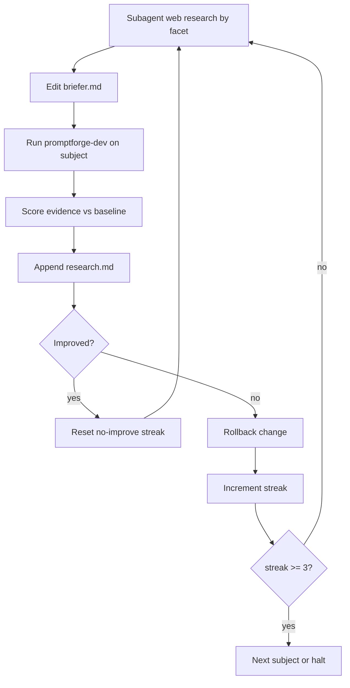

- **Subagents:** For each facet, search/fetch what is publicly knowable; write findings into the research log and into prompt query/URL hints (not into fabricated evidence).
- **Runs:** Gateway on `qwen.toml`; `cargo run -p promptforge-dev -- briefer.md "<subject>"`. Archive each round's evidence under `cabinet/_scratch/briefer-evidence-rounds/` (gitignored via cabinet).
- **C++ Alliance Stage 1:** Fix fences, wrong-entity disasters, thin profile until score ≥ current Qwen best and structure matches Opus outline.
- **C++ Alliance Stage 2:** Thicken using Opus source log as a treasure map (ProPublica EIN 82-2439331, bylaws PDF, transparency reports, fiscal sponsor vote). Stop after 3 no-improve rounds.
- **Restore Report** once Alliance evidence is thick; one smoke run that report does not invent beyond packet.
- **Boost, then Bloomberg:** Same loop; build truth packs via subagents first (no Opus gold file).

## research.md format (append-only)

For each round:

- subject, round id, timestamp, model
- prompt/context diff summary (what changed)
- score table + hard fails
- keep / rollback decision and why
- facet notes (what web research found that the run missed)

## Stop conditions

- Per subject: 3 consecutive no-improve rounds → next subject.
- Global: after Bloomberg's streak completes with no further meaningful gains available under the same rule → stop and review research.md with you.


Todos:

- Stub Report/Epilog for evidence-only speed; fix lua fence if needed
- Capture Qwen baseline evidence + scoring rubric; create research.md
- C++ Alliance: clean structure to match/exceed current Qwen baseline
- C++ Alliance: thicken via research-informed prompt until 3 no-improve rounds
- Restore Report section; smoke that it stays packet-bound
- Boost subject: truth-pack subagents + iterate to 3 no-improve
- Bloomberg subject: truth-pack subagents + iterate to 3 no-improve

### Supervise local llama-server

*Fix the zombie-gateway failure mode: when llama-server exits after readiness, the next chat request respawns it on the same port and identity instead of returning a permanent 502. Crash prevention (FA/parallel) stays operator config, not this change.*

# Supervise local llama-server after death

## Problem

[`LocalRuntime::start`](promptforge/crates/promptforge-gateway/src/local/mod.rs) spawns `llama-server`, waits for readiness, then never watches the child. After exit, gateway `/health` and `/v1/models` still look fine; chat fails with `502 upstream_transport`. Design note that "endpoint health" is unbuilt means multi-endpoint failover, not "ignore a dead local child forever."

## Approach (locked)

**Lazy ensure-alive on send**, not a background watchdog.

- Introduce a local-only upstream that owns the child lifecycle.
- On each `send`, if the child is dead (or the first POST gets a connect failure and `try_wait` shows exit), respawn **once** with the **same port, `--alias`, and `--api-key`**, then retry the request once.
- Keep catalog `Model.upstream_name` and `OpenAiUpstream`-shaped URLs stable so routing/`Arc<Model>` need not be rewritten mid-flight.
- Cap respawn storms: if respawn readiness fails, return `UpstreamTransport` (same as today). Optional short cooldown (e.g. do not respawn more than once per few seconds) to avoid spin on hard GPU faults.

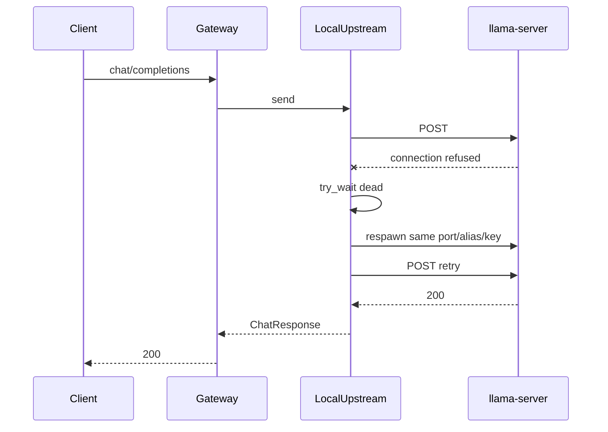

## Code changes

1. **[`server.rs`](promptforge/crates/promptforge-gateway/src/local/server.rs)**  
   - Factor a respawn entry that reuses a fixed `(port, alias, api_key)` instead of always calling `random_identity` + `free_port` (keep random free-port path for first start).  
   - Expose `try_wait` / `is_alive` on the guard (or split "recipe" from "running child" so Drop still kills the current child).

2. **New `LocalUpstream` in [`local/`](promptforge/crates/promptforge-gateway/src/local/)** (or `upstream.rs` if cleaner)  
   - Holds: executable path, model path, `LaunchOptions`, fixed identity + port, `Mutex` around the live `Child`/guard guts, shared `reqwest::Client`.  
   - Implements `Upstream::send`: ensure child alive → POST like [`OpenAiUpstream`](promptforge/crates/promptforge-gateway/src/upstream.rs) using live `base_url` + key → on transport error, if dead, respawn once and retry once.

3. **[`LocalRuntime::start`](promptforge/crates/promptforge-gateway/src/local/mod.rs)**  
   - Wire `endpoint.upstream = Arc::new(LocalUpstream::...)` instead of bare `OpenAiUpstream`.  
   - Runtime still owns whatever is needed so Drop tears down children (either keep guards, or move ownership fully into `LocalUpstream` and drop empty `guards` / replace with `Vec<Arc<LocalUpstream>>`).

4. **Docs**  
   - Update [`design-gateway.md`](promptforge/crates/promptforge-gateway/design-gateway.md): local child supervision on send is in scope; multi-endpoint health selection remains unbuilt.  
   - Log `tracing::warn!` on detected death + successful/failed respawn.

5. **Tests**  
   - Unit test with the existing spawn test seam: child exits after ready → next `send` path calls spawn again with same port/alias (assert spawn count / args).  
   - Keep existing Drop-kills-child test green.

## Out of scope

- Preventing Vulkan/OOM crashes (operator: lower `--parallel`, try `flash_attention = false`).  
- Background watchdog threads.  
- Changing public `/health` semantics (still process liveness); optional later: `admin/status` child-alive flag.  
- Gemma/Qwen profile retunes.


Todos:

- Add LocalUpstream with mutexed child + same-port respawn + one send retry
- Wire LocalRuntime::start to LocalUpstream; keep Drop cleanup
- Unit test respawn-on-death; update design-gateway.md

### Try Qwen 27B

*Add a local gateway profile for unsloth Qwen3.5-27B Q4_K_M, restart the gateway on it (first start downloads ~16.7 GB), smoke `/v1/models` + chat, then run briefer on one known subject to compare evidence quality against the 9B baseline.*

# Try local Qwen3.5-27B

## Profile

Create [`qwen27.toml`](c:\Users\Vinnie\src\cursor\qwen27.toml) next to [`qwen.toml`](c:\Users\Vinnie\src\cursor\qwen.toml) / [`gemma.toml`](c:\Users\Vinnie\src\cursor\gemma.toml). Leave the 9B profile untouched.

Pinned artifact (HF tree API, same pin style as 9B research):

- Repo: `unsloth/Qwen3.5-27B-GGUF`
- File: `Qwen3.5-27B-Q4_K_M.gguf` (~16.7 GB)
- URL: `https://huggingface.co/unsloth/Qwen3.5-27B-GGUF/resolve/main/Qwen3.5-27B-Q4_K_M.gguf`
- SHA-256 (`lfs.oid`): `84b5f7f112156d63836a01a69dc3f11a6ba63b10a23b8ca7a7efaf52d5a2d806`

Knobs (locked for first try):

- `name = "qwen-27b"`
- Same `description` as 9B / briefer `models.always` so semantic bind still hits
- `context = 32768` (matches [`briefer.md`](promptforge/briefer.md) `{ context = 32768 }`)
- `concurrency = 2` on lane `generative` (same slot budget as current 9B; ~16k tokens/slot)
- `thinking = "never"`, `gpu_layers = 99`, `flash_attention = true`, `cache_type_k/v` same as 9B
- `include = ["common.toml"]`

If VRAM OOMs or Vulkan kills the child after ready, the new on-send respawn will retry once; operator fallback is `concurrency = 1` or `flash_attention = false` (out of scope unless it fails).

## Bring-up

1. Stop any gateway still on `qwen.toml` / `gemma.toml`.
2. Start from workspace root (profiles live outside the crate):

```bash
cargo run -p promptforge-gateway -- serve ../qwen27.toml
```

(or absolute path to `qwen27.toml`). First boot provisions the GGUF into `~/.promptforge` and may take several minutes.

3. Smoke:
   - `GET /health`
   - authenticated `GET /v1/models` shows `qwen-27b` with expected context / dialect
   - one short `POST /v1/chat/completions`

## Briefer trial

With `PROMPTFORGE_GATEWAY_URL` / `PROMPTFORGE_GATEWAY_KEY` set, run briefer once on a subject already exercised on 9B (e.g. `Bloomberg L.P.` or `Boost C++ Libraries`) via `promptforge-dev`, write store under `briefer.store/`, and note evidence thickness vs the 9B archives under `cabinet/_scratch/briefer-evidence-rounds/`.

Append a short dated note to [`cabinet/_research/2026-08-08-briefer-evidence-tuning.md`](cabinet/_research/2026-08-08-briefer-evidence-tuning.md) with: profile path, digest, smoke result, and qualitative evidence delta (no prompt changes unless 27B exposes a clear bind/context failure).

## Out of scope

- Replacing or deleting `qwen.toml`
- Prompt rewrites in `briefer.md`
- Side-by-side dual-model gateway (one profile at a time)
- Pushing commits unless you ask


Todos:

- Create qwen27.toml with unsloth Qwen3.5-27B-Q4_K_M pin + concurrency 2 / 32k
- Restart gateway on qwen27.toml; smoke health, models, short chat
- Run briefer once on a known subject; note evidence vs 9B; append tuning research note

### Store real plus virtual

*Replace the memory-only / write-through-mirror store model with a layered OverlayStore so Lua can read real confined files and virtual run files through the same store API at once, without turning the CLI into a surprise disk writer.*

# Overlay store: real files + virtual files together

## Diagnosis (why today fails)

- Core only ships [`MemStore`](promptforge/crates/promptforge-core/src/store.rs). Logical paths live in one `BTreeMap`.
- [`promptforge-dev` `MirrorStore`](promptforge/crates/promptforge-dev/src/dump.rs) wraps memory and **mirrors writes to** `<stem>.store/`. **Reads always hit memory.** Disk is an author dump, not a peer namespace.
- Dev **wipes** `<stem>.store/` at run start, so leftover real files cannot seed the next run.
- CLI/MCP construct `StoreRef::memory()` and promise no unsolicited disk I/O ([`design-cli.md` §12](promptforge/crates/promptforge-cli/design-cli.md)).

So "real + virtual at the same time" is not a missing flag. Memory is sole authority; disk is a one-way side effect.

## Chosen approach: OverlayStore (single `store.*` API)

Keep one Lua surface (`store.read` / `write` / `inject` / `glob` / …). Implement a layered backend:

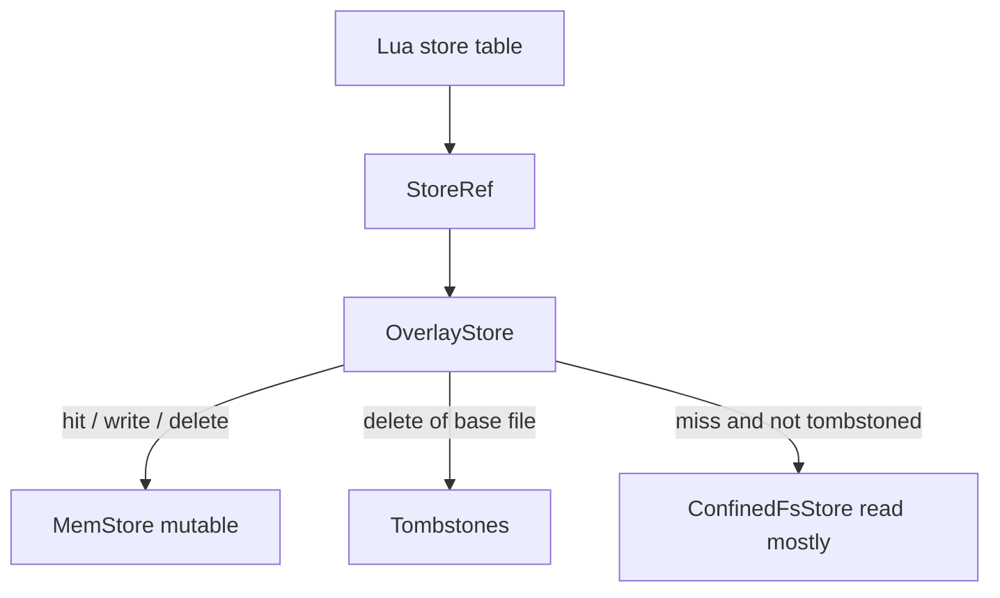

**Read path:** if path is tombstoned → `NotFound`; else if present in mem → mem; else → confined filesystem root.

**Write / append / str_replace:** always land in mem (copy-on-write if the only copy was on disk: read base, then mutate in mem).

**Delete:** remove from mem; if a base file existed, add a tombstone so later reads do not resurrect it from disk.

**Glob:** union of mem paths and confined fs paths, minus tombstones (deterministic order, same as today's `BTreeMap` feel).

**Confinement (hard):** all fs access goes through a root + `safe_relative_path` style rules already used in `dump.rs` (reject `..`, absolute, Windows-reserved). No new `url`/`psl` crate. Fail closed with a new `StoreError` variant (e.g. `PathRejected`) - trait/`StoreError` are already `#[non_exhaustive]`.

**Hosts:**

| Host | Construction |
|---|---|
| CLI / MCP (default) | Unchanged: `MemStore` only (no mount) - preserves "writes nothing to disk" |
| `promptforge-dev` | `OverlayStore { mem, mount = <stem>.store/, tombstones }` **without wiping mount contents that the author placed for input**; stop treating the dump dir as ephemeral-only. Write-through mirror of *mutations* can remain for inspection, or become end-of-run dump only - prefer keep live mirror for mutated keys so author still sees `evidence.md` appear. |
| Tests | Unit-test Overlay against a temp dir; existing MemStore tests stay green |

**Do not** seed the entire tree into memory at start (loses laziness and blows large trees). Overlay reads are lazy.

**Trust:** `store.inject` still wraps whatever `read` returns. Real file bytes are untrusted when injected into model context - same envelope as today. No silent trusted FS injection.

## What we explicitly reject

- Separate `fs.*` Lua table as the *only* solution (forces every prompt to know two worlds; can add later as sugar over the same overlay if needed).
- Making CLI mount `$PWD` by default (surprise reads/writes / path escape risk).
- Silent drop of context / dual competing authorities without tombstones (delete would not stick).

## Implementation slices (one commit each when executed)

1. **Core `OverlayStore` + `ConfinedFs` helpers + unit tests** in [`store.rs`](promptforge/crates/promptforge-core/src/store.rs) (or `store/overlay.rs` if file grows). COW on first mutate of a base-only file; tombstones; glob union.
2. **`StoreError::PathRejected`** (and docs) for confinement failures; Lua maps to existing Lua error style.
3. **`promptforge-dev`**: replace pure wipe+`MirrorStore` with overlay mount on `<stem>.store/`; redefine start policy as "clear only prior run outputs we own" or "never wipe paths that exist before run" - concrete rule: **do not delete the dump root wholesale**; only reconcile orphans for keys that were virtual-only last run if needed. Update [`dump.rs`](promptforge/crates/promptforge-dev/src/dump.rs) / [`run.rs`](promptforge/crates/promptforge-dev/src/run.rs) + design.md §5.
4. **Design/docs:** [`design-core.md`](promptforge/crates/promptforge-core/design-core.md) store bullet; README store triad; [`STATUS.md`](promptforge/STATUS.md); CLI design note that durable mount is host-supplied Overlay, not default CLI.
5. **Fixture prompt** under core-tests or dev tests: pre-seed a real file on disk, `store.read` it, `store.write` a virtual sibling, `store.inject` both shapes - proves simultaneous availability.

## Success criteria

- In one `promptforge-dev` run, Lua can `store.read("seed.md")` for a file that existed only on disk under the mount, and `store.write("virtual.md", …)` for a pure virtual file, and both appear in `store.glob("*")`.
- CLI default behavior unchanged (memory-only, no disk).
- Delete of a mounted file makes subsequent `read` fail for that run (tombstone), without necessarily unlinking the real file unless we explicitly add an opt-in `persist_delete` later (default: **tombstone only**, real file remains on disk after process exit - document that).

## Default recorded for persist_delete

**Tombstone-only deletes** for mounted files. Physical unlink is a later host opt-in. That keeps the CLI/dev safety story: a prompt cannot destroy author inputs by calling `store.delete` unless a future flag says so.


Todos:

- Add OverlayStore + confined FS helpers + unit tests in promptforge-core
- Add StoreError::PathRejected and Lua error mapping
- Wire promptforge-dev to OverlayStore mount; stop wipe-all; keep mutation mirror
- Update design-core, design-dev, README/STATUS store model
- Add real+virtual simultaneous read/write fixture test

### PromptForge user guide

*Write a progressive tutorial for PromptForge prompt authoring, starting from Hello World and building to a full-featured pipeline prompt, followed by a Lua API reference. Each section adds one capability with a working example.*

# PromptForge User Guide

A progressive tutorial teaching prompt authoring from zero to full pipeline. Each section adds exactly one new concept with a working example. The guide ends with a capstone prompt using every feature and a complete API reference.

**Output:** `promptforge/docs/user-guide.md` (single file, one read)

**Voice:** Direct, technical, no filler. Show the code first, explain after. Every example is a complete runnable prompt (or a section of one). No "in this section we will learn" - just the example and its explanation.

**Audience:** A developer who has PromptForge installed and a gateway running. They know markdown and have seen Lua. They have not read the design docs.

---

## Sections (one per step)

### 1. What is a prompt file

The skeleton: YAML frontmatter (`promptforge: 1`), one H1 title, one H2 section, prose text. The simplest possible prompt - no Lua, no tools, just prose that goes to the model and comes back.

### 2. The model turn

What happens when the executor runs that prose: it becomes a user message, the model responds, the response is the prompt's output. Show the mental model: prose in, text out.

### 3. Your first Lua block (the prologue)

Add a lua fence before the prose. Introduce `models.use`. Explain: the prologue runs before the model turn. Show a section with prologue + prose.

### 4. The preamble (H1 shared Lua)

Add a lua fence under the H1. Introduce `tools.need` and `models.always`. Explain: runs once, declarations available to every section. Show preamble + section.

### 5. The epilog

Add a lua fence after the prose. Introduce `reply` and `return`. Explain: epilog runs after the model finishes, same VM as prologue, can inspect and transform the result.

### 6. Multiple sections

Add a second H2. Show that sections execute in file order. Explain context clearing between sections: new VM, new conversation. The store and previous `reply` are the bridges.

### 7. The store

Introduce `store.write`, `store.read`, `store.inject`. Show one section writing, the next section reading. Explain: run-scoped virtual files shared across all sections.

### 8. Template substitution

Introduce `{{ args }}`, `{{ reply }}`, `{{ var.x }}`, `{{ sys.when }}`, `{{ item }}`. Show prose with substitutions. Explain: resolved before the model sees the text.

### 9. Tools (search and fetch)

Introduce `tools.need` in preamble, `tools.add` in prologue. Show a section that searches and fetches. Explain: the tool loop - model calls tools, gets results, keeps going until it produces text.

### 10. The Tool object

Show `tools.need` returning an object. Inspect `.name`, `.description`, `.parameters`. Pass it to `tools.add`. Build an array of tools. Override `.description` before adding.

### 11. The Model object

Show `models.always` returning an object. Inspect `.name`, `.model_id`, `.context`. Explain: the object represents a bound model you can use.

### 12. Explicit inference with model:infer()

Show `writer:infer(prompt)` in the prologue. Explain: blocks until the model responds, returns text, sets `reply`. Show the turn-gating pattern: add search, infer, add fetch, then prose.

### 13. Alternating blocks

Show a section with multiple lua/prose/lua/prose/lua blocks. Explain: non-final prose is single-shot (one round), final prose is the full tool loop. The conversation accumulates within the section.

### 14. Composable tool sets

Show building tool arrays in the preamble, storing in `var`, using conditionally based on `args`. Explain: tools are values you compose and pass around.

### 15. Sections as subroutines: execute()

Show `execute("## Research")` from Lua. Explain: fresh VM, full tool loop, returns reply. Show a pipeline orchestrated from a main section that calls other sections.

### 16. Control flow: goto()

Show `goto("## Fallback")`. Explain: context-clearing transfer, no return. The current section stops. Show a conditional branch based on store contents.

### 17. Fanout (parallel execution)

Show `fanout("## Worker", "## Topics")`. Explain: runs the worker section once per item in the topics list, in parallel. Returns an array of replies. Show the briefer evidence pattern.

### 18. The sys table

Document every field: `sys.when`, `sys.now`, `sys.id`, `sys.model`, `sys.taskid`. Show using `sys.when` in a report footer and `sys.model` for provenance.

### 19. Error handling and validation

Show epilog validation: checking `tools.calls`, asserting on `reply` content, returning errors. Show the "section incomplete" pattern. Explain: the epilog is your quality gate.

### 20. Capstone: a complete pipeline prompt

One full prompt that uses: preamble, tools, models, multiple sections, alternating blocks, store, execute, fanout, tool objects, model objects, infer, epilog validation. Annotated line by line.

### 21. API Reference

Every Lua global, object, and function in one flat reference. For each:

- Name and type (function / table / object / string)
- When available (preamble / prologue / epilog / always)
- Signature
- Return type
- Example

Organized by:
- Globals: `args`, `reply`, `item`, `var`, `sys`, `store`, `log`
- Objects: Tool (properties + methods), Model (properties + methods), Section/Task (properties)
- Functions: `tools.need`, `tools.add`, `models.always`, `models.need`, `models.use`, `execute`, `goto`, `fanout`
- Store methods: `write`, `append`, `read`, `read_lines`, `inject`, `str_replace`, `delete`, `glob`, `exists`

---

## Writing rules

- Every example is a fenced markdown prompt (or excerpt) that could be pasted into a `.md` file and run
- No forward references: each section uses only concepts introduced in prior sections
- Show the wrong way only when the right way is not obvious from the example
- Keep examples short (under 30 lines each, under 15 for simple concepts)
- Name the section's new concept in the H2 heading
- End each section with a one-sentence "what you now know" that names the capability


Todos:

- Section 1: What is a prompt file (skeleton + Hello World)
- Section 2: The model turn (prose in, text out)
- Section 3: Your first Lua block (the prologue)
- Section 4: The preamble (H1 shared Lua)
- Section 5: The epilog
- Section 6: Multiple sections
- Section 7: The store
- Section 8: Template substitution
- Section 9: Tools (search and fetch)
- Section 10: The Tool object
- Section 11: The Model object
- Section 12: Explicit inference with model:infer()
- Section 13: Alternating blocks
- Section 14: Composable tool sets
- Section 15: Sections as subroutines: execute()
- Section 16: Control flow: goto()
- Section 17: Fanout (parallel execution)
- Section 18: The sys table
- Section 19: Error handling and validation
- Section 20: Capstone prompt (everything together)
- Section 21: API Reference (all objects, functions, globals)

### README and CI overhaul

*Replace the current 798-line README with a crisp, marketing-quality front page (badges, sizzle, code snippets, build instructions). Move technical internals to DEVELOPMENT.md (verified not stale). Add GitHub Actions CI workflow and BSL-1.0 LICENSE file.*

# README and CI Overhaul

## Deliverables

1. **New README.md** - crisp, inverted-pyramid, badges + sizzle + image + quick examples + install/build/run + links
2. **DEVELOPMENT.md** - verified technical content migrated from old README (gateway config, profiles, store API, architecture)
3. **`.github/workflows/ci.yml`** - fmt, clippy, test on push/PR
4. **`LICENSE`** - Boost Software License 1.0

## README structure (top to bottom)

- Badges (CI status, license, Rust version)
- `# PromptForge`
- Sizzle paragraph (2-3 sentences: what it is, why it matters, key differentiator)
- Hero image (keep existing image reference)
- **What you get** - 4-5 bullet features with one emoji each
- **Quick example** - a 15-line prompt showing the pattern (preamble + section + prose + epilog)
- **Getting started** - prerequisites, clone, build, run gateway, run a prompt (shell blocks)
- **How it works** - one paragraph + the mermaid flow diagram (preamble -> section -> tools -> reply)
- **Project layout** - table of crates with one-line descriptions
- **Documentation** - links to user-guide.md, DEVELOPMENT.md, design-core.md
- **Contributing** - one paragraph pointing to DEVELOPMENT.md
- **License** - BSL-1.0 with link to LICENSE file

Target: under 200 lines. Dense, scannable, no glop.

## GitHub Actions CI

```yaml
name: CI
on: [push, pull_request]
jobs:
  check:
    runs-on: ubuntu-latest
    steps:
      - uses: actions/checkout@v4
      - uses: dtolnay/rust-toolchain@stable
      - run: cargo fmt --all --check
      - run: cargo clippy --all-targets --all-features -- -D warnings
      - run: cargo test --workspace
```

Badge: ``

## DEVELOPMENT.md migration

Move from current README:
- Gateway configuration (profiles, TOML examples, endpoint config)
- Store API triad table
- Tool configuration (web_search knobs)
- Architecture notes (crate relationships, boundary diagram)
- Model catalog and binding flow
- Development workflow (promptforge-dev, env vars)

Each migrated section is checked against current code for staleness before inclusion.

## LICENSE

Standard BSL-1.0 text with `Copyright (c) The C++ Alliance, Inc.`


Todos:

- Add LICENSE file (Boost Software License 1.0)
- Create .github/workflows/ci.yml (fmt + clippy + test)
- Migrate current README technical content to DEVELOPMENT.md (verify not stale)
- Write new README.md (badges, sizzle, examples, build instructions, under 200 lines)
- Confirm CI badge resolves, README renders clean, links valid

## Design Documents Written

### c:\Users\Vinnie\src\cursor\promptforge\briefer.md

---
name: briefer
description: Generate a report on an entity analyzed through the lens of Great Founder Theory.
promptforge: 1
max_tool_iterations: 12
---

# Briefer

```lua
models.always("writer",
    "A careful analysis model suited to structured reasoning and long-context review",
    { thinking = false, temperature = 0, context = 65536 })
tools.need("search", "Search the web and return a list of results.")
tools.need("fetch", "Fetch a URL and return its main content as markdown.")
```

Evidence-only recon port of the Briefer Step 2 packet (Report restored later).

## Main

```lua
models.use("writer")

local results = fanout("### Web Search", "### Topics")

store.write("evidence.md", table.concat(results, "\n\n"))
return "Evidence complete."
```

### Web Search

```lua
models.use("writer")
tools.add("search", "fetch")
```

Subject: {{ args }}
Section: {{ item }}

You are writing ONE section of an evidence packet about the Subject for the Section named above.

Turn budget (HARD):
1. Turn 1: call `search` once with a sharp query that includes the Subject's exact name plus Section keywords. Do not write evidence yet.
2. Turn 2: call `fetch` on the 2-3 best URLs from that search (prefer official site, filings/registries, primary docs, reputable press). Prefer batching fetches in one turn when possible.
3. Turn 3: output the finished section markdown only. No more tools unless every fetch failed - then one recovery search is allowed, then write.

Rules:
- Search hits are leads, not facts. Write ONLY from fetched page bodies.
- Every factual claim needs a short verbatim quote from a fetch body and that page's URL in parentheses after the claim.
- Never invent names, titles, years, board members, legal status, EIN, addresses, CVE lists, quotes, or dates.
- If the fetch does not support a field, write `UNKNOWN` for that field. Prefer thin truth over a complete-looking dossier.
- Entity check (HARD): every claim must be about the Subject named above. If a page is about a different organization with a similar name, discard it and write UNKNOWN rather than using it.
- Output format (HARD): plain markdown only. Start with the exact heading line for this Section (given below). Do NOT wrap the section in triple-backtick fences. No preamble, no process commentary, no "here is the evidence".
- Scope: no morality, legality-as-verdict, product-quality, or "should it exist" judgments.

Section heading and fields to fill:

{{ item }}

Suggested query patterns (adapt to Subject; do not invent answers):
- official about / mission / leadership pages
- "Subject" 501(c) OR nonprofit OR EIN OR "Form 990" OR ProPublica OR Cause IQ
- "Subject" bylaws OR board OR transparency OR fiscal sponsor
- For Natural Disaster Exposure: only facilities/regions of THIS Subject; if none found, state minimal/unknown with sources that establish distributed/cloud posture, or UNKNOWN - never a different company
- For Domain Landscape: peers in the same domain, market structure class if supported

```lua
assert(tools.calls["search"] > 0)
assert(tools.calls["fetch"] > 0)
-- Strip accidental fence wrappers some models add around the whole section.
local text = reply:gsub("^%s*```[Mm][Aa][Rr][Kk][Dd][Oo][Ww][Nn]%s*\n", ""):gsub("^%s*```%s*\n", "")
text = text:gsub("\n```%s*$", ""):gsub("%s+$", "")
return text
```

### Topics

* ## Subject Profile
Fill when known: legal name, founder, founded/operational dates, legal status, EIN, headquarters, mission (verbatim quote if available), key personnel, headcount/scale, organizational structure. Use bullet or labeled fields. UNKNOWN for missing fields.

* ## Domain Primer
Three to five numbered structural facts a reader needs about this Subject's domain (not marketing slogans). Each fact sourced.

* ## Domain Landscape
Cover what applies: sector conditions; competitors/peers; ecosystem position; market structure classification (monopoly, duopoly, oligopoly, competitive, monopsony, oligopsony, government-controlled, two-sided platform, franchise/licensed; note hybrids); upstream and downstream dependencies; extralegal operating costs if any; natural disaster exposure for THIS Subject's facilities/workforce/infrastructure only.

* ## Public Record
Press, analysis, filings, controversy, reputation relevant to the Subject. Prefer primary filings and named press.

* ## Domain-Specific Vulnerabilities
Sector-specific risks for THIS Subject with sources. No generic industry filler without a Subject link.

## Epilog

```lua
return "Evidence complete."
```


### c:\Users\Vinnie\src\cursor\promptforge\briefer.md

---
name: briefer
description: Generate a report on an entity analyzed through the lens of Great Founder Theory.
promptforge: 1
max_tool_iterations: 12
---

# Briefer

```lua
models.always("writer",
    "A careful analysis model suited to structured reasoning and long-context review",
    { thinking = false, temperature = 0, context = 65536 })
tools.need("search", "Search the web and return a list of results.")
tools.need("fetch", "Fetch a URL and return its main content as markdown.")
```

Evidence-only recon port of the Briefer Step 2 packet (Report restored later).

## Main

```lua
models.use("writer")

local results = fanout("### Web Search", "### Topics")

store.write("evidence.md", table.concat(results, "\n\n"))
return "Evidence complete."
```

### Web Search

```lua
models.use("writer")
tools.add("search", "fetch")
```

Subject: {{ args }}
Section: {{ item }}

You are writing ONE section of an evidence packet about the Subject. The Section line above is both the markdown heading to emit and the facet to research.

Turn budget (HARD):
1. Turn 1: call `search` once. Query must include the Subject's exact name plus keywords for this Section. Do not write evidence yet.
2. Turn 2: `fetch` the 2-3 best URLs (prefer official site, nonprofit filings/registries, primary docs, named press). Batch fetches in one turn when possible.
3. Turn 3: output finished section markdown only. No more tools unless every fetch failed - then one recovery search, then write.

Rules:
- Search hits are leads, not facts. Write ONLY from fetched page bodies.
- Every factual claim needs a short verbatim quote from a fetch body and that page's URL in parentheses after the claim.
- Never invent names, titles, years, board members, legal status, EIN, addresses, CVE lists, quotes, or dates.
- If unsupported, write `UNKNOWN` for that field. Prefer thin truth over a complete-looking dossier.
- Entity check (HARD): claims must be about the Subject named above. Discard lookalike organizations; use UNKNOWN rather than their facts.
- Output (HARD): plain markdown only. First line must be exactly the Section heading from above (including `##`). Do NOT wrap the section in triple-backtick fences. No preamble or process commentary.
- Scope: no morality, legality-as-verdict, product-quality, or "should it exist" judgments.

What to fill by Section:
- `## Subject Profile` - legal name, founder, founded/operational dates, legal status, EIN, headquarters, mission (verbatim if available), key personnel, headcount/scale, structure. Labeled fields. UNKNOWN if missing.
- `## Domain Primer` - three to five numbered structural facts about this Subject's domain (not slogans). Each sourced.
- `## Domain Landscape` - sector conditions; peers; ecosystem position; market structure class (monopoly, duopoly, oligopoly, competitive, monopsony, oligopsony, government-controlled, two-sided platform, franchise/licensed; note hybrids); upstream/downstream dependencies; extralegal costs if any; natural disaster exposure for THIS Subject's facilities/workforce/infrastructure only (never a different company).
- `## Public Record` - press, filings, controversy, reputation. Prefer primary filings and named press.
- `## Domain-Specific Vulnerabilities` - sector risks for THIS Subject with sources. No generic filler without a Subject link.

Query hints (adapt; do not invent answers): official about/mission/leadership; Subject + 501(c) OR nonprofit OR EIN OR "Form 990" OR ProPublica; Subject + bylaws OR board OR transparency OR fiscal sponsor.

```lua
assert(tools.calls["search"] > 0)
assert(tools.calls["fetch"] > 0)
local text = reply:gsub("^%s*```[Mm][Aa][Rr][Kk][Dd][Oo][Ww][Nn]%s*\n", ""):gsub("^%s*```%s*\n", "")
text = text:gsub("\n```%s*$", ""):gsub("%s+$", "")
return text
```

### Topics

* ## Subject Profile
* ## Domain Primer
* ## Domain Landscape
* ## Public Record
* ## Domain-Specific Vulnerabilities

## Epilog

```lua
return "Evidence complete."
```


### c:\Users\Vinnie\src\cursor\promptforge\README.md


[](LICENSE)
[](https://www.rust-lang.org/)

# PromptForge

A runtime that executes analysis pipelines defined in a single markdown file. The markdown is the program. The model is the CPU. Lua binds tools and models, the store carries artifacts between sections, and a credential-holding gateway keeps vendor keys off the prompt process.


## What you get

- 📄 **Markdown prompts** - frontmatter, one H1, H2 sections that run top to bottom
- 🔧 **Lua control** - bind tools and models, compute values, write the store, fan out work
- 🌐 **Tools that ship** - local `web_fetch`, gateway-backed `web_search`, semantic capability binding
- 🔌 **Inference gateway** - OpenAI-shaped chat, bearer auth, catalog at `GET /v1/models`
- 🛰️ **MCP server** - run prompts from an agentic harness over streamable HTTP or stdio


## Quick example

````markdown
---
name: greet
description: Greet the named input using a Lua-computed value
promptforge: 1
---

# Greet

```lua
models.always("writer", "A model suited for careful analysis, coding, and general assistance")
```

## Main

```lua
var.greeting = "Hello, " .. args .. "!"
```

Repeat exactly, with no extra words: {{ var.greeting }}
````

Prose goes to the model. Lua sets up the turn. The response is the run's result.


## Getting started

**Prerequisites:** Rust 1.89+, a gateway profile (`gateway.toml`), and a model credential (or a local `llama-server` profile).

```bash
git clone git@github.com:cppalliance/promptforge.git
cd promptforge
cargo build
```

The first build downloads the tool picker's embedding model (~130MB from Hugging Face, pinned and checksummed). Later builds reuse the cache.

Two processes: the gateway holds the vendor credential; the client points at it.

```bash
export ANTHROPIC_API_KEY=sk-ant-...
export PROMPTFORGE_GATEWAY_KEY=dev-secret
cargo run -p promptforge-gateway -- serve gateway.toml &

export PROMPTFORGE_GATEWAY_URL=http://127.0.0.1:8081/v1
cargo run -p promptforge-cli -- run prompts/hello.md
```

Interactive prompt work against an already-running gateway:

```bash
cargo run -p promptforge-dev -- prompts/greet.md "world" --watch
```


## How it works

Parse a promptforge markdown file, bind the tools and models it needs, then execute each H2 section in order. Section Lua prepares state; prose becomes a model turn (with a tool loop when tools are in scope); results land in the store or become the run output.

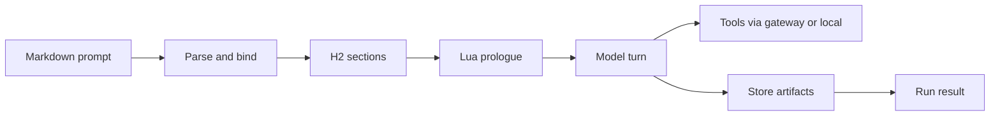


## Project layout

| Crate | Role |
| --- | --- |
| `promptforge-core` | Parser, section execution, Lua, store, gateway client |
| `promptforge-cli` | `promptforge run` binary |
| `promptforge-gateway` | Inference gateway and model catalog |
| `promptforge-mcp-server` | MCP server for agentic harnesses |
| `promptforge-webfetch` | In-process `web_fetch` tool |
| `promptforge-tool-picker` | Semantic tool capability binding |
| `promptforge-dev` | Interactive prompt development (unpublished) |
| `promptforge-core-tests` | Offline tests and opt-in real-model scenarios (unpublished) |

## Documentation

- [User Guide](user-guide.md) - progressive tutorial for writing prompts
- [DEVELOPMENT.md](DEVELOPMENT.md) - gateway config, store API, architecture, dev workflow
- [design-core.md](crates/promptforge-core/design-core.md) - core design notes


## Contributing

Build, format, and test before you open a PR. See [DEVELOPMENT.md](DEVELOPMENT.md) for gateway profiles, the prompt-dev loop, and crate boundaries. CI runs `cargo fmt --check`, `clippy -D warnings`, and `cargo test --workspace`.

## License

Distributed under the [Boost Software License 1.0](LICENSE).


### c:\Users\Vinnie\src\cursor\promptforge\user-guide.md

# PromptForge User Guide

A progressive tutorial for writing PromptForge prompts. Each section adds one concept with a working example. By the end you will have written a multi-section pipeline prompt with tools, models, store, fanout, and programmatic control flow.

You need PromptForge installed, a gateway running, and `PROMPTFORGE_GATEWAY_KEY` set. You know Markdown and have seen Lua.

---

## 1. What Is a Prompt File

```markdown
---
name: hello
description: Say hello to the user.
promptforge: 1
---

# Hello

## Main

Say hello and tell the user something interesting about the number 42.
```

A prompt file is Markdown with three parts:

- **Frontmatter** - YAML between `---` fences. `name` and `description` are required at parse time. `promptforge: 1` is required when you run the prompt (engine major must be `1`).
- **H1 heading** - exactly one. This is the prompt's title.
- **H2 sections** - executable units. They run top to bottom.

Everything between the H1 and the first H2 is a human-readable description. It is not sent to the model.

Save this as `hello.md` and run it:

```
promptforge run hello.md
```

The prose under `## Main` goes to the model. The model's response is the prompt's output.

A prompt file is Markdown that declares its engine version, has one title, and runs its sections in order.

## 2. The Model Turn

```markdown
---
name: summarize
description: Summarize the input.
promptforge: 1
---

# Summarize

## Main

Summarize the following text in one sentence:

{{ args }}
```

Run it:

```
promptforge run summarize.md "The quick brown fox jumped over the lazy dog."
```

Here is the mental model: prose becomes a user message. The model responds. That response is the prompt's output.

The `{{ args }}` placeholder is replaced with the input string before the model sees it. Substitution is covered in section 8.

When no Lua is present and no tools are scoped, one round trip happens: prose in, text out. That text is the run's result.

A model turn sends prose as a user message and returns the model's response as output.

## 3. Your First Lua Block (the Prologue)

````markdown
---
name: greet
description: Greet someone by name.
promptforge: 1
---

# Greet

## Main

```lua
models.use("writer")
var.greeting = "Hello, " .. args .. "!"
```

Repeat exactly, with no extra words: {{ var.greeting }}
````

The fenced `lua` block before the prose is the **prologue**. It runs before the model turn. Inside it you can:

- Select a model with `models.use`
- Set variables on `var` for use in prose substitution
- Read `args` (the input string)
- Call `tools.add` to scope tools for this section

The prologue is an exact, unindented ` ```lua ` opening and ` ``` ` closing. Indented fences, longer backtick runs, or different capitalization are treated as ordinary prose.

`models.use("writer")` selects a model binding declared in the preamble (covered next). Without a preamble declaring models, this would fail. For now, note the pattern: the prologue sets up what the model turn needs.

The prologue runs Lua before the model sees the prose.

## 4. The Preamble (H1 Shared Lua)

````markdown
---
name: fetcher
description: Fetch and summarize a URL.
promptforge: 1
---

# Fetcher

```lua
models.always("writer",
    "A model suited for careful analysis and summarization",
    { thinking = false, temperature = 0, context = 32768 })
tools.need("fetch", "Fetch a web page and return its main content as markdown.")
```

A tool that fetches URLs and summarizes their content.

## Main

```lua
tools.add("fetch")
```

Fetch {{ args }} and summarize its content in three bullet points.
````

The fenced `lua` block directly under the H1 is the **preamble** (shared Lua). Binding runs it once to resolve `tools.need` / `models.need` into frozen bindings. Each section then creates a fresh VM and **replays** that same shared program so declarations match call-for-call and global helpers are loaded into that VM. Host values (`args`, `var`, `store`, `reply`, section `tools` / `models` APIs) are injected only after that replay.

`models.always` does three things in one call: declares a model need, resolves it against the gateway catalog, and sets it as the default for all sections. Sections that call `models.use` override this default. The combined form takes an alias, a capability description, and an optional table of constraints. Both forms return a Model object.

`tools.need` declares a semantic capability need and returns a Tool object. The alias is your local name. The description tells the tool picker what you need. Declaring a need does not expose the tool to the model. That requires `tools.add` in a section Lua block before tool scope closes.

The preamble also accepts `models.need` (declare without selecting as default) and `tools.always` (expose a tool in every section).

**Globals vs locals.** Shared `function foo()` definitions and assignments to globals survive into the section's Lua blocks after replay. `local` names from the preamble chunk do not. If a later section must see a Tool or Model handle, assign it globally:

```lua
search = tools.need("search", "Search the web and return a list of results.")
```

not `local search = ...`.

`args`, `var`, and `store` are not available during the preamble. Use them in section Lua after host injection.

The preamble declares tools and models; aliases (and global handles) are then available to every section.

## 5. The Epilog

````markdown
---
name: uppercase
description: Return the model's reply in uppercase.
promptforge: 1
---

# Uppercase

```lua
models.always("writer",
    "A general-purpose model",
    { thinking = false, temperature = 0, context = 8192 })
```

## Main

Tell me a fun fact about {{ args }}.

```lua
return string.upper(reply)
```
````

The fenced `lua` block after the prose is the **epilog**. It runs after the model finishes responding. The model's response text is available as the global `reply`.

The epilog shares the same VM as earlier Lua in that section - variables set in the prologue are still accessible. You can:

- Inspect and transform `reply`
- Write to the store
- Check `tools.calls` counts
- Return a value to end the run

A scalar `return` from **any** section Lua block ends the entire run with that value. If you do not return, execution falls through to the next section (or the next block in an alternating section).

A classic section's three phases are: prologue (setup), prose (model turn), epilog (post-processing). All three are optional. Alternating blocks generalize this pattern (section 13).

The epilog runs after the model responds, in the same VM as the prologue, and can inspect or transform the reply.

## 6. Multiple Sections

````markdown
---
name: two_step
description: Research then report.
promptforge: 1
---

# Two Step

```lua
models.always("writer",
    "A careful analysis model",
    { thinking = false, temperature = 0, context = 16384 })
```

## Research

List five key facts about {{ args }}.

## Report

Using only the facts below, write a one-paragraph summary.

Facts:
{{ reply }}
````

Sections execute in file order. Each section gets:

- A fresh Lua VM (no Lua state carries over from the previous section)
- A fresh model conversation (no message history carries over)
- The previous section's `reply` as a global and as `{{ reply }}` in prose

Two channels bridge sections: `reply` (the previous section's model output) and the `store` (covered next). Everything else resets.

`{{ reply }}` in section 1 is nil and using it there is a hard error. In section 2 and beyond, it contains the previous section's model response.

Multiple sections let you build pipelines where each step reads the previous step's output through `reply`.

## 7. The Store

````markdown
---
name: store_demo
description: Demonstrate store read and write.
promptforge: 1
---

# Store Demo

```lua
models.always("writer",
    "A general-purpose model",
    { thinking = false, temperature = 0, context = 8192 })
```

## Collect

```lua
store.write("notes.md", "# Notes on " .. args .. "\n")
```

Write three facts about {{ args }}. Number them.

```lua
store.append("notes.md", "\n\n## Model Output\n\n" .. reply)
```

## Summarize

```lua
var.notes = store.inject("notes.md")
```

Summarize the following notes in one sentence:

{{ var.notes }}

```lua
store.write("summary.md", reply)
return reply
```
````

The store is a run-scoped virtual filesystem. Files exist only for the duration of the run and are shared across all sections. Store methods are available in section Lua blocks (after host injection), not in the H1 preamble.

| Operation | What it does |
|---|---|
| `store.write(path, text)` | Create or overwrite a file |
| `store.append(path, text)` | Append to a file |
| `store.read(path)` | Return verbatim contents |
| `store.read_lines(path)` | Return numbered lines (`1\| ...`) |
| `store.inject(path)` | Return contents wrapped in an untrusted envelope |
| `store.str_replace(path, old, new)` | Replace exact text in a file |
| `store.delete(path)` | Remove a file |
| `store.glob(pattern)` | List matching paths |
| `store.exists(path)` | Check if a file exists |

Use `store.inject` when the contents will be sent to the model - it wraps the text in a nonce-framed envelope that marks it as untrusted data. Use `store.read` when you need the raw text in Lua.

The store provides run-scoped virtual files that persist across sections and fanout arms.

## 8. Template Substitution

````markdown
---
name: template_demo
description: Show all substitution forms.
promptforge: 1
---

# Template Demo

```lua
models.always("writer",
    "A general-purpose model",
    { thinking = false, temperature = 0, context = 8192 })
```

## Main

```lua
var.topic = args
var.count = 3
var.tags = { "history", "science" }
```

Date: {{ sys.when }}
Topic: {{ var.topic }}
Requested count: {{ var.count }}
Tags: {{ var.tags }}

Write {{ var.count }} facts about {{ var.topic }}.
````

Namespaces available in prose substitution:

| Placeholder | Source |
|---|---|
| `{{ args }}` | The raw input string |
| `{{ reply }}` | Previous section's model reply (nil in section 1) |
| `{{ var.x }}` | Values set in the section's `var` table |
| `{{ sys.when }}` | Run launch timestamp |
| `{{ sys.now }}` | Current section start time |
| `{{ sys.id }}` | 1-based section index |
| `{{ sys.section_name }}` | Current section heading name |
| `{{ sys.execution }}` | Run execution id |
| `{{ sys.section_count }}` | Number of top-level H2 sections |
| `{{ sys.model }}` | Bound model catalog id (after scope close) |
| `{{ sys.reply_finish_reason }}` | Last inference finish reason (after a model turn) |
| `{{ sys.taskid }}` | 1-based arm index (fanout only) |
| `{{ item }}` | Current fanout item text (fanout only) |

Substitution rules:

- Scalars render as strings
- Lua tables render as JSON
- A missing path is a hard error
- Substitution applies only to prose, never to Lua source
- `{{ reply }}` in section 1, or `{{ item }}` outside a fanout arm, is a hard error

Template substitution resolves `{{ path }}` placeholders in prose before the model sees the text.

## 9. Tools (Search and Fetch)

````markdown
---
name: researcher
description: Research a topic using web search.
promptforge: 1
---

# Researcher

```lua
models.always("writer",
    "A careful research model",
    { thinking = false, temperature = 0, context = 32768 })
tools.need("search", "Search the web and return a list of results.")
tools.need("fetch", "Fetch a URL and return its main content as markdown.")
```

## Main

```lua
tools.add("search", "fetch")
```

Research {{ args }}. Search for relevant sources, fetch the most
promising result, and write a three-paragraph summary based on
what you find. Cite your source URLs.
````

Tools let the model reach outside the prompt during a section. Two tools ship built in:

- **search** - searches the web and returns trimmed results (title, URL, description). Proxied through the gateway, which holds the Brave API key.
- **fetch** - fetches a URL and returns its main content as markdown. Runs in-process, no credential needed.

The tool loop works like this:

1. Prose and scoped tool schemas go to the model
2. If the model responds with a tool call, the executor dispatches it
3. The tool result is appended to the conversation
4. The model is called again
5. This repeats until the model responds with text (not a tool call)

The loop is capped at `max_tool_iterations` (default 24) per section (or per `model:infer` call) to prevent runaway loops. Set it in frontmatter to change the cap.

`tools.add` accepts alias strings, Tool objects, and arrays of either. Only tools added in Lua before the section's tool scope closes (plus any `tools.always` from the preamble) are visible to the model. Scope closes on the first prose block.

Tools give the model the ability to search and fetch during a section's model turn.

## 10. The Tool Object

````markdown
---
name: tool_inspect
description: Inspect tool objects.
promptforge: 1
---

# Tool Inspect

```lua
models.always("writer",
    "A general-purpose model",
    { thinking = false, temperature = 0, context = 8192 })
search = tools.need("search",
    "Search the web and return a list of results.")
fetch = tools.need("fetch",
    "Fetch a URL and return its main content as markdown.")
```

## Main

```lua
log("search tool: " .. search.name)
log("fetch description: " .. fetch.description)

search.description = "Find web pages about " .. args
tools.add(search, fetch)
```

Search for information about {{ args }} and summarize what you find.
````

`tools.need` returns a Tool object. Assign it to a **global** in the preamble if a section must use the handle (locals from the shared chunk are not visible later).

| Property | Type | Description |
|---|---|---|
| `.name` | string | The alias you declared |
| `.description` | string | Model-facing description (mutable) |
| `.parameters` | table | Parameter schema (currently an empty object until registry enrichment) |
| `.wire_name` | string | Stable identity name used on the wire |
| `.untrusted` | boolean | Whether results are marked untrusted (currently always `false` on handles from `tools.need`) |

The `.description` property is mutable. Changing it before `tools.add` overrides what the model sees for that add.

`tools.add` accepts Tool objects, strings, and arrays of either:

```lua
tools.add(search)                    -- single object
tools.add("search", "fetch")        -- strings
tools.add({search, fetch})          -- array of objects
tools.add(search, "fetch")          -- mixed
```

Tool objects are first-class values you can inspect, customize, and pass to `tools.add`.

## 11. The Model Object

````markdown
---
name: model_inspect
description: Inspect model objects.
promptforge: 1
---

# Model Inspect

```lua
writer = models.need("writer",
    "A careful analysis model",
    { thinking = false, temperature = 0, context = 32768 })
fast = models.need("fast",
    "A fast general model",
    { thinking = false, temperature = 0, context = 8192 })
models.always("writer")
```

## Main

```lua
log("writer: " .. writer.name)
log("model_id: " .. writer.model_id)
log("context: " .. tostring(writer.context))
log("fast model: " .. fast.name)
```

Tell me one fact about {{ args }}.
````

`models.need` and both forms of `models.always` return a Model object. Use globals when section Lua must see the handle.

| Property | Type | Description |
|---|---|---|
| `.name` | string | The alias you declared |
| `.model_id` | string | Resolved catalog model id |
| `.description` | string | Capability description |
| `.context` | number | Context window size in tokens |
| `.thinking` | boolean or nil | Frozen thinking preference (`true` / `false` / unset) |
| `.temperature` | number or nil | Frozen temperature, if set |
| `.max_tokens` | number or nil | Frozen max tokens, if set |
| `.dialect` | string | Tool dialect name |

All properties are read-only. The Model object represents a frozen binding - its parameters were locked at bind time and cannot change during execution.

You can declare multiple models with `models.need` and select between them per section with `models.use`. `models.always` sets the prompt-wide default.

Model objects let you inspect bound model properties and select between multiple declared models.

## 12. Explicit Inference with model:infer()

````markdown
---
name: gated_research
description: Search first, then fetch, then summarize.
promptforge: 1
---

# Gated Research

```lua
writer = models.always("writer",
    "A careful analysis model",
    { thinking = false, temperature = 0, context = 32768 })
tools.need("search", "Search the web and return a list of results.")
tools.need("fetch", "Fetch a URL and return its main content as markdown.")
```

## Main

```lua
tools.add("search")
writer:infer("Search for: " .. args .. ". Return only the best URL, nothing else.")
var.url = reply

tools.add("fetch")
```

Fetch {{ var.url }} and write a detailed summary of its content.

```lua
store.write("summary.md", reply)
return reply
```
````

`model:infer(prompt)` calls the model from Lua. It:

- Snapshots the current tool bag (whatever `tools.add` has been called with so far)
- Runs the full tool loop
- Blocks until the model produces a final text response
- Sets the `reply` global
- Returns the response text

An optional second argument table is accepted today but ignored.

This enables **turn-gating** inside one open tool scope: add search, infer, add fetch, then fall through to final prose. `tools.add` remains legal until the first prose block closes tool scope. After the first prose, further `tools.add` calls fail.

`model:infer()` gives you explicit control over when inference happens, enabling turn-gated tool use before prose closes the scope.

## 13. Alternating Blocks

````markdown
---
name: alternating
description: Multi-turn within a single section.
promptforge: 1
---

# Alternating

```lua
writer = models.always("writer",
    "A careful analysis model",
    { thinking = false, temperature = 0, context = 32768 })
tools.need("search", "Search the web and return a list of results.")
tools.need("fetch", "Fetch a URL and return its main content as markdown.")
```

## Main

```lua
tools.add("search", "fetch")
```

Search for information about {{ args }}. Return the three most
relevant URLs, one per line, nothing else.

```lua
log("urls ready; continuing with fetch-capable tools already in scope")
```

Now fetch those URLs and write a comprehensive summary.
Cite each source.

```lua
store.write("report.md", reply)
return reply
```
````

A section can contain any number of alternating lua and prose blocks:

```
[lua] [prose] [lua] [prose] ... [lua]
```

The rules:

- **Non-final prose** - single-shot. One model round (may include tool calls in that turn), then control moves to the next lua block. The conversation accumulates.
- **Final prose** - full tool loop. The model keeps calling tools until it produces text. This text becomes `reply`.
- **Lua before the first prose** - may call `tools.add` / `models.use` / `model:infer`. Tool and model scope close on the first prose.
- **Lua after the first prose** - may inspect `reply`, write the store, `execute`, `jump`, `fanout`, and return. It may not call `tools.add` or `models.use`.

To change the tool bag between model turns, use `model:infer` in a single pre-prose Lua block (section 12), not `tools.add` between prose blocks.

Backward compatibility: the traditional prologue/prose/epilog pattern is exactly `[lua][prose][lua]`. It parses and runs identically.

Alternating blocks let you build multi-turn conversations within a single section, with Lua between turns under the scope rules above.

## 14. Composable Tool Sets

````markdown
---
name: composable_tools
description: Build tool sets conditionally.
promptforge: 1
---

# Composable Tools

```lua
models.always("writer",
    "A general-purpose model",
    { thinking = false, temperature = 0, context = 16384 })
search = tools.need("search",
    "Search the web and return a list of results.")
fetch = tools.need("fetch",
    "Fetch a URL and return its main content as markdown.")

research_tools = { search, fetch }
fetch_only = { fetch }
```

## Main

```lua
if args:find("^http") then
    tools.add(fetch_only)
else
    tools.add(research_tools)
end
```

Analyze {{ args }}. If it is a URL, fetch and summarize it.
Otherwise, search for it, fetch the best result, and summarize.
````

Because Tool objects are first-class Lua values, you can:

- Store them in arrays on **globals** in the preamble (not `var` - `var` does not exist during shared Lua)
- Pass arrays to `tools.add`
- Build conditional tool sets in the prologue based on `args` or other state
- Override `.description` on individual tools before adding them

Composable tool sets let you build, store, and conditionally select groups of tools as ordinary Lua values.

## 15. Sections as Subroutines: execute()

````markdown
---
name: pipeline
description: Execute sections as subroutines.
promptforge: 1
---

# Pipeline

```lua
models.always("writer",
    "A careful analysis model",
    { thinking = false, temperature = 0, context = 16384 })
tools.need("search", "Search the web and return a list of results.")
tools.need("fetch", "Fetch a URL and return its main content as markdown.")
```

## Research

```lua
tools.add("search", "fetch")
```

Research {{ args }}. Search for sources, fetch the best ones,
and write a detailed evidence summary. Cite URLs.

```lua
store.write("evidence.md", reply)
```

## Synthesize

```lua
var.evidence = store.inject("evidence.md")
```

Using only the evidence below, write a one-page briefing.

{{ var.evidence }}

## Main

```lua
local research = tasks["## Research"]
local evidence = execute(research)
local briefing = execute("## Synthesize")
return briefing
```
````

`execute(target, input?)` runs a named section as a subroutine. `target` is either a heading string with the `##` marker or a Section object from `tasks["## Name"]`. It:

- Creates a fresh VM (no Lua state from the caller)
- Creates a fresh conversation (no message history from the caller)
- Runs the full section lifecycle
- Returns the section's reply as a string

The called section shares the run's store, observer, execution id, gateway client, and tool registry. It gets fresh `var`, a fresh conversation, and a fresh VM. Optional `input` overrides `args` for the callee; omit it to inherit the caller's input.

`tasks["## Name"]` returns a Section object with `.name` and `.has_prose`. Missing headings are a hard error.

Recursion is capped at 8 levels. `jump` is not allowed inside `execute`.

`execute()` lets you call any section as a subroutine, with a fresh context, and get its reply back as a string.

## 16. Control Flow: jump()

````markdown
---
name: branching
description: Conditional section transfer.
promptforge: 1
---

# Branching

```lua
models.always("writer",
    "A general-purpose model",
    { thinking = false, temperature = 0, context = 8192 })
```

## Check

```lua
if args == "" then
    jump("## Help")
end
```

Analyze {{ args }} and determine if it is a valid topic for research.
Answer only "yes" or "no".

```lua
if reply:lower():find("no") then
    store.write("reason.md", reply)
    jump("## Reject")
end
jump("## Accept")
```

## Accept

The topic "{{ args }}" has been approved. Write a one-paragraph overview.

```lua
return reply
```

## Reject

```lua
var.reason = store.read("reason.md")
return "Rejected: " .. var.reason
```

## Help

```lua
return "Usage: provide a research topic as input."
```
````

`jump(target)` transfers control to a named section. `target` is a `##` heading string or a Section from `tasks`. It:

- Stops the current section immediately (later blocks in that section do not run)
- Clears the cross-section `reply` context
- Runs the named section next

Unlike `execute()`, `jump` does not return. Normal fall-through resumes from the jumped-to section.

A jump to a nonexistent section is a hard error.

`jump()` provides context-clearing transfer of control to another section, with no return to the caller.

## 17. Fanout (Parallel Execution)

````markdown
---
name: evidence_gatherer
description: Research multiple topics in parallel.
promptforge: 1
---

# Evidence Gatherer

```lua
models.always("writer",
    "A careful research model",
    { thinking = false, temperature = 0, context = 32768 })
tools.need("search", "Search the web and return a list of results.")
tools.need("fetch", "Fetch a URL and return its main content as markdown.")
```

## Main

```lua
local results = fanout("### Worker", "### Topics")
store.write("evidence.md", table.concat(results, "\n\n---\n\n"))
```

### Worker

```lua
tools.add("search", "fetch")
```

Research {{ item }} about {{ args }}.
Search for sources, fetch the best one, and write a summary
with the heading: ## {{ item }}

```lua
local s = tools.calls["search"] or 0
local f = tools.calls["fetch"] or 0
if s == 0 or f == 0 then
    return "## " .. tostring(item) .. "\n\nUNKNOWN"
end
```

### Topics

- Background and history
- Key people and leadership
- Recent news and developments
````

`fanout("### Worker", "### List")` runs the worker section once per item in the list, in parallel. Both heading arguments must include their `###` markers.

The **list section** is a list-only H3 with no Lua fences. Its prose contains only bullet items (unordered `- ` or `* `, or ordered `N. ` or `N) `). Markers are stripped. An empty list is a parse error.

The **worker section** is a normal template section. Each arm gets:

- A fresh VM
- `item` - the current list item text (also available as `{{ item }}` in prose)
- `sys.taskid` - the 1-based arm index ("1", "2", ...)
- Access to the shared store

Arms execute concurrently and share the run's store. The first arm error aborts all siblings.

`fanout` returns an ordered table of FanoutResult objects (list order, not finish order). Each result has:

| Field | Type | Description |
|---|---|---|
| `.text` | string | Arm reply text (or soft-degrade stub) |
| `.ok` | boolean | Whether the arm completed successfully |
| `.item` | string | The list item for this arm |
| `.exhausted` | boolean | True if the arm soft-degraded after tool-loop exhaustion |

`tostring(result)` returns `.text`. PromptForge wraps `table.concat` so concatenating a results table still works.

Children never execute by fall-through. Only an explicit `fanout()` call triggers child execution.

Fanout runs a worker section once per item in a list, in parallel, and returns ordered FanoutResult objects.

## 18. The sys Table

````markdown
---
name: sys_demo
description: Show sys table fields.
promptforge: 1
---

# Sys Demo

```lua
models.always("writer",
    "A general-purpose model",
    { thinking = false, temperature = 0, context = 8192 })
```

## Main

Write a one-sentence fact about {{ args }}.

```lua
store.write("report.md", reply
    .. "\n\n*Generated " .. sys.when
    .. " - " .. sys.model .. "*")
return store.read("report.md")
```
````

The `sys` table provides runtime metadata. It is sealed: reading an unknown key or writing any key raises an error.

| Field | Type | Available | Description |
|---|---|---|---|
| `sys.when` | string | Always (after host inject) | Run launch timestamp |
| `sys.now` | string | Always (after host inject) | Current section start time |
| `sys.id` | string | Always (after host inject) | 1-based section index |
| `sys.section_name` | string | Always (after host inject) | Current section name |
| `sys.execution` | string | Always (after host inject) | Run execution id |
| `sys.section_count` | string/number | Always (after host inject) | Top-level H2 count |
| `sys.model` | string | After scope close | Bound catalog model id |
| `sys.reply_finish_reason` | string | After a model turn | Last finish reason (for example `stop`) |
| `sys.taskid` | string | Fanout arms only | 1-based arm index |

`sys.model` is not available in the preamble or in Lua before the first prose closes scope. It becomes available in later Lua blocks and in prose substitution after scope close.

`sys.when` is useful for report footers and provenance stamps. `sys.model` identifies which model produced the output.

The `sys` table provides sealed, read-only access to runtime metadata.

## 19. Error Handling and Validation

````markdown
---
name: validated
description: Validate tool usage and reply quality.
promptforge: 1
---

# Validated

```lua
models.always("writer",
    "A careful research model",
    { thinking = false, temperature = 0, context = 32768 })
tools.need("search", "Search the web and return a list of results.")
tools.need("fetch", "Fetch a URL and return its main content as markdown.")
```

## Main

```lua
tools.add("search", "fetch")
```

Research {{ args }}. Search for at least one source,
fetch it, and write a sourced summary.

```lua
local searches = tools.calls["search"] or 0
local fetches = tools.calls["fetch"] or 0

if searches == 0 or fetches == 0 then
    return "INCOMPLETE: search=" .. searches
        .. " fetch=" .. fetches
end

if not reply:find("http") then
    return "INCOMPLETE: no URLs cited in reply"
end

store.write("result.md", reply)
return reply
```
````

Post-prose Lua is your quality gate. Common validation patterns:

**Check that tools were called:**

```lua
assert(tools.calls["search"] > 0, "search was not called")
```

`tools.calls["alias"]` returns the count of model dispatches for that alias in this section. It counts intent - the tool is counted even if it errored. Indexing an alias not in scope is a hard error. Counts are installed after tool scope closes (first prose) and after `model:infer` installs them for that path.

**Check reply content:**

```lua
if reply:find("I don't know") or reply:find("I cannot") then
    return "INCOMPLETE: model declined"
end
```

**Return early on failure:**

A scalar return from any section Lua block ends the entire run. Use this to stop the pipeline when a section produces bad output rather than feeding garbage onward.

**Common error sources:**

- `{{ reply }}` in section 1 - hard error (nil)
- `{{ item }}` outside a fanout arm - hard error (nil)
- `tools.calls["unknown"]` - hard error naming the bad alias
- `tools.add` after the first prose - scope already closed
- Model called a tool not in scope - `Error::OutOfScopeToolCall`
- Non-empty prose without `models.use` or `models.always` - `Error::ModelRequired`
- Duplicate near-similar tools in effective scope - rejected before the model sees them

Post-prose Lua is your quality gate for validating tool usage, reply content, and pipeline integrity.

## 20. Capstone: A Complete Pipeline Prompt

````markdown
---
name: briefer
description: Generate a sourced briefing on any topic.
promptforge: 1
max_tool_iterations: 24
---

# Briefer

```lua
writer = models.always("writer",
    "A careful analysis model suited to structured reasoning",
    { thinking = false, temperature = 0, context = 32768 })
search = tools.need("search",
    "Search the web and return a list of results.")
fetch = tools.need("fetch",
    "Fetch a URL and return its main content as markdown.")
```

Generates a sourced briefing by gathering evidence in parallel,
then synthesizing a report.

## Main

```lua
local results = fanout("### Gather", "### Topics")
store.write("evidence.md", table.concat(results, "\n\n"))
local report = execute(tasks["## Report"])
return report
```

### Gather

```lua
tools.add(search, fetch)
```

Subject: {{ args }}
Section: {{ item }}

Search for information about the Subject relevant to this Section.
Fetch the best source. Write a summary under the heading ## {{ item }}.
Every claim needs a source URL.

```lua
local s = tools.calls["search"] or 0
local f = tools.calls["fetch"] or 0
if s == 0 or f == 0 then
    return "## " .. tostring(item) .. "\n\nUNKNOWN"
end
local text = reply:gsub("^%s*```.-\n", ""):gsub("\n```%s*$", "")
return text
```

### Topics

- Background and History
- Key People
- Recent Developments

## Report

```lua
var.evidence = store.inject("evidence.md")
```

Evidence packet:

{{ var.evidence }}

Write a structured briefing using ONLY the evidence above.
Do not invent facts. If something is missing, write UNKNOWN.

```lua
store.write("report.md", reply
    .. "\n\n*" .. sys.when .. " - " .. sys.model .. "*")
return reply
```
````

This prompt uses every major feature:

| Feature | Where |
|---|---|
| Preamble | H1 shared Lua declares model and tools as globals |
| Tool objects | `search` and `fetch` globals passed to `tools.add` |
| Model object | `writer` returned by `models.always` |
| Fanout | `## Main` fans out `### Gather` over `### Topics` |
| FanoutResult | `table.concat` uses each result's text |
| `{{ item }}` | Each gather arm works on one topic |
| `tools.calls` | Gather epilog validates search and fetch |
| Store | Evidence written by fanout, read by Report |
| `store.inject` | Evidence injected with untrusted envelope |
| `execute()` / `tasks` | Main calls `## Report` as a subroutine |
| Template substitution | `{{ args }}`, `{{ item }}`, `{{ var.evidence }}` |
| `sys.when` / `sys.model` | Report footer with timestamp and model provenance |
| Scalar return | Report (and Main) return the final briefing |

The execution flow:

1. Bind runs the preamble once; each section VM replays it and loads globals
2. `## Main` Lua calls `fanout` - three gather arms run in parallel
3. Each arm searches, fetches, validates with `tools.calls`, returns evidence
4. `## Main` writes concatenated evidence to the store
5. `## Main` calls `execute(tasks["## Report"])`
6. `## Report` injects evidence, model writes briefing, epilog stamps and returns
7. `## Main` returns the report

A complete pipeline prompt combines preamble globals, tool objects, fanout, store, execute, substitution, validation, and sys metadata.

## 21. API Reference

### Globals

#### `args`

- **Type:** string
- **Available:** Section Lua and prose substitution (after host inject; not in H1 preamble)
- **Description:** The raw input string passed to `promptforge run <file> [input]`. Empty string if omitted.

```lua
var.subject = args
```

#### `reply`

- **Type:** string or nil
- **Available:** After a model turn in the current section; prologue of sections 2+ (previous section's reply); prose substitution as `{{ reply }}`
- **Description:** The model's response text. Set after prose or `model:infer()`. Nil in section 1 before the first model turn. Using `{{ reply }}` when nil is a hard error.

```lua
store.write("output.md", reply)
```

#### `item`

- **Type:** string or nil
- **Available:** Fanout worker sections only
- **Description:** The current fanout arm's item text. Using `{{ item }}` outside a fanout arm is a hard error.

```lua
log("Processing: " .. item)
```

#### `var`

- **Type:** table
- **Available:** Section Lua and prose substitution (not in H1 preamble)
- **Description:** Section-local variable table. Fresh per section and per fanout arm. Scalars render as strings in substitution, tables render as JSON.

```lua
var.count = 5
var.tags = { "alpha", "beta" }
```

#### `sys`

- **Type:** sealed table
- **Available:** Section Lua after host inject (read-only)
- **Description:** Runtime metadata. See section 18 for all fields.

```lua
log("Section " .. sys.id .. " at " .. sys.now)
```

#### `tasks`

- **Type:** table
- **Available:** Section Lua
- **Description:** Lookup of top-level H2 sections by heading string. `tasks["## Name"]` returns a Section object (`.name`, `.has_prose`) usable with `execute` and `jump`.

```lua
local step = tasks["## Research"]
local out = execute(step)
```

#### `log`

- **Type:** function
- **Signature:** `log(message: string)`
- **Returns:** nil
- **Available:** Preamble and section Lua (a fresh callback is installed per phase)
- **Description:** Emits an observer checkpoint. The message must be a valid UTF-8 string, at most 256 characters, with no newlines or control characters. Use short static labels. Never log args, replies, tool data, credentials, paths, or store contents.

```lua
log("Research phase complete")
```

---

### Store Methods

All store methods are available in section Lua after host injection. They are not available in the H1 preamble.

#### `store.write`

- **Signature:** `store.write(path: string, contents: string)`
- **Returns:** nil
- **Description:** Create or overwrite a virtual file.

```lua
store.write("notes.md", "# Notes\n\n" .. reply)
```

#### `store.append`

- **Signature:** `store.append(path: string, contents: string)`
- **Returns:** nil
- **Description:** Append text to an existing file. Creates the file if it does not exist.

```lua
store.append("log.md", "\n" .. reply)
```

#### `store.read`

- **Signature:** `store.read(path: string) -> string`
- **Returns:** Verbatim file contents
- **Description:** Read a file's raw contents. Use for trusted Lua-side processing.

```lua
local text = store.read("notes.md")
```

#### `store.read_lines`

- **Signature:** `store.read_lines(path: string) -> string`
- **Returns:** Numbered lines in `N| content` format
- **Description:** Read a file with line numbers. Useful for editing and navigation with `str_replace`.

```lua
local numbered = store.read_lines("draft.md")
```

#### `store.inject`

- **Signature:** `store.inject(path: string) -> string`
- **Returns:** Contents wrapped in an untrusted nonce-framed envelope
- **Description:** Read a file for model-facing re-injection. The envelope marks the content as untrusted data.

```lua
var.evidence = store.inject("evidence.md")
```

#### `store.str_replace`

- **Signature:** `store.str_replace(path: string, old: string, new: string)`
- **Returns:** nil
- **Description:** Replace an exact text match in a file. The old string must appear exactly once.

```lua
store.str_replace("draft.md", "PLACEHOLDER", reply)
```

#### `store.delete`

- **Signature:** `store.delete(path: string)`
- **Returns:** nil
- **Description:** Remove a virtual file.

```lua
store.delete("temp.md")
```

#### `store.glob`

- **Signature:** `store.glob(pattern: string) -> table`
- **Returns:** Array of matching file paths
- **Description:** List store files matching a glob pattern.

```lua
local files = store.glob("arm-*.md")
```

#### `store.exists`

- **Signature:** `store.exists(path: string) -> boolean`
- **Returns:** true if the file exists
- **Description:** Check whether a virtual file exists.

```lua
if store.exists("cache.md") then
    var.cached = store.read("cache.md")
end
```

---

### Tool Functions

#### `tools.need`

- **Signature:** `tools.need(alias: string, description: string) -> Tool`
- **Returns:** Tool object
- **Available:** Preamble only (bind and per-section replay)
- **Description:** Declare a semantic tool capability need. The alias is case-sensitive (`[A-Za-z][A-Za-z0-9_-]{0,63}`). Returns a Tool object. Assign to a global if section Lua must keep the handle.

```lua
search = tools.need("search",
    "Search the web and return a list of results.")
```

#### `tools.add`

- **Signature:** `tools.add(...)`
- **Returns:** nil
- **Available:** Section Lua before the first prose closes tool scope
- **Description:** Expose tools to the model. Accepts strings, Tool objects, and arrays of either. Only tools added here (plus `tools.always`) are visible to the model.

```lua
tools.add("search", "fetch")
tools.add(search)
tools.add({search, fetch})
```

#### `tools.always`

- **Signature:** `tools.always(alias: string)`
- **Returns:** nil
- **Available:** Preamble only
- **Description:** Expose a declared tool in every model-facing section. The alias must have been declared with `tools.need` first.

```lua
tools.always("fetch")
```

#### `tools.calls`

- **Type:** table (read-only)
- **Available:** After tool counts are installed (`model:infer`, or after first prose closes scope)
- **Description:** Per-section count of model tool dispatches by alias. Indexing an out-of-scope alias is a hard error.

```lua
assert(tools.calls["search"] > 0, "search was never called")
```

---

### Model Functions

#### `models.need`

- **Signature:** `models.need(alias: string, description: string, opts?: table) -> Model`
- **Returns:** Model object
- **Available:** Preamble only
- **Description:** Declare a model capability need. Optional `opts`: `context` (minimum window), `thinking` (boolean), `temperature`, `max_tokens`.

```lua
writer = models.need("writer",
    "A careful analysis model",
    { thinking = false, temperature = 0, context = 32768 })
```

#### `models.always`

- **Signature:** `models.always(alias: string) -> Model` or `models.always(alias: string, description: string, opts?: table) -> Model`
- **Returns:** Model object (both forms)
- **Available:** Preamble only
- **Description:** Set the prompt-wide default model. The single-argument form selects an already-declared alias. The three-argument form declares and selects. At most one `models.always` per prompt.

```lua
models.always("writer")

writer = models.always("writer",
    "A careful analysis model",
    { thinking = false, temperature = 0, context = 32768 })
```

#### `models.use`

- **Signature:** `models.use(alias: string)`
- **Returns:** nil
- **Available:** Section Lua before model scope closes (first prose)
- **Description:** Select a declared model for this section. Overrides `models.always`. At most one `models.use` per section.

```lua
models.use("fast")
```

#### `model:infer()`

- **Signature:** `model:infer(prompt: string, opts?: table) -> string`
- **Returns:** Model response text
- **Available:** Section Lua (requires an execution infer hook)
- **Description:** Explicit model call from Lua. Snapshots the current tool bag, runs the full tool loop, sets `reply`, returns the text. An optional `opts` table is accepted but currently ignored.

```lua
tools.add("search")
writer:infer("Search for " .. args)
local search_results = reply

tools.add("fetch")
writer:infer("Fetch the best URL from: " .. search_results)
```

---

### Control Flow Functions

#### `execute()`

- **Signature:** `execute(target: string|Section, input?: string) -> string`
- **Returns:** The called section's reply
- **Available:** Section Lua
- **Description:** Run a named H2 section as a subroutine. Fresh VM and conversation. Shares store/observer/tools. Target is `## Name` or a Section from `tasks`. Recursion capped at 8. `jump` inside execute is rejected.

```lua
local analysis = execute("## Analyze")
local report = execute(tasks["## Report"])
```

#### `jump()`

- **Signature:** `jump(target: string|Section)`
- **Returns:** Does not return
- **Available:** Section Lua
- **Description:** Transfer control to a named section. Current section stops. Cross-section `reply` clears. Target is `## Name` or a Section from `tasks`.

```lua
if args == "" then
    jump("## Help")
end
```

#### `fanout()`

- **Signature:** `fanout(worker: string, list: string) -> table`
- **Returns:** Ordered table of FanoutResult objects
- **Available:** Section Lua of a parent section
- **Description:** Run the worker once per list item in parallel. Both arguments need `###` markers. List H3 must be list-only. Arms get `item` and `sys.taskid`. First arm error aborts siblings. `table.concat` coerces `.text`.

```lua
local results = fanout("### Worker", "### Topics")
store.write("all.md", table.concat(results, "\n\n"))
if not results[1].ok then
    log("arm soft-degraded")
end
```

---

### Objects

#### Tool

Returned by `tools.need()`.

| Property | Type | Mutable | Description |
|---|---|---|---|
| `.name` | string | No | Declared alias |
| `.description` | string | **Yes** | Model-facing description |
| `.parameters` | table | No | Parameter schema (empty object today) |
| `.wire_name` | string | No | Stable identity name |
| `.untrusted` | boolean | No | Untrusted flag (false on need handles today) |

```lua
fetch = tools.need("fetch", "Fetch a web page.")
fetch.description = "Fetch " .. args .. " and return markdown"
tools.add(fetch)
```

#### Model

Returned by `models.need()` or `models.always()`.

| Property | Type | Description |
|---|---|---|
| `.name` | string | Declared alias |
| `.model_id` | string | Resolved catalog model id |
| `.description` | string | Capability description |
| `.context` | number | Context window (tokens) |
| `.thinking` | boolean or nil | Frozen thinking preference |
| `.temperature` | number or nil | Frozen temperature |
| `.max_tokens` | number or nil | Frozen max tokens |
| `.dialect` | string | Tool dialect name |

All properties are read-only.

| Method | Signature | Description |
|---|---|---|
| `:infer()` | `model:infer(prompt, opts?) -> string` | Explicit inference from Lua (`opts` ignored today) |

```lua
writer = models.need("writer", "Analysis model",
    { temperature = 0, context = 32768 })
local result = writer:infer("Summarize: " .. args)
```

#### Section

Returned by `tasks["## Name"]`.

| Property | Type | Description |
|---|---|---|
| `.name` | string | Section heading name |
| `.has_prose` | boolean | Whether the section has model-facing prose |

Pass to `execute` or `jump` in place of a heading string.

#### FanoutResult

Returned as each element of a `fanout()` results table.

| Property | Type | Description |
|---|---|---|
| `.text` | string | Arm reply text |
| `.ok` | boolean | Success flag |
| `.item` | string | Source list item |
| `.exhausted` | boolean | Soft-degrade after tool-loop exhaustion |

`tostring(result)` equals `.text`.

---

### Frontmatter Fields

| Field | Required | Type | Description |
|---|---|---|---|
| `name` | Yes (parse) | string | Prompt identity |
| `description` | Yes (parse) | string | Human-readable description |
| `promptforge` | Yes (run) | integer | Engine major version (must be `1`) |
| `default_return` | No | string | Value returned when falling off the last section |
| `max_tool_iterations` | No | integer | Tool loop cap per section / infer (default 24) |

```yaml
---
name: my_prompt
description: Does something useful.
promptforge: 1
max_tool_iterations: 12
default_return: "No result produced."
---
```

---

### Prompt Structure Summary

````
---
frontmatter (YAML)
---

# Title (exactly one)

```lua
-- Preamble: shared Lua (bound once, replayed per section VM)
-- tools.need, tools.always, models.need, models.always
-- Use globals for handles sections must see
```

Description text (not executed)

## Section (H2, runs top-to-bottom)

```lua
-- Lua before first prose: models.use, tools.add, infer, var
```

Prose with {{ substitution }} (sent to model; closes tool/model scope)

```lua
-- Lua after first prose: inspect reply, validate, store, return
```

## Another Section

-- Alternating blocks allowed:
-- [lua] [prose] [lua] [prose] ... [lua]
-- tools.add only before the first prose

### Child (H3, only for fanout)

```lua
-- Worker Lua
```

Worker prose with {{ item }}

### List (H3, list-only, for fanout)

- Item one
- Item two
- Item three
````

---

### Quick Reference Table

| Name | Kind | Available | Signature | Returns |
|---|---|---|---|---|
| `args` | global | Section Lua / prose | - | string |
| `reply` | global | After model turn; section 2+ prologue | - | string or nil |
| `item` | global | Fanout arms | - | string or nil |
| `var` | global | Section Lua / prose | - | table |
| `sys` | global | Section Lua (sealed) | - | table |
| `tasks` | global | Section Lua | `tasks["## Name"]` | Section |
| `log` | function | Preamble, section Lua | `log(msg)` | nil |
| `tools.need` | function | Preamble | `tools.need(alias, desc)` | Tool |
| `tools.add` | function | Before first prose | `tools.add(...)` | nil |
| `tools.always` | function | Preamble | `tools.always(alias)` | nil |
| `tools.calls` | table | After counts install | `tools.calls[alias]` | number |
| `models.need` | function | Preamble | `models.need(alias, desc, opts?)` | Model |
| `models.always` | function | Preamble | `models.always(...)` | Model |
| `models.use` | function | Before first prose | `models.use(alias)` | nil |
| `model:infer` | method | Section Lua | `model:infer(prompt, opts?)` | string |
| `execute` | function | Section Lua | `execute(target, input?)` | string |
| `jump` | function | Section Lua | `jump(target)` | never |
| `fanout` | function | Section Lua | `fanout(worker, list)` | FanoutResult[] |
| `store.*` | functions | Section Lua | see Store Methods | varies |


StrReplace-edited design docs (path only): `C:\Users\Vinnie\src\cursor\promptforge\README.md`, `C:\Users\Vinnie\src\cursor\promptforge\briefer.md`, `C:\Users\Vinnie\src\cursor\promptforge\crates\promptforge-core\design-core.md`, `c:\Users\Vinnie\src\cursor\promptforge\README.md`, `c:\Users\Vinnie\src\cursor\promptforge\STATUS.md`, `c:\Users\Vinnie\src\cursor\promptforge\briefer.md`, `c:\Users\Vinnie\src\cursor\promptforge\crates\promptforge-core\design-core.md`, `c:\Users\Vinnie\src\cursor\promptforge\crates\promptforge-dev\README.md`, `c:\Users\Vinnie\src\cursor\promptforge\crates\promptforge-dev\design.md`, `c:\Users\Vinnie\src\cursor\promptforge\crates\promptforge-gateway\design-gateway.md`
