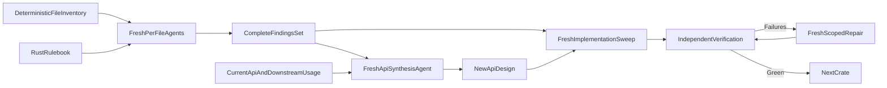
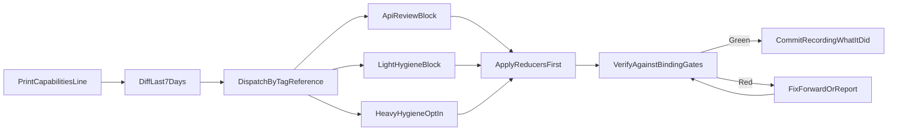

# Top-to-bottom repo review

*2026-08-10 08:56 - transcript 20b72c91-8a72-45f0-97fa-e059aa09c286*

## Prompts

we are going to do a top to bottom review of this entire repository @promptforge .
the review will proceed crate by crate. the next crate will start only when the current crate is completely done.
for each crate,. every single rust source file will be inspected in a fresh subagent. first the subagent will extract the public API and put it in a new file {{source}}.findings.md. then the subagent will analyze the source accoding to @tools-public/rulebooks/rust-rulebook.md looking for problems. the subagent will also look for opportuntiies to do general code hygiene improvements. I dont have to tell you what those are I hope, you are a frontier model. when all the files are done (none of the files are modified yet) then a fresh subagent will ingest ALL the .findings.md files together. it will look at the public APIs and look for opportunties to reduce the API surface, move responsibilties to where they belong if they should be moved, do more with less. the subagent will consider the other findings when thinking about the new API: given the findings, what API modification would both reduce the chance of the finding occurring again and also make the API surface cleaner and more robust. The new API will be written to a fresh file. Then a fresh subagent will sweep through all the source code and apply the new API changes, fix all the findings. It will have the new api and all findings files *.finding.md injected.

Do you understand?

use @tools-public/rulebooks/rust-rulebook.md @tools-public/rulebooks/vibe-rulebook.md @tools-public/rulebooks/prompts-rulebook.md

review the plan

A. review the toml.
B. fix that.
C. the frontier model has 1M context...
D. I thought I was clear: ONE review, and ONE round of fixes.

Clean up the smaller issues as well, and fix the design documents in a subagent: write the new design into one new document, put the residue into another document, delete the old 3 docs.

is gpt-5.6 sol medium ok for this plan?

run

The beginning of the above subagent result is already visible to the user. Perform any follow-up actions (if needed). DO NOT regurgitate or reiterate its result unless asked. If multiple subagents have now completed and none are still running, briefly summarize the findings and conclusions across all of them. Otherwise, if no follow-ups remain, end your response with a brief third-person confirmation that the subagent has completed. If you mention an agent or subagent in your response, link it with the `[label](id)` format using the agent_id or task_id from the notification instead of printing the raw ID. Don't repeat the same confirmation every time.

The beginning of the above subagent result is already visible to the user. Perform any follow-up actions (if needed). DO NOT regurgitate or reiterate its result unless asked. If multiple subagents have now completed and none are still running, briefly summarize the findings and conclusions across all of them. Otherwise, if no follow-ups remain, end your response with a brief third-person confirmation that the subagent has completed. If you mention an agent or subagent in your response, link it with the `[label](id)` format using the agent_id or task_id from the notification instead of printing the raw ID. Don't repeat the same confirmation every time.

The beginning of the above subagent result is already visible to the user. Perform any follow-up actions (if needed). DO NOT regurgitate or reiterate its result unless asked. If multiple subagents have now completed and none are still running, briefly summarize the findings and conclusions across all of them. Otherwise, if no follow-ups remain, end your response with a brief third-person confirmation that the subagent has completed. If you mention an agent or subagent in your response, link it with the `[label](id)` format using the agent_id or task_id from the notification instead of printing the raw ID. Don't repeat the same confirmation every time.

The beginning of the above subagent result is already visible to the user. Perform any follow-up actions (if needed). DO NOT regurgitate or reiterate its result unless asked. If multiple subagents have now completed and none are still running, briefly summarize the findings and conclusions across all of them. Otherwise, if no follow-ups remain, end your response with a brief third-person confirmation that the subagent has completed. If you mention an agent or subagent in your response, link it with the `[label](id)` format using the agent_id or task_id from the notification instead of printing the raw ID. Don't repeat the same confirmation every time.

The beginning of the above subagent result is already visible to the user. Perform any follow-up actions (if needed). DO NOT regurgitate or reiterate its result unless asked. If multiple subagents have now completed and none are still running, briefly summarize the findings and conclusions across all of them. Otherwise, if no follow-ups remain, end your response with a brief third-person confirmation that the subagent has completed. If you mention an agent or subagent in your response, link it with the `[label](id)` format using the agent_id or task_id from the notification instead of printing the raw ID. Don't repeat the same confirmation every time.

The beginning of the above subagent result is already visible to the user. Perform any follow-up actions (if needed). DO NOT regurgitate or reiterate its result unless asked. If multiple subagents have now completed and none are still running, briefly summarize the findings and conclusions across all of them. Otherwise, if no follow-ups remain, end your response with a brief third-person confirmation that the subagent has completed. If you mention an agent or subagent in your response, link it with the `[label](id)` format using the agent_id or task_id from the notification instead of printing the raw ID. Don't repeat the same confirmation every time.

The beginning of the above subagent result is already visible to the user. Perform any follow-up actions (if needed). DO NOT regurgitate or reiterate its result unless asked. If multiple subagents have now completed and none are still running, briefly summarize the findings and conclusions across all of them. Otherwise, if no follow-ups remain, end your response with a brief third-person confirmation that the subagent has completed. If you mention an agent or subagent in your response, link it with the `[label](id)` format using the agent_id or task_id from the notification instead of printing the raw ID. Don't repeat the same confirmation every time.

The beginning of the above subagent result is already visible to the user. Perform any follow-up actions (if needed). DO NOT regurgitate or reiterate its result unless asked. If multiple subagents have now completed and none are still running, briefly summarize the findings and conclusions across all of them. Otherwise, if no follow-ups remain, end your response with a brief third-person confirmation that the subagent has completed. If you mention an agent or subagent in your response, link it with the `[label](id)` format using the agent_id or task_id from the notification instead of printing the raw ID. Don't repeat the same confirmation every time.

The beginning of the above subagent result is already visible to the user. Perform any follow-up actions (if needed). DO NOT regurgitate or reiterate its result unless asked. If multiple subagents have now completed and none are still running, briefly summarize the findings and conclusions across all of them. Otherwise, if no follow-ups remain, end your response with a brief third-person confirmation that the subagent has completed. If you mention an agent or subagent in your response, link it with the `[label](id)` format using the agent_id or task_id from the notification instead of printing the raw ID. Don't repeat the same confirmation every time.

The beginning of the above subagent result is already visible to the user. Perform any follow-up actions (if needed). DO NOT regurgitate or reiterate its result unless asked. If multiple subagents have now completed and none are still running, briefly summarize the findings and conclusions across all of them. Otherwise, if no follow-ups remain, end your response with a brief third-person confirmation that the subagent has completed. If you mention an agent or subagent in your response, link it with the `[label](id)` format using the agent_id or task_id from the notification instead of printing the raw ID. Don't repeat the same confirmation every time.

The beginning of the above subagent result is already visible to the user. Perform any follow-up actions (if needed). DO NOT regurgitate or reiterate its result unless asked. If multiple subagents have now completed and none are still running, briefly summarize the findings and conclusions across all of them. Otherwise, if no follow-ups remain, end your response with a brief third-person confirmation that the subagent has completed. If you mention an agent or subagent in your response, link it with the `[label](id)` format using the agent_id or task_id from the notification instead of printing the raw ID. Don't repeat the same confirmation every time.

The beginning of the above subagent result is already visible to the user. Perform any follow-up actions (if needed). DO NOT regurgitate or reiterate its result unless asked. If multiple subagents have now completed and none are still running, briefly summarize the findings and conclusions across all of them. Otherwise, if no follow-ups remain, end your response with a brief third-person confirmation that the subagent has completed. If you mention an agent or subagent in your response, link it with the `[label](id)` format using the agent_id or task_id from the notification instead of printing the raw ID. Don't repeat the same confirmation every time.

The beginning of the above subagent result is already visible to the user. Perform any follow-up actions (if needed). DO NOT regurgitate or reiterate its result unless asked. If multiple subagents have now completed and none are still running, briefly summarize the findings and conclusions across all of them. Otherwise, if no follow-ups remain, end your response with a brief third-person confirmation that the subagent has completed. If you mention an agent or subagent in your response, link it with the `[label](id)` format using the agent_id or task_id from the notification instead of printing the raw ID. Don't repeat the same confirmation every time.

The beginning of the above subagent result is already visible to the user. Perform any follow-up actions (if needed). DO NOT regurgitate or reiterate its result unless asked. If multiple subagents have now completed and none are still running, briefly summarize the findings and conclusions across all of them. Otherwise, if no follow-ups remain, end your response with a brief third-person confirmation that the subagent has completed. If you mention an agent or subagent in your response, link it with the `[label](id)` format using the agent_id or task_id from the notification instead of printing the raw ID. Don't repeat the same confirmation every time.

The beginning of the above subagent result is already visible to the user. Perform any follow-up actions (if needed). DO NOT regurgitate or reiterate its result unless asked. If multiple subagents have now completed and none are still running, briefly summarize the findings and conclusions across all of them. Otherwise, if no follow-ups remain, end your response with a brief third-person confirmation that the subagent has completed. If you mention an agent or subagent in your response, link it with the `[label](id)` format using the agent_id or task_id from the notification instead of printing the raw ID. Don't repeat the same confirmation every time.

The beginning of the above subagent result is already visible to the user. Perform any follow-up actions (if needed). DO NOT regurgitate or reiterate its result unless asked. If multiple subagents have now completed and none are still running, briefly summarize the findings and conclusions across all of them. Otherwise, if no follow-ups remain, end your response with a brief third-person confirmation that the subagent has completed. If you mention an agent or subagent in your response, link it with the `[label](id)` format using the agent_id or task_id from the notification instead of printing the raw ID. Don't repeat the same confirmation every time.

The beginning of the above subagent result is already visible to the user. Perform any follow-up actions (if needed). DO NOT regurgitate or reiterate its result unless asked. If multiple subagents have now completed and none are still running, briefly summarize the findings and conclusions across all of them. Otherwise, if no follow-ups remain, end your response with a brief third-person confirmation that the subagent has completed. If you mention an agent or subagent in your response, link it with the `[label](id)` format using the agent_id or task_id from the notification instead of printing the raw ID. Don't repeat the same confirmation every time.

The beginning of the above subagent result is already visible to the user. Perform any follow-up actions (if needed). DO NOT regurgitate or reiterate its result unless asked. If multiple subagents have now completed and none are still running, briefly summarize the findings and conclusions across all of them. Otherwise, if no follow-ups remain, end your response with a brief third-person confirmation that the subagent has completed. If you mention an agent or subagent in your response, link it with the `[label](id)` format using the agent_id or task_id from the notification instead of printing the raw ID. Don't repeat the same confirmation every time.

The beginning of the above subagent result is already visible to the user. Perform any follow-up actions (if needed). DO NOT regurgitate or reiterate its result unless asked. If multiple subagents have now completed and none are still running, briefly summarize the findings and conclusions across all of them. Otherwise, if no follow-ups remain, end your response with a brief third-person confirmation that the subagent has completed. If you mention an agent or subagent in your response, link it with the `[label](id)` format using the agent_id or task_id from the notification instead of printing the raw ID. Don't repeat the same confirmation every time.

we only changed one api?

oh so the apis are being rethought one at a time

The beginning of the above subagent result is already visible to the user. Perform any follow-up actions (if needed). DO NOT regurgitate or reiterate its result unless asked. If multiple subagents have now completed and none are still running, briefly summarize the findings and conclusions across all of them. Otherwise, if no follow-ups remain, end your response with a brief third-person confirmation that the subagent has completed. If you mention an agent or subagent in your response, link it with the `[label](id)` format using the agent_id or task_id from the notification instead of printing the raw ID. Don't repeat the same confirmation every time.

The beginning of the above subagent result is already visible to the user. Perform any follow-up actions (if needed). DO NOT regurgitate or reiterate its result unless asked. If multiple subagents have now completed and none are still running, briefly summarize the findings and conclusions across all of them. Otherwise, if no follow-ups remain, end your response with a brief third-person confirmation that the subagent has completed. If you mention an agent or subagent in your response, link it with the `[label](id)` format using the agent_id or task_id from the notification instead of printing the raw ID. Don't repeat the same confirmation every time.

The beginning of the above subagent result is already visible to the user. Perform any follow-up actions (if needed). DO NOT regurgitate or reiterate its result unless asked. If multiple subagents have now completed and none are still running, briefly summarize the findings and conclusions across all of them. Otherwise, if no follow-ups remain, end your response with a brief third-person confirmation that the subagent has completed. If you mention an agent or subagent in your response, link it with the `[label](id)` format using the agent_id or task_id from the notification instead of printing the raw ID. Don't repeat the same confirmation every time.

The beginning of the above subagent result is already visible to the user. Perform any follow-up actions (if needed). DO NOT regurgitate or reiterate its result unless asked. If multiple subagents have now completed and none are still running, briefly summarize the findings and conclusions across all of them. Otherwise, if no follow-ups remain, end your response with a brief third-person confirmation that the subagent has completed. If you mention an agent or subagent in your response, link it with the `[label](id)` format using the agent_id or task_id from the notification instead of printing the raw ID. Don't repeat the same confirmation every time.

The beginning of the above subagent result is already visible to the user. Perform any follow-up actions (if needed). DO NOT regurgitate or reiterate its result unless asked. If multiple subagents have now completed and none are still running, briefly summarize the findings and conclusions across all of them. Otherwise, if no follow-ups remain, end your response with a brief third-person confirmation that the subagent has completed. If you mention an agent or subagent in your response, link it with the `[label](id)` format using the agent_id or task_id from the notification instead of printing the raw ID. Don't repeat the same confirmation every time.

The beginning of the above subagent result is already visible to the user. Perform any follow-up actions (if needed). DO NOT regurgitate or reiterate its result unless asked. If multiple subagents have now completed and none are still running, briefly summarize the findings and conclusions across all of them. Otherwise, if no follow-ups remain, end your response with a brief third-person confirmation that the subagent has completed. If you mention an agent or subagent in your response, link it with the `[label](id)` format using the agent_id or task_id from the notification instead of printing the raw ID. Don't repeat the same confirmation every time.

The beginning of the above subagent result is already visible to the user. Perform any follow-up actions (if needed). DO NOT regurgitate or reiterate its result unless asked. If multiple subagents have now completed and none are still running, briefly summarize the findings and conclusions across all of them. Otherwise, if no follow-ups remain, end your response with a brief third-person confirmation that the subagent has completed. If you mention an agent or subagent in your response, link it with the `[label](id)` format using the agent_id or task_id from the notification instead of printing the raw ID. Don't repeat the same confirmation every time.

The beginning of the above subagent result is already visible to the user. Perform any follow-up actions (if needed). DO NOT regurgitate or reiterate its result unless asked. If multiple subagents have now completed and none are still running, briefly summarize the findings and conclusions across all of them. Otherwise, if no follow-ups remain, end your response with a brief third-person confirmation that the subagent has completed. If you mention an agent or subagent in your response, link it with the `[label](id)` format using the agent_id or task_id from the notification instead of printing the raw ID. Don't repeat the same confirmation every time.

The beginning of the above subagent result is already visible to the user. Perform any follow-up actions (if needed). DO NOT regurgitate or reiterate its result unless asked. If multiple subagents have now completed and none are still running, briefly summarize the findings and conclusions across all of them. Otherwise, if no follow-ups remain, end your response with a brief third-person confirmation that the subagent has completed. If you mention an agent or subagent in your response, link it with the `[label](id)` format using the agent_id or task_id from the notification instead of printing the raw ID. Don't repeat the same confirmation every time.

The beginning of the above subagent result is already visible to the user. Perform any follow-up actions (if needed). DO NOT regurgitate or reiterate its result unless asked. If multiple subagents have now completed and none are still running, briefly summarize the findings and conclusions across all of them. Otherwise, if no follow-ups remain, end your response with a brief third-person confirmation that the subagent has completed. If you mention an agent or subagent in your response, link it with the `[label](id)` format using the agent_id or task_id from the notification instead of printing the raw ID. Don't repeat the same confirmation every time.

The beginning of the above subagent result is already visible to the user. Perform any follow-up actions (if needed). DO NOT regurgitate or reiterate its result unless asked. If multiple subagents have now completed and none are still running, briefly summarize the findings and conclusions across all of them. Otherwise, if no follow-ups remain, end your response with a brief third-person confirmation that the subagent has completed. If you mention an agent or subagent in your response, link it with the `[label](id)` format using the agent_id or task_id from the notification instead of printing the raw ID. Don't repeat the same confirmation every time.

The beginning of the above subagent result is already visible to the user. Perform any follow-up actions (if needed). DO NOT regurgitate or reiterate its result unless asked. If multiple subagents have now completed and none are still running, briefly summarize the findings and conclusions across all of them. Otherwise, if no follow-ups remain, end your response with a brief third-person confirmation that the subagent has completed. If you mention an agent or subagent in your response, link it with the `[label](id)` format using the agent_id or task_id from the notification instead of printing the raw ID. Don't repeat the same confirmation every time.

The beginning of the above subagent result is already visible to the user. Perform any follow-up actions (if needed). DO NOT regurgitate or reiterate its result unless asked. If multiple subagents have now completed and none are still running, briefly summarize the findings and conclusions across all of them. Otherwise, if no follow-ups remain, end your response with a brief third-person confirmation that the subagent has completed. If you mention an agent or subagent in your response, link it with the `[label](id)` format using the agent_id or task_id from the notification instead of printing the raw ID. Don't repeat the same confirmation every time.

The beginning of the above subagent result is already visible to the user. Perform any follow-up actions (if needed). DO NOT regurgitate or reiterate its result unless asked. If multiple subagents have now completed and none are still running, briefly summarize the findings and conclusions across all of them. Otherwise, if no follow-ups remain, end your response with a brief third-person confirmation that the subagent has completed. If you mention an agent or subagent in your response, link it with the `[label](id)` format using the agent_id or task_id from the notification instead of printing the raw ID. Don't repeat the same confirmation every time.

The beginning of the above subagent result is already visible to the user. Perform any follow-up actions (if needed). DO NOT regurgitate or reiterate its result unless asked. If multiple subagents have now completed and none are still running, briefly summarize the findings and conclusions across all of them. Otherwise, if no follow-ups remain, end your response with a brief third-person confirmation that the subagent has completed. If you mention an agent or subagent in your response, link it with the `[label](id)` format using the agent_id or task_id from the notification instead of printing the raw ID. Don't repeat the same confirmation every time.

The beginning of the above subagent result is already visible to the user. Perform any follow-up actions (if needed). DO NOT regurgitate or reiterate its result unless asked. If multiple subagents have now completed and none are still running, briefly summarize the findings and conclusions across all of them. Otherwise, if no follow-ups remain, end your response with a brief third-person confirmation that the subagent has completed. If you mention an agent or subagent in your response, link it with the `[label](id)` format using the agent_id or task_id from the notification instead of printing the raw ID. Don't repeat the same confirmation every time.

The beginning of the above subagent result is already visible to the user. Perform any follow-up actions (if needed). DO NOT regurgitate or reiterate its result unless asked. If multiple subagents have now completed and none are still running, briefly summarize the findings and conclusions across all of them. Otherwise, if no follow-ups remain, end your response with a brief third-person confirmation that the subagent has completed. If you mention an agent or subagent in your response, link it with the `[label](id)` format using the agent_id or task_id from the notification instead of printing the raw ID. Don't repeat the same confirmation every time.

The beginning of the above subagent result is already visible to the user. Perform any follow-up actions (if needed). DO NOT regurgitate or reiterate its result unless asked. If multiple subagents have now completed and none are still running, briefly summarize the findings and conclusions across all of them. Otherwise, if no follow-ups remain, end your response with a brief third-person confirmation that the subagent has completed. If you mention an agent or subagent in your response, link it with the `[label](id)` format using the agent_id or task_id from the notification instead of printing the raw ID. Don't repeat the same confirmation every time.

The beginning of the above subagent result is already visible to the user. Perform any follow-up actions (if needed). DO NOT regurgitate or reiterate its result unless asked. If multiple subagents have now completed and none are still running, briefly summarize the findings and conclusions across all of them. Otherwise, if no follow-ups remain, end your response with a brief third-person confirmation that the subagent has completed. If you mention an agent or subagent in your response, link it with the `[label](id)` format using the agent_id or task_id from the notification instead of printing the raw ID. Don't repeat the same confirmation every time.

The beginning of the above subagent result is already visible to the user. Perform any follow-up actions (if needed). DO NOT regurgitate or reiterate its result unless asked. If multiple subagents have now completed and none are still running, briefly summarize the findings and conclusions across all of them. Otherwise, if no follow-ups remain, end your response with a brief third-person confirmation that the subagent has completed. If you mention an agent or subagent in your response, link it with the `[label](id)` format using the agent_id or task_id from the notification instead of printing the raw ID. Don't repeat the same confirmation every time.

The beginning of the above subagent result is already visible to the user. Perform any follow-up actions (if needed). DO NOT regurgitate or reiterate its result unless asked. If multiple subagents have now completed and none are still running, briefly summarize the findings and conclusions across all of them. Otherwise, if no follow-ups remain, end your response with a brief third-person confirmation that the subagent has completed. If you mention an agent or subagent in your response, link it with the `[label](id)` format using the agent_id or task_id from the notification instead of printing the raw ID. Don't repeat the same confirmation every time.

The beginning of the above subagent result is already visible to the user. Perform any follow-up actions (if needed). DO NOT regurgitate or reiterate its result unless asked. If multiple subagents have now completed and none are still running, briefly summarize the findings and conclusions across all of them. Otherwise, if no follow-ups remain, end your response with a brief third-person confirmation that the subagent has completed. If you mention an agent or subagent in your response, link it with the `[label](id)` format using the agent_id or task_id from the notification instead of printing the raw ID. Don't repeat the same confirmation every time.

The beginning of the above subagent result is already visible to the user. Perform any follow-up actions (if needed). DO NOT regurgitate or reiterate its result unless asked. If multiple subagents have now completed and none are still running, briefly summarize the findings and conclusions across all of them. Otherwise, if no follow-ups remain, end your response with a brief third-person confirmation that the subagent has completed. If you mention an agent or subagent in your response, link it with the `[label](id)` format using the agent_id or task_id from the notification instead of printing the raw ID. Don't repeat the same confirmation every time.

The beginning of the above subagent result is already visible to the user. Perform any follow-up actions (if needed). DO NOT regurgitate or reiterate its result unless asked. If multiple subagents have now completed and none are still running, briefly summarize the findings and conclusions across all of them. Otherwise, if no follow-ups remain, end your response with a brief third-person confirmation that the subagent has completed. If you mention an agent or subagent in your response, link it with the `[label](id)` format using the agent_id or task_id from the notification instead of printing the raw ID. Don't repeat the same confirmation every time.

The beginning of the above subagent result is already visible to the user. Perform any follow-up actions (if needed). DO NOT regurgitate or reiterate its result unless asked. If multiple subagents have now completed and none are still running, briefly summarize the findings and conclusions across all of them. Otherwise, if no follow-ups remain, end your response with a brief third-person confirmation that the subagent has completed. If you mention an agent or subagent in your response, link it with the `[label](id)` format using the agent_id or task_id from the notification instead of printing the raw ID. Don't repeat the same confirmation every time.

The beginning of the above subagent result is already visible to the user. Perform any follow-up actions (if needed). DO NOT regurgitate or reiterate its result unless asked. If multiple subagents have now completed and none are still running, briefly summarize the findings and conclusions across all of them. Otherwise, if no follow-ups remain, end your response with a brief third-person confirmation that the subagent has completed. If you mention an agent or subagent in your response, link it with the `[label](id)` format using the agent_id or task_id from the notification instead of printing the raw ID. Don't repeat the same confirmation every time.

The beginning of the above subagent result is already visible to the user. Perform any follow-up actions (if needed). DO NOT regurgitate or reiterate its result unless asked. If multiple subagents have now completed and none are still running, briefly summarize the findings and conclusions across all of them. Otherwise, if no follow-ups remain, end your response with a brief third-person confirmation that the subagent has completed. If you mention an agent or subagent in your response, link it with the `[label](id)` format using the agent_id or task_id from the notification instead of printing the raw ID. Don't repeat the same confirmation every time.

The beginning of the above subagent result is already visible to the user. Perform any follow-up actions (if needed). DO NOT regurgitate or reiterate its result unless asked. If multiple subagents have now completed and none are still running, briefly summarize the findings and conclusions across all of them. Otherwise, if no follow-ups remain, end your response with a brief third-person confirmation that the subagent has completed. If you mention an agent or subagent in your response, link it with the `[label](id)` format using the agent_id or task_id from the notification instead of printing the raw ID. Don't repeat the same confirmation every time.

The beginning of the above subagent result is already visible to the user. Perform any follow-up actions (if needed). DO NOT regurgitate or reiterate its result unless asked. If multiple subagents have now completed and none are still running, briefly summarize the findings and conclusions across all of them. Otherwise, if no follow-ups remain, end your response with a brief third-person confirmation that the subagent has completed. If you mention an agent or subagent in your response, link it with the `[label](id)` format using the agent_id or task_id from the notification instead of printing the raw ID. Don't repeat the same confirmation every time.

I don't understand what happened, what, what's wrong? I don't understand what's wrong. How did this go wrong? What do you mean? What, what are you talking about though? The implemented, the implemented facade diverges from the approved API, how? You gotta tell me how! What the fuck?

Let me ask you a question. The top commit. What's the status of the top commit? Is it in better shape than it was before you started, or is it in a fucking all fucked up?

Question: can we just reset to the previous commit and restart from there? How much work would we lose?

what do we do with these modified files that are not in any commit

okay but I want the clean restart to be on master can you do that? explain it

I dont want a revert I want the reset. force pushing is fine, no one is using this repo. other than that, this plan sounds fine.

wtf is force-with-lease?

lol no one is fucking using this I'm the only one with access. anyway, I approve this plan but before we start, should I switch models? Opus 4.6 on High? Opus 4.8 on High? How much thinking? Talk to me

update the plan @c:\Users\Vinnie\.cursor\plans\promptforge_crate_review_a3b9f964.plan.md to reflect all of this, so we can keep you honest. I switched to Opus 4.8 High. I want the reset, and the rest of your plan. I have already force-pushed HEAD~3 to the remote repo so when you push, you can do it without --force and you should have no problem.

I want to preserve whatever is good, so dont fucking ask me how much to roll back. YOU are the one who knows that! Keep whatever is good, reset --hard the test! for fucks sake. I purposefully rolled the remote back more than necessary to give you some headroom

run the plan and DO NOT STOP for my confirmation, fix this shit! I do not want to come back in 3 hours to find you shit the bed again. I want to find a nice CLEAN project. if you fuck up again, roll the commit back (do NOT revert) and then redo it. I want to come back to a beautiful perfect result!

The beginning of the above subagent result is already visible to the user. Perform any follow-up actions (if needed). DO NOT regurgitate or reiterate its result unless asked. If multiple subagents have now completed and none are still running, briefly summarize the findings and conclusions across all of them. Otherwise, if no follow-ups remain, end your response with a brief third-person confirmation that the subagent has completed. If you mention an agent or subagent in your response, link it with the `[label](id)` format using the agent_id or task_id from the notification instead of printing the raw ID. Don't repeat the same confirmation every time.

The beginning of the above subagent result is already visible to the user. Perform any follow-up actions (if needed). DO NOT regurgitate or reiterate its result unless asked. If multiple subagents have now completed and none are still running, briefly summarize the findings and conclusions across all of them. Otherwise, if no follow-ups remain, end your response with a brief third-person confirmation that the subagent has completed. If you mention an agent or subagent in your response, link it with the `[label](id)` format using the agent_id or task_id from the notification instead of printing the raw ID. Don't repeat the same confirmation every time.

The beginning of the above subagent result is already visible to the user. Perform any follow-up actions (if needed). DO NOT regurgitate or reiterate its result unless asked. If multiple subagents have now completed and none are still running, briefly summarize the findings and conclusions across all of them. Otherwise, if no follow-ups remain, end your response with a brief third-person confirmation that the subagent has completed. If you mention an agent or subagent in your response, link it with the `[label](id)` format using the agent_id or task_id from the notification instead of printing the raw ID. Don't repeat the same confirmation every time.

The beginning of the above subagent result is already visible to the user. Perform any follow-up actions (if needed). DO NOT regurgitate or reiterate its result unless asked. If multiple subagents have now completed and none are still running, briefly summarize the findings and conclusions across all of them. Otherwise, if no follow-ups remain, end your response with a brief third-person confirmation that the subagent has completed. If you mention an agent or subagent in your response, link it with the `[label](id)` format using the agent_id or task_id from the notification instead of printing the raw ID. Don't repeat the same confirmation every time.

The beginning of the above subagent result is already visible to the user. Perform any follow-up actions (if needed). DO NOT regurgitate or reiterate its result unless asked. If multiple subagents have now completed and none are still running, briefly summarize the findings and conclusions across all of them. Otherwise, if no follow-ups remain, end your response with a brief third-person confirmation that the subagent has completed. If you mention an agent or subagent in your response, link it with the `[label](id)` format using the agent_id or task_id from the notification instead of printing the raw ID. Don't repeat the same confirmation every time.

The beginning of the above subagent result is already visible to the user. Perform any follow-up actions (if needed). DO NOT regurgitate or reiterate its result unless asked. If multiple subagents have now completed and none are still running, briefly summarize the findings and conclusions across all of them. Otherwise, if no follow-ups remain, end your response with a brief third-person confirmation that the subagent has completed. If you mention an agent or subagent in your response, link it with the `[label](id)` format using the agent_id or task_id from the notification instead of printing the raw ID. Don't repeat the same confirmation every time.

The beginning of the above subagent result is already visible to the user. Perform any follow-up actions (if needed). DO NOT regurgitate or reiterate its result unless asked. If multiple subagents have now completed and none are still running, briefly summarize the findings and conclusions across all of them. Otherwise, if no follow-ups remain, end your response with a brief third-person confirmation that the subagent has completed. If you mention an agent or subagent in your response, link it with the `[label](id)` format using the agent_id or task_id from the notification instead of printing the raw ID. Don't repeat the same confirmation every time.

The beginning of the above subagent result is already visible to the user. Perform any follow-up actions (if needed). DO NOT regurgitate or reiterate its result unless asked. If multiple subagents have now completed and none are still running, briefly summarize the findings and conclusions across all of them. Otherwise, if no follow-ups remain, end your response with a brief third-person confirmation that the subagent has completed. If you mention an agent or subagent in your response, link it with the `[label](id)` format using the agent_id or task_id from the notification instead of printing the raw ID. Don't repeat the same confirmation every time.

The beginning of the above subagent result is already visible to the user. Perform any follow-up actions (if needed). DO NOT regurgitate or reiterate its result unless asked. If multiple subagents have now completed and none are still running, briefly summarize the findings and conclusions across all of them. Otherwise, if no follow-ups remain, end your response with a brief third-person confirmation that the subagent has completed. If you mention an agent or subagent in your response, link it with the `[label](id)` format using the agent_id or task_id from the notification instead of printing the raw ID. Don't repeat the same confirmation every time.

The beginning of the above subagent result is already visible to the user. Perform any follow-up actions (if needed). DO NOT regurgitate or reiterate its result unless asked. If multiple subagents have now completed and none are still running, briefly summarize the findings and conclusions across all of them. Otherwise, if no follow-ups remain, end your response with a brief third-person confirmation that the subagent has completed. If you mention an agent or subagent in your response, link it with the `[label](id)` format using the agent_id or task_id from the notification instead of printing the raw ID. Don't repeat the same confirmation every time.

The beginning of the above subagent result is already visible to the user. Perform any follow-up actions (if needed). DO NOT regurgitate or reiterate its result unless asked. If multiple subagents have now completed and none are still running, briefly summarize the findings and conclusions across all of them. Otherwise, if no follow-ups remain, end your response with a brief third-person confirmation that the subagent has completed. If you mention an agent or subagent in your response, link it with the `[label](id)` format using the agent_id or task_id from the notification instead of printing the raw ID. Don't repeat the same confirmation every time.

The beginning of the above subagent result is already visible to the user. Perform any follow-up actions (if needed). DO NOT regurgitate or reiterate its result unless asked. If multiple subagents have now completed and none are still running, briefly summarize the findings and conclusions across all of them. Otherwise, if no follow-ups remain, end your response with a brief third-person confirmation that the subagent has completed. If you mention an agent or subagent in your response, link it with the `[label](id)` format using the agent_id or task_id from the notification instead of printing the raw ID. Don't repeat the same confirmation every time.

The beginning of the above subagent result is already visible to the user. Perform any follow-up actions (if needed). DO NOT regurgitate or reiterate its result unless asked. If multiple subagents have now completed and none are still running, briefly summarize the findings and conclusions across all of them. Otherwise, if no follow-ups remain, end your response with a brief third-person confirmation that the subagent has completed. If you mention an agent or subagent in your response, link it with the `[label](id)` format using the agent_id or task_id from the notification instead of printing the raw ID. Don't repeat the same confirmation every time.

The beginning of the above subagent result is already visible to the user. Perform any follow-up actions (if needed). DO NOT regurgitate or reiterate its result unless asked. If multiple subagents have now completed and none are still running, briefly summarize the findings and conclusions across all of them. Otherwise, if no follow-ups remain, end your response with a brief third-person confirmation that the subagent has completed. If you mention an agent or subagent in your response, link it with the `[label](id)` format using the agent_id or task_id from the notification instead of printing the raw ID. Don't repeat the same confirmation every time.

The beginning of the above subagent result is already visible to the user. Perform any follow-up actions (if needed). DO NOT regurgitate or reiterate its result unless asked. If multiple subagents have now completed and none are still running, briefly summarize the findings and conclusions across all of them. Otherwise, if no follow-ups remain, end your response with a brief third-person confirmation that the subagent has completed. If you mention an agent or subagent in your response, link it with the `[label](id)` format using the agent_id or task_id from the notification instead of printing the raw ID. Don't repeat the same confirmation every time.

The beginning of the above subagent result is already visible to the user. Perform any follow-up actions (if needed). DO NOT regurgitate or reiterate its result unless asked. If multiple subagents have now completed and none are still running, briefly summarize the findings and conclusions across all of them. Otherwise, if no follow-ups remain, end your response with a brief third-person confirmation that the subagent has completed. If you mention an agent or subagent in your response, link it with the `[label](id)` format using the agent_id or task_id from the notification instead of printing the raw ID. Don't repeat the same confirmation every time.

The beginning of the above subagent result is already visible to the user. Perform any follow-up actions (if needed). DO NOT regurgitate or reiterate its result unless asked. If multiple subagents have now completed and none are still running, briefly summarize the findings and conclusions across all of them. Otherwise, if no follow-ups remain, end your response with a brief third-person confirmation that the subagent has completed. If you mention an agent or subagent in your response, link it with the `[label](id)` format using the agent_id or task_id from the notification instead of printing the raw ID. Don't repeat the same confirmation every time.

The beginning of the above subagent result is already visible to the user. Perform any follow-up actions (if needed). DO NOT regurgitate or reiterate its result unless asked. If multiple subagents have now completed and none are still running, briefly summarize the findings and conclusions across all of them. Otherwise, if no follow-ups remain, end your response with a brief third-person confirmation that the subagent has completed. If you mention an agent or subagent in your response, link it with the `[label](id)` format using the agent_id or task_id from the notification instead of printing the raw ID. Don't repeat the same confirmation every time.

The beginning of the above subagent result is already visible to the user. Perform any follow-up actions (if needed). DO NOT regurgitate or reiterate its result unless asked. If multiple subagents have now completed and none are still running, briefly summarize the findings and conclusions across all of them. Otherwise, if no follow-ups remain, end your response with a brief third-person confirmation that the subagent has completed. If you mention an agent or subagent in your response, link it with the `[label](id)` format using the agent_id or task_id from the notification instead of printing the raw ID. Don't repeat the same confirmation every time.

The beginning of the above subagent result is already visible to the user. Perform any follow-up actions (if needed). DO NOT regurgitate or reiterate its result unless asked. If multiple subagents have now completed and none are still running, briefly summarize the findings and conclusions across all of them. Otherwise, if no follow-ups remain, end your response with a brief third-person confirmation that the subagent has completed. If you mention an agent or subagent in your response, link it with the `[label](id)` format using the agent_id or task_id from the notification instead of printing the raw ID. Don't repeat the same confirmation every time.

The beginning of the above subagent result is already visible to the user. Perform any follow-up actions (if needed). DO NOT regurgitate or reiterate its result unless asked. If multiple subagents have now completed and none are still running, briefly summarize the findings and conclusions across all of them. Otherwise, if no follow-ups remain, end your response with a brief third-person confirmation that the subagent has completed. If you mention an agent or subagent in your response, link it with the `[label](id)` format using the agent_id or task_id from the notification instead of printing the raw ID. Don't repeat the same confirmation every time.

The beginning of the above subagent result is already visible to the user. Perform any follow-up actions (if needed). DO NOT regurgitate or reiterate its result unless asked. If multiple subagents have now completed and none are still running, briefly summarize the findings and conclusions across all of them. Otherwise, if no follow-ups remain, end your response with a brief third-person confirmation that the subagent has completed. If you mention an agent or subagent in your response, link it with the `[label](id)` format using the agent_id or task_id from the notification instead of printing the raw ID. Don't repeat the same confirmation every time.

The beginning of the above subagent result is already visible to the user. Perform any follow-up actions (if needed). DO NOT regurgitate or reiterate its result unless asked. If multiple subagents have now completed and none are still running, briefly summarize the findings and conclusions across all of them. Otherwise, if no follow-ups remain, end your response with a brief third-person confirmation that the subagent has completed. If you mention an agent or subagent in your response, link it with the `[label](id)` format using the agent_id or task_id from the notification instead of printing the raw ID. Don't repeat the same confirmation every time.

The beginning of the above subagent result is already visible to the user. Perform any follow-up actions (if needed). DO NOT regurgitate or reiterate its result unless asked. If multiple subagents have now completed and none are still running, briefly summarize the findings and conclusions across all of them. Otherwise, if no follow-ups remain, end your response with a brief third-person confirmation that the subagent has completed. If you mention an agent or subagent in your response, link it with the `[label](id)` format using the agent_id or task_id from the notification instead of printing the raw ID. Don't repeat the same confirmation every time.

The beginning of the above subagent result is already visible to the user. Perform any follow-up actions (if needed). DO NOT regurgitate or reiterate its result unless asked. If multiple subagents have now completed and none are still running, briefly summarize the findings and conclusions across all of them. Otherwise, if no follow-ups remain, end your response with a brief third-person confirmation that the subagent has completed. If you mention an agent or subagent in your response, link it with the `[label](id)` format using the agent_id or task_id from the notification instead of printing the raw ID. Don't repeat the same confirmation every time.

The beginning of the above subagent result is already visible to the user. Perform any follow-up actions (if needed). DO NOT regurgitate or reiterate its result unless asked. If multiple subagents have now completed and none are still running, briefly summarize the findings and conclusions across all of them. Otherwise, if no follow-ups remain, end your response with a brief third-person confirmation that the subagent has completed. If you mention an agent or subagent in your response, link it with the `[label](id)` format using the agent_id or task_id from the notification instead of printing the raw ID. Don't repeat the same confirmation every time.

The beginning of the above subagent result is already visible to the user. Perform any follow-up actions (if needed). DO NOT regurgitate or reiterate its result unless asked. If multiple subagents have now completed and none are still running, briefly summarize the findings and conclusions across all of them. Otherwise, if no follow-ups remain, end your response with a brief third-person confirmation that the subagent has completed. If you mention an agent or subagent in your response, link it with the `[label](id)` format using the agent_id or task_id from the notification instead of printing the raw ID. Don't repeat the same confirmation every time.

The beginning of the above subagent result is already visible to the user. Perform any follow-up actions (if needed). DO NOT regurgitate or reiterate its result unless asked. If multiple subagents have now completed and none are still running, briefly summarize the findings and conclusions across all of them. Otherwise, if no follow-ups remain, end your response with a brief third-person confirmation that the subagent has completed. If you mention an agent or subagent in your response, link it with the `[label](id)` format using the agent_id or task_id from the notification instead of printing the raw ID. Don't repeat the same confirmation every time.

The beginning of the above subagent result is already visible to the user. Perform any follow-up actions (if needed). DO NOT regurgitate or reiterate its result unless asked. If multiple subagents have now completed and none are still running, briefly summarize the findings and conclusions across all of them. Otherwise, if no follow-ups remain, end your response with a brief third-person confirmation that the subagent has completed. If you mention an agent or subagent in your response, link it with the `[label](id)` format using the agent_id or task_id from the notification instead of printing the raw ID. Don't repeat the same confirmation every time.

from now on you will fix all the finding for every crate right?

The beginning of the above subagent result is already visible to the user. Perform any follow-up actions (if needed). DO NOT regurgitate or reiterate its result unless asked. If multiple subagents have now completed and none are still running, briefly summarize the findings and conclusions across all of them. Otherwise, if no follow-ups remain, end your response with a brief third-person confirmation that the subagent has completed. If you mention an agent or subagent in your response, link it with the `[label](id)` format using the agent_id or task_id from the notification instead of printing the raw ID. Don't repeat the same confirmation every time.

The beginning of the above subagent result is already visible to the user. Perform any follow-up actions (if needed). DO NOT regurgitate or reiterate its result unless asked. If multiple subagents have now completed and none are still running, briefly summarize the findings and conclusions across all of them. Otherwise, if no follow-ups remain, end your response with a brief third-person confirmation that the subagent has completed. If you mention an agent or subagent in your response, link it with the `[label](id)` format using the agent_id or task_id from the notification instead of printing the raw ID. Don't repeat the same confirmation every time.

The beginning of the above subagent result is already visible to the user. Perform any follow-up actions (if needed). DO NOT regurgitate or reiterate its result unless asked. If multiple subagents have now completed and none are still running, briefly summarize the findings and conclusions across all of them. Otherwise, if no follow-ups remain, end your response with a brief third-person confirmation that the subagent has completed. If you mention an agent or subagent in your response, link it with the `[label](id)` format using the agent_id or task_id from the notification instead of printing the raw ID. Don't repeat the same confirmation every time.

The beginning of the above subagent result is already visible to the user. Perform any follow-up actions (if needed). DO NOT regurgitate or reiterate its result unless asked. If multiple subagents have now completed and none are still running, briefly summarize the findings and conclusions across all of them. Otherwise, if no follow-ups remain, end your response with a brief third-person confirmation that the subagent has completed. If you mention an agent or subagent in your response, link it with the `[label](id)` format using the agent_id or task_id from the notification instead of printing the raw ID. Don't repeat the same confirmation every time.

The beginning of the above subagent result is already visible to the user. Perform any follow-up actions (if needed). DO NOT regurgitate or reiterate its result unless asked. If multiple subagents have now completed and none are still running, briefly summarize the findings and conclusions across all of them. Otherwise, if no follow-ups remain, end your response with a brief third-person confirmation that the subagent has completed. If you mention an agent or subagent in your response, link it with the `[label](id)` format using the agent_id or task_id from the notification instead of printing the raw ID. Don't repeat the same confirmation every time.

The beginning of the above subagent result is already visible to the user. Perform any follow-up actions (if needed). DO NOT regurgitate or reiterate its result unless asked. If multiple subagents have now completed and none are still running, briefly summarize the findings and conclusions across all of them. Otherwise, if no follow-ups remain, end your response with a brief third-person confirmation that the subagent has completed. If you mention an agent or subagent in your response, link it with the `[label](id)` format using the agent_id or task_id from the notification instead of printing the raw ID. Don't repeat the same confirmation every time.

The beginning of the above subagent result is already visible to the user. Perform any follow-up actions (if needed). DO NOT regurgitate or reiterate its result unless asked. If multiple subagents have now completed and none are still running, briefly summarize the findings and conclusions across all of them. Otherwise, if no follow-ups remain, end your response with a brief third-person confirmation that the subagent has completed. If you mention an agent or subagent in your response, link it with the `[label](id)` format using the agent_id or task_id from the notification instead of printing the raw ID. Don't repeat the same confirmation every time.

The beginning of the above subagent result is already visible to the user. Perform any follow-up actions (if needed). DO NOT regurgitate or reiterate its result unless asked. If multiple subagents have now completed and none are still running, briefly summarize the findings and conclusions across all of them. Otherwise, if no follow-ups remain, end your response with a brief third-person confirmation that the subagent has completed. If you mention an agent or subagent in your response, link it with the `[label](id)` format using the agent_id or task_id from the notification instead of printing the raw ID. Don't repeat the same confirmation every time.

The beginning of the above subagent result is already visible to the user. Perform any follow-up actions (if needed). DO NOT regurgitate or reiterate its result unless asked. If multiple subagents have now completed and none are still running, briefly summarize the findings and conclusions across all of them. Otherwise, if no follow-ups remain, end your response with a brief third-person confirmation that the subagent has completed. If you mention an agent or subagent in your response, link it with the `[label](id)` format using the agent_id or task_id from the notification instead of printing the raw ID. Don't repeat the same confirmation every time.

The beginning of the above subagent result is already visible to the user. Perform any follow-up actions (if needed). DO NOT regurgitate or reiterate its result unless asked. If multiple subagents have now completed and none are still running, briefly summarize the findings and conclusions across all of them. Otherwise, if no follow-ups remain, end your response with a brief third-person confirmation that the subagent has completed. If you mention an agent or subagent in your response, link it with the `[label](id)` format using the agent_id or task_id from the notification instead of printing the raw ID. Don't repeat the same confirmation every time.

quick question, short answer: how are we doing? are things getting cleaner? or are we just bloating/smearing code around

Yeah that's fine. As long as the result is \chefs-kiss.

The beginning of the above subagent result is already visible to the user. Perform any follow-up actions (if needed). DO NOT regurgitate or reiterate its result unless asked. If multiple subagents have now completed and none are still running, briefly summarize the findings and conclusions across all of them. Otherwise, if no follow-ups remain, end your response with a brief third-person confirmation that the subagent has completed. If you mention an agent or subagent in your response, link it with the `[label](id)` format using the agent_id or task_id from the notification instead of printing the raw ID. Don't repeat the same confirmation every time.

The beginning of the above subagent result is already visible to the user. Perform any follow-up actions (if needed). DO NOT regurgitate or reiterate its result unless asked. If multiple subagents have now completed and none are still running, briefly summarize the findings and conclusions across all of them. Otherwise, if no follow-ups remain, end your response with a brief third-person confirmation that the subagent has completed. If you mention an agent or subagent in your response, link it with the `[label](id)` format using the agent_id or task_id from the notification instead of printing the raw ID. Don't repeat the same confirmation every time.

The beginning of the above subagent result is already visible to the user. Perform any follow-up actions (if needed). DO NOT regurgitate or reiterate its result unless asked. If multiple subagents have now completed and none are still running, briefly summarize the findings and conclusions across all of them. Otherwise, if no follow-ups remain, end your response with a brief third-person confirmation that the subagent has completed. If you mention an agent or subagent in your response, link it with the `[label](id)` format using the agent_id or task_id from the notification instead of printing the raw ID. Don't repeat the same confirmation every time.

The beginning of the above subagent result is already visible to the user. Perform any follow-up actions (if needed). DO NOT regurgitate or reiterate its result unless asked. If multiple subagents have now completed and none are still running, briefly summarize the findings and conclusions across all of them. Otherwise, if no follow-ups remain, end your response with a brief third-person confirmation that the subagent has completed. If you mention an agent or subagent in your response, link it with the `[label](id)` format using the agent_id or task_id from the notification instead of printing the raw ID. Don't repeat the same confirmation every time.

The beginning of the above subagent result is already visible to the user. Perform any follow-up actions (if needed). DO NOT regurgitate or reiterate its result unless asked. If multiple subagents have now completed and none are still running, briefly summarize the findings and conclusions across all of them. Otherwise, if no follow-ups remain, end your response with a brief third-person confirmation that the subagent has completed. If you mention an agent or subagent in your response, link it with the `[label](id)` format using the agent_id or task_id from the notification instead of printing the raw ID. Don't repeat the same confirmation every time.

The beginning of the above subagent result is already visible to the user. Perform any follow-up actions (if needed). DO NOT regurgitate or reiterate its result unless asked. If multiple subagents have now completed and none are still running, briefly summarize the findings and conclusions across all of them. Otherwise, if no follow-ups remain, end your response with a brief third-person confirmation that the subagent has completed. If you mention an agent or subagent in your response, link it with the `[label](id)` format using the agent_id or task_id from the notification instead of printing the raw ID. Don't repeat the same confirmation every time.

The beginning of the above subagent result is already visible to the user. Perform any follow-up actions (if needed). DO NOT regurgitate or reiterate its result unless asked. If multiple subagents have now completed and none are still running, briefly summarize the findings and conclusions across all of them. Otherwise, if no follow-ups remain, end your response with a brief third-person confirmation that the subagent has completed. If you mention an agent or subagent in your response, link it with the `[label](id)` format using the agent_id or task_id from the notification instead of printing the raw ID. Don't repeat the same confirmation every time.

The beginning of the above subagent result is already visible to the user. Perform any follow-up actions (if needed). DO NOT regurgitate or reiterate its result unless asked. If multiple subagents have now completed and none are still running, briefly summarize the findings and conclusions across all of them. Otherwise, if no follow-ups remain, end your response with a brief third-person confirmation that the subagent has completed. If you mention an agent or subagent in your response, link it with the `[label](id)` format using the agent_id or task_id from the notification instead of printing the raw ID. Don't repeat the same confirmation every time.

The beginning of the above subagent result is already visible to the user. Perform any follow-up actions (if needed). DO NOT regurgitate or reiterate its result unless asked. If multiple subagents have now completed and none are still running, briefly summarize the findings and conclusions across all of them. Otherwise, if no follow-ups remain, end your response with a brief third-person confirmation that the subagent has completed. If you mention an agent or subagent in your response, link it with the `[label](id)` format using the agent_id or task_id from the notification instead of printing the raw ID. Don't repeat the same confirmation every time.

The beginning of the above subagent result is already visible to the user. Perform any follow-up actions (if needed). DO NOT regurgitate or reiterate its result unless asked. If multiple subagents have now completed and none are still running, briefly summarize the findings and conclusions across all of them. Otherwise, if no follow-ups remain, end your response with a brief third-person confirmation that the subagent has completed. If you mention an agent or subagent in your response, link it with the `[label](id)` format using the agent_id or task_id from the notification instead of printing the raw ID. Don't repeat the same confirmation every time.

The beginning of the above subagent result is already visible to the user. Perform any follow-up actions (if needed). DO NOT regurgitate or reiterate its result unless asked. If multiple subagents have now completed and none are still running, briefly summarize the findings and conclusions across all of them. Otherwise, if no follow-ups remain, end your response with a brief third-person confirmation that the subagent has completed. If you mention an agent or subagent in your response, link it with the `[label](id)` format using the agent_id or task_id from the notification instead of printing the raw ID. Don't repeat the same confirmation every time.

The beginning of the above subagent result is already visible to the user. Perform any follow-up actions (if needed). DO NOT regurgitate or reiterate its result unless asked. If multiple subagents have now completed and none are still running, briefly summarize the findings and conclusions across all of them. Otherwise, if no follow-ups remain, end your response with a brief third-person confirmation that the subagent has completed. If you mention an agent or subagent in your response, link it with the `[label](id)` format using the agent_id or task_id from the notification instead of printing the raw ID. Don't repeat the same confirmation every time.

The beginning of the above subagent result is already visible to the user. Perform any follow-up actions (if needed). DO NOT regurgitate or reiterate its result unless asked. If multiple subagents have now completed and none are still running, briefly summarize the findings and conclusions across all of them. Otherwise, if no follow-ups remain, end your response with a brief third-person confirmation that the subagent has completed. If you mention an agent or subagent in your response, link it with the `[label](id)` format using the agent_id or task_id from the notification instead of printing the raw ID. Don't repeat the same confirmation every time.

The beginning of the above subagent result is already visible to the user. Perform any follow-up actions (if needed). DO NOT regurgitate or reiterate its result unless asked. If multiple subagents have now completed and none are still running, briefly summarize the findings and conclusions across all of them. Otherwise, if no follow-ups remain, end your response with a brief third-person confirmation that the subagent has completed. If you mention an agent or subagent in your response, link it with the `[label](id)` format using the agent_id or task_id from the notification instead of printing the raw ID. Don't repeat the same confirmation every time.

The beginning of the above subagent result is already visible to the user. Perform any follow-up actions (if needed). DO NOT regurgitate or reiterate its result unless asked. If multiple subagents have now completed and none are still running, briefly summarize the findings and conclusions across all of them. Otherwise, if no follow-ups remain, end your response with a brief third-person confirmation that the subagent has completed. If you mention an agent or subagent in your response, link it with the `[label](id)` format using the agent_id or task_id from the notification instead of printing the raw ID. Don't repeat the same confirmation every time.

The beginning of the above subagent result is already visible to the user. Perform any follow-up actions (if needed). DO NOT regurgitate or reiterate its result unless asked. If multiple subagents have now completed and none are still running, briefly summarize the findings and conclusions across all of them. Otherwise, if no follow-ups remain, end your response with a brief third-person confirmation that the subagent has completed. If you mention an agent or subagent in your response, link it with the `[label](id)` format using the agent_id or task_id from the notification instead of printing the raw ID. Don't repeat the same confirmation every time.

The beginning of the above subagent result is already visible to the user. Perform any follow-up actions (if needed). DO NOT regurgitate or reiterate its result unless asked. If multiple subagents have now completed and none are still running, briefly summarize the findings and conclusions across all of them. Otherwise, if no follow-ups remain, end your response with a brief third-person confirmation that the subagent has completed. If you mention an agent or subagent in your response, link it with the `[label](id)` format using the agent_id or task_id from the notification instead of printing the raw ID. Don't repeat the same confirmation every time.

The beginning of the above subagent result is already visible to the user. Perform any follow-up actions (if needed). DO NOT regurgitate or reiterate its result unless asked. If multiple subagents have now completed and none are still running, briefly summarize the findings and conclusions across all of them. Otherwise, if no follow-ups remain, end your response with a brief third-person confirmation that the subagent has completed. If you mention an agent or subagent in your response, link it with the `[label](id)` format using the agent_id or task_id from the notification instead of printing the raw ID. Don't repeat the same confirmation every time.

The beginning of the above subagent result is already visible to the user. Perform any follow-up actions (if needed). DO NOT regurgitate or reiterate its result unless asked. If multiple subagents have now completed and none are still running, briefly summarize the findings and conclusions across all of them. Otherwise, if no follow-ups remain, end your response with a brief third-person confirmation that the subagent has completed. If you mention an agent or subagent in your response, link it with the `[label](id)` format using the agent_id or task_id from the notification instead of printing the raw ID. Don't repeat the same confirmation every time.

The beginning of the above subagent result is already visible to the user. Perform any follow-up actions (if needed). DO NOT regurgitate or reiterate its result unless asked. If multiple subagents have now completed and none are still running, briefly summarize the findings and conclusions across all of them. Otherwise, if no follow-ups remain, end your response with a brief third-person confirmation that the subagent has completed. If you mention an agent or subagent in your response, link it with the `[label](id)` format using the agent_id or task_id from the notification instead of printing the raw ID. Don't repeat the same confirmation every time.

The beginning of the above subagent result is already visible to the user. Perform any follow-up actions (if needed). DO NOT regurgitate or reiterate its result unless asked. If multiple subagents have now completed and none are still running, briefly summarize the findings and conclusions across all of them. Otherwise, if no follow-ups remain, end your response with a brief third-person confirmation that the subagent has completed. If you mention an agent or subagent in your response, link it with the `[label](id)` format using the agent_id or task_id from the notification instead of printing the raw ID. Don't repeat the same confirmation every time.

The beginning of the above subagent result is already visible to the user. Perform any follow-up actions (if needed). DO NOT regurgitate or reiterate its result unless asked. If multiple subagents have now completed and none are still running, briefly summarize the findings and conclusions across all of them. Otherwise, if no follow-ups remain, end your response with a brief third-person confirmation that the subagent has completed. If you mention an agent or subagent in your response, link it with the `[label](id)` format using the agent_id or task_id from the notification instead of printing the raw ID. Don't repeat the same confirmation every time.

why this?
> The core fix agents repeatedly reported "zero unresolved, all six gates green." I didn't trust that, and the independent audits proved it false seven times running. Compile/clippy/test gates pass, but they don't catch behavioral/design findings.

is our approach flawed?

The beginning of the above subagent result is already visible to the user. Perform any follow-up actions (if needed). DO NOT regurgitate or reiterate its result unless asked. If multiple subagents have now completed and none are still running, briefly summarize the findings and conclusions across all of them. Otherwise, if no follow-ups remain, end your response with a brief third-person confirmation that the subagent has completed. If you mention an agent or subagent in your response, link it with the `[label](id)` format using the agent_id or task_id from the notification instead of printing the raw ID. Don't repeat the same confirmation every time.

it looks like you pushed "wip" commits to the remote?

its a cheap backup so keep it

if we had done this approach from the start how much time would it have saved

so even in the best case, this is still a significant undertaking

why do we have so many findings? because I vibe-coded this over a number of days without doing technical debt refactors along the way?

Again. Question Let's say I wanna make a prompt. And you take the prompt and you point it at a repository, and it will do what we're doing. Or better yet, it'll look at the top commit. And It'll analyze what changed, like it'll look at the files that changed, and then it'll apply the rulebook. That could be Rust, it could be JavaScript, it could be... But in other words, I wanna generalize this process that we're doing, and let me tell you why. So the next time, as I'm developing, once I, once I've Then I can apply this process as I go. Instead of doing it all like, instead of paying for it all like at the end. Do you understand what I'm Describe, describe it to me.

resdesigning the whole public API is the central mechanism for keeping the debt down in the first place. think about it - look at what most of your changes are about. its refactoring for the public API change. And API causes quadratic growth in dependency. If we continuously refactor API as we go, we keep the total workload down even though the per-commit work is higher

well my idea was that the human would be the lever for deciding if the check is needed but you are telling me Rust has some mechanism? what is "cargo public-api" ?

did our stupid workflow extract the API manually or did it use cargo public-api ?

I feel like this tool has two parts. the API tightener and the best practices applicator

here's my thinking. during development we want the API tightening and only light best practices. because best practices can bloat the code. but we need the API tightening because that keeps tech debt down to linear instead of quadratic. if we do too much best-practices as we go it can become a negative return. so my idea is this. strict per-commit API tightening during development. and periodic best-practices. the nice thing about best-practices is that if the API is clean, the changes are limited to mostly the private functions. analyze this. am I right? push on it

is there an automated way to know when to do the heavy hygiene step?

how about if we have a feature that goes through the commit log and amends each commit message with some metrics if they are not already there. simple counts regarding the public api. for example we could put the count of changed public APIs into the commit message

you misunderstand. I'm not talking about going back significantly. I'm just talking about, for example if you vibe code over 8 hours and you have lets say 30 local commits. the tool can go over those and rewrite the messages. before pushing to the remote.

the idea is so that when the user does ask for the cleanup, the measurement of "how much api churn has there been" is fast

my gut tells me this is a losing strategy. the AI cannot reliably know. 0 churn could just mean that the vibe coder made many small commits. only the human can really know if the API is quiesced

actually the approach should be that the human tells the model how much time they want the model to spend and then the model decides how much work to do. for example if the human is going to bed - do a lot of work. if the human wants to keep vibe coding, do the light api pass

yeah this will never run on "hours" the human will just declare the activities which are in-bounds. also the model should order the steps to do the easiest things first but also the things that will give downstream steps less work. so for example a step that only deletes, should be undertaken first

lets plan the tool now. and I want it to be rust-specific. call it refactor-rust.md and it goes in @tools-public/tools/ . it will inline the contents of @tools-public/rulebooks/rust-rulebook.md  at the end of the file but it will restructure it by blocking it off in 3 or 4 sections marked by XML tags. the reason we use the xml tag is to do indirection: the subagent is told to "grep for the xml tag and execute the contents as instructions" (see @tools-public/rulebooks/prompts-rulebook.md for this technique).

when this tool runs it assumes the user wants just the API review. when the tool runs it always outputs a line showing the user its list of functions. the tool defaults to the light function, the one that pays the most dividend when run per-commit. the tool outputs the capabilities line to give the user the chance to abort and ask for more functions to run if they forgot about what the tool can do, and they have the need.

Do you understand?

wait no there are three functions: api review, light hygiene, heavy hygiene.

or maybe, what do you think? default is light hygiene?

here's an idea: when the tool runs it stamps the top commit message with a line that shows what it did. this way the next time it runs, it knows which commits are new?

no I dont like that. putting sha in commit message, or having a state file, these are bad ideas. I just want something simple. when the tool runs with no arguments it can just look at the commit log. no more than a couple of days (lets say 7 days). it knows where it left off and it can just look at the commits since then. dont overthink it

does @tools-public/how-to/how-to-falco.md give us any ideas?

should we also have an xml block with the api design rules? what do you think the rules should be? smaller API is always better than larger

yeah that's fair and I think, that the command to come up with the API might need to be more explicit. like "Think about how each API function interacts with the other functions. consider them in pairs, in triples, and all together. Find common usage patterns and think about how they can be expressed with a simpler design." What do you tink?

I want a good flavor paragraph at the top. make it cyberpunk themed. in other words explain what the tool does in the context of a dystopian Gibson-style cyberpunk world and explain its benefits in the same context. two paragraphs. write them NOW

I want you to spawn subagents and search the internet for william gibson text and adapt two of his paragraphs to the tool. light adaptation only

The beginning of the above subagent result is already visible to the user. Perform any follow-up actions (if needed). DO NOT regurgitate or reiterate its result unless asked. If multiple subagents have now completed and none are still running, briefly summarize the findings and conclusions across all of them. Otherwise, if no follow-ups remain, end your response with a brief third-person confirmation that the subagent has completed. If you mention an agent or subagent in your response, link it with the `[label](id)` format using the agent_id or task_id from the notification instead of printing the raw ID. Don't repeat the same confirmation every time.

The beginning of the above subagent result is already visible to the user. Perform any follow-up actions (if needed). DO NOT regurgitate or reiterate its result unless asked. If multiple subagents have now completed and none are still running, briefly summarize the findings and conclusions across all of them. Otherwise, if no follow-ups remain, end your response with a brief third-person confirmation that the subagent has completed. If you mention an agent or subagent in your response, link it with the `[label](id)` format using the agent_id or task_id from the notification instead of printing the raw ID. Don't repeat the same confirmation every time.

I want genuine gibson fragments and I want you to review each sentence because some of this shit makes no sense. "window left burning?" "the light of the compiler?" this is nonsense

lock it yes

run

The beginning of the above subagent result is already visible to the user. Perform any follow-up actions (if needed). DO NOT regurgitate or reiterate its result unless asked. If multiple subagents have now completed and none are still running, briefly summarize the findings and conclusions across all of them. Otherwise, if no follow-ups remain, end your response with a brief third-person confirmation that the subagent has completed. If you mention an agent or subagent in your response, link it with the `[label](id)` format using the agent_id or task_id from the notification instead of printing the raw ID. Don't repeat the same confirmation every time.

The beginning of the above subagent result is already visible to the user. Perform any follow-up actions (if needed). DO NOT regurgitate or reiterate its result unless asked. If multiple subagents have now completed and none are still running, briefly summarize the findings and conclusions across all of them. Otherwise, if no follow-ups remain, end your response with a brief third-person confirmation that the subagent has completed. If you mention an agent or subagent in your response, link it with the `[label](id)` format using the agent_id or task_id from the notification instead of printing the raw ID. Don't repeat the same confirmation every time.

The beginning of the above subagent result is already visible to the user. Perform any follow-up actions (if needed). DO NOT regurgitate or reiterate its result unless asked. If multiple subagents have now completed and none are still running, briefly summarize the findings and conclusions across all of them. Otherwise, if no follow-ups remain, end your response with a brief third-person confirmation that the subagent has completed. If you mention an agent or subagent in your response, link it with the `[label](id)` format using the agent_id or task_id from the notification instead of printing the raw ID. Don't repeat the same confirmation every time.

The beginning of the above subagent result is already visible to the user. Perform any follow-up actions (if needed). DO NOT regurgitate or reiterate its result unless asked. If multiple subagents have now completed and none are still running, briefly summarize the findings and conclusions across all of them. Otherwise, if no follow-ups remain, end your response with a brief third-person confirmation that the subagent has completed. If you mention an agent or subagent in your response, link it with the `[label](id)` format using the agent_id or task_id from the notification instead of printing the raw ID. Don't repeat the same confirmation every time.

The beginning of the above subagent result is already visible to the user. Perform any follow-up actions (if needed). DO NOT regurgitate or reiterate its result unless asked. If multiple subagents have now completed and none are still running, briefly summarize the findings and conclusions across all of them. Otherwise, if no follow-ups remain, end your response with a brief third-person confirmation that the subagent has completed. If you mention an agent or subagent in your response, link it with the `[label](id)` format using the agent_id or task_id from the notification instead of printing the raw ID. Don't repeat the same confirmation every time.

The beginning of the above subagent result is already visible to the user. Perform any follow-up actions (if needed). DO NOT regurgitate or reiterate its result unless asked. If multiple subagents have now completed and none are still running, briefly summarize the findings and conclusions across all of them. Otherwise, if no follow-ups remain, end your response with a brief third-person confirmation that the subagent has completed. If you mention an agent or subagent in your response, link it with the `[label](id)` format using the agent_id or task_id from the notification instead of printing the raw ID. Don't repeat the same confirmation every time.

The beginning of the above subagent result is already visible to the user. Perform any follow-up actions (if needed). DO NOT regurgitate or reiterate its result unless asked. If multiple subagents have now completed and none are still running, briefly summarize the findings and conclusions across all of them. Otherwise, if no follow-ups remain, end your response with a brief third-person confirmation that the subagent has completed. If you mention an agent or subagent in your response, link it with the `[label](id)` format using the agent_id or task_id from the notification instead of printing the raw ID. Don't repeat the same confirmation every time.

The beginning of the above subagent result is already visible to the user. Perform any follow-up actions (if needed). DO NOT regurgitate or reiterate its result unless asked. If multiple subagents have now completed and none are still running, briefly summarize the findings and conclusions across all of them. Otherwise, if no follow-ups remain, end your response with a brief third-person confirmation that the subagent has completed. If you mention an agent or subagent in your response, link it with the `[label](id)` format using the agent_id or task_id from the notification instead of printing the raw ID. Don't repeat the same confirmation every time.

The beginning of the above subagent result is already visible to the user. Perform any follow-up actions (if needed). DO NOT regurgitate or reiterate its result unless asked. If multiple subagents have now completed and none are still running, briefly summarize the findings and conclusions across all of them. Otherwise, if no follow-ups remain, end your response with a brief third-person confirmation that the subagent has completed. If you mention an agent or subagent in your response, link it with the `[label](id)` format using the agent_id or task_id from the notification instead of printing the raw ID. Don't repeat the same confirmation every time.

The beginning of the above subagent result is already visible to the user. Perform any follow-up actions (if needed). DO NOT regurgitate or reiterate its result unless asked. If multiple subagents have now completed and none are still running, briefly summarize the findings and conclusions across all of them. Otherwise, if no follow-ups remain, end your response with a brief third-person confirmation that the subagent has completed. If you mention an agent or subagent in your response, link it with the `[label](id)` format using the agent_id or task_id from the notification instead of printing the raw ID. Don't repeat the same confirmation every time.

The beginning of the above subagent result is already visible to the user. Perform any follow-up actions (if needed). DO NOT regurgitate or reiterate its result unless asked. If multiple subagents have now completed and none are still running, briefly summarize the findings and conclusions across all of them. Otherwise, if no follow-ups remain, end your response with a brief third-person confirmation that the subagent has completed. If you mention an agent or subagent in your response, link it with the `[label](id)` format using the agent_id or task_id from the notification instead of printing the raw ID. Don't repeat the same confirmation every time.

The beginning of the above subagent result is already visible to the user. Perform any follow-up actions (if needed). DO NOT regurgitate or reiterate its result unless asked. If multiple subagents have now completed and none are still running, briefly summarize the findings and conclusions across all of them. Otherwise, if no follow-ups remain, end your response with a brief third-person confirmation that the subagent has completed. If you mention an agent or subagent in your response, link it with the `[label](id)` format using the agent_id or task_id from the notification instead of printing the raw ID. Don't repeat the same confirmation every time.

The beginning of the above subagent result is already visible to the user. Perform any follow-up actions (if needed). DO NOT regurgitate or reiterate its result unless asked. If multiple subagents have now completed and none are still running, briefly summarize the findings and conclusions across all of them. Otherwise, if no follow-ups remain, end your response with a brief third-person confirmation that the subagent has completed. If you mention an agent or subagent in your response, link it with the `[label](id)` format using the agent_id or task_id from the notification instead of printing the raw ID. Don't repeat the same confirmation every time.

why do we keep getting findings? this is weird

The beginning of the above subagent result is already visible to the user. Perform any follow-up actions (if needed). DO NOT regurgitate or reiterate its result unless asked. If multiple subagents have now completed and none are still running, briefly summarize the findings and conclusions across all of them. Otherwise, if no follow-ups remain, end your response with a brief third-person confirmation that the subagent has completed. If you mention an agent or subagent in your response, link it with the `[label](id)` format using the agent_id or task_id from the notification instead of printing the raw ID. Don't repeat the same confirmation every time.

The beginning of the above subagent result is already visible to the user. Perform any follow-up actions (if needed). DO NOT regurgitate or reiterate its result unless asked. If multiple subagents have now completed and none are still running, briefly summarize the findings and conclusions across all of them. Otherwise, if no follow-ups remain, end your response with a brief third-person confirmation that the subagent has completed. If you mention an agent or subagent in your response, link it with the `[label](id)` format using the agent_id or task_id from the notification instead of printing the raw ID. Don't repeat the same confirmation every time.

The beginning of the above subagent result is already visible to the user. Perform any follow-up actions (if needed). DO NOT regurgitate or reiterate its result unless asked. If multiple subagents have now completed and none are still running, briefly summarize the findings and conclusions across all of them. Otherwise, if no follow-ups remain, end your response with a brief third-person confirmation that the subagent has completed. If you mention an agent or subagent in your response, link it with the `[label](id)` format using the agent_id or task_id from the notification instead of printing the raw ID. Don't repeat the same confirmation every time.

The beginning of the above subagent result is already visible to the user. Perform any follow-up actions (if needed). DO NOT regurgitate or reiterate its result unless asked. If multiple subagents have now completed and none are still running, briefly summarize the findings and conclusions across all of them. Otherwise, if no follow-ups remain, end your response with a brief third-person confirmation that the subagent has completed. If you mention an agent or subagent in your response, link it with the `[label](id)` format using the agent_id or task_id from the notification instead of printing the raw ID. Don't repeat the same confirmation every time.

finally. fucking hell. how much diod your "fixes" bloat it?

@tools-public/tools/refactor-rust.md:72 what commit is this?

## Plans

### PromptForge Crate Review

*Review every repository-owned Rust file in fresh per-file contexts, redesign each crate's public API from the combined findings, then implement and verify that crate before starting the next. Work proceeds in dependency order, with only necessary downstream call-site edits allowed ahead of a downstream crate's own review.*

# PromptForge Top-to-Bottom Crate Review

## Fixed scope and order

Review all Rust source, test, fixture, integration-test, and build-script files under [promptforge](C:\Users\Vinnie\src\cursor\promptforge), excluding generated build output and dependencies. Process crates strictly in this topological order:

1. `promptforge-tool-picker`
2. `promptforge-core`
3. `promptforge-core-tests`
4. `promptforge-gateway`
5. `promptforge-webfetch`
6. `promptforge-cli`
7. `promptforge-dev`
8. `promptforge-mcp-server`

The root [Cargo.toml](C:\Users\Vinnie\src\cursor\promptforge\Cargo.toml), each crate manifest, existing crate design documents, and [rust-rulebook.md](C:\Users\Vinnie\src\cursor\tools-public\rulebooks\rust-rulebook.md) provide review context.

## Establish the baseline

- Generate a deterministic inventory of repository-owned `.rs` files grouped by crate and record the current Git state.
- Run the workspace's existing formatting, compilation, lint, and test gates before edits so pre-existing failures are distinguishable from regressions.
- Create a mirrored **scratch** tree for per-file artifacts. A source such as `src/server.rs` maps to `src/server.rs.findings.md`, preserving enough of the crate-relative path to prevent collisions.

## Execute this complete loop for one crate at a time

### 1. Fresh per-file review agents

Launch one fresh subagent for every `.rs` file in the current crate. Agents may run in parallel within that crate, but no agent is reused and no next-crate work begins.

Each agent reads its assigned source, relevant module ancestry and manifest context, and the Rust rulebook. It writes one `*.findings.md` artifact containing:

- The externally reachable public API contributed by the file, with signatures, visibility, contracts, and source locations. Test-only or private files explicitly record that they contribute no public API.
- Rulebook violations and risks, each with evidence, severity, confidence, impact, and a concrete correction.
- General code-hygiene opportunities, including ownership, error handling, documentation, naming, duplication, complexity, tests, dependency leakage, and module responsibility.
- Cross-file or API-design observations that the crate-level synthesis agent must consider.

The main context receives only completion status, a short summary, and the artifact path. Raw source and full findings stay out of the main context.

### 2. Fresh crate API synthesis agent

After every expected findings artifact exists and passes a completeness check, launch a new synthesis subagent with all of the current crate's `*.findings.md` files, manifests, current API roots, existing design documents, and relevant downstream usage.

The agent writes a new **output** document named `design-promptforge-{crate}-api.md` that:

- Reconstructs the effective current public API.
- Proposes the smallest coherent replacement API, reducing exports and types where justified.
- Moves responsibilities to their natural modules or crates.
- Prevents recurrence of findings through stronger types, narrower visibility, clearer ownership, and better contracts.
- Provides an old-to-new migration map, explicit removals, compatibility decisions, invariants, and required test changes.
- Dispositions every API-related finding and avoids change for change's sake.

### 3. Fresh implementation sweep agent

Launch a new implementation subagent with the complete findings set and API design injected. It sweeps the current crate, implements the approved API, fixes every valid finding, updates documentation and tests, and records a disposition for each finding.

If the new API breaks downstream callers, the agent updates only the necessary call sites in those downstream crates. Those files remain subject to a fresh full review when their own crate is reached. No unrelated downstream cleanup is performed early.

### 4. Independent completion gate

Use a fresh verification context to check:

- Every inventory entry has exactly one complete findings artifact.
- Every finding is fixed or rejected with specific contrary evidence.
- The implemented public API matches the synthesized design, with any necessary deviation documented.
- Formatting, package compilation, all-target/all-feature linting with warnings treated as errors, documentation checks, package tests, and relevant workspace tests pass.
- Downstream call-site edits compile and do not introduce unreviewed API expansion.
- The final diff contains no accidental generated files or unrelated changes.

Any failure returns to a fresh, narrowly scoped repair agent with the design, findings, diff, and failure evidence. Repeat verification until the crate is green. Only then mark the crate complete and begin the next crate.

## Final workspace closure

After all eight crate loops complete, run full-workspace formatting, compilation, lint, documentation, and tests. Reconcile all per-crate API documents against the final cross-crate API, verify every early downstream call-site edit received its later file review, and produce a concise final completion report with remaining intentional tradeoffs.

## Data flow and efficiency check

The data dependencies are complete: synthesis cannot start before all file artifacts exist, implementation receives both required inputs, and verification receives the resulting code plus a complete finding ledger. Per-file work is the only broad parallel stage. API synthesis, implementation, and verification remain serial because each consumes the previous stage. Cross-crate execution remains strictly serial as requested. No steps can be combined without losing the fresh-context review boundary or allowing incomplete evidence into API design.

Todos:

- Inventory all repository-owned Rust files and capture the workspace verification baseline
- Complete the full findings, API synthesis, implementation, and verification loop for promptforge-tool-picker
- Complete the full findings, API synthesis, implementation, and verification loop for promptforge-core
- Complete the full findings, API synthesis, implementation, and verification loop for promptforge-core-tests
- Complete the full findings, API synthesis, implementation, and verification loop for promptforge-gateway
- Complete the full findings, API synthesis, implementation, and verification loop for promptforge-webfetch
- Complete the full findings, API synthesis, implementation, and verification loop for promptforge-cli
- Complete the full findings, API synthesis, implementation, and verification loop for promptforge-dev
- Complete the full findings, API synthesis, implementation, and verification loop for promptforge-mcp-server
- Run final full-workspace gates and reconcile the completed cross-crate API

### refactor-rust tool

*Author a self-contained, Rust-specific tool at tools-public/tools/refactor-rust.md that reviews recent commits and applies fixes in three selectable functions (API review, light hygiene, heavy hygiene), defaulting to the continuous pair, with the rust-rulebook inlined at the bottom in four tag-referenced blocks that subagents grep and execute.*

# Author `refactor-rust.md`

Create [tools-public/tools/refactor-rust.md](c:\Users\Vinnie\src\cursor\tools-public\tools\refactor-rust.md): a self-contained Rust refactoring tool. The body defines behavior and dispatches subagents; the bottom inlines a restructured `rust-rulebook.md` in four XML-tagged blocks that subagents grep-and-execute (indirection per [prompts-rulebook.md](c:\Users\Vinnie\src\cursor\tools-public\rulebooks\prompts-rulebook.md) section 8). It is authored using the rulebooks as build-time inputs; the finished file cites none of them (prompts-rulebook section 10).

## Frontmatter and preamble
- YAML frontmatter with a one-line `description:` (matches the house style of other `tools-public/tools/` files).
- Top HTML comment: load-and-operate instruction ("You are this tool; follow it, do not summarize it").

## Capabilities line (printed first, every run)
- The tool always prints one line listing its three functions and the active default before doing work, so the user can abort and escalate. Example shape:
  - `refactor-rust: running [api-review + light-hygiene] (default). Other: heavy-hygiene. Reply to change scope.`
- Then it proceeds with the default unless the invocation named functions.

## Scope and ratchet
- Default scope: commits in the last 7 days (`git log --since="7 days ago"`), reviewed as one diff. Overridable by an explicit range/paths argument.
- Ratchet: only findings introduced by the reviewed commits are actioned; pre-existing debt in untouched code is grandfathered. Re-scanning an already-clean commit yields nothing, so no watermark/state file is needed.

## The three functions
- `api-review` (default, light, highest per-commit dividend): the API tightener. Uses `cargo public-api` as the ground-truth surface diff (not eyeballing), applies `<rust-api-rules>`, tightens the public surface introduced by the diff, migrates only the necessary downstream call sites.
- `light-hygiene` (default): the safe, code-neutral-or-shrinking, correctness subset from `<rust-light-hygiene-rules>` - remove `unwrap`/`expect` in lib code, propagate errors, delete provably-dead code, fix clippy-obvious idioms, and correctness/security fixes (races, unbounded IO, coercion, nonce, redaction). No additive volume, no speculative abstraction.
- `heavy-hygiene` (opt-in, periodic): the additive/comprehensive pass from `<rust-heavy-hygiene-rules>` - full docs/doctests, `# Errors`/`# Panics`, test matrices, `#[must_use]`/`#[non_exhaustive]` sweeps, perf, module splits (>500 lines), naming, dedup.
- Bare invocation runs `api-review + light-hygiene`; `heavy-hygiene` is opt-in.

## Reducers-first ordering (within any run)
Order operations to shrink downstream work: delete (provably-dead) -> narrow/privatize -> dedup -> reshape (API) -> fix (correctness) -> add (docs/tests). Never polish or migrate code that a later step will delete.

## Per-run pipeline
1. Print the capabilities line; resolve the requested functions (default pair).
2. Compute the reviewed diff from the 7-day window (or the given range).
3. For each active function, dispatch a fresh subagent by tag reference: the prompt carries this tool's path plus the block's tag name and the instruction to grep for the tag and execute the enclosed block. The dispatched prompt stays tiny (path + tag + the few variable values), per prompts-rulebook section 8.
4. Apply changes, migrate only necessary call sites, keep edits reducers-first.
5. Independent verification (fresh context) grepping `<rust-binding-gates>`: run the rust-rulebook section 12 gates scoped to the touched packages plus `cargo build --workspace`, apply the code-review checks against the diff, and confirm no baseline-passing gate regressed.
6. Land only if green (the tool's own commit records what it did in the message body for human-readable `git log`); on red, fix forward within the run or stop and report - never land red.

## Inlined rulebook: four tag-referenced blocks (bottom of file)
Re-organize the content of `rust-rulebook.md` (preserve substance, regroup) into four uniquely-named blocks so each subagent greps only its block:
- `<rust-api-rules>`: section 6 (API design and semver), section 7 (modules/visibility), the API-relevant naming/conversion rules from section 2, and surface-affecting parts of section 8.
- `<rust-light-hygiene-rules>`: section 4 (ownership/borrowing), section 5 (errors and panics), the cheap corrections from section 3 (idioms), section 15 (unsafe = forbid), and the correctness/dead-code items.
- `<rust-heavy-hygiene-rules>`: section 10 (documentation), section 11 (testing), section 13 (performance), section 14 (async), section 16 (no_std/FFI/macros/build), full section 2 (formatting/naming), the 500-line split rule, and section 9 (dependency stack).
- `<rust-binding-gates>`: the preamble non-negotiables, section 12 (lints/tooling/CI gates), section 17 (version-sensitive facts), and the closing binding rules - grepped by every function's verification step.
Each block opens/closes with its tag on their own lines and never repeats its tag inside (prompts-rulebook section 8). The tool is self-contained: subagents grep within this file, not an external path.

## Emission discipline and checklist
- Add an Emission Discipline block (prompts-rulebook section 10): subagent-only exploration, bounded main context, capped subagent returns (1-2k tokens + artifact paths), findings are scratch and any written report is output (announce intent, never hardcode cabinet paths).
- Add a generation checklist verifying: capabilities line always printed; default is the pair; reducers-first honored; verification lands only on green; each rulebook block is tag-delimited and grep-dispatched; no emitted file names a source rulebook for its rules.

## Dependencies to note in the tool
- `cargo public-api` (surface diff; note it needs the toolchain that produces rustdoc JSON) and the standard section 12 gates (`fmt`, `clippy`, `test`, `doc`, `build`).

Todos:

- Write frontmatter, load-instruction comment, and the always-printed capabilities line with default = api-review + light-hygiene
- Specify the 7-day commit-window scope, override argument, and the ratchet (only new findings actioned)
- Define the three functions and the reducers-first ordering (delete, narrow, dedup, reshape, fix, add)
- Write the per-run pipeline: tag-reference subagent dispatch, apply, independent verification, land-only-if-green
- Inline rust-rulebook restructured into the four tag-referenced blocks at the bottom
- Add the emission-discipline block and the generation checklist, then self-audit against the prompts-rulebook checklist
