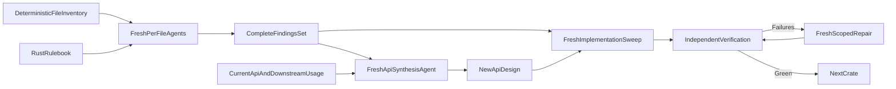
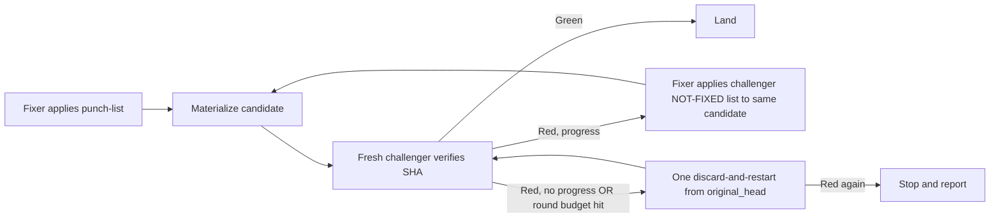

# Top-to-bottom repo review continued

*2026-08-11 15:10 - transcript 3b83292c-15b7-4af1-8c1f-7cc6e76f5a6f*

## Prompts

we are going to do a top to bottom review of this entire repository @promptforge .
the review will proceed crate by crate. the next crate will start only when the current crate is completely done.
for each crate,. every single rust source file will be inspected in a fresh subagent. first the subagent will extract the public API and put it in a new file {{source}}.findings.md. then the subagent will analyze the source accoding to @tools-public/rulebooks/rust-rulebook.md looking for problems. the subagent will also look for opportuntiies to do general code hygiene improvements. I dont have to tell you what those are I hope, you are a frontier model. when all the files are done (none of the files are modified yet) then a fresh subagent will ingest ALL the .findings.md files together. it will look at the public APIs and look for opportunties to reduce the API surface, move responsibilties to where they belong if they should be moved, do more with less. the subagent will consider the other findings when thinking about the new API: given the findings, what API modification would both reduce the chance of the finding occurring again and also make the API surface cleaner and more robust. The new API will be written to a fresh file. Then a fresh subagent will sweep through all the source code and apply the new API changes, fix all the findings. It will have the new api and all findings files *.finding.md injected.

Do you understand?

use @tools-public/rulebooks/rust-rulebook.md @tools-public/rulebooks/vibe-rulebook.md @tools-public/rulebooks/prompts-rulebook.md

review the plan

A. review the toml.
B. fix that.
C. the frontier model has 1M context...
D. I thought I was clear: ONE review, and ONE round of fixes.

Clean up the smaller issues as well, and fix the design documents in a subagent: write the new design into one new document, put the residue into another document, delete the old 3 docs.

is gpt-5.6 sol medium ok for this plan?

run

The beginning of the above subagent result is already visible to the user. Perform any follow-up actions (if needed). DO NOT regurgitate or reiterate its result unless asked. If multiple subagents have now completed and none are still running, briefly summarize the findings and conclusions across all of them. Otherwise, if no follow-ups remain, end your response with a brief third-person confirmation that the subagent has completed. If you mention an agent or subagent in your response, link it with the `[label](id)` format using the agent_id or task_id from the notification instead of printing the raw ID. Don't repeat the same confirmation every time.

The beginning of the above subagent result is already visible to the user. Perform any follow-up actions (if needed). DO NOT regurgitate or reiterate its result unless asked. If multiple subagents have now completed and none are still running, briefly summarize the findings and conclusions across all of them. Otherwise, if no follow-ups remain, end your response with a brief third-person confirmation that the subagent has completed. If you mention an agent or subagent in your response, link it with the `[label](id)` format using the agent_id or task_id from the notification instead of printing the raw ID. Don't repeat the same confirmation every time.

The beginning of the above subagent result is already visible to the user. Perform any follow-up actions (if needed). DO NOT regurgitate or reiterate its result unless asked. If multiple subagents have now completed and none are still running, briefly summarize the findings and conclusions across all of them. Otherwise, if no follow-ups remain, end your response with a brief third-person confirmation that the subagent has completed. If you mention an agent or subagent in your response, link it with the `[label](id)` format using the agent_id or task_id from the notification instead of printing the raw ID. Don't repeat the same confirmation every time.

The beginning of the above subagent result is already visible to the user. Perform any follow-up actions (if needed). DO NOT regurgitate or reiterate its result unless asked. If multiple subagents have now completed and none are still running, briefly summarize the findings and conclusions across all of them. Otherwise, if no follow-ups remain, end your response with a brief third-person confirmation that the subagent has completed. If you mention an agent or subagent in your response, link it with the `[label](id)` format using the agent_id or task_id from the notification instead of printing the raw ID. Don't repeat the same confirmation every time.

The beginning of the above subagent result is already visible to the user. Perform any follow-up actions (if needed). DO NOT regurgitate or reiterate its result unless asked. If multiple subagents have now completed and none are still running, briefly summarize the findings and conclusions across all of them. Otherwise, if no follow-ups remain, end your response with a brief third-person confirmation that the subagent has completed. If you mention an agent or subagent in your response, link it with the `[label](id)` format using the agent_id or task_id from the notification instead of printing the raw ID. Don't repeat the same confirmation every time.

The beginning of the above subagent result is already visible to the user. Perform any follow-up actions (if needed). DO NOT regurgitate or reiterate its result unless asked. If multiple subagents have now completed and none are still running, briefly summarize the findings and conclusions across all of them. Otherwise, if no follow-ups remain, end your response with a brief third-person confirmation that the subagent has completed. If you mention an agent or subagent in your response, link it with the `[label](id)` format using the agent_id or task_id from the notification instead of printing the raw ID. Don't repeat the same confirmation every time.

The beginning of the above subagent result is already visible to the user. Perform any follow-up actions (if needed). DO NOT regurgitate or reiterate its result unless asked. If multiple subagents have now completed and none are still running, briefly summarize the findings and conclusions across all of them. Otherwise, if no follow-ups remain, end your response with a brief third-person confirmation that the subagent has completed. If you mention an agent or subagent in your response, link it with the `[label](id)` format using the agent_id or task_id from the notification instead of printing the raw ID. Don't repeat the same confirmation every time.

The beginning of the above subagent result is already visible to the user. Perform any follow-up actions (if needed). DO NOT regurgitate or reiterate its result unless asked. If multiple subagents have now completed and none are still running, briefly summarize the findings and conclusions across all of them. Otherwise, if no follow-ups remain, end your response with a brief third-person confirmation that the subagent has completed. If you mention an agent or subagent in your response, link it with the `[label](id)` format using the agent_id or task_id from the notification instead of printing the raw ID. Don't repeat the same confirmation every time.

The beginning of the above subagent result is already visible to the user. Perform any follow-up actions (if needed). DO NOT regurgitate or reiterate its result unless asked. If multiple subagents have now completed and none are still running, briefly summarize the findings and conclusions across all of them. Otherwise, if no follow-ups remain, end your response with a brief third-person confirmation that the subagent has completed. If you mention an agent or subagent in your response, link it with the `[label](id)` format using the agent_id or task_id from the notification instead of printing the raw ID. Don't repeat the same confirmation every time.

The beginning of the above subagent result is already visible to the user. Perform any follow-up actions (if needed). DO NOT regurgitate or reiterate its result unless asked. If multiple subagents have now completed and none are still running, briefly summarize the findings and conclusions across all of them. Otherwise, if no follow-ups remain, end your response with a brief third-person confirmation that the subagent has completed. If you mention an agent or subagent in your response, link it with the `[label](id)` format using the agent_id or task_id from the notification instead of printing the raw ID. Don't repeat the same confirmation every time.

The beginning of the above subagent result is already visible to the user. Perform any follow-up actions (if needed). DO NOT regurgitate or reiterate its result unless asked. If multiple subagents have now completed and none are still running, briefly summarize the findings and conclusions across all of them. Otherwise, if no follow-ups remain, end your response with a brief third-person confirmation that the subagent has completed. If you mention an agent or subagent in your response, link it with the `[label](id)` format using the agent_id or task_id from the notification instead of printing the raw ID. Don't repeat the same confirmation every time.

The beginning of the above subagent result is already visible to the user. Perform any follow-up actions (if needed). DO NOT regurgitate or reiterate its result unless asked. If multiple subagents have now completed and none are still running, briefly summarize the findings and conclusions across all of them. Otherwise, if no follow-ups remain, end your response with a brief third-person confirmation that the subagent has completed. If you mention an agent or subagent in your response, link it with the `[label](id)` format using the agent_id or task_id from the notification instead of printing the raw ID. Don't repeat the same confirmation every time.

The beginning of the above subagent result is already visible to the user. Perform any follow-up actions (if needed). DO NOT regurgitate or reiterate its result unless asked. If multiple subagents have now completed and none are still running, briefly summarize the findings and conclusions across all of them. Otherwise, if no follow-ups remain, end your response with a brief third-person confirmation that the subagent has completed. If you mention an agent or subagent in your response, link it with the `[label](id)` format using the agent_id or task_id from the notification instead of printing the raw ID. Don't repeat the same confirmation every time.

The beginning of the above subagent result is already visible to the user. Perform any follow-up actions (if needed). DO NOT regurgitate or reiterate its result unless asked. If multiple subagents have now completed and none are still running, briefly summarize the findings and conclusions across all of them. Otherwise, if no follow-ups remain, end your response with a brief third-person confirmation that the subagent has completed. If you mention an agent or subagent in your response, link it with the `[label](id)` format using the agent_id or task_id from the notification instead of printing the raw ID. Don't repeat the same confirmation every time.

The beginning of the above subagent result is already visible to the user. Perform any follow-up actions (if needed). DO NOT regurgitate or reiterate its result unless asked. If multiple subagents have now completed and none are still running, briefly summarize the findings and conclusions across all of them. Otherwise, if no follow-ups remain, end your response with a brief third-person confirmation that the subagent has completed. If you mention an agent or subagent in your response, link it with the `[label](id)` format using the agent_id or task_id from the notification instead of printing the raw ID. Don't repeat the same confirmation every time.

The beginning of the above subagent result is already visible to the user. Perform any follow-up actions (if needed). DO NOT regurgitate or reiterate its result unless asked. If multiple subagents have now completed and none are still running, briefly summarize the findings and conclusions across all of them. Otherwise, if no follow-ups remain, end your response with a brief third-person confirmation that the subagent has completed. If you mention an agent or subagent in your response, link it with the `[label](id)` format using the agent_id or task_id from the notification instead of printing the raw ID. Don't repeat the same confirmation every time.

The beginning of the above subagent result is already visible to the user. Perform any follow-up actions (if needed). DO NOT regurgitate or reiterate its result unless asked. If multiple subagents have now completed and none are still running, briefly summarize the findings and conclusions across all of them. Otherwise, if no follow-ups remain, end your response with a brief third-person confirmation that the subagent has completed. If you mention an agent or subagent in your response, link it with the `[label](id)` format using the agent_id or task_id from the notification instead of printing the raw ID. Don't repeat the same confirmation every time.

The beginning of the above subagent result is already visible to the user. Perform any follow-up actions (if needed). DO NOT regurgitate or reiterate its result unless asked. If multiple subagents have now completed and none are still running, briefly summarize the findings and conclusions across all of them. Otherwise, if no follow-ups remain, end your response with a brief third-person confirmation that the subagent has completed. If you mention an agent or subagent in your response, link it with the `[label](id)` format using the agent_id or task_id from the notification instead of printing the raw ID. Don't repeat the same confirmation every time.

The beginning of the above subagent result is already visible to the user. Perform any follow-up actions (if needed). DO NOT regurgitate or reiterate its result unless asked. If multiple subagents have now completed and none are still running, briefly summarize the findings and conclusions across all of them. Otherwise, if no follow-ups remain, end your response with a brief third-person confirmation that the subagent has completed. If you mention an agent or subagent in your response, link it with the `[label](id)` format using the agent_id or task_id from the notification instead of printing the raw ID. Don't repeat the same confirmation every time.

we only changed one api?

oh so the apis are being rethought one at a time

The beginning of the above subagent result is already visible to the user. Perform any follow-up actions (if needed). DO NOT regurgitate or reiterate its result unless asked. If multiple subagents have now completed and none are still running, briefly summarize the findings and conclusions across all of them. Otherwise, if no follow-ups remain, end your response with a brief third-person confirmation that the subagent has completed. If you mention an agent or subagent in your response, link it with the `[label](id)` format using the agent_id or task_id from the notification instead of printing the raw ID. Don't repeat the same confirmation every time.

The beginning of the above subagent result is already visible to the user. Perform any follow-up actions (if needed). DO NOT regurgitate or reiterate its result unless asked. If multiple subagents have now completed and none are still running, briefly summarize the findings and conclusions across all of them. Otherwise, if no follow-ups remain, end your response with a brief third-person confirmation that the subagent has completed. If you mention an agent or subagent in your response, link it with the `[label](id)` format using the agent_id or task_id from the notification instead of printing the raw ID. Don't repeat the same confirmation every time.

The beginning of the above subagent result is already visible to the user. Perform any follow-up actions (if needed). DO NOT regurgitate or reiterate its result unless asked. If multiple subagents have now completed and none are still running, briefly summarize the findings and conclusions across all of them. Otherwise, if no follow-ups remain, end your response with a brief third-person confirmation that the subagent has completed. If you mention an agent or subagent in your response, link it with the `[label](id)` format using the agent_id or task_id from the notification instead of printing the raw ID. Don't repeat the same confirmation every time.

The beginning of the above subagent result is already visible to the user. Perform any follow-up actions (if needed). DO NOT regurgitate or reiterate its result unless asked. If multiple subagents have now completed and none are still running, briefly summarize the findings and conclusions across all of them. Otherwise, if no follow-ups remain, end your response with a brief third-person confirmation that the subagent has completed. If you mention an agent or subagent in your response, link it with the `[label](id)` format using the agent_id or task_id from the notification instead of printing the raw ID. Don't repeat the same confirmation every time.

The beginning of the above subagent result is already visible to the user. Perform any follow-up actions (if needed). DO NOT regurgitate or reiterate its result unless asked. If multiple subagents have now completed and none are still running, briefly summarize the findings and conclusions across all of them. Otherwise, if no follow-ups remain, end your response with a brief third-person confirmation that the subagent has completed. If you mention an agent or subagent in your response, link it with the `[label](id)` format using the agent_id or task_id from the notification instead of printing the raw ID. Don't repeat the same confirmation every time.

The beginning of the above subagent result is already visible to the user. Perform any follow-up actions (if needed). DO NOT regurgitate or reiterate its result unless asked. If multiple subagents have now completed and none are still running, briefly summarize the findings and conclusions across all of them. Otherwise, if no follow-ups remain, end your response with a brief third-person confirmation that the subagent has completed. If you mention an agent or subagent in your response, link it with the `[label](id)` format using the agent_id or task_id from the notification instead of printing the raw ID. Don't repeat the same confirmation every time.

The beginning of the above subagent result is already visible to the user. Perform any follow-up actions (if needed). DO NOT regurgitate or reiterate its result unless asked. If multiple subagents have now completed and none are still running, briefly summarize the findings and conclusions across all of them. Otherwise, if no follow-ups remain, end your response with a brief third-person confirmation that the subagent has completed. If you mention an agent or subagent in your response, link it with the `[label](id)` format using the agent_id or task_id from the notification instead of printing the raw ID. Don't repeat the same confirmation every time.

The beginning of the above subagent result is already visible to the user. Perform any follow-up actions (if needed). DO NOT regurgitate or reiterate its result unless asked. If multiple subagents have now completed and none are still running, briefly summarize the findings and conclusions across all of them. Otherwise, if no follow-ups remain, end your response with a brief third-person confirmation that the subagent has completed. If you mention an agent or subagent in your response, link it with the `[label](id)` format using the agent_id or task_id from the notification instead of printing the raw ID. Don't repeat the same confirmation every time.

The beginning of the above subagent result is already visible to the user. Perform any follow-up actions (if needed). DO NOT regurgitate or reiterate its result unless asked. If multiple subagents have now completed and none are still running, briefly summarize the findings and conclusions across all of them. Otherwise, if no follow-ups remain, end your response with a brief third-person confirmation that the subagent has completed. If you mention an agent or subagent in your response, link it with the `[label](id)` format using the agent_id or task_id from the notification instead of printing the raw ID. Don't repeat the same confirmation every time.

The beginning of the above subagent result is already visible to the user. Perform any follow-up actions (if needed). DO NOT regurgitate or reiterate its result unless asked. If multiple subagents have now completed and none are still running, briefly summarize the findings and conclusions across all of them. Otherwise, if no follow-ups remain, end your response with a brief third-person confirmation that the subagent has completed. If you mention an agent or subagent in your response, link it with the `[label](id)` format using the agent_id or task_id from the notification instead of printing the raw ID. Don't repeat the same confirmation every time.

The beginning of the above subagent result is already visible to the user. Perform any follow-up actions (if needed). DO NOT regurgitate or reiterate its result unless asked. If multiple subagents have now completed and none are still running, briefly summarize the findings and conclusions across all of them. Otherwise, if no follow-ups remain, end your response with a brief third-person confirmation that the subagent has completed. If you mention an agent or subagent in your response, link it with the `[label](id)` format using the agent_id or task_id from the notification instead of printing the raw ID. Don't repeat the same confirmation every time.

The beginning of the above subagent result is already visible to the user. Perform any follow-up actions (if needed). DO NOT regurgitate or reiterate its result unless asked. If multiple subagents have now completed and none are still running, briefly summarize the findings and conclusions across all of them. Otherwise, if no follow-ups remain, end your response with a brief third-person confirmation that the subagent has completed. If you mention an agent or subagent in your response, link it with the `[label](id)` format using the agent_id or task_id from the notification instead of printing the raw ID. Don't repeat the same confirmation every time.

The beginning of the above subagent result is already visible to the user. Perform any follow-up actions (if needed). DO NOT regurgitate or reiterate its result unless asked. If multiple subagents have now completed and none are still running, briefly summarize the findings and conclusions across all of them. Otherwise, if no follow-ups remain, end your response with a brief third-person confirmation that the subagent has completed. If you mention an agent or subagent in your response, link it with the `[label](id)` format using the agent_id or task_id from the notification instead of printing the raw ID. Don't repeat the same confirmation every time.

The beginning of the above subagent result is already visible to the user. Perform any follow-up actions (if needed). DO NOT regurgitate or reiterate its result unless asked. If multiple subagents have now completed and none are still running, briefly summarize the findings and conclusions across all of them. Otherwise, if no follow-ups remain, end your response with a brief third-person confirmation that the subagent has completed. If you mention an agent or subagent in your response, link it with the `[label](id)` format using the agent_id or task_id from the notification instead of printing the raw ID. Don't repeat the same confirmation every time.

The beginning of the above subagent result is already visible to the user. Perform any follow-up actions (if needed). DO NOT regurgitate or reiterate its result unless asked. If multiple subagents have now completed and none are still running, briefly summarize the findings and conclusions across all of them. Otherwise, if no follow-ups remain, end your response with a brief third-person confirmation that the subagent has completed. If you mention an agent or subagent in your response, link it with the `[label](id)` format using the agent_id or task_id from the notification instead of printing the raw ID. Don't repeat the same confirmation every time.

The beginning of the above subagent result is already visible to the user. Perform any follow-up actions (if needed). DO NOT regurgitate or reiterate its result unless asked. If multiple subagents have now completed and none are still running, briefly summarize the findings and conclusions across all of them. Otherwise, if no follow-ups remain, end your response with a brief third-person confirmation that the subagent has completed. If you mention an agent or subagent in your response, link it with the `[label](id)` format using the agent_id or task_id from the notification instead of printing the raw ID. Don't repeat the same confirmation every time.

The beginning of the above subagent result is already visible to the user. Perform any follow-up actions (if needed). DO NOT regurgitate or reiterate its result unless asked. If multiple subagents have now completed and none are still running, briefly summarize the findings and conclusions across all of them. Otherwise, if no follow-ups remain, end your response with a brief third-person confirmation that the subagent has completed. If you mention an agent or subagent in your response, link it with the `[label](id)` format using the agent_id or task_id from the notification instead of printing the raw ID. Don't repeat the same confirmation every time.

The beginning of the above subagent result is already visible to the user. Perform any follow-up actions (if needed). DO NOT regurgitate or reiterate its result unless asked. If multiple subagents have now completed and none are still running, briefly summarize the findings and conclusions across all of them. Otherwise, if no follow-ups remain, end your response with a brief third-person confirmation that the subagent has completed. If you mention an agent or subagent in your response, link it with the `[label](id)` format using the agent_id or task_id from the notification instead of printing the raw ID. Don't repeat the same confirmation every time.

The beginning of the above subagent result is already visible to the user. Perform any follow-up actions (if needed). DO NOT regurgitate or reiterate its result unless asked. If multiple subagents have now completed and none are still running, briefly summarize the findings and conclusions across all of them. Otherwise, if no follow-ups remain, end your response with a brief third-person confirmation that the subagent has completed. If you mention an agent or subagent in your response, link it with the `[label](id)` format using the agent_id or task_id from the notification instead of printing the raw ID. Don't repeat the same confirmation every time.

The beginning of the above subagent result is already visible to the user. Perform any follow-up actions (if needed). DO NOT regurgitate or reiterate its result unless asked. If multiple subagents have now completed and none are still running, briefly summarize the findings and conclusions across all of them. Otherwise, if no follow-ups remain, end your response with a brief third-person confirmation that the subagent has completed. If you mention an agent or subagent in your response, link it with the `[label](id)` format using the agent_id or task_id from the notification instead of printing the raw ID. Don't repeat the same confirmation every time.

The beginning of the above subagent result is already visible to the user. Perform any follow-up actions (if needed). DO NOT regurgitate or reiterate its result unless asked. If multiple subagents have now completed and none are still running, briefly summarize the findings and conclusions across all of them. Otherwise, if no follow-ups remain, end your response with a brief third-person confirmation that the subagent has completed. If you mention an agent or subagent in your response, link it with the `[label](id)` format using the agent_id or task_id from the notification instead of printing the raw ID. Don't repeat the same confirmation every time.

The beginning of the above subagent result is already visible to the user. Perform any follow-up actions (if needed). DO NOT regurgitate or reiterate its result unless asked. If multiple subagents have now completed and none are still running, briefly summarize the findings and conclusions across all of them. Otherwise, if no follow-ups remain, end your response with a brief third-person confirmation that the subagent has completed. If you mention an agent or subagent in your response, link it with the `[label](id)` format using the agent_id or task_id from the notification instead of printing the raw ID. Don't repeat the same confirmation every time.

The beginning of the above subagent result is already visible to the user. Perform any follow-up actions (if needed). DO NOT regurgitate or reiterate its result unless asked. If multiple subagents have now completed and none are still running, briefly summarize the findings and conclusions across all of them. Otherwise, if no follow-ups remain, end your response with a brief third-person confirmation that the subagent has completed. If you mention an agent or subagent in your response, link it with the `[label](id)` format using the agent_id or task_id from the notification instead of printing the raw ID. Don't repeat the same confirmation every time.

The beginning of the above subagent result is already visible to the user. Perform any follow-up actions (if needed). DO NOT regurgitate or reiterate its result unless asked. If multiple subagents have now completed and none are still running, briefly summarize the findings and conclusions across all of them. Otherwise, if no follow-ups remain, end your response with a brief third-person confirmation that the subagent has completed. If you mention an agent or subagent in your response, link it with the `[label](id)` format using the agent_id or task_id from the notification instead of printing the raw ID. Don't repeat the same confirmation every time.

The beginning of the above subagent result is already visible to the user. Perform any follow-up actions (if needed). DO NOT regurgitate or reiterate its result unless asked. If multiple subagents have now completed and none are still running, briefly summarize the findings and conclusions across all of them. Otherwise, if no follow-ups remain, end your response with a brief third-person confirmation that the subagent has completed. If you mention an agent or subagent in your response, link it with the `[label](id)` format using the agent_id or task_id from the notification instead of printing the raw ID. Don't repeat the same confirmation every time.

The beginning of the above subagent result is already visible to the user. Perform any follow-up actions (if needed). DO NOT regurgitate or reiterate its result unless asked. If multiple subagents have now completed and none are still running, briefly summarize the findings and conclusions across all of them. Otherwise, if no follow-ups remain, end your response with a brief third-person confirmation that the subagent has completed. If you mention an agent or subagent in your response, link it with the `[label](id)` format using the agent_id or task_id from the notification instead of printing the raw ID. Don't repeat the same confirmation every time.

The beginning of the above subagent result is already visible to the user. Perform any follow-up actions (if needed). DO NOT regurgitate or reiterate its result unless asked. If multiple subagents have now completed and none are still running, briefly summarize the findings and conclusions across all of them. Otherwise, if no follow-ups remain, end your response with a brief third-person confirmation that the subagent has completed. If you mention an agent or subagent in your response, link it with the `[label](id)` format using the agent_id or task_id from the notification instead of printing the raw ID. Don't repeat the same confirmation every time.

The beginning of the above subagent result is already visible to the user. Perform any follow-up actions (if needed). DO NOT regurgitate or reiterate its result unless asked. If multiple subagents have now completed and none are still running, briefly summarize the findings and conclusions across all of them. Otherwise, if no follow-ups remain, end your response with a brief third-person confirmation that the subagent has completed. If you mention an agent or subagent in your response, link it with the `[label](id)` format using the agent_id or task_id from the notification instead of printing the raw ID. Don't repeat the same confirmation every time.

The beginning of the above subagent result is already visible to the user. Perform any follow-up actions (if needed). DO NOT regurgitate or reiterate its result unless asked. If multiple subagents have now completed and none are still running, briefly summarize the findings and conclusions across all of them. Otherwise, if no follow-ups remain, end your response with a brief third-person confirmation that the subagent has completed. If you mention an agent or subagent in your response, link it with the `[label](id)` format using the agent_id or task_id from the notification instead of printing the raw ID. Don't repeat the same confirmation every time.

I don't understand what happened, what, what's wrong? I don't understand what's wrong. How did this go wrong? What do you mean? What, what are you talking about though? The implemented, the implemented facade diverges from the approved API, how? You gotta tell me how! What the fuck?

Let me ask you a question. The top commit. What's the status of the top commit? Is it in better shape than it was before you started, or is it in a fucking all fucked up?

Question: can we just reset to the previous commit and restart from there? How much work would we lose?

what do we do with these modified files that are not in any commit

okay but I want the clean restart to be on master can you do that? explain it

I dont want a revert I want the reset. force pushing is fine, no one is using this repo. other than that, this plan sounds fine.

wtf is force-with-lease?

lol no one is fucking using this I'm the only one with access. anyway, I approve this plan but before we start, should I switch models? Opus 4.6 on High? Opus 4.8 on High? How much thinking? Talk to me

update the plan @c:\Users\Vinnie\.cursor\plans\promptforge_crate_review_a3b9f964.plan.md to reflect all of this, so we can keep you honest. I switched to Opus 4.8 High. I want the reset, and the rest of your plan. I have already force-pushed HEAD~3 to the remote repo so when you push, you can do it without --force and you should have no problem.

I want to preserve whatever is good, so dont fucking ask me how much to roll back. YOU are the one who knows that! Keep whatever is good, reset --hard the test! for fucks sake. I purposefully rolled the remote back more than necessary to give you some headroom

run the plan and DO NOT STOP for my confirmation, fix this shit! I do not want to come back in 3 hours to find you shit the bed again. I want to find a nice CLEAN project. if you fuck up again, roll the commit back (do NOT revert) and then redo it. I want to come back to a beautiful perfect result!

The beginning of the above subagent result is already visible to the user. Perform any follow-up actions (if needed). DO NOT regurgitate or reiterate its result unless asked. If multiple subagents have now completed and none are still running, briefly summarize the findings and conclusions across all of them. Otherwise, if no follow-ups remain, end your response with a brief third-person confirmation that the subagent has completed. If you mention an agent or subagent in your response, link it with the `[label](id)` format using the agent_id or task_id from the notification instead of printing the raw ID. Don't repeat the same confirmation every time.

The beginning of the above subagent result is already visible to the user. Perform any follow-up actions (if needed). DO NOT regurgitate or reiterate its result unless asked. If multiple subagents have now completed and none are still running, briefly summarize the findings and conclusions across all of them. Otherwise, if no follow-ups remain, end your response with a brief third-person confirmation that the subagent has completed. If you mention an agent or subagent in your response, link it with the `[label](id)` format using the agent_id or task_id from the notification instead of printing the raw ID. Don't repeat the same confirmation every time.

The beginning of the above subagent result is already visible to the user. Perform any follow-up actions (if needed). DO NOT regurgitate or reiterate its result unless asked. If multiple subagents have now completed and none are still running, briefly summarize the findings and conclusions across all of them. Otherwise, if no follow-ups remain, end your response with a brief third-person confirmation that the subagent has completed. If you mention an agent or subagent in your response, link it with the `[label](id)` format using the agent_id or task_id from the notification instead of printing the raw ID. Don't repeat the same confirmation every time.

The beginning of the above subagent result is already visible to the user. Perform any follow-up actions (if needed). DO NOT regurgitate or reiterate its result unless asked. If multiple subagents have now completed and none are still running, briefly summarize the findings and conclusions across all of them. Otherwise, if no follow-ups remain, end your response with a brief third-person confirmation that the subagent has completed. If you mention an agent or subagent in your response, link it with the `[label](id)` format using the agent_id or task_id from the notification instead of printing the raw ID. Don't repeat the same confirmation every time.

The beginning of the above subagent result is already visible to the user. Perform any follow-up actions (if needed). DO NOT regurgitate or reiterate its result unless asked. If multiple subagents have now completed and none are still running, briefly summarize the findings and conclusions across all of them. Otherwise, if no follow-ups remain, end your response with a brief third-person confirmation that the subagent has completed. If you mention an agent or subagent in your response, link it with the `[label](id)` format using the agent_id or task_id from the notification instead of printing the raw ID. Don't repeat the same confirmation every time.

The beginning of the above subagent result is already visible to the user. Perform any follow-up actions (if needed). DO NOT regurgitate or reiterate its result unless asked. If multiple subagents have now completed and none are still running, briefly summarize the findings and conclusions across all of them. Otherwise, if no follow-ups remain, end your response with a brief third-person confirmation that the subagent has completed. If you mention an agent or subagent in your response, link it with the `[label](id)` format using the agent_id or task_id from the notification instead of printing the raw ID. Don't repeat the same confirmation every time.

The beginning of the above subagent result is already visible to the user. Perform any follow-up actions (if needed). DO NOT regurgitate or reiterate its result unless asked. If multiple subagents have now completed and none are still running, briefly summarize the findings and conclusions across all of them. Otherwise, if no follow-ups remain, end your response with a brief third-person confirmation that the subagent has completed. If you mention an agent or subagent in your response, link it with the `[label](id)` format using the agent_id or task_id from the notification instead of printing the raw ID. Don't repeat the same confirmation every time.

The beginning of the above subagent result is already visible to the user. Perform any follow-up actions (if needed). DO NOT regurgitate or reiterate its result unless asked. If multiple subagents have now completed and none are still running, briefly summarize the findings and conclusions across all of them. Otherwise, if no follow-ups remain, end your response with a brief third-person confirmation that the subagent has completed. If you mention an agent or subagent in your response, link it with the `[label](id)` format using the agent_id or task_id from the notification instead of printing the raw ID. Don't repeat the same confirmation every time.

The beginning of the above subagent result is already visible to the user. Perform any follow-up actions (if needed). DO NOT regurgitate or reiterate its result unless asked. If multiple subagents have now completed and none are still running, briefly summarize the findings and conclusions across all of them. Otherwise, if no follow-ups remain, end your response with a brief third-person confirmation that the subagent has completed. If you mention an agent or subagent in your response, link it with the `[label](id)` format using the agent_id or task_id from the notification instead of printing the raw ID. Don't repeat the same confirmation every time.

The beginning of the above subagent result is already visible to the user. Perform any follow-up actions (if needed). DO NOT regurgitate or reiterate its result unless asked. If multiple subagents have now completed and none are still running, briefly summarize the findings and conclusions across all of them. Otherwise, if no follow-ups remain, end your response with a brief third-person confirmation that the subagent has completed. If you mention an agent or subagent in your response, link it with the `[label](id)` format using the agent_id or task_id from the notification instead of printing the raw ID. Don't repeat the same confirmation every time.

The beginning of the above subagent result is already visible to the user. Perform any follow-up actions (if needed). DO NOT regurgitate or reiterate its result unless asked. If multiple subagents have now completed and none are still running, briefly summarize the findings and conclusions across all of them. Otherwise, if no follow-ups remain, end your response with a brief third-person confirmation that the subagent has completed. If you mention an agent or subagent in your response, link it with the `[label](id)` format using the agent_id or task_id from the notification instead of printing the raw ID. Don't repeat the same confirmation every time.

The beginning of the above subagent result is already visible to the user. Perform any follow-up actions (if needed). DO NOT regurgitate or reiterate its result unless asked. If multiple subagents have now completed and none are still running, briefly summarize the findings and conclusions across all of them. Otherwise, if no follow-ups remain, end your response with a brief third-person confirmation that the subagent has completed. If you mention an agent or subagent in your response, link it with the `[label](id)` format using the agent_id or task_id from the notification instead of printing the raw ID. Don't repeat the same confirmation every time.

The beginning of the above subagent result is already visible to the user. Perform any follow-up actions (if needed). DO NOT regurgitate or reiterate its result unless asked. If multiple subagents have now completed and none are still running, briefly summarize the findings and conclusions across all of them. Otherwise, if no follow-ups remain, end your response with a brief third-person confirmation that the subagent has completed. If you mention an agent or subagent in your response, link it with the `[label](id)` format using the agent_id or task_id from the notification instead of printing the raw ID. Don't repeat the same confirmation every time.

The beginning of the above subagent result is already visible to the user. Perform any follow-up actions (if needed). DO NOT regurgitate or reiterate its result unless asked. If multiple subagents have now completed and none are still running, briefly summarize the findings and conclusions across all of them. Otherwise, if no follow-ups remain, end your response with a brief third-person confirmation that the subagent has completed. If you mention an agent or subagent in your response, link it with the `[label](id)` format using the agent_id or task_id from the notification instead of printing the raw ID. Don't repeat the same confirmation every time.

The beginning of the above subagent result is already visible to the user. Perform any follow-up actions (if needed). DO NOT regurgitate or reiterate its result unless asked. If multiple subagents have now completed and none are still running, briefly summarize the findings and conclusions across all of them. Otherwise, if no follow-ups remain, end your response with a brief third-person confirmation that the subagent has completed. If you mention an agent or subagent in your response, link it with the `[label](id)` format using the agent_id or task_id from the notification instead of printing the raw ID. Don't repeat the same confirmation every time.

The beginning of the above subagent result is already visible to the user. Perform any follow-up actions (if needed). DO NOT regurgitate or reiterate its result unless asked. If multiple subagents have now completed and none are still running, briefly summarize the findings and conclusions across all of them. Otherwise, if no follow-ups remain, end your response with a brief third-person confirmation that the subagent has completed. If you mention an agent or subagent in your response, link it with the `[label](id)` format using the agent_id or task_id from the notification instead of printing the raw ID. Don't repeat the same confirmation every time.

The beginning of the above subagent result is already visible to the user. Perform any follow-up actions (if needed). DO NOT regurgitate or reiterate its result unless asked. If multiple subagents have now completed and none are still running, briefly summarize the findings and conclusions across all of them. Otherwise, if no follow-ups remain, end your response with a brief third-person confirmation that the subagent has completed. If you mention an agent or subagent in your response, link it with the `[label](id)` format using the agent_id or task_id from the notification instead of printing the raw ID. Don't repeat the same confirmation every time.

The beginning of the above subagent result is already visible to the user. Perform any follow-up actions (if needed). DO NOT regurgitate or reiterate its result unless asked. If multiple subagents have now completed and none are still running, briefly summarize the findings and conclusions across all of them. Otherwise, if no follow-ups remain, end your response with a brief third-person confirmation that the subagent has completed. If you mention an agent or subagent in your response, link it with the `[label](id)` format using the agent_id or task_id from the notification instead of printing the raw ID. Don't repeat the same confirmation every time.

The beginning of the above subagent result is already visible to the user. Perform any follow-up actions (if needed). DO NOT regurgitate or reiterate its result unless asked. If multiple subagents have now completed and none are still running, briefly summarize the findings and conclusions across all of them. Otherwise, if no follow-ups remain, end your response with a brief third-person confirmation that the subagent has completed. If you mention an agent or subagent in your response, link it with the `[label](id)` format using the agent_id or task_id from the notification instead of printing the raw ID. Don't repeat the same confirmation every time.

The beginning of the above subagent result is already visible to the user. Perform any follow-up actions (if needed). DO NOT regurgitate or reiterate its result unless asked. If multiple subagents have now completed and none are still running, briefly summarize the findings and conclusions across all of them. Otherwise, if no follow-ups remain, end your response with a brief third-person confirmation that the subagent has completed. If you mention an agent or subagent in your response, link it with the `[label](id)` format using the agent_id or task_id from the notification instead of printing the raw ID. Don't repeat the same confirmation every time.

The beginning of the above subagent result is already visible to the user. Perform any follow-up actions (if needed). DO NOT regurgitate or reiterate its result unless asked. If multiple subagents have now completed and none are still running, briefly summarize the findings and conclusions across all of them. Otherwise, if no follow-ups remain, end your response with a brief third-person confirmation that the subagent has completed. If you mention an agent or subagent in your response, link it with the `[label](id)` format using the agent_id or task_id from the notification instead of printing the raw ID. Don't repeat the same confirmation every time.

The beginning of the above subagent result is already visible to the user. Perform any follow-up actions (if needed). DO NOT regurgitate or reiterate its result unless asked. If multiple subagents have now completed and none are still running, briefly summarize the findings and conclusions across all of them. Otherwise, if no follow-ups remain, end your response with a brief third-person confirmation that the subagent has completed. If you mention an agent or subagent in your response, link it with the `[label](id)` format using the agent_id or task_id from the notification instead of printing the raw ID. Don't repeat the same confirmation every time.

The beginning of the above subagent result is already visible to the user. Perform any follow-up actions (if needed). DO NOT regurgitate or reiterate its result unless asked. If multiple subagents have now completed and none are still running, briefly summarize the findings and conclusions across all of them. Otherwise, if no follow-ups remain, end your response with a brief third-person confirmation that the subagent has completed. If you mention an agent or subagent in your response, link it with the `[label](id)` format using the agent_id or task_id from the notification instead of printing the raw ID. Don't repeat the same confirmation every time.

The beginning of the above subagent result is already visible to the user. Perform any follow-up actions (if needed). DO NOT regurgitate or reiterate its result unless asked. If multiple subagents have now completed and none are still running, briefly summarize the findings and conclusions across all of them. Otherwise, if no follow-ups remain, end your response with a brief third-person confirmation that the subagent has completed. If you mention an agent or subagent in your response, link it with the `[label](id)` format using the agent_id or task_id from the notification instead of printing the raw ID. Don't repeat the same confirmation every time.

The beginning of the above subagent result is already visible to the user. Perform any follow-up actions (if needed). DO NOT regurgitate or reiterate its result unless asked. If multiple subagents have now completed and none are still running, briefly summarize the findings and conclusions across all of them. Otherwise, if no follow-ups remain, end your response with a brief third-person confirmation that the subagent has completed. If you mention an agent or subagent in your response, link it with the `[label](id)` format using the agent_id or task_id from the notification instead of printing the raw ID. Don't repeat the same confirmation every time.

The beginning of the above subagent result is already visible to the user. Perform any follow-up actions (if needed). DO NOT regurgitate or reiterate its result unless asked. If multiple subagents have now completed and none are still running, briefly summarize the findings and conclusions across all of them. Otherwise, if no follow-ups remain, end your response with a brief third-person confirmation that the subagent has completed. If you mention an agent or subagent in your response, link it with the `[label](id)` format using the agent_id or task_id from the notification instead of printing the raw ID. Don't repeat the same confirmation every time.

The beginning of the above subagent result is already visible to the user. Perform any follow-up actions (if needed). DO NOT regurgitate or reiterate its result unless asked. If multiple subagents have now completed and none are still running, briefly summarize the findings and conclusions across all of them. Otherwise, if no follow-ups remain, end your response with a brief third-person confirmation that the subagent has completed. If you mention an agent or subagent in your response, link it with the `[label](id)` format using the agent_id or task_id from the notification instead of printing the raw ID. Don't repeat the same confirmation every time.

The beginning of the above subagent result is already visible to the user. Perform any follow-up actions (if needed). DO NOT regurgitate or reiterate its result unless asked. If multiple subagents have now completed and none are still running, briefly summarize the findings and conclusions across all of them. Otherwise, if no follow-ups remain, end your response with a brief third-person confirmation that the subagent has completed. If you mention an agent or subagent in your response, link it with the `[label](id)` format using the agent_id or task_id from the notification instead of printing the raw ID. Don't repeat the same confirmation every time.

The beginning of the above subagent result is already visible to the user. Perform any follow-up actions (if needed). DO NOT regurgitate or reiterate its result unless asked. If multiple subagents have now completed and none are still running, briefly summarize the findings and conclusions across all of them. Otherwise, if no follow-ups remain, end your response with a brief third-person confirmation that the subagent has completed. If you mention an agent or subagent in your response, link it with the `[label](id)` format using the agent_id or task_id from the notification instead of printing the raw ID. Don't repeat the same confirmation every time.

from now on you will fix all the finding for every crate right?

The beginning of the above subagent result is already visible to the user. Perform any follow-up actions (if needed). DO NOT regurgitate or reiterate its result unless asked. If multiple subagents have now completed and none are still running, briefly summarize the findings and conclusions across all of them. Otherwise, if no follow-ups remain, end your response with a brief third-person confirmation that the subagent has completed. If you mention an agent or subagent in your response, link it with the `[label](id)` format using the agent_id or task_id from the notification instead of printing the raw ID. Don't repeat the same confirmation every time.

The beginning of the above subagent result is already visible to the user. Perform any follow-up actions (if needed). DO NOT regurgitate or reiterate its result unless asked. If multiple subagents have now completed and none are still running, briefly summarize the findings and conclusions across all of them. Otherwise, if no follow-ups remain, end your response with a brief third-person confirmation that the subagent has completed. If you mention an agent or subagent in your response, link it with the `[label](id)` format using the agent_id or task_id from the notification instead of printing the raw ID. Don't repeat the same confirmation every time.

The beginning of the above subagent result is already visible to the user. Perform any follow-up actions (if needed). DO NOT regurgitate or reiterate its result unless asked. If multiple subagents have now completed and none are still running, briefly summarize the findings and conclusions across all of them. Otherwise, if no follow-ups remain, end your response with a brief third-person confirmation that the subagent has completed. If you mention an agent or subagent in your response, link it with the `[label](id)` format using the agent_id or task_id from the notification instead of printing the raw ID. Don't repeat the same confirmation every time.

The beginning of the above subagent result is already visible to the user. Perform any follow-up actions (if needed). DO NOT regurgitate or reiterate its result unless asked. If multiple subagents have now completed and none are still running, briefly summarize the findings and conclusions across all of them. Otherwise, if no follow-ups remain, end your response with a brief third-person confirmation that the subagent has completed. If you mention an agent or subagent in your response, link it with the `[label](id)` format using the agent_id or task_id from the notification instead of printing the raw ID. Don't repeat the same confirmation every time.

The beginning of the above subagent result is already visible to the user. Perform any follow-up actions (if needed). DO NOT regurgitate or reiterate its result unless asked. If multiple subagents have now completed and none are still running, briefly summarize the findings and conclusions across all of them. Otherwise, if no follow-ups remain, end your response with a brief third-person confirmation that the subagent has completed. If you mention an agent or subagent in your response, link it with the `[label](id)` format using the agent_id or task_id from the notification instead of printing the raw ID. Don't repeat the same confirmation every time.

The beginning of the above subagent result is already visible to the user. Perform any follow-up actions (if needed). DO NOT regurgitate or reiterate its result unless asked. If multiple subagents have now completed and none are still running, briefly summarize the findings and conclusions across all of them. Otherwise, if no follow-ups remain, end your response with a brief third-person confirmation that the subagent has completed. If you mention an agent or subagent in your response, link it with the `[label](id)` format using the agent_id or task_id from the notification instead of printing the raw ID. Don't repeat the same confirmation every time.

The beginning of the above subagent result is already visible to the user. Perform any follow-up actions (if needed). DO NOT regurgitate or reiterate its result unless asked. If multiple subagents have now completed and none are still running, briefly summarize the findings and conclusions across all of them. Otherwise, if no follow-ups remain, end your response with a brief third-person confirmation that the subagent has completed. If you mention an agent or subagent in your response, link it with the `[label](id)` format using the agent_id or task_id from the notification instead of printing the raw ID. Don't repeat the same confirmation every time.

The beginning of the above subagent result is already visible to the user. Perform any follow-up actions (if needed). DO NOT regurgitate or reiterate its result unless asked. If multiple subagents have now completed and none are still running, briefly summarize the findings and conclusions across all of them. Otherwise, if no follow-ups remain, end your response with a brief third-person confirmation that the subagent has completed. If you mention an agent or subagent in your response, link it with the `[label](id)` format using the agent_id or task_id from the notification instead of printing the raw ID. Don't repeat the same confirmation every time.

The beginning of the above subagent result is already visible to the user. Perform any follow-up actions (if needed). DO NOT regurgitate or reiterate its result unless asked. If multiple subagents have now completed and none are still running, briefly summarize the findings and conclusions across all of them. Otherwise, if no follow-ups remain, end your response with a brief third-person confirmation that the subagent has completed. If you mention an agent or subagent in your response, link it with the `[label](id)` format using the agent_id or task_id from the notification instead of printing the raw ID. Don't repeat the same confirmation every time.

The beginning of the above subagent result is already visible to the user. Perform any follow-up actions (if needed). DO NOT regurgitate or reiterate its result unless asked. If multiple subagents have now completed and none are still running, briefly summarize the findings and conclusions across all of them. Otherwise, if no follow-ups remain, end your response with a brief third-person confirmation that the subagent has completed. If you mention an agent or subagent in your response, link it with the `[label](id)` format using the agent_id or task_id from the notification instead of printing the raw ID. Don't repeat the same confirmation every time.

quick question, short answer: how are we doing? are things getting cleaner? or are we just bloating/smearing code around

Yeah that's fine. As long as the result is \chefs-kiss.

The beginning of the above subagent result is already visible to the user. Perform any follow-up actions (if needed). DO NOT regurgitate or reiterate its result unless asked. If multiple subagents have now completed and none are still running, briefly summarize the findings and conclusions across all of them. Otherwise, if no follow-ups remain, end your response with a brief third-person confirmation that the subagent has completed. If you mention an agent or subagent in your response, link it with the `[label](id)` format using the agent_id or task_id from the notification instead of printing the raw ID. Don't repeat the same confirmation every time.

The beginning of the above subagent result is already visible to the user. Perform any follow-up actions (if needed). DO NOT regurgitate or reiterate its result unless asked. If multiple subagents have now completed and none are still running, briefly summarize the findings and conclusions across all of them. Otherwise, if no follow-ups remain, end your response with a brief third-person confirmation that the subagent has completed. If you mention an agent or subagent in your response, link it with the `[label](id)` format using the agent_id or task_id from the notification instead of printing the raw ID. Don't repeat the same confirmation every time.

The beginning of the above subagent result is already visible to the user. Perform any follow-up actions (if needed). DO NOT regurgitate or reiterate its result unless asked. If multiple subagents have now completed and none are still running, briefly summarize the findings and conclusions across all of them. Otherwise, if no follow-ups remain, end your response with a brief third-person confirmation that the subagent has completed. If you mention an agent or subagent in your response, link it with the `[label](id)` format using the agent_id or task_id from the notification instead of printing the raw ID. Don't repeat the same confirmation every time.

The beginning of the above subagent result is already visible to the user. Perform any follow-up actions (if needed). DO NOT regurgitate or reiterate its result unless asked. If multiple subagents have now completed and none are still running, briefly summarize the findings and conclusions across all of them. Otherwise, if no follow-ups remain, end your response with a brief third-person confirmation that the subagent has completed. If you mention an agent or subagent in your response, link it with the `[label](id)` format using the agent_id or task_id from the notification instead of printing the raw ID. Don't repeat the same confirmation every time.

The beginning of the above subagent result is already visible to the user. Perform any follow-up actions (if needed). DO NOT regurgitate or reiterate its result unless asked. If multiple subagents have now completed and none are still running, briefly summarize the findings and conclusions across all of them. Otherwise, if no follow-ups remain, end your response with a brief third-person confirmation that the subagent has completed. If you mention an agent or subagent in your response, link it with the `[label](id)` format using the agent_id or task_id from the notification instead of printing the raw ID. Don't repeat the same confirmation every time.

The beginning of the above subagent result is already visible to the user. Perform any follow-up actions (if needed). DO NOT regurgitate or reiterate its result unless asked. If multiple subagents have now completed and none are still running, briefly summarize the findings and conclusions across all of them. Otherwise, if no follow-ups remain, end your response with a brief third-person confirmation that the subagent has completed. If you mention an agent or subagent in your response, link it with the `[label](id)` format using the agent_id or task_id from the notification instead of printing the raw ID. Don't repeat the same confirmation every time.

The beginning of the above subagent result is already visible to the user. Perform any follow-up actions (if needed). DO NOT regurgitate or reiterate its result unless asked. If multiple subagents have now completed and none are still running, briefly summarize the findings and conclusions across all of them. Otherwise, if no follow-ups remain, end your response with a brief third-person confirmation that the subagent has completed. If you mention an agent or subagent in your response, link it with the `[label](id)` format using the agent_id or task_id from the notification instead of printing the raw ID. Don't repeat the same confirmation every time.

The beginning of the above subagent result is already visible to the user. Perform any follow-up actions (if needed). DO NOT regurgitate or reiterate its result unless asked. If multiple subagents have now completed and none are still running, briefly summarize the findings and conclusions across all of them. Otherwise, if no follow-ups remain, end your response with a brief third-person confirmation that the subagent has completed. If you mention an agent or subagent in your response, link it with the `[label](id)` format using the agent_id or task_id from the notification instead of printing the raw ID. Don't repeat the same confirmation every time.

The beginning of the above subagent result is already visible to the user. Perform any follow-up actions (if needed). DO NOT regurgitate or reiterate its result unless asked. If multiple subagents have now completed and none are still running, briefly summarize the findings and conclusions across all of them. Otherwise, if no follow-ups remain, end your response with a brief third-person confirmation that the subagent has completed. If you mention an agent or subagent in your response, link it with the `[label](id)` format using the agent_id or task_id from the notification instead of printing the raw ID. Don't repeat the same confirmation every time.

The beginning of the above subagent result is already visible to the user. Perform any follow-up actions (if needed). DO NOT regurgitate or reiterate its result unless asked. If multiple subagents have now completed and none are still running, briefly summarize the findings and conclusions across all of them. Otherwise, if no follow-ups remain, end your response with a brief third-person confirmation that the subagent has completed. If you mention an agent or subagent in your response, link it with the `[label](id)` format using the agent_id or task_id from the notification instead of printing the raw ID. Don't repeat the same confirmation every time.

The beginning of the above subagent result is already visible to the user. Perform any follow-up actions (if needed). DO NOT regurgitate or reiterate its result unless asked. If multiple subagents have now completed and none are still running, briefly summarize the findings and conclusions across all of them. Otherwise, if no follow-ups remain, end your response with a brief third-person confirmation that the subagent has completed. If you mention an agent or subagent in your response, link it with the `[label](id)` format using the agent_id or task_id from the notification instead of printing the raw ID. Don't repeat the same confirmation every time.

The beginning of the above subagent result is already visible to the user. Perform any follow-up actions (if needed). DO NOT regurgitate or reiterate its result unless asked. If multiple subagents have now completed and none are still running, briefly summarize the findings and conclusions across all of them. Otherwise, if no follow-ups remain, end your response with a brief third-person confirmation that the subagent has completed. If you mention an agent or subagent in your response, link it with the `[label](id)` format using the agent_id or task_id from the notification instead of printing the raw ID. Don't repeat the same confirmation every time.

The beginning of the above subagent result is already visible to the user. Perform any follow-up actions (if needed). DO NOT regurgitate or reiterate its result unless asked. If multiple subagents have now completed and none are still running, briefly summarize the findings and conclusions across all of them. Otherwise, if no follow-ups remain, end your response with a brief third-person confirmation that the subagent has completed. If you mention an agent or subagent in your response, link it with the `[label](id)` format using the agent_id or task_id from the notification instead of printing the raw ID. Don't repeat the same confirmation every time.

The beginning of the above subagent result is already visible to the user. Perform any follow-up actions (if needed). DO NOT regurgitate or reiterate its result unless asked. If multiple subagents have now completed and none are still running, briefly summarize the findings and conclusions across all of them. Otherwise, if no follow-ups remain, end your response with a brief third-person confirmation that the subagent has completed. If you mention an agent or subagent in your response, link it with the `[label](id)` format using the agent_id or task_id from the notification instead of printing the raw ID. Don't repeat the same confirmation every time.

The beginning of the above subagent result is already visible to the user. Perform any follow-up actions (if needed). DO NOT regurgitate or reiterate its result unless asked. If multiple subagents have now completed and none are still running, briefly summarize the findings and conclusions across all of them. Otherwise, if no follow-ups remain, end your response with a brief third-person confirmation that the subagent has completed. If you mention an agent or subagent in your response, link it with the `[label](id)` format using the agent_id or task_id from the notification instead of printing the raw ID. Don't repeat the same confirmation every time.

The beginning of the above subagent result is already visible to the user. Perform any follow-up actions (if needed). DO NOT regurgitate or reiterate its result unless asked. If multiple subagents have now completed and none are still running, briefly summarize the findings and conclusions across all of them. Otherwise, if no follow-ups remain, end your response with a brief third-person confirmation that the subagent has completed. If you mention an agent or subagent in your response, link it with the `[label](id)` format using the agent_id or task_id from the notification instead of printing the raw ID. Don't repeat the same confirmation every time.

The beginning of the above subagent result is already visible to the user. Perform any follow-up actions (if needed). DO NOT regurgitate or reiterate its result unless asked. If multiple subagents have now completed and none are still running, briefly summarize the findings and conclusions across all of them. Otherwise, if no follow-ups remain, end your response with a brief third-person confirmation that the subagent has completed. If you mention an agent or subagent in your response, link it with the `[label](id)` format using the agent_id or task_id from the notification instead of printing the raw ID. Don't repeat the same confirmation every time.

The beginning of the above subagent result is already visible to the user. Perform any follow-up actions (if needed). DO NOT regurgitate or reiterate its result unless asked. If multiple subagents have now completed and none are still running, briefly summarize the findings and conclusions across all of them. Otherwise, if no follow-ups remain, end your response with a brief third-person confirmation that the subagent has completed. If you mention an agent or subagent in your response, link it with the `[label](id)` format using the agent_id or task_id from the notification instead of printing the raw ID. Don't repeat the same confirmation every time.

The beginning of the above subagent result is already visible to the user. Perform any follow-up actions (if needed). DO NOT regurgitate or reiterate its result unless asked. If multiple subagents have now completed and none are still running, briefly summarize the findings and conclusions across all of them. Otherwise, if no follow-ups remain, end your response with a brief third-person confirmation that the subagent has completed. If you mention an agent or subagent in your response, link it with the `[label](id)` format using the agent_id or task_id from the notification instead of printing the raw ID. Don't repeat the same confirmation every time.

The beginning of the above subagent result is already visible to the user. Perform any follow-up actions (if needed). DO NOT regurgitate or reiterate its result unless asked. If multiple subagents have now completed and none are still running, briefly summarize the findings and conclusions across all of them. Otherwise, if no follow-ups remain, end your response with a brief third-person confirmation that the subagent has completed. If you mention an agent or subagent in your response, link it with the `[label](id)` format using the agent_id or task_id from the notification instead of printing the raw ID. Don't repeat the same confirmation every time.

The beginning of the above subagent result is already visible to the user. Perform any follow-up actions (if needed). DO NOT regurgitate or reiterate its result unless asked. If multiple subagents have now completed and none are still running, briefly summarize the findings and conclusions across all of them. Otherwise, if no follow-ups remain, end your response with a brief third-person confirmation that the subagent has completed. If you mention an agent or subagent in your response, link it with the `[label](id)` format using the agent_id or task_id from the notification instead of printing the raw ID. Don't repeat the same confirmation every time.

The beginning of the above subagent result is already visible to the user. Perform any follow-up actions (if needed). DO NOT regurgitate or reiterate its result unless asked. If multiple subagents have now completed and none are still running, briefly summarize the findings and conclusions across all of them. Otherwise, if no follow-ups remain, end your response with a brief third-person confirmation that the subagent has completed. If you mention an agent or subagent in your response, link it with the `[label](id)` format using the agent_id or task_id from the notification instead of printing the raw ID. Don't repeat the same confirmation every time.

why this?
> The core fix agents repeatedly reported "zero unresolved, all six gates green." I didn't trust that, and the independent audits proved it false seven times running. Compile/clippy/test gates pass, but they don't catch behavioral/design findings.

is our approach flawed?

The beginning of the above subagent result is already visible to the user. Perform any follow-up actions (if needed). DO NOT regurgitate or reiterate its result unless asked. If multiple subagents have now completed and none are still running, briefly summarize the findings and conclusions across all of them. Otherwise, if no follow-ups remain, end your response with a brief third-person confirmation that the subagent has completed. If you mention an agent or subagent in your response, link it with the `[label](id)` format using the agent_id or task_id from the notification instead of printing the raw ID. Don't repeat the same confirmation every time.

it looks like you pushed "wip" commits to the remote?

its a cheap backup so keep it

if we had done this approach from the start how much time would it have saved

so even in the best case, this is still a significant undertaking

why do we have so many findings? because I vibe-coded this over a number of days without doing technical debt refactors along the way?

should our workflow be using "cargo public-api" instead?

\yes do that

The beginning of the above subagent result is already visible to the user. Perform any follow-up actions (if needed). DO NOT regurgitate or reiterate its result unless asked. If multiple subagents have now completed and none are still running, briefly summarize the findings and conclusions across all of them. Otherwise, if no follow-ups remain, end your response with a brief third-person confirmation that the subagent has completed. If you mention an agent or subagent in your response, link it with the `[label](id)` format using the agent_id or task_id from the notification instead of printing the raw ID. Don't repeat the same confirmation every time.

The beginning of the above subagent result is already visible to the user. Perform any follow-up actions (if needed). DO NOT regurgitate or reiterate its result unless asked. If multiple subagents have now completed and none are still running, briefly summarize the findings and conclusions across all of them. Otherwise, if no follow-ups remain, end your response with a brief third-person confirmation that the subagent has completed. If you mention an agent or subagent in your response, link it with the `[label](id)` format using the agent_id or task_id from the notification instead of printing the raw ID. Don't repeat the same confirmation every time.

The beginning of the above subagent result is already visible to the user. Perform any follow-up actions (if needed). DO NOT regurgitate or reiterate its result unless asked. If multiple subagents have now completed and none are still running, briefly summarize the findings and conclusions across all of them. Otherwise, if no follow-ups remain, end your response with a brief third-person confirmation that the subagent has completed. If you mention an agent or subagent in your response, link it with the `[label](id)` format using the agent_id or task_id from the notification instead of printing the raw ID. Don't repeat the same confirmation every time.

The beginning of the above subagent result is already visible to the user. Perform any follow-up actions (if needed). DO NOT regurgitate or reiterate its result unless asked. If multiple subagents have now completed and none are still running, briefly summarize the findings and conclusions across all of them. Otherwise, if no follow-ups remain, end your response with a brief third-person confirmation that the subagent has completed. If you mention an agent or subagent in your response, link it with the `[label](id)` format using the agent_id or task_id from the notification instead of printing the raw ID. Don't repeat the same confirmation every time.

The beginning of the above subagent result is already visible to the user. Perform any follow-up actions (if needed). DO NOT regurgitate or reiterate its result unless asked. If multiple subagents have now completed and none are still running, briefly summarize the findings and conclusions across all of them. Otherwise, if no follow-ups remain, end your response with a brief third-person confirmation that the subagent has completed. If you mention an agent or subagent in your response, link it with the `[label](id)` format using the agent_id or task_id from the notification instead of printing the raw ID. Don't repeat the same confirmation every time.

The beginning of the above subagent result is already visible to the user. Perform any follow-up actions (if needed). DO NOT regurgitate or reiterate its result unless asked. If multiple subagents have now completed and none are still running, briefly summarize the findings and conclusions across all of them. Otherwise, if no follow-ups remain, end your response with a brief third-person confirmation that the subagent has completed. If you mention an agent or subagent in your response, link it with the `[label](id)` format using the agent_id or task_id from the notification instead of printing the raw ID. Don't repeat the same confirmation every time.

The beginning of the above subagent result is already visible to the user. Perform any follow-up actions (if needed). DO NOT regurgitate or reiterate its result unless asked. If multiple subagents have now completed and none are still running, briefly summarize the findings and conclusions across all of them. Otherwise, if no follow-ups remain, end your response with a brief third-person confirmation that the subagent has completed. If you mention an agent or subagent in your response, link it with the `[label](id)` format using the agent_id or task_id from the notification instead of printing the raw ID. Don't repeat the same confirmation every time.

The beginning of the above subagent result is already visible to the user. Perform any follow-up actions (if needed). DO NOT regurgitate or reiterate its result unless asked. If multiple subagents have now completed and none are still running, briefly summarize the findings and conclusions across all of them. Otherwise, if no follow-ups remain, end your response with a brief third-person confirmation that the subagent has completed. If you mention an agent or subagent in your response, link it with the `[label](id)` format using the agent_id or task_id from the notification instead of printing the raw ID. Don't repeat the same confirmation every time.

The beginning of the above subagent result is already visible to the user. Perform any follow-up actions (if needed). DO NOT regurgitate or reiterate its result unless asked. If multiple subagents have now completed and none are still running, briefly summarize the findings and conclusions across all of them. Otherwise, if no follow-ups remain, end your response with a brief third-person confirmation that the subagent has completed. If you mention an agent or subagent in your response, link it with the `[label](id)` format using the agent_id or task_id from the notification instead of printing the raw ID. Don't repeat the same confirmation every time.

did you intend the local branch to be wip/core-redesign?

I made tmp just in case you screwed up again

I need to restart Cursor

how long until the subagent is done? maybe I can just wait, you can pause, I can restart, then you can resume?

I want a tidy pause point right now so when you continue there is no disruption

continue

The beginning of the above subagent result is already visible to the user. Perform any follow-up actions (if needed). DO NOT regurgitate or reiterate its result unless asked. If multiple subagents have now completed and none are still running, briefly summarize the findings and conclusions across all of them. Otherwise, if no follow-ups remain, end your response with a brief third-person confirmation that the subagent has completed. If you mention an agent or subagent in your response, link it with the `[label](id)` format using the agent_id or task_id from the notification instead of printing the raw ID. Don't repeat the same confirmation every time.

The beginning of the above subagent result is already visible to the user. Perform any follow-up actions (if needed). DO NOT regurgitate or reiterate its result unless asked. If multiple subagents have now completed and none are still running, briefly summarize the findings and conclusions across all of them. Otherwise, if no follow-ups remain, end your response with a brief third-person confirmation that the subagent has completed. If you mention an agent or subagent in your response, link it with the `[label](id)` format using the agent_id or task_id from the notification instead of printing the raw ID. Don't repeat the same confirmation every time.

The beginning of the above subagent result is already visible to the user. Perform any follow-up actions (if needed). DO NOT regurgitate or reiterate its result unless asked. If multiple subagents have now completed and none are still running, briefly summarize the findings and conclusions across all of them. Otherwise, if no follow-ups remain, end your response with a brief third-person confirmation that the subagent has completed. If you mention an agent or subagent in your response, link it with the `[label](id)` format using the agent_id or task_id from the notification instead of printing the raw ID. Don't repeat the same confirmation every time.

The beginning of the above subagent result is already visible to the user. Perform any follow-up actions (if needed). DO NOT regurgitate or reiterate its result unless asked. If multiple subagents have now completed and none are still running, briefly summarize the findings and conclusions across all of them. Otherwise, if no follow-ups remain, end your response with a brief third-person confirmation that the subagent has completed. If you mention an agent or subagent in your response, link it with the `[label](id)` format using the agent_id or task_id from the notification instead of printing the raw ID. Don't repeat the same confirmation every time.

The beginning of the above subagent result is already visible to the user. Perform any follow-up actions (if needed). DO NOT regurgitate or reiterate its result unless asked. If multiple subagents have now completed and none are still running, briefly summarize the findings and conclusions across all of them. Otherwise, if no follow-ups remain, end your response with a brief third-person confirmation that the subagent has completed. If you mention an agent or subagent in your response, link it with the `[label](id)` format using the agent_id or task_id from the notification instead of printing the raw ID. Don't repeat the same confirmation every time.

The beginning of the above subagent result is already visible to the user. Perform any follow-up actions (if needed). DO NOT regurgitate or reiterate its result unless asked. If multiple subagents have now completed and none are still running, briefly summarize the findings and conclusions across all of them. Otherwise, if no follow-ups remain, end your response with a brief third-person confirmation that the subagent has completed. If you mention an agent or subagent in your response, link it with the `[label](id)` format using the agent_id or task_id from the notification instead of printing the raw ID. Don't repeat the same confirmation every time.

The beginning of the above subagent result is already visible to the user. Perform any follow-up actions (if needed). DO NOT regurgitate or reiterate its result unless asked. If multiple subagents have now completed and none are still running, briefly summarize the findings and conclusions across all of them. Otherwise, if no follow-ups remain, end your response with a brief third-person confirmation that the subagent has completed. If you mention an agent or subagent in your response, link it with the `[label](id)` format using the agent_id or task_id from the notification instead of printing the raw ID. Don't repeat the same confirmation every time.

The beginning of the above subagent result is already visible to the user. Perform any follow-up actions (if needed). DO NOT regurgitate or reiterate its result unless asked. If multiple subagents have now completed and none are still running, briefly summarize the findings and conclusions across all of them. Otherwise, if no follow-ups remain, end your response with a brief third-person confirmation that the subagent has completed. If you mention an agent or subagent in your response, link it with the `[label](id)` format using the agent_id or task_id from the notification instead of printing the raw ID. Don't repeat the same confirmation every time.

The beginning of the above subagent result is already visible to the user. Perform any follow-up actions (if needed). DO NOT regurgitate or reiterate its result unless asked. If multiple subagents have now completed and none are still running, briefly summarize the findings and conclusions across all of them. Otherwise, if no follow-ups remain, end your response with a brief third-person confirmation that the subagent has completed. If you mention an agent or subagent in your response, link it with the `[label](id)` format using the agent_id or task_id from the notification instead of printing the raw ID. Don't repeat the same confirmation every time.

The beginning of the above subagent result is already visible to the user. Perform any follow-up actions (if needed). DO NOT regurgitate or reiterate its result unless asked. If multiple subagents have now completed and none are still running, briefly summarize the findings and conclusions across all of them. Otherwise, if no follow-ups remain, end your response with a brief third-person confirmation that the subagent has completed. If you mention an agent or subagent in your response, link it with the `[label](id)` format using the agent_id or task_id from the notification instead of printing the raw ID. Don't repeat the same confirmation every time.

The beginning of the above subagent result is already visible to the user. Perform any follow-up actions (if needed). DO NOT regurgitate or reiterate its result unless asked. If multiple subagents have now completed and none are still running, briefly summarize the findings and conclusions across all of them. Otherwise, if no follow-ups remain, end your response with a brief third-person confirmation that the subagent has completed. If you mention an agent or subagent in your response, link it with the `[label](id)` format using the agent_id or task_id from the notification instead of printing the raw ID. Don't repeat the same confirmation every time.

are things improving?

is code getting smaller, clearer, bounded API surface, crisp, understandable, without the typical smell of ai slop smearing everything and bloating?

The beginning of the above subagent result is already visible to the user. Perform any follow-up actions (if needed). DO NOT regurgitate or reiterate its result unless asked. If multiple subagents have now completed and none are still running, briefly summarize the findings and conclusions across all of them. Otherwise, if no follow-ups remain, end your response with a brief third-person confirmation that the subagent has completed. If you mention an agent or subagent in your response, link it with the `[label](id)` format using the agent_id or task_id from the notification instead of printing the raw ID. Don't repeat the same confirmation every time.

The beginning of the above subagent result is already visible to the user. Perform any follow-up actions (if needed). DO NOT regurgitate or reiterate its result unless asked. If multiple subagents have now completed and none are still running, briefly summarize the findings and conclusions across all of them. Otherwise, if no follow-ups remain, end your response with a brief third-person confirmation that the subagent has completed. If you mention an agent or subagent in your response, link it with the `[label](id)` format using the agent_id or task_id from the notification instead of printing the raw ID. Don't repeat the same confirmation every time.

The beginning of the above subagent result is already visible to the user. Perform any follow-up actions (if needed). DO NOT regurgitate or reiterate its result unless asked. If multiple subagents have now completed and none are still running, briefly summarize the findings and conclusions across all of them. Otherwise, if no follow-ups remain, end your response with a brief third-person confirmation that the subagent has completed. If you mention an agent or subagent in your response, link it with the `[label](id)` format using the agent_id or task_id from the notification instead of printing the raw ID. Don't repeat the same confirmation every time.

The beginning of the above subagent result is already visible to the user. Perform any follow-up actions (if needed). DO NOT regurgitate or reiterate its result unless asked. If multiple subagents have now completed and none are still running, briefly summarize the findings and conclusions across all of them. Otherwise, if no follow-ups remain, end your response with a brief third-person confirmation that the subagent has completed. If you mention an agent or subagent in your response, link it with the `[label](id)` format using the agent_id or task_id from the notification instead of printing the raw ID. Don't repeat the same confirmation every time.

The beginning of the above subagent result is already visible to the user. Perform any follow-up actions (if needed). DO NOT regurgitate or reiterate its result unless asked. If multiple subagents have now completed and none are still running, briefly summarize the findings and conclusions across all of them. Otherwise, if no follow-ups remain, end your response with a brief third-person confirmation that the subagent has completed. If you mention an agent or subagent in your response, link it with the `[label](id)` format using the agent_id or task_id from the notification instead of printing the raw ID. Don't repeat the same confirmation every time.

The beginning of the above subagent result is already visible to the user. Perform any follow-up actions (if needed). DO NOT regurgitate or reiterate its result unless asked. If multiple subagents have now completed and none are still running, briefly summarize the findings and conclusions across all of them. Otherwise, if no follow-ups remain, end your response with a brief third-person confirmation that the subagent has completed. If you mention an agent or subagent in your response, link it with the `[label](id)` format using the agent_id or task_id from the notification instead of printing the raw ID. Don't repeat the same confirmation every time.

The beginning of the above subagent result is already visible to the user. Perform any follow-up actions (if needed). DO NOT regurgitate or reiterate its result unless asked. If multiple subagents have now completed and none are still running, briefly summarize the findings and conclusions across all of them. Otherwise, if no follow-ups remain, end your response with a brief third-person confirmation that the subagent has completed. If you mention an agent or subagent in your response, link it with the `[label](id)` format using the agent_id or task_id from the notification instead of printing the raw ID. Don't repeat the same confirmation every time.

The beginning of the above subagent result is already visible to the user. Perform any follow-up actions (if needed). DO NOT regurgitate or reiterate its result unless asked. If multiple subagents have now completed and none are still running, briefly summarize the findings and conclusions across all of them. Otherwise, if no follow-ups remain, end your response with a brief third-person confirmation that the subagent has completed. If you mention an agent or subagent in your response, link it with the `[label](id)` format using the agent_id or task_id from the notification instead of printing the raw ID. Don't repeat the same confirmation every time.

The beginning of the above subagent result is already visible to the user. Perform any follow-up actions (if needed). DO NOT regurgitate or reiterate its result unless asked. If multiple subagents have now completed and none are still running, briefly summarize the findings and conclusions across all of them. Otherwise, if no follow-ups remain, end your response with a brief third-person confirmation that the subagent has completed. If you mention an agent or subagent in your response, link it with the `[label](id)` format using the agent_id or task_id from the notification instead of printing the raw ID. Don't repeat the same confirmation every time.

The beginning of the above subagent result is already visible to the user. Perform any follow-up actions (if needed). DO NOT regurgitate or reiterate its result unless asked. If multiple subagents have now completed and none are still running, briefly summarize the findings and conclusions across all of them. Otherwise, if no follow-ups remain, end your response with a brief third-person confirmation that the subagent has completed. If you mention an agent or subagent in your response, link it with the `[label](id)` format using the agent_id or task_id from the notification instead of printing the raw ID. Don't repeat the same confirmation every time.

The beginning of the above subagent result is already visible to the user. Perform any follow-up actions (if needed). DO NOT regurgitate or reiterate its result unless asked. If multiple subagents have now completed and none are still running, briefly summarize the findings and conclusions across all of them. Otherwise, if no follow-ups remain, end your response with a brief third-person confirmation that the subagent has completed. If you mention an agent or subagent in your response, link it with the `[label](id)` format using the agent_id or task_id from the notification instead of printing the raw ID. Don't repeat the same confirmation every time.

it seems a lot of time is wasted because the correction subagents keep making mistakes

The beginning of the above subagent result is already visible to the user. Perform any follow-up actions (if needed). DO NOT regurgitate or reiterate its result unless asked. If multiple subagents have now completed and none are still running, briefly summarize the findings and conclusions across all of them. Otherwise, if no follow-ups remain, end your response with a brief third-person confirmation that the subagent has completed. If you mention an agent or subagent in your response, link it with the `[label](id)` format using the agent_id or task_id from the notification instead of printing the raw ID. Don't repeat the same confirmation every time.

The beginning of the above subagent result is already visible to the user. Perform any follow-up actions (if needed). DO NOT regurgitate or reiterate its result unless asked. If multiple subagents have now completed and none are still running, briefly summarize the findings and conclusions across all of them. Otherwise, if no follow-ups remain, end your response with a brief third-person confirmation that the subagent has completed. If you mention an agent or subagent in your response, link it with the `[label](id)` format using the agent_id or task_id from the notification instead of printing the raw ID. Don't repeat the same confirmation every time.

The beginning of the above subagent result is already visible to the user. Perform any follow-up actions (if needed). DO NOT regurgitate or reiterate its result unless asked. If multiple subagents have now completed and none are still running, briefly summarize the findings and conclusions across all of them. Otherwise, if no follow-ups remain, end your response with a brief third-person confirmation that the subagent has completed. If you mention an agent or subagent in your response, link it with the `[label](id)` format using the agent_id or task_id from the notification instead of printing the raw ID. Don't repeat the same confirmation every time.

The beginning of the above subagent result is already visible to the user. Perform any follow-up actions (if needed). DO NOT regurgitate or reiterate its result unless asked. If multiple subagents have now completed and none are still running, briefly summarize the findings and conclusions across all of them. Otherwise, if no follow-ups remain, end your response with a brief third-person confirmation that the subagent has completed. If you mention an agent or subagent in your response, link it with the `[label](id)` format using the agent_id or task_id from the notification instead of printing the raw ID. Don't repeat the same confirmation every time.

The beginning of the above subagent result is already visible to the user. Perform any follow-up actions (if needed). DO NOT regurgitate or reiterate its result unless asked. If multiple subagents have now completed and none are still running, briefly summarize the findings and conclusions across all of them. Otherwise, if no follow-ups remain, end your response with a brief third-person confirmation that the subagent has completed. If you mention an agent or subagent in your response, link it with the `[label](id)` format using the agent_id or task_id from the notification instead of printing the raw ID. Don't repeat the same confirmation every time.

The beginning of the above subagent result is already visible to the user. Perform any follow-up actions (if needed). DO NOT regurgitate or reiterate its result unless asked. If multiple subagents have now completed and none are still running, briefly summarize the findings and conclusions across all of them. Otherwise, if no follow-ups remain, end your response with a brief third-person confirmation that the subagent has completed. If you mention an agent or subagent in your response, link it with the `[label](id)` format using the agent_id or task_id from the notification instead of printing the raw ID. Don't repeat the same confirmation every time.

The beginning of the above subagent result is already visible to the user. Perform any follow-up actions (if needed). DO NOT regurgitate or reiterate its result unless asked. If multiple subagents have now completed and none are still running, briefly summarize the findings and conclusions across all of them. Otherwise, if no follow-ups remain, end your response with a brief third-person confirmation that the subagent has completed. If you mention an agent or subagent in your response, link it with the `[label](id)` format using the agent_id or task_id from the notification instead of printing the raw ID. Don't repeat the same confirmation every time.

The beginning of the above subagent result is already visible to the user. Perform any follow-up actions (if needed). DO NOT regurgitate or reiterate its result unless asked. If multiple subagents have now completed and none are still running, briefly summarize the findings and conclusions across all of them. Otherwise, if no follow-ups remain, end your response with a brief third-person confirmation that the subagent has completed. If you mention an agent or subagent in your response, link it with the `[label](id)` format using the agent_id or task_id from the notification instead of printing the raw ID. Don't repeat the same confirmation every time.

The beginning of the above subagent result is already visible to the user. Perform any follow-up actions (if needed). DO NOT regurgitate or reiterate its result unless asked. If multiple subagents have now completed and none are still running, briefly summarize the findings and conclusions across all of them. Otherwise, if no follow-ups remain, end your response with a brief third-person confirmation that the subagent has completed. If you mention an agent or subagent in your response, link it with the `[label](id)` format using the agent_id or task_id from the notification instead of printing the raw ID. Don't repeat the same confirmation every time.

The beginning of the above subagent result is already visible to the user. Perform any follow-up actions (if needed). DO NOT regurgitate or reiterate its result unless asked. If multiple subagents have now completed and none are still running, briefly summarize the findings and conclusions across all of them. Otherwise, if no follow-ups remain, end your response with a brief third-person confirmation that the subagent has completed. If you mention an agent or subagent in your response, link it with the `[label](id)` format using the agent_id or task_id from the notification instead of printing the raw ID. Don't repeat the same confirmation every time.

The beginning of the above subagent result is already visible to the user. Perform any follow-up actions (if needed). DO NOT regurgitate or reiterate its result unless asked. If multiple subagents have now completed and none are still running, briefly summarize the findings and conclusions across all of them. Otherwise, if no follow-ups remain, end your response with a brief third-person confirmation that the subagent has completed. If you mention an agent or subagent in your response, link it with the `[label](id)` format using the agent_id or task_id from the notification instead of printing the raw ID. Don't repeat the same confirmation every time.

The beginning of the above subagent result is already visible to the user. Perform any follow-up actions (if needed). DO NOT regurgitate or reiterate its result unless asked. If multiple subagents have now completed and none are still running, briefly summarize the findings and conclusions across all of them. Otherwise, if no follow-ups remain, end your response with a brief third-person confirmation that the subagent has completed. If you mention an agent or subagent in your response, link it with the `[label](id)` format using the agent_id or task_id from the notification instead of printing the raw ID. Don't repeat the same confirmation every time.

The beginning of the above subagent result is already visible to the user. Perform any follow-up actions (if needed). DO NOT regurgitate or reiterate its result unless asked. If multiple subagents have now completed and none are still running, briefly summarize the findings and conclusions across all of them. Otherwise, if no follow-ups remain, end your response with a brief third-person confirmation that the subagent has completed. If you mention an agent or subagent in your response, link it with the `[label](id)` format using the agent_id or task_id from the notification instead of printing the raw ID. Don't repeat the same confirmation every time.

The beginning of the above subagent result is already visible to the user. Perform any follow-up actions (if needed). DO NOT regurgitate or reiterate its result unless asked. If multiple subagents have now completed and none are still running, briefly summarize the findings and conclusions across all of them. Otherwise, if no follow-ups remain, end your response with a brief third-person confirmation that the subagent has completed. If you mention an agent or subagent in your response, link it with the `[label](id)` format using the agent_id or task_id from the notification instead of printing the raw ID. Don't repeat the same confirmation every time.

The beginning of the above subagent result is already visible to the user. Perform any follow-up actions (if needed). DO NOT regurgitate or reiterate its result unless asked. If multiple subagents have now completed and none are still running, briefly summarize the findings and conclusions across all of them. Otherwise, if no follow-ups remain, end your response with a brief third-person confirmation that the subagent has completed. If you mention an agent or subagent in your response, link it with the `[label](id)` format using the agent_id or task_id from the notification instead of printing the raw ID. Don't repeat the same confirmation every time.

The beginning of the above subagent result is already visible to the user. Perform any follow-up actions (if needed). DO NOT regurgitate or reiterate its result unless asked. If multiple subagents have now completed and none are still running, briefly summarize the findings and conclusions across all of them. Otherwise, if no follow-ups remain, end your response with a brief third-person confirmation that the subagent has completed. If you mention an agent or subagent in your response, link it with the `[label](id)` format using the agent_id or task_id from the notification instead of printing the raw ID. Don't repeat the same confirmation every time.

The beginning of the above subagent result is already visible to the user. Perform any follow-up actions (if needed). DO NOT regurgitate or reiterate its result unless asked. If multiple subagents have now completed and none are still running, briefly summarize the findings and conclusions across all of them. Otherwise, if no follow-ups remain, end your response with a brief third-person confirmation that the subagent has completed. If you mention an agent or subagent in your response, link it with the `[label](id)` format using the agent_id or task_id from the notification instead of printing the raw ID. Don't repeat the same confirmation every time.

The beginning of the above subagent result is already visible to the user. Perform any follow-up actions (if needed). DO NOT regurgitate or reiterate its result unless asked. If multiple subagents have now completed and none are still running, briefly summarize the findings and conclusions across all of them. Otherwise, if no follow-ups remain, end your response with a brief third-person confirmation that the subagent has completed. If you mention an agent or subagent in your response, link it with the `[label](id)` format using the agent_id or task_id from the notification instead of printing the raw ID. Don't repeat the same confirmation every time.

The beginning of the above subagent result is already visible to the user. Perform any follow-up actions (if needed). DO NOT regurgitate or reiterate its result unless asked. If multiple subagents have now completed and none are still running, briefly summarize the findings and conclusions across all of them. Otherwise, if no follow-ups remain, end your response with a brief third-person confirmation that the subagent has completed. If you mention an agent or subagent in your response, link it with the `[label](id)` format using the agent_id or task_id from the notification instead of printing the raw ID. Don't repeat the same confirmation every time.

The beginning of the above subagent result is already visible to the user. Perform any follow-up actions (if needed). DO NOT regurgitate or reiterate its result unless asked. If multiple subagents have now completed and none are still running, briefly summarize the findings and conclusions across all of them. Otherwise, if no follow-ups remain, end your response with a brief third-person confirmation that the subagent has completed. If you mention an agent or subagent in your response, link it with the `[label](id)` format using the agent_id or task_id from the notification instead of printing the raw ID. Don't repeat the same confirmation every time.

The beginning of the above subagent result is already visible to the user. Perform any follow-up actions (if needed). DO NOT regurgitate or reiterate its result unless asked. If multiple subagents have now completed and none are still running, briefly summarize the findings and conclusions across all of them. Otherwise, if no follow-ups remain, end your response with a brief third-person confirmation that the subagent has completed. If you mention an agent or subagent in your response, link it with the `[label](id)` format using the agent_id or task_id from the notification instead of printing the raw ID. Don't repeat the same confirmation every time.

The beginning of the above subagent result is already visible to the user. Perform any follow-up actions (if needed). DO NOT regurgitate or reiterate its result unless asked. If multiple subagents have now completed and none are still running, briefly summarize the findings and conclusions across all of them. Otherwise, if no follow-ups remain, end your response with a brief third-person confirmation that the subagent has completed. If you mention an agent or subagent in your response, link it with the `[label](id)` format using the agent_id or task_id from the notification instead of printing the raw ID. Don't repeat the same confirmation every time.

The beginning of the above subagent result is already visible to the user. Perform any follow-up actions (if needed). DO NOT regurgitate or reiterate its result unless asked. If multiple subagents have now completed and none are still running, briefly summarize the findings and conclusions across all of them. Otherwise, if no follow-ups remain, end your response with a brief third-person confirmation that the subagent has completed. If you mention an agent or subagent in your response, link it with the `[label](id)` format using the agent_id or task_id from the notification instead of printing the raw ID. Don't repeat the same confirmation every time.

The beginning of the above subagent result is already visible to the user. Perform any follow-up actions (if needed). DO NOT regurgitate or reiterate its result unless asked. If multiple subagents have now completed and none are still running, briefly summarize the findings and conclusions across all of them. Otherwise, if no follow-ups remain, end your response with a brief third-person confirmation that the subagent has completed. If you mention an agent or subagent in your response, link it with the `[label](id)` format using the agent_id or task_id from the notification instead of printing the raw ID. Don't repeat the same confirmation every time.

The beginning of the above subagent result is already visible to the user. Perform any follow-up actions (if needed). DO NOT regurgitate or reiterate its result unless asked. If multiple subagents have now completed and none are still running, briefly summarize the findings and conclusions across all of them. Otherwise, if no follow-ups remain, end your response with a brief third-person confirmation that the subagent has completed. If you mention an agent or subagent in your response, link it with the `[label](id)` format using the agent_id or task_id from the notification instead of printing the raw ID. Don't repeat the same confirmation every time.

The beginning of the above subagent result is already visible to the user. Perform any follow-up actions (if needed). DO NOT regurgitate or reiterate its result unless asked. If multiple subagents have now completed and none are still running, briefly summarize the findings and conclusions across all of them. Otherwise, if no follow-ups remain, end your response with a brief third-person confirmation that the subagent has completed. If you mention an agent or subagent in your response, link it with the `[label](id)` format using the agent_id or task_id from the notification instead of printing the raw ID. Don't repeat the same confirmation every time.

The beginning of the above subagent result is already visible to the user. Perform any follow-up actions (if needed). DO NOT regurgitate or reiterate its result unless asked. If multiple subagents have now completed and none are still running, briefly summarize the findings and conclusions across all of them. Otherwise, if no follow-ups remain, end your response with a brief third-person confirmation that the subagent has completed. If you mention an agent or subagent in your response, link it with the `[label](id)` format using the agent_id or task_id from the notification instead of printing the raw ID. Don't repeat the same confirmation every time.

The beginning of the above subagent result is already visible to the user. Perform any follow-up actions (if needed). DO NOT regurgitate or reiterate its result unless asked. If multiple subagents have now completed and none are still running, briefly summarize the findings and conclusions across all of them. Otherwise, if no follow-ups remain, end your response with a brief third-person confirmation that the subagent has completed. If you mention an agent or subagent in your response, link it with the `[label](id)` format using the agent_id or task_id from the notification instead of printing the raw ID. Don't repeat the same confirmation every time.

how many crates are left

The beginning of the above subagent result is already visible to the user. Perform any follow-up actions (if needed). DO NOT regurgitate or reiterate its result unless asked. If multiple subagents have now completed and none are still running, briefly summarize the findings and conclusions across all of them. Otherwise, if no follow-ups remain, end your response with a brief third-person confirmation that the subagent has completed. If you mention an agent or subagent in your response, link it with the `[label](id)` format using the agent_id or task_id from the notification instead of printing the raw ID. Don't repeat the same confirmation every time.

The beginning of the above subagent result is already visible to the user. Perform any follow-up actions (if needed). DO NOT regurgitate or reiterate its result unless asked. If multiple subagents have now completed and none are still running, briefly summarize the findings and conclusions across all of them. Otherwise, if no follow-ups remain, end your response with a brief third-person confirmation that the subagent has completed. If you mention an agent or subagent in your response, link it with the `[label](id)` format using the agent_id or task_id from the notification instead of printing the raw ID. Don't repeat the same confirmation every time.

The beginning of the above subagent result is already visible to the user. Perform any follow-up actions (if needed). DO NOT regurgitate or reiterate its result unless asked. If multiple subagents have now completed and none are still running, briefly summarize the findings and conclusions across all of them. Otherwise, if no follow-ups remain, end your response with a brief third-person confirmation that the subagent has completed. If you mention an agent or subagent in your response, link it with the `[label](id)` format using the agent_id or task_id from the notification instead of printing the raw ID. Don't repeat the same confirmation every time.

The beginning of the above subagent result is already visible to the user. Perform any follow-up actions (if needed). DO NOT regurgitate or reiterate its result unless asked. If multiple subagents have now completed and none are still running, briefly summarize the findings and conclusions across all of them. Otherwise, if no follow-ups remain, end your response with a brief third-person confirmation that the subagent has completed. If you mention an agent or subagent in your response, link it with the `[label](id)` format using the agent_id or task_id from the notification instead of printing the raw ID. Don't repeat the same confirmation every time.

The beginning of the above subagent result is already visible to the user. Perform any follow-up actions (if needed). DO NOT regurgitate or reiterate its result unless asked. If multiple subagents have now completed and none are still running, briefly summarize the findings and conclusions across all of them. Otherwise, if no follow-ups remain, end your response with a brief third-person confirmation that the subagent has completed. If you mention an agent or subagent in your response, link it with the `[label](id)` format using the agent_id or task_id from the notification instead of printing the raw ID. Don't repeat the same confirmation every time.

The beginning of the above subagent result is already visible to the user. Perform any follow-up actions (if needed). DO NOT regurgitate or reiterate its result unless asked. If multiple subagents have now completed and none are still running, briefly summarize the findings and conclusions across all of them. Otherwise, if no follow-ups remain, end your response with a brief third-person confirmation that the subagent has completed. If you mention an agent or subagent in your response, link it with the `[label](id)` format using the agent_id or task_id from the notification instead of printing the raw ID. Don't repeat the same confirmation every time.

The beginning of the above subagent result is already visible to the user. Perform any follow-up actions (if needed). DO NOT regurgitate or reiterate its result unless asked. If multiple subagents have now completed and none are still running, briefly summarize the findings and conclusions across all of them. Otherwise, if no follow-ups remain, end your response with a brief third-person confirmation that the subagent has completed. If you mention an agent or subagent in your response, link it with the `[label](id)` format using the agent_id or task_id from the notification instead of printing the raw ID. Don't repeat the same confirmation every time.

The beginning of the above subagent result is already visible to the user. Perform any follow-up actions (if needed). DO NOT regurgitate or reiterate its result unless asked. If multiple subagents have now completed and none are still running, briefly summarize the findings and conclusions across all of them. Otherwise, if no follow-ups remain, end your response with a brief third-person confirmation that the subagent has completed. If you mention an agent or subagent in your response, link it with the `[label](id)` format using the agent_id or task_id from the notification instead of printing the raw ID. Don't repeat the same confirmation every time.

The beginning of the above subagent result is already visible to the user. Perform any follow-up actions (if needed). DO NOT regurgitate or reiterate its result unless asked. If multiple subagents have now completed and none are still running, briefly summarize the findings and conclusions across all of them. Otherwise, if no follow-ups remain, end your response with a brief third-person confirmation that the subagent has completed. If you mention an agent or subagent in your response, link it with the `[label](id)` format using the agent_id or task_id from the notification instead of printing the raw ID. Don't repeat the same confirmation every time.

impl.rs shrank a lot

the gateway interpolates strings?

The beginning of the above subagent result is already visible to the user. Perform any follow-up actions (if needed). DO NOT regurgitate or reiterate its result unless asked. If multiple subagents have now completed and none are still running, briefly summarize the findings and conclusions across all of them. Otherwise, if no follow-ups remain, end your response with a brief third-person confirmation that the subagent has completed. If you mention an agent or subagent in your response, link it with the `[label](id)` format using the agent_id or task_id from the notification instead of printing the raw ID. Don't repeat the same confirmation every time.

The beginning of the above subagent result is already visible to the user. Perform any follow-up actions (if needed). DO NOT regurgitate or reiterate its result unless asked. If multiple subagents have now completed and none are still running, briefly summarize the findings and conclusions across all of them. Otherwise, if no follow-ups remain, end your response with a brief third-person confirmation that the subagent has completed. If you mention an agent or subagent in your response, link it with the `[label](id)` format using the agent_id or task_id from the notification instead of printing the raw ID. Don't repeat the same confirmation every time.

The beginning of the above subagent result is already visible to the user. Perform any follow-up actions (if needed). DO NOT regurgitate or reiterate its result unless asked. If multiple subagents have now completed and none are still running, briefly summarize the findings and conclusions across all of them. Otherwise, if no follow-ups remain, end your response with a brief third-person confirmation that the subagent has completed. If you mention an agent or subagent in your response, link it with the `[label](id)` format using the agent_id or task_id from the notification instead of printing the raw ID. Don't repeat the same confirmation every time.

The beginning of the above subagent result is already visible to the user. Perform any follow-up actions (if needed). DO NOT regurgitate or reiterate its result unless asked. If multiple subagents have now completed and none are still running, briefly summarize the findings and conclusions across all of them. Otherwise, if no follow-ups remain, end your response with a brief third-person confirmation that the subagent has completed. If you mention an agent or subagent in your response, link it with the `[label](id)` format using the agent_id or task_id from the notification instead of printing the raw ID. Don't repeat the same confirmation every time.

The beginning of the above subagent result is already visible to the user. Perform any follow-up actions (if needed). DO NOT regurgitate or reiterate its result unless asked. If multiple subagents have now completed and none are still running, briefly summarize the findings and conclusions across all of them. Otherwise, if no follow-ups remain, end your response with a brief third-person confirmation that the subagent has completed. If you mention an agent or subagent in your response, link it with the `[label](id)` format using the agent_id or task_id from the notification instead of printing the raw ID. Don't repeat the same confirmation every time.

The beginning of the above subagent result is already visible to the user. Perform any follow-up actions (if needed). DO NOT regurgitate or reiterate its result unless asked. If multiple subagents have now completed and none are still running, briefly summarize the findings and conclusions across all of them. Otherwise, if no follow-ups remain, end your response with a brief third-person confirmation that the subagent has completed. If you mention an agent or subagent in your response, link it with the `[label](id)` format using the agent_id or task_id from the notification instead of printing the raw ID. Don't repeat the same confirmation every time.

The beginning of the above subagent result is already visible to the user. Perform any follow-up actions (if needed). DO NOT regurgitate or reiterate its result unless asked. If multiple subagents have now completed and none are still running, briefly summarize the findings and conclusions across all of them. Otherwise, if no follow-ups remain, end your response with a brief third-person confirmation that the subagent has completed. If you mention an agent or subagent in your response, link it with the `[label](id)` format using the agent_id or task_id from the notification instead of printing the raw ID. Don't repeat the same confirmation every time.

The beginning of the above subagent result is already visible to the user. Perform any follow-up actions (if needed). DO NOT regurgitate or reiterate its result unless asked. If multiple subagents have now completed and none are still running, briefly summarize the findings and conclusions across all of them. Otherwise, if no follow-ups remain, end your response with a brief third-person confirmation that the subagent has completed. If you mention an agent or subagent in your response, link it with the `[label](id)` format using the agent_id or task_id from the notification instead of printing the raw ID. Don't repeat the same confirmation every time.

The beginning of the above subagent result is already visible to the user. Perform any follow-up actions (if needed). DO NOT regurgitate or reiterate its result unless asked. If multiple subagents have now completed and none are still running, briefly summarize the findings and conclusions across all of them. Otherwise, if no follow-ups remain, end your response with a brief third-person confirmation that the subagent has completed. If you mention an agent or subagent in your response, link it with the `[label](id)` format using the agent_id or task_id from the notification instead of printing the raw ID. Don't repeat the same confirmation every time.

The beginning of the above subagent result is already visible to the user. Perform any follow-up actions (if needed). DO NOT regurgitate or reiterate its result unless asked. If multiple subagents have now completed and none are still running, briefly summarize the findings and conclusions across all of them. Otherwise, if no follow-ups remain, end your response with a brief third-person confirmation that the subagent has completed. If you mention an agent or subagent in your response, link it with the `[label](id)` format using the agent_id or task_id from the notification instead of printing the raw ID. Don't repeat the same confirmation every time.

The beginning of the above subagent result is already visible to the user. Perform any follow-up actions (if needed). DO NOT regurgitate or reiterate its result unless asked. If multiple subagents have now completed and none are still running, briefly summarize the findings and conclusions across all of them. Otherwise, if no follow-ups remain, end your response with a brief third-person confirmation that the subagent has completed. If you mention an agent or subagent in your response, link it with the `[label](id)` format using the agent_id or task_id from the notification instead of printing the raw ID. Don't repeat the same confirmation every time.

The beginning of the above subagent result is already visible to the user. Perform any follow-up actions (if needed). DO NOT regurgitate or reiterate its result unless asked. If multiple subagents have now completed and none are still running, briefly summarize the findings and conclusions across all of them. Otherwise, if no follow-ups remain, end your response with a brief third-person confirmation that the subagent has completed. If you mention an agent or subagent in your response, link it with the `[label](id)` format using the agent_id or task_id from the notification instead of printing the raw ID. Don't repeat the same confirmation every time.

The beginning of the above subagent result is already visible to the user. Perform any follow-up actions (if needed). DO NOT regurgitate or reiterate its result unless asked. If multiple subagents have now completed and none are still running, briefly summarize the findings and conclusions across all of them. Otherwise, if no follow-ups remain, end your response with a brief third-person confirmation that the subagent has completed. If you mention an agent or subagent in your response, link it with the `[label](id)` format using the agent_id or task_id from the notification instead of printing the raw ID. Don't repeat the same confirmation every time.

The beginning of the above subagent result is already visible to the user. Perform any follow-up actions (if needed). DO NOT regurgitate or reiterate its result unless asked. If multiple subagents have now completed and none are still running, briefly summarize the findings and conclusions across all of them. Otherwise, if no follow-ups remain, end your response with a brief third-person confirmation that the subagent has completed. If you mention an agent or subagent in your response, link it with the `[label](id)` format using the agent_id or task_id from the notification instead of printing the raw ID. Don't repeat the same confirmation every time.

The beginning of the above subagent result is already visible to the user. Perform any follow-up actions (if needed). DO NOT regurgitate or reiterate its result unless asked. If multiple subagents have now completed and none are still running, briefly summarize the findings and conclusions across all of them. Otherwise, if no follow-ups remain, end your response with a brief third-person confirmation that the subagent has completed. If you mention an agent or subagent in your response, link it with the `[label](id)` format using the agent_id or task_id from the notification instead of printing the raw ID. Don't repeat the same confirmation every time.

The beginning of the above subagent result is already visible to the user. Perform any follow-up actions (if needed). DO NOT regurgitate or reiterate its result unless asked. If multiple subagents have now completed and none are still running, briefly summarize the findings and conclusions across all of them. Otherwise, if no follow-ups remain, end your response with a brief third-person confirmation that the subagent has completed. If you mention an agent or subagent in your response, link it with the `[label](id)` format using the agent_id or task_id from the notification instead of printing the raw ID. Don't repeat the same confirmation every time.

The beginning of the above subagent result is already visible to the user. Perform any follow-up actions (if needed). DO NOT regurgitate or reiterate its result unless asked. If multiple subagents have now completed and none are still running, briefly summarize the findings and conclusions across all of them. Otherwise, if no follow-ups remain, end your response with a brief third-person confirmation that the subagent has completed. If you mention an agent or subagent in your response, link it with the `[label](id)` format using the agent_id or task_id from the notification instead of printing the raw ID. Don't repeat the same confirmation every time.

The beginning of the above subagent result is already visible to the user. Perform any follow-up actions (if needed). DO NOT regurgitate or reiterate its result unless asked. If multiple subagents have now completed and none are still running, briefly summarize the findings and conclusions across all of them. Otherwise, if no follow-ups remain, end your response with a brief third-person confirmation that the subagent has completed. If you mention an agent or subagent in your response, link it with the `[label](id)` format using the agent_id or task_id from the notification instead of printing the raw ID. Don't repeat the same confirmation every time.

The beginning of the above subagent result is already visible to the user. Perform any follow-up actions (if needed). DO NOT regurgitate or reiterate its result unless asked. If multiple subagents have now completed and none are still running, briefly summarize the findings and conclusions across all of them. Otherwise, if no follow-ups remain, end your response with a brief third-person confirmation that the subagent has completed. If you mention an agent or subagent in your response, link it with the `[label](id)` format using the agent_id or task_id from the notification instead of printing the raw ID. Don't repeat the same confirmation every time.

The beginning of the above subagent result is already visible to the user. Perform any follow-up actions (if needed). DO NOT regurgitate or reiterate its result unless asked. If multiple subagents have now completed and none are still running, briefly summarize the findings and conclusions across all of them. Otherwise, if no follow-ups remain, end your response with a brief third-person confirmation that the subagent has completed. If you mention an agent or subagent in your response, link it with the `[label](id)` format using the agent_id or task_id from the notification instead of printing the raw ID. Don't repeat the same confirmation every time.

The beginning of the above subagent result is already visible to the user. Perform any follow-up actions (if needed). DO NOT regurgitate or reiterate its result unless asked. If multiple subagents have now completed and none are still running, briefly summarize the findings and conclusions across all of them. Otherwise, if no follow-ups remain, end your response with a brief third-person confirmation that the subagent has completed. If you mention an agent or subagent in your response, link it with the `[label](id)` format using the agent_id or task_id from the notification instead of printing the raw ID. Don't repeat the same confirmation every time.

The beginning of the above subagent result is already visible to the user. Perform any follow-up actions (if needed). DO NOT regurgitate or reiterate its result unless asked. If multiple subagents have now completed and none are still running, briefly summarize the findings and conclusions across all of them. Otherwise, if no follow-ups remain, end your response with a brief third-person confirmation that the subagent has completed. If you mention an agent or subagent in your response, link it with the `[label](id)` format using the agent_id or task_id from the notification instead of printing the raw ID. Don't repeat the same confirmation every time.

The beginning of the above subagent result is already visible to the user. Perform any follow-up actions (if needed). DO NOT regurgitate or reiterate its result unless asked. If multiple subagents have now completed and none are still running, briefly summarize the findings and conclusions across all of them. Otherwise, if no follow-ups remain, end your response with a brief third-person confirmation that the subagent has completed. If you mention an agent or subagent in your response, link it with the `[label](id)` format using the agent_id or task_id from the notification instead of printing the raw ID. Don't repeat the same confirmation every time.

The beginning of the above subagent result is already visible to the user. Perform any follow-up actions (if needed). DO NOT regurgitate or reiterate its result unless asked. If multiple subagents have now completed and none are still running, briefly summarize the findings and conclusions across all of them. Otherwise, if no follow-ups remain, end your response with a brief third-person confirmation that the subagent has completed. If you mention an agent or subagent in your response, link it with the `[label](id)` format using the agent_id or task_id from the notification instead of printing the raw ID. Don't repeat the same confirmation every time.

The beginning of the above subagent result is already visible to the user. Perform any follow-up actions (if needed). DO NOT regurgitate or reiterate its result unless asked. If multiple subagents have now completed and none are still running, briefly summarize the findings and conclusions across all of them. Otherwise, if no follow-ups remain, end your response with a brief third-person confirmation that the subagent has completed. If you mention an agent or subagent in your response, link it with the `[label](id)` format using the agent_id or task_id from the notification instead of printing the raw ID. Don't repeat the same confirmation every time.

The beginning of the above subagent result is already visible to the user. Perform any follow-up actions (if needed). DO NOT regurgitate or reiterate its result unless asked. If multiple subagents have now completed and none are still running, briefly summarize the findings and conclusions across all of them. Otherwise, if no follow-ups remain, end your response with a brief third-person confirmation that the subagent has completed. If you mention an agent or subagent in your response, link it with the `[label](id)` format using the agent_id or task_id from the notification instead of printing the raw ID. Don't repeat the same confirmation every time.

The beginning of the above subagent result is already visible to the user. Perform any follow-up actions (if needed). DO NOT regurgitate or reiterate its result unless asked. If multiple subagents have now completed and none are still running, briefly summarize the findings and conclusions across all of them. Otherwise, if no follow-ups remain, end your response with a brief third-person confirmation that the subagent has completed. If you mention an agent or subagent in your response, link it with the `[label](id)` format using the agent_id or task_id from the notification instead of printing the raw ID. Don't repeat the same confirmation every time.

The beginning of the above subagent result is already visible to the user. Perform any follow-up actions (if needed). DO NOT regurgitate or reiterate its result unless asked. If multiple subagents have now completed and none are still running, briefly summarize the findings and conclusions across all of them. Otherwise, if no follow-ups remain, end your response with a brief third-person confirmation that the subagent has completed. If you mention an agent or subagent in your response, link it with the `[label](id)` format using the agent_id or task_id from the notification instead of printing the raw ID. Don't repeat the same confirmation every time.

The beginning of the above subagent result is already visible to the user. Perform any follow-up actions (if needed). DO NOT regurgitate or reiterate its result unless asked. If multiple subagents have now completed and none are still running, briefly summarize the findings and conclusions across all of them. Otherwise, if no follow-ups remain, end your response with a brief third-person confirmation that the subagent has completed. If you mention an agent or subagent in your response, link it with the `[label](id)` format using the agent_id or task_id from the notification instead of printing the raw ID. Don't repeat the same confirmation every time.

The beginning of the above subagent result is already visible to the user. Perform any follow-up actions (if needed). DO NOT regurgitate or reiterate its result unless asked. If multiple subagents have now completed and none are still running, briefly summarize the findings and conclusions across all of them. Otherwise, if no follow-ups remain, end your response with a brief third-person confirmation that the subagent has completed. If you mention an agent or subagent in your response, link it with the `[label](id)` format using the agent_id or task_id from the notification instead of printing the raw ID. Don't repeat the same confirmation every time.

The beginning of the above subagent result is already visible to the user. Perform any follow-up actions (if needed). DO NOT regurgitate or reiterate its result unless asked. If multiple subagents have now completed and none are still running, briefly summarize the findings and conclusions across all of them. Otherwise, if no follow-ups remain, end your response with a brief third-person confirmation that the subagent has completed. If you mention an agent or subagent in your response, link it with the `[label](id)` format using the agent_id or task_id from the notification instead of printing the raw ID. Don't repeat the same confirmation every time.

The beginning of the above subagent result is already visible to the user. Perform any follow-up actions (if needed). DO NOT regurgitate or reiterate its result unless asked. If multiple subagents have now completed and none are still running, briefly summarize the findings and conclusions across all of them. Otherwise, if no follow-ups remain, end your response with a brief third-person confirmation that the subagent has completed. If you mention an agent or subagent in your response, link it with the `[label](id)` format using the agent_id or task_id from the notification instead of printing the raw ID. Don't repeat the same confirmation every time.

The beginning of the above subagent result is already visible to the user. Perform any follow-up actions (if needed). DO NOT regurgitate or reiterate its result unless asked. If multiple subagents have now completed and none are still running, briefly summarize the findings and conclusions across all of them. Otherwise, if no follow-ups remain, end your response with a brief third-person confirmation that the subagent has completed. If you mention an agent or subagent in your response, link it with the `[label](id)` format using the agent_id or task_id from the notification instead of printing the raw ID. Don't repeat the same confirmation every time.

The beginning of the above subagent result is already visible to the user. Perform any follow-up actions (if needed). DO NOT regurgitate or reiterate its result unless asked. If multiple subagents have now completed and none are still running, briefly summarize the findings and conclusions across all of them. Otherwise, if no follow-ups remain, end your response with a brief third-person confirmation that the subagent has completed. If you mention an agent or subagent in your response, link it with the `[label](id)` format using the agent_id or task_id from the notification instead of printing the raw ID. Don't repeat the same confirmation every time.

The beginning of the above subagent result is already visible to the user. Perform any follow-up actions (if needed). DO NOT regurgitate or reiterate its result unless asked. If multiple subagents have now completed and none are still running, briefly summarize the findings and conclusions across all of them. Otherwise, if no follow-ups remain, end your response with a brief third-person confirmation that the subagent has completed. If you mention an agent or subagent in your response, link it with the `[label](id)` format using the agent_id or task_id from the notification instead of printing the raw ID. Don't repeat the same confirmation every time.

The beginning of the above subagent result is already visible to the user. Perform any follow-up actions (if needed). DO NOT regurgitate or reiterate its result unless asked. If multiple subagents have now completed and none are still running, briefly summarize the findings and conclusions across all of them. Otherwise, if no follow-ups remain, end your response with a brief third-person confirmation that the subagent has completed. If you mention an agent or subagent in your response, link it with the `[label](id)` format using the agent_id or task_id from the notification instead of printing the raw ID. Don't repeat the same confirmation every time.

The beginning of the above subagent result is already visible to the user. Perform any follow-up actions (if needed). DO NOT regurgitate or reiterate its result unless asked. If multiple subagents have now completed and none are still running, briefly summarize the findings and conclusions across all of them. Otherwise, if no follow-ups remain, end your response with a brief third-person confirmation that the subagent has completed. If you mention an agent or subagent in your response, link it with the `[label](id)` format using the agent_id or task_id from the notification instead of printing the raw ID. Don't repeat the same confirmation every time.

The beginning of the above subagent result is already visible to the user. Perform any follow-up actions (if needed). DO NOT regurgitate or reiterate its result unless asked. If multiple subagents have now completed and none are still running, briefly summarize the findings and conclusions across all of them. Otherwise, if no follow-ups remain, end your response with a brief third-person confirmation that the subagent has completed. If you mention an agent or subagent in your response, link it with the `[label](id)` format using the agent_id or task_id from the notification instead of printing the raw ID. Don't repeat the same confirmation every time.

The beginning of the above subagent result is already visible to the user. Perform any follow-up actions (if needed). DO NOT regurgitate or reiterate its result unless asked. If multiple subagents have now completed and none are still running, briefly summarize the findings and conclusions across all of them. Otherwise, if no follow-ups remain, end your response with a brief third-person confirmation that the subagent has completed. If you mention an agent or subagent in your response, link it with the `[label](id)` format using the agent_id or task_id from the notification instead of printing the raw ID. Don't repeat the same confirmation every time.

The beginning of the above subagent result is already visible to the user. Perform any follow-up actions (if needed). DO NOT regurgitate or reiterate its result unless asked. If multiple subagents have now completed and none are still running, briefly summarize the findings and conclusions across all of them. Otherwise, if no follow-ups remain, end your response with a brief third-person confirmation that the subagent has completed. If you mention an agent or subagent in your response, link it with the `[label](id)` format using the agent_id or task_id from the notification instead of printing the raw ID. Don't repeat the same confirmation every time.

The beginning of the above subagent result is already visible to the user. Perform any follow-up actions (if needed). DO NOT regurgitate or reiterate its result unless asked. If multiple subagents have now completed and none are still running, briefly summarize the findings and conclusions across all of them. Otherwise, if no follow-ups remain, end your response with a brief third-person confirmation that the subagent has completed. If you mention an agent or subagent in your response, link it with the `[label](id)` format using the agent_id or task_id from the notification instead of printing the raw ID. Don't repeat the same confirmation every time.

The beginning of the above subagent result is already visible to the user. Perform any follow-up actions (if needed). DO NOT regurgitate or reiterate its result unless asked. If multiple subagents have now completed and none are still running, briefly summarize the findings and conclusions across all of them. Otherwise, if no follow-ups remain, end your response with a brief third-person confirmation that the subagent has completed. If you mention an agent or subagent in your response, link it with the `[label](id)` format using the agent_id or task_id from the notification instead of printing the raw ID. Don't repeat the same confirmation every time.

The beginning of the above subagent result is already visible to the user. Perform any follow-up actions (if needed). DO NOT regurgitate or reiterate its result unless asked. If multiple subagents have now completed and none are still running, briefly summarize the findings and conclusions across all of them. Otherwise, if no follow-ups remain, end your response with a brief third-person confirmation that the subagent has completed. If you mention an agent or subagent in your response, link it with the `[label](id)` format using the agent_id or task_id from the notification instead of printing the raw ID. Don't repeat the same confirmation every time.

The beginning of the above subagent result is already visible to the user. Perform any follow-up actions (if needed). DO NOT regurgitate or reiterate its result unless asked. If multiple subagents have now completed and none are still running, briefly summarize the findings and conclusions across all of them. Otherwise, if no follow-ups remain, end your response with a brief third-person confirmation that the subagent has completed. If you mention an agent or subagent in your response, link it with the `[label](id)` format using the agent_id or task_id from the notification instead of printing the raw ID. Don't repeat the same confirmation every time.

The beginning of the above subagent result is already visible to the user. Perform any follow-up actions (if needed). DO NOT regurgitate or reiterate its result unless asked. If multiple subagents have now completed and none are still running, briefly summarize the findings and conclusions across all of them. Otherwise, if no follow-ups remain, end your response with a brief third-person confirmation that the subagent has completed. If you mention an agent or subagent in your response, link it with the `[label](id)` format using the agent_id or task_id from the notification instead of printing the raw ID. Don't repeat the same confirmation every time.

The beginning of the above subagent result is already visible to the user. Perform any follow-up actions (if needed). DO NOT regurgitate or reiterate its result unless asked. If multiple subagents have now completed and none are still running, briefly summarize the findings and conclusions across all of them. Otherwise, if no follow-ups remain, end your response with a brief third-person confirmation that the subagent has completed. If you mention an agent or subagent in your response, link it with the `[label](id)` format using the agent_id or task_id from the notification instead of printing the raw ID. Don't repeat the same confirmation every time.

The beginning of the above subagent result is already visible to the user. Perform any follow-up actions (if needed). DO NOT regurgitate or reiterate its result unless asked. If multiple subagents have now completed and none are still running, briefly summarize the findings and conclusions across all of them. Otherwise, if no follow-ups remain, end your response with a brief third-person confirmation that the subagent has completed. If you mention an agent or subagent in your response, link it with the `[label](id)` format using the agent_id or task_id from the notification instead of printing the raw ID. Don't repeat the same confirmation every time.

The beginning of the above subagent result is already visible to the user. Perform any follow-up actions (if needed). DO NOT regurgitate or reiterate its result unless asked. If multiple subagents have now completed and none are still running, briefly summarize the findings and conclusions across all of them. Otherwise, if no follow-ups remain, end your response with a brief third-person confirmation that the subagent has completed. If you mention an agent or subagent in your response, link it with the `[label](id)` format using the agent_id or task_id from the notification instead of printing the raw ID. Don't repeat the same confirmation every time.

The beginning of the above subagent result is already visible to the user. Perform any follow-up actions (if needed). DO NOT regurgitate or reiterate its result unless asked. If multiple subagents have now completed and none are still running, briefly summarize the findings and conclusions across all of them. Otherwise, if no follow-ups remain, end your response with a brief third-person confirmation that the subagent has completed. If you mention an agent or subagent in your response, link it with the `[label](id)` format using the agent_id or task_id from the notification instead of printing the raw ID. Don't repeat the same confirmation every time.

The beginning of the above subagent result is already visible to the user. Perform any follow-up actions (if needed). DO NOT regurgitate or reiterate its result unless asked. If multiple subagents have now completed and none are still running, briefly summarize the findings and conclusions across all of them. Otherwise, if no follow-ups remain, end your response with a brief third-person confirmation that the subagent has completed. If you mention an agent or subagent in your response, link it with the `[label](id)` format using the agent_id or task_id from the notification instead of printing the raw ID. Don't repeat the same confirmation every time.

The beginning of the above subagent result is already visible to the user. Perform any follow-up actions (if needed). DO NOT regurgitate or reiterate its result unless asked. If multiple subagents have now completed and none are still running, briefly summarize the findings and conclusions across all of them. Otherwise, if no follow-ups remain, end your response with a brief third-person confirmation that the subagent has completed. If you mention an agent or subagent in your response, link it with the `[label](id)` format using the agent_id or task_id from the notification instead of printing the raw ID. Don't repeat the same confirmation every time.

The beginning of the above subagent result is already visible to the user. Perform any follow-up actions (if needed). DO NOT regurgitate or reiterate its result unless asked. If multiple subagents have now completed and none are still running, briefly summarize the findings and conclusions across all of them. Otherwise, if no follow-ups remain, end your response with a brief third-person confirmation that the subagent has completed. If you mention an agent or subagent in your response, link it with the `[label](id)` format using the agent_id or task_id from the notification instead of printing the raw ID. Don't repeat the same confirmation every time.

The beginning of the above subagent result is already visible to the user. Perform any follow-up actions (if needed). DO NOT regurgitate or reiterate its result unless asked. If multiple subagents have now completed and none are still running, briefly summarize the findings and conclusions across all of them. Otherwise, if no follow-ups remain, end your response with a brief third-person confirmation that the subagent has completed. If you mention an agent or subagent in your response, link it with the `[label](id)` format using the agent_id or task_id from the notification instead of printing the raw ID. Don't repeat the same confirmation every time.

The beginning of the above subagent result is already visible to the user. Perform any follow-up actions (if needed). DO NOT regurgitate or reiterate its result unless asked. If multiple subagents have now completed and none are still running, briefly summarize the findings and conclusions across all of them. Otherwise, if no follow-ups remain, end your response with a brief third-person confirmation that the subagent has completed. If you mention an agent or subagent in your response, link it with the `[label](id)` format using the agent_id or task_id from the notification instead of printing the raw ID. Don't repeat the same confirmation every time.

The beginning of the above subagent result is already visible to the user. Perform any follow-up actions (if needed). DO NOT regurgitate or reiterate its result unless asked. If multiple subagents have now completed and none are still running, briefly summarize the findings and conclusions across all of them. Otherwise, if no follow-ups remain, end your response with a brief third-person confirmation that the subagent has completed. If you mention an agent or subagent in your response, link it with the `[label](id)` format using the agent_id or task_id from the notification instead of printing the raw ID. Don't repeat the same confirmation every time.

The beginning of the above subagent result is already visible to the user. Perform any follow-up actions (if needed). DO NOT regurgitate or reiterate its result unless asked. If multiple subagents have now completed and none are still running, briefly summarize the findings and conclusions across all of them. Otherwise, if no follow-ups remain, end your response with a brief third-person confirmation that the subagent has completed. If you mention an agent or subagent in your response, link it with the `[label](id)` format using the agent_id or task_id from the notification instead of printing the raw ID. Don't repeat the same confirmation every time.

The beginning of the above subagent result is already visible to the user. Perform any follow-up actions (if needed). DO NOT regurgitate or reiterate its result unless asked. If multiple subagents have now completed and none are still running, briefly summarize the findings and conclusions across all of them. Otherwise, if no follow-ups remain, end your response with a brief third-person confirmation that the subagent has completed. If you mention an agent or subagent in your response, link it with the `[label](id)` format using the agent_id or task_id from the notification instead of printing the raw ID. Don't repeat the same confirmation every time.

The beginning of the above subagent result is already visible to the user. Perform any follow-up actions (if needed). DO NOT regurgitate or reiterate its result unless asked. If multiple subagents have now completed and none are still running, briefly summarize the findings and conclusions across all of them. Otherwise, if no follow-ups remain, end your response with a brief third-person confirmation that the subagent has completed. If you mention an agent or subagent in your response, link it with the `[label](id)` format using the agent_id or task_id from the notification instead of printing the raw ID. Don't repeat the same confirmation every time.

The beginning of the above subagent result is already visible to the user. Perform any follow-up actions (if needed). DO NOT regurgitate or reiterate its result unless asked. If multiple subagents have now completed and none are still running, briefly summarize the findings and conclusions across all of them. Otherwise, if no follow-ups remain, end your response with a brief third-person confirmation that the subagent has completed. If you mention an agent or subagent in your response, link it with the `[label](id)` format using the agent_id or task_id from the notification instead of printing the raw ID. Don't repeat the same confirmation every time.

The beginning of the above subagent result is already visible to the user. Perform any follow-up actions (if needed). DO NOT regurgitate or reiterate its result unless asked. If multiple subagents have now completed and none are still running, briefly summarize the findings and conclusions across all of them. Otherwise, if no follow-ups remain, end your response with a brief third-person confirmation that the subagent has completed. If you mention an agent or subagent in your response, link it with the `[label](id)` format using the agent_id or task_id from the notification instead of printing the raw ID. Don't repeat the same confirmation every time.

The beginning of the above subagent result is already visible to the user. Perform any follow-up actions (if needed). DO NOT regurgitate or reiterate its result unless asked. If multiple subagents have now completed and none are still running, briefly summarize the findings and conclusions across all of them. Otherwise, if no follow-ups remain, end your response with a brief third-person confirmation that the subagent has completed. If you mention an agent or subagent in your response, link it with the `[label](id)` format using the agent_id or task_id from the notification instead of printing the raw ID. Don't repeat the same confirmation every time.

The beginning of the above subagent result is already visible to the user. Perform any follow-up actions (if needed). DO NOT regurgitate or reiterate its result unless asked. If multiple subagents have now completed and none are still running, briefly summarize the findings and conclusions across all of them. Otherwise, if no follow-ups remain, end your response with a brief third-person confirmation that the subagent has completed. If you mention an agent or subagent in your response, link it with the `[label](id)` format using the agent_id or task_id from the notification instead of printing the raw ID. Don't repeat the same confirmation every time.

The beginning of the above subagent result is already visible to the user. Perform any follow-up actions (if needed). DO NOT regurgitate or reiterate its result unless asked. If multiple subagents have now completed and none are still running, briefly summarize the findings and conclusions across all of them. Otherwise, if no follow-ups remain, end your response with a brief third-person confirmation that the subagent has completed. If you mention an agent or subagent in your response, link it with the `[label](id)` format using the agent_id or task_id from the notification instead of printing the raw ID. Don't repeat the same confirmation every time.

The beginning of the above subagent result is already visible to the user. Perform any follow-up actions (if needed). DO NOT regurgitate or reiterate its result unless asked. If multiple subagents have now completed and none are still running, briefly summarize the findings and conclusions across all of them. Otherwise, if no follow-ups remain, end your response with a brief third-person confirmation that the subagent has completed. If you mention an agent or subagent in your response, link it with the `[label](id)` format using the agent_id or task_id from the notification instead of printing the raw ID. Don't repeat the same confirmation every time.

The beginning of the above subagent result is already visible to the user. Perform any follow-up actions (if needed). DO NOT regurgitate or reiterate its result unless asked. If multiple subagents have now completed and none are still running, briefly summarize the findings and conclusions across all of them. Otherwise, if no follow-ups remain, end your response with a brief third-person confirmation that the subagent has completed. If you mention an agent or subagent in your response, link it with the `[label](id)` format using the agent_id or task_id from the notification instead of printing the raw ID. Don't repeat the same confirmation every time.

The beginning of the above subagent result is already visible to the user. Perform any follow-up actions (if needed). DO NOT regurgitate or reiterate its result unless asked. If multiple subagents have now completed and none are still running, briefly summarize the findings and conclusions across all of them. Otherwise, if no follow-ups remain, end your response with a brief third-person confirmation that the subagent has completed. If you mention an agent or subagent in your response, link it with the `[label](id)` format using the agent_id or task_id from the notification instead of printing the raw ID. Don't repeat the same confirmation every time.

The beginning of the above subagent result is already visible to the user. Perform any follow-up actions (if needed). DO NOT regurgitate or reiterate its result unless asked. If multiple subagents have now completed and none are still running, briefly summarize the findings and conclusions across all of them. Otherwise, if no follow-ups remain, end your response with a brief third-person confirmation that the subagent has completed. If you mention an agent or subagent in your response, link it with the `[label](id)` format using the agent_id or task_id from the notification instead of printing the raw ID. Don't repeat the same confirmation every time.

The beginning of the above subagent result is already visible to the user. Perform any follow-up actions (if needed). DO NOT regurgitate or reiterate its result unless asked. If multiple subagents have now completed and none are still running, briefly summarize the findings and conclusions across all of them. Otherwise, if no follow-ups remain, end your response with a brief third-person confirmation that the subagent has completed. If you mention an agent or subagent in your response, link it with the `[label](id)` format using the agent_id or task_id from the notification instead of printing the raw ID. Don't repeat the same confirmation every time.

The beginning of the above subagent result is already visible to the user. Perform any follow-up actions (if needed). DO NOT regurgitate or reiterate its result unless asked. If multiple subagents have now completed and none are still running, briefly summarize the findings and conclusions across all of them. Otherwise, if no follow-ups remain, end your response with a brief third-person confirmation that the subagent has completed. If you mention an agent or subagent in your response, link it with the `[label](id)` format using the agent_id or task_id from the notification instead of printing the raw ID. Don't repeat the same confirmation every time.

The beginning of the above subagent result is already visible to the user. Perform any follow-up actions (if needed). DO NOT regurgitate or reiterate its result unless asked. If multiple subagents have now completed and none are still running, briefly summarize the findings and conclusions across all of them. Otherwise, if no follow-ups remain, end your response with a brief third-person confirmation that the subagent has completed. If you mention an agent or subagent in your response, link it with the `[label](id)` format using the agent_id or task_id from the notification instead of printing the raw ID. Don't repeat the same confirmation every time.

The beginning of the above subagent result is already visible to the user. Perform any follow-up actions (if needed). DO NOT regurgitate or reiterate its result unless asked. If multiple subagents have now completed and none are still running, briefly summarize the findings and conclusions across all of them. Otherwise, if no follow-ups remain, end your response with a brief third-person confirmation that the subagent has completed. If you mention an agent or subagent in your response, link it with the `[label](id)` format using the agent_id or task_id from the notification instead of printing the raw ID. Don't repeat the same confirmation every time.

The beginning of the above subagent result is already visible to the user. Perform any follow-up actions (if needed). DO NOT regurgitate or reiterate its result unless asked. If multiple subagents have now completed and none are still running, briefly summarize the findings and conclusions across all of them. Otherwise, if no follow-ups remain, end your response with a brief third-person confirmation that the subagent has completed. If you mention an agent or subagent in your response, link it with the `[label](id)` format using the agent_id or task_id from the notification instead of printing the raw ID. Don't repeat the same confirmation every time.

The beginning of the above subagent result is already visible to the user. Perform any follow-up actions (if needed). DO NOT regurgitate or reiterate its result unless asked. If multiple subagents have now completed and none are still running, briefly summarize the findings and conclusions across all of them. Otherwise, if no follow-ups remain, end your response with a brief third-person confirmation that the subagent has completed. If you mention an agent or subagent in your response, link it with the `[label](id)` format using the agent_id or task_id from the notification instead of printing the raw ID. Don't repeat the same confirmation every time.

The beginning of the above subagent result is already visible to the user. Perform any follow-up actions (if needed). DO NOT regurgitate or reiterate its result unless asked. If multiple subagents have now completed and none are still running, briefly summarize the findings and conclusions across all of them. Otherwise, if no follow-ups remain, end your response with a brief third-person confirmation that the subagent has completed. If you mention an agent or subagent in your response, link it with the `[label](id)` format using the agent_id or task_id from the notification instead of printing the raw ID. Don't repeat the same confirmation every time.

The beginning of the above subagent result is already visible to the user. Perform any follow-up actions (if needed). DO NOT regurgitate or reiterate its result unless asked. If multiple subagents have now completed and none are still running, briefly summarize the findings and conclusions across all of them. Otherwise, if no follow-ups remain, end your response with a brief third-person confirmation that the subagent has completed. If you mention an agent or subagent in your response, link it with the `[label](id)` format using the agent_id or task_id from the notification instead of printing the raw ID. Don't repeat the same confirmation every time.

The beginning of the above subagent result is already visible to the user. Perform any follow-up actions (if needed). DO NOT regurgitate or reiterate its result unless asked. If multiple subagents have now completed and none are still running, briefly summarize the findings and conclusions across all of them. Otherwise, if no follow-ups remain, end your response with a brief third-person confirmation that the subagent has completed. If you mention an agent or subagent in your response, link it with the `[label](id)` format using the agent_id or task_id from the notification instead of printing the raw ID. Don't repeat the same confirmation every time.

The beginning of the above subagent result is already visible to the user. Perform any follow-up actions (if needed). DO NOT regurgitate or reiterate its result unless asked. If multiple subagents have now completed and none are still running, briefly summarize the findings and conclusions across all of them. Otherwise, if no follow-ups remain, end your response with a brief third-person confirmation that the subagent has completed. If you mention an agent or subagent in your response, link it with the `[label](id)` format using the agent_id or task_id from the notification instead of printing the raw ID. Don't repeat the same confirmation every time.

The beginning of the above subagent result is already visible to the user. Perform any follow-up actions (if needed). DO NOT regurgitate or reiterate its result unless asked. If multiple subagents have now completed and none are still running, briefly summarize the findings and conclusions across all of them. Otherwise, if no follow-ups remain, end your response with a brief third-person confirmation that the subagent has completed. If you mention an agent or subagent in your response, link it with the `[label](id)` format using the agent_id or task_id from the notification instead of printing the raw ID. Don't repeat the same confirmation every time.

The beginning of the above subagent result is already visible to the user. Perform any follow-up actions (if needed). DO NOT regurgitate or reiterate its result unless asked. If multiple subagents have now completed and none are still running, briefly summarize the findings and conclusions across all of them. Otherwise, if no follow-ups remain, end your response with a brief third-person confirmation that the subagent has completed. If you mention an agent or subagent in your response, link it with the `[label](id)` format using the agent_id or task_id from the notification instead of printing the raw ID. Don't repeat the same confirmation every time.

The beginning of the above subagent result is already visible to the user. Perform any follow-up actions (if needed). DO NOT regurgitate or reiterate its result unless asked. If multiple subagents have now completed and none are still running, briefly summarize the findings and conclusions across all of them. Otherwise, if no follow-ups remain, end your response with a brief third-person confirmation that the subagent has completed. If you mention an agent or subagent in your response, link it with the `[label](id)` format using the agent_id or task_id from the notification instead of printing the raw ID. Don't repeat the same confirmation every time.

The beginning of the above subagent result is already visible to the user. Perform any follow-up actions (if needed). DO NOT regurgitate or reiterate its result unless asked. If multiple subagents have now completed and none are still running, briefly summarize the findings and conclusions across all of them. Otherwise, if no follow-ups remain, end your response with a brief third-person confirmation that the subagent has completed. If you mention an agent or subagent in your response, link it with the `[label](id)` format using the agent_id or task_id from the notification instead of printing the raw ID. Don't repeat the same confirmation every time.

The beginning of the above subagent result is already visible to the user. Perform any follow-up actions (if needed). DO NOT regurgitate or reiterate its result unless asked. If multiple subagents have now completed and none are still running, briefly summarize the findings and conclusions across all of them. Otherwise, if no follow-ups remain, end your response with a brief third-person confirmation that the subagent has completed. If you mention an agent or subagent in your response, link it with the `[label](id)` format using the agent_id or task_id from the notification instead of printing the raw ID. Don't repeat the same confirmation every time.

The beginning of the above subagent result is already visible to the user. Perform any follow-up actions (if needed). DO NOT regurgitate or reiterate its result unless asked. If multiple subagents have now completed and none are still running, briefly summarize the findings and conclusions across all of them. Otherwise, if no follow-ups remain, end your response with a brief third-person confirmation that the subagent has completed. If you mention an agent or subagent in your response, link it with the `[label](id)` format using the agent_id or task_id from the notification instead of printing the raw ID. Don't repeat the same confirmation every time.

The beginning of the above subagent result is already visible to the user. Perform any follow-up actions (if needed). DO NOT regurgitate or reiterate its result unless asked. If multiple subagents have now completed and none are still running, briefly summarize the findings and conclusions across all of them. Otherwise, if no follow-ups remain, end your response with a brief third-person confirmation that the subagent has completed. If you mention an agent or subagent in your response, link it with the `[label](id)` format using the agent_id or task_id from the notification instead of printing the raw ID. Don't repeat the same confirmation every time.

The beginning of the above subagent result is already visible to the user. Perform any follow-up actions (if needed). DO NOT regurgitate or reiterate its result unless asked. If multiple subagents have now completed and none are still running, briefly summarize the findings and conclusions across all of them. Otherwise, if no follow-ups remain, end your response with a brief third-person confirmation that the subagent has completed. If you mention an agent or subagent in your response, link it with the `[label](id)` format using the agent_id or task_id from the notification instead of printing the raw ID. Don't repeat the same confirmation every time.

The beginning of the above subagent result is already visible to the user. Perform any follow-up actions (if needed). DO NOT regurgitate or reiterate its result unless asked. If multiple subagents have now completed and none are still running, briefly summarize the findings and conclusions across all of them. Otherwise, if no follow-ups remain, end your response with a brief third-person confirmation that the subagent has completed. If you mention an agent or subagent in your response, link it with the `[label](id)` format using the agent_id or task_id from the notification instead of printing the raw ID. Don't repeat the same confirmation every time.

The beginning of the above subagent result is already visible to the user. Perform any follow-up actions (if needed). DO NOT regurgitate or reiterate its result unless asked. If multiple subagents have now completed and none are still running, briefly summarize the findings and conclusions across all of them. Otherwise, if no follow-ups remain, end your response with a brief third-person confirmation that the subagent has completed. If you mention an agent or subagent in your response, link it with the `[label](id)` format using the agent_id or task_id from the notification instead of printing the raw ID. Don't repeat the same confirmation every time.

The beginning of the above subagent result is already visible to the user. Perform any follow-up actions (if needed). DO NOT regurgitate or reiterate its result unless asked. If multiple subagents have now completed and none are still running, briefly summarize the findings and conclusions across all of them. Otherwise, if no follow-ups remain, end your response with a brief third-person confirmation that the subagent has completed. If you mention an agent or subagent in your response, link it with the `[label](id)` format using the agent_id or task_id from the notification instead of printing the raw ID. Don't repeat the same confirmation every time.

The beginning of the above subagent result is already visible to the user. Perform any follow-up actions (if needed). DO NOT regurgitate or reiterate its result unless asked. If multiple subagents have now completed and none are still running, briefly summarize the findings and conclusions across all of them. Otherwise, if no follow-ups remain, end your response with a brief third-person confirmation that the subagent has completed. If you mention an agent or subagent in your response, link it with the `[label](id)` format using the agent_id or task_id from the notification instead of printing the raw ID. Don't repeat the same confirmation every time.

why does it look like every commit added net lines?

+3743 is actually not bad

The beginning of the above subagent result is already visible to the user. Perform any follow-up actions (if needed). DO NOT regurgitate or reiterate its result unless asked. If multiple subagents have now completed and none are still running, briefly summarize the findings and conclusions across all of them. Otherwise, if no follow-ups remain, end your response with a brief third-person confirmation that the subagent has completed. If you mention an agent or subagent in your response, link it with the `[label](id)` format using the agent_id or task_id from the notification instead of printing the raw ID. Don't repeat the same confirmation every time.

The beginning of the above subagent result is already visible to the user. Perform any follow-up actions (if needed). DO NOT regurgitate or reiterate its result unless asked. If multiple subagents have now completed and none are still running, briefly summarize the findings and conclusions across all of them. Otherwise, if no follow-ups remain, end your response with a brief third-person confirmation that the subagent has completed. If you mention an agent or subagent in your response, link it with the `[label](id)` format using the agent_id or task_id from the notification instead of printing the raw ID. Don't repeat the same confirmation every time.

The beginning of the above subagent result is already visible to the user. Perform any follow-up actions (if needed). DO NOT regurgitate or reiterate its result unless asked. If multiple subagents have now completed and none are still running, briefly summarize the findings and conclusions across all of them. Otherwise, if no follow-ups remain, end your response with a brief third-person confirmation that the subagent has completed. If you mention an agent or subagent in your response, link it with the `[label](id)` format using the agent_id or task_id from the notification instead of printing the raw ID. Don't repeat the same confirmation every time.

The beginning of the above subagent result is already visible to the user. Perform any follow-up actions (if needed). DO NOT regurgitate or reiterate its result unless asked. If multiple subagents have now completed and none are still running, briefly summarize the findings and conclusions across all of them. Otherwise, if no follow-ups remain, end your response with a brief third-person confirmation that the subagent has completed. If you mention an agent or subagent in your response, link it with the `[label](id)` format using the agent_id or task_id from the notification instead of printing the raw ID. Don't repeat the same confirmation every time.

The beginning of the above subagent result is already visible to the user. Perform any follow-up actions (if needed). DO NOT regurgitate or reiterate its result unless asked. If multiple subagents have now completed and none are still running, briefly summarize the findings and conclusions across all of them. Otherwise, if no follow-ups remain, end your response with a brief third-person confirmation that the subagent has completed. If you mention an agent or subagent in your response, link it with the `[label](id)` format using the agent_id or task_id from the notification instead of printing the raw ID. Don't repeat the same confirmation every time.

The beginning of the above subagent result is already visible to the user. Perform any follow-up actions (if needed). DO NOT regurgitate or reiterate its result unless asked. If multiple subagents have now completed and none are still running, briefly summarize the findings and conclusions across all of them. Otherwise, if no follow-ups remain, end your response with a brief third-person confirmation that the subagent has completed. If you mention an agent or subagent in your response, link it with the `[label](id)` format using the agent_id or task_id from the notification instead of printing the raw ID. Don't repeat the same confirmation every time.

The beginning of the above subagent result is already visible to the user. Perform any follow-up actions (if needed). DO NOT regurgitate or reiterate its result unless asked. If multiple subagents have now completed and none are still running, briefly summarize the findings and conclusions across all of them. Otherwise, if no follow-ups remain, end your response with a brief third-person confirmation that the subagent has completed. If you mention an agent or subagent in your response, link it with the `[label](id)` format using the agent_id or task_id from the notification instead of printing the raw ID. Don't repeat the same confirmation every time.

STILL ?

The beginning of the above subagent result is already visible to the user. Perform any follow-up actions (if needed). DO NOT regurgitate or reiterate its result unless asked. If multiple subagents have now completed and none are still running, briefly summarize the findings and conclusions across all of them. Otherwise, if no follow-ups remain, end your response with a brief third-person confirmation that the subagent has completed. If you mention an agent or subagent in your response, link it with the `[label](id)` format using the agent_id or task_id from the notification instead of printing the raw ID. Don't repeat the same confirmation every time.

The beginning of the above subagent result is already visible to the user. Perform any follow-up actions (if needed). DO NOT regurgitate or reiterate its result unless asked. If multiple subagents have now completed and none are still running, briefly summarize the findings and conclusions across all of them. Otherwise, if no follow-ups remain, end your response with a brief third-person confirmation that the subagent has completed. If you mention an agent or subagent in your response, link it with the `[label](id)` format using the agent_id or task_id from the notification instead of printing the raw ID. Don't repeat the same confirmation every time.

The beginning of the above subagent result is already visible to the user. Perform any follow-up actions (if needed). DO NOT regurgitate or reiterate its result unless asked. If multiple subagents have now completed and none are still running, briefly summarize the findings and conclusions across all of them. Otherwise, if no follow-ups remain, end your response with a brief third-person confirmation that the subagent has completed. If you mention an agent or subagent in your response, link it with the `[label](id)` format using the agent_id or task_id from the notification instead of printing the raw ID. Don't repeat the same confirmation every time.

still?

The beginning of the above subagent result is already visible to the user. Perform any follow-up actions (if needed). DO NOT regurgitate or reiterate its result unless asked. If multiple subagents have now completed and none are still running, briefly summarize the findings and conclusions across all of them. Otherwise, if no follow-ups remain, end your response with a brief third-person confirmation that the subagent has completed. If you mention an agent or subagent in your response, link it with the `[label](id)` format using the agent_id or task_id from the notification instead of printing the raw ID. Don't repeat the same confirmation every time.

The beginning of the above subagent result is already visible to the user. Perform any follow-up actions (if needed). DO NOT regurgitate or reiterate its result unless asked. If multiple subagents have now completed and none are still running, briefly summarize the findings and conclusions across all of them. Otherwise, if no follow-ups remain, end your response with a brief third-person confirmation that the subagent has completed. If you mention an agent or subagent in your response, link it with the `[label](id)` format using the agent_id or task_id from the notification instead of printing the raw ID. Don't repeat the same confirmation every time.

before you spawn a new subagent, I would like to restart

The beginning of the above subagent result is already visible to the user. Perform any follow-up actions (if needed). DO NOT regurgitate or reiterate its result unless asked. If multiple subagents have now completed and none are still running, briefly summarize the findings and conclusions across all of them. Otherwise, if no follow-ups remain, end your response with a brief third-person confirmation that the subagent has completed. If you mention an agent or subagent in your response, link it with the `[label](id)` format using the agent_id or task_id from the notification instead of printing the raw ID. Don't repeat the same confirmation every time.

continue

The beginning of the above subagent result is already visible to the user. Perform any follow-up actions (if needed). DO NOT regurgitate or reiterate its result unless asked. If multiple subagents have now completed and none are still running, briefly summarize the findings and conclusions across all of them. Otherwise, if no follow-ups remain, end your response with a brief third-person confirmation that the subagent has completed. If you mention an agent or subagent in your response, link it with the `[label](id)` format using the agent_id or task_id from the notification instead of printing the raw ID. Don't repeat the same confirmation every time.

how does the process used here compare to @tools-public/tools/refactor-rust.md

I like what you did better, it seems faster and more grounded in reality no?

refactor-rust.md would fail the same way

Alright, hold up, this refactor rust thing, but it's like 2, 000 lines. It doesn't seem like it should be 2, 000 lines. Like, it seems excessive to me.

rewrite refactor-rust.md in a fresh subagent, compress, point to rust-rulebook instead of inlining, make this beautiful and grounded @tools-public/rulebooks/prompts-rulebook.md

Rewrite refactor-rust.md: compress, de-inline, and adopt fix-forward retry

Implement the plan as specified, it is attached for your reference. Do NOT edit the plan file itself.

To-do's from the plan have already been created. Do not create them again. Mark them as in_progress as you work, starting with the first one. Don't stop until you have completed all the to-dos.

The beginning of the above subagent result is already visible to the user. Perform any follow-up actions (if needed). DO NOT regurgitate or reiterate its result unless asked. If multiple subagents have now completed and none are still running, briefly summarize the findings and conclusions across all of them. Otherwise, if no follow-ups remain, end your response with a brief third-person confirmation that the subagent has completed. If you mention an agent or subagent in your response, link it with the `[label](id)` format using the agent_id or task_id from the notification instead of printing the raw ID. Don't repeat the same confirmation every time.

The beginning of the above subagent result is already visible to the user. Perform any follow-up actions (if needed). DO NOT regurgitate or reiterate its result unless asked. If multiple subagents have now completed and none are still running, briefly summarize the findings and conclusions across all of them. Otherwise, if no follow-ups remain, end your response with a brief third-person confirmation that the subagent has completed. If you mention an agent or subagent in your response, link it with the `[label](id)` format using the agent_id or task_id from the notification instead of printing the raw ID. Don't repeat the same confirmation every time.

The beginning of the above subagent result is already visible to the user. Perform any follow-up actions (if needed). DO NOT regurgitate or reiterate its result unless asked. If multiple subagents have now completed and none are still running, briefly summarize the findings and conclusions across all of them. Otherwise, if no follow-ups remain, end your response with a brief third-person confirmation that the subagent has completed. If you mention an agent or subagent in your response, link it with the `[label](id)` format using the agent_id or task_id from the notification instead of printing the raw ID. Don't repeat the same confirmation every time.

The beginning of the above subagent result is already visible to the user. Perform any follow-up actions (if needed). DO NOT regurgitate or reiterate its result unless asked. If multiple subagents have now completed and none are still running, briefly summarize the findings and conclusions across all of them. Otherwise, if no follow-ups remain, end your response with a brief third-person confirmation that the subagent has completed. If you mention an agent or subagent in your response, link it with the `[label](id)` format using the agent_id or task_id from the notification instead of printing the raw ID. Don't repeat the same confirmation every time.

The beginning of the above subagent result is already visible to the user. Perform any follow-up actions (if needed). DO NOT regurgitate or reiterate its result unless asked. If multiple subagents have now completed and none are still running, briefly summarize the findings and conclusions across all of them. Otherwise, if no follow-ups remain, end your response with a brief third-person confirmation that the subagent has completed. If you mention an agent or subagent in your response, link it with the `[label](id)` format using the agent_id or task_id from the notification instead of printing the raw ID. Don't repeat the same confirmation every time.

## Plans

### PromptForge Crate Review

*Review every repository-owned Rust file in fresh per-file contexts, redesign each crate's public API from the combined findings, then implement and verify that crate before starting the next. Work proceeds in dependency order, with only necessary downstream call-site edits allowed ahead of a downstream crate's own review.*

# PromptForge Top-to-Bottom Crate Review

## Fixed scope and order

Review all Rust source, test, fixture, integration-test, and build-script files under [promptforge](C:\Users\Vinnie\src\cursor\promptforge), excluding generated build output and dependencies. Process crates strictly in this topological order:

1. `promptforge-tool-picker`
2. `promptforge-core`
3. `promptforge-core-tests`
4. `promptforge-gateway`
5. `promptforge-webfetch`
6. `promptforge-cli`
7. `promptforge-dev`
8. `promptforge-mcp-server`

The root [Cargo.toml](C:\Users\Vinnie\src\cursor\promptforge\Cargo.toml), each crate manifest, existing crate design documents, and [rust-rulebook.md](C:\Users\Vinnie\src\cursor\tools-public\rulebooks\rust-rulebook.md) provide review context.

## Establish the baseline

- Generate a deterministic inventory of repository-owned `.rs` files grouped by crate and record the current Git state.
- Run the workspace's existing formatting, compilation, lint, and test gates before edits so pre-existing failures are distinguishable from regressions.
- Create a mirrored **scratch** tree for per-file artifacts. A source such as `src/server.rs` maps to `src/server.rs.findings.md`, preserving enough of the crate-relative path to prevent collisions.

## Execute this complete loop for one crate at a time

### 1. Fresh per-file review agents

Launch one fresh subagent for every `.rs` file in the current crate. Agents may run in parallel within that crate, but no agent is reused and no next-crate work begins.

Each agent reads its assigned source, relevant module ancestry and manifest context, and the Rust rulebook. It writes one `*.findings.md` artifact containing:

- The externally reachable public API contributed by the file, with signatures, visibility, contracts, and source locations. Test-only or private files explicitly record that they contribute no public API.
- Rulebook violations and risks, each with evidence, severity, confidence, impact, and a concrete correction.
- General code-hygiene opportunities, including ownership, error handling, documentation, naming, duplication, complexity, tests, dependency leakage, and module responsibility.
- Cross-file or API-design observations that the crate-level synthesis agent must consider.

The main context receives only completion status, a short summary, and the artifact path. Raw source and full findings stay out of the main context.

### 2. Fresh crate API synthesis agent

After every expected findings artifact exists and passes a completeness check, launch a new synthesis subagent with all of the current crate's `*.findings.md` files, manifests, current API roots, existing design documents, and relevant downstream usage.

The agent writes a new **output** document named `design-promptforge-{crate}-api.md` that:

- Reconstructs the effective current public API.
- Proposes the smallest coherent replacement API, reducing exports and types where justified.
- Moves responsibilities to their natural modules or crates.
- Prevents recurrence of findings through stronger types, narrower visibility, clearer ownership, and better contracts.
- Provides an old-to-new migration map, explicit removals, compatibility decisions, invariants, and required test changes.
- Dispositions every API-related finding and avoids change for change's sake.

### 3. Fresh implementation sweep agent

Launch a new implementation subagent with the complete findings set and API design injected. It sweeps the current crate, implements the approved API, fixes every valid finding, updates documentation and tests, and records a disposition for each finding.

If the new API breaks downstream callers, the agent updates only the necessary call sites in those downstream crates. Those files remain subject to a fresh full review when their own crate is reached. No unrelated downstream cleanup is performed early.

### 4. Independent completion gate

Use a fresh verification context to check:

- Every inventory entry has exactly one complete findings artifact.
- Every finding is fixed or rejected with specific contrary evidence.
- The implemented public API matches the synthesized design, with any necessary deviation documented.
- Formatting, package compilation, all-target/all-feature linting with warnings treated as errors, documentation checks, package tests, and relevant workspace tests pass.
- Downstream call-site edits compile and do not introduce unreviewed API expansion.
- The final diff contains no accidental generated files or unrelated changes.

Any failure returns to a fresh, narrowly scoped repair agent with the design, findings, diff, and failure evidence. Repeat verification until the crate is green. Only then mark the crate complete and begin the next crate.

## Final workspace closure

After all eight crate loops complete, run full-workspace formatting, compilation, lint, documentation, and tests. Reconcile all per-crate API documents against the final cross-crate API, verify every early downstream call-site edit received its later file review, and produce a concise final completion report with remaining intentional tradeoffs.

## Data flow and efficiency check

The data dependencies are complete: synthesis cannot start before all file artifacts exist, implementation receives both required inputs, and verification receives the resulting code plus a complete finding ledger. Per-file work is the only broad parallel stage. API synthesis, implementation, and verification remain serial because each consumes the previous stage. Cross-crate execution remains strictly serial as requested. No steps can be combined without losing the fresh-context review boundary or allowing incomplete evidence into API design.

Todos:

- Inventory all repository-owned Rust files and capture the workspace verification baseline
- Complete the full findings, API synthesis, implementation, and verification loop for promptforge-tool-picker
- Complete the full findings, API synthesis, implementation, and verification loop for promptforge-core
- Complete the full findings, API synthesis, implementation, and verification loop for promptforge-core-tests
- Complete the full findings, API synthesis, implementation, and verification loop for promptforge-gateway
- Complete the full findings, API synthesis, implementation, and verification loop for promptforge-webfetch
- Complete the full findings, API synthesis, implementation, and verification loop for promptforge-cli
- Complete the full findings, API synthesis, implementation, and verification loop for promptforge-dev
- Complete the full findings, API synthesis, implementation, and verification loop for promptforge-mcp-server
- Run final full-workspace gates and reconcile the completed cross-crate API

### rewrite refactor-rust

*Rewrite tools-public/tools/refactor-rust.md: cut it from ~2172 to ~600 lines by referencing rust-rulebook.md instead of inlining it, tighten every instruction to prompts-rulebook.md, and replace its discard-and-restart retry with the fix-forward-off-concrete-punch-list model proven in the promptforge review. Preserve the pipeline, tags, artifacts, schemas, model tiers, cargo public-api ground truth, and diff-scoped ratchet.*

# Rewrite refactor-rust.md: compress, de-inline, and adopt fix-forward retry

## Grounding

- Target: [tools-public/tools/refactor-rust.md](tools-public/tools/refactor-rust.md) (~2172 lines). ~1,600 of those lines (80%) are four inlined rulebook blocks; only ~200 are real orchestration, plus ~340 of artifact schemas.
- Style spec: [tools-public/rulebooks/prompts-rulebook.md](tools-public/rulebooks/prompts-rulebook.md). Section 8 says inject a fixed block into subagents by reference (path + tag); section 10 says only artifacts read by a non-sharing reader must inline their rules. `refactor-rust`'s subagents share the run and filesystem, so referencing the rulebook by path is the preferred pattern and the current inlining is the anti-pattern.
- Rules source: [tools-public/rulebooks/rust-rulebook.md](tools-public/rulebooks/rust-rulebook.md), numbered sections 1-18 plus "Non-negotiable rules" and "Binding rules (restated)".

## Correct the record: what is ALREADY in refactor-rust (do NOT "add" it)

Two of the three items from the "improve" option already exist; the plan keeps them untouched rather than re-adding them:

- Frontier model on analyzers: already assigned (`parent` runs the per-file analyzers, api-intent, and fixer; `refactor-rust.md:60`). Keep.
- Machine-checked `api-intent == api-actual`: already present (`refactor-rust.md:382`, `472`). Keep.
- Also keep: challenger validates dispositions against candidate source, never notes (`refactor-rust.md:333`, `357`); reducers-first ordering; diff-scoped 7-day ratchet; `cargo public-api` as ground truth; subagent-return caps; shell-concatenated punch-list.

So the only genuine design change is the retry model below.

## The one semantic change: fix-forward retry (replaces discard-and-restart)

Current model (`refactor-rust.md:37`, `108`, `473`): RED attempt-1 -> discard candidate -> restart once from `original_head` -> RED attempt-2 -> stop. This throws away a mostly-correct candidate and reruns blind. The promptforge review proved that feeding the challenger's concrete file:line NOT-FIXED list back into a fixer on the same candidate converges far better.

New model:

- On RED, reuse the challenger's per-item dispositions (already source-backed) as a concrete file:line punch-list; a fixer edits the SAME candidate; re-materialize; re-verify.
- Bound to 3 verify->fix rounds. Progress test: the NOT-FIXED count must strictly decrease each round; if it stalls (no decrease between two rounds) or the 3-round budget is hit, fall back to exactly one discard-and-restart from `original_head`; a RED after that stops the run and reports.
- Edits touch: the top mermaid (`:22-38`), "Run identity, scratch, and resumability" attempts->rounds (`:101-109`), "Failure, retry, and stop rules" (`:492-502`), pipeline steps 11-12 (`:471-473`), and the verification-status schema (add `round`, `not_fixed_count`, `progress: yes|no`).

## De-inline the rulebook (the bulk of the ~1,500-line cut)

For each tagged block, keep the tool-specific contracts and replace copied rulebook sections with a reference line. Section mapping (verified against both files' headers):

- `<rust-api-rules>` (`:554-923`): keep Ground truth, Consolidation method, "smallest surface", API doctrine, Downstream migration, role=analyzer, role=fixer, API-intent, Ratchet. Reference `rust-rulebook.md` sections 2, 6, 7, 8.
- `<rust-light-hygiene-rules>` (`:925-1342`): keep Mandate, unwrap/expect priority, correctness/security override, out-of-scope, decision questions, role contracts. Reference sections 3, 4, 5, 14, 15.
- `<rust-heavy-hygiene-rules>` (`:1344-1897`): keep What-this-pass-is, Scope, Ordering, What-you-add, Evidence discipline, role contracts. Reference sections 1, 2, 9, 10, 11, 13, 16, 18 (and 14).
- `<rust-binding-gates>` (`:1899-2172`): keep Shared rules, Forbidden-construct set, Verifier contract (all subsections). Reference sections 12, 17, "Non-negotiable rules", "Binding rules (restated)".
- Lossless safeguard (grounding): diff each inlined section against `rust-rulebook.md`. If verbatim, replace with a bare reference. If the tool narrowed or added anything beyond the rulebook, preserve ONLY that delta as explicit lines in the block; never silently drop a tool-specific rule.
- Update each subagent dispatch instruction (`:477-490`) to: "grep this file for `<tag>`, read the block, then read the named sections of tools-public/rulebooks/rust-rulebook.md."

## Compression and prompts-rulebook polish

- Keep every artifact schema; keep exactly one filled example per artifact (prompts-rulebook section 4 endorses schema + one example); delete second examples.
- Imperative voice, one instruction per line, delete hedges, quantify every quantity (sections 2, 5).
- Keep the epigraph and ONE tightened intro paragraph; keep an updated mermaid.
- Load the edges: binding rules near the start and restated at the end (section 3).
- Do NOT cite prompts-rulebook.md anywhere in the output (section 10: nothing it shapes cites it). Referencing rust-rulebook.md by path is fine (subagents share the filesystem).
- Keep the emission-discipline block and generation checklist; retain the line confirming no emitted file names a source document.
- Target: under 700 lines, aim ~600.

## Execution

1. Dispatch ONE fresh frontier subagent, self-contained, given the three file paths, this delta list, the section mapping, the compression rules, and the target size; it rewrites the file in place and runs the prompts-rulebook Checklist on its own result before returning a change list.
2. Independent verification (main context) against a fixed checklist: (a) no rulebook section dropped - every inlined section is now referenced or its delta preserved; (b) all four tags, all artifacts, all schemas, and all pipeline steps still present; (c) fix-forward retry wired consistently through mermaid + steps + schema; (d) prompts-rulebook Checklist passes; (e) file references rust-rulebook.md by path and cites prompts-rulebook.md nowhere; (f) line count under 700.
3. Report the change list, one line per change naming the rule behind it. Commit only if you ask me to.

Todos:

- Diff each inlined block against rust-rulebook.md sections to separate verbatim-copied rules (replace with reference) from tool-specific deltas (preserve as explicit lines)
- Dispatch one fresh frontier subagent to rewrite refactor-rust.md in place: de-inline to references, adopt fix-forward retry, compress to ~600 lines per prompts-rulebook, self-run its Checklist
- Independently verify no rulebook section dropped, all tags/artifacts/schemas/steps present, fix-forward wired through, prompts-rulebook Checklist passes, no prompts-rulebook citation, under 700 lines

## Design Documents Written

### C:\Users\Vinnie\src\cursor\cabinet\_output\crate-review-promptforge-completion.md

# PromptForge crate-by-crate review - completion report

The full top-to-bottom review of the `promptforge` workspace is complete. All 8 crates were reviewed file-by-file, redesigned to a bounded public API, fixed to green, independently audited against the source, and squash-merged to `master`. The workspace itself was then closed out. `master` is green end to end and pushed.

## Final state

- Baseline: `66e76eb` (last known-good, after the aborted first attempt was reset).
- Head: `fed031d`, pushed to `origin/master`.
- Full-workspace gates on `master` (run firsthand): `cargo fmt --check` 0, `cargo clippy --workspace --all-targets --all-features -D warnings` 0, `cargo test --locked --workspace --all-features` 0, `cargo test --doc` 0, `RUSTDOCFLAGS=-D warnings cargo doc --no-deps --all-features` 0, `cargo deny check` 0, `cargo audit` 0 (two allowed unmaintained-transitive advisories only).

## Method (per crate)

1. A fresh subagent reviewed each Rust file, extracting the public API and recording findings against the rulebook (severity, confidence, file:line evidence, correction).
2. After all files were reviewed, a fresh subagent synthesized a new bounded public-API design (with `cargo public-api` as ground truth), dispositioning every finding.
3. Fix-to-green subagents applied the design and fixed findings in small, individually-green committed slices on a `wip/` branch.
4. An INDEPENDENT subagent audited the actual source (not the ledger) against every finding, re-ran all gates, and checked the public API for leaks. RED looped back into targeted fixes; only GREEN squashed to `master`.

The independent source audit was the decisive gate: gates-passing alone repeatedly masked unimplemented findings, so nothing merged until a from-scratch source read confirmed each finding fixed or legitimately dispositioned.

## Per-crate result (all green on master)

- `promptforge-tool-picker` - `503f3fd` - validated resolution API.
- `promptforge-core` - `5352241` (design consolidation `2d00ded`) - validated, bounded public API; unified run engine.
- `promptforge-core-tests` - `97068f0` - restructured harness.
- `promptforge-gateway` - `4fa5c9c` - bounded facade; hardened server.
- `promptforge-webfetch` - `82cf965` - SSRF boundary hardened; API reduced to a facade.
- `promptforge-cli` - `aec03b5` - clap parsing, validated gateway, exit codes.
- `promptforge-dev` - `fc669f8` - hardened tooling; cohesive modules (owner-only files, reparse rejection, off-runtime I/O).
- `promptforge-mcp-server` - `e9be281` - the largest crate; public surface cut 40 -> ~20 items, opaque source-preserving errors, one atomic catalog+retrieval generation behind a single `ArcSwap` with a shared generation-guarded reload coordinator, bounded stdio transport with graceful shutdown, per-run cancellation owned by a leak-free registry, admission-bounded ranking, root-confined resolution, validated config newtypes, and compile-time drift-proof built-in tools.

`mcp-server` alone carried ~145 findings and took four independent audit rounds to reach zero: **77 -> 16 -> 5 -> 0** NOT-FIXED.

## Workspace closure

The 8 root-workspace findings were applied and independently verified (`fed031d`):

- Members globbed (`crates/*`); canonical `repository` inherited by every member.
- Unpublished workspace version set to `0.0.0`.
- Deprecated `serde_yaml` replaced with the maintained `serde_yaml_ng` fork.
- `rmcp` exact pin (`=3.1.0`) relaxed to `3.1.0`.
- CI brought to the rulebook local loop: locked all-feature tests, a dedicated doctest step, a warning-denied doc build, a pinned Rust 1.89 MSRV job, and `cargo deny` + `cargo audit` (with `cargo machete` documented), backed by a new `deny.toml`.
- `time` bumped to clear RUSTSEC-2026-0009.

The 5 reviewed API designs were promoted from scratch into their crates as `design-promptforge-<crate>.md` (`becd8bf`).

## Notes

- Two `unmaintained`-only advisories remain on deep transitive dependencies (`number_prefix` via indicatif, `paste` via candle/gemm) with no fix available; `deny.toml` scopes these rather than blind-ignoring IDs.
- Session `wip/` branches (`wip/tool-picker`... `wip/workspace-closure`), the `recovery/aborted-review-2026-08-09` snapshot, and the user's `tmp` branch remain in place and can be pruned at will.

*2026-08-11 09:22 - claude-opus-4-8-thinking-high*

