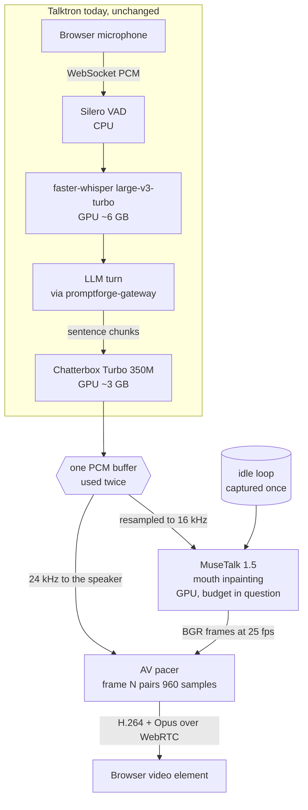

<!-- STATUS: component doc - Talktron's avatar layer - phase zero, nothing built - 5 open decisions - see design.md for the system -->

# Talktron's avatar: a photorealistic face on the existing voice pipeline

## Recommendation

Build the avatar as a fourth stage in Talktron's existing cascade, driving MuseTalk from the same PCM the speaker receives, and deliver it over WebRTC through `aiortc` while the existing WebSocket keeps carrying control and transcript. Ship it behind a configuration flag whose off position is today's voice-only Talktron, unchanged. Confidence medium, because the VRAM arithmetic works on paper and the batch-size-versus-frame-rate curve on a 4090 already holding Whisper and Chatterbox is unmeasured, and that single unknown decides whether the result runs at 25 frames per second or at 12.

The recommendation rests on one constraint that is not negotiable and one that is. The standing constraint from the Talktron design session on 2026-07-24 is no third-party API calls for speech, HuggingFace models only, which removes D-ID, HeyGen, Simli, Anam, and Tavus from consideration on policy rather than on merit; several of them are better than what this document recommends, and they are set aside anyway. The negotiable constraint is the 24 GB card, which is what forces a 200M-parameter mouth-region model rather than the 1.3B full-face models that lead every 2026 benchmark.

The do-nothing option is real and is argued at its strongest in `## Options`. Anyone reading only this section should know that the case against building this at all is the second-strongest case on the table.

Next step and owner: Vinnie, measure MuseTalk's resident VRAM and sustained frame rate at batch sizes 1, 2, 4, and 8 on the 4090 with Whisper and Chatterbox already loaded, before any of the rest of this document is built. That measurement is cheap, it is a day of work, and it either confirms the whole design or sends it back to `## Options`.

## Scope

This document covers one thing: putting a moving face on Talktron's existing spoken answer. It specifies which model generates the face, where that model runs, how its frames reach the browser, how those frames stay aligned with the audio, and what happens when it cannot keep up.

It does not cover the Mentographist prompt, the conversation compaction, the background research subagent, or anything else in Talktron that predates it. Those are unchanged, and a correct avatar layer is one that could be deleted without touching any of them.

What this layer does not do, and cannot be made to do without a change to this document:

- Generate speech. The audio is Chatterbox Turbo's, exactly as today. This layer consumes that audio and never produces any.
- Reach an LLM. The avatar stage sits downstream of every model call and makes none of its own. It never touches `promptforge-gateway`.
- Take a turn. It renders the answer that the pipeline already decided to speak, and it holds no state that survives the turn.
- Understand the user. There is no camera, no gaze tracking, no facial perception of the person sitting in front of it. Talktron listens with a microphone and nothing else.
- Render a body, hands, or a background that moves independently of the source loop. The frame is a head and shoulders against whatever was behind them when the loop was captured.
- Run on a machine without CUDA. There is no CPU fallback that produces frames in time, and a fallback that produces them late is worse than the voice-only mode it would be competing with.
- Survive the browser tab losing focus in a useful way. A backgrounded tab throttles its own decode and the server keeps rendering into a stream nobody watches, which is waste this layer does not currently detect.

The test of the boundary: setting `avatar.enabled = false` yields byte-identical behaviour to Talktron before this document existed, on the same latency budget, with the avatar model never loaded and its VRAM never reserved.

## Criteria

Five criteria, in the order they eliminate candidates. The ordering matters more than the list, because the first two remove most of the field before quality is ever considered, and a document that led with quality would recommend something that cannot run here.

- **Fits the free VRAM.** After Whisper and Chatterbox, roughly 13 GB remains on the 24 GB card. A model that needs more does not run, regardless of how good it looks.
- **Runs locally from HuggingFace weights.** The standing no-third-party-API constraint from the 2026-07-24 session. This is a policy criterion, not a technical one, and it is the reason the best options in the market are absent.
- **Adds under roughly 300 ms to first output.** Talktron's established budget is 1200-1400 ms from the user falling silent to the first audio. The face must not push that past about 1700 ms, which is where a conversation starts feeling like a radio link.
- **Sustains 25 frames per second while the answer plays.** Below about 20 the mouth reads as stuttering rather than speaking, which is worse than a still image because the eye keeps trying to resolve it.
- **Degrades to voice-only without a visible failure.** The Mentographist's stated purpose is to make the sitting pleasant enough that the subject forgets the lens is there. A face that freezes mid-sentence violates that goal harder than no face does.

The last criterion is the one that shapes the architecture rather than merely filtering it, and it is why `## Design decisions` spends more space on the fallback path than on the happy path.

## Options

Five options were considered against those criteria. Table 1 scores them; the prose after it carries the reasoning, because the trade-offs are not the kind of thing a cell can hold.

**Table 1. Avatar options scored against the five criteria.** VRAM and frame-rate figures for the model candidates come from the open-source talking-head survey of 2026-07-25; the Talktron figures come from the design session of 2026-07-24. "Fits" is judged against roughly 13 GB free.

| Option | Fits 13 GB | Local weights | Added latency | Sustained FPS | Degrades cleanly |
|---|---|---|---|---|---|
| MuseTalk 1.5 on an idle loop | Yes, at reduced batch | Yes | ~200-300 ms est. | 30-35 optimised, unmeasured here | Yes, freeze to still |
| Ditto | Roughly even chance at 8-16 GB | Yes | < 400 ms first frame | RTF < 1 | Yes |
| SoulX-FlashHead Lite | Unlikely at 12-16 GB | Yes | Unmeasured | 96 | Yes |
| Commercial API (Simli, Anam, D-ID) | Not applicable | No, ruled out | 180-300 ms | 25-30 | Yes |
| Do nothing, stay voice-only | Yes | Yes | 0 | Not applicable | Not applicable |

**MuseTalk on an idle loop is the recommendation.** It is a roughly 200M-parameter model that inpaints the mouth region of an existing video rather than generating a whole face, which is exactly why it fits: the floor is around 4 GB and the fully batched real-time configuration wants 18-24 GB, so the working configuration sits somewhere between and the whole question is where. The idle loop is not a workaround for the model's narrowness but the thing that makes it good enough. A mouth-only model cannot blink, breathe, or shift its weight, and those are the movements that sell presence; a captured loop supplies all three for free and MuseTalk only has to be right about the mouth. LiveTalking, at roughly 8,000 stars and deployed commercially, pairs precisely this model with precisely this idle-loop technique over `aiortc`, so the combination is proven in the exact stack Talktron already runs. Tension: the loop is finite, so it will visibly repeat on a long answer, and the seam where it wraps is the artifact most likely to break the illusion.

**Ditto is the upgrade path and might be the right first choice.** It is audio-driven from a single portrait, needs no loop, reports a first-frame delay under 400 ms and a real-time factor below one, carries fine-grained gaze, pose, and emotion control, and is Apache 2.0. Its stated 8-16 GB range straddles the budget, which is the only reason it is not the recommendation: at the low end it fits comfortably and at the high end it does not fit at all, and nothing in the survey resolves where in that range a 4090 lands. If the measurement in `## Recommendation` shows MuseTalk consuming less than expected, the same measurement should be run against Ditto before committing, because Ditto solves the idle-loop seam by not having a loop.

**SoulX-FlashHead Lite is the best model here and probably cannot run.** It leads the HDTF and VFHQ benchmarks, hits 96 frames per second on a bare RTX 4090, and wants 12-16 GB, which against roughly 13 GB free means it fits only if everything breaks favourably. It is also four months old as of this writing and derived from Wan2.1, so its licence needs reading before anyone plans around it. Revisit when the card changes, not before.

**A commercial API would be the easy answer and is disallowed.** Anam at 180 ms median and Simli at roughly $0.05 per minute both beat anything self-hosted on latency and effort, and the pipeline would shrink to a WebSocket forwarding PCM to somebody else's renderer. The 2026-07-24 constraint rules them out, and this document records that they were better rather than pretending otherwise. If the constraint is ever relaxed, this decision reopens first.

**Doing nothing is the strongest argument against the recommendation.** Talktron's design philosophy, in its own words, is to make the sitting so pleasant the subject forgets the lens is there. A face serves that only if it is unobtrusively right, and every failure mode of a cheap avatar is obtrusively wrong: a mouth slightly out of step, a loop that visibly wraps, a freeze at the moment the answer gets interesting. Voice-only has none of those failure modes and costs nothing to maintain. The honest case for building the avatar anyway is that a visible interlocutor changes how much people disclose in an interview, and the honest state of that claim in this document is that it is an assumption carried from the premise of the project rather than a measured finding. It is not cited here because no source in the research supports it. Tension: the entire justification for this layer rests on an unmeasured belief about interview dynamics, and the flag in `## Recommendation` exists so that belief can be tested by turning the face off mid-project rather than argued about.

## Architecture

The avatar is one stage appended to a cascade that already exists. Figure 1 shows where it attaches and what crosses each boundary.

**Figure 1. Talktron's pipeline with the avatar stage attached.** The `existing` subgraph predates this document and is unchanged. `promptforge-gateway` is reached exactly as it is today, from the LLM stage only. The single node labelled "one PCM buffer" is where synchronisation is won or lost.

Four properties of that diagram carry the design.

The split after Chatterbox is the whole synchronisation story and is treated in full in the next section. One PCM buffer leaves the TTS stage and is used twice, at two sample rates, for two purposes, and because both uses derive from the same buffer they cannot drift apart no matter how badly either stage is scheduled.

The idle loop is an input, not a model. It is captured or generated once, committed as a file, and read at startup. Nothing regenerates it at runtime and nothing about it is learned.

The avatar stage has no edge to the gateway, no edge to the LLM, and no edge back upstream. It is a sink. This is what makes the `avatar.enabled = false` boundary test honest: removing a sink cannot change what flows into it.

WebRTC carries media and the existing WebSocket carries everything else. The two are not alternatives here and the WebSocket is not being replaced. It keeps carrying the user's microphone audio up, the transcript down, and the control messages both ways, because none of that is latency-critical in the way a video track is and all of it already works.

## How audio and video stay in sync

Synchronisation is three separate problems that get conflated because they share a name. Only the third is hard.

**At generation, sync is arithmetic rather than estimation.** MuseTalk does not produce video that then has to be matched to audio; it consumes the audio and emits the frames that audio implies. At 25 frames per second against 24 kHz PCM, one video frame corresponds to exactly 960 audio samples, and the pairing is integer with no remainder. Frame N is the frame for samples 960N through 960N+959, permanently, and there is no accumulating rounding error to correct because there is no rounding. The one wrinkle worth naming is that MuseTalk conditions on Whisper encoder features at 16 kHz while the speaker receives 24 kHz, so a resample sits on the avatar branch. Both branches descend from one buffer, so the resample changes the representation and cannot change the alignment.

**In transport, sync is the protocol's job and this is the reason for WebRTC.** RTP timestamps advance at 48,000 per second for Opus and 90,000 per second for video, and periodic RTCP Sender Reports carry an NTP wall-clock time paired with the RTP timestamp current at that instant. The receiver builds a mapping from those pairs, resolves both tracks onto one clock, and schedules playout accordingly, with an independent adaptive jitter buffer per track absorbing arrival variance. None of that has to be written. The alternative considered was fragmented MP4 over the existing WebSocket into a MediaSource buffer, where presentation timestamps in the container would carry the same information; it was rejected because it adds the fragment duration to latency, roughly 200 ms at a 0.2 second fragment, and because it puts the sync guarantee in code this project would own and debug rather than in code the browser already ships.

**In pacing, sync is ours and it is where this will actually break.** The renderer runs as fast as the GPU allows, which is not real time and is not constant. Running ahead is as wrong as running behind: frames pushed faster than 25 per second either fill a buffer that adds latency or get dropped by the encoder. The fix is the pattern LiveKit's `AVSynchronizer` and VideoSDK's equivalent both implement, which is to delay each video frame by the current audio buffer depth and pace the output at the configured frame rate, sleeping when the renderer runs hot. The tolerance to hit is roughly plus or minus 40 ms, and the asymmetry matters: audio arriving ahead of video is more noticeable than audio arriving behind it, so when the pacer must choose, it should let the video lead.

Tension: the pacer is the one piece of this layer with no upstream implementation to copy directly into a Python `aiortc` pipeline, LiveKit's being in a different runtime, so it is both the most load-bearing and the least de-risked component in the design.

## The VRAM budget decides the model

Table 2 is the arithmetic that eliminated three of the five options in `## Options`, reproduced separately because it is the single most consequential fact in this document and because every number in it is either measured elsewhere or explicitly unmeasured.

**Table 2. VRAM on the 24 GB RTX 4090, before and after the avatar.** The first four rows are from the Talktron design session of 2026-07-24. The avatar row is the open question this document cannot close.

| Component | Resident VRAM | Status |
|---|---|---|
| faster-whisper large-v3-turbo | ~6 GB | Measured 2026-07-24 |
| Chatterbox Turbo 350M | ~3 GB | Measured 2026-07-24 |
| CUDA context and buffers | ~2 GB | Measured 2026-07-24 |
| Subtotal before the avatar | ~11 GB | Derived |
| Free on the card | ~13 GB | Derived |
| MuseTalk at the batch size that sustains 25 fps | Unknown, between 4 and 24 GB | **Unmeasured. Blocks the build.** |

The published range for MuseTalk is a 4 GB floor at batch one and 18-24 GB for the fully batched real-time configuration reported on a bare card, and the survey gives no intermediate point. The working assumption is that batch 4 lands near 6-8 GB and clears 25 frames per second, which fits with headroom, and that assumption is doing more work than any other sentence in this document. It is stated as an assumption rather than a finding because nothing measured supports it.

Three things could be traded if the measurement comes back badly, and they are listed in the order they should be tried. Reduce the batch size and accept a lower frame rate, which costs smoothness first and crosses the 20 fps floor eventually. Move Whisper to a smaller checkpoint, which costs transcription accuracy on a stage whose errors propagate into everything downstream. Replace Chatterbox with Kokoro at 82M parameters, which recovers roughly 3 GB and was already tried and reversed during the 2026-07-24 session, because Kokoro scores around 3.9 mean opinion score with no emotion control and the persona needs warmth in the voice. That third trade is listed for completeness and should be refused: it fixes a video problem by degrading the audio, and the audio is the product.

## Design decisions

### MuseTalk renders into a captured loop rather than generating a face

The model inpaints a mouth into video that already exists, so something has to supply that video. A short loop of the subject sitting still, captured once and committed, supplies blinking, breathing, and micro-movement that no mouth-region model can produce, and it does so at zero inference cost. This is what makes a 200M-parameter model competitive with much larger ones on the only axis that matters here, which is whether a person watching it forgets they are watching a render. Tension: the loop wraps, and the wrap is visible on any answer longer than the loop, so the capture has to be long enough and cut carefully enough that the seam does not read as a glitch.

### The avatar consumes the same buffer the speaker does

One PCM buffer leaves Chatterbox and both branches descend from it, rather than the avatar receiving its own copy from a second synthesis pass or a re-read of a file. This is what makes generation-time synchronisation arithmetic rather than estimation, and it also halves the TTS cost that a naive two-pass design would incur. Tension: the branches now share a failure, so a truncated or corrupt TTS buffer produces a wrong mouth as well as wrong audio, and there is no independent path that would have caught it.

### WebRTC carries media and the WebSocket stays for everything else

Adding a video track to the existing WebSocket would have meant owning the sync problem, and WebRTC solves it in the browser with RTCP Sender Reports mapping both tracks onto one clock. `aiortc` is the Python implementation and is what LiveTalking uses for the same job with the same model, so the combination has a working precedent rather than being assembled from first principles. The WebSocket is not replaced because nothing it carries benefits from the change. Tension: two transports to keep alive, two failure modes to distinguish in the client, and a connection setup that now has an ICE negotiation in front of it.

### The pacer holds the frame rate, and it lets video lead when it must

Frames leave the renderer at whatever rate the GPU manages and must reach the encoder at exactly 25 per second, delayed by the current audio buffer depth. Where the pacer cannot hold the target it biases toward video leading audio rather than trailing it, because human tolerance is asymmetric and a trailing mouth reads as a bad dub. Tension: this is the component with no direct implementation to copy into `aiortc`, so it is the largest build risk in a design whose largest measurement risk is elsewhere.

### A stalled renderer freezes to a still frame and never drops the audio

When the GPU cannot sustain the frame rate, the video track holds the last good frame and the audio continues uninterrupted. The alternative, dropping to a lower frame rate dynamically, produces a mouth that stutters against speech that does not, which is the most uncanny available failure. A still face with correct audio reads as a frozen video call, which every user already knows how to interpret. Tension: a freeze is silent, so a deployment can degrade for an entire session without anyone noticing until they look at the logs, which is why `## Tests` asserts on the freeze counter rather than on appearance.

### The whole layer sits behind a flag whose off position is today's Talktron

`avatar.enabled = false` loads no model, reserves no VRAM, negotiates no peer connection, and leaves the latency budget as it was. This is not a debugging convenience. The justification for the entire layer is an unmeasured belief about whether a visible interlocutor changes what people disclose, and a flag is what turns that belief into something testable against the same subject on the same day. Tension: two supported configurations to test, which is the cost of being able to answer the question the project is actually asking.

## Dependencies and pins

Nothing here is pinned yet, because nothing is built and pinning a version this far ahead of a build records a guess as a decision. What follows is the intended set and what each is for. Versions get pinned in this section when the measurement in `## Recommendation` completes, and every one of them needs checking against PyPI on that date rather than trusting this list.

- `aiortc` for the WebRTC peer connection, media tracks, and RTCP. It is the only maintained Python WebRTC implementation, so this is a selection with one candidate.
- `av`, which `aiortc` already pulls in, for the FFmpeg binding that encodes H.264 and Opus.
- `MuseTalk` at 1.5, from the TMElyralab repository, as source rather than a package. Its licence needs reading before the build starts; the survey did not record it and this document does not assert it.
- `torch` and `torchaudio` at whatever Talktron already pins, because introducing a second CUDA-linked torch into a process that already has one is how a working GPU stack stops working.
- `numpy` and `opencv-python` for frame handling, both already present in Talktron.

Hardware encoding through NVENC is intended but not assumed. The `av` build has to expose `h264_nvenc` for it to be available at all, and if it does not, software `libx264` with the `zerolatency` tune and no B-frames is the fallback at a CPU cost that has not been measured against this pipeline.

## Non-goals

- No speech generation in this layer - the audio is Chatterbox's and this stage only consumes it
- No LLM call and no gateway edge - the avatar sits downstream of every model decision and makes none
- No camera and no perception of the user - Talktron listens with a microphone and this layer adds no sensor
- No body, no hands, no independently moving background - the frame is what the idle loop captured
- No CPU rendering path - a fallback that produces frames late is worse than the voice-only mode it competes with
- No dynamic frame-rate degradation - a stalled renderer freezes to a still frame, because a stuttering mouth against fluent speech is the worst available failure
- No third-party avatar API - ruled out by the standing 2026-07-24 constraint, and the better options in that category are named in `## Options` rather than hidden
- No second TTS pass for the avatar branch - both branches descend from one buffer, which is what makes sync arithmetic
- No replacement of the existing WebSocket - it keeps carrying microphone audio, transcript, and control, none of which benefit from WebRTC
- No avatar in a PromptForge prompt - this is Talktron's layer, and `design.md`'s rule that no prompt requires audio extends unchanged to video

## Build path

Six steps, ordered so that the step most likely to invalidate the design comes first.

1. **Measure.** MuseTalk's resident VRAM and sustained frame rate at batch 1, 2, 4, and 8, on the 4090, with Whisper and Chatterbox already loaded. Run the same measurement against Ditto. This closes Table 2 and either confirms the recommendation or returns to `## Options`. Nothing else starts until this finishes.
2. **Capture the idle loop.** Long enough that the wrap is rare, cut so the seam is invisible, committed as a file. This is a content task rather than a code task and it gates the quality of everything downstream, which is why it comes before the renderer rather than after it.
3. **Render offline.** Feed a recorded WAV and the loop to MuseTalk and write an MP4. No transport, no pacing, no pipeline. This is where mouth quality gets judged and where the decision to continue or to fall back to Ditto actually gets made.
4. **Build the pacer against a fake clock.** The frame-to-sample pairing and the buffer-depth delay, tested with no GPU and no network. This is the riskiest component and it is the one that can be fully tested in isolation, so it should be.
5. **Add the WebRTC track.** `aiortc` peer connection alongside the existing WebSocket, serving the offline renderer's output first and the live renderer second. Sync gets verified here, against the clapperboard test in `## Tests`.
6. **Wire it live and flag it.** Attach to the Chatterbox output, implement the freeze path, and add `avatar.enabled` with off as the default until the latency budget is confirmed intact.

## Tests

Nothing in this suite requires a subject, and everything except the two GPU tests runs without a card.

- **Frame-to-sample pairing.** For a synthetic 10-second buffer at 24 kHz, frame N covers samples 960N through 960N+959 for every N, with no gap and no overlap at the boundaries. Pure arithmetic, no GPU, and it is the test that catches a resample changing the alignment rather than the representation.
- **Pacer against a fake clock.** A renderer stubbed to run at 2x real time, at 0.5x, and at a rate that oscillates between them must all produce output at 25 frames per second, with the drift against the audio clock staying inside plus or minus 40 ms across a 60-second run. The oscillating case is the one that matters, because a constant offset is easy and a varying one is what a real GPU produces.
- **Video leads on failure.** Where the pacer cannot hold the target, the sign of the residual offset is asserted, not just its magnitude. This is a one-line assertion guarding a decision that is otherwise invisible and easy to reverse by accident.
- **Freeze on stall.** A renderer stubbed to stop producing frames entirely must hold the last frame, keep the audio track flowing uninterrupted, and increment a freeze counter. The counter is what the test asserts on, because a freeze is visually silent and a deployment can degrade for a whole session without anyone noticing.
- **The flag is a real boundary.** With `avatar.enabled = false`, assert no CUDA allocation attributable to the avatar model, no peer connection offered, and a first-audio latency inside the pre-existing budget. This is the test that keeps the boundary claim in `## Scope` honest.
- **Clapperboard sync, end to end, on hardware.** A synthetic buffer with a sharp transient and a loop with a matching visual marker, captured at the browser and compared frame to sample. This is the only test that exercises RTCP mapping, and it needs a card and a real browser.
- **VRAM ceiling, on hardware.** With all three models loaded, assert peak allocation stays under a configured ceiling across a 60-second answer. This is the regression test for the arithmetic in Table 2 once that arithmetic is known.

There is deliberately no test asserting that the face looks good. That judgement is step 3 of the build path and it belongs to a person.

## Confidence

| Area | Level | Why |
|---|---|---|
| Generation-time sync | high | Integer frame-to-sample pairing from one shared buffer; no estimation anywhere in it |
| Transport-time sync | high | RTCP Sender Report mapping is the browser's job and `aiortc` exposes it; LiveTalking runs the same combination |
| Transport choice | high | WebRTC over fMP4 on latency and on not owning the sync guarantee; the WebSocket stays for everything else |
| Model choice | medium | MuseTalk plus an idle loop is proven in LiveTalking, but its fit in the remaining VRAM is the open question in Table 2 |
| VRAM budget | low | The one number that decides the design is unmeasured, and the published range spans 4 to 24 GB |
| Latency budget | low | The 200-300 ms estimate for the avatar stage is inferred from frame-rate figures on a bare card, not measured on a loaded one |
| Pacer implementation | medium | The pattern is well established in LiveKit and VideoSDK; neither is Python `aiortc`, so it gets written here |
| Failure behaviour | high | Freeze-to-still with continuous audio, chosen because a stuttering mouth against fluent speech is the worst option |
| Idle-loop quality | low | Whether a loop wraps invisibly is a content question that no measurement in the research touches |
| The case for building it at all | low | Rests on an unmeasured assumption about interview disclosure; the flag exists so that assumption can be tested |

## Open

- Where MuseTalk actually sits between 4 and 24 GB at a batch size that sustains 25 frames per second, with two other models resident. Everything else in this document is downstream of that number.
- Whether Ditto fits after all. Its 8-16 GB range straddles the budget, it needs no idle loop, and it therefore has no wrap seam. If the measurement in step 1 is favourable to MuseTalk it is probably favourable to Ditto too, and the loop capture in step 2 becomes unnecessary work.
- What MuseTalk's licence permits. The survey did not record it and this document does not guess.
- How long the idle loop has to be before the wrap stops reading as a glitch, and whether a cut chosen for visual continuity survives being watched for a full session rather than a demo.
- Whether a backgrounded browser tab should stop the renderer. It currently does not, so the GPU keeps producing frames into a stream nobody is watching, which is waste that a visibility event on the client could eliminate at the cost of a resume path that has to re-establish sync.
- Whether the freeze counter should reach the user. An operator needs it; a subject mid-interview almost certainly should not be told the face stopped.

## References

- Open-source talking-head model survey, 2026-07-25 - MuseTalk, Ditto, SoulX-FlashHead, LivePortrait, EchoMimicV3 parameter counts, VRAM ranges, and frame rates
- Real-time avatar streaming survey, 2026-07-25 - WebRTC versus fMP4 latency, RTCP Sender Report sync, `AVSynchronizer` pacing pattern, the plus or minus 40 ms tolerance and its asymmetry, NVENC settings
- Commercial avatar API comparison, 2026-07-25 - Anam, Simli, D-ID, Tavus latency and pricing, recorded here to show what the no-third-party constraint costs
- Talking-avatar architecture and cost analysis, 2026-07-25 - pipeline parallelisation, GPU infrastructure, 2D versus 3D tradeoffs, reenactment versus generation
- Talktron design session, 2026-07-24 - the VRAM figures for Whisper and Chatterbox, the 1200-1400 ms latency target, the no-third-party-API constraint, and the Kokoro-to-Chatterbox reversal on voice quality
- LiveTalking - https://github.com/lipku/LiveTalking - MuseTalk with idle-loop arrangement over `aiortc`, the closest working precedent for this design
- MuseTalk - https://github.com/TMElyralab/MuseTalk - licence unverified as of this writing
- Ditto - https://github.com/antgroup/ditto-talkinghead - Apache 2.0
- `design.md` - the system boundary that puts speech in Talktron and keeps audio out of prompts, which this document extends to video unchanged

*2026-07-26 - design-avatar*
