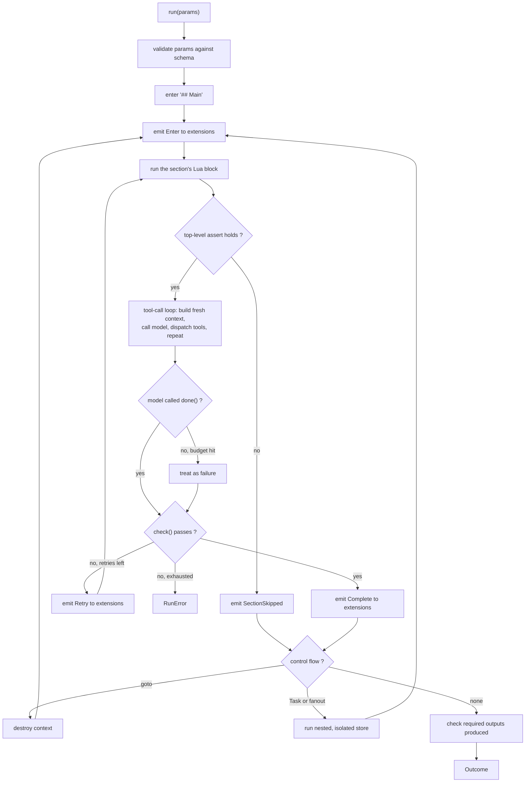

<!-- STATUS: crate doc - promptforge (library) - see design.md for the system -->

# `promptforge`: the core library

## Scope

This crate parses a markdown prompt, executes its sections, resolves logical names to concrete ones supplied by its caller, dispatches to functions supplied by its caller, and reports what happened. It is the box labelled `Executor` in the system diagram and it owns no edge leaving that box.

[design-promptforge.md](design-promptforge.md) is the authority on the prompt language itself: the four primitives, the section model, the Lua block, `goto`, `Task`, fan-out, virtual files, tool-call state, and the evidence behind each. This document specifies the Rust that implements that language and does not restate its reasoning. Where the two touch, the language document wins on semantics and this one wins on types. Two deliberate departures from it, both consequences of decisions in [design.md](design.md): `mlua` in Luau mode replaces `lupa`, whose sandbox was defence-in-depth rather than hermetic; and a persistent database is an extension under its own name rather than a core host object, while the run state store named `store` stays core.

What it does not do, and cannot be made to do without a change to this document:

- Read a file of configuration. Every value arrives through `RunConfig`.
- Know a domain. No schema, no table, no paper, no search provider, no WG21 vocabulary.
- Talk to an LLM backend. It holds a `GatewayClient` its caller constructed.
- Persist anything. Storage is an extension's business.
- Decide where an output lands. It resolves a declared output name against roots it was handed.

The test of the boundary: a project with no relation to WG21 can depend on this crate, write its own extensions, and get a working prompt runtime without deleting a line.

## Public API

Every type below is `promptforge::Type`. The crate root re-exports all of them; the module layout beneath is an implementation detail.

### Newtypes

Three distinct string vocabularies get three distinct types, because confusing them is the single most likely bug in the resolution path.

```rust
/// A logical model name written in a prompt: "fast", "thinking".
pub struct Slot(String);

/// A model name in the gateway's vocabulary: "claude-sonnet-4".
pub struct ModelName(String);

/// A canonical tool name from the fixed vocabulary: "web_search", "classify_entail".
/// One name identifies exactly one function. Names sharing a prefix form a family
/// that reaches Lua as a single table of that prefix name.
pub struct ToolName(String);

/// Identifies one execution for the life of that execution.
pub struct RunId(Uuid);
```

`Slot` and `ModelName` are never interchangeable and there is no `From` between them; only a `SlotMap` crosses that gap. `ToolName` parses only from the canonical set, so an unknown word fails at construction rather than at dispatch.

### Prompt

Parsing is total and produces no side effects. A `Prompt` is inert data: it can be constructed, inspected, and enumerated on an MCP surface without running any prompt code.

```rust
pub struct Prompt {
    pub meta: Frontmatter,
    pub sections: Vec<Section>,
}

impl Prompt {
    pub fn parse(source: &str) -> Result<Self, ParseError>;
    pub fn section(&self, name: &str) -> Option<&Section>;
}

pub struct Frontmatter {
    pub name: String,
    pub description: String,
    pub keywords: Vec<String>,
    pub version: String,
    pub params: ParamSchema,
    pub tools: Vec<ToolName>,
    pub outputs: Vec<OutputDecl>,
    pub progress: BTreeMap<String, String>,
}

pub struct Section {
    /// The heading text including its marker, "## Extract". The address `goto`
    /// and `Task` resolve against, used verbatim rather than slugified so that
    /// what a prompt author writes in Lua is what they see in the document.
    pub name: String,
    pub level: Level,
    /// Prose handed to the model.
    pub body: String,
    /// The section's Lua block, if it has one. At most one per section.
    pub script: Option<String>,
    /// H3 sections beneath an H2. Individually addressable, which is what makes
    /// a battery of forty tests ordinary readable markdown that still fans out.
    pub children: Vec<Section>,
}

pub enum Level { H2, H3 }
```

`## Main` is the entry point. Sections do not run in file order: Main reads accumulated state through query tools, decides from its own prose, and reaches the next step with `goto` or `Task`. A child inherits its parent's Lua configuration unless it defines its own, which extends or overrides it, with the more specific block winning.

`params` is a JSON Schema object. `tools` lists the canonical names this prompt calls anywhere, which is what startup validation checks against configuration. `progress` maps section name to the static text a caller displays while that section runs, and is the fallback when no narrator is present.

### Slot and tool resolution

The caller resolves both maps before construction. The executor performs lookups, never resolution.

```rust
pub struct SlotMap(BTreeMap<Slot, ModelName>);

impl SlotMap {
    pub fn resolve(&self, slot: &Slot) -> Result<&ModelName, ResolveError>;
}

pub struct ToolMap(BTreeMap<ToolName, Arc<ResolvedTool>>);

impl ToolMap {
    pub fn resolve(&self, name: &ToolName) -> Result<&Arc<ResolvedTool>, ResolveError>;
    /// Subset the model sees in one section, per that section's `tools.add` calls.
    /// This scopes the model surface only. Lua host objects are bound once per run
    /// and are not filtered, because scoping exists to keep the model's choice small
    /// and the prompt author is not choosing under uncertainty.
    pub fn scoped(&self, allowed: &[ToolName]) -> ToolMap;
}

pub struct ResolvedTool {
    pub name: ToolName,
    /// Which extension backs this name. Diagnostics only; dispatch does not branch on it.
    pub extension: String,
    pub def: ToolDef,
    pub limit: Option<Arc<Semaphore>>,
}
```

`scoped` is cheap because entries are `Arc`. Per-section tool scoping is a filter over an existing map rather than a fresh resolution.

### Extension

One extension is one linked crate contributing named functions plus whatever connection or model those functions need.

```rust
#[async_trait]
pub trait Extension: Send + Sync + 'static {
    /// Stable identifier used in configuration and diagnostics: "brave", "paperstore".
    fn name(&self) -> &str;

    /// Canonical names this extension can back.
    fn provides(&self) -> &[ToolName];

    /// The contributed functions, with schemas and surface declarations.
    fn tools(&self) -> Vec<ToolDef>;

    /// Names this extension binds into the Lua environment, and the values.
    /// Called once per run, because Lua state is per-run.
    fn bind_lua(&self, lua: &Lua) -> Result<Vec<(String, Value)>, ExtError>;

    /// True when this extension holds state whose lifetime is one section.
    /// A holder cannot have its savepoints interleaved, so the executor
    /// serializes `fanout` when any registered extension declares this.
    fn holds_section_state(&self) -> bool { false }

    /// Startup check. Reachable database, readable weights, present credential.
    /// Runs as a boot step before any executor is constructed.
    async fn validate(&self) -> Result<(), ExtError>;

    /// Run lifecycle. A database-backed extension maps these to begin, commit,
    /// rollback, and savepoint. Default is to ignore them.
    async fn on_section(&self, _ev: &SectionEvent) -> Result<(), ExtError> { Ok(()) }

    /// Rows this extension wrote for a declared `Rows` output during this run.
    /// Reported in the tool result. Zero for an extension that writes no rows.
    async fn row_count(&self, _run: RunId, _table: &str) -> Result<u64, ExtError> { Ok(0) }

    /// Release connections and sessions. Called on service shutdown.
    async fn shutdown(&self) -> Result<(), ExtError> { Ok(()) }
}

pub struct Extensions(Vec<Arc<dyn Extension>>);

impl Extensions {
    pub fn new() -> Self;
    pub fn add(&mut self, ext: Arc<dyn Extension>) -> &mut Self;
    /// Every canonical name any linked extension can back, for validation.
    pub fn available(&self) -> BTreeSet<ToolName>;
    /// Boot step, run once before any executor is constructed.
    pub async fn validate_all(&self) -> Result<(), ExtError>;
    /// True when any registered extension holds section-scoped state.
    pub fn any_holds_section_state(&self) -> bool;
}
```

Every method that can touch a network or a disk is async. A transaction boundary is `BEGIN IMMEDIATE`, `COMMIT`, `ROLLBACK`, or `SAVEPOINT`, and a synchronous hook cannot await any of them: `block_in_place` with `Handle::block_on` panics on a current-thread runtime and is forbidden inside an existing `block_on`, spawning the commit and returning `Ok(())` turns a failed commit into a successful run, and a channel to a writer task only moves the blocking receive. The trait already needs `#[async_trait]` for `ToolFn`, so this costs nothing new.

`on_section` receives every event whether or not the extension participated in that section, because an extension holding a transaction needs the commit even if the section called none of its tools. Ordering across extensions is registration order for `Enter` and reverse registration order for `Complete`, so a nested resource acquired later is released first.

```rust
pub struct TaskId(u64);

pub enum SectionEvent {
    Enter { run: RunId, section: usize },
    Complete { run: RunId, section: usize },
    /// Rollback and begin again, not rollback alone: the executor returns to the
    /// section's Lua block and emits no second `Enter`.
    Retry { run: RunId, section: usize, attempt: u32 },
    NestedEnter { run: RunId, section: usize, depth: u32, task: TaskId },
    NestedComplete { run: RunId, section: usize, depth: u32, task: TaskId },
    NestedFailed { run: RunId, section: usize, depth: u32, task: TaskId },
    /// Emitted exactly once per run, on every path out of `Executor::run`,
    /// including every error path and the deadline. `ok` is false when the run
    /// did not complete. Emitted from a guard, not from the success path.
    RunEnded { run: RunId, ok: bool },
}
```

`RunEnded` is load-bearing and was added after the paperstore extension was specified against an earlier version of this trait. Without it, every failure path leaves an open transaction: `shutdown` is process scope rather than run scope, so nothing tells a storage extension that a failed run is over. On SQLite, where the write pool holds one connection, the first failed run then wedges every subsequent write until the process restarts. That is the difference between recovery being to run it again, which is this system's stated model, and recovery being to restart the service. The guarantee that it fires on every path out of `run` is what makes it worth having, which is why the core emits it from a drop guard rather than from the happy path.

`TaskId` distinguishes concurrent fan-out tasks, which a depth number cannot. Savepoints on one connection are strictly last in, first out, so three tasks running concurrently at the same depth produce interleaved `SAVEPOINT` and `RELEASE` pairs, and a release from the task that finished first releases the savepoint the task that started last is holding. That failure is silent rather than an error. `NestedFailed` exists for the same reason a savepoint is taken at all: without it a failed subagent task has no way to say `ROLLBACK TO SAVEPOINT`.

`holds_section_state` is the escape hatch for the case `TaskId` alone does not fix. An extension that cannot tolerate interleaved nesting declares it, and the executor serializes `fanout` for that run. Tension: one such extension costs every prompt in the deployment its fan-out concurrency, which is a heavy price paid at a coarse granularity, and the alternative was leaving the interleaving silently wrong.

### ToolDef: one function, two surfaces

There is one kind of contributed code and two ways to reach it. The macro derives both from a single signature.

```rust
pub struct ToolDef {
    pub name: ToolName,
    pub description: &'static str,
    /// Derived from the argument struct by `schemars`.
    pub schema: schemars::Schema,
    pub surfaces: Surfaces,
    /// Concurrent calls permitted for a metered upstream. Process-local.
    pub rate_limit: Option<u32>,
    pub call: Arc<dyn ToolFn>,
}

pub enum Surfaces {
    /// The model may call it; Lua may not.
    ToolOnly,
    /// Lua may call it; the model never sees it. Classifiers are here.
    LuaOnly,
    Both,
}

#[async_trait]
pub trait ToolFn: Send + Sync {
    async fn call(&self, args: Value, ctx: &CallCtx) -> Result<Value, ToolError>;
}

pub struct CallCtx {
    pub run: RunId,
    pub section: usize,
    pub deadline: Instant,
}
```

`serde_json::Value` in and out is the single interchange form for both surfaces: the model surface needs JSON anyway, and Lua values convert both directions. The alternative, two typed entry points per function, would make the macro emit two bodies and double the surface an extension author maintains. Tension: a Lua call pays a JSON round trip it does not strictly need, which matters only if a classifier call in a tight ranking loop is ever measured as the bottleneck.

`surfaces` is the extension's declaration, not a core policy. The core enforces it: a `LuaOnly` tool is absent from the schema list sent to the model, and a `ToolOnly` tool is absent from the Lua environment.

### Observer

```rust
pub trait Observer: Send + Sync {
    fn on_event(&self, ev: &Event);
}

pub enum Event {
    RunStarted { run: RunId, prompt: String, nominal_total: u32 },
    SectionStarted {
        /// Distinct sections completed so far. Monotonic, never decreasing.
        done: u32,
        /// Count of H2 sections excluding Main. A nominal denominator.
        nominal_total: u32,
        name: String,
        /// Frontmatter progress text for this section, if declared.
        label: Option<String>,
    },
    SectionFinished { done: u32, nominal_total: u32, name: String },
    SectionSkipped { name: String, reason: String },
    SectionRetrying { name: String, attempt: u32, reason: String },
    Jumped { from: String, to: String, cleared_turns: u32 },
    TaskStarted { parent: String, target: String, depth: u32 },
    TaskFinished { parent: String, target: String, depth: u32, ok: bool },
    FanoutStarted { parent: String, count: u32 },
    FanoutFinished { parent: String, count: u32, failed: u32 },
    ToolCalled { section: String, tool: ToolName, ok: bool, ms: u64 },
    ModelTurn { section: String, model: ModelName, prompt_tokens: u32, completion_tokens: u32 },
    Narration { section: String, text: String },
    OutputWritten { name: String, dest: Destination },
    RunFinished { run: RunId, outcome: OutcomeKind },
}
```

`SectionStarted` carries `done`, `nominal_total`, and `label` because those are exactly the three arguments an MCP progress notification takes, and Cursor was measured on 2026-07-25 rendering them as `{done} / {nominal_total} - {label}`. Nothing downstream has to compute a fraction.

The denominator is nominal, and this is a genuine imprecision rather than a rounding detail. Because `## Main` dispatches with `goto` rather than the runtime walking sections in file order, the number of sections a run will visit is not known when it starts: a run may skip sections, and it returns to Main between steps. The denominator is therefore the count of H2 sections excluding Main, and the numerator counts distinct sections completed, so a revisit does not advance it and the fraction never goes backwards. Tension: a run that legitimately visits a section twice, or skips three, shows a fraction that never reaches its denominator, so the bar is honest about ordering but not about remaining work.

`on_event` is synchronous and must not block: a consumer that needs to do work queues it.

### Outputs

```rust
pub struct OutputDecl {
    pub name: String,
    pub kind: OutputKind,
    pub required: bool,
}

pub enum OutputKind {
    File { format: Format },
    Rows { table: String },
}

pub enum Format { Markdown, Json, Text }

/// Where a declared output name resolves to, supplied by the caller.
pub struct OutputRoots(BTreeMap<String, Root>);

pub enum Root {
    Dir(PathBuf),
    /// Rows go to an extension that accepted the table name at validation.
    Extension(String),
}

pub enum Destination {
    Path(PathBuf),
    Rows { table: String, count: u64 },
}
```

`Event`, `Outcome`, `Destination`, `OutputKind`, `Format`, `ToolName`, `ModelName`, and `RunId` all derive `Serialize` and `Deserialize`. They cross a process boundary: the MCP server serializes them into tool results and progress notifications, and the CLI deserializes them at the other end. Deriving in the core rather than mirroring the types in each binary is what keeps the two ends from drifting. `serde` is therefore a non-optional dependency of this crate rather than a feature. Tension: the wire shape becomes part of this crate's public API, so renaming a field is a breaking change for both binaries at once.

A prompt emits to a name. The executor resolves the name against `OutputRoots` and constructs the destination itself, so a section handling untrusted text has no filesystem path in reach. A `required` output the run did not produce is a failed run, which is why no postcondition has to be written for it.

### Executor

```rust
pub struct RunConfig {
    pub prompt: Prompt,
    pub slots: SlotMap,
    pub tools: ToolMap,
    pub gateway: Arc<GatewayClient>,
    pub extensions: Extensions,
    pub observer: Arc<dyn Observer>,
    pub outputs: OutputRoots,
    pub limits: Limits,
}

pub struct Limits {
    pub max_turns_per_section: u32,
    pub max_tool_calls_per_section: u32,
    pub max_lua_calls_per_section: u32,
    pub max_retries_per_section: u32,
    pub max_jumps: u32,
    /// Nesting ceiling for `Task`. Four to five in practice.
    pub max_task_depth: u32,
    /// Total subagent tasks across a run, fan-out included.
    pub max_tasks_per_run: u32,
    /// Concurrent tasks one `fanout` may have in flight.
    pub max_fanout_concurrency: u32,
    pub run_deadline: Duration,
}

pub struct Executor { /* private */ }

impl Executor {
    /// Validates the prompt against the maps and the extension set. Every failure
    /// a boot check could catch is caught here. Stays synchronous: extension
    /// `validate` hooks are I/O and run once as their own boot step, through
    /// `Extensions::validate_all`, rather than once per constructed executor.
    pub fn new(cfg: RunConfig) -> Result<Self, ValidateError>;

    pub async fn run(&self, params: Params) -> Result<Outcome, RunError>;
}

pub struct Outcome {
    pub run: RunId,
    pub outputs: Vec<(String, Destination)>,
    /// Short prose for a caller to display. Never a document body.
    pub summary: String,
    pub turns: u32,
    pub elapsed: Duration,
}
```

A single `RunConfig` struct rather than eight positional arguments, because the argument list is long, heterogeneous, and will grow.

The three task limits exist because a runaway fan-out is a documented failure mode rather than a hypothetical one: spawning fifty subagents for a simple query is the case explicit scaling rules were added upstream to prevent.

## Prompt file format

```markdown
---
name: staker
description: Build a stakeholder position report for one entity
version: 1
keywords: [governance, stakeholder]
params:
  type: object
  properties:
    entity: { type: string }
  required: [entity]
tools: [web_search, web_fetch, store]
outputs:
  - name: report
    kind: file
    format: markdown
    required: true
  - name: positions
    kind: rows
    table: stakeholder_position
    required: false
progress:
  gather: Gathering source material
  evaluate: Evaluating positions against the record
  write: Writing the report
---

## Main

```lua
model("thinking")
tools.add("done")
```

Decide the next step. If no statements have been gathered, `goto("## Gather")`.
If statements exist but no verdict is set, `goto("## Evaluate")`. If both are
done, `goto("## Write")`.

## Gather

```lua
model("fast")
tools.add("web_search", "web_fetch", "add_statement", "done")
```

Find every public statement by {{ params.entity }} on the topic. File each one
with `add_statement`, including its source URL.

## Evaluate

```lua
model("thinking")
tools.add("set_verdict", "done")

assert(store.count("statements") > 0, "nothing gathered to evaluate")

function check()
  assert(store.exists("verdict"), "no verdict was set")
end
```

Weigh the statements in the record. Reach a verdict and set it.
```

Frontmatter is YAML because it is frontmatter, a settled convention with tooling; the configuration files are TOML for the separate reason that they are Rust configuration. The two choices are unrelated and neither argues for changing the other.

Section headings are `##`, with `###` beneath them as addressable children. The heading text is the section's address, used verbatim. `{{ params.x }}` substitution happens in the body before the body reaches the model; the only substitutions are `params` and `state`.

### The section Lua block

One Lua fence per section replaces a metadata DSL entirely. The block runs before the section's model turn, configuring it by calling host functions rather than by assigning to magic globals. A section needing nothing special has no block and inherits defaults.

The five host objects are `state`, `store`, `tools`, `params`, and `context`. All five are core, and every other name in scope arrives from an extension.

| Name | Provided by | Purpose |
|---|---|---|
| `state` | core | Read-only view of accumulated run state. |
| `store` | core | Query interface to the run state store: `count`, `exists`, `get`. |
| `tools` | core | The tool-set builder for this section: `add`, `remove`. |
| `params` | core | Arguments passed into this section, read-only. |
| `context` | core | `context.inject(text)` prepends assembled text to the model's initial prompt. |
| `sections` | core | `sections.children("## Battery")` returns the H3 children as addressable sections. |
| `progress` | core | `progress.say(text)` emits an observer event mid-section. |
| everything else | extensions | `classify`, a paperstore name, whatever was linked. |

`store` is the run state store and is core, which is worth stating plainly because it is easy to confuse with a persistent database. The run state store holds what the model filed during this run through flat tool calls. A durable database is an extension and arrives under its own name. The two are unrelated and the core knows only the first.

Configuration and control flow are function calls:

```lua
model("thinking")                          -- required: the slot for this section
tools.add("web_search", "web_fetch")       -- scope the tool set; 5 to 10 names
tools.remove("web_fetch")                  -- narrow an inherited set

assert(state.chunks_total > 0,             -- precondition: runs before the model
       "no chunks to extract from")

function check()                           -- postcondition: runs after done()
  assert(store.count("claims") > 0, "no claims filed")
end

goto("## Evaluate")                        -- clear context, continue there
Task("## Extract", { chunk_id = 3 })       -- subagent on that section, verbatim
Task("research.md", { topic = "..." })     -- or another pipeline file
fanout(tests, { evidence = state.evidence }, { ordered = true })
```

### `ask_user` is a stub

The prompt language specifies `ask_user(question)` as a blocking mid-run question surfaced through whatever wraps the pipeline. It is bound and it is not implemented: calling it returns `RunError::Unimplemented("ask_user")` and fails the run with that message. Deliberately a loud failure rather than a silent skip, because a pipeline that quietly proceeded past a question it was written to ask would produce a confident answer resting on an assumption nobody confirmed.

Stubbing rather than removing costs one function and keeps the language document honest, since a prompt author reading it will look for the call. Implementing it needs a request-response path that the observer interface does not have: `Observer` is one-way by design, so carrying a question back to a caller means a second channel, and the shape of that channel depends on whether the caller is Cursor with MCP elicitation, the Django site with a browser, or a terminal. Tension: a pipeline needing a mid-run question cannot be written yet, and the language document describes a capability the runtime does not have.

A precondition is a plain `assert` at block top level, and a failing one skips the section rather than aborting the run. A postcondition is a function named `check`, run after the model calls `done()`, and a failing assertion inside it retries the section. Using Lua's own `assert` rather than a boolean return means the failure carries the author's message into the observer event and the error, with no separate reporting convention to learn.

`goto` is the context-clearing jump: the model's conversation is destroyed and the target section starts fresh from its prose, its injected context, and its scoped tools. The run state store survives; the conversation does not. That destruction is the entire point, and it is why `store` exists.

`Task` dispatches a section verbatim, resolving the section reference on the Rust side so the calling model never writes the subagent's instructions and cannot paraphrase them. Its return value is the subagent's serialized state store, not a JSON object the subagent had to compose, so every field crossed a validation boundary one tool call at a time and the aggregate is well-formed by construction. Each nested task gets its own isolated state store; parameters in and serialized store out are the only things crossing the boundary.

### Virtual files

The core provides `create_file`, `append_file`, `read_file`, and `delete_file` as tools over in-memory blobs keyed by path. The model believes it is writing files; the runtime holds a map. Blobs are scoped to the run and discarded at the end, and reaching real disk happens only through declared output resolution. This is core rather than an extension because it is the sandbox: a section reading untrusted text and holding only virtual-file tools has no real path to traverse and no exfiltration channel, which removes two legs of the private-data-plus-untrusted-content-plus-exfiltration problem at once. Tension: the guarantee holds only if such a section is also denied any tool that shells out, which is the prompt author's responsibility and not something the core can check.

### Completion and failure detection

`done()` is always in the tool set and cannot be removed. The model calls it to signal intentional completion, which makes stopping without it - hitting an output limit, stalling, or losing the thread - a detectable failure distinct from finishing. Three layers catch a bad run: the missing `done()` call, a failing `check()` postcondition, and per-tool call counting that flags a required tool never called. Together these are strictly stronger than a schema check, because "the model processed all fifteen chunks, filed at least one claim, and signalled completion" is a stronger claim than "the JSON parsed."

### Sandbox

`mlua` in Luau mode. Luau is an allowlist by language design - globals and metatables read-only, no `io`, `os`, `debug`, or `loadfile` to remove - which is why it replaces `lupa`, whose blocklist approach still shipped a sandbox-escape CVE. Three limits are set explicitly, with numbers rather than intentions:

- Instruction-count interrupt at 10,000,000 VM instructions per section, checked on a `mlua` interrupt callback every 100,000 instructions. A section's Lua does configuration, assertions, and list assembly, so a legitimate block runs in the thousands; ten million is three orders of magnitude of headroom and still aborts a runaway loop in well under a second. Exceeding it is `RunError::Lua` naming the section, not a process abort.
- Memory ceiling at 64 MiB per run, through `Lua::set_memory_limit`. The largest legitimate allocation is a fan-out candidate list, and sixty thousand candidate strings fit comfortably. Exceeding it fails the section rather than the allocator.
- No `require`, and no filesystem loader of any kind, so a block cannot pull in code the prompt file does not contain.

Every number here is a first cut chosen to be obviously generous rather than tuned, and each is a configuration value in `prompts.toml` under run limits so a deployment can raise one without a rebuild. Tension: an author who hits one of these hits it as a run failure with no gradual warning, and nothing currently reports how close a normal run comes to a ceiling.

One `Lua` per run, not per section. Extension `bind_lua` is called once at run start. `state` persists across the context clear because it lives on the Rust side, not in Lua.

## Execution model



There is no file-order walk. `## Main` is the entry point and behaves as a dispatcher: it reads accumulated state through query tools, decides from its own prose, and reaches the next section with `goto` or `Task`. Because every entry into a section builds a fresh context, Main never accumulates history, and each visit to it is a clean read of state plus one control-flow decision.

Model context is destroyed on every `goto` and rebuilt from the target section's prose, its injected context, and its scoped tool schemas. That clearing also resets the instruction-decay that sets in past roughly fifteen tool calls, because each section starts the counter over. Every turn of a run carries the same endpoint pin per model, which the `GatewayClient` holds, so the section prefix stays in one pod's cache.

A run that fails is not resumed. There is no partial result and no checkpoint, because every write an extension performs is a replace-all write from deterministic content, so rerunning from the start needs no cleanup. This is a system-wide principle rather than a choice made here.

## Errors

```rust
pub enum ParseError { MissingFrontmatter, Yaml(..), NoSections, DuplicateSectionName(String), UnknownToolName(String) }
pub enum ValidateError { UnresolvedSlot(Slot), UnboundTool(ToolName), MissingOutputRoot(String), UnknownTargetTable(String) }
pub enum RunError { Params(..), Lua(..), Gateway(..), Tool(ToolError), Extension(ExtError), PostconditionExhausted { section: String, attempts: u32 }, MissingRequiredOutput(String), JumpLimit, TaskDepth, TaskBudget, Unimplemented(&'static str), Deadline }
```

`ValidateError` exists so that everything a boot check can catch is caught by `Executor::new` rather than mid-run. A caller enumerating forty prompts at startup constructs forty executors to find out whether the deployment is coherent.

`thiserror` for these; `anyhow` never appears in this crate's public surface.

## Tests

- Parsing: golden files for each frontmatter field, each malformed case, duplicate section names, a section with no Lua block, a Lua block with no `model`, H3 children attaching to the right H2, and a file with no `## Main`.
- Resolution: `SlotMap` and `ToolMap` hit and miss; `scoped` filtering; child inheritance of a parent's Lua configuration and a child overriding it; a `LuaOnly` tool absent from the model's schema list and a `ToolOnly` tool absent from Lua.
- Sandbox: `io`, `os`, and `loadfile` unreachable; an infinite loop hitting the instruction interrupt; a memory bomb hitting the ceiling.
- Execution against a fake gateway and a recording extension: Main dispatching by `goto`, a failing top-level `assert` skipping a section, `check()` retrying then passing, `check()` exhausted, a model stopping without `done()` treated as failure, a `goto` clearing context, `fanout` over three children both ordered and unordered, and `Task` returning a serialized store.
- Limits: `max_task_depth` refusing a fifth nesting level, `max_tasks_per_run` refusing a runaway fan-out, and `max_jumps` catching a `goto` cycle between two sections.
- Virtual files: a blob written and read back within a run, discarded at run end, and a section holding only virtual-file tools unable to name a real path.
- Extension lifecycle: `Enter` before any tool call, `Complete` after `check()` passes, `Retry` on failure, reverse order on `Complete`, and a nested pair around `Task`.
- Observer: the exact event sequence for a Main-plus-two-section run as a golden transcript, since the MCP and CLI docs both consume this sequence and a change to it is a change to them. Assert that `done` never decreases across the transcript, including across a revisit.
- Outputs: a required output not produced fails the run; a declared name with no root fails validation; a prompt cannot reach a path outside its root.

The recording extension and the fake gateway are the crate's test fixtures and are what the other crate docs mean when they refer to testing without a live service.

## Open

- Whether `state` and the run state store are typed or free-form JSON. Free-form is assumed above.
- How `ask_user` reaches a caller, when it is implemented. It is a stub returning `Unimplemented` for now. MCP elicitation is the obvious carrier for a Cursor caller, but the observer interface is one-way and a browser caller and a terminal caller want different shapes, so the channel is unspecified rather than half-specified.
- Whether the run state store is durable within a run or purely in memory. Discard-and-rerun means it need not survive a crash, which argues for memory, but a long fan-out holding results in memory is a different profile from one spilling them.
- Whether `nominal_total` should instead come from a frontmatter-declared expected sequence, which would make the progress fraction reach its denominator on a normal run at the cost of a field that can drift from the sections.
- Whether the tool-call counting layer of failure detection needs a frontmatter `required_tools` declaration, since the language document specifies flagging a required tool never called but nothing currently declares which tools are required.

*2026-07-25 - design-core*
