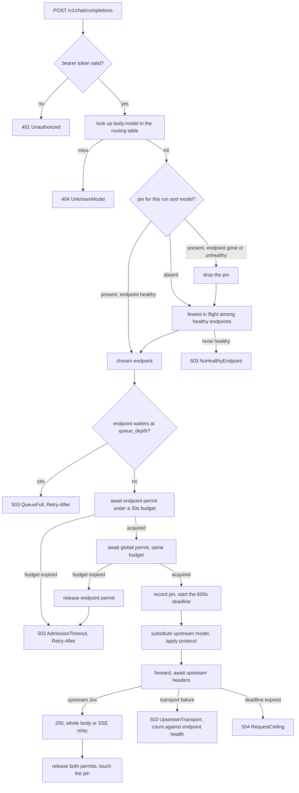

<!-- STATUS: crate doc - promptforge-gateway (service) - see design.md for the system -->

# `promptforge-gateway`: the service that talks to LLM backends

## Scope

This crate is one always-on service process. It accepts OpenAI-shaped chat completion requests over HTTP, resolves the request's model name to a configured backend, holds the credential that backend needs, admits the request against a concurrency budget shared by every process on the machine, forwards it, and relays the answer back. It is the box labelled `promptforge-gateway` in the system diagram, and it is the only box with an edge to an LLM backend.

It is the single process that talks to LLM backends, which is what makes the budget hold across Talktron, `promptforge-mcp`, and anything built later. Tension: one point of failure for every LLM consumer at once, and a credential lives here while the search API key lives in `prompts.toml`, so there are two places to look for a secret.

What it does not do, and cannot be made to do without a change to this document:

- Expose an MCP surface of any kind. Not a tool, not a prompt, not a resource. MCP exists to cross a process boundary and the gateway's work crosses none.
- Read a prompt, parse markdown, resolve a slot, evaluate Lua, or know what a prompt is. It receives an assembled message array.
- Touch storage. No database, no filesystem write beyond its own log file.
- Hold a non-LLM credential. The search API key and every other non-LLM secret live in `prompts.toml`, because the gateway has no reason to see them.
- Know what a run is. `X-PromptForge-Run` is an opaque cache key, not a lifecycle.
- Authenticate per client, or attribute usage to one.
- Retry a failed upstream request, or fail over mid-response.
- Inspect, cache, or log message content. It rewrites the `model` field, for one protocol the envelope shape, and for a model carrying a pack the whole prompt serialization. Nothing else.
- Count tokens, enforce a token budget, or truncate a context.
- Decide which model a prompt uses. A slot resolves to a model name in `prompts.toml`; this crate only maps that name onto a backend.

The test of the boundary: a process with no relation to PromptForge - Talktron, a shell script with curl, any unmodified OpenAI SDK - gets correct routing, credentials, and admission by changing one base URL, and never learns that prompts exist.

## Crate shape

A binary crate with a thin library target, so integration tests and the fake backend link the same code the service runs. Types below are `promptforge_gateway::Type`.

The wire structs are defined here and defined again in `promptforge`, which owns `GatewayClient`. That duplication is deliberate. The authority for the schema is the OpenAI chat completions specification, not a Rust struct: Talktron reaches this service through the Python SDK and a shared crate would not help it. Two independent definitions against a public contract also mean a change on one side cannot silently pass a type check on the other. Tension: two definitions of one shape to keep in step, which is what the end-to-end test driving this service with the core's client exists to catch.

## HTTP surface

Five routes. `axum` on `hyper`, HTTP/1.1 and HTTP/2, keep-alive on.

| Route | Auth | Purpose |
|---|---|---|
| `POST /v1/chat/completions` | yes | The only route that reaches a backend |
| `GET /v1/models` | yes | The routing table's model names, OpenAI list shape |
| `GET /health` | no | Liveness for a service supervisor |
| `GET /metrics` | yes | Prometheus text exposition |
| `GET /status` | yes | JSON snapshot of permits, queues, pins, config generation |

`/health` takes no token because a supervisor probe should not need a secret. `/metrics` and `/status` do, because they name endpoints and models. `/v1/*` checks `Authorization: Bearer` against `server.token` in constant time, and a missing or wrong token is 401 with no detail. That token is the same shared secret `promptforge-mcp` checks, settled rather than assumed: the gateway's check is defence in depth behind the production firewall, not a separate trust boundary, so a second string to rotate would buy nothing and add a way to be half-configured. Tension: one leaked string reaches both the prompt surface and the model credentials.

### `POST /v1/chat/completions`

```rust
#[derive(Deserialize, Serialize)]
pub struct ChatRequest {
    pub model: String,
    pub messages: Vec<Message>,
    #[serde(default, skip_serializing_if = "Option::is_none")] pub tools: Option<Vec<ToolSpec>>,
    #[serde(default, skip_serializing_if = "Option::is_none")] pub tool_choice: Option<Value>,
    #[serde(default, skip_serializing_if = "Option::is_none")] pub temperature: Option<f32>,
    #[serde(default, skip_serializing_if = "Option::is_none")] pub top_p: Option<f32>,
    #[serde(default, skip_serializing_if = "Option::is_none")] pub max_tokens: Option<u32>,
    #[serde(default, skip_serializing_if = "Option::is_none")] pub stop: Option<Value>,
    #[serde(default, skip_serializing_if = "Option::is_none")] pub seed: Option<u64>,
    #[serde(default, skip_serializing_if = "Option::is_none")] pub response_format: Option<Value>,
    #[serde(default)] pub stream: bool,
    #[serde(default, skip_serializing_if = "Option::is_none")] pub stream_options: Option<StreamOptions>,
    /// Every field the gateway does not name, preserved verbatim.
    #[serde(flatten)] pub rest: Map<String, Value>,
}

#[derive(Deserialize, Serialize)]
pub struct Message {
    pub role: Role,
    #[serde(default, skip_serializing_if = "Option::is_none")] pub content: Option<Value>,
    #[serde(default, skip_serializing_if = "Option::is_none")] pub name: Option<String>,
    #[serde(default, skip_serializing_if = "Option::is_none")] pub tool_calls: Option<Vec<ToolCall>>,
    #[serde(default, skip_serializing_if = "Option::is_none")] pub tool_call_id: Option<String>,
}

#[derive(Deserialize, Serialize)]
#[serde(rename_all = "lowercase")]
pub enum Role { System, Developer, User, Assistant, Tool }

#[derive(Deserialize, Serialize)]
pub struct StreamOptions { #[serde(default)] pub include_usage: bool }
```

The gateway names only the fields it needs and carries the rest in a flattened map, so a new upstream sampling parameter reaches the backend without a gateway release. The rejected alternative was forwarding raw bytes with `model` patched by string surgery: cheaper, but it forecloses protocol translation and makes the 400 boundary fuzzy, since a malformed body would then surface as an opaque upstream 4xx. Tension: a misspelled field passes through and produces the backend's error rather than ours.

The response is the OpenAI shape, with one substitution.

```rust
#[derive(Deserialize, Serialize)]
pub struct ChatResponse {
    pub id: String,
    pub object: String,          // "chat.completion"
    pub created: u64,
    /// Rewritten to the name the caller asked for, never the upstream name.
    pub model: String,
    pub choices: Vec<Choice>,
    #[serde(default, skip_serializing_if = "Option::is_none")] pub usage: Option<Usage>,
    #[serde(flatten)] pub rest: Map<String, Value>,
}

#[derive(Deserialize, Serialize)]
pub struct Choice {
    pub index: u32,
    #[serde(default, skip_serializing_if = "Option::is_none")] pub message: Option<Message>,
    #[serde(default, skip_serializing_if = "Option::is_none")] pub delta: Option<Message>,
    #[serde(default, skip_serializing_if = "Option::is_none")] pub finish_reason: Option<FinishReason>,
}

#[derive(Deserialize, Serialize)]
#[serde(rename_all = "snake_case")]
pub enum FinishReason { Stop, Length, ToolCalls, ContentFilter }

#[derive(Deserialize, Serialize)]
pub struct Usage { pub prompt_tokens: u32, pub completion_tokens: u32, pub total_tokens: u32 }
```

`model` on the way out is the caller's name, so a client that echoes it back into its next request gets a string that still routes. Every response also carries `X-PromptForge-Endpoint` naming the endpoint that served it and `X-PromptForge-Queued-Ms` reporting admission wait, which is how a caller confirms a pin held without the gateway growing a run concept.

### Streaming

`stream: true` yields `Content-Type: text/event-stream`, one `data: ` line per `chat.completion.chunk` object, a blank line between events, and a terminal `data: [DONE]`. The gateway relays each upstream event after translation and never coalesces, buffers, or re-frames.

The ordering rule that makes this safe: nothing is written to the client until the upstream response headers have arrived and been accepted. Admission finishes first, the upstream exchange starts, its status is mapped, and only then does the gateway emit 200 and begin relaying. A refusal is therefore always an HTTP status with a body a client can parse, never a broken stream. Tension: once relaying has begun a later failure has no status code left, so a mid-stream fault is a final SSE event with an `error` object followed by a close, and a client must treat a stream that ends without `[DONE]` as a failure.

That event is the error envelope from the Errors section, on one `data:` line, followed by the close and no `[DONE]`:

```
data: {"error":{"message":"upstream pod-reasoning-a timed out","type":"server_error","code":"upstream_timeout"}}

```

An object carrying an `error` key rather than a named `event: error` line, because that is the shape the OpenAI SDKs already detect: the Python client's stream decoder raises its own error type when a chunk's JSON has an `error` key, while a named event it does not recognise is dropped silently and the stream just ends. The `type` and `code` are the pair the whole-response mapping would have produced for that same `GatewayError` variant, so a caller reads one vocabulary whether the failure arrived as a status or as a chunk. The span still records the variant in `outcome` and the request still counts against the endpoint's failure threshold where the whole-response path would have counted it, because relaying beginning is not the request succeeding. Tension: the response was committed as 200 before the fault, so a client that logs status codes and ignores chunk contents records a success, which is why the missing `[DONE]` is a normative signal and not a convention.

`stream_idle_secs` is unset by default, and unset means no idle timeout at all: once the upstream's headers have been accepted, the relay is bounded only by the 600 s request ceiling, which ends it wherever it has got to and emits the failure event above with `code` `request_ceiling`. Setting it arms a per-gap timer, reset on every relayed event, that ends the stream with `UpstreamTimeout` when one gap exceeds it. Unset is the default because a legitimate gap is long and hard to bound in advance - measured TTFT at 28k context and concurrency 16 is roughly 117 s, and a large tool-call argument accumulates across many `input_json_delta` events - so a value set by guess kills real work while a value set by measurement is per-deployment. Tension: an upstream that holds the socket open and sends nothing then occupies a permit for the full 600 s rather than being caught in seconds.

`stream_options.include_usage` passes through untouched. When the upstream sends a final usage chunk the gateway reads it to populate token counters; when it does not, those counters record zero for that request rather than an estimate, because the gateway does not tokenize.

```rust
pub enum Relay {
    Whole(ChatResponse),
    Stream(BoxStream<'static, Result<sse::Event, GatewayError>>),
}
```

The `Admission` guard is moved into the stream, so permits are held for exactly the life of the response and released when the stream is dropped. A client that disconnects mid-stream drops the stream, which drops the guard, which frees the permit and aborts the upstream request. This is the crate's most important leak surface and RAII is the whole mitigation.

### The run pin header

A caller communicates a pin with a request header.

```
X-PromptForge-Run: 9f2c1e7a-4b83-4f10-9f1e-2d47c0b6a5e1
```

A header rather than a body field, for four reasons. The body must stay a valid OpenAI chat completions body so an unmodified SDK works: Talktron uses the Python `openai` client, and a non-standard body field forces either a hand-built body or `extra_body`, both of which break the moment anything validates the schema strictly. Every OpenAI SDK exposes per-request and per-client headers, so a pin costs one line of client configuration. Admission needs the pin before it decides anything, and a header is readable without buffering or parsing the body. A header also survives an intervening proxy and appears in access logs.

The value is opaque. The gateway does not parse it as a UUID, does not validate its provenance, and attaches no meaning to it beyond equality, which is what keeps the gateway free of a run concept. Accepted: up to 128 bytes of printable ASCII. A longer or malformed value is ignored with a warning and the request proceeds unpinned, because a pin is a cache hint and refusing a request over a cache hint would be wrong. An absent header means no pin.

The `X-` prefix is chosen against RFC 6648's advice, for recognisability and because an unprefixed vendor name risks colliding with a future standard header.

### `GET /health`

```json
{
  "status": "serving",
  "generation": 7,
  "uptime_secs": 91233,
  "endpoints": [
    { "name": "pod-reasoning-a", "state": "up", "inflight": 3, "waiting": 0 },
    { "name": "host-gpu", "state": "down", "inflight": 0, "waiting": 0 }
  ]
}
```

200 whenever the process is serving, and 503 only while shutting down. It deliberately does not fail because a backend is unreachable: a supervisor cannot fix an unreachable pod by restarting the gateway, and a restart would discard the queue and every pin. It contacts no backend; endpoint state is what request outcomes last reported.

`GET /status` returns the same document plus per-endpoint permit counts, refusal totals, pin count, and the loaded model list. `GET /metrics` is Prometheus text.

The `/status` document in full, on the production profile:

```json
{
  "status": "serving",
  "generation": 7,
  "uptime_secs": 91233,
  "global": { "inflight": 5, "limit": 16 },
  "pins": { "count": 312, "max": 4096 },
  "endpoints": [
    {
      "name": "pod-reasoning-a",
      "state": "up",
      "inflight": 3,
      "waiting": 0,
      "inflight_limit": 8,
      "queue_depth": 16,
      "refusals": { "queue_full": 12, "admission_timeout": 4, "no_healthy_endpoint": 0, "shutting_down": 0 }
    },
    {
      "name": "host-gpu",
      "state": "down",
      "inflight": 0,
      "waiting": 0,
      "inflight_limit": 8,
      "queue_depth": 16,
      "refusals": { "queue_full": 0, "admission_timeout": 0, "no_healthy_endpoint": 7, "shutting_down": 0 }
    }
  ],
  "models": [
    { "name": "reasoning-large", "upstream": "Qwen/Qwen3-235B-A22B-Instruct-FP8",
      "endpoints": ["pod-reasoning-a", "pod-reasoning-b"], "default_max_tokens": null },
    { "name": "extract-small", "upstream": "Qwen/Qwen3-8B-Instruct",
      "endpoints": ["host-gpu"], "default_max_tokens": null },
    { "name": "claude-sonnet-4", "upstream": "claude-sonnet-4-20250514",
      "endpoints": ["anthropic"], "default_max_tokens": 8192 }
  ]
}
```

The first three keys and the `name`, `state`, `inflight`, and `waiting` fields are exactly `/health`, so one parser reads both and a supervisor that graduates to the authenticated route learns no new shape. `inflight_limit` and `queue_depth` are the configured caps rather than live counts, which is what makes `inflight` and `waiting` interpretable without reading the configuration file next to the answer. `refusals` carries the same four reasons and the same per-endpoint labelling as `pf_gateway_refusals_total`, cumulative since process start and never reset by a reload, so `/status` and `/metrics` cannot disagree about a refusal. `models` is the loaded routing table, which is how an operator answers "did my reload take" when the generation number alone only says that something changed.

No credential appears here and none can: `Secret` has no `Serialize`, so `server.token` and every `api_key` are unrepresentable rather than merely omitted. `base_url` is left out too, because an endpoint is named by its configuration `name` everywhere else in this crate. Tension: `/status` therefore cannot diagnose a wrong `base_url`, and that stays a log-reading job.

`server.max_body_bytes` defaults to 8 MiB and returns 413 above it. A 28k-token prompt is roughly 112 KiB and a 128k-token prompt roughly 500 KiB, so the default is generous by an order of magnitude and still bounds a hostile body.

## Model routing

Resolution is one exact string lookup. The request's `model` is matched against the `name` of a `[[model]]` entry; a miss is 404. There is no prefix matching, no regex, no alias chain, and no default model, because every one of those turns a typo into a silent charge against the wrong backend.

```rust
pub struct EndpointId(String);

pub struct Model {
    pub name: String,
    /// The string the backend knows this model by. Substituted into the outgoing body.
    pub upstream: String,
    pub endpoints: Vec<Arc<Endpoint>>,
    pub default_max_tokens: Option<u32>,
}

pub struct Routing {
    pub generation: u64,
    models: HashMap<String, Arc<Model>>,
    endpoints: HashMap<EndpointId, Arc<Endpoint>>,
}

impl Routing {
    pub fn model(&self, name: &str) -> Result<&Arc<Model>, GatewayError>;
    pub fn endpoint(&self, id: &EndpointId) -> Option<&Arc<Endpoint>>;
    /// Fewest in flight among healthy endpoints of this model. Ties break by config order.
    pub fn select(&self, model: &Model) -> Result<Arc<Endpoint>, GatewayError>;
}
```

The routing table lives behind `arc_swap::ArcSwap<Routing>`, so the hot path reads it without a lock and a reload is a pointer store.

A model name is any string the deployment chooses. Naming it after a vendor model, as the core doc's `claude-sonnet-4` example does, is right when both environments genuinely reach that vendor. Naming it by capability, `reasoning-large`, is what lets the same name resolve to an Anthropic key in development and a pair of RunPod pods in production, and that indirection is the mechanism that makes prompts deployment-agnostic. All endpoints of one model serve it under one `upstream` string; a provider that spells the model differently gets its own model entry.

### Two wire protocols

An endpoint declares `protocol = "openai"` or `protocol = "anthropic"`. Anything else is a new enum variant and a code change, not a configuration line.

```rust
#[derive(Deserialize, Clone, Copy, PartialEq)]
#[serde(rename_all = "lowercase")]
pub enum Protocol { OpenAi, Anthropic }

pub trait Upstream: Send + Sync {
    fn build(&self, req: &ChatRequest, model: &Model, key: &Secret) -> Result<reqwest::Request, GatewayError>;
    fn whole(&self, body: Bytes, requested: &str) -> Result<ChatResponse, GatewayError>;
    fn stream(&self, upstream: ByteStream, requested: String) -> BoxStream<'static, Result<sse::Event, GatewayError>>;
}
```

`OpenAi` substitutes `upstream` for `model`, sets `Authorization: Bearer`, posts to `{base_url}/chat/completions`, and relays events through unchanged.

`Anthropic` translates, and the translation is enumerated here because it is the least obvious code in the crate:

- Path `{base_url}/v1/messages`; headers `x-api-key` and `anthropic-version: 2023-06-01` rather than `Authorization`.
- Leading `system` and `developer` messages hoist out of `messages` into the top-level `system` field.
- `max_tokens` is required upstream, so a caller that omits it gets the model entry's `default_max_tokens`, and a model on an `anthropic` endpoint without that field fails config validation.
- Tools convert from `{ type: "function", function: { name, description, parameters } }` to `{ name, description, input_schema }`.
- `tool_use` content blocks become `tool_calls`; a `role: "tool"` message becomes a `tool_result` block inside a user message.
- Stop reasons map `end_turn` to `stop`, `max_tokens` to `length`, `tool_use` to `tool_calls`.
- Usage maps `input_tokens` and `output_tokens` onto `prompt_tokens` and `completion_tokens`.
- The stream translator is stateful: named events (`message_start`, `content_block_delta`, `message_delta`, `message_stop`) become synthesised `chat.completion.chunk` objects sharing the `id` taken from `message_start`, and partial tool-call JSON accumulates across `input_json_delta` events.

Tension: the Anthropic shim is the most intricate code here and the part least described by the OpenAI specification it is translating into, so it carries the largest share of the test suite for the least architectural weight.

A third `Upstream` implementation exists for a model carrying a pack, which posts raw text to `/completions` rather than translating one chat protocol into another. It is selected by the model rather than by the endpoint, for a reason given under `Model packs`, and an endpoint serving a packed model still declares `protocol = "openai"`.

## Admission control



### Structures

```rust
pub struct Endpoint {
    pub id: EndpointId,
    pub cfg: EndpointConfig,
    permits: Semaphore,          // cfg.inflight
    inflight: AtomicU32,
    waiting: AtomicU32,
    health: Health,
    cancel: CancellationToken,   // fired only by a drain deadline
    http: reqwest::Client,       // pool_max_idle_per_host = cfg.inflight
}

pub struct Budget {
    sem: Arc<Semaphore>,         // limits.global_inflight
    inflight: AtomicU32,
}

/// Held for exactly the life of one admitted request, including its stream.
pub struct Admission {
    endpoint: Arc<Endpoint>,
    _ep_permit: OwnedSemaphorePermit,
    _global_permit: OwnedSemaphorePermit,
    pub admitted_at: Instant,
    pub queued: Duration,
}

impl Admission {
    pub async fn acquire(
        endpoint: Arc<Endpoint>,
        global: Arc<Budget>,
        wait: Duration,
    ) -> Result<Self, GatewayError>;

    pub fn deadline(&self, ceiling: Duration) -> Instant { self.admitted_at + ceiling }
}
```

`Drop for Admission` decrements both in-flight gauges and returns both permits. Every early return between acquisition and response construction therefore frees the budget without an explicit release path.

### The numbers, and where each comes from

- **Per-endpoint in flight: 8**, tunable 4 to 16 through `endpoint.inflight`. An endpoint is one backend entry, which is one vLLM process, which is what the cap protects.
- **Global in flight: 16** across every endpoint, below the naive sum of four endpoints times eight. This bounds blast radius and local socket pressure; it protects no individual GPU, since endpoints are separate pods.
- **Admission wait: 30 s**, then 503 with `Retry-After`.
- **Immediate refusal at per-endpoint queue depth 16**, twice the in-flight cap, with no wait at all. Past that depth the 30 s budget is arithmetically unreachable, so waiting only wastes a socket.
- **Request ceiling: 600 s**, matching RunPod's default execution timeout so the gateway and the platform expire together rather than the gateway holding a connection to a job the platform already killed. The clock starts at admission, not at arrival, because RunPod's clock starts when the pod begins work.

Eight is the knee, measured rather than guessed. On one H100 80GB SXM5 running `RedHatAI/Meta-Llama-3.1-70B-Instruct-FP8` under vLLM 0.19.1 with FlashAttention v3, FP8 KV cache, `max-num-seqs 64`, `max-model-len 32768`, `gpu-memory-utilization 0.95`, and prefix caching on, raising concurrency from 4 to 16 at 8k context moved throughput from 83.0 to 83.2 tokens per second, a gain of 0.2 percent, while P99 time to first token degraded from 4,607 ms to 40,113 ms, a factor of 8.7. A second provider reproduced it at 85.4 to 85.8 tokens per second and 4,637 ms to 40,280 ms, matching within 1.007x. At 28k context the same sweep reads 5,361 ms at concurrency 1, 42,752 ms at 4, and roughly 116,600 ms at 16. A sweep of `max-num-seqs` in 16, 64, 256 crossed with `max-num-batched-tokens` in 2048, 8192, 16384 crossed with chunked prefill on and off moved the boundary in 0 of 18 cells, which is why the fix is an admission cap and not a scheduler setting.

The 30 s figure is derived, not measured. One turn producing 4,000 output tokens holds a slot for roughly 45 to 60 s on a 27B FP8 model and 2 to 2.5 minutes on a 70B, against roofline floors of 32 s and 83 s. With eight slots each held that long, worst-case wait at queue depth 8 is a full slot-hold. Thirty seconds is about one 27B turn, so the rule reads "you may wait for at most one request ahead of you" and refuses the rest. That is the right trade when the caller is an agent loop that can back off, rather than a human watching a spinner.

Tension: a static request count ignores context length. Eight is right for 2k to 4k-token turns, but measured TTFT at 28k context was already 42.8 s at concurrency 4, so past roughly 28k tokens the same cap is about twice too generous, and only a token-budget admission rule fixes that properly.

Tension: first come first served at both layers forecloses fair share between processes, so one job's dozens of sequential turns can monopolise every slot. Per-client quotas would fix it, and per-client quotas need per-client identity, which the single shared bearer token does not provide.

Tension: a fourth process bursting turns during a long analysis will collect 503s, so every client must implement retry with backoff or a refusal becomes a job failure. The gateway does not retry on a client's behalf, because a retry that the gateway owns would hold the caller's connection through the backoff and defeat the point of refusing.

### Acquisition order

The endpoint permit is taken first, then the global permit, always in that order so no pair of requests can deadlock, and both waits share one 30 s budget. If the global wait expires, the endpoint permit is released before the 503 is written.

The order matters. A request holding a global permit while waiting on a busy endpoint denies an unrelated endpoint that has free capacity, because the global cap of 16 is the binding constraint once more than two endpoints are busy. A request holding an endpoint permit while waiting on the global cap only blocks requests to the endpoint it is already queued for, which are queued anyway. Tension: that request leaves one GPU slot idle while it waits, bounded by the 30 s budget.

`Semaphore` exposes no waiter count, so `waiting` is an explicit `AtomicU32` incremented by an RAII guard around the wait and read by the queue-depth check. That counter is the one the depth refusal and the `pf_gateway_queued` gauge both read.

### Why the gateway owns the queue

By elimination, not preference. In vLLM v0.26.0 the waiting queue is an unbounded `deque` in CPU memory with no length cap and no timeout, a fact RFC 18826 states in those words. Excess load is therefore accepted and silently converted into unbounded time to first token, with no 503, no `Retry-After`, and no way for a caller to distinguish "queued for five minutes" from "hung". If the gateway does not refuse, nothing refuses.

In-engine caps remain an open pull request, 49445, which adds `max-num-queued-reqs` and `max-num-queued-tokens`, was opened 2026-07-22, competes with at least two other pull requests for the same feature, and defaults both flags to disabled. It also only rejects and never waits, so a wait-then-refuse rule still has to live somewhere. Its choice of 503 over 429 is the one adopted here, for the reason its author gives: 429 implies the client is misbehaving, while 503 correctly signals server-side overload. The vLLM maintainers point at a router or proxy watching `/metrics` as the intended place for admission, which is this crate.

Pods launch with `max-num-seqs` set to 16, twice the gateway's per-endpoint cap, so the gateway is always the tighter constraint and the queue always forms where it can be counted and timed out. When the in-engine caps merge they become a second line of defence behind this one, not a replacement.

## Endpoint pinning

Every turn of a run goes to the same endpoint, so the run's shared section prefix stays in that pod's prefix cache. This matters because the traffic is the maximum-value case for prefix caching: each turn's prompt is the previous turn's prompt plus one exchange, and a fixed prefix has been reported to move TTFT p50 from 480 ms to 110 ms at a 94 percent hit rate. Prefix caching helps prefill and not decode, so the win is real but bounded.

```rust
#[derive(Hash, Eq, PartialEq, Clone)]
pub struct RunToken(String);      // opaque, up to 128 printable ASCII bytes

#[derive(Hash, Eq, PartialEq, Clone)]
pub struct PinKey { pub run: RunToken, pub model: String }

pub struct PinEntry { pub endpoint: EndpointId, pub last_used: Instant }

pub struct PinTable {
    inner: DashMap<PinKey, PinEntry>,
    max: usize,
}

impl PinTable {
    pub fn get(&self, key: &PinKey) -> Option<EndpointId>;
    /// Inserts or refreshes. Evicts the least recently used entry at capacity.
    pub fn set(&self, key: PinKey, endpoint: EndpointId);
    pub fn touch(&self, key: &PinKey);
    /// Removes entries idle longer than `idle`. Returns the count removed.
    pub fn sweep(&self, idle: Duration) -> usize;
    pub fn len(&self) -> usize;
}
```

The key is the pair, not the run alone. A run whose prompt names two slots reaches two models, and forcing both onto one endpoint would be meaningless when they live on different pods. The system doc says a run's turns pin to one endpoint, singular, which reads naturally for the common case; the pair is the reading that survives a prompt using `fast` and `thinking` in the same run.

Lifetime and eviction: an entry is created on the first admitted request carrying the header for that model, refreshed on every subsequent one, and dropped when it has been idle longer than `limits.pin_idle_secs`, default 900. A sweep task runs every 60 s. At `limits.max_pins`, default 4096, an insert evicts the least recently used entry. There is no explicit release call, because a run lifecycle is exactly the concept the gateway must not hold, and 900 s of silence is a wide margin over the seconds-long gaps between sequential turns of a live run.

Losing a pin is a cache miss and never an error. The next turn re-pins, possibly elsewhere, and pays one prefill. Pinning is an optimisation with no correctness weight anywhere in the system, which is what makes eviction safe to do bluntly.

A pinned endpoint that becomes unavailable mid-run:

- **Removed by a config reload.** The pin's `EndpointId` no longer resolves. The pin is dropped lazily on that lookup and the request re-selects among the model's current endpoints. Nothing sweeps pins on reload.
- **Observed unhealthy.** Availability is inferred from request outcomes, never from an active probe: the gateway does not poll backend health, because a poll answers a question the next real request answers anyway. After `endpoint.failure_threshold` consecutive transport failures or upstream 5xx responses, default 3, the endpoint is marked down for `endpoint.cooldown_secs`, default 30, excluded from selection, and probed half-open by the first request after that. A pin naming a down endpoint is dropped and the request re-selects.
- **No healthy endpoint left for the model.** 503 `NoHealthyEndpoint` with `Retry-After`.
- **Saturated but healthy.** The request waits on the pinned endpoint rather than spilling to a sibling, because spilling on contention is exactly the case where the pin was worth having. Tension: this is the load-spreading conflict stated plainly - a run waits behind its own earlier turns while an idle replica of the same model sits unused, and under this cap the gateway cannot do both. Tension also: the pin forecloses spreading one run's load across replicas at all.

A request that fails after admission is not retried onto another endpoint. Mid-request failover would either replay a body the caller may not have wanted replayed or restart a stream already partly delivered, and the system's recovery rule is that a failed run is discarded and rerun from the start.

## Model packs

A model pack is an optional module owning one model family's prompt serialization and output parsing, named by a `pack` field on a `[[model]]` entry. Present, the gateway renders the entire prompt itself and posts it to the backend's `/completions` route. Absent, nothing changes: the message array and the tools array go to `/chat/completions`, and the backend's chat template and tool-call parser own both directions, which is what every model does today and what every model will keep doing until a pack is written for it.

Build the mechanism with no packs in it, then write the first pack for whichever model carries the most turns in production, which on the production profile is whatever `reasoning-large` resolves to. Confidence high that the seam is right, because the `Upstream` trait already is this abstraction and the Anthropic shim already proves it carries a stateful translation. Confidence medium that the payoff is worth the first pack, because no prefix-cache hit rate has been measured on this deployment and the argument below is derived rather than observed.

### A pack is the missing half of endpoint pinning

Pinning decides which pod a turn lands on. It does not decide what bytes that pod receives, and prefix caching pays only on the bytes.

The gain pinning chases is real and already recorded above: a fixed prefix has been reported to move TTFT p50 from 480 ms to 110 ms at a 94 percent hit rate. What that figure assumes is a prefix that repeats exactly. Prefix caching matches at 16-token block granularity, so one differing token in the first block invalidates every block after it, which is the difference between a 0.3 percent and an 87 percent hit rate depending on where a volatile field sits. [design-promptforge.md](design-promptforge.md) draws the rule that follows and states it as a design rule: keep the system prompt and tool schemas byte-for-byte static, and put volatile data at the tail.

That rule is currently unenforceable from inside this system. The gateway hands the backend a message array and a tools array; a Jinja2 template shipped in the model's own `tokenizer_config.json` decides the byte layout downstream of that, including whether tool schemas serialize in a stable key order, whether anything volatile is interpolated into the system preamble, and whether whitespace shifts between two vLLM releases. Nothing in this crate can assert on a prefix it never constructed, so the byte-stability rule is written down in one document and checked nowhere.

A pack is where it becomes checkable, because the prefix is then a string this crate produced and can hold to a golden file. Pinning and byte-stable prefixes are two halves of one optimisation and only one half is built; the pack is the other half. Tension: this argues the pack is necessary for the pin to pay, and it does not establish that the pin pays enough to be worth a pack, which only a measured hit rate on real traffic settles.

### Why the gateway, and not the core

Because the core has no edge to a backend. [design-core.md](design-core.md) holds a `GatewayClient` its caller constructed and states that talking to an LLM backend is not something it does. Every piece of knowledge about a backend's dialect already lives in this crate, and the `Upstream` trait is already the place that knowledge goes.

A pack is a third `Upstream` implementation, and the only one translating below the chat-completions layer rather than across to a second chat API. Anthropic translates one chat protocol into another; a pack translates a chat protocol into raw text. The trait carries both without a new concept.

Placing it here also means Talktron gets it by changing nothing. Talktron reaches this service through the Python `openai` client and learns only a base URL, so a pack under the gateway benefits every consumer at once, which a pack inside the core library would not.

The `Scope` section is amended by this and the amendment is stated rather than implied: the gateway rewrites the `model` field, for one protocol the envelope shape, and for a model with a pack the whole prompt serialization. It still does not inspect message content for its own purposes, cache it, or log it, and the redaction rule in `Observability` is unchanged.

### The trait

```rust
/// One model family's prompt serialization and output parsing.
///
/// A pack owns exactly the two directions a chat template and a tool-call parser
/// own upstream, and nothing else. It sees no credential, no endpoint, and no run
/// token, so it is a pure function of the request. That is what makes its prefix
/// golden-testable, which is the whole reason the trait exists.
pub trait Pack: Send + Sync {
    /// Matched against `model.pack` at config load.
    fn name(&self) -> &'static str;

    /// Serialize the request into the one raw prompt string the model sees.
    ///
    /// Reads `messages`, `tools`, and `tool_choice`, and no sampling field. The
    /// system message and the tool schemas are rendered first and must be
    /// byte-identical for byte-identical input, because that prefix is what the
    /// pinned pod caches. Tool schemas serialize in a canonical key order here,
    /// since a map iteration order that varies by run defeats the entire point.
    fn render(&self, req: &ChatRequest) -> Result<String, PackError>;

    /// Sent as `stop` on the outgoing request.
    fn stop(&self) -> &[&str];

    /// Parse one completion's text into an assistant message.
    ///
    /// A tool call the pack cannot parse is a `PackError` and never an empty
    /// `tool_calls` list, because a silent absence of tool calls is the failure
    /// this trait exists to remove.
    fn parse(&self, text: &str, finish: FinishReason) -> Result<Message, PackError>;
}

/// The `Upstream` a packed model routes through. `build` posts the rendered
/// prompt and the pack's stop sequences to `{base_url}/completions`; `whole`
/// lifts the raw text back through `parse` into the ordinary `ChatResponse`
/// every caller already receives.
pub struct PackUpstream(Arc<dyn Pack>);
```

The registry is a `HashMap<&'static str, Arc<dyn Pack>>` built at startup from the packs the binary linked, and a `pack` name it cannot answer is a config failure rather than a first-request failure. Packs are linked, not loaded, for the reason [design.md](design.md) gives for extensions generally: Rust has no stable ABI and dead-code elimination silently drops registrations.

A caller cannot tell which path served it. The response is the same `ChatResponse`, `model` is rewritten to the caller's name as always, and `X-PromptForge-Endpoint` still names the endpoint. Tension: that opacity is deliberate and it means a pack regression looks like a model regression from outside, so the pack name is recorded on the span to make the two separable in a log.

### Route selection, and the rejected protocol variant

The route is derived: a model with a pack goes to `/completions`, and a model without one goes to `/chat/completions`. The endpoint keeps `protocol = "openai"` either way.

A `Protocol::Completions` variant was specified and rejected. It would have made the pairing fully checkable at boot, since a packed model's endpoints must speak raw completions and a raw-completions endpoint's models must all be packed, and both directions are static. It fails on the admission budget. One `[[endpoint]]` entry is one vLLM process and one semaphore, which is what the per-endpoint cap protects; a pod serving both routes would then need two endpoint entries against one `base_url`, giving one GPU two independent eight-permit semaphores and sixteen requests in flight where the cap says eight. Silently doubling the budget to gain a boot check is the wrong trade, so the protocol stays a property of the endpoint and the route stays derived from the model.

The cost of that choice is one case configuration cannot reject. Whether a `base_url` serves `/completions` at all is not knowable from the file, so a pack aimed at a hosted frontier endpoint fails on its first request rather than at boot. `validate` catches the case it can, a pack on a model whose endpoints include an `anthropic` one, and the rest is a 404 from the backend surfacing as `upstream_client_error`.

### Streaming a packed model synthesises the stream

`parse` needs the whole completion, so a packed model cannot relay incremental chunks. `stream: true` against one is served by performing a whole upstream request and synthesising a well-formed stream from the result: one content chunk, one chunk carrying any tool calls, one finish chunk, and the terminal `[DONE]`. An unmodified SDK asking for a stream gets a stream, and the ordering rule in `Streaming` holds unchanged, since nothing is written until the upstream response has arrived and been accepted.

What the caller loses is incremental delivery, which is latency and not correctness. It matters in exactly one place: Talktron speaks a voice response sentence by sentence, and a synthesised stream arrives all at once at the end. The resolution is that the voice path's model simply carries no pack, which costs nothing because a pack is opt-in per model and the pack's own benefits are aimed at long prefix-dominated agent traffic rather than at a single conversational turn. Tension: that leaves the two consumers on different paths for good reasons, so a deployment can no longer assume one model serves both well, and an incremental parser is the only thing that would close it. It is listed under `Open`.

### What a pack costs

A pack duplicates work the backend already does, and the duplication is the honest objection. The standing obligation is tracking the chat template in each packed model's `tokenizer_config.json` and the matching tool parser in vLLM against the pack that mirrors them. That work is bounded by the number of packed models rather than by the model zoo, it is a diff review rather than an open-ended design task, and at two or three packs it is small.

The failure mode it introduces is the part worth writing down, because it is the hardest class to notice. A pack that has drifted from the format its model was trained on does not error. It renders a prompt the model still answers, slightly worse, and the symptom is a quality regression with no failing test and no log line. The golden prefix test protects byte stability and catches nothing about correctness of format, and no assertion available here distinguishes a subtly wrong delimiter from a subtly worse model. Tension: the mechanism trades a silent-no-tool-calls failure, which a parse error now makes loud, for a silent-slightly-wrong-prompt failure, which nothing here makes loud at all.

That trade is still the right one, because the first failure is unbounded and undetectable from outside while the second is bounded by a diff a human or an agent reads on a known schedule. Confidence medium, on the strength of the reasoning rather than on any measurement, and the thing that would move it either way is a held-out quality check per packed model rather than a better test of the renderer.

## `gateway.toml`

One file, `deny_unknown_fields` on every struct, so a misspelled limit is a boot failure rather than a setting silently ignored. Tension: adding a field is then a breaking change for anyone who set an unrecognised one early.

```rust
#[derive(Deserialize)]
#[serde(deny_unknown_fields)]
pub struct Config {
    pub server: ServerConfig,
    pub limits: LimitsConfig,
    pub log: LogConfig,
    #[serde(rename = "endpoint")] pub endpoints: Vec<EndpointConfig>,
    #[serde(rename = "model")] pub models: Vec<ModelConfig>,
}

#[derive(Deserialize)]
#[serde(deny_unknown_fields)]
pub struct ServerConfig {
    /// No default. A network interface, never loopback: Cursor connects from a
    /// workstation and Talktron from its own process, so a guessed default would
    /// either bind loopback and break both or bind every interface silently.
    pub bind: SocketAddr,
    /// The same shared secret `promptforge-mcp` checks, compared in constant time.
    pub token: Secret,
    /// Defaults to 8388608, 8 MiB. A 28k-token prompt is roughly 112 KiB and a
    /// 128k-token prompt roughly 500 KiB, so this is an order of magnitude of
    /// headroom over the largest legitimate body and still bounds a hostile one.
    #[serde(default = "d_max_body")] pub max_body_bytes: usize,     // 8388608
}

#[derive(Deserialize)]
#[serde(deny_unknown_fields)]
pub struct LimitsConfig {
    /// Defaults to 16, below the naive sum of four endpoints at eight each. It bounds
    /// blast radius and local socket pressure and protects no individual GPU, since
    /// endpoints are separate pods. Resized in place on reload, never replaced.
    #[serde(default = "d_global_inflight")] pub global_inflight: u32,    // 16
    /// Defaults to 30, roughly one 27B turn: 4,000 output tokens hold a slot for 45 to
    /// 60 s there, so the rule reads "you may wait for at most one request ahead of
    /// you" and refuses the rest. Also the value of every `Retry-After` the gateway
    /// generates, and the floor a client's own HTTP timeout must clear.
    #[serde(default = "d_admission_wait")] pub admission_wait_secs: u64, // 30
    /// Defaults to 600, RunPod's default execution timeout, so the gateway and the
    /// platform expire together rather than the gateway holding a connection to a job
    /// the platform already killed. Measured from admission, not from arrival.
    #[serde(default = "d_ceiling")] pub request_ceiling_secs: u64,       // 600
    /// Defaults to 900. Gaps between sequential turns of a live run are seconds, so
    /// this is a wide margin, and expiry costs one prefill rather than an error.
    #[serde(default = "d_pin_idle")] pub pin_idle_secs: u64,             // 900
    /// Defaults to 4096. At capacity an insert evicts the least recently used entry.
    #[serde(default = "d_max_pins")] pub max_pins: usize,                // 4096
    /// Defaults to 600, the request ceiling, because a stop that severs a request the
    /// gateway would otherwise have allowed to finish is the one failure mode a grace
    /// period exists to prevent, and no admitted request can outlive the ceiling. It is
    /// why the unit file sets `TimeoutStopSec=630`, 30 s of slack over this value. On
    /// Windows it exceeds the SCM's roughly 30 s patience by a factor of 20, so the
    /// service handler must report `SERVICE_STOP_PENDING` with a `wait_hint` covering
    /// this value and re-report inside every 30 s window or the SCM kills the drain.
    #[serde(default = "d_shutdown_grace")] pub shutdown_grace_secs: u64, // 600
}

#[derive(Deserialize)]
#[serde(deny_unknown_fields)]
pub struct LogConfig {
    /// No default. The two profiles write to `C:/ProgramData/PromptForge/logs` and
    /// `/var/log/promptforge`, and a guess that a service account cannot write is a
    /// service that starts and logs nowhere.
    pub dir: PathBuf,
    /// Defaults to "info", which is what both profiles set.
    #[serde(default = "d_level")] pub level: String,                // "info"
    /// Defaults to daily. A Windows service has no console, so this file is the only
    /// diagnostic on that platform and its rotation is not optional.
    #[serde(default = "d_rotation")] pub rotation: Rotation,        // Daily
    /// Defaults to 14, the development profile's value. Production sets 30, because an
    /// incident review reaches back further than a developer's morning does.
    #[serde(default = "d_retain")] pub retain_days: u16,            // 14
}

/// Mirrors `tracing-appender`'s rotation kinds, minus a minutely rotation nothing
/// here wants. Anything else is a new variant and a code change.
#[derive(Deserialize, Clone, Copy, PartialEq)]
#[serde(rename_all = "lowercase")]
pub enum Rotation { Hourly, Daily, Never }

#[derive(Deserialize, Clone, PartialEq)]
#[serde(deny_unknown_fields)]
pub struct EndpointConfig {
    pub name: String,
    pub protocol: Protocol,
    pub base_url: Url,
    pub api_key: Secret,
    #[serde(default = "d_inflight")] pub inflight: u32,             // 8
    #[serde(default = "d_queue_depth")] pub queue_depth: u32,       // 16
    #[serde(default = "d_connect")] pub connect_timeout_secs: u64,  // 10
    /// Defaults to 180. Measured TTFT at 28k context and concurrency 16 is roughly
    /// 117 s, so anything under 120 cuts off legitimate work; 180 clears that by
    /// half again and still detects a hung upstream well inside the 600 s ceiling.
    #[serde(default = "default_first_byte_timeout_secs")] pub first_byte_timeout_secs: u64,
    /// Unset by default, and unset means no idle timeout: an established stream is
    /// bounded only by the 600 s request ceiling. Set, it is the largest gap allowed
    /// between two relayed events before the stream ends with `UpstreamTimeout`.
    #[serde(default)] pub stream_idle_secs: Option<u64>,
    #[serde(default = "d_failures")] pub failure_threshold: u32,    // 3
    #[serde(default = "d_cooldown")] pub cooldown_secs: u64,        // 30
}

#[derive(Deserialize, Clone)]
#[serde(deny_unknown_fields)]
pub struct ModelConfig {
    /// The name a slot in `prompts.toml` resolves to, matched by one exact string
    /// lookup. It is the string that stays fixed across deployments while everything
    /// below it changes, which is the whole mechanism of this file.
    pub name: String,
    /// The string the backend knows this model by, substituted into the outgoing body
    /// and never returned to the caller. One per model: a provider that spells the
    /// model differently gets its own `[[model]]` entry rather than a second spelling.
    pub upstream: String,
    /// Endpoint names, all serving this model under the one `upstream` string. Ties in
    /// the fewest-in-flight selection break by this order. `validate` rejects an empty
    /// list and a name no `[[endpoint]]` defines.
    pub endpoints: Vec<String>,
    /// Supplied when a caller omits `max_tokens`, which Anthropic requires and OpenAI
    /// does not. A model on an `anthropic` endpoint without it fails config validation
    /// rather than its first request.
    #[serde(default)] pub default_max_tokens: Option<u32>,
    /// The pack owning this model's prompt serialization and output parsing, or absent
    /// to leave both to the backend's chat template and tool-call parser. Absent is the
    /// default and changes nothing about the request path, which is what makes a pack an
    /// optimisation a deployment opts into one model at a time.
    #[serde(default)] pub pack: Option<String>,
}

impl Config {
    pub fn load(path: &Path) -> Result<Self, ConfigError>;
    pub fn validate(&self) -> Result<(), ConfigError>;
}
```

`validate` rejects: a duplicate endpoint or model name; a model naming an endpoint that is not defined; a model with an empty endpoint list; `queue_depth` below `inflight`; `admission_wait_secs` above `request_ceiling_secs`; a `${VAR}` that does not resolve; a model on an `anthropic` endpoint with no `default_max_tokens`, which would otherwise fail on its first request; a `pack` naming a pack no linked module answers to; and a `pack` on a model whose endpoints include an `anthropic` one, which serves no `/completions` route. An `inflight` outside 4 to 16 loads with a warning naming the measured knee, because the developer machine legitimately runs below it.

`PartialEq` on `EndpointConfig` is load-bearing: it is how a reload decides whether an endpoint's definition changed and therefore whether its semaphore is preserved.

### Development: everything on one machine

```toml
# gateway.toml - development profile.
# Frontier API keys for the large models, the developer's own card for the small ones.

[server]
bind = "0.0.0.0:8081"              # a network interface, never loopback: Cursor connects
                                   # from a workstation and Talktron from its own process
token = "${PROMPTFORGE_TOKEN}"     # the same shared secret promptforge-mcp checks
max_body_bytes = 8388608           # 8 MiB; a 128k-token prompt is roughly 500 KiB

[limits]
global_inflight = 16               # in flight across every endpoint at once
admission_wait_secs = 30           # wait this long for a permit, then 503 with Retry-After
request_ceiling_secs = 600         # RunPod's execution timeout; nothing runs longer
pin_idle_secs = 900                # a run's pin expires after this much silence
max_pins = 4096
shutdown_grace_secs = 600          # the request ceiling: a stop never severs a request
                                   # the gateway would have let run to completion

[log]
dir = "C:/ProgramData/PromptForge/logs"
level = "info"
rotation = "daily"
retain_days = 14

# One endpoint entry is one concrete servable thing. The per-endpoint cap protects it.

[[endpoint]]
name = "anthropic"
protocol = "anthropic"
base_url = "https://api.anthropic.com"
api_key = "${ANTHROPIC_API_KEY}"
inflight = 8
queue_depth = 16
connect_timeout_secs = 10

[[endpoint]]
name = "openai"
protocol = "openai"
base_url = "https://api.openai.com/v1"
api_key = "${OPENAI_API_KEY}"
inflight = 8
queue_depth = 16
connect_timeout_secs = 10

[[endpoint]]
name = "workstation-vllm"
protocol = "openai"
base_url = "http://127.0.0.1:8000/v1"   # vLLM on the developer's own card
api_key = ""                            # no credential wanted on a loopback pod
inflight = 4                            # one laptop-class card, so the low end of the range
queue_depth = 8
connect_timeout_secs = 2

# Models are the vocabulary prompts.toml maps slots onto.

[[model]]
name = "reasoning-large"
endpoints = ["anthropic"]
upstream = "claude-sonnet-4-6"
default_max_tokens = 8192          # anthropic requires it; supplied when the caller omits it

[[model]]
name = "extract-small"
endpoints = ["workstation-vllm"]
upstream = "Qwen/Qwen3-8B-Instruct"

[[model]]
name = "claude-sonnet-4"           # named after a vendor model, because it always is one
endpoints = ["anthropic"]
upstream = "claude-sonnet-4-20250514"
default_max_tokens = 8192
```

### Production: the Django host and its intranet

```toml
# gateway.toml - production profile.
# RunPod pods for the large models, the host GPU for the small ones.

[server]
bind = "10.0.4.12:8081"            # the intranet address; the firewall is the boundary
token = "${PROMPTFORGE_TOKEN}"
max_body_bytes = 8388608

[limits]
global_inflight = 16
admission_wait_secs = 30
request_ceiling_secs = 600
pin_idle_secs = 900
max_pins = 4096
shutdown_grace_secs = 600          # TimeoutStopSec below is 630, this plus 30 s of slack

[log]
dir = "/var/log/promptforge"
level = "info"
rotation = "daily"
retain_days = 30

[[endpoint]]
name = "pod-reasoning-a"
protocol = "openai"
base_url = "https://abc123-8000.proxy.runpod.net/v1"
api_key = "${RUNPOD_API_KEY}"
inflight = 8                       # the pod launches with max-num-seqs 16, so this is
queue_depth = 16                   # always the tighter constraint and the queue is ours
connect_timeout_secs = 10
first_byte_timeout_secs = 180      # measured TTFT at 28k context and concurrency 16 was
                                   # about 117 s, so anything under 120 s cuts off real work

[[endpoint]]
name = "pod-reasoning-b"           # a replica of the same model; pinning picks one per run
protocol = "openai"
base_url = "https://def456-8000.proxy.runpod.net/v1"
api_key = "${RUNPOD_API_KEY}"
inflight = 8
queue_depth = 16
connect_timeout_secs = 10
first_byte_timeout_secs = 180

[[endpoint]]
name = "host-gpu"
protocol = "openai"
base_url = "http://127.0.0.1:8000/v1"   # vLLM under MPS on the production card
api_key = ""
inflight = 8
queue_depth = 16
connect_timeout_secs = 2

[[endpoint]]
name = "anthropic"                 # still here, for the model that genuinely is Anthropic
protocol = "anthropic"
base_url = "https://api.anthropic.com"
api_key = "${ANTHROPIC_API_KEY}"
inflight = 8
queue_depth = 16
connect_timeout_secs = 10

[[model]]
name = "reasoning-large"           # SAME NAME as development, different resolution
endpoints = ["pod-reasoning-a", "pod-reasoning-b"]
upstream = "Qwen/Qwen3-235B-A22B-Instruct-FP8"
pack = "qwen3"                     # this model carries the most turns, so it earns the
                                   # first pack: routes to /completions, and the prefix
                                   # the pin keeps warm becomes ours to hold byte-stable

[[model]]
name = "extract-small"             # SAME NAME as development, different resolution
endpoints = ["host-gpu"]
upstream = "Qwen/Qwen3-8B-Instruct"

[[model]]
name = "claude-sonnet-4"           # resolves identically in both environments
endpoints = ["anthropic"]
upstream = "claude-sonnet-4-20250514"
default_max_tokens = 8192
```

`reasoning-large` is an Anthropic key in development and a pair of self-hosted Qwen pods in production, packed there and unpacked here. `extract-small` is a laptop card in one and the production card in the other. No prompt changed, no frontmatter changed, and no slot mapping in `prompts.toml` changed. That substitution, in this file and nowhere else, is the entire mechanism by which prompts are deployment-agnostic, and a pack living on one side of it is the clearest case of the mechanism working: the same prompt reaches a chat-template-rendered Anthropic model and a gateway-rendered Qwen pod without knowing either.

## Credentials

Keys come from `gateway.toml` string fields, and `${VAR}` in any string value is expanded from the process environment at load time. `$$` escapes a literal dollar sign. An unresolved variable fails the load, so a deployment that forgot to export a key never starts serving with a blank credential. During a hot reload an unresolved variable rejects the reload and the previous configuration keeps serving.

Interpolation is the only environment mechanism. There is no implicit pickup of `ANTHROPIC_API_KEY` or `OPENAI_API_KEY` from the ambient environment, because implicit pickup makes a deployment's effective credential invisible in its configuration and turns a leftover shell export into a live production key. Tension: a container that already passes secrets as environment variables still has to write the one-line reference.

```rust
#[derive(Clone, PartialEq, Eq, Deserialize)]
#[serde(from = "String")]
pub struct Secret(String);

impl Secret {
    /// The only accessor. Called at exactly one place per protocol, building the auth header.
    pub fn expose(&self) -> &str { &self.0 }
    pub fn is_empty(&self) -> bool { self.0.is_empty() }
}

impl fmt::Debug for Secret {
    fn fmt(&self, f: &mut fmt::Formatter<'_>) -> fmt::Result { f.write_str("Secret(redacted)") }
}

impl fmt::Display for Secret {
    fn fmt(&self, f: &mut fmt::Formatter<'_>) -> fmt::Result { f.write_str("redacted") }
}
```

`Secret` has no `Serialize`, so it cannot reach `/status`, a metrics label, or a JSON error body by accident. `Debug` and `Display` both redact, so a `tracing` field or a `{:?}` on `EndpointConfig` is safe. Errors and log lines name an endpoint by its configuration `name`, never by its URL, and any userinfo in a `base_url` is stripped before that URL is logged. An upstream error body is truncated to 2 KiB before it is relayed or logged, because a misconfigured backend can echo a request header.

On unix, a `gateway.toml` readable by group or other logs a warning at load naming the mode. The gateway does not refuse to start over it, since it cannot know the deployment's threat model.

## Hot reload and drain

A `notify` watcher on the configuration file's parent directory, filtered to that file name, debounced 500 ms through `notify-debouncer-full`. The directory rather than the file, because editors and deployment tools write a temporary file and rename over the target, which destroys the inode a file watch is bound to.

```rust
pub struct Reloader {
    path: PathBuf,
    routing: Arc<ArcSwap<Routing>>,
    global: Arc<Budget>,
    drains: Mutex<Vec<Drain>>,
}

impl Reloader {
    /// Parse, validate, build a new Routing reusing unchanged endpoints, swap it in,
    /// and start a drain for every endpoint the swap removed.
    pub async fn reload(&self) -> Result<u64, ConfigError>;
}
```

A reload that fails to parse or validate is logged with the file's path and the offending field, counted, and discarded. The running configuration is untouched. Serving never stops because a configuration file was saved mid-edit.

What the rebuild preserves: an endpoint whose `EndpointConfig` compares equal to its previous definition keeps its existing `Arc<Endpoint>`, and therefore its semaphore, its in-flight count, its waiter count, its health state, and its connection pool. Without that, every save would reset the budget and admit a burst equal to the cap. An endpoint whose definition changed becomes a new `Arc<Endpoint>` with a fresh semaphore, and the old one enters drain.

The drain is reference counting, not bookkeeping. An admitted request holds `Arc<Endpoint>` inside its `Admission` guard, so removing the endpoint from the routing table makes it unreachable to new requests while every in-flight request keeps it and its permits alive.

```rust
pub struct Drain {
    id: EndpointId,
    weak: Weak<Endpoint>,
    cancel: CancellationToken,
    deadline: Instant,       // started_at + limits.request_ceiling_secs
}
```

A supervisor task polls every drain every 10 s. When `weak.upgrade()` returns `None` the last request has finished, the endpoint is dropped, its connection pool closes, and the drain is removed. At the deadline, which is the 600 s request ceiling by construction, the task fires `cancel` and any request still running against the old endpoint ends with 504. Nothing waits longer than a request could legitimately take.

The three cases in the system doc fall out of that:

- **A new model** appears in the swapped table and is routable on the next request. No restart, no warm-up.
- **A changed backend** applies to new requests, which route to the new `Arc<Endpoint>`, while in-flight requests finish against the old one they still hold.
- **A removed model** disappears from the table, so the next lookup is a 404, while requests already admitted against it finish normally.

Tension: two live configurations during the drain window, so the same model name can be served by two different backends at once for up to 600 s, and a log reader has to use the generation number and endpoint name to tell which.

`global_inflight` is resized rather than replaced, because replacing it would lose every outstanding permit. An increase is one `add_permits`. A decrease cannot be immediate, since `forget_permits` only removes permits that are currently available:

```rust
async fn shrink(sem: Arc<Semaphore>, n: usize) {
    for _ in 0..n {
        if let Ok(p) = sem.acquire().await { p.forget(); }
    }
}
```

The shrink task competes for permits with real requests and forgets each one it wins, so the cap tightens as work drains. Tension: under saturation a decrease takes effect over the drain rather than at the reload, and the task is one more consumer of the permits it is trying to remove.

Pins survive a reload untouched. A pin naming an endpoint that no longer exists is dropped on its next lookup, and no sweep runs. `server.bind` cannot be changed live; a reload that changes it logs that a restart is required and applies everything else.

## Service installation

Both services install through `daemon-kit`, covering the Windows Service Control Manager, launchd, and systemd. Tension: three platform service paths to test.

The whole platform-independent body of the service is one function, and each platform path calls it.

```rust
pub struct Service { /* private */ }

impl Service {
    pub fn build(config: PathBuf) -> Result<Self, StartError>;
    /// Serves until `shutdown` is cancelled, then finishes in-flight requests.
    pub async fn run(self, shutdown: CancellationToken) -> Result<(), RunError>;
}

fn serve_blocking(config: PathBuf, shutdown: CancellationToken) -> Result<(), RunError> {
    let rt = tokio::runtime::Builder::new_multi_thread().enable_all().build()?;
    rt.block_on(Service::build(config)?.run(shutdown))
}
```

No `#[tokio::main]` anywhere in the crate. A Windows service entry point is called by the SCM on a thread the SCM owns, after `main` has already handed control to `service_dispatcher`, so the runtime has to be constructed inside the service handler. An attribute macro on `main` builds it in the wrong place and at the wrong time. The foreground path builds a runtime the same way, so there is exactly one construction site and the two paths cannot drift.

A Windows service has no console, so `stdout` and `stderr` go nowhere and are not a diagnostic. Logging is a rolling file through `tracing-appender`, sized and retained by `[log]`, on every platform rather than on Windows alone, so a log-reading procedure is identical across the three. On unix the same records also go to the journal or to `stderr` when running in the foreground.

Shutdown is a cancellation token in every case, feeding `axum::serve(..).with_graceful_shutdown(..)`. The listener stops accepting, queued waiters are released with 503, and admitted requests finish within `limits.shutdown_grace_secs`. On Windows this needs care: the SCM kills a service that does not report progress within roughly 30 s, so the handler reports `SERVICE_STOP_PENDING` with a `wait_hint` covering the grace period and re-reports periodically, or a long streaming response is severed at 30 s regardless of the grace setting.

Configuration path is explicit and positional, `promptforge-gateway serve /etc/promptforge/gateway.toml`, defaulting to the platform data directory. A Windows service account cannot read a developer's user profile, so a path relative to the home directory is not a usable default.

```ini
[Unit]
Description=PromptForge inference gateway
After=network-online.target

[Service]
Type=simple
ExecStart=/usr/local/bin/promptforge-gateway serve /etc/promptforge/gateway.toml
Environment=ANTHROPIC_API_KEY=
EnvironmentFile=/etc/promptforge/gateway.env
Restart=on-failure
KillSignal=SIGTERM
TimeoutStopSec=630
LimitNOFILE=8192

[Install]
WantedBy=multi-user.target
```

`TimeoutStopSec` exceeds the request ceiling, so systemd does not kill a drain the gateway is completing correctly. `LimitNOFILE` is generous because queued requests hold sockets: four endpoints at eight in flight plus sixteen queued is 96 held connections upstream and downstream before any slack.

## Errors

```rust
#[derive(Debug, thiserror::Error)]
pub enum GatewayError {
    #[error("unauthorized")]
    Unauthorized,                                                    // 401
    #[error("malformed request: {0}")]
    MalformedRequest(String),                                        // 400
    #[error("body exceeds {limit} bytes")]
    PayloadTooLarge { limit: usize },                                // 413
    #[error("unknown model {0}")]
    UnknownModel(String),                                            // 404
    #[error("no healthy endpoint for model {model}")]
    NoHealthyEndpoint { model: String },                             // 503 + Retry-After
    #[error("endpoint {endpoint} queue full at depth {depth}")]
    QueueFull { endpoint: EndpointId, depth: u32 },                  // 503 + Retry-After
    #[error("admission timed out on {endpoint} after {waited:?}")]
    AdmissionTimeout { endpoint: EndpointId, waited: Duration },     // 503 + Retry-After
    #[error("shutting down")]
    ShuttingDown,                                                    // 503 + Retry-After
    #[error("request exceeded the {ceiling:?} ceiling")]
    RequestCeiling { ceiling: Duration },                            // 504
    #[error("upstream {endpoint} timed out")]
    UpstreamTimeout { endpoint: EndpointId },                        // 504
    #[error("upstream {endpoint} transport failure: {source}")]
    UpstreamTransport { endpoint: EndpointId, source: reqwest::Error }, // 502
    #[error("upstream {endpoint} returned {status}")]
    UpstreamStatus { endpoint: EndpointId, status: StatusCode, body: String }, // see below
    #[error("could not translate {endpoint} protocol: {detail}")]
    Translation { endpoint: EndpointId, detail: String },             // 502
    #[error("pack {pack} could not render the request: {detail}")]
    PackRender { pack: &'static str, detail: String },                // 400
    #[error("pack {pack} could not parse the completion from {endpoint}: {detail}")]
    PackParse { pack: &'static str, endpoint: EndpointId, detail: String }, // 502
}
```

`UpstreamStatus` maps by class. A 4xx from the backend passes through with its own status and truncated body, because it is the caller's request that was wrong and a caller needs the original code to react. A 429 passes through with the upstream `Retry-After` preserved, since the backend knows its own recovery window better than the gateway does. A 5xx becomes 502, counts against the endpoint's failure threshold, and does not leak the backend's internal message beyond the 2 KiB truncation.

`PackParse` is the one 502 that does not count against endpoint health. The endpoint answered correctly and a module in this process could not read the answer, so cooling the endpoint down would take a healthy pod out of rotation over a defect that follows the pack to every other pod serving that model. Tension: a backend that has genuinely started emitting a different format is then indistinguishable from a stale pack, and neither trips the breaker.

Every error body is the OpenAI error envelope, so an unmodified SDK surfaces it as its own error type rather than as an unparseable blob:

```json
{ "error": { "message": "endpoint pod-reasoning-a queue full at depth 16",
             "type": "overloaded", "code": "queue_full" } }
```

`message` is the variant's `Display`, which is the `#[error]` string above and therefore already carries the endpoint, model, depth, or duration that made the error specific. `type` and `code` are fixed per variant:

| Variant | Status | `type` | `code` |
|---|---|---|---|
| `Unauthorized` | 401 | `authentication_error` | `unauthorized` |
| `MalformedRequest` | 400 | `invalid_request_error` | `malformed_request` |
| `PayloadTooLarge` | 413 | `invalid_request_error` | `payload_too_large` |
| `UnknownModel` | 404 | `invalid_request_error` | `model_not_found` |
| `NoHealthyEndpoint` | 503 | `overloaded` | `no_healthy_endpoint` |
| `QueueFull` | 503 | `overloaded` | `queue_full` |
| `AdmissionTimeout` | 503 | `overloaded` | `admission_timeout` |
| `ShuttingDown` | 503 | `overloaded` | `shutting_down` |
| `RequestCeiling` | 504 | `server_error` | `request_ceiling` |
| `UpstreamTimeout` | 504 | `server_error` | `upstream_timeout` |
| `UpstreamTransport` | 502 | `server_error` | `upstream_transport` |
| `Translation` | 502 | `server_error` | `translation` |
| `PackRender` | 400 | `invalid_request_error` | `pack_render` |
| `PackParse` | 502 | `server_error` | `pack_parse` |
| `UpstreamStatus`, upstream 4xx | the upstream's | `invalid_request_error` | `upstream_client_error` |
| `UpstreamStatus`, upstream 429 | 429 | `rate_limit_error` | `rate_limit_exceeded` |
| `UpstreamStatus`, upstream 5xx | 502 | `server_error` | `upstream_error` |

`code` is the variant name in snake case in every row the gateway originates, so a client switches on it without keeping a translation table and a new variant cannot reuse an old code. The one deliberate exception is `UnknownModel`, which reports `model_not_found`, OpenAI's own code for an unresolvable model and therefore the string a client written against OpenAI already handles. `type` collapses fifteen rows onto five values because it is the coarse class an SDK groups on rather than an identifier, and `overloaded` is carried from the example above rather than being an OpenAI type at all, which is safe because every SDK selects its exception class from the HTTP status and treats `type` as description. The four refusal codes are the same four strings as the `reason` label on `pf_gateway_refusals_total` and the same as the `outcome` field on the span, so one word follows a refusal from the client's error, through the log line, to the metric. Tension: `UpstreamStatus` is the only variant whose status is not fixed by the variant, so a client matching on status alone cannot tell the gateway refusing from the backend refusing, and only the `code` and `X-PromptForge-Endpoint` separate them.

`Retry-After` is `limits.admission_wait_secs` in seconds on every refusal the gateway generates. A fixed value rather than an estimated drain time, because an estimate needs slot-hold history the gateway does not keep yet.

## Observability

`tracing` with one span per request. Fields recorded on completion:

- `request_id` - generated per request, returned as `X-Request-Id`
- `run` - the pin header value if present, otherwise absent
- `model`, `endpoint`, `pinned` - routing outcome
- `pack` - the pack name that rendered and parsed the exchange, absent when the backend's own chat template did
- `queued_ms`, `ttfb_ms`, `total_ms` - admission wait, first byte, whole exchange
- `prompt_tokens`, `completion_tokens` - from upstream usage when reported, zero otherwise
- `outcome` - the `GatewayError` variant name, or `ok`
- `generation` - the configuration generation that served it

Never recorded, at any level: message content, tool arguments, tool results, system prompts, credentials. The gateway sees every prompt and every completion in the system, so this is a property to state rather than to leave implied. What it may record about a body is its byte length and its message count.

Metrics under the `pf_gateway_` namespace, Prometheus text at `/metrics`:

- `pf_gateway_requests_total{model,endpoint,outcome}` - counter
- `pf_gateway_refusals_total{endpoint,reason}` - counter; `reason` is `queue_full`, `admission_timeout`, `no_healthy_endpoint`, or `shutting_down`
- `pf_gateway_inflight{endpoint}` and `pf_gateway_global_inflight` - gauges
- `pf_gateway_queued{endpoint}` - gauge of waiters, which is also a count of held sockets
- `pf_gateway_admission_wait_seconds{endpoint}` - histogram
- `pf_gateway_ttfb_seconds{model,endpoint}` and `pf_gateway_request_seconds{model,endpoint}` - histograms
- `pf_gateway_tokens_total{model,endpoint,kind}` - counter, `kind` is `prompt` or `completion`
- `pf_gateway_endpoint_up{endpoint}` - gauge, 1 or 0
- `pf_gateway_pins` gauge and `pf_gateway_pin_evictions_total{reason}` counter, `reason` being `idle` or `capacity`
- `pf_gateway_reloads_total{outcome}` counter and `pf_gateway_draining_endpoints` gauge

No pack metric is added. `outcome` on `pf_gateway_requests_total` is the `GatewayError` variant name, so `pack_parse` is already countable per model and per endpoint, and a pack that starts failing is visible without a new series. What no metric can show is the drift failure named under `Model packs`, since a stale pack produces a successful request.

Queued requests hold a connection while they wait, which is the operational consequence that matters most. `pf_gateway_queued` is therefore a socket-pressure metric as much as a fairness one, the file descriptor limit has to exceed the sum of every endpoint's in-flight plus queue depth on both sides of the gateway, and a client's own HTTP timeout must exceed `admission_wait_secs` or it will abandon requests the gateway was about to admit. `pf_gateway_admission_wait_seconds` and `pf_gateway_refusals_total` together are the signal for recalibrating `inflight` against real traffic, which the research explicitly leaves to observation rather than to derivation.

## Tests

- **Routing, unit.** Exact match hit; unknown model to 404; `upstream` substituted into the outgoing body and the caller's name restored on the way back; multi-endpoint selection picking fewest in flight and breaking ties by configuration order; selection skipping a down endpoint; `${VAR}` interpolation including `$$` and an unresolved variable failing the load; `validate` rejecting each of its cases; `Secret` redacting through `Debug`, `Display`, and a `tracing` field.
- **Admission, unit.** Permits exhausted at `inflight`; the ninth request queuing; immediate 503 at `queue_depth` with no wait observed; the 30 s timeout under `tokio::time::pause` so the test is instant; endpoint permit released when the global wait expires; permits released on every early return and on client disconnect mid-stream; the request deadline measured from admission and not from arrival; global resize up by `add_permits` and down by the shrink task, including a shrink under saturation applying as permits return.
- **Integration against a fake backend.** An `axum` server implementing both protocols with configurable delay, failure mode, and status, linked from the library target. Asserts a non-streaming round trip; SSE relay fidelity byte for byte including the terminal `[DONE]`; the Anthropic translation in both directions, tool calls and stream events included; an upstream 429 passing through with its `Retry-After`; an upstream 5xx becoming 502 and tripping the failure threshold; a half-open probe after cooldown; a pin holding across ten sequential turns; a pin re-selecting after its endpoint is failed and the run continuing; two models under one run token pinning independently.
- **Load, proving refusal rather than latency.** 64 concurrent requests against a fake backend holding each for 5 s, with `inflight` 8 and `queue_depth` 16. Asserts at most 8 in flight at any instant, at most 16 waiting, every remaining request refused with 503 and a `Retry-After`, and admitted-request latency bounded by queue depth times slot-hold rather than growing with the offered load. This is the test that distinguishes this design from delegating admission to vLLM's unbounded deque, and it fails loudly if a permit is ever leaked.
- **Hot reload and drain.** A long request in flight against endpoint A; the file rewritten to point the model at B; asserts the in-flight request completes against A, a new request lands on B, A's `Arc` drops when the last request finishes and the drain is removed, and the model becoming absent makes new requests 404 while the admitted one finishes. Separately: a reload that changes nothing about an endpoint preserves its semaphore and its in-flight count, which is the specific bug this test exists to catch; a reload with a parse error keeps serving the old configuration and increments the failure counter; a drain that outlives the deadline is cancelled with 504.
- **Model packs, unit.** The golden prefix: a fixed request renders to a recorded byte string, and two requests differing only in the last user message render to a byte-identical prefix through the end of the tool schemas, which is the test that protects the pin and the only mechanical guard the byte-stability rule has. Tool schemas render in canonical key order across repeated runs of the same process and across two processes. A recorded raw completion round-trips through `parse` into the expected text and tool calls. A malformed tool call raises `PackParse` rather than returning an empty `tool_calls` list, which is the regression test for the silent-no-tool-calls failure the mechanism exists to remove. A `PackParse` does not increment the endpoint's failure count.
- **Model packs, integration.** The same logical request against a packed and an unpacked model produces the same `ChatResponse` shape, so a caller cannot tell which served it. `stream: true` against a packed model yields a well-formed SSE stream with a terminal `[DONE]`, and its concatenated content equals the whole-response content for the same input. Config validation rejects an unknown pack name and a pack on a model reaching an `anthropic` endpoint.
- **Redaction, suite-wide.** A fixture captures every log line and every response body produced by the whole test run and fails if a configured key string appears in any of them.
- **End to end with the real client.** `promptforge`'s `GatewayClient` drives this service against the fake backend, which is what keeps the two independent definitions of the wire shape honest.

## Open

- Per-client identity, which every other authentication question is downstream of. The token is settled as one shared string; what is not settled is when attribution becomes worth the upgrade to per-client tokens or OAuth.
- Token-budget admission rather than request-count admission. It is the correct fix for the context-length tension and it is what `max-num-queued-tokens` will offer upstream, but it requires the gateway to tokenize, which it currently refuses to do.
- Per-client quotas, which would end the first-come-first-served monopolisation. They need per-client identity, so this is blocked behind the authentication decision rather than independent of it.
- Whether the pin key is the run and model pair, assumed here, and whether an explicit pin release is worth a route despite being a run-lifecycle concept.
- Whether the Anthropic protocol shim is worth carrying at all, or whether development should point at Anthropic's OpenAI-compatible endpoint and delete several hundred lines of stateful stream translation.
- `daemon-kit`'s exact surface. The split above between what it provides and what this crate provides is assumed, and only the constraints are certain: no console on Windows, the runtime built inside the handler, and a stop that reports pending progress.
- Whether 180 s is the right `first_byte_timeout_secs` at the top end. The lower bound is measured, since roughly 117 s at 28k context and concurrency 16 rules out anything under 120, and 180 is the settled default. What no measurement bounds is how much higher it could safely go, so the value is defensible rather than optimal.
- Per-endpoint caps for 400B-class MoE pods. No direct measurement exists; active-parameter roofline arithmetic is the only guide, and the number has to be re-derived per pod.
- Whether `Retry-After` should become an estimate from observed slot-hold history rather than the fixed admission wait.
- The reported 2.5x P99 TTFT degradation on an endpoint after roughly 60 minutes of uptime, mechanism unattributed. If it reproduces, the gateway is where a periodic endpoint recycle would have to be expressed, and it currently has no such concept.
- What an upstream 4xx body actually is on the wire. The errors section requires both that a 4xx passes through "with its own status and truncated body" and that every error body is the OpenAI envelope, and those cannot both hold for an `anthropic` endpoint, whose error body is Anthropic-shaped. Three readings: relay the backend's body verbatim, which preserves its detail and hands an OpenAI SDK an envelope it cannot parse on the Anthropic path; lift the upstream message into the gateway's envelope under `upstream_client_error`, which keeps one shape everywhere and discards the backend's own `type` and `code`; or lift only on the `anthropic` protocol, which keeps both at the cost of a per-protocol branch in the error path. The table above assumes the second.
- Whether any pack earns itself. The prefix-cache argument is derived from a reported 480 ms to 110 ms at a 94 percent hit rate and from the 0.3-versus-87 percent block-invalidation figure, neither measured on this deployment. The cheap way to settle it is to read vLLM's own prefix-cache hit-rate metric on a pinned production run before writing any pack, because a hit rate already near the ceiling means the chat template is stable in practice and the whole mechanism can wait.
- An incremental parser, which is the only thing that lets a packed model stream text as it arrives and therefore the only thing that puts the voice path and the agent path back on one model. It needs a pack to expose where a tool-call span opens so text before it can be released and everything after buffered, and that is a second parser per pack rather than a shared one.
- Whether a pack owns sampling defaults. A model family has a recommended temperature and `top_p`, that recommendation belongs with the format knowledge, and the gateway currently forwards whatever the caller sent. Moving it into the pack would silently change results for an existing caller, which argues for leaving it out and recording it here instead.
- How a stale pack is detected rather than reasoned about. Nothing in the test suite or the metrics distinguishes a pack that has drifted from its model's trained format from a model that has simply got worse, and a held-out quality check per packed model is the only candidate. Until one exists the drift risk is carried on argument alone.
- Whether canonical tool-schema key ordering belongs in the pack or in `ChatRequest` deserialization. Putting it in the pack repeats it per pack; putting it in the wire struct makes every path deterministic including the unpacked one, which is arguably where it should have been all along.
- Whether `log.level` is a single level name or a full `tracing` filter directive. Both profiles only ever set `info`, so nothing here distinguishes them. A bare level is one word to validate and cannot express per-target filtering; an `EnvFilter` directive such as `info,promptforge_gateway::upstream=debug` can isolate the Anthropic shim under real load without raising the volume of everything else, at the cost of a typo becoming a filter that silently matches nothing. The field is typed `String`, so both readings parse and only the validation differs.

*2026-07-26 - design-gateway*
