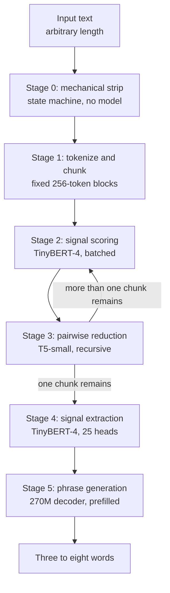

<!-- STATUS: crate doc - promptforge-ext-label - behind Cargo feature `label` - 4 open decisions - see design.md for the system -->

# `promptforge-ext-label`: computed progress labels from a local reduction pipeline

## Recommendation

Build the reducer first, and run the pipeline off the critical path.

Those are two findings, and both cut against the shape this design started in. The reducer, the model that takes two text chunks and returns one shorter chunk preserving the intent of both, is the only component with no off-the-shelf starting point, and it is also the dominant latency cost because it decodes autoregressively at every level of the reduction tree. Retire it first: if pairwise reduction does not preserve intent, the tree returns confident nonsense and no downstream model can recover, so every other component is wasted work until this one is validated. Confidence high, because the dependency is structural rather than a judgment about difficulty.

The second finding follows from the first. Estimated end-to-end cost for a 10,000-token prompt is on the order of one to two seconds, not the 50 milliseconds this design was scoped against, and the excess is autoregressive decoding that no amount of batching removes. That kills live computation at a section boundary and it does not kill the design, because the input is mostly static: a prompt is a markdown file on disk and its section bodies do not change between runs. Compute labels at boot, key them by content hash, and the runtime cost of the static path becomes a map lookup. Only genuinely per-run text, a fan-out item or a bound parameter, needs live inference, and that input is one or two chunks rather than forty. Confidence medium on the latency numbers, which are extrapolated rather than measured, and high on the conclusion, which holds across any plausible correction to them.

The do-nothing option is real and it is what `design-mcp-server-residue.md` specifies: static `progress` labels in prompt frontmatter, passed through untouched. That is also what the surveyed industry does. Section [What this replaces](#what-this-replaces) gives the one case where it visibly fails and this crate earns its keep.

## Scope

This crate computes the text a progress notification carries. It owns three ONNX models, a reduction algorithm over them, and a cache. It contributes one Lua function, one Rust API that `promptforge-mcp` calls from its observer, and one startup self-check.

It is the second `Extension` after `promptforge-ext-classify` and it deliberately copies that crate's session management, its export gate, and its self-check posture rather than inventing parallel mechanisms. Where the two agree, `design-classify.md` is authoritative and this document cites it.

What this crate does not do, and cannot be made to do without a change to this document:

- Decide when a notification is sent. The observer in `promptforge-mcp` owns the event-to-frame mapping and this crate only supplies text for a frame that was already going to exist.
- Appear on the model's tool surface. The one Lua function declares `Surfaces::LuaOnly`, for the reason `design-classify.md` gives at length: a label is not a capability a model should reach for.
- Override an author. A frontmatter `progress` label always wins over a computed one.
- Block the executor. Every call is off the observer thread, and a label that is not ready in time is dropped rather than awaited.
- Reach the network, download weights, or export a model. Artifacts are local exports named by a manifest, produced by the offline procedure in `design-classify.md`.
- Read the accumulated conversation. Input is section body text, parameters, and fan-out item text. Model output and tool results are not labelled.
- Summarize for a human reader. Output is three to eight words sized for one line of client UI, and a caller wanting prose wants a different tool.
- Quantize, at least not yet. See [Precision](#precision).

The test of the boundary: removing this crate leaves every other crate compiling, and every run produces the same outputs with frontmatter labels in place of computed ones.

## What this replaces

`design-mcp-server-residue.md` maps `Event::SectionStarted`'s `label` field straight into a notification's `message`, and records that nothing is computed anywhere as the reason those fields exist on that event. The label comes from the prompt's frontmatter, written once by the author. That is a sound default and it is also the industry norm: Delight.ai ships per-tool "Thinking Messages" pre-authored in the builder's voice ([delight.ai](https://delight.ai/product-release/thinking-messages)), and the surveyed alternative is to fork a conversation to a frontier model every thirty seconds for a fresh summary, which is the Claude Analysis pattern ([leaf-kit/claude-analysis](https://github.com/leaf-kit/claude-analysis/blob/main/src/services/AgentSummary/agentSummary.ts)). No surveyed system computes progress text with a local small model.

A static label is correct wherever one section does one thing. It fails in exactly one place, and the failure is structural rather than aesthetic: fan-out. Worked example three in `design.md` fans one extraction subagent out per chunk. Every one of those subsections is the same section text with different input, so every one renders the same frontmatter label, and a run extracting from twenty chunks emits twenty identical lines. The caller cannot tell progress from a hang. Computed labels are the only way one static string becomes twenty distinct ones, because the thing that differs between them is the run data and nothing else.

That is the case this crate is for. Everything else it does is a smaller improvement on a default that already works, and pricing the crate against the fan-out case rather than against general polish is what keeps its scope honest.

## The pipeline

Six stages, three of them model-backed. Every token of the input is seen, scored, and either carried forward or explicitly discarded by a model. Nothing is sampled and nothing is truncated, because a label derived from the first chunk of a prompt whose instruction sits in the middle is wrong in a way that is invisible until a user reads it.



### Stage 0: mechanical strip

A state machine over the raw text, no model and no allocation beyond the output buffer. It removes bulk that carries no intent so the classifier does not spend capacity scoring it: code fence bodies collapse to their language tag, table bodies collapse to a row count, HTML tags and markdown link syntax reduce to their text, runs of blank lines collapse to one, and a line that is only punctuation is dropped. Blockquotes are kept, because a quoted instruction is still an instruction.

This is Rust string processing and it costs microseconds on inputs of any size this crate sees. It is first because every later stage is priced per token.

Tension: the strip is a heuristic and a prompt whose whole point is a Lua block gets its most informative content collapsed to `[code:lua]`. The mitigation is that Lua blocks are configuration rather than intent, and the section prose around them says what the section does. A prompt for which that is false will label badly and the fix is a frontmatter label.

### Stage 1: tokenize and chunk

Tokenize the stripped text with the reducer's own tokenizer, then split into fixed 256-token chunks with no overlap. Fixed size rather than semantic or recursive splitting, because the downstream reduction is a binary tree over a chunk list and a tree does not care where a boundary fell: a boundary that splits a sentence puts both halves in the same pair at level zero, so the reducer sees them together anyway. Overlap is omitted for the same reason, and omitting it keeps the chunk count and therefore the cost minimal.

The tokenizer is the reducer's rather than a custom one. An earlier draft of this design stripped non-letters, lowercased, and dropped stop words through a bespoke vocabulary to compress the input. That is dropped: the compression it buys is small next to what stages 2 and 3 achieve, and it discards the case, punctuation, and function words that tell an imperative apart from a description. A pretrained BPE tokenizer already encodes common sequences densely, and using the reducer's own tokenizer means no re-tokenization between stages.

### Stage 2: signal scoring

Score every chunk on one axis: how much intent or action signal it carries, from 0.0 for pure boilerplate to 1.0 for a core instruction. One encoder forward pass per chunk, all chunks at a level submitted as one batch.

This is a single regression head on a small encoder, not a classifier over a label set. The scalar is what stage 3 compares, and comparing two scalars is what lets the tree discard rather than merge.

### Stage 3: pairwise reduction with signal pruning

The core of the crate. Pair adjacent chunks, and for each pair take one of three actions decided by the two scores and one threshold.

- One score dominates the other by more than the threshold: drop the weaker chunk, carry the stronger forward unchanged. No model call.
- Both scores are low: collapse the pair to a single elided marker. No model call.
- Otherwise: call the reducer on both chunks and carry its output forward, a chunk shorter than either input.

An odd chunk out carries forward untouched. Rescore the survivors and repeat until one chunk remains, which takes about log2 of the chunk count levels, fewer when pruning collapses a level early.

Pruning is what makes exhaustive coverage affordable. Every chunk is scored, so nothing is skipped, but reduction capacity is spent only where two chunks both have something to say. On a prompt that is mostly context injection and output formatting the first level discards most of its input at the cost of one scalar comparison per pair, and the tree reaches its answer in fewer levels than its chunk count predicts.

The literature supports the shape without matching it. Hierarchical merging over chunk summaries is the standard long-document pattern and BooookScore measures it against incremental updating, finding merging more coherent and updating more detailed ([arXiv:2310.00785](https://arxiv.org/abs/2310.00785)). RAPTOR recursively clusters and summarizes to build a tree ([arXiv:2401.18059](https://arxiv.org/abs/2401.18059)). FETILDA learns attention weights over chunk encodings so that unequal chunks contribute unequally to a document vector ([nsf.gov](https://par.nsf.gov/servlets/purl/10600798)). What none of them do is discard a chunk outright on a learned score, which is this design's one addition and the reason its cost falls below theirs.

Tension: pruning is irreversible and a chunk scored low is gone. A prompt whose key instruction is phrased flatly enough to score below its neighbours loses it, and the failure is silent. The threshold is therefore configuration rather than a constant, and the self-check in [Tests](#tests) asserts the direction of the score on a fixture where the answer is known.

### Stage 4: signal extraction

Run the encoder once more on the single surviving chunk, this time through twenty-five binary heads rather than the regression head. The heads are domain-agnostic by construction: action class, object class, structural complexity, and specificity. No head names a subject matter. A head for "governance" or "C++" would make the crate a domain, which `design.md` forbids of anything but an extension's own vocabulary, and would make the model useless on the first prompt outside that domain.

The twenty-five signals become twenty-five special tokens prepended to the generator's input. That is control-code conditioning in the CTRL sense ([ar5iv](https://ar5iv.labs.arxiv.org/html/1909.05858)), and it earns its place by moving the semantic work out of the generator: the generator does not have to determine what is happening, only how to phrase it, which is what makes a 270M-parameter model sufficient.

### Stage 5: phrase generation

A decoder-only model, prefilled. Prepend the signal tokens to the distilled chunk, prefill the assistant turn with `<status>`, decode greedily, stop at `</status>`, take the first line.

Every element of that is a measured finding rather than a preference, from the one project that has documented this problem carefully. oh-my-pi benchmarked sub-1B models for local title generation and reports that the prefill trick controls output format without token biasing, which it confirms is a no-op once prefill is in place, that greedy decoding beats sampling, and that few-shot examples actively hurt models below roughly 600M parameters ([oh-my-pi local-models.md](https://github.com/can1357/oh-my-pi/blob/main/docs/local-models.md)).

Decoder-only rather than encoder-decoder, and this is the finding that reversed an earlier draft. The same source rejects flan-t5-small for title generation outright, reporting that it echoes its input. The distinction that matters is between compressing text and composing a novel phrase: T5 at small scale does the first well and the second not at all. So T5 stays as the reducer, where the job is compression, and the generator is a decoder.

## Three models, three roles

Table 1 gives the three models, their candidate checkpoints, and what each one is for. Sizes are parameter counts; on-disk and in-memory figures are in [GPU memory](#gpu-memory).

**Table 1. The three models, their roles, and candidate starting checkpoints.**

| Role | Architecture | Candidate | Params | Starting point |
|---|---|---|---|---|
| Signal scorer and signal extractor | Encoder, regression head plus 25 binary heads | TinyBERT-4 | 14.5M | Fine-tune. Heads are new. |
| Reducer | Encoder-decoder | T5-small, or T5-efficient-tiny | 60.5M / 15.6M | Fine-tune. No usable checkpoint exists. |
| Phrase generator | Decoder-only | Gemma 3 270M, or Supra-Title-50M | 268M / 50M | Fine-tune from a title-generation checkpoint. |

One encoder serves stages 2 and 4, with two head sets over shared weights. That is the standard multi-head arrangement and it halves both the memory and the number of models to export.

TinyBERT-4 is chosen on measured quality per parameter: 14.5M parameters reaching 96.8 percent of BERT-base on GLUE at 55MB on disk ([TinyBERT, Findings of EMNLP 2020](https://aclanthology.org/anthology-files/pdf/findings/2020.findings-emnlp.372.pdf)). The alternative worth keeping in view is `MoritzLaurer/deberta-v3-xsmall-zeroshot-v1.1-all-33`, at 22M active parameters under an MIT licence and built for edge inference, which trades size for a zero-shot path that needs no head training to get a first signal.

The reducer has no starting checkpoint and that is the whole risk. The nearest published work is compression rather than pairwise merging: `shorecode/t5-efficient-tiny-summarizer-general-purpose-v3` reaches ROUGE-L F1 of 0.41 at a measured 7.52x compression ratio on 15.6M parameters, which establishes that a model this small can compress at all. Separately, `tarekziade/t5-small-headline-generator-sft-3-3` retains above 92 percent of its parent's ROUGE at 38.5M parameters after pruning half the encoder and decoder layers and fine-tuning for one epoch, following the shrink-and-fine-tune recipe ([arXiv:2010.13002](https://arxiv.org/abs/2010.13002)). That is the compression path to take once a full-size reducer works, and it is not the place to start.

For the generator, `SupraLabs/supra-title-50M` is a purpose-built 50M-parameter title model trained on up to 150K curated pairs, and Gemma 3 270M has at least three independent title-generation fine-tunes published against it. oh-my-pi's leaderboard puts LFM2-350M at the best speed-to-quality point for this task and Gemma 270M as the smallest viable option, with SmolLM2-135M too small. Start at 270M and try 50M once the pipeline is closed.

## Where the pipeline runs

The pipeline does not run on the critical path. It runs in three places, and which one applies is decided by whether the input is known before the run starts.

**Boot, for section bodies.** A prompt is a file. Its section bodies are fixed at the moment the catalog is loaded, so every label derivable from a section body alone is derivable at boot. Compute them during the catalog build, key them by the sha256 of the stripped section text, and persist the map beside the artifact tree. A restart with an unchanged catalog reloads the map and computes nothing. A prompt edit invalidates exactly the sections whose text changed.

**Author time, optionally.** The same computation with the same cache key runs from `promptforge-cli validate`, so an author can see and overrule a computed label before it ever reaches a client. A label the author then writes into frontmatter wins permanently, which turns this crate into a drafting aid for the static path rather than a replacement for it.

**Live, for per-run text only.** Fan-out item text and bound parameters are not known at boot. These are small: a fan-out item is one or two chunks, so the tree is one or two levels rather than five or six. This is the path the fan-out case needs and it is the only path with a latency requirement.

The live path lands as a second frame rather than a delayed first one. `crates/promptforge-mcp-server/design-mcp-server.md` requires `Observer::on_event` to be synchronous and non-blocking, with frames leaving through a bounded channel under `try_send`, so a label that takes 400 milliseconds cannot be awaited there. Instead the observer emits the frontmatter or fallback label immediately at its `progress` value, spawns the label computation, and emits a second frame at the same `progress` value with the computed text when it arrives. Re-sending an unchanged `progress` with new message text is already the specified behaviour for `SectionRetrying` and `SectionSkipped`, and Cursor is measured to render in place, so the caller sees one line whose text sharpens rather than two lines. A computation that loses its race is dropped and the static label stands.

Tension: this deviates from strict monotonic `progress` in the same way and for the same reason `crates/promptforge-mcp-server/design-mcp-server.md` already documents, so it inherits that deviation's risk. A client enforcing strict monotonicity drops the refinement and shows the static label, which is a clean degradation but is untested outside Cursor.

## Latency

The 50 millisecond target this design was scoped against does not survive the arithmetic. Stating why, and stating how firmly, matters more than the number.

Three measured anchors exist, all from `design-classify.md`, all on an RTX 4070 Laptop on 2026-07-25, all ONNX FP32 on CUDA. DeBERTa-v3-base at 86M parameters costs 7.98 milliseconds per call at batch one and sequence length 64. The same model at batch 32 reaches 209 sentences per second, which is 4.78 milliseconds per sentence, so batching buys about 1.7x and no more. MiniLM at 22.7M parameters costs 0.4 to 1.5 milliseconds per call.

From those, an estimate for the encoder stages. TinyBERT-4 is smaller than MiniLM, so at batch one and sequence 256 it should sit at or under MiniLM's 1.5 milliseconds; applying the measured batching factor gives roughly 1 millisecond per chunk at batch 32. Forty chunks at level zero is therefore about 40 milliseconds of scoring, and every later level is smaller. Total encoder cost across a full tree is plausibly under 100 milliseconds. That estimate chains two extrapolations, across parameter count and across sequence length, and should be read as an order of magnitude rather than a figure.

The reducer is where the budget goes, and the reason is structural rather than a matter of tuning. Generating a 128-token chunk means 128 sequential decoder steps. Batching sixteen pairs makes each step wider but does not make it earlier, so a level costs 128 steps no matter how many pairs it holds, and a tree of five levels costs roughly 640 sequential decoder steps. At a few milliseconds per step for a 60.5M encoder-decoder that is on the order of one to two seconds. Reducing the output length is the only lever that moves this, and it trades directly against how much the reduction preserves.

Two consequences follow. The first is the recommendation above: precompute the static path so that its cost is paid at boot, where a second is free. The second is a constraint on the live path, which must stay at one or two levels, and therefore a cap: an input arriving live above a configured chunk count falls back to the static label rather than reducing. That cap is configuration and its default is deliberately low.

Tension: nothing here is measured. Every reducer figure is derived from step counts and a per-step cost taken from a different architecture. The measurement that settles it is a batch-16 decode of 128 tokens through an exported T5-small on the target card, and it should be taken before the training work starts, because a result three times worse than this estimate changes the reducer's output length and therefore its training targets.

## GPU memory

About 1.4 gigabytes of FP32 weights, plus context and arena, on the same static-budget terms `design-classify.md` sets out. Table 2 gives the weight figures.

**Table 2. FP32 weight footprint by model. Arena, CUDA context, and cuBLAS workspace are additional and shared with the classify crate's allocation.**

| Model | Params | FP32 weights |
|---|---|---|
| Shared encoder, TinyBERT-4 | 14.5M | 58 MB |
| Reducer, T5-small | 60.5M | 242 MB |
| Generator, Gemma 3 270M | 268M | 1,072 MB |
| Total | 343M | 1,372 MB |

Session construction copies `design-classify.md` exactly: one session per model built eagerly, `error_on_failure` on the CUDA provider dispatch, `ArenaExtendStrategy::SameAsRequested` so the arena does not double, `with_intra_threads(1)`, and `commit_from_file` against a manifest-named local path. Calls serialize behind a per-session mutex inside `spawn_blocking`, for the determinism reason that document gives rather than for soundness.

The generator is by far the largest line and it is the one worth revisiting: dropping from 268M to Supra-Title-50M would cut the total below 500 megabytes. That is a quality question, not a memory question, and it is in [Open](#open).

Tension: this allocation sits outside the gateway's request budget, exactly as the classify crate's does, so a boot that labels a large catalog consumes GPU time no admission control accounted for. Boot is the right place for that to happen, because nothing else is running yet.

## Precision

FP32, following `design-classify.md`, and the reason to follow it is measured rather than deferential. That document records INT8 collapsing DeBERTa entailment scores from 0.99 to 0.49 with macro-F1 falling 21 to 38 points depending on corpus, while being slower on CUDA at 27.37 milliseconds against FP32's 7.98. A quantization that costs both accuracy and speed is not a trade.

That finding is about an NLI cross-encoder and it does not automatically transfer to a 270M decoder, where 4-bit quantization is ordinary practice and where the published title-generation checkpoints ship quantized. So the honest position is narrower than the classify crate's: FP32 is the default here because it is the house standard and because it keeps the offline parity gate a gate, not because INT8 has been shown to fail on these three models. Quantizing the generator is the single largest memory win available and it is [Open](#open).

Tension: FP32 costs four times the memory of INT8, and on the generator that is roughly 800 megabytes spent on caution rather than on a measurement.

## Training the reducer

The reducer is first, it has no checkpoint, and its training data does not exist. Everything else in this section is downstream of that.

The task is: given two text chunks, return one shorter chunk preserving the intent of both. Training pairs come from a frontier model over real PromptForge prompt text, which is available in quantity because every prompt in the catalog is a document and every section is a source of chunks. Target behaviour is specific and testable: keep proper nouns, identifiers, and numbers; drop hedging, politeness, and restated context; merge overlapping intent rather than concatenating it; and land at roughly a quarter to a half of the input length.

Generate on the order of 10,000 to 20,000 pairs, fine-tune T5-small, and gate on a held-out set before any of the other two models is touched. The gate is not ROUGE against the frontier model's output, which measures agreement with one arbitrary phrasing. It is a round-trip check: reduce a pair, then ask whether the identifiers and numbers present in the input survive, and whether a frontier model shown only the reduction can recover what the original asked for. That is checkable automatically and it measures the property the tree actually depends on.

The scorer and the signal heads train from the same generation pass, since a frontier model labelling a chunk can emit a signal score and twenty-five categorical signals alongside the reduction. The generator trains last, from a title-generation checkpoint, on signal-plus-chunk to status-phrase pairs, with no few-shot examples in the prompt for the reason oh-my-pi measured.

Every checkpoint reaches the runtime through the offline export procedure in `design-classify.md`: opset pinned to 17, sha256 in the manifest, a golden fixture recorded at export time, and numerics parity with PyTorch to three decimals before any prompt calls the model. This crate adds no export mechanism.

Tension: the reducer's training data is generated by the frontier model whose judgment the pipeline exists to avoid calling. That is ordinary distillation and it is fine, but it caps reduction quality at what the teacher does on this task, and nobody has established that a frontier model is good at pairwise chunk merging either.

## Configuration

One extension block and three model entries, in `prompts.toml`, keyed by what `Extension::name` returns. The shape follows `design-classify.md`'s `[classifiers.NAME]` convention rather than introducing a second one.

```toml
[tools]
label_of = "onnx-label"

[extensions.onnx-label]
model_root = "/srv/promptforge/models"
verify = "hash"
self_check_max_ms = 20
cache_path = "/var/lib/promptforge/labels.db"

# Reduction control.
chunk_tokens = 256
prune_threshold = 0.30
live_max_chunks = 4
reduce_max_tokens = 128

[label_models.scorer]
model = "tinybert-4-signal/onnx-fp32-opset17-v1"
device = "cuda:0"
max_length = 256

[label_models.reducer]
model = "t5-small-reducer/onnx-fp32-opset17-v1"
device = "cuda:0"
max_length = 512

[label_models.generator]
model = "gemma-3-270m-status/onnx-fp32-opset17-v1"
device = "cuda:0"
max_length = 320
```

`prune_threshold` is the score gap at which stage 3 discards instead of merging, and it is configuration because it trades reliability against cost and neither direction is safe as a constant. `live_max_chunks` is the cap that sends an oversized live input back to its static label. `reduce_max_tokens` bounds the reducer's output and is the one lever on the latency finding above.

There is no `dtype` key, for the reason `design-classify.md` gives: FP32 is the only value, so the key would only be a way to be wrong. There is no block-level `device`, because a device is a property of one model and is set in each `[label_models.NAME]` table.

## Errors

Boot errors name the model and the file, following the sibling crates. `UnknownLabelModel` for a missing entry, `LabelModelKind` when a slot resolves to the wrong architecture, `Degenerate` and `OffDevice` from the shared self-checks, and `CacheUnwritable` when `cache_path` cannot be opened, which is a boot failure rather than a downgrade because a pipeline recomputing every label at every restart is a different system than the one this document specifies.

Runtime errors do not fail runs. Every failure on a label path degrades to the static label and logs at warn, because a run whose outputs are correct must not fail on the text of a progress line. `LiveInputTooLarge` is logged at debug rather than warn, since it is a configured decision rather than a fault.

## Tests

The classify crate's fixture posture applies: almost everything runs without a GPU against stubs, and the GPU runner covers numerics only.

- Strip, no GPU: golden input and output for each construct the state machine handles, including a fence inside a blockquote and an unterminated fence, which is the case that hangs a naive implementation.
- Chunking, no GPU: a token count that divides evenly, one that leaves a remainder, and one below a single chunk. Chunk boundaries are asserted on token indices rather than character offsets.
- Pruning, no GPU: a stub scorer with fixed scores exercises all three stage-3 actions and asserts that the surviving chunk is the one the scores selected. A pair straddling the threshold asserts the comparison is not accidentally inverted, which is the silent failure this stage has.
- Tree shape, no GPU: chunk counts of 1, 2, 3, 10, and 41 assert the level count and the odd-chunk carry. A run where every pair prunes asserts the tree collapses in one level and calls the reducer zero times.
- Coverage, no GPU: with a recording stub, assert every input chunk was scored at least once. This is the test that encodes the exhaustive-coverage decision, and it is the test that fails if someone later adds sampling.
- Cache, no GPU: identical section text hits the cache and calls no model. A one-character edit misses for that section and hits for its unchanged siblings.
- Observer integration, no GPU: a section with a frontmatter label emits it unchanged and computes nothing. A section without one emits the fallback immediately and a second frame at the same `progress` value with computed text. A computation that never completes leaves exactly one frame.
- Degeneracy, no GPU: the constant-output ONNX fixture from the classify crate is rejected by the shared self-check.
- Determinism, GPU runner: the same input twice is bitwise equal at every stage, and a tree over 41 chunks is equal across two process starts.
- Feature off: the host binary builds with `--no-default-features`, and a prompt naming `label_of` fails startup validation with an unbound canonical name.

The reducer's own quality gate is not a unit test. It is the held-out round-trip evaluation in [Training the reducer](#training-the-reducer), run in the export pipeline, and its result is recorded in the manifest.

## Open

- Whether the reducer's output length should be fixed or scale with its inputs' scores. Fixed makes the tree's cost predictable, which is what the latency finding needs; scaling preserves more where there is more to preserve. Undecided because it depends on the reducer measurement that has not been taken.
- Whether the generator can drop from Gemma 3 270M to Supra-Title-50M. It would cut the weight footprint by roughly two thirds. oh-my-pi's leaderboard says 270M is the smallest viable general-purpose title model, but a 50M model purpose-built for titles is a different claim, and signal conditioning is meant to make exactly this substitution possible.
- Whether to quantize the generator to 4-bit. It is the largest memory win available and the house FP32 standard was set on a measurement of an NLI encoder, which does not transfer. Needs its own measurement against the golden fixture.
- Whether twenty-five signals is the right number, and what they are. The count came from a sketch rather than from an ablation. The way to settle it is to train the heads, then drop each one and measure whether the generated phrase changes.
- Whether the boot-time catalog labelling should block the first connection or run behind it. Blocking makes the first run's labels correct and delays startup by the pipeline cost times the section count; running behind it means early runs show fallback labels. `design-classify.md` blocks for its self-checks, so blocking is the consistent choice, but its cost here scales with catalog size rather than model count.

*2026-07-26 - design-label*
