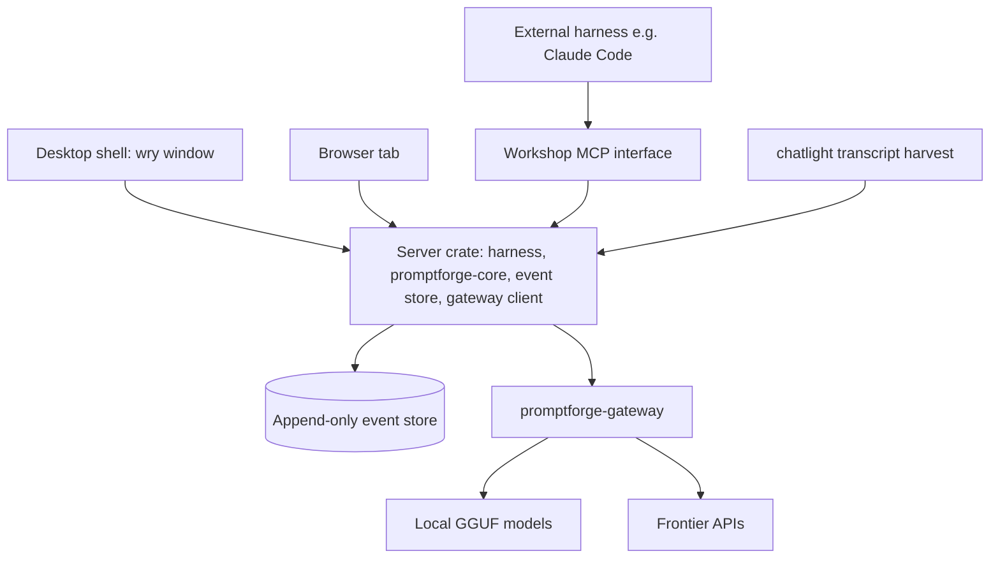

# The PromptForge Workshop

## Executive Summary

A developer environment for PromptForge prompts: a standalone local application - a Rust server crate with a webview shell - where a prompt is a visible, editable stack of blocks, runs are defined by binding a prompt's declared inputs to real files, every run, edit, decision, and mistake is recorded in an append-only, hash-chained event store, and any two versions of anything are compared by a model, with the human making the final call. It does not generate reports, does not edit code, and is not a general-purpose IDE. The workshop designs the prompt; it does not run it in production - finished prompts leave and live elsewhere (Cursor, cloud runs, promptforge-cli), and the workshop tracks no releases and manages no production lineage: there is one current version, the thing at HEAD, with the full immutable development lineage behind it. A built-in agentic harness, landed early at stage 3, lets a frontier model help author prompts with the entire conversation captured natively.

The thesis: human intent is the source code, and everything downstream - plans, prompts, reports - is a build artifact. Today's harnesses discard the most valuable substance in the workflow: the reasoning, the indecisions, and the mistakes that show why the right answer is right. This workshop captures all of it at infinite resolution - nothing pruned, dead branches archived, everything the model saw snapshotted at access time - and because capture is paid exactly once while extraction is cheap forever, each finished database becomes a teacher that generates tutorials at any fidelity, a process-supervised training corpus of the scarce kind every other harness throws away, and the corpus that trains the workshop's own future PromptForge-speaking authoring model. The data sits still while the extractors improve. The asset appreciates.

Design notes from one creative session. Effort is priced as: small (a component exists), intermediate (something similar exists and adapts), large (a new component with no existing practice).

## Key design choices

**1. The product is a prompt development environment, not an IDE.** The alternative - a general-purpose editor with agent features - was examined and rejected: it duplicates existing editors, carries extreme execution risk, and defers the interesting problem behind a million solved ones (text editing, indexing, terminal emulation, tab completion). The workshop edits PromptForge prompts, runs them, remembers everything, and compares versions. It does not edit codebases and does not run prompts in production: finished prompts leave and live elsewhere, and the workshop tracks no releases - there is one current version, the thing at HEAD, with the full immutable development lineage behind it. The tension this creates: users must still own a general harness for general work, and the workshop must interoperate with whatever that harness is rather than replace it.

**2. The event store is the product; every interface is a view.** The single source of truth is an append-only, hash-chained event log - a commit log that forbids force pushes. The block editor, the run panel, the leaderboard, and the chat window are all projections of the log and can be rebuilt from it at any time. The evidence for this choice is the entire feature list: edit history, diffs, revert, run comparison, and replay are queries over the log rather than subsystems of their own. The tension: the log must be a real storage system - chunking, compression, corruption recovery, backup, and garbage collection for tombstoned payloads - because capturing everything forever requires real storage engineering.

**3. History is immutable; content is destructible.** Events are never rewritten, but payloads are separately stored and individually revocable: secrets get pasted, private blobs land by accident, and deletion requirements exist. Redaction tombstones the payload - the event records that the blob existed and when it was destroyed - while the chain stays intact. The accepted consequence: exact historical playback is conditional on retained payloads, and a tombstone degrades playback deliberately, rendered as a tombstone.

**4. Everything the model sees is captured at the boundary.** Every tool result - file reads from anywhere on the drive, web search responses, fetched pages - is content-addressed into the store at the moment the model sees it, because paths and URLs point at mutable state and a pointer is not evidence. What this makes reconstructible is the observable execution trace: inputs, composed context, observations, tool calls, outputs, explicit rationales, compactions, and decisions. Model-internal reasoning is unobservable, and the design never claims to recover it. Content addressing deduplicates, so storage cost is proportional to what was observed, not how often.

**5. A prompt is edited as blocks, and the prompt is authoritative state.** The UI renders the prompt's sections as a stack of blocks, each showing its prose, its Lua environment, and its offered tools; editing a block edits the section. The prompt file is directly mutable, authoritative state - not a projection of the plan. Regeneration from the plan is a supported workflow, not an invariant; drift detection watches for degradation, and a block edit that contradicts a recorded plan decision raises a conflict event rather than diverging silently. The alternative - prompt prose as a strict build artifact of the plan - lost because it makes the instrument gate the user's judgment, which the first principle forbids.

**6. Fixtures over dependencies: the store is the only dependency a prompt has.** A prompt's frontmatter declares its inputs and outputs as store paths. The workshop binds declared inputs to real files the user picks and never executes a prompt's environment dependencies. The evidence is papergate: its crate links a database client purely to fetch a paper and seed the store, while the prompt itself only reads `paper.md`. In the workshop, the user binds `paper.md` to a sample file and the database is bypassed entirely. The prompt is the core; the crate is one production binding; the workshop is the interactive binding.

**7. Identity is rigorous, durable, and defined before any UI.** Every noun has an explicit identity: Artifact (content-addressed payload), PromptVersion (hash of the prompt's blocks), PlanVersion (hash of the plan's decision record), Run (one invocation of a prompt version with bindings), Variant (a run sharing a fingerprint prefix, produced by re-roll), Branch (a named line of decisions), Decision (a recorded human choice against stable IDs), and Contract (the author-ratified manifest, keyed by durable block IDs, valid while the block-ID set is unchanged). The load-bearing member is the ExecutionFingerprint, split into invocation identity (which run), execution provenance (what produced it, including the capability grants in force), and cacheability policy (what is safe to reuse); without the third part, "same inputs means cache reuse" is unsound the moment tools, MCP servers, web state, or hosted models drift. Blocks and decisions carry stable identifiers independent of heading, position, prose, or serialization - renaming a section does not sever its history - and when identity is severed anyway, the harness detects the orphan and the human relinks it as a recorded decision.

**8. Two model planes, kept separate.** The runtime plane serves the models a prompt uses when it executes: local and open-weight models through the existing gateway, which provides credential isolation, a model catalog, and local GGUF provisioning. The authoring plane is the assistant that helps develop prompts: frontier models by key at first, and eventually a fine-tuned model that speaks the PromptForge language natively, trained on the corpora the workshop produces. The planes share one gateway but never share a context.

**9. Voice is an input device, and it lives in the server from day one.** Push-to-talk ships in stage 1: the webview captures the microphone, PCM frames stream up a WebSocket while interim transcripts stream down, and the server transcribes in-process on the local GPU - Whisper large-v3-turbo over a sliding window for interims, large-v3 pipelined at silence for the final text, with the session's jargon fed to the decoder as an initial prompt. The evidence for the placement: transcription is neither model plane - it is an input device, not a model a prompt or the author uses - and the session's context is transcription accuracy that no standalone dictation tool can offer. Browser Web Speech and cloud STT are rejected because audio leaves the machine. The tension: VRAM is budgeted statically against the gateway's resident models, so two move-triggers are named in advance - a prompt wanting transcription as a tool moves it to the runtime plane, and the resident set outgrowing the card moves voice to the gateway.

**10. The harness is hand-written, headless, and lands early.** The authoring assistant is a tool-call loop against the gateway's OpenAI-compatible interface - a few hundred lines at its core - plus a tool suite and the recorder. The Claude Agent SDK was considered and rejected: it is TypeScript/Python only, Claude-only (which kills the two-plane design and the future fine-tune), and its loop decides what gets recorded, which is the product's core asset. The harness needs the full capability suite - shell, whole-drive files, web fetch, MCP client, subagents - because research and development interleave in one conversation. It is the dominant implementation risk and lands at stage 3 anyway, because a daily-drivable tool early is what makes everything else get used, and the stage-1 raw tape means capture never waits for the database.

**11. Plan mode is the entropy filter.** The harness aggregates human intent into a plan document before any action is taken: small design decisions accumulate across a conversation - some reversing each other - the user reviews and cleans the plan, and applying it produces one clean edit instead of the conversation's raw churn. The evidence is the semantic-blur lesson seen from the other side: decisions are discrete and survive translation while prose drifts, so the plan is preserved and the artifact regenerated; a workshop without this filter is a chat with tools. The tension: the prompt text is the weakest of the three conditioning layers - the redefined deliverable (maintaining the plan IS the job) and the structural tool gate (reads, search, and one write target) carry the load - so compliance is never left to instruction alone, and leakage is measurable as blocked-mutation events in the log.

**12. The leaderboard replaces the tree view.** Branches are navigated by their outputs, not by topology: the screen shows artifacts with model-computed diffs and structured verdicts, not a commit graph. A verdict is not a scalar: each evaluation record holds the rubric dimensions, the critic's identity and version, deterministic checks, candidate ordering, confidence or abstention, run cost and latency, and the human's judgment, stored separately, with later calibration of the critic against the human's calls. The rationale is the generator-evaluator asymmetry: evaluation is cheaper and more reliable than generation, the critic's ceiling is good-versus-great, so the final call stays with the human.

**13. Artifact reuse is not execution memoization.** A pinned output can always be reused as data - shown, diffed, fed to comparison. Skipping a stage's execution is memoization, valid only when the fingerprint's cacheability policy permits it; stages touching external state re-execute unless the policy explicitly says otherwise. Model variance is admitted only at reviewed re-runs after input changes or at an explicit re-roll, and a re-roll produces sibling variants under identical inputs - best-of-N sampling with the model as critic.

**14. The sidecar is the first extractor, and it watches the agent first.** A prompted model with a ruthless rubric reads the event store and populates the leaderboard's verdicts; fine-tuning carries the burden of proof against that prompted baseline. The sidecar advises with memory and never gates: its per-step verdicts become leaderboard data, so its own accuracy is measured over time. User-watching over captured chats follows; watching the pair interact is the large, uncharted subject.

**15. The build order lands a usable tool before the novel core.** Six stages: the window (chat against the gateway, push-to-talk voice, and a raw append-only tape from the first commit), plan mode (the plan generator - after which the product already matches the one Cursor feature the user refuses to live without), the harness (the tool suite and the block editor; daily-drivable), the database (the event store, identity model, and envelope, gated by a synthetic-trace stress test), the comparison loop (run definitions, re-roll, the leaderboard, invalidation), and the intelligence layer (the sidecar and the queryable timeline). The novel component - the run-record database - lands fourth, behind three stages of usable tool, because capture runs from the first commit on the raw tape. Everything past stage six - fine-tunes, dataset export - is extraction, and it can wait forever.

## The model planes and the data economics

The workshop serves two distinct model roles, kept separate:

- **Runtime plane** - the models a prompt uses when it executes. Local and open-weight models routed through the promptforge-gateway, which already exists: credential isolation, model catalog, GGUF provisioning via llama-server. Effort: small.
- **Voice is day one, and it lives in the server, not the gateway.** Push-to-talk in the chat panel: the webview captures the microphone (getUserMedia plus AudioWorklet), PCM frames stream up a WebSocket while interim transcripts stream down it, and the workshop server runs transcription in-process on the local GPU - real interims, no child process, no gateway involvement at all. Models: accuracy leads, latency follows. Whisper large-v3-turbo over a sliding window for interims (the visible forming-and-correcting behavior is inherent to window re-transcription), and Whisper large-v3 for the final text (the accuracy ceiling, strongest domain vocabulary for the user's C++ standardization dictation). The final pass is pipelined: large-v3 processes accumulated audio in the background during speech, segmented at silence by voice activity detection, each chunk conditioned on the previous transcript so context survives segmentation; on stop, only the unprocessed tail needs one conditioned call, so the wait is the tail's length, not the utterance's. One family, one runtime: whisper-rs and whisper.cpp; sherpa-onnx and Parakeet are out. Context determines transcription accuracy on homophones and domain terms: Whisper's decoder is a real language model conditioned on the full utterance (its accuracy edge), Parakeet's transducer attends weakly (its vocabulary weakness). Three exploits: vocabulary biasing via Whisper's initial prompt (feed it the session's jargon), the two-stage split confining Parakeet to interims, and an optional LLM cleanup pass on stop that sees the recent chat - the session's context becomes transcription accuracy, something no standalone dictation tool can do. The deciding principle: the gateway fronts the two model planes, and transcription is neither - it is an input device, not a model a prompt or the author uses. Crash isolation is a non-concern: if whisper has a bug, it gets fixed. If a prompt ever wants transcription as a tool, it becomes runtime-plane and moves to the gateway then. VRAM is budgeted statically, not arbitrated: the resident set is small and known (whisper pinned at about a gigabyte; the LLM sized by `gpu_layers` and KV-cache type in gateway config), and the gateway's device/lane concurrency governs the models it serves. Voice is bursty and tiny, so the workloads rarely contend in time. A second move-trigger for voice: the resident set outgrows the card, at which point voice moves to the gateway so one process sees the whole budget. Interim transcripts re-transcribe a sliding window, so the last few seconds rewrite as they resolve; stop, review, send. Browser Web Speech API and cloud STT are rejected: audio leaves the machine. Channels are per-purpose: SSE for downstream-only streams (chat tokens, events), WebSocket for the bidirectional voice channel. Effort: intermediate.
- **Authoring plane** - the assistant that helps the user develop the prompt. Frontier models via BYOK through the gateway at first; eventually a fine-tuned model that speaks the PromptForge language natively. The model stays fully general - it can read arbitrary files, research a domain, convert a foreign prompt into PromptForge form - because research and development interleave in one conversation.
- **The chat panel is a full harness, landed early.** The authoring conversation is the most valuable data the workshop captures - the human's reasoning at the moment of each decision, which transcripts prove cannot be reconstructed afterward (the chatlight-architect log is the evidence). The research/develop split fails because the two interleave in one conversation: building the mailing-list conversation-starter prompt IS researching the mailing list. So the harness needs the full capability suite: shell, whole-drive file access, web fetch (promptforge-webfetch), MCP client, subagents, intermediate reports, plus the dozen prompt-domain tools. This is the Claude Code shape - full capability, no editor. But the harness is **known but expensive**, not novel, and it is the dominant implementation risk. It lands at stage 3 anyway: a daily-drivable tool early is what makes everything else get used, and the stage-1 raw tape means capture never waits for the database. The distinctive loop (structured prompt -> recorded execution -> variant -> comparison -> human choice) completes at stage 5; chatlight harvest bridges nothing, because capture runs from the first commit. The hard part is tool quality: the domain helps where it can (prompt files are structured, so edits are addressed by section name; the reference corpus is fixed and pre-loadable), but the general suite must be good, not merely present. Effort: intermediate-large.
- **Cost tradeoff, accepted.** In-workshop chat pays per token through the gateway (BYOK) rather than riding the Claude subscription through Claude Code. Accepted because the data is the point. If the fine-tuned PromptForge-speaking model materializes, the authoring conversation migrates to it and the API cost goes to zero; the panel built for capture becomes the panel the fine-tune lives in.
- **Chat capture via harvest remains as the bridge.** For conversations that happen in the external harness anyway, chatlight's extractors harvest the transcript, linked to run records by time and tool calls. Crude, but already built.
- **Routing, not replacement.** The fine-tuned PromptForge-speaking model handles well-worn paths (routine prompt editing); the frontier model handles open-ended work (foreign prompts, unfamiliar domains). Capability-adaptive surfacing applied to the authoring plane.
- **The parser serves the fine-tune twice; the tokenizer is never touched.** Custom tokenization (Lua constructs as single tokens) is rejected - embedding surgery on a fine-tune, high cost, low return, since Lua is well-represented in every code model's training data. Instead: the parser aligns training data at block granularity (chat excerpt to the exact section that changed), and at inference the model's Lua fences are grammar-constrained (GBNF via llama-server) so output cannot fail to parse and `jump` targets and store paths name only things that exist. Effort: intermediate, and the gateway already serves the runtime that supports it.
- **Dogfooding.** The authoring assistant's promptforge-facing behavior is itself expressed as a PromptForge prompt where possible, developed inside the workshop, subject to the same run records and comparison as everything else.
- **Each database is a training-data generator.** The workshop records every chat -> plan -> prompt chain with full history - the corpus a PromptForge-speaking fine-tune needs, process-supervised rather than outcome-supervised. Extraction kinds: SFT pairs (chat excerpt -> plan delta, plan -> prompt), preference-pair candidates from branch choices, full process traces when models can consume them. The workshop's outputs are prompts and datasets.

## The core design

### 1. The window, concretely

Three UI elements, each a renderer for something promptforge already has:

- **The block stack** - the prompt's H1/H2 sections as vertically stacked blocks. Each block shows its prose, its Lua environment, and the tools it offers (`tools.need`, `tools.add`); editing a block edits the section. Pre-loaded store files are rulebooks. Nothing here is invented; the workshop visualizes and edits what promptforge-core already executes.
- **The internal filesystem** - the store, visualized as icons, grouped by kind (inputs, intermediates, outputs). After a run, every file the run touched is visible, including intermediates. This is the peel-back's third layer: face, mechanism, evidence.
- **The run definition** - a named invocation of a specific prompt: these input bindings, this model profile. Runs are what the run-record database remembers; bindings are part of the record, so "same prompt, different sample input" is a first-class comparison on the leaderboard.

**Fixtures over dependencies.** A prompt's frontmatter declares its inputs and outputs as store paths (`input: path: paper.md`). The workshop binds declared inputs to real files the user picks. It never executes a prompt's environment dependencies: papergate-the-crate links paperstore and paperstore-sqlite only to fetch the paper and seed the store, so in the workshop you bind `paper.md` to a sample markdown and the database is bypassed entirely. The prompt is the core; the crate is one production binding; the workshop is the interactive binding. The store is the only dependency a prompt actually has. Effort: small to intermediate.

**The workspace and the supporting cast.** The workspace is a designated directory holding reference material - rulebooks, how-tos, sample inputs - that is not inside any prompt yet but must be referenceable. It is the tree browser's root, the @-mention source in chat, and the binding picker's source for fixtures. It stays plain files, editable anywhere; the event store snapshots on read, per the capture rule. The remaining window furniture is all library-grade web components, none of it the IDE: a tree browser, a plain text editor for workspace files, markdown preview (which also renders web-fetch results, so no embedded browser is needed), @-mention parsing, and a command-output display for the shell tool. An interactive terminal (xterm.js plus a PTY) is optional and intermediate; everything else is small. The IDE trap was never "has a file tree" - it is the intelligence layer (language servers, tab completion, debugging, extension APIs), and none of that is in scope.

**Lua intelligence without the LSP protocol.** The block editor gets Lua highlighting from the editor library, diagnostics from promptforge-core's parser over the existing server (fence parse errors, `jump` targets that name real sections, `store.read` paths against declared inputs), and completion from a static table of the promptforge Lua API plus file-local symbols (section names, store paths). A custom LSP is rejected: the protocol's value is interoperating with other people's editors, and this editor is ours. If the workshop ever lives inside a foreign editor, an LSP wrapper is the adapter - later, if ever. Effort: small.

### 2. The character sheet is concrete

An agent's "personality" is algorithmic: a prompt file plus its store manifest plus its tool set plus its model bindings, wearing an avatar and a one-line charter. The avatar dropdown that turns a vibe coder into a Rust developer, a C++ developer, or a Clang frontend dev is simply the choice of which rulebook files are pre-loaded into the store. Effort: small.

### 3. The run-record database

Every run is recorded: inputs, outputs, per-stage manifests, human decisions, model and seed per stage. Full causal branching with explicit temporal ordering; nothing is ever lost; trimmed branches archive rather than delete. Content-addressed artifacts in an event-sourced store. Effort: intermediate (event sourcing and content addressing are known practice).

**History is immutable; content is destructible.** The event log is append-only and hash-chained like a Merkle log: a git commit log that forbids force pushes. But secrets get pasted, private blobs land by accident, deletion requirements exist - so payloads are separately stored and individually revocable. Redaction tombstones the payload (the event records "blob X existed, redacted at T") while the chain stays intact. History cannot be rewritten; content can be destroyed. Effort: small to intermediate.

**The ontology is a versioned envelope, not a closed taxonomy.** Two review rounds reconcile here: meaning must be captured at record time (replay cannot invent it), and the taxonomy cannot be perfected up front. So: a small, versioned event envelope whose fixed fields carry the load-bearing distinctions - actor, causal parentage, operation identity, inputs and outputs, observation-versus-declaration, policy decisions, payload references - plus an extensible registry of event kinds. New kinds cost a version bump, not a migration. The physical serialization stays cheap; the envelope is designed with full care, before UI work.

**Three words where there was one.** Playback is an exact historical re-render of recorded events - no model runs - and exactness is conditional on retained payloads: a redacted payload degrades playback deliberately, and the tombstone is rendered in its place. Simulated replay re-executes against captured observations - recorded tool results stand in for the world. Live re-execution runs against current external state - new observations, new events. They have different correctness guarantees, and every re-run event records which kind it was.

**Side effects are transactional in the record.** Every filesystem, network, MCP, or tool operation with effects is logged with explicit states - requested, started, succeeded, failed-or-unknown - and an idempotency key where the operation allows one. A crash between request and completion leaves an honest unknown, never a false success.

**Resume needs execution state, not just artifacts.** Cached intermediate files are insufficient to land at a step: the walk position, the Lua `var` state, and the tool and model bindings are live execution state, and fanout's append order depends on completion order, which changes the file and therefore the model's next context. The mechanism is simulated replay: re-execute the prior sections' code with recorded observations substituted - recorded model replies, recorded store bytes, and recorded ordering decisions enforced on fanout - so the state at the resume point is rebuilt by the same code with the same inputs. No inference cost, no VM serialization. Two requirements follow: the log records observations at engine granularity (per-section model replies, per-mutation store order), and nondeterministic ordering decisions are events. Resume points are section boundaries, where section-local state does not exist; `var` is JSON by promptforge's design, so a checkpoint fast path is possible later. Editing a prior section's code crosses into live re-execution: new observations, new events, a fork. Effort: intermediate (record-and-replay is established practice - rr, FoundationDB's deterministic simulation).

**Canonical store, projected views.** The append-only event store is the single source of truth. Everything else is a deterministic projection: the SQLite file an agent presents, the content-addressed blob index, the Markdown rendering. Importing an edited Markdown file creates new events rather than mutating state. Two mutable representations never round-trip; one truth, many views.

**Human and model are peers at the chokepoint.** The block editor is operation-based, not document-based: it renders state from the log and emits edit operations to the server, which applies and records them exactly as it records the model's tool calls - same log, same kind of event, distinguished by actor. External edits (the .md opened in another editor) are caught by a filesystem watch and appended as import events: result captured, keystroke fidelity lost, invariant intact.

**Keystrokes coalesce at decision resolution.** The UI streams fine-grained operations; the server folds consecutive same-actor, same-block operations into one pending edit event, committed when a boundary fires: a pause of a few hundred milliseconds, a block switch, an actor switch, or any state-dependent action (run, fork, compare) forcing a flush. The principled boundary: the event exists when state becomes visible to a possible decision. Mid-run keystrokes never influence anything, so coalescing loses nothing. No raw keystroke capture, ever - typing rhythm is explicitly out of the log and out of the product. Effort: small (the undo-chunking problem, solved by every editor).

**Everything pasted is kept.** Files, images, scripts copied from the internet - all become content-addressed blobs in the database, deduplicated for free. The rule is absolute because capture-time judgment is unreliable: the incidental paste is the tutorial diagram next year. Effort: small.

**Everything the model sees is snapshotted at access time.** The observable execution trace - inputs, composed context, observations, tool calls, outputs, explicit rationales, compactions, decisions - is reconstructible only if the model's entire observed world is in the log. Model-internal reasoning is unobservable and the design never claims to recover it. Paths and URLs point at mutable state; a pointer is not evidence. So every tool result - every file read from anywhere on the drive, every web search response, every fetched page - is content-addressed into the database at the moment the model sees it. Browsing is not capture: the file tree shows the whole drive for free; the snapshot happens on read, when content enters the model's context. Content addressing deduplicates, so cost is proportional to what was observed, not how often. Effort: small.

**Three objects, not one.** The displayed chat (what the user sees), the composed context (what the model actually saw: system prompt, tool schemas, blocks, history), and the log (what the database holds). Other products blur the first two and lose the third. Here the log holds the composed context verbatim, the chat is a view over the human-relevant subset, and the block stack is the view that closes the gap - the place where you can see what the model actually saw.

**Prefix reuse is an open consideration, not a settled rule.** Requests stored as sequences of content-addressed blocks dedupe shared prefixes for free in storage. For inference, provider prompt caching and local KV reuse only hit on byte-identical prefixes, so the composer will need a policy (stable-to-volatile ordering, cache breakpoints, when compaction's cache bust is worth it). The concern is real and has money attached; the specific policy is unearned. Flagged for design time.

**Compaction is a recorded event, not a deletion.** The recorder sits at the transport layer: every gateway request and response is logged verbatim as it happens, before any compaction. When the context fills, the compaction call and the summary it produces are themselves recorded, and every later turn's request shows exactly what the model saw - verbatim history before the point, the exact summary after. Post-compaction degradation stops being a suspicion and becomes a diffable event with a named culprit: the compaction policy is a versioned block, and what the summarizer kept versus dropped is auditable. Effort: zero incremental - it falls out of record-at-the-boundary.

**The store is a real storage system.** "Capture everything forever" implies chunking, compression, large-object handling, corruption detection and recovery, backup and restore, and garbage collection for tombstoned payloads. Specified at milestone 1, not here.

### 4. The identity model, defined before UI work

Every noun in the system gets a rigorous identity before any interface is built over it: **Artifact** (content-addressed payload), **PromptVersion** (hash of the prompt file's blocks), **Run** (one invocation of a prompt version with bindings), **Variant** (a run sharing another run's fingerprint prefix, produced by re-roll), **Branch** (a named line of decisions), **Decision** (a recorded human choice against stable IDs). And the load-bearing one: the **ExecutionFingerprint**, split into three parts so external-state tools cannot accidentally reuse stale results - **invocation identity** (prompt hash, bound artifact hashes, re-roll identity: which run this is), **execution provenance** (model and version and parameters, rulebook and tool and runtime versions, environment capabilities, and the capability grants in force: what produced it and what it was allowed to touch), and **cacheability policy** (explicit declaration of what is safe to reuse; any run touching external state - web, MCP, hosted models that drift - is non-cacheable by default). "Same inputs means cache reuse" is unsound without the third part. Effort: intermediate, and it gates everything downstream.

**Blocks and decisions get durable IDs.** A block's identity is a stable identifier assigned at creation, independent of its heading, its position, its prose, and any serialization - a heading is display metadata, so renaming the Analyze section does not sever its history. Same for decisions. When identity is severed anyway - an external edit restructures a file, a pasted copy arrives with no provenance - the harness detects the orphan and asks the user to connect it to its past: "is this the renamed Analyze section?" Relinking is a human-confirmed event, recorded like any other decision.

**Plans are versioned too.** A PlanVersion is the hash of the plan's decision record. Direct block edits are operations on the prompt, not silent plan patches: when a block edit contradicts a recorded plan decision, the harness raises a conflict event, and the user decides whether the decision stands amended or the edit is reverted. Source and artifact never silently diverge.

**Contracts have identity and a lifecycle.** A Contract - the author-ratified manifest - attaches to the prompt and is keyed by durable block IDs, mapping each stage to its expected outputs. It remains valid while the set of block IDs is unchanged; adding, removing, or relinking a block flags the affected entries for re-ratification rather than silently invalidating them. An observed manifest is never promoted to a contract without ratification.

### 5. Lazy invalidation with hard and soft failure classes

Record the manifest of files in and out of every stage. The user edits freely; the run discovers divergence lazily. Two failure classes, two instruments:

- **Hard failures are structural.** A stage that stops emitting the question packet breaks the downstream stage that requires it. Caught mechanically by set-diffing the manifest - a linker error, named exactly: "step 4 no longer produces `question-packet`, which step 6 requires." Effort: small.
- **Soft failures are content quality.** The report comes out garbage and everyone can see it. Caught at the end by the critic-and-leaderboard, not at the stage boundary. Effort: intermediate.

**Observed behavior is not specification.** A run's manifest is *observed*; a contract is *accepted*. The first successful run establishes an observed manifest, never a silent contract - the author ratifies it, and the gap between observed and accepted is surfaced rather than auto-promoted. Conditional or accidental outputs (a file a stage emits only sometimes) must be representable, or every flaky stage becomes a false structural alarm. Effort: small to intermediate.

This is the prompts-rulebook's artifact-tracing rule ("flag any artifact named as an input but never commanded into existence") promoted from prose discipline to runtime check.

### 6. Artifact binding: downstream work pins to content hashes

Downstream human work binds to pinned artifact hashes, not to stage identity. A stage is not re-executed when its fingerprint matches and its cacheability policy permits memoization; its recorded output is reused. Model variance is admitted only at reviewed re-runs after input changes, or at an explicit re-roll. The loophole - a second re-run with identical inputs silently invalidating downstream human work - is closed by rule: cache hit means reuse, never regenerate. Pin temperature and seed per stage as a courtesy, never as the guarantee. Effort: intermediate.

**Artifact reuse is not execution memoization.** A pinned output can always be reused as data - shown, diffed, fed to comparison. Skipping a stage's execution is memoization, valid only when the fingerprint's cacheability policy permits it: stages touching external state (web, MCP, drifting hosted models) re-execute unless the policy explicitly says otherwise.

### 7. Re-roll is best-of-N; the leaderboard replaces the tree view

Explicit re-roll produces sibling variants under identical inputs - best-of-N sampling from the fan-out lesson, with the model as critic ranking the variants. Branches are navigated by their outputs, not by topology: the screen shows a leaderboard of artifacts with model-computed diffs and verdicts, not a git-style graph. This repriced the tree UI from large-invented to intermediate-known. Effort: intermediate.

**The evaluation record is structured and defined now, not later.** A leaderboard verdict is not a scalar "better." Each record holds separately: the rubric dimensions applied, the critic's identity and version, the deterministic checks (manifest diffs, blur metrics, counts), candidate ordering or randomization, the critic's confidence or abstention, cost and latency of the run, and the human's judgment - with later calibration of the critic against the human's calls. The per-prompt-type rubrics stay open; the record's shape does not. Effort: small.

**Timeline semantics are git's, proven.** History is immutable, so revisiting step B always forks: position at B, make a different decision, produce B'. A current pointer (git's HEAD) marks where you are; the editor reflects state at the current position; every new decision extends from it. The timeline view is linear per branch - a straight line of steps with read-only scrub-back playback. Editing the past is one gesture: fork, replay downstream structured decisions (C becomes C' - same decision, new context), pointer moves to the new tip. No modal, no warning, because the old branch is archived, not deleted. Free bonus from content addressing: if B' produces byte-identical output to B, downstream input hashes match and the branches rejoin automatically - forks that make no difference collapse; only real divergence persists.

### 8. Structured inputs replay; free-form edits do not

One idea survives from the replay discussion: a run's structured inputs - bindings, option picks, anything captured against stable IDs - reapply mechanically on re-run. Free-form edits to generated artifacts never replay silently; at most they are ported visibly, with the human reviewing. Silent automatic replay of free-form edits onto regenerated content is impossible and out of scope. (The fuller machinery - mid-run human decision points inside pipelines - belongs to the deferred interactive-pipeline thread.) Effort: small to intermediate.

### 9. The timeline is queryable by the model

The authoring assistant gets visibility into the entire timeline and its branches, so it can reason about what-ifs from evidence instead of priors: "you tried that Tuesday, branch 4, the critic verdict was worse, here is the diff." This makes the run-record database's query interface a first-class member of the harness tool set: `list_branches`, `read_state_at(node)`, `diff_nodes(a, b)`, `why_died(branch)`. Constraint from the prompts-rulebook, applied to our own database: the DAG gets huge, so the tools are built for bounded access - summaries and indexes first, drill-down on demand, never a full dump. One query layer serves two consumers: the sidecar (leaderboard critic) and the authoring assistant. Effort: intermediate (known practice, real design work in the bounding).

### 10. The preference-data byproduct, hedged

Every branch edit creates two continuations from the same prefix, and the user's choice of which branch to keep is a *candidate* preference signal - not a clean label. Users choose for hidden constraints, cost, convenience, or direction changes, so the database captures the context around each choice: stated reasons when given, subsequent edits, critic verdicts, and eventual outcomes. Later extractors decide which comparisons are valid training pairs; nothing is auto-labeled at capture time. No existing tool captures even the raw material, because no existing tool keeps the tree. Effort: falls out of the database plus context fields; zero to small incremental.

### 11. The sidecar, repriced

A model on the side, patiently watching runs and completions, coming to conclusions that inform the user. Skillgate is the working prototype of the analytical pass; the map-worker laning task is exactly the class of task small local models are fit for. Key findings from the session:

- The analytical sidecar does not need fine-tuning. A prompted model with a ruthless rubric already works (skillgate is the proof). Fine-tuning carries the burden of proof against a prompted baseline. Effort: intermediate.
- Per-step regression detection has a written spec: semantic-blur-effect.md operationalized "worse" in computable terms - character growth per revision, qualifier density, specific-to-general substitutions. The sidecar needs a diff and three counters, not taste. Effort: intermediate.
- Advisory with memory, never gating. The sidecar annotates; its per-step verdicts become leaderboard data, so its own accuracy is measured over time. Effort: small to intermediate.
- First subject: agent-watching. The sidecar's first job is the leaderboard critic - which prompt versions, block configurations, and model bindings produce better outputs - because it reads the run-record database directly. User-watching (skillgate-style, over captured chats) follows. Pair-watching is the large, uncharted one.

### 12. Semantic blur defense becomes structure

The prompt is authoritative, directly editable state - full stop. The semantic-blur defense is a supported workflow, not an invariant: plans hold the discrete decisions, regeneration from the plan is always available, the sidecar's blur metrics watch for drift, and a block edit that contradicts a recorded plan decision raises a conflict event. The instrument advises; the user edits. Effort: small (it is how the workshop works, not a feature).

### 13. Plan mode is the entropy filter

The harness has a plan mode, and it is load-bearing. Its function: aggregate human intent into a document before any action is taken. The user accumulates small design decisions across a conversation - some reversing each other - and the plan collects them; the user reviews, revises, and cleans the plan; applying it produces one clean edit instead of the conversation's raw churn. The plan is a filter for entropy, and a workshop without it is a chat with tools.

This is the semantic-blur lesson seen from the other side. That lesson: the plan escapes degradation because decisions are discrete and survive translation while prose is continuous and drifts - so preserve the plan and regenerate the artifact. This section: the plan filters entropy because accumulated decisions get reviewed and cleaned before they are applied. One object, two jobs - the discrete, reviewable compression of intent - and section 12's regenerate-don't-rewrite workflow is what plan mode feeds.

Mechanically it is cheap because the pieces already exist. Plan mode is a capability profile on the character sheet - mutation tools gated off except writes to the plan document - plus a system-prompt block. The plan document lives in the event store: its evolution is recorded, PlanVersion tracks its decision record, and the apply moment is an event. The architect workflow lives here: chat to plan to prompt is the workshop's core loop, and plan mode is where the middle step happens.

The conditioning that makes plan mode work is three layers, and the prompt is the weakest. First, the deliverable is redefined: the model's job is maintaining the plan, so a user instruction triggers integration, not execution - recording is the job, not a suppressed impulse. Second, the tool gate removes capability: in plan mode the harness offers reads, search, and one write target, the plan document, so compliance is structural rather than requested. Third, the prompt handles only the residue: state the invariant, teach the integration behavior with examples, define what "apply" means. Conditioning failures are measurable: an attempted blocked mutation in plan mode is an event in the log, so leakage is counted and compared across prompt versions rather than tuned on vibes.

The system prompt does not start from a blank page. The architect tool is a battle-tested plan-mode prompt - accumulate intent, one question per turn, reconcile into the plan, seal and hand off - and the workshop's plan mode starts as its distillation. From there it improves through the product's own loop: the plan-mode prompt is itself a PromptForge prompt, versioned and branched, with candidates compared on the leaderboard and the sidecar watching which produces cleaner plans. The hard part of plan mode is the accumulation mechanics and the tool gating, which the design already has; the prompt text is the soft part, and iterating on soft parts is what the workshop exists for. Effort: small to intermediate.

### 14. The fan-out lesson is the design rationale for the whole comparison layer

AI generates the typical and judges the specific; evaluation is cheaper and more reliable than generation; the critic's ceiling is good-vs-great, so the final call stays with the human. Every comparison surface in the workshop seats the model as critic and the human as judge. For code-shaped outputs the critic weakens (architecture judgment is good-vs-great territory), which is one more reason multi-file code mutation is out of scope. Effort: not a component; a stance.

## Principles

- **The instrument advises; the user decides.** Nothing in the workshop may force a restricted or modal choice about *judgment*. But no-modal is a UX rule, not a security model: git is a recovery mechanism, not a boundary - it does nothing against exfiltration, secrets in logs, MCP side effects, or destructive commands outside the repo. The harness gets capability-scoped permissions (filesystem scopes, network allowlists, tool permissions) declared per character sheet, enforced in the tool layer, with provenance on every action and every enforcement decision logged. The user experience stays approval-free; the ceiling on what an agent can touch is infrastructure, not interruption.
- **Human inputs are the source code.** Everything downstream - plans, prompts, reports - is a build artifact. Version the source; regenerate the artifacts.
- **Programs live in code, not prompts.** The chatlight lesson: extractors baked into prompts waste output tokens and risk paraphrase under context pressure. Executable machinery ships as code the agent calls.
- **Discrete survives translation; continuous does not.** Decisions, manifests, and IDs are discrete. Prose is continuous. Route everything that must survive through the discrete channel.
- **History is immutable; content is destructible.** Append-only, hash-chained, nothing pruned, ever. Flatten is an export, never an edit; redaction tombstones payloads, never history.
- **Capture is not eligibility.** Material observed and recorded for provenance is never implicitly promoted into a training dataset; eligibility is a separate, explicit, per-item gate at extraction time. Derivatives inside the database (evaluation records, exports) carry pointers back to their source blobs, so tombstoning a blob finds what absorbed it. Anything exported for training is gated at the door and then untracked - once data leaves the machine, revocation is impossible, and data trained into weights cannot be untrained. Capture-local and may-leave-the-machine are distinct classifications, recorded per item.

## Architecture

- **Two crates plus thin frames.** The server crate holds all the smarts and serves the web UI over localhost HTTP; the shell crate embeds a native webview window (wry/tao; WebView2 on Windows, already installed) so the app runs standalone with no browser and no Cursor. Development happens standalone with a `cargo run` iteration loop. The Cursor plugin is optional and probably never: it adds no capability, only relocates the window; if ever wanted, it is a webview pointed at the same server. Frames multiply; the core never changes.
- **The harness is hand-written and headless.** A tool-call loop against the gateway's OpenAI-compatible interface, plus the tool set, plus the recorder; the UI is views over the recorded stream. The Claude Agent SDK was considered and rejected: TypeScript/Python only (a sidecar runtime in a Rust product), Claude-only (kills the two-plane design and the future fine-tune), and its loop decides what gets recorded, which is the product's core asset. The loop is a few hundred lines; the SDK's feature list (compaction, hooks, subagent lifecycle, session resume) serves as the checklist for the polish. Tool calling is a model capability: the gateway catalog's `tool_dialect`/`tools_mode` fields let the harness check before offering tools.
- **File polish is views over the recorder, not new subsystems.** The harness mutates files through one tool, so the UI learns of changes from the event stream it already subscribes to. Filesystem watching exists for exactly one job: detecting out-of-workshop edits to managed prompt files and appending them as import events. Edit history is a query over the append-only database; diffs reuse the leaderboard's comparison component; revert is restoring a pinned artifact by hash. The IDE makes these features hard because its ground truth is the filesystem; here the recorder is the ground truth and the filesystem is the side effect. The editor stack (LSP, Tab, highlighting, terminal emulation) remains out of scope. Effort: intermediate, mostly shared components.
- promptforge-core: the execution engine, unchanged in role. The seam is the store: making it persistent and content-addressed is where engine meets database.
- promptforge-gateway: serves both model planes.
- promptforge-mcp-server: interop, so the prompts under development remain callable from other harnesses.
- Novel versus known-but-expensive, kept distinct: the **novel** component is the run-record database - the event ontology, identity model, and content-addressed store; nothing like it exists. The **known but expensive** component is the harness - the Claude Code shape is proven, and the cost is craftsmanship, not invention; it is the dominant implementation risk and lands at stage 3, deliberately early. The UI is a web app - known practice throughout.

## Open questions

- **The web framework choice** for the UI core. Stage 1 is settled: no framework, vanilla DOM plus markdown-it. Re-evaluated at stage 4 when the block editor lands.
- **The exact harness tool list**, and how much of Zed's `agent` crate is reference vs. reuse. Includes one named decision: whether git gets a dedicated tool with structured, bounded returns (log, diff, blame with pagination) or rides the shell tool. The clone-and-inspect workflow (clone a repo, explore it with subagents, extract ideas) is a first-class use case either way.
- **The per-prompt-type eval rubrics** (the evaluation record's shape is settled; the rubrics are not).
- **The composer's prefix policy** (stable-to-volatile ordering, cache breakpoints, compaction timing) - flagged, unearned.

## Standing note

This file is the durable design record; execution is six stages, each with its own build plan written when the stage begins:

1. **The window.** Server crate plus shell crate plus a chat panel: streaming conversation with Claude through the gateway, local models too, and push-to-talk voice from day one. From the first commit, the server appends every request and response to a raw append-only tape (plain JSONL, no ontology) - nearly free, and capture runs from the first commit. Stage 4 migrates the tape. Tech choices: wry/tao for the shell (Tauri rejected - its JS-to-Rust bridge is dead weight when the server holds all logic), axum for the server, reqwest to the gateway, SSE for token streaming, no web framework for the UI (markdown-it for rendering). The crates live in the promptforge repository as workspace members.
2. **Plan mode.** The first real deliverable: the plan generator. Read and search tools plus one write target, the plan document; the three-layer conditioning (redefined deliverable, tool gate, residue prompt); the plan-mode prompt distilled from the architect tool. After this stage the product already matches the one Cursor feature the user refuses to live without - and records everything it does.
3. **The harness.** The full tool-call loop and the general suite: files, shell, web fetch, MCP client, subagents. The block editor edits real prompt files through the chokepoint, with external-edit import. Daily-drivable after this stage.
4. **The database.** The event store, identity model, envelope, content-addressed payloads, redaction. The tape migrates in; the block stack and store filesystem render from the log; playback works. The hardest stage per line, gated by the synthetic-trace stress test: web fetches, MCP calls, filesystem mutations, compaction events, subagent spawns, failures, retries, schema upgrades, redaction of upstream blobs, branch convergence, non-cacheable executions, stale projections, fanout ordering, and mid-pipeline resume by simulated replay.
5. **The comparison loop.** Run definitions and bindings, re-roll, the leaderboard with structured evaluation records, lazy invalidation and manifest diffs. The distinctive product loop completes here: structured prompt -> recorded execution -> variant -> comparison -> human choice.
6. **The intelligence layer.** The sidecar populating verdicts, the timeline query tools (`list_branches`, `diff_nodes`, `why_died`), the harness reasoning over history. Everything past this point - fine-tunes, dataset export - is extraction, and it can wait forever.

Review policy: these notes are closed to further red-team rounds. Future reviews of this document evaluate at the decision level only - contradictions, unmade expensive-to-reverse choices, impossible invariants, undefined core identities. Implementation detail is specified at build time, against the synthetic traces, by design.

The thesis every subsystem must serve: human intent is source; prompts and outputs are derived artifacts; history is retained; models advise and compare; humans decide.

*2026-08-24 - Kimi K3 (Cursor agent)*
