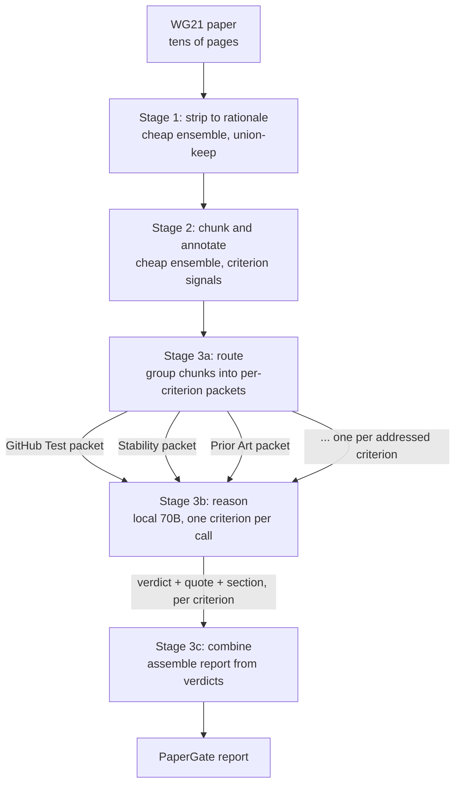

<!-- STATUS: proposal - reuses design-label and design-classify - not a crate - depends on the reducer being validated first -->

# PaperGate on local hardware: a query-aware evaluation funnel

## Recommendation

Re-cast PaperGate-style paper evaluation as a three-stage funnel that runs on the local classify and label stack, and reserve the only large-model work for a self-hosted 70B open-weight model reasoning over small, per-criterion packets rather than an Opus-class model reading the whole paper twice.

Build it after `design-label.md`'s reducer is validated, not before. The funnel's strip and annotate stages are the same reduction and signal machinery that document already specifies, pointed at a different consumer, so the load-bearing risk it carries - a reducer that discards intent - is retired there first or not at all. Confidence high on the architecture, because it is query-aware prompt compression applied to a set of criteria that are independent by construction; medium on whether cheap models strip and annotate accurately enough not to hide evidence, which is the one empirical question that decides the whole thing.

The do-nothing option is real: PaperGate works today. It runs two Opus-class subagents in sequence, and for a single paper it is fine. This proposal earns its keep only at volume - a full pre-meeting mailing of 200-plus papers - and on the axis of cost and dependency rather than of quality. Section [What this replaces](#what-this-replaces) states the case honestly.

## What this replaces

PaperGate (`tools-public/tools-wg21/papergate.md`) runs two subagents on the same model as the main context, and its own instruction is explicit that neither may be a lighter model, "because evidence judgment degrades first":

- **Digest** reads the whole paper, strips it to rationale, classifies it library or language, and sizes it to a tier.
- **Evaluate** reads the whole stripped rationale, walks every criterion in the selected set plus three mandatory sections, and writes the report.

Both hold the entire document in context. Evaluate pays attention over the whole rationale while judging one criterion at a time, so it is reading deployment history while judging the GitHub Test and reading wording about alternatives while judging Stability Confidence. That is query-agnostic compression in the sense of the prompt-compression literature: one compressed artifact, the stripped rationale, is asked to serve every downstream question at once.

The funnel changes only where the large model spends its attention. It does not change what PaperGate decides or how the report reads.

## The architecture

Three stages, and the large model appears only in the third. The first two are the mechanical strip, fixed chunking, signal scoring, and pairwise reduction that `design-label.md` already specifies; the third is new, and it is a routing step feeding a local reasoning model one focused question at a time.

### Stage 1: strip to rationale

An ensemble of cheap binary classifiers reduces the paper to the rationale it contains, which is exactly PaperGate's Digest strip: drop proposed wording, drop code listings longer than roughly fifteen lines, drop revision history and acknowledgments and references and boilerplate; keep every sentence that argues, reports evidence, cites deployment, compares alternatives, surveys prior art, prices cost, or defends against an objection.

The ensemble runs several narrow keep-or-drop detectors per passage rather than one model deciding everything, and the rule is union-keep: a passage survives if any detector votes to keep it. This is deliberately conservative, because the failure that matters here is dropping a load-bearing sentence, not carrying a surplus one, and PaperGate's own Digest instruction says the same thing - "when in doubt about a passage, keep it."

### Stage 2: chunk and annotate

Chunk the rationale into fixed token blocks, then run the ensemble again, this time to tag rather than to filter. Each chunk gets a vector of criterion-relevant signals. The signal taxonomy is PaperGate's evidence vocabulary rather than the domain-agnostic action and object taxonomy `design-label.md` uses for progress phrasing:

- names specific implementations, and whether links accompany them
- contains dates or deployment durations
- contains a quantity with a cited source, versus a bare quantity
- names other programming languages, and whether design analysis accompanies them
- makes a claim with no supporting evidence nearby
- discusses alternatives or a competing design
- prices a cost, a complexity, or a freeze
- contains benchmark or measurement data
- argues against standardizing the component, or for the ecosystem being enough

A chunk about three years of production use at two companies lands as `[contains_dates, deployment_history]`. A chunk that says "widely used by thousands of projects" lands as `[makes_claim, no_source]`. The annotator's job is to detect presence and locate it, not to judge quality. That division is deliberate and it is what keeps the cheap models cheap; see [The division of labor](#the-division-of-labor).

### Stage 3: route, reason, combine

**Route.** Group chunks by signal into one packet per criterion the paper actually addresses. The GitHub Test packet is the chunks tagged `names_implementations` and `discusses_standardization_benefit`; the Stability packet is the chunks tagged `contains_dates` and `deployment_history`; the Prior Art packet is the chunks tagged `names_languages` and `design_analysis`. A criterion that no chunk speaks to gets no packet, which is exactly PaperGate's emit rule: a criterion is only worth a section if the paper says something about it, and everything silent folds into the closing paragraph.

**Reason.** Send each packet to the local 70B with one focused question and PaperGate's own definition of that criterion. The model returns a three-state verdict - demonstrated, asserted, or absent - plus the section number and the quote that carries it. The 70B never sees the whole paper. Per criterion it sees a small packet, maybe five to ten percent of the rationale, and answers one narrow question. The packets are independent, so every criterion call runs in parallel.

**Combine.** A small model, or a template engine with light generation, assembles the report from the structured verdicts: one H2 per demonstrated-or-asserted criterion using its quote and section, and one closing "Missing From The Paper" paragraph folding every absent criterion into a single analysis scaled to the tier. The combiner's input is roughly twenty structured verdicts, which is trivially small.

## Why query-aware, and why it is not a stylistic choice

The theoretical grounding is the rate-distortion framework for prompt compression of Nagle et al., "Fundamental Limits of Prompt Compression" (NeurIPS 2024). That work formalizes prompt compression as a trade-off between rate, how much the prompt is shortened, and distortion, how much the answer degrades, and proves the trade-off is governed by a distortion-rate function computable as a linear program.

Its central empirical finding is the one this proposal exploits: query-aware compression, where the compressor knows the downstream question, is dramatically better than query-agnostic compression, where it does not. The gap between the two optimal strategies is large, not marginal.

Map that onto PaperGate. Each criterion is a query. The current tool compresses once - the stripped rationale - and asks that single artifact to serve the whole criteria set at once, up to ten library criteria or nine language criteria, their union for a "both" paper, plus three mandatory sections; that is the query-agnostic regime. The funnel builds a tailored packet per criterion; that is the query-aware regime. The paper says the second strategy has materially more room below the distortion-rate curve, which is the formal statement of the intuition that a delegate judging Stability Confidence should be handed the deployment history and not the wording about allocators.

This is why the decomposition is not merely tidy engineering. The independence of PaperGate's criteria - the tool applies each one separately and scales each to the tier - is what makes per-criterion packets well-defined, and the compression theory is what says routing to them is worth the trouble.

## The division of labor

The reason cheap models can carry stages 1 and 2 is that they are never asked to judge, only to detect and route. Judgment stays with the 70B.

Detecting that a chunk contains a date, names an implementation, or makes a claim with no citation nearby is close to entity recognition and pattern matching, which small encoders do well. Deciding whether "used by 14,000 projects per a code search dated 2024-03-15" is demonstrated evidence while "widely used by thousands of projects" is a bare assertion requires comprehension, and that is precisely the demonstrated-versus-asserted boundary the 70B is handed, on a packet small enough that it has attention to spare.

The one place this division strains is the closing paragraph. "Missing From The Paper" is not a per-criterion verdict; it is a synthesis across every absence, scaled to the tier, that states what a delegate cannot conclude as a result. That is global reasoning over the set of absent criteria, and it is the combiner's hardest job. Its input is small - the list of which criteria came back absent, plus the tier - so a capable model handles it cheaply, but it is the part of the report most likely to need the 70B rather than a template.

## The local 70B decision

Replace the Opus-class subagents with a self-hosted 70B open-weight model, class of Llama 3.x 70B or Qwen 2.5 72B.

The funnel is what makes a 70B viable where it would be a real risk otherwise. A 70B asked to hold a forty-page paper in context and track nineteen criteria at once would degrade on long-context attention more than a frontier model does. But stage 3 never asks that. Each call is a small packet and one question, which is the regime where a 70B is strong, and the hard part - finding and grouping the evidence across the whole document - was already done by the cheap stages that do not reason at all. The design plays to the 70B's strength and routes around its weakness.

The economics follow. Two Opus passes over an 8-to-10K-token rationale cost on the order of dollars per paper and depend on an external API's availability, rate limits, and pricing. A local 70B costs electricity after the hardware is bought, has no rate limit, keeps analysis on the machine, and does not change under you when a vendor ships a new model. At the volume this proposal targets - an entire mailing in one batch - that is the difference between a bounded overnight run and a metered one that can throttle halfway. Confidence high, because this is the standard total-cost-of-ownership case for local open-weight models at volume.

Hardware is within reach of the workstation profiles this workspace has already scoped. A 70B at FP16 needs on the order of 140GB of VRAM, which is two 80GB cards; at 4-bit quantization it fits in roughly 48GB, a single high-VRAM card or a dual consumer-card build. Batch-one generation on such hardware runs in the tens of tokens per second, so a full funnel run lands in well under a minute per paper once the parallel criterion calls are accounted for. These are order-of-magnitude figures, not measurements, and the honest number waits on a benchmark of the chosen checkpoint on the target card.

## Relationship to the existing design

This proposal introduces no new crate. It is the `promptforge-ext-label` pipeline with a different consumer bolted to its output.

- **Stage 1 and Stage 2 are `design-label.md`.** The mechanical strip, fixed-token chunking, signal scoring on a small encoder, and pairwise tree reduction are already specified there, down to the ONNX sessions, the FP32 precision decision, and the export gate inherited from `design-classify.md`. The only change is the signal taxonomy: PaperGate's evidence categories in place of the domain-agnostic action and object signals used for progress phrasing.
- **Stage 3 is new, and it is heavy.** `design-label.md`'s consumer is a 270M decoder composing a five-word status line. This proposal's consumer is a 70B reasoning over evidence packets and returning graded verdicts. The label pipeline's output feeds a phrase; the funnel's output feeds a judge. Nothing in the reduction machinery cares which, which is the point of keeping the reducer domain-neutral.
- **It inherits the reducer's risk verbatim.** `design-label.md` is explicit that the reducer, the model that merges two chunks while preserving intent, is the only component with no off-the-shelf checkpoint and the one to validate first. This proposal cannot be more reliable than that reducer, because a packet assembled from chunks the reducer garbled is a packet the 70B will judge wrongly with full confidence. Build order is therefore fixed: reducer first, funnel second.

## Cost and latency, honestly

| Step | Model | Input | Runs | Relative cost |
|---|---|---|---|---|
| PaperGate today: Digest | Opus-class | full paper | 1 | high |
| PaperGate today: Evaluate | Opus-class | full rationale | 1 | high |
| Funnel: strip | tiny encoders | full paper | 1, parallel | low |
| Funnel: annotate | tiny encoders | rationale chunks | 1, parallel | low |
| Funnel: reason | local 70B | small packets | one per addressed criterion, parallel | medium |
| Funnel: combine | small model | roughly 20 verdicts | 1 | low |

The large model runs more times but on far smaller inputs, and every criterion call is independent so wall-clock time is set by the slowest single packet rather than by the sum. The reduction stages cost what `design-label.md` prices them at; the reasoning stage cost scales with the number of criteria the paper actually addresses, which the emit rule already minimizes.

The latency caveat from `design-label.md` applies here too and matters more. The reducer decodes autoregressively at every level of the tree, and that cost does not batch away. For PaperGate the input is a whole paper, so the strip and reduce stages are heavier than the fan-out-item case the label crate optimizes. Unlike progress labels, though, a gating run has no interactive deadline: a paper is a file, its evaluation is a batch job, and a run that takes a minute in exchange for costing electricity instead of API dollars is a good trade. The funnel is a throughput play, not a latency play.

## Risks and tensions

**The strip stage can hide evidence, and the failure is silent.** If a cheap detector drops the one sentence where the author records three years of deployment, no packet carries it, and the Stability evaluator reports it absent. The report then names a gap the paper does not have. Union-keep conservatism is the mitigation, but conservatism trades against the compression that motivates the whole design, and the boundary is a threshold to tune rather than a fact to assert. This is the make-or-break risk and it is empirical.

**Annotation miscategorization misroutes evidence.** A chunk that argues against standardizing but is tagged only `discusses_alternatives` lands in the wrong packet, and the steel-man evaluator never sees the paper's own best argument against itself. Strategically overlapping signals - letting a chunk carry more than one tag and appear in more than one packet - is the hedge, at the cost of larger packets.

**The 70B may miss the judgment calls Opus makes.** PaperGate's own instruction refuses a lighter model on the Evaluate step because evidence judgment degrades first. The bet here is that a small focused packet recovers what a smaller model loses on a large one. That bet is plausible from the context-degradation literature but it is not yet measured on this task, and the demonstrated-versus-asserted line is exactly where a weaker judge would slip.

**Reused infrastructure means shared fate.** Every reason `design-label.md` gives for FP32, for the export parity gate, and for building the reducer first applies unchanged. This proposal adds no independent validation path; if the reducer is not retired there, it is not retired here.

## Confidence

| Area | Level | Why |
|---|---|---|
| Query-aware decomposition is the right shape | high | It is query-aware prompt compression, and the criteria are independent by construction, so per-criterion packets are well-defined and the compression paper says they have room below the curve |
| Strip and annotate preserve the evidence | medium | The one empirical question that decides the design; union-keep is conservative but the threshold is unproven and a dropped sentence fails silently |
| 70B judgment on small packets matches Opus on full rationale | medium | Plausible from context-degradation findings; the demonstrated-versus-asserted boundary is where a weaker judge would slip, and it is unmeasured on this task |
| Local 70B wins on cost and dependency at volume | high | Standard total-cost-of-ownership case; electricity versus per-paper API dollars across a full mailing |
| Reuse of the label and classify machinery | high | Stages 1 and 2 are `design-label.md` with a different signal taxonomy; no new crate, no new inference stack |
| Latency | low-to-medium | Inherits the reducer's autoregressive cost, which is heavier on a whole paper than on a fan-out item; acceptable only because gating has no interactive deadline, and none of it is measured |

## Open

- Whether the annotate stage should reuse `design-label.md`'s single shared encoder with a new head set, or a separate fine-tune, given the signal taxonomy is PaperGate's rather than the progress taxonomy.
- Whether tier sizing - trivial through massive, which scales every severity judgment - is a cheap classifier in stage 2 or a dedicated small step, since the combiner needs it to weight every gap.
- Whether the combiner can be templated for the per-criterion H2 sections and reserve the 70B only for the "Missing From The Paper" synthesis, which is the one genuinely global piece of writing.
- Which 70B checkpoint, and its measured tokens-per-second and judgment quality on a held-out set of already-gated papers, which is the benchmark that turns the medium-confidence rows above into a decision.

*2026-07-27 - papergate-evaluation-funnel*
