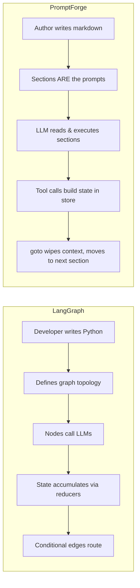

## LangGraph vs PromptForge - Architectural Comparison

These are fundamentally different approaches to the same problem: orchestrating multi-step LLM workflows. LangGraph is a **code-first graph framework** where a Python developer programs nodes and edges. PromptForge is a **markdown-as-program runtime** where the LLM reads prose sections and the model itself is the executor.

### Programming Model

| Dimension | LangGraph | PromptForge |
|-----------|-----------|-------------|
| Program definition | Python code defining a `StateGraph` | A single markdown file with H2/H3 sections |
| Executor | The Pregel engine schedules nodes | The LLM reads section prose and acts |
| Unit of composition | A Python function `(state) -> dict` | A markdown section + optional Lua block |
| Iteration surface | Edit Python, redeploy | Edit one `.md` file |
| Hosting | Any Python process; LangSmith for tracing | Self-hosted vLLM/SGLang (open-weight models) |

### State Management - the biggest philosophical split

**LangGraph**: State **accumulates**. Each node receives the entire state dict and returns a partial update. Reducers (`add_messages`, `operator.add`, custom lambdas) merge updates. Messages grow indefinitely unless the developer manually adds trimming/summarization nodes. The context window bloats unless you fight it.

**PromptForge**: State is **externalized** to a persistent store and the context is **wiped on every `goto`**. Each section starts fresh - it pulls only what it needs through tool calls. The model never sees the full history; it sees its own section's prose plus whatever state it asks for. This is the design's central bet: fresh focused context (~300 tokens) beats accumulated context (~113K tokens), supported by Chroma's LongMemEval and EMNLP 2025 findings.

### Tool Calling

**LangGraph**: `model.bind_tools(tools)` gives the model ALL bound tools. There is no automatic per-node scoping. If you want different nodes to see different tools, you create different model instances with different tool bindings. `ToolNode` is a dispatcher that only executes what the model requests, but the model *sees* everything it was bound with.

**PromptForge**: Per-section tool scoping via `tools.add(...)` in the Lua block. A section sees 5-10 tools, never the full library. This is load-bearing for reliability on mid-size open-weight models (accuracy cliffs past ~30 tools). It also acts as a capability sandbox - an untrusted-input section can be locked to only `set_metadata` and `done`.

### Parallel Execution

**LangGraph**: Static fan-out (multiple edges from one node) or dynamic fan-out via the `Send` API. Nodes in the same super-step run concurrently. Deferred nodes (`defer=True`) handle unequal-length branches.

```python
def fan_out(state) -> list[Send]:
    return [Send("worker", {"chunk": c}) for c in state["chunks"]]
```

**PromptForge**: `fanout(sections, params)` in a Lua block dispatches each section as a parallel `Task` with an isolated state store and fresh context. Results merge back ordered or unordered. The model cannot even tell whether a section was fanned out.

```lua
local tasks = {}
for _, cid in ipairs(store.get("chunk_ids")) do
  tasks[#tasks+1] = { section = "## Extract", params = { chunk_id = cid } }
end
fanout(tasks, {}, { ordered = true })
```

### Subgraph Composition

**LangGraph**: Compiled graphs can be added as nodes. Shared-schema subgraphs pass through directly; different schemas need a wrapper function. Checkpointing auto-propagates.

**PromptForge**: `Task("## Section")` or `Task("research.md")` spawns a subagent with an isolated state store. Parameters are explicit inputs; the serialized store is the return value. Cross-file composition works like function calls. The critical difference: **the subagent's prompt is the literal section prose** - no paraphrasing, no drift.

### Human-in-the-Loop

**LangGraph**: `interrupt(payload)` pauses inside any node; `Command(resume=value)` resumes. The **entire node re-runs from the beginning** on resume - interrupt returns the resume value. Requires a checkpointer.

**PromptForge**: `ask_user(question)` is a blocking tool call. The KV cache persists during the block, so resuming costs nothing. For unattended mode, Lua preconditions check `params.interactive` and skip questions.

### Model Selection

**LangGraph**: Each node is a function - use any model anywhere. `create_react_agent` supports a callable `(state, runtime) -> model` for dynamic selection.

**PromptForge**: `model("slot")` in the Lua block maps to a services config. Main runs on a large driver (GLM-5.2/800B MoE), extraction runs on a 27B, fan-out tests run on a 14B. The tiering is declarative and visible in one glance at the section's Lua.

### Context Window Management

**LangGraph**: **Does nothing automatically.** Messages accumulate. Developer must manually add `trim_messages` nodes or `SummarizationNode`. This is entirely the developer's responsibility and a known pain point.

**PromptForge**: **Structural.** Context is wiped on every `goto`. Each section rebuilds only what it needs from the store via tool calls. The maximum context any section sees is: section prose + Lua-injected context + tool schemas + whatever state the model pulls. No trimming needed because nothing accumulates.

### Failure Detection

**LangGraph**: Nodes can raise exceptions. Conditional edges can route errors. But there's no built-in "did the model complete the work?" signal beyond whatever the node function checks programmatically.

**PromptForge**: Three-layer signal: (1) `done()` must be called - stopping without it is a detectable failure, (2) Lua postconditions validate the store after `done()`, (3) tool-call tracking catches required tools that were never called. Retries are automatic.

### The Design Philosophy Gap



**LangGraph** is a **developer-facing orchestration framework**. The developer defines the topology, writes the node logic, manages state schemas, and the framework handles scheduling and persistence. The LLM is a component called *within* nodes - it doesn't drive the control flow.

**PromptForge** is a **prompt-author-facing runtime**. The markdown IS the program. The LLM reads its section, calls tools, and transitions itself via `goto`/`Task`. The runtime is a thin harness (~300-800 lines) that parses sections, runs Lua, and dispatches tool calls. The model drives the control flow; the developer writes nothing per-pipeline.

### When Each Wins

**LangGraph wins when:**
- You want deterministic control flow that never depends on model judgment
- You're using frontier API models where context window management is less critical
- Your team thinks in code, not in prompts
- You need the LangChain ecosystem (tracing, evaluation, deployment via LangSmith)

**PromptForge wins when:**
- You're running on self-hosted open-weight models (14B-70B) where tool count, context length, and structured output reliability matter
- You want iteration speed - a new pipeline is a new markdown file, no Python
- You want model sovereignty at ~1/100th of frontier API cost
- You need verbatim prompt dispatch (no drift through paraphrasing)
- Your pipelines are "assay-shaped" - multi-step analytical work where each step has a clear scope