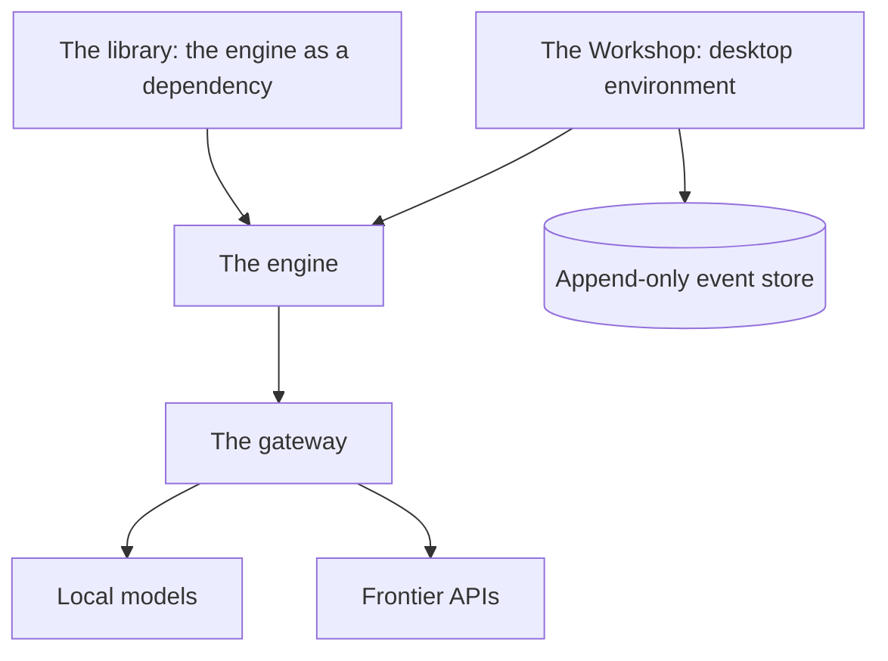
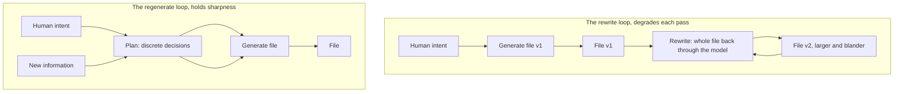

# PromptForge: Human Intent Is the Source Code

An execution engine and workshop for prompt pipelines, built on the principle that everything downstream of human judgment is a build artifact.

Vinnie Falco, August 2026

## Executive Summary

PromptForge is an execution engine that turns Markdown files into executable AI prompt pipelines, built around a Rust library that parses and runs them against any OpenAI-compatible endpoint. The Workshop is a standalone local application that wraps the engine in an environment where every run, edit, decision, and mistake is recorded. One product, one premise: human intent is the source code, and everything downstream of it is a build artifact.

The product exists to build pipelines that survive context pressure and to build them quickly. A pipeline written as a PromptForge prompt executes with deterministic control flow, isolated sections, and a concurrency limit set in configuration rather than in a model's memory. The same pipeline that once required a chat harness's main context to act as scheduler, tracking dozens of sub-agent dispatches in prose, now runs as a program. The edit-run loop is limited by thinking rather than by setup.

The methodology underneath is a field manual of 120 rules, distilled from 89 working transcripts, that governed how I built prompt pipelines by hand. The engine compiles the structural half of that manual into the runtime itself. Fresh virtual machines per section, a run-scoped store, and engine-controlled fan-out enforce rules that once depended on a model remembering them under the very conditions that make models forget. A rule compiled into structure cannot silently degrade.

The Workshop exists because the conversation is where human judgment happens, and every harness I have used discards it. The reasoning, the indecisions, and the mistakes that explain why the right answer is right are lost when the session ends, and they cannot be reconstructed afterward. The Workshop captures all of it into an append-only, hash-chained event store, paid once at capture time and cheap to extract forever. The data sits still while the extractors improve. The asset appreciates.

## 1. What PromptForge is

### 1.1 The thesis: human intent is the source code

Prompts have become the control surface of serious AI work, and the industry still treats them as disposable text typed into a chat window. The default artifact of a working session is a transcript that disappears when the session ends. The prompt inside it is never versioned, cannot be rerun, and is quickly forgotten. The more serious the work, the stranger this arrangement becomes, because the prompt is where the engineering actually happens.

PromptForge answers that condition with one organizing principle, stated in the design record: human intent is the source code, and everything downstream - plans, prompts, reports - is a build artifact. The corollary follows the way it follows in any build system: version the source; regenerate the artifacts. A prompt file is compiled output. It is produced from intent, it is regenerated when intent changes, and it is never the thing that matters most.

The build-artifact framing is a discipline before it is a mechanism. Source is what a human meant; artifacts are what a machine made of it. Plans, prompts, and reports all sit downstream of the intent, so they can be regenerated whenever the intent improves. Regeneration costs a run rather than a reconstruction. What cannot be regenerated is the intent itself, which is why the system treats capturing it as the operation worth engineering for.

The thesis inverts the usual hierarchy of tooling. In most tooling the generated artifact is the product and the conversation that produced it is exhaust. Here the human's judgment is the scarce resource, and the system exists to keep that judgment in the loop and on the record. Models advise and compare; humans decide. Every design decision in the product, from the engine's isolation model to the Workshop's event store, traces back to that ordering.

A prompt is paid for on every use: every added token competes for the model's attention. A bloated prompt is not a style problem; it is a recurring cost on every run, and it dilutes the human signal the prompt exists to carry. Treating prompts as source-adjacent artifacts, engineered and versioned and regenerated, is what the economics already demanded.

The premise underneath is human-first, and it is stated without apology anywhere in the design. Human judgment is the scarce resource in any AI workflow; model output is abundant and grows cheaper by the quarter. Software that respects that ordering exists to capture and serve the judgment, never to replace it. The isolation, the determinism, and the record keeping in this design are what that premise looks like taken seriously as engineering.

The two halves of the product match the two halves of the problem. The engine answers reliability: how a pipeline survives the conditions that break chat-harness orchestration. The Workshop answers memory: how the judgment that built the pipeline outlives the session that contained it. Neither half is optional to the thesis. An artifact you cannot rerun and a process you cannot recall are both losses of the source.

The product stands on two claims. The first is that the engine makes pipelines reliable: deterministic control flow, structural concurrency, and isolation that keeps context pressure from accumulating across a run. The second is that the Workshop makes the process that built them remembered: a record of every run, edit, and decision that appreciates rather than disappears. If intent is the source, everything else can be regenerated, and nothing that matters should be thrown away.

### 1.2 The system at a glance: engine, gateway, workshop, library

The system has four parts, and the engine is the center. PromptForge turns Markdown files into executable AI prompt pipelines: a prompt is a Markdown document with YAML frontmatter, one H1, H2 sections, embedded Lua blocks, and prose blocks. The engine is the Rust library that parses those files and executes them against any OpenAI-compatible endpoint. The format is deliberately boring: a prompt reads like a document and executes like a program, so the artifact a human reviews and the artifact the engine runs are the same file. The execution model is where the discipline becomes structure.

The gateway is the one process that talks to model backends. It serves an OpenAI-compatible HTTP API, holds every credential, routes chat completions to configured backends, manages a model catalog, runs a built-in web search tool, and runs local models on owned hardware. Callers ask for capabilities by name; the gateway substitutes the backend's own model string and restores the caller's name on the response. Nothing else in the system ever touches a key. A local model joins the same catalog as a frontier API, so an owned node and a rented endpoint differ only in configuration.

The Workshop is the third part and the reason the record exists. It is a standalone local application: a desktop window where a prompt is a visible, editable stack of blocks and every run, edit, decision, and mistake is recorded in an append-only event store, on the premise that the record is the product and every interface is a view over it. The Workshop is where the record becomes an environment.

The library is the fourth part. It is the engine packaged as a dependency, so an integrator embeds prompt execution in their own program. The Workshop itself is built on it. Figure 1 shows the four parts and how they connect: the Workshop and the library sit on the engine, the engine talks only to the gateway, and the gateway fronts every model backend, local or frontier.

Figure 1. The PromptForge system. The engine executes prompts; the gateway fronts every model backend; the Workshop records everything; the library embeds the engine.

## 2. Where it came from

The product has the shape it has because I built serious pipelines the hard way first. The background is compressed on purpose, and it is only four things: what the apprenticeship looked like, what it broke on, what I measured, and what I recognized. The product is the point; the history only explains why the product looks like this.

### 2.1 The apprenticeship: serious pipelines inside a chat harness

The tools were single self-contained Markdown files executed by a chat harness's agent. The harness was Cursor, the AI code editor: its agent dispatches sub-agents, and its main context held the orchestration. A working session looked like this: the main context read a plan, dispatched sub-agents to execute steps, read their outputs from files, and wired the files together. The main context was the scheduler, the memory, and the assembly line.

The pattern was genuinely clever, and for a long time it held real pipelines together. Sub-agents were dispatched by reference: the dispatch prompt contained only the tool file's path and a tag name, and the sub-agent grepped the tag and followed the enclosed block. This prevented the orchestrator from paraphrasing engineered instructions under context pressure. Scratch files were the data bus between steps, and assembly was mechanical shell concatenation. The main context read structured output from files, never from sub-agent return values, which kept raw web content out of the main window.

The supporting rules held the pattern together. Every factual claim was confirmed against a second independent source, the two-source rule. Every sub-agent that touched the web recorded its sources in a Source Log, one entry per URL, deduplicated by the main context. A sub-agent that could not verify a fact omitted it rather than inventing it. Each of these rules was a sentence a model had to remember, and each was load-bearing. The two-source rule was the only thing standing between a pipeline and a confident fabrication. The Source Log was the only thing that made a hundred web fetches auditable afterward. These were prose rules, enforced by discipline, and they worked as long as the discipline held.

The canonical dispatch template, taken verbatim from the Staker, shows both the ingenuity and the cost:

> Grep the tag {tag} in tools-public/tools/staker.md and follow it verbatim. Values: {only the mechanical run values this task needs}. Inputs: {paths}. Output: {path}. Return one status line.

Every guarantee in the pattern depends on the orchestrator's attention holding. The orchestrator is a model, its attention is a finite budget, and scheduling spends that budget. The Staker was the largest pipeline I built this way, and it broke in instructive places.

### 2.2 The Staker: a sixteen-step pipeline as stress test

The Staker is a stakeholder-analysis pipeline, built for governance analysis of bodies like WG21, the ISO C++ standards committee. Given an organization, it surveys the public record, identifies who holds power and who captures benefit, runs a battery of diagnostic tests drawn from institutional theory, challenges its own findings adversarially, hunts for dark stakeholders - actors who benefit invisibly - and writes an Assessment: themed dossiers, a stakeholder register, key judgments with confidence tags. Like every tool in the set it ships as a single self-contained file with its own persona; the Staker's framing is a vampire-hunter theme, which is where the name comes from.

The scale comes first, because the scale is what made it a stress test. The pipeline runs sixteen numbered steps, twenty-two once sub-steps are counted. It runs a diagnostic battery of 53 baked-in tests across eight clusters, plus up to ten domain-specific rules discovered at runtime. A full run dispatches roughly 40 to 60 sub-agents (estimate, medium confidence). The pipeline is a ten-way parallel survey, stakeholder identification, parallel stakeholder research, the diagnostic battery in nine batches, stakeholder assessment, relationship mapping, an adversarial challenge pass, dark-stakeholder detection, directional research, coupling analysis, allocation, a packet builder, parallel writers, and two audit passes.

The Staker proved the pattern could do real work, and did it at scale. It also exposed the pattern's limits, and the failures were three. The orchestrator re-interprets what it understands: an instruction read is an instruction rewritten, and the rewrite drifts. Quantified constraints drop under context pressure: the concurrency rule was prose - run at most 4 sub-agents at once - and a model must remember to obey it on the fortieth dispatch. And every sub-agent re-read the whole tool file to find its own instructions, paying the full prefill cost of the file for a tag's worth of content. None of these failures is a bug in the ordinary sense. Each is the predictable behavior of a capable model asked to hold an operational discipline in working memory while also doing the work.

The size is where the symptom shows. At the July measurement the Staker stood at 138,184 characters and 1,404 lines, against a median tool size of 31,049 characters across the 23 tools in the same directory: more than four times the median and 40 percent larger than the next-biggest tool. It has grown since, to 139,587 characters as of August 24. Much of that length is orchestration procedure, rules for dispatching sub-agents and concatenating files, rather than the stakeholder analysis the tool exists to perform. The field manual was written to hold this together.

### 2.3 The field manual: one hundred twenty rules from eighty-nine transcripts

The manual is how-to-falco.md, "How to Build AI Tools and Prompts," dated 2026-08-07. It was distilled from 89 chat transcripts via an evidence packet and verified against the source material. It holds 120 numbered rules in seven groups: writing instructions models follow; tool prompt architecture; plan shaping and data flow; subagent discipline and orchestration; pipeline design and composition; document shaping and prose craft; testing, debugging, and iterating. The groups span the whole craft, from the sentence level - how an instruction is phrased so a model cannot misread it - to the pipeline level, where data flow and composition decide whether a run coheres at all. It is the distilled practice of the apprenticeship, written down so the next pipeline would not relearn it.

The manual's introduction has two binding ideas. Keep the main context clean by dispatching all work to subagents. Write every instruction so only one reading is possible. Everything else in the 120 rules is an application of those two. The manual closes on the line that matters most: the human is the final compressor.

Then came the turn. A manual binds only while the model remembers it. Context pressure is exactly the condition under which the rules are needed most and remembered least. The Staker's failures were not failures of the manual; they were the ceiling of prose discipline itself. That ceiling is why the engine exists.

### 2.4 Two measured effects: semantic blur and the fan-out asymmetry

Two measurements from the apprenticeship later became design decisions in the engine and the Workshop. The first is semantic blur, from "Semantic Blur: Why Rewriting a Prompt File Degrades It," dated 2026-07-26. Three prompt files under version control were rewritten by a model over three weeks. All three grew with no new capability: the Architect from 49,831 to 59,128 characters (plus 18.7 percent), the vibe-coding how-to from 44,345 to 63,665 (plus 43.6 percent), the prompt rulebook from 10,612 to 26,089 (plus 145.8 percent). The rulebook began as 1,737 words of bullet-form rules and reached 4,325 words.

The growth concentrated in commits labeled "refactor": one commit added 83.1 percent to the rulebook in a single pass, and another added 31.2 percent to the vibe-coding how-to. The mechanism is regression toward the mean. A model asked to rewrite a file regenerates every token from its prior distribution, which favors completeness, justification, and formal register: the properties of average technical writing and the wrong properties for a compressed instruction set. The first version is sharp because it is conditioned on human intent, which sits at the tail of the model's distribution. Each rewrite conditions on the model's own prior output, nearer the center, so the human signal decays pass over pass. The prior's pull is not malicious; it is the model doing what it was trained to do, which is produce what good documents look like on average. A compressed instruction set is not an average document, and that mismatch is the whole injury.

The cleanest instance is a substitution in the vibe-coding how-to. The first version justified a rule with a measurement:

> a model asked to review its own work in the context that produced it does worse than not reviewing at all, moving GPT-4 on GSM8K from 95.5% to 91.5% after one round and 89.0% after two

The sixth version states a general claim instead:

> a model reviewing its own work in the context that produced it does worse than not reviewing at all, and models favor their own output when they can see it

The checkable number left; the unverifiable assertion stayed. The Staker is named in that report as the terminal case: still recognizable, every surface encrusted with detail added one pass at a time. The fix follows from the mechanism: the plan holds discrete decisions, which survive translation, while prose is continuous and drifts. Preserve the plan, regenerate the artifact, never rewrite the file. The irony, stated in the report itself, is that the Architect - a plan-mode tool that accumulates design intent through dialogue into a reviewed plan document - already prescribed this for its own outputs and was itself degraded by the practice it forbids. The lesson's stated confidence is high for the measured corpus, medium that it generalizes. Figure 2 draws the two loops side by side: the rewrite loop, where the generated file re-enters the model every pass and degrades toward the average, and the regenerate loop, where new information enters the plan and each file is a fresh single pass that holds its sharpness.

Figure 2. Two revision loops. In the rewrite loop the generated file re-enters the model every pass and drifts toward the average. In the regenerate loop, new information enters the plan and the file is regenerated in a fresh single pass constrained by preserved decisions.

The second measurement is the fan-out asymmetry, from "The Fan-Out Problem: Why AI Is a Critic, Not an Author." Generation samples from a learned distribution concentrated on the typical; evaluation is a local ranking computation over a candidate, which is cheaper and more reliable. The best answer sits at the tail of the distribution by definition of being atypical, and the generator has no operator that points toward the tail. Raising temperature spreads mass around the typical; it does not push toward the peak.

Best-of-N partially escapes: expected quality grows logarithmically in the number of samples, and the ceiling is whichever is weaker - how far from the mean the generator can reach, or whether the evaluator recognizes the tail as best. The critic reliably separates competent from incompetent. It is less reliable separating good from great, because great is rare in its training data, so pure AI-on-AI loops plateau at polished but safe. The lesson's final claim, stated at high confidence:

> An LLM generator samples from a distribution centered on the typical. The optimum lives at the tail of that prior. The generator has no internal operator that points toward the tail, so single-shot generation returns the median of the prior conditioned on `S`, never the peak. Evaluation is ranking, which is cheaper than search, so the evaluator is stronger than the generator. All peak-quality AI output is therefore the product of a directed loop in which an evaluator steers a generator, and the whole system is bounded above by the evaluator's own calibration. A human with taste in the evaluator seat raises that ceiling; a human with taste in the generator seat, using the AI as a filter, raises it further. (high confidence)

Each effect has one lesson. Semantic blur: preserve the plan and regenerate the artifact, because discrete decisions survive translation and prose does not. The fan-out asymmetry: seat the model as critic and the human as judge, because evaluation is cheaper than generation and the critic's ceiling is good-versus-great. The first lesson points to plan mode; the second points to the leaderboard, and both become Workshop machinery.

### 2.5 The recognition: the chat is the asset

The design record is direct about this: today's harnesses discard the most valuable substance in the workflow - the reasoning, the indecisions, and the mistakes that show why the right answer is right. The conversation is where the judgment happens. Every harness I worked in threw it away at the end of the session. The artifacts survive; the reasoning that produced them does not, and it is the reasoning that makes the artifacts improvable.

The evidence that the reasoning cannot be reconstructed afterward is the Chatlight transcripts. Chatlight is a transcript-harvesting system I built to extract chat sessions from the harness and preserve them as durable files that can be searched, mined, and replayed - the bridge between conversations that disappear and a record that persists. The transcripts include a 1,201-line architect session log harvested from the chat harness. Reading it back, the reasoning is all there and nowhere else: absent from the artifacts the session produced, absent from my memory, impossible to reconstruct from the diff.

The design record is blunt about the economics of all this: capture is paid exactly once while extraction is cheap forever. The data sits still while the extractors improve. The asset appreciates. A recorded session from a year ago is more valuable today than the day it was captured, because the tools for mining it are better and the session itself is unreproducible. A captured session is the rare asset that gains value by sitting still, because every improvement in extraction tooling retroactively improves every session already in the store.

Skillgate is the working example of those economics. It ingests Chatlight's captured sessions and characterizes the operator's skill by cleverly compressing their prompts and model replies. The compression turns a pile of transcripts into a verdict about the person who produced them. Capture was paid once, when the sessions were saved; a tool like Skillgate mines the record forever. The sessions themselves do not change after the day they were captured; only the tooling that reads them does.

The apprenticeship produced the engine first, because pipelines kept breaking under context pressure. The recognition produced the Workshop, because the process that built the pipelines was worth more than the pipelines. The engine came first; the Workshop is where the recognition becomes a product.

## 3. The engine: prompts as executable programs

### 3.1 A prompt is a program: Markdown, Lua, and sections

A PromptForge prompt is a Markdown document with YAML frontmatter, one H1, H2 sections, embedded Lua blocks, and prose blocks. The frontmatter declares the prompt's name, description, and a promptforge version key, and unknown frontmatter fields are rejected rather than ignored. One frontmatter key caps the model round-trips a section may take. The file is the program; the engine is the Rust library that parses and executes it.

A run executes the file in a fixed order. The H1 region, the preamble, runs once before any section: it declares tools and models, sets variables, and can short-circuit the whole run by returning a value. Then the H2 sections walk top to bottom in fall-through order. A section whose Lua returns nothing falls through to the next. Within a section, the last prose block runs a full tool-call loop against the model; earlier prose blocks run single-shot. The distinction between the two prose-block kinds is practical. A single-shot block formats one request and takes one answer. The tool-call loop lets the section's model call its scoped tools, read the results, and continue until it produces a final answer or exhausts its round-trip budget.

Control flow is explicit and written in Lua. jump(target) transfers control to another section and clears the conversation. execute(target, input) runs a section as a subroutine with a fresh virtual machine and a fresh conversation, nested to a fixed depth. The two transfer forms differ in what survives. jump abandons the current conversation entirely, which is the right move when a phase is finished. execute preserves the caller and returns the subroutine's answer as reply, which is the right move when the work is one step in a larger argument. The orchestration that the apprenticeship wrote in prose - dispatch this, then that, then assemble - is ordinary control flow here, and it cannot be paraphrased because it is never read aloud.

Each section's VM provides a fixed environment: args, the run input; sys, sealed runtime metadata; var, a JSON-only data bridge that persists across sections; store, the virtual filesystem; tools; log; and reply, the previous section's answer. Prose blocks support template substitution through double-brace paths into args, reply, var, sys, item, and section-local globals. The template paths are the section's window onto the run. A prose block can interpolate the run input, the previous section's answer, any value in var, and the sealed runtime metadata. The prompt the model sees is assembled from structured state rather than copied forward from an earlier message. The shape of the environment is the shape of the discipline: state moves through named, structured channels rather than through a growing conversation.

The sandbox is deliberately small, because a prompt is code, and code should never surprise the person who wrote it. The Lua environment provides only the string, table, and math libraries, and dangerous globals are removed. A runaway block is aborted at an instruction ceiling, and each virtual machine has a memory ceiling. The store is a run-scoped virtual filesystem shared across sections, with write, read, append, str_replace, glob, exists, and delete. Paths are validated: forward slashes only, no traversal, no Windows device names, a length limit. str_replace refuses ambiguous matches, because a silent wrong edit is worse than a loud refusal. The store plays the role scratch files played in the apprenticeship, with the validation the shell never provided. State between steps moves through named paths with checked writes, and the assembly that used to be mechanical concatenation is a read from the bus.

Models and tools are declared by capability, not by name. Models are declared by capability description and resolved semantically against the gateway's catalog at runtime, with hard constraints - thinking, context, temperature, max_tokens - filtering before resolution. models.default sets the baseline, models.use overrides per section, and models.infer runs a single tool-free inference round from Lua. Tools are declared by capability description and resolved by the picker; a declared tool is invisible to the model until scoped with tools.always or tools.add, and tools.add_local declares a tool backed by a Lua function inside the section. Untrusted tool output is wrapped in a CSPRNG nonce envelope before reaching the model, so fetched content cannot inject instructions. Capability-based declaration pays off beyond safety. A prompt that names capabilities rather than vendor model strings survives a backend change as a configuration edit rather than a rewrite. The same prompt file runs against a frontier API or a local GGUF model without modification.

Two design choices deserve their reasons, because both are the semantic-blur lesson applied to pipeline state. var is JSON-only because discrete data survives translation while prose drifts: state that must survive the run travels the discrete channel. And every section gets a fresh VM and a fresh conversation, so context pressure never accumulates across a run. Isolation is the property everything else builds on: the fortieth section executes with the same attention budget as the first. This is the direct answer to the apprenticeship's central failure. The guarantees no longer depend on an orchestrator's attention holding, because there is no orchestrator. There is control flow, and control flow does not get tired.

### 3.2 Deterministic fan-out and the store

The apprenticeship's concurrency rule - run at most 4 sub-agents at once - was a sentence of prose a model had to remember. fanout(worker, collection) is the same idea made structural. It maps a worker section over a collection in parallel, and the machinery that prose used to request is now guaranteed by the runtime.

Each arm of the fan-out gets its own isolated execution environment: a fresh Lua VM, the current member as item, a 1-based sys.index, and a unique run-global sys.id. The harness assigns the index; the model decides only what requires judgment. The division of labor is the apprenticeship's dispatch template dissolved into semantics: what used to be a quoted instruction a sub-agent had to follow is now a property of the execution arm the section runs in. Each arm starts with a fresh clone of the caller's var, and arm writes never reach the caller. Isolation is not requested in a dispatch template; it is the shape of the execution.

Results return in collection order, not finish order, and each result has .text, .ok, .item, and .exhausted. Collection-order return keeps downstream assembly deterministic: the caller zips results against the original collection without tracking which arm finished when. The result fields separate the answer from the outcome, so a caller can tell an arm that produced weak output from an arm that never finished. All arms share the run's store, and the store catches the races: two arms writing the same path is a hard error, a write-write race, while store.append from concurrent arms stays legal. Failure semantics are explicit. An arm that exhausts its tool-loop budget soft-degrades into an incomplete stub rather than failing the fanout. A fatal error in any arm aborts its siblings, and cancellation propagates cooperatively. An empty collection is an error, because no work is likely a bug. The soft-degrade rule exists because a long fan-out over real data eventually meets a section that cannot finish. An incomplete stub preserves the other arms' work and lets the caller decide whether the gap matters, rather than discarding a run over one exhausted budget.

The limit is a number in configuration. Operationally this is the whole point: on owned hardware the operator raises a number, and nobody re-trains a model's memory. The constraint that prose could not hold under context pressure in the apprenticeship is now a value the engine enforces on every arm of every run. And when the hardware is owned, raising the number is free: the constraint moves from the model's memory to the operator's configuration, which is where operational limits belong.

### 3.3 The gateway: one process holds the keys

The gateway is the trust boundary of the system, and its design premise is that one process can hold every key safely. It serves an OpenAI-compatible HTTP API. Chat completions, embeddings, and rerank are routed by model kind. The caller asks for a capability name, for example "reasoning-large"; the gateway substitutes the backend's own model string and restores the caller's name on the response. Model resolution is one exact string lookup, and a miss is a 404: no prefix matching, no alias chain, no default model.

Credentials sit in the gateway and nowhere else. The Secret type redacts in both Debug and Display, so a key cannot leak through a log line or a panic message. Environment-variable interpolation in configuration is explicit, and an unresolved variable fails the load. There is no implicit pickup of ambient API keys. A missing secret is therefore a startup error with a name rather than a silent fallback to whatever happened to be in the environment. Any request field the gateway has never heard of passes through to the backend untouched, so new vendor parameters need no gateway release.

Concurrency is a named resource. A dominion is a named pool of compute with one concurrency limit and one bounded queue, shared by everything bound to it. The operator sets the limit, the queue depth, the policy when the queue fills (queue or reject), and whether clients share fairly. Fair scheduling is on by default, round-robin by client header, so one chatty client cannot starve the others bound to the same pool. An endpoint without a dominion is unlimited. Local dominions have a VRAM budget; every bound local model declares a footprint estimate, and an over-booked budget fails validation at boot rather than surfacing as an out-of-memory error mid-run.

Local models are provisioned rather than assumed. The gateway provisions a pinned inference runtime, downloads each local model file with optional checksum verification, and spawns one child process per model. A dead child is respawned once on transport failure. Tool-calling dialect is detected from the child's live properties, with a sidecar file as fallback, and ambiguous evidence is a hard fail, never a silent default. The provisioning story matters because local models are where owned hardware enters the system. A downloaded, verified, pinned runtime is the difference between a node the operator controls and a node the operator hopes about.

The operational surface is built for running unattended. Profiles are named TOML files beside the boot file, merged through include chains - depth-first, cycles rejected, depth bounded - and a profile can select a subset of the catalog with a models allowlist. Profiles switch at runtime through an admin route, and the switch is all-or-nothing by construction: the new configuration is built and validated first, live state is touched only after it passes, and a failed switch leaves the previous state intact. A bad profile edit cannot take down a running gateway. Streaming is a typed relay: every upstream chunk is parsed, the model name rewritten, and re-serialized, and a client that disconnects mid-stream cancels the upstream stream and frees the queue slot in the same unwind. Nothing is buffered raw and nothing is forwarded unparsed, which is what lets the gateway rewrite model names and enforce its accounting on every chunk. Authentication is a constant-time bearer comparison on every request; the health route is unauthenticated.

Two more mechanisms round out the boundary. The built-in web search proxies a search provider with the gateway's own credential, strips tracking parameters, diversifies results by host, and marks output untrusted. For backends without native tool calling, an emulated dialect translates the tools array into a plain-language system guide and parses fenced tool calls back out, with warn-and-continue recovery that surfaces a gateway_warning field rather than failing silently. Holding every key is only defensible when the process that holds them is built like a boundary, and this one is: redacted secrets, fail-closed configuration, bounded queues, constant-time authentication, and fetched content marked untrusted at the edge. This is what it takes for one process to hold the keys.

### 3.4 The library and the tools at the edge

The library completes the system. It packages the engine as a dependency, so an integrator runs a prompt or an agent program inside their own process. The Workshop is built on it, and any other program can be. The surface is deliberately small: hand the library a prompt file and an input, and it returns the run's result.

Two tool mechanisms deserve their reasons, because both are the boundary discipline applied to model-facing input. The first is semantic tool resolution. A prompt declares a tool by capability description, and a sentence-embedding resolver turns "read a file from disk" into the tool that does it, with no model call and no network. The embedding model is compiled into the library, fetched at build time from a pinned commit and verified against hardcoded digests. Resolution returns one of four outcomes - a unique bind, a duplicate, an ambiguity, or an absence - and absence is a successful answer, not an error. Because the resolver is local and deterministic, binding a prompt's tools costs no model call and no latency budget worth measuring.

The second is safe fetching. The fetch tool returns markdown the model can cite, behind a four-layer SSRF boundary: URL admission, guarded DNS resolution at every hop, redirect re-validation, and no ambient identity - no cookies, no proxy, no credentials. HTML goes through readability extraction; structured text returns verbatim; binaries are refused with a message naming the content type. Response bodies and returned text are capped, and query strings and fragments are redacted from diagnostics so a token in a URL never reaches a log. The boundary treats fetched content as hostile, which is why the no-ambient-identity layer exists: the fetcher has nothing a hostile page could use.

## 4. The methodology: the manual compiled into structure

### 4.1 Rule by rule: what dissolved into structure

The field manual compiled into structure, and the mapping is the evidence for that claim, rule by rule. Each entry in it pairs a rule the operator once had to enforce with the engine property that now enforces it. Thirteen rules, thirteen mechanisms, and not one of them requires the model to remember anything.

- Rule 29, deterministic orchestration for fan-out: fanout() is engine-controlled and each arm gets its index from the harness; the model decides only what requires judgment.
- Rule 30, clear the context on every section transition: each section starts with a fresh VM and a fresh conversation. Structural rather than requested.
- Rule 50, dispatch subagent tasks by reference: each section is its own instructions. There is no 140-kilobyte tool file to grep and no orchestrator paraphrasing it.
- Rule 51, keep the orchestrator ignorant of tool purpose: the orchestrator is Lua control flow. It cannot reinterpret what it does not read.
- Rule 52, keep the main context clean: the main state is var and the store; sections run isolated.
- Rule 54, cap what each subagent returns: arms write to the store and return a status; the caller reads only what it asks for.
- Rule 55, one deliverable per subagent: one fanout arm is one section producing one output.
- Rule 56, isolate each subagent's input: an arm receives its item and a cloned var, nothing else.
- Rule 57, fan out one subagent per independent item: fanout(worker, collection).
- Rule 70, files as the unit of state between steps: the store is the bus.
- Rule 84, writes that naturally replace: store.write overwrites.
- Rule 26, gate on information readiness rather than rigid phases: Lua conditionals around execute and fanout replace numbered-step prose.
- Rule 71, assign each step the cheapest model tier: a model binding per section with capability descriptions, resolved against the catalog.

These rules no longer depend on being remembered. A rule that cannot be forgotten cannot silently degrade, and that is the difference between a methodology and a runtime.

### 4.2 What remains human discipline

The honest boundary is that the engine absorbed the structural rules and the judgment rules remain human. The groups that stay with the operator are writing instructions models follow (rules 1-15), plan shaping (rules 32-48), document craft (rules 88-103), and testing and iteration (rules 104-120). No runtime can enforce whether an instruction admits only one reading; that is a craft judgment, made by a person, at authoring time.

The manual's own closing line has the division of labor: the human is the final compressor. The same stance matches the fan-out lesson: AI generates the typical and judges the specific; evaluation is cheaper and more reliable than generation; the critic's ceiling is good-versus-great, which is why the human holds the standard.

The split is not a concession; it is a correct allocation of attention. The structural rules were the ones a runtime could enforce, and enforcing them mechanically frees the operator from checking them by hand. The judgment rules are the ones worth a human's time, and they are now the only places the human's time is spent. The engine took the rules that were structure waiting to happen. The rules that remain are the ones where the human's judgment is the content.

That hand-off is the Workshop's reason to exist. The rules that remain human - shaping plans, crafting prose, judging output - are the ones the Workshop is built to support. The engine's purpose and the Workshop's environment both grow out of that split.

## 5. What it is for

### 5.1 Pipelines that survive context pressure

Bring the Staker back, this time as a program rather than a prose procedure. The shape is unchanged: sixteen steps, the diagnostic battery in nine parallel batches, parallel writers, adversarial challenge passes. What changes is what holds it together. The same pipeline maps onto sections, execute, and fanout without new machinery, because the machinery the apprenticeship simulated in prose is the machinery the engine actually has.

The ten-way parallel survey is one fanout over a worker section. The diagnostic battery's nine batches are fanout over test clusters, with the runtime-discovered rules joining the same shape. The adversarial challenge pass and the two audit passes are sections reached through execute, each in a fresh conversation, so the challenger is not the author. The packet builder and the parallel writers read their inputs from the store and write their outputs back to it.

When the pipeline is a program, the control flow is deterministic. The concurrency limit is a configuration number rather than a sentence a model must remember. Every intermediate is a store artifact that can be inspected after the fact, and a failed run dumps its partial state for debugging. The ten-way parallel survey, the nine battery batches, and the audit passes all run under those guarantees, each with its own fresh context and its own attention budget.

The operational difference is that the engine does not get tired. It does not paraphrase the instructions, because the instructions are the program. It does not forget the concurrency cap on the fortieth dispatch, because the scheduler enforces the cap instead of recalling it. The three failures of the apprenticeship - reinterpretation, dropped constraints, redundant re-reading - are all closed by the same move: what was prose discipline is now execution semantics.

Determinism buys three concrete properties. Identical inputs produce comparable runs, so two runs can be diffed and the difference means something. A failure reproduces instead of vanishing into a session that no longer exists. And a run can be re-entered from its store artifacts instead of restarted from the top. The pipeline stops being a performance and becomes an artifact. That last property changes how failures get fixed. A vanished failure is folklore; a reproduced failure is a test case. A pipeline that reproduces its failures is a pipeline that can be improved on purpose.

### 5.2 The scheduler is the bottleneck

In August 2026 I ran an infrastructure analysis to answer a concrete question: what would it take to serve a frontier open-weight model to a development team from owned hardware, and would that hardware make pipelines like the Staker faster. The answer I found inverts the obvious expectation. The hardware was nearly idle. The scheduler was the constraint, and the constraint was prose.

A single modern 8-GPU inference node serving a frontier open-weight model - Kimi K3, 2.8 trillion total parameters, 104 billion active, 1.56 terabytes of MXFP4 weights - can serve on the order of a hundred concurrent requests. Under LLM orchestration, at most 4 sub-agents are in flight at any moment, because the orchestrator is a model tracking dispatches in prose. The node sits at roughly 3 percent utilization, not for lack of compute but for lack of parallelism the scheduler can express. Three percent is the signature of a scheduler that cannot say "run these fifty things" without spending its own attention on each one. The workload had parallelism to spare; the orchestration could not hold it.

The Staker's dependency chain forces roughly 22 to 25 sequential rounds of sub-agent execution. At 1 to 4 minutes per round, that is a floor of about 45 to 90 minutes per run, before any human interaction. Meanwhile every orchestrated sub-agent re-reads the tool file: about 40,000 tokens of prefill per dispatch, times roughly 50 dispatches, is about 2 million tokens of redundant prefill per run. In PromptForge each section holds only its own instructions, on the order of 2,000 tokens: about twenty times less prefill per arm. Two million tokens of redundant prefill is not wasted money alone. It is wasted serial time on every dispatch, paid before the sub-agent reads a single token of its actual task. On an inference server with automatic prefix caching, the common prefix across fanout arms is cached once, so arms after the first skip nearly all of their shared prefill.

Combining higher fanout concurrency, the prefill reduction, and deterministic scheduling yields an estimated 6 to 10 times faster wall-clock run on a first execution, and more on re-runs (estimate, medium confidence; workload-dependent). In the same analysis, a fully parallelized PromptForge-executed run lands in the 5-to-8-minute range against the 45-to-90-minute orchestrated baseline. The rack was not the bottleneck; the scheduler was. The practical consequence: the same hardware that crawled through a Staker run in over an hour has the headroom to run it in minutes, once the scheduler stops being a model and starts being a runtime.

### 5.3 The benefits, enumerated

Each benefit reduces to its mechanism.

- Reliability under context pressure: the rules are structure, not discipline.
- Iteration speed: a run is one gesture in the Workshop, so a prompt's edit-run loop is limited by thinking rather than by setup.
- Model independence: prompts name capabilities, not vendor model strings, so backends change in one configuration file.
- Credential hygiene: one process holds every key, with constant-time authentication and redacted secrets.
- Embeddability: the engine is a library, so any program can run a prompt in-process.
- The record as a byproduct: with the Workshop, every run, edit, and decision is captured without being asked for.

The last benefit is the pivot. The record is not a feature you remember to use; it is a byproduct of running. Every other benefit on this list could be adopted piecemeal; this one cannot, because a record you must remember to keep is a record with gaps. That property is the whole reason the Workshop exists; it is the environment built around the record.

## 6. The Workshop: an environment built around the record

### 6.1 The event store is the product; every interface is a view

The Workshop's foundation claim, the one everything else stands on: the record is the product, and every interface is a view over it. The single source of truth is an append-only, hash-chained event log, in the design record's phrase a commit log that forbids force pushes. The block editor, the run panel, the leaderboard, and the chat window are all projections of the log and can be rebuilt from it at any time. That single decision collapses what would otherwise be a dozen features into one discipline: if the log is complete and the projections are honest, then history, comparison, and audit are all the same query.

Two disciplines make the log trustworthy, and both are enforced at the moment of capture. The first: history is immutable while content is destructible. Events are never rewritten, but payloads are separately stored and individually revocable, because secrets get pasted and private blobs land by accident. Redaction tombstones the payload - the event records that the blob existed and when it was destroyed - while the chain stays intact. The second: everything the model sees is captured at the boundary. Every file read, web search response, and fetched page is content-addressed into the store at the moment the model sees it, because a pointer is not evidence. Content addressing deduplicates, so storage cost is proportional to what was observed rather than how often. The boundary rule exists because paths and URLs point at mutable state: the page changes, the file is edited, and only the content-addressed snapshot proves what the model actually saw when it decided.

Three objects are kept distinct, and the distinction is what makes the record honest. The displayed chat is what the user sees. The composed context is what the model actually saw: system prompt, tool schemas, blocks, history. The log is what the database holds, verbatim. Other products blur the first two and lose the third. Here the log holds the composed context verbatim, and the chat is a view over the human-relevant subset.

The same discipline extends to the uncomfortable cases, which are where a record proves itself. Compaction is a recorded event rather than a deletion: the recorder sits at the transport layer, so what the summarizer kept and dropped is auditable, and post-compaction degradation becomes a diffable event with a named culprit. Side effects are transactional in the record: every operation with effects is logged with explicit states and an idempotency key where the operation allows one. A crash leaves an honest unknown, never a false success. These disciplines share one premise: the record is only worth keeping if it can be trusted. Trust here is a property of what the recorder refuses to do - it refuses to rewrite history, refuses to drop the boundary, and refuses to claim success it did not see.

### 6.2 Identity before UI

This is the least glamorous part of the design, and it is the most load-bearing. The identity model exists so that comparison, caching, and history survive renaming, reordering, and rewriting. Every noun has an explicit identity: Artifact, a content-addressed payload; PromptVersion, the hash of the prompt's blocks; PlanVersion, the hash of the plan's decision record; Run, one invocation of a prompt version with bindings; Variant, a run sharing a fingerprint prefix, produced by re-roll; Branch, a named line of decisions; Decision, a recorded human choice against stable IDs; and Contract, the author-ratified manifest, keyed by durable block IDs. Each noun has its work in the model. Artifact makes payloads comparable by content. PromptVersion and PlanVersion make source and plan diffable by hash. Run and Variant make executions addressable. Branch and Decision make the human's path through the work first-class. Contract pins expectations to identities rather than to text.

The load-bearing member is the ExecutionFingerprint, and it has three parts. Invocation identity says which run this is. Execution provenance records what produced it, including the capability grants in force. Cacheability policy declares what is safe to reuse. The third part is the insight: "same inputs means cache reuse" is unsound the moment tools, servers, web state, or hosted models drift, and the fingerprint says so. Any run touching external state is non-cacheable by default unless the policy explicitly says otherwise.

Blocks and decisions have stable identifiers independent of heading, position, or prose. A heading is display metadata, so renaming a section does not sever its history. When identity is severed anyway - an external edit restructures a file, a pasted copy arrives with no provenance - the harness detects the orphan and the human relinks it as a recorded decision. Even the failure mode is designed: severed identity is detected, surfaced, and repaired by a person, with the repair itself entering the record. Identity is infrastructure, and it is defined before any interface is built over it.

### 6.3 Two model planes, one gateway

The Workshop serves two model roles, kept separate. The runtime plane serves the models a prompt uses when it executes: local and open-weight models through the existing gateway. The authoring plane is the assistant that helps develop prompts: frontier models by key at first, and eventually a fine-tuned model that speaks the PromptForge language natively. The separation is the point of the design. A prompt's execution models and the author's assistant have different jobs, different trust postures, and different futures. Sharing one gateway gives both planes the same credential hygiene without sharing a single token of context.

The payoff is self-reinforcing. The Workshop records every chat-to-plan-to-prompt chain with full history, and that record is the training corpus a PromptForge-speaking fine-tune needs. The extraction kinds are already named: SFT pairs, chat excerpt to plan delta and plan to prompt; preference-pair candidates from branch choices; and full process traces. The product generates its own future authoring model as a byproduct of normal use. This corpus contains what scraped data never will: the reasoning at the moment of each decision, the branch choices, the critics' verdicts, and the human's calls, all aligned to the artifacts they produced.

The parser serves the fine-tune twice. At training time it aligns data at block granularity, mapping a chat excerpt to the exact section that changed. At inference the model's Lua fences are grammar-constrained, so output cannot fail to parse. Custom tokenization was considered and rejected: Lua is well-represented in every code model's training data, so the embedding surgery would gain little.

The guardrail is plain: capture is not eligibility. Material recorded for provenance is never implicitly promoted into a training dataset. Eligibility is a separate, explicit, per-item gate at extraction time. The record being complete is why the gate must be explicit.

### 6.4 The window: blocks, store, and run definitions

The window is concrete: three elements, and each is a renderer for something the engine already has. The block stack renders the prompt's sections as vertically stacked blocks, each showing its prose, its Lua environment, and its offered tools. Editing a block edits the section. Nothing is invented; the Workshop visualizes what the engine already executes.

The internal filesystem is the store made visible, grouped by kind: inputs, intermediates, outputs. After a run, every file the run touched is visible, including intermediates. The run definition is a named invocation of a specific prompt: these input bindings, this model profile. Bindings are part of the record, so "same prompt, different sample input" is a first-class comparison.

Fixtures replace dependencies. A prompt's frontmatter declares its inputs and outputs as store paths, and the Workshop binds declared inputs to real files the user picks; it never executes a prompt's environment dependencies. The evidence is papergate, a production PromptForge prompt that analyzes a standards paper: its companion crate links a database client purely to fetch the paper and seed the store, while the prompt itself only reads paper.md. In the Workshop, the user binds paper.md to a sample file and the database is bypassed entirely. The store is the only dependency a prompt actually has. The consequence for daily work is that testing a prompt against a new input is a binding operation rather than an environment operation. No database is provisioned, no credentials are staged, and no production system is touched. The fixture is a file, and the record holds which file it was.

The character sheet completes the picture: an agent's personality is algorithmic. It is a prompt file plus its store manifest plus its tool set plus its model bindings, with an avatar and a one-line charter. Rulebooks are flavor packs, pre-loaded into the store. Swapping the persona is swapping the manifest: the rulebooks in the store change, the charter changes, and the machinery underneath does not. The romance of the persona is a configuration detail, and saying so is the point.

### 6.5 Plan mode is the entropy filter

Prose drifts, as the semantic-blur measurement showed, and plan mode is the defense. It aggregates human intent into a plan document before any action is taken. Small design decisions accumulate across a conversation, some reversing each other; the user reviews and cleans the plan; applying it produces one clean edit instead of the conversation's raw churn. A workshop without this filter is a chat with tools.

The conditioning is three layers, and the prompt is deliberately the weakest. First, the deliverable is redefined: maintaining the plan is the job, so a user instruction triggers integration, not execution. Second, the tool gate removes capability: in plan mode the harness offers reads, search, and one write target, the plan document, so compliance is structural rather than requested. Third, the prompt handles only the residue: state the invariant, teach the integration behavior, define what apply means. The ordering of the layers is where the design is honest about models. Instruction alone fails under context pressure, so instruction is given only the residue. Capability is removed before behavior is requested, and the job itself is redefined before capability is even considered. Each layer assumes the one beneath it might leak.

The result is measurable. An attempted blocked mutation in plan mode is an event in the log, so leakage is counted and compared across prompt versions rather than tuned on vibes. And the plan-mode prompt does not start from a blank page: it starts as a distillation of the Architect, a battle-tested plan-mode prompt, and improves through the product's own loop. It is itself a PromptForge prompt, versioned and branched, with candidates compared on the leaderboard.

### 6.6 The leaderboard replaces the tree view

The fan-out asymmetry is the design rationale for the whole comparison layer. Re-roll produces sibling variants under identical inputs: best-of-N sampling made a first-class gesture, with the model as critic ranking the variants. Branches are navigated by their outputs rather than by topology: the screen shows a leaderboard of artifacts with model-computed diffs and structured verdicts rather than a commit graph. The gesture matters as much as the mechanism. Re-roll is something the operator does on purpose, at the moment they judge the generator has not reached. The variants land side by side under identical inputs, so the comparison is clean. Evaluation is cheaper than generation, so the interface puts the model's effort into ranking.

A verdict is not a scalar, and the Workshop treats each one as a document. Each evaluation record holds the rubric dimensions, the critic's identity and version, the deterministic checks - manifest diffs, blur metrics, counts - candidate ordering, confidence or abstention, run cost and latency, and the human's judgment, stored separately. Keeping the critic's verdict and the human's judgment apart is what allows the critic to be calibrated against the human over time. Every field in that record exists to make the critic auditable. Identity and version let a verdict be attributed. The deterministic checks separate the measurable from the judged. Confidence or abstention labels a weak verdict as one. Cost and latency keep quality from ever being cited without its cost.

Timeline semantics are git's, and they are proven. Revisiting an earlier step always forks; a current pointer marks where you are; forks that produce byte-identical output rejoin automatically, so only real divergence persists. The rejoin rule keeps the branch space honest: a fork that changes nothing collapses back, so what the operator sees as divergence is always divergence that matters. Structured decisions replay cleanly on re-run; free-form edits are ported visibly with human review, never replayed silently.

The ceiling is plain, and the design treats it as a feature. The critic tops out at good-versus-great, so the final call stays with the human. Every comparison surface in the Workshop seats the model as critic and the human as judge, and the interface is honest about which seat is which.

### 6.7 Voice is an input device

Voice is part of the Workshop from the beginning, and the placement signals the product's priorities: capture is the point, and speech is the fastest input the operator has. The technical shape is compact. The window captures the microphone; audio frames stream to the server while interim transcripts stream back. Transcription runs locally, on the operator's own hardware: a fast speech model re-transcribes a sliding window for interims, and a larger speech model, pipelined at silence, produces the final text. Each model gets the job it fits. The fast model's interims form and correct as speech continues. The larger model is the accuracy ceiling for the text that actually lands.

The session's jargon is fed to the decoder as an initial prompt, and an optional cleanup pass sees the recent chat. The session's context becomes transcription accuracy that no standalone dictation tool can offer, which is the entire reason voice belongs in the server rather than in a separate utility.

The rejected options show the principle: browser speech recognition and cloud speech-to-text are both out because audio leaves the machine. Transcription is neither model plane; it is an input device. Its memory budget is fixed in advance, and two move-triggers are named: a prompt wanting transcription as a tool moves it to the runtime plane, and the resident set outgrowing the card moves voice to the gateway. Both triggers are named before either can fire, a habit throughout the design record: the migration path is decided while the decision is cheap.

### 6.8 The sidecar and the flywheel

The long game is a model on the side, patiently watching runs and coming to conclusions that inform the user. The sidecar reads the event store and populates the leaderboard's verdicts. Skillgate - a tool that applies a ruthless analytical rubric to captured sessions and produces verdicts - is the working proof that a prompted model with a strong rubric needs no fine-tuning. Fine-tuning carries the burden of proof against that prompted baseline. That ordering saves a project: the expensive path must prove it beats the cheap one, and the cheap one is already running.

Per-step regression detection has a written specification. In the semantic-blur report, "worse" is already operational: character growth per revision, qualifier density, specific-to-general substitutions. The design record's summary is the whole requirement: the sidecar needs a diff and three counters, not taste. The sidecar advises with memory and never gates, and its per-step verdicts become leaderboard data, so its own accuracy is measured over time. It annotates the record rather than blocking the work, because a gate the operator learns to route around is worth less than an annotation the operator learns to trust.

The preference-data byproduct comes with a hedge. Every branch edit creates two continuations from the same prefix, and the user's choice is a candidate preference signal rather than a clean label: users choose for hidden constraints, cost, or convenience. The database captures the context around each choice, and nothing is auto-labeled at capture time. Later extractors decide which comparisons are valid training pairs.

The advantage is plain: no existing tool captures even the raw material, because no existing tool keeps the tree. The Workshop's record is not a better version of what others store; it is a category of data that does not exist anywhere else.

## 7. Discussion

### 7.1 What the Workshop refuses to be

The refusals are load-bearing, and each has its reason. A general-purpose IDE is dead: it duplicates existing editors, carries extreme execution risk, and defers the interesting problem behind a million solved ones. Cursor and Zed remain the harnesses of record for general work, and the Workshop interoperates with whatever harness the user owns rather than replacing it. The refusal is also an allocation of risk: every solved problem re-solved is schedule spent not solving the unsolved one, and the unsolved problem is the record.

A production runtime is out of scope. The Workshop designs the prompt; finished prompts leave and run elsewhere, embedded through the library or served behind a gateway. There is one current version, the thing at HEAD, with the full immutable development lineage behind it. The Workshop tracks no releases and manages no production lineage, because that is someone else's job and doing it would dilute this one.

Multi-file code mutation is out of scope, and the reason comes straight from the fan-out lesson. Tests give ground truth for "works," but architecture judgment is good-versus-great territory, where the model critic weakens. Semantic codebase indexing and retrieval died with the IDE scope. Branch merge is a non-goal: branch, compare, keep; cherry-pick a turn at most. Read the list again and a pattern shows. Each refused scope is either a solved problem, someone else's problem, or a problem where the model's judgment cannot be trusted. What remains is the territory where the product's premise actually operates.

### 7.2 The build order: a usable tool before the novel core

The build order is one principle, and the sequencing is what keeps the risk cheap. A usable tool lands before the novel core, and capture runs from the first commit, so the record accumulates while the database is still being built.

The window comes first: a chat panel with streaming conversation through the gateway, push-to-talk voice, and recording from the first commit. The first recording is crude by design: an append-only log, no ontology, nearly free. It means the database that arrives later inherits months of real capture rather than starting empty. Plan mode follows: the plan generator, with the three-layer conditioning and the prompt distilled from the Architect. Then the harness: the full tool-call loop and the general tool suite - files, shell, web fetch, subagents - plus the block editor. The harness is the dominant implementation risk, and it lands early deliberately, because a daily-drivable tool is what makes everything else get used.

The novel core lands behind the usable tool: the event store, the identity model, content-addressed payloads, redaction, with the early capture migrating in. Then the comparison loop: run definitions, re-roll, the leaderboard, lazy invalidation. The distinctive product loop completes here: structured prompt, recorded execution, variant, comparison, human choice. Last is the intelligence layer: the sidecar populating verdicts and the timeline query tools, so the authoring assistant reasons about what-ifs from evidence instead of priors.

The design record keeps the novel separate from the known-but-expensive, and the distinction orders the risk. The run-record database is the invention; nothing like it exists. The harness is known practice and expensive craftsmanship, and it is the dominant implementation risk. The UI is known practice throughout. The novel component lands behind a usable tool, because capture never waits for it. Discovering the dominant risk late would be discovering it expensively.

### 7.3 Open questions and honest risks

Four open questions remain, each with a line between what is settled and what is not. The web framework choice for the UI core: the first window is settled - no framework, plain DOM plus a markdown renderer - and the choice is re-evaluated when the block editor lands. The decision is deferred because the information that decides it does not exist yet, and the simple first choice keeps the deferral cheap. The exact harness tool list is open, including whether git gets a dedicated tool with structured returns or rides the shell tool.

The per-prompt-type evaluation rubrics are not settled. The evaluation record's shape is settled - rubric dimensions, critic identity, deterministic checks, ordering, confidence, cost, the human's judgment stored separately - but the yardsticks themselves are not. The product can record a verdict with full provenance before anyone can say precisely what the verdict should measure.

The fourth is the composer's prefix policy: stable-to-volatile ordering, cache breakpoints, compaction timing. It is flagged in the design record as real and unearned, a concern with money attached and no policy yet behind it. Naming it openly follows the same habit as the rest of the design record: a flagged unknown is a work item, while an unflagged one is a future surprise. And the dominant implementation risk is still the harness. Its shape is proven - full capability, no editor - and the cost is craftsmanship rather than invention.

## 8. The human is the final compressor

The field manual's closing line is the thesis: the human is the final compressor. A hundred and twenty rules distilled from eighty-nine transcripts, and the last one is this: the compression that matters is the one a person does.

The fan-out lesson is the same boundary from the model's side. The generator knows the middle. The evaluator knows the region the training covered. The peak is outside both, and a human with taste in the evaluator seat raises the ceiling. The engine took the rules that were structure; the Workshop records the judgment that was not. Every subsystem in the product serves that division. The engine's isolation exists so the machine's part is done with full attention. The gateway's boundary exists so trust has one address. The event store exists so the human's part is never lost. The leaderboard exists so comparison stays cheap and the final call stays human.

The design record's closing thesis is the product in one sentence: human intent is source; prompts and outputs are derived artifacts; history is retained; models advise and compare; humans decide. PromptForge exists to keep the human's judgment in the loop and on the record.

## References

- The PromptForge Workshop (design record), 2026-08-24, Kimi K3 (Cursor agent).
- The PromptForge product guides, one per audience.
- How to Build AI Tools and Prompts (how-to-falco.md), 2026-08-07, Claude Opus 4.6 (Cursor agent); distilled from 89 chat transcripts.
- Semantic Blur: Why Rewriting a Prompt File Degrades It, 2026-07-26, Claude Opus 4.8 (Cursor agent).
- The Fan-Out Problem: Why AI Is a Critic, Not an Author.
- Rulebook: Structuring Reports, 2026-07-22, Opus 4.8 (Cursor agent).
- Rulebook: Revising Model Prose to Human Standard, 2026-07-12, Claude Fable 5 (Cursor agent).
- Chatlight session transcripts, including the architect session log (1,201 lines).

*2026-08-24 - Kimi K3 (Cursor agent)*
