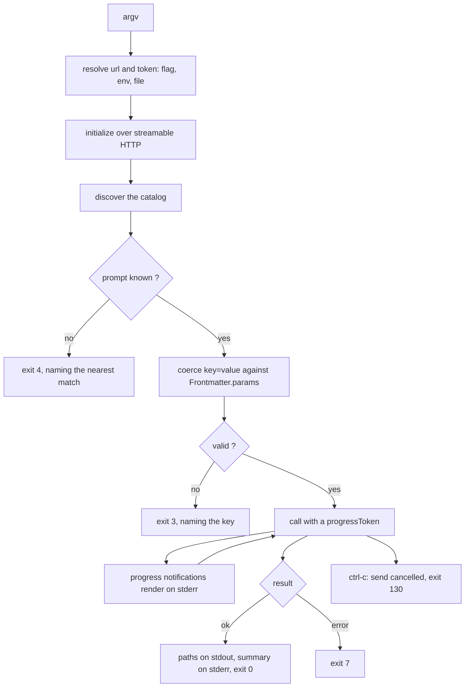

<!-- STATUS: residue - promptforge-cli - forward design, none of it built; the crate's as-built document is crates/promptforge-cli/design-cli.md - see design.md for the system -->

# `promptforge-cli` residue: a terminal client of the MCP server, designed and never built

This is forward design. Nothing specified below exists: the client it describes connects to `promptforge-mcp-server` over streamable HTTP, offers `run`, `list`, and `validate`, resolves a URL and a bearer through three configuration layers, coerces `key=value` pairs against a prompt's schema, renders progress on stderr, and exits with one of eleven documented codes, and no part of that is implemented.

What exists today is a binary of the same name that runs one prompt file in its own process: `promptforge run <file.md> [input]`, with no catalog, no configuration file, no MCP connection, an in-memory store, and success or failure as its only exit statuses. That crate's own `design-cli.md`, at `crates/promptforge-cli/design-cli.md`, is written from its code and is the document to read for what the CLI does.

The divergence is total rather than partial, and several central claims here are not merely unimplemented but inverted. The Scope section forbids in-process execution and any construction of a run configuration, and the crate is exactly that, calling `promptforge_core::execute::run` with a `RunOptions` it builds itself. The dependency table names `promptforge` for data types only, and there is no such crate, only `promptforge-core` used as an engine. The source walk that Scope calls the mechanical form of its own rule does not exist, the crate having no test directory. And the environment variable is `PROMPTFORGE_BASE_URL`, pointing at the gateway, where this document says `PROMPTFORGE_URL`, pointing at a service.

## Scope

This crate is a client of `promptforge-mcp-server`. It resolves a service URL and a bearer token, connects, finds out which prompts the service has enabled, turns `key=value` arguments into a validated JSON object, invokes the prompt, renders the progress notifications the service sends back, prints the result path, and exits with a documented code. Three commands: `run`, `list`, `validate`.

What it does not do, and cannot be made to do without a change to this document:

- Execute a prompt. It constructs no `Executor` and builds no `RunConfig`. There is no in-process execution path, not behind a flag, not behind a feature.
- Resolve configuration on the service's behalf. It reads no `prompts.toml` and no `gateway.toml`. It does not know what a slot is, what backs a canonical tool name, or where an output root points.
- Talk to a gateway or an LLM backend. It holds no model name, no endpoint, and no LLM credential.
- Link an extension. It has no Cargo feature for one and no `register_all`.
- Print a document body. The result carries a path and a short summary, and the CLI passes both along without reading the file.
- Invent a flag for a prompt parameter. There is no `--entity` and no `--target`; the prompt's own `Frontmatter.params` schema is the only definition of what keys are legal.

It links `promptforge` for data types only - `Prompt`, `Frontmatter`, `Event`, `Outcome`, `Destination` - because the wire carries values of those shapes and reconstructing them here would be a second definition. A test walks `src/` and fails on any occurrence of `Executor` or `RunConfig`, which is the mechanical form of the rule above.

## No `--local`

`--local` is dropped. `promptforge run` has exactly one implementation: resolve, connect, coerce, invoke, render, print. Three reasons, in order of weight.

The testability that motivated the flag is already delivered by the core crate. `design-core.md` ships a fake gateway and a recording extension as its test fixtures, so an integration test links `promptforge` directly, builds a `RunConfig`, calls `Executor::run`, and asserts on the exact `Event` sequence and on extension lifecycle ordering. Neither of those is observable through a terminal. `--local` was a worse version of a test that the core crate already supports, exposed as product surface.

Development already runs the whole stack on one machine, and `design.md` makes that environment first-class rather than a degraded mode. The service is therefore on the developer's own loopback or LAN address, and `promptforge run` reaches it with a URL and nothing else. `--local` would exist to bypass a process running a few hundred microseconds away.

One execution path means admission cannot diverge. The gateway owns the only queue, and per-tool rate limits are semaphores held in one process's tool registry; both are process-local by design, which `design.md` states as the reason the CLI is a client in the first place. An in-process run does not merely exercise a second code path for admission - it holds a second budget. A limit bug reachable only under `--local` is a bug in a mode no production caller uses, and the effort spent finding it buys nothing.

Tension: `promptforge run` fails when the service is not running, which is a worse first-run experience than a flag that always works. The compensation is entirely in the error text, which names the URL tried, the precedence layer that supplied it, and the process to start.

The same reasoning decides `validate` below, and it is why that command asks the service instead of resolving configuration locally.

## Command surface

`clap` with the derive API. Connection arguments are global so they may appear before or after the subcommand.

```rust
use clap::{Args, Parser, Subcommand};
use std::path::PathBuf;
use url::Url;

#[derive(Parser)]
#[command(
    name = "promptforge",
    version,
    about = "Run markdown prompts on a promptforge service",
    disable_help_subcommand = true
)]
pub struct Cli {
    #[command(flatten)]
    pub conn: ConnArgs,
    #[command(subcommand)]
    pub cmd: Command,
}

#[derive(Args)]
pub struct ConnArgs {
    /// Service URL. Highest precedence, above PROMPTFORGE_URL and the config file.
    #[arg(long, global = true, value_name = "URL")]
    pub url: Option<Url>,

    /// File holding the bearer token. Above PROMPTFORGE_TOKEN and the config file.
    #[arg(long, global = true, value_name = "PATH")]
    pub token_file: Option<PathBuf>,

    /// Config file to read instead of the platform default.
    #[arg(long, global = true, value_name = "PATH")]
    pub config: Option<PathBuf>,
}

#[derive(Subcommand)]
pub enum Command {
    /// Run a prompt on the service.
    Run(RunArgs),
    /// List the prompts the service has enabled.
    List(ListArgs),
    /// Check that prompts parse and resolve against the service's configuration.
    Validate(ValidateArgs),
}

#[derive(Args)]
#[command(trailing_var_arg = true)]
pub struct RunArgs {
    /// Prompt name, as it appears in `promptforge list`.
    pub prompt: String,

    /// Parameters as key=value. The prompt's own schema defines the legal keys.
    #[arg(value_name = "KEY=VALUE", allow_hyphen_values = true)]
    pub params: Vec<String>,

    /// Print the whole result as one JSON document instead of one path per line.
    #[arg(long)]
    pub json: bool,

    /// Print only the returned value, suppressing output paths. Empty output
    /// when the run returned nothing.
    #[arg(long, conflicts_with = "json")]
    pub raw: bool,

    /// One line per progress notification instead of an updating status line.
    #[arg(long, short, conflicts_with = "quiet")]
    pub verbose: bool,

    /// No progress and no summary. Result on stdout, errors on stderr.
    #[arg(long, short)]
    pub quiet: bool,
}

#[derive(Args)]
pub struct ListArgs {
    /// Show one prompt in full: description, parameters, outputs, tools.
    pub prompt: Option<String>,

    #[arg(long)]
    pub json: bool,
}

#[derive(Args)]
pub struct ValidateArgs {
    /// Prompt files to check in addition to the service's catalog.
    #[arg(value_name = "FILE")]
    pub files: Vec<PathBuf>,

    #[arg(long)]
    pub json: bool,
}
```

`design.md` says the CLI invents no flag names of its own. That rule is about prompt parameters, which are `key=value` and never flags, and the flags above are all client presentation or client connection: where the service is, which of stdout's two forms to emit, and how loud stderr should be. No flag names a prompt parameter, and adding a prompt never adds a flag.

`#[command(trailing_var_arg = true)]` on `RunArgs` is load-bearing: everything after the prompt name is a parameter, so a value like `note=--check` survives intact. The consequence is that `run`'s own flags precede the prompt name.

```bash
$ promptforge run --json staker entity="Bloomberg"     # correct
$ promptforge run staker entity="Bloomberg" --json     # --json is treated as a parameter
error: `--json` is not a key=value pair
  run's own flags go before the prompt name: promptforge run --json staker ...
```

Tension: that ordering is unusual enough that users will hit it, so the error above is part of the design rather than a fallback.

Colour and styling honour `NO_COLOR`, `CLICOLOR`, and `TERM=dumb` through `console`, and there is no `--color` flag. Environment variables are the conventional control and one fewer flag is one fewer thing to document.

## Connection

Three layers per value, highest first:

- `--url` and `--token-file` on the command line.
- `PROMPTFORGE_URL` and `PROMPTFORGE_TOKEN` in the environment.
- `url` and `token` in the config file.

The token's command-line layer is a path rather than a value, because a secret in `argv` is visible in `ps` output and in shell history. `PROMPTFORGE_TOKEN` carries the value directly, since an environment variable is already scoped to the process tree.

The config file is `$PROMPTFORGE_CONFIG` if set, otherwise the platform config directory resolved through `etcetera`: `~/.config/promptforge/config.toml` on Unix and `%APPDATA%\promptforge\config.toml` on Windows.

```toml
url = "http://forge.local:8787/mcp"
token = "..."
```

Resolution records where each value came from, which is why `clap`'s `env` attribute is deliberately not used for these arguments: `env` folds two layers into one value and destroys exactly the provenance the error messages need.

```rust
pub enum Source {
    Flag,
    Env(&'static str),
    File(PathBuf),
}

/// Redacts in Debug and Display. The token never reaches a rendered error.
pub struct Secret(String);

pub struct Conn {
    pub url: Url,
    pub url_from: Source,
    pub token: Secret,
    pub token_from: Source,
}

/// Env arrives as a map rather than being read from the process, so precedence
/// tests never mutate process-global state under a multi-threaded test runner.
pub fn resolve_conn(
    args: &ConnArgs,
    env: &BTreeMap<String, String>,
    config_path: &Path,
    config: Option<ConfigFile>,
) -> Result<Conn, CliError>;
```

The transport is `rmcp`'s streamable HTTP client over a `reqwest` client that sets `Authorization: Bearer` on every request. Connect timeout is five seconds. There is no client-side deadline on a run, because `Limits.run_deadline` is the server's and a shorter client timeout would abandon a healthy run.

Unreachable is the most common failure and gets the most detailed message. It names the URL, the cause, the precedence chain, and the process to start.

```bash
$ promptforge run staker entity="Bloomberg"
error: service unreachable at http://forge.local:8787/mcp
  cause: tcp connect: connection refused
  url came from: C:\Users\vinnie\AppData\Roaming\promptforge\config.toml
  also checked: --url (unset), PROMPTFORGE_URL (unset)
  promptforge run needs promptforge-mcp-server running; start it, or point --url at a service that is
$ echo $?
5
```

Tension: printing the resolution chain makes the common error four lines instead of one, and the noise is paid on every failure to save the one debugging session where the wrong layer won.

A 503 with `Retry-After` is not a failure yet. `design.md` requires every client of the gateway to retry with backoff, so the CLI honours `Retry-After`, otherwise backs off exponentially with jitter, caps total waiting at two minutes, prints each wait on stderr, and exits 9 if the service is still refusing.

## `run`



### Catalog resolution

How prompts enumerate on the MCP surface is settled: `design.md` gives each enabled prompt its own MCP tool, on the tools primitive, and `design-mcp.md` rejects both the dispatcher and the hybrid. `PerPrompt` is therefore the shape every deployment serves today.

One type still absorbs the shape and one function still chooses it, and nothing else in the crate branches on the answer. The justification is no longer that the decision is open, because it is not. It is that `design-mcp.md` records the rejected hybrid as reachable without rework - adding a dispatcher for a demoted tail is additive to a per-prompt surface while the reverse is not - and leaves the catalog size at which that becomes worth doing as an open threshold question. Absorbing both shapes costs one enum, one `invocation` call, and one extra row in the fake-server test matrix, which is a smaller bill than teaching `run` and `list` a second calling convention after forty prompts have already degraded a client's selection. Tension: the crate carries a variant nothing serves, so the second arm of every match on `Catalog` is untested against a real service and is only as correct as the fake server that stands in for one.

```rust
pub enum Catalog {
    /// One catalog entry per prompt.
    PerPrompt(BTreeMap<String, Entry>),
    /// One dispatcher entry taking a prompt name plus its parameters.
    Dispatcher { entry: Entry, prompts: BTreeMap<String, Entry> },
}

pub struct Entry {
    pub name: String,
    pub description: String,
    pub params: Value,
    /// Frontmatter the service published beyond the standard fields, if any.
    pub extra: Option<Frontmatter>,
}

impl Catalog {
    pub async fn discover(client: &Client) -> Result<Self, CliError>;
    pub fn get(&self, prompt: &str) -> Result<&Entry, CliError>;
    /// Name and arguments for the invocation, whichever shape is in force.
    pub fn invocation(&self, prompt: &str, params: Value) -> Result<Invocation, CliError>;
    pub fn names(&self) -> impl Iterator<Item = &str>;
}
```

A miss runs the supplied name against every catalog name by edit distance and offers the nearest if it is close enough, because a mistyped prompt name is the most likely reason a run never starts.

```bash
$ promptforge run stakr entity="Bloomberg"
error: prompt `stakr` is not in the catalog at http://forge.local:8787/mcp
  did you mean `staker` ?
  promptforge list shows all 7
$ echo $?
4
```

Tension: `Entry.extra` carries frontmatter the standard catalog fields have no room for. `design-mcp.md`'s `GET /v1/prompts` publishes the full frontmatter, so the field set is settled, and the CLI still degrades rather than fails when a field is absent, printing fewer columns and omitting keys instead of inventing them.

### Parameters: `key=value` against the schema

The prompt's `Frontmatter.params` is a JSON Schema object and it is the whole definition of the calling interface. The CLI splits each argument on its first `=`, coerces the text using the declared type of that property, assembles one object, and validates the object against the full schema before opening the call.

```rust
pub struct Pair {
    pub key: String,
    pub raw: String,
}

/// Splits on the first `=`. A key must match ^[A-Za-z_][A-Za-z0-9_]*$.
pub fn parse_pairs(argv: &[String]) -> Result<Vec<Pair>, CliError>;

/// Coerces every pair by the schema's declared type for its property,
/// then validates the assembled object against the whole schema.
pub fn build_params(pairs: &[Pair], schema: &Value) -> Result<Value, CliError>;

fn coerce_scalar(raw: &str, ty: JsonType, key: &str) -> Result<Value, CliError>;
```

| Declared `type` | Accepted text | Produces |
|---|---|---|
| `string` | any text, verbatim | a JSON string, never reinterpreted, so `count=3` on a string property is `"3"` |
| `integer` | optional sign then digits | a JSON number; a fractional part is an error, not a truncation |
| `number` | whatever `f64::from_str` accepts | a JSON number |
| `boolean` | `true`, `false`, `1`, `0`, `yes`, `no`, `on`, `off`, case-insensitive | a JSON boolean; anything else errors and prints the accepted set |
| `array` with scalar `items` | the key repeated once per element | a JSON array, each element coerced by `items` |
| `array` of objects, or `object` | a JSON literal | the parsed value |
| any property with `enum` | one enum value exactly | that value; a near miss suggests the nearest |
| `null` | nothing | omit the key instead |
| absent, `oneOf`, or `anyOf` | a JSON literal if the text parses as one, otherwise the text | the parsed value or a string, with the schema deciding afterwards |

Type is read from the schema and never guessed from the text. This is the single rule the coercion layer exists to enforce: a schema saying `integer` turns `count=3` into the number `3`, and a schema saying `string` turns the same characters into `"3"`.

Repetition builds arrays. A key repeated against a non-array property is an error rather than last-wins, because last-wins silently swallows a typo in a long command line. Comma splitting was rejected, since a comma inside a string value is ordinary.

`key=@file` reading a value from a file was rejected. It needs an escaping rule for values that legitimately begin with `@`, and prompt parameters are short identifiers by construction, since anything long belongs in a file a tool reads.

Unknown keys are rejected against `properties` whether or not the schema sets `additionalProperties: false`, because a key the prompt does not declare cannot reach the prompt body. Missing required keys are named together, not one per run.

```bash
$ promptforge run staker entity="Bloomberg" sinse=2024
error: prompt `staker` has no parameter `sinse`
  did you mean `since` ?
  legal keys: entity (required), since, depth
$ promptforge run staker since=2024
error: prompt `staker` requires entity
$ promptforge run staker entity="Bloomberg" since=twenty
error: parameter `since` expects an integer, got `twenty`
$ echo $?
3
```

Defaults declared in the schema are not applied here. The CLI sends only what the caller supplied, so the terminal path and the Cursor path get their defaults from the same place. Validation of the assembled object uses the `jsonschema` crate against draft 2020-12, which is what `schemars` emits, so constraints past type - `minimum`, `maxLength`, `pattern` - fail in the terminal without a round trip. The service validates again and is the authority; this copy exists for a fast, readable error. Tension: two validators, so a construct one accepts and the other does not produces a confusing pass-then-fail, mitigated only by both being the same crate at the same version inside one workspace.

### Invocation

```rust
pub struct Invocation {
    pub target: String,
    pub arguments: Value,
}

pub async fn invoke(
    client: &Client,
    inv: Invocation,
    sink: Arc<dyn ProgressSink>,
) -> Result<Outcome, CliError>;
```

The call carries a `progressToken` in its `_meta`. Without it a conforming server sends no notifications and the run looks hung, which makes this one line the difference between the feature working and not existing.

The result's structured content deserializes into `promptforge::Outcome`. A payload that will not deserialize is a protocol error and exits 1, because a client that guesses at a malformed result is worse than one that stops.

Elicitation is declared as a client capability and answered by writing the question to stderr and reading one line from stdin, only when stdin is a terminal. When it is not, the CLI declines and the service turns that into a failed run. Tension: a prompt that asks a mid-run question cannot run in a pipeline, which is the correct outcome rather than the convenient one.

## Progress rendering

The core emits `Event` through `Observer` in the service's process. MCP carries two useful fields of it - `progress` and `message` - and `design.md` records Cursor rendering the message in place, measured 2026-07-25. The CLI renders the same fields and composes nothing, so the terminal shows what Cursor shows.

```rust
pub struct Tick {
    pub index: u32,
    pub message: Option<String>,
}

pub trait ProgressSink: Send + Sync {
    fn tick(&self, t: Tick);
    fn finish(&self, s: &Summary);
    /// Clears any partial line and restores the cursor. Called on every exit path.
    fn abort(&self);
}
```

`ProgressSink` is the wire-side counterpart of the core's `Observer`, and the projection between them is lossy on purpose. `ToolCalled`, `ModelTurn`, and `Jumped` do not fit two fields, so the terminal does not see them unless the service publishes the serialized `Event` alongside the standard fields; the verbose path consumes that when present and falls back to one line per notification when it is not.

`Tick` carries no `total` because the service never sends one: a run's section count is not known in advance, for the reasons `design-mcp.md` gives. There is therefore no fraction and no filling bar anywhere in this renderer, and `index` is used only to detect that something advanced.

MCP requires `progress` to increase, so a retry arrives as text in `message` rather than as a falling number. The renderer clamps a decreasing index to the previous value, since a conforming server never sends one. Tension: a retried section is visible as words and not as motion, so a long retry loop looks like a stalled section.

`indicatif` draws the line. It handles terminal detection, width measurement through `console::Term`, redraw throttling, cursor save and restore, and display width of non-ASCII text through `unicode-width`, which matters because a `progress` template is prose an author wrote and may contain CJK. A hand-rolled `\r` writer was rejected: it gets width wrong, breaks when the line wraps, and leaves the terminal mid-line on an interrupt, which is precisely the bug that makes interrupt handling look broken. `crossterm` alone has the right primitives but leaves the throttling and width arithmetic to be written here. `ratatui` is a full-screen TUI and would take the alternate screen from a command whose whole point is to print one path.

Progress goes to stderr, always. The stream tested for a terminal is stderr, not stdout, so a run whose stdout is a pipe still gets a live line on the terminal.

TTY mode is one line rewritten in place at most twenty times a second, `ProgressDrawTarget::stderr_with_hz(20)`, template `{spinner} {wide_msg} {elapsed}`. It is `ProgressBar::new_spinner` rather than a bar, because there is no length to give one. `{wide_msg}` pads or truncates to the remaining width, so width is `indicatif`'s arithmetic rather than ours. Below thirty columns the template drops to `{spinner} {elapsed}`, because a truncated label is worse than no label. An absent `message` renders the spinner and the clock alone, which still distinguishes a working run from a hung one.

```bash
$ promptforge run staker entity="Bloomberg"
# stderr: one line, rewritten in place. Four successive frames:
⠋ Gathering source material                                          0:02
⠙ Gathering source material                                          0:18
⠹ Evaluating positions against the record                            0:31
⠸ Writing the report                                                 1:04
# the line is cleared on completion; stderr then carries one summary line:
staker done - 3 sections, 11 turns, 1m12s - 14 positions across 9 sources
# stdout carries the path and nothing else:
C:\forge\out\staker\bloomberg-2026-07-25.md
```

Non-TTY mode appends one plain line per notification with a monotonic offset, no ANSI bytes, no in-place update, suitable for a log file or a pipe. Redirecting stderr is therefore all it takes to get the log form.

```bash
$ promptforge run staker entity="Bloomberg" 2>run.log
C:\forge\out\staker\bloomberg-2026-07-25.md
$ cat run.log
+0.0s Gathering source material
+18.4s Evaluating positions against the record
+43.1s Writing the report
+72.5s done - 3 sections, 11 turns, 1m12s
```

When no notification ever arrives, the TTY form shows a bare spinner carrying the prompt name and elapsed time, and the non-TTY form prints one line at start and one at finish. A silent long call is a legitimate outcome for a client whose service sends nothing, and it must not look like a hang.

## `list`

`list` is one catalog call and no invocation, so it is cheap enough to be the reflex before every `run`.

The human form is aligned columns separated by two spaces, with a header and no borders. Box-drawing characters were rejected because `list` output gets piped into `grep`, `cut`, and `awk`, and because they are what breaks on a Windows code page. The description column truncates to the terminal width when stdout is a terminal and is never truncated when it is not, so a pipe gets the whole text.

```bash
$ promptforge list
NAME    VERSION  DESCRIPTION
critic  2        Review a paper against the committee record
staker  1        Build a stakeholder position report for one entity
triage  4        Classify an incoming paper and route it
```

One prompt in full prints what a caller needs to write the command line, which is the parameter table:

```bash
$ promptforge list staker
staker 1 - Build a stakeholder position report for one entity
keywords: governance, stakeholder

parameters
  entity  string   required  The organization or person to profile
  since   integer  optional  Earliest year to consider
  depth   enum     optional  one of: shallow, full

outputs
  report     file  markdown              required
  positions  rows  stakeholder_position  optional

tools: web_search, web_fetch
```

The `tools` line renders `Frontmatter::tools` verbatim, which is canonical names and nothing else. A prompt's declared state-filing tools live in its `state:` block and the core tools are present in every prompt, so neither is in that list and neither is printed. What the line reports is what this prompt asks the deployment to bind for it, which is the part that can fail to resolve and therefore the part a caller writing a command line needs. Tension: the printed list is narrower than the schema list any section actually sees, so a reader counting tools here will undercount.

`--json` emits one JSON document on stdout and nothing else, an array for the catalog and a single object for one prompt, so `jq` needs no reshaping. `params` is the schema verbatim rather than a rendering of it, because a machine consumer wants the schema.

```bash
$ promptforge list --json | jq -r '.[] | select(.keywords[]? == "governance") | .name'
staker
```

## `validate`

`validate` asks the service. It does not resolve prompts locally.

The question `validate` answers is whether the service would accept these prompts, and the service is the only thing that knows the answer: which extensions were linked, what `prompts.toml` binds each canonical tool name to, whether a declared output root exists, and whether every extension's own `validate` hook passes against a reachable database and a readable model file. A local implementation could not answer any of that without reimplementing the resolution that startup validation already performs, and a second implementation of admission-adjacent logic is the thing this crate rejected `--local` to avoid. The command therefore calls the same validation pass boot runs.

That call is plain HTTP on the service's HTTP surface, not MCP. `design.md` makes tools on the MCP surface a non-goal: a connecting client sees prompts and never tools, so validation cannot be an MCP tool. The service already exposes fire and status endpoints for Django, and this is one more of those. Tension: the CLI speaks two protocols to one service, MCP for `run` and `list` and HTTP for `validate`, and a reader has to know which is which.

Local work is confined to one call: files named on the command line are read and passed through `Prompt::parse` before anything is sent, so a malformed file is reported without a round trip. That is the core's own parser rather than a copy of it. Parsed source for a file not yet in the catalog is then sent for resolution against the live configuration without being registered, which is how an author checks a new prompt before editing `prompts.toml`.

```bash
$ promptforge validate
7 prompts, 7 ok
$ promptforge validate prompts/newcomer.md
prompts/newcomer.md
  error  slot `careful` does not resolve for this prompt
  error  output root `digest` is not configured
7 prompts in the catalog, 7 ok; 1 file checked, 1 failed
$ echo $?
8
```

`--json` emits one document per prompt in an array, each with `name`, `ok`, and `errors`, so a pre-commit hook reads the array rather than the exit code alone.

## Output discipline

- stdout carries the result and nothing else: one absolute path per file output, in declaration order, then the returned value if the run produced one, or exactly one JSON document under `--json`.
- stderr carries progress, the summary, warnings, and errors.
- No ANSI byte ever reaches stdout, whether or not stdout is a terminal.

That split is what makes the command composable.

```bash
$ report=$(promptforge run staker entity="Bloomberg")
$ cat "$report"
$ promptforge run staker entity="Bloomberg" | xargs -I{} cp {} ~/review/
```

The returned value goes to stdout because it is the prompt's product and a caller asked for it, and it goes last so that the common case above - a prompt with one file output and no return value - still yields exactly one line. A prompt that returns a value and writes no file therefore prints just that value, which is what makes `promptforge run classify doc=p1234.md` usable in a shell substitution. `--raw` suppresses the paths and prints the value alone, for the case where a prompt has both and a script wants only the second.

Tension: a prompt with both a file output and a return value prints two different kinds of thing on one stream, and a script reading it needs to know which prompt it called. The alternative, putting the value on stderr with the summary, was rejected because a value a caller has to scrape out of a log is not a return value.

The document body is never printed, and the CLI never opens the file. `design.md` settles this on the service side - the result carries a path plus a short summary so a calling model spends no output tokens re-emitting a report it did not write - and the CLI does not undo it for the terminal. A caller who wants the text pipes the path to `cat`. A returned value is different in kind and is printed: the prompt chose to hand it back, it is bounded by what a model wrote into one tool call, and it is the only way a value reaches a shell.

```json
{
  "run": "3f2a9c1e-6b40-4d1e-9c7a-2b8f5e11d004",
  "prompt": "staker",
  "value": "consistent on ABI stability, one shift on reflection in 2024",
  "summary": "14 positions across 9 sources",
  "turns": 11,
  "elapsed_ms": 72500,
  "outputs": [
    { "name": "report", "path": "C:\\forge\\out\\staker\\bloomberg-2026-07-25.md" }
  ]
}
```

`value` is `null` when the run returned nothing, and is a JSON string in every other case - never a parsed object, even when the prompt wrote JSON into it. The CLI does not know whether the string was meant to be JSON and does not guess: `jq -r .value | jq .` is the two-step a caller writes when it was, and it fails loudly rather than silently reshaping when it was not.

## Interrupts

`tokio::signal::ctrl_c` races the outstanding call, which on Windows covers Ctrl-C and Ctrl-Break, and on Unix `SIGTERM` is handled identically through `SignalKind::terminate`.

The first interrupt sends `notifications/cancelled` for the in-flight request id, calls `ProgressSink::abort` so the terminal is not left mid-line with a hidden cursor, waits up to two seconds for the server to close the stream, and exits 130. A second interrupt exits immediately without waiting.

Whether the server-side run stops is the server's decision, and the CLI does not claim otherwise. MCP cancellation is a statement that the client has stopped caring, not a kill. The message says exactly that.

```bash
$ promptforge run staker entity="Bloomberg"
⠹ [2/3] Evaluating positions against the record                      0:31
^C
interrupted - cancellation sent for run 3f2a9c1e
  the service decides whether to stop; its log and that run id are the record
$ echo $?
130
```

Nothing goes to stdout on this path. A pipeline consumer must never see a truncated path, and an empty stdout with exit 130 is unambiguous where a partial line would not be.

An abandoned run is cheap by construction. `design.md` discards a failed run and reruns it from the start, because every write an extension performs is a replace-all write from deterministic content, so a run that finishes after its client left needs no cleanup. What it does cost is GPU budget the gateway already handed out. Tension: a user who interrupts to free capacity may not free any.

## Exit codes

Codes are contract. A new condition takes a new number rather than reusing one.

| Code | Condition | Source |
|---|---|---|
| 0 | Success | a run completed, `list` printed, `validate` found no failures |
| 1 | Internal error | a bug in the CLI, or a response it could not parse |
| 2 | Usage error | `clap`'s own code for a malformed command line |
| 3 | Invalid parameters | a pair that would not coerce, an unknown key, a missing required key, or a schema violation |
| 4 | Prompt not found | the name is not in the service's catalog |
| 5 | Service unreachable | DNS, connect, TLS, or transport failure |
| 6 | Authentication failure | HTTP 401 or 403 |
| 7 | Run failed | the run started and did not complete |
| 8 | Validation failed | at least one prompt does not parse or does not resolve |
| 9 | Service at capacity | HTTP 503 still refusing after the retry budget |
| 130 | Interrupted | SIGINT or Ctrl-C, per 128 plus SIGINT |
| 143 | Terminated | SIGTERM, per 128 plus SIGTERM, Unix only |

2 is `clap`'s and is left to it rather than remapped, so a malformed command line behaves the way every other `clap` binary does. 9 is separate from 5 and 7 because "come back later" is a different instruction to a script than "your prompt is broken" or "the service is not there".

## Errors

```rust
#[derive(Debug, thiserror::Error)]
pub enum CliError {
    #[error("no service URL configured")]
    NoUrl { config: PathBuf },

    #[error("no bearer token configured")]
    NoToken { config: PathBuf },

    #[error("service unreachable at {url}")]
    Unreachable { url: Url, from: Source, #[source] cause: TransportError },

    #[error("authentication rejected by {url}")]
    Unauthenticated { url: Url, from: Source },

    #[error("prompt `{name}` is not in the catalog at {url}")]
    PromptNotFound { name: String, url: Url, nearest: Option<String> },

    #[error("`{arg}` is not a key=value pair")]
    NotAPair { arg: String, looks_like_flag: bool },

    #[error("prompt `{prompt}` has no parameter `{key}`")]
    UnknownParam { prompt: String, key: String, nearest: Option<String>, legal: Vec<String> },

    #[error("parameter `{key}` expects {expected}, got `{raw}`")]
    Coerce { key: String, expected: &'static str, raw: String, accepted: Option<Vec<String>> },

    #[error("parameter `{key}` given more than once, and it is not an array")]
    DuplicateParam { key: String },

    #[error("prompt `{prompt}` requires {}", missing.join(", "))]
    MissingParams { prompt: String, missing: Vec<String> },

    #[error("parameters rejected by the prompt's schema")]
    Schema { detail: String },

    #[error("service at capacity after {attempts} attempts over {waited:?}")]
    Overloaded { attempts: u32, waited: Duration },

    #[error("run {run} failed")]
    RunFailed { run: RunId, detail: String },

    #[error("{failed} of {checked} prompts did not validate")]
    ValidationFailed { failed: usize, checked: usize },

    #[error("interrupted")]
    Interrupted { run: Option<RunId> },

    #[error("protocol error from {url}")]
    Protocol { url: Url, detail: String },

    #[error("could not read {path}")]
    Io { path: PathBuf, #[source] cause: std::io::Error },
}

impl CliError {
    pub fn exit_code(&self) -> u8;
    /// Renders the headline, the cause, and the actionable follow-up lines.
    pub fn render(&self, to: &mut dyn Write);
}

fn main() -> ExitCode {
    match real_main() {
        Ok(code) => code,
        Err(e) => {
            e.render(&mut std::io::stderr());
            ExitCode::from(e.exit_code())
        }
    }
}
```

`thiserror`, and `anyhow` appears nowhere. Every error has to map to a documented exit code, and `anyhow` erases the discriminant that mapping needs. `main` returns `ExitCode` rather than `Result`, because `Result` in `main` prints the `Debug` form, which is the wrong text for a user.

The variants carry the material their messages need rather than pre-rendered strings - `nearest`, `legal`, `accepted`, `from` - so the follow-up lines are generated at render time and can be asserted in tests. `Secret` redacts in both `Debug` and `Display`, so no error path can leak the token.

## Dependencies

| Crate | For |
|---|---|
| `promptforge` | `Prompt`, `Frontmatter`, `Event`, `Outcome`, `Destination`. Data types only |
| `clap` | Derive argument parsing, and exit code 2 |
| `rmcp` | MCP client, streamable HTTP transport, progress notifications, cancellation |
| `reqwest` | The HTTP client under `rmcp`, and `validate`'s call |
| `tokio` | Runtime and signal handling |
| `serde`, `serde_json` | The wire and `--json` |
| `jsonschema` | Draft 2020-12 validation of the assembled parameter object |
| `indicatif`, `console` | The progress line, terminal detection, width |
| `toml` | The config file |
| `etcetera` | Platform config directory |
| `thiserror`, `url`, `uuid` | Errors, URL parsing, run ids |
| `assert_cmd`, `predicates`, `insta`, `serial_test` | Tests, golden error text, env isolation |

## Tests

- Coercion, table-driven across several schemas: `count=3` against `integer` produces the number `3`; the same text against `string` produces `"3"`; `count=3.5` against `integer` errors; `ratio=.5` against `number` passes; `flag=yes` produces `true` and `flag=maybe` errors printing the accepted set; `tag=a tag=b` against an array of strings produces `["a","b"]` and against a string errors as a duplicate; `filter={"since":2024}` against `object` parses; `depth=fst` against an enum suggests `full`; `entity=` produces `""` on a string and errors on an integer; a `minimum` violation is caught locally; an unknown key lists the legal keys; two missing required keys are named in one message.
- Error text as `insta` snapshots, because the text is the product. Every snapshot is asserted not to contain the token.
- Progress rendering as a unit, not a terminal effect: feed the renderer the notification sequence derived from the core's golden `Event` transcript against a fixed-width fake terminal, and assert the exact byte stream in TTY mode including the carriage returns and clear-line sequences, and the exact lines in non-TTY mode. Widths 200, 40, and 12. A CJK label for display width. An absent `total`. A decreasing index clamped. Zero notifications rendering the fallback.
- Exit codes, one case per row of the table, through `assert_cmd`, asserting the code and the first line of stderr.
- A fake MCP server, in-process, on an ephemeral port, whose one entry sleeps, emits a scripted notification sequence, and returns a scripted result. Scenarios: happy path; unknown prompt; 401; a closed port; 503 with `Retry-After: 1` then success, asserting exactly one retry; a result carrying an error; an interrupt, asserting the server observed `notifications/cancelled` inside the grace period; a malformed result exiting 1.
- Both catalog shapes against the same fake server, asserting `run` and `list` are identical from the outside whichever shape is served.
- stdout discipline across every scenario above: stdout is empty, exactly the paths, or exactly one JSON document, and never contains an ANSI byte.
- Connection precedence as a matrix over flag, env, and file presence, driven through `resolve_conn` with an env map rather than process environment, plus one `serial_test` smoke case using real variables.
- The no-second-engine test: a walk of `src/` failing on any occurrence of `Executor` or `RunConfig`.

## Open

- Whether the no-second-engine rule is worth a Cargo feature on the core crate gating `Executor`, so the CLI cannot construct one even by accident. Dropping `--local` is settled and `design.md` records it, but only the source walk in the test suite stops a future contributor adding an in-process path back, and a walk is a weaker guarantee than a type that will not link.
- Whether `validate` should report parse results when the service is unreachable rather than exiting 5 with nothing. Useful to an author on a train, and a second output mode for one command.
- Whether `list NAME` should render a prompt's declared state-filing tools alongside its `tools` line. Today it prints `Frontmatter::tools` only, so a reader sees the bindings that can fail and not the filing calls the model will actually make, and the two audiences want different lists: someone diagnosing a resolution failure wants the narrow one, someone reading a prompt to understand what it does wants the wide one. A second line under `tools` is the obvious shape and it widens output that exists to be piped.

*2026-07-25 - design-cli*
