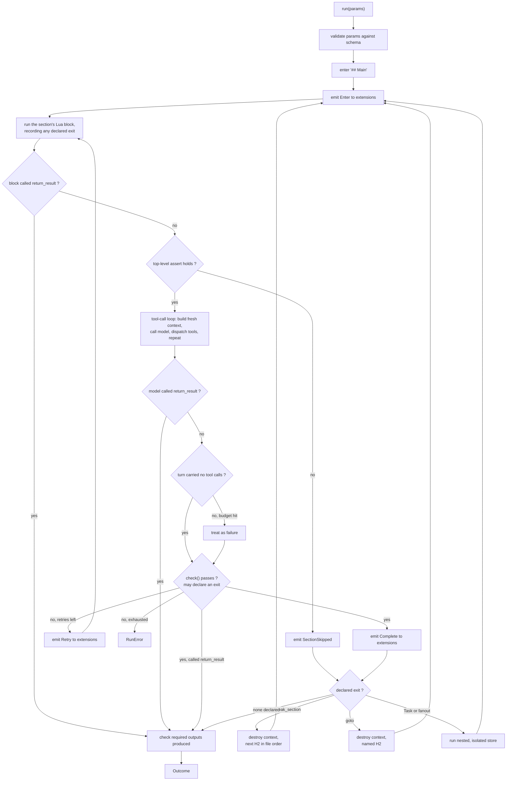

<!-- STATUS: crate doc - promptforge-core (library) - separated into what the crate does today and what is designed and not built - see design.md for the system -->

# `promptforge`: the core library

This document is in two parts. Part I describes what the crate does today, and every claim in it has been checked against the code in `crates/promptforge-core`. Part II is everything that was designed and has not been built; it is unchanged design and is the part a reader consults for where the executor is going, not for what it does.

Nothing has been deleted in the separation, and no argument has been rewritten: the whole prior document survives as Part II, annotated. Part I was written from the crate rather than sorted out of the document, because the document's vocabulary misnames the shipped thing in enough places that no passage was transferable intact - a built half assembled from this document's own prose would carry `Executor`, `store`-as-state and `return_result` into a description of code that has none of them. Every Part I claim is therefore checked against the crate rather than against the diff. The proportion is worth stating up front: the crate is a fall-through MVP and most of this document is Part II.

Ten things the separation forced, because the document and the code disagree rather than merely lag. Several are the same word meaning two different things, which is why a built half assembled by copying passages that look built would be worse than no document at all.

- **The crate is `promptforge-core`, and there is no `Executor`.** A run is the free function `execute::run(prompt, args, tools, store, opts)`, and its options struct is `RunOptions`, which carries an observer and an optional client and nothing else. `RunConfig`, `Executor::new`, `Outcome`, and `Limits` do not exist. The title above still says `promptforge` and is left alone; the crate's own document gets the right one.
- **`store` names a different subsystem in each.** The document's `store` is structured run state a prompt queries with `count`, `exists`, and `get`. The code's `store` is a run-scoped virtual filesystem with `write`, `append`, `read`, `str_replace`, `delete`, and `glob`. They share a name and nothing else, and none of the document's `store` prose describes anything that exists.
- **There is no `return_result`.** A section ends the run by its Lua chunk returning a value at top level, which no model can reach. The tool the document puts in every section's schema list is not bound, and no core tool of any kind is exposed to a model.
- **The field names differ where a reader would not look twice.** `Section.prose` and `Section.lua`, not `body` and `script`. `Frontmatter.version` is a `u32`, not a `String`. The entry point is the first top-level section whatever it is called, not `## Main`, and there is a test asserting exactly that.
- **Substitution resolves `args`, `var`, and `sys`,** not `params` and `state`. `args` is one raw string rather than a schema-validated object, `var` is what the section's own Lua block wrote, and `sys` is runtime metadata the document never mentions.
- **The sandbox is a blocklist, not Luau's allowlist.** The crate builds `mlua` 0.10 with `lua54`, loads only `string`, `table`, and `math`, and then nils out twelve base globals by hand. There is no memory ceiling, and a fresh VM is created per section rather than one per run. The document's argument for Luau - that `lupa`'s blocklist shipped a sandbox-escape CVE and an allowlist by language design replaces it - describes a choice the crate did not make, so it is a decision still to be taken rather than one already banked.
- **The core does read the process environment.** "Every value arrives through `RunConfig`" is refuted by `GatewayClient::from_env`, which reads `PROMPTFORGE_TOKEN`, `PROMPTFORGE_BASE_URL`, and `PROMPTFORGE_MODEL`, and which `execute::run` calls itself when the caller passes no client.
- **The core does name a search provider.** `tools::web_search::WebSearch` is in the crate. It holds no vendor key - it posts to the gateway - but "no search provider" as a boundary is not what the code says.
- **The observer does emit a denominator.** `Event::RunStarted` carries `sections`, the count of top-level sections the prompt declares. The document argues at length that there is deliberately none. The code's version is documented as a bound rather than a prediction, which is a narrower claim than the document rejects, but it is a number a client can render a fraction from.
- **`Event` derives `Serialize` only.** The document has the wire types deriving both directions so the two binaries share one definition. Nothing in the crate deserializes an event.

---

# Part I - What the crate does today

## Scope

This crate is a library with no binary. It parses one markdown prompt file, walks its top-level sections in file order, runs each section's Lua block, substitutes its prose, takes one model round trip per section with a tool-call loop, and returns a single string.

Types are reached through public modules rather than a flat re-export: `promptforge_core::client`, `execute`, `lua`, `observe`, `parser`, `store`, `subst`, and `tools`. The crate root re-exports only `Error`, `Result`, and `promptforge_version`.

What it does not do today, none of it a boundary the design draws and all of it simply unbuilt: no `Executor` type, no slot or tool resolution maps, no extensions, no declared outputs, no `goto`, `Task`, or `fanout`, no preconditions or postconditions, no per-run limits beyond the tool-loop cap and the Lua instruction budget, no state store in the document's sense, and no persistence of any kind past the end of a run.

What it does do that the boundary as written denies: it reads three environment variables when a caller does not supply a gateway client, and it contains a `web_search` tool. Neither holds a vendor credential - the gateway does - but both are in the crate.

## The engine version gate

A source is a promptforge prompt only when its frontmatter declares a `promptforge:` key. `promptforge_version(source) -> Option<u32>` reports it and is deliberately lenient: no frontmatter, unclosed frontmatter, invalid YAML, or an absent key all read as `None` rather than as an error, so a caller can ask "is this one of mine" of an arbitrary file.

`execute::run` gates on it before doing any work. The supported major is 1. Another major is `Error::UnsupportedVersion`; no version at all is `Error::Parse("not a promptforge prompt: no promptforge version")`. A run refused by the gate emits no observer events, because it never started.

The gate is separate from `Frontmatter::version`, which is the author's own contract number for the prompt's interface.

## Parsing is total and produces no side effects

`Prompt::parse(&str) -> Result<Prompt>` turns bytes into an inert tree. A `Prompt` carries the parsed `Frontmatter`, the first H1's text as `title`, the prose between that H1 and the next heading as `description_text`, and the top-level sections. `Prompt::entry()` returns the first top-level section.

`Frontmatter` has seven fields and does not deny unknown ones, so a key it does not name is read past in silence. Three are required - `name`, `description`, and `version: u32` - and four default: `promptforge: Option<u32>`, `tools: Vec<String>`, `default_return: Option<String>`, and `max_tool_iterations: Option<usize>`. `tools` is parsed and never read by this crate; the CLI and the MCP server are the two callers that consume it to decide which tools to bind for a run.

A `Section` carries its heading text as `name` (the address, without the `##` marker), a numeric `level` from 2 through 6, an optional `lua` block, its `prose`, and its `children`. Nesting is recursive through H6 rather than the two levels the design specifies, and a skipped level is tolerated: an H4 directly under an H2 becomes a child of that H2.

A section's Lua is exactly one code fence, tagged `lua`, appearing first in the section's content. A fence in any other language, a fence that is not first, and an unterminated fence all stay in the prose. Parsing fails on a missing opening `---`, an unclosed frontmatter block, YAML that does not deserialize, and a body with no `##` sections. A leading byte-order mark is stripped.

## The run is fall-through over top-level sections

`execute::run(prompt, args, tools, store, opts)` returns one `String`. `args` is a single raw input string, not an object and not schema-validated. `tools` is the run's whole pool. `store` is the run's virtual-file handle, created once by the caller and threaded through every section. `opts` is `RunOptions { observer, client }`.

Each top-level section, in file order:

1. Its Lua chunk runs. If the chunk returns a value at top level, that value is the run's result and the run ends there - this is the return fence, and it is the only early exit. Otherwise the executor reads back the `var` table and the names the block passed to `tools.add`.
2. Those names are resolved against the pool. A name with no matching tool is `Error::UnknownScopedTool`, never a silent drop. The resolved subset is the only thing this section shows to the model and the only thing it can dispatch; a section with no Lua block, or one that never calls `tools.add`, advertises nothing.
3. The prose is substituted. If what remains is not blank, the section takes one tool-call loop against the gateway.
4. Control falls through to the next top-level section with the context cleared. Nothing crosses the boundary except the store.

Child sections are parsed and are never executed. Running off the last section ends the run, and the result is `default_return` if the frontmatter declares one, else the last model reply the run produced, else the string `"done"`.

## Substitution resolves `args`, `var`, and `sys`

`subst::substitute` runs over a section's prose after its Lua block and before the model sees it. `{{ args }}` is the raw input string. `{{ var.<path> }}` reads the table the block wrote, read back from Lua as JSON. `{{ sys.<path> }}` reads runtime metadata: `when`, fixed at the start of the run, `now`, evaluated per section, and `id`, the 1-based index of the section.

One pass, no recursion, no arithmetic. Scalars render as strings and arrays and objects render as JSON. An unclosed `{{`, an unknown namespace, a missing key, and a null value are each `Error::Substitution` naming the path.

## The Lua block runs in a hand-hardened lua54 VM

One `lua` fence per section, run before the section's model turn, in a VM built fresh for that section. Only `string`, `table`, and `math` are loaded, and `harden` then sets twelve base globals to nil: `load`, `loadstring`, `dofile`, `loadfile`, `collectgarbage`, `require`, `getfenv`, `setfenv`, `rawget`, `rawset`, `rawequal`, and `rawlen`. `io`, `os`, `package`, `coroutine`, and `debug` are never loaded in the first place.

An instruction hook fires every 10,000 instructions and aborts after 1,000 firings, so a block gets roughly ten million instructions. Exceeding it raises `lua instruction budget exceeded`, which reaches the caller as `Error::Lua`. There is no memory ceiling.

Five names are in scope, and every one of them is core:

| Name | Purpose |
|---|---|
| `args` | The run's raw input string. |
| `sys` | Runtime metadata: `when`, `now`, `id`. |
| `var` | A writable table, read back as JSON for prose substitution. |
| `tools` | `tools.add(...)` records names for this section. There is no `tools.remove`. |
| `store` | The run's virtual files. |

`tools.add` takes any number of names, records them in first-seen order, de-duplicates, and validates nothing; the executor resolves them afterwards. `store` is a host capability rather than a scoped tool, so it is present whether or not the block asks for anything.

A chunk's top-level return value ends the run. Only a scalar is accepted - string, integer, number, or boolean - and returning a table is `Error::Lua`.

## `store` is a run-scoped virtual filesystem

`Store` is a cheaply cloneable handle over `Arc<Mutex<Box<dyn FileStore + Send + Sync>>>`, so the same files are reachable from the synchronous Lua VM and from an asynchronous tool. `Store::memory()` builds one over `MemVfs`, the in-memory backend, and `FileStore` is the backend contract a filesystem or network backend would implement.

Six operations: `write`, `append`, `read`, `str_replace`, `delete`, and `glob`. Two of the shapes are deliberate rather than incidental. `read` returns numbered lines - the 1-based number right-aligned to the width of the highest, then `"| "` - which is for navigation and error messages and is not a wire format. `str_replace` is anchored rather than offset-based and requires the anchor to occur exactly once: zero matches is `StoreError::AnchorNotFound` and more than one is `StoreError::AnchorAmbiguous` carrying the count, so an edit never lands on an arbitrary match. `glob` supports `*` within one path segment and `**` across segments.

The caller creates one handle and passes it in, and every section gets that same handle, which is what makes the store the one thing that survives a section boundary. It is exposed to Lua and to nothing else: there are no model-facing file tools.

## Tools are a dyn-dispatched trait, scoped per section

`Tool` has five methods: `name`, `description`, `parameters_schema` returning a JSON Schema value, an async `call(Value) -> Result<String>`, and `untrusted_output`, which defaults to `false`.

The loop for a section runs to a cap - the prompt's `max_tool_iterations` when it declares one, otherwise 24. Each round trip either yields text, which is the section's reply and returns immediately, or a batch of tool calls. For a batch, the assistant turn is echoed back into the history verbatim in the OpenAI wire shape, each call is dispatched, and each result is appended as a `tool` turn before the conversation is re-sent. A call naming a tool that was not provided is `Error::UnknownTool`; the cap reached without a text reply is `Error::ToolLoopExhausted`.

A tool declaring `untrusted_output` has its result wrapped before it enters the history: a sentence saying the enclosed text is data to analyze rather than instructions to follow, then the content between `<untrusted_input_{nonce}>` tags. The nonce is one random `u64` in hex, generated once per section, and it lives in the tag name rather than in an attribute so the closing delimiter is unguessable. Any literal occurrence of either tag inside the content is defanged by replacing its leading `<` with `&lt;`, so fetched content cannot forge the close and break out.

`WebSearch` is the one tool the crate ships. It posts the arguments to the gateway's `POST /v1/tools/web_search` with the shared bearer token and returns the body verbatim, so the search provider's key never reaches this process. It validates that `query` is present before spending a round trip, and it does not declare `untrusted_output`.

## The gateway client speaks non-streaming chat completions

`GatewayClient` holds a base URL, the shared token, and one model name. `complete` sends a message array and, when the caller supplies one, a `tools` array, and returns `CompletionResult::Text` or `CompletionResult::ToolCalls`. Streaming is not supported. `Message`, `ToolSchema`, and `ToolCall` are the wire types; a tool call's `function.arguments` arrives as a JSON-encoded string and is held parsed, falling back to a string value when it is not valid JSON.

`GatewayClient::from_env` reads `PROMPTFORGE_TOKEN`, which is required and whose absence is `Error::MissingEnv`, `PROMPTFORGE_BASE_URL`, defaulting to `http://127.0.0.1:8081/v1`, and `PROMPTFORGE_MODEL`, defaulting to the public constant `DEFAULT_MODEL`. `RunOptions::client` is `None` for a caller that wants that - the CLI - and `Some` for a caller configured from a file, which is what the MCP server passes.

## Observer

```rust
pub trait Observer: Send + Sync {
    fn on_event(&self, ev: &Event);
}

#[non_exhaustive]
pub enum Event {
    RunStarted { prompt: String, sections: usize },
    SectionStarted { completed: u32, name: String },
    SectionFinished { name: String },
    ModelTurn { section: String, turn: u32 },
    ToolCalled { section: String, tool: String, ok: bool },
    RunFinished { turns: u32, elapsed_ms: u64, ok: bool },
}
```

`on_event` is synchronous, sits on the run's own path, and must not block, await, or perform I/O; an implementation that forwards elsewhere queues and returns. An event is a report and never a decision, so dropping every one of them leaves the run's result unchanged, which is what lets `NullObserver` be what a caller wanting silence passes.

`completed` counts sections entered including the current one, so the first is 1, and it never decreases. `RunStarted::sections` is how many top-level sections the prompt declares, documented as a bound rather than a prediction because an early return means fewer.

`Event` derives `Serialize` and serializes externally tagged - one object whose single key is the variant name. It does not derive `Deserialize`. A test holds the exact JSON of all six variants, and a second test's exhaustive match makes a new variant fail to compile until it is added to both.

## Errors are one enum

One `Error` type spans parsing, transport, and execution, `#[non_exhaustive]`, built with `thiserror`, with the transport variant boxing its source so no dependency's error type reaches the public API. The variants are `Parse`, `MissingEnv`, `Http`, `Backend { status, body }`, `MalformedResponse`, `Lua`, `Substitution`, `ToolLoopExhausted`, `UnknownTool`, `UnknownScopedTool`, and `UnsupportedVersion`. `StoreError` in the store module is separate and also `#[non_exhaustive]`.

There is no split between a parse error, a validation error, and a run error, because there is no validation step to own the middle one.

## Tests

Unit tests live beside the code they test and the executor's live in `src/execute/tests.rs`. What is covered today: parsing of every frontmatter field and each malformed case, the Lua fence split and its non-cases, recursive nesting and a skipped level, the first H2 being the entry whatever it is called, and the version gate in all four of its readings; substitution of each namespace, a table rendering as JSON, and each failure; the sandbox's absent globals and the instruction budget aborting a runaway loop; `tools.add` accumulating, de-duplicating, and recording from inside a branch; every store operation, its errors, and a Lua write being visible on the caller's handle; the tool loop against an in-process axum gateway, including the guard block appearing in the re-sent conversation; and the observer's event shapes.

The in-process axum gateway is the crate's test fixture and is what the other crate documents mean when they refer to testing without a live service. There is no recording extension, because there are no extensions.

---

# Part II - Designed and not built

Nothing in this part exists in the crate. It is unchanged from the document that preceded the separation, except that a passage whose built half moved to Part I says so where the reader would otherwise expect it.

## The scope as designed

This crate parses a markdown prompt, executes its sections, resolves logical names to concrete ones supplied by its caller, dispatches to functions supplied by its caller, and reports what happened. It is the box labelled `Executor` in the system diagram and it owns no edge leaving that box.

[design-promptforge.md](design-promptforge.md) is the authority on the prompt language itself: the four primitives, the section model, the Lua block, `goto`, `Task`, fan-out, virtual files, tool-call state, and the evidence behind each. This document specifies the Rust that implements that language and does not restate its reasoning. Where the two touch, the language document wins on semantics and this one wins on types. Two deliberate departures from it, both consequences of decisions in [design.md](design.md): `mlua` in Luau mode replaces `lupa`, whose sandbox was defence-in-depth rather than hermetic; and a persistent database is an extension under its own name rather than a core host object, while the run state store named `store` stays core.

What it does not do, and cannot be made to do without a change to this document:

- Read a file of configuration. Every value arrives through `RunConfig`.
- Know a domain. No schema, no table, no paper, no search provider, no WG21 vocabulary.
- Talk to an LLM backend. It holds a `GatewayClient` its caller constructed.
- Persist anything. Storage is an extension's business.
- Decide where an output lands. It resolves a declared output name against roots it was handed.

The test of the boundary: a project with no relation to WG21 can depend on this crate, write its own extensions, and get a working prompt runtime without deleting a line.

Two of those five are refuted by the code rather than merely unbuilt, and Part I says which.

## Public API

Every type below is `promptforge::Type`. The crate root re-exports all of them; the module layout beneath is an implementation detail.

### Newtypes

Three distinct string vocabularies get three distinct types, because confusing them is the single most likely bug in the resolution path.

```rust
/// A logical model name written in a prompt: "fast", "thinking".
pub struct Slot(String);

/// A model name in the gateway's vocabulary: "claude-sonnet-4".
pub struct ModelName(String);

/// A canonical tool name from the fixed vocabulary: "web_search", "classify_entail".
/// One name identifies exactly one function. Names sharing a prefix form a family
/// that reaches Lua as a single table of that prefix name.
pub struct ToolName(String);

/// Identifies one execution for the life of that execution.
pub struct RunId(Uuid);
```

`Slot` and `ModelName` are never interchangeable and there is no `From` between them; only a `SlotMap` crosses that gap. `ToolName` parses only from the canonical set, so an unknown word fails at construction rather than at dispatch. That set is the table under `### The canonical vocabulary is one table`, which is the only place it is enumerated.

### Prompt

Parsing is total and produces no side effects. A `Prompt` is inert data: it can be constructed, inspected, and enumerated on an MCP surface without running any prompt code.

```rust
pub struct Prompt {
    pub meta: Frontmatter,
    pub sections: Vec<Section>,
}

impl Prompt {
    pub fn parse(source: &str) -> Result<Self, ParseError>;
    pub fn section(&self, name: &str) -> Option<&Section>;
}

pub struct Frontmatter {
    pub name: String,
    pub description: String,
    pub keywords: Vec<String>,
    pub version: String,
    pub params: ParamSchema,
    pub tools: Vec<ToolName>,
    pub state: Vec<StateDecl>,
    pub outputs: Vec<OutputDecl>,
    pub progress: BTreeMap<String, String>,
}

pub struct Section {
    /// The heading text including its marker, "## Extract". The address `goto`
    /// and `Task` resolve against, used verbatim rather than slugified so that
    /// what a prompt author writes in Lua is what they see in the document.
    pub name: String,
    pub level: Level,
    /// Prose handed to the model.
    pub body: String,
    /// The section's Lua block, if it has one. At most one per section.
    pub script: Option<String>,
    /// H3 sections beneath an H2. Individually addressable, which is what makes
    /// a battery of forty tests ordinary readable markdown that still fans out.
    pub children: Vec<Section>,
}

pub enum Level { H2, H3 }
```

`## Main` is the entry point. Sections do not run in file order: Main reads accumulated state through query tools, decides from its own prose, and reaches the next step with `goto` or `Task`. A child inherits its parent's Lua configuration unless it defines its own, which extends or overrides it, with the more specific block winning.

`params` is a JSON Schema object. `tools` lists the canonical names this prompt calls anywhere, which is what startup validation checks against configuration. `state` declares the prompt's own state-filing tools, specified under the prompt file format below. `progress` maps section name to the static text a caller displays while that section runs, and is the fallback when no narrator is present.

The parser that exists is in Part I: same total-and-inert property, a different frontmatter, differently named section fields, deeper nesting, and no `section()`.

### Slot and tool resolution

The caller resolves both maps before construction. The executor performs lookups, never resolution.

```rust
pub struct SlotMap(BTreeMap<Slot, ModelName>);

impl SlotMap {
    pub fn resolve(&self, slot: &Slot) -> Result<&ModelName, ResolveError>;
}

pub struct ToolMap(BTreeMap<ToolName, Arc<ResolvedTool>>);

impl ToolMap {
    pub fn resolve(&self, name: &ToolName) -> Result<&Arc<ResolvedTool>, ResolveError>;
    /// Subset the model sees in one section, per that section's `tools.add` calls.
    /// This scopes the model surface only. Lua host objects are bound once per run
    /// and are not filtered, because scoping exists to keep the model's choice small
    /// and the prompt author is not choosing under uncertainty.
    pub fn scoped(&self, allowed: &[ToolName]) -> ToolMap;
}

pub struct ResolvedTool {
    pub name: ToolName,
    /// Which extension backs this name. Diagnostics only; dispatch does not branch on it.
    pub extension: String,
    pub def: ToolDef,
    pub limit: Option<Arc<Semaphore>>,
}
```

`scoped` is cheap because entries are `Arc`. Per-section tool scoping is a filter over an existing map rather than a fresh resolution.

Per-section scoping itself is built, over a flat slice of `&dyn Tool` and by string name; there are no slots at all.

### Extension

One extension is one linked crate contributing named functions plus whatever connection or model those functions need.

```rust
#[async_trait]
pub trait Extension: Send + Sync + 'static {
    /// Stable identifier used in configuration and diagnostics: "brave", "paperstore".
    fn name(&self) -> &str;

    /// Canonical names this extension can back.
    fn provides(&self) -> &[ToolName];

    /// The contributed functions, with schemas and surface declarations.
    fn tools(&self) -> Vec<ToolDef>;

    /// True when this extension holds state whose lifetime is one section.
    /// A holder cannot have its savepoints interleaved, so the executor
    /// serializes `fanout` when any registered extension declares this.
    fn holds_section_state(&self) -> bool { false }

    /// Startup check. Reachable database, readable weights, present credential.
    /// Runs as a boot step before any executor is constructed.
    async fn validate(&self) -> Result<(), ExtError>;

    /// Run lifecycle. A database-backed extension maps these to begin, commit,
    /// rollback, and savepoint. Default is to ignore them.
    async fn on_section(&self, _ev: &SectionEvent) -> Result<(), ExtError> { Ok(()) }

    /// One line about what this extension did during the run, or `None`. Folded
    /// into `Outcome::summary` in registration order. Deliberately opaque prose:
    /// the core neither parses it nor knows what it counts.
    async fn summarize(&self, _run: RunId) -> Result<Option<String>, ExtError> { Ok(None) }

    /// Release connections and sessions. Called on service shutdown.
    async fn shutdown(&self) -> Result<(), ExtError> { Ok(()) }
}

pub struct Extensions(Vec<Arc<dyn Extension>>);

impl Extensions {
    pub fn new() -> Self;
    pub fn add(&mut self, ext: Arc<dyn Extension>) -> &mut Self;
    /// Every canonical name any linked extension can back, for validation.
    pub fn available(&self) -> BTreeSet<ToolName>;
    /// Boot step, run once before any executor is constructed.
    pub async fn validate_all(&self) -> Result<(), ExtError>;
    /// True when any registered extension holds section-scoped state.
    pub fn any_holds_section_state(&self) -> bool;
}
```

Every method that can touch a network or a disk is async. A transaction boundary is `BEGIN IMMEDIATE`, `COMMIT`, `ROLLBACK`, or `SAVEPOINT`, and a synchronous hook cannot await any of them: `block_in_place` with `Handle::block_on` panics on a current-thread runtime and is forbidden inside an existing `block_on`, spawning the commit and returning `Ok(())` turns a failed commit into a successful run, and a channel to a writer task only moves the blocking receive. The trait already needs `#[async_trait]` for `ToolFn`, so this costs nothing new.

`on_section` receives every event whether or not the extension participated in that section, because an extension holding a transaction needs the commit even if the section called none of its tools. Ordering across extensions is registration order for `Enter` and reverse registration order for `Complete`, so a nested resource acquired later is released first.

```rust
pub struct TaskId(u64);

pub enum SectionEvent {
    Enter { run: RunId, section: usize },
    Complete { run: RunId, section: usize },
    /// Rollback and begin again, not rollback alone: the executor returns to the
    /// section's Lua block and emits no second `Enter`.
    Retry { run: RunId, section: usize, attempt: u32 },
    NestedEnter { run: RunId, section: usize, depth: u32, task: TaskId },
    NestedComplete { run: RunId, section: usize, depth: u32, task: TaskId },
    NestedFailed { run: RunId, section: usize, depth: u32, task: TaskId },
    /// Emitted exactly once per run, on every path out of `Executor::run`,
    /// including every error path, the deadline, and a `return_result` that left
    /// sections unvisited. `ok` is false when the run did not complete. Emitted
    /// from a guard, not from the success path.
    RunEnded { run: RunId, ok: bool },
}
```

`return_result` is why `RunEnded` is emitted from a guard rather than from the end of the happy path. A run can now terminate from inside a Lua block or a `check` function with several sections unreached, so the number of syntactic paths out of `Executor::run` is larger than the number a reader would enumerate. A guard makes the count irrelevant: an extension holding an open transaction gets its commit or rollback whichever way the run left.

`RunEnded` is load-bearing and was added after the paperstore extension was specified against an earlier version of this trait. Without it, every failure path leaves an open transaction: `shutdown` is process scope rather than run scope, so nothing tells a storage extension that a failed run is over. On SQLite, where the write pool holds one connection, the first failed run then wedges every subsequent write until the process restarts. That is the difference between recovery being to run it again, which is this system's stated model, and recovery being to restart the service. The guarantee that it fires on every path out of `run` is what makes it worth having, which is why the core emits it from a drop guard rather than from the happy path.

`TaskId` distinguishes concurrent fan-out tasks, which a depth number cannot. Savepoints on one connection are strictly last in, first out, so three tasks running concurrently at the same depth produce interleaved `SAVEPOINT` and `RELEASE` pairs, and a release from the task that finished first releases the savepoint the task that started last is holding. That failure is silent rather than an error. `NestedFailed` exists for the same reason a savepoint is taken at all: without it a failed subagent task has no way to say `ROLLBACK TO SAVEPOINT`.

`holds_section_state` is the escape hatch for the case `TaskId` alone does not fix. An extension that cannot tolerate interleaved nesting declares it, and the executor serializes `fanout` for that run. Tension: one such extension costs every prompt in the deployment its fan-out concurrency, which is a heavy price paid at a coarse granularity, and the alternative was leaving the interleaving silently wrong.

### ToolDef: one function, two surfaces

There is one kind of contributed code and two ways to reach it. Both are derived from a single typed handler by one generic function, `register_capability`, specified below.

```rust
pub struct ToolDef {
    pub name: ToolName,
    pub description: &'static str,
    /// Derived from the argument struct by `schemars`.
    pub schema: schemars::Schema,
    pub surfaces: Surfaces,
    /// Concurrent calls permitted for a metered upstream. Process-local.
    pub rate_limit: Option<u32>,
    pub call: Arc<dyn ToolFn>,
}

pub enum Surfaces {
    /// The model may call it; Lua may not.
    ToolOnly,
    /// Lua may call it; the model never sees it. Classifiers are here.
    LuaOnly,
    Both,
}

#[async_trait]
pub trait ToolFn: Send + Sync {
    async fn call(&self, args: Value, ctx: &CallCtx) -> Result<Value, ToolError>;
}

pub struct CallCtx {
    pub run: RunId,
    pub section: usize,
    pub deadline: Instant,
}
```

`serde_json::Value` in and out is the single interchange form for both surfaces: the model surface needs JSON anyway, and Lua values convert both directions. The alternative, two typed entry points per function, would double the surface an extension author maintains. Tension: a Lua call pays a JSON round trip it does not strictly need, which matters only if a classifier call in a tight ranking loop is ever measured as the bottleneck.

`surfaces` is the extension's declaration, not a core policy. The core enforces it: a `LuaOnly` tool is absent from the schema list sent to the model, and a `ToolOnly` tool is absent from the Lua environment.

The `Tool` trait in Part I is what exists in place of all of this: one surface, the model's, and a `String` result rather than a `Value`.

### `register_capability` builds a ToolDef from a typed handler

No proc macro. An extension author writes an ordinary async function and hands it to one generic function, which owns the schema derivation, both conversion directions, and the erased entry point.

```rust
pub fn register_capability<A, R, F, Fut>(
    name: &'static str,
    description: &'static str,
    surfaces: Surfaces,
    rate_limit: Option<u32>,
    handler: F,
) -> ToolDef
where
    A: DeserializeOwned + JsonSchema + Send + 'static,
    R: Serialize + Send + 'static,
    F: Fn(A, &CallCtx) -> Fut + Send + Sync + 'static,
    Fut: Future<Output = Result<R, ToolError>> + Send,
{
    // schemars::schema_for::<A>() once, at registration.
    // The returned ToolDef's `call` deserializes A, awaits the handler,
    // serializes R, and maps both failures to ToolError.
}
```

An extension's `tools()` becomes a list of calls to it:

```rust
fn tools(&self) -> Vec<ToolDef> {
    let inner = self.inner.clone();
    vec![
        register_capability("web_search", "Search the web and return ranked results.",
            Surfaces::Both, Some(4), {
                let i = inner.clone();
                move |args: SearchArgs, ctx| { let i = i.clone(); async move { i.search(args, ctx).await } }
            }),
    ]
}
```

This is what a proc macro was going to generate, and generating it was rejected. A macro buys boilerplate elimination and costs the `cargo check` feedback loop: compile errors start pointing at synthesized spans in code nobody wrote, which is the single best signal available when an AI is writing the code, and boilerplate is the cheapest thing to produce in that setting. The arithmetic that would once have favoured a macro at thirty capabilities does not survive the keystrokes being free.

The macro did have one job worth keeping. It was going to guarantee that no extension ever hand-writes an `mlua` binding, because one host function that accepts a path and opens a file ends the hermetic property Luau was chosen for. `register_capability` keeps that guarantee by construction rather than by generation: the core owns both conversion paths, no extension crate depends on `mlua` at all, and the audit surface is one function in one file.

There is deliberately no `bind_lua` on the `Extension` trait. An earlier draft had one, taking `&Lua` and returning `mlua::Value`, and it was removed because it handed the guarantee straight back: an extension constructing Lua values is an extension that can construct a closure holding a real file handle, and the audit surface becomes one site per extension rather than one site. The core builds the entire Lua environment itself, from the `ToolDef` list and nothing else.

### The core derives Lua families from canonical names

The canonical naming rule already carries the information needed, so no extension declares anything further. A name is `family_operation`; the core groups every `ToolDef` whose `surfaces` admits Lua by its prefix, creates one table per family, and installs each operation as a field named by its suffix.

| Canonical names | Lua |
|---|---|
| `web_search`, `web_fetch` | `web.search(..)`, `web.fetch(..)` |
| `classify_label`, `classify_entail`, `classify_embed`, `classify_rank` | `classify.label(..)` and three more |
| `paper_meta`, `paper_upsert`, ... | `paper.meta(..)`, `paper.upsert(..)` |

Each field is created with `create_async_function`, because `ToolFn::call` is async, which is why a section's Lua block runs under `call_async` rather than `call`. A `ToolOnly` function is absent from every table, so a family can expose four operations to Lua and hold back a fifth for the model without either side knowing.

Two consequences worth stating. The table name is not a choice an extension gets to make, so two extensions cannot both claim `web`, and a collision is a startup error naming both. And a family's Lua shape follows from its canonical names, so renaming a canonical word renames a Lua field, which is a prompt-visible change and correctly a breaking one. Tension: the naming convention is now load-bearing for two things at once, since a name that does not split cleanly on its first underscore has no sensible Lua form.

The consistency a macro would have enforced structurally becomes a test instead. For every registered capability, round-trip its declared schema against a sample value of its argument type and assert they agree. That catches the drift case the macro made impossible, with a failure message naming the capability and the field, and it runs against real code with real spans. Tension: it is a test rather than a compile-time impossibility, so a capability nobody wrote a sample for is unchecked, which the test asserts against by requiring one per registered name.

### The canonical vocabulary is one table

The set `ToolName` parses from is this table and nothing else. It lives in this crate rather than in the extensions because a canonical name is an interface between three parties - the prompt that writes it, the configuration that binds it, and the extension that backs it - and an interface owned by three parties is owned by none. Every column is load-bearing somewhere: the surface decides whether the model sees the name, the family decides its Lua shape, and the backing name is the string a `[tools]` binding and an `[extensions.NAME]` block both key on.

| Canonical name | Surfaces | Lua | Backing `name()` | Type | Feature |
|---|---|---|---|---|---|
| `web_search` | `Both` | `web.search` | `brave` | `SearchExt` | `search` |
| `web_fetch` | `Both` | `web.fetch` | `brave` | `SearchExt` | `search` |
| `paper_meta` | `Both` | `paper.meta` | `paperstore` | `PaperstoreExt` | `paperstore` |
| `paper_latest` | `Both` | `paper.latest` | `paperstore` | `PaperstoreExt` | `paperstore` |
| `paper_cites` | `Both` | `paper.cites` | `paperstore` | `PaperstoreExt` | `paperstore` |
| `paper_md` | `ToolOnly` | absent | `paperstore` | `PaperstoreExt` | `paperstore` |
| `paper_upsert` | `LuaOnly` | `paper.upsert` | `paperstore` | `PaperstoreExt` | `paperstore` |
| `paper_rows` | `LuaOnly` | `paper.rows` | `paperstore` | `PaperstoreExt` | `paperstore` |
| `classify_label` | `LuaOnly` | `classify.label` | `onnx` | `ClassifyExt` | `classify` |
| `classify_entail` | `LuaOnly` | `classify.entail` | `onnx` | `ClassifyExt` | `classify` |
| `classify_embed` | `LuaOnly` | `classify.embed` | `onnx` | `ClassifyExt` | `classify` |
| `classify_rank` | `LuaOnly` | `classify.rank` | `onnx` | `ClassifyExt` | `classify` |

Six further names are `ToolName`s this crate backs itself. They take no binding, appear in no `[tools]` table, and are present in every deployment whether or not any extension is linked.

| Core name | Surfaces | Purpose |
|---|---|---|
| `return_result` | `Both` | Ends the run, optionally carrying one string to the caller. Always in the tool set and cannot be removed. |
| `create_file`, `append_file`, `read_file`, `delete_file` | `ToolOnly` | The virtual filesystem over in-memory blobs. |
| `ask_user` | `ToolOnly` | Bound and unimplemented; returns `RunError::Unimplemented`. |

Five of the six look like they should split into families and do not: `create_file` would give `create.file`, which is nonsense. They need no special case, because the family rule above only groups names whose surface admits Lua and all five are `ToolOnly`. A Lua block never writes files.

`return_result` is the exception and is the only core name reaching Lua. The family rule would give it `return.result`, which is not merely ugly but unwritable: `return` is a Lua keyword, so `return.result(..)` is a syntax error. It is therefore installed as a bare Lua global under its own name, `return_result(..)`, bypassing the family rule entirely. One name, one function, identical spelling on both surfaces. Tension: the family rule now has one documented exception, and a second core name wanting Lua would need the same carve-out rather than inheriting a general mechanism.

Three kinds of name reach a section's schema list and only the first is in this table. Canonical names arrive through `ToolMap`, resolved from configuration. Core names come from this crate. A prompt's declared state-filing tools are generated from its own frontmatter and are not `ToolName`s at all. `tools.add` scopes across all three by string, which is why a section can name `web_search`, `create_file` and `add_statement` in one call.

`return_result` is the single exception to scoping. It is in every section's schema list whether or not `tools.add` named it, `tools.remove` cannot take it out, and naming it is harmless but pointless. Every other core name is scoped exactly like a canonical one: a section gets `create_file` because it asked for it, and a section that did not ask cannot write a virtual file.

That distinction is deliberate and the tool-count discipline is the reason. [design-promptforge.md](design-promptforge.md) puts the reliable ceiling at five to ten tools, and six to eight below 8B. Four virtual-file operations forced into every section would spend half that budget in sections that never touch a file, which is a measurable reliability cost paid for nothing. `return_result` earns its unconditional slot because a section that cannot end the run is a section that can strand one.

None of the eighteen names is bound. `web_search` exists in the crate under that spelling as an ordinary `Tool` with no canonical-name machinery behind it, and no core name of any kind is exposed to a model.

### Constructing a `ToolName`

```rust
impl FromStr for ToolName {
    type Err = UnknownToolName;
    /// Membership in the table above. The input path: a prompt's `tools:` list
    /// and the `[tools]` keys in configuration.
    fn from_str(s: &str) -> Result<Self, Self::Err>;
}

impl ToolName {
    /// For a literal in extension source, where an unknown word is a programming
    /// error rather than a condition a caller decides about.
    ///
    /// # Panics
    /// If `name` is not in the canonical table.
    pub fn from_static(name: &'static str) -> Self;
}
```

Two constructors because two callers differ in kind. `register_capability` receives a `&'static str` written in extension source, so an unknown word there is a bug and panicking names the broken invariant at boot. A prompt's frontmatter and a configuration file are input, so that path returns a `Result` and surfaces as `ParseError::UnknownToolName`. `FromStr` rather than a bespoke method so that `str::parse` and `?` work at no cost.

`from_str` checks membership only. Everything else about a name was decided when it was added to the table, and is verified there by the checks below rather than on every parse.

### Adding a word

Three edits, in this order: add the row here, add the name to the backing extension's `provides()`, and register a capability for it. The checks below catch every way of doing two of the three. Tension: this is the one core change a new extension requires, so a crate that is otherwise self-contained cannot be added without touching this file, which is the price of the vocabulary being closed at all.

Five checks keep the table honest, following the pattern the schema round-trip established above:

1. Every name in every `provides()` parses through `FromStr`.
2. Every `ToolDef` an extension returns from `tools()` has a name in that extension's own `provides()`, and every name in `provides()` has a `ToolDef`.
3. Every canonical name splits on its first underscore into a non-empty family and a non-empty operation.
4. No two enabled extensions claim the same family prefix, and no canonical name collides with a core name. A collision is a startup error naming both claimants.
5. An `xtask` scans the design documents for frontmatter `tools:` lists and `[tools]` configuration blocks and asserts every name appears in this table. This one is not a unit test because the artifacts it checks are prose, and it exists because the stale name `store` survived in three documents until something finally parsed against a list.

### The rest of the observer

The trait, its contract, and six of the variant names, with different fields, are in Part I. The designed `Event` is larger, and its extra variants are the ones that report machinery that does not exist: jumps, tasks, fan-out, narration, section skips and retries, and a written output.

```rust
pub trait Observer: Send + Sync {
    fn on_event(&self, ev: &Event);
}

pub enum Event {
    RunStarted { run: RunId, prompt: String },
    SectionStarted {
        /// Distinct sections completed so far. Monotonic, never decreasing.
        completed: u32,
        name: String,
        /// Frontmatter progress text for this section, if declared.
        label: Option<String>,
    },
    SectionFinished { completed: u32, name: String },
    SectionSkipped { name: String, reason: String },
    SectionRetrying { name: String, attempt: u32, reason: String },
    Jumped { from: String, to: String, cleared_turns: u32 },
    TaskStarted { parent: String, target: String, depth: u32 },
    TaskFinished { parent: String, target: String, depth: u32, ok: bool },
    FanoutStarted { parent: String, count: u32 },
    FanoutFinished { parent: String, count: u32, failed: u32 },
    ToolCalled { section: String, tool: ToolName, ok: bool, ms: u64 },
    ModelTurn { section: String, model: ModelName, prompt_tokens: u32, completion_tokens: u32 },
    Narration { section: String, text: String },
    OutputWritten { name: String, dest: Destination },
    RunFinished { run: RunId, outcome: OutcomeKind, value: Option<String> },
}
```

`SectionStarted` carries `completed` and `label` because those are the two arguments an MCP progress notification needs, and Cursor was measured on 2026-07-25 rendering the message text in place. Nothing downstream has to compute anything.

There is deliberately no denominator. An earlier draft carried a `nominal_total` counting H2 sections excluding Main, so a client could render `2 / 5`, and it was removed because the number is unknowable rather than merely imprecise. `goto` can skip sections, revisit them, or jump backwards, and `return_result` can end a run from any section, so the count of sections a run will visit is not determined when it starts. A fraction whose denominator is a guess is worse than no fraction: it invites a reader to compute remaining work from a number that does not mean that. `completed` is still emitted, because "which step is this" is honest and useful, and it is monotonic so a revisit does not advance it.

That argument is not what the code does. `Event::RunStarted` carries `sections`, a count of the prompt's top-level sections, documented as a bound rather than a prediction. Whether the argument above should govern or the field should stay is a decision this separation leaves open rather than settles.

`RunFinished` carries `value`, which is whatever `return_result` was given, or `None` when the run fell off the last section or called `return_result` with no argument. It is the only place a return value reaches an observer.

`on_event` is synchronous and must not block: a consumer that needs to do work queues it.

### Outputs

```rust
pub struct OutputDecl {
    pub name: String,
    pub kind: OutputKind,
    pub required: bool,
}

pub enum OutputKind {
    File { format: Format },
}

pub enum Format { Markdown, Json, Text }

/// Where a declared output name resolves to, supplied by the caller.
pub struct OutputRoots(BTreeMap<String, Root>);

pub enum Root {
    Dir(PathBuf),
}

pub enum Destination {
    Path(PathBuf),
}
```

`Event`, `Outcome`, `Destination`, `OutputKind`, `Format`, `ToolName`, `ModelName`, and `RunId` all derive `Serialize` and `Deserialize`. They cross a process boundary: the MCP server serializes them into tool results and progress notifications, and the CLI deserializes them at the other end. Deriving in the core rather than mirroring the types in each binary is what keeps the two ends from drifting. `serde` is therefore a non-optional dependency of this crate rather than a feature. Tension: the wire shape becomes part of this crate's public API, so renaming a field is a breaking change for both binaries at once.

A prompt emits to a name. The executor resolves the name against `OutputRoots` and constructs the destination itself, so a section handling untrusted text has no filesystem path in reach. A `required` output the run did not produce is a failed run, which is why no postcondition has to be written for it.

An earlier draft carried a second output kind, `Rows { table }`, resolving through `Root::Extension` to `Destination::Rows { table, count }`, and all three are removed. A table name is a domain concept and this crate declares no domain: `OutputKind::Rows` put a database schema in the vocabulary of a type that is supposed to know only files, and `Root::Extension` made the core arbitrate which extension owned which table. An extension writing rows now tracks and reports them itself under its own canonical names, which is what [design-paperstore.md](design-paperstore.md) specifies. `OutputKind` and `Root` are each one variant today and remain enums rather than collapsing to structs, because a second file-shaped destination is plausible where a second domain-shaped one is not.

`Format` and `OutputKind` are separate because `format` is a property of a file and `kind` is what sort of thing an output is. The single-variant `OutputKind` therefore reads redundantly today. Tension: a reader may reasonably ask why the wrapper survives; the answer is only that flattening it is a breaking wire change for the two binaries and the wrapper costs nothing.

Of the serde claim above, only `Serialize` on `Event` is built, and only on the six-variant `Event` in Part I.

### Executor

```rust
pub struct RunConfig {
    pub prompt: Prompt,
    pub slots: SlotMap,
    pub tools: ToolMap,
    pub gateway: Arc<GatewayClient>,
    pub extensions: Extensions,
    pub observer: Arc<dyn Observer>,
    pub outputs: OutputRoots,
    pub limits: Limits,
}

pub struct Limits {
    pub max_turns_per_section: u32,
    pub max_tool_calls_per_section: u32,
    pub max_lua_calls_per_section: u32,
    pub max_retries_per_section: u32,
    pub max_jumps: u32,
    /// Nesting ceiling for `Task`. Four to five in practice.
    pub max_task_depth: u32,
    /// Total subagent tasks across a run, fan-out included.
    pub max_tasks_per_run: u32,
    /// Concurrent tasks one `fanout` may have in flight.
    pub max_fanout_concurrency: u32,
    pub run_deadline: Duration,
}

pub struct Executor { /* private */ }

impl Executor {
    /// Validates the prompt against the maps and the extension set. Every failure
    /// a boot check could catch is caught here. Stays synchronous: extension
    /// `validate` hooks are I/O and run once as their own boot step, through
    /// `Extensions::validate_all`, rather than once per constructed executor.
    pub fn new(cfg: RunConfig) -> Result<Self, ValidateError>;

    pub async fn run(&self, params: Params) -> Result<Outcome, RunError>;
}

pub struct Outcome {
    pub run: RunId,
    pub outputs: Vec<(String, Destination)>,
    /// Whatever `return_result` was given. `None` when the run fell off the last
    /// section, or called `return_result` with no argument.
    pub value: Option<String>,
    /// Short prose for a caller to display. Never a document body. Assembled by
    /// the executor from run statistics and each extension's `summarize`.
    pub summary: String,
    pub turns: u32,
    pub elapsed: Duration,
}
```

A single `RunConfig` struct rather than eight positional arguments, because the argument list is long, heterogeneous, and will grow.

`value` and `summary` are separate fields carrying different things and it is worth saying which. `value` is the prompt's own product, written by the model or by a Lua block, and the core treats it as opaque. `summary` is the runtime's account of the run - sections, turns, elapsed, plus whatever each extension reported through `summarize` - and the prompt cannot influence it. A caller displaying one line to a human wants `summary`; a caller consuming a result programmatically wants `value`. Collapsing them would force one of those two readers to parse around the other's text.

The three task limits exist because a runaway fan-out is a documented failure mode rather than a hypothetical one: spawning fifty subagents for a simple query is the case explicit scaling rules were added upstream to prevent.

What exists is five positional arguments and a two-field options struct, returning a `String`; Part I has it. Of `Limits`, only the per-section tool-loop cap is built, and it is a frontmatter field rather than a limits struct. `max_lua_calls_per_section` has a cousin in the instruction budget, which counts VM instructions rather than host calls.

## Prompt file format

Frontmatter, the H2/H3 heading structure, the single Lua fence per section, and `{{ }}` substitution before the model sees the prose are all built and are described in Part I; the frontmatter fields and the substitution namespaces are not the ones below.

```markdown
---
name: staker
description: Build a stakeholder position report for one entity
version: 1
keywords: [governance, stakeholder]
params:
  type: object
  properties:
    entity: { type: string }
  required: [entity]
tools: [web_search, web_fetch]
state:
  - name: add_statement
    description: File one public statement by the entity, with its source.
    collection: statements
    params:
      type: object
      properties:
        quote: { type: string }
        source_url: { type: string }
        stance: { type: string, enum: [supports, opposes, mixed, unclear] }
      required: [quote, source_url, stance]
  - name: set_verdict
    description: Record the position reached from the gathered statements.
    key: verdict
    params:
      type: object
      properties:
        position: { type: string, enum: [supports, opposes, mixed, unclear] }
        confidence: { type: string, enum: [high, medium, low] }
        rationale: { type: string }
      required: [position, confidence, rationale]
outputs:
  - name: report
    kind: file
    format: markdown
    required: true
progress:
  gather: Gathering source material
  evaluate: Evaluating positions against the record
  write: Writing the report
---

## Main

```lua
model("thinking")
break_section()
```

Confirm {{ params.entity }} is an entity whose public statements you can
research. If it is not, call `return_result` naming the problem and stop.

## Gather

```lua
model("fast")
tools.add("web_search", "web_fetch", "add_statement", "append_file")
break_section()
```

Find every public statement by {{ params.entity }} on the topic. File each one
with `add_statement`, including its source URL, and append its full text to
`statements.md` as you go.

## Evaluate

```lua
model("thinking")
tools.add("read_file", "set_verdict")
break_section()

assert(store.count("statements") > 0, "nothing gathered to evaluate")

function check()
  assert(store.exists("verdict"), "no verdict was set")
end
```

Read `statements.md`, weigh what it contains, reach a verdict and set it.

## Write

```lua
model("thinking")
tools.add("read_file", "create_file")
```

Write the report to the `report` output, drawing on the verdict and the
statements in `statements.md`. When it is written, call `return_result` with a
one-sentence summary of the verdict.
```

Three sections declare `break_section` and the fourth declares nothing, which is what makes it the last. `## Write` ends the run whether or not the model remembers to call `return_result`; the call is what supplies a value, not what stops the run.

`## Main` shows both exits in one section. Its Lua declares `break_section`, so an entity it can research continues to `## Gather`, and its prose tells the model to call `return_result` for one it cannot, which ends the run before any search is issued. The declaration is the default and the model's terminal call overrides it, because `return_result` is immediate and the declared exit is only consulted if the section reaches its end.

Frontmatter is YAML because it is frontmatter, a settled convention with tooling; the configuration files are TOML for the separate reason that they are Rust configuration. The two choices are unrelated and neither argues for changing the other.

Section headings are `##`, with `###` beneath them as addressable children. The heading text is the section's address, used verbatim. `{{ params.x }}` substitution happens in the body before the body reaches the model; the only substitutions are `params` and `state`.

Of the example above, only `name`, `description`, `version`, and `tools` are read. The rest - `keywords`, `params`, `state`, `outputs`, `progress` - is silently ignored, because `Frontmatter` does not deny unknown fields, so the file parses and the declarations do nothing. No line of its Lua would resolve to a host function, and neither substitution namespace exists.

### The section Lua block

One Lua fence per section replaces a metadata DSL entirely. The block runs before the section's model turn, configuring it by calling host functions rather than by assigning to magic globals. A section needing nothing special has no block and inherits defaults.

The core host names are `state`, `store`, `tools`, `params`, `context`, `sections`, `progress`, `return_result`, `break_section`, `goto`, `Task`, and `fanout`. All are core, and every other name in scope arrives from an extension.

| Name | Provided by | Purpose |
|---|---|---|
| `state` | core | Read-only view of accumulated run state. |
| `store` | core | Query interface to the run state store: `count`, `exists`, `get`. |
| `tools` | core | The tool-set builder for this section: `add`, `remove`. |
| `params` | core | Arguments passed into this section, read-only. |
| `context` | core | `context.inject(text)` prepends assembled text to the model's initial prompt. |
| `sections` | core | `sections.children("## Battery")` returns the H3 children as addressable sections. |
| `progress` | core | `progress.say(text)` emits an observer event mid-section. |
| `return_result` | core | `return_result(text)` or `return_result()` ends the run, immediately. |
| `break_section` | core | Declares that this section exits to the next H2 in file order. |
| `goto` | core | Declares that this section exits to a named H2. |
| `Task`, `fanout` | core | Dispatch a section as a subagent, one or many. |
| everything else | extensions | `classify`, a paperstore name, whatever was linked. |

Of those twelve, one and a half are built and neither means what it says here: `tools` has `add` and no `remove`, and `store` is the virtual filesystem rather than the query interface. Part I has the five names that are actually in scope.

`return_result` is a bare function rather than a member of an object because it is the same name the model calls, spelled identically. It is the only core name on both surfaces, for the reason given under the canonical vocabulary: the family rule would give `return.result`, which is a Lua syntax error.

`break_section` and `goto` are Lua-only and reach no model schema. Routing is the prompt author's decision, expressed in the document, and a model that could route would be deciding something the author already decided.

`store` is the run state store and is core, which is worth stating plainly because it is easy to confuse with a persistent database. The run state store holds what the model filed during this run through flat tool calls. A durable database is an extension and arrives under its own name. The two are unrelated and the core knows only the first.

Configuration and control flow are function calls:

```lua
model("thinking")                          -- required: the slot for this section
tools.add("web_search", "web_fetch")       -- scope the tool set; 5 to 10 names
tools.remove("web_fetch")                  -- narrow an inherited set

assert(state.chunks_total > 0,             -- precondition: runs before the model
       "no chunks to extract from")

function check()                           -- postcondition: runs at section end
  assert(store.count("claims") > 0, "no claims filed")
end

break_section()                            -- exit to the next H2 in file order
goto("## Evaluate")                        -- exit to a named H2 instead
return_result("nothing to analyse")        -- end the run now, carrying one string
return_result()                            -- end the run now with no value
Task("## Extract", { chunk_id = 3 })       -- subagent on that section, verbatim
Task("research.md", { topic = "..." })     -- or another pipeline file
fanout(tests, { evidence = state.evidence }, { ordered = true })
```

### Exits are declared, not taken

`break_section` and `goto` do not transfer control when called. They record where this section exits, and the executor acts on that record when the section ends. The reason is ordering: the top-level Lua block runs before the model turn, so a call that jumped immediately would skip the turn the section exists to run.

Three consequences follow, and all three are useful rather than merely tolerable.

A section can decide its exit from state before the model runs:

```lua
if store.count("statements") > 10 then
  goto("## Deep")
else
  break_section()
end
```

A section can decide its exit from what the model just filed, in `check`, which is the pattern that replaces a model-driven branch:

```lua
function check()
  assert(store.exists("classification"), "nothing was classified")
  local kind = store.get("classification").type
  if kind == "library" then goto("## Library")
  elseif kind == "language" then goto("## Language")
  else break_section() end
end
```

The model decides what, and Lua decides where. That division is the whole reason routing is off the model surface: the classification above is a judgement only the model can make, and the mapping from classification to section is a decision the author already made and should not pay a model turn to rediscover.

Last call wins. A top-level `break_section` followed by a `goto` in `check` exits to the `goto`, which is what makes the second example above an override of a default rather than a conflict. Calling neither is also a decision, and it means the run ends when the section does.

`return_result` is the exception and is immediate. It ends the run rather than routing within it, and a run that is over is over: the call unwinds the Lua block, no statement after it runs, and the model turn never happens if the call was at top level. Terminating now and routing later are different enough operations that giving them the same timing would be the confusing choice.

### `ask_user` is a stub

The prompt language specifies `ask_user(question)` as a blocking mid-run question surfaced through whatever wraps the pipeline. It is bound and it is not implemented: calling it returns `RunError::Unimplemented("ask_user")` and fails the run with that message. Deliberately a loud failure rather than a silent skip, because a pipeline that quietly proceeded past a question it was written to ask would produce a confident answer resting on an assumption nobody confirmed.

Stubbing rather than removing costs one function and keeps the language document honest, since a prompt author reading it will look for the call. Implementing it needs a request-response path that the observer interface does not have: `Observer` is one-way by design, so carrying a question back to a caller means a second channel, and the shape of that channel depends on whether the caller is Cursor with MCP elicitation, the Django site with a browser, or a terminal. Tension: a pipeline needing a mid-run question cannot be written yet, and the language document describes a capability the runtime does not have.

It is not bound. There is no `ask_user` in the crate under any surface, so a prompt calling it gets an ordinary unknown-name failure rather than the loud, named one specified here.

A precondition is a plain `assert` at block top level, and a failing one skips the section rather than aborting the run. A postcondition is a function named `check`, run when the section ends, and a failing assertion inside it retries the section. Using Lua's own `assert` rather than a boolean return means the failure carries the author's message into the observer event and the error, with no separate reporting convention to learn.

`goto` is the context-clearing jump: the model's conversation is destroyed and the target section starts fresh from its prose, its injected context, and its scoped tools. The run state store survives; the conversation does not. That destruction is the entire point, and it is why `store` exists.

### `return_result` ends the run

`return_result` takes one optional string and ends the run immediately, from wherever it is called. It reaches Lua as a bare global and the model as a tool, under the same name. Three call sites: a top-level Lua block, a `check` function, and a model tool call. A run ending this way skips every section it had not reached, runs no further `check`, and the string becomes `Outcome::value`.

From Lua it is not a normal return. The call unwinds the block, so no statement after it in the same block runs, and the executor treats the section as terminal rather than resuming it. Implemented by raising a distinguished `mlua` error the executor recognises and converts, which is why it cannot be caught by a `pcall` in prompt-authored Lua: the sandbox strips `pcall` for unrelated reasons and the error type is private to the core.

Called with no argument the value is `None`, which is the same value a run gets by falling off its last section. The distinction between them is deliberately not recorded, because nothing downstream would act on it: a caller reads `Outcome::value` and either has a string or does not.

The value is one string and is never parsed, validated, or reshaped by the core. A prompt whose caller wants JSON says so in its prose and the model writes JSON into the string; a prompt whose caller wants a sentence gets a sentence. The core declines to know which, and it declines to check: a `returns` schema in frontmatter was considered and rejected, because the run's real product is what the model filed through validated tool calls and wrote to declared outputs, and `return_result` is a status line on top of work already committed. Validating the status line adds a failure mode without protecting anything. Tension: a caller that does want structured data has no machine-checked guarantee it will parse, and finds out at `serde_json::from_str` rather than at run end.

The built early exit is a Lua top-level `return`, which is a normal return rather than an unwinding call, is reachable only from a section's own block, and is reachable by no model. Everything above about naming, both surfaces, and `check` describes a tool that does not exist. The one property that carried over is the value being an opaque string the core never parses.

`Task` dispatches a section verbatim, resolving the section reference on the Rust side so the calling model never writes the subagent's instructions and cannot paraphrase them. Its return value is the subagent's serialized state store, not a JSON object the subagent had to compose, so every field crossed a validation boundary one tool call at a time and the aggregate is well-formed by construction. Each nested task gets its own isolated state store; parameters in and serialized store out are the only things crossing the boundary.

### A prompt declares its state-filing tools

The read side of the run state store is `store.count`, `store.exists`, and `store.get` in Lua. The write side is a set of tools the prompt declares for itself, one per thing the model can file, in a frontmatter `state:` block. The runtime generates one `ToolDef` per entry.

```rust
pub struct StateDecl {
    pub name: String,
    pub description: String,
    pub shape: StateShape,
    /// JSON Schema for the call's arguments, the same shape `Frontmatter::params` holds.
    pub params: ParamSchema,
}

pub enum StateShape {
    /// The call appends to this collection. `store.count(name)` counts it.
    Collection(String),
    /// The call sets this key. `store.exists(name)` and `store.get(name)` read it.
    Key(String),
}
```

An entry carries a name, a description, exactly one of `collection:` or `key:`, and a `params` schema. There are exactly two write shapes because the read side already exposes exactly two, and the pairing is the whole point: a `collection:` entry appends to the thing `store.count` counts, and a `key:` entry sets the thing `store.exists` and `store.get` read. A write with no matching read would file something no later section could consult.

```yaml
state:
  - name: add_claim
    description: File one claim the paper makes, with the line it appears on.
    collection: claims
    params:
      type: object
      properties:
        quote: { type: string }
        line: { type: integer }
        kind: { type: string, enum: [normative, empirical, definitional] }
      required: [quote, line, kind]
  - name: set_thesis
    description: Record the paper's central thesis in one sentence.
    key: thesis
    params:
      type: object
      properties:
        thesis: { type: string }
      required: [thesis]
```

Generated tools are `Surfaces::ToolOnly`. The model files and Lua reads, so a Lua block never writes state. That keeps one direction of travel across a section boundary: the block reads what earlier sections filed and decides how to configure this one, the model files what it found, and `check()` reads back what it filed. A Lua write would let a prompt manufacture the evidence its own postcondition then verifies.

Declared names are not `ToolName`s and never enter the canonical vocabulary, which stays closed. A section's model-facing schema list is assembled from three sources: canonical names resolved through `ToolMap`, the prompt's own declared state tools, and this crate's own core tools. `tools.add(..)` scopes across all three by name, so an author writes one list and never has to know which source a name came from. `return_result` is added to that list unconditionally, as `### The canonical vocabulary is one table` sets out, and is the only name that is.

Startup validation rejects a declared name colliding with a canonical name, with a core tool name - `return_result`, `create_file`, `append_file`, `read_file`, `delete_file`, `ask_user` - or with another declared name in the same prompt. It also rejects an entry carrying both `collection:` and `key:`, or neither. Three namespaces meet in one schema list, and the collision check is what keeps a name in `tools.add` from being ambiguous about which of the three it reaches.

A generic core tool, `record_add(collection, item)` with a `record_set(key, value)` beside it, would keep the vocabulary smaller and was rejected. [design-promptforge.md](design-promptforge.md) builds the entire tool-call-state argument on flat calls with typed, enum-closed arguments, and the numbers are the reason: BFCL Non-Live AST puts a 7B to 32B open model at 85 to 90 percent on one flat call, schema complexity degrades hard tasks monotonically at 36 points for Claude Haiku and 28 for GPT-4o-mini on MATH-Hard under heavy schemas, and flat typed schemas cut malformed-call rates from 15 to 25 percent down to under 5 percent. A generic filer hands the model an untyped object under a name that says nothing about what belongs in it, which throws away every one of those numbers at the exact call where the run's state is being built. Declaring `add_claim(quote, line, kind)` with `kind` closed to three values puts the constrained-decoding path on the arguments; `record_add("claims", {..})` cannot. Tension: the schema list a model sees is now partly per-prompt, so two prompts filing the same kind of thing declare it twice and are free to declare it differently, and nothing checks that a declared schema matches what the section's prose asks the model to file.

None of this exists. There is no run state store, no `state:` frontmatter block, no generated tool, and nothing a model can call to file anything.

### Virtual files

The core provides `create_file`, `append_file`, `read_file`, and `delete_file` as tools over in-memory blobs keyed by path. The model believes it is writing files; the runtime holds a map. Blobs are scoped to the run and discarded at the end, and reaching real disk happens only through declared output resolution. This is core rather than an extension because it is the sandbox: a section reading untrusted text and holding only virtual-file tools has no real path to traverse and no exfiltration channel, which removes two legs of the private-data-plus-untrusted-content-plus-exfiltration problem at once. Tension: the guarantee holds only if such a section is also denied any tool that shells out, which is the prompt author's responsibility and not something the core can check.

Blobs are run-scoped rather than section-scoped, and that is the second reason the virtual filesystem exists. It is the blackboard that carries bulk content across a `goto` and between subagents: one section writes `statements.md`, a later one reads it, and what crosses the boundary is the path rather than the payload, which is the same reference-not-copy discipline `Task` uses for instructions. The division of labour with the run state store is therefore sharp and worth stating, because the two are easy to reach for interchangeably. The store holds small structured facts that a postcondition asserts on, that a declared `rows` output resolves from, and that a subagent returns serialized; `count`, `exists` and `get` are the whole read surface and that is sufficient for those three jobs. Anything a later section needs to read in bulk is a virtual file. This is why `store` needs no read for the contents of a collection: content that a model has to weigh was never supposed to live there.

The `staker` example above shows the split. `add_statement` files a structured record, which is what makes `store.count("statements")` a meaningful precondition and what the `positions` rows output resolves from, while the statement text is appended to `statements.md`, which is what `## Evaluate` actually reads after `goto` has destroyed the conversation that gathered it. Tension: the gathering section writes each statement twice, once as a record and once as text, which is a real reliability cost paid to keep structure and prose in the places that can use them.

The run-scoped blob store is built and is in Part I under the name the code gives it, `store`. Two things here are not: the four model-facing file tools, so no model can read or write a blob and the sandbox argument above buys nothing yet, and the division of labour, since the other half of it does not exist.

### Completion and failure detection

A section ends when the model returns a turn carrying no tool calls. That is the ordinary termination of any tool-call loop and needs no signal from the prompt: the model has nothing left to do, so it says so in prose and the executor moves on. `check` then runs, and on success the executor advances.

An earlier draft required the model to call a `done()` tool to end a section, and it is removed. It signalled nothing the empty turn does not already signal, it spent a tool slot and its schema tokens in every section of every prompt, and it introduced a failure mode of its own: a model that finished its work correctly but omitted the ceremonial call was scored as a failed run. The remaining signals are stronger than it was and cost nothing.

Two failures remain, and both are real rather than ceremonial:

- **A budget ceiling reached with the model still calling tools.** `max_turns_per_section` or `max_tool_calls_per_section` hit while the model has not produced an empty turn means it is looping, stalled, or lost the thread. This is the detection `done()` was supposed to provide, and it provides it better: it fires on the actual pathology rather than on a missing token.
- **A `check` postcondition failing after its retries.** Lua assertions inspect the store for the work the section was written to do - "at least one claim per chunk," "thesis is set," "every finding has a severity" - and carry the author's own message into the error.

These check semantic validity, did the model do the work, rather than structural validity, is the shape right, which is the argument [design-promptforge.md](design-promptforge.md) makes at length and this document does not restate. Tension: the language document also specifies flagging a required tool that was never called, and nothing in frontmatter declares which tools are required, so that third layer is unimplemented and listed under `## Open`.

The first paragraph is built - a text reply ends the section and there is no `done()` - and Part I says so. Of the two failures, the first is built in a narrower form: one cap over round trips, reached is `Error::ToolLoopExhausted`, which fails the run rather than being handed to a postcondition. The second is not built at all, since there is no `check`, no retry, and no store for an assertion to inspect.

### Sandbox

`mlua` at `0.11.6` with the `luau` and `vendored` features, confirmed resolving on 2026-07-25. `vendored` builds Luau from source rather than linking a system copy, which keeps the single-binary goal intact. `mlua` 0.12.0 exists and is not taken yet: the sandbox is the security boundary of the whole prompt language, so its version moves on a read of the changelog rather than on a caret.

Luau is an allowlist by language design - globals and metatables read-only, no `io`, `os`, `debug`, or `loadfile` to remove - which is why it replaces `lupa`, whose blocklist approach still shipped a sandbox-escape CVE. Three limits are set explicitly, with numbers rather than intentions:

- Instruction-count interrupt at 10,000,000 VM instructions per section, checked on a `mlua` interrupt callback every 100,000 instructions. A section's Lua does configuration, assertions, and list assembly, so a legitimate block runs in the thousands; ten million is three orders of magnitude of headroom and still aborts a runaway loop in well under a second. Exceeding it is `RunError::Lua` naming the section, not a process abort.
- Memory ceiling at 64 MiB per run, through `Lua::set_memory_limit`. The largest legitimate allocation is a fan-out candidate list, and sixty thousand candidate strings fit comfortably. Exceeding it fails the section rather than the allocator.
- No `require`, and no filesystem loader of any kind, so a block cannot pull in code the prompt file does not contain.

Every number here is a first cut chosen to be obviously generous rather than tuned, and each is a configuration value in `prompts.toml` under run limits so a deployment can raise one without a rebuild. Tension: an author who hits one of these hits it as a run failure with no gradual warning, and nothing currently reports how close a normal run comes to a ceiling.

One `Lua` per run, not per section. The core installs the capability families once at run start, from the resolved `ToolMap`. `state` persists across the context clear because it lives on the Rust side, not in Lua.

This is the passage where the difference matters most and Part I has the built version. The engine is `mlua` 0.10 with `lua54` and `vendored`, not 0.11.6 with `luau`, so the allowlist argument above is a decision still to be taken and the shipped sandbox is a hand-maintained blocklist of the kind it was written against. Of the three limits, the instruction budget is built at the same order of magnitude but with a hook every 10,000 instructions rather than an interrupt every 100,000, and it is a constant rather than a configuration value; no `require` is built; the memory ceiling is not. A VM is built per section rather than per run, so nothing persists in Lua across a section boundary in the first place.

## Execution model



There is no implicit advance. A section exits where its Lua block said to exit, and a section that declared no exit is the last thing the run does. `## Main` is the entry point; everything after it is reached because some section named it, either positionally with `break_section` or by name with `goto`.

An earlier draft made the advance implicit: a section that ended simply continued to the next H2 in the file, and only a `goto` overrode it. It is removed, and the reason is that it made file order load-bearing while leaving it unwritten. Three specific faults. Deleting a `goto` silently converted a jump into a fall-through instead of failing. Reading a section told you nothing about where control went next, so understanding a document meant holding its section order in your head. And a section that exists only as a `Task` target was reachable by accident from whatever happened to precede it, which the `## Main`, `## Digest`, `## Evaluate` shape in [design-promptforge.md](design-promptforge.md) hits directly.

What replaced it costs one line per section and buys an explicit control-flow graph. Every edge is written down, which also means a startup check can walk it: an unreachable section, a `goto` naming a section that does not exist, and a cycle with no `return_result` in it are all findable before a run starts rather than during one.

The cost is honest and worth stating. A four-section linear pipeline now carries four `break_section` lines that say nothing a reader could not have inferred from the order, and an author who forgets one gets a run that stops early rather than an error, because no declared exit is a legal way to end. That last case is the one to watch: the failure is silent and looks like success. The unreachable-section check catches it in the common shape, since a section nobody exits to is exactly what a forgotten `break_section` produces.

The implicit advance this rejects is exactly what the crate does. What ships is the earlier draft with the `goto` override removed as well, so file order is the whole control-flow graph and there is nothing to walk; Part I has it.

Model context is destroyed on every transition, `break_section` and `goto` alike. The target section is rebuilt from its prose, its injected context, and its scoped tool schemas; the run state store survives and the conversation does not. That clearing also resets the instruction-decay that sets in past roughly fifteen tool calls, because each section starts the counter over. Every turn of a run carries the same endpoint pin per model, which the `GatewayClient` holds, so the section prefix stays in one pod's cache.

Context destruction on transition is built, for the one transition that exists. Endpoint pinning is not, in this crate or in the gateway.

A `Task`-dispatched section runs, ends, and returns its serialized store to the caller. Its own declared exit, if it has one, is ignored: a task is a call, and where a section routes on the main path is not where it routes as a subagent. Tension: the same section behaves differently in the two positions, and a section written for both has an exit declaration that is dead in one of them.

A run that ends by exhausting its declared exits finishes normally with `Outcome::value` of `None`, exactly as one that fell off the last H2 did before. Reaching the end is completion, not an error.

A run that fails is not resumed. There is no partial result and no checkpoint, because every write an extension performs is a replace-all write from deterministic content, so rerunning from the start needs no cleanup. This is a system-wide principle rather than a choice made here.

## Errors

```rust
pub enum ParseError { MissingFrontmatter, Yaml(..), NoSections, DuplicateSectionName(String), UnknownToolName(String) }
pub enum ValidateError { UnresolvedSlot(Slot), UnboundTool(ToolName), MissingOutputRoot(String), StateNameCollision(String), StateShapeInvalid(String), UnknownGotoTarget { section: String, target: String }, UnreachableSection(String) }
pub enum RunError { Params(..), Lua(..), Gateway(..), Tool(ToolError), Extension(ExtError), PostconditionExhausted { section: String, attempts: u32 }, MissingRequiredOutput(String), JumpLimit, TaskDepth, TaskBudget, Unimplemented(&'static str), Deadline }
```

`ValidateError` exists so that everything a boot check can catch is caught by `Executor::new` rather than mid-run. A caller enumerating forty prompts at startup constructs forty executors to find out whether the deployment is coherent.

The last two are what explicit exits bought. Because every edge is written in a Lua block, the control-flow graph can be walked at boot from the string literals in it: `UnknownGotoTarget` is a `goto` naming a section the document does not contain, and `UnreachableSection` is a section that is neither `## Main`, nor the target of any `goto`, nor positionally after a `break_section`, nor named by any `Task` or `fanout`. The second is the check that catches a forgotten `break_section`, since the section that would have followed it becomes unreachable.

Both are best-effort and this is a real limit rather than a caveat. The walk reads literal arguments, so `goto("## " .. kind)` is invisible to it and a document built that way trades the check away. A conditional exit is treated as taking every branch, so a section reachable only through a condition that is never true still counts as reachable. The checks are therefore sound against typos and omissions, which is what they are for, and silent about computed control flow.

`thiserror` for these; `anyhow` never appears in this crate's public surface.

Three enums, one per phase, is not what exists: there is one `Error`, in Part I, and no validation phase for a `ValidateError` to belong to. The `thiserror`-and-no-`anyhow` rule is built and holds.

## Tests

- Parsing: golden files for each frontmatter field, each malformed case, duplicate section names, a section with no Lua block, a Lua block with no `model`, H3 children attaching to the right H2, and a file with no `## Main`.
- Resolution: `SlotMap` and `ToolMap` hit and miss; `scoped` filtering; child inheritance of a parent's Lua configuration and a child overriding it; a `LuaOnly` tool absent from the model's schema list and a `ToolOnly` tool absent from Lua.
- Sandbox: `io`, `os`, and `loadfile` unreachable; an infinite loop hitting the instruction interrupt; a memory bomb hitting the ceiling.
- Execution against a fake gateway and a recording extension: a three-section document running end to end on `break_section` alone; a failing top-level `assert` skipping a section and the run continuing at that section's declared exit; `check()` retrying then passing; `check()` exhausted; a budget ceiling reached with the model still calling tools treated as failure; a `goto` reaching a section that is not the next one; `fanout` over three children both ordered and unordered; and `Task` returning a serialized store.
- Exits and context: two sections linked by `break_section` where the second asserts the first's conversation is not visible to it; the same assertion across a `goto`; a section declaring no exit ending the run with later sections unvisited, asserted by a recording extension seeing no further `Enter`; a `Task` target that declares `break_section` asserting the task returns to its caller rather than advancing.
- Exit declaration semantics: a top-level `break_section` followed by a `goto` in `check` taking the `goto`; a `goto` in a branch not taken having no effect; a statement after a top-level `break_section` still running, since the call declares rather than transfers; and the model turn still happening after a top-level `break_section`, which is the regression test for it being a declaration rather than a jump.
- Graph validation: a `goto` naming a missing section failing `Executor::new` with `UnknownGotoTarget`; a section no exit reaches failing with `UnreachableSection`; a document where a forgotten `break_section` strands the remainder producing that same error and naming the first stranded section; and a computed `goto` target suppressing the check rather than falsely failing it.
- `return_result`: from a model tool call, from a top-level Lua block, and from inside `check`, each ending the run with the string in `Outcome::value`; with no argument yielding `None`; skipping every later section, asserted by a recording extension seeing no further `Enter`; a statement after `return_result` in the same Lua block never running; and a run falling off the last H2 yielding `None` and a successful outcome.
- Limits: `max_task_depth` refusing a fifth nesting level, `max_tasks_per_run` refusing a runaway fan-out, and `max_jumps` catching a `goto` cycle between two sections.
- Declared state tools: a `collection:` entry appending to what `store.count` counts and a `key:` entry setting what `store.get` reads; a declared name present in the model's schema list and absent from Lua; `tools.add` scoping a canonical name, a declared name, and a core name in one call; and each of the five rejections - collision with a canonical name, with a core name, with another declared name, both shape fields, and neither.
- Core tool surfaces: `return_result` present in every section's schema list whether or not `tools.add` named it, and unremovable by `tools.remove`; reachable from Lua as a bare global; and asserted absent from every family table, since `return.result` is the shape the family rule would have produced.
- Virtual files: a blob written and read back within a run, discarded at run end, and a section holding only virtual-file tools unable to name a real path.
- Extension lifecycle: `Enter` before any tool call, `Complete` after `check()` passes, `Retry` on failure, reverse order on `Complete`, a nested pair around `Task`, and `RunEnded` delivered when `return_result` cuts a run short with sections unvisited.
- Observer: the exact event sequence for a three-section run linked by `break_section` as a golden transcript, since the MCP and CLI docs both consume this sequence and a change to it is a change to them. Assert that `completed` never decreases across the transcript, including across a `goto` revisit, and that `RunFinished` carries the `return_result` string.
- Outputs: a required output not produced fails the run; a declared name with no root fails validation; a prompt cannot reach a path outside its root.

The recording extension and the fake gateway are the crate's test fixtures and are what the other crate docs mean when they refer to testing without a live service.

Part I lists what is covered today. The fake gateway exists, in-process on axum; the recording extension does not, and most of the list above tests machinery that is not built.

## Open

- Whether `state` and the run state store are typed or free-form JSON. Free-form is assumed above.
- Whether a declared `key:` name is reachable as `state.<name>` and through `{{ state.<name> }}` body substitution, or only through `store.get`. The read side names `store.get` and the substitution rule names `state`, and nothing says whether they see the same keys.
- How `ask_user` reaches a caller, when it is implemented. It is a stub returning `Unimplemented` for now. MCP elicitation is the obvious carrier for a Cursor caller, but the observer interface is one-way and a browser caller and a terminal caller want different shapes, so the channel is unspecified rather than half-specified.
- Whether the run state store is durable within a run or purely in memory. Discard-and-rerun means it need not survive a crash, which argues for memory, but a long fan-out holding results in memory is a different profile from one spilling them.
- Whether the tool-call counting layer of failure detection needs a frontmatter `required_tools` declaration, since the language document specifies flagging a required tool never called but nothing currently declares which tools are required.
- Whether a section reached by a failing precondition should take its declared exit or end the run. It takes the declared exit above, so a skipped section still routes, which is what lets a guard section be skipped without stranding the ones after it. The alternative reading is that a section whose precondition failed did not run and therefore declared nothing, which would make a skip terminal. The first is chosen because the second makes every optional section a run-ender, and it is listed here because a skipped section running its exit declaration but not its `check` is a genuine asymmetry.
- Whether `UnreachableSection` should be a warning rather than an error for a section reached only by a computed `goto`. It is an error above, so a document using computed targets has to be written differently or accept a failure at boot, and nothing currently lets an author annotate a section as reachable-by-construction.

Two the separation adds, both consequences of the code having answered a question this document thought open, or having changed one:

- Whether the sandbox moves to Luau as specified, or the `lua54` blocklist becomes the design. The document's argument favours Luau and the code has not taken it; nothing has recorded a decision to reverse it.
- Whether `RunStarted::sections` stays. The observer section argues at length for no denominator and the code emits a count of top-level sections. One of the two has to give.

*2026-07-25 - design-core*
