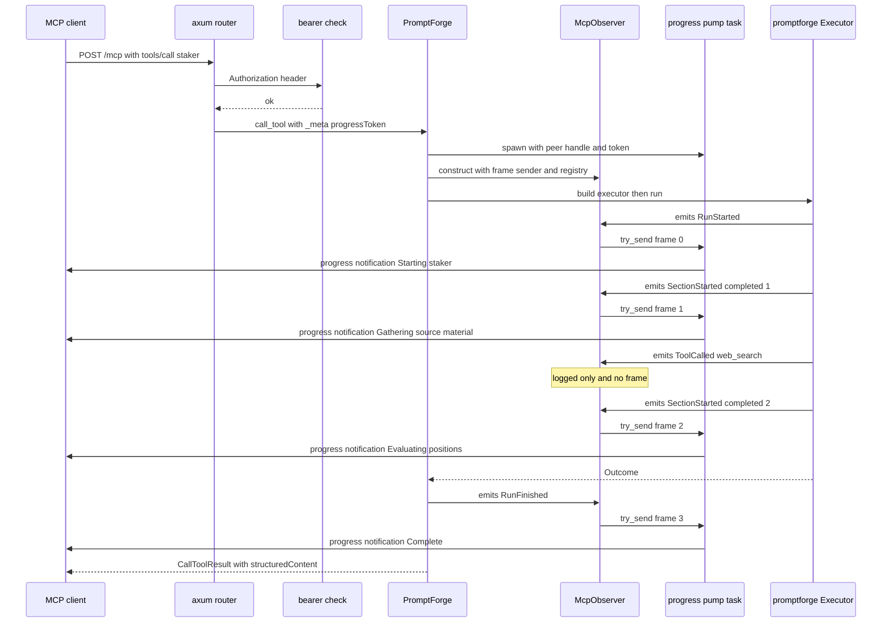

<!-- STATUS: crate doc - promptforge-mcp-server (service) - separated into what the crate does today and what is designed and not built - see design.md for the system -->

# `promptforge-mcp-server`: the only MCP server

What the crate does today has left this document. It is described in the crate's own `design-mcp-server.md`, at `crates/promptforge-mcp-server/design-mcp-server.md`, which every reference below to Part I now means. What remains here is everything that was designed and has not been built; it is unchanged design, and it still calls the crate `promptforge-mcp` throughout, which is the name the crate carried until the rename.

Nothing was deleted in the separation and no argument was rewritten. Where a passage had to be split - a scope list whose boundaries are half kept, a configuration file whose keys are mostly unbuilt, a progress path whose events do not all exist - the built half went to the crate's document and the rest stays here under the heading it had before.

Seven things the separation had to settle rather than sort, because the document and the code disagree rather than merely lag:

- **No prompt is published as a tool of its own.** The document's central decision, one MCP tool per prompt, is reversed. `tools.rs` publishes four built-ins and nothing else, a prompt is reached by naming it to `run_prompt`, and `catalog/resolve.rs` refuses a prompt that claims a built-in's name. Part II keeps the argument for the rejected dispatcher intact, because a corpus that deletes the losing case cannot explain why it lost, but the decision it argues for is not what ships.
- **stdio is offered, and the bind default is loopback.** The document says stdio is not offered at all, that the bind address is a network interface, and that "loopback is not a supported configuration and the code does not special-case it". `serve --stdio` is one of the binary's two shapes, `transport.rs` serves it with no port and no token read, and `config.rs`'s `default_bind` is `127.0.0.1:9310`. That is the deployment shape rather than a detail: the document assumes a workstation across the network and the code's default assumes the same machine.
- **A reload is judged per prompt, not per candidate.** "At boot, refuse to start; on reload, refuse the change" is the document's rule. `Catalog::resolve` takes an `OnBroken` parameter and the watcher passes `Retain`, so a prompt that fails revalidation stays in the catalog as a broken entry carrying its error while every other prompt reloads; only a candidate that cannot be resolved at all keeps the previous catalog whole. This one is worth naming twice, because the audit summary in the plan lists per-prompt reload among the things this document gets right, and this document does not get it right - the crate's own document does.
- **Nothing announces `tools/list_changed`.** The capability is built with `enable_tools()` alone, and `Reload` no longer carries a published-changed signal. The published set is the same four entries for the life of the process, so there is nothing a client could be told.
- **`rmcp` is pinned at `=3.1.0`, not `=2.2.0`.** The workspace pins the 3.x line. The document's argument for the 2.x pin - that 3.0.0-beta.2 was one day old and had 83 downloads - is history rather than a live decision, and the `Open` entry asking whether to follow 3.x has been answered by doing it. The crate's own document names no version at all, so the plan's claim that both documents say `2.2.0` holds only for this one.
- **The CLI is not a client of this server.** "Every run executes here. The CLI is purely a client of this server and has no in-process path" is refuted by `promptforge-cli`, which is an in-process runner over a markdown file path and never speaks to this server at all.
- **The search credential is not in `prompts.toml`.** The document keeps every non-LLM secret here and off the gateway. `prompts.toml` has no `[extensions]` table and no key of any kind; `server/bind.rs` binds `web_search` to a client that posts to the gateway on the gateway's own token, and only `web_fetch` runs in this process. Two claims fall together: the secret's location, and the boundary that says a canonical tool is an extension's compiled-in function.

---

# Part II - Designed and not built

## The scope as designed

This crate is the process a client talks to. It loads configuration, resolves logical names to concrete ones, links and registers extensions, publishes the enabled prompt catalog on an MCP surface, serves a fire endpoint and a status endpoint for the Django site, constructs a `promptforge::Executor` per run, and forwards the executor's event stream to whichever caller is watching. It is the only MCP server in the system and it is the only process that reads `prompts.toml`.

What it does not do, and cannot be made to do without a change to this document. The two boundaries the code keeps outright - no LLM backend, and no persisted run history - are in Part I:

- Publish a tool from the canonical vocabulary. `web_search`, `web_fetch`, the `paper_` family, and the `classify_` family are compiled-in Rust functions inside extensions, called directly by the executor. They never appear on the MCP surface, so Cursor is never offered a second web search.
- Parse a prompt, walk a section, run Lua, or resolve an output name to a path. That is `promptforge`, and this crate hands it the resolved maps.
- Own a domain. No schema, no table, no paper, no search provider. Every domain-shaped thing arrives as an `Extension` this binary chose to link.
- Hand execution to `promptforge-cli`. Every run executes here. The CLI is purely a client of this server and has no in-process path.
- Hold a job table. Django's Celery task is the durable queue; this crate holds run state in memory for the life of the run plus a retention window.
- Queue LLM work. Admission for model turns belongs to the gateway. This crate caps how many runs execute at once, which is a different limit for a different reason.

## The rest of the process shape

One binary, one listener, one port, two surfaces, one token. The MCP transport is streamable HTTP mounted on the same `axum` `Router` that serves Django's endpoints, because there is exactly one thing to authenticate and exactly one thing to install as a service.

```rust
let app = Router::new()
    .nest_service("/mcp", StreamableHttpService::new(
        { let s = server.clone(); move || Ok(s.clone()) },
        LocalSessionManager::default().into(),
        StreamableHttpServerConfig { sse_keep_alive: Some(Duration::from_secs(15)), stateful_mode: true },
    ))
    .route("/v1/runs", post(fire))
    .route("/v1/runs/{run_id}", get(status))
    .route("/v1/prompts", get(list_prompts))
    .route("/v1/validate", get(validate))
    .layer(middleware::from_fn_with_state(auth.clone(), require_bearer))
    // Added after the layer, so the exemption is structural rather than a string comparison.
    .route("/healthz", get(healthz));
```

The argument for sessions and streamable HTTP is in Part I, because the code acts on it. What is unbuilt here is the router: four Django routes hang off the same listener, which is what makes one port, one token, and one installed service the whole deployment.

The deployment this document assumes is a workstation across the network, which is why it says stdio is not offered at all, that the bind address is a network interface, and that loopback is not a supported configuration. The code refutes all three, and Part I says what it does instead.

### Dependencies and pins

Versions confirmed against crates.io on 2026-07-25, and the `rmcp` line has since been overtaken: the workspace pins `=3.1.0`, so the argument below for staying on 2.x is a record of a decision already reversed. The rolling file appender is not built either; the binary logs to stdout, or to stderr on stdio where the protocol owns stdout.

- `rmcp` at exactly `=2.2.0`, with features `server`, `schemars`, and `transport-streamable-http-server`. Exact rather than caret: the `ServerHandler` signatures, the `Tool` field set, and the capability builder have each changed across minor releases, so an upgrade is a diff to read rather than a number to bump. `2.2.0` was published 2026-07-08 and is the current stable line.
- `axum` at `0.8.9`, already a dependency through the streamable HTTP service. There is no 0.9 line; 0.8.9 is current.
- `tokio` at `1`, with `rt-multi-thread`, `macros`, `signal`, and `fs`.
- `serde` and `serde_json` at `1`, with the wire types themselves deriving in `promptforge` rather than here.
- `toml` at `0.9` for configuration, `notify` at `8` for the hot-reload watcher.
- `tracing` and `tracing-subscriber` at `0.3`, with a rolling file appender because a Windows service has no console.

`rmcp` 3.0.0-beta.2 exists and is not used. It was published 2026-07-24, one day before this document, with 83 downloads. The only client-facing surface in the system is not the place to run a one-day-old beta, and the 3.x line is worth following once it has a stable release and a changelog worth reading. Tension: the pin means a protocol feature landing in 3.x is unavailable until that migration, and MCP is a moving specification.

## The MCP surface

### Prompts are exposed as MCP tools, and that is not a contradiction

The reason a prompt is carried on the tools primitive rather than the `prompts` one is in Part I, because the code still turns on it. What does not survive is the corollary: the system rule that a connecting client sees prompts and never tools was a rule about vocabulary rather than about which protocol primitive carries it, so every entry on the surface was to be a prompt and no entry a canonical tool name. The four entries the surface publishes today are neither.

### Decision, since reversed: one MCP tool per prompt

This is the document's central decision and the code no longer implements it. It is kept whole, because the corpus has to be able to say why one tool per prompt lost rather than merely stop asserting it, and because the tail-dispatcher hybrid it argues is reachable without rework is the shape a later plan would revisit from the other direction.

Every enabled prompt in `prompts.toml` becomes its own entry in `tools/list`, named for the prompt, described by its frontmatter, and typed by its own `params` schema. The dispatcher and the hybrid are both rejected.

The argument is about the only decision that determines whether a prompt is ever used: the calling model's tool selection. That choice is made from names, descriptions, and input schemas, and nothing else. A dispatcher collapses forty descriptions into one, which means the model must already know a prompt name before it can call anything. The two ways out of that are both worse than the thing being avoided: embed the catalog in the dispatcher's description, which pays the same context cost in unstructured prose the client cannot render or filter, or require a discovery round trip that models routinely skip in favour of guessing. A dispatcher's `params` is also an untyped object, so nothing validates a call anywhere in the stack until our own code does, no client can autocomplete an argument, and a missing required parameter becomes a failed run rather than a client-side error.

Per-prompt tools cost nothing to generate. `Frontmatter` already carries `name`, `description`, `keywords`, `params`, and `outputs`, so the tool definition is a pure function of data already parsed at boot. `notifications/tools/list_changed` republishes the catalog after a hot reload, so the surface tracks configuration without a restart.

Tension: forty prompts are forty entries in the client's context budget on every single request, which makes the enabled catalog a context-budget decision and not merely an enablement one, and a deployment that enables everything degrades the client's selection across its own tools too, not just ours. Tension: a tool name is a client-visible API, so renaming a prompt breaks whatever referred to it, and this crate has no way to deprecate gracefully. The mitigation is that the rejected hybrid remains reachable from here without rework, because adding a dispatcher for a demoted tail is additive to a per-prompt surface while the reverse is not; the threshold at which that becomes worth doing is unmeasured and sits in `Open`.

### Frontmatter to tool definition

Only the `name` row reaches the code, and Part I states it. Every other row maps a frontmatter field the parser does not carry - there is no `params`, no `keywords`, and no `outputs` - onto a per-prompt tool definition nothing builds.

| `Frontmatter` field | MCP `Tool` field | Transform |
|---|---|---|
| `name` | `name` | Verbatim. Validated at boot against `^[a-z][a-z0-9_]{0,47}$` and required unique across the catalog. No prefix is added, because every client already namespaces by server. |
| `description` | `description` | First the author's text verbatim, then a generated `Produces:` line from `outputs`, then a `Keywords:` line. |
| `params` | `input_schema` | Verbatim. Boot rejects any schema that is not an object schema. |
| `keywords` | `description` tail | Joined with `, `. MCP has no keyword field and these exist to help selection, so they go where selection reads. |
| `outputs` | `description` tail and `output_schema` | Names and kinds become the `Produces:` line, so a model knows what the prompt yields before calling. `output_schema` is the one shared `RunResult` schema, identical for every prompt. |
| `version` | not mapped | Recorded in the run log and returned in the result. Clients have no use for it during selection. |
| `progress` | not mapped | Consumed at run time as notification message text. |
| `tools` | not mapped, deliberately | Canonical tool names never cross this boundary. This row is the boundary made structural. |

```rust
fn tool_def(p: &Prompt) -> Result<Tool, StartupError> {
    let mut description = p.meta.description.clone();
    if !p.meta.outputs.is_empty() {
        description.push_str("\n\nProduces: ");
        description.push_str(&p.meta.outputs.iter().map(describe_output).collect::<Vec<_>>().join(", "));
    }
    if !p.meta.keywords.is_empty() {
        description.push_str(&format!("\nKeywords: {}", p.meta.keywords.join(", ")));
    }
    Ok(Tool {
        name: Cow::Owned(legal_tool_name(&p.meta.name)?),
        description: Some(Cow::Owned(description)),
        input_schema: Arc::new(object_schema(&p.meta.params)?),
        output_schema: Some(RUN_RESULT_SCHEMA.clone()),
        annotations: Some(ToolAnnotations {
            read_only_hint: Some(false),
            destructive_hint: Some(false),
            // A run is a replace-all write from deterministic content, so calling twice is safe.
            idempotent_hint: Some(true),
            open_world_hint: Some(true),
            title: None,
        }),
    })
}

/// "report as a markdown file"
fn describe_output(o: &OutputDecl) -> String;
```

`idempotent_hint: Some(true)` is not decoration. Discard-and-rerun is the system's recovery story, so telling a client that a retry is safe is telling it the truth and it is the only hint on this surface that changes client behaviour usefully.

For the frontmatter in the core doc's worked example, `staker`, the generated definition is:

```json
{
  "name": "staker",
  "description": "Build a stakeholder position report for one entity\n\nProduces: report as a markdown file\nKeywords: governance, stakeholder",
  "inputSchema": { "type": "object", "properties": { "entity": { "type": "string" } }, "required": ["entity"] },
  "outputSchema": { "$ref": "#/definitions/RunResult" },
  "annotations": { "readOnlyHint": false, "destructiveHint": false, "idempotentHint": true, "openWorldHint": true }
}
```

### The server type

Three of this shape's parts are built and are described in Part I: the catalog behind an `ArcSwap` that a run snapshots for its lifetime, the run registry, and the admission semaphore. The rest - the pre-resolved slot map, tool map, output roots, and limits on every catalog entry, and the per-prompt `Tool` the entry carries - is the resolution machinery none of which exists. The `get_info` body below is stale in three ways rather than unbuilt: the capability is advertised without `listChanged`, the server name comes from `CARGO_PKG_NAME`, and the instructions say a caller names what to run and that a prompt's value is a finished artifact, since there is no file to point at.

```rust
#[derive(Clone)]
pub struct PromptForge {
    /// Validated catalog, swapped whole on hot reload. A run holds its snapshot for its lifetime.
    catalog: Arc<ArcSwap<Catalog>>,
    runs: Arc<RunRegistry>,
    gateway: Arc<GatewayClient>,
    linked: Arc<Linked>,
    /// Run permits. Not the gateway's budget and not a substitute for it.
    admission: Arc<Semaphore>,
    limits: ServerLimits,
}

/// One entry per enabled prompt, everything resolved and pre-validated at boot.
pub struct CatalogEntry {
    pub prompt: Prompt,
    pub tool: Tool,
    pub slots: SlotMap,
    pub tools: ToolMap,
    pub outputs: OutputRoots,
    pub limits: Limits,
}

pub struct Catalog {
    entries: BTreeMap<String, Arc<CatalogEntry>>,
    tools: Vec<Tool>,
}

impl ServerHandler for PromptForge {
    fn get_info(&self) -> ServerInfo {
        ServerInfo {
            protocol_version: ProtocolVersion::LATEST,
            capabilities: ServerCapabilities::builder().enable_tools().enable_tool_list_changed().build(),
            server_info: Implementation { name: "promptforge".into(), version: env!("CARGO_PKG_VERSION").into() },
            instructions: Some("Each tool runs one prompt to completion and returns the path it wrote. Do not re-emit the document body; read the file if you need it.".into()),
        }
    }

    async fn list_tools(&self, _p: Option<PaginatedRequestParam>, _cx: RequestContext<RoleServer>)
        -> Result<ListToolsResult, ErrorData>;

    async fn call_tool(&self, req: CallToolRequestParam, cx: RequestContext<RoleServer>)
        -> Result<CallToolResult, ErrorData>;
}
```

`call_tool` does six things in order: look the prompt up in the current catalog snapshot, validate `arguments` against the entry's `params` schema, take a run permit, build the observer from the request's progress token, construct `Executor::new` from the pre-resolved maps, and await `run`. A fresh `Executor` is built per run because the observer and the endpoint pin are per-run; everything expensive was resolved at boot.

## Progress notifications

Cursor renders `notifications/progress` live, in place, as `{progress} / {total} - {message}`, measured on 2026-07-25 against a throwaway server. This section specifies the forwarding path for that measured behaviour and nothing speculative.



### The observer

The split this shape rests on - a synchronous `on_event` handing frames to a bounded channel, a pump task doing the awaiting - is built, and Part I states it along with the drop policy. What is not built is everything the type carries beyond that: a `Frame` has no `section`, an observer holds no registry handle and writes no record inline, and the events matched on below do not all exist.

```rust
/// One frame is one rendered progress line. Cheap to clone, cheap to drop.
#[derive(Clone, Debug)]
pub struct Frame {
    pub progress: u32,
    pub message: String,
    pub section: Option<String>,
}

pub struct McpObserver {
    run: RunId,
    /// `None` when the caller advertised no progress token, and for every HTTP-fired run.
    frames: Option<mpsc::Sender<Frame>>,
    /// Always present. Status polling reads what this writes.
    registry: Arc<RunRegistry>,
    /// Latched, because `SectionRetrying`, `SectionSkipped`, and `Narration` carry
    /// no count. Losing it would make the line's number jump backwards, and the
    /// core guarantees `completed` never decreases, so a latched copy is current.
    completed: AtomicU32,
    dropped: AtomicU64,
}

impl Observer for McpObserver {
    fn on_event(&self, ev: &Event) {
        let frame = match ev {
            Event::RunStarted { prompt, .. } =>
                Some(self.frame(0, format!("Starting {prompt}"), None)),
            Event::SectionStarted { completed, name, label } => {
                self.completed.store(*completed, Ordering::Relaxed);
                let text = label.clone().unwrap_or_else(|| name.clone());
                Some(self.frame(*completed, text, Some(name.clone())))
            }
            Event::SectionRetrying { name, attempt, .. } =>
                Some(self.frame(self.completed.load(Ordering::Relaxed), format!("Retrying {name}, attempt {attempt}"), Some(name.clone()))),
            Event::SectionSkipped { name, .. } =>
                Some(self.frame(self.completed.load(Ordering::Relaxed), format!("Skipped {name}"), Some(name.clone()))),
            Event::Narration { section, text } =>
                Some(self.frame(self.completed.load(Ordering::Relaxed), text.clone(), Some(section.clone()))),
            Event::RunFinished { outcome, .. } =>
                Some(self.frame(self.completed.load(Ordering::Relaxed), finish_text(outcome), None)),
            other => { tracing::debug!(run = %self.run, ?other, "event"); None }
        };
        let Some(frame) = frame else { return };
        // A write lock on one small record, never awaited. This is why the registry
        // is written inline while the notification is not.
        self.registry.observe(self.run, &frame);
        if let Some(tx) = &self.frames {
            if tx.try_send(frame).is_err() {
                self.dropped.fetch_add(1, Ordering::Relaxed);
            }
        }
    }
}

async fn pump(peer: Peer<RoleServer>, token: ProgressToken, mut rx: mpsc::Receiver<Frame>) {
    while let Some(f) = rx.recv().await {
        // A client that closed its stream is not a run failure.
        let _ = peer.notify_progress(ProgressNotificationParam {
            progress_token: token.clone(),
            progress: f.progress,
            total: None,
            message: Some(f.message),
        }).await;
    }
}
```

`Event::SectionStarted`'s `completed` and `label` pass through untouched into `progress` and `message`. Nothing is computed anywhere, which is the reason those fields exist on that event.

The absent `total`, the latched monotonic `progress`, and the bounded lossy channel are all built, and Part I states each with its reason. One clause of the reason for `total`'s absence sits here rather than there, because what it rests on is designed and not built: the number of sections a run will visit is unknown at the start because `goto` may skip a section, revisit one, or jump backwards, and `return_result` may end a run from any section. The premise underneath the latch is not built either: the latched value repeats rather than falling on a retry or a skip, and neither a retry nor a skip is something a run can do.

### Which events notify

Six events exist, and the table names eleven. `RunStarted`, `SectionStarted`, `SectionFinished`, `ModelTurn`, `ToolCalled`, and `RunFinished` are the enum; `Narration`, `SectionRetrying`, `SectionSkipped`, `Jumped`, and `OutputWritten` describe control flow and output resolution the runtime does not have. Two rows are also decided differently for events that do exist: `SectionFinished` is logged rather than notified because its frame would duplicate the one already on the wire, and `RunFinished` sends no frame at all, since the reply follows it within milliseconds and carries more.

| Event | Notification | Reason |
|---|---|---|
| `RunStarted` | Yes, `progress` 0 | A frame lands before the first model turn, so the client shows something within milliseconds rather than after the first section. |
| `SectionStarted` | Yes | The primary frame. Three fields, three arguments, no computation. |
| `Narration` | Yes | `progress.say(text)` from a Lua block, rendered at the current section's value. |
| `SectionRetrying` | Yes | A silent stall is the worst failure mode this surface has. |
| `SectionSkipped` | Yes | Otherwise the numbering appears to jump for no stated reason. |
| `RunFinished` | Yes, `progress` = `total` | Leaves a terminal line on the client's screen after the call returns. |
| `SectionFinished` | Log only | Superseded by the next `SectionStarted` within milliseconds. |
| `Jumped` | Log only | The target's `SectionStarted` follows immediately and says more. |
| `ToolCalled` | Log only | Up to thirty per section; would replace the section label with noise. Failures log at warn. |
| `ModelTurn` | Log only | Token accounting, not progress. |
| `OutputWritten` | Log only | The result carries every destination. |

`SectionRetrying` and `SectionSkipped` re-send the `progress` value of the section they concern, so a retry replaces the current line in place with new text rather than advancing the fraction. The MCP specification asks that `progress` strictly increase, and an equal value violates that reading. The deviation is deliberate: the spec-clean alternative is a monotone counter unrelated to sections, which renders as a meaningless fraction in the one client that has actually been measured. Tension: a client that enforces strict monotonicity may drop those frames, and only Cursor has been tested.

### The serialized event, for a client that wants more than a line

Every notification additionally carries the full `Event` under a `_meta` key of `dev.promptforge/event`, serialized by the derives `promptforge` provides on `Event`. A reverse-DNS-style key is what the MCP specification reserves for implementation-defined `_meta` entries, so this cannot collide with a future protocol field.

Cursor ignores it and renders the three standard fields. `promptforge-cli` reads it under `--verbose` to print one structured line per event including the variants that produce no frame, which is why the key exists: without it the CLI's verbose mode degrades to reprinting the same message text the plain mode already showed. Tension: this puts the `Event` enum on the wire for real, so adding a variant is a compatible change while renaming a field is not, and the CLI has to tolerate an unknown variant rather than fail on it.

### When the client does not support progress

That progress is opt-in per request, and that a call carrying no `progressToken` is answered identically with no channel and no pump behind it, is built and is in Part I. The consolations for the caller that gets one silent long call are not: there is no rolling log file, and no status endpoint serving the same frames to a browser that an MCP client would have seen.

## The tool result

The premise of this section is the one thing in it the code inverts. The result was to carry where the work landed rather than the work, because the run wrote a file and a calling model should not spend output tokens re-emitting a report it did not write. The runtime writes no output files, so there is no path to hand back and the value itself is the whole product; Part I says what the result carries instead. Everything below that depends on an output existing - `outputs`, `OutputRef`, the `Produces:` line, the text block's file reference - is unbuilt with it, as is `summary`, which is the runtime's own account of a run and has no source. `RunStatus` keeps `completed` and `failed`, gains `running` for a run that outlived its call, and never had a use for `queued`.

```rust
#[derive(Serialize, JsonSchema)]
pub struct RunResult {
    pub run_id: String,
    pub prompt: String,
    pub version: String,
    pub status: RunStatus,          // completed | failed, a terminal status only
    pub outputs: Vec<OutputRef>,
    /// `Outcome::value`: whatever the prompt passed to `return_result`, verbatim
    /// and unparsed. Absent when the run fell off its last section.
    pub value: Option<String>,
    /// `Outcome::summary` verbatim, truncated at 600 characters so a summary bug
    /// cannot become a body dump.
    pub summary: String,
    pub turns: u32,
    pub elapsed_ms: u64,
    pub error: Option<String>,
}

#[derive(Serialize, JsonSchema)]
pub struct OutputRef {
    pub name: String,
    pub path: String,               // absolute
}

/// Four states. `RunResult` carries only a terminal one; the status endpoint
/// serves all four from this same type, so there is one spelling of each.
#[derive(Serialize, Deserialize, JsonSchema)]
#[serde(rename_all = "snake_case")]
pub enum RunStatus { Queued, Running, Completed, Failed }
```

`OutputRef` is built from `Outcome::outputs`, mapping `Destination::Path` to `path`. It lost a `kind` discriminant and its `table` and `rows` fields along with `OutputKind::Rows` in the core: an output is a file, and an extension that wrote rows reports them through `Outcome::summary` rather than through a typed field this server would have to understand. Nothing else in the outcome reaches the client.

`value` and `summary` are both strings and are not the same string. That `value` is forwarded untouched - not truncated, not parsed - is built and is in Part I, and so is the lowercase wire rule the enum above carries. What is unbuilt is the other half of the pair: `summary` is the runtime's account of the run and is truncated because nothing downstream depends on its exact bytes, and the division of labour it buys, where a calling model reads the text block and a program reads `value`, is not the division the code makes - the text block is the value.

```json
{
  "content": [
    { "type": "text", "text": "staker completed in 214s over 11 turns. report: D:\\wg21\\reports\\staker-herb-sutter.md. Returned: consistent on ABI stability, one shift on reflection in 2024. Read the file if you need its contents." }
  ],
  "structuredContent": {
    "run_id": "018f5c2a-9d31-7b4e-a0c1-6f2e77b3d9aa",
    "prompt": "staker",
    "version": "1",
    "status": "completed",
    "outputs": [
      { "name": "report", "path": "D:\\wg21\\reports\\staker-herb-sutter.md" }
    ],
    "value": "consistent on ABI stability, one shift on reflection in 2024",
    "summary": "Twelve public statements located across four venues. Wrote 7 stakeholder_position rows.",
    "turns": 11,
    "elapsed_ms": 214390
  },
  "isError": false
}
```

The `content` text block exists for clients that ignore `structuredContent`, and it says the same things in one line plus an instruction not to re-emit. `value` appears in it after `Returned:` when the run produced one and is under 200 characters, and is omitted from the text block otherwise, since a prompt returning a large JSON document should not have it pasted into a calling model's context when the same bytes are already in `structuredContent`. A failed run returns the same shape with `status: "failed"`, a populated `error`, whatever outputs did land, no `value`, and `isError: true`.

Row counts now reach the client only as prose inside `summary`, contributed by the paperstore extension through `Extension::summarize`. A client that needs the number parses no field for it, which is the intended consequence of a table being a domain concept: this server has no schema and should not be reporting one.

## The HTTP surface for Django

Django posts from a Celery task. That task is the durable queue: it retries on connection failure, it holds the tracking row the site displays, and it is why there is no job table acting as a message bus here.

### Fire

`POST /v1/runs`

```json
{
  "prompt": "staker",
  "params": { "entity": "Herb Sutter" },
  "outputs": { "report": "D:\\wg21\\site\\media\\reports" },
  "label": "paperflow-celery"
}
```

- `prompt` - must be in the enabled catalog.
- `params` - validated against the prompt's `params` schema before the response is sent, so a bad call fails at the fire rather than in the run.
- `outputs` - optional per-output-name root override. Only a declared output name is accepted; precedence is override, then configuration, then error. A caller cannot name an output the prompt did not declare, so this is not a write-anywhere primitive.
- `label` - free text for log correlation. Caller-asserted and unauthenticated, so it is a correlation aid and never an identity.

`202 Accepted`:

```json
{ "run_id": "018f5c2a-9d31-7b4e-a0c1-6f2e77b3d9aa", "status": "queued", "status_url": "/v1/runs/018f5c2a-9d31-7b4e-a0c1-6f2e77b3d9aa", "poll_after_ms": 2000 }
```

The run id is returned immediately. Everything that can fail cheaply - authentication, unknown prompt, schema violation, undeclared output override - fails before the 202, and everything that can only fail expensively happens in the spawned task. The run permit is acquired inside that task, which is the one real behavioural difference between the surfaces: an HTTP caller gets a run id and sees `queued`, while an MCP caller waits for a permit up to the admission timeout because it has nowhere to put a run id.

### Status

`GET /v1/runs/{run_id}`, readable for the life of the run and for the retention window after it.

```json
{
  "run_id": "018f5c2a-9d31-7b4e-a0c1-6f2e77b3d9aa",
  "prompt": "staker",
  "status": "running",
  "progress": { "completed": 2, "section": "## Evaluate", "message": "Evaluating positions against the record" },
  "outputs": [],
  "value": null,
  "summary": null,
  "turns": 6,
  "started_at": "2026-07-25T18:02:11Z",
  "updated_at": "2026-07-25T18:04:52Z",
  "finished_at": null,
  "error": null
}
```

`status` is one of `queued`, `running`, `completed`, `failed`. On completion the body carries the same `outputs`, `value`, `summary`, and `turns` the MCP result carries, from the same `RunResult` value, so the site and Cursor never disagree about what a run produced. `progress` is the last `Frame` the observer wrote, which is what drives the browser progress display: `message` renders the caption and `section` names the step, with no parsing.

There is no denominator here either, for the reason given under the observer, so the site renders an indeterminate progress indicator with a changing caption rather than a filling bar. Tension: a browser user watching a six-minute run has no estimate of how much is left, and the honest alternatives are all a guess dressed as a measurement.

An unknown id returns `404` with `{ "status": "unknown" }`. Celery treats that as a failure and refires, which is safe because a rerun is a replace-all write from deterministic content.

`GET /v1/prompts` returns the enabled catalog as name, description, keywords, params schema, and declared outputs, so the site can populate a form without reading `prompts.toml` or duplicating the frontmatter. That full frontmatter is what `promptforge-cli`'s `list` renders, so the field set here is the one the CLI depends on rather than a superset chosen for the site.

```json
{
  "prompts": [
    {
      "name": "staker",
      "description": "Build a stakeholder position report for one entity",
      "keywords": ["governance", "stakeholder"],
      "params": { "type": "object", "properties": { "entity": { "type": "string" } }, "required": ["entity"] },
      "outputs": [
        { "name": "report", "kind": "file", "format": "markdown", "required": true }
      ]
    }
  ]
}
```

The body is an object holding one `prompts` array rather than a bare array, because every other body on this surface is an object and a caller's JSON handling stays uniform. `description` is the author's text alone, without the generated `Produces:` and `Keywords:` tails the MCP tool definition appends: those tails exist to steer a model's tool selection, and a form-building client reads the structured `outputs` and `keywords` fields instead. `params` is the schema verbatim and is the same value the tool definition carries in `inputSchema`, so a generated form and a calling model validate against one schema rather than two renderings of one. `outputs` is one entry per `OutputDecl` with `OutputKind` flattened, `kind` reading `file` and `format` beside it. Entries are in `Catalog` order, which is a `BTreeMap`, so the array is sorted by name and identical across restarts. Output entries are in declaration order, because that is the order the prompt author wrote and the order a form should present.

### Validation

`GET /v1/validate` re-runs the boot validation pass against the configuration and prompt files currently on disk, and returns what it found without changing what the service is serving.

```json
{
  "ok": false,
  "checked": { "prompts": 12, "extensions": 3 },
  "problems": [
    { "prompt": "staker", "kind": "unbound_tool", "detail": "paper_cites has no binding in [tools]" },
    { "prompt": "briefer", "kind": "missing_output_root", "detail": "output 'report' names root 'reports' which is not configured" }
  ]
}
```

The status is `200` whether `ok` is `true` or `false`. A configuration full of problems is the answer to the question that was asked, not a failed request: this endpoint reports a verdict about files on disk, and delivering an accurate verdict of `false` is the endpoint working. A `4xx` would tell the caller its own call was malformed and a `5xx` would tell it to retry later, and neither is true of a prompt with an unbound tool. So the status code says only that the pass ran, `ok` carries the verdict, and `problems` carries the evidence. `promptforge-cli validate` reads `ok` rather than the status, which is what makes its nonzero exit mean the service rejected these prompts rather than that the service could not be asked. The only non-200 responses are the ones genuinely about the request: `401` for a missing or wrong token, and `500` if the pass itself cannot run. Tension: a monitoring probe pointed here reads a healthy `200` for a broken deployment and has to parse the body to learn otherwise, which is part of why `/healthz` is a separate route.

`kind` is a closed set, and the rule that closes it is that every `kind` is the snake_case name of the `StartupError` variant that produced it. A boot rejection with no `kind` would be a fault the service refuses to start on that this endpoint cannot name, which is the one thing `validate` exists to prevent.

| `kind` | `StartupError` variant | Raised when |
|---|---|---|
| `config` | `Config` | `prompts.toml` does not parse, or carries a key the schema does not know. |
| `token_missing` | `TokenMissing` | No `[server].token`. |
| `prompt_unreadable` | `PromptUnreadable` | A `[prompts.NAME].file` is absent from `[paths].prompts` or cannot be read. |
| `prompt_parse` | `PromptParse` | The markdown fails `Prompt::parse`, carrying the core's `ParseError` text. |
| `prompt_name_mismatch` | `PromptNameMismatch` | The frontmatter `name` disagrees with the `[prompts.NAME]` table key. |
| `tool_name_illegal` | `ToolNameIllegal` | The derived MCP tool name fails `^[a-z][a-z0-9_]{0,47}$`. |
| `tool_name_duplicated` | `ToolNameDuplicated` | Two enabled prompts derive one tool name. Reported once, naming both. |
| `params_not_object_schema` | `ParamsNotObjectSchema` | `params` is a schema that is not an object schema. |
| `extension_not_linked` | `ExtensionNotLinked` | A `[tools]` binding names an extension this binary was not built with. The detail names the Cargo feature that would add it. |
| `extension_does_not_provide` | `ExtensionDoesNotProvide` | The bound extension is linked but does not provide that canonical name. |
| `extension_invalid` | `ExtensionInvalid` | An extension's own `validate` hook failed: unreachable database, unreadable weights, missing credential. |
| `remote_unreachable` | `RemoteUnreachable` | An `[[mcp_clients]]` entry cannot be reached or does not answer `tools/list`. |
| `remote_missing_tool` | `RemoteMissingTool` | A name in an `[[mcp_clients]]` entry's `provides` is not advertised by the remote. |
| `output_root_unwritable` | `OutputRootUnwritable` | A configured `[outputs]` directory cannot be created or fails its write test. |
| `unresolved_slot` | `PromptNotValid`, `ValidateError::UnresolvedSlot` | A section names a slot that neither the per-prompt nor the global `[slots]` table resolves. |
| `unbound_tool` | `PromptNotValid`, `ValidateError::UnboundTool` | A name in `Frontmatter::tools` has no binding in the merged `[tools]` table. |
| `missing_output_root` | `PromptNotValid`, `ValidateError::MissingOutputRoot` | A declared output name has no root in the merged `[outputs]` table. |
| `state_name_collision` | `PromptNotValid`, `ValidateError::StateNameCollision` | A declared state-filing tool collides with a canonical name, a core name, or another declared name. |

`PromptNotValid` is the one variant that is not itself a `kind`. It wraps `promptforge::ValidateError`, and a caller handed `prompt_not_valid` would have to parse `detail` to learn which of the core's checks failed, so they appear directly and the wrapper does not. `Multiple` is absent for the same reason inverted: it is the accumulator, and the `problems` array is what it serializes to. `BindFailed` is the only boot rejection with no `kind` at all, because the pass called here runs steps 1 through 8 and never reaches the listener, which the live service is already holding.

`prompt` is present on every kind attributable to one catalog entry and absent on the two that are not: `config` and `token_missing` describe the file itself. Those two also stop the pass where boot stops it, so a response carrying either holds exactly one problem and reports `checked` as zeros, which is honest about the fact that nothing else was examined. `detail` is the variant's `Display` text, so the message a caller reads over HTTP is the message boot would have printed for the same fault, from the same `thiserror` attribute.

This exists because `promptforge-cli validate` has no other honest implementation. The question the command answers is whether this service would accept these prompts, and the service is the only thing that knows: which extensions were linked, what `[tools]` binds each canonical name to, whether a declared output root exists, and whether each extension's own `validate` hook passes against a reachable database and readable weights. A local implementation would have to reimplement the whole resolution path, and a second implementation of resolution is exactly what the CLI being a client exists to avoid.

It reuses the boot pass rather than reimplementing it: the same function, called with the freshly read files instead of the live snapshot, which is what keeps `validate` and startup from ever disagreeing. It is read-only and does not swap the live configuration, so it is safe to call against a running service and is distinct from the hot-reload path. Tension: a `200` with `ok: true` means the configuration on disk is coherent, not that the running service is serving it, and a caller that wanted the second thing has to compare against `/v1/prompts`.

### The run registry

A registry exists, holding every run in memory for a retention window and losing all of them on a restart, and Part I states that much. This shape is the version a status endpoint needs and is not the one built: there is no `label`, no last-observed `Frame`, no `updated` timestamp, no `retain_max` cap, and no sweep on a timer - eviction is taken on each read and each write, and a record that is still running is never evicted because its result has nowhere else to land.

```rust
pub struct RunRegistry { inner: RwLock<RunTable>, retain: Duration, retain_max: usize }

struct RunTable {
    records: HashMap<RunId, Arc<RwLock<RunRecord>>>,
    /// Completion order, for oldest-first eviction.
    finished: VecDeque<(Instant, RunId)>,
}

pub struct RunRecord {
    pub run: RunId,
    pub prompt: String,
    pub label: Option<String>,
    pub status: RunStatus,
    pub progress: Option<Frame>,
    pub result: Option<RunResult>,
    pub started: SystemTime,
    pub updated: SystemTime,
    pub finished: Option<SystemTime>,
}

impl RunRegistry {
    pub fn open(&self, run: RunId, prompt: &str, label: Option<String>) -> Arc<RwLock<RunRecord>>;
    /// Called from `Observer::on_event`. Takes a brief write lock and never awaits.
    pub fn observe(&self, run: RunId, frame: &Frame);
    pub fn close(&self, run: RunId, result: RunResult);
    pub fn get(&self, run: RunId) -> Option<RunRecord>;
    /// Drops finished records past `retain` or beyond `retain_max`, oldest first.
    pub fn sweep(&self);
}
```

Every run enters the registry, whether fired over HTTP or invoked over MCP, so status polling and log correlation work identically for both and a Cursor run can be inspected from a browser. `sweep` runs on a one-minute interval and on every `close`. Tension: run state lives in the service rather than the database, so a restart loses every in-flight and retained record, and the recovery is a refire.

## `prompts.toml`

Part I lists the keys that exist. Everything this file adds beyond them is the resolution machinery: slots, classifier slots, canonical tool bindings and their per-tool permits, output roots, executor limits, extension configuration, and remote MCP clients, each inheritable and overridable per prompt. The file also holds a secret it does not hold in the code, and enables a prompt by presence where the code globs a directory.

```toml
# prompts.toml - deployment scope for promptforge-mcp.
# Pairs with gateway.toml, which owns backends, LLM credentials, and the GPU
# concurrency budget and is read by a different process. This file holds every
# non-LLM credential, so it is mode 0600 on Unix and ACL-restricted on Windows.
# Watched on the filesystem and hot-reloaded.

[server]
bind = "0.0.0.0:9310"            # a network interface, not loopback: Cursor connects from a workstation
token = "pf_7Qk2xR9vLm4TdW0aBn"  # the one shared bearer token, checked on both surfaces
max_concurrent_runs = 4          # run permits; per-turn admission still bottoms out at the gateway
admission_timeout = "30s"        # how long an MCP call waits for a run permit before refusing
retain_completed = "1h"          # how long a finished run stays readable at the status endpoint
retain_completed_max = 512       # hard cap on retained records, oldest evicted first
log_dir = 'C:\ProgramData\promptforge\logs'

[paths]
prompts = 'C:\ProgramData\promptforge\prompts'

[gateway]
url = "http://10.0.0.12:8081/v1"
request_timeout = "600s"         # matches the gateway's ceiling on a single request
retries = 3                      # the gateway answers 503 with Retry-After under load
backoff = "2s"                   # every client must back off, and this crate is a client

# ---------------------------------------------------------------------------
# Global defaults. Everything below is inherited by every prompt in the
# catalog unless that prompt overrides the specific key.
# ---------------------------------------------------------------------------

[slots]                          # a prompt names the slot; gateway.toml decides what the name resolves to
fast = "qwen3-8b"
thinking = "claude-opus-5"
cheap = "qwen3-1.7b"

# Classifier slots resolve in the same three layers as model slots, and these
# are the three slot names design-classify.md defines. The [classifiers.NAME]
# tables mapping each classifier to its weights, device, and preprocessing are
# specified there and are not restated here.
[classifier_defaults]
selector = "nli-small"
embedder = "minilm-embed"
ranker = "minilm-rerank"

[tools]                          # every canonical name bound once, globally, to the extension that backs it
web_search      = "brave"        # one name is one function, so a family is a prefix and not a single word
web_fetch       = "brave"
paper_meta      = "paperstore"   # the paper_ family reaches Lua as one table named `paper`
paper_latest    = "paperstore"
paper_md        = "paperstore"
paper_cites     = "paperstore"
paper_upsert    = "paperstore"
paper_rows      = "paperstore"
classify_label  = "onnx"         # likewise the classify_ family
classify_entail = "onnx"
classify_embed  = "onnx"
classify_rank   = "onnx"

[tool_limits]                    # process-local permits for metered upstreams, independent of the GPU budget
web_search = 4
web_fetch  = 8

[outputs]                        # where each declared output name lands
report    = { dir = 'D:\wg21\reports' }
digest    = { dir = 'D:\wg21\digests' }
positions = { extension = "paperstore" }

[limits]                         # field names mirror promptforge::Limits one to one
max_turns_per_section = 24
max_tool_calls_per_section = 30
max_lua_calls_per_section = 200
max_retries_per_section = 2
max_jumps = 40
run_deadline = "20m"

# ---------------------------------------------------------------------------
# Extension configuration. One table per linked extension, keyed by the name
# the extension reports from `Extension::name`, which is the same name a tool
# binding above refers to. That name is the backing implementation and not the
# Cargo feature, so the `search` feature configures under [extensions.brave]
# and the `classify` feature under [extensions.onnx]. An extension whose Cargo
# feature is off must not appear here; an extension that is linked and
# configured but bound by nothing is registered, validated, and simply unused.
# ---------------------------------------------------------------------------

[extensions.brave]
api_key = "BSA_9f2Ld0QpXv"       # a non-LLM credential: the gateway has no reason to see it
endpoint = "https://api.search.brave.com/res/v1"

[extensions.paperstore]
backend = "postgres"             # "sqlite" on a developer machine, which then needs WAL mode
url = "postgres://promptforge@10.0.0.11/paperstore"

[extensions.onnx]                # the name ClassifyExt reports, not its Cargo feature
model_root = 'D:\models\onnx'    # export directories hang off this; design-classify.md owns the layout
verify = "hash"                  # manifest sha256 before the golden reload, so a swapped file fails at boot
self_check_max_ms = 20           # device self-check ceiling; a silent CPU fallback is a boot failure
# No device key and no classifier call cap here. A device is per classifier, in
# the [classifiers.NAME] tables design-classify.md owns, because one deployment
# can run one classifier on the GPU and another on the CPU. The classifier call
# cap is [limits].max_lua_calls_per_section above, counted by the core at the
# dispatch boundary, which is what lets the extension stay stateless.

# A remote MCP service the executor connects to, wrapped as an extension so
# there is one binding rule rather than two. Worth a process boundary only
# because the metered credential and its quota live in one place for every
# caller on the intranet.
[[mcp_clients]]
name = "corpsearch"
url = "http://10.0.0.30:9310/mcp"
token = "pf_9Rf1cE8sVy2QhJ7pXz"
provides = ["web_search"]        # checked at boot against the remote's own tools/list

# ---------------------------------------------------------------------------
# The enabled prompt catalog. A markdown file in [paths].prompts is not
# runnable until it appears here. Presence is the only enablement switch:
# to disable a prompt, comment out its block. Most prompts override nothing.
# ---------------------------------------------------------------------------

[prompts.digest]
file = "digest.md"               # inherits every global above

[prompts.triage]
file = "triage.md"
slots = { fast = "qwen3-1.7b" }  # one key overridden; thinking and cheap still come from [slots]

[prompts.staker]
file = "staker.md"

[prompts.staker.slots]           # this author's "fast" means something else than the global one
fast = "gpt-5.6-terra-medium"
thinking = "claude-opus-5-thinking"

[prompts.staker.tools]           # search only, through the shared quota holder; every other binding stays global
web_search = "corpsearch"

[prompts.staker.outputs]         # this prompt's report goes somewhere the site serves directly
report = { dir = 'D:\wg21\site\media\reports' }

[prompts.staker.limits]          # one limit raised; every other limit stays global
run_deadline = "45m"
```

Resolution is two layers deep and the rule is the same for slots, tools, output roots, and limits: the per-prompt table overrides the global table key by key, never wholesale. `digest` overrides nothing, `triage` overrides one slot, and `staker` overrides in all four categories, which is the exceptional case rather than the shape to expect at forty prompts. Tension: reading one prompt's effective configuration means reading two places.

The duration rule that goes with this file is built, and Part I states it.

## Startup validation

That boot either produces a resolved catalog or refuses to serve, that failures accumulate so an operator fixes a configuration in one pass, and that one bad prompt stops the whole service are all built, and Part I states them with their reasons. The pass below is the resolution the design asks for and mostly does not exist. In order:

1. Read `prompts.toml`. A parse failure, an unknown key, or a missing `[server].token` stops here.
2. Build the `GatewayClient`. The gateway is not required to be reachable at boot, because it is a separate service with its own lifecycle and requiring it would make startup order load-bearing.
3. `register_all`, constructing every linked and configured extension, and connecting every `[[mcp_clients]]` entry.
4. `linked.extensions().validate_all()`. Every extension's `validate` hook runs, so an unreachable database, unreadable weights, or a missing credential fails at boot rather than mid-run. For a `[[mcp_clients]]` entry, `validate` fetches the remote's `tools/list` and checks that every name in `provides` is actually advertised.
5. For each `[prompts.NAME]` entry: read the file, `Prompt::parse`, check the frontmatter name matches the table key, check the derived MCP tool name is legal and unique, check `params` is an object schema.
6. For each entry: resolve `SlotMap` from per-prompt then global `[slots]`, resolve `ToolMap` by binding every name in `Frontmatter::tools` through the merged `[tools]` table to a linked extension's `ToolDef` with its rate-limit semaphore attached, resolve `OutputRoots` for every declared output, and merge `Limits`.
7. For each entry: `Executor::new(RunConfig { .. })` with a null observer, then drop it. This is the point of the pass. `ValidateError` is where the core catches everything a boot check can catch, so constructing an executor per prompt is how this crate borrows those checks instead of reimplementing them and drifting.
8. Create the output directories named in `[outputs]` and write-test each one.
9. Bind the listener.

"Hot reload inverts only the consequence, never the checks: at boot, refuse to start; on reload, refuse the change" is this document's rule and is not the code's. The checks are indeed identical between the two passes, but the consequence is per prompt rather than per candidate: a prompt that fails revalidation is retained as a broken entry carrying its error while every other prompt reloads, and only a candidate that cannot be resolved at all keeps the previous catalog whole. One typo in one file must not freeze every other prompt in the catalog, which is a different judgement from boot's and is made for a different reason.

## Extension wiring

Registration is one explicit function, gated by Cargo features. No `inventory`, no build script, no dynamic loading.

`promptforge::Extensions` exposes no lookup by name, so this crate keeps its own list beside it and builds a fresh `Extensions` per run from `new` and `add`. The list is a `Vec` rather than a map because the core orders section lifecycle events by registration order, and that order has to survive.

```rust
pub struct Linked(Vec<(String, Arc<dyn Extension>)>);

impl Linked {
    fn add(&mut self, ext: Arc<dyn Extension>) { self.0.push((ext.name().to_string(), ext)); }
    pub fn get(&self, name: &str) -> Option<&Arc<dyn Extension>>;
    pub fn names(&self) -> Vec<String>;
    /// Registration order preserved, because `on_section` ordering depends on it.
    pub fn extensions(&self) -> Extensions;
}

pub fn register_all(cfg: &Config) -> Result<Linked, StartupError> {
    let mut exts = Linked::default();

    #[cfg(feature = "search")]
    if let Some(c) = &cfg.extensions.brave {
        exts.add(Arc::new(promptforge_ext_search::SearchExt::new(c)?));
    }

    #[cfg(feature = "paperstore")]
    if let Some(c) = &cfg.extensions.paperstore {
        exts.add(Arc::new(promptforge_ext_paperstore::PaperstoreExt::new(c)?));
    }

    #[cfg(feature = "classify")]
    if let Some(c) = &cfg.extensions.onnx {
        exts.add(Arc::new(promptforge_ext_classify::ClassifyExt::new(c)?));
    }

    // A remote MCP service is an extension like any other. Its `name` is the
    // client name, so a tool binding cannot tell a remote backing from a local one.
    #[cfg(feature = "mcp")]
    for c in &cfg.mcp_clients {
        exts.add(Arc::new(promptforge_ext_mcp::RemoteExt::connect(c)?));
    }

    Ok(exts)
}
```

A Cargo feature is named for the thing itself and carries no redundant qualifier, so the features are `search`, `paperstore`, `classify`, and `mcp` while the crates behind them keep their `promptforge-ext-` prefix. The types are `SearchExt`, `PaperstoreExt`, `ClassifyExt`, and `RemoteExt`, because the `Ext` suffix is what keeps every extension type uniform and distinguishes the type from the provider name it reports through `Extension::name`.

A configured binding selects among the linked extensions by name:

```rust
fn resolve_tool(exts: &Linked, name: &ToolName, extension: &str, limit: Option<u32>)
    -> Result<Arc<ResolvedTool>, StartupError>
{
    let ext = exts.get(extension).ok_or_else(|| StartupError::ExtensionNotLinked {
        binding: name.clone(),
        extension: extension.to_string(),
        linked: exts.names(),
        // Names the Cargo feature that would add it, because "not linked" and
        // "misspelled" read identically otherwise and are fixed differently.
        feature: feature_for(extension),
    })?;
    if !ext.provides().contains(name) {
        return Err(StartupError::ExtensionDoesNotProvide { extension: extension.into(), name: name.clone() });
    }
    let def = ext.tools().into_iter().find(|d| &d.name == name).expect("provides and tools agree");
    Ok(Arc::new(ResolvedTool {
        name: name.clone(),
        extension: extension.to_string(),
        limit: limit.or(def.rate_limit).map(|n| Arc::new(Semaphore::new(n as usize))),
        def,
    }))
}
```

Two linked extensions may both provide the same canonical name, and the binding disambiguates. That is the whole point of the indirection: `web_search = "brave"` becomes `web_search = "corpsearch"` and no prompt changes. Tension: a remote service advertising a word outside the canonical set cannot be bound at all, because `ToolName` parses only from that set, so widening the vocabulary is a change to the core crate rather than to this file.

## Concurrency

The first two rules are built and Part I states them: the run permits with their refusal past `admission_timeout`, and one task per run holding the catalog snapshot it started under. What is unbuilt in the first is the HTTP fire's alternative path, and in the second the executor and Lua state the task was to own rather than borrow from the core.

- Per-run work still bottoms out at the gateway. Every model turn takes a gateway permit, eight per endpoint and sixteen globally, and `fanout` is sequential, so a run has one turn in flight at a time. Raising `max_concurrent_runs` therefore does not raise LLM throughput; it raises the number of runs waiting at the gateway and the number of connections held while they wait. Sixteen is the ceiling above which nothing can possibly overlap, and 4 is the default because a run's non-LLM work - search calls, fetches, classifier calls at a section boundary - is where extra concurrency actually pays, and it pays much sooner than the queue depth costs.
- A gateway 503 with `Retry-After` is retried `[gateway].retries` times with backoff, and only then surfaced. Every client of the gateway must back off and this crate is a client.
- An extension doing CPU-bound or GPU-bound work must use `spawn_blocking`. `promptforge-ext-classify` calls into ONNX Runtime synchronously, and a classifier call on the async runtime's worker thread would stall every other run's polling. That contract belongs to the extension; this crate raises `max_blocking_threads` to accommodate it.
- Per-tool rate limits are process-local semaphores in the `ToolMap`, shared across every concurrent run because the `ResolvedTool` entries are `Arc` and the catalog is shared. This is precisely why `promptforge-cli` runs as a client by default: a second process would get a second set of permits and the upstream would see double the configured rate.

## Authentication

The scheme, the constant-time comparison, the per-request check and what it buys on rotation, and the costs it accepts are all built, and Part I states them. Two things here are not. The middleware covers `/mcp` and a `/v1` surface that does not exist, so there is one guarded route rather than two families of them. And the rotation cost is smaller than stated: there is no Django client and the CLI does not connect, so the coordinated edit is Cursor's configuration alone.

```rust
async fn require_bearer(State(auth): State<Arc<Auth>>, req: Request, next: Next) -> Result<Response, StatusCode> {
    let presented = req.headers().get(AUTHORIZATION)
        .and_then(|v| v.to_str().ok())
        .and_then(|v| v.strip_prefix("Bearer "))
        .ok_or(StatusCode::UNAUTHORIZED)?;
    // Constant time, so a wrong token leaks nothing about the right one through timing.
    if !bool::from(presented.as_bytes().ct_eq(auth.token().as_bytes())) {
        return Err(StatusCode::UNAUTHORIZED);
    }
    Ok(next.run(req).await)
}
```

The middleware sits under both `/mcp` and `/v1`, so the MCP transport and the HTTP endpoints are covered by one implementation and there is no second place for the check to be forgotten.

The honest costs, restated here because this crate is where they land:

- Rotation means editing every client. There are three today - Cursor's MCP configuration, the CLI's, and Django's settings - and a rotation is a coordinated edit across all of them with a window where some are wrong.
- Logs cannot distinguish callers. Every line carries a source address, a session id, and the caller-asserted `label`, and none of those is authenticated. A leaked token is indistinguishable from legitimate use except by address.
- Bearer over plain HTTP puts the token on the wire. The stated posture is a firewalled intranet, and terminating TLS at a reverse proxy in front of the bind address is the mitigation (medium confidence - it closes the wire exposure but leaves the token itself shared).

Per-client tokens are the upgrade when attribution matters: a `[clients]` table mapping a client name to its own token, the name entering every log line and becoming the key for per-caller run quotas, which is the thing a single shared token structurally cannot support. `rmcp` ships OAuth, so full attribution with revocable credentials is configuration and a handler rather than architecture.

## Service installation and hot reload

None of the installation is built: the binary takes `serve [--stdio] <prompts.toml>` and nothing else, there is no service wrapper and no rolling log file, and the configuration path is a positional argument rather than a `--config` flag. The watch is built, and Part I states its window, its Windows justification, and what a save does and does not reach; the four-step sequence below differs from it in two of the four steps, both settled above.

Installation goes through `daemon-kit`, covering Windows Service Control Manager, launchd, and systemd:

```
promptforge-mcp install --config C:\ProgramData\promptforge\prompts.toml
promptforge-mcp uninstall
promptforge-mcp start | stop | status
promptforge-mcp run --config <path>     # foreground, for development and for diagnosing a failed install
```

The installer writes the absolute config path into the service command line. A Windows service starts with `%SystemRoot%\system32` as its working directory and cannot walk up a tree to discover a config file, so path discovery relative to the working directory is not merely fragile here, it cannot work. There is no default search path and no environment-variable fallback: `--config` is required, and `run` fails with a message naming the flag rather than guessing.

A Windows service has no console, so logging goes to a rolling file under `[server].log_dir` through `tracing-appender`, and the Tokio runtime is constructed inside the service handler rather than by `#[tokio::main]`, because the service control dispatcher owns the thread the process starts on.

Hot reload watches `prompts.toml` and the prompts directory with `notify`, debounced at 500 ms:

1. Load the candidate configuration and run the full startup validation pass against it.
2. On failure, log every error and keep serving the current `Catalog`. The service does not stop and no client sees a change.
3. On success, `ArcSwap::store` the new `Catalog`. In-flight runs keep the snapshot they started with and finish under the configuration they began under.
4. If the tool set changed, send `notifications/tools/list_changed` to every connected session.

What reloads: the prompt catalog, prompt files themselves, slot maps, classifier selectors, tool bindings, output roots, limits, per-tool rate limits, and the bearer token. What does not: the bind address, and the extension set with its credentials, because extensions hold connections, sessions, and loaded model weights whose lifecycle is the process lifecycle. Adding an extension or changing a database URL is a restart. Tension: two live configurations exist during the swap, and the extension boundary makes a credential rotation a restart while a prompt edit is not.

## Errors

```rust
#[derive(Debug, thiserror::Error)]
pub enum StartupError {
    Config { path: PathBuf, source: toml::de::Error },
    TokenMissing,
    PromptUnreadable { prompt: String, path: PathBuf, source: io::Error },
    PromptParse { prompt: String, source: promptforge::ParseError },
    PromptNameMismatch { key: String, frontmatter: String },
    ToolNameIllegal { prompt: String, derived: String },
    ToolNameDuplicated { name: String, prompts: [String; 2] },
    ParamsNotObjectSchema { prompt: String },
    ExtensionNotLinked { binding: ToolName, extension: String, linked: Vec<String>, feature: Option<&'static str> },
    ExtensionDoesNotProvide { extension: String, name: ToolName },
    ExtensionInvalid { extension: String, source: promptforge::ExtError },
    RemoteUnreachable { name: String, url: String, source: rmcp::ServiceError },
    RemoteMissingTool { name: String, tool: ToolName },
    OutputRootUnwritable { output: String, path: PathBuf, source: io::Error },
    PromptNotValid { prompt: String, source: promptforge::ValidateError },
    BindFailed { addr: SocketAddr, source: io::Error },
    /// Boot reports everything it found. This is the variant that reaches `main`.
    Multiple(Vec<StartupError>),
}

#[derive(Debug, thiserror::Error)]
pub enum RequestError {
    Unauthorized,
    UnknownPrompt { name: String, enabled: Vec<String> },
    Params { prompt: String, detail: String },
    OutputNotDeclared { prompt: String, output: String },
    AdmissionTimeout { waited: Duration },
    GatewayBusy { retry_after: Duration },
    UnknownRun { run: RunId },
    Run { run: RunId, source: promptforge::RunError },
    Internal(#[from] anyhow::Error),
}
```

| `RequestError` | HTTP | MCP |
|---|---|---|
| `Unauthorized` | 401 with `WWW-Authenticate` | 401 at the transport, before `rmcp` sees the request |
| `UnknownPrompt` | 404 | `-32602`, listing the enabled names |
| `Params` | 400 | `-32602`, with the schema violation |
| `OutputNotDeclared` | 400 | `-32602` |
| `AdmissionTimeout` | 503 with `Retry-After` | `isError: true` result naming the wait, so the model can choose to retry |
| `GatewayBusy` | 503 with `Retry-After` | `isError: true` result |
| `UnknownRun` | 404 with `{"status":"unknown"}` | not reachable |
| `Run` | not an HTTP error; surfaces at the status endpoint as `status: "failed"` | `isError: true` with the full `RunResult` in `structuredContent` |
| `Internal` | 500 | `-32603` |

The dividing line the table rests on is built and is in Part I: a malformed call is a protocol error and a run that started and failed is a result. Neither enum is, and neither is the HTTP column beside each row. `anyhow` appears only in `Internal` and never crosses into a public signature elsewhere.

## The tests those features would need

The core crate's fake gateway and recording extension are the fixtures, so nothing here needs a live LLM, a live database, or a live search key. The crate's own suite covers the built surface in its own shape; the list below is what the design above would have to assert, and most of its subjects do not exist.

- Catalog generation: golden `tools/list` JSON for a three-prompt catalog. Asserts the `Produces:` and `Keywords:` tails, the input schema passed through verbatim, the annotations, and that no canonical tool name appears anywhere in the output.
- Boot validation: one test per `StartupError` variant, each asserting the message names the prompt and the file. A binding to an unlinked extension asserts the message names the Cargo feature. A catalog with three independent faults asserts all three are reported.
- Progress, against an in-process `rmcp` client: run the core's three-section fixture and assert the exact notification sequence. The input to this test is the golden observer transcript from the core crate's own tests, so a change to the event stream breaks this test, which is the intent.
- Progress absent: the same run with no `progressToken` produces zero notifications, spawns no pump, and returns a byte-identical result.
- Progress backpressure: a pump that never drains fills the channel; the run completes, the drop counter is nonzero, and no section boundary is delayed measurably.
- Retry visibility: a prompt whose `check()` fails once produces a `SectionRetrying` frame at the same `progress` value as its `SectionStarted`, with different message text.
- Result shape: a prompt writing a report containing a known sentinel string; assert the serialized `CallToolResult` does not contain the sentinel. This is the test that keeps the body out of the result.
- Summary truncation: a fixture whose `Outcome::summary` is 10 KB is truncated at 600 characters.
- HTTP fire: with a fake gateway that blocks, assert the 202 arrives with a run id before the run finishes, that status transitions `queued` to `running` to `completed`, that `progress` matches the last frame, and that the completed body and the MCP result carry identical `outputs` and `summary`.
- HTTP rejection before 202: unknown prompt, schema violation, and an override naming an undeclared output all fail at the fire with no run created and no registry record.
- Registry retention: a completed record readable inside the window, `404` with `{"status":"unknown"}` after eviction, and `retain_completed_max` enforced oldest-first.
- Auth: missing header, wrong scheme, wrong token, and correct token, on both `/mcp` and `/v1`, plus `/healthz` reachable without a token. The constant-time comparison is asserted by construction rather than by timing.
- Concurrency: `max_concurrent_runs` of 2 with four fires; assert the fake gateway never sees turns from more than two runs, that the third fire still returns 202 immediately, and that an MCP call refuses after `admission_timeout` with a retryable error.
- Gateway backpressure: a fake gateway answering 503 with `Retry-After` is retried the configured number of times and then surfaced as `GatewayBusy`.
- Hot reload: an invalid candidate leaves the old catalog serving and logs every error; a valid candidate swaps and emits `tools/list_changed`; a run in flight across a swap finishes under its original snapshot; a rotated token rejects the next request on an established session.
- Extension wiring: a canonical name provided by two linked extensions resolves to the bound one, and the per-prompt override reaches a different extension than the global binding.
- Loopback: `promptforge-cli run` against this server in a test, asserting the terminal sees the same event sequence Cursor sees.

## Confidence

These are the confidences the design held in itself, not the crate's. Two rows have been overtaken by events rather than by doubt: the enumeration shape lost, and `rmcp` moved to the 3.x line.

| Area | Level | Why |
|---|---|---|
| Enumeration shape | medium | Argued from how tool selection actually works, but not measured against a forty-prompt catalog in a real client |
| Frontmatter to tool mapping | high | Pure function of data the core already parses, with no computed field |
| Progress forwarding | high | Cursor's live rendering measured 2026-07-25, and the core event carries the three arguments |
| Progress monotonicity relaxation | medium | Deliberate deviation validated on one client on one date |
| Result shape | high | Follows the settled decision that a result carries a path and never a body, and one test enforces it |
| HTTP fire and status | high | Celery is the durable queue, so both endpoints stay thin |
| Run registry durability | low | State is in memory and a restart loses it; the recovery is a refire |
| Configuration schema | medium | The hierarchy reuses the settled slot mechanism, but no catalog of forty prompts exists yet to stress it |
| Startup validation | high | `Executor::new` performs the checks already, so boot is a loop over the catalog |
| Extension wiring | medium | Explicit registration is settled, but no extension crate is built yet |
| Concurrency | high | The gateway owns the only queue, so this crate's limit is about non-LLM work and nothing else |
| Authentication | low | Inherits a system-level decision made without a stated preference |
| Hot reload | medium | Validate-then-swap is straightforward; the extension set deliberately does not reload |
| Service installation | medium | `daemon-kit` covers three platforms, and the absolute config path is the known Windows trap |
| `rmcp` API surface | medium | Pinned at `2.2.0`, the current stable; the `ServerHandler` and `Tool` surfaces have moved across minor releases, so the pin is exact and upgrades are read before taken |

## Open

- Whether to follow `rmcp` 3.x once it leaves beta. Answered by doing it: the workspace pins `=3.1.0`. What follows is the reasoning as it stood. The pin is `2.2.0`, settled below; 3.0.0-beta.2 was published 2026-07-24, one day before this document, and adopting a one-day-old beta under the only client-facing surface in the system is not a trade worth taking. What is open is the timing, not the direction.
- Whether `ask_user` is eventually carried by MCP elicitation. The core stubs it as `Unimplemented` for now, so nothing here depends on it. `rmcp` ships elicitation and the fit is obvious for a Cursor caller, but an HTTP-fired run has no interactive caller at all, so this surface would need to answer what happens then before the core's one-way observer is given a return path.
- Elicitation. The system doc calls for mid-run user questions, and the core `Observer` is one-directional with no seam for a question that expects an answer. This crate can carry `elicitation/create` the moment the core offers a channel, and cannot before.
- The MCP tasks capability. Adopting it would let a run survive a client disconnect and be collected later, which is close to what the HTTP status endpoint already does for Django. Whether to converge the two or keep them separate is unsettled.
- The catalog size at which per-prompt tools start degrading client selection, and therefore the threshold for adding a dispatcher for a demoted tail. Unmeasured, and measurable only against a real client with a real catalog.
- Whether the run registry should persist to a small local database. Purely a function of observed Celery polling behaviour across restarts, and currently unobserved.
- Whether `GET /v1/prompts` should also carry `version` and the prompt's declared `tools`. The five fields published today are the ones enumerated above, and `design-cli-residue.md` renders a `VERSION` column and a `tools:` line from what it calls the full frontmatter, so one of the two documents is wrong about the field set. Three ways out: publish both, which puts canonical tool names in an HTTP response after this document kept them off the MCP surface on purpose; publish `version` only, which is inert metadata no client can act on and closes the visible half of the gap; or publish neither and let the CLI degrade to fewer columns, which it already specifies as its behaviour for an absent field. Unresolved because the first option reopens a settled boundary for the sake of a display line.
- Whether Django should be permitted output-root overrides at all. The mechanism is specified and cheap, and the site may turn out to want the configured root every time, in which case the field should go.
- Whether a Windows service account running under Service Control Manager can reach the GPU that `promptforge-ext-classify` needs. This is a platform question with a plain answer that nobody has looked up yet, and it only bites the classifier build.

*2026-07-25 - design-mcp-server*
