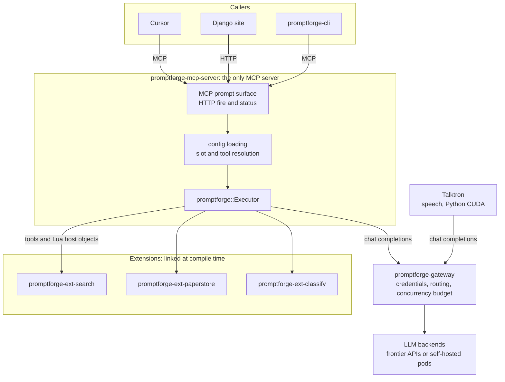

<!-- STATUS: tier large - phase one - 2 open decisions - per-crate docs in design-*.md -->

# PromptForge: a single-binary runtime that executes markdown prompts as an always-on service

## The Governing Principle: do more with less

Every boundary this document draws is subordinate to one rule: a feature earns new infrastructure only after it is shown that nothing already in the system can carry it. The facilities that already exist are substantial - a sandboxed Lua interpreter with an instruction budget, a run-scoped store with a file backend that Lua can already reach, and a catalog that already resolves globs and exceptions - so a proposed frontmatter field, configuration key, or resolution path is competing against real capability rather than against nothing. The threshold is the key rather than the table, because configuration bloats one key at a time and nobody ever notices the table it accumulated into.

The reason is what a reader can hold in their head. A small set of primitives used ten ways is a system one person can still reason about; ten mechanisms each used once is not, no matter how neatly each one is specified. Tidiness is the usual argument for the second shape and it is not sufficient. So when a design here proposes something new, the question that decides it is whether it could have been built with what is already there, and the answer belongs in the design.

## Open Decisions
- Whether the Rust side eventually absorbs the Python ingestion pipeline or Python keeps owning it permanently
- Time budget and deadline, which set how much of the build path is in scope for a first release

## Companion Documents

Two documents sit above the crates and answer different questions.

- **This document** is the system. It is authoritative for every boundary between components: who owns what, what crosses which line, and why.
- **[design-promptforge.md](design-promptforge.md) is the prompt language design document.** It specifies what a prompt *is*: the four primitives, the section model, the Lua block, the `goto` context-clearing jump, verbatim `Task` dispatch, fan-out and sub-section addressing, tool-call state rather than structured output, virtual files, model tiering, and the measured evidence behind each choice. It is authoritative for language semantics. It predates the Rust decision, so where it names Python, `lupa`, or a line-count estimate for a Python harness, this document supersedes it; its semantics stand unchanged.

Then one document per crate, at implementable depth, each authoritative for its own internals.

- [design-core.md](design-core.md) - `promptforge`, the library: `Executor`, `Extension`, `Prompt`, the resolution types, the observer, the Lua sandbox
- [design-gateway.md](design-gateway.md) - `promptforge-gateway`: the chat completions surface, routing, admission, pinning, `gateway.toml`
- [design-mcp.md](design-mcp.md) - `promptforge-mcp-server`: the MCP command surface, progress notifications, the Django endpoints, `prompts.toml`
- [design-cli.md](design-cli.md) - `promptforge-cli`: `run`, `list`, `validate`, terminal progress, exit codes
- `web_fetch` moved to its own crate `promptforge-webfetch`, documented in that crate's `design-webfetch.md`: a guarded URL fetcher with the URL and address SSRF defence. `web_search` remains a core tool proxied through the gateway.
- [design-paperstore.md](design-paperstore.md) - `promptforge-ext-paperstore`: the storage trait, both backends, the real schema, the transactional reference extension
- [design-classify.md](design-classify.md) - `promptforge-ext-classify`: ONNX sessions, the four Lua operations, the export gate
- [design-label.md](design-label.md) - `promptforge-ext-label`: computed progress labels, the reduction pipeline, the label cache

## Executive Summary
PromptForge executes markdown prompt files as an always-on service in either of two first-class environments - the whole stack on one developer machine, or the Django host and its firewalled intranet: an inference gateway that routes LLM traffic by model name, holds the LLM endpoint credentials, and owns the GPU concurrency budget, and `promptforge-mcp-server`, the one MCP server in the system, which executes the prompt a connecting client names. The CLI is a client of that server rather than a second execution engine. The runtime is domain-neutral: it parses, walks sections, and dispatches to named functions, and every capability with a subject matter - storage, search, classification - arrives as an `Extension` the host binary linked, which is also the whole extensibility story since there is no plugin loading. Recommendation: build it in Rust as one Cargo workspace, gateway first (high confidence - the gateway improves the existing Python stack with a configuration change alone). Who it serves and what success looks like: pending.

## Prior Art
Twenty-two systems examined. None combines a markdown-program executor with a credential-custodian gateway, and none enforces a concurrency budget shared across separate operating-system processes.

| System | What it does | What it lacks for us |
|---|---|---|
| Nanobot (obot-platform/nanobot) | Nearest neighbour. Single Go binary, Apache-2.0, 1.3k stars, 425 commits. An MCP host, the role Cursor plays, whose agents are markdown files with YAML frontmatter setting model, `mcpServers`, tools, and temperature, served over MCP on localhost 8080 | Every distinguishing mechanism here: addressable sections, the context-clearing jump, embedded scripting, per-section tool scoping, verbatim subagent dispatch, external state, a virtual filesystem, concurrency control, and routing for other processes. It accumulates context rather than clearing it - `compact.go`, `truncate.go`, `tokencount.go`, `CompactedMessages` keyed by thread. Its `agentaction.go` is MCP-UI plumbing, not control flow. README warns of a breaking redesign; multi-agent is roadmap, not shipped |
| GPTScript | The most literal prior prose-as-program attempt | Archived 2026-06-03 at v0.9.9; team moved to Nanobot |
| TensorZero | Inference gateway | Wound down mid-2026 |
| Portkey | Inference gateway | Acquired mid-2026 |

## Architecture

The `promptforge` library is the box labelled `Executor` and nothing else on this diagram. It has no edge to a backend, no edge to a database, and no knowledge of which extensions exist.

- `promptforge-gateway` (service) owns LLM endpoint credentials, backend routing by model name, the GPU concurrency budget, the only request queue in the system, and pinning a run's turns to one endpoint. It does not read prompts, resolve slots, touch storage, or expose an MCP surface of any kind.
- `promptforge` (library) owns prompt parsing, section walking, slot substitution, tool dispatch, output resolution, and the Lua sandbox, through `Executor`. It reads no configuration file and knows no domain: it holds no schema, no table, no paper, no search provider. Everything domain-shaped arrives as an `Extension` the host binary linked and registered. It declares no MCP client type either: a genuinely remote MCP service is reached by an extension that wraps it, so there is one binding rule rather than two.
- Talktron (separate service) owns the speech models and keeps its Python CUDA stack, reaching the gateway for LLM turns and sharing its budget. PromptForge hosts no audio model.
- The same boundaries hold in both environments: development runs every box on one developer machine, production spreads them across the Django host and its intranet.
- `promptforge-mcp-server` (service) is the only MCP server in the system and executes named prompts, plus a plain HTTP fire endpoint and status endpoint that Django calls. It binds a network interface, not loopback, and authenticates callers with the shared bearer token. `promptforge-cli` is a client of it. Both own configuration loading, slot resolution, output-root resolution, and the choice of which extensions to link and register. Neither talks to an LLM backend directly.
- `promptforge-ext-NAME` crates own extensions: a set of typed Rust functions handed to the core's `register_capability`, plus whatever connection or model those functions need. No extension crate depends on `mlua`, because the core derives both the tool schema and the Lua binding from the handler it was given. The domain lives here and nowhere else - `promptforge-ext-paperstore` is where WG21 knowledge enters the system, and a deployment that links it not at all is a working deployment.

## Primitives
1. Gateway - one service process bound to a network interface, holding an OpenAI-compatible chat completions endpoint, the LLM endpoint credentials, and the GPU concurrency budget, with no MCP surface
2. `Executor` - takes a parsed prompt, a resolved slot map, a resolved tool map, a gateway URL, an extension set, and an observer
3. Slot - a logical model name resolved in three layers, never a model, endpoint, or key
4. Extension - one linked crate contributing named Rust functions plus the connection or model those functions need, declaring which canonical tool names it provides, and carrying startup-validation and shutdown hooks
5. Canonical tool name - a fixed vocabulary word naming exactly one function, `web_search` or `classify_entail`, resolved by configuration to the extension that backs it; names sharing a prefix form a family that reaches Lua as one table
6. Tool registry - the resolved map from canonical name to extension function for one prompt, built at startup, each entry carrying its derived JSON schema and an optional rate-limit semaphore
7. Section lifecycle hook - the core signals section entry, verified completion, and retry to every registered extension; an extension backed by a database maps those three to begin, commit, and rollback, with savepoints for nested tasks
8. Semaphore admission - per-model-endpoint and global permits, eight and sixteen, with queue admission and a thirty-second timeout
9. Configuration pair - `gateway.toml` and `prompts.toml`, watched on the filesystem and hot-reloaded
10. Endpoint pinning - a run's turns for one model bound to one endpoint for the life of the run, keyed on the run and model pair, so the section prefix stays in that pod's prefix cache
11. Idempotent replace-all write - a write that fully replaces file and row from deterministic content, so a rerun needs no cleanup
12. Declared output - a named output with a kind, a format, and a required flag; a prompt emits to the name and the runtime resolves the destination
13. Progress observer - an interface the executor emits a structured event to at every section boundary and tool call
14. Prompt frontmatter - inert YAML at the head of a prompt file, parseable without running code: name, description, keywords, parameter schema, canonical tool names required, state-filing tool declarations, output declarations, progress templates, version
15. Run handle - a run identifier returned by the fire endpoint and readable at the status endpoint for the life of the run
16. Environment profile - development on one developer machine or production on the intranet host, differing only in what `gateway.toml` resolves a model name to and which extension backs a tool name
17. Classifier slot - a logical selector resolved in three layers to classifier weights and a device, never a model
18. Shared bearer token - one secret held in configuration and presented by every client, checked before a run starts
19. ONNX Runtime session - an in-process FP32 classifier or embedder session on CUDA, built from an opset-15-or-higher export, with build failures surfaced rather than silently falling back to CPU
20. Static GPU memory budget - a fixed per-process allocation on one card under MPS, assigned in a defined startup order
21. Declared exit - a section's Lua block records where it goes with `break_section` or `goto`, the runtime acts on that record when the section ends, and a section declaring nothing ends the run
22. `return_result` - the one run-termination signal, reaching the model as a tool and Lua as a function under one name, carrying one optional string to the caller

## Design Decisions

### Rust replaces Python
Written in Rust. The driver is single-binary distribution, an always-on OS service, and no interpreter dependency - not runtime speed. The prior-art survey confirms the design rather than redirecting it: the overlap with existing work is packaging - single binary plus markdown plus MCP exposure - not the execution model. Confidence high. Tension: a rewrite cost, and a smaller contributor pool than Python.

### The novelty is the composition of four mechanisms
The claim is the set, not any single part: section-addressed markdown with a context-clearing jump between sections, embedded Lua for per-section configuration and pre/postconditions, verbatim subagent dispatch by section reference, and a concurrency budget shared across every process on the machine. The survey found no system carrying this set. Tension: each of the four is load-bearing, so none can be dropped to simplify a first release.

### One Cargo workspace, five crate roles
Workspace named `promptforge`; crate names carry no `-rs` suffix. Crates: `promptforge` (library), `promptforge-gateway`, `promptforge-mcp-server`, `promptforge-cli`, and one `promptforge-ext-NAME` per extension. There is no proc-macro crate; see the decision below. The bare `promptforge` name goes to the library rather than to a binary or a facade, following the `tokio`, `serde`, `axum`, and `clap` convention where the workspace name and the core library coincide and everything else takes a suffix. Tension: more crates to version and release together.

### The core library knows no domain
`promptforge` holds no schema, no table name, no paper, no search provider, and no WG21 vocabulary. It parses markdown, walks sections, substitutes slots, dispatches to named functions, and resolves declared outputs. Everything domain-shaped is an `Extension` the host binary chose to link. The test is that a project with nothing to do with WG21 can take the crate, write extensions of its own, and get a working prompt runtime without deleting anything. Tension: the interesting behaviour lives outside the crate that gives the system its name, so no single crate can be read to understand a deployment.

### `Executor` reads no configuration
The core library type receives a parsed prompt, a resolved slot map, a resolved tool map, a gateway URL, an extension set, and an observer. Every consumer resolves configuration and hands it in. Naming follows Rust convention: the crate is `promptforge` and the type is `promptforge::Executor`, not `PromptExecutor`, in the shape of `tokio::Runtime` and `axum::Router`. Tension: each binary carries its own loading code.

### Both deployment environments are first-class
Two deployments, neither a degraded mode. Development runs the entire stack on the developer's machine, with small models on the local GPU and frontier-model API keys in the gateway. Production runs on the Django server's host or elsewhere on the same firewalled intranet, with the gateway pointed at RunPod pods and the host's GPU. Both bind a network interface rather than loopback: Cursor connects from a workstation across the network, and Talktron must reach the gateway across it too or the shared GPU budget stops being shared. Tension: every mechanism must hold on two hardware profiles, and in production the firewall is the only boundary.

### Local model needs divide three ways
Three categories, one of which the runtime hosts. Large open-weight models need nothing local; the gateway reaches them. Speech models, Whisper and Chatterbox, belong to Talktron, which keeps its Python CUDA stack and reaches the gateway for LLM turns; no prompt requires audio. Embedders and text classifiers are the only category the runtime executes locally, on whichever GPU the environment provides. Tension: the runtime carries a local inference dependency and its GPU memory, and that memory sits outside the gateway's budget.

### The gateway custodies the LLM credentials and the GPU budget
The gateway narrows to one responsibility: route LLM traffic by model name, hold the LLM endpoint credentials, and own the GPU concurrency budget. It is the single process that talks to LLM backends, so the budget holds across Talktron, the MCP server, the CLI, and any future consumer. Non-LLM credentials, the search API key among them, live in PromptForge's own configuration beside the prompt catalog, because the gateway has no reason to see them. Tension: one point of failure for every LLM consumer at once, and two places to look for a credential.

### An OpenAI-compatible chat completions endpoint
The gateway exposes a chat completions endpoint on whichever network the environment provides, routing by model name to a configured backend. The surface stays deliberately narrow: the standalone gateway space consolidated in mid-2026, TensorZero winding down and Portkey acquired, so this gateway is a credential custodian and concurrency point rather than a routing product. Tension: anything outside that surface needs its own path.

### Search and fetch are compiled-in Rust tools, never MCP
`web_search` and `web_fetch` are Rust tools compiled into the binary and called directly from the tool registry. MCP exists to cross a process boundary and these cross none, so federating them would buy a hop and nothing else. A genuinely remote MCP service is reached the same way anything else is: an extension wraps it and binds its calls to canonical names, so the executor holds no MCP client concept and there is one binding rule rather than two. Tension: a new search provider means a rebuild rather than a configuration line.

### promptforge-mcp-server is the only MCP server, and it runs prompts
Prompt execution is the product; without this server a caller could only use the command line. No capability of ours is offered to a connecting client for its own use - Cursor already has web search and must not be offered a second one - so the surface carries prompt execution and nothing else. Tension: a client wanting a bare tool has to go through a prompt.

### A prompt is invoked by name through one dispatcher, on the tools primitive
A single `run_prompt` taking a prompt name, rather than one tool per prompt. A prompt is a command: it runs because a person named it, never because a model noticed a description that looked relevant to a task nobody asked for, and publishing forty prompts as forty tools builds exactly the ambient-selection surface this system does not want. The fixed tool list pays a second time, since nothing a client cached can go stale: a prompt saved thirty seconds ago is callable immediately, with no reconnect and no list-changed notification. Prompts ride MCP's tools primitive rather than its prompts primitive, because `prompts/get` returns text for the client to execute and would hand our control flow to Cursor, which is the opposite of what this system does. Tension: a prompt can never be called under its own name, and per-prompt typed argument schemas are off the table, since every call goes through one tool with one schema.

### A single shared bearer token authenticates every client, on every surface
One token, one string, checked by the MCP server on both its MCP and HTTP surfaces and by the gateway on its chat completions surface. Not two secrets: the gateway's check is defence behind the firewall rather than a separate trust boundary, and a second string to rotate would buy nothing while doubling the ways a deployment can be half-configured. It is the cheapest posture that fails closed. Its cost is that rotation means editing every client and every service, and that logs cannot distinguish callers. Per-client tokens are the upgrade when attribution or per-caller limits matter, and `rmcp` ships OAuth, so that is configuration rather than architecture. Tension: no attribution today, which is exactly what per-caller limits would need, and one leaked string reaches both the prompt surface and the model credentials at once.

### No plugin mechanism
Extensions are Rust crates linked into the binary, registered by an explicit central `register_all`, gated by Cargo features. Rejected: dynamic libraries, because Rust has no stable ABI; the `inventory` crate, because dead code elimination silently drops registrations; a build script manifest, because `build.rs` cannot add Cargo dependencies; WASM plugins as unnecessary toolchain weight, recorded as the escape hatch if tool-call overhead is ever measured as the bottleneck. Extensibility is therefore a compile-time property, which is why the domain boundary has to be clean: the mechanism for adding behaviour is writing an extension crate and linking it, so that path has to be pleasant. Tension: adding a tool requires a rebuild and a release.

### No proc macro; a generic function does the same job
A `#[tool]` attribute macro was specified and then rejected. It buys boilerplate elimination and costs the `cargo check` feedback loop: a proc macro makes compile errors point at synthesized spans in code nobody wrote, and that loop is the single best signal available when an AI is writing the implementation. Boilerplate is the cheapest thing to produce in that setting, so the trade is backwards. The arithmetic that would have favoured a macro at thirty capabilities does not survive the keystrokes being free.

`promptforge::register_capability` replaces it: one generic function taking a name, a description, a `Surfaces` declaration, an optional rate limit, and a typed async handler, returning a `ToolDef`. It derives the schema through `schemars`, owns the JSON conversion in both directions, and returns the erased entry point. The macro's one job worth keeping is kept by construction rather than by generation: no extension crate depends on `mlua`, so no extension can hand Lua a closure that captures a real file handle, and the audit surface for the sandbox is one function in one file. The consistency a macro would have enforced structurally becomes a test that round-trips each declared schema against a sample of its argument type. Tension: that consistency is now a test rather than a compile-time impossibility, so it holds only as long as every capability has a sample value.

### An extension is the only unit of domain code
One extension is one linked crate offering named Rust functions, the connection or model those functions need, a declaration of which canonical tool names it provides, and two lifecycle hooks: startup validation and shutdown. Nothing else reaches the executor. The paperstore integration is `promptforge-ext-paperstore` and carries its own storage trait, its own SQLite and Postgres implementations, and its own schema; the core neither declares nor imports them. Tension: an extension that wants a mechanism the trait does not expose has to change the trait, which is a core change.

### Only Rust functions are tools, and a tool can also be a Lua host object
There is one kind of contributed code - a Rust function with a typed argument struct - and two surfaces onto it. `register_capability` derives the JSON schema for the model-facing tool surface and the `mlua` binding for the author-facing Lua surface from the same handler, so a function is a tool, a Lua host object, or both, by declaration rather than by being written twice. The distinction that survives is who calls it: the model calls a tool inside the tool-call loop, and the prompt author calls a host object from Lua at a section boundary. Tension: a function exposed both ways has two callers with different failure expectations, and the model's schema constrains the signature even when only Lua uses it.

### Prompts name tools from a canonical vocabulary, and configuration binds them
A prompt writes `web_search`, `web_fetch`, `paper_upsert`, or `classify_entail` - fixed words, the same in every prompt - and `prompts.toml` binds each word to the extension that backs it. This is the model-slot mechanism applied to tools, and for the same reason: a prompt must not know whether search is Brave or Google, or whether the store is SQLite, Postgres, or something with no relation to papers. Swapping a provider is a configuration line. One word names one function, because a binding resolves to one function; a family of related functions is a shared prefix rather than a single word with methods, and the family reaches Lua as one table named by that prefix. Adding an extension therefore adds words to the canonical set, which is an edit to a list in the core and the one core change a new extension can require. Tension: the vocabulary is fixed centrally, so a genuinely new capability needs a new canonical word rather than a local invention, and a four-operation extension costs four words.

### Tool binding is hierarchical, global first
`prompts.toml` carries a global `[tools]` table binding every canonical name once, and a per-prompt `[prompts.NAME.tools]` table that overrides only what differs. Most prompts override nothing. Restating every binding per prompt was rejected as unusable at forty prompts. The same shape already applies to model slots, so there is one inheritance rule to learn rather than two. Tension: reading one prompt's effective bindings means reading two places.

### Two configuration files with distinct owners
`gateway.toml` holds backends, LLM endpoint credentials, and concurrency limits. `prompts.toml` narrows to deployment scope: which prompts are enabled, model slot mappings, canonical tool name bindings, output roots, run limits, per-tool rate limits, every non-LLM credential including the search API key, and any remote MCP service the executor connects to. Description and keywords are not in it; they are intrinsic to the prompt and live in frontmatter. Both are TOML, which is the Rust ecosystem default and typed rather than merely sectioned. YAML was weighed and rejected for its indentation sensitivity and its unquoted-scalar coercions. Tension: two files that must agree at deploy time.

### Prompts are deployment-agnostic
A prompt calls `model` with a logical slot name and never names a model, endpoint, or key. The `Services` section that the Python implementation put inside each prompt file is removed entirely. No prompt changes between environments: the prompt names a logical slot, `prompts.toml` maps it to a name, and `gateway.toml` decides whether that name resolves to a frontier API key or a self-hosted pod. Tension: a prompt cannot pin a model it depends on.

### Three-layer slot resolution, mapped per prompt
A prompt asks for a slot; `prompts.toml` maps that slot to a model name per prompt with global defaults as fallback; `gateway.toml` maps the model name to a backend and credential. Mapping is per-prompt because prompt authors will not share a vocabulary, so two prompts using the same word resolve differently. Tension: one slot name means different things in different prompts.

### The prompt catalog is explicit
A markdown file in the prompts directory is not runnable until it appears in `prompts.toml` with its slot mappings. Tension: every new prompt needs a configuration edit before it runs.

### Inert prompt metadata lives in YAML frontmatter
Frontmatter holds name, description, keywords, parameter schema, output declarations, progress templates, and version. Lua stays per-section and executable: model slot, tool scoping, pre- and postconditions, fan-out, context injection. The boundary is whether reading it requires running code - cataloguing forty prompts at boot is forty YAML parses rather than forty instantiated Lua VMs executing code to read a label. Prompt-level identity is declared once and never computed, so the rejected per-section metadata DSL, whose values sometimes need computing, stays rejected. Tension: two declaration surfaces in one file, free to drift apart.

### A prompt declares its own parameter schema
Parameters are the prompt's calling interface rather than deployment configuration, so the schema lives in the prompt's frontmatter. Two consumers read it: the MCP server validates the `args` a `run_prompt` call supplies for the named prompt, and the CLI validates `key=value` arguments. It never becomes a published tool schema, because there is one tool with one schema. Tension: the schema and the prompt body can drift apart.

### A prompt declares its outputs and never constructs a path
Every prompt's frontmatter carries an `outputs` block naming each output, with a kind, a format or target table, and a required flag. A prompt emits to an output name; the runtime resolves the destination from configuration. Tension: an output the author did not foresee cannot be produced without a prompt edit.

### Declared outputs make the result typed and the postcondition automatic
Three consequences beyond boot-time validation: the MCP tool result is a typed value carrying a path and a row count rather than an untyped blob; a required output that a run did not produce is a failed run, with no separate postcondition to write; and the `outputs` block itself tells a caller what a prompt produces before it is named, read straight from the prompt's frontmatter rather than from `list_prompts`, whose payload is name, description, version, and problem. Tension: an exploratory prompt whose product varies run to run fits this badly.

### Output delivery resolves override, then configuration, then error
Configuration names the root per output, a caller may override by output name, and precedence is override, then configuration, then error. Because a prompt names an output slot rather than a path, a caller-supplied destination cannot become a write-anywhere primitive, and a section handling untrusted text has no real path in reach. Tension: a caller cannot direct a run at an arbitrary location, which is the point.

### The Rust side writes the report; the result carries a path
A finished report is written by the Rust side. The tool result returns the path plus a short summary and never the document body, so a calling model spends no output tokens re-emitting a report it did not write. Tension: a client that wanted the text inline has to read the file.

### CLI surface is run, list, validate
`promptforge run PROMPT` with `key=value` pairs, plus `list` and `validate`. Keys come from the prompt's own parameter schema, so the CLI invents no per-prompt flag names at all. Tension: anything not expressible as `key=value` has nowhere to go.

### The CLI is a client of the MCP server, not a second execution engine
`promptforge run` connects to the service across the network, invokes the same tool Cursor invokes, streams progress events to the terminal, and prints the result path. Prompts therefore execute in exactly one process with one set of semaphores and one rate limiter, and the terminal and Cursor paths exercise identical code. There is exactly one execution path and no in-process escape hatch: a `--local` flag was specified and then dropped, because the testability it offered is delivered better by integration tests linking the library against the fake gateway and recording extension, and because an in-process run does not merely duplicate the admission code path but holds a second budget. Tension: `promptforge run` fails when the service is not running, which is a worse first-run experience, and that cost is accepted rather than worked around.

### Per-tool rate limits are semaphores in the tool registry
A tool that talks to a metered upstream carries its own permit count in the registry, independent of the gateway's GPU budget. Tension: a rate limit is process-local, which is why the CLI runs as a client rather than in-process.

### mlua in Luau mode replaces lupa
Luau sandbox mode is an allowlist by language design, making globals and metatables read-only with no `io`, `os`, `debug`, or `loadfile` to remove. lupa needed a blocklist and still had a sandbox-escape CVE. Tension: Luau is not Lua, so existing scripts may need edits.

### The classifier extension declares Lua only, not a tool surface
The dual-surface mechanism permits either, and the classifier extension chooses Lua alone. A tool is called by the model inside the tool-call loop; a classifier call is made by the runtime during section configuration, before the model launches or after it signals completion. Keeping it off the tool surface keeps deterministic logic out of the model's instruction budget, which is the reason the Lua layer exists. Tension: a prompt author who wants the model to choose when to classify has no way to express it, and the restriction is the extension's declaration rather than something the core enforces.

### The extension's Lua objects sit beside the core's
The core provides the five host objects the prompt language already specifies - `state`, `store`, `tools`, `params`, and `context` - plus `sections` and `progress`; every other name arrives from an extension, `classify` among them. `store` here is the run state store, which is core, and not a persistent database, which is an extension arriving under its own name. The two are easily confused and are unrelated. The classifier surface covers four operations: zero-shot classification returning a label, cross-encoder entailment returning a score, embedding, and ranking a candidate set against a query. Tension: a small fixed surface means anything beyond those four is a rebuild rather than a script edit, and a prompt reading a name the deployment did not link fails at startup validation rather than at authoring time.

### Classifier slots resolve exactly like model slots
The prompt names a logical selector, `prompts.toml` maps it to a classifier, and configuration maps that to weights and a device. The existing `classifier_defaults` convention already has this shape, so the mechanism is reused rather than invented. Tension: as with model slots, one selector name can mean different things in different prompts.

### A per-section budget caps classifier calls
Each section carries a maximum number of classifier calls, for the same reason tool calls are capped: ranking hundreds of candidates inside a loop is easy to write by accident. Tension: a legitimately large ranking job has to raise the cap in configuration.

### Classifiers run in-process through ONNX Runtime
In-process, through the `ort` crate binding ONNX Runtime, pinned at 2.0.0-rc.12 with the `cuda` feature, alongside `fastembed` 5.17.2 for embedding and cross-encoder rerank and `tokenizers` 0.23.1 for preprocessing - HuggingFace's own Rust implementation, so no Python enters the runtime. An offline FP32 ONNX export precedes use and is gated on numerics parity. Measured at batch size one on an RTX 4070 Laptop, DeBERTa-v3-base runs 7.98 ms through ONNX FP32 on CUDA against 14.47 ms through PyTorch at sequence length 64, and MiniLM lands at 0.4 to 1.5 ms per call. The advantage vanishes at batch 32, 209 against 207 sentences per second, so what ONNX wins is launch overhead and kernel fusion - exactly the batch-one-called-repeatedly regime Lua produces. Tension: an export step stands between a published model and a usable one.

### Serving classifiers over HTTP is impossible, not merely inconvenient
vLLM v0.26.0 carries zero DeBERTa entries in its model registry; pull request 42094 has sat open since May with no activity since 2026-06-10, and an earlier attempt, 20215, closed unmerged after ten months, because disentangled attention is architecturally incompatible with vLLM's standard attention layer. The transformers fallback is closed too: HuggingFace's `modeling_deberta_v2.py` has neither `ALL_ATTENTION_FUNCTIONS` nor `_supports_attention_backend`, both required. SGLang v0.5.16 supports only `BertModel`, Contriever, `BertForSequenceClassification`, `XLMRobertaModel`, and `XLMRobertaForSequenceClassification`. Both engines are the wrong tool for encoders regardless: 1.8x slower per query than plain HuggingFace Transformers, 907 against 1671 queries per second, with startup three times longer and neither chunked prefill nor a radix cache available on encoders. Tension: the classifier path has no HTTP escape hatch.

### In-process classifiers reduce GPU contention rather than add it
Both engines run one model per process, and `gpu-memory-utilization` reserves a fraction of free memory held for the process lifetime, released only through sleep mode, which forces strictly sequential process startup. An HTTP-served classifier would be a second permanent reservation plus an ordering dependency; in-process costs about two gigabytes and no additional process. Tension: those two gigabytes still sit outside the gateway's request budget.

### FP32 is the only viable precision
INT8 quantization collapses the model - entailment scores fall from 0.99 to 0.49 and macro-F1 drops 21 to 38 points - and INT8 on CUDA is slower anyway at 27.37 ms. FP32 ONNX matches PyTorch probabilities to three decimals, so the bf16 and fp16 CrossEncoder instability recorded for the Python cross-encoder path in `wg21-paperflow/SERVICES.toml` does not arise here, which improves determinism across the two environments. Tension: FP32 weights cost four times the memory of INT8, spent to keep the numbers trustworthy.

### Two export requirements fail silently when missed
Export at ONNX opset 15 or higher: below that the XSoftmax tracer bakes in constants and the model returns an identical answer for every input. Call `error_on_failure` when building the session: without it a driver mismatch falls back silently to CPU at 44 ms. Both failures pass any smoke test that only checks the call returns. Tension: two build-time invariants that no runtime assertion catches.

### Classifier support is an extension behind a Cargo feature
Classifiers are `promptforge-ext-classify`, linked only when its feature is on. Built without it the binary is self-contained, no prompt can name `classify_label`, `classify_entail`, `classify_embed`, or `classify_rank`, and no `classify` table appears in Lua; built with it, CUDA shared libraries become a deployment dependency, which costs nothing in either environment because both already have CUDA installed. Shared libraries are ordinary native practice, not the interpreter-and-package-tree dependency the single-binary goal exists to avoid. Because the ONNX and CUDA dependency is confined to one extension crate, no other crate in the workspace acquires it. Tension: two build configurations to test and ship.

### ort is a release candidate, and that risk is carried
`ort` has been a release candidate since February 2024 across thirteen releases with breaking API churn, and `fastembed` pins one exact release candidate, so upgrades are gated externally rather than chosen. Mitigation is the same trait boundary used for storage, with the version pinned exactly. Tension: a dependency the project cannot upgrade on its own schedule sits under a load-bearing feature.

### MPS co-hosts models on one card, and GPU memory is a static budget
MIG on an RTX PRO 6000 Blackwell 96GB offers only 24-gigabyte partitions and requires compute display mode, which disables display output, so MPS is the co-hosting mechanism and memory is a static budget rather than a negotiated one. Startup order is vLLM first with explicit headroom, then in-process classifiers, then any speech stack, with sequential startup enforced by whatever supervises the services. Adding a local inference card later changes only a `gateway.toml` entry; whether it pencils out against RunPod pod hours is procurement, not architecture. Tension: a static budget wastes whatever the busiest tenant is not using at the time.

### Determinism across environments is not free
Under the rerun-everything principle, classifier calls require fixed batch composition. The dtype half of the problem is closed: FP32 is pinned in both environments and matches PyTorch to three decimals, so the CrossEncoder NaN behaviour recorded under bf16 on older CUDA, and its fp16 workaround, does not arise on this path. Batch composition remains, so a differently batched rerun can still score differently. Tension: results still reproduce within an environment more readily than across both, and only the classifier path has had its dtype risk retired.

### Startup validation rejects unresolvable prompts
Startup rejects any prompt whose model slot does not resolve, whose classifier selector does not resolve, whose canonical tool name has no binding in configuration, whose binding names an extension that is not linked, or whose declared output names a missing output root or target table, which is why implicit registration was rejected. Every registered extension's own `validate` hook runs in the same pass, so a missing database or an unreadable model file fails at boot rather than mid-run. Tension: one bad prompt entry stops the whole service.

### A failed run is discarded and rerun from the start
No resume, and no partial-result reporting. This follows a principle that predates this component and holds system-wide: every operation is idempotent and re-runnable, so recovery is simply to run it again. paperstore already states that recovery is to re-run the operation because the next call rewrites both file and row cleanly, and the pipeline status machine already states that duplicate work is harmless because file writes use atomic rename and content is deterministic from the same source. A run that dies at section five having committed sections one through four needs no cleanup, because the rerun overwrites those rows. Tension: a long run repeats work already finished, and a caller gets nothing rather than something partial.

### The section is the transaction boundary, and the core only announces it
The core emits section entry, verified completion, and retry as lifecycle events, and knows nothing about what an extension does with them. A storage-backed extension opens a write on entry, commits when the model signals completion and postconditions pass, rolls back on retry, and uses savepoints for nested subagent tasks. Immediate per-tool-call commits would break the existing retry contract, which rolls the state store back to a pre-attempt snapshot. Scope is retry rollback within a single run: correctness across runs comes from replace-all writes plus deterministic content, not from transactions. Tension: a long section holds a write transaction open, and the core cannot enforce that an extension honours the events it is sent.

### The paperstore extension writes paperstore tables, never Django's
A property of `promptforge-ext-paperstore`, not of the runtime. The Django write path resolves author organizations from front matter against an `Organization` table, and its evaluation rows are append-only history whose ordering the site depends on, so the extension writes paperstore and lets the site mirror. Tension: paperstore and the site diverge until the site mirrors.

### Django fires a prompt over HTTP and polls status
Django posts to a plain HTTP endpoint on the MCP server, receives a run identifier, and drives a browser progress display from a status endpoint. Chosen over a polled job table because Django already runs Celery, so a Celery task that posts and retries on failure is itself the durable queue, and a job table as transport would duplicate it. `PaperPipelineJob` stays a tracking row the site displays, not a message bus. Tension: run state lives in the service rather than the database.

### The storage trait belongs to the paperstore extension
A Rust trait mirroring paperstore's existing abstraction, with a SQLite implementation for local work and a Postgres implementation for production, lives inside `promptforge-ext-paperstore`. The core declares no storage concept at all, so an extension backed by a REST API, a file tree, or nothing persistent is equally valid. The Django site's existing mirror code is unchanged when the backing store swaps. No paperstore Postgres backend exists in either repository today despite the Python design document describing one; building it is in scope for that extension. Tension: two backends to keep behaviorally identical, and a second storage-shaped extension would duplicate the trait rather than share it.

### Paper ids are uppercase inside the paperstore extension
paperstore paper ids are uppercase; every Django-side paper-keyed model is lowercase. The extension writes paperstore and therefore uses uppercase, and the case fold is its problem rather than the runtime's. Tension: every cross-boundary lookup needs a case fold.

### Concurrency is Tokio semaphores
One semaphore per model endpoint and one global, with queue admission and a timeout. Grounded against vLLM v0.26.0 as of 2026-07-25: eight requests in flight per endpoint, tunable four to sixteen; sixteen in flight globally across all endpoints; thirty seconds waiting for admission before HTTP 503 with Retry-After; immediate refusal at a per-endpoint queue depth of sixteen; six hundred seconds as the ceiling on any single request, matching RunPod's execution timeout. Evidence: on one H100 SXM5 running Llama-3.1-70B-FP8 at eight-thousand-token context, raising concurrency from four to sixteen gained 0.2 percent throughput, 83.0 to 83.2 tokens per second, while P99 time-to-first-token degraded 8.7 times, 4,607 to 40,113 milliseconds; reproduced on a second provider within 1.007x, and a sweep of eighteen scheduler configurations did not move the boundary (github.com/vllm-project/vllm/issues/42484). Tension: queued requests hold a connection while they wait; a static request count ignores context length and is roughly twice too generous past twenty-eight-thousand-token contexts; first-come-first-served at both layers lets one job's many turns monopolise slots without per-client quotas.

### The gateway owns the only queue
Admission is enforced at the gateway rather than delegated to the engine, because vLLM v0.26.0's waiting queue is an unbounded, untimed CPU deque: excess load becomes unbounded time-to-first-token with no 503 and no Retry-After, leaving a caller unable to distinguish queued from hung. In-engine caps remain an open pull request, number 49445. Pods launch with max-num-seqs of sixteen, twice the gateway's per-endpoint cap, so the gateway is always the tighter constraint and owns the only queue. Tension: every client must implement retry with backoff, because a fourth process bursting turns will collect 503s.

### A run's turns pin to one endpoint per model
Every turn of a run that asks for a given model goes to the same endpoint, so the shared section prefix stays in that pod's prefix cache. The pin is keyed on the run and model pair rather than on the run alone, because a prompt with a fast slot and a thinking slot legitimately reaches two pods and a run-only key would make the second slot evict the first. Tension: this forecloses spreading one run's load across replicas of the same model.

### Progress is a structured event stream behind an observer interface
The executor emits a structured event at each section boundary and each tool call through an observer interface, and consumers translate. The MCP server turns those events into progress notifications on section transitions, with long-running-task support when the client advertises it and elicitation for mid-run user questions; the CLI prints them. Frontmatter progress templates, static text keyed by section name, are the fallback when the narrator model is unavailable or not worth invoking. A narrator that converts the stream into human-readable text, potentially a fine-tuned small model, is out of scope here and the seam it attaches to is specified now. Tension: a client without those capabilities sees one silent long call.

### Cursor renders progress notifications live, measured rather than assumed
A throwaway MCP server emitting `notifications/progress` every five seconds over a thirty-second call was connected to Cursor on 2026-07-25. Cursor renders each notification in place, replacing the previous one, for the duration of the call. This was the design's largest open risk, because a spinner-only client would have moved the entire progress story to the tool result and changed what the narrator model is for. It did not. What Cursor draws is text rather than a bar, so the message carries the meaning and a section named in the prompt appears on the caller's screen with no additional surface. Tension: this is one client measured on one date, and no part of the protocol obliges another client to render anything.

### Progress carries no denominator
A notification says which section is running and does not say how many remain. An earlier draft sent a `nominal_total` counting the prompt's H2 sections so a client could render `2 / 5`, and it is dropped. The number is unknowable rather than merely approximate: `goto` may skip sections, revisit them, or jump backwards, and `return_result` may end a run from any section, so the count a run will actually visit is not determined when it starts. Fall-through makes a straight-line prompt predictable but does not make every prompt so, and a denominator that is right for the simple case and wrong for the branching one is worse than none, because a reader cannot tell which they are looking at. Tension: no client can draw a filling bar, and a long run therefore looks the same at its start as near its end apart from the section name.

### Both services install through daemon-kit
Windows Service Control Manager, launchd, and systemd. A Windows service has no console, so logging goes to a rolling file, and the Tokio runtime is created inside the service handler rather than by an attribute macro. Tension: three platform service paths to test.

### Configuration hot-reloads on a filesystem watcher
New models take effect immediately; changed backends apply to new requests while in-flight requests finish against the old one; removed models begin refusing requests. Tension: two live configurations during the drain window.

### Local SQLite runs in write-ahead logging mode
WAL is required before a second process writes the database. The current Python backend sets only a busy timeout, and its comment states a single-process assumption. Tension: WAL sidecar files that copy-based backups must include.

## Worked Examples

Four paths chosen because each is the first thing that breaks if a boundary is wrong. Each names the artifact, the calls across crate boundaries, the trace, and the test that would catch a regression.

### One: Cursor runs a prompt and watches it

The artifact is a prompt file plus its `prompts.toml` entry. The path exercises every crate at once and is the acceptance test for the whole system.

- Cursor calls `tools/call` on `run_prompt` with `{ "prompt": "staker", "args": { "entity": "Bloomberg" } }` and a `progressToken` in `_meta`.
- `promptforge-mcp-server` checks the bearer token, looks the named `staker` up in the catalog snapshot, validates the arguments against the frontmatter schema, takes a run permit, builds an `McpObserver` around the progress token, and constructs `Executor::new` from maps resolved at boot.
- `Executor::run` enters `## Main`, emits `RunStarted` and `SectionEvent::Enter`, and runs Main's Lua, which declares `break_section`. Main's model turn ends without tool calls, so the executor takes that exit to `## Gather` and destroys the context on the way.
- `## Gather` calls `model("fast")`, which `SlotMap` resolves to `claude-sonnet-4`, and the gateway resolves that to a backend and a key. The section's `tools.add("web_search", ...)` scopes the model's schema list to four entries out of the eleven bound.
- Each `web_search` call goes to `promptforge-ext-search`, holding a four-permit semaphore. Each model turn goes to `promptforge-gateway`, which admits it against the per-endpoint and global semaphores and pins the run and model pair to one endpoint.
- The model stops calling tools, `check()` passes, `SectionEvent::Complete` fires, and the executor takes Gather's declared exit to `## Evaluate`, destroying the context again.
- Progress: each `SectionStarted` becomes a notification Cursor renders in place as `Gathering source material`.
- The report is written by the Rust side to the configured root for the `report` output. `## Write` declares no exit, so the run ends when it does, and it calls `return_result` with a one-sentence verdict on the way out. The tool result carries the path, that value, and a summary, never the body.
- `SectionEvent::RunEnded { ok: true }` fires from the guard, and the paperstore extension commits.

The prompt is four sections, the first three declaring `break_section` and the last declaring nothing, with no `goto` anywhere. That is the shape most prompts have: the exits say only "continue," and they are written down anyway so that the graph can be checked at boot and so that reading one section tells you what follows it.

Trace assertion: the observer transcript is a golden file. Tests: the MCP integration test drives this against the core's fake gateway and recording extension, asserting the exact event sequence, that `completed` never decreases, and that the result contains a path and no document body.

### Two: the same prompt moves to production unedited

The artifact is a second `gateway.toml`. Nothing else changes, which is the entire claim.

- Development: `prompts.toml` maps `fast` to `claude-sonnet-4`; `gateway.toml` maps that name to `api.anthropic.com` with a frontier key.
- Production: the same `prompts.toml` maps `fast` to the same name; a different `gateway.toml` maps it to a RunPod pod on the intranet.
- The prompt file is byte-identical. It names a slot and never a model, an endpoint, or a key.

Test: one prompt, two configurations, one fake backend for each, asserting identical `Event` transcripts apart from the `ModelTurn` endpoint. This is the regression test for a prompt acquiring a deployment dependency.

### Three: a section fails its postcondition and the run is discarded

The artifact is a prompt whose `check()` asserts a verdict was set, against a model that does not set one.

- `## Evaluate` runs, the model stops calling tools, `check()` raises, and the executor emits `SectionRetrying`.
- `SectionEvent::Retry` fires. The paperstore extension rolls back and begins again; no second `Enter` is emitted.
- After `max_retries_per_section` the run fails with `PostconditionExhausted`. No partial result is returned.
- `SectionEvent::RunEnded { ok: false }` fires from the guard, and the paperstore extension rolls back and returns its connection.
- Recovery is to run it again. Sections one through four committed rows, and the rerun replaces them, because every write is a replace-all write from deterministic content.

This is the path where `RunEnded` earns its place: without it the extension holds an open transaction, and on SQLite the single write connection is then wedged for every later run until the process restarts. Tests: retry-then-succeed and retry-then-exhaust against the recording extension; a rerun after failure asserting identical rows; and a test that a second run after a failed one still writes, which is the one that fails if `RunEnded` is ever dropped.

### Four: a Lua block classifies before the model runs

The artifact is a section whose precondition is a classifier call, which is the case that justifies the Lua layer existing.

- The block calls `classify.label{ text = state.paragraph, labels = { "TARGET", "SKIP" } }`.
- `promptforge-ext-classify` runs an in-process ONNX FP32 session on CUDA, roughly 8 ms, and returns a label. No LLM turn happens and the gateway is not touched.
- A top-level `assert` on the result skips the section when the label is `SKIP`, and the executor emits `SectionSkipped`.
- The function is `Surfaces::LuaOnly`, so it is absent from the schema list the model sees and cost nothing from the model's instruction budget.

Tests: the four Lua operations against a real session behind the Cargo feature; the surface-separation test asserting the `classify_` names are absent from the model's schema list and present as a `classify` table in Lua; and the differential check that two different inputs produce different outputs, which is the only thing that catches an opset-14 export returning a constant.

## Non-Goals
- No plugin mechanism - extensions compile in; WASM stays an escape hatch, opened only if tool-call overhead is measured as the bottleneck
- No proc macro - a generic `register_capability` derives both surfaces from a typed handler, because a macro would trade the `cargo check` feedback loop for keystrokes that are free
- No `mlua` dependency in any extension crate - the core owns every Lua binding, so no extension can hand the sandbox a closure holding a real resource
- No domain knowledge in the core - `promptforge` declares no schema, no table, no paper, and no search provider; a deployment linking no extension of ours is a working deployment
- No storage concept in the core - the storage trait and both its backends live inside the paperstore extension, so an extension persisting nothing is equally valid
- No per-prompt service configuration - the Python `Services` section is gone, and prompts name no model, endpoint, or key
- No prompt-invented tool vocabulary for anything that leaves the run - a prompt names tools from the canonical set and configuration binds each name to an extension, and a canonical name is exactly a name that reaches outside the run, to a network, a disk, or a database. A prompt does declare its own state-filing tools in frontmatter, and those bind to nothing external: they write the core's own run state store, which is per-run, in memory, and discarded when the run ends
- No direct writes to the Django site's tables - the site owns its own write path and its append-only history
- No implicit tool registration - registration is explicit so startup validation can reject an unknown tool name
- Rust is not adopted for runtime speed - the driver is distribution and service lifetime
- No resume of a partial run - a run that dies is discarded and rerun from the start, because every operation is idempotent and re-runnable
- No partial-result reporting - a run either completes or is rerun, so there is no half-answer to hand back
- No MCP surface on the gateway - MCP exists to cross a process boundary, and the gateway's tools cross none
- No prompt on our MCP surface is a tool of its own, and no capability of ours is - the published list is the fixed set of commands that run a prompt the caller names, and Cursor has its own web search and is not offered a second
- No prompt-constructed filesystem paths - a prompt emits to a declared output name and the runtime resolves the destination
- No document body in a tool result - the result carries a path, the returned value, and a summary
- No row-shaped output in the core - `OutputKind` knows files and nothing else; an extension writing rows tracks and reports them itself, because a table name is a domain concept
- No completion ceremony - a section ends when the model stops calling tools, and the removed `done()` tool is not replaced by another signal
- No implicit advance between sections - every edge is declared in Lua with `break_section` or `goto`, so file order alone moves nothing and a section reached by nobody is a boot error
- No routing on the model surface - `break_section` and `goto` are Lua-only; the model decides what, and the prompt author decides where that leads
- No declared return schema - `return_result` carries one string the runtime never parses, because the run's real product was validated on the way in, one flat tool call at a time
- No progress denominator - a notification names the running section and claims nothing about how many remain
- No narrator here - the observer seam is specified with static frontmatter templates as the fallback; converting events to human-readable text is built elsewhere
- No audio in a prompt - speech models belong to Talktron, which keeps its Python CUDA stack and reaches the gateway for LLM turns
- No large model inside the runtime process - open-weight models are reached through the gateway, and only embedders and text classifiers execute locally
- No classifier in the model's tool-call loop - the runtime calls classifiers from Lua at section boundaries, so they never spend the model's instruction budget
- No HTTP-served classifiers - vLLM v0.26.0 and SGLang v0.5.16 cannot serve DeBERTa at all, and both are 1.8x slower than plain Transformers on encoder work regardless
- No switch to a BERT-family cross-encoder for the sake of serving it - nli-small's measured 96 percent target recall at one eighty-fifth the cost of zeroshot-large is a closed measurement, and changing families reopens it
- No INT8 classifiers - quantization drops entailment scores from 0.99 to 0.49 and is slower on CUDA anyway
- No MIG partitioning - the only partition size on the production card is 24 gigabytes and enabling it disables display output, so MPS does the co-hosting
- No per-client authentication in the first release - one shared bearer token checked by every service on every surface, with per-client tokens and OAuth as the upgrade when attribution matters
- No mid-run user question in the first release - `ask_user` is bound as a stub that fails the run with `Unimplemented`, because the observer interface is one-way and an HTTP-fired run has no interactive caller to ask
- No cross-environment determinism guarantee - dtype is pinned per environment, so a prompt reproduces within an environment rather than across both
- No prompt edits between environments - a prompt names a logical slot and configuration decides whether it lands on a frontier API or a self-hosted pod
- No prompt-level metadata in Lua - identity is declared in frontmatter, so boot-time registration runs no prompt code
- No job table as a message bus - Django posts to an HTTP endpoint and Celery is the durable queue; `PaperPipelineJob` is a tracking row the site displays

## Build Path
Ordered steps: 1. the gateway, because it improves the existing Python stack with only a configuration change; 2. the library, the `Extension` trait and `register_capability` among the first things written because every later step depends on their shape, ending in an integration test that links the library against the fake gateway and the recording extension, which is the fastest end-to-end exercise and the reason no `--local` flag is needed; 3. the MCP server, the first thing that can execute a prompt for a caller; 4. the CLI as a client of it; 5. extension crates, one at a time, `promptforge-ext-search` first because it is the smallest complete exercise of the trait, then `promptforge-ext-paperstore`, whose Postgres backend is in scope and does not exist yet in either repository. Classifier support arrives as `promptforge-ext-classify` after step 2, gated on an offline FP32 ONNX export reaching numerics parity with PyTorch to three decimals before any prompt calls it. On a single-card host, services start in order: vLLM with explicit headroom, then the in-process classifiers, then any speech stack.

Both of this design's largest risks are now retired by having been checked rather than assumed.

The progress-rendering risk was retired by measurement on 2026-07-25: Cursor renders `notifications/progress` live.

The `Extension` trait risk - that one trait carries both a stateless HTTP-backed extension and a transactional database-backed one without a special case for either - was retired by specifying both extensions against the trait, in [design-classify.md](design-classify.md) and [design-paperstore.md](design-paperstore.md). The verdict is substantially correct rather than confirmed: one trait does carry both shapes, and it needed four additive changes to do it, all now in [design-core.md](design-core.md). Three were plumbing; one was a genuine availability defect. `on_section` had to become async, because a transaction boundary is I/O and a synchronous hook cannot await a `COMMIT`. Nested events needed a task identity, because savepoints on one connection are last in, first out and concurrent fan-out at one depth interleaves them silently. `RunError` needed an extension variant, and the trait needed a way for an extension to report what it did. The defect was the absence of any run-terminal event: with `shutdown` scoped to the process rather than the run, every failure path left an open transaction, and on SQLite's single write connection the first failed run would have wedged every subsequent write until restart, turning recovery from rerun-it into restart-the-service. `SectionEvent::RunEnded` closes it, emitted from a drop guard so it fires on every path out of `run` - which matters more now that `return_result` can end a run from inside a Lua block with sections unvisited.

The riskiest remaining assumption is the reverse of the one retired: that the canonical tool vocabulary stays manageable as a central list. Two extensions have added eleven words. The fastest way to test it is to write a third extension of a genuinely different shape and see whether its names fit the one-name-one-function rule without contortion.

## Confidence
| Area | Level | Why |
|---|---|---|
| Language and packaging | high | Driver is distribution and service lifetime, not a performance claim |
| Prior art and positioning | high | Twenty-two systems examined; the nearest, Nanobot, lacks every distinguishing mechanism |
| Gateway, slots, configuration | high | Settled in detail; every consumer routes through one process |
| Tool registration | medium | One generic function rather than a proc macro, so errors point at real spans; no extension crate is built yet |
| Domain boundary | high | The core declares no schema, table, or provider, and the test is that an unrelated project can use it unmodified |
| Extension trait shape | high | Both shapes specified against it; one trait carries a stateless and a transactional extension after four additive changes, no special case for either |
| Canonical tool vocabulary | medium | The indirection copies the settled model-slot mechanism, but two extensions have added eleven words to a central list and nothing yet tests how that scales |
| Storage and transactions | medium | The real schema is read and recorded, 28 tables with zero indexes; the Postgres backend does not exist in either repository yet despite four documents describing one |
| Concurrency and admission | high | Numbers grounded against vLLM v0.26.0, with the benchmark reproduced on a second provider |
| Failure and recovery | high | Discard-and-rerun follows from a system-wide idempotence principle already in force |
| Client-facing prompt surface | high | Prompt execution only, one MCP server, the CLI as its client, and one `run_prompt` dispatcher on the tools primitive |
| Outputs and delivery | high | Declared outputs with configured roots, precedence override then configuration then error, and a typed result carrying a path |
| Control flow | high | Declared exits, `break_section` and `goto` in Lua with `return_result` as the one terminator; every edge written down, so the graph is checkable at boot |
| Prompt return values | medium | One optional string the runtime never parses, which is right while the product is files and committed rows; a caller wanting structured data has no machine-checked guarantee and finds out at parse time |
| Progress and narration | high | Cursor's live rendering of `notifications/progress` measured 2026-07-25; the observer seam is specified and the narrator that consumes it is out of scope |
| Deployment and network posture | high | Two first-class environments - one developer machine, or the Django host and its firewalled intranet; both bind a network interface either way |
| Local inference surface | medium | Four Lua operations over exactly pinned in-process runtimes with measured latencies; no crate is built yet and `ort` is a release candidate whose upgrades are externally gated |
| Classifier serving and precision | high | HTTP serving ruled out against the vLLM v0.26.0 and SGLang v0.5.16 registries; FP32 chosen on a measured INT8 collapse |
| Cross-environment determinism | medium | FP32 is pinned in both environments and matches PyTorch to three decimals; fixed batch composition is the remaining requirement |
| Authentication | medium | One shared bearer token, confirmed as one secret across every service and surface; per-client tokens and OAuth are the named upgrade, and only attribution is unresolved |
| Prompt metadata boundary | high | Frontmatter is inert and parseable without running code; Lua stays per-section and executable |
| Site integration | high | Django posts to an HTTP endpoint and polls status; Celery is the durable queue |
| Scope and schedule | low | Time budget and deadline unset |

## References
- Concurrency versus time-to-first-token measurements on vLLM v0.26.0 - https://github.com/vllm-project/vllm/issues/42484
- In-engine admission caps for vLLM, open pull request 49445
- vLLM DeBERTa support - open pull request 42094, no activity since 2026-06-10, and closed pull request 20215
- SGLang v0.5.16 supported encoder models - `BertModel`, Contriever, `BertForSequenceClassification`, `XLMRobertaModel`, `XLMRobertaForSequenceClassification`
- ONNX Runtime versus PyTorch latency, and INT8 numerics collapse, for DeBERTa-v3-base and MiniLM on an RTX 4070 Laptop - measured 2026-07-25
- CrossEncoder bf16 and fp16 instability on the Python cross-encoder path - `wg21-paperflow/SERVICES.toml`
- nli-small versus zeroshot-large recall and cost ablation across three WG21 corpora
- Cursor's rendering of MCP `notifications/progress` - measured 2026-07-25 against a throwaway server, `spike/progress_spike.py`
- Bare-library naming convention for a workspace core crate - `tokio`, `serde`, `axum`, `clap`
- Context degradation from length alone, independent of retrieval quality - EMNLP 2025, arXiv:2510.05381
- Focused-prompt versus full-prompt performance on LongMemEval - Chroma, Context Rot, https://www.trychroma.com/research/context-rot
- Lost-in-the-middle U-shaped recall - TACL 2024, arXiv:2307.03172
- Isolated fresh context per subagent beating single-agent Opus 4 by 90.2 percent - Anthropic, https://www.anthropic.com/engineering/multi-agent-research-system
- Flat tool calls versus nested structured output on 7B to 32B models - BFCL Non-Live AST, and the schema-complexity degradation measured on MATH-Hard
- Tool-selection accuracy against catalogue size - Linkoping 4,099-tool study, strict success 0.81 to 0.62 for a 20B model from 4 to 128 tools
- Virtual filesystem convergence across OpenAI Code Interpreter, E2B, Anthropic's memory tool, Manus, LangChain deep agents, and Turso AgentFS
- `lupa` sandbox escape - CVE-2026-34444, fixed in v2.7, which is why Luau replaces it
- Crate versions confirmed against crates.io on 2026-07-25: `rmcp` 2.2.0 stable with 3.0.0-beta.2 published 2026-07-24; `syn` 2.0.119 pinned against `syn` 3.x because `darling` 0.23.0 requires `syn` ^2.0.15; `schemars` 1.2.1; `trybuild` 1.0.118; `sqlx` 0.9.0; `reqwest` 0.13.4; `axum` 0.8.9; `mlua` 0.11.6; `ort` 2.0.0-rc.12; `fastembed` 5.17.2; `tokenizers` 0.23.1
- Dependency resolution verified rather than asserted: every pin above resolved together to 277 packages under `cargo generate-lockfile` on Rust 1.97.1, 2026-07-25. The check found one wrong claim, an `axum` 0.9 that does not exist, and confirmed `darling` 0.23.0 coexists with `syn` 2.0.119 as intended
- The real paperstore schema - 28 tables, zero indexes, 89 abstract methods, no Postgres backend - read from `wg21-paperflow/packages/paperstore` on 2026-07-25 and recorded in [design-paperstore.md](design-paperstore.md)
