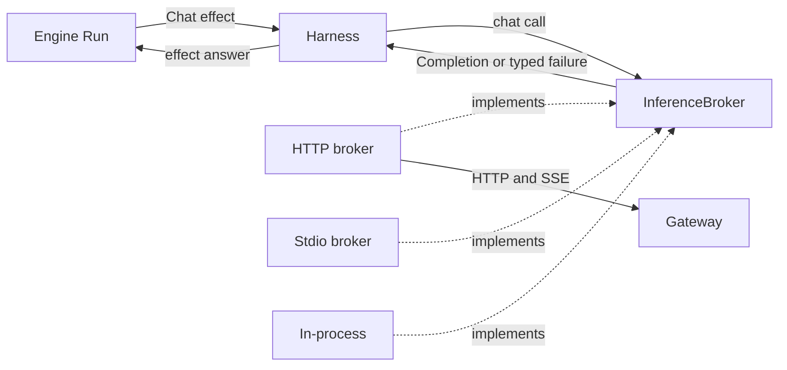

# A typed failure boundary for PromptForge: how the industry detects context overflow and resource exhaustion

- **Report type:** analytical / recommendation
- **Decision served:** what an inference backend reports to the PromptForge engine when a model round fails for lack of context, capacity, quota, or permission, once the harness takes a host-supplied inference broker instead of speaking HTTP itself
- **Audience:** PromptForge engine and harness maintainers
- **Evidence base:** six source-level surveys run on 2026-09-30, covering 13 commercial APIs, 14 open-source inference servers and 5 gateways, 27 client libraries, 15 coding agents, 22 agent frameworks, and 33 neutral interfaces and in-process backends

## Executive summary

PromptForge should stop detecting context overflow from HTTP status codes and response text inside the engine. Instead, the engine should own a small, closed, transport-neutral failure vocabulary that every inference broker maps into. The vocabulary should include a `ContextOverflow` case that can hold the prompt token count and the window size, plus separate cases for rate limits, quota exhaustion, overload, refusal, and timeout. The engine keeps its pre-dispatch precheck, but gains an output reserve and anchors on the token usage the broker reports. All string matching moves into the HTTP broker, next to the wire format it reads. (Confidence: high - the multi-backend agents that recover from overflow automatically, such as Goose, Zed, Strands, and OpenHands, have converged on this shape, and PromptForge's current matcher misses most of the overflow messages it would meet.)

The case rests on two findings. First, there is no wire standard for "the prompt is too long." Only 4 of 13 commercial APIs put a machine-readable overflow code in their error body. None of the 14 open-source servers emit OpenAI's `context_length_exceeded` code, and only one implementation (llama.cpp) emits any typed overflow signal. Overflow arrives as HTTP 400, 403, 422, or 500 depending on the backend, and sometimes inside a stream that already returned HTTP 200. Applying PromptForge's current rule (status 400 or 413 plus one of six substrings) to the 20 overflow messages collected, it catches 9 and misses 11.

Second, the systems that handle this well all do the same thing. Goose, Zed, opencode, Codex CLI, Strands, OpenHands, LangChain, DSPy's `lm15`, and swiftide each define one provider-neutral overflow category, and each provider adapter maps its own backend's quirks into it. Goose's in-process llama.cpp and MLX backends raise the same `ContextLengthExceeded` variant as its HTTP providers, which shows the pattern works without a socket. The two most complete neutral taxonomies found, OpenAI's 19-value `SessionTurnErrorCodeResource` and Apple's 9-case `LanguageModelError`, include no HTTP status at all.

Several supporting findings shape the details. Proactive token thresholds do most of the work in practice (typically 80 to 90 percent of the window, or a reserve of 16,000 to 40,000 tokens), with reactive overflow handling as a bounded backstop of one to three retries. Overflow signals are more useful when they include the token counts. Stop reasons need to tell "hit the output cap" apart from "ran out of window." Quota exhaustion needs its own category because it often arrives as a retryable-looking HTTP 429 that retrying will not fix. Three of 14 open-source servers, Ollama among them, silently drop context by default, so a broker must turn that off or report it. And three commercial APIs now compact on the server, which a broker should report so the engine's transcript stays accurate.

The next step is to define the vocabulary in the engine's model crate and move the substring rules into the Workshop's HTTP broker, as part of the broker-trait refactor already planned. The migration cost is moderate, and lower than it might be, because the engine already has the right internal hook: an `OverflowReason` with `Precheck` and `Provider` cases that the compactor path consumes.

**Key judgments**

1. A typed, transport-neutral overflow category produced by the broker is the industry's convergent design for multi-backend systems. Confidence: high - 9 of 15 coding agents and 7 of 22 frameworks have one, including all three Rust agents with pluggable providers (Codex CLI, Goose, Zed).
2. PromptForge cannot count on a shared cross-vendor wire code for context overflow. Likelihood that one emerges within the next year: unlikely. Confidence: low - the evidence is the current absence (the Open Responses spec requires overflow to fail but names no code), not any stated roadmap.
3. PromptForge's HTTP broker will still need provider-specific text rules for Anthropic, Gemini, and Bedrock. Likelihood: almost certain. Confidence: high - these providers send overflow only as a generic validation error plus free text.
4. PromptForge's precheck, which compares a characters-divided-by-four estimate against 100 percent of the window, will let requests through that then overflow at the provider. Likelihood: likely for image-heavy or long-output turns. Confidence: medium - the code comment itself notes images count as zero, but no overflow rate was measured.

## Contents

1. The engine reads HTTP to decide when to compact
2. Six criteria decide the boundary design
3. Findings: the industry shares a pattern, not a wire standard
4. Only one of five options meets every criterion except cost
5. Recommendation: the engine owns the vocabulary, brokers own the translation
6. Limitations: broad source-level evidence, no runtime tests
7. References
8. Appendix A: PromptForge's current rule catches 9 of 20 overflow messages

## 1. The engine reads HTTP to decide when to compact

**The engine's compaction trigger depends on HTTP details.** When a model round fails, the chat scheduler in `promptforge-internal/engine/src/execute/scheduler/chat.rs` checks `Error::Backend { status, body } if is_context_overflow(status, &body)`. If that returns true, it reports a failed model turn and hands the compactor `OverflowReason::Provider`. `is_context_overflow`, in `promptforge-internal/lua/src/compactors.rs`, returns true only when the status is 400 or 413 and the lowercased body contains one of six phrases: "context length", "context window", "context size", "context_length_exceeded", "too many tokens", or "prompt is too long." The engine's error vocabulary, `CompletionErrorKind`, is HTTP-flavored too. Its cases are `Transport`, `Backend`, `MalformedResponse`, `EmptyReply`, `Disabled`, and `Config`.

**A second, proactive path already exists.** Before dispatch, `precheck` estimates prompt tokens as characters divided by four plus four tokens per message. It refuses the dispatch with `OverflowReason::Precheck` when the estimate exceeds the model's context window. The estimate compares against the full window, reserves no room for output, and counts image parts as zero. The code comment says that last gap is left for the provider-overflow path to cover.

**The owner's planned refactor makes the HTTP dependency untenable.** The plan is for the harness to accept a host-supplied inference broker (a Rust trait) so that inference can come from an HTTP gateway, a stdio child process, or an in-process CPU model. A child process or an in-process model has no status code or response body to match. So the question this report answers is: what should a broker report on failure so the engine can decide whether to compact, retry, or stop, without knowing the transport?

## 2. Six criteria decide the boundary design

The options in section 4 are judged against six criteria, listed in rough order of weight:

1. **Transport neutrality.** No HTTP status, header, or response body crosses into the engine. A stdio or in-process broker can report every condition natively.
2. **Detection accuracy.** Overflow from the backends PromptForge will meet is caught, and rate limits or output-cap errors are not mistaken for overflow.
3. **Actionability.** The engine receives what it needs to act: whether to compact, how much, whether and when to retry, or whether to stop and tell the operator.
4. **Maintainability.** When a provider changes its wording, the fix lands in one place, next to the code that reads that provider's wire format.
5. **Migration cost.** How much existing engine, harness, and gateway code changes.
6. **Industry alignment.** How closely the design matches what mature multi-backend systems already do, so PromptForge can borrow their mapping rules.

## 3. Findings: the industry shares a pattern, not a wire standard

### 3.1 No wire standard for context overflow exists, and PromptForge's rule misses most of what it would see

**Commercial APIs disagree on status, code, and wording.** Only 4 of 13 commercial APIs put a distinct overflow value in a machine-readable field: OpenAI, Azure OpenAI, and Groq send `code: context_length_exceeded`, and OpenRouter sends `error_type: context_length_exceeded`. The Azure and Groq evidence is secondhand, from third-party issue logs. OpenAI's own public error guide does not list the code; it is confirmed only through OpenAI's first-party Codex CLI, which maps it in [`responses_error.rs`](https://github.com/openai/codex/blob/3b16b5a5b03aba9a960b5dedde48fb687863c6e9/codex-rs/codex-api/src/sse/responses_error.rs#L41-L93). Six providers send only a generic validation error plus free text. Anthropic returns 400 `invalid_request_error` with "prompt is too long: N tokens > M maximum." Google returns 400 `INVALID_ARGUMENT` with "The input token count (N) exceeds the maximum number of tokens allowed (M)" (secondhand, via [LiteLLM issue 43014](https://github.com/BerriAI/litellm/issues/43014)). Bedrock returns a `ValidationException` whose text is sometimes just "Input is too long for requested model" ([Converse API reference](https://docs.aws.amazon.com/bedrock/latest/APIReference/API_runtime_Converse.html)). Together documents overflow as HTTP 403 ([Together error codes](https://docs.together.ai/docs/error-codes)). No two providers share a wording.

**Open-source servers are no better, and the layers between them lose what little structure exists.** None of the 14 open-source servers read in source emits `context_length_exceeded`. Only llama.cpp, plus llamafile which is built from it, emits a typed overflow signal: HTTP 400 with `type: "exceed_context_size_error"` and the fields `n_prompt_tokens` and `n_ctx` ([`server-task.cpp`](https://github.com/ggml-org/llama.cpp/blob/4453b535fd15cd5b9d5ccb956ebd38dc325c98fc/tools/server/server-task.cpp#L1501-L1508)). vLLM uses four different overflow wordings in different layers, with `code: 400` as an integer as its only structured hint ([`params.py`](https://github.com/vllm-project/vllm/blob/aba01ef1f73d5bf24952c8f7d61febc509bbfefc/vllm/renderers/params.py#L484-L510)). TGI uses 422. Where a typed signal does exist, intermediaries drop it. LocalAI's internal gRPC hop keeps only llama.cpp's message text and surfaces overflow as a 500 ([`grpc-server.cpp`](https://github.com/mudler/LocalAI/blob/b540c3e1fd842bf3e5a5f7787e9a634ce2b2850a/backend/cpp/llama-cpp/grpc-server.cpp#L2774-L2777)). The LiteLLM proxy re-emits overflow as `code: "400"`, and none of the five gateways surveyed (LiteLLM, Portkey, Kong, Envoy AI Gateway, Cloudflare) normalizes overflow on the wire.

**Overflow can also arrive after the request has already succeeded.** Five of 13 commercial APIs deliver errors inside a stream that returned HTTP 200: OpenAI (`response.failed`), Anthropic (`event: error`), Bedrock (typed stream exceptions), Gemini's Interactions API, and OpenRouter (a chunk with `finish_reason: "error"`). PromptForge's shared stream reader classifies an in-stream error as a `Transport` failure, so an overflow reported this way never reaches the `Error::Backend` arm that `is_context_overflow` inspects.

**Wording drifts, and every text matcher breaks when it does.** OpenAI changed its overflow message from "This model's maximum context length is ..." to "Your input exceeds the context window of this model ..." within the evidence window. LiteLLM's substring list missed the new wording until a fix was opened on 2026-09-25. OpenRouter changed its overflow advice from the "middle-out" transform to its `context-compression` plugin between January and April 2026. Claude Code's documentation states the consequence directly: a gateway that rewrites Anthropic's too-long error disables automatic recovery ([Claude Code errors](https://code.claude.com/docs/en/errors#prompt-is-too-long), [gateway guide](https://code.claude.com/docs/en/llm-gateway-connect)).

**Some non-overflow errors look like overflow.** Bedrock's throttling message is "Too many tokens, please wait before trying again" at HTTP 429, which has tripped "too many tokens" matchers ([crewAI PR 7613](https://github.com/crewAIInc/crewAI/pull/7613)). Cohere returns HTTP 400 "too many tokens: max tokens must be less than or equal to 4096, the maximum output for this model" for an output-limit error. Groq returns tokens-per-minute overages as HTTP 413. PromptForge's status gate protects it from the Bedrock case, but not from Cohere's.

**Applied to the collected messages, PromptForge's rule catches fewer than half.** Appendix A lists 20 overflow messages from the surveys, with the status each arrives under. PromptForge's current rule catches 9 of them and misses 11, and it also matches one non-overflow error (Cohere's output limit). The misses include every Google, Bedrock, and xAI wording, Together's 403, TGI's 422, llama.cpp's 500 during generation, and any overflow reported inside a stream. This is my application of the rule to quoted strings, not a runtime test. It also assumes PromptForge's gateway passes provider error bodies through unchanged, which was not verified.

### 3.2 Mature systems produce a typed overflow category at the adapter and keep string matching inside it

**The same design shows up across every kind of system surveyed.** Nine of 15 coding agents have a named overflow variant in a provider-neutral error type, as do 7 of 22 agent frameworks and 6 of 27 client libraries. None of the four official provider SDKs has one; they classify errors by HTTP status alone ([openai-python](https://github.com/openai/openai-python/blob/5c9ace9a8173c67300b05c3aeb6de01526ed8214/src/openai/_client.py#L851-L881), [anthropic-sdk-python](https://github.com/anthropics/anthropic-sdk-python/blob/6c3e94b1208ae016fc992ffb4ae46ebf7fab706c/src/anthropic/_exceptions.py#L155-L180)). The systems that add a typed category are the ones that sit above several providers and must act on the failure.

**Goose is the closest match to PromptForge's situation.** Goose is a Rust agent with pluggable providers. Its `ProviderError` enum has `ContextLengthExceeded`, `RateLimitExceeded { retry_delay }`, `CreditsExhausted`, and `Refusal { category }`. A shared HTTP mapper turns 413 into overflow, and turns 400 into overflow when it finds the `context_length_exceeded` code, llama.cpp's `n_prompt_tokens > n_ctx`, or one of a set of known phrases ([`http_status.rs`](https://github.com/block/goose/blob/bab8ff641039c9cd3331121cd84a5c6045f365ca/crates/goose-providers/src/http_status.rs#L114-L312)). Its in-process llama.cpp and MLX backends count prompt tokens before prefill and return the same `ContextLengthExceeded` ([`inference_engine.rs`](https://github.com/block/goose/blob/bab8ff641039c9cd3331121cd84a5c6045f365ca/crates/goose-local-inference/src/llamacpp/inference_engine.rs#L284-L324)). Its stdio backends, which drive the Claude Code, Gemini, and Codex CLIs as child processes, match overflow text in the JSON events and map it the same way. The agent loop sees one variant regardless of transport.

**Other systems repeat the pattern with small variations.** Zed's `ProviderErrorCategory` has `PromptTooLarge { tokens }`, `RateLimit`, `Overloaded` (for 503 and 529), `PaymentRequired`, `ContentPolicy`, and `Timeout`, and keeps the raw status and code alongside for display ([`language_model_core.rs`](https://github.com/zed-industries/zed/blob/66432e4ca957383dcc9ec61d1353a4b4bd94c6bc/crates/language_model_core/src/language_model_core.rs#L111-L189)). Strands has one `ContextWindowOverflowException` that every provider maps into; the agent catches it, calls `reduce_context`, and retries ([Strands OpenAI mapping](https://github.com/strands-agents/sdk-python/blob/4cbc6a78ce314543812e4a91e9e03ff73ffce6e2/strands-py/src/strands/models/_openai_errors.py)). OpenHands checks its typed error family in priority order: context overflow first, then malformed history, auth, rate limit, timeout, service unavailable, and content policy ([`mapping.py`](https://github.com/OpenHands/software-agent-sdk/blob/d0f9500590c12f3aa4c64c3e1b541a568e48232e/openhands-sdk/openhands/sdk/llm/exceptions/mapping.py)). LangChain core added `ContextOverflowError` on 2026-02-09, and on 2026-08-19 placed it inside a standard `ModelError` family with an `is_retryable` flag ([`exceptions.py`](https://github.com/langchain-ai/langchain/blob/026c3da2b615abe52f8446e37de460b844d07a43/libs/core/langchain_core/exceptions.py#L68-L128)).

**The most complete taxonomies were designed to cross a boundary, and none of them names an HTTP status.** OpenAI's OpenAPI spec defines `SessionTurnErrorCodeResource` for its Agents API with 19 values, including `context_length_exceeded` ("The request exceeds the model's context window"), `session_budget_exceeded`, `usage_limit_exceeded`, `credit_balance_exhausted`, `rate_limit_exceeded`, `server_overloaded`, and `request_timeout` ([openapi.yaml](https://github.com/openai/openai-openapi/blob/19fa5b49f991c2c2340abb5eb3b650b446ebf100/openapi.yaml)). Apple's `LanguageModelError`, new in iOS and macOS 27, describes itself as "a failure that may occur while generating a response when using any language model." Its nine cases include `contextSizeExceeded`, `rateLimited`, `timeout`, `refusal`, and `guardrailViolation`, and they apply to both on-device and cloud models ([Apple documentation](https://developer.apple.com/documentation/foundationmodels/languagemodelerror)). DSPy's vendored `lm15` defines stable string codes "for serialization and wire formats", including `ContextLengthError` and `BillingError` ([`errors.py`](https://github.com/stanfordnlp/dspy/blob/ee1e369e4e4d76e2c7a24e2f762556410d4f39d5/dspy/_vendor/lm15/errors.py)). ONNX Runtime GenAI's in-process Engine API has `OgaErrorCode` values such as `ExecutionCapacityExceeded` and `RequestUnserviceable`, plus a `Retryable` flag ([`ort_genai_c.h`](https://github.com/microsoft/onnxruntime-genai/blob/fa55959bc6398501f839c049dac0536331f8b2f3/src/ort_genai_c.h)). The Rust library rig built a serializable `ErrorReport` for errors crossing its "effect bus", the same role PromptForge's `Chat` effect answer plays. Rig's report, however, has no overflow kind ([`error.rs`](https://github.com/0xPlaygrounds/rig/blob/16421f6b8c88e6ed092ce408a5aedd962830feec/crates/rig-core/src/error.rs#L104-L144)).

**String matching does not go away; it moves to where the wire format is known.** Every reactive detector read in the frameworks survey uses message matching for at least one provider. Among coding agents, 12 of the 13 that detect server-side overflow fall back to text matching; only Codex relies purely on a structured code, and only on its streamed path. Five independent codebases match Anthropic's "prompt is too long." What separates the good designs from PromptForge's current one is not the absence of matching but its location. In Goose, Zed, or Strands, each provider adapter owns the rules for its own backend. In PromptForge, one global list in the engine has to cover every backend at once.

**Retryability travels as data on the error, not as logic in the caller.** The Vercel AI SDK (`isRetryable`), LangChain (`is_retryable`), rig (`retryable`), and `lm15` ("lm15 never retries itself") all attach retryability to the error and leave the retry decision to the caller. Every system that states a rule marks overflow as not retryable unchanged; the request has to shrink first.

### 3.3 Proactive thresholds do most of the work; reactive detection is a bounded backstop

**Most systems compact before the provider can refuse.** Coding agents set their proactive triggers either as a fraction of the window or as a reserve of headroom below it. Table 1, below, lists the defaults found. The fractions cluster at 80 to 90 percent, and the reserves at 16,000 to 40,000 tokens. Two systems subtract the requested output allowance explicitly (LiteLLM compaction and deepagents), and several others build it into the reserve.

*Table 1. Default proactive compaction triggers in selected systems. "Window" is the model's context window. All values read in source unless noted.*

| System | Default trigger | Source |
|---|---|---|
| Codex CLI | 90% of window; hard cap at 95% | [`openai_models.rs`](https://github.com/openai/codex/blob/3b16b5a5b03aba9a960b5dedde48fb687863c6e9/codex-rs/protocol/src/openai_models.rs#L514-L536) |
| Goose | 80% of window | [`context_mgmt/mod.rs`](https://github.com/block/goose/blob/bab8ff641039c9cd3331121cd84a5c6045f365ca/crates/goose/src/context_mgmt/mod.rs#L224-L274) |
| Zed | 90% of input capacity, windows of 80,000 or more | [`agent_settings.rs`](https://github.com/zed-industries/zed/blob/66432e4ca957383dcc9ec61d1353a4b4bd94c6bc/crates/agent_settings/src/agent_settings.rs#L148-L208) |
| Cline SDK | 90% of usable input (usable is 90% of the window when only a window is known) | [`compaction-shared.ts`](https://github.com/cline/cline/blob/2261d13f9bc141342bf5bbc4dce34cacfacc4ced/sdk/packages/core/src/extensions/context/compaction-shared.ts#L13-L82) |
| pi | window minus 16,384 tokens | [`compaction.ts`](https://github.com/badlogic/pi-mono/blob/91f9f3b5dfd7a49dda90d6450de7313ba425b3ca/packages/coding-agent/src/core/compaction/compaction.ts#L267-L270) |
| opencode | input limit minus min(20,000, max output) | [`overflow.ts`](https://github.com/anomalyco/opencode/blob/9b4882db54627f2656a6990daafa412f9f3c7c82/packages/opencode/src/session/overflow.ts#L1-L35) |
| Letta | 90% of window; warning at 75% | [`thresholds.py`](https://github.com/letta-ai/letta/blob/56ba9c25552605eec89de8ed3dc6394b625c1993/letta/services/summarizer/thresholds.py) |
| Strands (opt-in) | 70% of window | [`conversation_manager.py`](https://github.com/strands-agents/sdk-python/blob/4cbc6a78ce314543812e4a91e9e03ff73ffce6e2/strands-py/src/strands/agent/conversation_manager/conversation_manager.py) |
| LiteLLM router compaction | 90% of input window minus output allowance | [`context_compaction.py`](https://github.com/BerriAI/litellm/blob/264b09ac8d5753f157ad65b529adf6f52ce869b7/litellm/router_strategy/complexity_router/context_compaction.py#L244-L263) |
| Claude Code | at or near the model's limit (about 967,000 on 1M models) | [errors doc](https://code.claude.com/docs/en/errors#prompt-is-too-long) (docs only; closed source) |
| PromptForge (today) | estimate above 100% of window, no output reserve | `compactors.rs` `precheck` |

**Reactive handling is common in agents, rare in frameworks, and always bounded.** Thirteen of 15 coding agents also detect a server-side overflow, but 13 of 22 agent frameworks rely on proactive triggers alone. Where a reactive path exists, it retries a small, fixed number of times: once in the Cline SDK and pi, twice in Goose, three times in Letta, DSPy's ReAct, and Roo Code, and Claude Code stops after three compaction cycles that fail to free enough room. Strands and OpenHands both treat the two triggers differently in the same API. A proactive compaction that fails is skipped quietly, while a reactive one that fails raises, because the request cannot proceed.

**The token count behind the trigger usually comes from the provider, not from an estimate.** Codex, Goose, opencode, Zed, Crush, and Google ADK drive their check from the usage the provider reported on the previous response. The Cline SDK and Kilo Code scale a local character estimate by the ratio between their last estimate and the last reported count. PromptForge's precheck uses a fixed characters-divided-by-four estimate against the full window. That places it behind the norm on both the threshold and the anchor, and it explains why PromptForge leans on the reactive path more than most systems do.

### 3.4 Overflow signals are more useful when they include the token counts

**The best signals report how far over the limit the request was.** llama-server attaches `n_prompt_tokens` and `n_ctx` to its overflow error. Apple's `contextSizeExceeded` case holds a `ContextSizeExceeded` value with `tokenCount` and `contextSize`. Chrome's built-in Prompt API throws a `QuotaExceededError` with `requested` and `quota` after it fails to make room ([Prompt API explainer](https://github.com/webmachinelearning/prompt-api/blob/9fcb9a4e9e5339b192d74b8c7d92ec88fd392e3b/README.md)). On the client side, Zed parses a token count into `PromptTooLarge { tokens }`, and Charm's `fantasy` library parses `ContextUsedTokens` and `ContextMaxTokens` ([`errors.go`](https://github.com/charmbracelet/fantasy/blob/82d42a7441d06ea4eeebf64ce6505caf481b7e10/errors.go#L34-L118)).

**The numbers let the compactor cut the right amount and let the precheck learn.** A compactor that knows the prompt was 212,000 tokens against a 200,000-token window can target a specific reduction instead of guessing. The same pair also measures how far the pre-dispatch estimate was off, which is exactly the correction Cline SDK and Kilo Code apply to their local estimates. The numbers have to be optional, though. Anthropic, Gemini, vLLM, and SGLang include both counts in their message text, but OpenAI's newer wording, Bedrock's "Input is too long for requested model", and Vertex AI's message omit at least one of them.

### 3.5 "Hit the output cap" and "ran out of window" need different stop reasons

**Every normalized stop-reason vocabulary has an output-limit value, and most merge the two causes into it.** The Vercel AI SDK's unified finish reason is `stop`, `length`, `content-filter`, `tool-calls`, `error`, or `other` ([finish reason type](https://github.com/vercel/ai/blob/eb93c81f2d6200e0732745d0cd582600fe4c5055/packages/provider/src/language-model/v4/language-model-v4-finish-reason.ts)). Microsoft.Extensions.AI has `stop`, `length`, `tool_calls`, and `content_filter`, and its documentation for `Length` covers "the request and/or response" ([`ChatFinishReason.cs`](https://github.com/dotnet/extensions/blob/52cffc2f91d2f887ad9f31f8cd17dfc4e9227dc9/src/Libraries/Microsoft.Extensions.AI.Abstractions/ChatCompletion/ChatFinishReason.cs)). No vocabulary surveyed has a stop reason for "the prompt was too long"; that case is always an error. But a generation can also run out of window partway through. Anthropic (Claude 4.5 and later) and Bedrock report that case as `model_context_window_exceeded`, separately from `max_tokens` ([Anthropic context windows](https://platform.claude.com/docs/en/build-with-claude/context-windows.md)). The normalizers then throw the distinction away: the Vercel AI SDK, Pydantic AI, and `lm15` all map `model_context_window_exceeded` to `length` ([Vercel mapping](https://github.com/vercel/ai/blob/eb93c81f2d6200e0732745d0cd582600fe4c5055/packages/anthropic/src/map-anthropic-stop-reason.ts)). llama-server, mistral.rs, and DeepSeek also report both causes as `length`.

**Only two interfaces keep the causes apart, and the right response differs between them.** LM Studio's SDK separates `maxPredictedTokensReached` from `contextLengthReached` ([`LLMPredictionStats.ts`](https://github.com/lmstudio-ai/lmstudio-js/blob/6d2b26842b44f68d7feb9298c872494dad347837/packages/lms-shared-types/src/llm/LLMPredictionStats.ts#L4-L42)), and ONNX Runtime GenAI separates `MaxGeneratedTokens` from `MaxSessionTokens`. The difference matters to an agent loop. An output cap calls for continuing the reply or raising `max_tokens`, while a full window calls for compaction. Two agents that ignored the difference got it wrong: Roo Code and legacy Cline treat the OpenAI SDK's `LengthFinishReasonError` as a context overflow. The agent pi goes further and detects "silent overflow": a successful response whose reported input exceeds the window, or a `length` stop with zero output and input at 99 percent of the window ([`overflow.ts`](https://github.com/badlogic/pi-mono/blob/91f9f3b5dfd7a49dda90d6450de7313ba425b3ca/packages/ai/src/utils/overflow.ts#L37-L181)). PromptForge's `Completion` currently stores the raw `finish_reason` string with no normalized value, so the engine cannot tell the two cases apart.

### 3.6 Rate limits, quota, overload, refusals, and timeouts each need their own category because the engine's response differs

**Quota exhaustion often looks retryable but is not.** OpenAI sends billing failures as HTTP 429 with codes such as `insufficient_quota` and `credit_balance_exhausted`, the same status as a temporary rate limit, and documents that retrying does not fix them. Anthropic spreads money limits across three statuses: 402 `billing_error`, 429 with `details.error_code: enforced_spend_limit_reached` and no `retry-after` header, and 400 for a spend limit the customer set ([Anthropic rate limits](https://platform.claude.com/docs/en/api/rate-limits.md)). Seven of 13 commercial APIs use 402 for credit exhaustion. The systems that act on errors separate the two: 7 client-library codebases, 7 coding agents, and 5 agent frameworks have a quota or billing category distinct from rate limiting. DSPy's `lm15` checks for `BillingError` before `RateLimitError` precisely because both arrive as 429.

**Overload is a different condition from a rate limit, though some providers blur them.** Nine of 13 commercial APIs signal overload with a status other than 429, usually 503, or 529 at Anthropic. Azure OpenAI and Fireworks dedicated deployments use 429 for capacity, told apart from rate limits only by message text or deployment type ([Fireworks error codes](https://docs.fireworks.ai/guides/inference-error-codes.md)). Codex, Zed, Letta, and the Anthropic Python SDK all give overload its own type.

**The retry delay lives in four different places on the wire.** Six providers send a `Retry-After` header in seconds, Azure sends `retry-after-ms`, Google puts `RetryInfo.retryDelay` in the response body, and OpenAI's streaming failures put the delay only in message text, which Codex parses with a regular expression. Seven client implementations share one retry rule: honor an `x-should-retry` header first, then retry 408, 409, 429, and any 5xx, preferring `retry-after-ms` over `retry-after` ([openai-python](https://github.com/openai/openai-python/blob/5c9ace9a8173c67300b05c3aeb6de01526ed8214/src/openai/_base_client.py#L885-L927)). A broker is the only place that can read all four forms, so it should hand the engine a single duration.

**Refusals, timeouts, and capacity limits have native equivalents off HTTP.** Content filtering is a stop reason in six vocabularies (the Vercel AI SDK, Microsoft.Extensions.AI, rig, genai, OpenTelemetry, OpenAI) and an error in the on-device APIs (Apple's `guardrailViolation` and `refusal`, Chrome's `NotReadableError`, and Android ML Kit's policy codes). Eight coding agents treat refusal as a distinct kind. Timeouts appear as Anthropic's 504 `timeout_error`, OpenAI's `request_timeout`, and Apple's `timeout`. In-process backends see capacity limits directly. llama.cpp's `llama_decode` returns `1` for "could not find a KV slot for the batch", documented as recoverable ([`llama.h`](https://github.com/ggml-org/llama.cpp/blob/feb9a3d6debb3a8544052b04c84fa1f445fd77f5/include/llama.h)). ONNX Runtime GenAI reports `ExecutionCapacityExceeded`, and Android ML Kit reports `BUSY` separately from a battery quota. No client library surveyed has a KV-cache-exhaustion category. vLLM and SGLang handle KV pressure invisibly by pausing and re-queuing requests.

### 3.7 Backends that silently truncate hide overflow from every detector

**Several local servers drop context instead of failing, and say nothing.** Ollama's `truncate` and `shift` options both default to true. It drops the oldest messages until the prompt fits, logs the drop at debug level, and gives the client no field saying it happened ([`prompt.go`](https://github.com/ollama/ollama/blob/1abe35e6e6e777e858bbfbba283667ee8d516801/server/prompt.go#L20-L91)). KoboldCpp always truncates the front of the prompt, and text-generation-webui drops the oldest messages. That makes 3 of 14 servers that truncate by default. llama.cpp can also shift context during generation; the option is off by default but on when Ollama launches it, and the only trace a client sees is `truncated: true` on llama.cpp's native endpoint. The agent pi documents that this kind of truncation cannot be detected from the response, and opencode notes the same about z.ai.

**Only one system tells its caller when it evicted context.** Chrome's Prompt API evicts old turns when a prompt does not fit, fires a `contextoverflow` event, and throws `QuotaExceededError` only if eviction cannot free enough room. For PromptForge, this means a broker must either turn silent truncation off (Ollama accepts `truncate: false` and `shift: false`) or report that it happened. Otherwise the engine's history and the model's actual context diverge without any error at all.

### 3.8 Compaction is moving server-side, and the vocabularies are starting to name it

**Three commercial APIs now compact on the server.** OpenAI offers `context_management` with a `compact_threshold` plus a `POST /responses/compact` endpoint ([OpenAI compaction guide](https://developers.openai.com/api/docs/guides/compaction.md)). Anthropic offers a threshold-driven `compact_20260112` strategy and on-demand compaction, with a beta `stop_reason: compaction`. xAI offers `POST /v1/responses/compact` ([xAI compaction](https://docs.x.ai/developers/advanced-api-usage/context-compaction.md)). All three require that the input already fits before compaction runs, so none of them removes the need to detect overflow. The OpenTelemetry GenAI conventions added a `compaction` finish reason, a `gen_ai.conversation.compacted` attribute, and a `CompactionPart` message part ([GenAI output messages schema](https://github.com/open-telemetry/semantic-conventions-genai/blob/b31e9e8ea26ac1c086d3313d474e31d7c3f391ae/model/gen-ai/gen-ai-output-messages.json)). The Open Responses specification defines `/responses/compact` and requires that overflow fail when truncation is disabled, but names no error code for it ([Open Responses 2026-04-24](https://github.com/openresponses/openresponses/blob/92c12d96d7b61d6d15e2214daa5e9c6000ab6e1c/src/specifications/2026-04-24.mdx)). For PromptForge, a broker that compacts server-side should report that it did, so the engine's transcript can record the event.

## 4. Only one of five options meets every criterion except cost

Five options are on the table, including doing nothing. Table 2 scores each against the criteria from section 2, and the paragraphs after it explain the scores.

*Table 2. Options scored against the section 2 criteria. "Yes" meets the criterion, "Partly" meets it with the gaps named in the text, "No" fails it.*

| Option | Transport neutrality | Detection accuracy | Actionability | Maintainability | Migration cost | Industry alignment |
|---|---|---|---|---|---|---|
| A. Keep the rule in the engine | No | No | No | No | None | No |
| B. Move the same rule to the broker, pass a flag | Partly | Partly | No | Yes | Low | Partly |
| C. Engine-owned typed vocabulary, brokers map into it | Yes | Yes | Yes | Yes | Moderate | Yes |
| D. Adopt an external vocabulary verbatim | Yes | Yes | Partly | Partly | Moderate | Yes |
| E. Proactive only, drop reactive detection | Yes | No | Partly | Yes | Low | No |

**Option A, doing nothing, fails the refactor it is meant to serve.** A stdio or in-process broker would have to invent a status of 400 and a body containing one of six English phrases for the engine to notice an overflow. It also keeps the 9-in-20 hit rate from Appendix A, keeps missing overflow reported inside a stream, and ties every provider wording change to an engine release. Its only merit is that it costs nothing today.

**Option B fixes where the rule lives but not what the engine learns.** Moving `is_context_overflow` into the HTTP broker and giving the engine a single overflow flag would make overflow transport-neutral and put wording fixes next to the wire code. But every other failure would still arrive as an HTTP-shaped `Backend { status }` or `Transport` error. The engine still could not tell quota exhaustion from a rate limit, or overload from a bad request, and it would get no token counts or retry delay. It is a reasonable first step only if option C cannot be done in the same pass.

**Option C is what the surveyed multi-backend systems do.** The engine defines a closed vocabulary of failure kinds and a normalized stop reason. Each broker maps its own backend into them, using structured codes where the backend has them and text rules only where it does not. This meets every criterion except cost, which is moderate: it replaces some `CompletionErrorKind` cases, changes one match arm in the chat scheduler, and moves the matcher and its tests into the HTTP broker crate. Section 5 describes it.

**Option D borrows credibility but not fit.** OpenAI's `SessionTurnErrorCodeResource` and `lm15`'s codes are the most complete neutral lists found, and adopting one verbatim would align PromptForge with a known vocabulary. But OpenAI's enum has no payloads, so there is no room for token counts or a retry delay. It also includes values specific to OpenAI's agent product, such as `sandbox_error`, `executor_version_incompatible`, and `active_turn_not_steerable`. It would also tie PromptForge's contract to another vendor's release schedule. The better move is to borrow names from these lists inside option C, so that mapping to or from them stays trivial.

**Option E removes the problem only by ignoring part of it.** Relying on the precheck alone would make the engine trivially transport-neutral, and 13 of 22 agent frameworks do exactly that. But PromptForge's precheck counts images as zero and cannot match every backend's tokenizer, and some backends count the requested output against the window at request time. Thirteen of 15 coding agents, the category closest to PromptForge's use, keep a reactive path for these reasons. Dropping it would turn an overflow the engine could recover from into a failed run.

## 5. Recommendation: the engine owns the vocabulary, brokers own the translation

Adopt option C. The engine owns the vocabulary, each broker owns the translation, and the HTTP-specific rules move into the HTTP broker. (Confidence: high - it is the only option that meets the transport-neutrality criterion without losing information the engine acts on, and it matches Goose, Zed, Strands, and OpenHands.)

Figure 1 shows where each piece sits after the change.

*Figure 1. The failure boundary after the change. The engine sees only typed failures and normalized stop reasons; each broker translates its own backend.*



### 5.1 The engine defines one failure vocabulary that says what happened, not how it arrived

The sketch below shows the shape. The names are placeholders; several are chosen to line up with OpenAI's `SessionTurnErrorCodeResource` and `lm15`, so mapping to either stays mechanical. It would replace the HTTP-flavored `Transport` and `Backend` cases of today's `CompletionErrorKind` and keep `MalformedResponse`, `EmptyReply`, `Disabled`, and `Config`.

```rust
/// What went wrong with a model round, in terms the engine acts on.
/// A broker maps its backend's failure into one of these; no status
/// code or response body crosses the boundary.
#[non_exhaustive]
pub enum CompletionErrorKind {
    /// The prompt does not fit the model's context window.
    ContextOverflow { prompt_tokens: Option<u32>, context_window: Option<u32> },
    /// Too many requests for now; retrying after the delay may succeed.
    RateLimited { retry_after: Option<Duration> },
    /// A quota, credit, or spend limit is exhausted; retrying will not help.
    QuotaExhausted,
    /// The backend is at capacity; retrying after the delay may succeed.
    Overloaded { retry_after: Option<Duration> },
    /// The backend refused the request or the output on policy grounds.
    Refused { category: Option<String> },
    /// No answer arrived within the round's time limit.
    Timeout,
    /// The backend could not be reached, or the connection broke.
    Unavailable,
    /// The request is invalid for this backend; resending it unchanged will fail again.
    InvalidRequest,
    MalformedResponse,
    EmptyReply,
    Disabled,
    Config,
}
```

Today's `CompletionErrorKind` is a fieldless classifier. If that property is worth keeping, the payloads can live on `CompletionError` behind accessors instead, the way `status()` and `backend_body()` do now. Each error still keeps a display message for the operator, and its `source` chain for diagnostics. An HTTP broker may put the status and escaped body in that chain, as Zed and opencode keep raw wire detail beside the category, but the engine never branches on them. Whether a failure is retryable should be derived from the kind, the way LangChain, rig, and `lm15` publish retryability as data, rather than recomputed from a status code.

### 5.2 A normalized stop reason separates the output cap from a full window

Keep the raw `finish_reason` string on `Completion` for debug capture, and add a normalized value beside it, as the Vercel AI SDK does with its `{ unified, raw }` pair. The values that matter are end of turn, tool calls, output limit, context full, refused, and other. `ContextFull` is what Anthropic and Bedrock call `model_context_window_exceeded` and ONNX calls `MaxSessionTokens`; it tells the engine to compact. `OutputLimit` tells it the reply was cut at `max_tokens`, which calls for continuing or raising the cap, not compacting. A broker that cannot tell the two apart reports `OutputLimit`, and the engine can apply pi's check for a zero-output `length` stop near the window as a backstop. (Confidence: medium - two major providers and two SDKs make the distinction, but most normalizers do not, so some brokers will not be able to fill it in.)

### 5.3 The broker contract makes the backend's limits visible to the engine

A broker that implements the trait takes on these obligations, each traced to a finding above:

1. Report each model's context window in the catalog. The engine's `ModelDescriptor` already holds one, so this is existing behavior made mandatory. (Finding 3.3)
2. Report prompt and output token usage on every completion, so the precheck can anchor on real counts. (Finding 3.3)
3. Map every failure into the vocabulary, including errors that arrive inside an open stream. (Findings 3.1 and 3.2)
4. Fill in `prompt_tokens` and `context_window` on overflow whenever the backend provides them. (Finding 3.4)
5. Normalize every form of retry delay into one duration. (Finding 3.6)
6. Turn off silent truncation, or report that it happened. (Finding 3.7)
7. Report server-side compaction when the backend performs it. (Finding 3.8)

### 5.4 The engine keeps its two overflow paths but reads them from typed inputs

**The reactive path matches a kind instead of parsing HTTP.** In the chat scheduler, the arm `Error::Backend { status, body } if is_context_overflow(status, &body)` becomes a match on `ContextOverflow`, and it still reports `OverflowReason::Provider` to the compactor. `is_context_overflow` and its six-phrase list leave `promptforge-lua` entirely. The compactor contract does not change, because it already takes `OverflowReason` and nothing else. When the deferred compactor framework adds bounded retry, the evidence points to one or two attempts (Goose uses 2, and Cline SDK and pi use 1), with a failed reactive compaction raising rather than being skipped. (Confidence: high - this is a mechanical substitution at one call site.)

**The proactive path gains a reserve and an anchor.** `precheck` should compare against the window minus an output reserve, not the full window. The survey's defaults suggest either a fraction of 80 to 90 percent or a reserve of min(20,000, requested output), as opencode uses. The estimate should also start from the prompt tokens the broker reported on the previous round, and apply the characters-divided-by-four heuristic only to messages added since. This is what Codex, Goose, opencode, and Zed do, and it shrinks the error the image gap introduces. (Confidence: medium - the direction is well supported, but the right reserve for PromptForge's workloads has not been measured.)

### 5.5 The HTTP rules move into the HTTP broker, seeded from maintained lists

The string matching does not disappear, but it moves into the Workshop-side HTTP broker, the one component that knows the OpenAI wire format. The same crate is the natural home for the request body builder and SSE reader when they leave the engine, as proposed alongside the broker trait. Table 3 gives starting rules drawn from the surveys. Goose's `http_status.rs`, opencode's 27 regular expressions, pi's `overflow.ts`, and Strands' provider mappings are maintained lists worth checking against when these rules are written. The Appendix A strings make a ready-made test fixture.

*Table 3. Starting mapping rules for the HTTP broker and for non-HTTP brokers. "Code" means a structured field; "text" means a message rule. Counts in parentheses are fields the broker can fill in.*

| Backend | Overflow rule | Other rules worth encoding |
|---|---|---|
| OpenAI, Azure OpenAI, Groq, OpenRouter | code `context_length_exceeded` (OpenRouter: `error_type`), in the body or in a streamed `response.failed` or error chunk | 429 with `insufficient_quota` or `credit_balance_exhausted` is `QuotaExhausted`; 503 `server_is_overloaded` is `Overloaded` |
| Anthropic | 400 `invalid_request_error` plus text "prompt is too long" (N and M from "N tokens > M maximum") | stop `model_context_window_exceeded` is `ContextFull`; 529 is `Overloaded`; 402 or spend-cap 429 is `QuotaExhausted` |
| Google Gemini and Vertex AI | 400 `INVALID_ARGUMENT` plus text "exceeds the maximum number of tokens allowed" | 429 `RESOURCE_EXHAUSTED` with `RetryInfo.retryDelay` is `RateLimited` |
| AWS Bedrock | `ValidationException` plus text "Input is too long for requested model", or Anthropic's text passed through | `ThrottlingException` "Too many tokens" is `RateLimited`, not overflow; stop `model_context_window_exceeded` is `ContextFull` |
| llama.cpp server, llamafile | 400 `type: exceed_context_size_error` (`n_prompt_tokens`, `n_ctx`) | 500 "Context size has been exceeded." during generation: the prompt fit at admission, so treat as `Overloaded` (judgment; a closed llama.cpp PR argued for overflow) |
| vLLM, Aphrodite, SGLang | 400 plus text "maximum context length", "longer than the maximum model length", or "longer than the model's context length" | opt-in 503 queue-full is `Overloaded` |
| Hugging Face TGI | 422 `error_type: validation` plus text "`inputs` tokens + `max_new_tokens` must be" | 429 `overloaded` is `Overloaded` |
| Ollama | send `truncate: false` and `shift: false`, then 400 plus text "longer than the context length" | 503 "server busy" is `Overloaded` |
| In-process llama.cpp | count prompt tokens against `llama_n_ctx` before prefill; report exact counts | `llama_decode` returning 1 (no KV slot) is `Overloaded` |
| Stdio child process | define a typed error field in the protocol PromptForge controls; no text rules needed | same vocabulary serialized, as rig's `ErrorReport` and `lm15`'s string codes do |

### 5.6 Owner and next steps

The owner is the maintainer driving the broker-trait refactor, since the vocabulary is the failure half of that trait's contract. The steps, in order:

1. Define the failure kinds and the normalized stop reason in `promptforge-model-client`, publish them through the `promptforge` facade, and update `public-api.txt`. (Confidence: high - small, self-contained change.)
2. Change the chat scheduler's overflow arm to match the new kind, and remove `is_context_overflow` from `promptforge-lua`. (Confidence: high - one call site.)
3. Move the HTTP mapping into the HTTP broker crate, with Table 3 as the rule set and Appendix A's strings as test fixtures, including in-stream error events. (Confidence: high - the rules are known and testable offline.)
4. Add the output reserve and the reported-usage anchor to `precheck`. (Confidence: medium - the reserve size needs measurement on real workloads.)
5. Make the broker contract's seven obligations part of the trait documentation and of a conformance test that every broker runs. (Confidence: medium - conformance tests for in-process brokers need a small test model or a fake.)

## 6. Limitations: broad source-level evidence, no runtime tests

**The evidence is source-level and current, but not complete or tested.** None of the six research subagents had working web search, so they cloned repositories and fetched documentation directly. As a result, most claims rest on source code pinned to commits read on 2026-09-30, a stronger basis than blog posts but a narrower one. Some provider facts are secondhand, taken from third-party issue logs: the Azure and Groq overflow codes, Google's and xAI's overflow wording, and Mistral's overflow status. Claude Code is closed source, so its behavior comes only from Anthropic's documentation. Nothing was tested at runtime. The counts describe the systems sampled, not the whole market, and the area moves quickly: LangChain added its overflow type in February 2026, and LiteLLM added proactive compaction on 2026-09-22.

**Appendix A rests on two assumptions I did not verify.** It assumes PromptForge's gateway passes provider error bodies through unchanged; the gateway describes its chat route as an OpenAI passthrough, but its error path was not traced. It also assumes the HTTP statuses the surveys record, two of which (Mistral, xAI) are unconfirmed.

**The spot checks I ran all held.** I re-checked the load-bearing claims against the cloned sources and primary documents before writing: Codex CLI's `context_length_exceeded` mapping and its 90 and 95 percent thresholds, Goose's `ProviderError` variants and its in-process `ContextLengthExceeded`, llama.cpp's `exceed_context_size_error`, Zed's `PromptTooLarge`, the Strands and LangChain overflow classes, Ollama's status-plus-text detector, OpenAI's 19-value `SessionTurnErrorCodeResource`, and Apple's `LanguageModelError` cases and platform versions. All matched.

**Waiting for a standard was considered and set aside.** The Open Responses specification requires that overflow fail when truncation is disabled but names no error code. The OpenTelemetry GenAI conventions name compaction but define no overflow error type, and MCP's sampling feature, which had a `maxTokens` stop reason and no overflow code, is deprecated as of its 2026-07-28 protocol version. A shared wire code could still emerge, which would simplify the HTTP broker's rules. It would not change the engine's side of this design, because the engine would still need a typed kind for non-HTTP brokers.

**The vocabulary itself has two risks.** It may prove too coarse, for example if PromptForge later needs to tell a per-minute token limit from a per-day one, or too fine, if brokers cannot fill in the distinctions. A `#[non_exhaustive]` enum, optional payload fields, and a display message on every error limit the damage in both directions. A broker could also map a failure wrongly. The conformance test in next step 5 is the guard against that.

## 7. References

**Research behind this report**, all produced 2026-09-30:

- "Commercial LLM API signals for context overflow, output truncation, rate limits, quota and billing exhaustion, overload, content filters, and server-side compaction" (13 providers)
- "Open-source OpenAI-compatible inference server error signals for context overflow, truncation, KV cache exhaustion, and overload" (14 servers, 5 gateways)
- "LLM client SDK error taxonomies for context window exceeded, rate limit, overload, and finish reason" (27 libraries)
- "AI coding agent context compaction triggers and context overflow detection" (15 agents)
- "Agent framework context overflow exceptions and compaction triggers" (22 frameworks)
- "Transport-neutral LLM interfaces and non-HTTP backends: finish reason enums, typed context overflow errors" (18 interfaces, 15 backends)

**Primary sources most relied on:**

- Goose provider error mapping: [`http_status.rs`](https://github.com/block/goose/blob/bab8ff641039c9cd3331121cd84a5c6045f365ca/crates/goose-providers/src/http_status.rs#L114-L312) and in-process [`inference_engine.rs`](https://github.com/block/goose/blob/bab8ff641039c9cd3331121cd84a5c6045f365ca/crates/goose-local-inference/src/llamacpp/inference_engine.rs#L284-L324)
- Codex CLI overflow mapping and thresholds: [`responses_error.rs`](https://github.com/openai/codex/blob/3b16b5a5b03aba9a960b5dedde48fb687863c6e9/codex-rs/codex-api/src/sse/responses_error.rs#L41-L93), [`openai_models.rs`](https://github.com/openai/codex/blob/3b16b5a5b03aba9a960b5dedde48fb687863c6e9/codex-rs/protocol/src/openai_models.rs#L514-L536)
- Zed provider error category: [`language_model_core.rs`](https://github.com/zed-industries/zed/blob/66432e4ca957383dcc9ec61d1353a4b4bd94c6bc/crates/language_model_core/src/language_model_core.rs#L111-L189)
- Strands overflow exception and conversation manager: [`_openai_errors.py`](https://github.com/strands-agents/sdk-python/blob/4cbc6a78ce314543812e4a91e9e03ff73ffce6e2/strands-py/src/strands/models/_openai_errors.py), [`conversation_manager.py`](https://github.com/strands-agents/sdk-python/blob/4cbc6a78ce314543812e4a91e9e03ff73ffce6e2/strands-py/src/strands/agent/conversation_manager/conversation_manager.py)
- OpenAI Agents error enum: [`openapi.yaml`](https://github.com/openai/openai-openapi/blob/19fa5b49f991c2c2340abb5eb3b650b446ebf100/openapi.yaml) (`SessionTurnErrorCodeResource`)
- Apple Foundation Models: [`LanguageModelError`](https://developer.apple.com/documentation/foundationmodels/languagemodelerror)
- llama.cpp: [`server-task.cpp`](https://github.com/ggml-org/llama.cpp/blob/4453b535fd15cd5b9d5ccb956ebd38dc325c98fc/tools/server/server-task.cpp#L1501-L1508), [`llama.h`](https://github.com/ggml-org/llama.cpp/blob/feb9a3d6debb3a8544052b04c84fa1f445fd77f5/include/llama.h)
- LiteLLM overflow substring rules: [`exception_mapping_utils.py`](https://github.com/BerriAI/litellm/blob/264b09ac8d5753f157ad65b529adf6f52ce869b7/litellm/litellm_core_utils/exception_mapping_utils.py#L81-L114)
- DSPy `lm15` error taxonomy: [`errors.py`](https://github.com/stanfordnlp/dspy/blob/ee1e369e4e4d76e2c7a24e2f762556410d4f39d5/dspy/_vendor/lm15/errors.py)
- Anthropic: [context windows](https://platform.claude.com/docs/en/build-with-claude/context-windows.md), [rate limits](https://platform.claude.com/docs/en/api/rate-limits.md)
- OpenRouter error types: [errors and debugging](https://openrouter.ai/docs/api_reference/errors-and-debugging.md)

**PromptForge code examined:** `promptforge-internal/engine/src/execute/scheduler/chat.rs` (the overflow arm), `promptforge-internal/lua/src/compactors.rs` (`is_context_overflow`, `precheck`, `OverflowReason`), `promptforge-internal/model-client/src/model/error.rs` (`CompletionErrorKind`), and `harness-internal/runner/src/performers.rs` (`ChatPerformer`).

## 8. Appendix A: PromptForge's current rule catches 9 of 20 overflow messages

Table 4 applies PromptForge's current rule to every overflow message the surveys collected: the status must be 400 or 413, and the lowercased body must contain one of "context length", "context window", "context size", "context_length_exceeded", "too many tokens", or "prompt is too long." The result column is my application of that rule to the quoted text, not a runtime test.

*Table 4. Collected overflow messages and whether PromptForge's current rule catches them. Nine of 20 are caught. The last row is a non-overflow error the rule wrongly matches.*

| # | Backend | Status | Message (abridged) | Caught? |
|---|---|---|---|---|
| 1 | OpenAI, classic wording | 400 | "This model's maximum context length is N tokens ..." | Yes |
| 2 | OpenAI, current wording | 400 | "Your input exceeds the context window of this model ..." | Yes |
| 3 | Any provider, inside an open stream (OpenAI Responses, OpenRouter) | 200, then in-stream error | code `context_length_exceeded` in the event | No (reaches the engine as `Transport`) |
| 4 | Anthropic | 400 | "prompt is too long: N tokens > M maximum" | Yes |
| 5 | Google Gemini API | 400 | "The input token count (N) exceeds the maximum number of tokens allowed (M)." | No |
| 6 | Google Vertex AI | 400 | "The input token count exceeds the maximum number of tokens allowed M." | No |
| 7 | AWS Bedrock | 400 | "Input is too long for requested model." | No |
| 8 | xAI | unconfirmed | "This model's maximum prompt length is N but the request contains M tokens." | No |
| 9 | Together AI | 403 | "Input token count + max_tokens parameter must be less than the context length" | No (status) |
| 10 | Mistral | unconfirmed | "Prompt contains N tokens ... too large for model with M maximum context length" | Yes, if 400 |
| 11 | Cohere | 400 | "too many tokens: ..." | Yes |
| 12 | vLLM, renderer | 400 | "This model's maximum context length is N tokens. However, ..." | Yes |
| 13 | vLLM, engine | 400 | "The decoder prompt (length N) is longer than the maximum model length of M." | No |
| 14 | llama.cpp, admission | 400 | "request (N tokens) exceeds the available context size (M tokens) ..." | Yes |
| 15 | llama.cpp, shared KV during generation | 500 | "Context size has been exceeded." | No (status) |
| 16 | SGLang | 400 | "The input (N tokens) is longer than the model's context length (M tokens)." | Yes |
| 17 | Hugging Face TGI | 422 | "Input validation error: `inputs` tokens + `max_new_tokens` must be <= ..." | No (status) |
| 18 | Ollama, truncation off | 400 | "the prompt is longer than the context length currently available to the model ..." | Yes |
| 19 | mistral.rs | 400 | "Prompt sequence length is greater than ..." | No |
| 20 | LocalAI (llama.cpp behind gRPC) | 500 | llama.cpp's text, flattened | No (status) |
| - | Cohere output limit (not overflow) | 400 | "too many tokens: max tokens must be less than or equal to 4096, the maximum output for this model" | Wrongly matched |

Ollama with its default settings never appears in this table, because it truncates silently and returns no error at all (finding 3.7).

---

*2026-09-30 12:32 - Claude Opus 5.5 (Cursor agent)*
