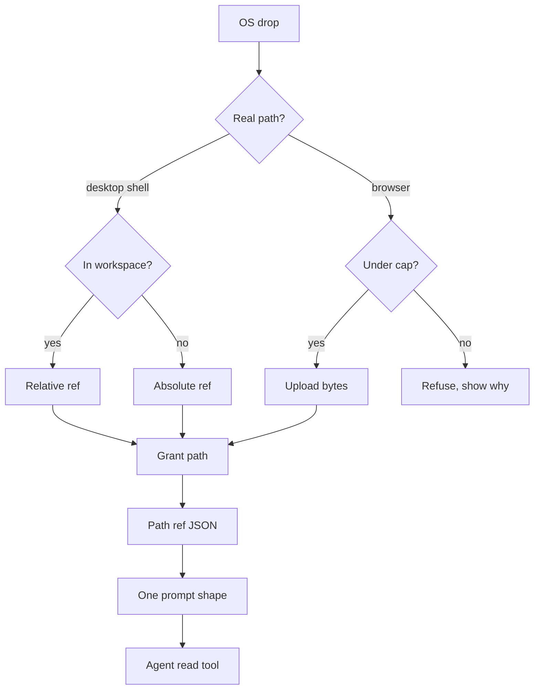

# Explorer drops in Workshop should always become a path reference, and uploads should converge on that same reference

Report type: analytical / recommendation. The decision this report serves: how PromptForge Workshop should handle a file dragged from the OS explorer into the composer, and what the agent should receive as a result. The proposed posture under evaluation was: "drags from explorer should always be a filesystem-path based JSON, unless the UI server is remote, in which case it should attach if below a threshold." The evidence is a same-day empirical study of Cursor's behavior on this machine (prompt turns received by the model, the composer state database, and the on-disk attachments folder), a seventeen-tool industry survey, a review of how chat inputs implement mention pills, and a read of the Workshop crates. The survey, the pill review, and Cursor's 2025 history were first written up in a separate comparative report the same day; that report is merged here as appendices A through C and no longer exists on its own.

## Executive summary

Adopt the posture with two amendments. First, key the branch on client capability (can the client supply a real OS path?) rather than on server topology (is the server remote?). Chromium hides real paths from HTML5 drops, so a same-machine browser tab is in the same position as a remote one, and the Workshop server is loopback-only by architectural invariant, so the "remote server" case cannot occur while the "browser client" case occurs today. Second, make the upload branch converge on the path branch: bytes land in a session-scoped server directory, that path is granted, and the prompt receives the identical path-reference shape. One prompt shape, one render rule, one failure mode.

The amendments come from watching Cursor fail. On the current Cursor build, a picker `@` mention of a file delivers a `@relative/path` token to the model and nothing else, regardless of file size (12 KB to 570 MB), file type, location, or whether the file is open. That path works because the agent has a `read_file` tool. An explorer drag of a `.txt`, `.md`, `.json`, or `.pdf` takes a second pipeline: Cursor copies the whole file into `~\.cursor\projects\<workspace>\attachments\<composerId>\`, records it as a "document", shows a chip that looks like an attachment, and renders nothing into the prompt. The model gets neither content nor name. A `.7z` dragged the same way falls through to the mention pipeline and works. Cursor never checks whether the dropped file is already inside the workspace, so a repo file gets copied to a second location and then referenced by neither path. Two render paths, one of them missing, behind one indistinguishable chip: that is the failure the amended posture is designed to make impossible.

The posture is inert without a confined read tool on the agent side. Workshop today serializes mentions to plain `@label` text in `InputResponseFrame { text }`, has no structured mention field on the wire, and has no chat-side read tool. A path in the prompt is a promise; the read tool is what cashes it. The recommendation therefore carries three build items: a structured `mentions[]` field on the input frame, a mention node that stores display label and path separately, and a grant-honoring read tool exposed to the agent. Reuse `MAX_FILE_BYTES` (1 MiB) as the upload cap, refuse over-cap drops visibly, and tie the upload directory to session lifetime.

## Contents

1. Recommendation
2. Criteria a drop design must satisfy
3. Evidence: what Cursor does today, measured on this machine
4. Evidence: how sixteen other tools resolve the same choice
5. Where Workshop stands today
6. Options and trade-offs
7. The recommended design in detail
8. Risks, alternatives set aside, and open questions
9. Owner and next steps
10. References
- Appendix A. Cursor's 2025 behavior and what changed
- Appendix B. Seventeen-tool comparison of file mention behavior
- Appendix C. How chat inputs implement the mention pill

## 1. Recommendation

Restated posture, as the rule Workshop should adopt:

> An explorer drop produces a path reference when the client can supply a real OS path (the desktop shell). The reference is workspace-relative when the path is inside a workspace root and absolute otherwise, and it carries a grant. When the client cannot supply a path (any browser, same machine or not), the drop uploads bytes up to `MAX_FILE_BYTES` into a session-scoped server directory, grants that path, and produces the same path reference. Over the cap, the drop is refused with a visible reason naming the size and the limit. The prompt has one attachment shape. The agent has a confined read tool that resolves it.

Confidence high on the capability discriminator and on converging the two branches; both follow directly from a reproduced failure and from Workshop's existing loopback invariant. Confidence medium on 1 MiB as the cap; it is the workspace's existing constant and sits inside the industry band, but no Workshop user data supports the specific number yet.

## 2. Criteria a drop design must satisfy

The options in section 6 are scored against these six criteria. They are derived from the failure modes observed in section 3 and from Workshop's stated architecture in section 5.

Table 1. Criteria for an attachment design, with the observed failure each one guards against.

| # | Criterion | Guards against |
|---|---|---|
| C1 | The model always receives something usable for every chip the user sees | Cursor's document chip: visible attachment, empty payload |
| C2 | The path the model receives is sufficient to locate the file | Cursor's basename-only `Add to Chat` bug; duplicate filenames across a repo |
| C3 | One prompt shape regardless of how the file arrived | Two render paths with one missing renderer |
| C4 | No bytes move unless the reference cannot work without them | Cursor copying a 1.1 MB repo file into a second location for no benefit |
| C5 | Bounded resource use with visible refusal | Silent 7.7 MB copies; an attachments folder nothing cleans |
| C6 | Fits Workshop's existing invariants: loopback server, drop-to-grant, paths-only tree drags, 1 MiB read cap | Introducing a second content channel beside `GET /workspace/file` |

## 3. Evidence: what Cursor does today, measured on this machine

The study used three instruments, all on Cursor 2.x, Windows, 2026-09-19, in one agent conversation with the model receiving each turn. First, the model's own view of each user turn, which shows exactly what tags and text arrived. Second, the composer state database at `%APPDATA%\Cursor\User\globalStorage\state.vscdb` (table `cursorDiskKV`, keys `composerData:<id>` and `bubbleId:<composer>:<bubble>`), read with Python's sqlite3 in read-only mode, which shows how each attachment was classified and stored. Third, the on-disk folders `~\.cursor\projects\<workspace>\attachments\<composerId>\` and `%APPDATA%\Cursor\User\workspaceStorage\<id>\images\`, which show what was copied.

### 3.1 A picker @ mention is a path token and nothing else

Four explicit `@` mentions from the picker were tested, plus one explorer drag (the `.7z`) that Cursor routed into the same mention pipeline. Table 2 lists them; every one arrived at the model as the literal `@` token inside `<user_query>` with no `<attached_files>` block, no content, no outline, and no size notice.

Table 2. Mentions that took the mention pipeline and what the model received. "Open" means the file was open and focused in an editor tab at send time. The `.7z` row was an explorer drag, not a picker selection.

| File | Size | Type | Location | Open | Received by the model |
|---|---|---|---|---|---|
| `tools-public/rulebooks/reports-rulebook.md` | 12 KB, 270 lines | text | workspace | no | `@tools-public/rulebooks/reports-rulebook.md` |
| `cabinet/cloud-provider-models.json` | 1.1 MB, 38,148 lines | text | workspace | no | `@cabinet/cloud-provider-models.json` |
| `cabinet/_output/report-at-mention-implementation.md` | 30 KB, 213 lines | text | workspace | focused | `@cabinet/_output/report-at-mention-implementation.md`, plus the usual IDE-state block listing it as focused with a cursor line |
| `z:\_Bizon\wg21-papers.7z` | 569 MB | binary | outside workspace | no | `@z:\_Bizon\wg21-papers.7z` |

The serialization rule is visible in the path forms: workspace-relative with forward slashes when the file is under a root, absolute with backslashes when it is not. The model must call `Read` to get any content. This is the Codex CLI design, and it contradicts the June 2025 traffic capture in which a 74-line `@file` arrived in full inside `<additional_data><attached_files><file_contents>` with a `lines=ALL(1-74)` fence header. The mid-2025 Cursor staff descriptions of an "outline" and "smart condensation" for large attached files do not apply to explicit `@file` on this build, because there is no content to condense.

The stored record for each mention has the same two-part structure. The Lexical rich-text document holds a node of type `mention` whose `text` is the path and whose `mentionName` is the display label, and the bubble's `context.fileSelections[]` holds the full `file://` URI:

```json
{"type": "mention", "mode": "segmented",
 "text": "cabinet/cloud-provider-models.json",
 "mentionName": "cloud-provider-models.json",
 "typeaheadType": "file", "storedKey": "20042", "source": "chat"}
```

```json
"fileSelections": [{"uri": {"fsPath": "c:\\Users\\Vinnie\\cursor\\cabinet\\cloud-provider-models.json",
  "external": "file:///c%3A/Users/Vinnie/cursor/cabinet/cloud-provider-models.json", "scheme": "file"},
  "uuid": "20042", "collapseByDefault": false, "addedWithoutMention": false}]
```

The bubble's plain `text` field is `@` plus the node's `text`, which is the string the model receives. Display label and payload path are stored separately, which is the correct split; the only defect observed in this pipeline is a forum-acknowledged bug where right-click "Add to Chat" sends the basename instead of the path.

### 3.2 An explorer drag of a text file is copied, classified as a document, and rendered as nothing

A drag of `cloud-provider-models.json` from Windows Explorer onto the chat, with the file sitting inside the workspace root, produced a chip with a generic document glyph above the message text. The model received the message text and nothing else: no path, no content, no chip marker. The stored record explains why:

```json
"selectedDocuments": [{
  "uuid": "219a42cf-6061-4035-8cac-780fc005edfd",
  "path": "c:\\Users\\Vinnie\\.cursor\\projects\\c-Users-Vinnie-cursor\\attachments\\22aef0e3-650c-4fb8-b1b5-810f6b873146\\cloud-provider-models.json",
  "filename": "cloud-provider-models.json",
  "mimeType": "application/json",
  "loadedAt": 1789844625981,
  "addedWithoutMention": true
}]
```

`fileSelections` was empty and the rich text held no mention node. Cursor had copied the file, byte for byte (1,117,093 bytes on both sides), into a per-conversation attachments folder and recorded it in the list used for uploaded documents. The renderer that turns `selectedDocuments` into prompt text emitted nothing for `application/json`. The sibling list `selectedImages` does render: a screenshot dropped a minute later arrived at the model as an image plus a saved-path reference in an `<image_files>` block, with the same `addedWithoutMention: true`.

### 3.3 The branch is on file extension, not size or location

The user then dragged a set of files of different types, sizes, and locations. Table 3 shows the on-disk result in the attachments folder and the chip each produced.

Table 3. Explorer drags into Cursor, by file type. "Copied" means a byte-identical copy appeared in `attachments\<composerId>\`.

| File | Size | Location | Chip | Copied | Pipeline |
|---|---|---|---|---|---|
| `wg21-papers.7z` | 569 MB | outside workspace | blue path pill | no | mention (`fileSelections`) |
| `cloud-provider-models.json` | 1.1 MB | inside workspace | document glyph | yes | document (`selectedDocuments`) |
| `the-room.md` | 292 KB | inside workspace | document glyph | yes | document |
| `papermancer.pdf` | 7.7 MB | outside workspace | document glyph | yes | document |
| `JennyBooty.txt` | 288 B | outside workspace | document glyph | yes | document |
| `mcp.json` (twice) | 1.5 KB | outside workspace | document glyph | yes, second copy as `mcp_1.json` | document |

Size does not decide: 288 bytes and 7.7 MB were copied, 569 MB was not. Location does not decide: a file inside the workspace was copied the same as one outside. Mime sniffing does not decide: `.md` was labeled `application/octet-stream` and still went to the document pipeline. The extension does: `.txt`, `.md`, `.json`, `.pdf` are on a document allowlist and are copied; `.7z` is not and falls through to a mention. Workspace membership is never consulted, so a file that is already reachable by path is duplicated and then referenced by neither pipeline. Nothing observed cleans the attachments folder; it accumulated 9 MB in twenty minutes of testing.

### 3.4 What this means for the design question

Cursor's two pipelines each get one half right. The mention pipeline satisfies C1 through C4: the model always gets a usable path, the path locates the file, there is one shape, and no bytes move. The document pipeline satisfies none of them and violates C5. The failure is not that Cursor uploads files; it is that the upload pipeline has its own render step, and that step is missing for the types most likely to be dragged. The chip cannot tell the user which pipeline fired. Any design with two render paths inherits this risk.

## 4. Evidence: how sixteen other tools resolve the same choice

Every surveyed tool splits a mention into a display token in the user's text and a structured attachment rendered elsewhere. They differ on how much of the file they move into the prompt before the model asks. Table 4 condenses the survey; Appendix B gives the full per-tool comparison with wrapper formats, size rules, and editor technology.

Table 4. File mention behavior by prefetch depth. "Injected form" is what the model receives for one mentioned file.

| Family | Tools | Injected form | Size rule | Fallback when too large |
|---|---|---|---|---|
| Path only | Cursor 2.x (measured), Codex CLI | Bare path; model reads via tool | none needed | not applicable |
| Full content with cap | Cline, Roo Code, Continue, Cody, Aider, Claude Code, Gemini CLI, Amp | File text in a wrapper (`<file_content path>`, fenced block with path, `read_file`-style block) | Cline 400 KB, Roo 2,000 lines, Gemini CLI 2,000 lines and 20 MB, Amp 500 lines, Cody 1 MB filter | Truncate with a hint to read more (Cline, Roo, Gemini, Amp); drop item whole and warn before send (Cody) |
| Full then outline | Copilot Chat, Zed, JetBrains AI | Full text under a threshold, outline or summary above | Zed 16 KB, Copilot about 2,500 tokens, JetBrains user-set percent | Outline; Copilot marks `isSummarized="true"` |
| Content, rules not published | Windsurf, Amazon Q, Gemini Code Assist, OpenCode | Mention "guaranteed to be part of the context" (Windsurf); OpenCode fakes a `Read` tool call server-side | Gemini folder capped at 100 files; otherwise none documented | Not documented |

Three points from the survey bear on the posture. First, no tool sends a bare filename; the token is always a locatable path, and Cline goes further by rewriting the inline token to `'src/x.ts' (see below for file content)` so the model can bind sentence to block. Second, every tool that moves bytes has a cap and a stated fallback; Cursor's document pipeline is the only case observed with neither. Third, the stated industry direction is toward less prefetch: Cursor's own January 2026 blog ("providing fewer details up front, making it easier for the agent to pull relevant context on its own"), Anthropic's "just in time" guidance to "maintain lightweight identifiers (file paths, stored queries, web links, etc.)", Copilot's maintainer exploring path-only attachments, and Boris Cherny on Claude Code dropping RAG for "agentic search". Path-first is where the field is heading, and Workshop's existing design is already there.

Zed's implementation is the closest precedent for the amended posture's upload branch. Its agent prompt keeps the user's text with `file:///...#L1:20` links in place and appends grouped tagged blocks after one preamble: "The following items were attached by the user. They are up-to-date and don't need to be re-read." One shape for files, directories, symbols, selections, and threads. Copilot's open source is the closest precedent for a size-aware renderer: `FileVariable` reads the file, emits a `CodeSummary` above budget, and marks the reference "Part of this file was not sent to the model", so the UI can show the user that the model saw less than the chip implies.

## 5. Where Workshop stands today

Workshop's architecture already embodies the path-first half of the posture. Table 5 summarizes the relevant code, from a read of `crates/workshop` on 2026-09-19.

Table 5. Workshop mechanisms relevant to drops and mentions, with locations.

| Mechanism | Location | Behavior today |
|---|---|---|
| OS explorer drop (desktop) | `crates/workshop/server/ui/src/ui/workspace/workspace-drops.ts` lines 1-10; `crates/workshop/shell/src/bridge.rs` (WebView2 `ICoreWebView2File::Path`); `crates/workshop/shell/src/main.rs` (Tauri `DragDropEvent::Drop { paths }`) | Real OS path recovered through the shell bridge, then `POST /workspace/grant`. "Desktop mode never reads file bytes merely because a file was dragged onto the window." |
| OS drop (browser) | same module | Grant listener skipped when `__TAURI_INTERNALS__` is absent; HTML5 drop yields `File` objects with bytes and no path |
| In-app tree drag | `workshop-panel.ts` about line 290; `run-panel.ts` lines 35-36, 116-132 | MIME `application/x-workshop-path`, paths only; Run panel loads via `GET /workspace/file` |
| Composer mention pill | `ui/agent/mention-chip.ts`, `ui/agent/typeahead-popup.ts` lines 25-31, `ui/agent/prompt-input.ts` | TipTap `Mention` node with `id` and `label` attrs; stub typeahead of three canned items; no workspace index yet |
| Submit | `ui/agent/agent-session-view.ts` lines 329-351; `agent-socket.ts` about lines 200-206 | `getText()` then `InputResponseFrame { type: "input_response", token, text }`; no attachments array, no multipart |
| File read API | `crates/workshop/workspace/src/workspace.rs` lines 44-99 | `GET /workspace/file` returns `FileContents { path, size, token, text }`; `MAX_FILE_BYTES = 1 MiB`; `FileTooLarge` above |
| Server bind | `crates/workshop/shell/src/config.rs` lines 4-11, 21-23, 89-92; `crates/workshop/server/src/cross_site.rs` lines 86-88; `vibe/archdoc.md` A4 | Always `127.0.0.1`; non-loopback `Host` and cross-site requests refused; WebSocket `Origin` must be loopback |
| Agent read tool for mentions | none found | Mentions reach the agent as `@label` plain text with no tool to resolve them |

Two facts from this table reshape the posture. The server cannot be remote, so the posture's "unless the UI server is remote" clause describes a configuration the code refuses. And the browser cannot supply a path, so the case the clause was reaching for exists today on the same machine. The Workshop guide already says drop-to-grant is desktop-only and the browser keeps HTML file-content drops; the posture should say the same thing in the same terms.

The third fact is the gap: nothing on the agent side can read a mentioned path. The mention pill serializes to text, the frame carries text, and the model has no tool. Cursor's path-only design works because `read_file` exists and the system prompt says "the model can pull in parts of the file." Without the tool, a Workshop path reference is Cursor's document chip in different clothes: something the user sees and the model cannot act on.

## 6. Options and trade-offs

Four options were considered, including the posture as originally stated and doing nothing. Table 6 scores them against the criteria in section 2.

Table 6. Options scored against criteria C1-C6. A full mark means the option satisfies the criterion by construction; a partial mark means it can satisfy it with extra rules; a blank means it fails.

| Option | C1 usable payload | C2 locatable path | C3 one shape | C4 no needless bytes | C5 bounded, visible refusal | C6 fits invariants |
|---|---|---|---|---|---|---|
| A. Posture as stated: path JSON, except upload with threshold when server is remote | partial (remote branch needs its own renderer) | full | blank (two shapes) | full | partial (threshold named, refusal not) | partial (remote server does not exist; browser case unhandled) |
| B. Amended: path JSON when client has a path, else upload under cap and grant, same reference either way | full (one renderer, always fed) | full | full | full | full | full |
| C. Always upload and inject content (Cline style) | full | full (path in wrapper) | full | blank (copies every drop) | partial (needs cap and truncation rules) | blank (second content channel beside `GET /workspace/file`; breaks paths-only tree drags) |
| D. Do nothing: mentions stay `@label` text, drops stay grants | blank (agent cannot read) | partial (label may be a basename) | full | full | not applicable | full |

Option A is right in intent and wrong in its discriminator. Its second branch triggers on a server topology the architecture forbids and misses the browser client that exists now. Its two branches also produce two prompt shapes, which is the structural precondition for Cursor's missing-renderer failure. Option C is the industry's older default and is not wrong for a CLI, but it moves bytes on every drop, needs its own truncation rules, and adds a content channel beside the one Workshop already confines to `GET /workspace/file`. Option D is the current state and fails the first criterion outright: the agent sees a label and has no way to act on it.

Option B keeps A's intent, fixes the discriminator, and collapses the two branches at the point where they would otherwise diverge. The upload branch exists only to manufacture a path where the client could not supply one; once the path exists, the branch rejoins the main line. The cost is one session-scoped directory on the server and one grant per upload, both of which reuse mechanisms Workshop already has.

## 7. The recommended design in detail

### 7.1 Decision flow

Figure 1 shows the flow for one dropped file. Every path through it ends at the same reference shape, or at a visible refusal.

Figure 1. Drop handling in the amended posture. Both the desktop path and the browser upload converge on one granted path reference before anything reaches the prompt.



### 7.2 Rules

Table 7 states each rule, the criterion it serves, and the Cursor observation that motivates it.

Table 7. Rules of the amended posture.

| Rule | Serves | Motivating observation |
|---|---|---|
| Branch on whether the client can supply a real OS path, never on server location | C6 | Chromium hides paths from HTML5 drops; Workshop server is loopback-only |
| Serialize workspace-relative when inside a root, absolute otherwise; never a bare basename | C2 | Cursor's relative/absolute split works; its basename-only `Add to Chat` is an acknowledged bug |
| Check workspace membership before any copy; a file already reachable by path is never duplicated | C4 | Cursor copied a repo file into `attachments\` and then referenced it from neither pipeline |
| Uploads land in a session-scoped server directory and are granted like any other path | C3, C6 | Cursor's `attachments\<composerId>\` folder is the right location; its missing renderer is the wrong next step |
| The prompt receives one reference shape regardless of origin; the origin is a field, not a format | C3 | Two pipelines behind one chip produced an invisible failure |
| The agent has a confined read tool that honors grants and the 1 MiB cap | C1 | Cursor's path-only design depends on `read_file`; Workshop has no equivalent for mentions |
| Cap uploads at `MAX_FILE_BYTES`; refuse above it with the size and the limit in the UI | C5 | Cursor copied 7.7 MB silently; Cody warns before send; Copilot marks partial sends |
| Deduplicate by content hash within a session rather than by suffixing filenames | C5 | Cursor produced `mcp_1.json` for a second drop of the same file |
| Delete the session directory when the session ends | C5 | Nothing observed cleans Cursor's folder; 9 MB accumulated in twenty minutes |
| The chip shows the origin (desktop path, uploaded, in-workspace) so the user can see which branch fired | C1 | Cursor's document chip and mention pill were indistinguishable in effect |

### 7.3 Wire shape

The input frame gains a structured `mentions` array beside the existing `text`. The text keeps the human-readable token so the sentence still reads; the array carries what the agent needs to act. This mirrors the split Cursor stores (`text` plus `fileSelections`) and the split VS Code exposes to chat participants (`promptText` plus `ChatPromptReference.value`).

```json
{
  "type": "input_response",
  "token": "w_3f9c",
  "text": "compare @the-room.md against the outline in @notes.md",
  "mentions": [
    {
      "kind": "file",
      "label": "the-room.md",
      "path": "my-books/the-room/the-room.md",
      "root": "c:/Users/Vinnie/cursor",
      "grant": "g_7f3a2c",
      "origin": "desktop-drop",
      "size": 292148,
      "range": null
    },
    {
      "kind": "file",
      "label": "notes.md",
      "path": ".workshop/session-9b1e/uploads/notes.md",
      "root": null,
      "grant": "g_81d0e4",
      "origin": "browser-upload",
      "size": 4210,
      "range": null
    }
  ]
}
```

The two entries differ only in `origin` and in where the path points. The agent-side renderer emits the same block for both, and the read tool resolves both through the same grant check. `range` is reserved for a later selection mention (`@file:12-40`) so the shape does not change when that lands.

### 7.4 Prompt rendering

Render the mentions once, after the user text, under one preamble, in the manner Zed uses. The preamble tells the model the files are current and readable, and the block gives the path the tool needs. Content is not injected; the model reads what it decides it needs.

```
<mentioned_files>
The user referenced these files. They are up to date and can be read with the read_file tool.
- my-books/the-room/the-room.md (292 KB, in workspace)
- .workshop/session-9b1e/uploads/notes.md (4 KB, uploaded this session)
</mentioned_files>
```

This is deliberately closer to Cursor's current behavior than to Cline's. The evidence from Cursor is that a bare `@path` token with no block at all still works when the tool exists, but the token alone gives the model no size hint and no assurance that the file is readable. A short block adds both at negligible token cost and gives the renderer one place to live.

## 8. Risks, alternatives set aside, and open questions

**Risk: a read tool that reads anything.** The path reference is only safe if the read tool is confined to granted paths and to the workspace's existing cap. Workshop's `GET /workspace/file` already enforces both; the agent tool should be a thin call into it, not a second file reader. Confidence high that reuse is the right call; a parallel reader is how the second content channel of option C sneaks back in.

**Risk: the model ignores the reference.** Cursor's forum has a 2025 thread titled "files added to context is useless" in which the agent re-searched for files the user had attached. Path-only designs depend on the system prompt telling the model the reference is authoritative. The preamble in 7.4 is that instruction; it should be tested with the models Workshop targets, since smaller models follow it less reliably. Confidence medium.

**Alternative set aside: inject content for small files, path for large ones.** This is the Copilot and Zed design and it works for them. It was set aside because it reintroduces two render shapes and a threshold the user cannot see, and because Workshop's Run panel and tree drags already commit to paths-only; a content branch for small mentions would make the composer the one place that moves bytes into the prompt. It remains the right fallback if the read-tool round trip proves too slow for the tiny-file case. Confidence medium that paths-only holds; revisit if latency data says otherwise.

**Alternative set aside: match browser drops to workspace files by content hash.** A browser drop of a file that happens to be in the workspace could be recognized by hashing and turned into a workspace-relative reference without an upload. It was set aside as premature: it needs a workspace index the composer does not have yet, and the upload-then-grant path produces a working reference anyway. Worth reconsidering when the mention typeahead gets a real index.

**Open question: what counts as "in workspace" with multiple roots.** The `root` field in 7.3 assumes one root per path. Multi-root workspaces need either a root identifier or a rule that the shortest relative path wins. Cline's mention syntax handles it with a `@ws:name/path` prefix; Workshop should pick one before the wire shape freezes.

**Open question: images and PDFs.** The posture covers files the agent reads as text. Images need a different render (Cursor's `<image_files>` block with a saved path works) and PDFs need extraction or a model that accepts them. Both can reuse the upload-and-grant branch for storage; only the render step differs, and that difference should be by `kind`, not by a second pipeline.

## 9. Owner and next steps

Table 8 lists the build items in dependency order. The first three are prerequisites for the posture to have any effect; the rest make it robust.

Table 8. Build items for the amended posture.

| # | Item | Where | Depends on |
|---|---|---|---|
| 1 | Add `mentions[]` to `InputResponseFrame` beside `text` | `agent-socket.ts`, server frame types | none |
| 2 | Store `path`, `label`, `grant`, `origin` on the TipTap mention node; serialize `text` as `@label` and emit the node into `mentions[]` on submit | `mention-chip.ts`, `prompt-input.ts`, `agent-session-view.ts` | 1 |
| 3 | Expose a `read_file` tool to the agent that calls `GET /workspace/file` and honors grants and `MAX_FILE_BYTES` | agent runtime tool registry | 1 |
| 4 | Route desktop drops into the composer as mentions (relative or absolute) after the existing grant | `workspace-drops.ts` | 2 |
| 5 | Add the browser upload branch: session directory, cap check with visible refusal, content-hash dedup, grant, mention | new upload endpoint, `workspace-drops.ts` | 2, 3 |
| 6 | Render `<mentioned_files>` after user text in the agent prompt | prompt assembly | 1, 3 |
| 7 | Delete the session upload directory on session end | session lifecycle | 5 |
| 8 | Show origin on the chip | `mention-chip.ts` | 2 |

Owner: the Workshop composer and agent-runtime maintainers. The first verification is the same experiment run against Cursor here: drop each of a `.md`, a `.json`, a `.7z`, and a file outside the workspace from Explorer into the desktop shell and into a browser tab, then read the agent's received prompt and the session directory. Success is one shape in every case and a refusal with a number for the over-cap file.

## 10. References

Empirical evidence, this machine, 2026-09-19:

- Model-received user turns for four picker `@` mentions and seven external drops (one `.7z`, one `.pdf`, one `.txt`, two `.json`, one `.md`, one screenshot), recorded in the conversation transcript.
- Composer state database `%APPDATA%\Cursor\User\globalStorage\state.vscdb`, table `cursorDiskKV`, keys `composerData:22aef0e3-650c-4fb8-b1b5-810f6b873146` and `bubbleId:22aef0e3-...:*`, read with Python sqlite3 in `mode=ro`.
- Attachments folder `~\.cursor\projects\c-Users-Vinnie-cursor\attachments\22aef0e3-650c-4fb8-b1b5-810f6b873146\` listing at 12:14 PM.

Research files (same date, ephemeral): Cursor @ mention internals; file and context mention features in closed-source AI IDEs; open-source @ mention implementations; chat input @ mention pill implementation and serialization; context injection design discussion. The comparative report "How Cursor's @ mention reaches the model, and how thirteen other tools do the same job" that drew on them has been merged into the appendices below and deleted.

Workshop code read on 2026-09-19:

- `crates/workshop/server/ui/src/ui/workspace/workspace-drops.ts`, `crates/workshop/shell/src/bridge.rs`, `crates/workshop/shell/src/main.rs`, `crates/workshop/shell/src/config.rs`, `crates/workshop/server/src/cross_site.rs`, `crates/workshop/workspace/src/workspace.rs`, `crates/workshop/server/ui/src/ui/agent/{mention-chip,typeahead-popup,prompt-input,agent-session-view,agent-socket}.ts`, `vibe/archdoc.md`, `vibe/2026-09/2026-09-02-1-workshop-agent-window-clone.md`, `vibe/2026-09-17-6-minimal-run-window.md`.

External sources cited in the text:

- Cursor, Dynamic context discovery, Jan 6 2026. https://cursor.com/blog/dynamic-context-discovery
- Cursor forum, right-click "Add to Chat" strips the path. https://forum.cursor.com/t/right-click-add-file-directory-to-cursor-chat-strips-the-path-drag-and-drop-keeps-it/171232
- Cursor forum, files added to context is useless, Feb-Mar 2025. https://forum.cursor.com/t/biggest-problem-with-agent-mode-files-added-to-context-is-useless/57106
- byteatatime.dev, Cursor prompt analysis, Jun 1 2025 (the `<attached_files>` capture). https://byteatatime.dev/posts/cursor-prompt-analysis/
- Anthropic, Effective context engineering for AI agents, Sep 29 2025. https://www.anthropic.com/engineering/effective-context-engineering-for-ai-agents
- Zed `crates/agent/src/thread.rs` and PR 50290. https://github.com/zed-industries/zed/blob/main/crates/agent/src/thread.rs ; https://github.com/zed-industries/zed/pull/50290
- vscode-copilot-chat `fileVariable.tsx`; VS Code issue 284959. https://github.com/microsoft/vscode-copilot-chat/blob/main/src/extension/prompts/node/panel/fileVariable.tsx ; https://github.com/microsoft/vscode/issues/284959
- Cline `src/core/mentions/index.ts`. https://github.com/cline/cline/blob/9dea336c/src/core/mentions/index.ts
- Codex CLI `chat_composer.rs`. https://github.com/openai/codex/blob/main/codex-rs/tui/src/bottom_pane/chat_composer.rs
- Boris Cherny on agentic search, Feb 1 2026, via secondary. https://vadim.blog/claude-code-no-indexing/
- Cursor changelogs 0.50, 1.4, 2.0. https://cursor.com/changelog/0-50 ; https://cursor.com/changelog/1-4 ; https://cursor.com/changelog/2-0
- Cursor forum staff replies: outline of attached file (Jul 26 2025) https://forum.cursor.com/t/context-limitation-suddenly-limits-length/121237 ; "smart condensation" (Nov 8 2025) https://forum.cursor.com/t/context-inclusion-is-non-deterministic/141515 ; @folder sends a tree (Oct 31 2025) https://forum.cursor.com/t/cursor-2-0-missing-full-folder-context/140027 ; attached tab sends only the path (Aug 30 2025) https://forum.cursor.com/t/cursor-v1-5-release-discussions/131103/245
- Legacy Cursor @Files docs (mirror). https://cursor.fan/context/@-symbols/@-files/
- Lex Fridman podcast 447, Cursor team transcript, Oct 2024. https://lexfridman.com/cursor-team-transcript/
- Priompt README. https://github.com/anysphere/priompt/
- Reverse-engineered Cursor protocol: roder-ext-cursor proto README https://docs.rs/crate/roder-ext-cursor/latest/source/proto/README.md ; cursor-byok `replay.go` https://github.com/leookun/cursor-byok/blob/639c452a/internal/backend/agent/prompt/replay.go ; cursor-tap https://github.com/burpheart/cursor-tap/blob/main/README_EN.md ; cc-connect `cursor.go` https://github.com/chenhg5/cc-connect/blob/12a589fc/agent/cursor/cursor.go
- VS Code chat input source: `chatDynamicVariables.ts`, `chatParserTypes.ts`, `chatAttachmentModel.ts` under https://github.com/microsoft/vscode/tree/main/src/vs/workbench/contrib/chat ; API reference https://code.visualstudio.com/api/references/vscode-api ; @vscode/prompt-tsx https://github.com/microsoft/vscode-prompt-tsx
- VS Code Copilot Chat context docs. https://code.visualstudio.com/docs/chat/copilot-chat-context
- Zed agent panel docs. https://zed.dev/docs/ai/agent-panel
- JetBrains AI Assistant chat mode. https://www.jetbrains.com/help/ai-assistant/chat-mode.html
- Windsurf chat and Cascade. https://docs.windsurf.com/chat/overview ; https://docs.windsurf.com/windsurf/cascade/cascade
- Amazon Q Developer chat context. https://docs.aws.amazon.com/amazonq/latest/qdeveloper-ug/ide-chat-context.html
- Gemini Code Assist chat. https://docs.cloud.google.com/gemini/docs/codeassist/chat-gemini
- Roo Code `context-mentions.ts`, `mentions/index.ts`. https://github.com/RooCodeInc/Roo-Code/blob/main/src/shared/context-mentions.ts ; https://github.com/RooCodeInc/Roo-Code/blob/main/src/core/mentions/index.ts
- Continue `Mention.ts`, `constructMessages.ts`. https://github.com/continuedev/continue/blob/main/gui/src/components/mainInput/TipTapEditor/extensions/Mention.ts ; https://github.com/continuedev/continue/blob/main/gui/src/redux/util/constructMessages.ts
- Cody public snapshot `prompt-builder/utils.ts`, `ContextItemMentionNode.tsx`. https://github.com/sourcegraph/cody-public-snapshot/blob/12283bca9f94ab411b5c75028a4e440d6ddc6af6/vscode/src/prompt-builder/utils.ts ; https://github.com/sourcegraph/cody-public-snapshot/blob/12283bca9f94ab411b5c75028a4e440d6ddc6af6/lib/prompt-editor/src/nodes/ContextItemMentionNode.tsx
- Aider `repomap.py`. https://github.com/Aider-AI/aider/blob/main/aider/repomap.py
- Claude Code common workflows. https://code.claude.com/docs/en/common-workflows
- Gemini CLI `atCommandProcessor.ts`, `constants.ts`. https://github.com/google-gemini/gemini-cli/blob/main/packages/cli/src/ui/hooks/atCommandProcessor.ts ; https://github.com/google-gemini/gemini-cli/blob/main/packages/core/src/utils/constants.ts
- OpenCode `session/prompt.ts`. https://github.com/anomalyco/opencode/blob/dev/packages/opencode/src/session/prompt.ts
- Amp context management guide, Nov 2025. https://ampcode.com/guides/context-management
- TipTap `extension-mention/src/mention.ts`. https://github.com/ueberdosis/tiptap/blob/main/packages/extension-mention/src/mention.ts
- Lexical playground `MentionNode.ts`. https://github.com/facebook/lexical/blob/main/packages/lexical-playground/src/nodes/MentionNode.ts
- Slack and Discord mention formatting. https://docs.slack.dev/messaging/formatting-message-text ; https://discord.com/developers/docs/reference#message-formatting
- Anthropic prompting best practices (long documents at top, `<document>` tags). https://platform.claude.com/docs/en/build-with-claude/prompt-engineering/claude-prompting-best-practices

## Appendix A. Cursor's 2025 behavior and what changed

Section 3 measures the current build. This appendix records what public evidence says Cursor did before, so the shift toward path-only can be read as a design decision rather than a gap in the data. Every item here is from secondary evidence (captured traffic, staff forum replies, changelogs, reverse-engineered schemas); none of it was reproduced today, and where today's measurement contradicts it, today's measurement governs.

### A.1 In June 2025 an @file arrived in full, separate from the query

A traffic capture published on Jun 1 2025 shows a 74-line `@`-mentioned Svelte file arriving inside the second of two `role: user` messages, wrapped as follows (byteatatime.dev):

````
<additional_data>
<attached_files>
<file_contents>
```path=src/lib/components/DisplayResult.svelte, lines=ALL(1-74)
(full file)
```
</file_contents>
<manually_added_selection>
```path=src/lib/server/types/display.types.ts, lines=39-40
(two lines)
```
</manually_added_selection>
</attached_files>
</additional_data>

<user_query>
I would like for you to improve the layout of the visuals found in @DisplayResult.svelte. ...
</user_query>
````

The token in `<user_query>` was the literal `@DisplayResult.svelte`, the same serialization observed today. The difference is the block above it: the fence header carried the workspace-relative path and `ALL(1-74)` to mark a whole-file send, and an `@Code` symbol arrived as `<manually_added_selection>` with a line range. In the same capture an `@folder` produced a directory listing with sizes and line counts and no contents, `@URL` produced a "Potentially Relevant Websearch Results" block, and `@Docs` produced "Potentially Relevant Documentation". Rules travelled in a separate first user message under `<custom_instructions>`.

### A.2 Mid-2025 staff replies describe an outline step for large files

Two staff replies on the Cursor forum describe size-dependent behavior that today's build does not exhibit for explicit `@file`. On Jul 26 2025 a staff member wrote: "It's showing an outline of the attached file to the model, and then the model will pull in parts of the file (or read the entire file if it thinks it needs all the context of the file)", adding that the limit exists "so that the model has plenty of room to pull in context via tool calls" (thread 121237). On Nov 8 2025 another wrote that Cursor has a "smart condensation" feature that "decides how to include files based on available context window space" (thread 141515). Users in the July thread saw the banner "This file has been condensed to fit in the context limit" on a 36,000-token file with a 200,000-token model. No staff post gave a threshold.

The legacy `@Files` docs, since removed from cursor.com, show the pattern predates 2025: Chat would "chunk the file into smaller chunks and rerank them based on relevance to the query" when a file was too long, and Cmd K offered four strategies, auto, full file, outline, and chunks. The `read_file` tool description in leaked prompts from December 2024 through version 1.2 carried the complementary rule: "You are only allowed to read the entire file if it has been edited or manually attached to the conversation by the user."

### A.3 The retreat from prefetch is documented in the changelog

Cursor 0.50 (May 2025) added `@folders` with a "Full folder contents" setting. Cursor 2.0 (Oct 29 2025) removed it; a staff member explained on Oct 31 2025 that "submitting the entire contents of a folder often caused the Agent to perform worse, as its context was bloated with files that were irrelevant" and that "`@` ing a folder sends a file tree of the folder's contents to the model" (thread 140027). The same release removed `@Definitions`, `@Web`, `@Link`, `@Recent Changes`, and `@Linter Errors` because "Agent can now self-gather context", and made files and directories "inline pills". On Aug 30 2025 a staff member had already said of the auto-attached current tab that it "does NOT attach whole file. instead it attaches only the file path" (thread 131103). Today's measurement shows explicit `@file` has followed the same path.

Cursor's January 2026 engineering post states the principle: "As models have become better as agents, we've found success by providing fewer details up front, making it easier for the agent to pull relevant context on its own. We're calling this pattern dynamic context discovery." For MCP tool descriptions the post reports an A/B test in which the approach "reduced total agent tokens by 46.9%" in runs that called an MCP tool. Earlier, in the October 2024 Lex Fridman interview, Michael Truell had put the cost side: "the more context you include ... the slower they are and the more expensive ... they get confused if you have a lot of information in the prompt. So the bar for accuracy and for relevance of the context you include should be quite high." Arvid Lunnemark described the Priompt renderer that made line-by-line truncation possible: a file component gives the cursor line the highest priority "and then you subtract one for every line that is farther away", and the renderer "figures out how many lines can actually fit". Priompt's README concedes that "adding priorities to everything is sort of an anti-pattern" but "useful ... for including long files in the prompt in a line-by-line way".

### A.4 The protocol can still carry content

Reverse-engineered transcriptions of Cursor's `agent.v1` protobuf, extracted from the app bundle's protobuf-es output and cross-checked against a live `AgentService/Run` capture, show `SelectedContext.files[]` with `path`, `relative_path`, and `content` fields (roder-ext-cursor proto README; cursor-byok `replay.go`). The wire format has not lost the ability to ship bytes; the current client chooses not to populate `content` for explicit mentions. This matters for Workshop because it shows path-only is a client policy layered on a protocol that permits either, which is the same shape the amended posture proposes: one reference format whose `origin` and storage differ while the prompt does not.

### A.5 Two pipelines behind one chip is an old defect, not a new one

A forum bug report predating today's tests described the same class of failure inside the mention pipeline: right-click "Add to Chat" sent only the basename (`index.tsx`) while drag-and-drop from Cursor's own Explorer sidebar sent the full workspace path, and the agent could not locate the right-click file in a repo with duplicate names. Staff confirmed: "The right-click add carries only the name while the drag carries the full path. We're getting this filed so all the add-to-chat entry points send the same full path" (thread 171232). The reporter found the difference only by asking the agent for the file's path; nothing in the chip revealed it. Today's `selectedDocuments` finding is the same defect one level up: entry points that look identical and serialize differently.

## Appendix B. Seventeen-tool comparison of file mention behavior

Table B1 gives the full per-tool comparison that Table 4 condenses. "Injected form" is what the model receives for one mentioned file; "Wrapper" is the prompt structure around it; "Editor pill" is how the input box represents the mention. Source quality is noted per row; official documentation and open source rank above issue threads, which rank above captured traffic.

Table B1. File mention behavior across seventeen AI coding tools, 2026-09-19.

| Tool | Injected form | Wrapper | Size rule | Editor pill | Source quality |
|---|---|---|---|---|---|
| Cursor 2.x (measured) | Path only for explicit `@file`; folder = tree; external text drop = nothing | `@relative/path` token in `<user_query>`; no attachment block | None observed for `@`; no cap on document copies | Lexical `mention` node; `text` = path, `mentionName` = label | Direct measurement plus composer database |
| Copilot Chat (VS Code) | Full file if it fits, else function outline, else omitted; agent mode may summarize | `<attachment isSummarized="true" filePath=...>` with `/* Lines 27-55 omitted */` | Summarization observed near 2,500 tokens; experimental path-only setting `omitFileAttachmentContents` | `#file:` text with Monaco decoration; picker chips above input | Official docs, maintainer issue replies, open source |
| Zed Agent Panel | Full text or tree-sitter outline; directory = link or per-file fences; thread = summary | Grouped tagged blocks after user text, preceded by "The following items were attached by the user. They are up-to-date and don't need to be re-read." | `auto_outline_threshold` 16,384 bytes; 1 KB head fallback | Inline creases (icon plus label) | Source code, PR 50290 |
| JetBrains AI Assistant | Files; folder "along with all its contents" | Not published | Trims above a user-set percent of context window, "extracting key content from larger ones"; trimmed icon | Clickable attachments | Official docs |
| Windsurf Cascade | Files, directories, symbols, `@web`, `@docs`, past conversations (summaries); pinned contexts | Not published; mentions "guaranteed to be part of the context" | No file-size rule documented; 20 tool calls per prompt | Pinned Contexts tab; inline citations | Official docs |
| Amazon Q Developer | `@file`, `@folder`, `@code`, `@prompt`; `@workspace` was indexed chunks (deprecated) | Not published | Images only (3.75 MB, 20 per message) | Picker popup; pinned strip above input | Official docs |
| Gemini Code Assist | `@file`, `@folder` (subfolders, first 100 files), `@terminal` | Not published | Folder capped at 100 files | Context Drawer and per-answer Context Sources | Official docs |
| Cline | Full content; folder = one-level tree plus every non-binary file | `<file_content path="">`, `<folder_content>`, `<url_content>`; inline token becomes `'path' (see below for file content)` | 400 KB truncate with `[FILE TRUNCATED]`; 20 MB stat throw | Textarea with `<mark>` overlay | Source code |
| Roo Code | First 2,000 lines, line-numbered, formatted like a `read_file` result | `[read_file for 'path']` header block; truncation note with `offset=` hint | `DEFAULT_LINE_LIMIT = 2000`; legacy definitions-only mode | Textarea with `<mark>` overlay | Source code |
| Continue | Full content; folder and codebase = retrieval chunks (~512 tokens, up to 25) | Markdown fence with relative path as info string, prepended before user text | No per-item cap; whole-conversation pruning | TipTap atomic `mention` node | Source code |
| Cody | Full content or dropped whole | `Codebase context from file {path}:` then a fenced block, each item its own `human` turn paired with `Ok.` | Never truncates; item dropped with `isTooLarge`; 1 MB filter | Lexical `ContextItemMentionNode` | Public snapshot source |
| Aider | Full content re-sent each turn; other files as a repo map | `path` then fenced block after "I have *added these files to the chat*" | Files uncapped; repo map `map_tokens` 1,024 | None (terminal) | Source code |
| Claude Code | Full content; directory = listing | Not public | Not documented | Terminal menu | Official docs |
| Gemini CLI | Full content via `read_many_files` | `--- Content from referenced files ---` / `Content from @path:` | 2,000 lines, 2,000 chars per line, 20 MB | Terminal path completion | Source code |
| Amp | Full content | Not public | 500 lines and 2 KB per line | Not documented | Vendor guide |
| OpenCode | Server fakes a `Read` tool call and inserts its output | `Called the Read tool with the following input: {...}` | Read tool limits | `@path` text plus attachment list | Source code |
| Codex CLI | Nothing read client-side; bare path inserted | None | None | ratatui text area | Source code |

Three patterns from the table informed the rules in section 7. First, the inline token is universal and cheap, and the tools that do most for the model rewrite it to bind sentence to block (Cline) or leave a locatable path in place (Cursor, Gemini CLI). Second, Cursor and Codex are now the two path-only tools, and both depend on a read tool; every other tool that moves bytes has a cap and a fallback, and Cursor's document pipeline is the only case with neither. Third, the fallback for large files is either an outline (Copilot, Zed, Roo legacy mode) or a hard truncation with a hint to read more (Roo, Gemini CLI, Amp, Cline); Cody alone drops the item whole and warns before send, which is the closest precedent for the visible refusal in rule C5.

Copilot's open source shows the full-then-outline logic in code and is the reference if Workshop ever adopts the small-file content branch set aside in section 8. `renderChatVariables` stats the URI and dispatches to `FileVariable`, which emits a `CodeSelection` excerpt or a `CodeSummary` whose `DocumentSummarizer` sets `isSummarized="true"` and marks the reference "Part of this file was not sent to the model" (vscode-copilot-chat `fileVariable.tsx`). The maintainer, in issue 284959, said he is exploring path-only attachments and noted that Codex sends file names only. Zed's `thread.rs` resolves a file mention to full text under `auto_outline_threshold` and to a tree-sitter outline otherwise, with a 1 KB head as the fallback when no outline is available.

## Appendix C. How chat inputs implement the mention pill

The chip in a chat input is an atomic inline node in a rich-text editor, and the editor's text serializer decides what plain text it becomes. Slack (`<@U012AB3CD>`), Discord (`<@USER_ID>`), and GitHub (`@login`) established the pattern for people: a display label in the UI and a structured id in the payload. Coding assistants replace the id with a URI or path plus an optional range, and the plain-text form is `@` plus a label. This appendix records how five implementations do it, because Workshop's TipTap `mentionNode` (Table 5) sits in the same family and build item 2 in Table 8 asks it to store more than it does today.

**Cursor (confirmed from the composer database).** The input is a Lexical editor. Each mention is a node of `type: "mention"` in `mode: "segmented"`, whose `text` is the serialized path (workspace-relative, or absolute outside a root), whose `mentionName` is the basename the pill displays, and whose `metadata` carries the `file://` URI, the picker option, and icon classes. The bubble's plain `text` is `@` plus the node's `text`; the bubble's `context.fileSelections[]` carries the URI again with a `uuid` that matches the node's `storedKey`. Display and payload are stored separately and joined by key. This is the split Workshop should copy, with `path` and `grant` where Cursor has `text` and `storedKey`.

**VS Code and Copilot Chat.** The chat input is a Monaco `CodeEditorWidget`; `#file:name` stays as literal text and `ChatDynamicVariableModel` tracks a `chat-dynamic-variable` decoration over it, deleting the reference if the text under the decoration changes (`chatDynamicVariables.ts`). The parser yields `ChatRequestDynamicVariablePart`, whose `promptText` is the literal `#file:...` string and whose `toVariableEntry()` becomes the attachment `{ kind: 'file', id, name, range, value }` with `value` a `Uri` or `{ uri, range }` (`chatParserTypes.ts`, `chatAttachmentModel.ts`). Chat participants receive `request.references` as `ChatPromptReference[]` with `value: string | Uri | Location`, and the API docs state that "it is up to the participant to further modify the prompt, for instance by inlining reference values". VS Code hands the participant a reference and lets it choose the injection depth, which is the same division of labor as Workshop's server-side renderer and agent-side read tool.

**Continue (TipTap).** The `Mention` extension declares `inline: true, atom: true, selectable: false` and stores `data-id` and `data-label`; TipTap's default `renderText` returns `` `${suggestion?.char ?? '@'}${node.attrs.label ?? node.attrs.id}` ``, which is where the `@label` plain text comes from (tiptap `mention.ts`). At submit, Continue resolves each node to a `GetContextRequest {provider, query}` and fetches content then, not at insertion. Workshop's `mention-chip.ts` uses the same extension with the same two attrs; adding `path`, `grant`, and `origin` attrs and a custom `renderText` that keeps `@label` is the smallest change that satisfies build item 2.

**Cody (Lexical).** `ContextItemMentionNode extends DecoratorNode` and serializes only a `SerializedContextItem` with the content field deliberately omitted; the source comment warns that including it could "accidentally include ... the entire contents of files" in the editor state (`ContextItemMentionNode.tsx`). The chip carries `isTooLarge` and ignored-file styling so the user sees before send that an item will be dropped. That pre-send warning is the UI half of rule C5.

**Cline and Roo Code (no rich editor).** A plain `react-textarea-autosize` holds `@/path` text and an absolutely positioned overlay paints `<mark class="mention-context-textarea-highlight">` over regex matches; double-backspace removes the whole token. The mention is parsed from raw text at submit with a single regex. This is the cheapest implementation and the one most exposed to the basename problem, since nothing structured survives between insertion and parse.

*2026-09-19 12:55 - claude-fable-5.1*
