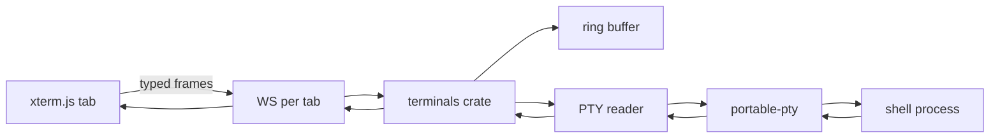

# Build the Workshop Terminals panel on a real PTY substrate, and give Bashkit to the agent rather than the user

Report type: analytical / recommendation. Audience: the PromptForge project lead and the Workshop maintainers. Decision served: how PromptForge Workshop should implement a VS Code-style Terminals panel, which shell substrate should sit behind it, and whether Bashkit belongs in the user's panel, in the agent's toolset, or in neither. Evidence: a read of the Workshop crates and SPA on 2026-09-19, a read of the Bashkit source tree at `bashkit/` (version 0.18.0), and four web surveys of existing terminal implementations run the same day. Web-sourced facts were verified by the surveying agents against GitHub, crates.io, npm, and vendor documentation on 2026-09-19; this report did not independently re-verify each one and marks them as web-sourced.

## Executive summary

Build the Terminals panel as a real pseudo-terminal (PTY) substrate: a new `workshop-terminals` feature crate spawns the user's shell in a PTY through `portable-pty`, streams bytes to an xterm.js panel in the bottom dock over one WebSocket per tab, and adopts the protocol that every mature web terminal converged on: typed binary frames, byte-count acknowledgement flow control, a sequence-numbered replay buffer, and two-tier grace timers. Do not put Bashkit behind the user's terminal. Do adopt Bashkit as the agent's sandboxed file shell through the `promptforge/bashkit` capability the runtime already names, with its git feature left off.

The codebase is closer to ready than expected. The layout reserves a `bottom` zone, the menu already lists the terminal commands as stubs, the `/agents/ws` socket is the streaming template, and the capability trait already declares `promptforge/bashkit` and `promptforge/terminal` as mutually exclusive filesystem realities. Nothing in `workshop-*` or `harness-*` spawns an interactive process today, so the PTY layer is greenfield, and the one shared-code change with real design weight is in the keybinding dispatcher, which currently swallows every registered chord before it can reach a terminal.

Bashkit fails as a user shell because it runs no processes and has no TTY model: `cargo build`, `vim`, `less`, real `git`, and mid-command input do not exist. Those same properties make it a strong agent tool: no sandbox escape, identical behavior on every platform, resource limits, static script analysis for approval prompts, and snapshotting for run records. Its git builtin is a ledger of commit messages with no content storage, so `checkout` moves nothing and `diff` returns a placeholder; it must not be presented to a model as git.

Confidence in the PTY recommendation is high: fourteen surveyed implementations agree on the architecture, and the pieces exist on crates.io and npm. Confidence in the Bashkit-for-agent recommendation is medium: the runtime is shaped for it, but the VFS adapter spike named in the 2026-09-11 VFS plan has not been found in the tree. The feasibility verdict is go for the panel and go for the agent capability, with the Bashkit git feature abandoned.

## Contents

1. Recommendation
2. Criteria the design was judged against
3. Where Workshop stands today
4. What fourteen existing implementations agree on
5. Bashkit fits the agent, not the user
6. Options and trade-offs
7. The recommended design in detail
8. Feasibility, risks, and alternatives set aside
9. Owner and next steps
10. References

## 1. Recommendation

Adopt three decisions together.

First, implement the Terminals panel as a real PTY substrate. A `workshop-terminals` crate in the feature tier owns shell processes spawned through `portable-pty` into pseudo-terminals, one reader thread per PTY, and serves `GET /terminals/{id}/ws` from the subsystem registry like every other Workshop feature. The SPA gains a `bottom` zone, a lazily loaded `ui/terminal/` feature directory hosting xterm.js 6.0, and a `terminal.contribution.ts` that replaces the existing stubs. Confidence high: the architecture is the one VS Code, Zellij, sshx, ttyd, Theia, and Coder independently arrived at, and the Rust and TypeScript components are published and maintained.

Second, do not build a Bashkit-backed terminal for the user, in v1 or later. A virtual shell that cannot run the user's toolchain fails the reason a developer opens a terminal, and the client-side line discipline it would need is work with no reuse. Confidence high: the limitation is structural, not a missing feature.

Third, give Bashkit to the agent as the `promptforge/bashkit` capability, feature-gated, with `default-features = false` and the `git` feature off, after the VFS adapter spike proves the `shared-vfs` trait subsumes Bashkit's `FileSystem`. Keep the real PTY substrate as the future backing for the `promptforge/terminal` capability, so the user's Terminals panel and the agent's terminal share one process-owning layer with different owners and lifecycles. Confidence medium: the trait surfaces on both sides are documented for this purpose, but the adapter has not been compiled.

## 2. Criteria the design was judged against

The options in section 6 were weighed against seven criteria, in order of importance.

Fidelity for developer work comes first. A terminal that cannot run `cargo test`, `git rebase -i`, or `vim` is not a terminal to the audience Workshop serves, and every other criterion is secondary to this one.

Conformance to the Workshop invariants comes second. `AGENTS.md` fixes the tier graph, the one-task-per-socket rule, registry-mediated subsystem discovery, the 500-line file ceiling, flat source directories, and the rule that serve paths never compile native dependencies. A design that fights these rules costs more than it saves.

Cross-platform parity comes third, and Windows is the hard case. ConPTY has documented startup, resize, and teardown traps that break naive implementations, and Workshop ships a Windows installer.

Survivability comes fourth: a webview reload or a socket blip should not destroy a running shell or its scrollback. The bar is VS Code's behavior, where the pty host outlives the window.

Responsiveness under flood comes fifth. A `yes` or a large `cat` must not freeze the panel or delay Ctrl+C, and xterm.js discards data past a hard 50 MB write buffer, so this is a correctness criterion, not polish.

Security posture comes sixth. The Workshop server is loopback-only with an origin guard on every WebSocket upgrade, and terminal children must start in granted workspace roots, never from a client-supplied path.

Effort comes last, measured as lines of new code and the number of foreign systems touched, and weighted below the others because a terminal is a long-lived feature whose first version sets its protocol.

## 3. Where Workshop stands today

Workshop already reserves the slot, names the commands, and provides the streaming template. What it lacks is any process-owning layer and a keybinding path that lets keys reach a raw input surface. Every claim in this section is from a direct read of the `promptforge/` tree on 2026-09-19.

### 3.1 The layout reserves a bottom zone and the menu lists terminal stubs

`crates/workshop/server/ui/src/ui/layout/zones.ts` line 4 states that `"bottom" is reserved for later`, and `ZONE_NAMES` in `services/zone-state-service.ts` line 18 is `["left", "main", "right"]`. Adding the zone means extending that array and adding a `rebuildPosition` case; the rest of the zone machinery (size retention, empty-group rebuild, `toggleZoneVisibility`) is zone-agnostic. Panels register through `registerPanelType({ type, defaultZone, load: () => import(...) })` in `services/panel-registry.ts`, and `build.mjs` runs esbuild with `splitting: true`, so a terminal panel lands in a lazy chunk without new bundler work. The `agent` panel is already multi-instance via `params.instance`, which is the shape a tab-per-terminal panel needs.

`ui/menu/stubs.contribution.ts` lines 83 and 181 to 192 define `workbench.action.terminal.toggleTerminal` (Ctrl+Backtick), `workbench.action.terminal.new` (Ctrl+Shift+Backtick), `workbench.action.terminal.split`, and eight task-runner rows, all with `precondition: "false"`, and `MenuId.MenubarTerminalMenu` exists in `services/menu-registry.ts` line 31. Implementing the feature means deleting those stubs and registering real actions in a `terminal.contribution.ts`.

### 3.2 The agent socket is the streaming template, and binary frames have a precedent

`crates/workshop/sessions/src/session.rs` shows the house pattern for a long-lived socket: the upgrade handler refuses a foreign `Origin` with the shared `cross_site` envelope, one task owns the socket in a single biased `select!` loop, and `send_frame` returns `false` when the client is gone. The crate's `## Invariants` block says "One task owns each socket: a single `select!` loop reads inbound frames and writes every outbound frame itself - no outbox channel, no writer task," and reads workspace roots "through the registry's `WorkspaceRoots` slot, never by naming the workspace crate." Both rules transfer directly to a terminal socket.

The `/ws` and `/agents/ws` sockets ignore binary frames (`session.rs` line 213), but `crates/workshop/server/src/routes/realtime.rs` relays both text and binary frames to the gateway, so a binary hot path is not new to the server.

### 3.3 Nothing spawns an interactive process, and the tier graph has a place for one

No crate under `workshop-*` or `harness-*` opens a PTY or streams a child's output. The only child spawn is the gateway sidecar in `crates/workshop/shell/src/gateway/boot.rs`, started with `std::process::Command`, stdio nulled, detached, and stopped through an authenticated discovery shutdown rather than a pipe. Terminal children are the opposite: attached, streamed, and owned, so they should not share that code.

`crates/build-xtask/src/tidy.rs` fixes the tiers: `workshop-protocol`, `workshop-registry`, `workshop-support` are vocabulary; `workshop-gateway`, `workshop-menu`, `workshop-status` are services; `workshop-sessions`, `workshop-user-state`, `workshop-workspace` are features; `workshop-server` is the shell. A `workshop-terminals` crate belongs in the feature list, depends only on vocabulary and service crates, and is registered from `server/src/app.rs` through `registry.register_routes` exactly as `workshop-user-state` is. The `WorkspaceRoots` trait at `crates/workshop/registry/src/traits.rs` line 243 supplies granted roots without a dependency on the workspace crate.

### 3.4 The keybinding dispatcher swallows every registered chord

This is the one shared-code change with design weight. `ui/layout/keybinding-dispatcher.ts` runs on document capture and, at line 173, calls `resolver.hasRuleForChord(chord)`; when any rule starts with the pressed chord, the dispatcher swallows the event even if the rule's `when` clause fails. `services/keybinding-resolver.ts` lines 9 to 12 document the intent: "the dispatcher uses it to decide whether to swallow a key whose rule is context-gated, so a claimed chord never falls through to CodeMirror or the webview default." With a terminal focused, Ctrl+C, Ctrl+V, Ctrl+A, Ctrl+W, and every other bound chord would never reach xterm.js. Section 7.5 gives the fix.

### 3.5 The runtime already names the two shell realities

`crates/promptforge-api-types/src/capabilities.rs` lines 295 to 300 document `Capability::conflicts` with one example: "bashkit and a terminal are two filesystem realities, and a context gets one or the other, never both." `crates/promptforge-api-runtime/tests/suite/prepare.rs` lines 599 to 608 exercise a prompt declaring `promptforge/bashkit` and `promptforge/terminal` and assert that preparation names both. `RunServices` holds `vfs: VfsRef` and `cancel: CancelHandle`, and `Contribution` holds `tools`, which is what a Bashkit capability needs. The 2026-09-11 VFS foundation plan (`promptforge/vibe/2026-09-11-3-vfs-foundation.md`) lists a `bashkit-adapter` spike whose deliverable is "evidence, not integration" and records that the workspace toolchain (stable 1.98) is compatible with Bashkit's 1.95 pin. `shared-vfs/src/host.rs` line 11 defers "Stage 2 hardening (the Bashkit RealFs resolver trio, symlink policies, Windows long paths and device names)." No adapter code exists in the tree; `2026-09-12-everruns-integration-paths.md` line 56 calls the spike "completed," which this report could not confirm and treats as unverified.

## 4. What fourteen existing implementations agree on

Four surveying agents examined fourteen web terminal implementations plus the xterm.js renderer landscape and the Rust PTY crate ecosystem. The independent designs agree on far more than they differ, which is the main reason the recommendation in section 1 has high confidence. Table 1 summarizes the projects most relevant to Workshop; all facts in it are web-sourced and were checked against the repositories on 2026-09-19.

| Project | Stack, license | Activity | Framing and multiplexing | Reattach and replay | Flow control |
|---|---|---|---|---|---|
| VS Code integrated terminal | TS, node-pty in a pty host utility process, MIT | active | Binary IPC over one management channel, RPC per terminal id | `@xterm/headless` plus serialize addon replay with `{cols, rows, data}`; 60 s and 6 s grace timers | Byte-count ack: pause above 100,000 unacked, resume below 5,000, ack every 5,000 |
| sshx | Rust axum plus tonic, Svelte, MIT | 7.7k stars, last commit 2025-06 | One WebSocket per session, shells by id, offset-tagged chunks | Rolling 2 MiB byte buffer with absolute sequence numbers; `Subscribe(id, from)` replays the gap | Bounded channels only |
| Zellij web client | Rust axum, xterm.js, MIT | 35.5k stars, active 2026-09 | Two sockets per client: raw bytes and JSON control | Server owns the emulator and re-renders on attach | None at the socket layer |
| ttyd | C, libwebsockets, MIT | 12.4k stars, active 2026-08 | Binary, 1-byte type prefix, one socket per terminal | None; process dies with socket | Client pause and resume from `term.write` callbacks |
| Theia | TS, node-pty, EPL-2.0 | active | JSON-RPC control plus a raw string channel per terminal | 1 MiB `MultiRingBuffer` replayed on every connect | None |
| Coder agent | Go, AGPL-3.0 | active | JSON requests in, raw bytes out, sessions keyed by reconnect UUID | 64 KiB ring, or `screen` when installed | None |
| terminado | Python, BSD-2 | maintenance, 2025-08 | JSON arrays in text frames | Deque of the last 1,000 raw reads | None |
| GoTTY fork | Go, MIT | 2.5k stars, 2026-05 | Text frames, base64 output | None | None |

Table 1. Eight of the fourteen surveyed web terminal implementations, ranked by relevance to Workshop. Source: web surveys of 2026-09-19 (see references); repository commit history and star counts as of that date.

### 4.1 Binary frames with a type prefix serve the hot path

ttyd, Zellij, Coder, and the small Rust `bastion-term` crate all put raw PTY bytes in binary frames and reserve JSON for rare control messages. The xterm.js maintainer's measurements, cited in xterm.js discussion #5098, put raw binary above 100 MB/s and JSON near 20 MB/s. GoTTY's base64 text output adds 33 percent to every byte, and terminado's JSON arrays pay serialization on the hottest path in the system. Workshop should follow ttyd's one-byte prefix.

### 4.2 One ordered channel per terminal prevents reordering

Gitpod's supervisor exposed `Write` and `SetSize` as separate unary RPCs and shipped an out-of-order typing bug under latency, fixed in gitpod-io/gitpod PR #4560 by queueing on the client. Every project that puts input and resize on one ordered socket avoided the class. One socket per tab is the simplest form and matches how Workshop already gives each agent panel its own `/agents/ws`.

### 4.3 Flow control is a correctness requirement

xterm.js's `WriteBuffer` throws "write data discarded" past a hard 50 MB watermark, and its parse throughput of 5 to 35 MB/s is far below what a PTY can produce. VS Code's scheme, in `src/vs/platform/terminal/common/terminal.ts` as `FlowControlConstants`, pauses the PTY read above 100,000 unacknowledged characters, resumes below 5,000, and acks every 5,000 from the renderer after xterm has parsed the data. ttyd's alternative counts pending `term.write` callbacks and sends explicit pause and resume frames. Both ends must count the same unit; xterm.js discussion #5098 records a permanent stall when one side counted bytes and the other UTF-16 characters. Bounded channels alone, as in sshx, stall the producer but do nothing for a renderer already holding megabytes.

### 4.4 Reattach has three tiers, and the cheapest one is enough to start

The first tier is a raw ring buffer with absolute sequence numbers (sshx, Theia, Coder, bastion-term). The client sends the last sequence it saw and receives only the gap; a fresh webview replays from zero. This is roughly 200 lines and needs no emulator, at the cost that a replay may start mid-escape-sequence, which a `term.reset()` before replay tolerates. The second tier feeds the same bytes into a headless emulator and serializes a snapshot on attach (VS Code with `@xterm/headless`, `ht` with the `avt` crate, `kanna` with libghostty-vt), which bounds replay size and fixes dimension mismatches. The third tier makes the server the emulator (Zellij, wezterm mux). VS Code's replay contract applies at every tier: send `{cols, rows}` first, force xterm to those dimensions, write, await the write callback, then fit to the container.

### 4.5 Grace timers need two tiers, and children need explicit reaping

VS Code keeps a detached terminal alive for `GraceTime = 60000` ms, shortened to `ShortGraceTime = 6000` ms once a replacement client attaches, in `platform/terminal/common/terminal.ts`. A single long timer accumulates orphans during reconnect storms. On Windows, `ClosePseudoConsole` deadlocks unless the output pipe is drained on another thread (microsoft/terminal issue #1810), and the symptom is orphaned `conhost.exe` processes that outlive the app.

### 4.6 Keybindings route through a skip list, not a pass list

VS Code's `terminalInstance.ts` installs `xterm.raw.attachCustomKeyEventHandler`, runs the keybinding service's `softDispatch` on each key, and returns `false` only when the resolved command is in `terminal.integrated.commandsToSkipShell`, the key is Meta-modified, or it starts a chord; everything else, including Ctrl+C, reaches the shell. Theia does the same and additionally registers a passthrough pseudo-command for `ctrl+c` under `terminalFocus` (eclipse-theia/theia PR #13564) so its keybinding registry does not intercept it. Theia's need for that workaround is the same problem Workshop's dispatcher has in section 3.4.

### 4.7 Cursor's panel is stock VS Code; its agent shell is a separate path

Cursor's interactive Terminals panel is VS Code's, unchanged in architecture. Its agent runs commands through a different channel: Cursor staff described on the community forum (2026-03-13) an initialization phase that starts the configured profile, sources the rc file, and captures a shell-state snapshot, followed by per-command non-interactive execution with the snapshot restored. Background commands surface as read-only `∞ Cursor (command…)` rows in the same panel, and output goes to per-command record files the agent reads back. In Auto-review and Allowlist run modes the command runs under a sandbox helper that does not exist on Windows, which the forum thread on "no exit status" attributes as the cause of that bug. The separation of a human-owned PTY from an agent-owned, capturable, sandboxable execution channel, shown in one panel, is the same distinction the PromptForge capability trait already draws.

## 5. Bashkit fits the agent, not the user

Bashkit (everruns/bashkit, MIT, version 0.18.0 at `bashkit/Cargo.toml`) is an in-process bash interpreter with a virtual filesystem. Its README states the design: "All 167 commands reimplemented in Rust, no `fork`/`exec`," "No process spawning, no filesystem access, no network access unless explicitly enabled." The same property decides both questions this section answers. Table 2 scores the two roles against what a read of `bashkit/crates/bashkit/src` found.

| Property (source) | As the user's terminal | As the agent's shell |
|---|---|---|
| No processes: cannot run `cargo`, `npm`, host `git`, `ssh` (README security table) | Disqualifying for developer work | Desirable: no sandbox escape, identical on every OS |
| Command-at-a-time `exec_streaming(&mut self, script, callback)`; chunks at command boundaries (`lib.rs`, `interpreter/mod.rs`) | Needs a client-side readline, prompt, and history | Matches the tool-call shape exactly |
| Fixed stdin per exec; `read -p` and passwords do not work (`builtins/read.rs`) | Breaks interactive programs | Irrelevant to a tool call |
| No TTY model: `less` acts as `cat`, `watch` runs once, `ls --color` emits no color (`builtins/inspect.rs`, `builtins/ls`) | Visible fidelity gap | Irrelevant |
| Cooperative cancel via `cancellation_token() -> Arc<AtomicBool>` at command boundaries | Ctrl+C works for shell loops only | Maps onto `RunServices.cancel` |
| `ExecutionLimits`: commands, loop iterations, output 1 MiB, FS size, parser fuel (README) | Annoying caps for a human | Bounds a runaway model without a watchdog |
| `analyze()` reports command names, redirects, `is_opaque()` before running (README) | No use | Drives Ask/Plan/Agent approval before execution |
| `snapshot()` / `from_snapshot()` serialize shell state and VFS (README) | Survives restarts, a real plus | A run-record artifact: the filesystem the model saw at step N |
| Custom `FileSystem` backends; `realfs` mounts host dirs with containment (`fs/backend.rs`, `fs/realfs.rs`) | Sees the workspace | `shared-vfs` can back it, per the VFS plan |
| Eval: 58 tasks, Opus 4.8 and Haiku 4.5 at 95 percent, GPT-5.3-Codex 93, GPT-5.5 88, Sonnet 4.6 84 (README, run 2026-06-27) | Not applicable | Production evidence that models use it well |

Table 2. Bashkit's properties scored against the two roles under consideration. Sources: `bashkit/README.md`, `bashkit/crates/bashkit/Cargo.toml`, and the Bashkit source survey of 2026-09-19.

### 5.1 As a user terminal, the gaps are structural

A user who opens a terminal in an agentic development environment wants their toolchain. Bashkit cannot provide it, and no feature roadmap changes that: the absence of `fork`/`exec` is the product's security thesis, not a gap. The remaining pieces a REPL needs (PS1 expansion, multi-line detection, history, tab completion) live only in `bashkit-cli/src/interactive.rs` on top of rustyline, so Workshop would reimplement them in TypeScript for a shell that still could not run `cargo`. A hybrid panel offering a `sandbox` profile beside the `system` profile was considered and set aside; section 8.3 records why.

### 5.2 As an agent shell, the runtime is already shaped for it

The capability contract in section 3.5 needs three things from a Bashkit capability: build the interpreter over `RunServices.vfs`, wire `RunServices.cancel` to the cancellation flag, and contribute one tool under `promptforge/bashkit/run`. `shared-vfs`'s `Vfs` trait (`shared-vfs/src/router.rs` lines 190 to 281) exposes `read`, `read_range`, `write`, `append`, `remove`, `exists`, `glob`, `list`, `stat`, `mkdir`, `rename`, `copy`, `str_replace`, and `grep`, which covers Bashkit's `FileSystem` needs with `symlink` and `chmod` returning Bashkit's unsupported error. Bashkit's `realfs` feature is unnecessary, because host directories arrive through `shared-vfs`'s `HostBackend::rooted`, keeping containment in one place.

Dependency weight is manageable. `bashkit/crates/bashkit/Cargo.toml` line 147 sets `default = ["bash_tool", "ring", "tzdata"]`; the `tzdata` comment at lines 151 to 154 calls chrono-tz "by far the largest single artifact in the tree (an 18.6 MB rlib)," and `bash_tool` pulls `tower`. With `default-features = false` plus `jq`, the graph is tokio, regex, chrono, serde, flate2, bzip2, clap, and the checksum crates, all permissive. Everruns ships this in production as `everruns-integrations-bashkit` 0.18.5 (`everruns/integrations/bashkit/Cargo.toml`).

The gate is the adapter spike. `Bash` requires an async `FileSystem`; `shared-vfs` is sync by design, so the adapter runs sync calls inside `async fn` for the memory backend and through `spawn_blocking` for the host backend, matching how the VFS plan already routes store operations. Until the spike compiles and an `ls | grep | cat` script runs over a mounted memory and host backend, the capability estimate in section 8 stays at medium confidence.

### 5.3 Bashkit's git is a facade and must stay off

The `git` feature is `git = []` at `Cargo.toml` line 214: it adds no dependency because there is no git implementation behind it. `bashkit/crates/bashkit/src/builtins/git/client.rs` stores commits as pipe-separated metadata lines in `.git/commits`; `commit()` at line 422 derives the hash as `format!("{:08x}", timestamp as u32 ^ 0xdeadbeef)`, eight hex digits from the clock, so two commits in one second collide. `checkout()` at lines 1216 to 1257 writes `HEAD` and touches no working-tree file. `diff()` at line 1278 returns the literal `# Diff output (simplified in virtual mode)`. The restore path at line 1581 comments "Since we don't store per-commit snapshots, this is a no-op message." `clone`, `fetch`, `push`, and `pull` (lines 858 to 968) validate the URL against an HTTPS allowlist and return "network operations not supported in virtual mode." `docs/git.md` line 42 lists `merge`, `rebase`, and `stash` as not implemented, and the design doc describes the storage as "foundation for future gitoxide (gix) integration."

A model that runs `git checkout main` and sees no file change, or `git diff` and gets a placeholder, will act on a false picture of the repository. That is worse than the command being absent, because the tool contract asserts the command exists. Leave the feature off. When an agent needs repository operations, that is a `promptforge/terminal` prompt today and possibly a `gix`-backed structured capability later.

## 6. Options and trade-offs

Six options were considered, including the do-nothing option. Table 3 scores them against the section 2 criteria.

| Option | Fidelity | Invariant fit | Windows | Survivability | Flood | Security | Effort |
|---|---|---|---|---|---|---|---|
| A. Real PTY panel over WebSocket (recommended) | full | high | ConPTY traps, known fixes | ring replay, grace timers | ack flow control | origin guard, granted roots | medium-high |
| B. Bashkit virtual terminal for the user | none for toolchain | high | identical everywhere | snapshot | per-command caps | strongest | medium |
| C. Hybrid panel: system and sandbox profiles | full plus sandbox | high | as A | as A plus snapshot | as A | as A | highest |
| D. Client-side `@everruns/bashkit-wasm` | none, no workspace access | n/a, no server code | identical | dies with page | n/a | strongest | low |
| E. Real PTY over Tauri IPC channels | full | low: bypasses the server and registry | as A | none without a daemon | needs coalescing and acks anyway | Tauri capability grants | medium |
| F. Do nothing: keep the stubs | none | n/a | n/a | n/a | n/a | n/a | zero |

Table 3. Six options scored against the seven criteria of section 2. Sources: sections 3 to 5 and the surveys of 2026-09-19.

**Option A wins on the first criterion and ties or wins on the rest.** Its costs are the ConPTY traps, which every surveyed Windows-capable project hit and documented fixes for, and the keybinding dispatcher change, which is a general improvement rather than a terminal special case. Its survivability at tier one (ring replay) matches Theia and Coder and can grow to VS Code's tier two without protocol change.

**Option B fails the first criterion outright.** It would also require a TypeScript readline, prompt painter, and history that exist nowhere else in the SPA. Its genuine strengths, snapshotting and platform parity, are the strengths of an agent tool, which is where section 5 sends it.

**Option C was the pre-survey front-runner and is set aside for v1.** Two execution models behind one panel doubles the wire protocol and the client, and the sandbox profile serves no user need the agent-facing capability does not serve better. It remains available if a future product need for a human-driven sandbox appears.

**Option D is a demo, not a product.** The WASM build has no `realfs` and cannot see the workspace; its VFS dies with the page.

**Option E trades the server for Tauri IPC.** Terax, runhq, and paneflow prove it works, but Tauri's channel path delivers payloads under 1,024 bytes via `eval` and larger ones through a fetch round trip, so every serious implementation coalesces at 4 to 8 ms anyway, and the terminal would bypass the registry, the origin guard, and the one-task-per-socket pattern that the rest of Workshop uses. It also forecloses the future browser-client case, since the panel would only work inside the Tauri shell.

**Option F leaves the stubs as they are.** It is the right choice only if a terminal is not a product pillar. The `AGENTS.md` description of Workshop as "a user-facing agentic development environment" and the presence of the stubs suggest it is.

## 7. The recommended design in detail

Figure 1 shows the data path for one terminal tab. Each layer is described below.

Figure 1. One terminal tab: xterm.js in the bottom zone, one WebSocket of typed binary frames, the `workshop-terminals` crate owning a ring buffer and a blocking reader thread per PTY, and the shell as a child of the Workshop server.

### 7.1 Server: a feature-tier `workshop-terminals` crate

Create `crates/workshop/terminals/` with `cargo xtask new-crate`, add it to the `FEATURES` list in `build-xtask/src/tidy.rs`, to the root `Cargo.toml` members and `[workspace.dependencies]`, and regenerate hakari. Dependencies: `axum`, `tokio`, `portable-pty` 0.9.0, `workshop-protocol`, `workshop-registry`, `workshop-support`, `workspace-hack`. Register from `server/src/app.rs` through `registry.register_routes` as `workshop-user-state` does. The `## Invariants` block should state that this is the only crate in the family that spawns user processes, that it spawns only from a server-side profile table, only in a granted root read through the `WorkspaceRoots` registry slot, and that every child is reaped on server teardown.

Lifecycle runs over HTTP: `POST /terminals {profile, cwd, cols, rows}` returns `{id}`; `GET /terminals` lists `{id, title, cwd, pid, alive}` for tab restore; `DELETE /terminals/{id}` kills. The stream runs over `GET /terminals/{id}/ws?since={seq}` with the same origin check as `sessions`. Each PTY has a dedicated blocking reader thread pushing into a bounded `tokio::sync::mpsc`, a coalescing flush at 5 ms or 4 KiB, and a ring of raw bytes (256 KiB to 1 MiB) with a base offset. One task owns each socket in a `select!` loop, per the sessions invariant.

The profile table is fixed server-side in v1: on Windows `pwsh` if present, else `powershell`, else `%COMSPEC%`; elsewhere `$SHELL`, else `/bin/sh`. The client names a profile, never a path. A `terminal_settings` user-state key for a preferred profile is a later addition and requires the `USER_STATE_KEYS` allow-list in `user-state/src/store.rs` to change first.

### 7.2 Wire protocol: typed binary frames

Client to server frames start with a one-byte type: `0x00` input (raw bytes from xterm `onData` and `onBinary`), `0x01` resize (`u16 cols, u16 rows`), `0x02` ack (`u32 bytes`), `0x03` ping. Server to client: `0x00` output (`u64 seq` plus raw bytes), `0x01` title, `0x02` exit (`i32 code`), `0x03` replay-begin and `0x04` replay-end bracketing a ring replay, `0x05` gap (`u64 from, u64 to`) when `since` predates the ring, `0x06` pong. Frame structs and their TypeScript twins live in `workshop-protocol` and `services/protocol.ts`, following the agent frames.

Flow control follows VS Code: the server stops reading the PTY when unacknowledged bytes exceed 100,000 and resumes below 5,000; the client acks every 4 to 8 KiB from the `term.write` callback. Both sides count wire bytes. Replay resets the counter. On socket loss the server starts a 60 s timer, shortened to 6 s when another client attaches to the same terminal, then kills the child.

### 7.3 Windows: design the ConPTY traps in from day one

`portable-pty` 0.9 sets `PSEUDOCONSOLE_INHERIT_CURSOR`, so ConPTY emits `ESC[6n` at startup and blocks the child until it receives `ESC[row;colR`; xterm.js answers once attached, but a detached or test session must write `ESC[1;1R` itself. Teardown order is stop writer, drain reader, drop master, to avoid the `ClosePseudoConsole` deadlock. Resize goes through `MasterPty::resize`, never through a `CSI 8;h;w t` written to the input pipe. Do not bundle `conpty.dll`; Zed issue #61819 reports the bundled DLL 40 times slower than the system one. Set xterm's `windowsPty: { backend: 'conpty', buildNumber }` so its wrapping heuristics match.

### 7.4 SPA: a `bottom` zone and a lazy `ui/terminal/` feature

Extend `ZONE_NAMES` with `"bottom"`, add its `rebuildPosition`, default it hidden, and bind `toggleZoneVisibility("bottom")` to Ctrl+Backtick. Register a `terminal` panel type with `defaultZone: "bottom"`, multi-instance via `params.instance`, loaded through `import("../ui/terminal/index")`. The feature directory holds `index.ts` (only `register()`), `terminal.contribution.ts` (eager; replaces the stubs), `terminal-panel.ts` (a `WorkshopPart` creating xterm, the fit addon, and a debounced `ResizeObserver`), `terminal-socket.ts` (connect, reconnect with `since`, ack accounting), and `terminal-panel.css` beside it using `--code-font` and `--ws-*` tokens. Dockview's tab strip provides the tabs; split terminals are a later addition.

Use xterm.js 6.0.0 pinned exactly, with fit, web-links, search, serialize, and unicode11, `allowProposedApi: true`, and the DOM renderer as default. The WebGL addon has an open glyph-atlas corruption bug (xterm.js issue #5847) first reported on Tauri's WKWebView; offer it as opt-in with `onContextLoss` falling back to DOM. Bundle cost is about 107 KB gzipped without WebGL and 138 KB with it, web-sourced from bundlephobia. Read theme colors from `--ws-*` computed styles into xterm's `ITheme` at mount and on theme change, since xterm does not read CSS variables.

Tauri-specific fixes, all web-sourced: install a macOS Edit menu with predefined copy, paste, and select-all items or Cmd+C/V are dead in WKWebView (tauri issues #2397, #9159, #11422); route clipboard through `tauri-plugin-clipboard-manager` because `navigator.clipboard.readText()` rejects in WKWebView; call `term.focus()` on container mousedown via a microtask.

### 7.5 Keybindings: a `terminalFocus` mode in the dispatcher

Add a `terminalFocus` context key set by the panel. Teach `keybinding-dispatcher.ts` that when it is true, only rules whose `when` names `terminalFocus` are eligible, and an unmatched chord falls through instead of being swallowed. Register the app chords a terminal must not eat (Ctrl+Shift+P, F1, Ctrl+Backtick, Ctrl+Shift+Backtick, tab switching) plus Ctrl+Shift+C and Ctrl+Shift+V for copy and paste as `terminalFocus` rules, and keep a user-editable skip list in the shape of `commandsToSkipShell`. This is a general "raw input surface" mechanism rather than a terminal special case, which is the shape `AGENTS.md` prefers: "an improvement that serves a problem class beyond the current case." The alternative, enumerating passthrough rules for every chord a shell needs, is Theia's workaround and grows with every new binding.

### 7.6 The agent capability shares the substrate later

The `promptforge/terminal` capability, when built, should construct its PTY through the same `workshop-terminals` substrate (or a harness-owned copy of its process layer, since `harness-*` may not depend on workshop crates), with the agent as owner and per-command capture as the lifecycle, and surface its sessions as read-only rows in the same panel. That is Cursor's split, and it is what the conflict rule in the capability trait anticipates.

## 8. Feasibility, risks, and alternatives set aside

### 8.1 Feasibility scores go, with one modification

Table 4 scores the recommendation on the standard feasibility dimensions.

| Dimension | Panel (option A) | Agent Bashkit capability | Basis |
|---|---|---|---|
| Technical | go | go, pending spike | Every component is published and used in production by at least one surveyed project; the adapter is the one uncompiled piece |
| Economic | go | go | New dependencies are MIT or Apache-2.0 and pure Rust or ESM; no runtime licence cost; `cargo deny` expected to pass with `default-features = false` |
| Legal | go | go | `portable-pty` (MIT), xterm.js (MIT), Bashkit (MIT); no GPL code enters the tree |
| Operational | modify | go | The serve path spawns user processes for the first time; the crate's invariants must name the boundary, and Windows reaping must be tested in CI |
| Scheduling | go | go after the VFS spike | The panel has no dependency on runtime work; the capability waits on the adapter |

Table 4. Feasibility of the two recommendations on five dimensions. Verdict: go for both, with the operational modification that the process boundary is written into the terminals crate's invariants and tested.

Effort, at low confidence because no Workshop feature of this shape has been built before: the server crate with PTY, protocol, ring, and flow control is on the order of 1,500 to 2,500 lines of Rust across several files under the 500-line ceiling; the SPA feature is on the order of 800 to 1,200 lines of TypeScript plus CSS; the dispatcher and zone changes are under 200 lines each. The Bashkit adapter and capability are a few hundred lines once the spike proves the trait mapping.

### 8.2 Risks and their protections

The ConPTY traps of section 7.3 are the most likely source of a shipped bug. Likelihood of hitting at least one during development: almost certain, since every surveyed Windows project did. Protection: write the DSR answer, the teardown order, and the resize path into the first commit, and add a Windows CI test that spawns `cmd /c echo`, reads the output, drops the session, and asserts no `conhost.exe` child survives. Confidence high that these protections suffice, because the fixes are documented in wezterm, microsoft/terminal, and node-pty issues.

xterm.js has a bus factor of one and has been shipping 6.1 betas for nine months without a stable release; VS Code consumes the betas. Likelihood that Workshop needs a beta-only fix within a year: roughly even chance. Protection: pin the exact version, keep the xterm.js API as the internal boundary so `ghostty-web` (which mirrors it) is a future swap, and default to the DOM renderer.

The dispatcher change touches every keybinding in the app. Likelihood of a regression in a non-terminal panel: unlikely if the change is gated on `terminalFocus` being true. Protection: behavior tests that assert existing chords still dispatch when no terminal is focused.

The Bashkit adapter may expose a semantic mismatch, for example in path canonicalization or in `str_replace` anchor rules. Likelihood: unlikely for the memory backend, roughly even for the host backend given the deferred Stage 2 hardening in `shared-vfs/src/host.rs`. Protection: the spike is scoped as evidence, and a mapping failure there is the spike working as intended.

Bashkit's git facade could be enabled by accident through feature unification. Likelihood: unlikely with `default-features = false` and no `git` in the feature list. Protection: a test asserting `git` is not in the capability's command list.

### 8.3 Alternatives set aside

The hybrid panel (option C) was the earlier front-runner in conversation and was demoted because a human-driven sandbox shell answers no user need that the agent-facing capability does not answer better, and it doubles the client. Confidence medium; a product need for human-driven sandboxed exploration could revive it.

A headless emulator on the server (VS Code's tier two) was deferred, not rejected. The `avt` 0.18.0 and `vt100` 0.16.2 crates are candidates; keep the emulator off the hot path when added.

A Node sidecar running `@xterm/headless` for exact replay fidelity was rejected: it costs a runtime and a process in a product whose footprint argument is the Tauri shell.

Bundling `conpty.dll` to escape system ConPTY variance was rejected on Zed's reported 40x slowdown.

Bashkit's `realfs` feature for the agent was rejected in favor of `shared-vfs`'s `HostBackend::rooted`, so containment has one implementation.

### 8.4 Limitations of this assessment

No code was compiled and no prototype was run. Web-sourced facts (star counts, version dates, issue numbers, bundle sizes) were verified by the surveying agents on 2026-09-19 and not re-verified for this report. The effort figures are order-of-magnitude judgments, not estimates from comparable Workshop work. The claim in `2026-09-12-everruns-integration-paths.md` that the Bashkit adapter spike is complete could not be confirmed against the tree and is treated as unverified.

## 9. Owner and next steps

The owner is the project lead, with the Workshop maintainers as implementers. The next steps, in order, each shippable on its own:

1. Write a vibe plan for the `workshop-terminals` crate and the `bottom` zone, in the format of `promptforge/vibe/2026-09-18-*.md`, covering the protocol frames, the profile table, the ConPTY protections, and behavior tests (echo round trip, streamed loop ordering, cancel during `sleep`, cwd containment refusal, origin refusal, ring replay from a mid-stream `since`, Windows child reaping).
2. Land the dispatcher `terminalFocus` change and the `bottom` zone independently, each with tests, before the panel depends on them.
3. Land the `ui/terminal/` feature, delete the terminal stubs from `stubs.contribution.ts`, and add xterm.js 6.0.0 pinned exactly to `crates/workshop/server/ui/package.json`.
4. Run the Bashkit adapter spike from the 2026-09-11 VFS plan and record the result in `promptforge-design/research/`; on success, plan the `promptforge/bashkit` capability with `default-features = false`, `jq`, and no `git`.
5. Defer the headless-emulator replay tier, split terminals, and the `promptforge/terminal` capability's shared substrate to follow-on plans.

## 10. References

Codebase reads, 2026-09-19, all under `c:\Users\Vinnie\cursor\`:

- `promptforge/AGENTS.md` (principles, structure, tier rules, verification).
- `promptforge/crates/workshop/server/ui/src/ui/layout/zones.ts`, `services/zone-state-service.ts`, `services/panel-registry.ts`, `ui/layout/keybinding-dispatcher.ts`, `services/keybinding-resolver.ts`, `ui/menu/stubs.contribution.ts`, `services/menu-registry.ts`, `build.mjs`, `package.json`.
- `promptforge/crates/workshop/sessions/src/lib.rs` and `src/session.rs`; `crates/workshop/registry/src/traits.rs`; `crates/workshop/user-state/src/store.rs`; `crates/workshop/server/src/app.rs` and `src/routes/realtime.rs`; `crates/workshop/shell/src/gateway/boot.rs`; `crates/build-xtask/src/tidy.rs`.
- `promptforge/crates/promptforge-api-types/src/capabilities.rs`; `crates/promptforge-api-runtime/tests/suite/prepare.rs`; `crates/shared-vfs/src/router.rs` and `src/host.rs`; `promptforge/vibe/2026-09-11-3-vfs-foundation.md`.
- `bashkit/README.md`, `bashkit/crates/bashkit/Cargo.toml`, `bashkit/crates/bashkit/src/builtins/git/client.rs`, `bashkit/docs/git.md`, `bashkit/knowledge/integrations/git-support.md`; `everruns/integrations/bashkit/README.md`.
- `promptforge-design/research/2026-09-12-everruns-integration-paths.md`; `promptforge-design/research/2026-09-19-capabilities-promptforge-bashkit.md`.

Web sources, verified by the surveying agents on 2026-09-19 (quality: primary repositories and vendor documentation unless noted):

- VS Code: `src/vs/platform/terminal/common/terminal.ts` (FlowControlConstants, grace times), `platform/terminal/node/terminalProcess.ts`, `node/ptyService.ts`, `node/ptyHostService.ts`, `workbench/contrib/terminal/browser/terminalInstance.ts`, `common/xterm/shellIntegrationAddon.ts`, at https://github.com/microsoft/vscode; persistent-session PR https://github.com/microsoft/vscode/pull/129207.
- sshx: https://github.com/ekzhang/sshx, `crates/sshx-server/src/session.rs` and `src/web/protocol.rs`.
- Zellij web client: https://github.com/zellij-org/zellij, `zellij-client/src/web_client/`; design write-up https://poor.dev/blog/building-zellij-web-terminal/.
- ttyd: https://github.com/tsl0922/ttyd, `src/protocol.c`, `src/server.h`; issue #1501.
- Theia: https://github.com/eclipse-theia/theia, `packages/terminal`, `packages/process`; PR #13564.
- Coder agent: https://github.com/coder/coder, `agent/reconnectingpty/`; Gitpod PR https://github.com/gitpod-io/gitpod/pull/4560.
- terminado: https://github.com/jupyter/terminado; GoTTY fork: https://github.com/sorenisanerd/gotty; ht: https://github.com/andyk/ht; kanna: https://github.com/jemdiggity/kanna; bastion-term: https://docs.rs/crate/bastion-term.
- Tauri terminal references: Terax https://github.com/crynta/terax-ai; runhq https://github.com/erdembas/runhq; paneflow https://github.com/ArthurDEV44/paneflow; tauri-plugin-pty https://github.com/Tnze/tauri-plugin-pty; Tauri channel internals https://docs.rs/tauri/latest/src/tauri/ipc/channel.rs.html.
- Rust crates: portable-pty 0.9.0 https://crates.io/crates/portable-pty; avt 0.18.0 https://docs.rs/avt; vt100 0.16.2 https://docs.rs/vt100. ConPTY issues: microsoft/terminal #1810; Zed #61819; wezterm #6783.
- xterm.js: releases https://github.com/xtermjs/xterm.js/releases; flow control guide https://xtermjs.org/docs/guides/flowcontrol/; issues #5847 (WebGL atlas), #2077 (discard watermark), discussion #5098 (throughput, unit mismatch); `src/common/input/WriteBuffer.ts`.
- Tauri webview issues: tauri-apps/tauri #2397, #9159, #11422.
- Cursor: https://cursor.com/docs/agent/tools/terminal; https://cursor.com/docs/agent/security/run-modes; forum staff replies at https://forum.cursor.com/t/cursor-terminal-documentation-missing-non-interactive-agent-shell-configuration-guidance/151935 (quality: vendor staff on a community forum) and the Windows "no exit status" thread at https://forum.cursor.com/t/163565.

---

*2026-09-20 04:45 - claude-fable-5.1 (Cursor agent). Drafted against tools-public/rulebooks/reports-rulebook.md as an analytical / recommendation report and audited against its section 6 checklist before filing.*
