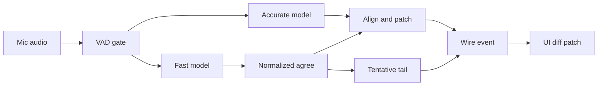

# PromptForge: How to Build Real-Time Two-Model Speech-to-Text

Report type: evaluation / review. It judges PromptForge's real-time speech-to-text (the gateway pipeline, the whisper.cpp engine, and the workshop client) against 6 open-source codebases plus a wide sweep of papers, vendor APIs, model cards, parameter threads, and unrelated software that solved the same "fast guess, slow correction" problem, and prescribes ideas to adopt, in payoff order.

## Executive summary

The two-model structure is ahead of every project we found, but the rule that decides which words lock, the way the accurate model's text lands, and the way the UI draws the result are all behind what the field already does with small, proven pieces of logic.

PromptForge already has a fast `base.en` pass, a slower `small.en` pass, and a wire event that exposes `finalized`, `agreed`, and `tentative` text with a revision number. None of the six reference projects runs a real fast-model plus accurate-model pair with that three-way split. The weak points are in how it uses that structure: the agreed prefix is an exact token match of two passes (so a flipped comma blocks a commit), the final text overwrites what the user already saw, every 500 ms tick re-decodes the whole window with default whisper settings, and the editor throws the split away and rewrites the whole range each time. The top two findings fix the commit rule and the reconciliation rule, and they are plain logic with no new model.

### Key findings

1. **Commit words by normalized agreement, an evidence count, and a monotonic frontier, as RealtimeSTT, whisper_streaming, and transcribe.cpp do.** Compare with case and punctuation stripped, lock a word only after 2 agreeing observations spanning about 0.6 s, and never let the agreed text shrink. Confidence: high, 8 independent sources agree.
2. **Reconcile the accurate pass by word alignment and keep a bounded fast suffix after it, as RealtimeSTT's merge and the Partial Rewriting paper do.** The final text replaces only the words that differ, and the fast model's newer words stay visible after it. Confidence: medium, strong support but unmeasured on this stack.
3. **Cut interim decode cost with `audio_ctx`, no temperature fallback, and a token cap.** One whisper.cpp report shows `base.en` going from 204 s to 60 s with no WER loss. Confidence: high for `audio_ctx` and the fallback, medium for the rest.
4. **Turn on token timestamps, trim the interim window at the last agreed word, and force-commit the tail when it trims, as whisper_streaming and WhisperLiveKit do.** This makes the 15 s window setting real and shrinks per-tick work. Confidence: medium, timestamp accuracy on `base.en` is unmeasured.
5. **Give the wire change flags, a revision guard, and range identity, as transcribe.cpp, sherpa-onnx, and the vendor APIs do.** Bump the revision only on a real change and add a finalized watermark. Confidence: medium-high.
6. **Render the structure the wire already sends: minimal-diff patches, a styled tentative tail, a revision guard, and one undo step.** Confidence: high for the patch and the styling, medium for the rest.
7. **Replace the fixed RMS gate and 2 s close with the field's endpointing: short silence plus a content check, pre-roll, and then Silero.** Confidence: high for direction, medium for numbers on this hardware.
8. **Seed the interim pass with finalized text that has left the window, as whisper_streaming does.** Confidence: low-medium, needs an A/B test because prompts can be re-emitted.
9. **Add post-decode hallucination guards (no-speech and log-probability veto, loop collapse).** Confidence: medium-high.
10. **Degrade instead of failing the take under load, using coalescing queues, admission control, and the already-accepted interim text.** Confidence: medium.
11. **Build a replay harness with instability metrics before changing anything else.** Confidence: high, 7 sources, and it gates every other step.
12. **Prototype a streaming-native fast model (Moonshine Streaming Small) behind the existing role split.** Confidence: low-medium, CPU streaming speed on this stack is unmeasured.
13. **Look at Whisper-internal re-encode avoidance (AlignAtt, speculative prefill) only after the cheaper steps.** Confidence: low, needs FFI access nobody has confirmed.
14. **Size the render hold-back and the evidence span from observed revision depth.** Confidence: low-medium, analogy-led.

The target pipeline the top findings add up to:

## Method

The subject was profiled first through nine lenses over the gateway STT crates, the pipeline config, the whisper FFI parameters, and the workshop client's STT files, producing 8 named deficits and 5 strengths. Eight research lanes then ran in parallel with no restriction on language or domain: repositories, papers, Hugging Face models, whisper parameter tuning, text-merge algorithms, vendor APIs and engineering threads, unrelated software, and UI rendering. Six repositories were deep-dived at pinned commits, each cited idiom got a provenance tag with a pre-AI comparison where AI markers appeared, and the idioms were clustered by convergence and mapped onto the deficits. Citations were checked against the pinned clones (60 of 64 passed first time, the rest corrected) and against the source URLs (41 of 46 passed first time, the rest corrected or softened; 16 lower-priority URLs were only confirmed to resolve). No cap was applied to the number of findings.

## Reference projects and provenance

| Reference | Popularity | Why chosen | License | Provenance of cited idioms |
|---|---|---|---|---|
| [RealtimeSTT](https://github.com/KoljaB/RealtimeSTT) | 10,162 stars | Closest technique: two concurrent streams, slow authoritative, fast adds a bounded tail, evidence-count stabilizer | MIT | 14 files, all `unknown` (no AI markers, bulk commits, agent files gitignored) |
| [franken_whisper](https://github.com/Referralconsequently/franken_whisper) | none usable (very young) | Speculate-then-verify protocol, same language as the subject | MIT with a non-standard OpenAI/Anthropic rider | 10 files, all `explicit AI marker` (132 of 133 commits), AI-originated, no pre-AI form |
| [whisper_streaming](https://github.com/ufal/whisper_streaming) | 3,673 stars | Reference LocalAgreement-2, small enough to read whole (966 lines) | MIT | 3 files, all `unknown` (no AI markers in 143 commits) |
| [transcribe.cpp](https://github.com/handy-computer/transcribe.cpp) | 1,989 stars | Append-only committed text plus volatile tentative tail, commit policies, change flags | MIT | 6 files `explicit AI marker` (mechanism already present before the first marked commit, HEAD tightened), 1 `strong human signal` |
| [Handy](https://github.com/cjpais/Handy) (consumer of transcribe.cpp) | not recorded | Shows the streaming API driving a real overlay | MIT | `transcription.rs` `explicit AI marker` (file was batch-only before, so no pre-AI form of the stream code), overlay files `unknown` |
| [WhisperLiveKit](https://github.com/QuentinFuxa/WhisperLiveKit) | 11,115 stars | AlignAtt policy, LocalAgreement fallback, snapshot-plus-diff wire | Apache-2.0 | 1 file `explicit AI marker` (guard added later by a human, HEAD tightened), 3 `strong human signal`, 7 `unknown` |
| [sherpa-onnx](https://github.com/k2-fsa/sherpa-onnx) | 15,137 stars | Textbook two-pass with endpoint rules and segment ids | Apache-2.0 | 4 `strong human signal` (single maintainer), 5 `unknown`; the two AI-marked commits touch no cited file |

Handy was added as a second reference inside the transcribe.cpp dive; the URL first tried for it returned 404, so the repository above was used instead. The wider research sweep (papers, model cards, vendor documents, issue threads, unrelated software) is cited inline by URL in each finding.

## Baseline: where the subject stands

PromptForge's speech-to-text is about 93 percent Rust (four crates: the safe FFI to whisper.cpp, the model backend, a backend-neutral engine, and the API with take, segmenter, and realtime session) and 7 percent TypeScript. A browser AudioWorklet sends 24 kHz PCM16 in 100 ms chunks, base64 encoded, over an OpenAI-Realtime-compatible WebSocket. Every 500 ms the server re-decodes the trailing window (up to 15 s, in practice under 10 s) with `base.en` and pushes a full-snapshot hypothesis event split into finalized, agreed, and tentative text. A plain RMS gate (0.001) over 30 ms frames closes a segment after 2 s of silence, or every 10 s with an 8 s overlap, and each closed segment goes to `small.en` with a prompt of glossary plus the tail of finalized text. When a final lands it replaces the interim text for its audio range. The browser reducer replaces the whole editor range with the full transcript string.

Strengths the findings build on:
- **S1.** Strict audio and range accounting, with an RAII PCM budget and bounded queues.
- **S2.** Forced-boundary overlap reconciliation with a bounded token alignment.
- **S3.** A strictly validated wire that already exposes the three-way split, a revision, and audio ranges.
- **S4.** Epoch cancellation, a pure UI reducer, and a mic ownership model.
- **S5.** A final pass conditioned on glossary plus finalized text, and a digest-pinned model pair.

Deficits the findings map to:
- **D1.** Every tick re-decodes the whole window from scratch, one decode in flight per session, no `audio_ctx` trimming.
- **D2.** `agreed` is only the exactly-equal token prefix of the last two hypotheses (case and punctuation sensitive, can shrink), and the final text lands late and overwrites it.
- **D3.** The 15 s window setting never binds because the forced stride closes at 10 s, so the sliding-window rebase is close to dead code (inferred).
- **D4.** Crude VAD: fixed RMS gate, 2 s close silence, no hangover or pre-roll, and a stale comment that says 700 ms.
- **D5.** Full snapshots on the wire, a revision that increments even when the snapshot is suppressed, and a lossy delta path for plain OpenAI clients.
- **D6.** The UI ignores the split and the revision, rewrites the whole range, has no tail styling, and rolls the take back on socket loss.
- **D7.** Minimal whisper tuning (greedy, best_of 1, language hard-coded to English, thresholds and threads at defaults) and, inferred, no latency or quality measurement.
- **D8.** One decoder thread per model for the whole process and hard failure on overload.

## Detailed findings, ranked by payoff

### Finding 1: Commit by normalized agreement, an evidence count, and a monotonic frontier

Maps to D2 and D3. Eight sources agree. Cost: small to medium.

- **RealtimeSTT** locks a character only after at least 2 observations spanning at least 0.60 s with an audio-progress check, a space after 4 observations plus 2 stable characters to its right, all compared through one normalized projection, and the public stable text never retracts ([realtime_text_stabilizer.py:581-610,741-790,1001-1052](https://github.com/KoljaB/RealtimeSTT/blob/777727553eedfa19aead15337ce66bab549add3f/RealtimeSTT/core/realtime_text_stabilizer.py#L581-L610)). It also rejects a hypothesis that neither extends consensus nor resembles the last 5 (similarity under 0.35), and switches branch only on a second similar outlier ([same file, 414-458,905-947](https://github.com/KoljaB/RealtimeSTT/blob/777727553eedfa19aead15337ce66bab549add3f/RealtimeSTT/core/realtime_text_stabilizer.py#L414-L458)).
- **whisper_streaming** cuts new words at the last committed time minus 0.1 s so the committed prefix is never compared again, commits a strict prefix match, and dedups 1 to 5 word n-grams that straddle the cut ([whisper_online.py:371-417](https://github.com/ufal/whisper_streaming/blob/6da90b44b7e50d79695e68166d2a2c7609c75abb/whisper_online.py#L371-L417)).
- **transcribe.cpp** commits the minimum common prefix across the last N hypotheses (default 3, nothing commits before N exist, values above 32 rejected) ([transcribe-asr.cpp:510-538,976](https://github.com/handy-computer/transcribe.cpp/blob/5bb2deb2a4afb1fd50534ecb51cfcb521ef94944/src/transcribe-asr.cpp#L510-L538)).
- **WhisperLiveKit** drops words ending within 0.05 s of the last commit and resets on a rewind over 1 s or a repetition loop ([backend.py:40-47,130-267](https://github.com/QuentinFuxa/WhisperLiveKit/blob/363e4f6d029694d9c81ae548beddd9d3c88a3637/whisperlivekit/simul_whisper/backend.py#L40-L47)), and strips n-gram overlap against the committed tail ([online_asr.py:29-88,189-351](https://github.com/QuentinFuxa/WhisperLiveKit/blob/363e4f6d029694d9c81ae548beddd9d3c88a3637/whisperlivekit/local_agreement/online_asr.py#L29-L88)).
- **Papers.** Punctuation, spacing, and casing flips made up 45.9 percent of partial instability (21.2 plus 24.7, derived from Table 2 of [Shangguan et al.](https://arxiv.org/abs/2006.01416)). [Whisper-Streaming](https://arxiv.org/abs/2307.14743) reports 3.3 to 3.6 s English latency with WER near offline. Hiding the last k tokens is measured by normalized erasure in [re-translation](https://arxiv.org/abs/2004.03643).
- Both whisper_streaming and WhisperLiveKit still compare exact strings, so punctuation flips block commits there too. That is the same weakness the subject has.

What it replaces: `matching_token_prefix_end` in `take/agreement.rs` uses exact `==`, and `WholeWindowState::try_next` in `take/window.rs` lets `agreed` shrink between revisions. The subject already has a normalized comparer (`equivalent_token`, used only for rebasing), so the normalizer exists.

The fix: compare through the normalized key (case, punctuation, and numerals stripped for comparing only, original text kept for display), require at least 2 agreeing observations spanning about 0.6 s before a word moves from tentative to agreed, make `agreed` monotonic within a window, and add outlier rejection against the last few hypotheses. Confidence: high, because RealtimeSTT, whisper_streaming, transcribe.cpp, and WhisperLiveKit implement variants and the papers measure the problem.

### Finding 2: Reconcile the accurate pass by alignment, with a bounded fast suffix

Maps to D2 and D6. Six sources. Cost: medium. This is the core of "the accurate model trails the fast model".

- The [Partial Rewriting for Multi-Stage ASR](https://arxiv.org/abs/2312.09463) paper blends the slow model's words under the fast model's tail with Levenshtein alignment and a cost-gated fallback. It reports partial WER down 10 to 19 percent on four of five test sets (the fifth was down 2 percent) with under 10 ms latency change.
- **RealtimeSTT** lets the fast stream append at most 5 words after the authoritative slow text, anchored by at least 2 normalized words at the slow tail, using exact, one-edit, or dynamic-programming soft alignment. A shown suffix is never retracted until the slow text's normalized content changes ([realtime_merge.py:194-231,418-475,651-821](https://github.com/KoljaB/RealtimeSTT/blob/777727553eedfa19aead15337ce66bab549add3f/RealtimeSTT/core/realtime_merge.py#L194-L231)). Its tail-only accurate decode re-decodes the last 3 s at speech end, matches 3 to 4 anchor words, repairs truncated last words, drops the newest live token as untrusted, falls back to live text if no safe anchor exists, and bounds its queue at 2 ([tail_transcription.py:239-497](https://github.com/KoljaB/RealtimeSTT/blob/777727553eedfa19aead15337ce66bab549add3f/RealtimeSTT/core/tail_transcription.py#L239-L497)).
- **transcribe.cpp** takes the opposite rule: finalize never rewrites committed bytes ([transcribe-asr.cpp:577-600](https://github.com/handy-computer/transcribe.cpp/blob/5bb2deb2a4afb1fd50534ecb51cfcb521ef94944/src/transcribe-asr.cpp#L577-L600)).
- **Azure's** post-stream refinement runs a second pass in parallel and replaces only the final text, the closest published match to a two-model design ([docs](https://learn.microsoft.com/en-us/azure/ai-services/speech-service/how-to-recognize-speech)). Google's [CHI 2023 caption study](https://research.google/blog/modeling-and-improving-text-stability-in-live-captions/) (N=123) found token alignment plus semantic merging beat both raw output and confidence thresholding.
- **franken_whisper** retracts a partial when word-WER exceeds 0.1, confidence delta exceeds 0.15, or edit distance exceeds 50 ([speculation.rs:627-646,745-748](https://github.com/Referralconsequently/franken_whisper/blob/0059e019eeae376dc5bb4298bd74f3ca26d01dd6/src/speculation.rs#L627-L646)). That repository is AI-originated and its mechanism is not wired into anything runnable, so use the gate as a design idea only.

What it replaces: step 9 of the current algorithm, where the final model's text is appended to `finalized` and overwrites the interim text for that range (`take/state.rs`, `take/agreement-final-overlap.rs`), and tentative text with no anchor to the finalized text.

The fix: choose the overwrite rule on purpose. Recommended: aligned rewrite. When a final lands, align its words against the displayed words for the same audio range (word-level Levenshtein on normalized tokens), emit only the changed words as edits, and keep the fast model's agreed and tentative words after the final's last word, anchored by 2 normalized words and capped at 5 words, until the next final. The alternative (never rewrite committed text, as transcribe.cpp does) is simpler but gives up `small.en`'s accuracy gain on text the user has already seen. Confidence: medium, because the paper and RealtimeSTT support it and the choice between the two rules is a product decision that the Finding 11 harness should settle.

### Finding 3: Cheap decode-cost cuts on the interim pass

Maps to D1, D3, and D7. Four sources. Cost: small.

- **`audio_ctx`.** Moving it from 0 (a 30 s padded encode) to roughly `roundup64(50 x window seconds + 128)` with a floor of 512 took `base.en` total time from 204 s to 60 s with no WER loss on that set ([issue 1855](https://github.com/ggerganov/whisper.cpp/issues/1855), [discussion 297](https://github.com/ggml-org/whisper.cpp/discussions/297)). Too small a value truncates audio. The WhisperKit paper reports that avoiding the padded encoder cuts encoder latency from 602 to 218 ms with WER within 1 percent ([arXiv](https://arxiv.org/abs/2507.10860)), at large cost; `audio_ctx` is the cheap first test.
- **Temperature fallback.** The default `temperature_inc` of 0.2 allows up to 5 retries, and with `best_of` 1 a retry is one blind sample. Disable it on the interim pass. Issue 412 suggests `temperature_inc` of -1.0; confirm the disabling value against the pinned library ([stream.cpp](https://github.com/ggml-org/whisper.cpp/blob/master/examples/stream/stream.cpp), [issue 412](https://github.com/ggerganov/whisper.cpp/issues/412)).
- **`max_tokens`.** About 4 per second of window on the interim pass (issue 412 suggests 4 times the seconds) caps repetition loops. A looser cap of about 8 per second on the final pass is our own starting point and needs tuning.
- **Window.** The 15 s `window_seconds` never binds because the forced stride closes at 10 s; set it to 10 and derive `audio_ctx` from the real window ([stream README](https://github.com/ggml-org/whisper.cpp/blob/master/examples/stream/README.md)).
- **Threads and flash attention.** On one 16-core machine 16 threads took 5.2 s and 32 threads took 124 s or more ([issue 200](https://github.com/ggml-org/whisper.cpp/issues/200)), so set an explicit split within physical cores; pin `flash_attn` ([PR 2152](https://github.com/ggerganov/whisper.cpp/pull/2152)) so behavior does not drift when the library is bumped.
- Do not use `suppress_regex`: it runs a regex over the whole vocabulary on every decode step.
- Check first: the FFI says `b4938` but its struct layout already has VAD and `carry_initial_prompt` fields from later releases, so confirm the shipped library version before wiring anything.

What it replaces: the parameter table in `backend-whisper/src/model.rs` (`transcribe_blocking`) and `whisper-ffi/src/params.rs`, where temperature, thresholds, `audio_ctx`, token caps, threads, and flash attention are all left at defaults, and `window_seconds` in `config/stt.rs`.

The fix: expose these in the FFI params, set the interim values above, derive `audio_ctx` from the real window, and A/B each against the Finding 11 harness. Confidence: high for `audio_ctx` and the fallback (a measured 3.4 times speedup and a known mechanism), medium for the token cap, threads, and flash attention (no benchmark on this stack).

### Finding 4: Word timestamps, trimming at the last agreed word, and a force-commit on trim

Maps to D1, D3, and D2. Six sources. Cost: medium.

- **whisper_streaming** trims the audio buffer at the second-to-last segment end, only when that sits behind the commit frontier ([whisper_online.py:544-575](https://github.com/ufal/whisper_streaming/blob/6da90b44b7e50d79695e68166d2a2c7609c75abb/whisper_online.py#L544-L575)). **WhisperLiveKit** cuts at the penultimate sentence or segment end and builds the prompt from committed text that has left the buffer ([online_asr.py:189-351](https://github.com/QuentinFuxa/WhisperLiveKit/blob/363e4f6d029694d9c81ae548beddd9d3c88a3637/whisperlivekit/local_agreement/online_asr.py#L189-L351)).
- **RealtimeSTT** runs a word-timestamp pass once a sentence mark is seen in 3 observations, splits frames at that sample, sends the left side to final, and resets realtime state ([realtime.py:1182-1345](https://github.com/KoljaB/RealtimeSTT/blob/777727553eedfa19aead15337ce66bab549add3f/RealtimeSTT/core/realtime.py#L1182-L1345)). The cost there is large because it needs a timestamp path the subject lacks today.
- A streaming Whisper study recommends trimming at the last committed word's end timestamp, capping the buffer near 30 s, and keeping word timestamps on ([arXiv 2604.25611](https://arxiv.org/pdf/2604.25611v1)). whisper.cpp's DTW token timestamps give per-token times without timestamp tokens ([PR 1485](https://github.com/ggerganov/whisper.cpp/pull/1485)). Tree-sitter's incremental parser treats tokens near the edit boundary as fragile and reports changed ranges rather than snapshots ([docs](https://tree-sitter.github.io/tree-sitter/using-parsers/3-advanced-parsing.html)).
- One of the repository survey's notes (not pinned to a commit): a project called WhisperForge force-commits the tentative tail when audio is trimmed, because otherwise about 1.5 s of speech is lost per trim when the same words are not reproduced in the new context. That matters for the subject's forced 10 s stride.

What it replaces: `no_timestamps` is true on both passes (`backend-whisper/src/model.rs`), so the interim window always starts at the segmenter cursor and re-decodes everything since (`take.rs`, `interim_window`), and `window_seconds` never binds.

The fix: turn on token timestamps for the interim pass, start the next window at the end of the last agreed word so the window shrinks as text commits (this also makes `window_seconds` real), and force-commit the tentative tail when the window trims. Pair it with Finding 3 so `audio_ctx` follows the shrinking window. Confidence: medium, because three codebases do it but token timestamp accuracy on `base.en` and the interaction with `single_segment` are unmeasured.

### Finding 5: A wire contract with change flags, a revision guard, and range identity

Maps to D5 and D6. Eight sources. Cost: small for tier 1, large for tier 2.

- **transcribe.cpp** exposes `committed_changed`, `tentative_changed`, `result_changed`, and a `revision` that bumps only on a real change, plus audio cursors ([transcribe.h:2040-2108](https://github.com/handy-computer/transcribe.cpp/blob/5bb2deb2a4afb1fd50534ecb51cfcb521ef94944/include/transcribe.h#L2040-L2108), [transcribe-asr.cpp:660-684](https://github.com/handy-computer/transcribe.cpp/blob/5bb2deb2a4afb1fd50534ecb51cfcb521ef94944/src/transcribe-asr.cpp#L660-L684)). **Handy** emits only when a flag is set ([transcription.rs:1004-1012](https://github.com/cjpais/Handy/blob/a94b403e0610049fafa54b0a4077db2945084dd8/src-tauri/src/managers/transcription.rs#L1004-L1012)).
- **sherpa-onnx** sends `{text, segment}` snapshots, reuses the segment id when the second-pass text replaces the draft, and keeps a finished list plus one current line on the client ([two-pass-wss.py:697-722](https://github.com/k2-fsa/sherpa-onnx/blob/99ddefaa92129858b80a71a426903dd4215c83fa/python-api-examples/two-pass-wss.py#L697-L722), [display.py:11-61](https://github.com/k2-fsa/sherpa-onnx/blob/99ddefaa92129858b80a71a426903dd4215c83fa/sherpa-onnx/python/sherpa_onnx/display.py#L11-L61)).
- **WhisperLiveKit** uses a snapshot-first diff protocol with a `seq`, an `n_lines` sync check, and a wholesale-replaced tail ([diff_protocol.py:31-102](https://github.com/QuentinFuxa/WhisperLiveKit/blob/363e4f6d029694d9c81ae548beddd9d3c88a3637/whisperlivekit/diff_protocol.py#L31-L102)). Take the shape, not the line granularity: the dive reproduced a bug where a grown last line leaves a stale line behind.
- **RealtimeSTT** stamps events with a turn id, sequence, connection epoch, and audio-end time, gates stale results on turn and generation, and keeps a latest-wins outbox ([production_server.py:1112-1118,2100-2111,2154-2240](https://github.com/KoljaB/RealtimeSTT/blob/777727553eedfa19aead15337ce66bab549add3f/RealtimeSTT_server/production_server.py#L1112-L1118)). **franken_whisper** names the killed partial with a `retracted_seq` ([speculation.rs:76-145,204-225](https://github.com/Referralconsequently/franken_whisper/blob/0059e019eeae376dc5bb4298bd74f3ca26d01dd6/src/speculation.rs#L76-L145)), as a design only.
- **Vendors.** A time-range watermark reconciles late finals (Apple's [`range` and `resultsFinalizationTime`](https://developer.apple.com/documentation/speech/speechtranscriber/result), Deepgram's start plus duration, Soniox's `final_audio_proc_ms`). Keep "text is final" separate from "speaker is done" ([Deepgram `is_final` vs `speech_final`](https://developers.deepgram.com/docs/understand-endpointing-interim-results)). Key on `item_id` because `completed` events can arrive out of order ([OpenAI Realtime](https://platform.openai.com/docs/guides/realtime-transcription)). For plain OpenAI-style clients, hold back the unstable tail before emitting append-only deltas and roll the sent pointer back on a revision; M* uses `unfixed_tokens` of 5 ([source](http://mstar.stanford.edu/mstar/_modules/mstar/api_server/openai/serving_realtime.html)).

What it replaces: `accept_scheduled_interim` and `take_pending_interim` in `realtime/session/route.rs`, `wire/server.rs`, and `result_mailbox.rs`. Today the revision increments even when a snapshot is suppressed, every hypothesis resends the text three ways, and plain clients get deltas only at commit and lose them silently if new committed text does not extend the old.

The fix, tier 1 (small): bump the revision only on a real change, add change flags, add `finalized_seq` and `finalized_through_ms` through the existing `include` negotiation (the TypeScript decoder rejects unknown keys), and give plain clients deltas from the stable prefix with a rollback pointer. Tier 2 (large): range-keyed segments with a per-segment revision, like sherpa's segment ids. Confidence: medium-high for tier 1 (every reference converges on it), medium for tier 2 (large change, only some references go that far).

### Finding 6: Render the structure the wire already sends

Maps to D6. Six sources. Cost: small to medium.

- **Minimal-diff patching** (common prefix and suffix) instead of replacing the range ([Yorkie's ProseMirror SDK](https://yorkie.dev/docs/sdks/prosemirror)); the Google caption study's stabilizer is token alignment plus semantic merging on the client ([blog](https://research.google/blog/modeling-and-improving-text-stability-in-live-captions/)).
- **Revision guard.** Drop a revision at or below the applied one, let `finalized` only grow, and skip identical snapshots ([OpenAI Realtime guide](https://developers.openai.com/api/docs/guides/realtime-transcription)).
- **Style committed against tentative text** with editor decorations or the CSS Highlight API, so no spans live in the document ([Apple WWDC25](https://developer.apple.com/videos/play/wwdc2025/277/)). WhisperLiveKit shows a grey tail after committed text and a jittered reconnect that keeps the display ([live_transcription.css:494-497](https://github.com/QuentinFuxa/WhisperLiveKit/blob/363e4f6d029694d9c81ae548beddd9d3c88a3637/whisperlivekit/web/live_transcription.css#L494-L497), [live_transcription.js:384-418](https://github.com/QuentinFuxa/WhisperLiveKit/blob/363e4f6d029694d9c81ae548beddd9d3c88a3637/whisperlivekit/web/live_transcription.js#L384-L418)). RealtimeSTT's example client renders stable and unstable text as two spans ([index.html:590,1022-1037,1230-1238](https://github.com/KoljaB/RealtimeSTT/blob/777727553eedfa19aead15337ce66bab549add3f/example_fastapi_server/static/index.html#L1022-L1037)).
- **Hold back the last 1 to 2 tentative words** at render time. [WhisperLive issue 132](https://github.com/collabora/WhisperLive/issues/132) treats the last segment as incomplete and a user there accepts about 1 s of extra delay; no per-word cost figure is published, so measure it.
- **One dictation is one undo step**: interim edits stay out of history and final text lands once ([CodeMirror docs](https://codemirror.net/docs/ref/)). Accessibility: no `aria-live` on the take itself, a hidden polite region fed at sentence or `completed` boundaries.
- A counterexample: Handy's overlay styles the tentative span `color: inherit`, so committed and tentative look identical ([RecordingOverlay.css:271-273](https://github.com/cjpais/Handy/blob/a94b403e0610049fafa54b0a4077db2945084dd8/src/overlay/RecordingOverlay.css#L271-L273)).

What it replaces: `applySnapshot` in `parts/take/take-registry-events.ts` and `replaceTake` in `parts/take/take-registry-state.ts`, which replace the whole range from take start with the full transcript and ignore `finalized`, `agreed`, `tentative`, and `revision`; there is no tail styling or caret handling, a dropped socket rolls the take back, and reconnect has no jitter (`platform/reconnect-backoff.ts`).

The fix, in order: revision guard, word-level minimal diff patching, tail styling from the boundaries already on the wire, a 1-word render hold-back, undo grouping, then the accessibility region. One assumption is not confirmed: whether the editor is read-only during a take, which affects the undo and accessibility steps. Confidence: high for the revision guard, patching, and styling (several references and the vendor docs agree), medium for the rest.

### Finding 7: Endpointing and VAD from the field

Maps to D4. Six sources. Cost: small for the rule function and the silence change, medium for Silero.

- **sherpa-onnx** keeps endpointing as a pure function of three numbers: 2.4 s of silence with nothing decoded, 1.2 s after speech, and a 20 s cap, about 40 lines to port ([endpoint.h:46-52](https://github.com/k2-fsa/sherpa-onnx/blob/99ddefaa92129858b80a71a426903dd4215c83fa/sherpa-onnx/csrc/endpoint.h#L46-L52), [endpoint.cc:74-93](https://github.com/k2-fsa/sherpa-onnx/blob/99ddefaa92129858b80a71a426903dd4215c83fa/sherpa-onnx/csrc/endpoint.cc#L74-L93)). A 0.5 s holdback at the endpoint becomes pre-roll for the next segment ([microphone example:401-408](https://github.com/k2-fsa/sherpa-onnx/blob/99ddefaa92129858b80a71a426903dd4215c83fa/python-api-examples/two-pass-speech-recognition-from-microphone.py#L401-L408)).
- **whisper_streaming** runs Silero with a 0.5 start and 0.35 end threshold (hysteresis), 500 ms silence, 100 ms padding, a 1 s pre-roll, decodes only voiced audio, and force-flushes the tail at end of speech ([silero_vad_iterator.py:7-129](https://github.com/ufal/whisper_streaming/blob/6da90b44b7e50d79695e68166d2a2c7609c75abb/silero_vad_iterator.py#L7-L129), [whisper_online.py:629-727](https://github.com/ufal/whisper_streaming/blob/6da90b44b7e50d79695e68166d2a2c7609c75abb/whisper_online.py#L629-L727)). **WhisperLiveKit** adds sample-exact silence events that travel in order with the audio ([audio_processor.py:1094-1155](https://github.com/QuentinFuxa/WhisperLiveKit/blob/363e4f6d029694d9c81ae548beddd9d3c88a3637/whisperlivekit/audio_processor.py#L1094-L1155)). A sherpa Rust example caps speech at 8 s and trims a pre-speech buffer ([example:153-165,255-256](https://github.com/k2-fsa/sherpa-onnx/blob/99ddefaa92129858b80a71a426903dd4215c83fa/rust-api-examples/examples/sense_voice_simulate_streaming_microphone.rs#L153-L165)).
- **Vendors** use soft-endpoint silence of 128 to 500 ms (Azure about 500 ms, Deepgram 300 to 500 ms, AssemblyAI 128 to 512 ms), with 1 to 2 s only as a hard fallback, and combine short silence with a content check such as terminal punctuation ([AssemblyAI turn detection](https://www.assemblyai.com/docs/streaming/turn-detection), [AssemblyAI migration guide](https://www.assemblyai.com/docs/streaming/migration-guides/universal-to-universal-3-5-pro-streaming), [Azure](https://learn.microsoft.com/en-us/azure/ai-services/speech-service/how-to-recognize-speech)).
- whisper.cpp has built-in Silero VAD ([PR 3065](https://github.com/ggml-org/whisper.cpp/pull/3065), merged 2025-05-12) with a stateful per-chunk streaming follow-up ([PR 3677](https://github.com/ggml-org/whisper.cpp/pull/3677), merged 2026-04-17).

What it replaces: the fixed RMS 0.001 gate over 30 ms frames and the 2 s close in `segment.rs` and `engine/src/policy.rs`. The `segment.rs` comment says 700 ms while the constant is 2 s. The subject's own comment also records Silero as considered and rejected as too heavy; the references run it per 30 ms frame, but none publishes a size or per-frame cost, so measure before adopting.

The fix, in order: (1) fix the stale comment; (2) shorten close silence to 0.5 to 0.7 s with a hangover, a 0.5 s pre-roll, and a content check (close only if the interim text ends with terminal punctuation, otherwise wait up to the old 2 s); (3) port the three-rule endpoint function; (4) trial whisper.cpp's built-in Silero or an ONNX Silero with 0.5/0.35 hysteresis. Confidence: high for the direction (six sources agree), medium for the exact numbers on this hardware.

### Finding 8: Seed the interim pass with finalized text that has left the window

Maps to D2 and D7. Four sources. Cost: small.

- **whisper_streaming** builds the prompt from about 200 characters of committed text and excludes text still in the buffer ([whisper_online.py:458-475](https://github.com/ufal/whisper_streaming/blob/6da90b44b7e50d79695e68166d2a2c7609c75abb/whisper_online.py#L458-L475)). **WhisperLiveKit** does the same from text that has left the audio buffer ([online_asr.py:189-351](https://github.com/QuentinFuxa/WhisperLiveKit/blob/363e4f6d029694d9c81ae548beddd9d3c88a3637/whisperlivekit/local_agreement/online_asr.py#L189-L351)). Handwriting recognition gives the recognizer pre-context for the same reason ([ML Kit](https://developers.google.com/ml-kit/vision/digital-ink-recognition/android)).
- whisper.cpp [PR 141](https://github.com/ggerganov/whisper.cpp/pull/141) says not to feed partial transcription back as context, which supports finalized-only text. The proposed sizes (a 64-token glossary plus the last 24 to 32 tokens of finalized text) are our own tuning with no source. The risk is real: [vLLM issue 35276](https://github.com/vllm-project/vllm/issues/35276) reports a glossary prompt causing hallucination, and a [Whisper discussion](https://github.com/openai/whisper/discussions/1606) notes a prompt can be re-emitted.

What it replaces: the interim pass runs `no_context` with a glossary-only prompt (`backend-whisper/src/model.rs`, `prompt.rs`), while the final pass already gets glossary plus finalized tail (strength S5).

The fix: give the interim pass the same finalized tail the final pass gets, capped at 24 to 32 tokens, and keep it only if the Finding 11 harness shows less flicker. Confidence: low-medium, because two projects do it but the benefit on this stack is unmeasured and the failure mode (re-emitted prompt) is documented.

### Finding 9: Hallucination and silence guards

Maps to D7 and D4. Four sources. Cost: small to medium.

- Delooping plus a Bag of Hallucinations plus Silero VAD took WER on noisy speech from over 100 percent to 6.5 percent ([Baranski et al., ICASSP 2025](https://arxiv.org/abs/2501.11378), figure seen through an aggregator).
- For streaming Whisper, set `condition_on_previous_text` to false, run VAD before decoding, and post-filter on `no_speech_prob` above 0.6 with `avg_logprob` below -1.0 ([discussion 1606](https://github.com/openai/whisper/discussions/1606)). Phrase lists and loop collapse are packaged in [whisper-guard](https://docs.rs/whisper-guard/latest/src/whisper_guard/segments.rs.html), and faster-whisper has similar gates.
- A warning from whisper_streaming: `finish()` emits the unconfirmed tail as final, bypassing its own agreement rule ([whisper_online.py:603-611](https://github.com/ufal/whisper_streaming/blob/6da90b44b7e50d79695e68166d2a2c7609c75abb/whisper_online.py#L603-L611)). Do not copy that.

What it replaces: only `suppress_blank` and `suppress_nst` are set (`backend-whisper/src/model.rs`), and the energy gate lets noisy silence through while nothing is vetoed after decode.

The fix: add a post-decode veto on `no_speech_prob` and `avg_logprob` for the interim pass, a repeated n-gram collapse, and a short phrase list for known silence hallucinations. A vetoed hypothesis must never enter the agreement history. Confidence: medium-high, because the thresholds come from a maintained Whisper thread and the library packaging exists.

### Finding 10: Degrade instead of failing the take under load

Maps to D8. Five sources. Cost: small to medium.

- **WhisperLiveKit** merges all queued audio into one ASR call, bounds the queue by samples, and fails only after a 30 s backpressure timeout ([processing_queue.py:22-146](https://github.com/QuentinFuxa/WhisperLiveKit/blob/363e4f6d029694d9c81ae548beddd9d3c88a3637/whisperlivekit/processing_queue.py#L22-L146), [audio_processor.py:41-67](https://github.com/QuentinFuxa/WhisperLiveKit/blob/363e4f6d029694d9c81ae548beddd9d3c88a3637/whisperlivekit/audio_processor.py#L41-L67)). It adds no per-session fairness.
- **sherpa-onnx** rejects connections with a 503 before any audio flows and gives the second pass its own worker pool ([two-pass-wss.py:599-612,501-503](https://github.com/k2-fsa/sherpa-onnx/blob/99ddefaa92129858b80a71a426903dd4215c83fa/python-api-examples/two-pass-wss.py#L599-L612)).
- **RealtimeSTT** bounds its tail queue at 2, drops work when full, and falls back to the live text ([preview_transcription.py:101-222](https://github.com/KoljaB/RealtimeSTT/blob/777727553eedfa19aead15337ce66bab549add3f/RealtimeSTT/core/preview_transcription.py#L101-L222)). [nvim-dictation](https://github.com/gabrielgydu/nvim-dictation) keeps the last interim as committed text on timeout or failure instead of failing the take.
- **transcribe.cpp**'s Rust binding gives each stream a borrow-checked compute lease ([session.rs](https://github.com/handy-computer/transcribe.cpp/blob/5bb2deb2a4afb1fd50534ecb51cfcb521ef94944/bindings/rust/transcribe-cpp/src/session.rs)), and Handy falls back to batch when the engine lease is busy.

What it replaces: one process-wide decoder thread per model with queues of 8 and an `Overloaded` error (`engine/src/worker.rs`, `engine/src/engine.rs`), and a per-take final queue of 4 that fails the take on overflow (`take/finalization.rs`), after which the UI stops dictation.

The fix: when the final queue is full, keep the accepted interim text for that range (the subject already does this for ranges the final model skips, step 9 of the algorithm) and retry the final decode later instead of failing the take; coalesce queued interim windows; reject at session start rather than mid-take. Confidence: medium, because the pattern is common but fairness across sessions is unsolved in every reference.

### Finding 11: A replay harness with instability metrics

Maps to D7 (the measurement gap) and gates D1 and D2. Seven sources. Cost: small to medium. This is the measuring stick for Findings 1 to 9.

- **RealtimeSTT** ships a replay evaluator for commit quality ([tools/evaluate_realtime_text_stabilizer.py](https://github.com/KoljaB/RealtimeSTT/blob/777727553eedfa19aead15337ce66bab549add3f/tools/evaluate_realtime_text_stabilizer.py)). **whisper_streaming** has a mode that replays a wav with the clock frozen during decode, to isolate the latency the agreement rule itself costs ([whisper_online.py:911-939](https://github.com/ufal/whisper_streaming/blob/6da90b44b7e50d79695e68166d2a2c7609c75abb/whisper_online.py#L911-L939)).
- The literature gives the metrics: unstable-partial word ratio (UPWR), unstable-partial survival ratio (UPSR), partial WER, partial latency, and continuous-Levenshtein word latency. De-flickering cut UPWR from 0.08 to 0.03 for 1 ms of added latency ([Bruguier et al.](https://www.bruguier.com/pub/deflickering.pdf), [Machacek and Polak 2025](https://arxiv.org/abs/2506.17077), [Shangguan et al.](https://arxiv.org/abs/2006.01416)). vLLM's [acceptance metrics](https://docs.vllm.ai/en/latest/features/speculative_decoding/acceptance_metrics/) (tokens committed per tick, survival rate, a histogram) are a model for the per-tick counters.
- **WhisperLiveKit** puts compute lag and policy lag on the wire and in the UI ([audio_processor.py:439-472](https://github.com/QuentinFuxa/WhisperLiveKit/blob/363e4f6d029694d9c81ae548beddd9d3c88a3637/whisperlivekit/audio_processor.py#L439-L472)). **franken_whisper** keeps a bounded evidence ledger and runs its pipeline through an injected model closure so tests need no model files ([speculation.rs:1197-1350](https://github.com/Referralconsequently/franken_whisper/blob/0059e019eeae376dc5bb4298bd74f3ca26d01dd6/src/speculation.rs#L1197-L1350), [streaming.rs:62-66,300-345](https://github.com/Referralconsequently/franken_whisper/blob/0059e019eeae376dc5bb4298bd74f3ca26d01dd6/src/streaming.rs#L62-L66)).

What it replaces: nothing, since this is a gap. The subject's JSON-driven sequence fixtures pin protocol order, not quality or latency (the profile inferred this from the files it read, with medium confidence).

The fix: record timestamped interim and final event streams from real sessions, replay them through the pure take-registry reducer and the Rust window state with a frozen clock, and report UPWR, UPSR, partial latency, and commit lag. Gate every change in Findings 1 to 9 on those numbers. Confidence: high, because seven sources converge and the subject's pure reducer and stateless decode requests make replay straightforward.

### Finding 12: A streaming-native fast model

Maps to D1, D3, and D8. Four sources. Cost: large.

- **Moonshine Streaming Small** has 123M parameters, an MIT license, a Q8 GGUF of 189 MB, and 7.84 average WER on its model card, against 10.32 for `base.en` and 8.59 for `small.en` on the Open ASR Leaderboard (the whisper figures come from an older snapshot, so this is not strictly like for like). The [Moonshine v2 paper](https://arxiv.org/abs/2602.12241) reports 148 ms against 1,940 ms for Whisper Small on an M3 laptop; those are the authors' own numbers and the baseline is faster-whisper rather than whisper.cpp.
- **transcribe.cpp** supports streaming only for the `moonshine_streaming`, `parakeet`, and `voxtral_realtime` families. Its incremental encoder encodes only newly stable frames, appends K/V, drops unreachable PCM, and re-decodes at most every 240 ms ([moonshine_streaming/model.cpp:1220-1233,1352,1553-1656](https://github.com/handy-computer/transcribe.cpp/blob/5bb2deb2a4afb1fd50534ecb51cfcb521ef94944/src/arch/moonshine_streaming/model.cpp#L1553-L1656), [parakeet/model.cpp:286-363](https://github.com/handy-computer/transcribe.cpp/blob/5bb2deb2a4afb1fd50534ecb51cfcb521ef94944/src/arch/parakeet/model.cpp#L286-L363)).
- **sherpa-onnx** keeps encoder caches and the last context tokens across `Reset`, so there is no window re-decode ([online-recognizer-transducer-impl.h:392-440](https://github.com/k2-fsa/sherpa-onnx/blob/99ddefaa92129858b80a71a426903dd4215c83fa/sherpa-onnx/csrc/online-recognizer-transducer-impl.h#L392-L440)).
- The best pairing from the model survey is Moonshine Streaming Small as the interim pass with `small.en` q8_0 as the final pass, about 441 MB of files against 606 MB now. It removes the whole-window re-decode and keeps the glossary-conditioned final. A faster, more accurate final exists (Granite Speech TurboCTC 470M, Apache-2.0, 1.33 against 3.09 LibriSpeech clean WER) but it accepts no glossary prompt, so it would give up strength S5. [Kyutai's delayed-streams model](https://arxiv.org/abs/2509.08753) is a one-model option with a fixed delay, large, and with conflicting license data in the sources.

What it replaces: the `base.en` interim role in `config/stt.rs` and the whole-window re-decode in `realtime/session/route.rs` (`schedule_interim`).

The fix: prototype it as a second backend behind the engine's backend-neutral `DecodeRequest`, and compare against the Finding 11 harness before any switch. Memory figures here are file sizes, not resident memory, and CPU streaming speed on this stack is unmeasured. Confidence: low-medium, because the design fits and the numbers are promising but nothing was run on the subject's hardware and it needs a second runtime.

### Finding 13: Avoid re-encoding inside Whisper itself

Maps to D1 and D2. Three sources. Cost: large.

- **AlignAtt** stops decoding when the most attended frame is within 4 frames of the end of the audio, holds the last word back, and reuses committed tokens as the next prompt ([align_att_base.py:175-337](https://github.com/QuentinFuxa/WhisperLiveKit/blob/363e4f6d029694d9c81ae548beddd9d3c88a3637/whisperlivekit/simul_whisper/align_att_base.py#L175-L337)). The dive found it does not avoid re-encoding: the encoder re-runs over a window padded to 30 s on every pass and the KV cache is cleared on each call. [Simul-Whisper](https://arxiv.org/abs/2406.10052) reports 1.46 percent absolute WER degradation at 1 s chunks. It needs cross-attention access that whisper.cpp's stable API probably does not expose (not verified).
- Speculative prefill forces the `base.en` text as a prefix in `small.en` and commits the longest agreeing prefix early ([Hugging Face write-up](https://huggingface.co/blog/whisper-speculative-decoding)). It needs per-position logits through the FFI, which has not been checked.

What it replaces: the independent `base.en` and `small.en` passes that never share state.

The fix: only after Findings 3, 4, and 11. First check whether `whisper-ffi` can expose per-position logits or attention; if not, drop it. Confidence: low, because the access it needs is unconfirmed.

### Finding 14: Size the render hold-back and evidence span from observed revision depth

Maps to D2, D3, and D1. Three sources. Cost: small to medium.

- WebRTC's NetEq jitter buffer sets playout lag from a quantile of recent jitter instead of a constant ([write-up](https://webrtchacks.com/how-webrtcs-neteq-jitter-buffer-provides-smooth-audio/)).
- **franken_whisper** shrinks its window after 20 consecutive confirms, grows it on a high correction rate, holds for the first 5 windows, and has a 75 percent runaway override ([speculation.rs:982-1160](https://github.com/Referralconsequently/franken_whisper/blob/0059e019eeae376dc5bb4298bd74f3ca26d01dd6/src/speculation.rs#L982-L1160)). The dive suggests taking the idea with a plain moving average, not its Bayesian machinery. It is a design only, not wired.
- vLLM's acceptance histogram is the model for the signal to adapt on (linked in Finding 11).

What it replaces: the fixed hold-back and the fixed 500 ms tick (`config/stt.rs`, `realtime/route.rs`).

The fix: track how many trailing words typically change per tick, and size the render hold-back (Finding 6) and the evidence span (Finding 1) from a high quantile of that depth. Confidence: low-medium, because it is analogy-led and no Whisper-specific evidence was found.

## Provenance

Four groups of cited idioms carry the tag `explicit AI marker`, and the rewind shows the mechanism held up or tightened in each case where a pre-AI form exists. This is evidence about these files only and says nothing about AI-written code in general.

- **transcribe.cpp** (Findings 1, 2, 5, 10, 12). Sixteen commits carry Claude co-author trailers (2026-06-12 to 2026-07-20). In every rewind the stream mechanism was already present at the last pre-AI commit: `da3eaca` (transcribe.h), `4b7ff5e` (transcribe-asr.cpp, read at its old path), `906d108` (transcribe-session.h), `f3120fe` (moonshine model), `fd8b8f8` (parakeet model), `1be465e` (Rust session). HEAD is tightened: an exception-catching hook wrapper and a `compile_fail` doctest that pins the borrow rule, both added by the unmarked commit `3a77dbc`. The Rust `streaming.rs` has a single-maintainer history and is tagged `strong human signal`.
- **Handy** (Finding 5). `transcription.rs` has six AI-marked commits. The pre-AI file (`e0b72f5`) was batch only, 406 lines against 2,404 now, so no pre-AI form of the streaming mechanism exists to compare. The stream worker arrived in an unmarked commit, so the tag is a file-level marker only.
- **WhisperLiveKit** (Finding 1). `simul_whisper/backend.py` has one AI-marked commit that touched only model loading. At `b22478c` the cited commit guard was absent; a later human commit added it, so HEAD is tightened.
- **franken_whisper** (Findings 2, 5, 11, 14). 132 of 133 commits carry Claude co-author trailers, so every cited file is AI-originated with no pre-AI form. The dive also found that the mechanisms are typed and tested but not wired into any runnable path, so they are cited as design only.
- The other references (RealtimeSTT, whisper_streaming, sherpa-onnx) have no AI-marked commit on any cited file. Their tags are `unknown` or `strong human signal` on a single-maintainer basis; absence of markers is not evidence of human authorship, and RealtimeSTT's maintainer keeps agent instruction files out of the repository.

## Where the subject already matches or beats the references

- **S3 (the wire).** The three-way `finalized`, `agreed`, `tentative` event with a revision and audio ranges beats whisper_streaming (the tentative tail is computed but never sent), Handy (finalize returns the raw full text, not the committed prefix), and sherpa-onnx (no committed-prefix versus revisable-tail model at all).
- **The two-model structure itself.** None of the six references runs a fast-model plus accurate-model pair with a three-way split in a working system: RealtimeSTT's slow lane is an authoritative streaming stream, franken_whisper's speculate-then-verify is not wired, whisper_streaming and WhisperLiveKit run one model, transcribe.cpp and Handy run one model per stream, and sherpa-onnx's two-pass is an example loop.
- **S1 (audio accounting).** The RAII PCM budget and bounded queues beat whisper_streaming, which has no hard buffer cap.
- **S2 (forced-boundary overlap).** The bounded token alignment with a fallback estimate beats sherpa-onnx's 8000-sample holdback copied into each binding, and whisper_streaming's VAC mode resets its committed text on every utterance.
- **S4 (lifecycle).** Epoch cancellation, a pure reducer, and an owner-token mic model are on par with RealtimeSTT's turn and generation gating and beat WhisperLiveKit's habit of swallowing every exception in its decode loop.
- **S5 (the final pass).** Glossary plus finalized-text conditioning and a digest-pinned model pair: no reference pins models by digest, and only whisper_streaming and WhisperLiveKit seed prompts from committed text.

## Messes we should explicitly not copy

- **RealtimeSTT:** [production_server.py](https://github.com/KoljaB/RealtimeSTT/blob/777727553eedfa19aead15337ce66bab549add3f/RealtimeSTT_server/production_server.py) at 5,013 lines and [server.py](https://github.com/KoljaB/RealtimeSTT/blob/777727553eedfa19aead15337ce66bab549add3f/example_fastapi_server/server.py) at 3,892 lines carry many roles; `realtime.py` is a 1,581-line closure with `nonlocal` state; the wire repeats one text under `text`, `accurateText`, and `slowText`.
- **franken_whisper:** the `speculative` command-line flag parses and builds a config but nothing consumes it ([orchestrator.rs:1467-1469](https://github.com/Referralconsequently/franken_whisper/blob/0059e019eeae376dc5bb4298bd74f3ca26d01dd6/src/orchestrator.rs#L1467-L1469) is only a comment); the whisper.cpp "pilot" engine returns a canned list of four phrases picked by `i % 4` ([backend/mod.rs:3219-3240](https://github.com/Referralconsequently/franken_whisper/blob/0059e019eeae376dc5bb4298bd74f3ca26d01dd6/src/backend/mod.rs#L3219-L3240)); the controller records the posterior mean as its prediction after updating it with the same outcome, so its Brier fallback is not a real calibration check ([speculation.rs:1038-1058](https://github.com/Referralconsequently/franken_whisper/blob/0059e019eeae376dc5bb4298bd74f3ca26d01dd6/src/speculation.rs#L1038-L1058)); it retracts whole 3 s windows, so it has no stable prefix.
- **whisper_streaming:** committed text resets per utterance ([whisper_online.py:453,679,695](https://github.com/ufal/whisper_streaming/blob/6da90b44b7e50d79695e68166d2a2c7609c75abb/whisper_online.py#L453)); `finish()` emits the unconfirmed tail as final ([603-611](https://github.com/ufal/whisper_streaming/blob/6da90b44b7e50d79695e68166d2a2c7609c75abb/whisper_online.py#L603-L611)); there is no hard buffer cap; word equality is exact.
- **transcribe.cpp and Handy:** [transcribe.h](https://github.com/handy-computer/transcribe.cpp/blob/5bb2deb2a4afb1fd50534ecb51cfcb521ef94944/include/transcribe.h) at 2,627 lines and [transcribe-asr.cpp](https://github.com/handy-computer/transcribe.cpp/blob/5bb2deb2a4afb1fd50534ecb51cfcb521ef94944/src/transcribe-asr.cpp) at 2,207 bury the stream text policy; the generic agreement history is pushed on every feed rather than every new decode ([transcribe-asr.cpp:525](https://github.com/handy-computer/transcribe.cpp/blob/5bb2deb2a4afb1fd50534ecb51cfcb521ef94944/src/transcribe-asr.cpp#L525), an early-commit risk inferred from reading); Handy's `transcription.rs` is 2,404 lines with many roles and its overlay draws tentative text like committed text.
- **WhisperLiveKit:** the diff protocol leaves a stale line when the last line grows ([diff_protocol.py:72-99](https://github.com/QuentinFuxa/WhisperLiveKit/blob/363e4f6d029694d9c81ae548beddd9d3c88a3637/whisperlivekit/diff_protocol.py#L72-L99)) and the bundled web UI ignores diff mode ([live_transcription.js:299-303](https://github.com/QuentinFuxa/WhisperLiveKit/blob/363e4f6d029694d9c81ae548beddd9d3c88a3637/whisperlivekit/web/live_transcription.js#L299-L303)); `cli.py` is 1,480 lines and `audio_processor.py` 1,033; the end-of-word hold-back becomes always-fire when no checkpoint is configured ([eow_detection.py:10-26](https://github.com/QuentinFuxa/WhisperLiveKit/blob/363e4f6d029694d9c81ae548beddd9d3c88a3637/whisperlivekit/eow_detection.py#L10-L26)); `process_iter` swallows every exception ([backend.py:267-269](https://github.com/QuentinFuxa/WhisperLiveKit/blob/363e4f6d029694d9c81ae548beddd9d3c88a3637/whisperlivekit/simul_whisper/backend.py#L267-L269)).
- **sherpa-onnx:** the 8000-sample holdback loop is copy-pasted across the Python, Kotlin, and Swift examples and the WebSocket server, and the Kotlin copy is off by one; the WebSocket example never re-decodes the final tail with the offline model ([two-pass-wss.py:724-737](https://github.com/k2-fsa/sherpa-onnx/blob/99ddefaa92129858b80a71a426903dd4215c83fa/python-api-examples/two-pass-wss.py#L724-L737)) and awaits the second pass inline; `is_final` and `is_eof` leak into the result type.

## Recommended execution order

1. **Finding 11 first**: the replay harness. It moves no production files and every later step is measured by it.
2. **Findings 3 and 9 together**: both edit `backend-whisper/src/model.rs` and `whisper-ffi/src/params.rs`.
3. **Finding 1, then Finding 2**: both edit `take/window.rs`, `take/agreement.rs`, and `take/state.rs`; the alignment in Finding 2 reuses the normalizer from Finding 1.
4. **Finding 4**: it needs the new window rules from step 3.
5. **Findings 5 and 6 together**: the wire and UI contract land in one pass, since the UI needs the new fields.
6. **Finding 7**, then **Finding 8**, then **Finding 10**.
7. **Findings 12, 13, and 14** only after the harness shows what remains.

## Refactor notes

- **Pure structure versus behavior change.** Finding 11 is test and tooling work. Findings 3, 7, 9, and 10 change decode and capture behavior. Findings 1, 2, 4, and 8 change commit semantics and visible text. Findings 5 and 6 change the wire and the editor. Findings 12 to 14 are experiments.
- **The test suite is the invariant and moves last.** The existing JSON sequence fixtures and state-machine tests pin protocol order and accounting; update them after each behavior step passes the Finding 11 numbers, not before.
- **Do-not-touch boundaries.** The RAII PCM budget and absolute sample indexing (S1), epoch cancellation and the abort flag (S4), the digest-pinned model pair and drift test (S5), and the decoder's invariant that `transcript` equals `finalized` plus `agreed` plus `tentative`. Change wire fields only through the existing `include` negotiation.
- **Per-step verify and commit.** Run the harness before and after each step, commit only when instability and latency do not regress.
- **Stop condition.** Two consecutive failures on one step stops the run for a re-plan.

## Sources

- RealtimeSTT: https://github.com/KoljaB/RealtimeSTT, 777727553eedfa19aead15337ce66bab549add3f, MIT, analyzed 2026-10-06.
- franken_whisper: https://github.com/Referralconsequently/franken_whisper, 0059e019eeae376dc5bb4298bd74f3ca26d01dd6, MIT with a non-standard OpenAI/Anthropic rider, analyzed 2026-10-06. No PRE_AI_SHA (all files AI-originated).
- whisper_streaming: https://github.com/ufal/whisper_streaming, 6da90b44b7e50d79695e68166d2a2c7609c75abb, MIT, analyzed 2026-10-06.
- transcribe.cpp: https://github.com/handy-computer/transcribe.cpp, 5bb2deb2a4afb1fd50534ecb51cfcb521ef94944, MIT, analyzed 2026-10-06. PRE_AI_SHA: da3eaca (transcribe.h), 4b7ff5e (transcribe-asr.cpp), 906d108 (transcribe-session.h), f3120fe (moonshine_streaming/model.cpp), fd8b8f8 (parakeet/model.cpp), 1be465e (bindings/rust session.rs).
- Handy: https://github.com/cjpais/Handy, a94b403e0610049fafa54b0a4077db2945084dd8, MIT, analyzed 2026-10-06. PRE_AI_SHA: e0b72f5 (src-tauri/src/managers/transcription.rs).
- WhisperLiveKit: https://github.com/QuentinFuxa/WhisperLiveKit, 363e4f6d029694d9c81ae548beddd9d3c88a3637, Apache-2.0, analyzed 2026-10-06. PRE_AI_SHA: b22478c (simul_whisper/backend.py).
- sherpa-onnx: https://github.com/k2-fsa/sherpa-onnx, 99ddefaa92129858b80a71a426903dd4215c83fa, Apache-2.0, analyzed 2026-10-06 (two-pass and endpointing slices only).
- Papers, model cards, vendor documents, issue and discussion threads, and unrelated-software sources: cited inline by URL, gathered 2026-10-06 in eight parallel sweeps (repositories, papers, models, parameters, text merge, vendors, analogies, UI). Numbers copied from sources are marked where only an aggregator or vendor blog was seen.
- Repository survey and subject profile: 2026-10-06. The subject profile read 38 files across the gateway STT crates, the pipeline config, and the workshop client's STT files; claims that depend on unread code are marked inferred in the profile.

*2026-10-06 15:55 - Claude Sonnet 5.5*

